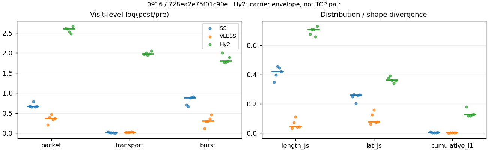
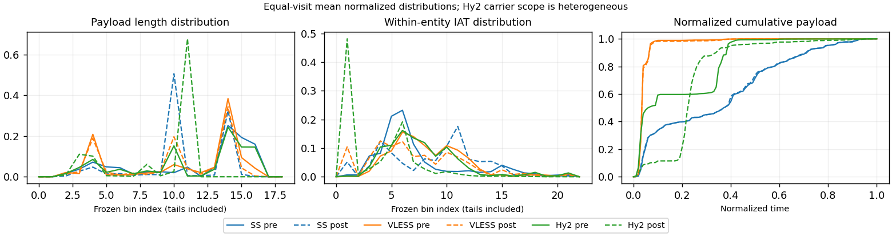

# 0916 · 条目 002 · youtube.com

目标：https://www.youtube.com/watch?v=aqz-KE-bpKQ

活动标签：youtube.com::video_playback。选定访问 15 次。

[返回总索引](../../README.md) · [统计口径](../../methods.md)

## 覆盖与资格（每次访问均保留）

| 部署 | 重复 | 主请求路由 | 活动状态 | 代理比较 | DIRECT pre | 请求 proxy/direct/unresolved | 错误 |
| --- | --- | --- | --- | --- | --- | --- | --- |
| Hy2 | 1 | proxy | passed | 1 | 1 | 195/1/0 | [] |
| Hy2 | 2 | proxy | passed | 1 | 1 | 208/1/0 | [] |
| Hy2 | 3 | proxy | passed | 1 | 1 | 220/1/0 | [] |
| Hy2 | 4 | proxy | passed | 1 | 1 | 221/1/0 | [] |
| Hy2 | 5 | proxy | passed | 1 | 1 | 209/1/0 | [] |
| SS | 1 | proxy | passed | 1 | 0 | 225/0/0 | [] |
| SS | 2 | proxy | passed | 1 | 0 | 227/0/0 | [] |
| SS | 3 | proxy | passed | 1 | 0 | 233/0/0 | [] |
| SS | 4 | proxy | passed | 1 | 0 | 231/0/0 | [] |
| SS | 5 | proxy | passed | 1 | 0 | 232/0/0 | [] |
| VLESS | 1 | proxy | passed | 1 | 0 | 227/0/0 | [] |
| VLESS | 2 | proxy | passed | 1 | 0 | 231/0/0 | [] |
| VLESS | 3 | proxy | passed | 1 | 0 | 239/0/0 | [] |
| VLESS | 4 | proxy | passed | 1 | 0 | 236/0/0 | [] |
| VLESS | 5 | proxy | passed | 1 | 0 | 226/0/0 | [] |

主请求非 proxy 的统计仅解释为已索引的辅助代理连接或 DIRECT 观测，不代表目标业务经代理传输。播放确认与配对资格是两道不同的门。

图中散点为单次访问，短线为重复中位数；Hy2 是共享载体包络，不能与 TCP 配对作等范围因果对比。

形态图先逐访问归一化，再对访问等权平均；实线 pre，虚线 post。分箱序号及边界见 methods，不将分箱索引误解为长度或时间。

## 每次访问的关键观测

### SS

范围：`exclusive_page`。每格 pre → post；空值为不可观测/不适用。

| 重复 | 包数 | 载荷字节 | burst | TCP FR | IAT中位µs | length JS | IAT JS |
| --- | --- | --- | --- | --- | --- | --- | --- |
| 1 | 6667 → 13052 | 1.3589e+07 → 1.3985e+07 | 4500 → 9102 | 284 → 298 | 20.977 → 134.96 | 0.34786 | 0.24978 |
| 2 | 6960 → 13470 | 1.4257e+07 → 1.4384e+07 | 4958 → 9651 | 272 → 285 | 24.199 → 206.53 | 0.39873 | 0.26416 |
| 3 | 3876 → 8533 | 8.6933e+06 → 8.7914e+06 | 2871 → 6937 | 280 → 333 | 49.683 → 574 | 0.45573 | 0.20215 |
| 4 | 4967 → 9609 | 8.6132e+06 → 8.7026e+06 | 3377 → 8322 | 271 → 281 | 34.142 → 984.7 | 0.44752 | 0.25799 |
| 5 | 4450 → 8701 | 8.055e+06 → 8.1232e+06 | 3034 → 7530 | 271 → 291 | 36.078 → 1018.3 | 0.41999 | 0.26042 |

完整标量统计：中位数 [min,max]；Δ 为重复内逐访问变换的中位数，MAD 未缩放。n 为可用变换数；DIRECT-only 的 nΔ=0 不代表 pre 不可用。

| scope | 特征 | pre | post | Δ | IQRΔ | MADΔ | nΔ |
| --- | --- | --- | --- | --- | --- | --- | --- |
| exclusive_page | active_span_sum_s_1000ms | 58.817 [45.275, 66.398] | 72.489 [55.571, 80.978] | 0.19851 | 0.015212 | 0.010506 | 5 |
| exclusive_page | active_span_sum_s_100ms | 19.2 [12.244, 25.165] | 33.981 [24.219, 45.594] | 0.57752 | 0.023412 | 0.016788 | 5 |
| exclusive_page | active_span_sum_s_500ms | 42.997 [36.513, 54.234] | 55.1 [48.309, 67.996] | 0.27994 | 0.051802 | 0.03193 | 5 |
| exclusive_page | burst_bytes_iqr | 4112 [4096, 5108] | 2856 [1428, 2856] | -0.58139 | 0.61064 | 0.2208 | 5 |
| exclusive_page | burst_bytes_mad | 39 [39, 39] | 60 [34, 65] | 0.43078 | 0.44629 | 0.080043 | 5 |
| exclusive_page | burst_bytes_max | 22944 [20480, 28672] | 19992 [8651, 35700] | -0.36059 | 0.73404 | 0.62868 | 5 |
| exclusive_page | burst_bytes_mean | 2875.5 [2550.5, 3028] | 1267.3 [1045.7, 1536.4] | -0.87099 | 0.21584 | 0.029598 | 5 |
| exclusive_page | burst_bytes_median | 39 [39, 39] | 60 [34, 65] | 0.43078 | 0.44629 | 0.080043 | 5 |
| exclusive_page | burst_bytes_min | 0 [0, 0] | 0 [0, 0] | — | — | — | 0 |
| exclusive_page | burst_bytes_p95 | 14480 [11584, 15968] | 4284 [2856, 5712] | -1.3157 | 0.47 | 0.1435 | 5 |
| exclusive_page | burst_bytes_q25 | 0 [0, 0] | 0 [0, 0] | — | — | — | 0 |
| exclusive_page | burst_bytes_q75 | 4112 [4096, 5108] | 2856 [1428, 2856] | -0.58139 | 0.61064 | 0.2208 | 5 |
| exclusive_page | burst_bytes_std | 4845.2 [4238.5, 4955.3] | 1817.5 [1270.3, 2250.9] | -1.003 | 0.40049 | 0.20194 | 5 |
| exclusive_page | burst_count | 3377 [2871, 4958] | 8322 [6937, 9651] | 0.88221 | 0.1975 | 0.026804 | 5 |
| exclusive_page | burst_duration_ms_iqr | 0.014581 [0, 0.025931] | 0 [0, 5.2e-05] | -5.6362 | — | — | 1 |
| exclusive_page | burst_duration_ms_mad | 0 [0, 0] | 0 [0, 0] | — | — | — | 0 |
| exclusive_page | burst_duration_ms_max | 15001 [15001, 15001] | 15411 [15036, 45775] | 0.02694 | 0.32721 | 0.024619 | 5 |
| exclusive_page | burst_duration_ms_mean | 79.207 [75.378, 95.869] | 20.205 [16.885, 28.495] | -1.3166 | 0.24984 | 0.10335 | 5 |
| exclusive_page | burst_duration_ms_median | 0 [0, 0] | 0 [0, 0] | — | — | — | 0 |
| exclusive_page | burst_duration_ms_min | 0 [0, 0] | 0 [0, 0] | — | — | — | 0 |
| exclusive_page | burst_duration_ms_p95 | 26.428 [3.0325, 50.12] | 0.9544 [0.82718, 1.0183] | -3.2612 | 1.8738 | 0.6351 | 5 |
| exclusive_page | burst_duration_ms_q25 | 0 [0, 0] | 0 [0, 0] | — | — | — | 0 |
| exclusive_page | burst_duration_ms_q75 | 0.014581 [0, 0.025931] | 0 [0, 5.2e-05] | -5.6362 | — | — | 1 |
| exclusive_page | burst_duration_ms_std | 907.66 [830.03, 1001.5] | 424.65 [350.6, 794.59] | -0.73491 | 0.28109 | 0.17336 | 5 |
| exclusive_page | burst_packets_iqr | 1 [0, 1] | 0 [0, 1] | 0 | — | — | 1 |
| exclusive_page | burst_packets_mad | 0 [0, 0] | 0 [0, 0] | — | — | — | 0 |
| exclusive_page | burst_packets_max | 17 [12, 22] | 10 [8, 14] | -0.69315 | 0.060625 | 0.060625 | 5 |
| exclusive_page | burst_packets_mean | 1.4667 [1.3501, 1.4816] | 1.2301 [1.1547, 1.434] | -0.093072 | 0.20583 | 0.087298 | 5 |
| exclusive_page | burst_packets_median | 1 [1, 1] | 1 [1, 1] | 0 | 0 | 0 | 5 |
| exclusive_page | burst_packets_min | 1 [1, 1] | 1 [1, 1] | 0 | 0 | 0 | 5 |
| exclusive_page | burst_packets_p95 | 3 [3, 3] | 2 [2, 3] | -0.40547 | 0.40547 | 0 | 5 |
| exclusive_page | burst_packets_q25 | 1 [1, 1] | 1 [1, 1] | 0 | 0 | 0 | 5 |
| exclusive_page | burst_packets_q75 | 2 [1, 2] | 1 [1, 2] | -0.69315 | 0.69315 | 0 | 5 |
| exclusive_page | burst_packets_std | 0.98964 [0.77022, 1.0265] | 0.61863 [0.5103, 0.86573] | -0.21917 | 0.46972 | 0.097209 | 5 |
| exclusive_page | connection_span_concurrency_max | 12 [10, 17] | 11 [10, 13] | -0.074108 | 0.087011 | 0.074108 | 5 |
| exclusive_page | cumulative_l1 | — | — | 0.0033171 | 0.004023 | 0.0017496 | 5 |
| exclusive_page | cumulative_max | — | — | 0.062689 | 0.06322 | 0.034036 | 5 |
| exclusive_page | direction_entropy | 0.56918 [0.44399, 0.6803] | 0.38282 [0.2925, 0.42364] | -0.18636 | 0.059301 | 0.034861 | 5 |
| exclusive_page | down_burst_count | 1676 [1423, 2465] | 4149 [3456, 4815] | 0.88734 | 0.19979 | 0.025889 | 5 |
| exclusive_page | down_ip_bytes | 8.6519e+06 [8.0574e+06, 1.4281e+07] | 8.8261e+06 [8.1992e+06, 1.4571e+07] | 0.019933 | 0.00032991 | 0.00017114 | 5 |
| exclusive_page | down_packets | 3015 [2198, 4207] | 5052 [4573, 7912] | 0.59121 | 0.096532 | 0.056114 | 5 |
| exclusive_page | down_transport_bytes | 8.5374e+06 [7.9179e+06, 1.4062e+07] | 8.5811e+06 [7.9609e+06, 1.4159e+07] | 0.0068797 | 0.0023351 | 0.0014661 | 5 |
| exclusive_page | duration_s | 63.215 [62.614, 63.571] | 63.57 [62.9, 63.786] | 0.0038692 | 0.0045611 | 0.0038802 | 5 |
| exclusive_page | entity_count | 25 [20, 28] | 25 [20, 28] | 0 | 0 | 0 | 5 |
| exclusive_page | fr_runs | 272 [271, 284] | 291 [281, 333] | 0.048119 | 0.024517 | 0.011883 | 5 |
| exclusive_page | fr_runs_per_packet | 0.091461 [0.065526, 0.12897] | 0.055012 [0.035759, 0.070179] | -0.03645 | 0.0092463 | 0.0066823 | 5 |
| exclusive_page | fr_switches | 249 [244, 264] | 269 [256, 308] | 0.051908 | 0.025586 | 0.012062 | 5 |
| exclusive_page | fr_switches_per_possible_transition | 0.08373 [0.05918, 0.11883] | 0.050364 [0.03236, 0.065254] | -0.033366 | 0.008508 | 0.0058758 | 5 |
| exclusive_page | full_retransmission_fraction | 0.0017978 [0.0011494, 0.002064] | 0.0068958 [0.0047513, 0.014021] | 0.005098 | 0.0061705 | 0.0017201 | 5 |
| exclusive_page | full_retransmission_packets | 8 [7, 12] | 64 [46, 183] | 2.0794 | 0.52078 | 0.19671 | 5 |
| exclusive_page | iat_count | 4942 [3851, 6932] | 9584 [8508, 13442] | 0.67296 | 0.010917 | 0.010633 | 5 |
| exclusive_page | iat_js | — | — | 0.25799 | 0.010645 | 0.0061696 | 5 |
| exclusive_page | iat_ks | — | — | 0.38969 | 0.062289 | 0.044548 | 5 |
| exclusive_page | iat_median_us | 34.142 [20.977, 49.683] | 574 [134.96, 1018.3] | 2.447 | 1.1961 | 0.58541 | 5 |
| exclusive_page | iat_us_iqr | 178.67 [49.09, 856.01] | 3198.3 [1018, 5542.5] | 2.8849 | 0.23127 | 0.14705 | 5 |
| exclusive_page | iat_us_mad | 25.816 [14.473, 40.529] | 566 [134.9, 997.72] | 2.6366 | 1.1362 | 0.40433 | 5 |
| exclusive_page | iat_us_max | 1.5001e+07 [1.5001e+07, 1.5001e+07] | 1.5415e+07 [1.5368e+07, 1.5462e+07] | 0.027206 | 0.0021681 | 0.0018917 | 5 |
| exclusive_page | iat_us_mean | 1.1544e+05 [87752, 1.397e+05] | 51227 [37457, 68928] | -0.73082 | 0.083896 | 0.059344 | 5 |
| exclusive_page | iat_us_median | 34.142 [20.977, 49.683] | 574 [134.96, 1018.3] | 2.447 | 1.1961 | 0.58541 | 5 |
| exclusive_page | iat_us_min | 0.013 [0.002, 0.042] | 0.033 [0.03, 0.038] | 1.0726 | 2.4105 | 1.4091 | 5 |
| exclusive_page | iat_us_p95 | 94297 [34530, 1.0355e+05] | 30546 [10083, 31550] | -1.2208 | 0.078031 | 0.067875 | 5 |
| exclusive_page | iat_us_q25 | 14.072 [11.472, 17.823] | 12.033 [6.4238, 32.627] | -0.23358 | 0.73597 | 0.34633 | 5 |
| exclusive_page | iat_us_q75 | 194.39 [60.562, 873.84] | 3230.9 [1024.4, 5562.3] | 2.8107 | 0.19555 | 0.17804 | 5 |
| exclusive_page | iat_us_std | 1.0568e+06 [9.8494e+05, 1.2498e+06] | 7.0555e+05 [5.9849e+05, 8.7355e+05] | -0.39945 | 0.046259 | 0.041305 | 5 |
| exclusive_page | iat_wasserstein_log1p_us | — | — | 1.4966 | 0.2769 | 0.22906 | 5 |
| exclusive_page | idle_gap_count_1000ms | 66 [55, 86] | 64 [54, 75] | -0.018349 | 0.030772 | 0.018349 | 5 |
| exclusive_page | idle_gap_count_100ms | 197 [187, 247] | 179 [173, 198] | -0.084707 | 0.1013 | 0.060319 | 5 |
| exclusive_page | idle_gap_count_500ms | 84 [79, 97] | 80 [73, 92] | -0.065383 | 0.15129 | 0.076312 | 5 |
| exclusive_page | idle_gap_sum_s_1000ms | 537.51 [392.11, 754.92] | 445.23 [372.11, 583.42] | -0.070346 | 0.067431 | 0.035301 | 5 |
| exclusive_page | idle_gap_sum_s_100ms | 571.04 [436.25, 785.29] | 476.94 [410.62, 615.01] | -0.078492 | 0.067958 | 0.050694 | 5 |
| exclusive_page | idle_gap_sum_s_500ms | 546.77 [410.96, 762.5] | 452.62 [389.5, 595.16] | -0.066608 | 0.046172 | 0.027849 | 5 |
| exclusive_page | ip_bytes | 8.8954e+06 [8.2868e+06, 1.4619e+07] | 9.291e+06 [8.6519e+06, 1.521e+07] | 0.043522 | 0.0014784 | 0.0010671 | 5 |
| exclusive_page | length_iqr | 3320 [3104, 7351] | 1428 [1428, 1428] | -0.84369 | 0.079619 | 0.064444 | 5 |
| exclusive_page | length_js | — | — | 0.41999 | 0.048786 | 0.027521 | 5 |
| exclusive_page | length_ks | — | — | 0.53342 | 0.014217 | 0.010405 | 5 |
| exclusive_page | length_mad | 1656 [1479, 2890] | 54 [0, 321.5] | -2.4801 | 0.94853 | 0.9431 | 3 |
| exclusive_page | length_max | 8920 [8920, 8920] | 14280 [4284, 14280] | 0.47056 | 1.204 | 0 | 5 |
| exclusive_page | length_mean | 3294.4 [2906.9, 4004.3] | 1804.8 [1703.7, 1852.8] | -0.57845 | 0.096678 | 0.044177 | 5 |
| exclusive_page | length_median | 2896 [2896, 3008] | 1428 [1428, 1428] | -0.70706 | 0 | 0 | 5 |
| exclusive_page | length_min | 24 [8, 31] | 6 [6, 12] | -1.3863 | 1.4069 | 0.25593 | 5 |
| exclusive_page | length_p95 | 8192 [8192, 8920] | 2856 [2856, 2856] | -1.0537 | 0 | 0 | 5 |
| exclusive_page | length_q25 | 841 [555, 1240] | 1428 [1428, 1428] | 0.52944 | 0.40627 | 0.38827 | 5 |
| exclusive_page | length_q75 | 4344 [4096, 8192] | 2856 [2856, 2856] | -0.41937 | 0.10731 | 0.058785 | 5 |
| exclusive_page | length_std | 2669.3 [2530.7, 3280.5] | 1060 [814.9, 1086.9] | -1.0935 | 0.17896 | 0.039723 | 5 |
| exclusive_page | length_wasserstein_bytes | — | — | 1650.5 | 213.11 | 58.6 | 5 |
| exclusive_page | nonempty_entity_count | 25 [20, 28] | 25 [20, 28] | 0 | 0 | 0 | 5 |
| exclusive_page | nonempty_packets | 2963 [2171, 4151] | 5108 [4643, 7970] | 0.60713 | 0.097179 | 0.05197 | 5 |
| exclusive_page | offload_suspect_fraction | 0.37608 [0.36017, 0.42178] | 0.20813 [0.15236, 0.22426] | -0.19752 | 0.013284 | 0.012811 | 5 |
| exclusive_page | packet_count | 4967 [3876, 6960] | 9609 [8533, 13470] | 0.67053 | 0.011486 | 0.010248 | 5 |
| exclusive_page | rtt_median_ms | 0.055891 [0.033531, 0.058305] | 32.882 [21.164, 36.72] | 6.3711 | 0.51814 | 0.47245 | 5 |
| exclusive_page | rtt_sample_count | 1886 [1630, 2690] | 1274 [1051, 1586] | -0.33009 | 0.57414 | 0.26088 | 5 |
| exclusive_page | tcp_ack_count | 4940 [3851, 6912] | 9575 [8502, 13432] | 0.67191 | 0.0087079 | 0.0075302 | 5 |
| exclusive_page | tcp_fin_count | 50 [40, 56] | 52 [43, 62] | 0.10178 | 0.041008 | 0.029462 | 5 |
| exclusive_page | tcp_packet_count | 4967 [3876, 6960] | 9609 [8533, 13470] | 0.67053 | 0.011486 | 0.010248 | 5 |
| exclusive_page | tcp_rst_count | 2 [0, 20] | 1 [0, 4] | -0.69315 | 0.45815 | 0 | 3 |
| exclusive_page | tcp_syn_count | 50 [40, 56] | 57 [43, 63] | 0.11778 | 0.068993 | 0.045462 | 5 |
| exclusive_page | tcp_window_raw_median | 65535 [65535, 65535] | 164 [152, 166] | -5.9905 | 0.055742 | 0.012121 | 5 |
| exclusive_page | transition_entropy | 0.35299 [0.26557, 0.46212] | 0.22858 [0.16091, 0.27877] | -0.12441 | 0.028997 | 0.018909 | 5 |
| exclusive_page | transition_n_mm | 2435 [1646, 3642] | 4592 [4145, 7428] | 0.66887 | 0.053028 | 0.034497 | 5 |
| exclusive_page | transition_n_mp | 120 [116, 128] | 130 [121, 148] | 0.057629 | 0.026798 | 0.015429 | 5 |
| exclusive_page | transition_n_pm | 130 [126, 136] | 139 [132, 160] | 0.05019 | 0.028142 | 0.012449 | 5 |
| exclusive_page | transition_n_pp | 251 [237, 257] | 236 [207, 274] | -0.037426 | 0.15744 | 0.10538 | 5 |
| exclusive_page | transition_p_mm | 0.95453 [0.93152, 0.96862] | 0.97433 [0.96577, 0.98345] | 0.019799 | 0.0070702 | 0.0042513 | 5 |
| exclusive_page | transition_p_mp | 0.045472 [0.031383, 0.068478] | 0.025674 [0.01655, 0.034228] | -0.019799 | 0.0070702 | 0.0042513 | 5 |
| exclusive_page | transition_p_pm | 0.34694 [0.33592, 0.35356] | 0.36486 [0.33933, 0.40404] | 0.028948 | 0.054492 | 0.032961 | 5 |
| exclusive_page | transition_p_pp | 0.65306 [0.64644, 0.66408] | 0.63514 [0.59596, 0.66067] | -0.028948 | 0.054492 | 0.032961 | 5 |
| exclusive_page | transport_bytes | 8.6933e+06 [8.055e+06, 1.4257e+07] | 8.7914e+06 [8.1232e+06, 1.4384e+07] | 0.010336 | 0.0022931 | 0.0014099 | 5 |
| exclusive_page | up_burst_count | 1701 [1448, 2493] | 4173 [3481, 4836] | 0.87714 | 0.19524 | 0.027694 | 5 |
| exclusive_page | up_byte_fraction | 0.017015 [0.013649, 0.018188] | 0.019972 [0.015665, 0.023919] | 0.0029568 | 0.00098502 | 0.00056545 | 5 |
| exclusive_page | up_ip_bytes | 2.5842e+05 [2.2945e+05, 3.3782e+05] | 4.9095e+05 [4.5264e+05, 6.7196e+05] | 0.64697 | 0.037682 | 0.0090493 | 5 |
| exclusive_page | up_packets | 1952 [1678, 2753] | 4557 [3864, 5569] | 0.8341 | 0.054314 | 0.01371 | 5 |
| exclusive_page | up_transport_bytes | 1.5666e+05 [1.3706e+05, 1.993e+05] | 2.1028e+05 [1.6224e+05, 2.5435e+05] | 0.16865 | 0.097192 | 0.027725 | 5 |
| exclusive_page | zero_iat_count | 0 [0, 0] | 0 [0, 0] | — | — | — | 0 |
| exclusive_page | zero_iat_fraction | 0 [0, 0] | 0 [0, 0] | 0 | 0 | 0 | 5 |

### VLESS

范围：`exclusive_page`。每格 pre → post；空值为不可观测/不适用。

| 重复 | 包数 | 载荷字节 | burst | TCP FR | IAT中位µs | length JS | IAT JS |
| --- | --- | --- | --- | --- | --- | --- | --- |
| 1 | 3744 → 4629 | 4.5482e+06 → 4.6728e+06 | 2978 → 3360 | 150 → 186 | 104.19 → 65.392 | 0.03232 | 0.060121 |
| 2 | 2931 → 4374 | 4.4737e+06 → 4.5956e+06 | 2130 → 2862 | 130 → 160 | 67.699 → 22.569 | 0.071701 | 0.12434 |
| 3 | 3546 → 5703 | 4.6278e+06 → 4.7415e+06 | 2672 → 3612 | 134 → 166 | 140.15 → 18.745 | 0.10944 | 0.15883 |
| 4 | 2717 → 3823 | 3.803e+06 → 3.9183e+06 | 1884 → 2706 | 146 → 180 | 136.24 → 52.749 | 0.041787 | 0.07363 |
| 5 | 3430 → 4951 | 4.4822e+06 → 4.6045e+06 | 2291 → 3624 | 132 → 166 | 133.16 → 49.02 | 0.044139 | 0.076096 |

完整标量统计：中位数 [min,max]；Δ 为重复内逐访问变换的中位数，MAD 未缩放。n 为可用变换数；DIRECT-only 的 nΔ=0 不代表 pre 不可用。

| scope | 特征 | pre | post | Δ | IQRΔ | MADΔ | nΔ |
| --- | --- | --- | --- | --- | --- | --- | --- |
| exclusive_page | active_span_sum_s_1000ms | 22.901 [21.487, 28.34] | 24.542 [22.973, 26.543] | 0.052398 | 0.048948 | 0.034456 | 5 |
| exclusive_page | active_span_sum_s_100ms | 3.4997 [2.854, 3.9038] | 9.8663 [9.4072, 11.501] | 1.0716 | 0.047245 | 0.038392 | 5 |
| exclusive_page | active_span_sum_s_500ms | 11.267 [10.985, 13.603] | 22.973 [22.841, 26.543] | 0.70674 | 0.065093 | 0.03108 | 5 |
| exclusive_page | burst_bytes_iqr | 2860 [2824, 2896] | 2824 [2824, 2824] | -0.012667 | 0.025176 | 0.012509 | 5 |
| exclusive_page | burst_bytes_mad | 24 [0, 24] | 39 [31, 53] | 0.79224 | 0.19339 | 0 | 3 |
| exclusive_page | burst_bytes_max | 22344 [20480, 29340] | 27512 [11656, 71936] | 0.16352 | 0.84461 | 0.73638 | 5 |
| exclusive_page | burst_bytes_mean | 1956.5 [1527.3, 2100.3] | 1390.7 [1270.6, 1605.7] | -0.27718 | 0.063685 | 0.055023 | 5 |
| exclusive_page | burst_bytes_median | 24 [0, 24] | 39 [31, 53] | 0.79224 | 0.19339 | 0 | 3 |
| exclusive_page | burst_bytes_min | 0 [0, 0] | 0 [0, 0] | — | — | — | 0 |
| exclusive_page | burst_bytes_p95 | 8688 [5864, 11744] | 4522 [4292.4, 5756] | -0.69315 | 0.1203 | 0.019953 | 5 |
| exclusive_page | burst_bytes_q25 | 0 [0, 0] | 0 [0, 0] | — | — | — | 0 |
| exclusive_page | burst_bytes_q75 | 2860 [2824, 2896] | 2824 [2824, 2824] | -0.012667 | 0.025176 | 0.012509 | 5 |
| exclusive_page | burst_bytes_std | 3095.4 [2845.6, 4103.3] | 2145 [1682.5, 2902.3] | -0.50038 | 0.1689 | 0.10319 | 5 |
| exclusive_page | burst_count | 2291 [1884, 2978] | 3360 [2706, 3624] | 0.30143 | 0.066676 | 0.06064 | 5 |
| exclusive_page | burst_duration_ms_iqr | 0.048465 [0, 0.37222] | 0.00010375 [0, 0.003738] | -5.8614 | 3.5652 | 2.1777 | 4 |
| exclusive_page | burst_duration_ms_mad | 0 [0, 0] | 0 [0, 0] | — | — | — | 0 |
| exclusive_page | burst_duration_ms_max | 15001 [15001, 15001] | 15009 [1260.7, 15061] | 0.0005203 | 2.3062 | 0.0034519 | 5 |
| exclusive_page | burst_duration_ms_mean | 87.593 [52.34, 125.23] | 8.9239 [4.8823, 15.163] | -2.284 | 0.61832 | 0.44568 | 5 |
| exclusive_page | burst_duration_ms_median | 0 [0, 0] | 0 [0, 0] | — | — | — | 0 |
| exclusive_page | burst_duration_ms_min | 0 [0, 0] | 0 [0, 0] | — | — | — | 0 |
| exclusive_page | burst_duration_ms_p95 | 7.8458 [3.9135, 9.3394] | 4.4817 [3.0683, 7.8791] | -0.17003 | 0.31515 | 0.26804 | 5 |
| exclusive_page | burst_duration_ms_q25 | 0 [0, 0] | 0 [0, 0] | — | — | — | 0 |
| exclusive_page | burst_duration_ms_q75 | 0.048465 [0, 0.37222] | 0.00010375 [0, 0.003738] | -5.8614 | 3.5652 | 2.1777 | 4 |
| exclusive_page | burst_duration_ms_std | 1024.3 [781.7, 1219.2] | 252.49 [39.442, 342.47] | -1.4004 | 1.8533 | 0.31193 | 5 |
| exclusive_page | burst_packets_iqr | 1 [0, 1] | 1 [0, 1] | 0 | 0 | 0 | 4 |
| exclusive_page | burst_packets_mad | 0 [0, 0] | 0 [0, 0] | — | — | — | 0 |
| exclusive_page | burst_packets_max | 7 [6, 10] | 10 [7, 30] | 0.15415 | 0.69315 | 0.15415 | 5 |
| exclusive_page | burst_packets_mean | 1.3761 [1.2572, 1.4972] | 1.4128 [1.3662, 1.5789] | 0.091497 | 0.1255 | 0.082241 | 5 |
| exclusive_page | burst_packets_median | 1 [1, 1] | 1 [1, 1] | 0 | 0 | 0 | 5 |
| exclusive_page | burst_packets_min | 1 [1, 1] | 1 [1, 1] | 0 | 0 | 0 | 5 |
| exclusive_page | burst_packets_p95 | 2 [2, 3] | 3 [3, 3] | 0.40547 | 0.40547 | 0 | 5 |
| exclusive_page | burst_packets_q25 | 1 [1, 1] | 1 [1, 1] | 0 | 0 | 0 | 5 |
| exclusive_page | burst_packets_q75 | 2 [1, 2] | 2 [1, 2] | 0 | 0 | 0 | 5 |
| exclusive_page | burst_packets_std | 0.65761 [0.56747, 0.70436] | 0.88085 [0.769, 1.1108] | 0.40508 | 0.25418 | 0.072184 | 5 |
| exclusive_page | connection_span_concurrency_max | 10 [9, 11] | 10 [9, 11] | 0 | 0 | 0 | 5 |
| exclusive_page | cumulative_l1 | — | — | 0.0027222 | 0.00018073 | 0.00014425 | 5 |
| exclusive_page | cumulative_max | — | — | 0.028176 | 0.0057746 | 0.0017678 | 5 |
| exclusive_page | direction_entropy | 0.37016 [0.30065, 0.40375] | 0.31697 [0.27437, 0.38037] | -0.02338 | 0.039422 | 0.029811 | 5 |
| exclusive_page | down_burst_count | 1137 [934, 1480] | 1671 [1345, 1804] | 0.303 | 0.06734 | 0.061672 | 5 |
| exclusive_page | down_ip_bytes | 4.5411e+06 [3.838e+06, 4.6839e+06] | 4.6614e+06 [3.9501e+06, 4.8239e+06] | 0.028789 | 0.0026763 | 0.00066216 | 5 |
| exclusive_page | down_packets | 2124 [1683, 2206] | 2635 [2169, 3217] | 0.25369 | 0.12851 | 0.046078 | 5 |
| exclusive_page | down_transport_bytes | 4.4263e+06 [3.7503e+06, 4.5733e+06] | 4.5166e+06 [3.8372e+06, 4.6564e+06] | 0.020188 | 0.00087129 | 0.00056325 | 5 |
| exclusive_page | duration_s | 62.809 [60.635, 63.456] | 62.787 [60.592, 63.424] | -0.00035387 | 0.00014386 | 9.3629e-05 | 5 |
| exclusive_page | entity_count | 16 [16, 18] | 16 [16, 18] | 0 | 0 | 0 | 5 |
| exclusive_page | fr_runs | 134 [130, 150] | 166 [160, 186] | 0.21415 | 0.0057612 | 0.0047978 | 5 |
| exclusive_page | fr_runs_per_packet | 0.072816 [0.061827, 0.090347] | 0.064205 [0.052582, 0.085837] | -0.0045096 | 0.010388 | 0.0045496 | 5 |
| exclusive_page | fr_switches | 118 [114, 132] | 150 [144, 168] | 0.23995 | 0.0075472 | 0.0063358 | 5 |
| exclusive_page | fr_switches_per_possible_transition | 0.064643 [0.054297, 0.08125] | 0.058158 [0.047755, 0.078808] | -0.0024417 | 0.0094032 | 0.0040714 | 5 |
| exclusive_page | full_retransmission_fraction | 0.0011042 [0.00068236, 0.0018697] | 0 [0, 0] | -0.0011042 | 0.00032016 | 0.00025814 | 5 |
| exclusive_page | full_retransmission_packets | 3 [2, 7] | 0 [0, 0] | — | — | — | 0 |
| exclusive_page | iat_count | 3413 [2701, 3726] | 4611 [3807, 5687] | 0.36856 | 0.058924 | 0.033585 | 5 |
| exclusive_page | iat_js | — | — | 0.076096 | 0.050707 | 0.015974 | 5 |
| exclusive_page | iat_ks | — | — | 0.19872 | 0.094363 | 0.057894 | 5 |
| exclusive_page | iat_median_us | 133.16 [67.699, 140.15] | 49.02 [18.745, 65.392] | -0.99936 | 0.14963 | 0.099156 | 5 |
| exclusive_page | iat_us_iqr | 839.86 [816.61, 944.49] | 724.25 [525.43, 843.09] | -0.1481 | 0.2621 | 0.16774 | 5 |
| exclusive_page | iat_us_mad | 122.78 [59.09, 132.38] | 48.874 [18.7, 61.865] | -0.92116 | 0.10658 | 0.061443 | 5 |
| exclusive_page | iat_us_max | 1.5001e+07 [1.5001e+07, 1.5001e+07] | 1.5443e+07 [1.541e+07, 1.5455e+07] | 0.029021 | 0.0016757 | 0.00080902 | 5 |
| exclusive_page | iat_us_mean | 1.3964e+05 [1.1263e+05, 2.1003e+05] | 95413 [69881, 1.4887e+05] | -0.36985 | 0.058509 | 0.032816 | 5 |
| exclusive_page | iat_us_median | 133.16 [67.699, 140.15] | 49.02 [18.745, 65.392] | -0.99936 | 0.14963 | 0.099156 | 5 |
| exclusive_page | iat_us_min | 0.179 [0.073, 0.485] | 0.033 [0.032, 0.034] | -1.661 | 0.32079 | 0.29819 | 5 |
| exclusive_page | iat_us_p95 | 9611.4 [8176, 10551] | 39079 [9577, 43522] | 1.4027 | 0.1753 | 0.059761 | 5 |
| exclusive_page | iat_us_q25 | 31.518 [21.892, 32.281] | 8.7338 [4.783, 15.998] | -1.3073 | 0.4661 | 0.33267 | 5 |
| exclusive_page | iat_us_q75 | 872.14 [847.34, 966.39] | 732.98 [530.62, 859.09] | -0.17383 | 0.26772 | 0.17463 | 5 |
| exclusive_page | iat_us_std | 1.3503e+06 [1.201e+06, 1.6585e+06] | 1.13e+06 [9.5384e+05, 1.4126e+06] | -0.1781 | 0.032174 | 0.017626 | 5 |
| exclusive_page | iat_wasserstein_log1p_us | — | — | 0.87451 | 0.26421 | 0.21609 | 5 |
| exclusive_page | idle_gap_count_1000ms | 38 [33, 49] | 36 [32, 43] | -0.058841 | 0.036905 | 0.028069 | 5 |
| exclusive_page | idle_gap_count_100ms | 94 [88, 119] | 109 [104, 124] | 0.14805 | 0.063088 | 0.019001 | 5 |
| exclusive_page | idle_gap_count_500ms | 56 [51, 71] | 37 [33, 44] | -0.41494 | 0.020884 | 0.020374 | 5 |
| exclusive_page | idle_gap_sum_s_1000ms | 448.48 [373.29, 553.3] | 446.63 [372.67, 554.47] | -0.0041142 | 0.0027418 | 0.0014446 | 5 |
| exclusive_page | idle_gap_sum_s_100ms | 467.88 [394.03, 577.74] | 460.93 [387.55, 569.51] | -0.014953 | 0.0022372 | 0.0016245 | 5 |
| exclusive_page | idle_gap_sum_s_500ms | 460.24 [386.33, 568.04] | 447.57 [374.57, 554.47] | -0.027914 | 0.0067361 | 0.0033777 | 5 |
| exclusive_page | ip_bytes | 4.6605e+06 [3.9442e+06, 4.8122e+06] | 4.8655e+06 [4.1191e+06, 5.049e+06] | 0.043031 | 0.0010362 | 0.00068514 | 5 |
| exclusive_page | length_iqr | 2580.5 [2511.8, 2732.2] | 2572 [2165, 2680] | -0.019309 | 0.071322 | 0.016009 | 5 |
| exclusive_page | length_js | — | — | 0.044139 | 0.029914 | 0.011819 | 5 |
| exclusive_page | length_ks | — | — | 0.14259 | 0.041279 | 0.034663 | 5 |
| exclusive_page | length_mad | 1228 [721, 1412] | 1340 [1298, 1376] | 0.087283 | 0.32747 | 0.11311 | 5 |
| exclusive_page | length_max | 8920 [8920, 8920] | 11584 [7384, 16944] | 0.26133 | 0.11778 | 0.11778 | 5 |
| exclusive_page | length_mean | 2242.2 [2099.4, 2587.5] | 1830.3 [1501.9, 1868.5] | -0.23068 | 0.12672 | 0.043151 | 5 |
| exclusive_page | length_median | 2640 [2103, 2824] | 1448 [1412, 1484] | -0.57604 | 0.14924 | 0.091933 | 5 |
| exclusive_page | length_min | 24 [24, 24] | 7 [1, 11] | -1.2321 | 0.60614 | 0.45199 | 5 |
| exclusive_page | length_p95 | 7213 [5792, 8920] | 4236 [2896, 4344] | -0.64462 | 0.23385 | 0.13379 | 5 |
| exclusive_page | length_q25 | 315.5 [91.75, 384.25] | 252 [144, 659] | 0.29675 | 0.26842 | 0.154 | 5 |
| exclusive_page | length_q75 | 2896 [2824, 2896] | 2824 [2824, 2824] | -0.025176 | 0.025176 | 0 | 5 |
| exclusive_page | length_std | 2072.4 [1816.7, 2438.6] | 1519.4 [1108.6, 1543] | -0.34767 | 0.1732 | 0.087173 | 5 |
| exclusive_page | length_wasserstein_bytes | — | — | 502.88 | 321.17 | 92.029 | 5 |
| exclusive_page | nonempty_entity_count | 16 [16, 18] | 16 [16, 18] | 0 | 0 | 0 | 5 |
| exclusive_page | nonempty_packets | 2060 [1616, 2135] | 2553 [2097, 3157] | 0.26055 | 0.12669 | 0.045991 | 5 |
| exclusive_page | offload_suspect_fraction | 0.35415 [0.31891, 0.36443] | 0.26726 [0.18972, 0.27717] | -0.086884 | 0.035396 | 0.035374 | 5 |
| exclusive_page | packet_count | 3430 [2717, 3744] | 4629 [3823, 5703] | 0.36703 | 0.058827 | 0.033305 | 5 |
| exclusive_page | rtt_median_ms | 0.086395 [0.061862, 0.22848] | 0.041597 [0.029682, 0.047657] | -0.8412 | 0.60654 | 0.36024 | 5 |
| exclusive_page | rtt_sample_count | 1179 [979, 1534] | 1920 [1582, 2065] | 0.42729 | 0.077591 | 0.052627 | 5 |
| exclusive_page | tcp_ack_count | 3382 [2672, 3691] | 4611 [3807, 5687] | 0.37768 | 0.058474 | 0.034806 | 5 |
| exclusive_page | tcp_fin_count | 30 [29, 35] | 32 [32, 36] | 0.092373 | 0.033902 | 0.0060668 | 5 |
| exclusive_page | tcp_packet_count | 3430 [2717, 3744] | 4629 [3823, 5703] | 0.36703 | 0.058827 | 0.033305 | 5 |
| exclusive_page | tcp_rst_count | 30 [29, 35] | 0 [0, 0] | — | — | — | 0 |
| exclusive_page | tcp_syn_count | 32 [32, 36] | 32 [32, 36] | 0 | 0 | 0 | 5 |
| exclusive_page | tcp_window_raw_median | 65535 [65535, 65535] | 191 [165, 195] | -5.8381 | 0.080043 | 0.020726 | 5 |
| exclusive_page | transition_entropy | 0.25321 [0.20968, 0.29778] | 0.22804 [0.19433, 0.29058] | -0.0071984 | 0.03224 | 0.017108 | 5 |
| exclusive_page | transition_n_mm | 1837 [1413, 1955] | 2286 [1852, 2925] | 0.27055 | 0.15025 | 0.051881 | 5 |
| exclusive_page | transition_n_mp | 51 [49, 57] | 67 [64, 75] | 0.27287 | 0.0073741 | 0.0058042 | 5 |
| exclusive_page | transition_n_pm | 67 [65, 75] | 83 [80, 93] | 0.21415 | 0.0057612 | 0.0047978 | 5 |
| exclusive_page | transition_n_pp | 57 [48, 73] | 66 [63, 81] | 0.13134 | 0.042614 | 0.027346 | 5 |
| exclusive_page | transition_p_mm | 0.9699 [0.96122, 0.97555] | 0.97257 [0.96158, 0.97761] | 0.00035391 | 0.0048876 | 0.0020251 | 5 |
| exclusive_page | transition_p_mp | 0.030095 [0.024451, 0.038776] | 0.027432 [0.022393, 0.038422] | -0.00035391 | 0.0048876 | 0.0020251 | 5 |
| exclusive_page | transition_p_pm | 0.54032 [0.50676, 0.57895] | 0.55705 [0.53448, 0.58065] | 0.019107 | 0.011002 | 0.0086193 | 5 |
| exclusive_page | transition_p_pp | 0.45968 [0.42105, 0.49324] | 0.44295 [0.41935, 0.46552] | -0.019107 | 0.011002 | 0.0086193 | 5 |
| exclusive_page | transport_bytes | 4.4822e+06 [3.803e+06, 4.6278e+06] | 4.6045e+06 [3.9183e+06, 4.7415e+06] | 0.026911 | 0.00015104 | 0.00011981 | 5 |
| exclusive_page | up_burst_count | 1154 [950, 1498] | 1689 [1361, 1820] | 0.29988 | 0.066023 | 0.059629 | 5 |
| exclusive_page | up_byte_fraction | 0.012479 [0.011789, 0.013841] | 0.019096 [0.017929, 0.021048] | 0.0066175 | 0.00057743 | 0.00033176 | 5 |
| exclusive_page | up_ip_bytes | 1.1939e+05 [1.0622e+05, 1.458e+05] | 2.0362e+05 [1.69e+05, 2.2518e+05] | 0.46798 | 0.071584 | 0.067963 | 5 |
| exclusive_page | up_packets | 1224 [1034, 1603] | 1994 [1654, 2486] | 0.46976 | 0.099493 | 0.088849 | 5 |
| exclusive_page | up_transport_bytes | 55054 [52638, 62631] | 85441 [81126, 98355] | 0.44355 | 0.011811 | 0.0077701 | 5 |
| exclusive_page | zero_iat_count | 0 [0, 0] | 0 [0, 0] | — | — | — | 0 |
| exclusive_page | zero_iat_fraction | 0 [0, 0] | 0 [0, 0] | 0 | 0 | 0 | 5 |

### Hy2

范围：`carrier_context_envelope`。每格 pre → post；空值为不可观测/不适用。

| 重复 | 包数 | 载荷字节 | burst | TCP FR | IAT中位µs | length JS | IAT JS |
| --- | --- | --- | --- | --- | --- | --- | --- |
| 1 | 4200 → 57109 | 8.562e+06 → 6.0853e+07 | 2691 → 19915 | — | 75.247 → 4.256 | 0.67763 | 0.37598 |
| 2 | 3881 → 52266 | 7.9309e+06 → 5.8995e+07 | 2401 → 14096 | — | 81.661 → 0.197 | 0.71124 | 0.39235 |
| 3 | 4159 → 52090 | 8.0878e+06 → 5.6845e+07 | 2709 → 15951 | — | 88.745 → 2.502 | 0.70946 | 0.36149 |
| 4 | 4475 → 53558 | 7.929e+06 → 5.7091e+07 | 2995 → 18008 | — | 81.273 → 5.078 | 0.65959 | 0.34165 |
| 5 | 3963 → 56810 | 7.9266e+06 → 6.1519e+07 | 2830 → 18704 | — | 61.934 → 3.449 | 0.73077 | 0.35594 |

范围：`direct_pre_only`。每格 pre → post；空值为不可观测/不适用。

| 重复 | 包数 | 载荷字节 | burst | TCP FR | IAT中位µs | length JS | IAT JS |
| --- | --- | --- | --- | --- | --- | --- | --- |
| 1 | 27 → — | 8681 → — | 17 → — | 5 → — | 296.22 → — | — | — |
| 2 | 27 → — | 8670 → — | 19 → — | 7 → — | 279.09 → — | — | — |
| 3 | 29 → — | 8615 → — | 21 → — | 7 → — | 247.8 → — | — | — |
| 4 | 29 → — | 8639 → — | 21 → — | 7 → — | 173.38 → — | — | — |
| 5 | 29 → — | 8734 → — | 21 → — | 7 → — | 198.97 → — | — | — |

完整标量统计：中位数 [min,max]；Δ 为重复内逐访问变换的中位数，MAD 未缩放。n 为可用变换数；DIRECT-only 的 nΔ=0 不代表 pre 不可用。

| scope | 特征 | pre | post | Δ | IQRΔ | MADΔ | nΔ |
| --- | --- | --- | --- | --- | --- | --- | --- |
| carrier_context_envelope | active_span_sum_s_1000ms | 32.54 [22.503, 36.465] | 34.271 [23.313, 42.743] | 0.038125 | 0.032912 | 0.030138 | 5 |
| carrier_context_envelope | active_span_sum_s_100ms | 3.5727 [3.328, 4.135] | 12.196 [10.384, 12.672] | 1.2296 | 0.11601 | 0.08665 | 5 |
| carrier_context_envelope | active_span_sum_s_500ms | 25.392 [20.296, 32.096] | 30.924 [21.85, 36.729] | 0.15662 | 0.031172 | 0.021802 | 5 |
| carrier_context_envelope | burst_bytes_iqr | 3657 [2979, 4992] | 5091 [3645.5, 5127] | 0.32709 | 0.059498 | 0.049823 | 5 |
| carrier_context_envelope | burst_bytes_mad | 39 [39, 39] | 267.5 [238.5, 288] | 1.9256 | 0.051106 | 0.049235 | 5 |
| carrier_context_envelope | burst_bytes_max | 24684 [20480, 28743] | 2.3181e+05 [1.4266e+05, 2.8678e+05] | 2.1177 | 0.14076 | 0.12336 | 5 |
| carrier_context_envelope | burst_bytes_mean | 2985.5 [2647.4, 3303.2] | 3289.1 [3055.7, 4185.2] | 0.17703 | 0.019595 | 0.016369 | 5 |
| carrier_context_envelope | burst_bytes_median | 39 [39, 39] | 300.5 [272.5, 321] | 2.0419 | 0.045611 | 0.043945 | 5 |
| carrier_context_envelope | burst_bytes_min | 0 [0, 0] | 22 [22, 22] | — | — | — | 0 |
| carrier_context_envelope | burst_bytes_p95 | 14580 [12670, 17840] | 11528 [10932, 16696] | -0.10676 | 0.11384 | 0.040487 | 5 |
| carrier_context_envelope | burst_bytes_q25 | 0 [0, 0] | 77 [41, 96] | — | — | — | 0 |
| carrier_context_envelope | burst_bytes_q75 | 3657 [2979, 4992] | 5168 [3741.5, 5168] | 0.34584 | 0.065955 | 0.060609 | 5 |
| carrier_context_envelope | burst_bytes_std | 5136.8 [4574.4, 5803.6] | 6666.8 [5864.3, 9755.5] | 0.3172 | 0.071062 | 0.068787 | 5 |
| carrier_context_envelope | burst_count | 2709 [2401, 2995] | 18008 [14096, 19915] | 1.7939 | 0.11552 | 0.023866 | 5 |
| carrier_context_envelope | burst_duration_ms_iqr | 0.10094 [0.027876, 0.14212] | 0.02691 [0.023844, 0.027738] | -1.3277 | 0.21914 | 0.11525 | 5 |
| carrier_context_envelope | burst_duration_ms_mad | 0 [0, 0] | 4.8e-05 [4.2e-05, 5.4e-05] | — | — | — | 0 |
| carrier_context_envelope | burst_duration_ms_max | 15001 [15001, 15001] | 2930.4 [2599, 5370.1] | -1.633 | 0.44303 | 0.12 | 5 |
| carrier_context_envelope | burst_duration_ms_mean | 123.68 [64.463, 138.75] | 1.1901 [0.89249, 1.6913] | -4.6229 | 0.52763 | 0.30851 | 5 |
| carrier_context_envelope | burst_duration_ms_median | 0 [0, 0] | 4.8e-05 [4.2e-05, 5.4e-05] | — | — | — | 0 |
| carrier_context_envelope | burst_duration_ms_min | 0 [0, 0] | 0 [0, 0] | — | — | — | 0 |
| carrier_context_envelope | burst_duration_ms_p95 | 15.295 [5.6902, 110.63] | 0.21634 [0.10301, 0.37134] | -4.353 | 0.46312 | 0.34134 | 5 |
| carrier_context_envelope | burst_duration_ms_q25 | 0 [0, 0] | 0 [0, 0] | — | — | — | 0 |
| carrier_context_envelope | burst_duration_ms_q75 | 0.10094 [0.027876, 0.14212] | 0.02691 [0.023844, 0.027738] | -1.3277 | 0.21914 | 0.11525 | 5 |
| carrier_context_envelope | burst_duration_ms_std | 1216.5 [877.58, 1255.5] | 42.232 [37.174, 63.62] | -3.3776 | 0.33459 | 0.14203 | 5 |
| carrier_context_envelope | burst_packets_iqr | 1 [1, 1] | 3 [2, 3] | 1.0986 | 0 | 0 | 5 |
| carrier_context_envelope | burst_packets_mad | 0 [0, 0] | 1 [1, 1] | — | — | — | 0 |
| carrier_context_envelope | burst_packets_max | 10 [8, 25] | 173 [104, 206] | 2.5649 | 0.2816 | 0.2816 | 5 |
| carrier_context_envelope | burst_packets_mean | 1.5353 [1.4004, 1.6164] | 3.0373 [2.8676, 3.7079] | 0.75476 | 0.085863 | 0.066369 | 5 |
| carrier_context_envelope | burst_packets_median | 1 [1, 1] | 2 [2, 2] | 0.69315 | 0 | 0 | 5 |
| carrier_context_envelope | burst_packets_min | 1 [1, 1] | 1 [1, 1] | 0 | 0 | 0 | 5 |
| carrier_context_envelope | burst_packets_p95 | 3 [3, 3] | 8 [8, 12] | 0.98083 | 0.22314 | 0 | 5 |
| carrier_context_envelope | burst_packets_q25 | 1 [1, 1] | 1 [1, 1] | 0 | 0 | 0 | 5 |
| carrier_context_envelope | burst_packets_q75 | 2 [2, 2] | 4 [3, 4] | 0.69315 | 0 | 0 | 5 |
| carrier_context_envelope | burst_packets_std | 0.86307 [0.75412, 1.0296] | 4.6571 [4.0164, 6.8287] | 1.7395 | 0.17581 | 0.094761 | 5 |
| carrier_context_envelope | connection_span_concurrency_max | 15 [11, 19] | 1 [1, 1] | -2.7081 | 0 | 0 | 5 |
| carrier_context_envelope | cumulative_l1 | — | — | 0.12497 | 0.010053 | 0.0061552 | 5 |
| carrier_context_envelope | cumulative_max | — | — | 0.40449 | 0.0023252 | 0.0014962 | 5 |
| carrier_context_envelope | direction_entropy | 0.6095 [0.5519, 0.63785] | 0.75485 [0.68537, 0.77984] | 0.13011 | 0.052983 | 0.039875 | 5 |
| carrier_context_envelope | direction_run_analog_runs | 245 [222, 253] | 18008 [14096, 19915] | 4.2652 | 0.16741 | 0.089163 | 5 |
| carrier_context_envelope | direction_run_analog_runs_per_packet | 0.095368 [0.084314, 0.10492] | 0.32924 [0.2697, 0.34872] | 0.22432 | 0.03192 | 0.018457 | 5 |
| carrier_context_envelope | direction_run_analog_switches | 226 [203, 232] | 18007 [14095, 19914] | 4.3692 | 0.16366 | 0.11249 | 5 |
| carrier_context_envelope | direction_run_analog_switches_per_possible_transition | 0.088627 [0.077659, 0.097911] | 0.32923 [0.26968, 0.34871] | 0.23131 | 0.033631 | 0.019895 | 5 |
| carrier_context_envelope | down_burst_count | 1345 [1191, 1485] | 9004 [7048, 9957] | 1.8023 | 0.11492 | 0.024304 | 5 |
| carrier_context_envelope | down_ip_bytes | 7.9357e+06 [7.9242e+06, 8.5757e+06] | 5.9301e+07 [5.7007e+07, 6.1684e+07] | 1.9789 | 0.051472 | 0.025814 | 5 |
| carrier_context_envelope | down_packets | 2584 [2350, 2758] | 42731 [41202, 44476] | 2.8024 | 0.080344 | 0.047088 | 5 |
| carrier_context_envelope | down_transport_bytes | 7.807e+06 [7.7844e+06, 8.437e+06] | 5.8104e+07 [5.5853e+07, 6.0439e+07] | 1.9767 | 0.051551 | 0.027283 | 5 |
| carrier_context_envelope | duration_s | 62.98 [60.123, 63.459] | 62.978 [60.123, 63.453] | -3.0802e-05 | 8.4977e-05 | 2.8397e-05 | 5 |
| carrier_context_envelope | entity_count | 19 [18, 25] | 1 [1, 1] | -2.9444 | 0 | 0 | 5 |
| carrier_context_envelope | full_retransmission_fraction | 0.002164 [0.0015642, 0.0033333] | — | — | — | — | 0 |
| carrier_context_envelope | full_retransmission_packets | 9 [7, 14] | — | — | — | — | 0 |
| carrier_context_envelope | iat_count | 4140 [3862, 4450] | 53557 [52089, 57108] | 2.6051 | 0.082136 | 0.062104 | 5 |
| carrier_context_envelope | iat_js | — | — | 0.36149 | 0.020045 | 0.014489 | 5 |
| carrier_context_envelope | iat_ks | — | — | 0.50026 | 0.04148 | 0.025854 | 5 |
| carrier_context_envelope | iat_median_us | 81.273 [61.934, 88.745] | 3.449 [0.197, 5.078] | -2.888 | 0.69623 | 0.11508 | 5 |
| carrier_context_envelope | iat_us_iqr | 531.88 [432.32, 621.74] | 25.61 [23.325, 27.311] | -2.9691 | 0.15867 | 0.049455 | 5 |
| carrier_context_envelope | iat_us_mad | 72.181 [54.929, 78.536] | 3.413 [0.163, 5.042] | -2.7784 | 0.70873 | 0.11679 | 5 |
| carrier_context_envelope | iat_us_max | 1.5001e+07 [1.5001e+07, 1.5002e+07] | 6.0228e+06 [2.9304e+06, 6.7346e+06] | -0.91258 | 0.52228 | 0.11171 | 5 |
| carrier_context_envelope | iat_us_mean | 2.0038e+05 [1.5129e+05, 2.0294e+05] | 1162.8 [1052.8, 1214.1] | -5.1062 | 0.13434 | 0.083627 | 5 |
| carrier_context_envelope | iat_us_median | 81.273 [61.934, 88.745] | 3.449 [0.197, 5.078] | -2.888 | 0.69623 | 0.11508 | 5 |
| carrier_context_envelope | iat_us_min | 0.034 [0.016, 0.224] | 0 [0, 0.003] | -2.4277 | — | — | 1 |
| carrier_context_envelope | iat_us_p95 | 25972 [12644, 41096] | 207.66 [140.79, 453.9] | -4.4977 | 1.0392 | 0.69584 | 5 |
| carrier_context_envelope | iat_us_q25 | 19.988 [14.838, 23.366] | 0.047 [0.043, 0.07] | -6.016 | 0.31945 | 0.072911 | 5 |
| carrier_context_envelope | iat_us_q75 | 551.86 [451.28, 645.11] | 25.68 [23.367, 27.357] | -3.0043 | 0.16518 | 0.043584 | 5 |
| carrier_context_envelope | iat_us_std | 1.5692e+06 [1.3845e+06, 1.6033e+06] | 47539 [32966, 57561] | -3.5136 | 0.27847 | 0.18034 | 5 |
| carrier_context_envelope | iat_wasserstein_log1p_us | — | — | 2.9855 | 0.19501 | 0.11077 | 5 |
| carrier_context_envelope | idle_gap_count_1000ms | 69 [60, 78] | 9 [8, 13] | -2.0149 | 0.40547 | 0.14458 | 5 |
| carrier_context_envelope | idle_gap_count_100ms | 175 [140, 187] | 110 [74, 124] | -0.47 | 0.14989 | 0.059177 | 5 |
| carrier_context_envelope | idle_gap_count_500ms | 80 [63, 84] | 16 [10, 17] | -1.6094 | 0.21947 | 0.023811 | 5 |
| carrier_context_envelope | idle_gap_sum_s_1000ms | 745.08 [610.02, 861.98] | 28.723 [19.532, 36.81] | -3.2522 | 0.263 | 0.22965 | 5 |
| carrier_context_envelope | idle_gap_sum_s_100ms | 770.53 [628.39, 895.07] | 50.396 [49.603, 52.072] | -2.7085 | 0.058155 | 0.044104 | 5 |
| carrier_context_envelope | idle_gap_sum_s_500ms | 752.82 [612.23, 866.35] | 32.07 [25.546, 38.845] | -3.1576 | 0.2199 | 0.19334 | 5 |
| carrier_context_envelope | ip_bytes | 8.1619e+06 [8.133e+06, 8.7809e+06] | 6.0458e+07 [5.8303e+07, 6.3109e+07] | 1.9711 | 0.044186 | 0.022229 | 5 |
| carrier_context_envelope | length_iqr | 4018 [2766, 4618.5] | 596 [596, 598] | -1.9049 | 0.20617 | 0.12896 | 5 |
| carrier_context_envelope | length_js | — | — | 0.70946 | 0.033616 | 0.021314 | 5 |
| carrier_context_envelope | length_ks | — | — | 0.58792 | 0.029652 | 0.0038765 | 5 |
| carrier_context_envelope | length_mad | 1812.5 [1383, 1862] | 0 [0, 0] | — | — | — | 0 |
| carrier_context_envelope | length_max | 8920 [8920, 8920] | 1441 [1441, 1441] | -1.823 | 0 | 0 | 5 |
| carrier_context_envelope | length_mean | 3250.4 [2929.1, 3422.5] | 1082.9 [1065.6, 1128.7] | -1.0595 | 0.058049 | 0.048687 | 5 |
| carrier_context_envelope | length_median | 2554 [2234, 2640] | 1441 [1441, 1441] | -0.57232 | 0.16699 | 0.033118 | 5 |
| carrier_context_envelope | length_min | 26 [2, 31] | 22 [22, 22] | -0.16705 | 0.76214 | 0.17589 | 5 |
| carrier_context_envelope | length_p95 | 8920 [8920, 8920] | 1441 [1441, 1441] | -1.823 | 0 | 0 | 5 |
| carrier_context_envelope | length_q25 | 1117 [819, 1171] | 845 [843, 845] | -0.27907 | 0.028955 | 0.017474 | 5 |
| carrier_context_envelope | length_q75 | 5152 [3937, 5660] | 1441 [1441, 1441] | -1.274 | 0.11972 | 0.065782 | 5 |
| carrier_context_envelope | length_std | 2921.8 [2680.5, 3134.4] | 575.98 [545.94, 587.92] | -1.631 | 0.091317 | 0.063098 | 5 |
| carrier_context_envelope | length_wasserstein_bytes | — | — | 2173.9 | 127.78 | 109.67 | 5 |
| carrier_context_envelope | nonempty_entity_count | 19 [18, 25] | 1 [1, 1] | -2.9444 | 0 | 0 | 5 |
| carrier_context_envelope | nonempty_packets | 2569 [2316, 2707] | 53558 [52090, 57109] | 3.0643 | 0.067382 | 0.054892 | 5 |
| carrier_context_envelope | offload_suspect_fraction | 0.35326 [0.3457, 0.36857] | 0 [0, 0] | -0.35326 | 0.011271 | 0.0065415 | 5 |
| carrier_context_envelope | packet_count | 4159 [3881, 4475] | 53558 [52090, 57109] | 2.6003 | 0.082179 | 0.062458 | 5 |
| carrier_context_envelope | rtt_median_ms | 0.1163 [0.070659, 0.12901] | — | — | — | — | 0 |
| carrier_context_envelope | rtt_sample_count | 1496 [1342, 1643] | 0 [0, 0] | — | — | — | 0 |
| carrier_context_envelope | tcp_ack_count | 4140 [3862, 4432] | — | — | — | — | 0 |
| carrier_context_envelope | tcp_fin_count | 38 [36, 50] | — | — | — | — | 0 |
| carrier_context_envelope | tcp_packet_count | 4159 [3881, 4475] | 0 [0, 0] | — | — | — | 0 |
| carrier_context_envelope | tcp_rst_count | 0 [0, 18] | — | — | — | — | 0 |
| carrier_context_envelope | tcp_syn_count | 38 [36, 50] | — | — | — | — | 0 |
| carrier_context_envelope | tcp_window_raw_median | 65535 [65535, 65535] | — | — | — | — | 0 |
| carrier_context_envelope | transition_entropy | 0.37705 [0.33619, 0.40697] | 0.75416 [0.6792, 0.77957] | 0.35876 | 0.055915 | 0.044341 | 5 |
| carrier_context_envelope | transition_n_mm | 2068 [1827, 2196] | 33957 [32522, 35683] | 2.7768 | 0.17177 | 0.081502 | 5 |
| carrier_context_envelope | transition_n_mp | 110 [98, 112] | 9004 [7048, 9957] | 4.3959 | 0.15928 | 0.11231 | 5 |
| carrier_context_envelope | transition_n_pm | 116 [105, 120] | 9003 [7047, 9957] | 4.3431 | 0.16783 | 0.11266 | 5 |
| carrier_context_envelope | transition_n_pp | 250 [220, 258] | 2982 [2487, 3237] | 2.4627 | 0.0636 | 0.03232 | 5 |
| carrier_context_envelope | transition_p_mm | 0.94949 [0.94321, 0.95719] | 0.78973 [0.77326, 0.83506] | -0.15348 | 0.02566 | 0.015232 | 5 |
| carrier_context_envelope | transition_p_mp | 0.050505 [0.042813, 0.056789] | 0.21027 [0.16494, 0.22674] | 0.15348 | 0.02566 | 0.015232 | 5 |
| carrier_context_envelope | transition_p_pm | 0.31856 [0.31183, 0.32432] | 0.74832 [0.73253, 0.75821] | 0.43158 | 0.01562 | 0.0080658 | 5 |
| carrier_context_envelope | transition_p_pp | 0.68144 [0.67568, 0.68817] | 0.25168 [0.24179, 0.26747] | -0.43158 | 0.01562 | 0.0080658 | 5 |
| carrier_context_envelope | transport_bytes | 7.9309e+06 [7.9266e+06, 8.562e+06] | 5.8995e+07 [5.6845e+07, 6.1519e+07] | 1.9741 | 0.04556 | 0.024155 | 5 |
| carrier_context_envelope | up_burst_count | 1364 [1210, 1510] | 9004 [7048, 9958] | 1.7856 | 0.1161 | 0.023436 | 5 |
| carrier_context_envelope | up_byte_fraction | 0.015732 [0.014604, 0.018234] | 0.017443 [0.015095, 0.019966] | 0.00050137 | 0.0023456 | 0.001317 | 5 |
| carrier_context_envelope | up_ip_bytes | 2.088e+05 [1.974e+05, 2.3393e+05] | 1.2964e+06 [1.1575e+06, 1.5845e+06] | 1.7775 | 0.15174 | 0.11691 | 5 |
| carrier_context_envelope | up_packets | 1575 [1408, 1717] | 12032 [9535, 13195] | 1.947 | 0.10086 | 0.034192 | 5 |
| carrier_context_envelope | up_transport_bytes | 1.2504e+05 [1.239e+05, 1.4458e+05] | 9.9153e+05 [8.9053e+05, 1.215e+06] | 1.9791 | 0.18614 | 0.15715 | 5 |
| carrier_context_envelope | zero_iat_count | 0 [0, 0] | 1 [0, 2] | — | — | — | 0 |
| carrier_context_envelope | zero_iat_fraction | 0 [0, 0] | 1.9133e-05 [0, 3.5206e-05] | 1.9133e-05 | 1.635e-05 | 1.5888e-05 | 5 |
| direct_pre_only | active_span_sum_s_1000ms | 0.19652 [0.17554, 0.22296] | — | — | — | — | 0 |
| direct_pre_only | active_span_sum_s_100ms | 0.077819 [0.058739, 0.084626] | — | — | — | — | 0 |
| direct_pre_only | active_span_sum_s_500ms | 0.19652 [0.17554, 0.22296] | — | — | — | — | 0 |
| direct_pre_only | burst_bytes_iqr | 578 [70, 587] | — | — | — | — | 0 |
| direct_pre_only | burst_bytes_mad | 0 [0, 0] | — | — | — | — | 0 |
| direct_pre_only | burst_bytes_max | 2867 [2856, 4267] | — | — | — | — | 0 |
| direct_pre_only | burst_bytes_mean | 415.9 [410.24, 510.65] | — | — | — | — | 0 |
| direct_pre_only | burst_bytes_median | 0 [0, 0] | — | — | — | — | 0 |
| direct_pre_only | burst_bytes_min | 0 [0, 0] | — | — | — | — | 0 |
| direct_pre_only | burst_bytes_p95 | 1834 [1738, 2295] | — | — | — | — | 0 |
| direct_pre_only | burst_bytes_q25 | 0 [0, 0] | — | — | — | — | 0 |
| direct_pre_only | burst_bytes_q75 | 578 [70, 587] | — | — | — | — | 0 |
| direct_pre_only | burst_bytes_std | 752.79 [743.3, 1096.1] | — | — | — | — | 0 |
| direct_pre_only | burst_count | 21 [17, 21] | — | — | — | — | 0 |
| direct_pre_only | burst_duration_ms_iqr | 3.3489 [1.7693, 34.031] | — | — | — | — | 0 |
| direct_pre_only | burst_duration_ms_mad | 0 [0, 0] | — | — | — | — | 0 |
| direct_pre_only | burst_duration_ms_max | 15001 [15000, 15001] | — | — | — | — | 0 |
| direct_pre_only | burst_duration_ms_mean | 1335.3 [1023.6, 1581.8] | — | — | — | — | 0 |
| direct_pre_only | burst_duration_ms_median | 0 [0, 0] | — | — | — | — | 0 |
| direct_pre_only | burst_duration_ms_min | 0 [0, 0] | — | — | — | — | 0 |
| direct_pre_only | burst_duration_ms_p95 | 12852 [4744.6, 14896] | — | — | — | — | 0 |
| direct_pre_only | burst_duration_ms_q25 | 0 [0, 0] | — | — | — | — | 0 |
| direct_pre_only | burst_duration_ms_q75 | 3.3489 [1.7693, 34.031] | — | — | — | — | 0 |
| direct_pre_only | burst_duration_ms_std | 4098.6 [3531.4, 4577.1] | — | — | — | — | 0 |
| direct_pre_only | burst_packets_iqr | 1 [1, 1] | — | — | — | — | 0 |
| direct_pre_only | burst_packets_mad | 0 [0, 0] | — | — | — | — | 0 |
| direct_pre_only | burst_packets_max | 2 [2, 4] | — | — | — | — | 0 |
| direct_pre_only | burst_packets_mean | 1.381 [1.381, 1.5882] | — | — | — | — | 0 |
| direct_pre_only | burst_packets_median | 1 [1, 1] | — | — | — | — | 0 |
| direct_pre_only | burst_packets_min | 1 [1, 1] | — | — | — | — | 0 |
| direct_pre_only | burst_packets_p95 | 2 [2, 2.4] | — | — | — | — | 0 |
| direct_pre_only | burst_packets_q25 | 1 [1, 1] | — | — | — | — | 0 |
| direct_pre_only | burst_packets_q75 | 2 [2, 2] | — | — | — | — | 0 |
| direct_pre_only | burst_packets_std | 0.48562 [0.48562, 0.77146] | — | — | — | — | 0 |
| direct_pre_only | connection_span_concurrency_max | 1 [1, 1] | — | — | — | — | 0 |
| direct_pre_only | direction_entropy | 0.97095 [0.81128, 0.97095] | — | — | — | — | 0 |
| direct_pre_only | down_burst_count | 10 [8, 10] | — | — | — | — | 0 |
| direct_pre_only | down_ip_bytes | 6614 [6460, 6638] | — | — | — | — | 0 |
| direct_pre_only | down_packets | 15 [12, 15] | — | — | — | — | 0 |
| direct_pre_only | down_transport_bytes | 5849 [5826, 5850] | — | — | — | — | 0 |
| direct_pre_only | duration_s | 45.059 [40.031, 56.499] | — | — | — | — | 0 |
| direct_pre_only | entity_count | 1 [1, 1] | — | — | — | — | 0 |
| direct_pre_only | fr_runs | 7 [5, 7] | — | — | — | — | 0 |
| direct_pre_only | fr_runs_per_packet | 0.7 [0.625, 0.77778] | — | — | — | — | 0 |
| direct_pre_only | fr_switches | 6 [4, 6] | — | — | — | — | 0 |
| direct_pre_only | fr_switches_per_possible_transition | 0.66667 [0.57143, 0.75] | — | — | — | — | 0 |
| direct_pre_only | full_retransmission_fraction | 0 [0, 0] | — | — | — | — | 0 |
| direct_pre_only | full_retransmission_packets | 0 [0, 0] | — | — | — | — | 0 |
| direct_pre_only | iat_count | 28 [26, 28] | — | — | — | — | 0 |
| direct_pre_only | iat_median_us | 247.8 [173.38, 296.22] | — | — | — | — | 0 |
| direct_pre_only | iat_us_iqr | 2541.5 [1449.1, 35376] | — | — | — | — | 0 |
| direct_pre_only | iat_us_mad | 235.14 [160.55, 278.85] | — | — | — | — | 0 |
| direct_pre_only | iat_us_max | 1.5001e+07 [1.5e+07, 1.5001e+07] | — | — | — | — | 0 |
| direct_pre_only | iat_us_mean | 1.6104e+06 [1.4297e+06, 2.173e+06] | — | — | — | — | 0 |
| direct_pre_only | iat_us_median | 247.8 [173.38, 296.22] | — | — | — | — | 0 |
| direct_pre_only | iat_us_min | 7.822 [6.914, 14.196] | — | — | — | — | 0 |
| direct_pre_only | iat_us_p95 | 1.4963e+07 [1.3199e+07, 1.5001e+07] | — | — | — | — | 0 |
| direct_pre_only | iat_us_q25 | 71.668 [43.095, 111.95] | — | — | — | — | 0 |
| direct_pre_only | iat_us_q75 | 2613.2 [1512.8, 35419] | — | — | — | — | 0 |
| direct_pre_only | iat_us_std | 4.6266e+06 [4.183e+06, 4.9605e+06] | — | — | — | — | 0 |
| direct_pre_only | idle_gap_count_1000ms | 3 [3, 5] | — | — | — | — | 0 |
| direct_pre_only | idle_gap_count_100ms | 4 [4, 6] | — | — | — | — | 0 |
| direct_pre_only | idle_gap_count_500ms | 3 [3, 5] | — | — | — | — | 0 |
| direct_pre_only | idle_gap_sum_s_1000ms | 44.852 [39.856, 56.276] | — | — | — | — | 0 |
| direct_pre_only | idle_gap_sum_s_100ms | 45.001 [39.966, 56.421] | — | — | — | — | 0 |
| direct_pre_only | idle_gap_sum_s_500ms | 44.852 [39.856, 56.276] | — | — | — | — | 0 |
| direct_pre_only | ip_bytes | 10139 [10090, 10258] | — | — | — | — | 0 |
| direct_pre_only | length_iqr | 1222.8 [931, 1556] | — | — | — | — | 0 |
| direct_pre_only | length_mad | 640 [418.5, 644.5] | — | — | — | — | 0 |
| direct_pre_only | length_max | 2867 [2856, 4267] | — | — | — | — | 0 |
| direct_pre_only | length_mean | 873.4 [861.5, 1085.1] | — | — | — | — | 0 |
| direct_pre_only | length_median | 696.5 [453.5, 701] | — | — | — | — | 0 |
| direct_pre_only | length_min | 31 [31, 31] | — | — | — | — | 0 |
| direct_pre_only | length_p95 | 2396.1 [2352.9, 3404.2] | — | — | — | — | 0 |
| direct_pre_only | length_q25 | 78.5 [65.25, 78.5] | — | — | — | — | 0 |
| direct_pre_only | length_q75 | 1301.2 [1005, 1621.2] | — | — | — | — | 0 |
| direct_pre_only | length_std | 889.09 [878.34, 1376.2] | — | — | — | — | 0 |
| direct_pre_only | nonempty_entity_count | 1 [1, 1] | — | — | — | — | 0 |
| direct_pre_only | nonempty_packets | 10 [8, 10] | — | — | — | — | 0 |
| direct_pre_only | offload_suspect_fraction | 0.068966 [0.068966, 0.11111] | — | — | — | — | 0 |
| direct_pre_only | packet_count | 29 [27, 29] | — | — | — | — | 0 |
| direct_pre_only | rtt_median_ms | 0.15525 [0.086432, 0.18945] | — | — | — | — | 0 |
| direct_pre_only | rtt_sample_count | 14 [9, 14] | — | — | — | — | 0 |
| direct_pre_only | tcp_ack_count | 28 [26, 28] | — | — | — | — | 0 |
| direct_pre_only | tcp_fin_count | 2 [2, 2] | — | — | — | — | 0 |
| direct_pre_only | tcp_packet_count | 29 [27, 29] | — | — | — | — | 0 |
| direct_pre_only | tcp_rst_count | 0 [0, 0] | — | — | — | — | 0 |
| direct_pre_only | tcp_syn_count | 2 [2, 2] | — | — | — | — | 0 |
| direct_pre_only | tcp_window_raw_median | 65369 [64, 65369] | — | — | — | — | 0 |
| direct_pre_only | transition_entropy | 0.89999 [0.60684, 0.89999] | — | — | — | — | 0 |
| direct_pre_only | transition_n_mm | 1 [0, 1] | — | — | — | — | 0 |
| direct_pre_only | transition_n_mp | 3 [2, 3] | — | — | — | — | 0 |
| direct_pre_only | transition_n_pm | 3 [2, 3] | — | — | — | — | 0 |
| direct_pre_only | transition_n_pp | 2 [2, 3] | — | — | — | — | 0 |
| direct_pre_only | transition_p_mm | 0.25 [0, 0.25] | — | — | — | — | 0 |
| direct_pre_only | transition_p_mp | 0.75 [0.75, 1] | — | — | — | — | 0 |
| direct_pre_only | transition_p_pm | 0.6 [0.4, 0.6] | — | — | — | — | 0 |
| direct_pre_only | transition_p_pp | 0.4 [0.4, 0.6] | — | — | — | — | 0 |
| direct_pre_only | transport_bytes | 8670 [8615, 8734] | — | — | — | — | 0 |
| direct_pre_only | up_burst_count | 11 [9, 11] | — | — | — | — | 0 |
| direct_pre_only | up_byte_fraction | 0.32537 [0.32284, 0.33032] | — | — | — | — | 0 |
| direct_pre_only | up_ip_bytes | 3525 [3505, 3641] | — | — | — | — | 0 |
| direct_pre_only | up_packets | 14 [13, 15] | — | — | — | — | 0 |
| direct_pre_only | up_transport_bytes | 2821 [2789, 2885] | — | — | — | — | 0 |
| direct_pre_only | zero_iat_count | 0 [0, 0] | — | — | — | — | 0 |
| direct_pre_only | zero_iat_fraction | 0 [0, 0] | — | — | — | — | 0 |

## 不同部署对比

以下是各部署自身重复中位数的差异，不按重复编号强行配对。跨 TCP/Hy2 的行标记异质观测范围。

| 视角 | 特征 | 部署A | 部署B | A中位 | B中位 | B−A | 比较口径 |
| --- | --- | --- | --- | --- | --- | --- | --- |
| pre | burst_count | VLESS | SS | 2291 | 3377 | 1086 | same_scope_unpaired_visits |
| pre | burst_count | VLESS | Hy2 | 2291 | 2709 | 418 | heterogeneous_scope_descriptive_only |
| pre | burst_count | SS | Hy2 | 3377 | 2709 | -668 | heterogeneous_scope_descriptive_only |
| pre | connection_span_concurrency_max | VLESS | SS | 10 | 12 | 2 | same_scope_unpaired_visits |
| pre | connection_span_concurrency_max | VLESS | Hy2 | 10 | 15 | 5 | heterogeneous_scope_descriptive_only |
| pre | connection_span_concurrency_max | SS | Hy2 | 12 | 15 | 3 | heterogeneous_scope_descriptive_only |
| pre | direction_entropy | VLESS | SS | 0.37016 | 0.56918 | 0.19902 | same_scope_unpaired_visits |
| pre | direction_entropy | VLESS | Hy2 | 0.37016 | 0.6095 | 0.23934 | heterogeneous_scope_descriptive_only |
| pre | direction_entropy | SS | Hy2 | 0.56918 | 0.6095 | 0.040322 | heterogeneous_scope_descriptive_only |
| pre | down_transport_bytes | VLESS | SS | 4.4263e+06 | 8.5374e+06 | 4.1111e+06 | same_scope_unpaired_visits |
| pre | down_transport_bytes | VLESS | Hy2 | 4.4263e+06 | 7.807e+06 | 3.3807e+06 | heterogeneous_scope_descriptive_only |
| pre | down_transport_bytes | SS | Hy2 | 8.5374e+06 | 7.807e+06 | -7.3041e+05 | heterogeneous_scope_descriptive_only |
| pre | duration_s | VLESS | SS | 62.809 | 63.215 | 0.40648 | same_scope_unpaired_visits |
| pre | duration_s | VLESS | Hy2 | 62.809 | 62.98 | 0.17153 | heterogeneous_scope_descriptive_only |
| pre | duration_s | SS | Hy2 | 63.215 | 62.98 | -0.23495 | heterogeneous_scope_descriptive_only |
| pre | entity_count | VLESS | SS | 16 | 25 | 9 | same_scope_unpaired_visits |
| pre | entity_count | VLESS | Hy2 | 16 | 19 | 3 | heterogeneous_scope_descriptive_only |
| pre | entity_count | SS | Hy2 | 25 | 19 | -6 | heterogeneous_scope_descriptive_only |
| pre | fr_runs | VLESS | SS | 134 | 272 | 138 | same_scope_unpaired_visits |
| pre | fr_runs_per_packet | VLESS | SS | 0.072816 | 0.091461 | 0.018646 | same_scope_unpaired_visits |
| pre | fr_switches | VLESS | SS | 118 | 249 | 131 | same_scope_unpaired_visits |
| pre | fr_switches_per_possible_transition | VLESS | SS | 0.064643 | 0.08373 | 0.019088 | same_scope_unpaired_visits |
| pre | full_retransmission_fraction | VLESS | SS | 0.0011042 | 0.0017978 | 0.00069359 | same_scope_unpaired_visits |
| pre | full_retransmission_fraction | VLESS | Hy2 | 0.0011042 | 0.002164 | 0.0010598 | heterogeneous_scope_descriptive_only |
| pre | full_retransmission_fraction | SS | Hy2 | 0.0017978 | 0.002164 | 0.00036623 | heterogeneous_scope_descriptive_only |
| pre | iat_median_us | VLESS | SS | 133.16 | 34.142 | -99.023 | same_scope_unpaired_visits |
| pre | iat_median_us | VLESS | Hy2 | 133.16 | 81.273 | -51.891 | heterogeneous_scope_descriptive_only |
| pre | iat_median_us | SS | Hy2 | 34.142 | 81.273 | 47.132 | heterogeneous_scope_descriptive_only |
| pre | iat_us_p95 | VLESS | SS | 9611.4 | 94297 | 84686 | same_scope_unpaired_visits |
| pre | iat_us_p95 | VLESS | Hy2 | 9611.4 | 25972 | 16360 | heterogeneous_scope_descriptive_only |
| pre | iat_us_p95 | SS | Hy2 | 94297 | 25972 | -68326 | heterogeneous_scope_descriptive_only |
| pre | ip_bytes | VLESS | SS | 4.6605e+06 | 8.8954e+06 | 4.2348e+06 | same_scope_unpaired_visits |
| pre | ip_bytes | VLESS | Hy2 | 4.6605e+06 | 8.1619e+06 | 3.5014e+06 | heterogeneous_scope_descriptive_only |
| pre | ip_bytes | SS | Hy2 | 8.8954e+06 | 8.1619e+06 | -7.3343e+05 | heterogeneous_scope_descriptive_only |
| pre | length_median | VLESS | SS | 2640 | 2896 | 256 | same_scope_unpaired_visits |
| pre | length_median | VLESS | Hy2 | 2640 | 2554 | -86 | heterogeneous_scope_descriptive_only |
| pre | length_median | SS | Hy2 | 2896 | 2554 | -342 | heterogeneous_scope_descriptive_only |
| pre | length_p95 | VLESS | SS | 7213 | 8192 | 979 | same_scope_unpaired_visits |
| pre | length_p95 | VLESS | Hy2 | 7213 | 8920 | 1707 | heterogeneous_scope_descriptive_only |
| pre | length_p95 | SS | Hy2 | 8192 | 8920 | 728 | heterogeneous_scope_descriptive_only |
| pre | nonempty_packets | VLESS | SS | 2060 | 2963 | 903 | same_scope_unpaired_visits |
| pre | nonempty_packets | VLESS | Hy2 | 2060 | 2569 | 509 | heterogeneous_scope_descriptive_only |
| pre | nonempty_packets | SS | Hy2 | 2963 | 2569 | -394 | heterogeneous_scope_descriptive_only |
| pre | offload_suspect_fraction | VLESS | SS | 0.35415 | 0.37608 | 0.021937 | same_scope_unpaired_visits |
| pre | offload_suspect_fraction | VLESS | Hy2 | 0.35415 | 0.35326 | -0.00088587 | heterogeneous_scope_descriptive_only |
| pre | offload_suspect_fraction | SS | Hy2 | 0.37608 | 0.35326 | -0.022823 | heterogeneous_scope_descriptive_only |
| pre | packet_count | VLESS | SS | 3430 | 4967 | 1537 | same_scope_unpaired_visits |
| pre | packet_count | VLESS | Hy2 | 3430 | 4159 | 729 | heterogeneous_scope_descriptive_only |
| pre | packet_count | SS | Hy2 | 4967 | 4159 | -808 | heterogeneous_scope_descriptive_only |
| pre | rtt_median_ms | VLESS | SS | 0.086395 | 0.055891 | -0.030504 | same_scope_unpaired_visits |
| pre | rtt_median_ms | VLESS | Hy2 | 0.086395 | 0.1163 | 0.029901 | heterogeneous_scope_descriptive_only |
| pre | rtt_median_ms | SS | Hy2 | 0.055891 | 0.1163 | 0.060406 | heterogeneous_scope_descriptive_only |
| pre | transition_entropy | VLESS | SS | 0.25321 | 0.35299 | 0.099779 | same_scope_unpaired_visits |
| pre | transition_entropy | VLESS | Hy2 | 0.25321 | 0.37705 | 0.12384 | heterogeneous_scope_descriptive_only |
| pre | transition_entropy | SS | Hy2 | 0.35299 | 0.37705 | 0.024059 | heterogeneous_scope_descriptive_only |
| pre | transport_bytes | VLESS | SS | 4.4822e+06 | 8.6933e+06 | 4.2111e+06 | same_scope_unpaired_visits |
| pre | transport_bytes | VLESS | Hy2 | 4.4822e+06 | 7.9309e+06 | 3.4486e+06 | heterogeneous_scope_descriptive_only |
| pre | transport_bytes | SS | Hy2 | 8.6933e+06 | 7.9309e+06 | -7.6244e+05 | heterogeneous_scope_descriptive_only |
| pre | up_byte_fraction | VLESS | SS | 0.012479 | 0.017015 | 0.0045365 | same_scope_unpaired_visits |
| pre | up_byte_fraction | VLESS | Hy2 | 0.012479 | 0.015732 | 0.003253 | heterogeneous_scope_descriptive_only |
| pre | up_byte_fraction | SS | Hy2 | 0.017015 | 0.015732 | -0.0012836 | heterogeneous_scope_descriptive_only |
| pre | up_transport_bytes | VLESS | SS | 55054 | 1.5666e+05 | 1.0161e+05 | same_scope_unpaired_visits |
| pre | up_transport_bytes | VLESS | Hy2 | 55054 | 1.2504e+05 | 69989 | heterogeneous_scope_descriptive_only |
| pre | up_transport_bytes | SS | Hy2 | 1.5666e+05 | 1.2504e+05 | -31617 | heterogeneous_scope_descriptive_only |
| post | burst_count | VLESS | SS | 3360 | 8322 | 4962 | same_scope_unpaired_visits |
| post | burst_count | VLESS | Hy2 | 3360 | 18008 | 14648 | heterogeneous_scope_descriptive_only |
| post | burst_count | SS | Hy2 | 8322 | 18008 | 9686 | heterogeneous_scope_descriptive_only |
| post | connection_span_concurrency_max | VLESS | SS | 10 | 11 | 1 | same_scope_unpaired_visits |
| post | connection_span_concurrency_max | VLESS | Hy2 | 10 | 1 | -9 | heterogeneous_scope_descriptive_only |
| post | connection_span_concurrency_max | SS | Hy2 | 11 | 1 | -10 | heterogeneous_scope_descriptive_only |
| post | direction_entropy | VLESS | SS | 0.31697 | 0.38282 | 0.06585 | same_scope_unpaired_visits |
| post | direction_entropy | VLESS | Hy2 | 0.31697 | 0.75485 | 0.43788 | heterogeneous_scope_descriptive_only |
| post | direction_entropy | SS | Hy2 | 0.38282 | 0.75485 | 0.37203 | heterogeneous_scope_descriptive_only |
| post | down_transport_bytes | VLESS | SS | 4.5166e+06 | 8.5811e+06 | 4.0646e+06 | same_scope_unpaired_visits |
| post | down_transport_bytes | VLESS | Hy2 | 4.5166e+06 | 5.8104e+07 | 5.3588e+07 | heterogeneous_scope_descriptive_only |
| post | down_transport_bytes | SS | Hy2 | 8.5811e+06 | 5.8104e+07 | 4.9523e+07 | heterogeneous_scope_descriptive_only |
| post | duration_s | VLESS | SS | 62.787 | 63.57 | 0.78354 | same_scope_unpaired_visits |
| post | duration_s | VLESS | Hy2 | 62.787 | 62.978 | 0.19178 | heterogeneous_scope_descriptive_only |
| post | duration_s | SS | Hy2 | 63.57 | 62.978 | -0.59176 | heterogeneous_scope_descriptive_only |
| post | entity_count | VLESS | SS | 16 | 25 | 9 | same_scope_unpaired_visits |
| post | entity_count | VLESS | Hy2 | 16 | 1 | -15 | heterogeneous_scope_descriptive_only |
| post | entity_count | SS | Hy2 | 25 | 1 | -24 | heterogeneous_scope_descriptive_only |
| post | fr_runs | VLESS | SS | 166 | 291 | 125 | same_scope_unpaired_visits |
| post | fr_runs_per_packet | VLESS | SS | 0.064205 | 0.055012 | -0.0091937 | same_scope_unpaired_visits |
| post | fr_switches | VLESS | SS | 150 | 269 | 119 | same_scope_unpaired_visits |
| post | fr_switches_per_possible_transition | VLESS | SS | 0.058158 | 0.050364 | -0.0077944 | same_scope_unpaired_visits |
| post | full_retransmission_fraction | VLESS | SS | 0 | 0.0068958 | 0.0068958 | same_scope_unpaired_visits |
| post | iat_median_us | VLESS | SS | 49.02 | 574 | 524.98 | same_scope_unpaired_visits |
| post | iat_median_us | VLESS | Hy2 | 49.02 | 3.449 | -45.571 | heterogeneous_scope_descriptive_only |
| post | iat_median_us | SS | Hy2 | 574 | 3.449 | -570.55 | heterogeneous_scope_descriptive_only |
| post | iat_us_p95 | VLESS | SS | 39079 | 30546 | -8533.4 | same_scope_unpaired_visits |
| post | iat_us_p95 | VLESS | Hy2 | 39079 | 207.66 | -38872 | heterogeneous_scope_descriptive_only |
| post | iat_us_p95 | SS | Hy2 | 30546 | 207.66 | -30338 | heterogeneous_scope_descriptive_only |
| post | ip_bytes | VLESS | SS | 4.8655e+06 | 9.291e+06 | 4.4256e+06 | same_scope_unpaired_visits |
| post | ip_bytes | VLESS | Hy2 | 4.8655e+06 | 6.0458e+07 | 5.5593e+07 | heterogeneous_scope_descriptive_only |
| post | ip_bytes | SS | Hy2 | 9.291e+06 | 6.0458e+07 | 5.1167e+07 | heterogeneous_scope_descriptive_only |
| post | length_median | VLESS | SS | 1448 | 1428 | -20 | same_scope_unpaired_visits |
| post | length_median | VLESS | Hy2 | 1448 | 1441 | -7 | heterogeneous_scope_descriptive_only |
| post | length_median | SS | Hy2 | 1428 | 1441 | 13 | heterogeneous_scope_descriptive_only |
| post | length_p95 | VLESS | SS | 4236 | 2856 | -1380 | same_scope_unpaired_visits |
| post | length_p95 | VLESS | Hy2 | 4236 | 1441 | -2795 | heterogeneous_scope_descriptive_only |
| post | length_p95 | SS | Hy2 | 2856 | 1441 | -1415 | heterogeneous_scope_descriptive_only |
| post | nonempty_packets | VLESS | SS | 2553 | 5108 | 2555 | same_scope_unpaired_visits |
| post | nonempty_packets | VLESS | Hy2 | 2553 | 53558 | 51005 | heterogeneous_scope_descriptive_only |
| post | nonempty_packets | SS | Hy2 | 5108 | 53558 | 48450 | heterogeneous_scope_descriptive_only |
| post | offload_suspect_fraction | VLESS | SS | 0.26726 | 0.20813 | -0.059128 | same_scope_unpaired_visits |
| post | offload_suspect_fraction | VLESS | Hy2 | 0.26726 | 0 | -0.26726 | heterogeneous_scope_descriptive_only |
| post | offload_suspect_fraction | SS | Hy2 | 0.20813 | 0 | -0.20813 | heterogeneous_scope_descriptive_only |
| post | packet_count | VLESS | SS | 4629 | 9609 | 4980 | same_scope_unpaired_visits |
| post | packet_count | VLESS | Hy2 | 4629 | 53558 | 48929 | heterogeneous_scope_descriptive_only |
| post | packet_count | SS | Hy2 | 9609 | 53558 | 43949 | heterogeneous_scope_descriptive_only |
| post | rtt_median_ms | VLESS | SS | 0.041597 | 32.882 | 32.841 | same_scope_unpaired_visits |
| post | transition_entropy | VLESS | SS | 0.22804 | 0.22858 | 0.00054252 | same_scope_unpaired_visits |
| post | transition_entropy | VLESS | Hy2 | 0.22804 | 0.75416 | 0.52612 | heterogeneous_scope_descriptive_only |
| post | transition_entropy | SS | Hy2 | 0.22858 | 0.75416 | 0.52558 | heterogeneous_scope_descriptive_only |
| post | transport_bytes | VLESS | SS | 4.6045e+06 | 8.7914e+06 | 4.1869e+06 | same_scope_unpaired_visits |
| post | transport_bytes | VLESS | Hy2 | 4.6045e+06 | 5.8995e+07 | 5.439e+07 | heterogeneous_scope_descriptive_only |
| post | transport_bytes | SS | Hy2 | 8.7914e+06 | 5.8995e+07 | 5.0204e+07 | heterogeneous_scope_descriptive_only |
| post | up_byte_fraction | VLESS | SS | 0.019096 | 0.019972 | 0.00087577 | same_scope_unpaired_visits |
| post | up_byte_fraction | VLESS | Hy2 | 0.019096 | 0.017443 | -0.0016537 | heterogeneous_scope_descriptive_only |
| post | up_byte_fraction | SS | Hy2 | 0.019972 | 0.017443 | -0.0025295 | heterogeneous_scope_descriptive_only |
| post | up_transport_bytes | VLESS | SS | 85441 | 2.1028e+05 | 1.2484e+05 | same_scope_unpaired_visits |
| post | up_transport_bytes | VLESS | Hy2 | 85441 | 9.9153e+05 | 9.0609e+05 | heterogeneous_scope_descriptive_only |
| post | up_transport_bytes | SS | Hy2 | 2.1028e+05 | 9.9153e+05 | 7.8125e+05 | heterogeneous_scope_descriptive_only |
| transformation | burst_count | VLESS | SS | 0.30143 | 0.88221 | 0.58077 | same_scope_unpaired_visits |
| transformation | burst_count | VLESS | Hy2 | 0.30143 | 1.7939 | 1.4924 | heterogeneous_scope_descriptive_only |
| transformation | burst_count | SS | Hy2 | 0.88221 | 1.7939 | 0.91166 | heterogeneous_scope_descriptive_only |
| transformation | connection_span_concurrency_max | VLESS | SS | 0 | -0.074108 | -0.074108 | same_scope_unpaired_visits |
| transformation | connection_span_concurrency_max | VLESS | Hy2 | 0 | -2.7081 | -2.7081 | heterogeneous_scope_descriptive_only |
| transformation | connection_span_concurrency_max | SS | Hy2 | -0.074108 | -2.7081 | -2.6339 | heterogeneous_scope_descriptive_only |
| transformation | direction_entropy | VLESS | SS | -0.02338 | -0.18636 | -0.16298 | same_scope_unpaired_visits |
| transformation | direction_entropy | VLESS | Hy2 | -0.02338 | 0.13011 | 0.15349 | heterogeneous_scope_descriptive_only |
| transformation | direction_entropy | SS | Hy2 | -0.18636 | 0.13011 | 0.31647 | heterogeneous_scope_descriptive_only |
| transformation | down_transport_bytes | VLESS | SS | 0.020188 | 0.0068797 | -0.013308 | same_scope_unpaired_visits |
| transformation | down_transport_bytes | VLESS | Hy2 | 0.020188 | 1.9767 | 1.9566 | heterogeneous_scope_descriptive_only |
| transformation | down_transport_bytes | SS | Hy2 | 0.0068797 | 1.9767 | 1.9699 | heterogeneous_scope_descriptive_only |
| transformation | duration_s | VLESS | SS | -0.00035387 | 0.0038692 | 0.0042231 | same_scope_unpaired_visits |
| transformation | duration_s | VLESS | Hy2 | -0.00035387 | -3.0802e-05 | 0.00032307 | heterogeneous_scope_descriptive_only |
| transformation | duration_s | SS | Hy2 | 0.0038692 | -3.0802e-05 | -0.0039 | heterogeneous_scope_descriptive_only |
| transformation | entity_count | VLESS | SS | 0 | 0 | 0 | same_scope_unpaired_visits |
| transformation | entity_count | VLESS | Hy2 | 0 | -2.9444 | -2.9444 | heterogeneous_scope_descriptive_only |
| transformation | entity_count | SS | Hy2 | 0 | -2.9444 | -2.9444 | heterogeneous_scope_descriptive_only |
| transformation | fr_runs | VLESS | SS | 0.21415 | 0.048119 | -0.16603 | same_scope_unpaired_visits |
| transformation | fr_runs_per_packet | VLESS | SS | -0.0045096 | -0.03645 | -0.03194 | same_scope_unpaired_visits |
| transformation | fr_switches | VLESS | SS | 0.23995 | 0.051908 | -0.18804 | same_scope_unpaired_visits |
| transformation | fr_switches_per_possible_transition | VLESS | SS | -0.0024417 | -0.033366 | -0.030925 | same_scope_unpaired_visits |
| transformation | full_retransmission_fraction | VLESS | SS | -0.0011042 | 0.005098 | 0.0062022 | same_scope_unpaired_visits |
| transformation | iat_median_us | VLESS | SS | -0.99936 | 2.447 | 3.4463 | same_scope_unpaired_visits |
| transformation | iat_median_us | VLESS | Hy2 | -0.99936 | -2.888 | -1.8886 | heterogeneous_scope_descriptive_only |
| transformation | iat_median_us | SS | Hy2 | 2.447 | -2.888 | -5.3349 | heterogeneous_scope_descriptive_only |
| transformation | iat_us_p95 | VLESS | SS | 1.4027 | -1.2208 | -2.6234 | same_scope_unpaired_visits |
| transformation | iat_us_p95 | VLESS | Hy2 | 1.4027 | -4.4977 | -5.9004 | heterogeneous_scope_descriptive_only |
| transformation | iat_us_p95 | SS | Hy2 | -1.2208 | -4.4977 | -3.2769 | heterogeneous_scope_descriptive_only |
| transformation | ip_bytes | VLESS | SS | 0.043031 | 0.043522 | 0.0004912 | same_scope_unpaired_visits |
| transformation | ip_bytes | VLESS | Hy2 | 0.043031 | 1.9711 | 1.9281 | heterogeneous_scope_descriptive_only |
| transformation | ip_bytes | SS | Hy2 | 0.043522 | 1.9711 | 1.9276 | heterogeneous_scope_descriptive_only |
| transformation | length_median | VLESS | SS | -0.57604 | -0.70706 | -0.13102 | same_scope_unpaired_visits |
| transformation | length_median | VLESS | Hy2 | -0.57604 | -0.57232 | 0.0037143 | heterogeneous_scope_descriptive_only |
| transformation | length_median | SS | Hy2 | -0.70706 | -0.57232 | 0.13473 | heterogeneous_scope_descriptive_only |
| transformation | length_p95 | VLESS | SS | -0.64462 | -1.0537 | -0.40912 | same_scope_unpaired_visits |
| transformation | length_p95 | VLESS | Hy2 | -0.64462 | -1.823 | -1.1783 | heterogeneous_scope_descriptive_only |
| transformation | length_p95 | SS | Hy2 | -1.0537 | -1.823 | -0.76922 | heterogeneous_scope_descriptive_only |
| transformation | nonempty_packets | VLESS | SS | 0.26055 | 0.60713 | 0.34657 | same_scope_unpaired_visits |
| transformation | nonempty_packets | VLESS | Hy2 | 0.26055 | 3.0643 | 2.8038 | heterogeneous_scope_descriptive_only |
| transformation | nonempty_packets | SS | Hy2 | 0.60713 | 3.0643 | 2.4572 | heterogeneous_scope_descriptive_only |
| transformation | offload_suspect_fraction | VLESS | SS | -0.086884 | -0.19752 | -0.11064 | same_scope_unpaired_visits |
| transformation | offload_suspect_fraction | VLESS | Hy2 | -0.086884 | -0.35326 | -0.26638 | heterogeneous_scope_descriptive_only |
| transformation | offload_suspect_fraction | SS | Hy2 | -0.19752 | -0.35326 | -0.15574 | heterogeneous_scope_descriptive_only |
| transformation | packet_count | VLESS | SS | 0.36703 | 0.67053 | 0.3035 | same_scope_unpaired_visits |
| transformation | packet_count | VLESS | Hy2 | 0.36703 | 2.6003 | 2.2332 | heterogeneous_scope_descriptive_only |
| transformation | packet_count | SS | Hy2 | 0.67053 | 2.6003 | 1.9297 | heterogeneous_scope_descriptive_only |
| transformation | rtt_median_ms | VLESS | SS | -0.8412 | 6.3711 | 7.2123 | same_scope_unpaired_visits |
| transformation | transition_entropy | VLESS | SS | -0.0071984 | -0.12441 | -0.11721 | same_scope_unpaired_visits |
| transformation | transition_entropy | VLESS | Hy2 | -0.0071984 | 0.35876 | 0.36596 | heterogeneous_scope_descriptive_only |
| transformation | transition_entropy | SS | Hy2 | -0.12441 | 0.35876 | 0.48317 | heterogeneous_scope_descriptive_only |
| transformation | transport_bytes | VLESS | SS | 0.026911 | 0.010336 | -0.016575 | same_scope_unpaired_visits |
| transformation | transport_bytes | VLESS | Hy2 | 0.026911 | 1.9741 | 1.9472 | heterogeneous_scope_descriptive_only |
| transformation | transport_bytes | SS | Hy2 | 0.010336 | 1.9741 | 1.9638 | heterogeneous_scope_descriptive_only |
| transformation | up_byte_fraction | VLESS | SS | 0.0066175 | 0.0029568 | -0.0036608 | same_scope_unpaired_visits |
| transformation | up_byte_fraction | VLESS | Hy2 | 0.0066175 | 0.00050137 | -0.0061162 | heterogeneous_scope_descriptive_only |
| transformation | up_byte_fraction | SS | Hy2 | 0.0029568 | 0.00050137 | -0.0024554 | heterogeneous_scope_descriptive_only |
| transformation | up_transport_bytes | VLESS | SS | 0.44355 | 0.16865 | -0.27491 | same_scope_unpaired_visits |
| transformation | up_transport_bytes | VLESS | Hy2 | 0.44355 | 1.9791 | 1.5356 | heterogeneous_scope_descriptive_only |
| transformation | up_transport_bytes | SS | Hy2 | 0.16865 | 1.9791 | 1.8105 | heterogeneous_scope_descriptive_only |
| transformation | length_js | VLESS | SS | 0.044139 | 0.41999 | 0.37586 | same_scope_unpaired_visits |
| transformation | length_js | VLESS | Hy2 | 0.044139 | 0.70946 | 0.66532 | heterogeneous_scope_descriptive_only |
| transformation | length_js | SS | Hy2 | 0.41999 | 0.70946 | 0.28946 | heterogeneous_scope_descriptive_only |
| transformation | length_ks | VLESS | SS | 0.14259 | 0.53342 | 0.39083 | same_scope_unpaired_visits |
| transformation | length_ks | VLESS | Hy2 | 0.14259 | 0.58792 | 0.44534 | heterogeneous_scope_descriptive_only |
| transformation | length_ks | SS | Hy2 | 0.53342 | 0.58792 | 0.054504 | heterogeneous_scope_descriptive_only |
| transformation | length_wasserstein_bytes | VLESS | SS | 502.88 | 1650.5 | 1147.7 | same_scope_unpaired_visits |
| transformation | length_wasserstein_bytes | VLESS | Hy2 | 502.88 | 2173.9 | 1671 | heterogeneous_scope_descriptive_only |
| transformation | length_wasserstein_bytes | SS | Hy2 | 1650.5 | 2173.9 | 523.35 | heterogeneous_scope_descriptive_only |
| transformation | iat_js | VLESS | SS | 0.076096 | 0.25799 | 0.1819 | same_scope_unpaired_visits |
| transformation | iat_js | VLESS | Hy2 | 0.076096 | 0.36149 | 0.2854 | heterogeneous_scope_descriptive_only |
| transformation | iat_js | SS | Hy2 | 0.25799 | 0.36149 | 0.1035 | heterogeneous_scope_descriptive_only |
| transformation | iat_ks | VLESS | SS | 0.19872 | 0.38969 | 0.19096 | same_scope_unpaired_visits |
| transformation | iat_ks | VLESS | Hy2 | 0.19872 | 0.50026 | 0.30154 | heterogeneous_scope_descriptive_only |
| transformation | iat_ks | SS | Hy2 | 0.38969 | 0.50026 | 0.11058 | heterogeneous_scope_descriptive_only |
| transformation | iat_wasserstein_log1p_us | VLESS | SS | 0.87451 | 1.4966 | 0.62212 | same_scope_unpaired_visits |
| transformation | iat_wasserstein_log1p_us | VLESS | Hy2 | 0.87451 | 2.9855 | 2.111 | heterogeneous_scope_descriptive_only |
| transformation | iat_wasserstein_log1p_us | SS | Hy2 | 1.4966 | 2.9855 | 1.4889 | heterogeneous_scope_descriptive_only |
| transformation | cumulative_l1 | VLESS | SS | 0.0027222 | 0.0033171 | 0.00059488 | same_scope_unpaired_visits |
| transformation | cumulative_l1 | VLESS | Hy2 | 0.0027222 | 0.12497 | 0.12225 | heterogeneous_scope_descriptive_only |
| transformation | cumulative_l1 | SS | Hy2 | 0.0033171 | 0.12497 | 0.12165 | heterogeneous_scope_descriptive_only |

## 可复核的访问标识

| 部署 | 重复 | session_id |
| --- | --- | --- |
| VLESS | 1 | feaced09-20e2-46aa-9333-b6a1af2d7326 |
| SS | 1 | 4e6cefd4-b925-437d-a84f-5dbd23a13a7f |
| Hy2 | 1 | cc813f1e-d5e8-4d9a-acaa-8ea8392090e4 |
| SS | 2 | 5483b4e5-f8a4-4432-9c23-489f508fb6b1 |
| Hy2 | 2 | 01fc107b-3b92-47d9-bdf0-574e1ae8bf45 |
| VLESS | 2 | c32bf9f5-2d80-44ed-a13d-efe678558a28 |
| Hy2 | 3 | 126abf02-4be0-4746-882f-a6c27e161f8c |
| VLESS | 3 | 46085d48-6e3a-413a-af66-297400c51a19 |
| SS | 3 | 0222ee8f-c498-47e4-a506-a36bd3f32b39 |
| SS | 4 | dcad8174-8e3f-4f61-bfe9-0492b06303f6 |
| Hy2 | 4 | 532d8dc0-05a5-4f10-a272-3850216d729e |
| VLESS | 4 | 8364dc8a-1927-4403-81d5-9955f446bc72 |
| Hy2 | 5 | 7b84410f-e732-4aee-8202-d15afe7b748a |
| VLESS | 5 | 5d2d8581-195e-4f6a-a356-5fd3ea3587c8 |
| SS | 5 | 21cbda68-0abe-4343-be96-aea344553675 |

全量三种 packet selection、Hy2 full 范围、Q25/Q75、直方图与曲线见机器可读产物；本页只显示 observed 主范围。
