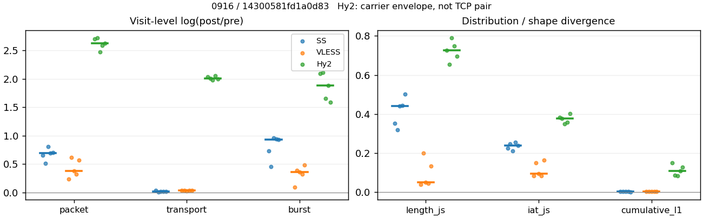
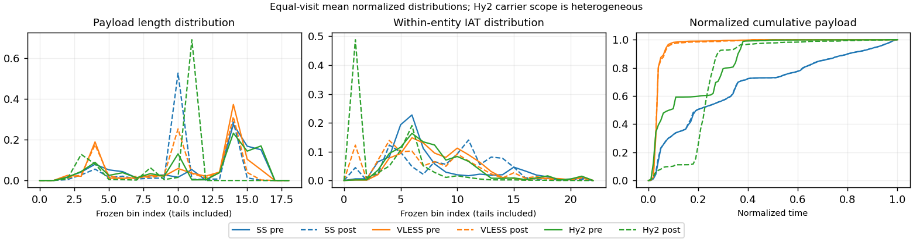

# 0916 · 条目 003 · youtube.com

目标：https://www.youtube.com/watch?v=eRsGyueVLvQ

活动标签：youtube.com::video_playback。选定访问 15 次。

[返回总索引](../../README.md) · [统计口径](../../methods.md)

## 覆盖与资格（每次访问均保留）

| 部署 | 重复 | 主请求路由 | 活动状态 | 代理比较 | DIRECT pre | 请求 proxy/direct/unresolved | 错误 |
| --- | --- | --- | --- | --- | --- | --- | --- |
| Hy2 | 1 | proxy | passed | 1 | 1 | 198/1/0 | [] |
| Hy2 | 2 | proxy | passed | 1 | 1 | 217/1/0 | [] |
| Hy2 | 3 | proxy | passed | 1 | 1 | 215/1/0 | [] |
| Hy2 | 4 | proxy | passed | 1 | 1 | 218/1/0 | [] |
| Hy2 | 5 | proxy | passed | 1 | 1 | 218/1/0 | [] |
| SS | 1 | proxy | passed | 1 | 0 | 222/0/0 | [] |
| SS | 2 | proxy | passed | 1 | 0 | 226/0/0 | [] |
| SS | 3 | proxy | passed | 1 | 0 | 240/0/0 | [] |
| SS | 4 | proxy | degraded | 1 | 0 | 214/0/1 | [] |
| SS | 5 | proxy | degraded | 1 | 0 | 223/0/0 | [] |
| VLESS | 1 | proxy | passed | 1 | 0 | 235/0/0 | [] |
| VLESS | 2 | proxy | passed | 1 | 0 | 230/0/0 | [] |
| VLESS | 3 | proxy | passed | 1 | 0 | 228/0/0 | [] |
| VLESS | 4 | proxy | passed | 1 | 0 | 244/0/0 | [] |
| VLESS | 5 | proxy | passed | 1 | 0 | 227/0/0 | [] |

主请求非 proxy 的统计仅解释为已索引的辅助代理连接或 DIRECT 观测，不代表目标业务经代理传输。播放确认与配对资格是两道不同的门。

图中散点为单次访问，短线为重复中位数；Hy2 是共享载体包络，不能与 TCP 配对作等范围因果对比。

形态图先逐访问归一化，再对访问等权平均；实线 pre，虚线 post。分箱序号及边界见 methods，不将分箱索引误解为长度或时间。

## 每次访问的关键观测

### SS

范围：`exclusive_page`。每格 pre → post；空值为不可观测/不适用。

| 重复 | 包数 | 载荷字节 | burst | TCP FR | IAT中位µs | length JS | IAT JS |
| --- | --- | --- | --- | --- | --- | --- | --- |
| 1 | 5776 → 11129 | 1.194e+07 → 1.2333e+07 | 3946 → 8172 | 268 → 315 | 26.566 → 270.78 | 0.3516 | 0.2252 |
| 2 | 4917 → 8207 | 8.5112e+06 → 8.5962e+06 | 3505 → 5499 | 262 → 273 | 21.18 → 189.77 | 0.3193 | 0.24747 |
| 3 | 4758 → 10688 | 1.0624e+07 → 1.0814e+07 | 3249 → 8447 | 316 → 343 | 40.397 → 575.33 | 0.4421 | 0.21153 |
| 4 | 3530 → 7039 | 5.8628e+06 → 5.9441e+06 | 2453 → 6262 | 259 → 275 | 49.061 → 1081.6 | 0.44456 | 0.25653 |
| 5 | 4111 → 8279 | 6.6123e+06 → 6.7077e+06 | 2832 → 7209 | 278 → 309 | 50.294 → 1056.6 | 0.50085 | 0.23817 |

完整标量统计：中位数 [min,max]；Δ 为重复内逐访问变换的中位数，MAD 未缩放。n 为可用变换数；DIRECT-only 的 nΔ=0 不代表 pre 不可用。

| scope | 特征 | pre | post | Δ | IQRΔ | MADΔ | nΔ |
| --- | --- | --- | --- | --- | --- | --- | --- |
| exclusive_page | active_span_sum_s_1000ms | 62.861 [38.776, 72.194] | 77.546 [45.971, 89.158] | 0.1702 | 0.10729 | 0.058068 | 5 |
| exclusive_page | active_span_sum_s_100ms | 23.206 [10.501, 30.169] | 38.315 [18.915, 54.373] | 0.58904 | 0.081005 | 0.080442 | 5 |
| exclusive_page | active_span_sum_s_500ms | 52.18 [31.792, 63.791] | 62.875 [39.002, 73.779] | 0.17214 | 0.051225 | 0.026663 | 5 |
| exclusive_page | burst_bytes_iqr | 4096 [2896, 4880] | 2856 [1428, 2856] | -0.53572 | 0.34647 | 0.17513 | 5 |
| exclusive_page | burst_bytes_mad | 39 [39, 39] | 65 [40, 73] | 0.51083 | 0.48551 | 0.11607 | 5 |
| exclusive_page | burst_bytes_max | 24248 [20480, 28672] | 17136 [5723, 28560] | -0.35896 | 0.86073 | 0.35505 | 5 |
| exclusive_page | burst_bytes_mean | 2428.3 [2334.8, 3270.1] | 1280.2 [930.46, 1563.2] | -0.92002 | 0.22783 | 0.01775 | 5 |
| exclusive_page | burst_bytes_median | 39 [39, 39] | 65 [40, 73] | 0.51083 | 0.48551 | 0.11607 | 5 |
| exclusive_page | burst_bytes_min | 0 [0, 0] | 0 [0, 0] | — | — | — | 0 |
| exclusive_page | burst_bytes_p95 | 11584 [10136, 16384] | 4284 [2856, 5712] | -1.2667 | 0.28768 | 0.13353 | 5 |
| exclusive_page | burst_bytes_q25 | 0 [0, 0] | 0 [0, 0] | — | — | — | 0 |
| exclusive_page | burst_bytes_q75 | 4096 [2896, 4880] | 2856 [1428, 2856] | -0.53572 | 0.34647 | 0.17513 | 5 |
| exclusive_page | burst_bytes_std | 4162.9 [3655.1, 5312.5] | 1818.3 [1110.1, 2388.1] | -1.0721 | 0.3095 | 0.18225 | 5 |
| exclusive_page | burst_count | 3249 [2453, 3946] | 7209 [5499, 8447] | 0.93435 | 0.20918 | 0.021117 | 5 |
| exclusive_page | burst_duration_ms_iqr | 0.029638 [0, 0.032335] | 0 [0, 0.000178] | — | — | — | 0 |
| exclusive_page | burst_duration_ms_mad | 0 [0, 0] | 0 [0, 0] | — | — | — | 0 |
| exclusive_page | burst_duration_ms_max | 15001 [15001, 15001] | 27533 [15232, 37782] | 0.60727 | 0.24065 | 0.14903 | 5 |
| exclusive_page | burst_duration_ms_mean | 98.323 [66.645, 149.7] | 22.968 [16.579, 24.727] | -1.4242 | 0.30755 | 0.045275 | 5 |
| exclusive_page | burst_duration_ms_median | 0 [0, 0] | 0 [0, 0] | — | — | — | 0 |
| exclusive_page | burst_duration_ms_min | 0 [0, 0] | 0 [0, 0] | — | — | — | 0 |
| exclusive_page | burst_duration_ms_p95 | 64.637 [9.5627, 95.642] | 0.98741 [0.85725, 9.9179] | -2.4129 | 1.5101 | 0.53847 | 5 |
| exclusive_page | burst_duration_ms_q25 | 0 [0, 0] | 0 [0, 0] | — | — | — | 0 |
| exclusive_page | burst_duration_ms_q75 | 0.029638 [0, 0.032335] | 0 [0, 0.000178] | — | — | — | 0 |
| exclusive_page | burst_duration_ms_std | 1017.1 [846.86, 1258.4] | 471.2 [409.87, 621.85] | -0.73405 | 0.10649 | 0.067656 | 5 |
| exclusive_page | burst_packets_iqr | 1 [0, 1] | 0 [0, 1] | — | — | — | 0 |
| exclusive_page | burst_packets_mad | 0 [0, 0] | 0 [0, 0] | — | — | — | 0 |
| exclusive_page | burst_packets_max | 31 [21, 40] | 9 [6, 11] | -1.2368 | 0.1304 | 0.07931 | 5 |
| exclusive_page | burst_packets_mean | 1.4516 [1.4029, 1.4645] | 1.2653 [1.1241, 1.4925] | -0.14617 | 0.16212 | 0.088121 | 5 |
| exclusive_page | burst_packets_median | 1 [1, 1] | 1 [1, 1] | 0 | 0 | 0 | 5 |
| exclusive_page | burst_packets_min | 1 [1, 1] | 1 [1, 1] | 0 | 0 | 0 | 5 |
| exclusive_page | burst_packets_p95 | 3 [3, 3] | 3 [2, 3] | 0 | 0.40547 | 0 | 5 |
| exclusive_page | burst_packets_q25 | 1 [1, 1] | 1 [1, 1] | 0 | 0 | 0 | 5 |
| exclusive_page | burst_packets_q75 | 2 [1, 2] | 1 [1, 2] | -0.69315 | 0 | 0 | 5 |
| exclusive_page | burst_packets_std | 1.1005 [0.89989, 1.1423] | 0.71335 [0.47563, 0.93374] | -0.40117 | 0.20741 | 0.19803 | 5 |
| exclusive_page | connection_span_concurrency_max | 15 [10, 22] | 14 [10, 17] | -0.060625 | 0.068993 | 0.060625 | 5 |
| exclusive_page | cumulative_l1 | — | — | 0.0021818 | 0.0011257 | 0.00077617 | 5 |
| exclusive_page | cumulative_max | — | — | 0.021598 | 0.038023 | 0.015027 | 5 |
| exclusive_page | direction_entropy | 0.62452 [0.52871, 0.67019] | 0.41467 [0.32674, 0.4445] | -0.20899 | 0.021069 | 0.014053 | 5 |
| exclusive_page | down_burst_count | 1609 [1218, 1963] | 3595 [2739, 4211] | 0.9388 | 0.21094 | 0.023292 | 5 |
| exclusive_page | down_ip_bytes | 8.5048e+06 [5.8442e+06, 1.1957e+07] | 8.669e+06 [5.9815e+06, 1.2466e+07] | 0.024771 | 0.0048914 | 0.0033352 | 5 |
| exclusive_page | down_packets | 2831 [2061, 3549] | 4954 [3579, 6536] | 0.56631 | 0.058767 | 0.042819 | 5 |
| exclusive_page | down_transport_bytes | 8.352e+06 [5.7369e+06, 1.1772e+07] | 8.4108e+06 [5.7948e+06, 1.2124e+07] | 0.010496 | 0.0039538 | 0.0034859 | 5 |
| exclusive_page | duration_s | 63.214 [60.731, 63.875] | 63.213 [60.73, 64.168] | -1.1101e-05 | 4.4241e-07 | 3.5837e-07 | 5 |
| exclusive_page | entity_count | 20 [18, 32] | 20 [18, 32] | 0 | 0 | 0 | 5 |
| exclusive_page | fr_runs | 268 [259, 316] | 309 [273, 343] | 0.081988 | 0.045777 | 0.023732 | 5 |
| exclusive_page | fr_runs_per_packet | 0.11355 [0.076245, 0.12628] | 0.058562 [0.047706, 0.074973] | -0.045078 | 0.016156 | 0.0099066 | 5 |
| exclusive_page | fr_switches | 248 [238, 284] | 289 [249, 311] | 0.090819 | 0.049188 | 0.02654 | 5 |
| exclusive_page | fr_switches_per_possible_transition | 0.10324 [0.070959, 0.11854] | 0.053391 [0.044812, 0.070411] | -0.041923 | 0.015968 | 0.0079217 | 5 |
| exclusive_page | full_retransmission_fraction | 0.0014236 [0.00056657, 0.002597] | 0.0066771 [0.0053613, 0.015455] | 0.0061105 | 0.0068709 | 0.0023778 | 5 |
| exclusive_page | full_retransmission_packets | 7 [2, 15] | 47 [44, 172] | 2.4394 | 1.2073 | 0.60116 | 5 |
| exclusive_page | iat_count | 4726 [3512, 5756] | 8259 [7021, 11109] | 0.69272 | 0.045001 | 0.035207 | 5 |
| exclusive_page | iat_js | — | — | 0.23817 | 0.02227 | 0.012972 | 5 |
| exclusive_page | iat_ks | — | — | 0.37698 | 0.072966 | 0.018839 | 5 |
| exclusive_page | iat_median_us | 40.397 [21.18, 50.294] | 575.33 [189.77, 1081.6] | 2.6562 | 0.72322 | 0.38868 | 5 |
| exclusive_page | iat_us_iqr | 408.07 [67.458, 4484.8] | 3572.2 [1003.5, 10729] | 2.1695 | 0.74685 | 0.4783 | 5 |
| exclusive_page | iat_us_mad | 31.524 [16.47, 39.802] | 567.12 [189.66, 1073.9] | 2.8898 | 0.64654 | 0.38246 | 5 |
| exclusive_page | iat_us_max | 1.5001e+07 [1.5001e+07, 1.5002e+07] | 1.5465e+07 [1.5335e+07, 1.5483e+07] | 0.03048 | 0.0011002 | 0.00067805 | 5 |
| exclusive_page | iat_us_mean | 1.3801e+05 [85632, 1.6374e+05] | 64833 [51358, 72989] | -0.71872 | 0.079098 | 0.061189 | 5 |
| exclusive_page | iat_us_median | 40.397 [21.18, 50.294] | 575.33 [189.77, 1081.6] | 2.6562 | 0.72322 | 0.38868 | 5 |
| exclusive_page | iat_us_min | 0.044 [0.015, 0.071] | 0.031 [0.031, 0.037] | -0.3502 | 0.31015 | 0.28768 | 5 |
| exclusive_page | iat_us_p95 | 99618 [36585, 1.3152e+05] | 32276 [20139, 32864] | -1.127 | 0.62408 | 0.25974 | 5 |
| exclusive_page | iat_us_q25 | 15.29 [9.947, 19.008] | 12.609 [9.291, 24.938] | -0.068225 | 0.14791 | 0.097518 | 5 |
| exclusive_page | iat_us_q75 | 423.36 [77.405, 4503.9] | 3584.4 [1016.1, 10754] | 2.1361 | 0.63488 | 0.44043 | 5 |
| exclusive_page | iat_us_std | 1.2532e+06 [9.6913e+05, 1.3456e+06] | 8.1639e+05 [7.4777e+05, 9.5743e+05] | -0.36998 | 0.065004 | 0.050485 | 5 |
| exclusive_page | iat_wasserstein_log1p_us | — | — | 1.3866 | 0.21169 | 0.039539 | 5 |
| exclusive_page | idle_gap_count_1000ms | 57 [46, 86] | 55 [45, 74] | -0.036368 | 0.011535 | 0.010885 | 5 |
| exclusive_page | idle_gap_count_100ms | 234 [141, 260] | 150 [142, 239] | -0.067064 | 0.48123 | 0.088207 | 5 |
| exclusive_page | idle_gap_count_500ms | 69 [56, 113] | 67 [55, 95] | -0.075223 | 0.094777 | 0.057205 | 5 |
| exclusive_page | idle_gap_sum_s_1000ms | 481.84 [380.22, 749.4] | 455.45 [374.29, 745.6] | -0.056315 | 0.047073 | 0.040602 | 5 |
| exclusive_page | idle_gap_sum_s_100ms | 523.86 [408.5, 782.4] | 481.08 [401.35, 770.94] | -0.074486 | 0.067547 | 0.056833 | 5 |
| exclusive_page | idle_gap_sum_s_500ms | 490.24 [387.21, 755.89] | 461.67 [381.26, 748.64] | -0.048679 | 0.044576 | 0.033211 | 5 |
| exclusive_page | ip_bytes | 8.7673e+06 [6.0466e+06, 1.2241e+07] | 9.0913e+06 [6.3628e+06, 1.3016e+07] | 0.051438 | 0.00067075 | 0.00045756 | 5 |
| exclusive_page | length_iqr | 3338.2 [2435, 6984] | 1428 [0, 1428] | -1.2183 | 1.5938 | 0.47297 | 4 |
| exclusive_page | length_js | — | — | 0.4421 | 0.09296 | 0.05875 | 5 |
| exclusive_page | length_ks | — | — | 0.53681 | 0.030045 | 0.017576 | 5 |
| exclusive_page | length_mad | 1496 [1448, 2404] | 216 [0, 958] | -0.84179 | 0.98195 | 0.39609 | 3 |
| exclusive_page | length_max | 8920 [8920, 8920] | 9996 [2856, 11424] | 0.11389 | 0.98083 | 0.13353 | 5 |
| exclusive_page | length_mean | 2918.8 [2736.9, 3817.6] | 1722.3 [1519.3, 1867.8] | -0.58857 | 0.030516 | 0.021038 | 5 |
| exclusive_page | length_median | 2896 [2896, 2896] | 1428 [1428, 1428] | -0.70706 | 0 | 0 | 5 |
| exclusive_page | length_min | 8 [8, 31] | 6 [2, 6] | -1.3863 | 1.3545 | 0.25593 | 5 |
| exclusive_page | length_p95 | 8192 [8192, 8688] | 2856 [2856, 2856] | -1.0537 | 0 | 0 | 5 |
| exclusive_page | length_q25 | 757.75 [333, 1400] | 1428 [1428, 1428] | 0.63368 | 0.96332 | 0.49696 | 5 |
| exclusive_page | length_q75 | 4096 [2896, 8192] | 2856 [1428, 2856] | -0.69315 | 0.68925 | 0.33256 | 5 |
| exclusive_page | length_std | 2625.7 [2489.6, 3099.1] | 962.24 [757, 1160] | -1.1696 | 0.24843 | 0.020898 | 5 |
| exclusive_page | length_wasserstein_bytes | — | — | 1640.2 | 96.429 | 93.838 | 5 |
| exclusive_page | nonempty_entity_count | 20 [18, 32] | 20 [18, 32] | 0 | 0 | 0 | 5 |
| exclusive_page | nonempty_packets | 2783 [2051, 3515] | 4991 [3668, 6603] | 0.60289 | 0.049165 | 0.02759 | 5 |
| exclusive_page | offload_suspect_fraction | 0.36628 [0.34844, 0.41378] | 0.2093 [0.10001, 0.23839] | -0.1873 | 0.043483 | 0.031583 | 5 |
| exclusive_page | packet_count | 4758 [3530, 5776] | 8279 [7039, 11129] | 0.69017 | 0.044213 | 0.034325 | 5 |
| exclusive_page | rtt_median_ms | 0.062346 [0.026357, 0.068409] | 32.803 [29.758, 38.371] | 6.1747 | 0.69668 | 0.021186 | 5 |
| exclusive_page | rtt_sample_count | 1857 [1415, 2134] | 1242 [842, 1730] | -0.13041 | 0.73215 | 0.19734 | 5 |
| exclusive_page | tcp_ack_count | 4713 [3508, 5756] | 8257 [7016, 11107] | 0.69315 | 0.045917 | 0.035814 | 5 |
| exclusive_page | tcp_fin_count | 40 [34, 63] | 44 [37, 76] | 0.12063 | 0.072628 | 0.036558 | 5 |
| exclusive_page | tcp_packet_count | 4758 [3530, 5776] | 8279 [7039, 11129] | 0.69017 | 0.044213 | 0.034325 | 5 |
| exclusive_page | tcp_rst_count | 4 [0, 13] | 2 [0, 4] | -0.69315 | 0.24275 | 0 | 3 |
| exclusive_page | tcp_syn_count | 40 [36, 64] | 42 [40, 73] | 0.060625 | 0.05657 | 0.035932 | 5 |
| exclusive_page | tcp_window_raw_median | 65535 [65535, 65535] | 166 [159, 168] | -5.9784 | 0.024098 | 0.011976 | 5 |
| exclusive_page | transition_entropy | 0.41208 [0.31504, 0.46264] | 0.24374 [0.20663, 0.2979] | -0.14978 | 0.045416 | 0.018566 | 5 |
| exclusive_page | transition_n_mm | 2199 [1567, 2967] | 4489 [3197, 6058] | 0.71383 | 0.0092508 | 0.0084724 | 5 |
| exclusive_page | transition_n_mp | 121 [114, 134] | 141 [120, 149] | 0.10611 | 0.054306 | 0.039967 | 5 |
| exclusive_page | transition_n_pm | 127 [124, 150] | 148 [129, 162] | 0.076961 | 0.044343 | 0.029902 | 5 |
| exclusive_page | transition_n_pp | 245 [225, 280] | 229 [196, 310] | -0.13799 | 0.10438 | 0.058725 | 5 |
| exclusive_page | transition_p_mm | 0.94256 [0.93052, 0.96082] | 0.97217 [0.96237, 0.97662] | 0.027033 | 0.010489 | 0.0048166 | 5 |
| exclusive_page | transition_p_mp | 0.057437 [0.039184, 0.069477] | 0.027835 [0.023376, 0.037628] | -0.027033 | 0.010489 | 0.0048166 | 5 |
| exclusive_page | transition_p_pm | 0.35185 [0.31204, 0.35885] | 0.39474 [0.34322, 0.41573] | 0.047138 | 0.041418 | 0.024678 | 5 |
| exclusive_page | transition_p_pp | 0.64815 [0.64115, 0.68796] | 0.60526 [0.58427, 0.65678] | -0.047138 | 0.041418 | 0.024678 | 5 |
| exclusive_page | transport_bytes | 8.5112e+06 [5.8628e+06, 1.194e+07] | 8.5962e+06 [5.9441e+06, 1.2333e+07] | 0.014325 | 0.0039042 | 0.0033668 | 5 |
| exclusive_page | up_burst_count | 1640 [1235, 1983] | 3614 [2760, 4236] | 0.92994 | 0.20743 | 0.018981 | 5 |
| exclusive_page | up_byte_fraction | 0.018877 [0.014024, 0.022557] | 0.022626 [0.016937, 0.026153] | 0.0035967 | 0.00073599 | 0.00015274 | 5 |
| exclusive_page | up_ip_bytes | 2.6249e+05 [2.0238e+05, 3.4003e+05] | 4.2227e+05 [3.8137e+05, 6.1612e+05] | 0.6336 | 0.057412 | 0.029346 | 5 |
| exclusive_page | up_packets | 1927 [1469, 2227] | 3968 [3253, 4909] | 0.85669 | 0.14516 | 0.078419 | 5 |
| exclusive_page | up_transport_bytes | 1.5915e+05 [1.2482e+05, 2.3965e+05] | 1.8544e+05 [1.4932e+05, 2.8283e+05] | 0.17075 | 0.029865 | 0.017865 | 5 |
| exclusive_page | zero_iat_count | 0 [0, 0] | 0 [0, 0] | — | — | — | 0 |
| exclusive_page | zero_iat_fraction | 0 [0, 0] | 0 [0, 0] | 0 | 0 | 0 | 5 |

### VLESS

范围：`exclusive_page`。每格 pre → post；空值为不可观测/不适用。

| 重复 | 包数 | 载荷字节 | burst | TCP FR | IAT中位µs | length JS | IAT JS |
| --- | --- | --- | --- | --- | --- | --- | --- |
| 1 | 2999 → 3778 | 3.7993e+06 → 3.9272e+06 | 2417 → 2657 | 156 → 190 | 163.99 → 51.706 | 0.038099 | 0.083121 |
| 2 | 2281 → 4225 | 3.7538e+06 → 3.8681e+06 | 1700 → 2498 | 140 → 172 | 93.189 → 15.897 | 0.20048 | 0.15106 |
| 3 | 3331 → 4843 | 4.5726e+06 → 4.7051e+06 | 2337 → 3338 | 140 → 176 | 110.07 → 43.112 | 0.050458 | 0.093298 |
| 4 | 3688 → 5072 | 4.4509e+06 → 4.5924e+06 | 2613 → 3584 | 160 → 198 | 128.28 → 51.371 | 0.044716 | 0.083699 |
| 5 | 2683 → 4741 | 3.7555e+06 → 3.8713e+06 | 1892 → 3054 | 136 → 166 | 134.56 → 18.916 | 0.1342 | 0.1626 |

完整标量统计：中位数 [min,max]；Δ 为重复内逐访问变换的中位数，MAD 未缩放。n 为可用变换数；DIRECT-only 的 nΔ=0 不代表 pre 不可用。

| scope | 特征 | pre | post | Δ | IQRΔ | MADΔ | nΔ |
| --- | --- | --- | --- | --- | --- | --- | --- |
| exclusive_page | active_span_sum_s_1000ms | 24.203 [23.725, 26.473] | 26.029 [24.695, 27.677] | 0.044995 | 0.017292 | 0.016772 | 5 |
| exclusive_page | active_span_sum_s_100ms | 3.6161 [3.1094, 4.0309] | 10.424 [9.8334, 11.462] | 1.0552 | 0.028304 | 0.018148 | 5 |
| exclusive_page | active_span_sum_s_500ms | 12.274 [11.437, 14.041] | 24.137 [23.27, 26.421] | 0.69007 | 0.034883 | 0.020027 | 5 |
| exclusive_page | burst_bytes_iqr | 2896 [2824, 2896] | 2824 [2824, 2824] | -0.025176 | 0 | 0 | 5 |
| exclusive_page | burst_bytes_mad | 0 [0, 24] | 36 [24, 39] | 0.48551 | — | — | 1 |
| exclusive_page | burst_bytes_max | 20480 [20480, 23120] | 23348 [14120, 43620] | 0.13106 | 0.4124 | 0.3847 | 5 |
| exclusive_page | burst_bytes_mean | 1956.6 [1571.9, 2208.1] | 1409.6 [1267.6, 1548.5] | -0.32794 | 0.070177 | 0.043262 | 5 |
| exclusive_page | burst_bytes_median | 0 [0, 24] | 36 [24, 39] | 0.48551 | — | — | 1 |
| exclusive_page | burst_bytes_min | 0 [0, 0] | 0 [0, 0] | — | — | — | 0 |
| exclusive_page | burst_bytes_p95 | 8724 [7240, 11201] | 4904.1 [4272, 5792] | -0.576 | 0.14038 | 0.083529 | 5 |
| exclusive_page | burst_bytes_q25 | 0 [0, 0] | 0 [0, 0] | — | — | — | 0 |
| exclusive_page | burst_bytes_q75 | 2896 [2824, 2896] | 2824 [2824, 2824] | -0.025176 | 0 | 0 | 5 |
| exclusive_page | burst_bytes_std | 3330.6 [2786.3, 4187.6] | 2067.1 [1709.5, 2397] | -0.46847 | 0.18122 | 0.091776 | 5 |
| exclusive_page | burst_count | 2337 [1700, 2613] | 3054 [2498, 3584] | 0.3565 | 0.068882 | 0.040523 | 5 |
| exclusive_page | burst_duration_ms_iqr | 0.1448 [0, 0.27591] | 0.000162 [0.00010875, 0.0039955] | -5.8296 | 3.4443 | 1.432 | 4 |
| exclusive_page | burst_duration_ms_mad | 0 [0, 0] | 0 [0, 0] | — | — | — | 0 |
| exclusive_page | burst_duration_ms_max | 15001 [15001, 15001] | 14968 [2093.7, 15168] | -0.0022061 | 0.0023942 | 0.0019979 | 5 |
| exclusive_page | burst_duration_ms_mean | 96.641 [50.561, 143.47] | 14.727 [6.0159, 24.798] | -1.8813 | 0.48469 | 0.39716 | 5 |
| exclusive_page | burst_duration_ms_median | 0 [0, 0] | 0 [0, 0] | — | — | — | 0 |
| exclusive_page | burst_duration_ms_min | 0 [0, 0] | 0 [0, 0] | — | — | — | 0 |
| exclusive_page | burst_duration_ms_p95 | 7.4653 [5.2491, 14.033] | 6.0377 [3.6239, 8.7578] | -0.47149 | 0.48974 | 0.25122 | 5 |
| exclusive_page | burst_duration_ms_q25 | 0 [0, 0] | 0 [0, 0] | — | — | — | 0 |
| exclusive_page | burst_duration_ms_q75 | 0.1448 [0, 0.27591] | 0.000162 [0.00010875, 0.0039955] | -5.8296 | 3.4443 | 1.432 | 4 |
| exclusive_page | burst_duration_ms_std | 1080.5 [754.91, 1347.8] | 336.81 [56.61, 545.24] | -1.129 | 0.23628 | 0.19963 | 5 |
| exclusive_page | burst_packets_iqr | 1 [0, 1] | 1 [1, 1] | 0 | 0 | 0 | 4 |
| exclusive_page | burst_packets_mad | 0 [0, 0] | 0 [0, 0] | — | — | — | 0 |
| exclusive_page | burst_packets_max | 6 [5, 10] | 9 [7, 15] | 0.40547 | 0.068993 | 0.068993 | 5 |
| exclusive_page | burst_packets_mean | 1.4114 [1.2408, 1.4253] | 1.4509 [1.4152, 1.6914] | 0.090495 | 0.11849 | 0.072737 | 5 |
| exclusive_page | burst_packets_median | 1 [1, 1] | 1 [1, 1] | 0 | 0 | 0 | 5 |
| exclusive_page | burst_packets_min | 1 [1, 1] | 1 [1, 1] | 0 | 0 | 0 | 5 |
| exclusive_page | burst_packets_p95 | 2 [2, 3] | 3 [3, 4] | 0.40547 | 0.11778 | 0 | 5 |
| exclusive_page | burst_packets_q25 | 1 [1, 1] | 1 [1, 1] | 0 | 0 | 0 | 5 |
| exclusive_page | burst_packets_q75 | 2 [1, 2] | 2 [2, 2] | 0 | 0 | 0 | 5 |
| exclusive_page | burst_packets_std | 0.60762 [0.50805, 0.6662] | 0.90243 [0.80529, 1.1496] | 0.3575 | 0.1301 | 0.075851 | 5 |
| exclusive_page | connection_span_concurrency_max | 12 [10, 13] | 12 [10, 13] | 0 | 0 | 0 | 5 |
| exclusive_page | cumulative_l1 | — | — | 0.0028083 | 0.00037224 | 0.00032139 | 5 |
| exclusive_page | cumulative_max | — | — | 0.026746 | 0.011794 | 0.0074214 | 5 |
| exclusive_page | direction_entropy | 0.40405 [0.35437, 0.47949] | 0.33577 [0.32127, 0.40177] | -0.042385 | 0.047276 | 0.027777 | 5 |
| exclusive_page | down_burst_count | 1160 [842, 1297] | 1519 [1242, 1783] | 0.359 | 0.070455 | 0.040756 | 5 |
| exclusive_page | down_ip_bytes | 3.8302e+06 [3.771e+06, 4.6216e+06] | 3.9493e+06 [3.9149e+06, 4.759e+06] | 0.030627 | 0.005138 | 0.0013341 | 5 |
| exclusive_page | down_packets | 1684 [1344, 2286] | 2648 [2150, 2882] | 0.28998 | 0.2245 | 0.058294 | 5 |
| exclusive_page | down_transport_bytes | 3.7425e+06 [3.7009e+06, 4.5139e+06] | 3.8374e+06 [3.7849e+06, 4.6151e+06] | 0.022541 | 0.0016169 | 0.00036981 | 5 |
| exclusive_page | duration_s | 63.291 [61.259, 64.327] | 63.274 [61.174, 64.341] | -0.00026851 | 0.00068141 | 0.0004841 | 5 |
| exclusive_page | entity_count | 17 [16, 19] | 17 [16, 19] | 0 | 0 | 0 | 5 |
| exclusive_page | fr_runs | 140 [136, 160] | 176 [166, 198] | 0.20585 | 0.01376 | 0.0072412 | 5 |
| exclusive_page | fr_runs_per_packet | 0.08624 [0.06993, 0.11129] | 0.070664 [0.064491, 0.091434] | -0.0052202 | 0.017344 | 0.0034858 | 5 |
| exclusive_page | fr_switches | 124 [120, 141] | 159 [150, 179] | 0.22957 | 0.015482 | 0.0090515 | 5 |
| exclusive_page | fr_switches_per_possible_transition | 0.076874 [0.061965, 0.099839] | 0.064319 [0.05864, 0.08394] | -0.0030984 | 0.015842 | 0.0030633 | 5 |
| exclusive_page | full_retransmission_fraction | 0.00060042 [0.00027115, 0.0017536] | 0 [0, 0.00026469] | -0.0004022 | 0.0002277 | 0.00013105 | 5 |
| exclusive_page | full_retransmission_packets | 2 [1, 4] | 0 [0, 1] | -0.69315 | — | — | 1 |
| exclusive_page | iat_count | 2982 [2265, 3669] | 4725 [3761, 5053] | 0.37586 | 0.25185 | 0.14377 | 5 |
| exclusive_page | iat_js | — | — | 0.093298 | 0.067357 | 0.010177 | 5 |
| exclusive_page | iat_ks | — | — | 0.22372 | 0.090066 | 0.037821 | 5 |
| exclusive_page | iat_median_us | 128.28 [93.189, 163.99] | 43.112 [15.897, 51.706] | -1.1542 | 0.83117 | 0.23905 | 5 |
| exclusive_page | iat_us_iqr | 977.74 [826.8, 1132.7] | 665.31 [524.03, 1055.3] | -0.21732 | 0.35347 | 0.27244 | 5 |
| exclusive_page | iat_us_mad | 119.46 [85.514, 156.3] | 42.957 [15.851, 51.619] | -1.1079 | 0.83952 | 0.2831 | 5 |
| exclusive_page | iat_us_max | 1.5001e+07 [1.5001e+07, 1.5002e+07] | 1.5443e+07 [1.5385e+07, 1.546e+07] | 0.028986 | 0.0034034 | 0.0011122 | 5 |
| exclusive_page | iat_us_mean | 1.5945e+05 [1.237e+05, 3.2099e+05] | 1.2571e+05 [89684, 1.7258e+05] | -0.36356 | 0.25106 | 0.1309 | 5 |
| exclusive_page | iat_us_median | 128.28 [93.189, 163.99] | 43.112 [15.897, 51.706] | -1.1542 | 0.83117 | 0.23905 | 5 |
| exclusive_page | iat_us_min | 0.083 [0.012, 0.634] | 0.032 [0.021, 0.033] | -1.0664 | 1.2479 | 1.1038 | 5 |
| exclusive_page | iat_us_p95 | 11301 [9542.5, 77334] | 40618 [39144, 44100] | 1.3616 | 1.0524 | 0.056109 | 5 |
| exclusive_page | iat_us_q25 | 28.778 [19.848, 33.752] | 8.2063 [4.261, 10.38] | -1.3525 | 0.28388 | 0.1861 | 5 |
| exclusive_page | iat_us_q75 | 1006 [855.58, 1152.5] | 673.51 [529.08, 1065.7] | -0.23927 | 0.35367 | 0.27444 | 5 |
| exclusive_page | iat_us_std | 1.4534e+06 [1.2499e+06, 2.0766e+06] | 1.2773e+06 [1.0702e+06, 1.5398e+06] | -0.17861 | 0.12126 | 0.071278 | 5 |
| exclusive_page | iat_wasserstein_log1p_us | — | — | 0.95326 | 0.45696 | 0.17321 | 5 |
| exclusive_page | idle_gap_count_1000ms | 42 [39, 55] | 41 [37, 53] | -0.037041 | 0.027951 | 0.012944 | 5 |
| exclusive_page | idle_gap_count_100ms | 108 [102, 113] | 122 [118, 135] | 0.14571 | 0.01191 | 0.0075615 | 5 |
| exclusive_page | idle_gap_count_500ms | 60 [58, 73] | 43 [39, 54] | -0.36291 | 0.063737 | 0.033976 | 5 |
| exclusive_page | idle_gap_sum_s_1000ms | 504.22 [428.75, 702.88] | 508.94 [426.9, 701.69] | -0.0031799 | 0.0015995 | 0.0011599 | 5 |
| exclusive_page | idle_gap_sum_s_100ms | 524.81 [449.84, 723.46] | 524.39 [441.71, 716.42] | -0.011121 | 0.005377 | 0.0040377 | 5 |
| exclusive_page | idle_gap_sum_s_500ms | 516.15 [440.96, 714.93] | 510.85 [426.9, 702.25] | -0.019315 | 0.010041 | 0.0086225 | 5 |
| exclusive_page | ip_bytes | 3.9552e+06 [3.8723e+06, 4.7457e+06] | 4.13e+06 [4.1051e+06, 4.9603e+06] | 0.045706 | 0.014166 | 0.0035999 | 5 |
| exclusive_page | length_iqr | 2752 [2040, 2935.2] | 2536 [1606, 2752] | -0.084733 | 0.20388 | 0.10349 | 5 |
| exclusive_page | length_js | — | — | 0.050458 | 0.089483 | 0.012359 | 5 |
| exclusive_page | length_ks | — | — | 0.14958 | 0.14534 | 0.05717 | 5 |
| exclusive_page | length_mad | 1376 [960, 1661] | 1304 [524, 1340] | -0.079571 | 0.23242 | 0.17936 | 5 |
| exclusive_page | length_max | 8920 [8920, 8920] | 10136 [8472, 14480] | 0.1278 | 0.31286 | 0.17933 | 5 |
| exclusive_page | length_mean | 2354 [2014, 2983.9] | 1639 [1504, 1889.9] | -0.26534 | 0.23999 | 0.059304 | 5 |
| exclusive_page | length_median | 2824 [1825.5, 2824] | 1412 [1412, 1520] | -0.61944 | 0.17442 | 0.073703 | 5 |
| exclusive_page | length_min | 24 [8, 24] | 12 [3, 24] | 0 | 0.69315 | 0 | 5 |
| exclusive_page | length_p95 | 7240 [5648, 8920] | 2968 [2824, 4344] | -0.64341 | 0.28082 | 0.13259 | 5 |
| exclusive_page | length_q25 | 361 [72, 856] | 288 [72, 1218] | 0 | 0.45429 | 0.3565 | 5 |
| exclusive_page | length_q75 | 2896 [2824, 3788] | 2824 [2440, 2824] | -0.025176 | 0.14616 | 0.025176 | 5 |
| exclusive_page | length_std | 2159.6 [1785.7, 2837] | 1351.9 [1101.1, 1536.1] | -0.34381 | 0.35736 | 0.065504 | 5 |
| exclusive_page | length_wasserstein_bytes | — | — | 548.96 | 388.16 | 168.39 | 5 |
| exclusive_page | nonempty_entity_count | 17 [16, 19] | 17 [16, 19] | 0 | 0 | 0 | 5 |
| exclusive_page | nonempty_packets | 1614 [1258, 2210] | 2574 [2078, 2802] | 0.29391 | 0.23725 | 0.056565 | 5 |
| exclusive_page | offload_suspect_fraction | 0.34165 [0.32011, 0.36866] | 0.23837 [0.17043, 0.28295] | -0.11097 | 0.05382 | 0.046134 | 5 |
| exclusive_page | packet_count | 2999 [2281, 3688] | 4741 [3778, 5072] | 0.37426 | 0.25066 | 0.14335 | 5 |
| exclusive_page | rtt_median_ms | 0.13701 [0.063452, 0.18706] | 0.042353 [0.04044, 0.17666] | -1.1667 | 0.78463 | 0.18677 | 5 |
| exclusive_page | rtt_sample_count | 1204 [877, 1357] | 1633 [1190, 2037] | 0.4062 | 0.15782 | 0.101 | 5 |
| exclusive_page | tcp_ack_count | 2949 [2233, 3633] | 4725 [3761, 5052] | 0.38442 | 0.25388 | 0.1412 | 5 |
| exclusive_page | tcp_fin_count | 33 [31, 36] | 34 [32, 38] | 0.031749 | 0.024214 | 0.022319 | 5 |
| exclusive_page | tcp_packet_count | 2999 [2281, 3688] | 4741 [3778, 5072] | 0.37426 | 0.25066 | 0.14335 | 5 |
| exclusive_page | tcp_rst_count | 33 [31, 36] | 1 [0, 6] | -3.4657 | 0.93939 | 0.11778 | 3 |
| exclusive_page | tcp_syn_count | 34 [32, 38] | 34 [32, 38] | 0 | 0 | 0 | 5 |
| exclusive_page | tcp_window_raw_median | 65535 [65535, 65535] | 180 [165, 194] | -5.8974 | 0.13206 | 0.074901 | 5 |
| exclusive_page | transition_entropy | 0.28765 [0.24224, 0.35514] | 0.24825 [0.23163, 0.30697] | -0.014632 | 0.04667 | 0.015057 | 5 |
| exclusive_page | transition_n_mm | 1387 [1058, 1982] | 2339 [1817, 2526] | 0.30573 | 0.25615 | 0.063202 | 5 |
| exclusive_page | transition_n_mp | 54 [52, 61] | 71 [67, 80] | 0.25951 | 0.017704 | 0.011642 | 5 |
| exclusive_page | transition_n_pm | 70 [68, 80] | 88 [83, 99] | 0.20585 | 0.01376 | 0.0072412 | 5 |
| exclusive_page | transition_n_pp | 64 [59, 71] | 69 [64, 78] | 0.075223 | 0.072663 | 0.061978 | 5 |
| exclusive_page | transition_p_mm | 0.96374 [0.95144, 0.97137] | 0.9693 [0.95884, 0.97215] | 0.00096612 | 0.0080463 | 0.0018065 | 5 |
| exclusive_page | transition_p_mp | 0.036262 [0.028633, 0.048561] | 0.030698 [0.027847, 0.041161] | -0.00096612 | 0.0080463 | 0.0018065 | 5 |
| exclusive_page | transition_p_pm | 0.53543 [0.52239, 0.54054] | 0.56051 [0.54605, 0.57333] | 0.034872 | 0.01934 | 0.013927 | 5 |
| exclusive_page | transition_p_pp | 0.46457 [0.45946, 0.47761] | 0.43949 [0.42667, 0.45395] | -0.034872 | 0.01934 | 0.013927 | 5 |
| exclusive_page | transport_bytes | 3.7993e+06 [3.7538e+06, 4.5726e+06] | 3.9272e+06 [3.8681e+06, 4.7051e+06] | 0.030361 | 0.0012958 | 0.00094031 | 5 |
| exclusive_page | up_burst_count | 1177 [858, 1316] | 1535 [1256, 1801] | 0.35404 | 0.067338 | 0.040292 | 5 |
| exclusive_page | up_byte_fraction | 0.014074 [0.012832, 0.014958] | 0.021637 [0.019122, 0.022871] | 0.0074454 | 0.00055422 | 0.00031865 | 5 |
| exclusive_page | up_ip_bytes | 1.2406e+05 [1.0135e+05, 1.3802e+05] | 2.0124e+05 [1.7594e+05, 2.1744e+05] | 0.48372 | 0.17494 | 0.14167 | 5 |
| exclusive_page | up_packets | 1262 [937, 1402] | 2078 [1628, 2190] | 0.49871 | 0.16488 | 0.11217 | 5 |
| exclusive_page | up_transport_bytes | 56832 [52413, 65386] | 89821 [83240, 1.0019e+05] | 0.45463 | 0.030302 | 0.014219 | 5 |
| exclusive_page | zero_iat_count | 0 [0, 0] | 0 [0, 0] | — | — | — | 0 |
| exclusive_page | zero_iat_fraction | 0 [0, 0] | 0 [0, 0] | 0 | 0 | 0 | 5 |

### Hy2

范围：`carrier_context_envelope`。每格 pre → post；空值为不可观测/不适用。

| 重复 | 包数 | 载荷字节 | burst | TCP FR | IAT中位µs | length JS | IAT JS |
| --- | --- | --- | --- | --- | --- | --- | --- |
| 1 | 3697 → 54989 | 7.655e+06 → 5.8373e+07 | 2401 → 19394 | — | 84.806 → 4.222 | 0.72526 | 0.38345 |
| 2 | 3582 → 54354 | 7.8632e+06 → 5.8529e+07 | 2194 → 18129 | — | 72.368 → 2.987 | 0.65558 | 0.37703 |
| 3 | 4374 → 52129 | 7.8359e+06 → 5.6575e+07 | 3173 → 16662 | — | 77.81 → 3.0865 | 0.78945 | 0.35071 |
| 4 | 4231 → 56124 | 7.8316e+06 → 6.0882e+07 | 2752 → 18120 | — | 86.948 → 3.587 | 0.74867 | 0.35652 |
| 5 | 3684 → 50854 | 7.9018e+06 → 5.8411e+07 | 2555 → 12456 | — | 61.151 → 0.162 | 0.69606 | 0.40286 |

范围：`direct_pre_only`。每格 pre → post；空值为不可观测/不适用。

| 重复 | 包数 | 载荷字节 | burst | TCP FR | IAT中位µs | length JS | IAT JS |
| --- | --- | --- | --- | --- | --- | --- | --- |
| 1 | 33 → — | 8670 → — | 25 → — | 7 → — | 234.2 → — | — | — |
| 2 | 33 → — | 8734 → — | 25 → — | 7 → — | 192.92 → — | — | — |
| 3 | 33 → — | 8671 → — | 23 → — | 7 → — | 143.09 → — | — | — |
| 4 | 31 → — | 8703 → — | 23 → — | 7 → — | 119.31 → — | — | — |
| 5 | 31 → — | 8638 → — | 21 → — | 7 → — | 157.29 → — | — | — |

完整标量统计：中位数 [min,max]；Δ 为重复内逐访问变换的中位数，MAD 未缩放。n 为可用变换数；DIRECT-only 的 nΔ=0 不代表 pre 不可用。

| scope | 特征 | pre | post | Δ | IQRΔ | MADΔ | nΔ |
| --- | --- | --- | --- | --- | --- | --- | --- |
| carrier_context_envelope | active_span_sum_s_1000ms | 32.746 [26.576, 34.846] | 32.677 [27.013, 37.979] | 0.016337 | 0.093483 | 0.068645 | 5 |
| carrier_context_envelope | active_span_sum_s_100ms | 3.7892 [3.1383, 4.7761] | 12.732 [9.6792, 13.903] | 1.0537 | 0.15406 | 0.09594 | 5 |
| carrier_context_envelope | active_span_sum_s_500ms | 27.979 [19.942, 31.581] | 27.834 [24.71, 34.087] | 0.076387 | 0.051946 | 0.039463 | 5 |
| carrier_context_envelope | burst_bytes_iqr | 3697.2 [2642.5, 4592] | 5071 [3627, 5130] | 0.3242 | 0.75189 | 0.32762 | 5 |
| carrier_context_envelope | burst_bytes_mad | 39 [31, 39] | 317.5 [265.5, 424] | 2.157 | 0.078709 | 0.060084 | 5 |
| carrier_context_envelope | burst_bytes_max | 27705 [20480, 29400] | 2.68e+05 [1.3436e+05, 5.5627e+05] | 2.2694 | 0.74563 | 0.3883 | 5 |
| carrier_context_envelope | burst_bytes_mean | 3092.7 [2469.6, 3584] | 3359.9 [3009.8, 4689.4] | 0.16608 | 0.37599 | 0.22367 | 5 |
| carrier_context_envelope | burst_bytes_median | 39 [31, 39] | 351.5 [298.5, 457] | 2.2674 | 0.074475 | 0.068708 | 5 |
| carrier_context_envelope | burst_bytes_min | 0 [0, 0] | 22 [22, 22] | — | — | — | 0 |
| carrier_context_envelope | burst_bytes_p95 | 17840 [11379, 20480] | 12363 [10932, 19578] | -0.095984 | 0.39162 | 0.1789 | 5 |
| carrier_context_envelope | burst_bytes_q25 | 0 [0, 0] | 97 [38, 100] | — | — | — | 0 |
| carrier_context_envelope | burst_bytes_q75 | 3697.2 [2642.5, 4592] | 5168 [3727, 5168] | 0.3349 | 0.73235 | 0.33586 | 5 |
| carrier_context_envelope | burst_bytes_std | 5576.7 [4313.2, 6072.1] | 6789.9 [5930.2, 14480] | 0.18771 | 0.28236 | 0.067914 | 5 |
| carrier_context_envelope | burst_count | 2555 [2194, 3173] | 18120 [12456, 19394] | 1.8847 | 0.43063 | 0.22624 | 5 |
| carrier_context_envelope | burst_duration_ms_iqr | 0.068402 [0.023598, 0.11612] | 0.026951 [0.024004, 0.028799] | -1.0455 | 1.3748 | 0.42636 | 5 |
| carrier_context_envelope | burst_duration_ms_mad | 0 [0, 0] | 5.4e-05 [4.2e-05, 5.9e-05] | — | — | — | 0 |
| carrier_context_envelope | burst_duration_ms_max | 15001 [15001, 15001] | 3633.2 [2894.1, 4053.9] | -1.418 | 0.20941 | 0.10955 | 5 |
| carrier_context_envelope | burst_duration_ms_mean | 111.48 [88.913, 160.08] | 1.5046 [1.2742, 2.3713] | -4.2122 | 0.27297 | 0.11864 | 5 |
| carrier_context_envelope | burst_duration_ms_median | 0 [0, 0] | 5.4e-05 [4.2e-05, 5.9e-05] | — | — | — | 0 |
| carrier_context_envelope | burst_duration_ms_min | 0 [0, 0] | 0 [0, 0] | — | — | — | 0 |
| carrier_context_envelope | burst_duration_ms_p95 | 20.222 [6.9723, 195.96] | 0.21202 [0.090885, 0.50646] | -4.9823 | 1.2741 | 0.84958 | 5 |
| carrier_context_envelope | burst_duration_ms_q25 | 0 [0, 0] | 0 [0, 0] | — | — | — | 0 |
| carrier_context_envelope | burst_duration_ms_q75 | 0.068402 [0.023598, 0.11612] | 0.026951 [0.024004, 0.028799] | -1.0455 | 1.3748 | 0.42636 | 5 |
| carrier_context_envelope | burst_duration_ms_std | 1169.5 [1065.7, 1366.9] | 58.09 [38.889, 69.177] | -2.9836 | 0.24461 | 0.11441 | 5 |
| carrier_context_envelope | burst_packets_iqr | 1 [1, 1] | 3 [2, 3] | 1.0986 | 0.40547 | 0 | 5 |
| carrier_context_envelope | burst_packets_mad | 0 [0, 0] | 1 [1, 1] | — | — | — | 0 |
| carrier_context_envelope | burst_packets_max | 11 [7, 33] | 195 [103, 404] | 2.6888 | 0.24686 | 0.18841 | 5 |
| carrier_context_envelope | burst_packets_mean | 1.5374 [1.3785, 1.6326] | 3.0974 [2.8354, 4.0827] | 0.70044 | 0.20906 | 0.092626 | 5 |
| carrier_context_envelope | burst_packets_median | 1 [1, 1] | 2 [2, 2] | 0.69315 | 0 | 0 | 5 |
| carrier_context_envelope | burst_packets_min | 1 [1, 1] | 1 [1, 1] | 0 | 0 | 0 | 5 |
| carrier_context_envelope | burst_packets_p95 | 3 [3, 3] | 9 [8, 14] | 1.0986 | 0.11778 | 0.11778 | 5 |
| carrier_context_envelope | burst_packets_q25 | 1 [1, 1] | 1 [1, 1] | 0 | 0 | 0 | 5 |
| carrier_context_envelope | burst_packets_q75 | 2 [2, 2] | 4 [3, 4] | 0.69315 | 0.28768 | 0 | 5 |
| carrier_context_envelope | burst_packets_std | 0.9371 [0.80169, 0.95311] | 4.7033 [4.0561, 10.331] | 1.6126 | 0.020876 | 0.020268 | 5 |
| carrier_context_envelope | connection_span_concurrency_max | 16 [13, 17] | 1 [1, 1] | -2.7726 | 0 | 0 | 5 |
| carrier_context_envelope | cumulative_l1 | — | — | 0.10832 | 0.040787 | 0.022764 | 5 |
| carrier_context_envelope | cumulative_max | — | — | 0.39415 | 0.0073427 | 0.002816 | 5 |
| carrier_context_envelope | direction_entropy | 0.61527 [0.59543, 0.69993] | 0.75104 [0.6494, 0.78547] | 0.13577 | 0.056815 | 0.034752 | 5 |
| carrier_context_envelope | direction_run_analog_runs | 255 [222, 273] | 18120 [12456, 19394] | 4.2444 | 0.030394 | 0.019086 | 5 |
| carrier_context_envelope | direction_run_analog_runs_per_packet | 0.098494 [0.093725, 0.12853] | 0.32286 [0.24494, 0.35269] | 0.22436 | 0.011806 | 0.010264 | 5 |
| carrier_context_envelope | direction_run_analog_switches | 231 [203, 248] | 18119 [12455, 19393] | 4.3372 | 0.0351 | 0.025146 | 5 |
| carrier_context_envelope | direction_run_analog_switches_per_possible_transition | 0.090222 [0.086922, 0.11815] | 0.32284 [0.24492, 0.35268] | 0.23269 | 0.008178 | 0.0080869 | 5 |
| carrier_context_envelope | down_burst_count | 1265 [1084, 1577] | 9060 [6228, 9697] | 1.8934 | 0.43256 | 0.22899 | 5 |
| carrier_context_envelope | down_ip_bytes | 7.8245e+06 [7.6443e+06, 7.8571e+06] | 5.852e+07 [5.6966e+07, 6.1141e+07] | 2.0121 | 0.022494 | 0.02108 | 5 |
| carrier_context_envelope | down_packets | 2311 [2184, 2638] | 42269 [41031, 44054] | 2.9025 | 0.10844 | 0.063339 | 5 |
| carrier_context_envelope | down_transport_bytes | 7.7053e+06 [7.524e+06, 7.7434e+06] | 5.7337e+07 [5.5817e+07, 5.9908e+07] | 2.0069 | 0.023813 | 0.021745 | 5 |
| carrier_context_envelope | duration_s | 62.92 [60.638, 63.836] | 62.904 [60.637, 63.668] | -0.00013511 | 0.00021491 | 0.00011456 | 5 |
| carrier_context_envelope | entity_count | 24 [19, 26] | 1 [1, 1] | -3.1781 | 0.27444 | 0.080043 | 5 |
| carrier_context_envelope | full_retransmission_fraction | 0.0016545 [0.0016004, 0.0051574] | — | — | — | — | 0 |
| carrier_context_envelope | full_retransmission_packets | 7 [6, 19] | — | — | — | — | 0 |
| carrier_context_envelope | iat_count | 3678 [3556, 4355] | 54353 [50853, 56123] | 2.6317 | 0.11395 | 0.072997 | 5 |
| carrier_context_envelope | iat_js | — | — | 0.37703 | 0.026928 | 0.020508 | 5 |
| carrier_context_envelope | iat_ks | — | — | 0.51285 | 0.054288 | 0.024968 | 5 |
| carrier_context_envelope | iat_median_us | 77.81 [61.151, 86.948] | 3.0865 [0.162, 4.222] | -3.188 | 0.039744 | 0.039238 | 5 |
| carrier_context_envelope | iat_us_iqr | 520.07 [423.54, 690.87] | 26.109 [23.181, 27.966] | -3.0323 | 0.11189 | 0.078343 | 5 |
| carrier_context_envelope | iat_us_mad | 69.657 [54.141, 75.787] | 3.0515 [0.126, 4.186] | -3.0751 | 0.067252 | 0.052876 | 5 |
| carrier_context_envelope | iat_us_max | 1.5001e+07 [1.5001e+07, 1.5001e+07] | 4.0745e+06 [2.894e+06, 6.8507e+06] | -1.3034 | 0.34205 | 0.29583 | 5 |
| carrier_context_envelope | iat_us_mean | 2.0393e+05 [2.014e+05, 2.7076e+05] | 1157.3 [1102.7, 1235.3] | -5.22 | 0.053308 | 0.036131 | 5 |
| carrier_context_envelope | iat_us_median | 77.81 [61.151, 86.948] | 3.0865 [0.162, 4.222] | -3.188 | 0.039744 | 0.039238 | 5 |
| carrier_context_envelope | iat_us_min | 0.057 [0.03, 0.123] | 0.001 [0, 0.005] | -3.6109 | 1.1989 | 0.57874 | 3 |
| carrier_context_envelope | iat_us_p95 | 36081 [30364, 1.9446e+05] | 213.02 [137.84, 542.71] | -5.4546 | 2.1716 | 1.124 | 5 |
| carrier_context_envelope | iat_us_q25 | 21.465 [13.836, 23.308] | 0.048 [0.043, 0.11] | -6.1002 | 0.013809 | 0.011019 | 5 |
| carrier_context_envelope | iat_us_q75 | 539.91 [437.38, 712.34] | 26.219 [23.226, 28.014] | -3.0693 | 0.10069 | 0.076831 | 5 |
| carrier_context_envelope | iat_us_std | 1.6224e+06 [1.5883e+06, 1.8719e+06] | 42389 [34299, 50979] | -3.6779 | 0.16656 | 0.12998 | 5 |
| carrier_context_envelope | iat_wasserstein_log1p_us | — | — | 3.0532 | 0.10456 | 0.01191 | 5 |
| carrier_context_envelope | idle_gap_count_1000ms | 78 [62, 85] | 12 [10, 14] | -1.8245 | 0.092019 | 0.047253 | 5 |
| carrier_context_envelope | idle_gap_count_100ms | 184 [149, 199] | 107 [91, 115] | -0.53318 | 0.12404 | 0.087293 | 5 |
| carrier_context_envelope | idle_gap_count_500ms | 83 [72, 95] | 15 [13, 19] | -1.674 | 0.10135 | 0.03774 | 5 |
| carrier_context_envelope | idle_gap_sum_s_1000ms | 819.02 [723.47, 928.36] | 30.207 [25.317, 34.814] | -3.3021 | 0.26785 | 0.14463 | 5 |
| carrier_context_envelope | idle_gap_sum_s_100ms | 847.24 [746.25, 959.28] | 50.937 [48.918, 51.747] | -2.8518 | 0.040918 | 0.040835 | 5 |
| carrier_context_envelope | idle_gap_sum_s_500ms | 824.77 [730.1, 934.83] | 35.07 [29.209, 36.175] | -3.2453 | 0.15629 | 0.11853 | 5 |
| carrier_context_envelope | ip_bytes | 8.0521e+06 [7.8477e+06, 8.094e+06] | 5.9913e+07 [5.8035e+07, 6.2454e+07] | 2.0095 | 0.0322 | 0.023163 | 5 |
| carrier_context_envelope | length_iqr | 4697 [3063, 7385] | 596 [559.75, 916] | -1.6722 | 0.59134 | 0.037529 | 5 |
| carrier_context_envelope | length_js | — | — | 0.72526 | 0.052606 | 0.029204 | 5 |
| carrier_context_envelope | length_ks | — | — | 0.58324 | 0.058015 | 0.042104 | 5 |
| carrier_context_envelope | length_mad | 2234 [1366, 2423.5] | 0 [0, 0] | — | — | — | 0 |
| carrier_context_envelope | length_max | 8920 [8920, 8920] | 1441 [1441, 1441] | -1.823 | 0 | 0 | 5 |
| carrier_context_envelope | length_mean | 3373.7 [3025, 3720.3] | 1084.8 [1061.5, 1148.6] | -1.1563 | 0.13446 | 0.04253 | 5 |
| carrier_context_envelope | length_median | 2549.5 [2002, 2830] | 1441 [1441, 1441] | -0.57056 | 0.15036 | 0.096575 | 5 |
| carrier_context_envelope | length_min | 7 [2, 31] | 22 [22, 22] | 1.1451 | 1.6422 | 1.2528 | 5 |
| carrier_context_envelope | length_p95 | 8920 [8920, 8920] | 1441 [1441, 1441] | -1.823 | 0 | 0 | 5 |
| carrier_context_envelope | length_q25 | 956 [807, 1182] | 845 [525, 881.25] | -0.23794 | 0.22908 | 0.1314 | 5 |
| carrier_context_envelope | length_q75 | 5653 [4245, 8192] | 1441 [1441, 1441] | -1.3668 | 0.4219 | 0.28644 | 5 |
| carrier_context_envelope | length_std | 2966 [2752.5, 3466.2] | 577.19 [528.99, 586.99] | -1.62 | 0.096335 | 0.057866 | 5 |
| carrier_context_envelope | length_wasserstein_bytes | — | — | 2314.2 | 501.62 | 317.85 | 5 |
| carrier_context_envelope | nonempty_entity_count | 24 [19, 26] | 1 [1, 1] | -3.1781 | 0.27444 | 0.080043 | 5 |
| carrier_context_envelope | nonempty_packets | 2269 [2124, 2589] | 54354 [50854, 56124] | 3.1757 | 0.1115 | 0.030494 | 5 |
| carrier_context_envelope | offload_suspect_fraction | 0.35689 [0.3107, 0.39356] | 0 [0, 0] | -0.35689 | 0.057875 | 0.030342 | 5 |
| carrier_context_envelope | packet_count | 3697 [3582, 4374] | 54354 [50854, 56124] | 2.625 | 0.11449 | 0.074652 | 5 |
| carrier_context_envelope | rtt_median_ms | 0.10607 [0.073298, 0.11996] | — | — | — | — | 0 |
| carrier_context_envelope | rtt_sample_count | 1431 [1235, 1717] | 0 [0, 0] | — | — | — | 0 |
| carrier_context_envelope | tcp_ack_count | 3678 [3556, 4355] | — | — | — | — | 0 |
| carrier_context_envelope | tcp_fin_count | 48 [38, 52] | — | — | — | — | 0 |
| carrier_context_envelope | tcp_packet_count | 3697 [3582, 4374] | 0 [0, 0] | — | — | — | 0 |
| carrier_context_envelope | tcp_rst_count | 0 [0, 3] | — | — | — | — | 0 |
| carrier_context_envelope | tcp_syn_count | 48 [38, 52] | — | — | — | — | 0 |
| carrier_context_envelope | tcp_window_raw_median | 65535 [65535, 65535] | — | — | — | — | 0 |
| carrier_context_envelope | transition_entropy | 0.38209 [0.37066, 0.46542] | 0.74971 [0.64045, 0.78526] | 0.37144 | 0.048165 | 0.031736 | 5 |
| carrier_context_envelope | transition_n_mm | 1820 [1592, 2073] | 33205 [32407, 36164] | 2.8795 | 0.15061 | 0.097251 | 5 |
| carrier_context_envelope | transition_n_mp | 109 [99, 118] | 9060 [6228, 9697] | 4.3847 | 0.074669 | 0.03907 | 5 |
| carrier_context_envelope | transition_n_pm | 122 [104, 130] | 9059 [6227, 9696] | 4.3075 | 0.017336 | 0.015709 | 5 |
| carrier_context_envelope | transition_n_pp | 247 [227, 261] | 3010 [2234, 3188] | 2.4452 | 0.062902 | 0.058449 | 5 |
| carrier_context_envelope | transition_p_mm | 0.94841 [0.93099, 0.95041] | 0.79434 [0.76969, 0.85309] | -0.15345 | 0.0038703 | 0.0022477 | 5 |
| carrier_context_envelope | transition_p_mp | 0.051589 [0.049587, 0.069006] | 0.20566 [0.14691, 0.23031] | 0.15345 | 0.0038703 | 0.0022477 | 5 |
| carrier_context_envelope | transition_p_pm | 0.31854 [0.3142, 0.33423] | 0.7506 [0.73597, 0.75256] | 0.43206 | 0.017522 | 0.0062991 | 5 |
| carrier_context_envelope | transition_p_pp | 0.68146 [0.66577, 0.6858] | 0.2494 [0.24744, 0.26403] | -0.43206 | 0.017522 | 0.0062991 | 5 |
| carrier_context_envelope | transport_bytes | 7.8359e+06 [7.655e+06, 7.9018e+06] | 5.8411e+07 [5.6575e+07, 6.0882e+07] | 2.0073 | 0.031069 | 0.024172 | 5 |
| carrier_context_envelope | up_burst_count | 1290 [1110, 1596] | 9060 [6228, 9697] | 1.876 | 0.42871 | 0.22352 | 5 |
| carrier_context_envelope | up_byte_fraction | 0.019971 [0.016665, 0.020292] | 0.016008 [0.013402, 0.02036] | -0.0032634 | 0.0046738 | 0.0010897 | 5 |
| carrier_context_envelope | up_ip_bytes | 2.2553e+05 [2.0333e+05, 2.42e+05] | 1.3126e+06 [1.0689e+06, 1.53e+06] | 1.6908 | 0.33121 | 0.12923 | 5 |
| carrier_context_envelope | up_packets | 1500 [1311, 1797] | 12070 [8462, 12885] | 2.0251 | 0.40053 | 0.20446 | 5 |
| carrier_context_envelope | up_transport_bytes | 1.5703e+05 [1.3058e+05, 1.5892e+05] | 9.7461e+05 [7.5819e+05, 1.1917e+06] | 1.8136 | 0.26774 | 0.057974 | 5 |
| carrier_context_envelope | zero_iat_count | 0 [0, 0] | 0 [0, 2] | — | — | — | 0 |
| carrier_context_envelope | zero_iat_fraction | 0 [0, 0] | 0 [0, 3.5636e-05] | 0 | 1.8398e-05 | 0 | 5 |
| direct_pre_only | active_span_sum_s_1000ms | 0.20647 [0.15907, 0.27685] | — | — | — | — | 0 |
| direct_pre_only | active_span_sum_s_100ms | 0.059153 [0.052576, 0.16091] | — | — | — | — | 0 |
| direct_pre_only | active_span_sum_s_500ms | 0.20647 [0.15907, 0.27685] | — | — | — | — | 0 |
| direct_pre_only | burst_bytes_iqr | 335 [92, 578] | — | — | — | — | 0 |
| direct_pre_only | burst_bytes_mad | 0 [0, 0] | — | — | — | — | 0 |
| direct_pre_only | burst_bytes_max | 2866 [2800, 2867] | — | — | — | — | 0 |
| direct_pre_only | burst_bytes_mean | 377 [346.8, 411.33] | — | — | — | — | 0 |
| direct_pre_only | burst_bytes_median | 0 [0, 0] | — | — | — | — | 0 |
| direct_pre_only | burst_bytes_min | 0 [0, 0] | — | — | — | — | 0 |
| direct_pre_only | burst_bytes_p95 | 1738 [1696, 1761.8] | — | — | — | — | 0 |
| direct_pre_only | burst_bytes_q25 | 0 [0, 0] | — | — | — | — | 0 |
| direct_pre_only | burst_bytes_q75 | 335 [92, 578] | — | — | — | — | 0 |
| direct_pre_only | burst_bytes_std | 715.76 [702.14, 745.34] | — | — | — | — | 0 |
| direct_pre_only | burst_count | 23 [21, 25] | — | — | — | — | 0 |
| direct_pre_only | burst_duration_ms_iqr | 2.2011 [1.5998, 5.3949] | — | — | — | — | 0 |
| direct_pre_only | burst_duration_ms_mad | 0 [0, 0] | — | — | — | — | 0 |
| direct_pre_only | burst_duration_ms_max | 15001 [15000, 15001] | — | — | — | — | 0 |
| direct_pre_only | burst_duration_ms_mean | 785.15 [610.96, 1304.5] | — | — | — | — | 0 |
| direct_pre_only | burst_duration_ms_median | 0 [0, 0] | — | — | — | — | 0 |
| direct_pre_only | burst_duration_ms_min | 0 [0, 0] | — | — | — | — | 0 |
| direct_pre_only | burst_duration_ms_p95 | 2946.7 [112.55, 13372] | — | — | — | — | 0 |
| direct_pre_only | burst_duration_ms_q25 | 0 [0, 0] | — | — | — | — | 0 |
| direct_pre_only | burst_duration_ms_q75 | 2.2011 [1.5998, 5.3949] | — | — | — | — | 0 |
| direct_pre_only | burst_duration_ms_std | 3087 [2937.5, 4202.9] | — | — | — | — | 0 |
| direct_pre_only | burst_packets_iqr | 1 [1, 1] | — | — | — | — | 0 |
| direct_pre_only | burst_packets_mad | 0 [0, 0] | — | — | — | — | 0 |
| direct_pre_only | burst_packets_max | 2 [2, 3] | — | — | — | — | 0 |
| direct_pre_only | burst_packets_mean | 1.3478 [1.32, 1.4762] | — | — | — | — | 0 |
| direct_pre_only | burst_packets_median | 1 [1, 1] | — | — | — | — | 0 |
| direct_pre_only | burst_packets_min | 1 [1, 1] | — | — | — | — | 0 |
| direct_pre_only | burst_packets_p95 | 2 [2, 2] | — | — | — | — | 0 |
| direct_pre_only | burst_packets_q25 | 1 [1, 1] | — | — | — | — | 0 |
| direct_pre_only | burst_packets_q75 | 2 [2, 2] | — | — | — | — | 0 |
| direct_pre_only | burst_packets_std | 0.47628 [0.46648, 0.58709] | — | — | — | — | 0 |
| direct_pre_only | connection_span_concurrency_max | 1 [1, 1] | — | — | — | — | 0 |
| direct_pre_only | direction_entropy | 0.99403 [0.97095, 0.99403] | — | — | — | — | 0 |
| direct_pre_only | down_burst_count | 11 [10, 12] | — | — | — | — | 0 |
| direct_pre_only | down_ip_bytes | 6741 [6689, 6742] | — | — | — | — | 0 |
| direct_pre_only | down_packets | 17 [16, 17] | — | — | — | — | 0 |
| direct_pre_only | down_transport_bytes | 5849 [5849, 5850] | — | — | — | — | 0 |
| direct_pre_only | duration_s | 48.061 [42.04, 58.8] | — | — | — | — | 0 |
| direct_pre_only | entity_count | 1 [1, 1] | — | — | — | — | 0 |
| direct_pre_only | fr_runs | 7 [7, 7] | — | — | — | — | 0 |
| direct_pre_only | fr_runs_per_packet | 0.63636 [0.63636, 0.7] | — | — | — | — | 0 |
| direct_pre_only | fr_switches | 6 [6, 6] | — | — | — | — | 0 |
| direct_pre_only | fr_switches_per_possible_transition | 0.6 [0.6, 0.66667] | — | — | — | — | 0 |
| direct_pre_only | full_retransmission_fraction | 0 [0, 0] | — | — | — | — | 0 |
| direct_pre_only | full_retransmission_packets | 0 [0, 0] | — | — | — | — | 0 |
| direct_pre_only | iat_count | 32 [30, 32] | — | — | — | — | 0 |
| direct_pre_only | iat_median_us | 157.29 [119.31, 234.2] | — | — | — | — | 0 |
| direct_pre_only | iat_us_iqr | 2917 [1276, 6063.1] | — | — | — | — | 0 |
| direct_pre_only | iat_us_mad | 144.72 [106.36, 220.02] | — | — | — | — | 0 |
| direct_pre_only | iat_us_max | 1.5001e+07 [1.5001e+07, 1.5001e+07] | — | — | — | — | 0 |
| direct_pre_only | iat_us_mean | 1.5019e+06 [1.4013e+06, 1.8375e+06] | — | — | — | — | 0 |
| direct_pre_only | iat_us_median | 157.29 [119.31, 234.2] | — | — | — | — | 0 |
| direct_pre_only | iat_us_min | 5.9 [3.893, 8.12] | — | — | — | — | 0 |
| direct_pre_only | iat_us_p95 | 1.5e+07 [1.3575e+07, 1.5001e+07] | — | — | — | — | 0 |
| direct_pre_only | iat_us_q25 | 47.719 [38.418, 70.631] | — | — | — | — | 0 |
| direct_pre_only | iat_us_q75 | 2966.3 [1314.4, 6106.1] | — | — | — | — | 0 |
| direct_pre_only | iat_us_std | 4.4261e+06 [4.2078e+06, 4.6072e+06] | — | — | — | — | 0 |
| direct_pre_only | idle_gap_count_1000ms | 4 [3, 5] | — | — | — | — | 0 |
| direct_pre_only | idle_gap_count_100ms | 5 [4, 6] | — | — | — | — | 0 |
| direct_pre_only | idle_gap_count_500ms | 4 [3, 5] | — | — | — | — | 0 |
| direct_pre_only | idle_gap_sum_s_1000ms | 47.889 [41.834, 58.593] | — | — | — | — | 0 |
| direct_pre_only | idle_gap_sum_s_100ms | 47.998 [41.981, 58.741] | — | — | — | — | 0 |
| direct_pre_only | idle_gap_sum_s_500ms | 47.889 [41.834, 58.593] | — | — | — | — | 0 |
| direct_pre_only | ip_bytes | 10402 [10266, 10466] | — | — | — | — | 0 |
| direct_pre_only | length_iqr | 1132 [1130.5, 1222.8] | — | — | — | — | 0 |
| direct_pre_only | length_mad | 539 [511, 640] | — | — | — | — | 0 |
| direct_pre_only | length_max | 2866 [2800, 2867] | — | — | — | — | 0 |
| direct_pre_only | length_mean | 791.18 [785.27, 873.4] | — | — | — | — | 0 |
| direct_pre_only | length_median | 578 [578, 696.5] | — | — | — | — | 0 |
| direct_pre_only | length_min | 31 [31, 31] | — | — | — | — | 0 |
| direct_pre_only | length_p95 | 2318.5 [2301, 2401.6] | — | — | — | — | 0 |
| direct_pre_only | length_q25 | 70.5 [56.5, 78.5] | — | — | — | — | 0 |
| direct_pre_only | length_q75 | 1202.5 [1187, 1301.2] | — | — | — | — | 0 |
| direct_pre_only | length_std | 876.04 [862.91, 890.73] | — | — | — | — | 0 |
| direct_pre_only | nonempty_entity_count | 1 [1, 1] | — | — | — | — | 0 |
| direct_pre_only | nonempty_packets | 11 [10, 11] | — | — | — | — | 0 |
| direct_pre_only | offload_suspect_fraction | 0.060606 [0.060606, 0.064516] | — | — | — | — | 0 |
| direct_pre_only | packet_count | 33 [31, 33] | — | — | — | — | 0 |
| direct_pre_only | rtt_median_ms | 0.083086 [0.07112, 0.099887] | — | — | — | — | 0 |
| direct_pre_only | rtt_sample_count | 14 [14, 15] | — | — | — | — | 0 |
| direct_pre_only | tcp_ack_count | 32 [30, 32] | — | — | — | — | 0 |
| direct_pre_only | tcp_fin_count | 2 [2, 2] | — | — | — | — | 0 |
| direct_pre_only | tcp_packet_count | 33 [31, 33] | — | — | — | — | 0 |
| direct_pre_only | tcp_rst_count | 0 [0, 0] | — | — | — | — | 0 |
| direct_pre_only | tcp_syn_count | 2 [2, 2] | — | — | — | — | 0 |
| direct_pre_only | tcp_window_raw_median | 65369 [65369, 65369] | — | — | — | — | 0 |
| direct_pre_only | transition_entropy | 0.97095 [0.89999, 0.97095] | — | — | — | — | 0 |
| direct_pre_only | transition_n_mm | 2 [1, 2] | — | — | — | — | 0 |
| direct_pre_only | transition_n_mp | 3 [3, 3] | — | — | — | — | 0 |
| direct_pre_only | transition_n_pm | 3 [3, 3] | — | — | — | — | 0 |
| direct_pre_only | transition_n_pp | 2 [2, 2] | — | — | — | — | 0 |
| direct_pre_only | transition_p_mm | 0.4 [0.25, 0.4] | — | — | — | — | 0 |
| direct_pre_only | transition_p_mp | 0.6 [0.6, 0.75] | — | — | — | — | 0 |
| direct_pre_only | transition_p_pm | 0.6 [0.6, 0.6] | — | — | — | — | 0 |
| direct_pre_only | transition_p_pp | 0.4 [0.4, 0.4] | — | — | — | — | 0 |
| direct_pre_only | transport_bytes | 8671 [8638, 8734] | — | — | — | — | 0 |
| direct_pre_only | up_burst_count | 12 [11, 13] | — | — | — | — | 0 |
| direct_pre_only | up_byte_fraction | 0.32537 [0.32288, 0.33032] | — | — | — | — | 0 |
| direct_pre_only | up_ip_bytes | 3661 [3577, 3725] | — | — | — | — | 0 |
| direct_pre_only | up_packets | 16 [15, 16] | — | — | — | — | 0 |
| direct_pre_only | up_transport_bytes | 2821 [2789, 2885] | — | — | — | — | 0 |
| direct_pre_only | zero_iat_count | 0 [0, 0] | — | — | — | — | 0 |
| direct_pre_only | zero_iat_fraction | 0 [0, 0] | — | — | — | — | 0 |

## 不同部署对比

以下是各部署自身重复中位数的差异，不按重复编号强行配对。跨 TCP/Hy2 的行标记异质观测范围。

| 视角 | 特征 | 部署A | 部署B | A中位 | B中位 | B−A | 比较口径 |
| --- | --- | --- | --- | --- | --- | --- | --- |
| pre | burst_count | VLESS | SS | 2337 | 3249 | 912 | same_scope_unpaired_visits |
| pre | burst_count | VLESS | Hy2 | 2337 | 2555 | 218 | heterogeneous_scope_descriptive_only |
| pre | burst_count | SS | Hy2 | 3249 | 2555 | -694 | heterogeneous_scope_descriptive_only |
| pre | connection_span_concurrency_max | VLESS | SS | 12 | 15 | 3 | same_scope_unpaired_visits |
| pre | connection_span_concurrency_max | VLESS | Hy2 | 12 | 16 | 4 | heterogeneous_scope_descriptive_only |
| pre | connection_span_concurrency_max | SS | Hy2 | 15 | 16 | 1 | heterogeneous_scope_descriptive_only |
| pre | direction_entropy | VLESS | SS | 0.40405 | 0.62452 | 0.22047 | same_scope_unpaired_visits |
| pre | direction_entropy | VLESS | Hy2 | 0.40405 | 0.61527 | 0.21122 | heterogeneous_scope_descriptive_only |
| pre | direction_entropy | SS | Hy2 | 0.62452 | 0.61527 | -0.0092496 | heterogeneous_scope_descriptive_only |
| pre | down_transport_bytes | VLESS | SS | 3.7425e+06 | 8.352e+06 | 4.6095e+06 | same_scope_unpaired_visits |
| pre | down_transport_bytes | VLESS | Hy2 | 3.7425e+06 | 7.7053e+06 | 3.9628e+06 | heterogeneous_scope_descriptive_only |
| pre | down_transport_bytes | SS | Hy2 | 8.352e+06 | 7.7053e+06 | -6.4669e+05 | heterogeneous_scope_descriptive_only |
| pre | duration_s | VLESS | SS | 63.291 | 63.214 | -0.077202 | same_scope_unpaired_visits |
| pre | duration_s | VLESS | Hy2 | 63.291 | 62.92 | -0.37029 | heterogeneous_scope_descriptive_only |
| pre | duration_s | SS | Hy2 | 63.214 | 62.92 | -0.29309 | heterogeneous_scope_descriptive_only |
| pre | entity_count | VLESS | SS | 17 | 20 | 3 | same_scope_unpaired_visits |
| pre | entity_count | VLESS | Hy2 | 17 | 24 | 7 | heterogeneous_scope_descriptive_only |
| pre | entity_count | SS | Hy2 | 20 | 24 | 4 | heterogeneous_scope_descriptive_only |
| pre | fr_runs | VLESS | SS | 140 | 268 | 128 | same_scope_unpaired_visits |
| pre | fr_runs_per_packet | VLESS | SS | 0.08624 | 0.11355 | 0.027307 | same_scope_unpaired_visits |
| pre | fr_switches | VLESS | SS | 124 | 248 | 124 | same_scope_unpaired_visits |
| pre | fr_switches_per_possible_transition | VLESS | SS | 0.076874 | 0.10324 | 0.026361 | same_scope_unpaired_visits |
| pre | full_retransmission_fraction | VLESS | SS | 0.00060042 | 0.0014236 | 0.00082321 | same_scope_unpaired_visits |
| pre | full_retransmission_fraction | VLESS | Hy2 | 0.00060042 | 0.0016545 | 0.001054 | heterogeneous_scope_descriptive_only |
| pre | full_retransmission_fraction | SS | Hy2 | 0.0014236 | 0.0016545 | 0.00023082 | heterogeneous_scope_descriptive_only |
| pre | iat_median_us | VLESS | SS | 128.28 | 40.397 | -87.886 | same_scope_unpaired_visits |
| pre | iat_median_us | VLESS | Hy2 | 128.28 | 77.81 | -50.473 | heterogeneous_scope_descriptive_only |
| pre | iat_median_us | SS | Hy2 | 40.397 | 77.81 | 37.413 | heterogeneous_scope_descriptive_only |
| pre | iat_us_p95 | VLESS | SS | 11301 | 99618 | 88317 | same_scope_unpaired_visits |
| pre | iat_us_p95 | VLESS | Hy2 | 11301 | 36081 | 24780 | heterogeneous_scope_descriptive_only |
| pre | iat_us_p95 | SS | Hy2 | 99618 | 36081 | -63537 | heterogeneous_scope_descriptive_only |
| pre | ip_bytes | VLESS | SS | 3.9552e+06 | 8.7673e+06 | 4.8121e+06 | same_scope_unpaired_visits |
| pre | ip_bytes | VLESS | Hy2 | 3.9552e+06 | 8.0521e+06 | 4.0969e+06 | heterogeneous_scope_descriptive_only |
| pre | ip_bytes | SS | Hy2 | 8.7673e+06 | 8.0521e+06 | -7.1522e+05 | heterogeneous_scope_descriptive_only |
| pre | length_median | VLESS | SS | 2824 | 2896 | 72 | same_scope_unpaired_visits |
| pre | length_median | VLESS | Hy2 | 2824 | 2549.5 | -274.5 | heterogeneous_scope_descriptive_only |
| pre | length_median | SS | Hy2 | 2896 | 2549.5 | -346.5 | heterogeneous_scope_descriptive_only |
| pre | length_p95 | VLESS | SS | 7240 | 8192 | 952 | same_scope_unpaired_visits |
| pre | length_p95 | VLESS | Hy2 | 7240 | 8920 | 1680 | heterogeneous_scope_descriptive_only |
| pre | length_p95 | SS | Hy2 | 8192 | 8920 | 728 | heterogeneous_scope_descriptive_only |
| pre | nonempty_packets | VLESS | SS | 1614 | 2783 | 1169 | same_scope_unpaired_visits |
| pre | nonempty_packets | VLESS | Hy2 | 1614 | 2269 | 655 | heterogeneous_scope_descriptive_only |
| pre | nonempty_packets | SS | Hy2 | 2783 | 2269 | -514 | heterogeneous_scope_descriptive_only |
| pre | offload_suspect_fraction | VLESS | SS | 0.34165 | 0.36628 | 0.024632 | same_scope_unpaired_visits |
| pre | offload_suspect_fraction | VLESS | Hy2 | 0.34165 | 0.35689 | 0.015241 | heterogeneous_scope_descriptive_only |
| pre | offload_suspect_fraction | SS | Hy2 | 0.36628 | 0.35689 | -0.0093906 | heterogeneous_scope_descriptive_only |
| pre | packet_count | VLESS | SS | 2999 | 4758 | 1759 | same_scope_unpaired_visits |
| pre | packet_count | VLESS | Hy2 | 2999 | 3697 | 698 | heterogeneous_scope_descriptive_only |
| pre | packet_count | SS | Hy2 | 4758 | 3697 | -1061 | heterogeneous_scope_descriptive_only |
| pre | rtt_median_ms | VLESS | SS | 0.13701 | 0.062346 | -0.074663 | same_scope_unpaired_visits |
| pre | rtt_median_ms | VLESS | Hy2 | 0.13701 | 0.10607 | -0.030936 | heterogeneous_scope_descriptive_only |
| pre | rtt_median_ms | SS | Hy2 | 0.062346 | 0.10607 | 0.043727 | heterogeneous_scope_descriptive_only |
| pre | transition_entropy | VLESS | SS | 0.28765 | 0.41208 | 0.12443 | same_scope_unpaired_visits |
| pre | transition_entropy | VLESS | Hy2 | 0.28765 | 0.38209 | 0.09444 | heterogeneous_scope_descriptive_only |
| pre | transition_entropy | SS | Hy2 | 0.41208 | 0.38209 | -0.02999 | heterogeneous_scope_descriptive_only |
| pre | transport_bytes | VLESS | SS | 3.7993e+06 | 8.5112e+06 | 4.7118e+06 | same_scope_unpaired_visits |
| pre | transport_bytes | VLESS | Hy2 | 3.7993e+06 | 7.8359e+06 | 4.0366e+06 | heterogeneous_scope_descriptive_only |
| pre | transport_bytes | SS | Hy2 | 8.5112e+06 | 7.8359e+06 | -6.7526e+05 | heterogeneous_scope_descriptive_only |
| pre | up_byte_fraction | VLESS | SS | 0.014074 | 0.018877 | 0.0048025 | same_scope_unpaired_visits |
| pre | up_byte_fraction | VLESS | Hy2 | 0.014074 | 0.019971 | 0.0058964 | heterogeneous_scope_descriptive_only |
| pre | up_byte_fraction | SS | Hy2 | 0.018877 | 0.019971 | 0.0010939 | heterogeneous_scope_descriptive_only |
| pre | up_transport_bytes | VLESS | SS | 56832 | 1.5915e+05 | 1.0232e+05 | same_scope_unpaired_visits |
| pre | up_transport_bytes | VLESS | Hy2 | 56832 | 1.5703e+05 | 1.002e+05 | heterogeneous_scope_descriptive_only |
| pre | up_transport_bytes | SS | Hy2 | 1.5915e+05 | 1.5703e+05 | -2119 | heterogeneous_scope_descriptive_only |
| post | burst_count | VLESS | SS | 3054 | 7209 | 4155 | same_scope_unpaired_visits |
| post | burst_count | VLESS | Hy2 | 3054 | 18120 | 15066 | heterogeneous_scope_descriptive_only |
| post | burst_count | SS | Hy2 | 7209 | 18120 | 10911 | heterogeneous_scope_descriptive_only |
| post | connection_span_concurrency_max | VLESS | SS | 12 | 14 | 2 | same_scope_unpaired_visits |
| post | connection_span_concurrency_max | VLESS | Hy2 | 12 | 1 | -11 | heterogeneous_scope_descriptive_only |
| post | connection_span_concurrency_max | SS | Hy2 | 14 | 1 | -13 | heterogeneous_scope_descriptive_only |
| post | direction_entropy | VLESS | SS | 0.33577 | 0.41467 | 0.078894 | same_scope_unpaired_visits |
| post | direction_entropy | VLESS | Hy2 | 0.33577 | 0.75104 | 0.41527 | heterogeneous_scope_descriptive_only |
| post | direction_entropy | SS | Hy2 | 0.41467 | 0.75104 | 0.33638 | heterogeneous_scope_descriptive_only |
| post | down_transport_bytes | VLESS | SS | 3.8374e+06 | 8.4108e+06 | 4.5734e+06 | same_scope_unpaired_visits |
| post | down_transport_bytes | VLESS | Hy2 | 3.8374e+06 | 5.7337e+07 | 5.3499e+07 | heterogeneous_scope_descriptive_only |
| post | down_transport_bytes | SS | Hy2 | 8.4108e+06 | 5.7337e+07 | 4.8926e+07 | heterogeneous_scope_descriptive_only |
| post | duration_s | VLESS | SS | 63.274 | 63.213 | -0.060911 | same_scope_unpaired_visits |
| post | duration_s | VLESS | Hy2 | 63.274 | 62.904 | -0.36978 | heterogeneous_scope_descriptive_only |
| post | duration_s | SS | Hy2 | 63.213 | 62.904 | -0.30887 | heterogeneous_scope_descriptive_only |
| post | entity_count | VLESS | SS | 17 | 20 | 3 | same_scope_unpaired_visits |
| post | entity_count | VLESS | Hy2 | 17 | 1 | -16 | heterogeneous_scope_descriptive_only |
| post | entity_count | SS | Hy2 | 20 | 1 | -19 | heterogeneous_scope_descriptive_only |
| post | fr_runs | VLESS | SS | 176 | 309 | 133 | same_scope_unpaired_visits |
| post | fr_runs_per_packet | VLESS | SS | 0.070664 | 0.058562 | -0.012101 | same_scope_unpaired_visits |
| post | fr_switches | VLESS | SS | 159 | 289 | 130 | same_scope_unpaired_visits |
| post | fr_switches_per_possible_transition | VLESS | SS | 0.064319 | 0.053391 | -0.010929 | same_scope_unpaired_visits |
| post | full_retransmission_fraction | VLESS | SS | 0 | 0.0066771 | 0.0066771 | same_scope_unpaired_visits |
| post | iat_median_us | VLESS | SS | 43.112 | 575.33 | 532.22 | same_scope_unpaired_visits |
| post | iat_median_us | VLESS | Hy2 | 43.112 | 3.0865 | -40.025 | heterogeneous_scope_descriptive_only |
| post | iat_median_us | SS | Hy2 | 575.33 | 3.0865 | -572.25 | heterogeneous_scope_descriptive_only |
| post | iat_us_p95 | VLESS | SS | 40618 | 32276 | -8341.8 | same_scope_unpaired_visits |
| post | iat_us_p95 | VLESS | Hy2 | 40618 | 213.02 | -40405 | heterogeneous_scope_descriptive_only |
| post | iat_us_p95 | SS | Hy2 | 32276 | 213.02 | -32063 | heterogeneous_scope_descriptive_only |
| post | ip_bytes | VLESS | SS | 4.13e+06 | 9.0913e+06 | 4.9613e+06 | same_scope_unpaired_visits |
| post | ip_bytes | VLESS | Hy2 | 4.13e+06 | 5.9913e+07 | 5.5783e+07 | heterogeneous_scope_descriptive_only |
| post | ip_bytes | SS | Hy2 | 9.0913e+06 | 5.9913e+07 | 5.0821e+07 | heterogeneous_scope_descriptive_only |
| post | length_median | VLESS | SS | 1412 | 1428 | 16 | same_scope_unpaired_visits |
| post | length_median | VLESS | Hy2 | 1412 | 1441 | 29 | heterogeneous_scope_descriptive_only |
| post | length_median | SS | Hy2 | 1428 | 1441 | 13 | heterogeneous_scope_descriptive_only |
| post | length_p95 | VLESS | SS | 2968 | 2856 | -112 | same_scope_unpaired_visits |
| post | length_p95 | VLESS | Hy2 | 2968 | 1441 | -1527 | heterogeneous_scope_descriptive_only |
| post | length_p95 | SS | Hy2 | 2856 | 1441 | -1415 | heterogeneous_scope_descriptive_only |
| post | nonempty_packets | VLESS | SS | 2574 | 4991 | 2417 | same_scope_unpaired_visits |
| post | nonempty_packets | VLESS | Hy2 | 2574 | 54354 | 51780 | heterogeneous_scope_descriptive_only |
| post | nonempty_packets | SS | Hy2 | 4991 | 54354 | 49363 | heterogeneous_scope_descriptive_only |
| post | offload_suspect_fraction | VLESS | SS | 0.23837 | 0.2093 | -0.029067 | same_scope_unpaired_visits |
| post | offload_suspect_fraction | VLESS | Hy2 | 0.23837 | 0 | -0.23837 | heterogeneous_scope_descriptive_only |
| post | offload_suspect_fraction | SS | Hy2 | 0.2093 | 0 | -0.2093 | heterogeneous_scope_descriptive_only |
| post | packet_count | VLESS | SS | 4741 | 8279 | 3538 | same_scope_unpaired_visits |
| post | packet_count | VLESS | Hy2 | 4741 | 54354 | 49613 | heterogeneous_scope_descriptive_only |
| post | packet_count | SS | Hy2 | 8279 | 54354 | 46075 | heterogeneous_scope_descriptive_only |
| post | rtt_median_ms | VLESS | SS | 0.042353 | 32.803 | 32.761 | same_scope_unpaired_visits |
| post | transition_entropy | VLESS | SS | 0.24825 | 0.24374 | -0.0045122 | same_scope_unpaired_visits |
| post | transition_entropy | VLESS | Hy2 | 0.24825 | 0.74971 | 0.50146 | heterogeneous_scope_descriptive_only |
| post | transition_entropy | SS | Hy2 | 0.24374 | 0.74971 | 0.50597 | heterogeneous_scope_descriptive_only |
| post | transport_bytes | VLESS | SS | 3.9272e+06 | 8.5962e+06 | 4.669e+06 | same_scope_unpaired_visits |
| post | transport_bytes | VLESS | Hy2 | 3.9272e+06 | 5.8411e+07 | 5.4484e+07 | heterogeneous_scope_descriptive_only |
| post | transport_bytes | SS | Hy2 | 8.5962e+06 | 5.8411e+07 | 4.9815e+07 | heterogeneous_scope_descriptive_only |
| post | up_byte_fraction | VLESS | SS | 0.021637 | 0.022626 | 0.00098882 | same_scope_unpaired_visits |
| post | up_byte_fraction | VLESS | Hy2 | 0.021637 | 0.016008 | -0.0056292 | heterogeneous_scope_descriptive_only |
| post | up_byte_fraction | SS | Hy2 | 0.022626 | 0.016008 | -0.006618 | heterogeneous_scope_descriptive_only |
| post | up_transport_bytes | VLESS | SS | 89821 | 1.8544e+05 | 95622 | same_scope_unpaired_visits |
| post | up_transport_bytes | VLESS | Hy2 | 89821 | 9.7461e+05 | 8.8479e+05 | heterogeneous_scope_descriptive_only |
| post | up_transport_bytes | SS | Hy2 | 1.8544e+05 | 9.7461e+05 | 7.8916e+05 | heterogeneous_scope_descriptive_only |
| transformation | burst_count | VLESS | SS | 0.3565 | 0.93435 | 0.57784 | same_scope_unpaired_visits |
| transformation | burst_count | VLESS | Hy2 | 0.3565 | 1.8847 | 1.5282 | heterogeneous_scope_descriptive_only |
| transformation | burst_count | SS | Hy2 | 0.93435 | 1.8847 | 0.95034 | heterogeneous_scope_descriptive_only |
| transformation | connection_span_concurrency_max | VLESS | SS | 0 | -0.060625 | -0.060625 | same_scope_unpaired_visits |
| transformation | connection_span_concurrency_max | VLESS | Hy2 | 0 | -2.7726 | -2.7726 | heterogeneous_scope_descriptive_only |
| transformation | connection_span_concurrency_max | SS | Hy2 | -0.060625 | -2.7726 | -2.712 | heterogeneous_scope_descriptive_only |
| transformation | direction_entropy | VLESS | SS | -0.042385 | -0.20899 | -0.1666 | same_scope_unpaired_visits |
| transformation | direction_entropy | VLESS | Hy2 | -0.042385 | 0.13577 | 0.17815 | heterogeneous_scope_descriptive_only |
| transformation | direction_entropy | SS | Hy2 | -0.20899 | 0.13577 | 0.34476 | heterogeneous_scope_descriptive_only |
| transformation | down_transport_bytes | VLESS | SS | 0.022541 | 0.010496 | -0.012045 | same_scope_unpaired_visits |
| transformation | down_transport_bytes | VLESS | Hy2 | 0.022541 | 2.0069 | 1.9844 | heterogeneous_scope_descriptive_only |
| transformation | down_transport_bytes | SS | Hy2 | 0.010496 | 2.0069 | 1.9964 | heterogeneous_scope_descriptive_only |
| transformation | duration_s | VLESS | SS | -0.00026851 | -1.1101e-05 | 0.00025741 | same_scope_unpaired_visits |
| transformation | duration_s | VLESS | Hy2 | -0.00026851 | -0.00013511 | 0.0001334 | heterogeneous_scope_descriptive_only |
| transformation | duration_s | SS | Hy2 | -1.1101e-05 | -0.00013511 | -0.00012401 | heterogeneous_scope_descriptive_only |
| transformation | entity_count | VLESS | SS | 0 | 0 | 0 | same_scope_unpaired_visits |
| transformation | entity_count | VLESS | Hy2 | 0 | -3.1781 | -3.1781 | heterogeneous_scope_descriptive_only |
| transformation | entity_count | SS | Hy2 | 0 | -3.1781 | -3.1781 | heterogeneous_scope_descriptive_only |
| transformation | fr_runs | VLESS | SS | 0.20585 | 0.081988 | -0.12386 | same_scope_unpaired_visits |
| transformation | fr_runs_per_packet | VLESS | SS | -0.0052202 | -0.045078 | -0.039857 | same_scope_unpaired_visits |
| transformation | fr_switches | VLESS | SS | 0.22957 | 0.090819 | -0.13876 | same_scope_unpaired_visits |
| transformation | fr_switches_per_possible_transition | VLESS | SS | -0.0030984 | -0.041923 | -0.038825 | same_scope_unpaired_visits |
| transformation | full_retransmission_fraction | VLESS | SS | -0.0004022 | 0.0061105 | 0.0065127 | same_scope_unpaired_visits |
| transformation | iat_median_us | VLESS | SS | -1.1542 | 2.6562 | 3.8104 | same_scope_unpaired_visits |
| transformation | iat_median_us | VLESS | Hy2 | -1.1542 | -3.188 | -2.0338 | heterogeneous_scope_descriptive_only |
| transformation | iat_median_us | SS | Hy2 | 2.6562 | -3.188 | -5.8442 | heterogeneous_scope_descriptive_only |
| transformation | iat_us_p95 | VLESS | SS | 1.3616 | -1.127 | -2.4886 | same_scope_unpaired_visits |
| transformation | iat_us_p95 | VLESS | Hy2 | 1.3616 | -5.4546 | -6.8162 | heterogeneous_scope_descriptive_only |
| transformation | iat_us_p95 | SS | Hy2 | -1.127 | -5.4546 | -4.3276 | heterogeneous_scope_descriptive_only |
| transformation | ip_bytes | VLESS | SS | 0.045706 | 0.051438 | 0.0057319 | same_scope_unpaired_visits |
| transformation | ip_bytes | VLESS | Hy2 | 0.045706 | 2.0095 | 1.9638 | heterogeneous_scope_descriptive_only |
| transformation | ip_bytes | SS | Hy2 | 0.051438 | 2.0095 | 1.9581 | heterogeneous_scope_descriptive_only |
| transformation | length_median | VLESS | SS | -0.61944 | -0.70706 | -0.087612 | same_scope_unpaired_visits |
| transformation | length_median | VLESS | Hy2 | -0.61944 | -0.57056 | 0.048884 | heterogeneous_scope_descriptive_only |
| transformation | length_median | SS | Hy2 | -0.70706 | -0.57056 | 0.1365 | heterogeneous_scope_descriptive_only |
| transformation | length_p95 | VLESS | SS | -0.64341 | -1.0537 | -0.41032 | same_scope_unpaired_visits |
| transformation | length_p95 | VLESS | Hy2 | -0.64341 | -1.823 | -1.1795 | heterogeneous_scope_descriptive_only |
| transformation | length_p95 | SS | Hy2 | -1.0537 | -1.823 | -0.76922 | heterogeneous_scope_descriptive_only |
| transformation | nonempty_packets | VLESS | SS | 0.29391 | 0.60289 | 0.30899 | same_scope_unpaired_visits |
| transformation | nonempty_packets | VLESS | Hy2 | 0.29391 | 3.1757 | 2.8818 | heterogeneous_scope_descriptive_only |
| transformation | nonempty_packets | SS | Hy2 | 0.60289 | 3.1757 | 2.5728 | heterogeneous_scope_descriptive_only |
| transformation | offload_suspect_fraction | VLESS | SS | -0.11097 | -0.1873 | -0.076329 | same_scope_unpaired_visits |
| transformation | offload_suspect_fraction | VLESS | Hy2 | -0.11097 | -0.35689 | -0.24592 | heterogeneous_scope_descriptive_only |
| transformation | offload_suspect_fraction | SS | Hy2 | -0.1873 | -0.35689 | -0.16959 | heterogeneous_scope_descriptive_only |
| transformation | packet_count | VLESS | SS | 0.37426 | 0.69017 | 0.31591 | same_scope_unpaired_visits |
| transformation | packet_count | VLESS | Hy2 | 0.37426 | 2.625 | 2.2507 | heterogeneous_scope_descriptive_only |
| transformation | packet_count | SS | Hy2 | 0.69017 | 2.625 | 1.9348 | heterogeneous_scope_descriptive_only |
| transformation | rtt_median_ms | VLESS | SS | -1.1667 | 6.1747 | 7.3415 | same_scope_unpaired_visits |
| transformation | transition_entropy | VLESS | SS | -0.014632 | -0.14978 | -0.13515 | same_scope_unpaired_visits |
| transformation | transition_entropy | VLESS | Hy2 | -0.014632 | 0.37144 | 0.38607 | heterogeneous_scope_descriptive_only |
| transformation | transition_entropy | SS | Hy2 | -0.14978 | 0.37144 | 0.52121 | heterogeneous_scope_descriptive_only |
| transformation | transport_bytes | VLESS | SS | 0.030361 | 0.014325 | -0.016036 | same_scope_unpaired_visits |
| transformation | transport_bytes | VLESS | Hy2 | 0.030361 | 2.0073 | 1.977 | heterogeneous_scope_descriptive_only |
| transformation | transport_bytes | SS | Hy2 | 0.014325 | 2.0073 | 1.993 | heterogeneous_scope_descriptive_only |
| transformation | up_byte_fraction | VLESS | SS | 0.0074454 | 0.0035967 | -0.0038487 | same_scope_unpaired_visits |
| transformation | up_byte_fraction | VLESS | Hy2 | 0.0074454 | -0.0032634 | -0.010709 | heterogeneous_scope_descriptive_only |
| transformation | up_byte_fraction | SS | Hy2 | 0.0035967 | -0.0032634 | -0.0068602 | heterogeneous_scope_descriptive_only |
| transformation | up_transport_bytes | VLESS | SS | 0.45463 | 0.17075 | -0.28388 | same_scope_unpaired_visits |
| transformation | up_transport_bytes | VLESS | Hy2 | 0.45463 | 1.8136 | 1.359 | heterogeneous_scope_descriptive_only |
| transformation | up_transport_bytes | SS | Hy2 | 0.17075 | 1.8136 | 1.6429 | heterogeneous_scope_descriptive_only |
| transformation | length_js | VLESS | SS | 0.050458 | 0.4421 | 0.39164 | same_scope_unpaired_visits |
| transformation | length_js | VLESS | Hy2 | 0.050458 | 0.72526 | 0.67481 | heterogeneous_scope_descriptive_only |
| transformation | length_js | SS | Hy2 | 0.4421 | 0.72526 | 0.28317 | heterogeneous_scope_descriptive_only |
| transformation | length_ks | VLESS | SS | 0.14958 | 0.53681 | 0.38723 | same_scope_unpaired_visits |
| transformation | length_ks | VLESS | Hy2 | 0.14958 | 0.58324 | 0.43366 | heterogeneous_scope_descriptive_only |
| transformation | length_ks | SS | Hy2 | 0.53681 | 0.58324 | 0.046425 | heterogeneous_scope_descriptive_only |
| transformation | length_wasserstein_bytes | VLESS | SS | 548.96 | 1640.2 | 1091.2 | same_scope_unpaired_visits |
| transformation | length_wasserstein_bytes | VLESS | Hy2 | 548.96 | 2314.2 | 1765.2 | heterogeneous_scope_descriptive_only |
| transformation | length_wasserstein_bytes | SS | Hy2 | 1640.2 | 2314.2 | 673.97 | heterogeneous_scope_descriptive_only |
| transformation | iat_js | VLESS | SS | 0.093298 | 0.23817 | 0.14487 | same_scope_unpaired_visits |
| transformation | iat_js | VLESS | Hy2 | 0.093298 | 0.37703 | 0.28373 | heterogeneous_scope_descriptive_only |
| transformation | iat_js | SS | Hy2 | 0.23817 | 0.37703 | 0.13886 | heterogeneous_scope_descriptive_only |
| transformation | iat_ks | VLESS | SS | 0.22372 | 0.37698 | 0.15326 | same_scope_unpaired_visits |
| transformation | iat_ks | VLESS | Hy2 | 0.22372 | 0.51285 | 0.28913 | heterogeneous_scope_descriptive_only |
| transformation | iat_ks | SS | Hy2 | 0.37698 | 0.51285 | 0.13587 | heterogeneous_scope_descriptive_only |
| transformation | iat_wasserstein_log1p_us | VLESS | SS | 0.95326 | 1.3866 | 0.4333 | same_scope_unpaired_visits |
| transformation | iat_wasserstein_log1p_us | VLESS | Hy2 | 0.95326 | 3.0532 | 2.1 | heterogeneous_scope_descriptive_only |
| transformation | iat_wasserstein_log1p_us | SS | Hy2 | 1.3866 | 3.0532 | 1.6667 | heterogeneous_scope_descriptive_only |
| transformation | cumulative_l1 | VLESS | SS | 0.0028083 | 0.0021818 | -0.00062646 | same_scope_unpaired_visits |
| transformation | cumulative_l1 | VLESS | Hy2 | 0.0028083 | 0.10832 | 0.10551 | heterogeneous_scope_descriptive_only |
| transformation | cumulative_l1 | SS | Hy2 | 0.0021818 | 0.10832 | 0.10614 | heterogeneous_scope_descriptive_only |

## 可复核的访问标识

| 部署 | 重复 | session_id |
| --- | --- | --- |
| VLESS | 1 | 8dfc187f-e375-4c34-a44f-2d076fc668e4 |
| SS | 1 | d9765776-1a93-4e6c-a4dd-005d28cf16a7 |
| Hy2 | 1 | 22febb89-a91e-4485-9d8e-16658bb14196 |
| SS | 2 | 17d2b539-08c8-4766-8297-2854945ec2b1 |
| Hy2 | 2 | 1d2a4168-1a7f-4b22-a258-bb852f3d1a44 |
| VLESS | 2 | 6efd7e69-09ee-46f0-bf53-a188e84c6cda |
| Hy2 | 3 | 281d806a-4ecf-4359-8ca4-f44010fe7ef9 |
| VLESS | 3 | 67e7ba07-4a49-43cc-8ca0-774c5a479c6c |
| SS | 3 | c2dc910f-da54-4488-9d29-520fa351b2f2 |
| SS | 4 | 7a202d20-ed61-4c4e-907c-90cb44c87f63 |
| Hy2 | 4 | 687d7c18-42c7-4d73-91d0-76189a08783e |
| VLESS | 4 | 700b3973-945e-4fb3-8d59-71809f928cd4 |
| Hy2 | 5 | ad09685c-6e91-492c-a913-817ad2dbe292 |
| VLESS | 5 | fe53067b-e118-45bb-bd84-a208a4f6d543 |
| SS | 5 | e66fc5cb-4a7e-4072-a3b1-6a34c6a53f5e |

全量三种 packet selection、Hy2 full 范围、Q25/Q75、直方图与曲线见机器可读产物；本页只显示 observed 主范围。
