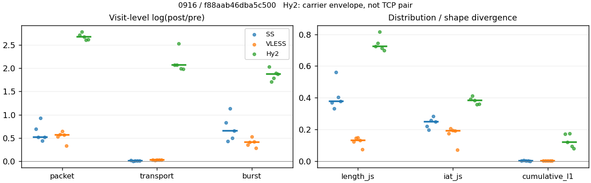
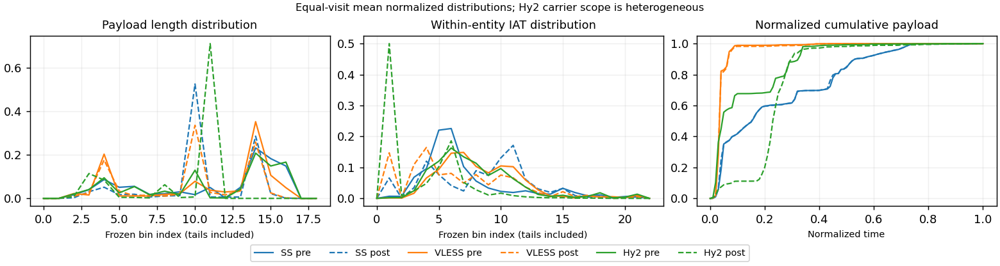

# 0916 · 条目 004 · youtube.com

目标：https://www.youtube.com/watch?v=R6MlUcmOul8

活动标签：youtube.com::video_playback。选定访问 15 次。

[返回总索引](../../README.md) · [统计口径](../../methods.md)

## 覆盖与资格（每次访问均保留）

| 部署 | 重复 | 主请求路由 | 活动状态 | 代理比较 | DIRECT pre | 请求 proxy/direct/unresolved | 错误 |
| --- | --- | --- | --- | --- | --- | --- | --- |
| Hy2 | 1 | proxy | passed | 1 | 1 | 209/1/0 | [] |
| Hy2 | 2 | proxy | passed | 1 | 1 | 217/1/0 | [] |
| Hy2 | 3 | proxy | passed | 1 | 1 | 190/1/0 | [] |
| Hy2 | 4 | proxy | passed | 1 | 1 | 222/1/0 | [] |
| Hy2 | 5 | proxy | passed | 1 | 1 | 211/1/0 | [] |
| SS | 1 | proxy | passed | 1 | 0 | 225/0/0 | [] |
| SS | 2 | proxy | passed | 1 | 0 | 228/0/0 | [] |
| SS | 3 | proxy | passed | 1 | 0 | 225/0/0 | [] |
| SS | 4 | proxy | passed | 1 | 0 | 228/0/0 | [] |
| SS | 5 | proxy | passed | 1 | 0 | 226/0/0 | [] |
| VLESS | 1 | proxy | passed | 1 | 0 | 220/0/0 | [] |
| VLESS | 2 | proxy | passed | 1 | 0 | 237/0/0 | [] |
| VLESS | 3 | proxy | passed | 1 | 0 | 226/0/0 | [] |
| VLESS | 4 | proxy | passed | 1 | 0 | 229/0/0 | [] |
| VLESS | 5 | proxy | passed | 1 | 0 | 231/0/0 | [] |

主请求非 proxy 的统计仅解释为已索引的辅助代理连接或 DIRECT 观测，不代表目标业务经代理传输。播放确认与配对资格是两道不同的门。

图中散点为单次访问，短线为重复中位数；Hy2 是共享载体包络，不能与 TCP 配对作等范围因果对比。

形态图先逐访问归一化，再对访问等权平均；实线 pre，虚线 post。分箱序号及边界见 methods，不将分箱索引误解为长度或时间。

## 每次访问的关键观测

### SS

范围：`exclusive_page`。每格 pre → post；空值为不可观测/不适用。

| 重复 | 包数 | 载荷字节 | burst | TCP FR | IAT中位µs | length JS | IAT JS |
| --- | --- | --- | --- | --- | --- | --- | --- |
| 1 | 4034 → 8095 | 7.871e+06 → 8.0412e+06 | 2671 → 6147 | 226 → 237 | 29.654 → 292.48 | 0.36911 | 0.22147 |
| 2 | 4237 → 7121 | 7.8697e+06 → 7.925e+06 | 2747 → 4219 | 254 → 266 | 26.385 → 116.3 | 0.33312 | 0.19715 |
| 3 | 3447 → 8761 | 7.7725e+06 → 7.8361e+06 | 2435 → 7584 | 225 → 248 | 58.811 → 1042.5 | 0.55976 | 0.25873 |
| 4 | 4771 → 7451 | 7.8144e+06 → 7.8892e+06 | 3394 → 5596 | 241 → 260 | 21.886 → 546.58 | 0.4028 | 0.28351 |
| 5 | 5120 → 8582 | 8.6574e+06 → 8.7699e+06 | 3305 → 6364 | 265 → 276 | 21.142 → 335.49 | 0.37827 | 0.2477 |

完整标量统计：中位数 [min,max]；Δ 为重复内逐访问变换的中位数，MAD 未缩放。n 为可用变换数；DIRECT-only 的 nΔ=0 不代表 pre 不可用。

| scope | 特征 | pre | post | Δ | IQRΔ | MADΔ | nΔ |
| --- | --- | --- | --- | --- | --- | --- | --- |
| exclusive_page | active_span_sum_s_1000ms | 41.251 [35.676, 45.791] | 45.902 [40.717, 53.416] | 0.16329 | 0.034904 | 0.025651 | 5 |
| exclusive_page | active_span_sum_s_100ms | 10.401 [8.7436, 20.615] | 18.471 [17.947, 31.607] | 0.60004 | 0.14486 | 0.11906 | 5 |
| exclusive_page | active_span_sum_s_500ms | 29.435 [27.005, 37.861] | 37.568 [33.82, 48.938] | 0.23529 | 0.03159 | 0.021354 | 5 |
| exclusive_page | burst_bytes_iqr | 3128 [2984, 4344] | 2856 [1428, 2856] | -0.090972 | 0.12581 | 0.047129 | 5 |
| exclusive_page | burst_bytes_mad | 39 [39, 39] | 44 [34, 69] | 0.12063 | 0.3001 | 0.20479 | 5 |
| exclusive_page | burst_bytes_max | 24576 [21888, 26936] | 22848 [9699, 27654] | 0.026307 | 0.25164 | 0.01857 | 5 |
| exclusive_page | burst_bytes_mean | 2864.8 [2302.4, 3192] | 1378 [1033.2, 1878.4] | -0.64232 | 0.32161 | 0.16981 | 5 |
| exclusive_page | burst_bytes_median | 39 [39, 39] | 44 [34, 69] | 0.12063 | 0.3001 | 0.20479 | 5 |
| exclusive_page | burst_bytes_min | 0 [0, 0] | 0 [0, 0] | — | — | — | 0 |
| exclusive_page | burst_bytes_p95 | 14744 [10136, 16384] | 4284 [2856, 7846.4] | -1.1191 | 0.71064 | 0.48829 | 5 |
| exclusive_page | burst_bytes_q25 | 0 [0, 0] | 0 [0, 0] | — | — | — | 0 |
| exclusive_page | burst_bytes_q75 | 3128 [2984, 4344] | 2856 [1428, 2856] | -0.090972 | 0.12581 | 0.047129 | 5 |
| exclusive_page | burst_bytes_std | 5118.3 [4023.4, 5374.9] | 2021.8 [1205.2, 2928] | -0.84019 | 0.29151 | 0.16162 | 5 |
| exclusive_page | burst_count | 2747 [2435, 3394] | 6147 [4219, 7584] | 0.65522 | 0.33347 | 0.17829 | 5 |
| exclusive_page | burst_duration_ms_iqr | 0.025209 [0, 0.032012] | 0 [0, 0.014508] | -0.62942 | — | — | 1 |
| exclusive_page | burst_duration_ms_mad | 0 [0, 0] | 0 [0, 0] | — | — | — | 0 |
| exclusive_page | burst_duration_ms_max | 15001 [15001, 15001] | 21069 [15064, 30686] | 0.33966 | 0.68423 | 0.33548 | 5 |
| exclusive_page | burst_duration_ms_mean | 74.145 [64.873, 149.02] | 23.228 [15.385, 24.48] | -1.4391 | 0.23347 | 0.17316 | 5 |
| exclusive_page | burst_duration_ms_median | 0 [0, 0] | 0 [0, 0] | — | — | — | 0 |
| exclusive_page | burst_duration_ms_min | 0 [0, 0] | 0 [0, 0] | — | — | — | 0 |
| exclusive_page | burst_duration_ms_p95 | 28.618 [7.1451, 52.12] | 0.97473 [0.63542, 1.5053] | -3.4142 | 0.64433 | 0.54358 | 5 |
| exclusive_page | burst_duration_ms_q25 | 0 [0, 0] | 0 [0, 0] | — | — | — | 0 |
| exclusive_page | burst_duration_ms_q75 | 0.025209 [0, 0.032012] | 0 [0, 0.014508] | -0.62942 | — | — | 1 |
| exclusive_page | burst_duration_ms_std | 906.22 [851.15, 1332.1] | 505.88 [342.52, 637.29] | -0.78281 | 0.44795 | 0.18538 | 5 |
| exclusive_page | burst_packets_iqr | 1 [0, 1] | 0 [0, 1] | 0 | — | — | 1 |
| exclusive_page | burst_packets_mad | 0 [0, 0] | 0 [0, 0] | — | — | — | 0 |
| exclusive_page | burst_packets_max | 24 [11, 38] | 11 [9, 11] | -0.93431 | 0.24323 | 0.19671 | 5 |
| exclusive_page | burst_packets_mean | 1.5103 [1.4057, 1.5492] | 1.3315 [1.1552, 1.6878] | -0.13702 | 0.084458 | 0.066265 | 5 |
| exclusive_page | burst_packets_median | 1 [1, 1] | 1 [1, 1] | 0 | 0 | 0 | 5 |
| exclusive_page | burst_packets_min | 1 [1, 1] | 1 [1, 1] | 0 | 0 | 0 | 5 |
| exclusive_page | burst_packets_p95 | 4 [3, 4] | 3 [2, 4] | -0.28768 | 0.28768 | 0.11778 | 5 |
| exclusive_page | burst_packets_q25 | 1 [1, 1] | 1 [1, 1] | 0 | 0 | 0 | 5 |
| exclusive_page | burst_packets_q75 | 2 [1, 2] | 1 [1, 2] | -0.69315 | 0.69315 | 0 | 5 |
| exclusive_page | burst_packets_std | 1.0903 [1.0626, 1.1903] | 0.77079 [0.53544, 1.1332] | -0.39554 | 0.045637 | 0.038965 | 5 |
| exclusive_page | connection_span_concurrency_max | 11 [10, 14] | 11 [10, 13] | 0 | 0 | 0 | 5 |
| exclusive_page | cumulative_l1 | — | — | 0.0015964 | 0.0011594 | 0.00066035 | 5 |
| exclusive_page | cumulative_max | — | — | 0.039138 | 0.073643 | 0.029963 | 5 |
| exclusive_page | direction_entropy | 0.59844 [0.52806, 0.69701] | 0.38279 [0.36031, 0.42442] | -0.17854 | 0.061289 | 0.042105 | 5 |
| exclusive_page | down_burst_count | 1363 [1209, 1689] | 3064 [2099, 3784] | 0.65845 | 0.33565 | 0.17911 | 5 |
| exclusive_page | down_ip_bytes | 7.8401e+06 [7.7513e+06, 8.6846e+06] | 7.9694e+06 [7.9229e+06, 8.8537e+06] | 0.01929 | 0.0052123 | 0.0026112 | 5 |
| exclusive_page | down_packets | 2660 [2006, 3218] | 4504 [4332, 4921] | 0.51323 | 0.17236 | 0.088477 | 5 |
| exclusive_page | down_transport_bytes | 7.6918e+06 [7.6469e+06, 8.5171e+06] | 7.7437e+06 [7.6809e+06, 8.5971e+06] | 0.0067179 | 0.0043579 | 0.0022709 | 5 |
| exclusive_page | duration_s | 62.82 [60.611, 64.359] | 62.819 [60.61, 64.119] | -1.2609e-05 | 1.4193e-05 | 9.3727e-06 | 5 |
| exclusive_page | entity_count | 19 [16, 23] | 19 [16, 23] | 0 | 0 | 0 | 5 |
| exclusive_page | fr_runs | 241 [225, 265] | 260 [237, 276] | 0.047525 | 0.029723 | 0.0068541 | 5 |
| exclusive_page | fr_runs_per_packet | 0.092623 [0.08315, 0.11364] | 0.055222 [0.052203, 0.059118] | -0.03737 | 0.012492 | 0.0094417 | 5 |
| exclusive_page | fr_switches | 225 [207, 242] | 244 [218, 253] | 0.051776 | 0.030848 | 0.0073245 | 5 |
| exclusive_page | fr_switches_per_possible_transition | 0.085502 [0.076485, 0.10596] | 0.050854 [0.048219, 0.055682] | -0.034516 | 0.011651 | 0.008885 | 5 |
| exclusive_page | full_retransmission_fraction | 0.0020308 [0.0014672, 0.0049563] | 0.0065061 [0.0037916, 0.01013] | 0.0044754 | 0.0016819 | 0.0011078 | 5 |
| exclusive_page | full_retransmission_packets | 9 [7, 21] | 57 [27, 82] | 1.7677 | 0.20294 | 0.17825 | 5 |
| exclusive_page | iat_count | 4216 [3430, 5097] | 8076 [7100, 8744] | 0.52121 | 0.18053 | 0.074206 | 5 |
| exclusive_page | iat_js | — | — | 0.2477 | 0.037268 | 0.026235 | 5 |
| exclusive_page | iat_ks | — | — | 0.35762 | 0.053444 | 0.041025 | 5 |
| exclusive_page | iat_median_us | 26.385 [21.142, 58.811] | 335.49 [116.3, 1042.5] | 2.7643 | 0.58624 | 0.45351 | 5 |
| exclusive_page | iat_us_iqr | 82.106 [62.075, 2220.4] | 1028.4 [741.46, 3481.7] | 2.2006 | 0.47754 | 0.44293 | 5 |
| exclusive_page | iat_us_mad | 19.248 [14.473, 48.101] | 332.11 [116.12, 1030.6] | 3.0646 | 0.57348 | 0.41912 | 5 |
| exclusive_page | iat_us_max | 1.5001e+07 [1.5001e+07, 1.5002e+07] | 1.5466e+07 [1.5454e+07, 1.5498e+07] | 0.030494 | 0.0022228 | 0.00074389 | 5 |
| exclusive_page | iat_us_mean | 1.2804e+05 [97926, 1.9975e+05] | 73242 [58296, 81888] | -0.51868 | 0.18086 | 0.071664 | 5 |
| exclusive_page | iat_us_median | 26.385 [21.142, 58.811] | 335.49 [116.3, 1042.5] | 2.7643 | 0.58624 | 0.45351 | 5 |
| exclusive_page | iat_us_min | 0.026 [0.004, 0.07] | 0.034 [0.031, 0.038] | 0.37949 | 1.1304 | 0.60134 | 5 |
| exclusive_page | iat_us_p95 | 43277 [41217, 90945] | 31022 [21471, 33001] | -0.33293 | 0.63295 | 0.068273 | 5 |
| exclusive_page | iat_us_q25 | 12.981 [10.38, 21.94] | 11.552 [7.3193, 39.587] | -0.13945 | 0.72553 | 0.43349 | 5 |
| exclusive_page | iat_us_q75 | 95.087 [72.456, 2242.3] | 1043.1 [748.78, 3521.2] | 2.0662 | 0.44353 | 0.441 | 5 |
| exclusive_page | iat_us_std | 1.2216e+06 [1.0158e+06, 1.5446e+06] | 9.2883e+05 [7.8702e+05, 9.9907e+05] | -0.266 | 0.083853 | 0.046511 | 5 |
| exclusive_page | iat_wasserstein_log1p_us | — | — | 1.4871 | 0.1747 | 0.16417 | 5 |
| exclusive_page | idle_gap_count_1000ms | 55 [53, 69] | 58 [52, 69] | -0.018349 | 0.019048 | 0.018349 | 5 |
| exclusive_page | idle_gap_count_100ms | 154 [146, 177] | 140 [132, 167] | -0.070952 | 0.069106 | 0.05631 | 5 |
| exclusive_page | idle_gap_count_500ms | 70 [66, 84] | 69 [60, 81] | -0.036368 | 0.12095 | 0.051406 | 5 |
| exclusive_page | idle_gap_sum_s_1000ms | 570.93 [377.18, 640.72] | 562.93 [370.8, 588.94] | -0.015204 | 0.0029438 | 0.0018441 | 5 |
| exclusive_page | idle_gap_sum_s_100ms | 598.44 [404.11, 664.53] | 590.36 [395.95, 611.63] | -0.020398 | 0.0089022 | 0.0068056 | 5 |
| exclusive_page | idle_gap_sum_s_500ms | 581.07 [385.85, 647.28] | 571.27 [380.08, 594.74] | -0.017008 | 0.0036793 | 0.0019362 | 5 |
| exclusive_page | ip_bytes | 8.0813e+06 [7.952e+06, 8.9242e+06] | 8.3592e+06 [8.3442e+06, 9.2948e+06] | 0.040689 | 0.015645 | 0.0092535 | 5 |
| exclusive_page | length_iqr | 3600 [3216.5, 7756.5] | 1428 [1232, 1428] | -0.92466 | 0.095027 | 0.075674 | 5 |
| exclusive_page | length_js | — | — | 0.37827 | 0.033693 | 0.024526 | 5 |
| exclusive_page | length_ks | — | — | 0.4869 | 0.041817 | 0.038044 | 5 |
| exclusive_page | length_mad | 1936 [1448, 2787] | 20 [0, 170.5] | -3.2643 | 1.1084 | 0.90529 | 3 |
| exclusive_page | length_max | 8920 [8920, 8948] | 9996 [2856, 21420] | 0.11389 | 0.28768 | 0.15415 | 5 |
| exclusive_page | length_mean | 2988.9 [2716.5, 3925.5] | 1760.7 [1668.3, 1793.8] | -0.52917 | 0.16249 | 0.092109 | 5 |
| exclusive_page | length_median | 2896 [2292, 2896] | 1428 [1428, 1428] | -0.70706 | 0 | 0 | 5 |
| exclusive_page | length_min | 25 [12, 31] | 6 [6, 12] | -1.204 | 0.72594 | 0.43825 | 5 |
| exclusive_page | length_p95 | 8192 [8192, 8192] | 2856 [2856, 4284] | -1.0537 | 0 | 0 | 5 |
| exclusive_page | length_q25 | 496 [435.5, 813] | 1428 [1428, 1428] | 1.0575 | 0.47864 | 0.13008 | 5 |
| exclusive_page | length_q75 | 4344 [3960.5, 8192] | 2856 [2660, 2856] | -0.41937 | 0.058785 | 0.058785 | 5 |
| exclusive_page | length_std | 2635.8 [2314.4, 3363.2] | 1008.6 [774.99, 1227.9] | -0.9077 | 0.097832 | 0.06031 | 5 |
| exclusive_page | length_wasserstein_bytes | — | — | 1526.3 | 390.01 | 203.22 | 5 |
| exclusive_page | nonempty_entity_count | 19 [16, 23] | 19 [16, 23] | 0 | 0 | 0 | 5 |
| exclusive_page | nonempty_packets | 2633 [1980, 3187] | 4540 [4398, 4998] | 0.53618 | 0.17097 | 0.086218 | 5 |
| exclusive_page | offload_suspect_fraction | 0.37314 [0.35737, 0.38101] | 0.18678 [0.138, 0.21093] | -0.19423 | 0.032515 | 0.028666 | 5 |
| exclusive_page | packet_count | 4237 [3447, 5120] | 8095 [7121, 8761] | 0.51919 | 0.17998 | 0.0734 | 5 |
| exclusive_page | rtt_median_ms | 0.047017 [0.023808, 0.069899] | 33.041 [32.518, 37.978] | 6.6183 | 0.28394 | 0.20796 | 5 |
| exclusive_page | rtt_sample_count | 1533 [1383, 1868] | 868 [760, 1389] | -0.70166 | 0.20875 | 0.17144 | 5 |
| exclusive_page | tcp_ack_count | 4216 [3427, 5097] | 8075 [7098, 8742] | 0.52093 | 0.18087 | 0.074732 | 5 |
| exclusive_page | tcp_fin_count | 38 [32, 44] | 44 [33, 51] | 0.1466 | 0.10112 | 0.040608 | 5 |
| exclusive_page | tcp_packet_count | 4237 [3447, 5120] | 8095 [7121, 8761] | 0.51919 | 0.17998 | 0.0734 | 5 |
| exclusive_page | tcp_rst_count | 0 [0, 3] | 0 [0, 0] | — | — | — | 0 |
| exclusive_page | tcp_syn_count | 38 [32, 46] | 40 [37, 50] | 0.083382 | 0.033264 | 0.032088 | 5 |
| exclusive_page | tcp_window_raw_median | 65535 [65535, 65535] | 168 [166, 168] | -5.9664 | 0.011976 | 0 | 5 |
| exclusive_page | transition_entropy | 0.36579 [0.32714, 0.43825] | 0.23321 [0.22099, 0.25054] | -0.12589 | 0.046186 | 0.027278 | 5 |
| exclusive_page | transition_n_mm | 2127 [1501, 2679] | 4117 [3945, 4482] | 0.62808 | 0.20903 | 0.10496 | 5 |
| exclusive_page | transition_n_mp | 109 [100, 115] | 119 [106, 122] | 0.059089 | 0.029507 | 0.0073532 | 5 |
| exclusive_page | transition_n_pm | 116 [107, 127] | 125 [112, 131] | 0.04879 | 0.029054 | 0.01778 | 5 |
| exclusive_page | transition_n_pp | 246 [236, 254] | 212 [186, 249] | -0.18075 | 0.22566 | 0.061893 | 5 |
| exclusive_page | transition_p_mm | 0.95188 [0.93695, 0.95884] | 0.9735 [0.97072, 0.9749] | 0.021457 | 0.0077233 | 0.0061581 | 5 |
| exclusive_page | transition_p_mp | 0.048123 [0.04116, 0.063046] | 0.026499 [0.025101, 0.029281] | -0.021457 | 0.0077233 | 0.0061581 | 5 |
| exclusive_page | transition_p_pm | 0.32044 [0.2964, 0.34324] | 0.35758 [0.336, 0.39308] | 0.061177 | 0.050466 | 0.011463 | 5 |
| exclusive_page | transition_p_pp | 0.67956 [0.65676, 0.7036] | 0.64242 [0.60692, 0.664] | -0.061177 | 0.050466 | 0.011463 | 5 |
| exclusive_page | transport_bytes | 7.8697e+06 [7.7725e+06, 8.6574e+06] | 7.925e+06 [7.8361e+06, 8.7699e+06] | 0.0095251 | 0.0047478 | 0.0025154 | 5 |
| exclusive_page | up_burst_count | 1384 [1226, 1705] | 3083 [2120, 3800] | 0.65202 | 0.33131 | 0.17748 | 5 |
| exclusive_page | up_byte_fraction | 0.016215 [0.015688, 0.02625] | 0.019701 [0.018447, 0.028211] | 0.0027593 | 0.0015242 | 0.00079806 | 5 |
| exclusive_page | up_ip_bytes | 2.228e+05 [2.0071e+05, 2.89e+05] | 4.1595e+05 [3.7479e+05, 4.4103e+05] | 0.61024 | 0.12642 | 0.090131 | 5 |
| exclusive_page | up_packets | 1577 [1441, 1923] | 3591 [2677, 4115] | 0.65483 | 0.30778 | 0.1712 | 5 |
| exclusive_page | up_transport_bytes | 1.3462e+05 [1.2259e+05, 2.0658e+05] | 1.5514e+05 [1.4553e+05, 2.2358e+05] | 0.17155 | 0.10127 | 0.039726 | 5 |
| exclusive_page | zero_iat_count | 0 [0, 0] | 0 [0, 0] | — | — | — | 0 |
| exclusive_page | zero_iat_fraction | 0 [0, 0] | 0 [0, 0] | 0 | 0 | 0 | 5 |

### VLESS

范围：`exclusive_page`。每格 pre → post；空值为不可观测/不适用。

| 重复 | 包数 | 载荷字节 | burst | TCP FR | IAT中位µs | length JS | IAT JS |
| --- | --- | --- | --- | --- | --- | --- | --- |
| 1 | 3311 → 5631 | 4.3534e+06 → 4.4891e+06 | 2408 → 3432 | 156 → 190 | 139.19 → 18.317 | 0.12172 | 0.17293 |
| 2 | 5013 → 8898 | 7.1229e+06 → 7.2662e+06 | 3762 → 5700 | 156 → 194 | 137.62 → 13.782 | 0.14633 | 0.205 |
| 3 | 2819 → 5384 | 4.2686e+06 → 4.3953e+06 | 1867 → 3180 | 132 → 166 | 126.47 → 11.941 | 0.14706 | 0.19472 |
| 4 | 3350 → 5932 | 4.346e+06 → 4.4768e+06 | 2447 → 3743 | 146 → 182 | 126.17 → 14.12 | 0.13103 | 0.19245 |
| 5 | 3197 → 4474 | 4.3319e+06 → 4.4614e+06 | 2439 → 3233 | 142 → 178 | 76.31 → 54.772 | 0.073026 | 0.070464 |

完整标量统计：中位数 [min,max]；Δ 为重复内逐访问变换的中位数，MAD 未缩放。n 为可用变换数；DIRECT-only 的 nΔ=0 不代表 pre 不可用。

| scope | 特征 | pre | post | Δ | IQRΔ | MADΔ | nΔ |
| --- | --- | --- | --- | --- | --- | --- | --- |
| exclusive_page | active_span_sum_s_1000ms | 25.446 [22.708, 26.189] | 26.115 [23.859, 26.845] | 0.047681 | 0.0247 | 0.022961 | 5 |
| exclusive_page | active_span_sum_s_100ms | 3.774 [3.0282, 4.7335] | 10.296 [9.4213, 11.846] | 1.0479 | 0.075246 | 0.04428 | 5 |
| exclusive_page | active_span_sum_s_500ms | 12.049 [11.673, 13.602] | 24.153 [23.859, 26.688] | 0.69473 | 0.012554 | 0.0064007 | 5 |
| exclusive_page | burst_bytes_iqr | 2896 [2824, 2896] | 2824 [2824, 2824] | -0.025176 | 0 | 0 | 5 |
| exclusive_page | burst_bytes_mad | 0 [0, 24] | 36 [31, 40] | 0.40547 | 0 | 0 | 2 |
| exclusive_page | burst_bytes_max | 20480 [20480, 21640] | 11872 [11296, 29652] | -0.54527 | 0.69199 | 0.049734 | 5 |
| exclusive_page | burst_bytes_mean | 1807.9 [1776, 2286.3] | 1308 [1196, 1382.2] | -0.39536 | 0.071946 | 0.071714 | 5 |
| exclusive_page | burst_bytes_median | 0 [0, 24] | 36 [31, 40] | 0.40547 | 0 | 0 | 2 |
| exclusive_page | burst_bytes_min | 0 [0, 0] | 0 [0, 0] | — | — | — | 0 |
| exclusive_page | burst_bytes_p95 | 8760 [8688, 11376] | 4344 [4236, 5648] | -0.7014 | 0.021041 | 0.016923 | 5 |
| exclusive_page | burst_bytes_q25 | 0 [0, 0] | 0 [0, 0] | — | — | — | 0 |
| exclusive_page | burst_bytes_q75 | 2896 [2824, 2896] | 2824 [2824, 2824] | -0.025176 | 0 | 0 | 5 |
| exclusive_page | burst_bytes_std | 3306.9 [3190.1, 3938.3] | 1699.1 [1591.5, 2253] | -0.67824 | 0.029488 | 0.017171 | 5 |
| exclusive_page | burst_count | 2439 [1867, 3762] | 3432 [3180, 5700] | 0.41552 | 0.070678 | 0.061169 | 5 |
| exclusive_page | burst_duration_ms_iqr | 0.10719 [0, 0.43775] | 0.0026145 [0, 0.005023] | -4.2085 | 0.89996 | 0.3508 | 4 |
| exclusive_page | burst_duration_ms_mad | 0 [0, 0] | 0 [0, 0] | — | — | — | 0 |
| exclusive_page | burst_duration_ms_max | 15001 [15001, 15001] | 15031 [15009, 15059] | 0.0019877 | 0.0010628 | 0.00098399 | 5 |
| exclusive_page | burst_duration_ms_mean | 91.414 [49.864, 109.4] | 13.191 [9.7587, 15.266] | -1.9319 | 0.18601 | 0.048019 | 5 |
| exclusive_page | burst_duration_ms_median | 0 [0, 0] | 0 [0, 0] | — | — | — | 0 |
| exclusive_page | burst_duration_ms_min | 0 [0, 0] | 0 [0, 0] | — | — | — | 0 |
| exclusive_page | burst_duration_ms_p95 | 5.7235 [2.495, 10.616] | 3.376 [2.3101, 7.1348] | -0.4407 | 0.57954 | 0.31089 | 5 |
| exclusive_page | burst_duration_ms_q25 | 0 [0, 0] | 0 [0, 0] | — | — | — | 0 |
| exclusive_page | burst_duration_ms_q75 | 0.10719 [0, 0.43775] | 0.0026145 [0, 0.005023] | -4.2085 | 0.89996 | 0.3508 | 4 |
| exclusive_page | burst_duration_ms_std | 1042 [743.4, 1135.6] | 334.12 [259.19, 387.22] | -1.0965 | 0.20931 | 0.10667 | 5 |
| exclusive_page | burst_packets_iqr | 1 [0, 1] | 1 [0, 1] | 0 | 0 | 0 | 4 |
| exclusive_page | burst_packets_mad | 0 [0, 0] | 0 [0, 0] | — | — | — | 0 |
| exclusive_page | burst_packets_max | 7 [6, 8] | 8 [8, 10] | 0.13353 | 0.015748 | 0.015748 | 5 |
| exclusive_page | burst_packets_mean | 1.369 [1.3108, 1.5099] | 1.5848 [1.3839, 1.6931] | 0.14638 | 0.043776 | 0.030314 | 5 |
| exclusive_page | burst_packets_median | 1 [1, 1] | 1 [1, 1] | 0 | 0 | 0 | 5 |
| exclusive_page | burst_packets_min | 1 [1, 1] | 1 [1, 1] | 0 | 0 | 0 | 5 |
| exclusive_page | burst_packets_p95 | 2 [2, 3] | 3 [3, 4] | 0.40547 | 0 | 0 | 5 |
| exclusive_page | burst_packets_q25 | 1 [1, 1] | 1 [1, 1] | 0 | 0 | 0 | 5 |
| exclusive_page | burst_packets_q75 | 2 [1, 2] | 2 [1, 2] | 0 | 0 | 0 | 5 |
| exclusive_page | burst_packets_std | 0.61707 [0.60015, 0.68207] | 0.90163 [0.84284, 1.006] | 0.37921 | 0.024388 | 0.01497 | 5 |
| exclusive_page | connection_span_concurrency_max | 10 [9, 10] | 10 [9, 11] | 0 | 0 | 0 | 5 |
| exclusive_page | cumulative_l1 | — | — | 0.0029155 | 0.00075699 | 0.00040479 | 5 |
| exclusive_page | cumulative_max | — | — | 0.048771 | 0.029638 | 0.019614 | 5 |
| exclusive_page | direction_entropy | 0.36488 [0.26951, 0.39381] | 0.29304 [0.22291, 0.34415] | -0.057619 | 0.025242 | 0.01422 | 5 |
| exclusive_page | down_burst_count | 1211 [925, 1872] | 1707 [1582, 2841] | 0.41715 | 0.070853 | 0.060557 | 5 |
| exclusive_page | down_ip_bytes | 4.3931e+06 [4.3069e+06, 7.2169e+06] | 4.5551e+06 [4.4657e+06, 7.4225e+06] | 0.036203 | 0.0071611 | 5.1286e-05 | 5 |
| exclusive_page | down_packets | 2013 [1807, 3045] | 3166 [2511, 4929] | 0.47068 | 0.028792 | 0.017837 | 5 |
| exclusive_page | down_transport_bytes | 4.2873e+06 [4.2128e+06, 7.0585e+06] | 4.3857e+06 [4.3065e+06, 7.166e+06] | 0.022284 | 0.00070932 | 0.0004179 | 5 |
| exclusive_page | duration_s | 62.763 [59.935, 63.704] | 62.744 [59.861, 63.666] | -0.00070387 | 0.00013949 | 0.00010047 | 5 |
| exclusive_page | entity_count | 17 [17, 18] | 17 [17, 18] | 0 | 0 | 0 | 5 |
| exclusive_page | fr_runs | 146 [132, 156] | 182 [166, 194] | 0.2204 | 0.0079543 | 0.0055564 | 5 |
| exclusive_page | fr_runs_per_packet | 0.075906 [0.052472, 0.080745] | 0.057233 [0.039967, 0.072861] | -0.017068 | 0.0067515 | 0.0032826 | 5 |
| exclusive_page | fr_switches | 129 [115, 138] | 165 [149, 176] | 0.24613 | 0.0098603 | 0.0069576 | 5 |
| exclusive_page | fr_switches_per_possible_transition | 0.066783 [0.046701, 0.0721] | 0.052166 [0.036394, 0.066364] | -0.014056 | 0.0058039 | 0.0025752 | 5 |
| exclusive_page | full_retransmission_fraction | 0.00070947 [0.00019948, 0.0012512] | 0 [0, 0] | -0.00070947 | 0.00060756 | 0.00041096 | 5 |
| exclusive_page | full_retransmission_packets | 2 [1, 4] | 0 [0, 0] | — | — | — | 0 |
| exclusive_page | iat_count | 3293 [2802, 4995] | 5613 [4457, 8880] | 0.57362 | 0.042078 | 0.040332 | 5 |
| exclusive_page | iat_js | — | — | 0.19245 | 0.021784 | 0.012551 | 5 |
| exclusive_page | iat_ks | — | — | 0.39309 | 0.028962 | 0.021334 | 5 |
| exclusive_page | iat_median_us | 126.47 [76.31, 139.19] | 14.12 [11.941, 54.772] | -2.1901 | 0.27317 | 0.16208 | 5 |
| exclusive_page | iat_us_iqr | 863.44 [789.87, 974.33] | 422.17 [278.89, 776.89] | -0.70981 | 0.41853 | 0.25527 | 5 |
| exclusive_page | iat_us_mad | 116.78 [68.699, 127.75] | 14.074 [11.897, 54.665] | -2.0965 | 0.25254 | 0.1518 | 5 |
| exclusive_page | iat_us_max | 1.5001e+07 [1.5001e+07, 1.5002e+07] | 1.5447e+07 [1.5378e+07, 1.5484e+07] | 0.029258 | 0.001933 | 0.0016693 | 5 |
| exclusive_page | iat_us_mean | 1.6227e+05 [89946, 1.7459e+05] | 88843 [52060, 1.1565e+05] | -0.5468 | 0.040589 | 0.028079 | 5 |
| exclusive_page | iat_us_median | 126.47 [76.31, 139.19] | 14.12 [11.941, 54.772] | -2.1901 | 0.27317 | 0.16208 | 5 |
| exclusive_page | iat_us_min | 0.142 [0.027, 0.527] | 0.031 [0.031, 0.032] | -1.5218 | 1.2405 | 0.828 | 5 |
| exclusive_page | iat_us_p95 | 9755.6 [6556.2, 11118] | 11960 [5156.1, 40912] | 0.11212 | 1.1218 | 0.35233 | 5 |
| exclusive_page | iat_us_q25 | 33.036 [22.789, 39.992] | 4.5237 [3.449, 8.289] | -2.0421 | 0.061876 | 0.042168 | 5 |
| exclusive_page | iat_us_q75 | 903.43 [812.66, 1008.6] | 426.46 [282.34, 785.18] | -0.73747 | 0.42354 | 0.25923 | 5 |
| exclusive_page | iat_us_std | 1.459e+06 [1.072e+06, 1.4899e+06] | 1.0903e+06 [8.2085e+05, 1.2403e+06] | -0.26696 | 0.032922 | 0.023851 | 5 |
| exclusive_page | iat_wasserstein_log1p_us | — | — | 1.582 | 0.11681 | 0.065727 | 5 |
| exclusive_page | idle_gap_count_1000ms | 42 [39, 51] | 39 [36, 43] | -0.074108 | 0.055945 | 0.05001 | 5 |
| exclusive_page | idle_gap_count_100ms | 101 [97, 116] | 119 [112, 122] | 0.13847 | 0.018625 | 0.013307 | 5 |
| exclusive_page | idle_gap_count_500ms | 60 [56, 69] | 41 [36, 43] | -0.38946 | 0.053175 | 0.0086923 | 5 |
| exclusive_page | idle_gap_sum_s_1000ms | 492.02 [423.09, 549.46] | 489.34 [435.45, 547.64] | -0.0032076 | 0.0034064 | 0.0022555 | 5 |
| exclusive_page | idle_gap_sum_s_100ms | 512.25 [444.55, 570.76] | 505.16 [450.57, 562.49] | -0.014166 | 0.00050985 | 0.00029377 | 5 |
| exclusive_page | idle_gap_sum_s_500ms | 503.98 [436.23, 561.31] | 491.32 [436.32, 547.64] | -0.025282 | 0.00080055 | 0.00063697 | 5 |
| exclusive_page | ip_bytes | 4.5201e+06 [4.4151e+06, 7.3834e+06] | 4.7942e+06 [4.6874e+06, 7.7494e+06] | 0.057677 | 0.01149 | 0.0021958 | 5 |
| exclusive_page | length_iqr | 2717 [1821, 2774] | 2312.2 [1288, 2583] | -0.071339 | 0.24618 | 0.16367 | 5 |
| exclusive_page | length_js | — | — | 0.13103 | 0.024603 | 0.015292 | 5 |
| exclusive_page | length_ks | — | — | 0.27275 | 0.039159 | 0.031624 | 5 |
| exclusive_page | length_mad | 1103.5 [766, 1376] | 1160 [825.5, 1340] | 0.11015 | 0.29592 | 0.28091 | 5 |
| exclusive_page | length_max | 8920 [8920, 8920] | 8688 [5936, 14120] | -0.026353 | 0.33647 | 0.18232 | 5 |
| exclusive_page | length_mean | 2389.3 [2211.7, 2454.6] | 1471 [1407.8, 1826.2] | -0.45173 | 0.031393 | 0.018584 | 5 |
| exclusive_page | length_median | 2178 [1592, 2824] | 1412 [1412, 1412] | -0.4334 | 0.28012 | 0.1948 | 5 |
| exclusive_page | length_min | 23 [1, 24] | 11 [1, 24] | 0 | 0.6131 | 0.31845 | 5 |
| exclusive_page | length_p95 | 7276 [7060, 8920] | 2896 [2824, 4236] | -0.91629 | 0.0049601 | 0.0049601 | 5 |
| exclusive_page | length_q25 | 143 [100, 1075] | 393 [241, 670.5] | 0.62814 | 0.90544 | 0.85281 | 5 |
| exclusive_page | length_q75 | 2896 [2824, 2896] | 2824 [1556, 2824] | -0.025176 | 0 | 0 | 5 |
| exclusive_page | length_std | 2119.6 [2050.5, 2422] | 1095.7 [1038, 1515.1] | -0.64838 | 0.038248 | 0.03245 | 5 |
| exclusive_page | length_wasserstein_bytes | — | — | 830.09 | 90.642 | 73.652 | 5 |
| exclusive_page | nonempty_entity_count | 17 [17, 18] | 17 [17, 18] | 0 | 0 | 0 | 5 |
| exclusive_page | nonempty_packets | 1932 [1739, 2973] | 3090 [2443, 4854] | 0.48139 | 0.020616 | 0.011774 | 5 |
| exclusive_page | offload_suspect_fraction | 0.32498 [0.31279, 0.36665] | 0.17475 [0.15239, 0.23827] | -0.1697 | 0.034761 | 0.018372 | 5 |
| exclusive_page | packet_count | 3311 [2819, 5013] | 5631 [4474, 8898] | 0.5714 | 0.042755 | 0.040364 | 5 |
| exclusive_page | rtt_median_ms | 0.11681 [0.058692, 0.27041] | 0.049712 [0.031392, 0.063548] | -0.84632 | 0.16189 | 0.15389 | 5 |
| exclusive_page | rtt_sample_count | 1260 [965, 1929] | 1986 [1691, 3150] | 0.4904 | 0.042775 | 0.024999 | 5 |
| exclusive_page | tcp_ack_count | 3258 [2770, 4963] | 5613 [4457, 8876] | 0.58134 | 0.038991 | 0.037369 | 5 |
| exclusive_page | tcp_fin_count | 32 [31, 35] | 34 [34, 38] | 0.060625 | 0.064202 | 0.032454 | 5 |
| exclusive_page | tcp_packet_count | 3311 [2819, 5013] | 5631 [4474, 8898] | 0.5714 | 0.042755 | 0.040364 | 5 |
| exclusive_page | tcp_rst_count | 32 [31, 35] | 0 [0, 3] | -2.3671 | — | — | 1 |
| exclusive_page | tcp_syn_count | 34 [34, 36] | 34 [34, 38] | 0 | 0 | 0 | 5 |
| exclusive_page | tcp_window_raw_median | 65535 [65535, 65535] | 184 [180, 195] | -5.8754 | 0.04325 | 0.021979 | 5 |
| exclusive_page | transition_entropy | 0.25511 [0.18746, 0.27563] | 0.20968 [0.15511, 0.25375] | -0.045428 | 0.013168 | 0.0052914 | 5 |
| exclusive_page | transition_n_mm | 1704 [1559, 2758] | 2816 [2197, 4583] | 0.50785 | 0.0084866 | 0.005509 | 5 |
| exclusive_page | transition_n_mp | 56 [49, 60] | 74 [66, 79] | 0.27871 | 0.012579 | 0.0089687 | 5 |
| exclusive_page | transition_n_pm | 73 [66, 78] | 91 [83, 97] | 0.2204 | 0.0079543 | 0.0055564 | 5 |
| exclusive_page | transition_n_pp | 63 [48, 72] | 73 [68, 84] | 0.15415 | 0.13469 | 0.077778 | 5 |
| exclusive_page | transition_p_mm | 0.96908 [0.96599, 0.97871] | 0.97533 [0.96827, 0.98305] | 0.0062473 | 0.0027056 | 0.0011504 | 5 |
| exclusive_page | transition_p_mp | 0.030922 [0.021292, 0.034014] | 0.024675 [0.016946, 0.031732] | -0.0062473 | 0.0027056 | 0.0011504 | 5 |
| exclusive_page | transition_p_pm | 0.53285 [0.52, 0.57895] | 0.55488 [0.53073, 0.56688] | 0.010726 | 0.033903 | 0.022598 | 5 |
| exclusive_page | transition_p_pp | 0.46715 [0.42105, 0.48] | 0.44512 [0.43312, 0.46927] | -0.010726 | 0.033903 | 0.022598 | 5 |
| exclusive_page | transport_bytes | 4.346e+06 [4.2686e+06, 7.1229e+06] | 4.4768e+06 [4.3953e+06, 7.2662e+06] | 0.029458 | 0.00041157 | 0.00020644 | 5 |
| exclusive_page | up_burst_count | 1228 [942, 1890] | 1725 [1598, 2859] | 0.4139 | 0.070502 | 0.061765 | 5 |
| exclusive_page | up_byte_fraction | 0.013452 [0.0090417, 0.014396] | 0.02035 [0.013781, 0.0214] | 0.0070032 | 0.0002088 | 0.00013532 | 5 |
| exclusive_page | up_ip_bytes | 1.2696e+05 [1.0816e+05, 1.6651e+05] | 2.3634e+05 [2.0134e+05, 3.2685e+05] | 0.65277 | 0.076182 | 0.0545 | 5 |
| exclusive_page | up_packets | 1312 [1012, 1968] | 2465 [1963, 3969] | 0.7015 | 0.067973 | 0.060129 | 5 |
| exclusive_page | up_transport_bytes | 58697 [55760, 64403] | 91479 [88791, 1.0014e+05] | 0.44139 | 0.011379 | 0.0095816 | 5 |
| exclusive_page | zero_iat_count | 0 [0, 0] | 0 [0, 0] | — | — | — | 0 |
| exclusive_page | zero_iat_fraction | 0 [0, 0] | 0 [0, 0] | 0 | 0 | 0 | 5 |

### Hy2

范围：`carrier_context_envelope`。每格 pre → post；空值为不可观测/不适用。

| 重复 | 包数 | 载荷字节 | burst | TCP FR | IAT中位µs | length JS | IAT JS |
| --- | --- | --- | --- | --- | --- | --- | --- |
| 1 | 3803 → 57166 | 7.8292e+06 → 6.1953e+07 | 2426 → 18463 | — | 94.689 → 3.148 | 0.72464 | 0.39166 |
| 2 | 3256 → 52462 | 7.7722e+06 → 6.1406e+07 | 2042 → 11296 | — | 56.906 → 0.15 | 0.74325 | 0.41105 |
| 3 | 3228 → 47042 | 4.2073e+06 → 5.2788e+07 | 2199 → 13171 | — | 125 → 0.198 | 0.81544 | 0.38252 |
| 4 | 3969 → 53860 | 7.9174e+06 → 5.8131e+07 | 2644 → 17569 | — | 74.855 → 3.925 | 0.71252 | 0.35847 |
| 5 | 3851 → 52777 | 7.7957e+06 → 5.6579e+07 | 2752 → 17894 | — | 73.789 → 4.3975 | 0.69774 | 0.35956 |

范围：`direct_pre_only`。每格 pre → post；空值为不可观测/不适用。

| 重复 | 包数 | 载荷字节 | burst | TCP FR | IAT中位µs | length JS | IAT JS |
| --- | --- | --- | --- | --- | --- | --- | --- |
| 1 | 31 → — | 8615 → — | 23 → — | 5 → — | 183.1 → — | — | — |
| 2 | 29 → — | 8639 → — | 21 → — | 7 → — | 311 → — | — | — |
| 3 | 31 → — | 8671 → — | 21 → — | 7 → — | 141.73 → — | — | — |
| 4 | 33 → — | 8680 → — | 25 → — | 7 → — | 145.38 → — | — | — |
| 5 | 33 → — | 8638 → — | 25 → — | 7 → — | 150.9 → — | — | — |

完整标量统计：中位数 [min,max]；Δ 为重复内逐访问变换的中位数，MAD 未缩放。n 为可用变换数；DIRECT-only 的 nΔ=0 不代表 pre 不可用。

| scope | 特征 | pre | post | Δ | IQRΔ | MADΔ | nΔ |
| --- | --- | --- | --- | --- | --- | --- | --- |
| carrier_context_envelope | active_span_sum_s_1000ms | 28.712 [25.844, 36.681] | 29.124 [23.299, 40.905] | 0.066679 | 0.22829 | 0.15436 | 5 |
| carrier_context_envelope | active_span_sum_s_100ms | 3.8865 [3.4146, 4.4957] | 11.487 [10.297, 12.991] | 1.0912 | 0.041489 | 0.034004 | 5 |
| carrier_context_envelope | active_span_sum_s_500ms | 23.582 [21.499, 31.051] | 27.341 [21.73, 37.628] | 0.1479 | 0.18146 | 0.12224 | 5 |
| carrier_context_envelope | burst_bytes_iqr | 2830 [2242.5, 5064] | 5100 [4546, 5726] | 0.58346 | 0.11641 | 0.1109 | 5 |
| carrier_context_envelope | burst_bytes_mad | 39 [0, 39] | 272.5 [270, 363] | 1.9432 | 0.075373 | 0.0046083 | 4 |
| carrier_context_envelope | burst_bytes_max | 26854 [20480, 28672] | 2.9648e+05 [1.3972e+05, 4.0072e+05] | 2.6145 | 0.2811 | 0.2081 | 5 |
| carrier_context_envelope | burst_bytes_mean | 2994.5 [1913.3, 3806.1] | 3355.5 [3161.9, 5436.1] | 0.10993 | 0.25665 | 0.070941 | 5 |
| carrier_context_envelope | burst_bytes_median | 39 [0, 39] | 306.5 [303, 397] | 2.0592 | 0.07123 | 0.0057425 | 4 |
| carrier_context_envelope | burst_bytes_min | 0 [0, 0] | 22 [22, 25] | — | — | — | 0 |
| carrier_context_envelope | burst_bytes_p95 | 17030 [9905, 20480] | 11528 [11510, 22460] | -0.37652 | 0.48246 | 0.19815 | 5 |
| carrier_context_envelope | burst_bytes_q25 | 0 [0, 0] | 69 [38, 96] | — | — | — | 0 |
| carrier_context_envelope | burst_bytes_q75 | 2830 [2242.5, 5064] | 5168 [4642, 5764] | 0.60221 | 0.10875 | 0.10875 | 5 |
| carrier_context_envelope | burst_bytes_std | 5382.2 [3653.2, 6382.4] | 7204.4 [5901.8, 14601] | 0.26594 | 0.50705 | 0.14232 | 5 |
| carrier_context_envelope | burst_count | 2426 [2042, 2752] | 17569 [11296, 18463] | 1.8721 | 0.10383 | 0.082123 | 5 |
| carrier_context_envelope | burst_duration_ms_iqr | 0.046402 [0.0099773, 0.36345] | 0.025531 [0.025207, 0.043005] | -0.32586 | 1.0936 | 1.0364 | 5 |
| carrier_context_envelope | burst_duration_ms_mad | 0 [0, 0] | 4.7e-05 [4.5e-05, 0.000108] | — | — | — | 0 |
| carrier_context_envelope | burst_duration_ms_max | 15001 [15001, 15001] | 3924.3 [2948.1, 7188.6] | -1.3409 | 0.40297 | 0.22213 | 5 |
| carrier_context_envelope | burst_duration_ms_mean | 126.51 [82.788, 155.12] | 1.8842 [1.3491, 2.0049] | -4.1953 | 0.24026 | 0.21535 | 5 |
| carrier_context_envelope | burst_duration_ms_median | 0 [0, 0] | 4.7e-05 [4.5e-05, 0.000108] | — | — | — | 0 |
| carrier_context_envelope | burst_duration_ms_min | 0 [0, 0] | 0 [0, 0] | — | — | — | 0 |
| carrier_context_envelope | burst_duration_ms_p95 | 45.122 [6.059, 227.41] | 0.13613 [0.12183, 0.44353] | -5.9145 | 0.98376 | 0.59995 | 5 |
| carrier_context_envelope | burst_duration_ms_q25 | 0 [0, 0] | 0 [0, 0] | — | — | — | 0 |
| carrier_context_envelope | burst_duration_ms_q75 | 0.046402 [0.0099773, 0.36345] | 0.025531 [0.025207, 0.043005] | -0.32586 | 1.0936 | 1.0364 | 5 |
| carrier_context_envelope | burst_duration_ms_std | 1222.1 [1015.1, 1392.8] | 56.137 [49.359, 89.449] | -3.105 | 0.13929 | 0.070692 | 5 |
| carrier_context_envelope | burst_packets_iqr | 1 [1, 1] | 3 [3, 3] | 1.0986 | 0 | 0 | 5 |
| carrier_context_envelope | burst_packets_mad | 0 [0, 0] | 1 [1, 1] | — | — | — | 0 |
| carrier_context_envelope | burst_packets_max | 20 [11, 32] | 215 [103, 288] | 2.6184 | 0.77893 | 0.3543 | 5 |
| carrier_context_envelope | burst_packets_mean | 1.5011 [1.3993, 1.5945] | 3.0962 [2.9494, 4.6443] | 0.74561 | 0.17513 | 0.064961 | 5 |
| carrier_context_envelope | burst_packets_median | 1 [1, 1] | 2 [2, 2] | 0.69315 | 0 | 0 | 5 |
| carrier_context_envelope | burst_packets_min | 1 [1, 1] | 1 [1, 1] | 0 | 0 | 0 | 5 |
| carrier_context_envelope | burst_packets_p95 | 3 [3, 3] | 9 [8, 16] | 1.0986 | 0.31845 | 0.11778 | 5 |
| carrier_context_envelope | burst_packets_q25 | 1 [1, 1] | 1 [1, 1] | 0 | 0 | 0 | 5 |
| carrier_context_envelope | burst_packets_q75 | 2 [2, 2] | 4 [4, 4] | 0.69315 | 0 | 0 | 5 |
| carrier_context_envelope | burst_packets_std | 0.94039 [0.79605, 1.1167] | 5.007 [4.0515, 10.349] | 1.6723 | 0.39237 | 0.19741 | 5 |
| carrier_context_envelope | connection_span_concurrency_max | 13 [13, 15] | 1 [1, 1] | -2.5649 | 0.074108 | 0 | 5 |
| carrier_context_envelope | cumulative_l1 | — | — | 0.11847 | 0.077111 | 0.038145 | 5 |
| carrier_context_envelope | cumulative_max | — | — | 0.40896 | 0.38702 | 0.0052497 | 5 |
| carrier_context_envelope | direction_entropy | 0.65197 [0.61761, 0.6937] | 0.75199 [0.61187, 0.77166] | 0.10758 | 0.13183 | 0.04044 | 5 |
| carrier_context_envelope | direction_run_analog_runs | 236 [222, 266] | 17569 [11296, 18463] | 4.1904 | 0.43017 | 0.17248 | 5 |
| carrier_context_envelope | direction_run_analog_runs_per_packet | 0.11056 [0.10038, 0.14894] | 0.32297 [0.21532, 0.33905] | 0.21424 | 0.091541 | 0.023741 | 5 |
| carrier_context_envelope | direction_run_analog_switches | 210 [201, 242] | 17568 [11295, 18462] | 4.2849 | 0.26763 | 0.16016 | 5 |
| carrier_context_envelope | direction_run_analog_switches_per_possible_transition | 0.10116 [0.092664, 0.1201] | 0.32296 [0.2153, 0.33904] | 0.22329 | 0.070422 | 0.021909 | 5 |
| carrier_context_envelope | down_burst_count | 1203 [1011, 1367] | 8784 [5648, 9231] | 1.8787 | 0.086703 | 0.062498 | 5 |
| carrier_context_envelope | down_ip_bytes | 7.7862e+06 [4.1658e+06, 7.8869e+06] | 5.8311e+07 [5.3185e+07, 6.2026e+07] | 2.0703 | 0.078651 | 0.069694 | 5 |
| carrier_context_envelope | down_packets | 2290 [1872, 2433] | 42029 [38221, 44843] | 2.9344 | 0.13554 | 0.08199 | 5 |
| carrier_context_envelope | down_transport_bytes | 7.667e+06 [4.068e+06, 7.7602e+06] | 5.7134e+07 [5.2114e+07, 6.077e+07] | 2.0658 | 0.076249 | 0.069426 | 5 |
| carrier_context_envelope | duration_s | 62.387 [60.616, 63.669] | 61.313 [53.376, 63.669] | -0.00027376 | 0.00023721 | 0.00023035 | 5 |
| carrier_context_envelope | entity_count | 21 [18, 57] | 1 [1, 1] | -3.0445 | 0.18232 | 0.13353 | 5 |
| carrier_context_envelope | full_retransmission_fraction | 0.0036855 [0.0018587, 0.0042072] | — | — | — | — | 0 |
| carrier_context_envelope | full_retransmission_packets | 12 [6, 16] | — | — | — | — | 0 |
| carrier_context_envelope | iat_count | 3783 [3171, 3945] | 52776 [47041, 57165] | 2.697 | 0.093016 | 0.074564 | 5 |
| carrier_context_envelope | iat_js | — | — | 0.38252 | 0.032101 | 0.022968 | 5 |
| carrier_context_envelope | iat_ks | — | — | 0.52791 | 0.027872 | 0.022094 | 5 |
| carrier_context_envelope | iat_median_us | 74.855 [56.906, 125] | 3.148 [0.15, 4.3975] | -3.4038 | 2.9903 | 0.58366 | 5 |
| carrier_context_envelope | iat_us_iqr | 529.63 [324.75, 835.72] | 24.312 [23.922, 37.703] | -3.0812 | 0.19852 | 0.18116 | 5 |
| carrier_context_envelope | iat_us_mad | 65.444 [48.082, 114.52] | 3.112 [0.113, 4.3605] | -3.3087 | 3.2302 | 0.61066 | 5 |
| carrier_context_envelope | iat_us_max | 1.5001e+07 [1.5001e+07, 1.5001e+07] | 5.4142e+06 [3.1426e+06, 7.1886e+06] | -1.0191 | 0.32332 | 0.18231 | 5 |
| carrier_context_envelope | iat_us_mean | 1.9901e+05 [1.5705e+05, 2.262e+05] | 1161.8 [991.02, 1325.9] | -5.2278 | 0.096823 | 0.089609 | 5 |
| carrier_context_envelope | iat_us_median | 74.855 [56.906, 125] | 3.148 [0.15, 4.3975] | -3.4038 | 2.9903 | 0.58366 | 5 |
| carrier_context_envelope | iat_us_min | 0.125 [0.014, 0.237] | 0 [0, 0.001] | -5.4681 | — | — | 1 |
| carrier_context_envelope | iat_us_p95 | 40390 [19323, 54764] | 152.96 [120.12, 767.07] | -5.5761 | 0.38517 | 0.28984 | 5 |
| carrier_context_envelope | iat_us_q25 | 20.017 [17.328, 33.264] | 0.052 [0.044, 0.079] | -6.0147 | 0.19622 | 0.13465 | 5 |
| carrier_context_envelope | iat_us_q75 | 549.65 [342.08, 868.99] | 24.364 [23.966, 37.762] | -3.1162 | 0.19628 | 0.17642 | 5 |
| carrier_context_envelope | iat_us_std | 1.5984e+06 [1.3661e+06, 1.719e+06] | 39050 [37319, 53510] | -3.5549 | 0.20522 | 0.15797 | 5 |
| carrier_context_envelope | iat_wasserstein_log1p_us | — | — | 3.1756 | 0.19106 | 0.12577 | 5 |
| carrier_context_envelope | idle_gap_count_1000ms | 66 [44, 70] | 11 [9, 14] | -1.6582 | 0.21131 | 0.13353 | 5 |
| carrier_context_envelope | idle_gap_count_100ms | 151 [135, 189] | 96 [72, 124] | -0.49687 | 0.28607 | 0.20158 | 5 |
| carrier_context_envelope | idle_gap_count_500ms | 72 [47, 81] | 13 [12, 21] | -1.7117 | 0.42551 | 0.19783 | 5 |
| carrier_context_envelope | idle_gap_sum_s_1000ms | 727.03 [465.22, 798.83] | 28.79 [21.465, 37.3] | -3.0761 | 0.22403 | 0.1061 | 5 |
| carrier_context_envelope | idle_gap_sum_s_100ms | 748.38 [494.59, 832.05] | 49.826 [43.079, 50.678] | -2.7114 | 0.053926 | 0.047151 | 5 |
| carrier_context_envelope | idle_gap_sum_s_500ms | 731.37 [466.96, 807.25] | 33.972 [24.742, 38.87] | -2.9996 | 0.13695 | 0.064931 | 5 |
| carrier_context_envelope | ip_bytes | 7.9964e+06 [4.3761e+06, 8.1243e+06] | 5.9639e+07 [5.4105e+07, 6.3554e+07] | 2.069 | 0.075568 | 0.075544 | 5 |
| carrier_context_envelope | length_iqr | 5134 [1994.5, 7087] | 596 [0, 596] | -2.1369 | 0.28556 | 0.065304 | 4 |
| carrier_context_envelope | length_js | — | — | 0.72464 | 0.030734 | 0.018612 | 5 |
| carrier_context_envelope | length_ks | — | — | 0.56782 | 0.036708 | 0.020144 | 5 |
| carrier_context_envelope | length_mad | 2219.5 [1309, 2560.5] | 0 [0, 0] | — | — | — | 0 |
| carrier_context_envelope | length_max | 8920 [8920, 8920] | 1441 [1441, 1441] | -1.823 | 0 | 0 | 5 |
| carrier_context_envelope | length_mean | 3332.2 [2419.4, 3870.6] | 1083.7 [1072, 1170.5] | -1.1273 | 0.04781 | 0.043075 | 5 |
| carrier_context_envelope | length_median | 2586 [1415, 2830] | 1441 [1441, 1441] | -0.58477 | 0.16699 | 0.090164 | 5 |
| carrier_context_envelope | length_min | 24 [17, 31] | 22 [22, 22] | -0.087011 | 0.60077 | 0.25593 | 5 |
| carrier_context_envelope | length_p95 | 8920 [7894, 8920] | 1441 [1441, 1441] | -1.823 | 0 | 0 | 5 |
| carrier_context_envelope | length_q25 | 807 [526, 835.5] | 845 [845, 1441] | 0.19831 | 0.44278 | 0.187 | 5 |
| carrier_context_envelope | length_q75 | 5660 [2830, 7894] | 1441 [1441, 1441] | -1.3681 | 0.13514 | 0.13514 | 5 |
| carrier_context_envelope | length_std | 3163.4 [2308.7, 3360.2] | 574.15 [514.57, 580.88] | -1.7065 | 0.025652 | 0.018797 | 5 |
| carrier_context_envelope | length_wasserstein_bytes | — | — | 2283 | 122.15 | 107.2 | 5 |
| carrier_context_envelope | nonempty_entity_count | 21 [18, 57] | 1 [1, 1] | -3.0445 | 0.18232 | 0.13353 | 5 |
| carrier_context_envelope | nonempty_packets | 2256 [1739, 2376] | 52777 [47042, 57166] | 3.1911 | 0.11047 | 0.070149 | 5 |
| carrier_context_envelope | offload_suspect_fraction | 0.34078 [0.26115, 0.40264] | 0 [0, 0] | -0.34078 | 0.019085 | 0.010942 | 5 |
| carrier_context_envelope | packet_count | 3803 [3228, 3969] | 52777 [47042, 57166] | 2.6792 | 0.092426 | 0.061435 | 5 |
| carrier_context_envelope | rtt_median_ms | 0.095085 [0.059921, 0.12672] | — | — | — | — | 0 |
| carrier_context_envelope | rtt_sample_count | 1328 [1141, 1491] | 0 [0, 0] | — | — | — | 0 |
| carrier_context_envelope | tcp_ack_count | 3783 [3171, 3945] | — | — | — | — | 0 |
| carrier_context_envelope | tcp_fin_count | 42 [36, 114] | — | — | — | — | 0 |
| carrier_context_envelope | tcp_packet_count | 3803 [3228, 3969] | 0 [0, 0] | — | — | — | 0 |
| carrier_context_envelope | tcp_rst_count | 0 [0, 0] | — | — | — | — | 0 |
| carrier_context_envelope | tcp_syn_count | 42 [36, 114] | — | — | — | — | 0 |
| carrier_context_envelope | tcp_window_raw_median | 65535 [65535, 65535] | — | — | — | — | 0 |
| carrier_context_envelope | transition_entropy | 0.41736 [0.38954, 0.46184] | 0.75054 [0.59607, 0.77094] | 0.3392 | 0.13111 | 0.038759 | 5 |
| carrier_context_envelope | transition_n_mm | 1797 [1312, 1881] | 33245 [31636, 38902] | 2.9409 | 0.29456 | 0.064956 | 5 |
| carrier_context_envelope | transition_n_mp | 102 [95, 115] | 8784 [5648, 9231] | 4.3358 | 0.26945 | 0.13833 | 5 |
| carrier_context_envelope | transition_n_pm | 108 [103, 127] | 8784 [5647, 9231] | 4.2365 | 0.25901 | 0.18033 | 5 |
| carrier_context_envelope | transition_n_pp | 234 [168, 259] | 3001 [2235, 3091] | 2.5643 | 0.11617 | 0.023749 | 5 |
| carrier_context_envelope | transition_p_mm | 0.94225 [0.92984, 0.94665] | 0.79415 [0.78087, 0.87322] | -0.1505 | 0.05038 | 0.014917 | 5 |
| carrier_context_envelope | transition_p_mp | 0.057751 [0.053347, 0.070163] | 0.20585 [0.12678, 0.21913] | 0.1505 | 0.05038 | 0.014917 | 5 |
| carrier_context_envelope | transition_p_pm | 0.31977 [0.30994, 0.38007] | 0.7466 [0.71382, 0.74915] | 0.4135 | 0.025506 | 0.015877 | 5 |
| carrier_context_envelope | transition_p_pp | 0.68023 [0.61993, 0.69006] | 0.2534 [0.25085, 0.28618] | -0.4135 | 0.025506 | 0.015877 | 5 |
| carrier_context_envelope | transport_bytes | 7.7957e+06 [4.2073e+06, 7.9174e+06] | 5.8131e+07 [5.2788e+07, 6.1953e+07] | 2.067 | 0.074884 | 0.07333 | 5 |
| carrier_context_envelope | up_burst_count | 1223 [1031, 1385] | 8785 [5648, 9232] | 1.8656 | 0.12036 | 0.10112 | 5 |
| carrier_context_envelope | up_byte_fraction | 0.017745 [0.01644, 0.033115] | 0.017144 [0.012157, 0.020514] | -0.0027027 | 0.0082438 | 0.0053588 | 5 |
| carrier_context_envelope | up_ip_bytes | 2.1025e+05 [2.0193e+05, 2.3733e+05] | 1.3279e+06 [9.2038e+05, 1.5281e+06] | 1.7219 | 0.39433 | 0.23984 | 5 |
| carrier_context_envelope | up_packets | 1419 [1225, 1561] | 11831 [7912, 12323] | 2.0352 | 0.16895 | 0.12628 | 5 |
| carrier_context_envelope | up_transport_bytes | 1.3792e+05 [1.2872e+05, 1.5713e+05] | 9.966e+05 [6.734e+05, 1.1831e+06] | 1.8472 | 0.51014 | 0.27174 | 5 |
| carrier_context_envelope | zero_iat_count | 0 [0, 0] | 1 [0, 2] | — | — | — | 0 |
| carrier_context_envelope | zero_iat_fraction | 0 [0, 0] | 1.8567e-05 [0, 3.7896e-05] | 1.8567e-05 | 1.5686e-06 | 1.0738e-06 | 5 |
| direct_pre_only | active_span_sum_s_1000ms | 0.2021 [0.16318, 0.23474] | — | — | — | — | 0 |
| direct_pre_only | active_span_sum_s_100ms | 0.056456 [0.052913, 0.074611] | — | — | — | — | 0 |
| direct_pre_only | active_span_sum_s_500ms | 0.2021 [0.16318, 0.23474] | — | — | — | — | 0 |
| direct_pre_only | burst_bytes_iqr | 92 [83, 578] | — | — | — | — | 0 |
| direct_pre_only | burst_bytes_mad | 0 [0, 0] | — | — | — | — | 0 |
| direct_pre_only | burst_bytes_max | 2866 [2800, 4191] | — | — | — | — | 0 |
| direct_pre_only | burst_bytes_mean | 374.57 [345.52, 412.9] | — | — | — | — | 0 |
| direct_pre_only | burst_bytes_median | 0 [0, 0] | — | — | — | — | 0 |
| direct_pre_only | burst_bytes_min | 0 [0, 0] | — | — | — | — | 0 |
| direct_pre_only | burst_bytes_p95 | 1721.6 [1683.6, 1770] | — | — | — | — | 0 |
| direct_pre_only | burst_bytes_q25 | 0 [0, 0] | — | — | — | — | 0 |
| direct_pre_only | burst_bytes_q75 | 92 [83, 578] | — | — | — | — | 0 |
| direct_pre_only | burst_bytes_std | 748.24 [694.26, 952.73] | — | — | — | — | 0 |
| direct_pre_only | burst_count | 23 [21, 25] | — | — | — | — | 0 |
| direct_pre_only | burst_duration_ms_iqr | 1.7942 [0.68659, 8.4066] | — | — | — | — | 0 |
| direct_pre_only | burst_duration_ms_mad | 0 [0, 0] | — | — | — | — | 0 |
| direct_pre_only | burst_duration_ms_max | 15001 [15000, 15001] | — | — | — | — | 0 |
| direct_pre_only | burst_duration_ms_mean | 798.02 [693.04, 1431.3] | — | — | — | — | 0 |
| direct_pre_only | burst_duration_ms_median | 0 [0, 0] | — | — | — | — | 0 |
| direct_pre_only | burst_duration_ms_min | 0 [0, 0] | — | — | — | — | 0 |
| direct_pre_only | burst_duration_ms_p95 | 2854.4 [1754.1, 14828] | — | — | — | — | 0 |
| direct_pre_only | burst_duration_ms_q25 | 0 [0, 0] | — | — | — | — | 0 |
| direct_pre_only | burst_duration_ms_q75 | 1.7942 [0.68659, 8.4066] | — | — | — | — | 0 |
| direct_pre_only | burst_duration_ms_std | 3095.3 [2951, 4374.7] | — | — | — | — | 0 |
| direct_pre_only | burst_packets_iqr | 1 [1, 1] | — | — | — | — | 0 |
| direct_pre_only | burst_packets_mad | 0 [0, 0] | — | — | — | — | 0 |
| direct_pre_only | burst_packets_max | 2 [2, 3] | — | — | — | — | 0 |
| direct_pre_only | burst_packets_mean | 1.3478 [1.32, 1.4762] | — | — | — | — | 0 |
| direct_pre_only | burst_packets_median | 1 [1, 1] | — | — | — | — | 0 |
| direct_pre_only | burst_packets_min | 1 [1, 1] | — | — | — | — | 0 |
| direct_pre_only | burst_packets_p95 | 2 [2, 2] | — | — | — | — | 0 |
| direct_pre_only | burst_packets_q25 | 1 [1, 1] | — | — | — | — | 0 |
| direct_pre_only | burst_packets_q75 | 2 [2, 2] | — | — | — | — | 0 |
| direct_pre_only | burst_packets_std | 0.47628 [0.46648, 0.58709] | — | — | — | — | 0 |
| direct_pre_only | connection_span_concurrency_max | 1 [1, 1] | — | — | — | — | 0 |
| direct_pre_only | direction_entropy | 0.97095 [0.9183, 0.99403] | — | — | — | — | 0 |
| direct_pre_only | down_burst_count | 11 [10, 12] | — | — | — | — | 0 |
| direct_pre_only | down_ip_bytes | 6690 [6614, 6741] | — | — | — | — | 0 |
| direct_pre_only | down_packets | 16 [15, 17] | — | — | — | — | 0 |
| direct_pre_only | down_transport_bytes | 5849 [5826, 5850] | — | — | — | — | 0 |
| direct_pre_only | duration_s | 50.016 [41.052, 59.017] | — | — | — | — | 0 |
| direct_pre_only | entity_count | 1 [1, 1] | — | — | — | — | 0 |
| direct_pre_only | fr_runs | 7 [5, 7] | — | — | — | — | 0 |
| direct_pre_only | fr_runs_per_packet | 0.7 [0.55556, 0.7] | — | — | — | — | 0 |
| direct_pre_only | fr_switches | 6 [4, 6] | — | — | — | — | 0 |
| direct_pre_only | fr_switches_per_possible_transition | 0.66667 [0.5, 0.66667] | — | — | — | — | 0 |
| direct_pre_only | full_retransmission_fraction | 0 [0, 0] | — | — | — | — | 0 |
| direct_pre_only | full_retransmission_packets | 0 [0, 0] | — | — | — | — | 0 |
| direct_pre_only | iat_count | 30 [28, 32] | — | — | — | — | 0 |
| direct_pre_only | iat_median_us | 150.9 [141.73, 311] | — | — | — | — | 0 |
| direct_pre_only | iat_us_iqr | 5904.8 [1407.4, 7216.1] | — | — | — | — | 0 |
| direct_pre_only | iat_us_mad | 136.39 [124.57, 296.85] | — | — | — | — | 0 |
| direct_pre_only | iat_us_max | 1.5001e+07 [1.5001e+07, 1.5001e+07] | — | — | — | — | 0 |
| direct_pre_only | iat_us_mean | 1.6094e+06 [1.3684e+06, 1.9178e+06] | — | — | — | — | 0 |
| direct_pre_only | iat_us_median | 150.9 [141.73, 311] | — | — | — | — | 0 |
| direct_pre_only | iat_us_min | 5.463 [4.271, 12.612] | — | — | — | — | 0 |
| direct_pre_only | iat_us_p95 | 1.5e+07 [1.3128e+07, 1.5e+07] | — | — | — | — | 0 |
| direct_pre_only | iat_us_q25 | 62.727 [47.267, 102.42] | — | — | — | — | 0 |
| direct_pre_only | iat_us_q75 | 5960.7 [1470.1, 7284.5] | — | — | — | — | 0 |
| direct_pre_only | iat_us_std | 4.6191e+06 [4.1286e+06, 4.6865e+06] | — | — | — | — | 0 |
| direct_pre_only | idle_gap_count_1000ms | 5 [3, 5] | — | — | — | — | 0 |
| direct_pre_only | idle_gap_count_100ms | 6 [4, 6] | — | — | — | — | 0 |
| direct_pre_only | idle_gap_count_500ms | 5 [3, 5] | — | — | — | — | 0 |
| direct_pre_only | idle_gap_sum_s_1000ms | 49.853 [40.84, 58.844] | — | — | — | — | 0 |
| direct_pre_only | idle_gap_sum_s_100ms | 49.96 [40.988, 58.964] | — | — | — | — | 0 |
| direct_pre_only | idle_gap_sum_s_500ms | 49.853 [40.84, 58.844] | — | — | — | — | 0 |
| direct_pre_only | ip_bytes | 10299 [10163, 10412] | — | — | — | — | 0 |
| direct_pre_only | length_iqr | 1215 [883, 1487] | — | — | — | — | 0 |
| direct_pre_only | length_mad | 640 [300, 746] | — | — | — | — | 0 |
| direct_pre_only | length_max | 2866 [2800, 4191] | — | — | — | — | 0 |
| direct_pre_only | length_mean | 863.9 [788.27, 957.22] | — | — | — | — | 0 |
| direct_pre_only | length_median | 696.5 [335, 815] | — | — | — | — | 0 |
| direct_pre_only | length_min | 31 [31, 31] | — | — | — | — | 0 |
| direct_pre_only | length_p95 | 2387.2 [2318.5, 3087.1] | — | — | — | — | 0 |
| direct_pre_only | length_q25 | 74.5 [56.5, 78.5] | — | — | — | — | 0 |
| direct_pre_only | length_q75 | 1293.5 [957.5, 1561] | — | — | — | — | 0 |
| direct_pre_only | length_std | 886.61 [870.23, 1231] | — | — | — | — | 0 |
| direct_pre_only | nonempty_entity_count | 1 [1, 1] | — | — | — | — | 0 |
| direct_pre_only | nonempty_packets | 10 [9, 11] | — | — | — | — | 0 |
| direct_pre_only | offload_suspect_fraction | 0.068966 [0.060606, 0.096774] | — | — | — | — | 0 |
| direct_pre_only | packet_count | 31 [29, 33] | — | — | — | — | 0 |
| direct_pre_only | rtt_median_ms | 0.090687 [0.064287, 0.18031] | — | — | — | — | 0 |
| direct_pre_only | rtt_sample_count | 14 [12, 14] | — | — | — | — | 0 |
| direct_pre_only | tcp_ack_count | 30 [28, 32] | — | — | — | — | 0 |
| direct_pre_only | tcp_fin_count | 2 [2, 2] | — | — | — | — | 0 |
| direct_pre_only | tcp_packet_count | 31 [29, 33] | — | — | — | — | 0 |
| direct_pre_only | tcp_rst_count | 0 [0, 0] | — | — | — | — | 0 |
| direct_pre_only | tcp_syn_count | 2 [2, 2] | — | — | — | — | 0 |
| direct_pre_only | tcp_window_raw_median | 65369 [62720, 65369] | — | — | — | — | 0 |
| direct_pre_only | transition_entropy | 0.89999 [0.89999, 0.97095] | — | — | — | — | 0 |
| direct_pre_only | transition_n_mm | 1 [1, 2] | — | — | — | — | 0 |
| direct_pre_only | transition_n_mp | 3 [2, 3] | — | — | — | — | 0 |
| direct_pre_only | transition_n_pm | 3 [2, 3] | — | — | — | — | 0 |
| direct_pre_only | transition_n_pp | 2 [2, 3] | — | — | — | — | 0 |
| direct_pre_only | transition_p_mm | 0.25 [0.25, 0.4] | — | — | — | — | 0 |
| direct_pre_only | transition_p_mp | 0.75 [0.6, 0.75] | — | — | — | — | 0 |
| direct_pre_only | transition_p_pm | 0.6 [0.4, 0.6] | — | — | — | — | 0 |
| direct_pre_only | transition_p_pp | 0.4 [0.4, 0.6] | — | — | — | — | 0 |
| direct_pre_only | transport_bytes | 8639 [8615, 8680] | — | — | — | — | 0 |
| direct_pre_only | up_burst_count | 12 [11, 13] | — | — | — | — | 0 |
| direct_pre_only | up_byte_fraction | 0.32374 [0.32284, 0.32869] | — | — | — | — | 0 |
| direct_pre_only | up_ip_bytes | 3629 [3525, 3693] | — | — | — | — | 0 |
| direct_pre_only | up_packets | 16 [14, 16] | — | — | — | — | 0 |
| direct_pre_only | up_transport_bytes | 2789 [2789, 2853] | — | — | — | — | 0 |
| direct_pre_only | zero_iat_count | 0 [0, 0] | — | — | — | — | 0 |
| direct_pre_only | zero_iat_fraction | 0 [0, 0] | — | — | — | — | 0 |

## 不同部署对比

以下是各部署自身重复中位数的差异，不按重复编号强行配对。跨 TCP/Hy2 的行标记异质观测范围。

| 视角 | 特征 | 部署A | 部署B | A中位 | B中位 | B−A | 比较口径 |
| --- | --- | --- | --- | --- | --- | --- | --- |
| pre | burst_count | VLESS | SS | 2439 | 2747 | 308 | same_scope_unpaired_visits |
| pre | burst_count | VLESS | Hy2 | 2439 | 2426 | -13 | heterogeneous_scope_descriptive_only |
| pre | burst_count | SS | Hy2 | 2747 | 2426 | -321 | heterogeneous_scope_descriptive_only |
| pre | connection_span_concurrency_max | VLESS | SS | 10 | 11 | 1 | same_scope_unpaired_visits |
| pre | connection_span_concurrency_max | VLESS | Hy2 | 10 | 13 | 3 | heterogeneous_scope_descriptive_only |
| pre | connection_span_concurrency_max | SS | Hy2 | 11 | 13 | 2 | heterogeneous_scope_descriptive_only |
| pre | direction_entropy | VLESS | SS | 0.36488 | 0.59844 | 0.23356 | same_scope_unpaired_visits |
| pre | direction_entropy | VLESS | Hy2 | 0.36488 | 0.65197 | 0.28709 | heterogeneous_scope_descriptive_only |
| pre | direction_entropy | SS | Hy2 | 0.59844 | 0.65197 | 0.053531 | heterogeneous_scope_descriptive_only |
| pre | down_transport_bytes | VLESS | SS | 4.2873e+06 | 7.6918e+06 | 3.4046e+06 | same_scope_unpaired_visits |
| pre | down_transport_bytes | VLESS | Hy2 | 4.2873e+06 | 7.667e+06 | 3.3797e+06 | heterogeneous_scope_descriptive_only |
| pre | down_transport_bytes | SS | Hy2 | 7.6918e+06 | 7.667e+06 | -24881 | heterogeneous_scope_descriptive_only |
| pre | duration_s | VLESS | SS | 62.763 | 62.82 | 0.057043 | same_scope_unpaired_visits |
| pre | duration_s | VLESS | Hy2 | 62.763 | 62.387 | -0.37588 | heterogeneous_scope_descriptive_only |
| pre | duration_s | SS | Hy2 | 62.82 | 62.387 | -0.43292 | heterogeneous_scope_descriptive_only |
| pre | entity_count | VLESS | SS | 17 | 19 | 2 | same_scope_unpaired_visits |
| pre | entity_count | VLESS | Hy2 | 17 | 21 | 4 | heterogeneous_scope_descriptive_only |
| pre | entity_count | SS | Hy2 | 19 | 21 | 2 | heterogeneous_scope_descriptive_only |
| pre | fr_runs | VLESS | SS | 146 | 241 | 95 | same_scope_unpaired_visits |
| pre | fr_runs_per_packet | VLESS | SS | 0.075906 | 0.092623 | 0.016717 | same_scope_unpaired_visits |
| pre | fr_switches | VLESS | SS | 129 | 225 | 96 | same_scope_unpaired_visits |
| pre | fr_switches_per_possible_transition | VLESS | SS | 0.066783 | 0.085502 | 0.018719 | same_scope_unpaired_visits |
| pre | full_retransmission_fraction | VLESS | SS | 0.00070947 | 0.0020308 | 0.0013213 | same_scope_unpaired_visits |
| pre | full_retransmission_fraction | VLESS | Hy2 | 0.00070947 | 0.0036855 | 0.002976 | heterogeneous_scope_descriptive_only |
| pre | full_retransmission_fraction | SS | Hy2 | 0.0020308 | 0.0036855 | 0.0016548 | heterogeneous_scope_descriptive_only |
| pre | iat_median_us | VLESS | SS | 126.47 | 26.385 | -100.08 | same_scope_unpaired_visits |
| pre | iat_median_us | VLESS | Hy2 | 126.47 | 74.855 | -51.61 | heterogeneous_scope_descriptive_only |
| pre | iat_median_us | SS | Hy2 | 26.385 | 74.855 | 48.47 | heterogeneous_scope_descriptive_only |
| pre | iat_us_p95 | VLESS | SS | 9755.6 | 43277 | 33522 | same_scope_unpaired_visits |
| pre | iat_us_p95 | VLESS | Hy2 | 9755.6 | 40390 | 30634 | heterogeneous_scope_descriptive_only |
| pre | iat_us_p95 | SS | Hy2 | 43277 | 40390 | -2887.9 | heterogeneous_scope_descriptive_only |
| pre | ip_bytes | VLESS | SS | 4.5201e+06 | 8.0813e+06 | 3.5612e+06 | same_scope_unpaired_visits |
| pre | ip_bytes | VLESS | Hy2 | 4.5201e+06 | 7.9964e+06 | 3.4764e+06 | heterogeneous_scope_descriptive_only |
| pre | ip_bytes | SS | Hy2 | 8.0813e+06 | 7.9964e+06 | -84832 | heterogeneous_scope_descriptive_only |
| pre | length_median | VLESS | SS | 2178 | 2896 | 718 | same_scope_unpaired_visits |
| pre | length_median | VLESS | Hy2 | 2178 | 2586 | 408 | heterogeneous_scope_descriptive_only |
| pre | length_median | SS | Hy2 | 2896 | 2586 | -310 | heterogeneous_scope_descriptive_only |
| pre | length_p95 | VLESS | SS | 7276 | 8192 | 916 | same_scope_unpaired_visits |
| pre | length_p95 | VLESS | Hy2 | 7276 | 8920 | 1644 | heterogeneous_scope_descriptive_only |
| pre | length_p95 | SS | Hy2 | 8192 | 8920 | 728 | heterogeneous_scope_descriptive_only |
| pre | nonempty_packets | VLESS | SS | 1932 | 2633 | 701 | same_scope_unpaired_visits |
| pre | nonempty_packets | VLESS | Hy2 | 1932 | 2256 | 324 | heterogeneous_scope_descriptive_only |
| pre | nonempty_packets | SS | Hy2 | 2633 | 2256 | -377 | heterogeneous_scope_descriptive_only |
| pre | offload_suspect_fraction | VLESS | SS | 0.32498 | 0.37314 | 0.048164 | same_scope_unpaired_visits |
| pre | offload_suspect_fraction | VLESS | Hy2 | 0.32498 | 0.34078 | 0.015806 | heterogeneous_scope_descriptive_only |
| pre | offload_suspect_fraction | SS | Hy2 | 0.37314 | 0.34078 | -0.032358 | heterogeneous_scope_descriptive_only |
| pre | packet_count | VLESS | SS | 3311 | 4237 | 926 | same_scope_unpaired_visits |
| pre | packet_count | VLESS | Hy2 | 3311 | 3803 | 492 | heterogeneous_scope_descriptive_only |
| pre | packet_count | SS | Hy2 | 4237 | 3803 | -434 | heterogeneous_scope_descriptive_only |
| pre | rtt_median_ms | VLESS | SS | 0.11681 | 0.047017 | -0.069795 | same_scope_unpaired_visits |
| pre | rtt_median_ms | VLESS | Hy2 | 0.11681 | 0.095085 | -0.021727 | heterogeneous_scope_descriptive_only |
| pre | rtt_median_ms | SS | Hy2 | 0.047017 | 0.095085 | 0.048068 | heterogeneous_scope_descriptive_only |
| pre | transition_entropy | VLESS | SS | 0.25511 | 0.36579 | 0.11068 | same_scope_unpaired_visits |
| pre | transition_entropy | VLESS | Hy2 | 0.25511 | 0.41736 | 0.16225 | heterogeneous_scope_descriptive_only |
| pre | transition_entropy | SS | Hy2 | 0.36579 | 0.41736 | 0.051568 | heterogeneous_scope_descriptive_only |
| pre | transport_bytes | VLESS | SS | 4.346e+06 | 7.8697e+06 | 3.5237e+06 | same_scope_unpaired_visits |
| pre | transport_bytes | VLESS | Hy2 | 4.346e+06 | 7.7957e+06 | 3.4498e+06 | heterogeneous_scope_descriptive_only |
| pre | transport_bytes | SS | Hy2 | 7.8697e+06 | 7.7957e+06 | -73957 | heterogeneous_scope_descriptive_only |
| pre | up_byte_fraction | VLESS | SS | 0.013452 | 0.016215 | 0.0027632 | same_scope_unpaired_visits |
| pre | up_byte_fraction | VLESS | Hy2 | 0.013452 | 0.017745 | 0.0042926 | heterogeneous_scope_descriptive_only |
| pre | up_byte_fraction | SS | Hy2 | 0.016215 | 0.017745 | 0.0015295 | heterogeneous_scope_descriptive_only |
| pre | up_transport_bytes | VLESS | SS | 58697 | 1.3462e+05 | 75920 | same_scope_unpaired_visits |
| pre | up_transport_bytes | VLESS | Hy2 | 58697 | 1.3792e+05 | 79218 | heterogeneous_scope_descriptive_only |
| pre | up_transport_bytes | SS | Hy2 | 1.3462e+05 | 1.3792e+05 | 3298 | heterogeneous_scope_descriptive_only |
| post | burst_count | VLESS | SS | 3432 | 6147 | 2715 | same_scope_unpaired_visits |
| post | burst_count | VLESS | Hy2 | 3432 | 17569 | 14137 | heterogeneous_scope_descriptive_only |
| post | burst_count | SS | Hy2 | 6147 | 17569 | 11422 | heterogeneous_scope_descriptive_only |
| post | connection_span_concurrency_max | VLESS | SS | 10 | 11 | 1 | same_scope_unpaired_visits |
| post | connection_span_concurrency_max | VLESS | Hy2 | 10 | 1 | -9 | heterogeneous_scope_descriptive_only |
| post | connection_span_concurrency_max | SS | Hy2 | 11 | 1 | -10 | heterogeneous_scope_descriptive_only |
| post | direction_entropy | VLESS | SS | 0.29304 | 0.38279 | 0.089746 | same_scope_unpaired_visits |
| post | direction_entropy | VLESS | Hy2 | 0.29304 | 0.75199 | 0.45895 | heterogeneous_scope_descriptive_only |
| post | direction_entropy | SS | Hy2 | 0.38279 | 0.75199 | 0.3692 | heterogeneous_scope_descriptive_only |
| post | down_transport_bytes | VLESS | SS | 4.3857e+06 | 7.7437e+06 | 3.358e+06 | same_scope_unpaired_visits |
| post | down_transport_bytes | VLESS | Hy2 | 4.3857e+06 | 5.7134e+07 | 5.2748e+07 | heterogeneous_scope_descriptive_only |
| post | down_transport_bytes | SS | Hy2 | 7.7437e+06 | 5.7134e+07 | 4.939e+07 | heterogeneous_scope_descriptive_only |
| post | duration_s | VLESS | SS | 62.744 | 62.819 | 0.074309 | same_scope_unpaired_visits |
| post | duration_s | VLESS | Hy2 | 62.744 | 61.313 | -1.4311 | heterogeneous_scope_descriptive_only |
| post | duration_s | SS | Hy2 | 62.819 | 61.313 | -1.5054 | heterogeneous_scope_descriptive_only |
| post | entity_count | VLESS | SS | 17 | 19 | 2 | same_scope_unpaired_visits |
| post | entity_count | VLESS | Hy2 | 17 | 1 | -16 | heterogeneous_scope_descriptive_only |
| post | entity_count | SS | Hy2 | 19 | 1 | -18 | heterogeneous_scope_descriptive_only |
| post | fr_runs | VLESS | SS | 182 | 260 | 78 | same_scope_unpaired_visits |
| post | fr_runs_per_packet | VLESS | SS | 0.057233 | 0.055222 | -0.0020106 | same_scope_unpaired_visits |
| post | fr_switches | VLESS | SS | 165 | 244 | 79 | same_scope_unpaired_visits |
| post | fr_switches_per_possible_transition | VLESS | SS | 0.052166 | 0.050854 | -0.0013114 | same_scope_unpaired_visits |
| post | full_retransmission_fraction | VLESS | SS | 0 | 0.0065061 | 0.0065061 | same_scope_unpaired_visits |
| post | iat_median_us | VLESS | SS | 14.12 | 335.49 | 321.37 | same_scope_unpaired_visits |
| post | iat_median_us | VLESS | Hy2 | 14.12 | 3.148 | -10.972 | heterogeneous_scope_descriptive_only |
| post | iat_median_us | SS | Hy2 | 335.49 | 3.148 | -332.34 | heterogeneous_scope_descriptive_only |
| post | iat_us_p95 | VLESS | SS | 11960 | 31022 | 19062 | same_scope_unpaired_visits |
| post | iat_us_p95 | VLESS | Hy2 | 11960 | 152.96 | -11807 | heterogeneous_scope_descriptive_only |
| post | iat_us_p95 | SS | Hy2 | 31022 | 152.96 | -30869 | heterogeneous_scope_descriptive_only |
| post | ip_bytes | VLESS | SS | 4.7942e+06 | 8.3592e+06 | 3.5651e+06 | same_scope_unpaired_visits |
| post | ip_bytes | VLESS | Hy2 | 4.7942e+06 | 5.9639e+07 | 5.4845e+07 | heterogeneous_scope_descriptive_only |
| post | ip_bytes | SS | Hy2 | 8.3592e+06 | 5.9639e+07 | 5.1279e+07 | heterogeneous_scope_descriptive_only |
| post | length_median | VLESS | SS | 1412 | 1428 | 16 | same_scope_unpaired_visits |
| post | length_median | VLESS | Hy2 | 1412 | 1441 | 29 | heterogeneous_scope_descriptive_only |
| post | length_median | SS | Hy2 | 1428 | 1441 | 13 | heterogeneous_scope_descriptive_only |
| post | length_p95 | VLESS | SS | 2896 | 2856 | -40 | same_scope_unpaired_visits |
| post | length_p95 | VLESS | Hy2 | 2896 | 1441 | -1455 | heterogeneous_scope_descriptive_only |
| post | length_p95 | SS | Hy2 | 2856 | 1441 | -1415 | heterogeneous_scope_descriptive_only |
| post | nonempty_packets | VLESS | SS | 3090 | 4540 | 1450 | same_scope_unpaired_visits |
| post | nonempty_packets | VLESS | Hy2 | 3090 | 52777 | 49687 | heterogeneous_scope_descriptive_only |
| post | nonempty_packets | SS | Hy2 | 4540 | 52777 | 48237 | heterogeneous_scope_descriptive_only |
| post | offload_suspect_fraction | VLESS | SS | 0.17475 | 0.18678 | 0.012035 | same_scope_unpaired_visits |
| post | offload_suspect_fraction | VLESS | Hy2 | 0.17475 | 0 | -0.17475 | heterogeneous_scope_descriptive_only |
| post | offload_suspect_fraction | SS | Hy2 | 0.18678 | 0 | -0.18678 | heterogeneous_scope_descriptive_only |
| post | packet_count | VLESS | SS | 5631 | 8095 | 2464 | same_scope_unpaired_visits |
| post | packet_count | VLESS | Hy2 | 5631 | 52777 | 47146 | heterogeneous_scope_descriptive_only |
| post | packet_count | SS | Hy2 | 8095 | 52777 | 44682 | heterogeneous_scope_descriptive_only |
| post | rtt_median_ms | VLESS | SS | 0.049712 | 33.041 | 32.992 | same_scope_unpaired_visits |
| post | transition_entropy | VLESS | SS | 0.20968 | 0.23321 | 0.023532 | same_scope_unpaired_visits |
| post | transition_entropy | VLESS | Hy2 | 0.20968 | 0.75054 | 0.54086 | heterogeneous_scope_descriptive_only |
| post | transition_entropy | SS | Hy2 | 0.23321 | 0.75054 | 0.51732 | heterogeneous_scope_descriptive_only |
| post | transport_bytes | VLESS | SS | 4.4768e+06 | 7.925e+06 | 3.4482e+06 | same_scope_unpaired_visits |
| post | transport_bytes | VLESS | Hy2 | 4.4768e+06 | 5.8131e+07 | 5.3654e+07 | heterogeneous_scope_descriptive_only |
| post | transport_bytes | SS | Hy2 | 7.925e+06 | 5.8131e+07 | 5.0206e+07 | heterogeneous_scope_descriptive_only |
| post | up_byte_fraction | VLESS | SS | 0.02035 | 0.019701 | -0.00064904 | same_scope_unpaired_visits |
| post | up_byte_fraction | VLESS | Hy2 | 0.02035 | 0.017144 | -0.0032057 | heterogeneous_scope_descriptive_only |
| post | up_byte_fraction | SS | Hy2 | 0.019701 | 0.017144 | -0.0025567 | heterogeneous_scope_descriptive_only |
| post | up_transport_bytes | VLESS | SS | 91479 | 1.5514e+05 | 63659 | same_scope_unpaired_visits |
| post | up_transport_bytes | VLESS | Hy2 | 91479 | 9.966e+05 | 9.0512e+05 | heterogeneous_scope_descriptive_only |
| post | up_transport_bytes | SS | Hy2 | 1.5514e+05 | 9.966e+05 | 8.4146e+05 | heterogeneous_scope_descriptive_only |
| transformation | burst_count | VLESS | SS | 0.41552 | 0.65522 | 0.23971 | same_scope_unpaired_visits |
| transformation | burst_count | VLESS | Hy2 | 0.41552 | 1.8721 | 1.4566 | heterogeneous_scope_descriptive_only |
| transformation | burst_count | SS | Hy2 | 0.65522 | 1.8721 | 1.2169 | heterogeneous_scope_descriptive_only |
| transformation | connection_span_concurrency_max | VLESS | SS | 0 | 0 | 0 | same_scope_unpaired_visits |
| transformation | connection_span_concurrency_max | VLESS | Hy2 | 0 | -2.5649 | -2.5649 | heterogeneous_scope_descriptive_only |
| transformation | connection_span_concurrency_max | SS | Hy2 | 0 | -2.5649 | -2.5649 | heterogeneous_scope_descriptive_only |
| transformation | direction_entropy | VLESS | SS | -0.057619 | -0.17854 | -0.12092 | same_scope_unpaired_visits |
| transformation | direction_entropy | VLESS | Hy2 | -0.057619 | 0.10758 | 0.1652 | heterogeneous_scope_descriptive_only |
| transformation | direction_entropy | SS | Hy2 | -0.17854 | 0.10758 | 0.28611 | heterogeneous_scope_descriptive_only |
| transformation | down_transport_bytes | VLESS | SS | 0.022284 | 0.0067179 | -0.015566 | same_scope_unpaired_visits |
| transformation | down_transport_bytes | VLESS | Hy2 | 0.022284 | 2.0658 | 2.0435 | heterogeneous_scope_descriptive_only |
| transformation | down_transport_bytes | SS | Hy2 | 0.0067179 | 2.0658 | 2.0591 | heterogeneous_scope_descriptive_only |
| transformation | duration_s | VLESS | SS | -0.00070387 | -1.2609e-05 | 0.00069126 | same_scope_unpaired_visits |
| transformation | duration_s | VLESS | Hy2 | -0.00070387 | -0.00027376 | 0.00043011 | heterogeneous_scope_descriptive_only |
| transformation | duration_s | SS | Hy2 | -1.2609e-05 | -0.00027376 | -0.00026115 | heterogeneous_scope_descriptive_only |
| transformation | entity_count | VLESS | SS | 0 | 0 | 0 | same_scope_unpaired_visits |
| transformation | entity_count | VLESS | Hy2 | 0 | -3.0445 | -3.0445 | heterogeneous_scope_descriptive_only |
| transformation | entity_count | SS | Hy2 | 0 | -3.0445 | -3.0445 | heterogeneous_scope_descriptive_only |
| transformation | fr_runs | VLESS | SS | 0.2204 | 0.047525 | -0.17287 | same_scope_unpaired_visits |
| transformation | fr_runs_per_packet | VLESS | SS | -0.017068 | -0.03737 | -0.020302 | same_scope_unpaired_visits |
| transformation | fr_switches | VLESS | SS | 0.24613 | 0.051776 | -0.19436 | same_scope_unpaired_visits |
| transformation | fr_switches_per_possible_transition | VLESS | SS | -0.014056 | -0.034516 | -0.02046 | same_scope_unpaired_visits |
| transformation | full_retransmission_fraction | VLESS | SS | -0.00070947 | 0.0044754 | 0.0051848 | same_scope_unpaired_visits |
| transformation | iat_median_us | VLESS | SS | -2.1901 | 2.7643 | 4.9544 | same_scope_unpaired_visits |
| transformation | iat_median_us | VLESS | Hy2 | -2.1901 | -3.4038 | -1.2138 | heterogeneous_scope_descriptive_only |
| transformation | iat_median_us | SS | Hy2 | 2.7643 | -3.4038 | -6.1682 | heterogeneous_scope_descriptive_only |
| transformation | iat_us_p95 | VLESS | SS | 0.11212 | -0.33293 | -0.44505 | same_scope_unpaired_visits |
| transformation | iat_us_p95 | VLESS | Hy2 | 0.11212 | -5.5761 | -5.6883 | heterogeneous_scope_descriptive_only |
| transformation | iat_us_p95 | SS | Hy2 | -0.33293 | -5.5761 | -5.2432 | heterogeneous_scope_descriptive_only |
| transformation | ip_bytes | VLESS | SS | 0.057677 | 0.040689 | -0.016988 | same_scope_unpaired_visits |
| transformation | ip_bytes | VLESS | Hy2 | 0.057677 | 2.069 | 2.0113 | heterogeneous_scope_descriptive_only |
| transformation | ip_bytes | SS | Hy2 | 0.040689 | 2.069 | 2.0283 | heterogeneous_scope_descriptive_only |
| transformation | length_median | VLESS | SS | -0.4334 | -0.70706 | -0.27366 | same_scope_unpaired_visits |
| transformation | length_median | VLESS | Hy2 | -0.4334 | -0.58477 | -0.15138 | heterogeneous_scope_descriptive_only |
| transformation | length_median | SS | Hy2 | -0.70706 | -0.58477 | 0.12228 | heterogeneous_scope_descriptive_only |
| transformation | length_p95 | VLESS | SS | -0.91629 | -1.0537 | -0.13745 | same_scope_unpaired_visits |
| transformation | length_p95 | VLESS | Hy2 | -0.91629 | -1.823 | -0.90667 | heterogeneous_scope_descriptive_only |
| transformation | length_p95 | SS | Hy2 | -1.0537 | -1.823 | -0.76922 | heterogeneous_scope_descriptive_only |
| transformation | nonempty_packets | VLESS | SS | 0.48139 | 0.53618 | 0.054787 | same_scope_unpaired_visits |
| transformation | nonempty_packets | VLESS | Hy2 | 0.48139 | 3.1911 | 2.7097 | heterogeneous_scope_descriptive_only |
| transformation | nonempty_packets | SS | Hy2 | 0.53618 | 3.1911 | 2.6549 | heterogeneous_scope_descriptive_only |
| transformation | offload_suspect_fraction | VLESS | SS | -0.1697 | -0.19423 | -0.024534 | same_scope_unpaired_visits |
| transformation | offload_suspect_fraction | VLESS | Hy2 | -0.1697 | -0.34078 | -0.17109 | heterogeneous_scope_descriptive_only |
| transformation | offload_suspect_fraction | SS | Hy2 | -0.19423 | -0.34078 | -0.14655 | heterogeneous_scope_descriptive_only |
| transformation | packet_count | VLESS | SS | 0.5714 | 0.51919 | -0.052208 | same_scope_unpaired_visits |
| transformation | packet_count | VLESS | Hy2 | 0.5714 | 2.6792 | 2.1078 | heterogeneous_scope_descriptive_only |
| transformation | packet_count | SS | Hy2 | 0.51919 | 2.6792 | 2.16 | heterogeneous_scope_descriptive_only |
| transformation | rtt_median_ms | VLESS | SS | -0.84632 | 6.6183 | 7.4646 | same_scope_unpaired_visits |
| transformation | transition_entropy | VLESS | SS | -0.045428 | -0.12589 | -0.080463 | same_scope_unpaired_visits |
| transformation | transition_entropy | VLESS | Hy2 | -0.045428 | 0.3392 | 0.38463 | heterogeneous_scope_descriptive_only |
| transformation | transition_entropy | SS | Hy2 | -0.12589 | 0.3392 | 0.46509 | heterogeneous_scope_descriptive_only |
| transformation | transport_bytes | VLESS | SS | 0.029458 | 0.0095251 | -0.019933 | same_scope_unpaired_visits |
| transformation | transport_bytes | VLESS | Hy2 | 0.029458 | 2.067 | 2.0375 | heterogeneous_scope_descriptive_only |
| transformation | transport_bytes | SS | Hy2 | 0.0095251 | 2.067 | 2.0574 | heterogeneous_scope_descriptive_only |
| transformation | up_byte_fraction | VLESS | SS | 0.0070032 | 0.0027593 | -0.0042439 | same_scope_unpaired_visits |
| transformation | up_byte_fraction | VLESS | Hy2 | 0.0070032 | -0.0027027 | -0.0097059 | heterogeneous_scope_descriptive_only |
| transformation | up_byte_fraction | SS | Hy2 | 0.0027593 | -0.0027027 | -0.005462 | heterogeneous_scope_descriptive_only |
| transformation | up_transport_bytes | VLESS | SS | 0.44139 | 0.17155 | -0.26984 | same_scope_unpaired_visits |
| transformation | up_transport_bytes | VLESS | Hy2 | 0.44139 | 1.8472 | 1.4059 | heterogeneous_scope_descriptive_only |
| transformation | up_transport_bytes | SS | Hy2 | 0.17155 | 1.8472 | 1.6757 | heterogeneous_scope_descriptive_only |
| transformation | length_js | VLESS | SS | 0.13103 | 0.37827 | 0.24724 | same_scope_unpaired_visits |
| transformation | length_js | VLESS | Hy2 | 0.13103 | 0.72464 | 0.5936 | heterogeneous_scope_descriptive_only |
| transformation | length_js | SS | Hy2 | 0.37827 | 0.72464 | 0.34636 | heterogeneous_scope_descriptive_only |
| transformation | length_ks | VLESS | SS | 0.27275 | 0.4869 | 0.21415 | same_scope_unpaired_visits |
| transformation | length_ks | VLESS | Hy2 | 0.27275 | 0.56782 | 0.29506 | heterogeneous_scope_descriptive_only |
| transformation | length_ks | SS | Hy2 | 0.4869 | 0.56782 | 0.080916 | heterogeneous_scope_descriptive_only |
| transformation | length_wasserstein_bytes | VLESS | SS | 830.09 | 1526.3 | 696.18 | same_scope_unpaired_visits |
| transformation | length_wasserstein_bytes | VLESS | Hy2 | 830.09 | 2283 | 1452.9 | heterogeneous_scope_descriptive_only |
| transformation | length_wasserstein_bytes | SS | Hy2 | 1526.3 | 2283 | 756.75 | heterogeneous_scope_descriptive_only |
| transformation | iat_js | VLESS | SS | 0.19245 | 0.2477 | 0.055252 | same_scope_unpaired_visits |
| transformation | iat_js | VLESS | Hy2 | 0.19245 | 0.38252 | 0.19007 | heterogeneous_scope_descriptive_only |
| transformation | iat_js | SS | Hy2 | 0.2477 | 0.38252 | 0.13482 | heterogeneous_scope_descriptive_only |
| transformation | iat_ks | VLESS | SS | 0.39309 | 0.35762 | -0.035469 | same_scope_unpaired_visits |
| transformation | iat_ks | VLESS | Hy2 | 0.39309 | 0.52791 | 0.13482 | heterogeneous_scope_descriptive_only |
| transformation | iat_ks | SS | Hy2 | 0.35762 | 0.52791 | 0.17029 | heterogeneous_scope_descriptive_only |
| transformation | iat_wasserstein_log1p_us | VLESS | SS | 1.582 | 1.4871 | -0.094924 | same_scope_unpaired_visits |
| transformation | iat_wasserstein_log1p_us | VLESS | Hy2 | 1.582 | 3.1756 | 1.5935 | heterogeneous_scope_descriptive_only |
| transformation | iat_wasserstein_log1p_us | SS | Hy2 | 1.4871 | 3.1756 | 1.6884 | heterogeneous_scope_descriptive_only |
| transformation | cumulative_l1 | VLESS | SS | 0.0029155 | 0.0015964 | -0.0013191 | same_scope_unpaired_visits |
| transformation | cumulative_l1 | VLESS | Hy2 | 0.0029155 | 0.11847 | 0.11555 | heterogeneous_scope_descriptive_only |
| transformation | cumulative_l1 | SS | Hy2 | 0.0015964 | 0.11847 | 0.11687 | heterogeneous_scope_descriptive_only |

## 可复核的访问标识

| 部署 | 重复 | session_id |
| --- | --- | --- |
| VLESS | 1 | b3090a14-096a-418c-9181-b5fe25c15446 |
| SS | 1 | 0fe14897-2081-422c-a4fd-01f6eeda2be1 |
| Hy2 | 1 | 5a7bfc54-f48a-4bfa-84ae-8cf1fe7ee4ad |
| SS | 2 | 9de7dcc6-c72b-4eaf-9869-5d4dc0ea6675 |
| Hy2 | 2 | 8133cd26-dd63-43c1-a94d-4806900320eb |
| VLESS | 2 | 1ab6b959-74b7-4393-8cfc-042896f90970 |
| Hy2 | 3 | 65d08206-099c-43ab-a7e7-4c678da08833 |
| VLESS | 3 | 28333ebc-7e44-4833-b7b9-20b341d8d963 |
| SS | 3 | 23da8ac4-a408-4499-a5d4-21d80035978c |
| SS | 4 | 45ffb5c5-c2a0-4dee-b076-0ff65b51d9ff |
| Hy2 | 4 | 2947835d-3bf2-4987-b06f-4fc105438441 |
| VLESS | 4 | 82459db8-0c12-4ebc-bee5-6f2a839dc383 |
| Hy2 | 5 | b6aca015-05b6-447c-9274-a38d70dca9b2 |
| VLESS | 5 | c933b769-1bda-4bcc-b9b8-a18277ce3a10 |
| SS | 5 | 3d7ded9d-d249-47db-bba8-dc6f28f22947 |

全量三种 packet selection、Hy2 full 范围、Q25/Q75、直方图与曲线见机器可读产物；本页只显示 observed 主范围。
