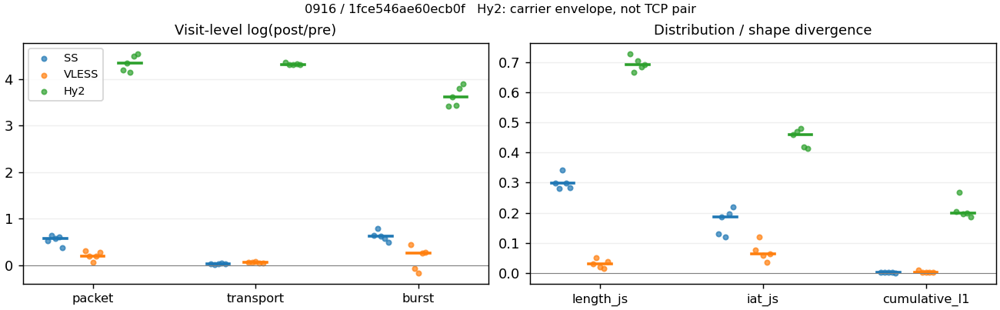
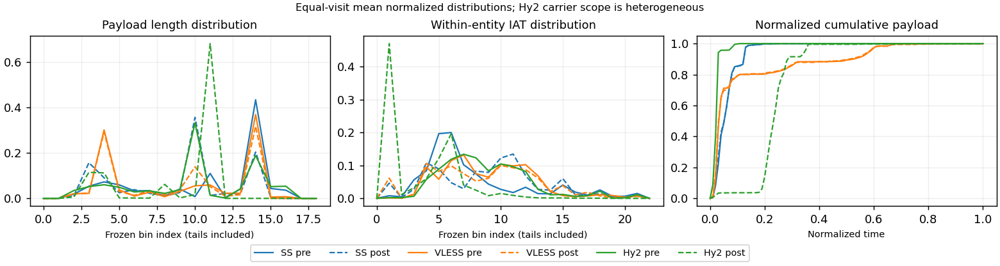

# 0916 · 条目 005 · wikipedia.org

目标：https://en.wikipedia.org/wiki/Computer_network

活动标签：wikipedia.org::article_view。选定访问 15 次。

[返回总索引](../../README.md) · [统计口径](../../methods.md)

## 覆盖与资格（每次访问均保留）

| 部署 | 重复 | 主请求路由 | 活动状态 | 代理比较 | DIRECT pre | 请求 proxy/direct/unresolved | 错误 |
| --- | --- | --- | --- | --- | --- | --- | --- |
| Hy2 | 1 | proxy | passed | 1 | 0 | 33/0/0 | [] |
| Hy2 | 2 | proxy | passed | 1 | 0 | 33/0/0 | [] |
| Hy2 | 3 | proxy | passed | 1 | 0 | 33/0/0 | [] |
| Hy2 | 4 | proxy | passed | 1 | 0 | 33/0/0 | [] |
| Hy2 | 5 | proxy | passed | 1 | 0 | 33/0/0 | [] |
| SS | 1 | proxy | passed | 1 | 0 | 33/0/0 | [] |
| SS | 2 | proxy | passed | 1 | 0 | 33/0/0 | [] |
| SS | 3 | proxy | passed | 1 | 0 | 33/0/0 | [] |
| SS | 4 | proxy | passed | 1 | 0 | 33/0/0 | [] |
| SS | 5 | proxy | passed | 1 | 0 | 33/0/0 | [] |
| VLESS | 1 | proxy | passed | 1 | 0 | 33/0/0 | [] |
| VLESS | 2 | proxy | passed | 1 | 0 | 37/0/0 | [] |
| VLESS | 3 | proxy | passed | 1 | 0 | 33/0/0 | [] |
| VLESS | 4 | proxy | passed | 1 | 0 | 33/0/0 | [] |
| VLESS | 5 | proxy | passed | 1 | 0 | 33/0/0 | [] |

主请求非 proxy 的统计仅解释为已索引的辅助代理连接或 DIRECT 观测，不代表目标业务经代理传输。播放确认与配对资格是两道不同的门。

图中散点为单次访问，短线为重复中位数；Hy2 是共享载体包络，不能与 TCP 配对作等范围因果对比。

形态图先逐访问归一化，再对访问等权平均；实线 pre，虚线 post。分箱序号及边界见 methods，不将分箱索引误解为长度或时间。

## 每次访问的关键观测

### SS

范围：`exclusive_page`。每格 pre → post；空值为不可观测/不适用。

| 重复 | 包数 | 载荷字节 | burst | TCP FR | IAT中位µs | length JS | IAT JS |
| --- | --- | --- | --- | --- | --- | --- | --- |
| 1 | 565 → 957 | 6.3866e+05 → 6.5549e+05 | 354 → 670 | 46 → 50 | 48.206 → 334.88 | 0.29825 | 0.12929 |
| 2 | 465 → 885 | 6.302e+05 → 6.3917e+05 | 295 → 647 | 41 → 41 | 49.886 → 646.58 | 0.28108 | 0.18605 |
| 3 | 512 → 906 | 6.3803e+05 → 6.5382e+05 | 378 → 706 | 45 → 47 | 47.036 → 349.86 | 0.34177 | 0.1206 |
| 4 | 600 → 1100 | 6.3072e+05 → 6.5473e+05 | 421 → 745 | 41 → 49 | 24.904 → 155.5 | 0.29864 | 0.19671 |
| 5 | 594 → 858 | 6.3022e+05 → 6.5251e+05 | 405 → 667 | 40 → 50 | 24.849 → 790.76 | 0.28234 | 0.2202 |

完整标量统计：中位数 [min,max]；Δ 为重复内逐访问变换的中位数，MAD 未缩放。n 为可用变换数；DIRECT-only 的 nΔ=0 不代表 pre 不可用。

| scope | 特征 | pre | post | Δ | IQRΔ | MADΔ | nΔ |
| --- | --- | --- | --- | --- | --- | --- | --- |
| exclusive_page | active_span_sum_s_1000ms | 7.8422 [7.4955, 12.309] | 9.819 [8.3751, 14.851] | 0.18768 | 0.065578 | 0.037113 | 5 |
| exclusive_page | active_span_sum_s_100ms | 1.7445 [1.6942, 2.1786] | 3.2119 [3.0955, 4.397] | 0.60068 | 0.12616 | 0.11642 | 5 |
| exclusive_page | active_span_sum_s_500ms | 6.7216 [5.0796, 9.2843] | 8.4225 [7.0531, 11.589] | 0.22171 | 0.13637 | 0.10701 | 5 |
| exclusive_page | burst_bytes_iqr | 2896 [2534, 2896] | 1428 [1428, 1468] | -0.70706 | 0.027626 | 0 | 5 |
| exclusive_page | burst_bytes_mad | 31 [15.5, 31] | 34 [10, 34] | 0.092373 | 0.53063 | 0 | 5 |
| exclusive_page | burst_bytes_max | 20480 [18616, 20480] | 9996 [8568, 11424] | -0.71726 | 0.28768 | 0.15415 | 5 |
| exclusive_page | burst_bytes_mean | 1687.9 [1498.2, 2136.3] | 978.28 [878.83, 987.89] | -0.60027 | 0.078553 | 0.066868 | 5 |
| exclusive_page | burst_bytes_median | 31 [15.5, 31] | 34 [10, 34] | 0.092373 | 0.53063 | 0 | 5 |
| exclusive_page | burst_bytes_min | 0 [0, 0] | 0 [0, 0] | — | — | — | 0 |
| exclusive_page | burst_bytes_p95 | 8192 [5792, 8688] | 2930 [2856, 4284] | -0.88351 | 0.34668 | 0.17645 | 5 |
| exclusive_page | burst_bytes_q25 | 0 [0, 0] | 0 [0, 0] | — | — | — | 0 |
| exclusive_page | burst_bytes_q75 | 2896 [2534, 2896] | 1428 [1428, 1468] | -0.70706 | 0.027626 | 0 | 5 |
| exclusive_page | burst_bytes_std | 3255.8 [2832.1, 4128.3] | 1375.7 [1369.6, 1635.1] | -0.73983 | 0.15611 | 0.051124 | 5 |
| exclusive_page | burst_count | 378 [295, 421] | 670 [647, 745] | 0.62472 | 0.067229 | 0.05397 | 5 |
| exclusive_page | burst_duration_ms_iqr | 0.010566 [0, 0.068408] | 5.5e-05 [0, 0.000146] | -6.7798 | 0.34612 | 0.34612 | 2 |
| exclusive_page | burst_duration_ms_mad | 0 [0, 0] | 0 [0, 0] | — | — | — | 0 |
| exclusive_page | burst_duration_ms_max | 14961 [2263.2, 15001] | 15360 [1032.4, 30784] | 0.026332 | 0.69526 | 0.69261 | 5 |
| exclusive_page | burst_duration_ms_mean | 75.439 [29.491, 123.6] | 62.22 [9.1419, 118.14] | -0.56528 | 1.1297 | 0.70176 | 5 |
| exclusive_page | burst_duration_ms_median | 0 [0, 0] | 0 [0, 0] | — | — | — | 0 |
| exclusive_page | burst_duration_ms_min | 0 [0, 0] | 0 [0, 0] | — | — | — | 0 |
| exclusive_page | burst_duration_ms_p95 | 94.154 [40.282, 323.74] | 5.1787 [2.9479, 19.497] | -2.8097 | 0.20734 | 0.11663 | 5 |
| exclusive_page | burst_duration_ms_q25 | 0 [0, 0] | 0 [0, 0] | — | — | — | 0 |
| exclusive_page | burst_duration_ms_q75 | 0.010566 [0, 0.068408] | 5.5e-05 [0, 0.000146] | -6.7798 | 0.34612 | 0.34612 | 2 |
| exclusive_page | burst_duration_ms_std | 876.03 [186.85, 1106] | 826.98 [69.03, 1750.5] | -0.27111 | 0.98301 | 0.72468 | 5 |
| exclusive_page | burst_packets_iqr | 1 [0, 1] | 1 [0, 1] | 0 | 0 | 0 | 2 |
| exclusive_page | burst_packets_mad | 0 [0, 0] | 0 [0, 0] | — | — | — | 0 |
| exclusive_page | burst_packets_max | 11 [7, 11] | 7 [6, 8] | -0.31845 | 0.067139 | 0.067139 | 5 |
| exclusive_page | burst_packets_mean | 1.4667 [1.3545, 1.596] | 1.3679 [1.2833, 1.4765] | -0.111 | 0.077172 | 0.030818 | 5 |
| exclusive_page | burst_packets_median | 1 [1, 1] | 1 [1, 1] | 0 | 0 | 0 | 5 |
| exclusive_page | burst_packets_min | 1 [1, 1] | 1 [1, 1] | 0 | 0 | 0 | 5 |
| exclusive_page | burst_packets_p95 | 3 [3, 4] | 3 [3, 3.8] | 0 | 0.28768 | 0.23639 | 5 |
| exclusive_page | burst_packets_q25 | 1 [1, 1] | 1 [1, 1] | 0 | 0 | 0 | 5 |
| exclusive_page | burst_packets_q75 | 2 [1, 2] | 2 [1, 2] | 0 | 0 | 0 | 5 |
| exclusive_page | burst_packets_std | 1.1037 [0.79764, 1.1439] | 0.78279 [0.7247, 0.92674] | -0.2292 | 0.090469 | 0.071803 | 5 |
| exclusive_page | connection_span_concurrency_max | 3 [3, 4] | 3 [3, 4] | 0 | 0 | 0 | 5 |
| exclusive_page | cumulative_l1 | — | — | 0.0010763 | 0.00088284 | 0.00047378 | 5 |
| exclusive_page | cumulative_max | — | — | 0.078198 | 0.067372 | 0.056875 | 5 |
| exclusive_page | direction_entropy | 0.73038 [0.71236, 0.82476] | 0.54944 [0.51595, 0.59089] | -0.19805 | 0.020934 | 0.017103 | 5 |
| exclusive_page | down_burst_count | 186 [145, 208] | 332 [321, 370] | 0.63219 | 0.070115 | 0.056222 | 5 |
| exclusive_page | down_ip_bytes | 6.2897e+05 [6.244e+05, 6.3455e+05] | 6.4921e+05 [6.419e+05, 6.5917e+05] | 0.030227 | 0.0036262 | 0.0020331 | 5 |
| exclusive_page | down_packets | 345 [269, 350] | 485 [452, 595] | 0.52074 | 0.10174 | 0.068697 | 5 |
| exclusive_page | down_transport_bytes | 6.1099e+05 [6.1037e+05, 6.1651e+05] | 6.2445e+05 [6.1662e+05, 6.2793e+05] | 0.016346 | 0.0095212 | 0.005979 | 5 |
| exclusive_page | duration_s | 65.689 [63.807, 70.393] | 65.689 [63.806, 70.392] | -1.0618e-05 | 1.1205e-05 | 7.908e-06 | 5 |
| exclusive_page | entity_count | 5 [5, 6] | 5 [5, 6] | 0 | 0 | 0 | 5 |
| exclusive_page | fr_runs | 41 [40, 46] | 49 [41, 50] | 0.083382 | 0.13476 | 0.083382 | 5 |
| exclusive_page | fr_runs_per_packet | 0.14024 [0.11834, 0.17045] | 0.093458 [0.081531, 0.10753] | -0.046786 | 0.031041 | 0.023669 | 5 |
| exclusive_page | fr_switches | 36 [35, 40] | 44 [36, 45] | 0.09531 | 0.15066 | 0.09531 | 5 |
| exclusive_page | fr_switches_per_possible_transition | 0.12422 [0.10511, 0.15116] | 0.083176 [0.07362, 0.097826] | -0.041048 | 0.028842 | 0.021753 | 5 |
| exclusive_page | full_retransmission_fraction | 0 [0, 0.0016667] | 0.015453 [0.0022599, 0.016317] | 0.013788 | 0.0039583 | 0.0022936 | 5 |
| exclusive_page | full_retransmission_packets | 0 [0, 1] | 14 [2, 17] | 2.8332 | — | — | 1 |
| exclusive_page | iat_count | 559 [460, 595] | 900 [853, 1095] | 0.57586 | 0.078584 | 0.044494 | 5 |
| exclusive_page | iat_js | — | — | 0.18605 | 0.067418 | 0.034144 | 5 |
| exclusive_page | iat_ks | — | — | 0.28441 | 0.071839 | 0.026307 | 5 |
| exclusive_page | iat_median_us | 47.036 [24.849, 49.886] | 349.86 [155.5, 790.76] | 2.0066 | 0.62365 | 0.175 | 5 |
| exclusive_page | iat_us_iqr | 456.75 [120.54, 580.99] | 1647.3 [1036.5, 2106.3] | 1.4831 | 0.98236 | 0.33031 | 5 |
| exclusive_page | iat_us_mad | 38.838 [19.159, 41.03] | 343.51 [155.37, 762.99] | 2.1798 | 0.60651 | 0.10913 | 5 |
| exclusive_page | iat_us_max | 1.5001e+07 [1.5001e+07, 1.5001e+07] | 1.5361e+07 [1.533e+07, 1.5425e+07] | 0.023707 | 0.0040935 | 0.001999 | 5 |
| exclusive_page | iat_us_mean | 2.3066e+05 [2.2025e+05, 2.652e+05] | 1.3863e+05 [1.2256e+05, 1.5251e+05] | -0.57588 | 0.078565 | 0.044481 | 5 |
| exclusive_page | iat_us_median | 47.036 [24.849, 49.886] | 349.86 [155.5, 790.76] | 2.0066 | 0.62365 | 0.175 | 5 |
| exclusive_page | iat_us_min | 0.113 [0.012, 0.633] | 0.037 [0.035, 0.049] | -1.172 | 3.5827 | 1.5649 | 5 |
| exclusive_page | iat_us_p95 | 1.4826e+05 [99560, 3.4299e+05] | 39538 [32497, 1.0228e+05] | -1.21 | 0.51497 | 0.30782 | 5 |
| exclusive_page | iat_us_q25 | 14.584 [12.216, 18.113] | 19.394 [8.23, 45.167] | 0.1746 | 0.77331 | 0.54257 | 5 |
| exclusive_page | iat_us_q75 | 473.03 [132.76, 599.11] | 1692.5 [1044.8, 2120] | 1.4595 | 0.91567 | 0.31751 | 5 |
| exclusive_page | iat_us_std | 1.7279e+06 [1.6694e+06, 1.8465e+06] | 1.3513e+06 [1.2373e+06, 1.3892e+06] | -0.27665 | 0.05368 | 0.030095 | 5 |
| exclusive_page | iat_wasserstein_log1p_us | — | — | 1.1662 | 0.28902 | 0.14518 | 5 |
| exclusive_page | idle_gap_count_1000ms | 12 [8, 14] | 11 [8, 13] | -0.074108 | 0.09531 | 0.074108 | 5 |
| exclusive_page | idle_gap_count_100ms | 32 [28, 47] | 35 [29, 46] | 0.035091 | 0.13929 | 0.082692 | 5 |
| exclusive_page | idle_gap_count_500ms | 14 [12, 19] | 14 [10, 18] | -0.13353 | 0.10008 | 0.04879 | 5 |
| exclusive_page | idle_gap_sum_s_1000ms | 121.44 [112.22, 126.67] | 120.14 [113.62, 123.28] | -0.0133 | 0.010617 | 0.0080683 | 5 |
| exclusive_page | idle_gap_sum_s_100ms | 127.98 [120.3, 132.17] | 126.88 [118.89, 131.05] | -0.010805 | 0.003076 | 0.0021648 | 5 |
| exclusive_page | idle_gap_sum_s_500ms | 123.47 [115.27, 127.26] | 121.34 [114.94, 125.78] | -0.017417 | 0.007211 | 0.0057467 | 5 |
| exclusive_page | ip_bytes | 6.6202e+05 [6.5446e+05, 6.6813e+05] | 7.0612e+05 [6.9172e+05, 7.2142e+05] | 0.0625 | 0.0029667 | 0.0021288 | 5 |
| exclusive_page | length_iqr | 2189.8 [2124.8, 2566.5] | 1339.5 [887.75, 1448.2] | -0.57219 | 0.33581 | 0.13192 | 5 |
| exclusive_page | length_js | — | — | 0.29825 | 0.01629 | 0.01591 | 5 |
| exclusive_page | length_ks | — | — | 0.46557 | 0.021717 | 0.017146 | 5 |
| exclusive_page | length_mad | 666.5 [208, 1421] | 1280 [396.5, 1330] | 0.33717 | 0.70886 | 0.39345 | 5 |
| exclusive_page | length_max | 8920 [4096, 8920] | 5712 [4284, 7140] | -0.22258 | 0.4906 | 0.26746 | 5 |
| exclusive_page | length_mean | 1947.1 [1860.5, 2433.2] | 1293.9 [1089.4, 1403.2] | -0.53525 | 0.089105 | 0.072018 | 5 |
| exclusive_page | length_median | 2415 [2177.5, 2689] | 1428 [1428, 1428] | -0.52542 | 0.18702 | 0.10352 | 5 |
| exclusive_page | length_min | 31 [10, 31] | 20 [1, 20] | -0.43825 | 0 | 0 | 5 |
| exclusive_page | length_p95 | 2896 [2896, 8192] | 2856 [2856, 2856] | -0.013908 | 1.0398 | 0 | 5 |
| exclusive_page | length_q25 | 706.25 [329.5, 771.25] | 92 [74, 594.25] | -1.2758 | 1.7443 | 0.94313 | 5 |
| exclusive_page | length_q75 | 2896 [2896, 2896] | 1482 [1428, 1540.2] | -0.66994 | 0.023209 | 0.023209 | 5 |
| exclusive_page | length_std | 1407.8 [1142.3, 2273] | 1001.7 [957.56, 1075.9] | -0.26892 | 0.57611 | 0.13761 | 5 |
| exclusive_page | length_wasserstein_bytes | — | — | 780.21 | 375.32 | 317.1 | 5 |
| exclusive_page | nonempty_entity_count | 5 [5, 6] | 5 [5, 6] | 0 | 0 | 0 | 5 |
| exclusive_page | nonempty_packets | 328 [259, 339] | 494 [465, 601] | 0.57259 | 0.08753 | 0.073113 | 5 |
| exclusive_page | offload_suspect_fraction | 0.31818 [0.28125, 0.33118] | 0.13355 [0.12727, 0.1548] | -0.17716 | 0.0063467 | 0.0055711 | 5 |
| exclusive_page | packet_count | 565 [465, 600] | 906 [858, 1100] | 0.57071 | 0.079158 | 0.043737 | 5 |
| exclusive_page | rtt_median_ms | 0.0526 [0.036736, 0.079049] | 30.657 [26.822, 32.87] | 6.3323 | 0.25399 | 0.21838 | 5 |
| exclusive_page | rtt_sample_count | 221 [176, 236] | 157 [139, 197] | -0.15114 | 0.31916 | 0.096804 | 5 |
| exclusive_page | tcp_ack_count | 559 [460, 595] | 899 [852, 1094] | 0.57475 | 0.079775 | 0.045487 | 5 |
| exclusive_page | tcp_fin_count | 10 [8, 12] | 10 [9, 13] | 0 | 0.080043 | 0 | 5 |
| exclusive_page | tcp_packet_count | 565 [465, 600] | 906 [858, 1100] | 0.57071 | 0.079158 | 0.043737 | 5 |
| exclusive_page | tcp_rst_count | 0 [0, 0] | 0 [0, 0] | — | — | — | 0 |
| exclusive_page | tcp_syn_count | 10 [10, 12] | 11 [10, 15] | 0.09531 | 0.015267 | 0.015267 | 5 |
| exclusive_page | tcp_window_raw_median | 65535 [65471, 65535] | 142 [137, 149] | -6.1345 | 0.04948 | 0.028573 | 5 |
| exclusive_page | transition_entropy | 0.47291 [0.42563, 0.54872] | 0.33795 [0.30969, 0.38406] | -0.13497 | 0.065201 | 0.053122 | 5 |
| exclusive_page | transition_n_mm | 238 [172, 252] | 417 [375, 507] | 0.69908 | 0.13375 | 0.080043 | 5 |
| exclusive_page | transition_n_mp | 16 [15, 17] | 19 [16, 20] | 0.11123 | 0.16599 | 0.11123 | 5 |
| exclusive_page | transition_n_pm | 20 [20, 23] | 24 [20, 25] | 0.083382 | 0.13787 | 0.083382 | 5 |
| exclusive_page | transition_n_pp | 46 [40, 46] | 43 [36, 45] | -0.02299 | 0.11778 | 0.09531 | 5 |
| exclusive_page | transition_p_mm | 0.93333 [0.91327, 0.94382] | 0.95879 [0.94937, 0.96305] | 0.025452 | 0.019758 | 0.016057 | 5 |
| exclusive_page | transition_p_mp | 0.066667 [0.05618, 0.086735] | 0.041215 [0.036952, 0.050633] | -0.025452 | 0.019758 | 0.016057 | 5 |
| exclusive_page | transition_p_pm | 0.30303 [0.30303, 0.35484] | 0.35714 [0.34783, 0.38462] | 0.044796 | 0.029749 | 0.020432 | 5 |
| exclusive_page | transition_p_pp | 0.69697 [0.64516, 0.69697] | 0.64286 [0.61538, 0.65217] | -0.044796 | 0.029749 | 0.020432 | 5 |
| exclusive_page | transport_bytes | 6.3072e+05 [6.302e+05, 6.3866e+05] | 6.5382e+05 [6.3917e+05, 6.5549e+05] | 0.026025 | 0.010312 | 0.0087375 | 5 |
| exclusive_page | up_burst_count | 192 [150, 213] | 338 [326, 375] | 0.61744 | 0.064455 | 0.051801 | 5 |
| exclusive_page | up_byte_fraction | 0.031468 [0.031289, 0.034673] | 0.043357 [0.035269, 0.044925] | 0.0096376 | 0.0018899 | 0.0015509 | 5 |
| exclusive_page | up_ip_bytes | 33047 [30063, 33585] | 56447 [49823, 62252] | 0.5273 | 0.037662 | 0.022122 | 5 |
| exclusive_page | up_packets | 231 [196, 255] | 418 [400, 505] | 0.64641 | 0.054975 | 0.036885 | 5 |
| exclusive_page | up_transport_bytes | 19831 [19735, 22144] | 28291 [22543, 29373] | 0.30586 | 0.047254 | 0.042252 | 5 |
| exclusive_page | zero_iat_count | 0 [0, 0] | 0 [0, 0] | — | — | — | 0 |
| exclusive_page | zero_iat_fraction | 0 [0, 0] | 0 [0, 0] | 0 | 0 | 0 | 5 |

### VLESS

范围：`exclusive_page`。每格 pre → post；空值为不可观测/不适用。

| 重复 | 包数 | 载荷字节 | burst | TCP FR | IAT中位µs | length JS | IAT JS |
| --- | --- | --- | --- | --- | --- | --- | --- |
| 1 | 788 → 1071 | 6.1839e+05 → 6.5884e+05 | 539 → 835 | 35 → 46 | 454.35 → 146.73 | 0.030144 | 0.075715 |
| 2 | 975 → 1179 | 7.2925e+05 → 7.7624e+05 | 810 → 750 | 53 → 64 | 127.17 → 132.44 | 0.050639 | 0.11834 |
| 3 | 866 → 927 | 6.3805e+05 → 6.8548e+05 | 666 → 566 | 44 → 56 | 373.11 → 508.24 | 0.019389 | 0.05717 |
| 4 | 743 → 900 | 6.1682e+05 → 6.4963e+05 | 490 → 630 | 40 → 46 | 244.88 → 160.36 | 0.015273 | 0.036458 |
| 5 | 582 → 762 | 6.244e+05 → 6.518e+05 | 426 → 562 | 38 → 46 | 181.2 → 442.97 | 0.038771 | 0.063746 |

完整标量统计：中位数 [min,max]；Δ 为重复内逐访问变换的中位数，MAD 未缩放。n 为可用变换数；DIRECT-only 的 nΔ=0 不代表 pre 不可用。

| scope | 特征 | pre | post | Δ | IQRΔ | MADΔ | nΔ |
| --- | --- | --- | --- | --- | --- | --- | --- |
| exclusive_page | active_span_sum_s_1000ms | 9.0892 [7.3907, 12.879] | 9.1021 [7.3961, 13.276] | 0.0014271 | 0.0027022 | 0.0020033 | 5 |
| exclusive_page | active_span_sum_s_100ms | 1.7474 [1.1629, 1.9568] | 3.3709 [2.6571, 4.3233] | 0.78123 | 0.063371 | 0.045128 | 5 |
| exclusive_page | active_span_sum_s_500ms | 4.6064 [3.9137, 5.4423] | 7.4301 [6.6073, 9.7847] | 0.56229 | 0.062931 | 0.03861 | 5 |
| exclusive_page | burst_bytes_iqr | 2824 [1484, 2896] | 2824 [1484, 2851.8] | 0 | 0.034955 | 0.025176 | 5 |
| exclusive_page | burst_bytes_mad | 31 [0, 31] | 48 [31, 72] | 0.84268 | 0.20273 | 0 | 3 |
| exclusive_page | burst_bytes_max | 11656 [8123, 21192] | 5792 [4832, 14120] | -0.40603 | 0.1223 | 0.11341 | 5 |
| exclusive_page | burst_bytes_mean | 1147.3 [900.3, 1465.7] | 1035 [789.03, 1211.1] | -0.19949 | 0.37352 | 0.17487 | 5 |
| exclusive_page | burst_bytes_median | 31 [0, 31] | 48 [31, 72] | 0.84268 | 0.20273 | 0 | 3 |
| exclusive_page | burst_bytes_min | 0 [0, 0] | 0 [0, 0] | — | — | — | 0 |
| exclusive_page | burst_bytes_p95 | 2896 [2896, 5648] | 2896 [2824, 2896] | -0.025176 | 0.39714 | 0.025176 | 5 |
| exclusive_page | burst_bytes_q25 | 0 [0, 0] | 0 [0, 0] | — | — | — | 0 |
| exclusive_page | burst_bytes_q75 | 2824 [1484, 2896] | 2824 [1484, 2851.8] | 0 | 0.034955 | 0.025176 | 5 |
| exclusive_page | burst_bytes_std | 1492.4 [1436, 2726.6] | 1284.7 [1212.2, 1604.8] | -0.19109 | 0.093595 | 0.052367 | 5 |
| exclusive_page | burst_count | 539 [426, 810] | 630 [562, 835] | 0.25131 | 0.35402 | 0.1864 | 5 |
| exclusive_page | burst_duration_ms_iqr | 0.12369 [0, 0.94253] | 0.0064703 [0, 3.9557] | -0.75809 | 4.2233 | 4.2233 | 2 |
| exclusive_page | burst_duration_ms_mad | 0 [0, 0] | 0 [0, 0] | — | — | — | 0 |
| exclusive_page | burst_duration_ms_max | 2925 [1058.4, 15000] | 15052 [1602, 15062] | 0.026394 | 1.6352 | 1.3666 | 5 |
| exclusive_page | burst_duration_ms_mean | 36.036 [16.227, 111.34] | 35.043 [7.0673, 172.06] | 0.16628 | 1.2481 | 0.35352 | 5 |
| exclusive_page | burst_duration_ms_median | 0 [0, 0] | 0 [0, 0] | — | — | — | 0 |
| exclusive_page | burst_duration_ms_min | 0 [0, 0] | 0 [0, 0] | — | — | — | 0 |
| exclusive_page | burst_duration_ms_p95 | 9.8768 [9.6959, 15.106] | 9.9488 [9.1527, 114.86] | 0.0086934 | 2.2717 | 0.49057 | 5 |
| exclusive_page | burst_duration_ms_q25 | 0 [0, 0] | 0 [0, 0] | — | — | — | 0 |
| exclusive_page | burst_duration_ms_q75 | 0.12369 [0, 0.94253] | 0.0064703 [0, 3.9557] | -0.75809 | 4.2233 | 4.2233 | 2 |
| exclusive_page | burst_duration_ms_std | 249.17 [111.38, 1179] | 603.05 [63.775, 1512.9] | 0.24935 | 1.517 | 0.80697 | 5 |
| exclusive_page | burst_packets_iqr | 1 [0, 1] | 1 [0, 1] | 0 | 0 | 0 | 2 |
| exclusive_page | burst_packets_mad | 0 [0, 0] | 0 [0, 0] | — | — | — | 0 |
| exclusive_page | burst_packets_max | 8 [5, 9] | 6 [6, 8] | -0.11778 | 0.31585 | 0.28768 | 5 |
| exclusive_page | burst_packets_mean | 1.3662 [1.2037, 1.5163] | 1.4286 [1.2826, 1.6378] | -0.0075864 | 0.29038 | 0.12328 | 5 |
| exclusive_page | burst_packets_median | 1 [1, 1] | 1 [1, 1] | 0 | 0 | 0 | 5 |
| exclusive_page | burst_packets_min | 1 [1, 1] | 1 [1, 1] | 0 | 0 | 0 | 5 |
| exclusive_page | burst_packets_p95 | 2 [2, 2.55] | 3 [3, 3.55] | 0.40547 | 0 | 0 | 5 |
| exclusive_page | burst_packets_q25 | 1 [1, 1] | 1 [1, 1] | 0 | 0 | 0 | 5 |
| exclusive_page | burst_packets_q75 | 2 [1, 2] | 2 [1, 2] | 0 | 0.69315 | 0.69315 | 5 |
| exclusive_page | burst_packets_std | 0.60605 [0.52984, 0.72977] | 0.85104 [0.73027, 0.99535] | 0.24281 | 0.37668 | 0.11975 | 5 |
| exclusive_page | connection_span_concurrency_max | 4 [3, 4] | 4 [3, 4] | 0 | 0 | 0 | 5 |
| exclusive_page | cumulative_l1 | — | — | 0.0016277 | 0.00078925 | 0.00033973 | 5 |
| exclusive_page | cumulative_max | — | — | 0.031222 | 0.014392 | 0.010593 | 5 |
| exclusive_page | direction_entropy | 0.53914 [0.4991, 0.66952] | 0.49906 [0.44662, 0.56336] | -0.052483 | 0.011742 | 0.0092262 | 5 |
| exclusive_page | down_burst_count | 267 [211, 402] | 313 [279, 415] | 0.25314 | 0.35691 | 0.18789 | 5 |
| exclusive_page | down_ip_bytes | 6.2563e+05 [6.2399e+05, 7.3412e+05] | 6.6027e+05 [6.4864e+05, 7.7758e+05] | 0.053894 | 0.014131 | 0.0063052 | 5 |
| exclusive_page | down_packets | 489 [339, 523] | 559 [408, 665] | 0.13379 | 0.06592 | 0.049635 | 5 |
| exclusive_page | down_transport_bytes | 6.0726e+05 [5.9967e+05, 7.0688e+05] | 6.3116e+05 [6.252e+05, 7.4295e+05] | 0.049779 | 0.0086856 | 0.0078666 | 5 |
| exclusive_page | duration_s | 65.081 [4.6714, 67.604] | 65.062 [4.636, 67.561] | -0.00062897 | 0.00041876 | 0.00033219 | 5 |
| exclusive_page | entity_count | 5 [4, 6] | 5 [4, 6] | 0 | 0 | 0 | 5 |
| exclusive_page | fr_runs | 40 [35, 53] | 46 [46, 64] | 0.19106 | 0.052571 | 0.050107 | 5 |
| exclusive_page | fr_runs_per_packet | 0.09205 [0.072464, 0.1148] | 0.10031 [0.083942, 0.11471] | 0.0042807 | 0.011568 | 0.0071971 | 5 |
| exclusive_page | fr_switches | 36 [30, 47] | 42 [41, 58] | 0.21131 | 0.064141 | 0.057158 | 5 |
| exclusive_page | fr_switches_per_possible_transition | 0.080508 [0.062762, 0.10398] | 0.091772 [0.075506, 0.10579] | 0.0050314 | 0.010927 | 0.0077135 | 5 |
| exclusive_page | full_retransmission_fraction | 0.0010256 [0, 0.0051546] | 0 [0, 0] | -0.0010256 | 0.0011547 | 0.0010256 | 5 |
| exclusive_page | full_retransmission_packets | 1 [0, 3] | 0 [0, 0] | — | — | — | 0 |
| exclusive_page | iat_count | 783 [578, 969] | 921 [758, 1173] | 0.19264 | 0.080054 | 0.078467 | 5 |
| exclusive_page | iat_js | — | — | 0.063746 | 0.018545 | 0.011969 | 5 |
| exclusive_page | iat_ks | — | — | 0.11704 | 0.012021 | 0.0069709 | 5 |
| exclusive_page | iat_median_us | 244.88 [127.17, 454.35] | 160.36 [132.44, 508.24] | 0.040635 | 0.73246 | 0.464 | 5 |
| exclusive_page | iat_us_iqr | 1692.6 [1267, 2826.7] | 1974.3 [1319.2, 3886.6] | 0.2179 | 0.24451 | 0.17746 | 5 |
| exclusive_page | iat_us_mad | 238.59 [119.35, 447.08] | 160.24 [132.36, 500.14] | 0.10343 | 0.72078 | 0.50154 | 5 |
| exclusive_page | iat_us_max | 1.5001e+07 [1.5603e+06, 1.5001e+07] | 1.5313e+07 [1.602e+06, 1.5444e+07] | 0.026386 | 0.0078794 | 0.0027504 | 5 |
| exclusive_page | iat_us_mean | 1.2631e+05 [13380, 2.65e+05] | 96178 [9715.1, 2.188e+05] | -0.19406 | 0.08094 | 0.078479 | 5 |
| exclusive_page | iat_us_median | 244.88 [127.17, 454.35] | 160.36 [132.44, 508.24] | 0.040635 | 0.73246 | 0.464 | 5 |
| exclusive_page | iat_us_min | 0.893 [0.249, 3.744] | 0.036 [0.031, 0.038] | -3.3606 | 1.9241 | 1.1805 | 5 |
| exclusive_page | iat_us_p95 | 16919 [10256, 73797] | 49281 [38552, 79517] | 1.3011 | 1.3556 | 0.24644 | 5 |
| exclusive_page | iat_us_q25 | 40.131 [30.127, 48.245] | 19.787 [8.602, 27.332] | -0.70711 | 0.35496 | 0.22924 | 5 |
| exclusive_page | iat_us_q75 | 1728.9 [1311.7, 2856.8] | 1994 [1336.8, 3913.5] | 0.20291 | 0.24855 | 0.18396 | 5 |
| exclusive_page | iat_us_std | 1.1835e+06 [94132, 1.9122e+06] | 1.0642e+06 [70708, 1.7407e+06] | -0.093974 | 0.024685 | 0.012434 | 5 |
| exclusive_page | iat_wasserstein_log1p_us | — | — | 0.51406 | 0.055489 | 0.03063 | 5 |
| exclusive_page | idle_gap_count_1000ms | 8 [2, 19] | 7 [2, 19] | 0 | 0.13353 | 0 | 5 |
| exclusive_page | idle_gap_count_100ms | 29 [18, 47] | 32 [22, 56] | 0.1752 | 0.079043 | 0.025467 | 5 |
| exclusive_page | idle_gap_count_500ms | 13 [7, 30] | 8 [2, 24] | -0.48551 | 0.15951 | 0.10602 | 5 |
| exclusive_page | idle_gap_sum_s_1000ms | 65.617 [2.8495, 243.91] | 65.507 [2.9262, 243.37] | -0.0016709 | 0.00024199 | 0.00016939 | 5 |
| exclusive_page | idle_gap_sum_s_100ms | 71.844 [8.7294, 254.83] | 70.246 [6.9854, 252.33] | -0.022447 | 0.0050742 | 0.0050213 | 5 |
| exclusive_page | idle_gap_sum_s_500ms | 68.401 [6.2424, 251.35] | 65.507 [2.9262, 246.87] | -0.043135 | 0.0097183 | 0.009625 | 5 |
| exclusive_page | ip_bytes | 6.5936e+05 [6.5467e+05, 7.7995e+05] | 7.1514e+05 [6.9257e+05, 8.3878e+05] | 0.072035 | 0.011467 | 0.0091661 | 5 |
| exclusive_page | length_iqr | 2752 [2638, 2752] | 2752 [1412, 2752] | 0 | 0.020682 | 0 | 5 |
| exclusive_page | length_js | — | — | 0.030144 | 0.019382 | 0.010756 | 5 |
| exclusive_page | length_ks | — | — | 0.074881 | 0.026876 | 0.019672 | 5 |
| exclusive_page | length_mad | 1166 [1091, 1376] | 1340 [1077, 1376] | 0 | 0.17852 | 0.026511 | 5 |
| exclusive_page | length_max | 8920 [2896, 8920] | 2896 [2896, 4344] | -0.7195 | 0.43182 | 0.40547 | 5 |
| exclusive_page | length_mean | 1352.7 [1280.3, 1886.4] | 1271.8 [1202.3, 1625.4] | -0.062902 | 0.10048 | 0.022614 | 5 |
| exclusive_page | length_median | 1412 [1163, 1658] | 1412 [1149, 1448] | -0.012111 | 0.025176 | 0.013065 | 5 |
| exclusive_page | length_min | 24 [24, 24] | 24 [7, 24] | 0 | 0.6131 | 0 | 5 |
| exclusive_page | length_p95 | 2860 [2824, 2896] | 2824 [2824, 2824] | -0.012667 | 0.025176 | 0.012509 | 5 |
| exclusive_page | length_q25 | 72 [72, 186] | 72 [72, 240] | 0 | 0 | 0 | 5 |
| exclusive_page | length_q75 | 2824 [2824, 2824] | 2824 [1484, 2824] | 0 | 0 | 0 | 5 |
| exclusive_page | length_std | 1324.9 [1199.2, 1717.5] | 1146.7 [1065.6, 1198] | -0.10681 | 0.11236 | 0.06201 | 5 |
| exclusive_page | length_wasserstein_bytes | — | — | 154.47 | 151.97 | 75.755 | 5 |
| exclusive_page | nonempty_entity_count | 5 [4, 6] | 5 [4, 6] | 0 | 0 | 0 | 5 |
| exclusive_page | nonempty_packets | 478 [331, 497] | 539 [401, 638] | 0.12626 | 0.071738 | 0.034143 | 5 |
| exclusive_page | offload_suspect_fraction | 0.23223 [0.21538, 0.29897] | 0.19333 [0.14846, 0.24147] | -0.057499 | 0.0091024 | 0.0086063 | 5 |
| exclusive_page | packet_count | 788 [582, 975] | 927 [762, 1179] | 0.1917 | 0.079492 | 0.077777 | 5 |
| exclusive_page | rtt_median_ms | 0.11643 [0.056134, 0.58494] | 0.081474 [0.0485, 4.2999] | -0.76347 | 3.4273 | 1.6989 | 5 |
| exclusive_page | rtt_sample_count | 289 [228, 417] | 374 [302, 473] | 0.28108 | 0.28332 | 0.21159 | 5 |
| exclusive_page | tcp_ack_count | 776 [570, 960] | 921 [758, 1173] | 0.20353 | 0.08466 | 0.08152 | 5 |
| exclusive_page | tcp_fin_count | 9 [8, 12] | 10 [8, 12] | 0 | 0.087011 | 0 | 5 |
| exclusive_page | tcp_packet_count | 788 [582, 975] | 927 [762, 1179] | 0.1917 | 0.079492 | 0.077777 | 5 |
| exclusive_page | tcp_rst_count | 8 [7, 12] | 0 [0, 0] | — | — | — | 0 |
| exclusive_page | tcp_syn_count | 10 [8, 12] | 10 [8, 12] | 0 | 0 | 0 | 5 |
| exclusive_page | tcp_window_raw_median | 65535 [65504, 65535] | 162 [152, 165] | -6.0027 | 0.0497 | 0.018349 | 5 |
| exclusive_page | transition_entropy | 0.32777 [0.27473, 0.41717] | 0.35054 [0.29842, 0.39889] | 0.0042879 | 0.041966 | 0.022571 | 5 |
| exclusive_page | transition_n_mm | 397 [254, 413] | 451 [325, 536] | 0.13776 | 0.11896 | 0.031091 | 5 |
| exclusive_page | transition_n_mp | 16 [13, 21] | 19 [18, 26] | 0.23639 | 0.10488 | 0.064539 | 5 |
| exclusive_page | transition_n_pm | 20 [17, 26] | 23 [23, 32] | 0.20764 | 0.050107 | 0.033523 | 5 |
| exclusive_page | transition_n_pp | 37 [34, 39] | 30 [28, 38] | -0.15906 | 0.077962 | 0.064079 | 5 |
| exclusive_page | transition_p_mm | 0.9598 [0.94424, 0.96948] | 0.95374 [0.94477, 0.96341] | -0.0025918 | 0.0065985 | 0.0034771 | 5 |
| exclusive_page | transition_p_mp | 0.040201 [0.030516, 0.055762] | 0.046263 [0.036585, 0.055233] | 0.0025918 | 0.0065985 | 0.0034771 | 5 |
| exclusive_page | transition_p_pm | 0.37037 [0.32692, 0.4127] | 0.45098 [0.43396, 0.46667] | 0.093785 | 0.034439 | 0.021848 | 5 |
| exclusive_page | transition_p_pp | 0.62963 [0.5873, 0.67308] | 0.54902 [0.53333, 0.56604] | -0.093785 | 0.034439 | 0.021848 | 5 |
| exclusive_page | transport_bytes | 6.244e+05 [6.1682e+05, 7.2925e+05] | 6.5884e+05 [6.4963e+05, 7.7624e+05] | 0.062449 | 0.011529 | 0.0092486 | 5 |
| exclusive_page | up_burst_count | 272 [215, 408] | 317 [283, 420] | 0.24951 | 0.35118 | 0.18494 | 5 |
| exclusive_page | up_byte_fraction | 0.029486 [0.027441, 0.034249] | 0.04201 [0.037455, 0.047726] | 0.012204 | 0.0025104 | 0.0012719 | 5 |
| exclusive_page | up_ip_bytes | 33738 [29742, 45827] | 52135 [43933, 61202] | 0.36258 | 0.1008 | 0.073274 | 5 |
| exclusive_page | up_packets | 299 [243, 452] | 392 [354, 514] | 0.35086 | 0.24769 | 0.18702 | 5 |
| exclusive_page | up_transport_bytes | 18234 [17134, 22371] | 27678 [24413, 33286] | 0.39737 | 0.049378 | 0.019978 | 5 |
| exclusive_page | zero_iat_count | 0 [0, 0] | 0 [0, 0] | — | — | — | 0 |
| exclusive_page | zero_iat_fraction | 0 [0, 0] | 0 [0, 0] | 0 | 0 | 0 | 5 |

### Hy2

范围：`carrier_context_envelope`。每格 pre → post；空值为不可观测/不适用。

| 重复 | 包数 | 载荷字节 | burst | TCP FR | IAT中位µs | length JS | IAT JS |
| --- | --- | --- | --- | --- | --- | --- | --- |
| 1 | 698 → 45909 | 6.2623e+05 → 4.8818e+07 | 544 → 16581 | — | 162.03 → 3.905 | 0.72719 | 0.46055 |
| 2 | 556 → 42589 | 6.2177e+05 → 4.6336e+07 | 384 → 14295 | — | 164.02 → 2.4355 | 0.66691 | 0.47095 |
| 3 | 683 → 42936 | 6.2092e+05 → 4.6126e+07 | 481 → 14842 | — | 344.23 → 4.454 | 0.7045 | 0.48016 |
| 4 | 482 → 43003 | 6.2007e+05 → 4.67e+07 | 330 → 14587 | — | 143.85 → 3.164 | 0.68455 | 0.4184 |
| 5 | 460 → 42890 | 6.2345e+05 → 4.6297e+07 | 299 → 14776 | — | 127.73 → 4.468 | 0.6911 | 0.4129 |

完整标量统计：中位数 [min,max]；Δ 为重复内逐访问变换的中位数，MAD 未缩放。n 为可用变换数；DIRECT-only 的 nΔ=0 不代表 pre 不可用。

| scope | 特征 | pre | post | Δ | IQRΔ | MADΔ | nΔ |
| --- | --- | --- | --- | --- | --- | --- | --- |
| carrier_context_envelope | active_span_sum_s_1000ms | 4.9953 [4.2564, 6.4177] | 18.827 [15.131, 22.055] | 1.2345 | 0.15713 | 0.15127 | 5 |
| carrier_context_envelope | active_span_sum_s_100ms | 1.1127 [0.44565, 1.4627] | 6.8576 [6.5268, 6.8787] | 1.7691 | 0.58172 | 0.22321 | 5 |
| carrier_context_envelope | active_span_sum_s_500ms | 4.7498 [4.2564, 5.6751] | 16.554 [13.518, 20.722] | 1.2495 | 0.096975 | 0.051385 | 5 |
| carrier_context_envelope | burst_bytes_iqr | 2507.5 [1404, 2808] | 5072 [2835, 5117] | 0.69491 | 0.096846 | 0.087902 | 5 |
| carrier_context_envelope | burst_bytes_mad | 31 [0, 44] | 270 [230, 274] | 1.958 | 0.15208 | 0.09493 | 4 |
| carrier_context_envelope | burst_bytes_max | 20480 [16831, 21884] | 2.0105e+05 [1.7934e+05, 2.7562e+05] | 2.4803 | 0.36356 | 0.29456 | 5 |
| carrier_context_envelope | burst_bytes_mean | 1619.2 [1151.2, 2085.1] | 3133.3 [2944.2, 3241.4] | 0.69409 | 0.34572 | 0.1845 | 5 |
| carrier_context_envelope | burst_bytes_median | 31 [0, 44] | 303 [263, 307] | 2.0819 | 0.16786 | 0.10431 | 4 |
| carrier_context_envelope | burst_bytes_min | 0 [0, 0] | 22 [22, 22] | — | — | — | 0 |
| carrier_context_envelope | burst_bytes_p95 | 7020.6 [5574, 15260] | 10932 [10932, 11528] | 0.49592 | 0.46821 | 0.17766 | 5 |
| carrier_context_envelope | burst_bytes_q25 | 0 [0, 0] | 96 [51, 99] | — | — | — | 0 |
| carrier_context_envelope | burst_bytes_q75 | 2507.5 [1404, 2808] | 5168 [2931, 5168] | 0.7232 | 0.10737 | 0.10236 | 5 |
| carrier_context_envelope | burst_bytes_std | 2713.6 [1994, 4618.7] | 5496.2 [5361.7, 6952.9] | 0.72597 | 0.22697 | 0.16584 | 5 |
| carrier_context_envelope | burst_count | 384 [299, 544] | 14776 [14295, 16581] | 3.617 | 0.35944 | 0.18767 | 5 |
| carrier_context_envelope | burst_duration_ms_iqr | 0.089216 [0, 0.2234] | 0.024329 [0.023587, 0.025309] | -1.5609 | 0.68894 | 0.43489 | 4 |
| carrier_context_envelope | burst_duration_ms_mad | 0 [0, 0] | 4.3e-05 [4.1e-05, 5e-05] | — | — | — | 0 |
| carrier_context_envelope | burst_duration_ms_max | 2397 [1991.8, 15001] | 10001 [9975.1, 10220] | 1.4284 | 1.8905 | 0.18265 | 5 |
| carrier_context_envelope | burst_duration_ms_mean | 27.771 [16.326, 90.116] | 1.3613 [1.0614, 1.8607] | -3.0156 | 1.3788 | 0.8414 | 5 |
| carrier_context_envelope | burst_duration_ms_median | 0 [0, 0] | 4.3e-05 [4.1e-05, 5e-05] | — | — | — | 0 |
| carrier_context_envelope | burst_duration_ms_min | 0 [0, 0] | 0 [0, 0] | — | — | — | 0 |
| carrier_context_envelope | burst_duration_ms_p95 | 15.482 [6.6785, 49.645] | 0.094534 [0.081923, 0.13964] | -5.2416 | 1.1621 | 0.58316 | 5 |
| carrier_context_envelope | burst_duration_ms_q25 | 0 [0, 0] | 0 [0, 0] | — | — | — | 0 |
| carrier_context_envelope | burst_duration_ms_q75 | 0.089216 [0, 0.2234] | 0.024329 [0.023587, 0.025309] | -1.5609 | 0.68894 | 0.43489 | 4 |
| carrier_context_envelope | burst_duration_ms_std | 201.48 [124.23, 1110.9] | 93.135 [83.187, 101.87] | -0.77164 | 1.9543 | 0.54257 | 5 |
| carrier_context_envelope | burst_packets_iqr | 1 [0, 1] | 3 [2, 3] | 1.0986 | 0 | 0 | 4 |
| carrier_context_envelope | burst_packets_mad | 0 [0, 0] | 1 [1, 1] | — | — | — | 0 |
| carrier_context_envelope | burst_packets_max | 9 [5, 13] | 147 [131, 207] | 3.0445 | 0.55528 | 0.46431 | 5 |
| carrier_context_envelope | burst_packets_mean | 1.4479 [1.2831, 1.5385] | 2.9027 [2.7688, 2.9793] | 0.71162 | 0.019273 | 0.0099384 | 5 |
| carrier_context_envelope | burst_packets_median | 1 [1, 1] | 2 [2, 2] | 0.69315 | 0 | 0 | 5 |
| carrier_context_envelope | burst_packets_min | 1 [1, 1] | 1 [1, 1] | 0 | 0 | 0 | 5 |
| carrier_context_envelope | burst_packets_p95 | 3 [2, 3] | 8 [8, 8] | 0.98083 | 0 | 0 | 5 |
| carrier_context_envelope | burst_packets_q25 | 1 [1, 1] | 1 [1, 1] | 0 | 0 | 0 | 5 |
| carrier_context_envelope | burst_packets_q75 | 2 [1, 2] | 4 [3, 4] | 0.69315 | 0 | 0 | 5 |
| carrier_context_envelope | burst_packets_std | 0.89276 [0.60392, 1.0369] | 3.7347 [3.6089, 4.8308] | 1.5953 | 0.41637 | 0.22516 | 5 |
| carrier_context_envelope | connection_span_concurrency_max | 3 [3, 3] | 1 [1, 1] | -1.0986 | 0 | 0 | 5 |
| carrier_context_envelope | cumulative_l1 | — | — | 0.19765 | 0.0077231 | 0.0070893 | 5 |
| carrier_context_envelope | cumulative_max | — | — | 0.96397 | 0.00090949 | 0.00060522 | 5 |
| carrier_context_envelope | direction_entropy | 0.69374 [0.5954, 0.78443] | 0.76864 [0.75707, 0.78945] | 0.064121 | 0.12289 | 0.079914 | 5 |
| carrier_context_envelope | direction_run_analog_runs | 41 [41, 55] | 14776 [14295, 16581] | 5.8541 | 0.030298 | 0.020221 | 5 |
| carrier_context_envelope | direction_run_analog_runs_per_packet | 0.14855 [0.10886, 0.15709] | 0.34451 [0.33565, 0.36117] | 0.20832 | 0.02024 | 0.017663 | 5 |
| carrier_context_envelope | direction_run_analog_switches | 37 [36, 49] | 14775 [14294, 16580] | 5.9676 | 0.020222 | 0.010886 | 5 |
| carrier_context_envelope | direction_run_analog_switches_per_possible_transition | 0.13603 [0.097436, 0.14062] | 0.34449 [0.33563, 0.36116] | 0.21928 | 0.021177 | 0.015413 | 5 |
| carrier_context_envelope | down_burst_count | 190 [147, 269] | 7388 [7148, 8290] | 3.6276 | 0.36112 | 0.18777 | 5 |
| carrier_context_envelope | down_ip_bytes | 6.2146e+05 [6.1768e+05, 6.2506e+05] | 4.663e+07 [4.6399e+07, 4.8876e+07] | 4.3179 | 0.012677 | 0.0050363 | 5 |
| carrier_context_envelope | down_packets | 325 [277, 405] | 33273 [33253, 35044] | 4.6287 | 0.25046 | 0.1486 | 5 |
| carrier_context_envelope | down_transport_bytes | 6.0452e+05 [6.0215e+05, 6.053e+05] | 4.5699e+07 [4.5468e+07, 4.7895e+07] | 4.3271 | 0.0077365 | 0.0059876 | 5 |
| carrier_context_envelope | duration_s | 63.386 [62.355, 66.025] | 62.504 [52.259, 64.936] | -0.00024601 | 7.5363e-05 | 7.3157e-05 | 5 |
| carrier_context_envelope | entity_count | 5 [4, 6] | 1 [1, 1] | -1.6094 | 0.22314 | 0.18232 | 5 |
| carrier_context_envelope | full_retransmission_fraction | 0.0017986 [0.0014327, 0.0043478] | — | — | — | — | 0 |
| carrier_context_envelope | full_retransmission_packets | 1 [1, 2] | — | — | — | — | 0 |
| carrier_context_envelope | iat_count | 552 [455, 692] | 42935 [42588, 45908] | 4.3458 | 0.30458 | 0.15361 | 5 |
| carrier_context_envelope | iat_js | — | — | 0.46055 | 0.052543 | 0.019616 | 5 |
| carrier_context_envelope | iat_ks | — | — | 0.65815 | 0.078184 | 0.023958 | 5 |
| carrier_context_envelope | iat_median_us | 162.03 [127.73, 344.23] | 3.905 [2.4355, 4.468] | -3.8169 | 0.4843 | 0.39287 | 5 |
| carrier_context_envelope | iat_us_iqr | 992.01 [828.14, 1709.4] | 24.263 [22.785, 25.331] | -3.6814 | 0.55814 | 0.15118 | 5 |
| carrier_context_envelope | iat_us_mad | 150.97 [115.61, 331.24] | 3.869 [2.4005, 4.432] | -3.7539 | 0.49287 | 0.40304 | 5 |
| carrier_context_envelope | iat_us_max | 1.5001e+07 [1.5001e+07, 1.5001e+07] | 1.0001e+07 [1.0001e+07, 1.0001e+07] | -0.40548 | 5.9386e-05 | 1.5086e-05 | 5 |
| carrier_context_envelope | iat_us_mean | 1.764e+05 [1.1877e+05, 2.7096e+05] | 1449.7 [1227.1, 1514] | -4.7835 | 0.31531 | 0.21092 | 5 |
| carrier_context_envelope | iat_us_median | 162.03 [127.73, 344.23] | 3.905 [2.4355, 4.468] | -3.8169 | 0.4843 | 0.39287 | 5 |
| carrier_context_envelope | iat_us_min | 0.601 [0.102, 4.53] | 0 [0, 0.002] | -5.4696 | 0.23583 | 0.23583 | 2 |
| carrier_context_envelope | iat_us_p95 | 41183 [41092, 2.1715e+05] | 164.83 [103.09, 198.84] | -5.7658 | 0.449 | 0.22686 | 5 |
| carrier_context_envelope | iat_us_q25 | 42.659 [27.982, 62.255] | 0.044 [0.043, 0.053] | -6.8768 | 0.46051 | 0.28578 | 5 |
| carrier_context_envelope | iat_us_q75 | 1020 [861.66, 1759.1] | 24.309 [22.828, 25.384] | -3.7255 | 0.56679 | 0.15744 | 5 |
| carrier_context_envelope | iat_us_std | 1.501e+06 [1.2352e+06, 1.8823e+06] | 86417 [82443, 91005] | -2.9018 | 0.28558 | 0.12753 | 5 |
| carrier_context_envelope | iat_wasserstein_log1p_us | — | — | 3.7607 | 0.42832 | 0.18162 | 5 |
| carrier_context_envelope | idle_gap_count_1000ms | 8 [4, 10] | 8 [7, 9] | 0 | 0.44183 | 0.10536 | 5 |
| carrier_context_envelope | idle_gap_count_100ms | 26 [20, 28] | 60 [49, 67] | 0.80078 | 0.17934 | 0.038638 | 5 |
| carrier_context_envelope | idle_gap_count_500ms | 8 [4, 11] | 10 [8, 12] | 0.18232 | 0.39304 | 0.18232 | 5 |
| carrier_context_envelope | idle_gap_sum_s_1000ms | 113.18 [57.343, 120] | 43.268 [37.128, 46.108] | -0.94457 | 0.48779 | 0.063291 | 5 |
| carrier_context_envelope | idle_gap_sum_s_100ms | 118.13 [60.848, 123.65] | 55.625 [45.732, 58.173] | -0.73754 | 0.40437 | 0.061307 | 5 |
| carrier_context_envelope | idle_gap_sum_s_500ms | 113.92 [57.343, 120] | 44.133 [38.741, 48.506] | -0.89387 | 0.50907 | 0.088765 | 5 |
| carrier_context_envelope | ip_bytes | 6.5076e+05 [6.4521e+05, 6.6264e+05] | 4.7529e+07 [4.7328e+07, 5.0103e+07] | 4.2954 | 0.016419 | 0.012003 | 5 |
| carrier_context_envelope | length_iqr | 1894.8 [203, 2592] | 596 [596, 667] | -1.1566 | 0.73633 | 0.31334 | 5 |
| carrier_context_envelope | length_js | — | — | 0.6911 | 0.019948 | 0.013404 | 5 |
| carrier_context_envelope | length_ks | — | — | 0.39493 | 0.023417 | 0.016046 | 5 |
| carrier_context_envelope | length_mad | 948 [99, 1282] | 0 [0, 0] | — | — | — | 0 |
| carrier_context_envelope | length_max | 8920 [8920, 8920] | 1441 [1441, 1441] | -1.823 | 0 | 0 | 5 |
| carrier_context_envelope | length_mean | 1931 [1571.9, 2388.7] | 1079.4 [1063.4, 1088] | -0.57369 | 0.25131 | 0.15328 | 5 |
| carrier_context_envelope | length_median | 1404 [1404, 1415] | 1441 [1441, 1441] | 0.026012 | 0.0078042 | 0 | 5 |
| carrier_context_envelope | length_min | 22 [11, 31] | 22 [22, 22] | 0 | 0.16705 | 0.16705 | 5 |
| carrier_context_envelope | length_p95 | 5657.8 [2856, 8920] | 1441 [1441, 1441] | -1.3677 | 0.72284 | 0.45526 | 5 |
| carrier_context_envelope | length_q25 | 913.25 [238, 1249] | 845 [774, 845] | -0.077673 | 1.1229 | 0.31309 | 5 |
| carrier_context_envelope | length_q75 | 2808 [1452, 2830] | 1441 [1441, 1441] | -0.66714 | 0.20808 | 0.0078042 | 5 |
| carrier_context_envelope | length_std | 1843.8 [1236.8, 2777.8] | 576.22 [573.76, 587.53] | -1.1642 | 0.49045 | 0.32524 | 5 |
| carrier_context_envelope | length_wasserstein_bytes | — | — | 876.81 | 616.79 | 345.44 | 5 |
| carrier_context_envelope | nonempty_entity_count | 5 [4, 6] | 1 [1, 1] | -1.6094 | 0.22314 | 0.18232 | 5 |
| carrier_context_envelope | nonempty_packets | 322 [261, 395] | 42936 [42589, 45909] | 4.8848 | 0.21684 | 0.16382 | 5 |
| carrier_context_envelope | offload_suspect_fraction | 0.21942 [0.14934, 0.22826] | 0 [0, 0] | -0.21942 | 0.069981 | 0.0088364 | 5 |
| carrier_context_envelope | packet_count | 556 [460, 698] | 42936 [42589, 45909] | 4.3386 | 0.30488 | 0.1525 | 5 |
| carrier_context_envelope | rtt_median_ms | 0.12477 [0.078635, 0.13676] | — | — | — | — | 0 |
| carrier_context_envelope | rtt_sample_count | 218 [172, 302] | 0 [0, 0] | — | — | — | 0 |
| carrier_context_envelope | tcp_ack_count | 552 [455, 692] | — | — | — | — | 0 |
| carrier_context_envelope | tcp_fin_count | 10 [8, 12] | — | — | — | — | 0 |
| carrier_context_envelope | tcp_packet_count | 556 [460, 698] | 0 [0, 0] | — | — | — | 0 |
| carrier_context_envelope | tcp_rst_count | 0 [0, 0] | — | — | — | — | 0 |
| carrier_context_envelope | tcp_syn_count | 10 [8, 12] | — | — | — | — | 0 |
| carrier_context_envelope | tcp_window_raw_median | 65535 [65535, 65535] | — | — | — | — | 0 |
| carrier_context_envelope | transition_entropy | 0.47637 [0.38558, 0.52753] | 0.76856 [0.75701, 0.78942] | 0.30164 | 0.063432 | 0.05202 | 5 |
| carrier_context_envelope | transition_n_mm | 242 [180, 317] | 26125 [25833, 26754] | 4.6817 | 0.32019 | 0.19813 | 5 |
| carrier_context_envelope | transition_n_mp | 17 [16, 22] | 7388 [7147, 8290] | 6.0615 | 0.037621 | 0.020222 | 5 |
| carrier_context_envelope | transition_n_pm | 20 [20, 27] | 7387 [7147, 8290] | 5.8787 | 0.031526 | 0.020222 | 5 |
| carrier_context_envelope | transition_n_pp | 35 [31, 40] | 2249 [2094, 2574] | 4.0915 | 0.13885 | 0.073023 | 5 |
| carrier_context_envelope | transition_p_mm | 0.92715 [0.91837, 0.9491] | 0.77782 [0.76344, 0.78519] | -0.14917 | 0.023169 | 0.010552 | 5 |
| carrier_context_envelope | transition_p_mp | 0.072848 [0.050898, 0.081633] | 0.22218 [0.21481, 0.23656] | 0.14917 | 0.023169 | 0.010552 | 5 |
| carrier_context_envelope | transition_p_pm | 0.36364 [0.33333, 0.46552] | 0.7666 [0.76307, 0.77693] | 0.41329 | 0.036742 | 0.019982 | 5 |
| carrier_context_envelope | transition_p_pp | 0.63636 [0.53448, 0.66667] | 0.2334 [0.22307, 0.23693] | -0.41329 | 0.036742 | 0.019982 | 5 |
| carrier_context_envelope | transport_bytes | 6.2177e+05 [6.2007e+05, 6.2623e+05] | 4.6336e+07 [4.6126e+07, 4.8818e+07] | 4.3111 | 0.013722 | 0.0035402 | 5 |
| carrier_context_envelope | up_burst_count | 194 [152, 275] | 7388 [7147, 8291] | 3.6066 | 0.35781 | 0.18758 | 5 |
| carrier_context_envelope | up_byte_fraction | 0.02993 [0.027631, 0.033417] | 0.016425 [0.011439, 0.018893] | -0.013973 | 0.0024999 | 0.0019493 | 5 |
| carrier_context_envelope | up_ip_bytes | 29299 [27525, 37575] | 1.0299e+06 [7.9872e+05, 1.2265e+06] | 3.4856 | 0.19908 | 0.1365 | 5 |
| carrier_context_envelope | up_packets | 231 [183, 319] | 9637 [9316, 10865] | 3.6971 | 0.30348 | 0.15681 | 5 |
| carrier_context_envelope | up_transport_bytes | 18660 [17133, 20927] | 7.6703e+05 [5.2763e+05, 9.2232e+05] | 3.7859 | 0.18365 | 0.01566 | 5 |
| carrier_context_envelope | zero_iat_count | 0 [0, 0] | 1 [0, 1] | — | — | — | 0 |
| carrier_context_envelope | zero_iat_fraction | 0 [0, 0] | 2.1783e-05 [0, 2.3316e-05] | 2.1783e-05 | 2.3255e-05 | 1.5333e-06 | 5 |

## 不同部署对比

以下是各部署自身重复中位数的差异，不按重复编号强行配对。跨 TCP/Hy2 的行标记异质观测范围。

| 视角 | 特征 | 部署A | 部署B | A中位 | B中位 | B−A | 比较口径 |
| --- | --- | --- | --- | --- | --- | --- | --- |
| pre | burst_count | VLESS | SS | 539 | 378 | -161 | same_scope_unpaired_visits |
| pre | burst_count | VLESS | Hy2 | 539 | 384 | -155 | heterogeneous_scope_descriptive_only |
| pre | burst_count | SS | Hy2 | 378 | 384 | 6 | heterogeneous_scope_descriptive_only |
| pre | connection_span_concurrency_max | VLESS | SS | 4 | 3 | -1 | same_scope_unpaired_visits |
| pre | connection_span_concurrency_max | VLESS | Hy2 | 4 | 3 | -1 | heterogeneous_scope_descriptive_only |
| pre | connection_span_concurrency_max | SS | Hy2 | 3 | 3 | 0 | heterogeneous_scope_descriptive_only |
| pre | direction_entropy | VLESS | SS | 0.53914 | 0.73038 | 0.19124 | same_scope_unpaired_visits |
| pre | direction_entropy | VLESS | Hy2 | 0.53914 | 0.69374 | 0.1546 | heterogeneous_scope_descriptive_only |
| pre | direction_entropy | SS | Hy2 | 0.73038 | 0.69374 | -0.036641 | heterogeneous_scope_descriptive_only |
| pre | down_transport_bytes | VLESS | SS | 6.0726e+05 | 6.1099e+05 | 3724 | same_scope_unpaired_visits |
| pre | down_transport_bytes | VLESS | Hy2 | 6.0726e+05 | 6.0452e+05 | -2741 | heterogeneous_scope_descriptive_only |
| pre | down_transport_bytes | SS | Hy2 | 6.1099e+05 | 6.0452e+05 | -6465 | heterogeneous_scope_descriptive_only |
| pre | duration_s | VLESS | SS | 65.081 | 65.689 | 0.60773 | same_scope_unpaired_visits |
| pre | duration_s | VLESS | Hy2 | 65.081 | 63.386 | -1.6955 | heterogeneous_scope_descriptive_only |
| pre | duration_s | SS | Hy2 | 65.689 | 63.386 | -2.3032 | heterogeneous_scope_descriptive_only |
| pre | entity_count | VLESS | SS | 5 | 5 | 0 | same_scope_unpaired_visits |
| pre | entity_count | VLESS | Hy2 | 5 | 5 | 0 | heterogeneous_scope_descriptive_only |
| pre | entity_count | SS | Hy2 | 5 | 5 | 0 | heterogeneous_scope_descriptive_only |
| pre | fr_runs | VLESS | SS | 40 | 41 | 1 | same_scope_unpaired_visits |
| pre | fr_runs_per_packet | VLESS | SS | 0.09205 | 0.14024 | 0.048194 | same_scope_unpaired_visits |
| pre | fr_switches | VLESS | SS | 36 | 36 | 0 | same_scope_unpaired_visits |
| pre | fr_switches_per_possible_transition | VLESS | SS | 0.080508 | 0.12422 | 0.043715 | same_scope_unpaired_visits |
| pre | full_retransmission_fraction | VLESS | SS | 0.0010256 | 0 | -0.0010256 | same_scope_unpaired_visits |
| pre | full_retransmission_fraction | VLESS | Hy2 | 0.0010256 | 0.0017986 | 0.00077292 | heterogeneous_scope_descriptive_only |
| pre | full_retransmission_fraction | SS | Hy2 | 0 | 0.0017986 | 0.0017986 | heterogeneous_scope_descriptive_only |
| pre | iat_median_us | VLESS | SS | 244.88 | 47.036 | -197.85 | same_scope_unpaired_visits |
| pre | iat_median_us | VLESS | Hy2 | 244.88 | 162.03 | -82.856 | heterogeneous_scope_descriptive_only |
| pre | iat_median_us | SS | Hy2 | 47.036 | 162.03 | 114.99 | heterogeneous_scope_descriptive_only |
| pre | iat_us_p95 | VLESS | SS | 16919 | 1.4826e+05 | 1.3134e+05 | same_scope_unpaired_visits |
| pre | iat_us_p95 | VLESS | Hy2 | 16919 | 41183 | 24264 | heterogeneous_scope_descriptive_only |
| pre | iat_us_p95 | SS | Hy2 | 1.4826e+05 | 41183 | -1.0708e+05 | heterogeneous_scope_descriptive_only |
| pre | ip_bytes | VLESS | SS | 6.5936e+05 | 6.6202e+05 | 2651 | same_scope_unpaired_visits |
| pre | ip_bytes | VLESS | Hy2 | 6.5936e+05 | 6.5076e+05 | -8610 | heterogeneous_scope_descriptive_only |
| pre | ip_bytes | SS | Hy2 | 6.6202e+05 | 6.5076e+05 | -11261 | heterogeneous_scope_descriptive_only |
| pre | length_median | VLESS | SS | 1412 | 2415 | 1003 | same_scope_unpaired_visits |
| pre | length_median | VLESS | Hy2 | 1412 | 1404 | -8 | heterogeneous_scope_descriptive_only |
| pre | length_median | SS | Hy2 | 2415 | 1404 | -1011 | heterogeneous_scope_descriptive_only |
| pre | length_p95 | VLESS | SS | 2860 | 2896 | 36 | same_scope_unpaired_visits |
| pre | length_p95 | VLESS | Hy2 | 2860 | 5657.8 | 2797.8 | heterogeneous_scope_descriptive_only |
| pre | length_p95 | SS | Hy2 | 2896 | 5657.8 | 2761.8 | heterogeneous_scope_descriptive_only |
| pre | nonempty_packets | VLESS | SS | 478 | 328 | -150 | same_scope_unpaired_visits |
| pre | nonempty_packets | VLESS | Hy2 | 478 | 322 | -156 | heterogeneous_scope_descriptive_only |
| pre | nonempty_packets | SS | Hy2 | 328 | 322 | -6 | heterogeneous_scope_descriptive_only |
| pre | offload_suspect_fraction | VLESS | SS | 0.23223 | 0.31818 | 0.085948 | same_scope_unpaired_visits |
| pre | offload_suspect_fraction | VLESS | Hy2 | 0.23223 | 0.21942 | -0.012809 | heterogeneous_scope_descriptive_only |
| pre | offload_suspect_fraction | SS | Hy2 | 0.31818 | 0.21942 | -0.098757 | heterogeneous_scope_descriptive_only |
| pre | packet_count | VLESS | SS | 788 | 565 | -223 | same_scope_unpaired_visits |
| pre | packet_count | VLESS | Hy2 | 788 | 556 | -232 | heterogeneous_scope_descriptive_only |
| pre | packet_count | SS | Hy2 | 565 | 556 | -9 | heterogeneous_scope_descriptive_only |
| pre | rtt_median_ms | VLESS | SS | 0.11643 | 0.0526 | -0.063826 | same_scope_unpaired_visits |
| pre | rtt_median_ms | VLESS | Hy2 | 0.11643 | 0.12477 | 0.0083465 | heterogeneous_scope_descriptive_only |
| pre | rtt_median_ms | SS | Hy2 | 0.0526 | 0.12477 | 0.072172 | heterogeneous_scope_descriptive_only |
| pre | transition_entropy | VLESS | SS | 0.32777 | 0.47291 | 0.14515 | same_scope_unpaired_visits |
| pre | transition_entropy | VLESS | Hy2 | 0.32777 | 0.47637 | 0.1486 | heterogeneous_scope_descriptive_only |
| pre | transition_entropy | SS | Hy2 | 0.47291 | 0.47637 | 0.0034555 | heterogeneous_scope_descriptive_only |
| pre | transport_bytes | VLESS | SS | 6.244e+05 | 6.3072e+05 | 6325 | same_scope_unpaired_visits |
| pre | transport_bytes | VLESS | Hy2 | 6.244e+05 | 6.2177e+05 | -2632 | heterogeneous_scope_descriptive_only |
| pre | transport_bytes | SS | Hy2 | 6.3072e+05 | 6.2177e+05 | -8957 | heterogeneous_scope_descriptive_only |
| pre | up_byte_fraction | VLESS | SS | 0.029486 | 0.031468 | 0.0019816 | same_scope_unpaired_visits |
| pre | up_byte_fraction | VLESS | Hy2 | 0.029486 | 0.02993 | 0.00044417 | heterogeneous_scope_descriptive_only |
| pre | up_byte_fraction | SS | Hy2 | 0.031468 | 0.02993 | -0.0015374 | heterogeneous_scope_descriptive_only |
| pre | up_transport_bytes | VLESS | SS | 18234 | 19831 | 1597 | same_scope_unpaired_visits |
| pre | up_transport_bytes | VLESS | Hy2 | 18234 | 18660 | 426 | heterogeneous_scope_descriptive_only |
| pre | up_transport_bytes | SS | Hy2 | 19831 | 18660 | -1171 | heterogeneous_scope_descriptive_only |
| post | burst_count | VLESS | SS | 630 | 670 | 40 | same_scope_unpaired_visits |
| post | burst_count | VLESS | Hy2 | 630 | 14776 | 14146 | heterogeneous_scope_descriptive_only |
| post | burst_count | SS | Hy2 | 670 | 14776 | 14106 | heterogeneous_scope_descriptive_only |
| post | connection_span_concurrency_max | VLESS | SS | 4 | 3 | -1 | same_scope_unpaired_visits |
| post | connection_span_concurrency_max | VLESS | Hy2 | 4 | 1 | -3 | heterogeneous_scope_descriptive_only |
| post | connection_span_concurrency_max | SS | Hy2 | 3 | 1 | -2 | heterogeneous_scope_descriptive_only |
| post | direction_entropy | VLESS | SS | 0.49906 | 0.54944 | 0.050374 | same_scope_unpaired_visits |
| post | direction_entropy | VLESS | Hy2 | 0.49906 | 0.76864 | 0.26958 | heterogeneous_scope_descriptive_only |
| post | direction_entropy | SS | Hy2 | 0.54944 | 0.76864 | 0.2192 | heterogeneous_scope_descriptive_only |
| post | down_transport_bytes | VLESS | SS | 6.3116e+05 | 6.2445e+05 | -6716 | same_scope_unpaired_visits |
| post | down_transport_bytes | VLESS | Hy2 | 6.3116e+05 | 4.5699e+07 | 4.5067e+07 | heterogeneous_scope_descriptive_only |
| post | down_transport_bytes | SS | Hy2 | 6.2445e+05 | 4.5699e+07 | 4.5074e+07 | heterogeneous_scope_descriptive_only |
| post | duration_s | VLESS | SS | 65.062 | 65.689 | 0.62656 | same_scope_unpaired_visits |
| post | duration_s | VLESS | Hy2 | 65.062 | 62.504 | -2.5584 | heterogeneous_scope_descriptive_only |
| post | duration_s | SS | Hy2 | 65.689 | 62.504 | -3.185 | heterogeneous_scope_descriptive_only |
| post | entity_count | VLESS | SS | 5 | 5 | 0 | same_scope_unpaired_visits |
| post | entity_count | VLESS | Hy2 | 5 | 1 | -4 | heterogeneous_scope_descriptive_only |
| post | entity_count | SS | Hy2 | 5 | 1 | -4 | heterogeneous_scope_descriptive_only |
| post | fr_runs | VLESS | SS | 46 | 49 | 3 | same_scope_unpaired_visits |
| post | fr_runs_per_packet | VLESS | SS | 0.10031 | 0.093458 | -0.0068555 | same_scope_unpaired_visits |
| post | fr_switches | VLESS | SS | 42 | 44 | 2 | same_scope_unpaired_visits |
| post | fr_switches_per_possible_transition | VLESS | SS | 0.091772 | 0.083176 | -0.0085963 | same_scope_unpaired_visits |
| post | full_retransmission_fraction | VLESS | SS | 0 | 0.015453 | 0.015453 | same_scope_unpaired_visits |
| post | iat_median_us | VLESS | SS | 160.36 | 349.86 | 189.5 | same_scope_unpaired_visits |
| post | iat_median_us | VLESS | Hy2 | 160.36 | 3.905 | -156.45 | heterogeneous_scope_descriptive_only |
| post | iat_median_us | SS | Hy2 | 349.86 | 3.905 | -345.96 | heterogeneous_scope_descriptive_only |
| post | iat_us_p95 | VLESS | SS | 49281 | 39538 | -9743.2 | same_scope_unpaired_visits |
| post | iat_us_p95 | VLESS | Hy2 | 49281 | 164.83 | -49116 | heterogeneous_scope_descriptive_only |
| post | iat_us_p95 | SS | Hy2 | 39538 | 164.83 | -39373 | heterogeneous_scope_descriptive_only |
| post | ip_bytes | VLESS | SS | 7.1514e+05 | 7.0612e+05 | -9025 | same_scope_unpaired_visits |
| post | ip_bytes | VLESS | Hy2 | 7.1514e+05 | 4.7529e+07 | 4.6813e+07 | heterogeneous_scope_descriptive_only |
| post | ip_bytes | SS | Hy2 | 7.0612e+05 | 4.7529e+07 | 4.6822e+07 | heterogeneous_scope_descriptive_only |
| post | length_median | VLESS | SS | 1412 | 1428 | 16 | same_scope_unpaired_visits |
| post | length_median | VLESS | Hy2 | 1412 | 1441 | 29 | heterogeneous_scope_descriptive_only |
| post | length_median | SS | Hy2 | 1428 | 1441 | 13 | heterogeneous_scope_descriptive_only |
| post | length_p95 | VLESS | SS | 2824 | 2856 | 32 | same_scope_unpaired_visits |
| post | length_p95 | VLESS | Hy2 | 2824 | 1441 | -1383 | heterogeneous_scope_descriptive_only |
| post | length_p95 | SS | Hy2 | 2856 | 1441 | -1415 | heterogeneous_scope_descriptive_only |
| post | nonempty_packets | VLESS | SS | 539 | 494 | -45 | same_scope_unpaired_visits |
| post | nonempty_packets | VLESS | Hy2 | 539 | 42936 | 42397 | heterogeneous_scope_descriptive_only |
| post | nonempty_packets | SS | Hy2 | 494 | 42936 | 42442 | heterogeneous_scope_descriptive_only |
| post | offload_suspect_fraction | VLESS | SS | 0.19333 | 0.13355 | -0.059779 | same_scope_unpaired_visits |
| post | offload_suspect_fraction | VLESS | Hy2 | 0.19333 | 0 | -0.19333 | heterogeneous_scope_descriptive_only |
| post | offload_suspect_fraction | SS | Hy2 | 0.13355 | 0 | -0.13355 | heterogeneous_scope_descriptive_only |
| post | packet_count | VLESS | SS | 927 | 906 | -21 | same_scope_unpaired_visits |
| post | packet_count | VLESS | Hy2 | 927 | 42936 | 42009 | heterogeneous_scope_descriptive_only |
| post | packet_count | SS | Hy2 | 906 | 42936 | 42030 | heterogeneous_scope_descriptive_only |
| post | rtt_median_ms | VLESS | SS | 0.081474 | 30.657 | 30.575 | same_scope_unpaired_visits |
| post | transition_entropy | VLESS | SS | 0.35054 | 0.33795 | -0.012594 | same_scope_unpaired_visits |
| post | transition_entropy | VLESS | Hy2 | 0.35054 | 0.76856 | 0.41802 | heterogeneous_scope_descriptive_only |
| post | transition_entropy | SS | Hy2 | 0.33795 | 0.76856 | 0.43061 | heterogeneous_scope_descriptive_only |
| post | transport_bytes | VLESS | SS | 6.5884e+05 | 6.5382e+05 | -5021 | same_scope_unpaired_visits |
| post | transport_bytes | VLESS | Hy2 | 6.5884e+05 | 4.6336e+07 | 4.5677e+07 | heterogeneous_scope_descriptive_only |
| post | transport_bytes | SS | Hy2 | 6.5382e+05 | 4.6336e+07 | 4.5682e+07 | heterogeneous_scope_descriptive_only |
| post | up_byte_fraction | VLESS | SS | 0.04201 | 0.043357 | 0.001347 | same_scope_unpaired_visits |
| post | up_byte_fraction | VLESS | Hy2 | 0.04201 | 0.016425 | -0.025586 | heterogeneous_scope_descriptive_only |
| post | up_byte_fraction | SS | Hy2 | 0.043357 | 0.016425 | -0.026932 | heterogeneous_scope_descriptive_only |
| post | up_transport_bytes | VLESS | SS | 27678 | 28291 | 613 | same_scope_unpaired_visits |
| post | up_transport_bytes | VLESS | Hy2 | 27678 | 7.6703e+05 | 7.3935e+05 | heterogeneous_scope_descriptive_only |
| post | up_transport_bytes | SS | Hy2 | 28291 | 7.6703e+05 | 7.3874e+05 | heterogeneous_scope_descriptive_only |
| transformation | burst_count | VLESS | SS | 0.25131 | 0.62472 | 0.37341 | same_scope_unpaired_visits |
| transformation | burst_count | VLESS | Hy2 | 0.25131 | 3.617 | 3.3657 | heterogeneous_scope_descriptive_only |
| transformation | burst_count | SS | Hy2 | 0.62472 | 3.617 | 2.9923 | heterogeneous_scope_descriptive_only |
| transformation | connection_span_concurrency_max | VLESS | SS | 0 | 0 | 0 | same_scope_unpaired_visits |
| transformation | connection_span_concurrency_max | VLESS | Hy2 | 0 | -1.0986 | -1.0986 | heterogeneous_scope_descriptive_only |
| transformation | connection_span_concurrency_max | SS | Hy2 | 0 | -1.0986 | -1.0986 | heterogeneous_scope_descriptive_only |
| transformation | direction_entropy | VLESS | SS | -0.052483 | -0.19805 | -0.14556 | same_scope_unpaired_visits |
| transformation | direction_entropy | VLESS | Hy2 | -0.052483 | 0.064121 | 0.1166 | heterogeneous_scope_descriptive_only |
| transformation | direction_entropy | SS | Hy2 | -0.19805 | 0.064121 | 0.26217 | heterogeneous_scope_descriptive_only |
| transformation | down_transport_bytes | VLESS | SS | 0.049779 | 0.016346 | -0.033433 | same_scope_unpaired_visits |
| transformation | down_transport_bytes | VLESS | Hy2 | 0.049779 | 4.3271 | 4.2774 | heterogeneous_scope_descriptive_only |
| transformation | down_transport_bytes | SS | Hy2 | 0.016346 | 4.3271 | 4.3108 | heterogeneous_scope_descriptive_only |
| transformation | duration_s | VLESS | SS | -0.00062897 | -1.0618e-05 | 0.00061835 | same_scope_unpaired_visits |
| transformation | duration_s | VLESS | Hy2 | -0.00062897 | -0.00024601 | 0.00038296 | heterogeneous_scope_descriptive_only |
| transformation | duration_s | SS | Hy2 | -1.0618e-05 | -0.00024601 | -0.00023539 | heterogeneous_scope_descriptive_only |
| transformation | entity_count | VLESS | SS | 0 | 0 | 0 | same_scope_unpaired_visits |
| transformation | entity_count | VLESS | Hy2 | 0 | -1.6094 | -1.6094 | heterogeneous_scope_descriptive_only |
| transformation | entity_count | SS | Hy2 | 0 | -1.6094 | -1.6094 | heterogeneous_scope_descriptive_only |
| transformation | fr_runs | VLESS | SS | 0.19106 | 0.083382 | -0.10767 | same_scope_unpaired_visits |
| transformation | fr_runs_per_packet | VLESS | SS | 0.0042807 | -0.046786 | -0.051067 | same_scope_unpaired_visits |
| transformation | fr_switches | VLESS | SS | 0.21131 | 0.09531 | -0.116 | same_scope_unpaired_visits |
| transformation | fr_switches_per_possible_transition | VLESS | SS | 0.0050314 | -0.041048 | -0.046079 | same_scope_unpaired_visits |
| transformation | full_retransmission_fraction | VLESS | SS | -0.0010256 | 0.013788 | 0.014814 | same_scope_unpaired_visits |
| transformation | iat_median_us | VLESS | SS | 0.040635 | 2.0066 | 1.966 | same_scope_unpaired_visits |
| transformation | iat_median_us | VLESS | Hy2 | 0.040635 | -3.8169 | -3.8576 | heterogeneous_scope_descriptive_only |
| transformation | iat_median_us | SS | Hy2 | 2.0066 | -3.8169 | -5.8236 | heterogeneous_scope_descriptive_only |
| transformation | iat_us_p95 | VLESS | SS | 1.3011 | -1.21 | -2.5111 | same_scope_unpaired_visits |
| transformation | iat_us_p95 | VLESS | Hy2 | 1.3011 | -5.7658 | -7.0669 | heterogeneous_scope_descriptive_only |
| transformation | iat_us_p95 | SS | Hy2 | -1.21 | -5.7658 | -4.5558 | heterogeneous_scope_descriptive_only |
| transformation | ip_bytes | VLESS | SS | 0.072035 | 0.0625 | -0.0095346 | same_scope_unpaired_visits |
| transformation | ip_bytes | VLESS | Hy2 | 0.072035 | 4.2954 | 4.2233 | heterogeneous_scope_descriptive_only |
| transformation | ip_bytes | SS | Hy2 | 0.0625 | 4.2954 | 4.2329 | heterogeneous_scope_descriptive_only |
| transformation | length_median | VLESS | SS | -0.012111 | -0.52542 | -0.51331 | same_scope_unpaired_visits |
| transformation | length_median | VLESS | Hy2 | -0.012111 | 0.026012 | 0.038123 | heterogeneous_scope_descriptive_only |
| transformation | length_median | SS | Hy2 | -0.52542 | 0.026012 | 0.55144 | heterogeneous_scope_descriptive_only |
| transformation | length_p95 | VLESS | SS | -0.012667 | -0.013908 | -0.0012411 | same_scope_unpaired_visits |
| transformation | length_p95 | VLESS | Hy2 | -0.012667 | -1.3677 | -1.355 | heterogeneous_scope_descriptive_only |
| transformation | length_p95 | SS | Hy2 | -0.013908 | -1.3677 | -1.3538 | heterogeneous_scope_descriptive_only |
| transformation | nonempty_packets | VLESS | SS | 0.12626 | 0.57259 | 0.44634 | same_scope_unpaired_visits |
| transformation | nonempty_packets | VLESS | Hy2 | 0.12626 | 4.8848 | 4.7585 | heterogeneous_scope_descriptive_only |
| transformation | nonempty_packets | SS | Hy2 | 0.57259 | 4.8848 | 4.3122 | heterogeneous_scope_descriptive_only |
| transformation | offload_suspect_fraction | VLESS | SS | -0.057499 | -0.17716 | -0.11966 | same_scope_unpaired_visits |
| transformation | offload_suspect_fraction | VLESS | Hy2 | -0.057499 | -0.21942 | -0.16193 | heterogeneous_scope_descriptive_only |
| transformation | offload_suspect_fraction | SS | Hy2 | -0.17716 | -0.21942 | -0.042268 | heterogeneous_scope_descriptive_only |
| transformation | packet_count | VLESS | SS | 0.1917 | 0.57071 | 0.37902 | same_scope_unpaired_visits |
| transformation | packet_count | VLESS | Hy2 | 0.1917 | 4.3386 | 4.1469 | heterogeneous_scope_descriptive_only |
| transformation | packet_count | SS | Hy2 | 0.57071 | 4.3386 | 3.7679 | heterogeneous_scope_descriptive_only |
| transformation | rtt_median_ms | VLESS | SS | -0.76347 | 6.3323 | 7.0958 | same_scope_unpaired_visits |
| transformation | transition_entropy | VLESS | SS | 0.0042879 | -0.13497 | -0.13925 | same_scope_unpaired_visits |
| transformation | transition_entropy | VLESS | Hy2 | 0.0042879 | 0.30164 | 0.29735 | heterogeneous_scope_descriptive_only |
| transformation | transition_entropy | SS | Hy2 | -0.13497 | 0.30164 | 0.43661 | heterogeneous_scope_descriptive_only |
| transformation | transport_bytes | VLESS | SS | 0.062449 | 0.026025 | -0.036425 | same_scope_unpaired_visits |
| transformation | transport_bytes | VLESS | Hy2 | 0.062449 | 4.3111 | 4.2487 | heterogeneous_scope_descriptive_only |
| transformation | transport_bytes | SS | Hy2 | 0.026025 | 4.3111 | 4.2851 | heterogeneous_scope_descriptive_only |
| transformation | up_byte_fraction | VLESS | SS | 0.012204 | 0.0096376 | -0.0025666 | same_scope_unpaired_visits |
| transformation | up_byte_fraction | VLESS | Hy2 | 0.012204 | -0.013973 | -0.026178 | heterogeneous_scope_descriptive_only |
| transformation | up_byte_fraction | SS | Hy2 | 0.0096376 | -0.013973 | -0.023611 | heterogeneous_scope_descriptive_only |
| transformation | up_transport_bytes | VLESS | SS | 0.39737 | 0.30586 | -0.091512 | same_scope_unpaired_visits |
| transformation | up_transport_bytes | VLESS | Hy2 | 0.39737 | 3.7859 | 3.3885 | heterogeneous_scope_descriptive_only |
| transformation | up_transport_bytes | SS | Hy2 | 0.30586 | 3.7859 | 3.48 | heterogeneous_scope_descriptive_only |
| transformation | length_js | VLESS | SS | 0.030144 | 0.29825 | 0.26811 | same_scope_unpaired_visits |
| transformation | length_js | VLESS | Hy2 | 0.030144 | 0.6911 | 0.66095 | heterogeneous_scope_descriptive_only |
| transformation | length_js | SS | Hy2 | 0.29825 | 0.6911 | 0.39284 | heterogeneous_scope_descriptive_only |
| transformation | length_ks | VLESS | SS | 0.074881 | 0.46557 | 0.39069 | same_scope_unpaired_visits |
| transformation | length_ks | VLESS | Hy2 | 0.074881 | 0.39493 | 0.32005 | heterogeneous_scope_descriptive_only |
| transformation | length_ks | SS | Hy2 | 0.46557 | 0.39493 | -0.070647 | heterogeneous_scope_descriptive_only |
| transformation | length_wasserstein_bytes | VLESS | SS | 154.47 | 780.21 | 625.74 | same_scope_unpaired_visits |
| transformation | length_wasserstein_bytes | VLESS | Hy2 | 154.47 | 876.81 | 722.34 | heterogeneous_scope_descriptive_only |
| transformation | length_wasserstein_bytes | SS | Hy2 | 780.21 | 876.81 | 96.598 | heterogeneous_scope_descriptive_only |
| transformation | iat_js | VLESS | SS | 0.063746 | 0.18605 | 0.12231 | same_scope_unpaired_visits |
| transformation | iat_js | VLESS | Hy2 | 0.063746 | 0.46055 | 0.3968 | heterogeneous_scope_descriptive_only |
| transformation | iat_js | SS | Hy2 | 0.18605 | 0.46055 | 0.27449 | heterogeneous_scope_descriptive_only |
| transformation | iat_ks | VLESS | SS | 0.11704 | 0.28441 | 0.16737 | same_scope_unpaired_visits |
| transformation | iat_ks | VLESS | Hy2 | 0.11704 | 0.65815 | 0.54111 | heterogeneous_scope_descriptive_only |
| transformation | iat_ks | SS | Hy2 | 0.28441 | 0.65815 | 0.37374 | heterogeneous_scope_descriptive_only |
| transformation | iat_wasserstein_log1p_us | VLESS | SS | 0.51406 | 1.1662 | 0.65213 | same_scope_unpaired_visits |
| transformation | iat_wasserstein_log1p_us | VLESS | Hy2 | 0.51406 | 3.7607 | 3.2467 | heterogeneous_scope_descriptive_only |
| transformation | iat_wasserstein_log1p_us | SS | Hy2 | 1.1662 | 3.7607 | 2.5945 | heterogeneous_scope_descriptive_only |
| transformation | cumulative_l1 | VLESS | SS | 0.0016277 | 0.0010763 | -0.00055142 | same_scope_unpaired_visits |
| transformation | cumulative_l1 | VLESS | Hy2 | 0.0016277 | 0.19765 | 0.19602 | heterogeneous_scope_descriptive_only |
| transformation | cumulative_l1 | SS | Hy2 | 0.0010763 | 0.19765 | 0.19657 | heterogeneous_scope_descriptive_only |

## 可复核的访问标识

| 部署 | 重复 | session_id |
| --- | --- | --- |
| VLESS | 1 | 9b461c62-1165-4e0c-95ea-13fe16465b5c |
| SS | 1 | af609896-5041-41e4-a1e3-839c0e4027b4 |
| Hy2 | 1 | 29da5361-a9f4-43f7-8be7-bc7f1d6d2b71 |
| SS | 2 | 6b0b8e73-f541-4a1e-82b0-6000c73e3841 |
| Hy2 | 2 | d37c031c-5139-46e7-aa02-8e3a53ac37fd |
| VLESS | 2 | e1fc1fc6-1b24-415f-af1c-358aa4612386 |
| Hy2 | 3 | 840bf23f-1bc1-4a20-afa1-368a9037df07 |
| VLESS | 3 | 5dfbdd44-f3ae-4377-a98f-2605c0c46c2a |
| SS | 3 | 104aecb3-1ab2-4de2-bd03-b4b4590ec0ff |
| SS | 4 | efd15270-5dec-4242-9171-8161e65ae58e |
| Hy2 | 4 | f959e813-4bdd-4419-8290-4596a98c389e |
| VLESS | 4 | 8e7e01ce-6ae1-4142-b073-8590fd606042 |
| Hy2 | 5 | e1824af1-e297-4628-90ea-7d5451221a26 |
| VLESS | 5 | f9e650bb-35b6-4aff-bd6e-9bb38cc844aa |
| SS | 5 | 54818f72-adac-4db5-9e9b-dd2c7aa2bfbd |

全量三种 packet selection、Hy2 full 范围、Q25/Q75、直方图与曲线见机器可读产物；本页只显示 observed 主范围。
