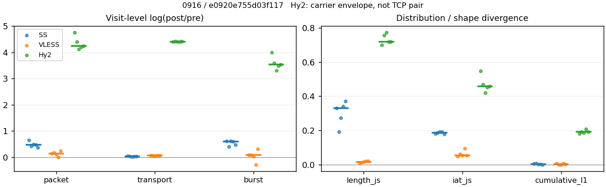
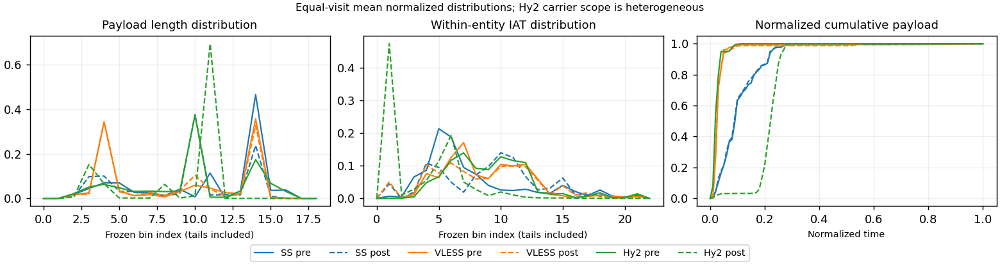

# 0916 · 条目 006 · wikipedia.org

目标：https://en.wikipedia.org/wiki/Transmission_Control_Protocol

活动标签：wikipedia.org::article_view。选定访问 15 次。

[返回总索引](../../README.md) · [统计口径](../../methods.md)

## 覆盖与资格（每次访问均保留）

| 部署 | 重复 | 主请求路由 | 活动状态 | 代理比较 | DIRECT pre | 请求 proxy/direct/unresolved | 错误 |
| --- | --- | --- | --- | --- | --- | --- | --- |
| Hy2 | 1 | proxy | passed | 1 | 0 | 28/0/0 | [] |
| Hy2 | 2 | proxy | passed | 1 | 0 | 28/0/0 | [] |
| Hy2 | 3 | proxy | passed | 1 | 0 | 28/0/0 | [] |
| Hy2 | 4 | proxy | passed | 1 | 0 | 28/0/0 | [] |
| Hy2 | 5 | proxy | passed | 1 | 0 | 28/0/0 | [] |
| SS | 1 | proxy | passed | 1 | 0 | 28/0/0 | [] |
| SS | 2 | proxy | passed | 1 | 0 | 28/0/0 | [] |
| SS | 3 | proxy | passed | 1 | 0 | 28/0/0 | [] |
| SS | 4 | proxy | passed | 1 | 0 | 32/0/0 | [] |
| SS | 5 | proxy | passed | 1 | 0 | 28/0/0 | [] |
| VLESS | 1 | proxy | passed | 1 | 0 | 29/0/0 | [] |
| VLESS | 2 | proxy | passed | 1 | 0 | 28/0/0 | [] |
| VLESS | 3 | proxy | passed | 1 | 0 | 28/0/0 | [] |
| VLESS | 4 | proxy | passed | 1 | 0 | 29/0/0 | [] |
| VLESS | 5 | proxy | passed | 1 | 0 | 28/0/0 | [] |

主请求非 proxy 的统计仅解释为已索引的辅助代理连接或 DIRECT 观测，不代表目标业务经代理传输。播放确认与配对资格是两道不同的门。

图中散点为单次访问，短线为重复中位数；Hy2 是共享载体包络，不能与 TCP 配对作等范围因果对比。

形态图先逐访问归一化，再对访问等权平均；实线 pre，虚线 post。分箱序号及边界见 methods，不将分箱索引误解为长度或时间。

## 每次访问的关键观测

### SS

范围：`exclusive_page`。每格 pre → post；空值为不可观测/不适用。

| 重复 | 包数 | 载荷字节 | burst | TCP FR | IAT中位µs | length JS | IAT JS |
| --- | --- | --- | --- | --- | --- | --- | --- |
| 1 | 411 → 791 | 5.5893e+05 → 5.8363e+05 | 310 → 576 | 31 → 33 | 38.558 → 425.02 | 0.33177 | 0.18297 |
| 2 | 480 → 729 | 5.5458e+05 → 5.6612e+05 | 335 → 499 | 35 → 35 | 32.438 → 358.02 | 0.19157 | 0.18695 |
| 3 | 427 → 694 | 5.6536e+05 → 5.7482e+05 | 283 → 521 | 38 → 38 | 45.722 → 569.46 | 0.27518 | 0.19116 |
| 4 | 565 → 898 | 6.6732e+05 → 6.8134e+05 | 355 → 647 | 40 → 44 | 30.282 → 522 | 0.34259 | 0.19242 |
| 5 | 515 → 735 | 5.659e+05 → 5.7792e+05 | 343 → 551 | 36 → 38 | 29.118 → 546.75 | 0.37044 | 0.17892 |

完整标量统计：中位数 [min,max]；Δ 为重复内逐访问变换的中位数，MAD 未缩放。n 为可用变换数；DIRECT-only 的 nΔ=0 不代表 pre 不可用。

| scope | 特征 | pre | post | Δ | IQRΔ | MADΔ | nΔ |
| --- | --- | --- | --- | --- | --- | --- | --- |
| exclusive_page | active_span_sum_s_1000ms | 8.1633 [5.9578, 10.949] | 7.5757 [6.2128, 10.824] | -0.0115 | 0.07806 | 0.063208 | 5 |
| exclusive_page | active_span_sum_s_100ms | 1.5766 [1.4316, 1.9205] | 3.1124 [2.3352, 3.5107] | 0.52632 | 0.10301 | 0.043526 | 5 |
| exclusive_page | active_span_sum_s_500ms | 5.6184 [4.3273, 6.7274] | 6.8959 [5.1472, 8.0718] | 0.17352 | 0.082074 | 0.055483 | 5 |
| exclusive_page | burst_bytes_iqr | 2754 [2576.5, 2896] | 1428 [1428, 1502] | -0.65653 | 0.066623 | 0.050523 | 5 |
| exclusive_page | burst_bytes_mad | 31 [0, 64] | 34 [12, 40] | -0.11123 | 0.44371 | 0.36612 | 3 |
| exclusive_page | burst_bytes_max | 20480 [20480, 20480] | 11584 [10056, 24276] | -0.56982 | 0.22314 | 0.14146 | 5 |
| exclusive_page | burst_bytes_mean | 1803 [1649.8, 1997.7] | 1053.1 [1013.3, 1134.5] | -0.57629 | 0.12646 | 0.017415 | 5 |
| exclusive_page | burst_bytes_median | 31 [0, 64] | 34 [12, 40] | -0.11123 | 0.44371 | 0.36612 | 3 |
| exclusive_page | burst_bytes_min | 0 [0, 0] | 0 [0, 0] | — | — | — | 0 |
| exclusive_page | burst_bytes_p95 | 8688 [6479.3, 11886] | 4284 [3496, 4397.4] | -0.73152 | 0.14448 | 0.12002 | 5 |
| exclusive_page | burst_bytes_q25 | 0 [0, 0] | 0 [0, 0] | — | — | — | 0 |
| exclusive_page | burst_bytes_q75 | 2754 [2576.5, 2896] | 1428 [1428, 1502] | -0.65653 | 0.066623 | 0.050523 | 5 |
| exclusive_page | burst_bytes_std | 3194.8 [3049.7, 4010.7] | 1560.6 [1501, 2029.8] | -0.7554 | 0.063628 | 0.057436 | 5 |
| exclusive_page | burst_count | 335 [283, 355] | 551 [499, 647] | 0.60023 | 0.1363 | 0.019307 | 5 |
| exclusive_page | burst_duration_ms_iqr | 0.01427 [0, 0.046627] | 0 [0, 0.0002755] | -3.8891 | — | — | 1 |
| exclusive_page | burst_duration_ms_mad | 0 [0, 0] | 0 [0, 0] | — | — | — | 0 |
| exclusive_page | burst_duration_ms_max | 5162 [2220.7, 15000] | 15002 [2479.4, 30458] | 0.02376 | 1.9103 | 0.75707 | 5 |
| exclusive_page | burst_duration_ms_mean | 50.723 [35.927, 72.61] | 51.629 [9.9176, 130.59] | 0.017713 | 1.4428 | 1.1345 | 5 |
| exclusive_page | burst_duration_ms_median | 0 [0, 0] | 0 [0, 0] | — | — | — | 0 |
| exclusive_page | burst_duration_ms_min | 0 [0, 0] | 0 [0, 0] | — | — | — | 0 |
| exclusive_page | burst_duration_ms_p95 | 84.857 [52.651, 340.14] | 3.98 [3.2211, 45.941] | -2.7634 | 1.1653 | 0.76144 | 5 |
| exclusive_page | burst_duration_ms_q25 | 0 [0, 0] | 0 [0, 0] | — | — | — | 0 |
| exclusive_page | burst_duration_ms_q75 | 0.01427 [0, 0.046627] | 0 [0, 0.0002755] | -3.8891 | — | — | 1 |
| exclusive_page | burst_duration_ms_std | 324.66 [215.43, 828.68] | 671.44 [114.54, 1582.3] | 0.30211 | 1.7077 | 0.87305 | 5 |
| exclusive_page | burst_packets_iqr | 1 [0, 1] | 0 [0, 1] | 0 | — | — | 1 |
| exclusive_page | burst_packets_mad | 0 [0, 0] | 0 [0, 0] | — | — | — | 0 |
| exclusive_page | burst_packets_max | 9 [6, 10] | 8 [6, 9] | -0.11778 | 0.35667 | 0.23889 | 5 |
| exclusive_page | burst_packets_mean | 1.5015 [1.3258, 1.5915] | 1.3733 [1.3321, 1.4609] | -0.1183 | 0.14403 | 0.018583 | 5 |
| exclusive_page | burst_packets_median | 1 [1, 1] | 1 [1, 1] | 0 | 0 | 0 | 5 |
| exclusive_page | burst_packets_min | 1 [1, 1] | 1 [1, 1] | 0 | 0 | 0 | 5 |
| exclusive_page | burst_packets_p95 | 3 [3, 4] | 3 [3, 3] | 0 | 0.28768 | 0 | 5 |
| exclusive_page | burst_packets_q25 | 1 [1, 1] | 1 [1, 1] | 0 | 0 | 0 | 5 |
| exclusive_page | burst_packets_q75 | 2 [1, 2] | 1 [1, 2] | -0.69315 | 0.69315 | 0 | 5 |
| exclusive_page | burst_packets_std | 1.0843 [0.7096, 1.217] | 0.8592 [0.77688, 0.96843] | -0.26638 | 0.28813 | 0.14118 | 5 |
| exclusive_page | connection_span_concurrency_max | 3 [2, 3] | 3 [2, 3] | 0 | 0 | 0 | 5 |
| exclusive_page | cumulative_l1 | — | — | 0.0017447 | 0.0034949 | 0.00050311 | 5 |
| exclusive_page | cumulative_max | — | — | 0.1066 | 0.052028 | 0.030838 | 5 |
| exclusive_page | direction_entropy | 0.68818 [0.66902, 0.80963] | 0.55015 [0.49249, 0.65527] | -0.14738 | 0.035495 | 0.028518 | 5 |
| exclusive_page | down_burst_count | 166 [139, 175] | 273 [248, 321] | 0.60666 | 0.13891 | 0.018899 | 5 |
| exclusive_page | down_ip_bytes | 5.5997e+05 [5.5514e+05, 6.6631e+05] | 5.758e+05 [5.6871e+05, 6.8316e+05] | 0.022446 | 0.0026553 | 0.0013507 | 5 |
| exclusive_page | down_packets | 285 [232, 356] | 414 [364, 504] | 0.37338 | 0.03608 | 0.025731 | 5 |
| exclusive_page | down_transport_bytes | 5.4703e+05 [5.4125e+05, 6.4776e+05] | 5.5522e+05 [5.4711e+05, 6.5672e+05] | 0.013747 | 0.0036956 | 0.0029652 | 5 |
| exclusive_page | duration_s | 55.864 [6.9404, 70.468] | 55.863 [6.9398, 70.467] | -2.3509e-05 | 2.793e-05 | 1.5462e-05 | 5 |
| exclusive_page | entity_count | 5 [3, 5] | 5 [3, 5] | 0 | 0 | 0 | 5 |
| exclusive_page | fr_runs | 36 [31, 40] | 38 [33, 44] | 0.054067 | 0.06252 | 0.041243 | 5 |
| exclusive_page | fr_runs_per_packet | 0.125 [0.12048, 0.15768] | 0.086614 [0.075515, 0.10354] | -0.042453 | 0.020266 | 0.011681 | 5 |
| exclusive_page | fr_switches | 32 [27, 35] | 33 [29, 39] | 0.06252 | 0.071459 | 0.045693 | 5 |
| exclusive_page | fr_switches_per_possible_transition | 0.11552 [0.10616, 0.13983] | 0.077535 [0.066975, 0.09116] | -0.039514 | 0.019171 | 0.010015 | 5 |
| exclusive_page | full_retransmission_fraction | 0 [0, 0.0041667] | 0.010086 [0.0077951, 0.018963] | 0.010086 | 0.0030893 | 0.0022914 | 5 |
| exclusive_page | full_retransmission_packets | 0 [0, 2] | 7 [6, 15] | 1.9033 | 0.80472 | 0.80472 | 2 |
| exclusive_page | iat_count | 477 [407, 560] | 730 [689, 893] | 0.46665 | 0.070202 | 0.046616 | 5 |
| exclusive_page | iat_js | — | — | 0.18695 | 0.0081896 | 0.0042068 | 5 |
| exclusive_page | iat_ks | — | — | 0.35386 | 0.030864 | 0.023577 | 5 |
| exclusive_page | iat_median_us | 32.438 [29.118, 45.722] | 522 [358.02, 569.46] | 2.5221 | 0.44588 | 0.12215 | 5 |
| exclusive_page | iat_us_iqr | 229.41 [213.36, 399.57] | 1427.2 [1192.9, 2238.2] | 1.723 | 0.10682 | 0.10495 | 5 |
| exclusive_page | iat_us_mad | 27.441 [23.206, 38.338] | 511.11 [351.22, 557.98] | 2.6779 | 0.50722 | 0.12848 | 5 |
| exclusive_page | iat_us_max | 1.5001e+07 [5.162e+06, 1.5001e+07] | 1.5333e+07 [5.141e+06, 1.5462e+07] | 0.021892 | 0.029794 | 0.0083505 | 5 |
| exclusive_page | iat_us_mean | 1.7805e+05 [31650, 3.3407e+05] | 1.0905e+05 [20791, 2.0949e+05] | -0.46667 | 0.07007 | 0.046461 | 5 |
| exclusive_page | iat_us_median | 32.438 [29.118, 45.722] | 522 [358.02, 569.46] | 2.5221 | 0.44588 | 0.12215 | 5 |
| exclusive_page | iat_us_min | 0.111 [0.006, 0.502] | 0.037 [0.034, 0.038] | -1.0719 | 3.3802 | 1.5631 | 5 |
| exclusive_page | iat_us_p95 | 98304 [53725, 3.2724e+05] | 40807 [33384, 70562] | -1.0731 | 1.0242 | 0.56316 | 5 |
| exclusive_page | iat_us_q25 | 14.064 [13.298, 14.404] | 17.605 [15.443, 23.925] | 0.21531 | 0.27804 | 0.14566 | 5 |
| exclusive_page | iat_us_q75 | 243.47 [227.77, 413.77] | 1442.7 [1208.4, 2255.8] | 1.696 | 0.1106 | 0.083335 | 5 |
| exclusive_page | iat_us_std | 1.4388e+06 [2.7781e+05, 2.0669e+06] | 1.1389e+06 [2.1881e+05, 1.6801e+06] | -0.23369 | 0.031585 | 0.02651 | 5 |
| exclusive_page | iat_wasserstein_log1p_us | — | — | 1.3187 | 0.20365 | 0.13306 | 5 |
| exclusive_page | idle_gap_count_1000ms | 7 [3, 16] | 7 [2, 14] | 0 | 0.13353 | 0.11778 | 5 |
| exclusive_page | idle_gap_count_100ms | 25 [17, 37] | 28 [19, 35] | -0.05557 | 0.21131 | 0.077962 | 5 |
| exclusive_page | idle_gap_count_500ms | 13 [4, 18] | 11 [3, 15] | -0.16705 | 0.10228 | 0.087011 | 5 |
| exclusive_page | idle_gap_sum_s_1000ms | 64.19 [9.1393, 178.92] | 64.312 [7.6204, 179.5] | 0.0019024 | 0.0041367 | 0.0027775 | 5 |
| exclusive_page | idle_gap_sum_s_100ms | 73.688 [13.665, 185.19] | 71.625 [12.759, 183.87] | -0.02839 | 0.028729 | 0.016569 | 5 |
| exclusive_page | idle_gap_sum_s_500ms | 68.415 [10.77, 180.35] | 67.064 [9.9472, 180.05] | -0.019935 | 0.0069785 | 0.0054185 | 5 |
| exclusive_page | ip_bytes | 5.8764e+05 [5.7961e+05, 6.9678e+05] | 6.214e+05 [6.0907e+05, 7.3402e+05] | 0.049583 | 0.0048711 | 0.0024824 | 5 |
| exclusive_page | length_iqr | 2137 [1852.8, 2603] | 1333 [497.5, 2760.5] | -0.47197 | 0.43832 | 0.22364 | 5 |
| exclusive_page | length_js | — | — | 0.33177 | 0.067407 | 0.038678 | 5 |
| exclusive_page | length_ks | — | — | 0.47216 | 0.025589 | 0.016599 | 5 |
| exclusive_page | length_mad | 993 [0, 1240] | 1024 [142, 1339] | -0.19007 | 0.25153 | 0.14529 | 4 |
| exclusive_page | length_max | 8920 [4096, 8920] | 5712 [4284, 5712] | -0.44573 | 1.0521 | 0.28768 | 5 |
| exclusive_page | length_mean | 2010 [1905.4, 2484.1] | 1341.2 [1335.2, 1566.3] | -0.40396 | 0.010206 | 0.0096114 | 5 |
| exclusive_page | length_median | 2688 [2209, 2896] | 1428 [1428, 1428] | -0.63252 | 0 | 0 | 5 |
| exclusive_page | length_min | 31 [10, 31] | 20 [12, 20] | -0.43825 | 0 | 0 | 5 |
| exclusive_page | length_p95 | 3460.8 [2896, 8192] | 2856 [2856, 2856] | -0.19208 | 1.0398 | 0.17817 | 5 |
| exclusive_page | length_q25 | 759 [293, 1043.2] | 312.5 [95.5, 930.5] | -0.74688 | 1.5245 | 0.88118 | 5 |
| exclusive_page | length_q75 | 2896 [2896, 2896] | 1482 [1428, 2856] | -0.66994 | 0.69315 | 0.037118 | 5 |
| exclusive_page | length_std | 1448.3 [1134.7, 2265] | 1016.9 [972.83, 1123] | -0.33567 | 0.62645 | 0.31883 | 5 |
| exclusive_page | length_wasserstein_bytes | — | — | 669.4 | 262.31 | 161.12 | 5 |
| exclusive_page | nonempty_entity_count | 5 [3, 5] | 5 [3, 5] | 0 | 0 | 0 | 5 |
| exclusive_page | nonempty_packets | 280 [225, 332] | 424 [367, 508] | 0.42056 | 0.010403 | 0.0056211 | 5 |
| exclusive_page | offload_suspect_fraction | 0.3292 [0.309, 0.35833] | 0.14159 [0.12925, 0.18793] | -0.1704 | 0.024823 | 0.021828 | 5 |
| exclusive_page | packet_count | 480 [411, 565] | 735 [694, 898] | 0.46334 | 0.0678 | 0.045457 | 5 |
| exclusive_page | rtt_median_ms | 0.055818 [0.045364, 0.069581] | 32.165 [27.489, 33.01] | 6.2078 | 0.20528 | 0.04586 | 5 |
| exclusive_page | rtt_sample_count | 192 [167, 199] | 141 [131, 155] | -0.24988 | 0.1473 | 0.080646 | 5 |
| exclusive_page | tcp_ack_count | 477 [407, 560] | 728 [688, 893] | 0.46665 | 0.06875 | 0.046616 | 5 |
| exclusive_page | tcp_fin_count | 10 [6, 10] | 10 [6, 11] | 0.09531 | 0.09531 | 0.09531 | 5 |
| exclusive_page | tcp_packet_count | 480 [411, 565] | 735 [694, 898] | 0.46334 | 0.0678 | 0.045457 | 5 |
| exclusive_page | tcp_rst_count | 0 [0, 0] | 0 [0, 0] | — | — | — | 0 |
| exclusive_page | tcp_syn_count | 10 [6, 10] | 10 [6, 12] | 0 | 0.09531 | 0 | 5 |
| exclusive_page | tcp_window_raw_median | 65535 [65535, 65535] | 146 [138, 149] | -6.1067 | 0.034847 | 0.02034 | 5 |
| exclusive_page | transition_entropy | 0.45094 [0.42484, 0.52773] | 0.32879 [0.28859, 0.37773] | -0.12216 | 0.048509 | 0.027839 | 5 |
| exclusive_page | transition_n_mm | 214 [162, 251] | 353 [286, 423] | 0.52192 | 0.067903 | 0.046476 | 5 |
| exclusive_page | transition_n_mp | 14 [12, 15] | 15 [13, 17] | 0.068993 | 0.080043 | 0.05617 | 5 |
| exclusive_page | transition_n_pm | 17 [15, 20] | 18 [16, 22] | 0.057158 | 0.064539 | 0.038152 | 5 |
| exclusive_page | transition_n_pp | 35 [31, 41] | 36 [30, 43] | 0 | 0.047628 | 0.047628 | 5 |
| exclusive_page | transition_p_mm | 0.9345 [0.92045, 0.94361] | 0.95924 [0.95333, 0.96641] | 0.024741 | 0.015124 | 0.0081375 | 5 |
| exclusive_page | transition_p_mp | 0.065502 [0.056391, 0.079545] | 0.040761 [0.033592, 0.046667] | -0.024741 | 0.015124 | 0.0081375 | 5 |
| exclusive_page | transition_p_pm | 0.32692 [0.31667, 0.35417] | 0.33962 [0.30645, 0.34921] | 0.0127 | 0.031553 | 0.015978 | 5 |
| exclusive_page | transition_p_pp | 0.67308 [0.64583, 0.68333] | 0.66038 [0.65079, 0.69355] | -0.0127 | 0.031553 | 0.015978 | 5 |
| exclusive_page | transport_bytes | 5.6536e+05 [5.5458e+05, 6.6732e+05] | 5.7792e+05 [5.6612e+05, 6.8134e+05] | 0.02079 | 0.00043363 | 0.00023671 | 5 |
| exclusive_page | up_burst_count | 169 [144, 180] | 278 [251, 326] | 0.59394 | 0.13377 | 0.019695 | 5 |
| exclusive_page | up_byte_fraction | 0.029319 [0.024042, 0.032973] | 0.036132 [0.031501, 0.039286] | 0.0063132 | 0.0010371 | 0.00053724 | 5 |
| exclusive_page | up_ip_bytes | 27677 [23521, 30473] | 43340 [40361, 50858] | 0.51182 | 0.063722 | 0.028147 | 5 |
| exclusive_page | up_packets | 195 [179, 211] | 342 [315, 394] | 0.61171 | 0.15106 | 0.073025 | 5 |
| exclusive_page | up_transport_bytes | 18329 [13333, 19565] | 21956 [18385, 24618] | 0.19621 | 0.04918 | 0.033523 | 5 |
| exclusive_page | zero_iat_count | 0 [0, 0] | 0 [0, 0] | — | — | — | 0 |
| exclusive_page | zero_iat_fraction | 0 [0, 0] | 0 [0, 0] | 0 | 0 | 0 | 5 |

### VLESS

范围：`exclusive_page`。每格 pre → post；空值为不可观测/不适用。

| 重复 | 包数 | 载荷字节 | burst | TCP FR | IAT中位µs | length JS | IAT JS |
| --- | --- | --- | --- | --- | --- | --- | --- |
| 1 | 771 → 876 | 5.669e+05 → 6.0793e+05 | 585 → 629 | 40 → 50 | 319.46 → 392.06 | 0.011233 | 0.050092 |
| 2 | 680 → 801 | 5.4722e+05 → 5.7925e+05 | 540 → 586 | 25 → 34 | 154.12 → 327.08 | 0.012485 | 0.061653 |
| 3 | 715 → 782 | 5.4676e+05 → 5.707e+05 | 551 → 571 | 36 → 42 | 105.06 → 122.35 | 0.017433 | 0.053276 |
| 4 | 778 → 765 | 5.4972e+05 → 5.8084e+05 | 664 → 500 | 39 → 48 | 115.6 → 319.13 | 0.020391 | 0.095426 |
| 5 | 689 → 876 | 5.5681e+05 → 5.8996e+05 | 452 → 617 | 46 → 52 | 202.88 → 139.09 | 0.020685 | 0.053058 |

完整标量统计：中位数 [min,max]；Δ 为重复内逐访问变换的中位数，MAD 未缩放。n 为可用变换数；DIRECT-only 的 nΔ=0 不代表 pre 不可用。

| scope | 特征 | pre | post | Δ | IQRΔ | MADΔ | nΔ |
| --- | --- | --- | --- | --- | --- | --- | --- |
| exclusive_page | active_span_sum_s_1000ms | 7.0097 [5.8798, 7.5292] | 7.3207 [5.9526, 7.6022] | 0.012306 | 0.012931 | 0.0087143 | 5 |
| exclusive_page | active_span_sum_s_100ms | 1.056 [0.99658, 1.5172] | 2.7052 [2.4896, 3.2291] | 0.85765 | 0.22485 | 0.12251 | 5 |
| exclusive_page | active_span_sum_s_500ms | 3.2789 [3.2317, 3.6906] | 6.4007 [5.3891, 7.4977] | 0.60591 | 0.11251 | 0.094529 | 5 |
| exclusive_page | burst_bytes_iqr | 2824 [1484, 2896] | 2824 [2231, 2824] | 0 | 0 | 0 | 5 |
| exclusive_page | burst_bytes_mad | 31 [12, 64] | 65 [35, 72] | 0.7404 | 0.72132 | 0.57018 | 5 |
| exclusive_page | burst_bytes_max | 14480 [5792, 20480] | 5792 [4832, 5889] | -0.9089 | 0.38145 | 0.19284 | 5 |
| exclusive_page | burst_bytes_mean | 992.3 [827.89, 1231.9] | 988.48 [956.18, 1161.7] | -0.0026321 | 0.032074 | 0.022233 | 5 |
| exclusive_page | burst_bytes_median | 31 [12, 64] | 65 [35, 72] | 0.7404 | 0.72132 | 0.57018 | 5 |
| exclusive_page | burst_bytes_min | 0 [0, 0] | 0 [0, 0] | — | — | — | 0 |
| exclusive_page | burst_bytes_p95 | 2896 [2896, 4272] | 2896 [2896, 2896] | 0 | 0 | 0 | 5 |
| exclusive_page | burst_bytes_q25 | 0 [0, 0] | 0 [0, 0] | — | — | — | 0 |
| exclusive_page | burst_bytes_q75 | 2824 [1484, 2896] | 2824 [2231, 2824] | 0 | 0 | 0 | 5 |
| exclusive_page | burst_bytes_std | 1486.8 [1286.8, 1685.1] | 1298.4 [1248.7, 1310.5] | -0.13143 | 0.1985 | 0.13467 | 5 |
| exclusive_page | burst_count | 551 [452, 664] | 586 [500, 629] | 0.072519 | 0.046096 | 0.036865 | 5 |
| exclusive_page | burst_duration_ms_iqr | 0.024402 [0, 0.85811] | 3.9e-05 [0, 1.2441] | -5.8443 | 0.59455 | 0.59455 | 2 |
| exclusive_page | burst_duration_ms_mad | 0 [0, 0] | 0 [0, 0] | — | — | — | 0 |
| exclusive_page | burst_duration_ms_max | 14960 [14005, 15001] | 15011 [14963, 15060] | 0.0039327 | 0.054725 | 0.0064336 | 5 |
| exclusive_page | burst_duration_ms_mean | 39.93 [33.811, 59.253] | 63.097 [33.424, 82.083] | 0.32592 | 0.55911 | 0.42816 | 5 |
| exclusive_page | burst_duration_ms_median | 0 [0, 0] | 0 [0, 0] | — | — | — | 0 |
| exclusive_page | burst_duration_ms_min | 0 [0, 0] | 0 [0, 0] | — | — | — | 0 |
| exclusive_page | burst_duration_ms_p95 | 7.7471 [3.8958, 30.226] | 9.874 [9.3212, 19.169] | 0.2641 | 0.59369 | 0.39026 | 5 |
| exclusive_page | burst_duration_ms_q25 | 0 [0, 0] | 0 [0, 0] | — | — | — | 0 |
| exclusive_page | burst_duration_ms_q75 | 0.024402 [0, 0.85811] | 3.9e-05 [0, 1.2441] | -5.8443 | 0.59455 | 0.59455 | 2 |
| exclusive_page | burst_duration_ms_std | 644.26 [557.77, 723.54] | 872.13 [601.27, 1018.5] | 0.30283 | 0.32363 | 0.22768 | 5 |
| exclusive_page | burst_packets_iqr | 1 [0, 1] | 1 [0, 1] | 0 | 0 | 0 | 2 |
| exclusive_page | burst_packets_mad | 0 [0, 0] | 0 [0, 0] | — | — | — | 0 |
| exclusive_page | burst_packets_max | 8 [3, 12] | 7 [6, 7] | -0.28768 | 0.74194 | 0.25131 | 5 |
| exclusive_page | burst_packets_mean | 1.2976 [1.1717, 1.5243] | 1.3927 [1.3669, 1.53] | 0.055158 | 0.0281 | 0.026859 | 5 |
| exclusive_page | burst_packets_median | 1 [1, 1] | 1 [1, 1] | 0 | 0 | 0 | 5 |
| exclusive_page | burst_packets_min | 1 [1, 1] | 1 [1, 1] | 0 | 0 | 0 | 5 |
| exclusive_page | burst_packets_p95 | 2 [2, 2.45] | 3 [3, 3] | 0.40547 | 0 | 0 | 5 |
| exclusive_page | burst_packets_q25 | 1 [1, 1] | 1 [1, 1] | 0 | 0 | 0 | 5 |
| exclusive_page | burst_packets_q75 | 2 [1, 2] | 2 [1, 2] | 0 | 0 | 0 | 5 |
| exclusive_page | burst_packets_std | 0.55412 [0.49009, 0.68045] | 0.83253 [0.78852, 0.88082] | 0.35277 | 0.22699 | 0.13232 | 5 |
| exclusive_page | connection_span_concurrency_max | 2 [2, 3] | 2 [2, 3] | 0 | 0 | 0 | 5 |
| exclusive_page | cumulative_l1 | — | — | 0.0020556 | 0.0056303 | 0.00086226 | 5 |
| exclusive_page | cumulative_max | — | — | 0.039967 | 0.016582 | 0.0075428 | 5 |
| exclusive_page | direction_entropy | 0.54443 [0.48546, 0.55538] | 0.51214 [0.42988, 0.5296] | -0.032284 | 0.029797 | 0.015255 | 5 |
| exclusive_page | down_burst_count | 274 [224, 330] | 291 [248, 312] | 0.073122 | 0.04649 | 0.037276 | 5 |
| exclusive_page | down_ip_bytes | 5.5486e+05 [5.5206e+05, 5.7153e+05] | 5.8074e+05 [5.7415e+05, 6.0595e+05] | 0.049315 | 0.0051335 | 0.0037967 | 5 |
| exclusive_page | down_packets | 415 [385, 451] | 457 [437, 492] | 0.084977 | 0.046864 | 0.011397 | 5 |
| exclusive_page | down_transport_bytes | 5.3325e+05 [5.3201e+05, 5.4804e+05] | 5.5722e+05 [5.514e+05, 5.8038e+05] | 0.045812 | 0.0018732 | 0.0018456 | 5 |
| exclusive_page | duration_s | 66.992 [63.15, 67.744] | 66.947 [63.12, 67.725] | -0.00047585 | 0.00020497 | 0.00018269 | 5 |
| exclusive_page | entity_count | 4 [3, 5] | 4 [3, 5] | 0 | 0 | 0 | 5 |
| exclusive_page | fr_runs | 39 [25, 46] | 48 [34, 52] | 0.20764 | 0.068993 | 0.053489 | 5 |
| exclusive_page | fr_runs_per_packet | 0.090703 [0.065789, 0.11058] | 0.10352 [0.076749, 0.10811] | 0.01096 | 0.0038918 | 0.0018568 | 5 |
| exclusive_page | fr_switches | 35 [21, 42] | 44 [30, 48] | 0.22884 | 0.08426 | 0.061787 | 5 |
| exclusive_page | fr_switches_per_possible_transition | 0.0825 [0.055851, 0.10194] | 0.094142 [0.068337, 0.10063] | 0.012474 | 0.0042884 | 0.0013929 | 5 |
| exclusive_page | full_retransmission_fraction | 0 [0, 0.001297] | 0 [0, 0.0011416] | 0 | 0 | 0 | 5 |
| exclusive_page | full_retransmission_packets | 0 [0, 1] | 0 [0, 1] | — | — | — | 0 |
| exclusive_page | iat_count | 712 [676, 774] | 797 [761, 872] | 0.12846 | 0.074728 | 0.038527 | 5 |
| exclusive_page | iat_js | — | — | 0.053276 | 0.0085959 | 0.0031846 | 5 |
| exclusive_page | iat_ks | — | — | 0.10879 | 0.038921 | 0.026224 | 5 |
| exclusive_page | iat_median_us | 154.12 [105.06, 319.46] | 319.13 [122.35, 392.06] | 0.20478 | 0.60007 | 0.54767 | 5 |
| exclusive_page | iat_us_iqr | 1274 [1077.8, 2311.6] | 1433.2 [1298.8, 2842] | 0.16694 | 0.061675 | 0.040809 | 5 |
| exclusive_page | iat_us_mad | 148.1 [96.816, 311.01] | 313.8 [122.06, 384.5] | 0.23172 | 0.56393 | 0.54433 | 5 |
| exclusive_page | iat_us_max | 1.5001e+07 [1.5001e+07, 1.5001e+07] | 1.5373e+07 [1.5011e+07, 1.5444e+07] | 0.024481 | 0.0051507 | 0.0045833 | 5 |
| exclusive_page | iat_us_mean | 96674 [52135, 1.8993e+05] | 87805 [45722, 1.4914e+05] | -0.13127 | 0.074829 | 0.040335 | 5 |
| exclusive_page | iat_us_median | 154.12 [105.06, 319.46] | 319.13 [122.35, 392.06] | 0.20478 | 0.60007 | 0.54767 | 5 |
| exclusive_page | iat_us_min | 2.847 [0.855, 3.819] | 0.036 [0.031, 0.037] | -4.3705 | 0.26836 | 0.16674 | 5 |
| exclusive_page | iat_us_p95 | 10108 [10102, 17948] | 45102 [40215, 46200] | 1.4699 | 0.10864 | 0.050206 | 5 |
| exclusive_page | iat_us_q25 | 44.358 [36.549, 49.943] | 18.791 [16.692, 40.436] | -0.73596 | 0.18714 | 0.1605 | 5 |
| exclusive_page | iat_us_q75 | 1322.6 [1122.1, 2358.8] | 1449.9 [1316.3, 2882.4] | 0.1574 | 0.073059 | 0.043069 | 5 |
| exclusive_page | iat_us_std | 1.1231e+06 [7.4753e+05, 1.5743e+06] | 1.072e+06 [6.9846e+05, 1.4311e+06] | -0.0679 | 0.035877 | 0.021246 | 5 |
| exclusive_page | iat_wasserstein_log1p_us | — | — | 0.5042 | 0.11381 | 0.099098 | 5 |
| exclusive_page | idle_gap_count_1000ms | 5 [4, 12] | 5 [4, 10] | 0 | 0.13353 | 0 | 5 |
| exclusive_page | idle_gap_count_100ms | 22 [19, 28] | 25 [23, 32] | 0.13353 | 0.061025 | 0.040822 | 5 |
| exclusive_page | idle_gap_count_500ms | 11 [9, 17] | 8 [4, 11] | -0.48551 | 0.15247 | 0.10228 | 5 |
| exclusive_page | idle_gap_sum_s_1000ms | 61.174 [32.406, 123.21] | 61.079 [32.326, 122.45] | -0.0024352 | 0.00033326 | 0.00028203 | 5 |
| exclusive_page | idle_gap_sum_s_100ms | 67.412 [38.418, 129.07] | 65.91 [36.594, 127.22] | -0.022533 | 0.0051127 | 0.0043204 | 5 |
| exclusive_page | idle_gap_sum_s_500ms | 65.237 [36.245, 126.84] | 63.011 [32.326, 123.4] | -0.034715 | 0.012861 | 0.0071473 | 5 |
| exclusive_page | ip_bytes | 5.9017e+05 [5.8258e+05, 6.0697e+05] | 6.2128e+05 [6.1162e+05, 6.5371e+05] | 0.064307 | 0.019724 | 0.0098712 | 5 |
| exclusive_page | length_iqr | 2752 [2752, 2752] | 2752 [2752, 2752] | 0 | 0 | 0 | 5 |
| exclusive_page | length_js | — | — | 0.017433 | 0.0079061 | 0.0032514 | 5 |
| exclusive_page | length_ks | — | — | 0.063906 | 0.025516 | 0.020726 | 5 |
| exclusive_page | length_mad | 1340 [678, 1340] | 1340 [928, 1340] | 0 | 0 | 0 | 5 |
| exclusive_page | length_max | 5792 [4308, 8920] | 2896 [2896, 4236] | -0.69315 | 0.012354 | 0.012354 | 5 |
| exclusive_page | length_mean | 1350.7 [1285.5, 1440] | 1299.4 [1226.5, 1318] | -0.038676 | 0.058413 | 0.017591 | 5 |
| exclusive_page | length_median | 1412 [734, 1412] | 1412 [1000, 1412] | 0 | 0 | 0 | 5 |
| exclusive_page | length_min | 24 [24, 24] | 24 [3, 24] | 0 | 1.2321 | 0 | 5 |
| exclusive_page | length_p95 | 2896 [2824, 2896] | 2824 [2824, 2824] | -0.025176 | 0 | 0 | 5 |
| exclusive_page | length_q25 | 72 [72, 72] | 72 [72, 72] | 0 | 0 | 0 | 5 |
| exclusive_page | length_q75 | 2824 [2824, 2824] | 2824 [2824, 2824] | 0 | 0 | 0 | 5 |
| exclusive_page | length_std | 1256.5 [1188.8, 1418.6] | 1187.2 [1131.9, 1225.1] | -0.056753 | 0.010047 | 0.0077109 | 5 |
| exclusive_page | length_wasserstein_bytes | — | — | 81.81 | 43.129 | 22.982 | 5 |
| exclusive_page | nonempty_entity_count | 4 [3, 5] | 4 [3, 5] | 0 | 0 | 0 | 5 |
| exclusive_page | nonempty_packets | 407 [380, 441] | 447 [433, 483] | 0.093745 | 0.05421 | 0.021944 | 5 |
| exclusive_page | offload_suspect_fraction | 0.23217 [0.21851, 0.24093] | 0.20392 [0.17123, 0.20849] | -0.026805 | 0.0013441 | 0.00075952 | 5 |
| exclusive_page | packet_count | 715 [680, 778] | 801 [765, 876] | 0.12768 | 0.074196 | 0.038106 | 5 |
| exclusive_page | rtt_median_ms | 0.074791 [0.055183, 0.55499] | 0.072526 [0.053733, 1.174] | -0.29955 | 0.43564 | 0.23596 | 5 |
| exclusive_page | rtt_sample_count | 291 [244, 348] | 332 [300, 374] | 0.1393 | 0.049441 | 0.041955 | 5 |
| exclusive_page | tcp_ack_count | 706 [671, 768] | 797 [761, 871] | 0.14028 | 0.07369 | 0.041883 | 5 |
| exclusive_page | tcp_fin_count | 8 [6, 9] | 8 [6, 10] | 0 | 0.10536 | 0 | 5 |
| exclusive_page | tcp_packet_count | 715 [680, 778] | 801 [765, 876] | 0.12768 | 0.074196 | 0.038106 | 5 |
| exclusive_page | tcp_rst_count | 6 [5, 9] | 0 [0, 1] | -2.0794 | — | — | 1 |
| exclusive_page | tcp_syn_count | 8 [6, 10] | 8 [6, 10] | 0 | 0 | 0 | 5 |
| exclusive_page | tcp_window_raw_median | 65535 [65520, 65535] | 165 [165, 177] | -5.9844 | 0.00023654 | 0 | 5 |
| exclusive_page | transition_entropy | 0.3426 [0.25154, 0.38164] | 0.36235 [0.27619, 0.37639] | 0.020048 | 0.020992 | 0.011155 | 5 |
| exclusive_page | transition_n_mm | 337 [328, 364] | 387 [368, 400] | 0.098811 | 0.056792 | 0.0045002 | 5 |
| exclusive_page | transition_n_mp | 15 [9, 19] | 20 [13, 22] | 0.22314 | 0.10536 | 0.064539 | 5 |
| exclusive_page | transition_n_pm | 19 [12, 23] | 24 [17, 26] | 0.22314 | 0.079464 | 0.068993 | 5 |
| exclusive_page | transition_n_pp | 31 [27, 37] | 27 [22, 33] | -0.13815 | 0.090384 | 0.066644 | 5 |
| exclusive_page | transition_p_mm | 0.95702 [0.94751, 0.97329] | 0.95238 [0.94787, 0.9675] | -0.0056946 | 0.0021416 | 0.0020424 | 5 |
| exclusive_page | transition_p_mp | 0.04298 [0.026706, 0.052486] | 0.047619 [0.0325, 0.052133] | 0.0056946 | 0.0021416 | 0.0020424 | 5 |
| exclusive_page | transition_p_pm | 0.35294 [0.30769, 0.46] | 0.47059 [0.43103, 0.47727] | 0.090588 | 0.044174 | 0.033743 | 5 |
| exclusive_page | transition_p_pp | 0.64706 [0.54, 0.69231] | 0.52941 [0.52273, 0.56897] | -0.090588 | 0.044174 | 0.033743 | 5 |
| exclusive_page | transport_bytes | 5.4972e+05 [5.4676e+05, 5.669e+05] | 5.8084e+05 [5.707e+05, 6.0793e+05] | 0.056885 | 0.0027609 | 0.0018156 | 5 |
| exclusive_page | up_burst_count | 277 [228, 334] | 295 [252, 317] | 0.071926 | 0.045709 | 0.036462 | 5 |
| exclusive_page | up_byte_fraction | 0.02894 [0.02541, 0.03326] | 0.040514 [0.033823, 0.045326] | 0.010711 | 0.0008684 | 0.00086337 | 5 |
| exclusive_page | up_ip_bytes | 30523 [29414, 35439] | 40535 [37471, 47759] | 0.28369 | 0.07308 | 0.058411 | 5 |
| exclusive_page | up_packets | 309 [257, 363] | 345 [314, 385] | 0.15367 | 0.074719 | 0.043463 | 5 |
| exclusive_page | up_transport_bytes | 16114 [13893, 18855] | 23623 [19303, 27555] | 0.37941 | 0.021961 | 0.014868 | 5 |
| exclusive_page | zero_iat_count | 0 [0, 0] | 0 [0, 0] | — | — | — | 0 |
| exclusive_page | zero_iat_fraction | 0 [0, 0] | 0 [0, 0] | 0 | 0 | 0 | 5 |

### Hy2

范围：`carrier_context_envelope`。每格 pre → post；空值为不可观测/不适用。

| 重复 | 包数 | 载荷字节 | burst | TCP FR | IAT中位µs | length JS | IAT JS |
| --- | --- | --- | --- | --- | --- | --- | --- |
| 1 | 352 → 40755 | 5.5282e+05 → 4.5084e+07 | 233 → 12723 | — | 309.26 → 0.992 | 0.69873 | 0.54729 |
| 2 | 519 → 42419 | 5.5865e+05 → 4.6281e+07 | 388 → 14024 | — | 182.38 → 3.048 | 0.75733 | 0.46968 |
| 3 | 697 → 42594 | 5.5949e+05 → 4.6036e+07 | 546 → 14737 | — | 286.43 → 5.205 | 0.77215 | 0.41941 |
| 4 | 639 → 42647 | 5.6536e+05 → 4.6131e+07 | 455 → 14773 | — | 338.26 → 4.808 | 0.71772 | 0.45418 |
| 5 | 620 → 43166 | 5.5728e+05 → 4.646e+07 | 442 → 15134 | — | 321.86 → 5.035 | 0.71764 | 0.45738 |

完整标量统计：中位数 [min,max]；Δ 为重复内逐访问变换的中位数，MAD 未缩放。n 为可用变换数；DIRECT-only 的 nΔ=0 不代表 pre 不可用。

| scope | 特征 | pre | post | Δ | IQRΔ | MADΔ | nΔ |
| --- | --- | --- | --- | --- | --- | --- | --- |
| carrier_context_envelope | active_span_sum_s_1000ms | 3.7942 [3.025, 8.7445] | 18.986 [14.824, 24.14] | 1.4293 | 0.29488 | 0.15999 | 5 |
| carrier_context_envelope | active_span_sum_s_100ms | 1.0062 [0.52756, 1.1739] | 6.9722 [5.7932, 8.6245] | 1.9701 | 0.058464 | 0.034285 | 5 |
| carrier_context_envelope | active_span_sum_s_500ms | 3.7942 [3.025, 6.0585] | 18.177 [14.164, 21.202] | 1.4932 | 0.15714 | 0.074942 | 5 |
| carrier_context_envelope | burst_bytes_iqr | 2018.5 [1415, 2826] | 4282 [4253, 5070] | 0.82109 | 0.24559 | 0.1624 | 5 |
| carrier_context_envelope | burst_bytes_mad | 35 [31, 64] | 283 [256, 347.5] | 2.0168 | 0.39198 | 0.19732 | 5 |
| carrier_context_envelope | burst_bytes_max | 20480 [10494, 20480] | 2.0699e+05 [1.2274e+05, 3.5408e+05] | 2.447 | 0.53911 | 0.19557 | 5 |
| carrier_context_envelope | burst_bytes_mean | 1260.8 [1024.7, 2372.6] | 3123.8 [3069.9, 3543.5] | 0.88987 | 0.09208 | 0.060431 | 5 |
| carrier_context_envelope | burst_bytes_median | 35 [31, 64] | 316 [289, 380.5] | 2.135 | 0.38102 | 0.19428 | 5 |
| carrier_context_envelope | burst_bytes_min | 0 [0, 0] | 22 [22, 22] | — | — | — | 0 |
| carrier_context_envelope | burst_bytes_p95 | 5562.4 [2856, 13829] | 11528 [10932, 11528] | 0.72875 | 0.43659 | 0.26754 | 5 |
| carrier_context_envelope | burst_bytes_q25 | 0 [0, 0] | 62 [41, 98] | — | — | — | 0 |
| carrier_context_envelope | burst_bytes_q75 | 2018.5 [1415, 2826] | 4323 [4323, 5168] | 0.83451 | 0.24138 | 0.16208 | 5 |
| carrier_context_envelope | burst_bytes_std | 2341.5 [1410, 4548.9] | 5875.3 [5092.6, 8739.2] | 0.91997 | 0.045265 | 0.027426 | 5 |
| carrier_context_envelope | burst_count | 442 [233, 546] | 14737 [12723, 15134] | 3.5334 | 0.10726 | 0.054131 | 5 |
| carrier_context_envelope | burst_duration_ms_iqr | 0.25868 [0, 0.79189] | 0.025173 [0.024139, 0.026317] | -2.3864 | 1.0244 | 0.52672 | 4 |
| carrier_context_envelope | burst_duration_ms_mad | 0 [0, 0] | 4.5e-05 [4.4e-05, 4.6e-05] | — | — | — | 0 |
| carrier_context_envelope | burst_duration_ms_max | 2847.5 [796.72, 15001] | 10205 [4021.2, 10336] | 1.2764 | 2.1392 | 1.2825 | 5 |
| carrier_context_envelope | burst_duration_ms_mean | 22.641 [13.16, 84.463] | 1.2965 [0.83825, 3.3209] | -2.4551 | 0.96919 | 0.53558 | 5 |
| carrier_context_envelope | burst_duration_ms_median | 0 [0, 0] | 4.5e-05 [4.4e-05, 4.6e-05] | — | — | — | 0 |
| carrier_context_envelope | burst_duration_ms_min | 0 [0, 0] | 0 [0, 0] | — | — | — | 0 |
| carrier_context_envelope | burst_duration_ms_p95 | 6.0032 [4.5216, 33.207] | 0.12198 [0.1035, 0.50399] | -3.8781 | 0.38443 | 0.26536 | 5 |
| carrier_context_envelope | burst_duration_ms_q25 | 0 [0, 0] | 0 [0, 0] | — | — | — | 0 |
| carrier_context_envelope | burst_duration_ms_q75 | 0.25868 [0, 0.79189] | 0.025173 [0.024139, 0.026317] | -2.3864 | 1.0244 | 0.52672 | 4 |
| carrier_context_envelope | burst_duration_ms_std | 191.64 [77.561, 1073.1] | 87.708 [40.634, 162.9] | -0.26289 | 1.8362 | 0.38584 | 5 |
| carrier_context_envelope | burst_packets_iqr | 1 [0, 1] | 3 [3, 3] | 1.0986 | 0 | 0 | 4 |
| carrier_context_envelope | burst_packets_mad | 0 [0, 0] | 1 [1, 1] | — | — | — | 0 |
| carrier_context_envelope | burst_packets_max | 7 [5, 9] | 149 [94, 263] | 3.1899 | 0.27417 | 0.14232 | 5 |
| carrier_context_envelope | burst_packets_mean | 1.4027 [1.2766, 1.5107] | 2.8903 [2.8523, 3.2033] | 0.75157 | 0.095379 | 0.041875 | 5 |
| carrier_context_envelope | burst_packets_median | 1 [1, 1] | 2 [2, 2] | 0.69315 | 0 | 0 | 5 |
| carrier_context_envelope | burst_packets_min | 1 [1, 1] | 1 [1, 1] | 0 | 0 | 0 | 5 |
| carrier_context_envelope | burst_packets_p95 | 3 [2, 3] | 8 [8, 9] | 0.98083 | 0.11778 | 0 | 5 |
| carrier_context_envelope | burst_packets_q25 | 1 [1, 1] | 1 [1, 1] | 0 | 0 | 0 | 5 |
| carrier_context_envelope | burst_packets_q75 | 2 [1, 2] | 4 [4, 4] | 0.69315 | 0 | 0 | 5 |
| carrier_context_envelope | burst_packets_std | 0.66892 [0.622, 0.95886] | 4.0133 [3.387, 6.152] | 1.8588 | 0.068121 | 0.067087 | 5 |
| carrier_context_envelope | connection_span_concurrency_max | 2 [2, 3] | 1 [1, 1] | -0.69315 | 0 | 0 | 5 |
| carrier_context_envelope | cumulative_l1 | — | — | 0.19156 | 0.0069972 | 0.0051543 | 5 |
| carrier_context_envelope | cumulative_max | — | — | 0.9648 | 0.00030964 | 0.00022585 | 5 |
| carrier_context_envelope | direction_entropy | 0.62925 [0.6057, 0.79953] | 0.76208 [0.72559, 0.77075] | 0.13337 | 0.098935 | 0.023007 | 5 |
| carrier_context_envelope | direction_run_analog_runs | 45 [30, 46] | 14737 [12723, 15134] | 5.7961 | 0.065001 | 0.040859 | 5 |
| carrier_context_envelope | direction_run_analog_runs_per_packet | 0.13031 [0.11316, 0.15957] | 0.34599 [0.31218, 0.3506] | 0.22003 | 0.049256 | 0.012802 | 5 |
| carrier_context_envelope | direction_run_analog_switches | 41 [27, 42] | 14736 [12722, 15133] | 5.887 | 0.04757 | 0.047524 | 5 |
| carrier_context_envelope | direction_run_analog_switches_per_possible_transition | 0.12034 [0.10372, 0.14748] | 0.34597 [0.31217, 0.35058] | 0.23024 | 0.049072 | 0.012008 | 5 |
| carrier_context_envelope | down_burst_count | 219 [115, 271] | 7368 [6361, 7567] | 3.5425 | 0.10664 | 0.055403 | 5 |
| carrier_context_envelope | down_ip_bytes | 5.6015e+05 [5.5035e+05, 5.668e+05] | 4.6469e+07 [4.5414e+07, 4.6792e+07] | 4.413 | 0.011117 | 0.0064781 | 5 |
| carrier_context_envelope | down_packets | 366 [206, 385] | 33220 [32529, 33416] | 4.5142 | 0.27344 | 0.05812 | 5 |
| carrier_context_envelope | down_transport_bytes | 5.4246e+05 [5.3962e+05, 5.471e+05] | 4.5539e+07 [4.4503e+07, 4.5856e+07] | 4.4286 | 0.0089924 | 0.0068822 | 5 |
| carrier_context_envelope | duration_s | 64.695 [60.874, 65.364] | 64.694 [60.857, 65.359] | -7.7115e-05 | 0.00027915 | 7.5661e-05 | 5 |
| carrier_context_envelope | entity_count | 4 [3, 5] | 1 [1, 1] | -1.3863 | 0 | 0 | 5 |
| carrier_context_envelope | full_retransmission_fraction | 0 [0, 0.0019268] | — | — | — | — | 0 |
| carrier_context_envelope | full_retransmission_packets | 0 [0, 1] | — | — | — | — | 0 |
| carrier_context_envelope | iat_count | 616 [349, 693] | 42593 [40754, 43165] | 4.2495 | 0.20252 | 0.13112 | 5 |
| carrier_context_envelope | iat_js | — | — | 0.45738 | 0.015503 | 0.012302 | 5 |
| carrier_context_envelope | iat_ks | — | — | 0.64166 | 0.028231 | 0.017518 | 5 |
| carrier_context_envelope | iat_median_us | 309.26 [182.38, 338.26] | 4.808 [0.992, 5.205] | -4.1577 | 0.16195 | 0.09583 | 5 |
| carrier_context_envelope | iat_us_iqr | 1615 [865.84, 2045] | 26.551 [23.253, 27.368] | -4.1753 | 0.5372 | 0.16778 | 5 |
| carrier_context_envelope | iat_us_mad | 278.53 [171.15, 329.41] | 4.772 [0.959, 5.169] | -4.1184 | 0.1949 | 0.11616 | 5 |
| carrier_context_envelope | iat_us_max | 1.5001e+07 [1.5001e+07, 1.5001e+07] | 1e+07 [1e+07, 1.0001e+07] | -0.40548 | 6.3854e-05 | 4.1823e-05 | 5 |
| carrier_context_envelope | iat_us_mean | 2.0121e+05 [1.7844e+05, 2.6161e+05] | 1514.2 [1427, 1525.2] | -4.8895 | 0.19945 | 0.12637 | 5 |
| carrier_context_envelope | iat_us_median | 309.26 [182.38, 338.26] | 4.808 [0.992, 5.205] | -4.1577 | 0.16195 | 0.09583 | 5 |
| carrier_context_envelope | iat_us_min | 1.355 [0.386, 3.654] | 0 [0, 0.002] | -7.2831 | 0.83575 | 0.83575 | 2 |
| carrier_context_envelope | iat_us_p95 | 40445 [12606, 1.2573e+05] | 224.89 [113.42, 551.26] | -5.0148 | 1.3326 | 0.86179 | 5 |
| carrier_context_envelope | iat_us_q25 | 52.596 [39.499, 82.031] | 0.047 [0.044, 0.048] | -7.0637 | 0.29256 | 0.16938 | 5 |
| carrier_context_envelope | iat_us_q75 | 1654.5 [947.87, 2097.6] | 26.599 [23.3, 27.412] | -4.1978 | 0.50393 | 0.169 | 5 |
| carrier_context_envelope | iat_us_std | 1.6614e+06 [1.5284e+06, 1.8601e+06] | 90108 [88831, 97219] | -2.9163 | 0.097722 | 0.045612 | 5 |
| carrier_context_envelope | iat_wasserstein_log1p_us | — | — | 3.972 | 0.066987 | 0.061487 | 5 |
| carrier_context_envelope | idle_gap_count_1000ms | 8 [7, 10] | 8 [6, 10] | -0.13353 | 0.35667 | 0.26706 | 5 |
| carrier_context_envelope | idle_gap_count_100ms | 22 [19, 28] | 58 [52, 62] | 1.0068 | 0.15079 | 0.057906 | 5 |
| carrier_context_envelope | idle_gap_count_500ms | 10 [7, 13] | 10 [8, 11] | 0 | 0.51368 | 0.26236 | 5 |
| carrier_context_envelope | idle_gap_sum_s_1000ms | 117.04 [88.278, 120.15] | 45.879 [40.758, 49.762] | -0.94051 | 0.087937 | 0.065723 | 5 |
| carrier_context_envelope | idle_gap_sum_s_100ms | 121.94 [90.775, 122.94] | 56.273 [53.197, 58.505] | -0.74459 | 0.035794 | 0.025631 | 5 |
| carrier_context_envelope | idle_gap_sum_s_500ms | 118.89 [88.278, 120.15] | 46.944 [42.68, 50.387] | -0.9353 | 0.083788 | 0.065679 | 5 |
| carrier_context_envelope | ip_bytes | 5.8959e+05 [5.7117e+05, 5.9867e+05] | 4.7326e+07 [4.6225e+07, 4.7668e+07] | 4.3926 | 0.02077 | 0.0023971 | 5 |
| carrier_context_envelope | length_iqr | 572 [267, 2708.5] | 596 [596, 596] | 0.041102 | 0.74424 | 0.73634 | 5 |
| carrier_context_envelope | length_js | — | — | 0.71772 | 0.039683 | 0.018986 | 5 |
| carrier_context_envelope | length_ks | — | — | 0.45741 | 0.066917 | 0.027503 | 5 |
| carrier_context_envelope | length_mad | 362 [199.5, 1727] | 0 [0, 0] | — | — | — | 0 |
| carrier_context_envelope | length_max | 8920 [8568, 8920] | 1441 [1441, 1441] | -1.823 | 0 | 0 | 5 |
| carrier_context_envelope | length_mean | 1578.7 [1472.3, 2683.6] | 1081.7 [1076.3, 1106.2] | -0.38308 | 0.23471 | 0.073925 | 5 |
| carrier_context_envelope | length_median | 1404 [1404, 2234] | 1441 [1441, 1441] | 0.026012 | 0.0078042 | 0 | 5 |
| carrier_context_envelope | length_min | 22 [22, 31] | 22 [22, 22] | 0 | 0.087011 | 0 | 5 |
| carrier_context_envelope | length_p95 | 3986.8 [2808, 8478.9] | 1441 [1441, 1441] | -1.0177 | 0.75558 | 0.35052 | 5 |
| carrier_context_envelope | length_q25 | 847.5 [486.5, 1144.5] | 845 [845, 845] | -0.0029542 | 0.46523 | 0.29578 | 5 |
| carrier_context_envelope | length_q75 | 1576 [1411.5, 3195] | 1441 [1441, 1441] | -0.089553 | 0.25445 | 0.11024 | 5 |
| carrier_context_envelope | length_std | 1618.8 [1052.7, 2541.9] | 581.77 [563.41, 584.4] | -1.0234 | 0.54972 | 0.33825 | 5 |
| carrier_context_envelope | length_wasserstein_bytes | — | — | 537.47 | 427.93 | 110.94 | 5 |
| carrier_context_envelope | nonempty_entity_count | 4 [3, 5] | 1 [1, 1] | -1.3863 | 0 | 0 | 5 |
| carrier_context_envelope | nonempty_packets | 353 [206, 380] | 42594 [40755, 43166] | 4.8063 | 0.24989 | 0.087043 | 5 |
| carrier_context_envelope | offload_suspect_fraction | 0.14836 [0.11581, 0.33807] | 0 [0, 0] | -0.14836 | 0.018006 | 0.016368 | 5 |
| carrier_context_envelope | packet_count | 620 [352, 697] | 42594 [40755, 43166] | 4.2431 | 0.20264 | 0.13041 | 5 |
| carrier_context_envelope | rtt_median_ms | 0.13394 [0.069271, 0.19912] | — | — | — | — | 0 |
| carrier_context_envelope | rtt_sample_count | 245 [132, 296] | 0 [0, 0] | — | — | — | 0 |
| carrier_context_envelope | tcp_ack_count | 616 [349, 693] | — | — | — | — | 0 |
| carrier_context_envelope | tcp_fin_count | 8 [6, 10] | — | — | — | — | 0 |
| carrier_context_envelope | tcp_packet_count | 620 [352, 697] | 0 [0, 0] | — | — | — | 0 |
| carrier_context_envelope | tcp_rst_count | 0 [0, 0] | — | — | — | — | 0 |
| carrier_context_envelope | tcp_syn_count | 8 [6, 10] | — | — | — | — | 0 |
| carrier_context_envelope | tcp_window_raw_median | 65535 [65504, 65535] | — | — | — | — | 0 |
| carrier_context_envelope | transition_entropy | 0.44562 [0.41256, 0.52469] | 0.76202 [0.72487, 0.77075] | 0.32513 | 0.11197 | 0.02488 | 5 |
| carrier_context_envelope | transition_n_mm | 275 [141, 299] | 25849 [25798, 26258] | 4.5433 | 0.34789 | 0.085647 | 5 |
| carrier_context_envelope | transition_n_mp | 18 [12, 19] | 7368 [6361, 7567] | 6.0145 | 0.029857 | 0.027417 | 5 |
| carrier_context_envelope | transition_n_pm | 22 [15, 23] | 7368 [6361, 7566] | 5.7959 | 0.088532 | 0.031732 | 5 |
| carrier_context_envelope | transition_n_pp | 32 [31, 38] | 2059 [1864, 2183] | 4.1867 | 0.23033 | 0.046453 | 5 |
| carrier_context_envelope | transition_p_mm | 0.93537 [0.91556, 0.94322] | 0.77784 [0.77355, 0.80445] | -0.16182 | 0.037004 | 0.0035503 | 5 |
| carrier_context_envelope | transition_p_mp | 0.064626 [0.056782, 0.084444] | 0.22216 [0.19555, 0.22645] | 0.16182 | 0.037004 | 0.0035503 | 5 |
| carrier_context_envelope | transition_p_pm | 0.41509 [0.3, 0.42593] | 0.77608 [0.7664, 0.78358] | 0.3579 | 0.068001 | 0.0065951 | 5 |
| carrier_context_envelope | transition_p_pp | 0.58491 [0.57407, 0.7] | 0.22392 [0.21642, 0.2336] | -0.3579 | 0.068001 | 0.0065951 | 5 |
| carrier_context_envelope | transport_bytes | 5.5865e+05 [5.5282e+05, 5.6536e+05] | 4.6131e+07 [4.5084e+07, 4.646e+07] | 4.4101 | 0.015181 | 0.0083633 | 5 |
| carrier_context_envelope | up_burst_count | 223 [118, 275] | 7369 [6362, 7567] | 3.5244 | 0.10787 | 0.054983 | 5 |
| carrier_context_envelope | up_byte_fraction | 0.02907 [0.023885, 0.0323] | 0.012887 [0.011083, 0.015563] | -0.016087 | 0.004642 | 0.0026723 | 5 |
| carrier_context_envelope | up_ip_bytes | 29440 [20820, 32571] | 8.5633e+05 [7.7418e+05, 9.7643e+05] | 3.3932 | 0.25213 | 0.1498 | 5 |
| carrier_context_envelope | up_packets | 254 [146, 312] | 9427 [8226, 9750] | 3.6477 | 0.092169 | 0.060876 | 5 |
| carrier_context_envelope | up_transport_bytes | 16200 [13204, 18261] | 5.9238e+05 [5.102e+05, 7.2026e+05] | 3.6172 | 0.30485 | 0.16701 | 5 |
| carrier_context_envelope | zero_iat_count | 0 [0, 0] | 1 [0, 2] | — | — | — | 0 |
| carrier_context_envelope | zero_iat_fraction | 0 [0, 0] | 2.3478e-05 [0, 4.9075e-05] | 2.3478e-05 | 4.715e-05 | 2.3478e-05 | 5 |

## 不同部署对比

以下是各部署自身重复中位数的差异，不按重复编号强行配对。跨 TCP/Hy2 的行标记异质观测范围。

| 视角 | 特征 | 部署A | 部署B | A中位 | B中位 | B−A | 比较口径 |
| --- | --- | --- | --- | --- | --- | --- | --- |
| pre | burst_count | VLESS | SS | 551 | 335 | -216 | same_scope_unpaired_visits |
| pre | burst_count | VLESS | Hy2 | 551 | 442 | -109 | heterogeneous_scope_descriptive_only |
| pre | burst_count | SS | Hy2 | 335 | 442 | 107 | heterogeneous_scope_descriptive_only |
| pre | connection_span_concurrency_max | VLESS | SS | 2 | 3 | 1 | same_scope_unpaired_visits |
| pre | connection_span_concurrency_max | VLESS | Hy2 | 2 | 2 | 0 | heterogeneous_scope_descriptive_only |
| pre | connection_span_concurrency_max | SS | Hy2 | 3 | 2 | -1 | heterogeneous_scope_descriptive_only |
| pre | direction_entropy | VLESS | SS | 0.54443 | 0.68818 | 0.14375 | same_scope_unpaired_visits |
| pre | direction_entropy | VLESS | Hy2 | 0.54443 | 0.62925 | 0.084823 | heterogeneous_scope_descriptive_only |
| pre | direction_entropy | SS | Hy2 | 0.68818 | 0.62925 | -0.058931 | heterogeneous_scope_descriptive_only |
| pre | down_transport_bytes | VLESS | SS | 5.3325e+05 | 5.4703e+05 | 13778 | same_scope_unpaired_visits |
| pre | down_transport_bytes | VLESS | Hy2 | 5.3325e+05 | 5.4246e+05 | 9206 | heterogeneous_scope_descriptive_only |
| pre | down_transport_bytes | SS | Hy2 | 5.4703e+05 | 5.4246e+05 | -4572 | heterogeneous_scope_descriptive_only |
| pre | duration_s | VLESS | SS | 66.992 | 55.864 | -11.128 | same_scope_unpaired_visits |
| pre | duration_s | VLESS | Hy2 | 66.992 | 64.695 | -2.2976 | heterogeneous_scope_descriptive_only |
| pre | duration_s | SS | Hy2 | 55.864 | 64.695 | 8.8304 | heterogeneous_scope_descriptive_only |
| pre | entity_count | VLESS | SS | 4 | 5 | 1 | same_scope_unpaired_visits |
| pre | entity_count | VLESS | Hy2 | 4 | 4 | 0 | heterogeneous_scope_descriptive_only |
| pre | entity_count | SS | Hy2 | 5 | 4 | -1 | heterogeneous_scope_descriptive_only |
| pre | fr_runs | VLESS | SS | 39 | 36 | -3 | same_scope_unpaired_visits |
| pre | fr_runs_per_packet | VLESS | SS | 0.090703 | 0.125 | 0.034297 | same_scope_unpaired_visits |
| pre | fr_switches | VLESS | SS | 35 | 32 | -3 | same_scope_unpaired_visits |
| pre | fr_switches_per_possible_transition | VLESS | SS | 0.0825 | 0.11552 | 0.033023 | same_scope_unpaired_visits |
| pre | full_retransmission_fraction | VLESS | SS | 0 | 0 | 0 | same_scope_unpaired_visits |
| pre | full_retransmission_fraction | VLESS | Hy2 | 0 | 0 | 0 | heterogeneous_scope_descriptive_only |
| pre | full_retransmission_fraction | SS | Hy2 | 0 | 0 | 0 | heterogeneous_scope_descriptive_only |
| pre | iat_median_us | VLESS | SS | 154.12 | 32.438 | -121.68 | same_scope_unpaired_visits |
| pre | iat_median_us | VLESS | Hy2 | 154.12 | 309.26 | 155.14 | heterogeneous_scope_descriptive_only |
| pre | iat_median_us | SS | Hy2 | 32.438 | 309.26 | 276.82 | heterogeneous_scope_descriptive_only |
| pre | iat_us_p95 | VLESS | SS | 10108 | 98304 | 88195 | same_scope_unpaired_visits |
| pre | iat_us_p95 | VLESS | Hy2 | 10108 | 40445 | 30337 | heterogeneous_scope_descriptive_only |
| pre | iat_us_p95 | SS | Hy2 | 98304 | 40445 | -57859 | heterogeneous_scope_descriptive_only |
| pre | ip_bytes | VLESS | SS | 5.9017e+05 | 5.8764e+05 | -2526 | same_scope_unpaired_visits |
| pre | ip_bytes | VLESS | Hy2 | 5.9017e+05 | 5.8959e+05 | -582 | heterogeneous_scope_descriptive_only |
| pre | ip_bytes | SS | Hy2 | 5.8764e+05 | 5.8959e+05 | 1944 | heterogeneous_scope_descriptive_only |
| pre | length_median | VLESS | SS | 1412 | 2688 | 1276 | same_scope_unpaired_visits |
| pre | length_median | VLESS | Hy2 | 1412 | 1404 | -8 | heterogeneous_scope_descriptive_only |
| pre | length_median | SS | Hy2 | 2688 | 1404 | -1284 | heterogeneous_scope_descriptive_only |
| pre | length_p95 | VLESS | SS | 2896 | 3460.8 | 564.8 | same_scope_unpaired_visits |
| pre | length_p95 | VLESS | Hy2 | 2896 | 3986.8 | 1090.8 | heterogeneous_scope_descriptive_only |
| pre | length_p95 | SS | Hy2 | 3460.8 | 3986.8 | 526 | heterogeneous_scope_descriptive_only |
| pre | nonempty_packets | VLESS | SS | 407 | 280 | -127 | same_scope_unpaired_visits |
| pre | nonempty_packets | VLESS | Hy2 | 407 | 353 | -54 | heterogeneous_scope_descriptive_only |
| pre | nonempty_packets | SS | Hy2 | 280 | 353 | 73 | heterogeneous_scope_descriptive_only |
| pre | offload_suspect_fraction | VLESS | SS | 0.23217 | 0.3292 | 0.097036 | same_scope_unpaired_visits |
| pre | offload_suspect_fraction | VLESS | Hy2 | 0.23217 | 0.14836 | -0.083806 | heterogeneous_scope_descriptive_only |
| pre | offload_suspect_fraction | SS | Hy2 | 0.3292 | 0.14836 | -0.18084 | heterogeneous_scope_descriptive_only |
| pre | packet_count | VLESS | SS | 715 | 480 | -235 | same_scope_unpaired_visits |
| pre | packet_count | VLESS | Hy2 | 715 | 620 | -95 | heterogeneous_scope_descriptive_only |
| pre | packet_count | SS | Hy2 | 480 | 620 | 140 | heterogeneous_scope_descriptive_only |
| pre | rtt_median_ms | VLESS | SS | 0.074791 | 0.055818 | -0.018973 | same_scope_unpaired_visits |
| pre | rtt_median_ms | VLESS | Hy2 | 0.074791 | 0.13394 | 0.059149 | heterogeneous_scope_descriptive_only |
| pre | rtt_median_ms | SS | Hy2 | 0.055818 | 0.13394 | 0.078122 | heterogeneous_scope_descriptive_only |
| pre | transition_entropy | VLESS | SS | 0.3426 | 0.45094 | 0.10834 | same_scope_unpaired_visits |
| pre | transition_entropy | VLESS | Hy2 | 0.3426 | 0.44562 | 0.10302 | heterogeneous_scope_descriptive_only |
| pre | transition_entropy | SS | Hy2 | 0.45094 | 0.44562 | -0.0053234 | heterogeneous_scope_descriptive_only |
| pre | transport_bytes | VLESS | SS | 5.4972e+05 | 5.6536e+05 | 15638 | same_scope_unpaired_visits |
| pre | transport_bytes | VLESS | Hy2 | 5.4972e+05 | 5.5865e+05 | 8925 | heterogeneous_scope_descriptive_only |
| pre | transport_bytes | SS | Hy2 | 5.6536e+05 | 5.5865e+05 | -6713 | heterogeneous_scope_descriptive_only |
| pre | up_byte_fraction | VLESS | SS | 0.02894 | 0.029319 | 0.00037889 | same_scope_unpaired_visits |
| pre | up_byte_fraction | VLESS | Hy2 | 0.02894 | 0.02907 | 0.00012981 | heterogeneous_scope_descriptive_only |
| pre | up_byte_fraction | SS | Hy2 | 0.029319 | 0.02907 | -0.00024908 | heterogeneous_scope_descriptive_only |
| pre | up_transport_bytes | VLESS | SS | 16114 | 18329 | 2215 | same_scope_unpaired_visits |
| pre | up_transport_bytes | VLESS | Hy2 | 16114 | 16200 | 86 | heterogeneous_scope_descriptive_only |
| pre | up_transport_bytes | SS | Hy2 | 18329 | 16200 | -2129 | heterogeneous_scope_descriptive_only |
| post | burst_count | VLESS | SS | 586 | 551 | -35 | same_scope_unpaired_visits |
| post | burst_count | VLESS | Hy2 | 586 | 14737 | 14151 | heterogeneous_scope_descriptive_only |
| post | burst_count | SS | Hy2 | 551 | 14737 | 14186 | heterogeneous_scope_descriptive_only |
| post | connection_span_concurrency_max | VLESS | SS | 2 | 3 | 1 | same_scope_unpaired_visits |
| post | connection_span_concurrency_max | VLESS | Hy2 | 2 | 1 | -1 | heterogeneous_scope_descriptive_only |
| post | connection_span_concurrency_max | SS | Hy2 | 3 | 1 | -2 | heterogeneous_scope_descriptive_only |
| post | direction_entropy | VLESS | SS | 0.51214 | 0.55015 | 0.038007 | same_scope_unpaired_visits |
| post | direction_entropy | VLESS | Hy2 | 0.51214 | 0.76208 | 0.24993 | heterogeneous_scope_descriptive_only |
| post | direction_entropy | SS | Hy2 | 0.55015 | 0.76208 | 0.21193 | heterogeneous_scope_descriptive_only |
| post | down_transport_bytes | VLESS | SS | 5.5722e+05 | 5.5522e+05 | -2005 | same_scope_unpaired_visits |
| post | down_transport_bytes | VLESS | Hy2 | 5.5722e+05 | 4.5539e+07 | 4.4982e+07 | heterogeneous_scope_descriptive_only |
| post | down_transport_bytes | SS | Hy2 | 5.5522e+05 | 4.5539e+07 | 4.4984e+07 | heterogeneous_scope_descriptive_only |
| post | duration_s | VLESS | SS | 66.947 | 55.863 | -11.084 | same_scope_unpaired_visits |
| post | duration_s | VLESS | Hy2 | 66.947 | 64.694 | -2.2529 | heterogeneous_scope_descriptive_only |
| post | duration_s | SS | Hy2 | 55.863 | 64.694 | 8.8314 | heterogeneous_scope_descriptive_only |
| post | entity_count | VLESS | SS | 4 | 5 | 1 | same_scope_unpaired_visits |
| post | entity_count | VLESS | Hy2 | 4 | 1 | -3 | heterogeneous_scope_descriptive_only |
| post | entity_count | SS | Hy2 | 5 | 1 | -4 | heterogeneous_scope_descriptive_only |
| post | fr_runs | VLESS | SS | 48 | 38 | -10 | same_scope_unpaired_visits |
| post | fr_runs_per_packet | VLESS | SS | 0.10352 | 0.086614 | -0.016905 | same_scope_unpaired_visits |
| post | fr_switches | VLESS | SS | 44 | 33 | -11 | same_scope_unpaired_visits |
| post | fr_switches_per_possible_transition | VLESS | SS | 0.094142 | 0.077535 | -0.016607 | same_scope_unpaired_visits |
| post | full_retransmission_fraction | VLESS | SS | 0 | 0.010086 | 0.010086 | same_scope_unpaired_visits |
| post | iat_median_us | VLESS | SS | 319.13 | 522 | 202.87 | same_scope_unpaired_visits |
| post | iat_median_us | VLESS | Hy2 | 319.13 | 4.808 | -314.33 | heterogeneous_scope_descriptive_only |
| post | iat_median_us | SS | Hy2 | 522 | 4.808 | -517.2 | heterogeneous_scope_descriptive_only |
| post | iat_us_p95 | VLESS | SS | 45102 | 40807 | -4294.1 | same_scope_unpaired_visits |
| post | iat_us_p95 | VLESS | Hy2 | 45102 | 224.89 | -44877 | heterogeneous_scope_descriptive_only |
| post | iat_us_p95 | SS | Hy2 | 40807 | 224.89 | -40583 | heterogeneous_scope_descriptive_only |
| post | ip_bytes | VLESS | SS | 6.2128e+05 | 6.214e+05 | 122 | same_scope_unpaired_visits |
| post | ip_bytes | VLESS | Hy2 | 6.2128e+05 | 4.7326e+07 | 4.6704e+07 | heterogeneous_scope_descriptive_only |
| post | ip_bytes | SS | Hy2 | 6.214e+05 | 4.7326e+07 | 4.6704e+07 | heterogeneous_scope_descriptive_only |
| post | length_median | VLESS | SS | 1412 | 1428 | 16 | same_scope_unpaired_visits |
| post | length_median | VLESS | Hy2 | 1412 | 1441 | 29 | heterogeneous_scope_descriptive_only |
| post | length_median | SS | Hy2 | 1428 | 1441 | 13 | heterogeneous_scope_descriptive_only |
| post | length_p95 | VLESS | SS | 2824 | 2856 | 32 | same_scope_unpaired_visits |
| post | length_p95 | VLESS | Hy2 | 2824 | 1441 | -1383 | heterogeneous_scope_descriptive_only |
| post | length_p95 | SS | Hy2 | 2856 | 1441 | -1415 | heterogeneous_scope_descriptive_only |
| post | nonempty_packets | VLESS | SS | 447 | 424 | -23 | same_scope_unpaired_visits |
| post | nonempty_packets | VLESS | Hy2 | 447 | 42594 | 42147 | heterogeneous_scope_descriptive_only |
| post | nonempty_packets | SS | Hy2 | 424 | 42594 | 42170 | heterogeneous_scope_descriptive_only |
| post | offload_suspect_fraction | VLESS | SS | 0.20392 | 0.14159 | -0.062329 | same_scope_unpaired_visits |
| post | offload_suspect_fraction | VLESS | Hy2 | 0.20392 | 0 | -0.20392 | heterogeneous_scope_descriptive_only |
| post | offload_suspect_fraction | SS | Hy2 | 0.14159 | 0 | -0.14159 | heterogeneous_scope_descriptive_only |
| post | packet_count | VLESS | SS | 801 | 735 | -66 | same_scope_unpaired_visits |
| post | packet_count | VLESS | Hy2 | 801 | 42594 | 41793 | heterogeneous_scope_descriptive_only |
| post | packet_count | SS | Hy2 | 735 | 42594 | 41859 | heterogeneous_scope_descriptive_only |
| post | rtt_median_ms | VLESS | SS | 0.072526 | 32.165 | 32.093 | same_scope_unpaired_visits |
| post | transition_entropy | VLESS | SS | 0.36235 | 0.32879 | -0.033564 | same_scope_unpaired_visits |
| post | transition_entropy | VLESS | Hy2 | 0.36235 | 0.76202 | 0.39967 | heterogeneous_scope_descriptive_only |
| post | transition_entropy | SS | Hy2 | 0.32879 | 0.76202 | 0.43323 | heterogeneous_scope_descriptive_only |
| post | transport_bytes | VLESS | SS | 5.8084e+05 | 5.7792e+05 | -2924 | same_scope_unpaired_visits |
| post | transport_bytes | VLESS | Hy2 | 5.8084e+05 | 4.6131e+07 | 4.5551e+07 | heterogeneous_scope_descriptive_only |
| post | transport_bytes | SS | Hy2 | 5.7792e+05 | 4.6131e+07 | 4.5554e+07 | heterogeneous_scope_descriptive_only |
| post | up_byte_fraction | VLESS | SS | 0.040514 | 0.036132 | -0.0043828 | same_scope_unpaired_visits |
| post | up_byte_fraction | VLESS | Hy2 | 0.040514 | 0.012887 | -0.027628 | heterogeneous_scope_descriptive_only |
| post | up_byte_fraction | SS | Hy2 | 0.036132 | 0.012887 | -0.023245 | heterogeneous_scope_descriptive_only |
| post | up_transport_bytes | VLESS | SS | 23623 | 21956 | -1667 | same_scope_unpaired_visits |
| post | up_transport_bytes | VLESS | Hy2 | 23623 | 5.9238e+05 | 5.6875e+05 | heterogeneous_scope_descriptive_only |
| post | up_transport_bytes | SS | Hy2 | 21956 | 5.9238e+05 | 5.7042e+05 | heterogeneous_scope_descriptive_only |
| transformation | burst_count | VLESS | SS | 0.072519 | 0.60023 | 0.52771 | same_scope_unpaired_visits |
| transformation | burst_count | VLESS | Hy2 | 0.072519 | 3.5334 | 3.4609 | heterogeneous_scope_descriptive_only |
| transformation | burst_count | SS | Hy2 | 0.60023 | 3.5334 | 2.9332 | heterogeneous_scope_descriptive_only |
| transformation | connection_span_concurrency_max | VLESS | SS | 0 | 0 | 0 | same_scope_unpaired_visits |
| transformation | connection_span_concurrency_max | VLESS | Hy2 | 0 | -0.69315 | -0.69315 | heterogeneous_scope_descriptive_only |
| transformation | connection_span_concurrency_max | SS | Hy2 | 0 | -0.69315 | -0.69315 | heterogeneous_scope_descriptive_only |
| transformation | direction_entropy | VLESS | SS | -0.032284 | -0.14738 | -0.1151 | same_scope_unpaired_visits |
| transformation | direction_entropy | VLESS | Hy2 | -0.032284 | 0.13337 | 0.16565 | heterogeneous_scope_descriptive_only |
| transformation | direction_entropy | SS | Hy2 | -0.14738 | 0.13337 | 0.28075 | heterogeneous_scope_descriptive_only |
| transformation | down_transport_bytes | VLESS | SS | 0.045812 | 0.013747 | -0.032065 | same_scope_unpaired_visits |
| transformation | down_transport_bytes | VLESS | Hy2 | 0.045812 | 4.4286 | 4.3828 | heterogeneous_scope_descriptive_only |
| transformation | down_transport_bytes | SS | Hy2 | 0.013747 | 4.4286 | 4.4148 | heterogeneous_scope_descriptive_only |
| transformation | duration_s | VLESS | SS | -0.00047585 | -2.3509e-05 | 0.00045235 | same_scope_unpaired_visits |
| transformation | duration_s | VLESS | Hy2 | -0.00047585 | -7.7115e-05 | 0.00039874 | heterogeneous_scope_descriptive_only |
| transformation | duration_s | SS | Hy2 | -2.3509e-05 | -7.7115e-05 | -5.3606e-05 | heterogeneous_scope_descriptive_only |
| transformation | entity_count | VLESS | SS | 0 | 0 | 0 | same_scope_unpaired_visits |
| transformation | entity_count | VLESS | Hy2 | 0 | -1.3863 | -1.3863 | heterogeneous_scope_descriptive_only |
| transformation | entity_count | SS | Hy2 | 0 | -1.3863 | -1.3863 | heterogeneous_scope_descriptive_only |
| transformation | fr_runs | VLESS | SS | 0.20764 | 0.054067 | -0.15357 | same_scope_unpaired_visits |
| transformation | fr_runs_per_packet | VLESS | SS | 0.01096 | -0.042453 | -0.053413 | same_scope_unpaired_visits |
| transformation | fr_switches | VLESS | SS | 0.22884 | 0.06252 | -0.16632 | same_scope_unpaired_visits |
| transformation | fr_switches_per_possible_transition | VLESS | SS | 0.012474 | -0.039514 | -0.051988 | same_scope_unpaired_visits |
| transformation | full_retransmission_fraction | VLESS | SS | 0 | 0.010086 | 0.010086 | same_scope_unpaired_visits |
| transformation | iat_median_us | VLESS | SS | 0.20478 | 2.5221 | 2.3173 | same_scope_unpaired_visits |
| transformation | iat_median_us | VLESS | Hy2 | 0.20478 | -4.1577 | -4.3625 | heterogeneous_scope_descriptive_only |
| transformation | iat_median_us | SS | Hy2 | 2.5221 | -4.1577 | -6.6798 | heterogeneous_scope_descriptive_only |
| transformation | iat_us_p95 | VLESS | SS | 1.4699 | -1.0731 | -2.543 | same_scope_unpaired_visits |
| transformation | iat_us_p95 | VLESS | Hy2 | 1.4699 | -5.0148 | -6.4847 | heterogeneous_scope_descriptive_only |
| transformation | iat_us_p95 | SS | Hy2 | -1.0731 | -5.0148 | -3.9417 | heterogeneous_scope_descriptive_only |
| transformation | ip_bytes | VLESS | SS | 0.064307 | 0.049583 | -0.014724 | same_scope_unpaired_visits |
| transformation | ip_bytes | VLESS | Hy2 | 0.064307 | 4.3926 | 4.3283 | heterogeneous_scope_descriptive_only |
| transformation | ip_bytes | SS | Hy2 | 0.049583 | 4.3926 | 4.343 | heterogeneous_scope_descriptive_only |
| transformation | length_median | VLESS | SS | 0 | -0.63252 | -0.63252 | same_scope_unpaired_visits |
| transformation | length_median | VLESS | Hy2 | 0 | 0.026012 | 0.026012 | heterogeneous_scope_descriptive_only |
| transformation | length_median | SS | Hy2 | -0.63252 | 0.026012 | 0.65853 | heterogeneous_scope_descriptive_only |
| transformation | length_p95 | VLESS | SS | -0.025176 | -0.19208 | -0.1669 | same_scope_unpaired_visits |
| transformation | length_p95 | VLESS | Hy2 | -0.025176 | -1.0177 | -0.99248 | heterogeneous_scope_descriptive_only |
| transformation | length_p95 | SS | Hy2 | -0.19208 | -1.0177 | -0.82557 | heterogeneous_scope_descriptive_only |
| transformation | nonempty_packets | VLESS | SS | 0.093745 | 0.42056 | 0.32682 | same_scope_unpaired_visits |
| transformation | nonempty_packets | VLESS | Hy2 | 0.093745 | 4.8063 | 4.7126 | heterogeneous_scope_descriptive_only |
| transformation | nonempty_packets | SS | Hy2 | 0.42056 | 4.8063 | 4.3858 | heterogeneous_scope_descriptive_only |
| transformation | offload_suspect_fraction | VLESS | SS | -0.026805 | -0.1704 | -0.1436 | same_scope_unpaired_visits |
| transformation | offload_suspect_fraction | VLESS | Hy2 | -0.026805 | -0.14836 | -0.12156 | heterogeneous_scope_descriptive_only |
| transformation | offload_suspect_fraction | SS | Hy2 | -0.1704 | -0.14836 | 0.022042 | heterogeneous_scope_descriptive_only |
| transformation | packet_count | VLESS | SS | 0.12768 | 0.46334 | 0.33567 | same_scope_unpaired_visits |
| transformation | packet_count | VLESS | Hy2 | 0.12768 | 4.2431 | 4.1154 | heterogeneous_scope_descriptive_only |
| transformation | packet_count | SS | Hy2 | 0.46334 | 4.2431 | 3.7797 | heterogeneous_scope_descriptive_only |
| transformation | rtt_median_ms | VLESS | SS | -0.29955 | 6.2078 | 6.5073 | same_scope_unpaired_visits |
| transformation | transition_entropy | VLESS | SS | 0.020048 | -0.12216 | -0.14221 | same_scope_unpaired_visits |
| transformation | transition_entropy | VLESS | Hy2 | 0.020048 | 0.32513 | 0.30508 | heterogeneous_scope_descriptive_only |
| transformation | transition_entropy | SS | Hy2 | -0.12216 | 0.32513 | 0.44729 | heterogeneous_scope_descriptive_only |
| transformation | transport_bytes | VLESS | SS | 0.056885 | 0.02079 | -0.036095 | same_scope_unpaired_visits |
| transformation | transport_bytes | VLESS | Hy2 | 0.056885 | 4.4101 | 4.3533 | heterogeneous_scope_descriptive_only |
| transformation | transport_bytes | SS | Hy2 | 0.02079 | 4.4101 | 4.3894 | heterogeneous_scope_descriptive_only |
| transformation | up_byte_fraction | VLESS | SS | 0.010711 | 0.0063132 | -0.0043982 | same_scope_unpaired_visits |
| transformation | up_byte_fraction | VLESS | Hy2 | 0.010711 | -0.016087 | -0.026798 | heterogeneous_scope_descriptive_only |
| transformation | up_byte_fraction | SS | Hy2 | 0.0063132 | -0.016087 | -0.0224 | heterogeneous_scope_descriptive_only |
| transformation | up_transport_bytes | VLESS | SS | 0.37941 | 0.19621 | -0.18319 | same_scope_unpaired_visits |
| transformation | up_transport_bytes | VLESS | Hy2 | 0.37941 | 3.6172 | 3.2378 | heterogeneous_scope_descriptive_only |
| transformation | up_transport_bytes | SS | Hy2 | 0.19621 | 3.6172 | 3.421 | heterogeneous_scope_descriptive_only |
| transformation | length_js | VLESS | SS | 0.017433 | 0.33177 | 0.31433 | same_scope_unpaired_visits |
| transformation | length_js | VLESS | Hy2 | 0.017433 | 0.71772 | 0.70028 | heterogeneous_scope_descriptive_only |
| transformation | length_js | SS | Hy2 | 0.33177 | 0.71772 | 0.38595 | heterogeneous_scope_descriptive_only |
| transformation | length_ks | VLESS | SS | 0.063906 | 0.47216 | 0.40825 | same_scope_unpaired_visits |
| transformation | length_ks | VLESS | Hy2 | 0.063906 | 0.45741 | 0.3935 | heterogeneous_scope_descriptive_only |
| transformation | length_ks | SS | Hy2 | 0.47216 | 0.45741 | -0.014752 | heterogeneous_scope_descriptive_only |
| transformation | length_wasserstein_bytes | VLESS | SS | 81.81 | 669.4 | 587.59 | same_scope_unpaired_visits |
| transformation | length_wasserstein_bytes | VLESS | Hy2 | 81.81 | 537.47 | 455.66 | heterogeneous_scope_descriptive_only |
| transformation | length_wasserstein_bytes | SS | Hy2 | 669.4 | 537.47 | -131.93 | heterogeneous_scope_descriptive_only |
| transformation | iat_js | VLESS | SS | 0.053276 | 0.18695 | 0.13367 | same_scope_unpaired_visits |
| transformation | iat_js | VLESS | Hy2 | 0.053276 | 0.45738 | 0.40411 | heterogeneous_scope_descriptive_only |
| transformation | iat_js | SS | Hy2 | 0.18695 | 0.45738 | 0.27043 | heterogeneous_scope_descriptive_only |
| transformation | iat_ks | VLESS | SS | 0.10879 | 0.35386 | 0.24507 | same_scope_unpaired_visits |
| transformation | iat_ks | VLESS | Hy2 | 0.10879 | 0.64166 | 0.53287 | heterogeneous_scope_descriptive_only |
| transformation | iat_ks | SS | Hy2 | 0.35386 | 0.64166 | 0.2878 | heterogeneous_scope_descriptive_only |
| transformation | iat_wasserstein_log1p_us | VLESS | SS | 0.5042 | 1.3187 | 0.81451 | same_scope_unpaired_visits |
| transformation | iat_wasserstein_log1p_us | VLESS | Hy2 | 0.5042 | 3.972 | 3.4678 | heterogeneous_scope_descriptive_only |
| transformation | iat_wasserstein_log1p_us | SS | Hy2 | 1.3187 | 3.972 | 2.6533 | heterogeneous_scope_descriptive_only |
| transformation | cumulative_l1 | VLESS | SS | 0.0020556 | 0.0017447 | -0.00031088 | same_scope_unpaired_visits |
| transformation | cumulative_l1 | VLESS | Hy2 | 0.0020556 | 0.19156 | 0.18951 | heterogeneous_scope_descriptive_only |
| transformation | cumulative_l1 | SS | Hy2 | 0.0017447 | 0.19156 | 0.18982 | heterogeneous_scope_descriptive_only |

## 可复核的访问标识

| 部署 | 重复 | session_id |
| --- | --- | --- |
| VLESS | 1 | e6e1ada4-7799-440e-af4f-8eee78dd3a76 |
| SS | 1 | e95a679d-8bb6-461b-a834-d6cf9bcc9f23 |
| Hy2 | 1 | bcc53d1c-a82f-4c84-95ab-61657168dcac |
| SS | 2 | ef5237ce-c360-45f1-bbbe-2ee5bf71f5ce |
| Hy2 | 2 | dfaef86d-f1ee-4b55-bc3f-a8b735445b93 |
| VLESS | 2 | c0c52b9c-46b5-4c94-b1bf-7d94cbde5308 |
| Hy2 | 3 | 3d481d5f-05ab-4ce8-8eb2-ec9ac5c64bd4 |
| VLESS | 3 | 9cb84d0e-543e-46ed-8650-07e98fd9a204 |
| SS | 3 | 2f1545b3-ef69-4795-8726-8f27433ea50e |
| SS | 4 | a79de7ee-c7df-4b43-abf6-5e4d043b0b59 |
| Hy2 | 4 | ef0388bb-4380-4db5-8427-50a8c1a6cfe1 |
| VLESS | 4 | c69adc04-f601-4fac-ba8d-49c27fb707a8 |
| Hy2 | 5 | c082c809-6ef9-4660-b8b9-79c222f876e9 |
| VLESS | 5 | 1decffce-c971-42ad-b683-0f8620ed7470 |
| SS | 5 | c3a7ead2-e852-477c-8ae9-2a35fe644dad |

全量三种 packet selection、Hy2 full 范围、Q25/Q75、直方图与曲线见机器可读产物；本页只显示 observed 主范围。
