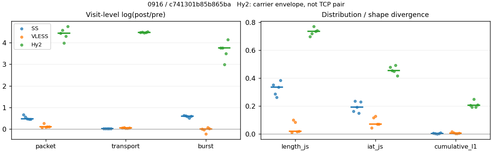
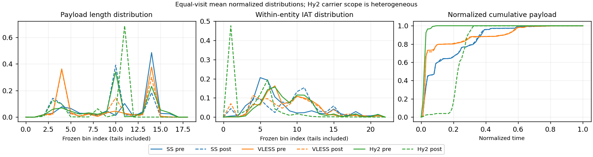

# 0916 · 条目 007 · wikipedia.org

目标：https://en.wikipedia.org/wiki/Domain_Name_System

活动标签：wikipedia.org::article_view。选定访问 15 次。

[返回总索引](../../README.md) · [统计口径](../../methods.md)

## 覆盖与资格（每次访问均保留）

| 部署 | 重复 | 主请求路由 | 活动状态 | 代理比较 | DIRECT pre | 请求 proxy/direct/unresolved | 错误 |
| --- | --- | --- | --- | --- | --- | --- | --- |
| Hy2 | 1 | proxy | passed | 1 | 0 | 28/0/0 | [] |
| Hy2 | 2 | proxy | passed | 1 | 0 | 28/0/0 | [] |
| Hy2 | 3 | proxy | passed | 1 | 0 | 28/0/0 | [] |
| Hy2 | 4 | proxy | passed | 1 | 0 | 28/0/0 | [] |
| Hy2 | 5 | proxy | passed | 1 | 0 | 28/0/0 | [] |
| SS | 1 | proxy | passed | 1 | 0 | 28/0/0 | [] |
| SS | 2 | proxy | passed | 1 | 0 | 28/0/0 | [] |
| SS | 3 | proxy | passed | 1 | 0 | 28/0/0 | [] |
| SS | 4 | proxy | passed | 1 | 0 | 29/0/0 | [] |
| SS | 5 | proxy | passed | 1 | 0 | 29/0/0 | [] |
| VLESS | 1 | proxy | passed | 1 | 0 | 28/0/0 | [] |
| VLESS | 2 | proxy | passed | 1 | 0 | 33/0/0 | [] |
| VLESS | 3 | proxy | passed | 1 | 0 | 28/0/0 | [] |
| VLESS | 4 | proxy | passed | 1 | 0 | 28/0/0 | [] |
| VLESS | 5 | proxy | passed | 1 | 0 | 28/0/0 | [] |

主请求非 proxy 的统计仅解释为已索引的辅助代理连接或 DIRECT 观测，不代表目标业务经代理传输。播放确认与配对资格是两道不同的门。

图中散点为单次访问，短线为重复中位数；Hy2 是共享载体包络，不能与 TCP 配对作等范围因果对比。

形态图先逐访问归一化，再对访问等权平均；实线 pre，虚线 post。分箱序号及边界见 methods，不将分箱索引误解为长度或时间。

## 每次访问的关键观测

### SS

范围：`exclusive_page`。每格 pre → post；空值为不可观测/不适用。

| 重复 | 包数 | 载荷字节 | burst | TCP FR | IAT中位µs | length JS | IAT JS |
| --- | --- | --- | --- | --- | --- | --- | --- |
| 1 | 430 → 833 | 5.4217e+05 → 5.5149e+05 | 315 → 595 | 34 → 34 | 51.39 → 498.47 | 0.35088 | 0.16075 |
| 2 | 454 → 798 | 5.4226e+05 → 5.5861e+05 | 321 → 591 | 38 → 40 | 34.651 → 563.84 | 0.28735 | 0.23331 |
| 3 | 456 → 738 | 5.3404e+05 → 5.423e+05 | 282 → 506 | 33 → 43 | 26.4 → 479.42 | 0.26193 | 0.19209 |
| 4 | 544 → 864 | 5.5486e+05 → 5.6615e+05 | 390 → 650 | 42 → 52 | 43.582 → 673.59 | 0.33461 | 0.14687 |
| 5 | 495 → 777 | 5.4316e+05 → 5.5924e+05 | 329 → 595 | 37 → 39 | 29.383 → 811.26 | 0.38443 | 0.22929 |

完整标量统计：中位数 [min,max]；Δ 为重复内逐访问变换的中位数，MAD 未缩放。n 为可用变换数；DIRECT-only 的 nΔ=0 不代表 pre 不可用。

| scope | 特征 | pre | post | Δ | IQRΔ | MADΔ | nΔ |
| --- | --- | --- | --- | --- | --- | --- | --- |
| exclusive_page | active_span_sum_s_1000ms | 7.8706 [6.4159, 11.672] | 8.2754 [6.5218, 11.326] | 0.042593 | 0.033778 | 0.026215 | 5 |
| exclusive_page | active_span_sum_s_100ms | 1.8514 [1.0483, 1.926] | 3.0429 [2.2613, 3.6396] | 0.67593 | 0.31141 | 0.19107 | 5 |
| exclusive_page | active_span_sum_s_500ms | 6.1897 [4.7851, 7.4827] | 7.1018 [4.8923, 9.084] | 0.1634 | 0.035957 | 0.030533 | 5 |
| exclusive_page | burst_bytes_iqr | 2896 [2804, 2896] | 1428 [1428, 1466.5] | -0.70706 | 0.026604 | 0 | 5 |
| exclusive_page | burst_bytes_mad | 31 [0, 35] | 34 [6, 40] | 0.092373 | 0.020579 | 0 | 3 |
| exclusive_page | burst_bytes_max | 20480 [16384, 20480] | 7569 [5712, 10562] | -0.77224 | 0.40124 | 0.11006 | 5 |
| exclusive_page | burst_bytes_mean | 1689.3 [1422.7, 1893.8] | 939.9 [871, 1071.7] | -0.5693 | 0.01736 | 0.01138 | 5 |
| exclusive_page | burst_bytes_median | 31 [0, 35] | 34 [6, 40] | 0.092373 | 0.020579 | 0 | 3 |
| exclusive_page | burst_bytes_min | 0 [0, 0] | 0 [0, 0] | — | — | — | 0 |
| exclusive_page | burst_bytes_p95 | 8192 [5792, 8762.1] | 2896 [2856, 4284] | -0.82167 | 0.32428 | 0.12852 | 5 |
| exclusive_page | burst_bytes_q25 | 0 [0, 0] | 0 [0, 0] | — | — | — | 0 |
| exclusive_page | burst_bytes_q75 | 2896 [2804, 2896] | 1428 [1428, 1466.5] | -0.70706 | 0.026604 | 0 | 5 |
| exclusive_page | burst_bytes_std | 2914.8 [2686, 3668.1] | 1352.1 [1203.6, 1602.9] | -0.80269 | 0.069756 | 0.044582 | 5 |
| exclusive_page | burst_count | 321 [282, 390] | 595 [506, 650] | 0.5925 | 0.025745 | 0.017871 | 5 |
| exclusive_page | burst_duration_ms_iqr | 0.025844 [0, 0.027469] | 0 [0, 0.00030275] | -5.5346 | 1.0877 | 1.0877 | 2 |
| exclusive_page | burst_duration_ms_mad | 0 [0, 0] | 0 [0, 0] | — | — | — | 0 |
| exclusive_page | burst_duration_ms_max | 5488.5 [1839.9, 15001] | 6362.4 [1768.5, 45480] | 5.6159e-05 | 0.57682 | 0.57681 | 5 |
| exclusive_page | burst_duration_ms_mean | 48.045 [37.372, 129.33] | 29.444 [11.201, 165.81] | -0.69728 | 0.97235 | 0.60212 | 5 |
| exclusive_page | burst_duration_ms_median | 0 [0, 0] | 0 [0, 0] | — | — | — | 0 |
| exclusive_page | burst_duration_ms_min | 0 [0, 0] | 0 [0, 0] | — | — | — | 0 |
| exclusive_page | burst_duration_ms_p95 | 210.94 [170.94, 215.06] | 7.4469 [4.6254, 8.4562] | -3.3474 | 0.014478 | 0.010324 | 5 |
| exclusive_page | burst_duration_ms_q25 | 0 [0, 0] | 0 [0, 0] | — | — | — | 0 |
| exclusive_page | burst_duration_ms_q75 | 0.025844 [0, 0.027469] | 0 [0, 0.00030275] | -5.5346 | 1.0877 | 1.0877 | 2 |
| exclusive_page | burst_duration_ms_std | 377.11 [189.28, 1224] | 295.19 [96.114, 2066.2] | -0.31156 | 0.64262 | 0.62861 | 5 |
| exclusive_page | burst_packets_iqr | 1 [0, 1] | 0 [0, 1] | -0.34657 | 0.34657 | 0.34657 | 2 |
| exclusive_page | burst_packets_mad | 0 [0, 0] | 0 [0, 0] | — | — | — | 0 |
| exclusive_page | burst_packets_max | 7 [6, 10] | 7 [7, 8] | 0 | 0.28768 | 0.15415 | 5 |
| exclusive_page | burst_packets_mean | 1.4143 [1.3651, 1.617] | 1.3503 [1.3059, 1.4585] | -0.048202 | 0.056815 | 0.054976 | 5 |
| exclusive_page | burst_packets_median | 1 [1, 1] | 1 [1, 1] | 0 | 0 | 0 | 5 |
| exclusive_page | burst_packets_min | 1 [1, 1] | 1 [1, 1] | 0 | 0 | 0 | 5 |
| exclusive_page | burst_packets_p95 | 3 [3, 4] | 3 [3, 3] | 0 | 0.28768 | 0 | 5 |
| exclusive_page | burst_packets_q25 | 1 [1, 1] | 1 [1, 1] | 0 | 0 | 0 | 5 |
| exclusive_page | burst_packets_q75 | 2 [1, 2] | 1 [1, 2] | -0.28768 | 0.69315 | 0.28768 | 5 |
| exclusive_page | burst_packets_std | 0.9243 [0.71938, 1.3377] | 0.79177 [0.77414, 0.93423] | -0.17728 | 0.19376 | 0.15147 | 5 |
| exclusive_page | connection_span_concurrency_max | 4 [3, 4] | 4 [3, 4] | 0 | 0 | 0 | 5 |
| exclusive_page | cumulative_l1 | — | — | 0.0010097 | 0.0047346 | 0.00092809 | 5 |
| exclusive_page | cumulative_max | — | — | 0.066876 | 0.048548 | 0.03716 | 5 |
| exclusive_page | direction_entropy | 0.70792 [0.689, 0.77288] | 0.55085 [0.48863, 0.60563] | -0.16563 | 0.057309 | 0.029224 | 5 |
| exclusive_page | down_burst_count | 158 [139, 192] | 295 [251, 322] | 0.59938 | 0.026599 | 0.018199 | 5 |
| exclusive_page | down_ip_bytes | 5.3726e+05 [5.3324e+05, 5.5036e+05] | 5.5407e+05 [5.4702e+05, 5.637e+05] | 0.025581 | 0.0049561 | 0.0016333 | 5 |
| exclusive_page | down_packets | 285 [237, 312] | 426 [415, 466] | 0.40195 | 0.095591 | 0.067404 | 5 |
| exclusive_page | down_transport_bytes | 5.2388e+05 [5.1839e+05, 5.3409e+05] | 5.3153e+05 [5.2483e+05, 5.3916e+05] | 0.013509 | 0.0023031 | 0.0011624 | 5 |
| exclusive_page | duration_s | 64.826 [8.7339, 66.404] | 64.825 [8.7333, 66.403] | -2.2678e-05 | 5.4486e-05 | 1.5029e-05 | 5 |
| exclusive_page | entity_count | 5 [4, 6] | 5 [4, 6] | 0 | 0 | 0 | 5 |
| exclusive_page | fr_runs | 37 [33, 42] | 40 [34, 52] | 0.052644 | 0.16228 | 0.052644 | 5 |
| exclusive_page | fr_runs_per_packet | 0.14483 [0.11913, 0.15768] | 0.093301 [0.073753, 0.11159] | -0.035618 | 0.031629 | 0.0179 | 5 |
| exclusive_page | fr_switches | 32 [29, 36] | 35 [29, 46] | 0.060625 | 0.18628 | 0.060625 | 5 |
| exclusive_page | fr_switches_per_possible_transition | 0.12676 [0.10623, 0.13983] | 0.082324 [0.063596, 0.1] | -0.031151 | 0.03091 | 0.017781 | 5 |
| exclusive_page | full_retransmission_fraction | 0 [0, 0.002193] | 0.012531 [0.001355, 0.016204] | 0.012531 | 0.0080681 | 0.0018341 | 5 |
| exclusive_page | full_retransmission_packets | 0 [0, 1] | 10 [1, 14] | 1.3195 | 1.3195 | 1.3195 | 2 |
| exclusive_page | iat_count | 452 [425, 538] | 793 [734, 858] | 0.48483 | 0.10205 | 0.030248 | 5 |
| exclusive_page | iat_js | — | — | 0.19209 | 0.068536 | 0.0372 | 5 |
| exclusive_page | iat_ks | — | — | 0.35947 | 0.057578 | 0.043887 | 5 |
| exclusive_page | iat_median_us | 34.651 [26.4, 51.39] | 563.84 [479.42, 811.26] | 2.7895 | 0.16124 | 0.10977 | 5 |
| exclusive_page | iat_us_iqr | 194.22 [146.4, 681.13] | 1738.6 [1245.3, 2174.9] | 1.9218 | 0.91289 | 0.58772 | 5 |
| exclusive_page | iat_us_mad | 28.036 [21.686, 41.817] | 553.15 [469.92, 788.53] | 2.9821 | 0.17491 | 0.093758 | 5 |
| exclusive_page | iat_us_max | 1.5001e+07 [5.4885e+06, 1.5001e+07] | 1.5326e+07 [5.4888e+06, 1.5456e+07] | 0.021433 | 0.023584 | 0.0084148 | 5 |
| exclusive_page | iat_us_mean | 1.5766e+05 [48476, 3.9621e+05] | 97081 [25290, 2.4929e+05] | -0.48487 | 0.10551 | 0.030184 | 5 |
| exclusive_page | iat_us_median | 34.651 [26.4, 51.39] | 563.84 [479.42, 811.26] | 2.7895 | 0.16124 | 0.10977 | 5 |
| exclusive_page | iat_us_min | 0.122 [0.058, 1.316] | 0.038 [0.036, 0.068] | -0.58451 | 1.0387 | 0.10759 | 5 |
| exclusive_page | iat_us_p95 | 2.1037e+05 [1.0263e+05, 3.2937e+05] | 40295 [33238, 80634] | -1.195 | 0.27985 | 0.082658 | 5 |
| exclusive_page | iat_us_q25 | 13.266 [12.848, 15.795] | 20.578 [16.14, 31.594] | 0.3284 | 0.32978 | 0.1323 | 5 |
| exclusive_page | iat_us_q75 | 207.49 [159.66, 696.92] | 1754.8 [1268.6, 2194.9] | 1.8722 | 0.87038 | 0.56802 | 5 |
| exclusive_page | iat_us_std | 1.3721e+06 [3.4079e+05, 2.2975e+06] | 1.1088e+06 [2.5085e+05, 1.8406e+06] | -0.2428 | 0.035704 | 0.02106 | 5 |
| exclusive_page | iat_wasserstein_log1p_us | — | — | 1.3728 | 0.22736 | 0.12308 | 5 |
| exclusive_page | idle_gap_count_1000ms | 7 [4, 14] | 6 [4, 14] | -0.15415 | 0.18232 | 0.028171 | 5 |
| exclusive_page | idle_gap_count_100ms | 29 [23, 40] | 28 [20, 41] | 0 | 0.093685 | 0.04256 | 5 |
| exclusive_page | idle_gap_count_500ms | 9 [7, 20] | 8 [6, 17] | -0.15415 | 0.044736 | 0.036368 | 5 |
| exclusive_page | idle_gap_sum_s_1000ms | 64.845 [13.073, 201.49] | 64.735 [12.665, 202.56] | -0.00268 | 0.03006 | 0.0080173 | 5 |
| exclusive_page | idle_gap_sum_s_100ms | 70.212 [19.052, 211.31] | 68.996 [18.008, 210.25] | -0.017477 | 0.04735 | 0.012467 | 5 |
| exclusive_page | idle_gap_sum_s_500ms | 66.475 [14.913, 205.68] | 66.365 [13.839, 204.81] | -0.0071139 | 0.070529 | 0.005448 | 5 |
| exclusive_page | ip_bytes | 5.6595e+05 [5.5783e+05, 5.8326e+05] | 6.058e+05 [5.8615e+05, 6.1665e+05] | 0.060769 | 0.0070432 | 0.0051022 | 5 |
| exclusive_page | length_iqr | 1921 [1805.5, 2296] | 1320 [572.25, 1354] | -0.37219 | 0.1764 | 0.058983 | 5 |
| exclusive_page | length_js | — | — | 0.33461 | 0.063529 | 0.047253 | 5 |
| exclusive_page | length_ks | — | — | 0.49571 | 0.0048081 | 0.0025497 | 5 |
| exclusive_page | length_mad | 288 [179.5, 1240] | 970.5 [0, 1247] | 0.54101 | 1.1684 | 0.51699 | 4 |
| exclusive_page | length_max | 4096 [4096, 8920] | 2930 [2856, 4284] | -0.36059 | 0.57878 | 0.40547 | 5 |
| exclusive_page | length_mean | 1928 [1892.5, 2367.6] | 1279 [1196.3, 1337.9] | -0.45417 | 0.14123 | 0.097442 | 5 |
| exclusive_page | length_median | 2689 [2688, 2872] | 1428 [1428, 1428] | -0.63289 | 0.065166 | 0.00037195 | 5 |
| exclusive_page | length_min | 31 [31, 31] | 12 [6, 20] | -0.94908 | 0.69315 | 0.51083 | 5 |
| exclusive_page | length_p95 | 2896 [2896, 8192] | 2856 [2856, 2856] | -0.013908 | 0.73059 | 0 | 5 |
| exclusive_page | length_q25 | 975 [600, 1090.5] | 124 [74, 855.75] | -2.0622 | 0.29038 | 0.2501 | 5 |
| exclusive_page | length_q75 | 2896 [2896, 2896] | 1428 [1428, 1482] | -0.70706 | 0.013908 | 0 | 5 |
| exclusive_page | length_std | 1165.8 [1132.4, 2155] | 988.26 [840.11, 1000.2] | -0.31407 | 0.43519 | 0.14926 | 5 |
| exclusive_page | length_wasserstein_bytes | — | — | 698.47 | 301.39 | 122.21 | 5 |
| exclusive_page | nonempty_entity_count | 5 [4, 6] | 5 [4, 6] | 0 | 0 | 0 | 5 |
| exclusive_page | nonempty_packets | 277 [229, 290] | 431 [418, 466] | 0.4743 | 0.1556 | 0.098305 | 5 |
| exclusive_page | offload_suspect_fraction | 0.31718 [0.3, 0.35965] | 0.12485 [0.10296, 0.14499] | -0.18798 | 0.030314 | 0.012827 | 5 |
| exclusive_page | packet_count | 456 [430, 544] | 798 [738, 864] | 0.48145 | 0.10139 | 0.030568 | 5 |
| exclusive_page | rtt_median_ms | 0.053967 [0.050959, 0.066188] | 32.987 [29.964, 34.467] | 6.3194 | 0.17683 | 0.12939 | 5 |
| exclusive_page | rtt_sample_count | 190 [163, 214] | 143 [113, 174] | -0.31508 | 0.072377 | 0.051281 | 5 |
| exclusive_page | tcp_ack_count | 452 [425, 538] | 793 [734, 858] | 0.48483 | 0.10205 | 0.030248 | 5 |
| exclusive_page | tcp_fin_count | 10 [8, 12] | 10 [8, 15] | 0 | 0 | 0 | 5 |
| exclusive_page | tcp_packet_count | 456 [430, 544] | 798 [738, 864] | 0.48145 | 0.10139 | 0.030568 | 5 |
| exclusive_page | tcp_rst_count | 0 [0, 0] | 0 [0, 0] | — | — | — | 0 |
| exclusive_page | tcp_syn_count | 10 [8, 12] | 10 [8, 12] | 0 | 0 | 0 | 5 |
| exclusive_page | tcp_window_raw_median | 65535 [65486, 65535] | 140 [137, 148] | -6.1487 | 0.055597 | 0.021661 | 5 |
| exclusive_page | transition_entropy | 0.46919 [0.42755, 0.50904] | 0.35446 [0.27126, 0.38249] | -0.09388 | 0.087509 | 0.02866 | 5 |
| exclusive_page | transition_n_mm | 210 [160, 217] | 356 [338, 395] | 0.57095 | 0.21391 | 0.1278 | 5 |
| exclusive_page | transition_n_mp | 14 [12, 15] | 16 [12, 20] | 0.068993 | 0.22314 | 0.068993 | 5 |
| exclusive_page | transition_n_pm | 17 [16, 21] | 20 [17, 26] | 0.057158 | 0.16228 | 0.057158 | 5 |
| exclusive_page | transition_n_pp | 34 [32, 35] | 35 [28, 41] | 0.05557 | 0.17922 | 0.14518 | 5 |
| exclusive_page | transition_p_mm | 0.93421 [0.92432, 0.9417] | 0.9548 [0.94962, 0.97052] | 0.019457 | 0.019833 | 0.009679 | 5 |
| exclusive_page | transition_p_mp | 0.065789 [0.058296, 0.075676] | 0.045198 [0.029484, 0.050378] | -0.019457 | 0.019833 | 0.009679 | 5 |
| exclusive_page | transition_p_pm | 0.34 [0.32, 0.375] | 0.36364 [0.30508, 0.42857] | 0.020016 | 0.046611 | 0.028928 | 5 |
| exclusive_page | transition_p_pp | 0.66 [0.625, 0.68] | 0.63636 [0.57143, 0.69492] | -0.020016 | 0.046611 | 0.028928 | 5 |
| exclusive_page | transport_bytes | 5.4226e+05 [5.3404e+05, 5.5486e+05] | 5.5861e+05 [5.423e+05, 5.6615e+05] | 0.020134 | 0.012153 | 0.0048004 | 5 |
| exclusive_page | up_burst_count | 163 [143, 198] | 300 [255, 328] | 0.58579 | 0.024924 | 0.017555 | 5 |
| exclusive_page | up_byte_fraction | 0.034041 [0.029309, 0.037443] | 0.047666 [0.032204, 0.048469] | 0.010222 | 0.010416 | 0.0042055 | 5 |
| exclusive_page | up_ip_bytes | 28691 [24588, 32900] | 51728 [39132, 52950] | 0.47588 | 0.11751 | 0.01798 | 5 |
| exclusive_page | up_packets | 196 [171, 232] | 370 [312, 398] | 0.60338 | 0.044802 | 0.042764 | 5 |
| exclusive_page | up_transport_bytes | 18459 [15652, 20776] | 26840 [17464, 27075] | 0.26152 | 0.25568 | 0.12154 | 5 |
| exclusive_page | zero_iat_count | 0 [0, 0] | 0 [0, 0] | — | — | — | 0 |
| exclusive_page | zero_iat_fraction | 0 [0, 0] | 0 [0, 0] | 0 | 0 | 0 | 5 |

### VLESS

范围：`exclusive_page`。每格 pre → post；空值为不可观测/不适用。

| 重复 | 包数 | 载荷字节 | burst | TCP FR | IAT中位µs | length JS | IAT JS |
| --- | --- | --- | --- | --- | --- | --- | --- |
| 1 | 766 → 828 | 5.25e+05 → 5.5624e+05 | 676 → 678 | 29 → 38 | 166.42 → 259.15 | 0.0088556 | 0.041861 |
| 2 | 822 → 1077 | 6.452e+05 → 6.9399e+05 | 654 → 640 | 51 → 66 | 139.93 → 63.174 | 0.098044 | 0.11583 |
| 3 | 729 → 807 | 5.2632e+05 → 5.4732e+05 | 597 → 483 | 30 → 36 | 151.94 → 271.02 | 0.081732 | 0.12721 |
| 4 | 633 → 713 | 5.2348e+05 → 5.4832e+05 | 415 → 447 | 34 → 44 | 377.18 → 376.53 | 0.015245 | 0.06906 |
| 5 | 782 → 875 | 5.3406e+05 → 5.6647e+05 | 648 → 668 | 44 → 54 | 149.07 → 142.32 | 0.018315 | 0.069349 |

完整标量统计：中位数 [min,max]；Δ 为重复内逐访问变换的中位数，MAD 未缩放。n 为可用变换数；DIRECT-only 的 nΔ=0 不代表 pre 不可用。

| scope | 特征 | pre | post | Δ | IQRΔ | MADΔ | nΔ |
| --- | --- | --- | --- | --- | --- | --- | --- |
| exclusive_page | active_span_sum_s_1000ms | 7.3263 [5.9619, 10.678] | 7.3667 [6.0411, 11.982] | 0.012534 | 0.025684 | 0.018654 | 5 |
| exclusive_page | active_span_sum_s_100ms | 1.3597 [0.99458, 1.7225] | 2.637 [2.2724, 4.1027] | 0.7727 | 0.18356 | 0.09513 | 5 |
| exclusive_page | active_span_sum_s_500ms | 3.301 [2.934, 5.7967] | 6.0411 [5.4132, 10.394] | 0.58392 | 0.065441 | 0.03842 | 5 |
| exclusive_page | burst_bytes_iqr | 1851.2 [1484, 2896] | 2824 [1864.8, 2896] | 0.12387 | 0.28487 | 0.12387 | 5 |
| exclusive_page | burst_bytes_mad | 27.5 [0, 31] | 72 [59.5, 241] | 0.96248 | 0.30203 | 0.059901 | 4 |
| exclusive_page | burst_bytes_max | 8688 [5720, 11512] | 5792 [4832, 7348] | -0.44896 | 0.18122 | 0.13772 | 5 |
| exclusive_page | burst_bytes_mean | 881.61 [776.63, 1261.4] | 1084.4 [820.41, 1226.7] | 0.054838 | 0.066027 | 0.03971 | 5 |
| exclusive_page | burst_bytes_median | 27.5 [0, 31] | 72 [59.5, 241] | 0.96248 | 0.30203 | 0.059901 | 4 |
| exclusive_page | burst_bytes_min | 0 [0, 0] | 0 [0, 0] | — | — | — | 0 |
| exclusive_page | burst_bytes_p95 | 2896 [2896, 2968] | 2896 [2896, 2897.8] | 0 | 0.023936 | 0 | 5 |
| exclusive_page | burst_bytes_q25 | 0 [0, 0] | 0 [0, 0] | — | — | — | 0 |
| exclusive_page | burst_bytes_q75 | 1851.2 [1484, 2896] | 2824 [1864.8, 2896] | 0.12387 | 0.28487 | 0.12387 | 5 |
| exclusive_page | burst_bytes_std | 1319.7 [1245.7, 1682.2] | 1272.8 [1221.2, 1403.5] | -0.03756 | 0.14126 | 0.036572 | 5 |
| exclusive_page | burst_count | 648 [415, 676] | 640 [447, 678] | 0.0029542 | 0.052037 | 0.027443 | 5 |
| exclusive_page | burst_duration_ms_iqr | 0 [0, 0.84038] | 0.070094 [0, 1.3259] | 0.45597 | — | — | 1 |
| exclusive_page | burst_duration_ms_mad | 0 [0, 0] | 0 [0, 0] | — | — | — | 0 |
| exclusive_page | burst_duration_ms_max | 15000 [980.48, 15001] | 15024 [318.19, 15062] | 0.001539 | 1.4519 | 1.4494 | 5 |
| exclusive_page | burst_duration_ms_mean | 34.241 [8.7431, 108.36] | 45.587 [4.9377, 175.74] | 0.48359 | 1.2285 | 0.49283 | 5 |
| exclusive_page | burst_duration_ms_median | 0 [0, 0] | 0 [0, 0] | — | — | — | 0 |
| exclusive_page | burst_duration_ms_min | 0 [0, 0] | 0 [0, 0] | — | — | — | 0 |
| exclusive_page | burst_duration_ms_p95 | 6.4782 [4.4663, 43.933] | 10.288 [7.7857, 159.22] | 0.55573 | 0.55206 | 0.17989 | 5 |
| exclusive_page | burst_duration_ms_q25 | 0 [0, 0] | 0 [0, 0] | — | — | — | 0 |
| exclusive_page | burst_duration_ms_q75 | 0 [0, 0.84038] | 0.070094 [0, 1.3259] | 0.45597 | — | — | 1 |
| exclusive_page | burst_duration_ms_std | 595.11 [76.312, 1150.7] | 714.51 [31.417, 1534.6] | 0.28789 | 1.3159 | 1.1754 | 5 |
| exclusive_page | burst_packets_iqr | 0 [0, 1] | 1 [0, 1] | 0 | — | — | 1 |
| exclusive_page | burst_packets_mad | 0 [0, 0] | 0 [0, 0] | — | — | — | 0 |
| exclusive_page | burst_packets_max | 6 [4, 8] | 7 [6, 7] | 0.15415 | 0.33647 | 0.18232 | 5 |
| exclusive_page | burst_packets_mean | 1.2211 [1.1331, 1.5253] | 1.5951 [1.2212, 1.6828] | 0.081972 | 0.21696 | 0.037241 | 5 |
| exclusive_page | burst_packets_median | 1 [1, 1] | 1 [1, 1] | 0 | 0 | 0 | 5 |
| exclusive_page | burst_packets_min | 1 [1, 1] | 1 [1, 1] | 0 | 0 | 0 | 5 |
| exclusive_page | burst_packets_p95 | 2 [2, 2] | 3 [2, 3] | 0.40547 | 0 | 0 | 5 |
| exclusive_page | burst_packets_q25 | 1 [1, 1] | 1 [1, 1] | 0 | 0 | 0 | 5 |
| exclusive_page | burst_packets_q75 | 1 [1, 2] | 2 [1, 2] | 0 | 0.69315 | 0 | 5 |
| exclusive_page | burst_packets_std | 0.50658 [0.41069, 0.71386] | 0.88308 [0.71727, 0.94589] | 0.47379 | 0.092175 | 0.083824 | 5 |
| exclusive_page | connection_span_concurrency_max | 2 [2, 4] | 2 [2, 4] | 0 | 0 | 0 | 5 |
| exclusive_page | cumulative_l1 | — | — | 0.0029876 | 0.0049314 | 0.0018549 | 5 |
| exclusive_page | cumulative_max | — | — | 0.049049 | 0.02746 | 0.015678 | 5 |
| exclusive_page | direction_entropy | 0.53284 [0.4948, 0.57492] | 0.47367 [0.46628, 0.51693] | -0.053645 | 0.017561 | 0.011085 | 5 |
| exclusive_page | down_burst_count | 322 [206, 336] | 317 [222, 337] | 0.0029718 | 0.052425 | 0.027612 | 5 |
| exclusive_page | down_ip_bytes | 5.3342e+05 [5.304e+05, 6.4724e+05] | 5.5707e+05 [5.5125e+05, 6.9347e+05] | 0.047993 | 0.010834 | 0.00943 | 5 |
| exclusive_page | down_packets | 405 [398, 451] | 466 [432, 613] | 0.10155 | 0.086992 | 0.027798 | 5 |
| exclusive_page | down_transport_bytes | 5.1249e+05 [5.0968e+05, 6.2374e+05] | 5.3437e+05 [5.2823e+05, 6.6155e+05] | 0.046917 | 0.010372 | 0.010156 | 5 |
| exclusive_page | duration_s | 66.803 [4.6792, 68.211] | 66.785 [4.6053, 68.171] | -0.00059591 | 0.00028344 | 0.00026532 | 5 |
| exclusive_page | entity_count | 4 [3, 6] | 4 [3, 6] | 0 | 0 | 0 | 5 |
| exclusive_page | fr_runs | 34 [29, 51] | 44 [36, 66] | 0.25783 | 0.053035 | 0.012461 | 5 |
| exclusive_page | fr_runs_per_packet | 0.085859 [0.073048, 0.12] | 0.10353 [0.07611, 0.1179] | 0.011366 | 0.015356 | 0.0063044 | 5 |
| exclusive_page | fr_switches | 31 [25, 45] | 41 [33, 60] | 0.27958 | 0.064539 | 0.0279 | 5 |
| exclusive_page | fr_switches_per_possible_transition | 0.07888 [0.063613, 0.1074] | 0.097156 [0.070213, 0.11013] | 0.012333 | 0.01504 | 0.0059433 | 5 |
| exclusive_page | full_retransmission_fraction | 0 [0, 0.002611] | 0 [0, 0.0014025] | 0 | 0.0023002 | 0.0013717 | 5 |
| exclusive_page | full_retransmission_packets | 0 [0, 2] | 0 [0, 1] | — | — | — | 0 |
| exclusive_page | iat_count | 762 [630, 816] | 824 [710, 1071] | 0.11292 | 0.017496 | 0.010866 | 5 |
| exclusive_page | iat_js | — | — | 0.069349 | 0.04677 | 0.027488 | 5 |
| exclusive_page | iat_ks | — | — | 0.15753 | 0.07533 | 0.055783 | 5 |
| exclusive_page | iat_median_us | 151.94 [139.93, 377.18] | 259.15 [63.174, 376.53] | -0.0017129 | 0.48924 | 0.44462 | 5 |
| exclusive_page | iat_us_iqr | 1257.6 [1075.3, 2064.1] | 1440.6 [1171.4, 2314.5] | 0.11452 | 0.050354 | 0.028982 | 5 |
| exclusive_page | iat_us_mad | 145.07 [132.17, 359.2] | 251.36 [63.107, 369.27] | 0.027661 | 0.45047 | 0.42583 | 5 |
| exclusive_page | iat_us_max | 1.5001e+07 [1.3535e+06, 1.5001e+07] | 1.5313e+07 [1.3477e+06, 1.5449e+07] | 0.020602 | 0.00033835 | 0.00029103 | 5 |
| exclusive_page | iat_us_mean | 1.0783e+05 [9866.8, 2.7224e+05] | 95608 [8967.1, 2.0732e+05] | -0.1137 | 0.017166 | 0.010546 | 5 |
| exclusive_page | iat_us_median | 151.94 [139.93, 377.18] | 259.15 [63.174, 376.53] | -0.0017129 | 0.48924 | 0.44462 | 5 |
| exclusive_page | iat_us_min | 1.771 [0.802, 3.435] | 0.037 [0.036, 0.038] | -3.8417 | 0.83431 | 0.63777 | 5 |
| exclusive_page | iat_us_p95 | 10388 [9655.1, 1.3042e+05] | 45053 [38207, 64955] | 1.3755 | 0.17261 | 0.091669 | 5 |
| exclusive_page | iat_us_q25 | 42.465 [35.647, 51.536] | 15.928 [8.337, 31.047] | -0.97171 | 0.43657 | 0.42683 | 5 |
| exclusive_page | iat_us_q75 | 1309.1 [1117.8, 2110.4] | 1460.3 [1181.8, 2345.6] | 0.10563 | 0.053585 | 0.038207 | 5 |
| exclusive_page | iat_us_std | 1.1924e+06 [74245, 1.9376e+06] | 1.1204e+06 [57318, 1.6951e+06] | -0.06225 | 0.077275 | 0.0091655 | 5 |
| exclusive_page | iat_wasserstein_log1p_us | — | — | 0.54056 | 0.14304 | 0.12506 | 5 |
| exclusive_page | idle_gap_count_1000ms | 5 [1, 16] | 5 [1, 15] | 0 | 0 | 0 | 5 |
| exclusive_page | idle_gap_count_100ms | 22 [14, 42] | 25 [18, 48] | 0.13353 | 0.063179 | 0.005698 | 5 |
| exclusive_page | idle_gap_count_500ms | 10 [6, 23] | 7 [1, 17] | -0.35667 | 0.020203 | 0.020203 | 5 |
| exclusive_page | idle_gap_sum_s_1000ms | 61.288 [1.3535, 211.47] | 61.171 [1.3477, 210.05] | -0.0025664 | 0.0018363 | 0.00066293 | 5 |
| exclusive_page | idle_gap_sum_s_100ms | 67.565 [6.1588, 220.43] | 66.266 [4.7519, 217.93] | -0.019416 | 0.0087544 | 0.0074027 | 5 |
| exclusive_page | idle_gap_sum_s_500ms | 64.94 [4.5845, 216.35] | 62.792 [1.3477, 211.64] | -0.03363 | 0.012251 | 0.0087287 | 5 |
| exclusive_page | ip_bytes | 5.6485e+05 [5.5637e+05, 6.8793e+05] | 5.9945e+05 [5.8563e+05, 7.5099e+05] | 0.059458 | 0.012021 | 0.0082082 | 5 |
| exclusive_page | length_iqr | 2752 [2752, 2752] | 2752 [1376, 2752] | 0 | 0.55301 | 0 | 5 |
| exclusive_page | length_js | — | — | 0.018315 | 0.066487 | 0.009459 | 5 |
| exclusive_page | length_ks | — | — | 0.0639 | 0.13867 | 0.028249 | 5 |
| exclusive_page | length_mad | 1091 [1085.5, 1340] | 1119 [1013, 1340] | 0 | 0.071293 | 0.045953 | 5 |
| exclusive_page | length_max | 5792 [2896, 8688] | 2896 [2896, 2896] | -0.69315 | 1.0986 | 0.40547 | 5 |
| exclusive_page | length_mean | 1322.4 [1293.1, 1518.1] | 1236.8 [1157.1, 1293.6] | -0.044502 | 0.11931 | 0.022446 | 5 |
| exclusive_page | length_median | 1163 [1157.5, 1412] | 1191 [1085, 1412] | 0 | 0.066836 | 0.043046 | 5 |
| exclusive_page | length_min | 24 [24, 24] | 24 [24, 24] | 0 | 0 | 0 | 5 |
| exclusive_page | length_p95 | 2824 [2824, 2896] | 2824 [2824, 2824] | 0 | 0.0088839 | 0 | 5 |
| exclusive_page | length_q25 | 72 [72, 72] | 72 [72, 72] | 0 | 0 | 0 | 5 |
| exclusive_page | length_q75 | 2824 [2824, 2824] | 2824 [1448, 2824] | 0 | 0.53435 | 0 | 5 |
| exclusive_page | length_std | 1274.2 [1234.3, 1483.4] | 1187.2 [1059.7, 1235.6] | -0.066388 | 0.13463 | 0.035619 | 5 |
| exclusive_page | length_wasserstein_bytes | — | — | 75.873 | 223.94 | 31.421 | 5 |
| exclusive_page | nonempty_entity_count | 4 [3, 6] | 4 [3, 6] | 0 | 0 | 0 | 5 |
| exclusive_page | nonempty_packets | 397 [394, 425] | 458 [425, 585] | 0.10342 | 0.1029 | 0.032747 | 5 |
| exclusive_page | offload_suspect_fraction | 0.23045 [0.20716, 0.25592] | 0.17714 [0.14498, 0.21879] | -0.03713 | 0.055453 | 0.023612 | 5 |
| exclusive_page | packet_count | 766 [633, 822] | 828 [713, 1077] | 0.11237 | 0.017361 | 0.010719 | 5 |
| exclusive_page | rtt_median_ms | 0.063345 [0.053495, 0.65204] | 0.091796 [0.038364, 1.3341] | 0.37097 | 0.9085 | 0.56355 | 5 |
| exclusive_page | rtt_sample_count | 338 [221, 355] | 384 [272, 421] | 0.14053 | 0.12056 | 0.062009 | 5 |
| exclusive_page | tcp_ack_count | 756 [624, 807] | 824 [710, 1071] | 0.12325 | 0.018767 | 0.012903 | 5 |
| exclusive_page | tcp_fin_count | 8 [6, 11] | 8 [6, 12] | 0 | 0 | 0 | 5 |
| exclusive_page | tcp_packet_count | 766 [633, 822] | 828 [713, 1077] | 0.11237 | 0.017361 | 0.010719 | 5 |
| exclusive_page | tcp_rst_count | 6 [6, 9] | 0 [0, 0] | — | — | — | 0 |
| exclusive_page | tcp_syn_count | 8 [6, 12] | 8 [6, 12] | 0 | 0 | 0 | 5 |
| exclusive_page | tcp_window_raw_median | 65535 [65535, 65535] | 165 [161, 189] | -5.9844 | 0.024541 | 0.024541 | 5 |
| exclusive_page | transition_entropy | 0.32956 [0.27771, 0.4009] | 0.35957 [0.29633, 0.39658] | 0.016662 | 0.034357 | 0.021005 | 5 |
| exclusive_page | transition_n_mm | 337 [331, 342] | 378 [360, 494] | 0.11481 | 0.11969 | 0.038395 | 5 |
| exclusive_page | transition_n_mp | 14 [11, 20] | 19 [15, 27] | 0.3001 | 0.060259 | 0.01005 | 5 |
| exclusive_page | transition_n_pm | 17 [14, 25] | 22 [18, 33] | 0.25783 | 0.072837 | 0.047553 | 5 |
| exclusive_page | transition_n_pp | 32 [28, 32] | 25 [21, 30] | -0.20764 | 0.13353 | 0.094311 | 5 |
| exclusive_page | transition_p_mm | 0.95942 [0.94475, 0.96866] | 0.94987 [0.94264, 0.96445] | -0.0066524 | 0.0072667 | 0.0028998 | 5 |
| exclusive_page | transition_p_mp | 0.04058 [0.031339, 0.055249] | 0.050132 [0.035545, 0.057357] | 0.0066524 | 0.0072667 | 0.0028998 | 5 |
| exclusive_page | transition_p_pm | 0.35417 [0.31915, 0.4386] | 0.50943 [0.375, 0.56897] | 0.10203 | 0.031884 | 0.028342 | 5 |
| exclusive_page | transition_p_pp | 0.64583 [0.5614, 0.68085] | 0.49057 [0.43103, 0.625] | -0.10203 | 0.031884 | 0.028342 | 5 |
| exclusive_page | transport_bytes | 5.2632e+05 [5.2348e+05, 6.452e+05] | 5.5624e+05 [5.4732e+05, 6.9399e+05] | 0.057793 | 0.01255 | 0.011423 | 5 |
| exclusive_page | up_burst_count | 326 [209, 340] | 323 [225, 341] | 0.0029369 | 0.051654 | 0.027277 | 5 |
| exclusive_page | up_byte_fraction | 0.02881 [0.026286, 0.033254] | 0.039314 [0.034884, 0.046748] | 0.010505 | 0.0020503 | 0.001195 | 5 |
| exclusive_page | up_ip_bytes | 33881 [25977, 40687] | 42380 [34381, 57519] | 0.25618 | 0.05647 | 0.032354 | 5 |
| exclusive_page | up_packets | 361 [235, 371] | 392 [281, 464] | 0.12484 | 0.096385 | 0.053932 | 5 |
| exclusive_page | up_transport_bytes | 15125 [13805, 21455] | 21868 [19093, 32443] | 0.36868 | 0.027581 | 0.019964 | 5 |
| exclusive_page | zero_iat_count | 0 [0, 0] | 0 [0, 0] | — | — | — | 0 |
| exclusive_page | zero_iat_fraction | 0 [0, 0] | 0 [0, 0] | 0 | 0 | 0 | 5 |

### Hy2

范围：`carrier_context_envelope`。每格 pre → post；空值为不可观测/不适用。

| 重复 | 包数 | 载荷字节 | burst | TCP FR | IAT中位µs | length JS | IAT JS |
| --- | --- | --- | --- | --- | --- | --- | --- |
| 1 | 518 → 43213 | 5.3761e+05 → 4.6682e+07 | 350 → 14931 | — | 189.5 → 3.4695 | 0.69747 | 0.47802 |
| 2 | 460 → 44214 | 5.3826e+05 → 4.7762e+07 | 358 → 15163 | — | 140.65 → 3.091 | 0.71861 | 0.45397 |
| 3 | 768 → 41242 | 5.3415e+05 → 4.5828e+07 | 652 → 12936 | — | 161.91 → 1.218 | 0.77024 | 0.44835 |
| 4 | 579 → 42268 | 5.2441e+05 → 4.6077e+07 | 429 → 14047 | — | 358.59 → 2.178 | 0.73622 | 0.49181 |
| 5 | 394 → 45127 | 5.2613e+05 → 4.7625e+07 | 270 → 16855 | — | 110.69 → 4.7205 | 0.74206 | 0.41694 |

完整标量统计：中位数 [min,max]；Δ 为重复内逐访问变换的中位数，MAD 未缩放。n 为可用变换数；DIRECT-only 的 nΔ=0 不代表 pre 不可用。

| scope | 特征 | pre | post | Δ | IQRΔ | MADΔ | nΔ |
| --- | --- | --- | --- | --- | --- | --- | --- |
| carrier_context_envelope | active_span_sum_s_1000ms | 4.1734 [2.8737, 5.6087] | 19.267 [15.384, 22.422] | 1.6711 | 0.29566 | 0.23169 | 5 |
| carrier_context_envelope | active_span_sum_s_100ms | 0.86921 [0.47936, 1.2435] | 6.9496 [5.5409, 8.3368] | 1.8523 | 0.46345 | 0.05049 | 5 |
| carrier_context_envelope | active_span_sum_s_500ms | 3.8529 [2.8737, 5.0014] | 17.193 [12.874, 20.185] | 1.5495 | 0.58248 | 0.33315 | 5 |
| carrier_context_envelope | burst_bytes_iqr | 2234 [1404, 2808] | 5075 [4224, 5129] | 0.82053 | 0.70316 | 0.41222 | 5 |
| carrier_context_envelope | burst_bytes_mad | 31 [0, 92] | 298.5 [263, 376] | 1.8507 | 0.66802 | 0.35828 | 4 |
| carrier_context_envelope | burst_bytes_max | 20480 [10768, 21832] | 2.3231e+05 [1.0018e+05, 2.5772e+05] | 2.5324 | 0.34953 | 0.19051 | 5 |
| carrier_context_envelope | burst_bytes_mean | 1503.5 [819.25, 1948.6] | 3149.9 [2825.6, 3542.7] | 0.73955 | 0.27639 | 0.24754 | 5 |
| carrier_context_envelope | burst_bytes_median | 31 [0, 92] | 328.5 [296, 409] | 1.961 | 0.68031 | 0.35415 | 4 |
| carrier_context_envelope | burst_bytes_min | 0 [0, 0] | 22 [22, 22] | — | — | — | 0 |
| carrier_context_envelope | burst_bytes_p95 | 7075 [2808, 9565.4] | 10932 [10932, 13814] | 0.43513 | 0.38011 | 0.30159 | 5 |
| carrier_context_envelope | burst_bytes_q25 | 0 [0, 0] | 93 [39, 99] | — | — | — | 0 |
| carrier_context_envelope | burst_bytes_q75 | 2234 [1404, 2808] | 5168 [4323, 5168] | 0.83869 | 0.69054 | 0.40721 | 5 |
| carrier_context_envelope | burst_bytes_std | 2807 [1335.4, 4113.4] | 6735.3 [4390.1, 7730.7] | 0.87522 | 0.59873 | 0.56736 | 5 |
| carrier_context_envelope | burst_count | 358 [270, 652] | 14931 [12936, 16855] | 3.7461 | 0.26455 | 0.25737 | 5 |
| carrier_context_envelope | burst_duration_ms_iqr | 0.065623 [0, 0.30031] | 0.024361 [0.023539, 0.026869] | -2.0733 | 0.74822 | 0.44836 | 3 |
| carrier_context_envelope | burst_duration_ms_mad | 0 [0, 0] | 4.4e-05 [4.2e-05, 4.7e-05] | — | — | — | 0 |
| carrier_context_envelope | burst_duration_ms_max | 14977 [1332.5, 15001] | 10252 [331.28, 10314] | -0.37386 | 0.0076334 | 0.0067564 | 5 |
| carrier_context_envelope | burst_duration_ms_mean | 44.143 [20.505, 94.435] | 1.4399 [0.32755, 1.7266] | -3.753 | 1.2174 | 0.82354 | 5 |
| carrier_context_envelope | burst_duration_ms_median | 0 [0, 0] | 4.4e-05 [4.2e-05, 4.7e-05] | — | — | — | 0 |
| carrier_context_envelope | burst_duration_ms_min | 0 [0, 0] | 0 [0, 0] | — | — | — | 0 |
| carrier_context_envelope | burst_duration_ms_p95 | 16.045 [2.9413, 28.956] | 0.090102 [0.081718, 0.15605] | -5.2686 | 2.3048 | 0.59414 | 5 |
| carrier_context_envelope | burst_duration_ms_q25 | 0 [0, 0] | 0 [0, 0] | — | — | — | 0 |
| carrier_context_envelope | burst_duration_ms_q75 | 0.065623 [0, 0.30031] | 0.024361 [0.023539, 0.026869] | -2.0733 | 0.74822 | 0.44836 | 3 |
| carrier_context_envelope | burst_duration_ms_std | 722.93 [123.68, 1129.4] | 92.704 [6.7073, 110.8] | -2.105 | 0.54204 | 0.49097 | 5 |
| carrier_context_envelope | burst_packets_iqr | 1 [0, 1] | 3 [2, 3] | 1.0986 | 0.20273 | 0 | 3 |
| carrier_context_envelope | burst_packets_mad | 0 [0, 0] | 1 [1, 1] | — | — | — | 0 |
| carrier_context_envelope | burst_packets_max | 7 [6, 10] | 167 [75, 193] | 2.9601 | 0.27556 | 0.21198 | 5 |
| carrier_context_envelope | burst_packets_mean | 1.3497 [1.1779, 1.48] | 2.9159 [2.6774, 3.1882] | 0.80178 | 0.14883 | 0.13112 | 5 |
| carrier_context_envelope | burst_packets_median | 1 [1, 1] | 2 [2, 2] | 0.69315 | 0 | 0 | 5 |
| carrier_context_envelope | burst_packets_min | 1 [1, 1] | 1 [1, 1] | 0 | 0 | 0 | 5 |
| carrier_context_envelope | burst_packets_p95 | 2.15 [2, 3] | 8 [8, 10] | 1.314 | 0.40547 | 0.29546 | 5 |
| carrier_context_envelope | burst_packets_q25 | 1 [1, 1] | 1 [1, 1] | 0 | 0 | 0 | 5 |
| carrier_context_envelope | burst_packets_q75 | 2 [1, 2] | 4 [3, 4] | 0.69315 | 0.69315 | 0.28768 | 5 |
| carrier_context_envelope | burst_packets_std | 0.645 [0.53606, 0.90295] | 4.6561 [2.8893, 5.4163] | 1.9767 | 0.51513 | 0.18518 | 5 |
| carrier_context_envelope | connection_span_concurrency_max | 2 [2, 3] | 1 [1, 1] | -0.69315 | 0.40547 | 0 | 5 |
| carrier_context_envelope | cumulative_l1 | — | — | 0.20433 | 0.015785 | 0.01212 | 5 |
| carrier_context_envelope | cumulative_max | — | — | 0.96567 | 0.0080592 | 0.00089181 | 5 |
| carrier_context_envelope | direction_entropy | 0.73373 [0.58067, 0.77063] | 0.7668 [0.7206, 0.80192] | 0.035922 | 0.076638 | 0.036647 | 5 |
| carrier_context_envelope | direction_run_analog_runs | 42 [32, 48] | 14931 [12936, 16855] | 5.8125 | 0.38149 | 0.12891 | 5 |
| carrier_context_envelope | direction_run_analog_runs_per_packet | 0.13278 [0.11083, 0.17051] | 0.34295 [0.31366, 0.3735] | 0.20299 | 0.0056084 | 0.0054434 | 5 |
| carrier_context_envelope | direction_run_analog_switches | 39 [28, 44] | 14930 [12935, 16854] | 5.8865 | 0.4089 | 0.10772 | 5 |
| carrier_context_envelope | direction_run_analog_switches_per_possible_transition | 0.11814 [0.10178, 0.15493] | 0.34293 [0.31364, 0.37349] | 0.21624 | 0.006695 | 0.0043815 | 5 |
| carrier_context_envelope | down_burst_count | 177 [133, 324] | 7465 [6468, 8427] | 3.7573 | 0.26904 | 0.2616 | 5 |
| carrier_context_envelope | down_ip_bytes | 5.3537e+05 [5.2267e+05, 5.389e+05] | 4.6873e+07 [4.635e+07, 4.7951e+07] | 4.4756 | 0.025548 | 0.019404 | 5 |
| carrier_context_envelope | down_packets | 303 [229, 408] | 33479 [33021, 34325] | 4.7049 | 0.33196 | 0.19742 | 5 |
| carrier_context_envelope | down_transport_bytes | 5.1765e+05 [5.1053e+05, 5.2208e+05] | 4.5936e+07 [4.5425e+07, 4.699e+07] | 4.4898 | 0.020795 | 0.010695 | 5 |
| carrier_context_envelope | duration_s | 63.857 [62.479, 65.439] | 62.769 [52.926, 65.439] | -0.00026166 | 0.00027524 | 0.00025418 | 5 |
| carrier_context_envelope | entity_count | 4 [3, 4] | 1 [1, 1] | -1.3863 | 0 | 0 | 5 |
| carrier_context_envelope | full_retransmission_fraction | 0.0019305 [0, 0.0043478] | — | — | — | — | 0 |
| carrier_context_envelope | full_retransmission_packets | 1 [0, 2] | — | — | — | — | 0 |
| carrier_context_envelope | iat_count | 514 [390, 764] | 43212 [41241, 45126] | 4.4317 | 0.27863 | 0.14263 | 5 |
| carrier_context_envelope | iat_js | — | — | 0.45397 | 0.029677 | 0.024055 | 5 |
| carrier_context_envelope | iat_ks | — | — | 0.65572 | 0.032037 | 0.020107 | 5 |
| carrier_context_envelope | iat_median_us | 161.91 [110.69, 358.59] | 3.091 [1.218, 4.7205] | -4.0004 | 1.0721 | 0.8456 | 5 |
| carrier_context_envelope | iat_us_iqr | 1301.1 [727.39, 1845.3] | 23.533 [23.071, 25.708] | -3.9914 | 0.53894 | 0.28219 | 5 |
| carrier_context_envelope | iat_us_mad | 152.71 [98.24, 347.55] | 3.055 [1.185, 4.6845] | -3.9444 | 1.1543 | 0.9012 | 5 |
| carrier_context_envelope | iat_us_max | 1.5001e+07 [1.5001e+07, 1.5001e+07] | 1.0001e+07 [1.0001e+07, 1.0001e+07] | -0.40544 | 3.6942e-05 | 2.8122e-05 | 5 |
| carrier_context_envelope | iat_us_mean | 2.407e+05 [1.1134e+05, 3.0891e+05] | 1445.9 [1283.3, 1548.2] | -5.1148 | 0.38932 | 0.25895 | 5 |
| carrier_context_envelope | iat_us_median | 161.91 [110.69, 358.59] | 3.091 [1.218, 4.7205] | -4.0004 | 1.0721 | 0.8456 | 5 |
| carrier_context_envelope | iat_us_min | 0.797 [0.035, 3.875] | 0 [0, 0.002] | -5.0435 | 1.4881 | 1.4881 | 2 |
| carrier_context_envelope | iat_us_p95 | 40719 [10512, 1.3916e+05] | 147.66 [109.7, 557.48] | -5.7614 | 2.0278 | 1.3841 | 5 |
| carrier_context_envelope | iat_us_q25 | 48.019 [34.966, 58.94] | 0.046 [0.044, 0.047] | -6.9507 | 0.2157 | 0.16435 | 5 |
| carrier_context_envelope | iat_us_q75 | 1360 [762.36, 1893.4] | 23.577 [23.118, 25.754] | -4.0338 | 0.52322 | 0.2637 | 5 |
| carrier_context_envelope | iat_us_std | 1.8541e+06 [1.2448e+06, 2.0842e+06] | 87255 [84031, 95000] | -2.9713 | 0.34924 | 0.17701 | 5 |
| carrier_context_envelope | iat_wasserstein_log1p_us | — | — | 3.91 | 0.21676 | 0.14144 | 5 |
| carrier_context_envelope | idle_gap_count_1000ms | 8 [4, 12] | 8 [6, 10] | 0 | 0.09531 | 0.09531 | 5 |
| carrier_context_envelope | idle_gap_count_100ms | 22 [16, 26] | 62 [47, 74] | 1.126 | 0.32249 | 0.26581 | 5 |
| carrier_context_envelope | idle_gap_count_500ms | 8 [4, 13] | 12 [6, 13] | 0.31845 | 0.40547 | 0.31845 | 5 |
| carrier_context_envelope | idle_gap_sum_s_1000ms | 119.87 [59.956, 122.83] | 43.245 [36.466, 47.095] | -0.9945 | 0.12685 | 0.066567 | 5 |
| carrier_context_envelope | idle_gap_sum_s_100ms | 122.85 [63.088, 126.53] | 56.596 [45.39, 58.97] | -0.769 | 0.041089 | 0.035556 | 5 |
| carrier_context_envelope | idle_gap_sum_s_500ms | 119.87 [59.956, 123.94] | 45.576 [36.466, 49.605] | -0.94791 | 0.13645 | 0.070828 | 5 |
| carrier_context_envelope | ip_bytes | 5.6227e+05 [5.4669e+05, 5.7415e+05] | 4.7892e+07 [4.6983e+07, 4.9e+07] | 4.4453 | 0.027047 | 0.022334 | 5 |
| carrier_context_envelope | length_iqr | 2197 [63, 2341] | 596 [596, 1340] | -0.55791 | 1.776 | 0.77762 | 5 |
| carrier_context_envelope | length_js | — | — | 0.73622 | 0.023455 | 0.017613 | 5 |
| carrier_context_envelope | length_ks | — | — | 0.53456 | 0.079289 | 0.053919 | 5 |
| carrier_context_envelope | length_mad | 747 [21, 968] | 0 [0, 0] | — | — | — | 0 |
| carrier_context_envelope | length_max | 8920 [8920, 8920] | 1441 [1441, 1441] | -1.823 | 0 | 0 | 5 |
| carrier_context_envelope | length_mean | 1786.1 [1345.5, 2424.6] | 1080.3 [1055.4, 1111.2] | -0.50281 | 0.37639 | 0.22355 | 5 |
| carrier_context_envelope | length_median | 1404 [1383, 2109] | 1441 [1441, 1441] | 0.026012 | 0.31612 | 0.01507 | 5 |
| carrier_context_envelope | length_min | 24 [9, 31] | 22 [22, 22] | -0.087011 | 0.34294 | 0.25593 | 5 |
| carrier_context_envelope | length_p95 | 5585 [2808, 8920] | 1441 [1441, 1441] | -1.3547 | 0.92474 | 0.46821 | 5 |
| carrier_context_envelope | length_q25 | 569 [515, 1341] | 845 [101, 845] | -0.19992 | 0.85729 | 0.59537 | 5 |
| carrier_context_envelope | length_q75 | 2766 [1404, 2856] | 1441 [1441, 1441] | -0.65206 | 0.70095 | 0.03202 | 5 |
| carrier_context_envelope | length_std | 1777.1 [1064, 2478.9] | 578.32 [565.82, 588.89] | -1.1226 | 0.55768 | 0.3147 | 5 |
| carrier_context_envelope | length_wasserstein_bytes | — | — | 779.48 | 682.39 | 399.22 | 5 |
| carrier_context_envelope | nonempty_entity_count | 4 [3, 4] | 1 [1, 1] | -1.3863 | 0 | 0 | 5 |
| carrier_context_envelope | nonempty_packets | 301 [217, 397] | 43213 [41242, 45127] | 4.9668 | 0.38621 | 0.24521 | 5 |
| carrier_context_envelope | offload_suspect_fraction | 0.1834 [0.06901, 0.29442] | 0 [0, 0] | -0.1834 | 0.14879 | 0.10356 | 5 |
| carrier_context_envelope | packet_count | 518 [394, 768] | 43213 [41242, 45127] | 4.4239 | 0.27509 | 0.14165 | 5 |
| carrier_context_envelope | rtt_median_ms | 0.10166 [0.05893, 0.17667] | — | — | — | — | 0 |
| carrier_context_envelope | rtt_sample_count | 198 [155, 347] | 0 [0, 0] | — | — | — | 0 |
| carrier_context_envelope | tcp_ack_count | 514 [390, 764] | — | — | — | — | 0 |
| carrier_context_envelope | tcp_fin_count | 8 [6, 8] | — | — | — | — | 0 |
| carrier_context_envelope | tcp_packet_count | 518 [394, 768] | 0 [0, 0] | — | — | — | 0 |
| carrier_context_envelope | tcp_rst_count | 0 [0, 0] | — | — | — | — | 0 |
| carrier_context_envelope | tcp_syn_count | 8 [6, 8] | — | — | — | — | 0 |
| carrier_context_envelope | tcp_window_raw_median | 65535 [65471, 65535] | — | — | — | — | 0 |
| carrier_context_envelope | transition_entropy | 0.46938 [0.40726, 0.55554] | 0.76666 [0.72034, 0.80179] | 0.29727 | 0.066829 | 0.027541 | 5 |
| carrier_context_envelope | transition_n_mm | 215 [150, 316] | 26105 [25681, 26744] | 4.7958 | 0.48464 | 0.25665 | 5 |
| carrier_context_envelope | transition_n_mp | 18 [12, 20] | 7465 [6467, 8427] | 5.9666 | 0.4089 | 0.13655 | 5 |
| carrier_context_envelope | transition_n_pm | 21 [16, 24] | 7465 [6468, 8427] | 5.8124 | 0.4089 | 0.082324 | 5 |
| carrier_context_envelope | transition_n_pp | 37 [26, 38] | 2268 [1753, 2591] | 4.1061 | 0.31012 | 0.24795 | 5 |
| carrier_context_envelope | transition_p_mm | 0.93443 [0.90909, 0.94328] | 0.77914 [0.75293, 0.80415] | -0.14971 | 0.016151 | 0.0064469 | 5 |
| carrier_context_envelope | transition_p_mp | 0.065574 [0.056716, 0.090909] | 0.22086 [0.19585, 0.24707] | 0.14971 | 0.016151 | 0.0064469 | 5 |
| carrier_context_envelope | transition_p_pm | 0.375 [0.2963, 0.44681] | 0.76698 [0.76484, 0.78677] | 0.38984 | 0.044815 | 0.034857 | 5 |
| carrier_context_envelope | transition_p_pp | 0.625 [0.55319, 0.7037] | 0.23302 [0.21323, 0.23516] | -0.38984 | 0.044815 | 0.034857 | 5 |
| carrier_context_envelope | transport_bytes | 5.3415e+05 [5.2441e+05, 5.3826e+05] | 4.6682e+07 [4.5828e+07, 4.7762e+07] | 4.4758 | 0.02166 | 0.011831 | 5 |
| carrier_context_envelope | up_burst_count | 181 [137, 328] | 7466 [6468, 8428] | 3.735 | 0.26016 | 0.25323 | 5 |
| carrier_context_envelope | up_byte_fraction | 0.030067 [0.026457, 0.030901] | 0.015979 [0.0087959, 0.020599] | -0.013918 | 0.0010565 | 0.00084127 | 5 |
| carrier_context_envelope | up_ip_bytes | 26900 [24018, 35258] | 1.0185e+06 [6.3329e+05, 1.2896e+06] | 3.6028 | 0.18967 | 0.12981 | 5 |
| carrier_context_envelope | up_packets | 215 [165, 360] | 9734 [8221, 11019] | 3.8127 | 0.21958 | 0.15616 | 5 |
| carrier_context_envelope | up_transport_bytes | 16184 [13874, 16525] | 7.4591e+05 [4.031e+05, 9.8104e+05] | 3.8097 | 0.11794 | 0.063596 | 5 |
| carrier_context_envelope | zero_iat_count | 0 [0, 0] | 1 [0, 2] | — | — | — | 0 |
| carrier_context_envelope | zero_iat_fraction | 0 [0, 0] | 2.216e-05 [0, 4.7318e-05] | 2.216e-05 | 2.4248e-05 | 2.216e-05 | 5 |

## 不同部署对比

以下是各部署自身重复中位数的差异，不按重复编号强行配对。跨 TCP/Hy2 的行标记异质观测范围。

| 视角 | 特征 | 部署A | 部署B | A中位 | B中位 | B−A | 比较口径 |
| --- | --- | --- | --- | --- | --- | --- | --- |
| pre | burst_count | VLESS | SS | 648 | 321 | -327 | same_scope_unpaired_visits |
| pre | burst_count | VLESS | Hy2 | 648 | 358 | -290 | heterogeneous_scope_descriptive_only |
| pre | burst_count | SS | Hy2 | 321 | 358 | 37 | heterogeneous_scope_descriptive_only |
| pre | connection_span_concurrency_max | VLESS | SS | 2 | 4 | 2 | same_scope_unpaired_visits |
| pre | connection_span_concurrency_max | VLESS | Hy2 | 2 | 2 | 0 | heterogeneous_scope_descriptive_only |
| pre | connection_span_concurrency_max | SS | Hy2 | 4 | 2 | -2 | heterogeneous_scope_descriptive_only |
| pre | direction_entropy | VLESS | SS | 0.53284 | 0.70792 | 0.17508 | same_scope_unpaired_visits |
| pre | direction_entropy | VLESS | Hy2 | 0.53284 | 0.73373 | 0.20089 | heterogeneous_scope_descriptive_only |
| pre | direction_entropy | SS | Hy2 | 0.70792 | 0.73373 | 0.02581 | heterogeneous_scope_descriptive_only |
| pre | down_transport_bytes | VLESS | SS | 5.1249e+05 | 5.2388e+05 | 11389 | same_scope_unpaired_visits |
| pre | down_transport_bytes | VLESS | Hy2 | 5.1249e+05 | 5.1765e+05 | 5160 | heterogeneous_scope_descriptive_only |
| pre | down_transport_bytes | SS | Hy2 | 5.2388e+05 | 5.1765e+05 | -6229 | heterogeneous_scope_descriptive_only |
| pre | duration_s | VLESS | SS | 66.803 | 64.826 | -1.9777 | same_scope_unpaired_visits |
| pre | duration_s | VLESS | Hy2 | 66.803 | 63.857 | -2.9461 | heterogeneous_scope_descriptive_only |
| pre | duration_s | SS | Hy2 | 64.826 | 63.857 | -0.96842 | heterogeneous_scope_descriptive_only |
| pre | entity_count | VLESS | SS | 4 | 5 | 1 | same_scope_unpaired_visits |
| pre | entity_count | VLESS | Hy2 | 4 | 4 | 0 | heterogeneous_scope_descriptive_only |
| pre | entity_count | SS | Hy2 | 5 | 4 | -1 | heterogeneous_scope_descriptive_only |
| pre | fr_runs | VLESS | SS | 34 | 37 | 3 | same_scope_unpaired_visits |
| pre | fr_runs_per_packet | VLESS | SS | 0.085859 | 0.14483 | 0.058969 | same_scope_unpaired_visits |
| pre | fr_switches | VLESS | SS | 31 | 32 | 1 | same_scope_unpaired_visits |
| pre | fr_switches_per_possible_transition | VLESS | SS | 0.07888 | 0.12676 | 0.04788 | same_scope_unpaired_visits |
| pre | full_retransmission_fraction | VLESS | SS | 0 | 0 | 0 | same_scope_unpaired_visits |
| pre | full_retransmission_fraction | VLESS | Hy2 | 0 | 0.0019305 | 0.0019305 | heterogeneous_scope_descriptive_only |
| pre | full_retransmission_fraction | SS | Hy2 | 0 | 0.0019305 | 0.0019305 | heterogeneous_scope_descriptive_only |
| pre | iat_median_us | VLESS | SS | 151.94 | 34.651 | -117.29 | same_scope_unpaired_visits |
| pre | iat_median_us | VLESS | Hy2 | 151.94 | 161.91 | 9.9665 | heterogeneous_scope_descriptive_only |
| pre | iat_median_us | SS | Hy2 | 34.651 | 161.91 | 127.26 | heterogeneous_scope_descriptive_only |
| pre | iat_us_p95 | VLESS | SS | 10388 | 2.1037e+05 | 1.9998e+05 | same_scope_unpaired_visits |
| pre | iat_us_p95 | VLESS | Hy2 | 10388 | 40719 | 30331 | heterogeneous_scope_descriptive_only |
| pre | iat_us_p95 | SS | Hy2 | 2.1037e+05 | 40719 | -1.6965e+05 | heterogeneous_scope_descriptive_only |
| pre | ip_bytes | VLESS | SS | 5.6485e+05 | 5.6595e+05 | 1103 | same_scope_unpaired_visits |
| pre | ip_bytes | VLESS | Hy2 | 5.6485e+05 | 5.6227e+05 | -2579 | heterogeneous_scope_descriptive_only |
| pre | ip_bytes | SS | Hy2 | 5.6595e+05 | 5.6227e+05 | -3682 | heterogeneous_scope_descriptive_only |
| pre | length_median | VLESS | SS | 1163 | 2689 | 1526 | same_scope_unpaired_visits |
| pre | length_median | VLESS | Hy2 | 1163 | 1404 | 241 | heterogeneous_scope_descriptive_only |
| pre | length_median | SS | Hy2 | 2689 | 1404 | -1285 | heterogeneous_scope_descriptive_only |
| pre | length_p95 | VLESS | SS | 2824 | 2896 | 72 | same_scope_unpaired_visits |
| pre | length_p95 | VLESS | Hy2 | 2824 | 5585 | 2761 | heterogeneous_scope_descriptive_only |
| pre | length_p95 | SS | Hy2 | 2896 | 5585 | 2689 | heterogeneous_scope_descriptive_only |
| pre | nonempty_packets | VLESS | SS | 397 | 277 | -120 | same_scope_unpaired_visits |
| pre | nonempty_packets | VLESS | Hy2 | 397 | 301 | -96 | heterogeneous_scope_descriptive_only |
| pre | nonempty_packets | SS | Hy2 | 277 | 301 | 24 | heterogeneous_scope_descriptive_only |
| pre | offload_suspect_fraction | VLESS | SS | 0.23045 | 0.31718 | 0.086728 | same_scope_unpaired_visits |
| pre | offload_suspect_fraction | VLESS | Hy2 | 0.23045 | 0.1834 | -0.047055 | heterogeneous_scope_descriptive_only |
| pre | offload_suspect_fraction | SS | Hy2 | 0.31718 | 0.1834 | -0.13378 | heterogeneous_scope_descriptive_only |
| pre | packet_count | VLESS | SS | 766 | 456 | -310 | same_scope_unpaired_visits |
| pre | packet_count | VLESS | Hy2 | 766 | 518 | -248 | heterogeneous_scope_descriptive_only |
| pre | packet_count | SS | Hy2 | 456 | 518 | 62 | heterogeneous_scope_descriptive_only |
| pre | rtt_median_ms | VLESS | SS | 0.063345 | 0.053967 | -0.009378 | same_scope_unpaired_visits |
| pre | rtt_median_ms | VLESS | Hy2 | 0.063345 | 0.10166 | 0.038313 | heterogeneous_scope_descriptive_only |
| pre | rtt_median_ms | SS | Hy2 | 0.053967 | 0.10166 | 0.047691 | heterogeneous_scope_descriptive_only |
| pre | transition_entropy | VLESS | SS | 0.32956 | 0.46919 | 0.13963 | same_scope_unpaired_visits |
| pre | transition_entropy | VLESS | Hy2 | 0.32956 | 0.46938 | 0.13982 | heterogeneous_scope_descriptive_only |
| pre | transition_entropy | SS | Hy2 | 0.46919 | 0.46938 | 0.00018885 | heterogeneous_scope_descriptive_only |
| pre | transport_bytes | VLESS | SS | 5.2632e+05 | 5.4226e+05 | 15941 | same_scope_unpaired_visits |
| pre | transport_bytes | VLESS | Hy2 | 5.2632e+05 | 5.3415e+05 | 7831 | heterogeneous_scope_descriptive_only |
| pre | transport_bytes | SS | Hy2 | 5.4226e+05 | 5.3415e+05 | -8110 | heterogeneous_scope_descriptive_only |
| pre | up_byte_fraction | VLESS | SS | 0.02881 | 0.034041 | 0.0052312 | same_scope_unpaired_visits |
| pre | up_byte_fraction | VLESS | Hy2 | 0.02881 | 0.030067 | 0.0012577 | heterogeneous_scope_descriptive_only |
| pre | up_byte_fraction | SS | Hy2 | 0.034041 | 0.030067 | -0.0039735 | heterogeneous_scope_descriptive_only |
| pre | up_transport_bytes | VLESS | SS | 15125 | 18459 | 3334 | same_scope_unpaired_visits |
| pre | up_transport_bytes | VLESS | Hy2 | 15125 | 16184 | 1059 | heterogeneous_scope_descriptive_only |
| pre | up_transport_bytes | SS | Hy2 | 18459 | 16184 | -2275 | heterogeneous_scope_descriptive_only |
| post | burst_count | VLESS | SS | 640 | 595 | -45 | same_scope_unpaired_visits |
| post | burst_count | VLESS | Hy2 | 640 | 14931 | 14291 | heterogeneous_scope_descriptive_only |
| post | burst_count | SS | Hy2 | 595 | 14931 | 14336 | heterogeneous_scope_descriptive_only |
| post | connection_span_concurrency_max | VLESS | SS | 2 | 4 | 2 | same_scope_unpaired_visits |
| post | connection_span_concurrency_max | VLESS | Hy2 | 2 | 1 | -1 | heterogeneous_scope_descriptive_only |
| post | connection_span_concurrency_max | SS | Hy2 | 4 | 1 | -3 | heterogeneous_scope_descriptive_only |
| post | direction_entropy | VLESS | SS | 0.47367 | 0.55085 | 0.077178 | same_scope_unpaired_visits |
| post | direction_entropy | VLESS | Hy2 | 0.47367 | 0.7668 | 0.29313 | heterogeneous_scope_descriptive_only |
| post | direction_entropy | SS | Hy2 | 0.55085 | 0.7668 | 0.21595 | heterogeneous_scope_descriptive_only |
| post | down_transport_bytes | VLESS | SS | 5.3437e+05 | 5.3153e+05 | -2833 | same_scope_unpaired_visits |
| post | down_transport_bytes | VLESS | Hy2 | 5.3437e+05 | 4.5936e+07 | 4.5402e+07 | heterogeneous_scope_descriptive_only |
| post | down_transport_bytes | SS | Hy2 | 5.3153e+05 | 4.5936e+07 | 4.5404e+07 | heterogeneous_scope_descriptive_only |
| post | duration_s | VLESS | SS | 66.785 | 64.825 | -1.9604 | same_scope_unpaired_visits |
| post | duration_s | VLESS | Hy2 | 66.785 | 62.769 | -4.0165 | heterogeneous_scope_descriptive_only |
| post | duration_s | SS | Hy2 | 64.825 | 62.769 | -2.0561 | heterogeneous_scope_descriptive_only |
| post | entity_count | VLESS | SS | 4 | 5 | 1 | same_scope_unpaired_visits |
| post | entity_count | VLESS | Hy2 | 4 | 1 | -3 | heterogeneous_scope_descriptive_only |
| post | entity_count | SS | Hy2 | 5 | 1 | -4 | heterogeneous_scope_descriptive_only |
| post | fr_runs | VLESS | SS | 44 | 40 | -4 | same_scope_unpaired_visits |
| post | fr_runs_per_packet | VLESS | SS | 0.10353 | 0.093301 | -0.010228 | same_scope_unpaired_visits |
| post | fr_switches | VLESS | SS | 41 | 35 | -6 | same_scope_unpaired_visits |
| post | fr_switches_per_possible_transition | VLESS | SS | 0.097156 | 0.082324 | -0.014832 | same_scope_unpaired_visits |
| post | full_retransmission_fraction | VLESS | SS | 0 | 0.012531 | 0.012531 | same_scope_unpaired_visits |
| post | iat_median_us | VLESS | SS | 259.15 | 563.84 | 304.7 | same_scope_unpaired_visits |
| post | iat_median_us | VLESS | Hy2 | 259.15 | 3.091 | -256.06 | heterogeneous_scope_descriptive_only |
| post | iat_median_us | SS | Hy2 | 563.84 | 3.091 | -560.75 | heterogeneous_scope_descriptive_only |
| post | iat_us_p95 | VLESS | SS | 45053 | 40295 | -4757.7 | same_scope_unpaired_visits |
| post | iat_us_p95 | VLESS | Hy2 | 45053 | 147.66 | -44905 | heterogeneous_scope_descriptive_only |
| post | iat_us_p95 | SS | Hy2 | 40295 | 147.66 | -40147 | heterogeneous_scope_descriptive_only |
| post | ip_bytes | VLESS | SS | 5.9945e+05 | 6.058e+05 | 6348 | same_scope_unpaired_visits |
| post | ip_bytes | VLESS | Hy2 | 5.9945e+05 | 4.7892e+07 | 4.7292e+07 | heterogeneous_scope_descriptive_only |
| post | ip_bytes | SS | Hy2 | 6.058e+05 | 4.7892e+07 | 4.7286e+07 | heterogeneous_scope_descriptive_only |
| post | length_median | VLESS | SS | 1191 | 1428 | 237 | same_scope_unpaired_visits |
| post | length_median | VLESS | Hy2 | 1191 | 1441 | 250 | heterogeneous_scope_descriptive_only |
| post | length_median | SS | Hy2 | 1428 | 1441 | 13 | heterogeneous_scope_descriptive_only |
| post | length_p95 | VLESS | SS | 2824 | 2856 | 32 | same_scope_unpaired_visits |
| post | length_p95 | VLESS | Hy2 | 2824 | 1441 | -1383 | heterogeneous_scope_descriptive_only |
| post | length_p95 | SS | Hy2 | 2856 | 1441 | -1415 | heterogeneous_scope_descriptive_only |
| post | nonempty_packets | VLESS | SS | 458 | 431 | -27 | same_scope_unpaired_visits |
| post | nonempty_packets | VLESS | Hy2 | 458 | 43213 | 42755 | heterogeneous_scope_descriptive_only |
| post | nonempty_packets | SS | Hy2 | 431 | 43213 | 42782 | heterogeneous_scope_descriptive_only |
| post | offload_suspect_fraction | VLESS | SS | 0.17714 | 0.12485 | -0.052293 | same_scope_unpaired_visits |
| post | offload_suspect_fraction | VLESS | Hy2 | 0.17714 | 0 | -0.17714 | heterogeneous_scope_descriptive_only |
| post | offload_suspect_fraction | SS | Hy2 | 0.12485 | 0 | -0.12485 | heterogeneous_scope_descriptive_only |
| post | packet_count | VLESS | SS | 828 | 798 | -30 | same_scope_unpaired_visits |
| post | packet_count | VLESS | Hy2 | 828 | 43213 | 42385 | heterogeneous_scope_descriptive_only |
| post | packet_count | SS | Hy2 | 798 | 43213 | 42415 | heterogeneous_scope_descriptive_only |
| post | rtt_median_ms | VLESS | SS | 0.091796 | 32.987 | 32.895 | same_scope_unpaired_visits |
| post | transition_entropy | VLESS | SS | 0.35957 | 0.35446 | -0.0051115 | same_scope_unpaired_visits |
| post | transition_entropy | VLESS | Hy2 | 0.35957 | 0.76666 | 0.40708 | heterogeneous_scope_descriptive_only |
| post | transition_entropy | SS | Hy2 | 0.35446 | 0.76666 | 0.41219 | heterogeneous_scope_descriptive_only |
| post | transport_bytes | VLESS | SS | 5.5624e+05 | 5.5861e+05 | 2374 | same_scope_unpaired_visits |
| post | transport_bytes | VLESS | Hy2 | 5.5624e+05 | 4.6682e+07 | 4.6126e+07 | heterogeneous_scope_descriptive_only |
| post | transport_bytes | SS | Hy2 | 5.5861e+05 | 4.6682e+07 | 4.6123e+07 | heterogeneous_scope_descriptive_only |
| post | up_byte_fraction | VLESS | SS | 0.039314 | 0.047666 | 0.0083515 | same_scope_unpaired_visits |
| post | up_byte_fraction | VLESS | Hy2 | 0.039314 | 0.015979 | -0.023336 | heterogeneous_scope_descriptive_only |
| post | up_byte_fraction | SS | Hy2 | 0.047666 | 0.015979 | -0.031687 | heterogeneous_scope_descriptive_only |
| post | up_transport_bytes | VLESS | SS | 21868 | 26840 | 4972 | same_scope_unpaired_visits |
| post | up_transport_bytes | VLESS | Hy2 | 21868 | 7.4591e+05 | 7.2404e+05 | heterogeneous_scope_descriptive_only |
| post | up_transport_bytes | SS | Hy2 | 26840 | 7.4591e+05 | 7.1907e+05 | heterogeneous_scope_descriptive_only |
| transformation | burst_count | VLESS | SS | 0.0029542 | 0.5925 | 0.58955 | same_scope_unpaired_visits |
| transformation | burst_count | VLESS | Hy2 | 0.0029542 | 3.7461 | 3.7431 | heterogeneous_scope_descriptive_only |
| transformation | burst_count | SS | Hy2 | 0.5925 | 3.7461 | 3.1536 | heterogeneous_scope_descriptive_only |
| transformation | connection_span_concurrency_max | VLESS | SS | 0 | 0 | 0 | same_scope_unpaired_visits |
| transformation | connection_span_concurrency_max | VLESS | Hy2 | 0 | -0.69315 | -0.69315 | heterogeneous_scope_descriptive_only |
| transformation | connection_span_concurrency_max | SS | Hy2 | 0 | -0.69315 | -0.69315 | heterogeneous_scope_descriptive_only |
| transformation | direction_entropy | VLESS | SS | -0.053645 | -0.16563 | -0.11199 | same_scope_unpaired_visits |
| transformation | direction_entropy | VLESS | Hy2 | -0.053645 | 0.035922 | 0.089567 | heterogeneous_scope_descriptive_only |
| transformation | direction_entropy | SS | Hy2 | -0.16563 | 0.035922 | 0.20155 | heterogeneous_scope_descriptive_only |
| transformation | down_transport_bytes | VLESS | SS | 0.046917 | 0.013509 | -0.033408 | same_scope_unpaired_visits |
| transformation | down_transport_bytes | VLESS | Hy2 | 0.046917 | 4.4898 | 4.4429 | heterogeneous_scope_descriptive_only |
| transformation | down_transport_bytes | SS | Hy2 | 0.013509 | 4.4898 | 4.4763 | heterogeneous_scope_descriptive_only |
| transformation | duration_s | VLESS | SS | -0.00059591 | -2.2678e-05 | 0.00057323 | same_scope_unpaired_visits |
| transformation | duration_s | VLESS | Hy2 | -0.00059591 | -0.00026166 | 0.00033424 | heterogeneous_scope_descriptive_only |
| transformation | duration_s | SS | Hy2 | -2.2678e-05 | -0.00026166 | -0.00023899 | heterogeneous_scope_descriptive_only |
| transformation | entity_count | VLESS | SS | 0 | 0 | 0 | same_scope_unpaired_visits |
| transformation | entity_count | VLESS | Hy2 | 0 | -1.3863 | -1.3863 | heterogeneous_scope_descriptive_only |
| transformation | entity_count | SS | Hy2 | 0 | -1.3863 | -1.3863 | heterogeneous_scope_descriptive_only |
| transformation | fr_runs | VLESS | SS | 0.25783 | 0.052644 | -0.20519 | same_scope_unpaired_visits |
| transformation | fr_runs_per_packet | VLESS | SS | 0.011366 | -0.035618 | -0.046985 | same_scope_unpaired_visits |
| transformation | fr_switches | VLESS | SS | 0.27958 | 0.060625 | -0.21896 | same_scope_unpaired_visits |
| transformation | fr_switches_per_possible_transition | VLESS | SS | 0.012333 | -0.031151 | -0.043483 | same_scope_unpaired_visits |
| transformation | full_retransmission_fraction | VLESS | SS | 0 | 0.012531 | 0.012531 | same_scope_unpaired_visits |
| transformation | iat_median_us | VLESS | SS | -0.0017129 | 2.7895 | 2.7912 | same_scope_unpaired_visits |
| transformation | iat_median_us | VLESS | Hy2 | -0.0017129 | -4.0004 | -3.9987 | heterogeneous_scope_descriptive_only |
| transformation | iat_median_us | SS | Hy2 | 2.7895 | -4.0004 | -6.7898 | heterogeneous_scope_descriptive_only |
| transformation | iat_us_p95 | VLESS | SS | 1.3755 | -1.195 | -2.5706 | same_scope_unpaired_visits |
| transformation | iat_us_p95 | VLESS | Hy2 | 1.3755 | -5.7614 | -7.137 | heterogeneous_scope_descriptive_only |
| transformation | iat_us_p95 | SS | Hy2 | -1.195 | -5.7614 | -4.5664 | heterogeneous_scope_descriptive_only |
| transformation | ip_bytes | VLESS | SS | 0.059458 | 0.060769 | 0.0013114 | same_scope_unpaired_visits |
| transformation | ip_bytes | VLESS | Hy2 | 0.059458 | 4.4453 | 4.3858 | heterogeneous_scope_descriptive_only |
| transformation | ip_bytes | SS | Hy2 | 0.060769 | 4.4453 | 4.3845 | heterogeneous_scope_descriptive_only |
| transformation | length_median | VLESS | SS | 0 | -0.63289 | -0.63289 | same_scope_unpaired_visits |
| transformation | length_median | VLESS | Hy2 | 0 | 0.026012 | 0.026012 | heterogeneous_scope_descriptive_only |
| transformation | length_median | SS | Hy2 | -0.63289 | 0.026012 | 0.65891 | heterogeneous_scope_descriptive_only |
| transformation | length_p95 | VLESS | SS | 0 | -0.013908 | -0.013908 | same_scope_unpaired_visits |
| transformation | length_p95 | VLESS | Hy2 | 0 | -1.3547 | -1.3547 | heterogeneous_scope_descriptive_only |
| transformation | length_p95 | SS | Hy2 | -0.013908 | -1.3547 | -1.3408 | heterogeneous_scope_descriptive_only |
| transformation | nonempty_packets | VLESS | SS | 0.10342 | 0.4743 | 0.37088 | same_scope_unpaired_visits |
| transformation | nonempty_packets | VLESS | Hy2 | 0.10342 | 4.9668 | 4.8634 | heterogeneous_scope_descriptive_only |
| transformation | nonempty_packets | SS | Hy2 | 0.4743 | 4.9668 | 4.4925 | heterogeneous_scope_descriptive_only |
| transformation | offload_suspect_fraction | VLESS | SS | -0.03713 | -0.18798 | -0.15085 | same_scope_unpaired_visits |
| transformation | offload_suspect_fraction | VLESS | Hy2 | -0.03713 | -0.1834 | -0.14627 | heterogeneous_scope_descriptive_only |
| transformation | offload_suspect_fraction | SS | Hy2 | -0.18798 | -0.1834 | 0.0045789 | heterogeneous_scope_descriptive_only |
| transformation | packet_count | VLESS | SS | 0.11237 | 0.48145 | 0.36908 | same_scope_unpaired_visits |
| transformation | packet_count | VLESS | Hy2 | 0.11237 | 4.4239 | 4.3116 | heterogeneous_scope_descriptive_only |
| transformation | packet_count | SS | Hy2 | 0.48145 | 4.4239 | 3.9425 | heterogeneous_scope_descriptive_only |
| transformation | rtt_median_ms | VLESS | SS | 0.37097 | 6.3194 | 5.9484 | same_scope_unpaired_visits |
| transformation | transition_entropy | VLESS | SS | 0.016662 | -0.09388 | -0.11054 | same_scope_unpaired_visits |
| transformation | transition_entropy | VLESS | Hy2 | 0.016662 | 0.29727 | 0.28061 | heterogeneous_scope_descriptive_only |
| transformation | transition_entropy | SS | Hy2 | -0.09388 | 0.29727 | 0.39115 | heterogeneous_scope_descriptive_only |
| transformation | transport_bytes | VLESS | SS | 0.057793 | 0.020134 | -0.037658 | same_scope_unpaired_visits |
| transformation | transport_bytes | VLESS | Hy2 | 0.057793 | 4.4758 | 4.418 | heterogeneous_scope_descriptive_only |
| transformation | transport_bytes | SS | Hy2 | 0.020134 | 4.4758 | 4.4557 | heterogeneous_scope_descriptive_only |
| transformation | up_byte_fraction | VLESS | SS | 0.010505 | 0.010222 | -0.00028232 | same_scope_unpaired_visits |
| transformation | up_byte_fraction | VLESS | Hy2 | 0.010505 | -0.013918 | -0.024423 | heterogeneous_scope_descriptive_only |
| transformation | up_byte_fraction | SS | Hy2 | 0.010222 | -0.013918 | -0.02414 | heterogeneous_scope_descriptive_only |
| transformation | up_transport_bytes | VLESS | SS | 0.36868 | 0.26152 | -0.10716 | same_scope_unpaired_visits |
| transformation | up_transport_bytes | VLESS | Hy2 | 0.36868 | 3.8097 | 3.4411 | heterogeneous_scope_descriptive_only |
| transformation | up_transport_bytes | SS | Hy2 | 0.26152 | 3.8097 | 3.5482 | heterogeneous_scope_descriptive_only |
| transformation | length_js | VLESS | SS | 0.018315 | 0.33461 | 0.31629 | same_scope_unpaired_visits |
| transformation | length_js | VLESS | Hy2 | 0.018315 | 0.73622 | 0.71791 | heterogeneous_scope_descriptive_only |
| transformation | length_js | SS | Hy2 | 0.33461 | 0.73622 | 0.40161 | heterogeneous_scope_descriptive_only |
| transformation | length_ks | VLESS | SS | 0.0639 | 0.49571 | 0.43181 | same_scope_unpaired_visits |
| transformation | length_ks | VLESS | Hy2 | 0.0639 | 0.53456 | 0.47066 | heterogeneous_scope_descriptive_only |
| transformation | length_ks | SS | Hy2 | 0.49571 | 0.53456 | 0.038854 | heterogeneous_scope_descriptive_only |
| transformation | length_wasserstein_bytes | VLESS | SS | 75.873 | 698.47 | 622.6 | same_scope_unpaired_visits |
| transformation | length_wasserstein_bytes | VLESS | Hy2 | 75.873 | 779.48 | 703.61 | heterogeneous_scope_descriptive_only |
| transformation | length_wasserstein_bytes | SS | Hy2 | 698.47 | 779.48 | 81.006 | heterogeneous_scope_descriptive_only |
| transformation | iat_js | VLESS | SS | 0.069349 | 0.19209 | 0.12274 | same_scope_unpaired_visits |
| transformation | iat_js | VLESS | Hy2 | 0.069349 | 0.45397 | 0.38462 | heterogeneous_scope_descriptive_only |
| transformation | iat_js | SS | Hy2 | 0.19209 | 0.45397 | 0.26188 | heterogeneous_scope_descriptive_only |
| transformation | iat_ks | VLESS | SS | 0.15753 | 0.35947 | 0.20194 | same_scope_unpaired_visits |
| transformation | iat_ks | VLESS | Hy2 | 0.15753 | 0.65572 | 0.49818 | heterogeneous_scope_descriptive_only |
| transformation | iat_ks | SS | Hy2 | 0.35947 | 0.65572 | 0.29624 | heterogeneous_scope_descriptive_only |
| transformation | iat_wasserstein_log1p_us | VLESS | SS | 0.54056 | 1.3728 | 0.83225 | same_scope_unpaired_visits |
| transformation | iat_wasserstein_log1p_us | VLESS | Hy2 | 0.54056 | 3.91 | 3.3694 | heterogeneous_scope_descriptive_only |
| transformation | iat_wasserstein_log1p_us | SS | Hy2 | 1.3728 | 3.91 | 2.5372 | heterogeneous_scope_descriptive_only |
| transformation | cumulative_l1 | VLESS | SS | 0.0029876 | 0.0010097 | -0.0019779 | same_scope_unpaired_visits |
| transformation | cumulative_l1 | VLESS | Hy2 | 0.0029876 | 0.20433 | 0.20134 | heterogeneous_scope_descriptive_only |
| transformation | cumulative_l1 | SS | Hy2 | 0.0010097 | 0.20433 | 0.20332 | heterogeneous_scope_descriptive_only |

## 可复核的访问标识

| 部署 | 重复 | session_id |
| --- | --- | --- |
| VLESS | 1 | 3d595c0e-2e89-4b2c-bc0a-4d896b2ff07c |
| SS | 1 | 630c566a-679d-4b70-ab64-e5861f2c73fb |
| Hy2 | 1 | 38a598c5-fa41-4f7c-95e0-fa17523b42e2 |
| SS | 2 | 839cc8fe-49de-4c8c-9519-3b996a8866c9 |
| Hy2 | 2 | f95f820a-fd4c-464e-8e6c-cdfd21fa0a57 |
| VLESS | 2 | 8423c5b5-1f08-4506-82f6-c58809c7d5c9 |
| Hy2 | 3 | 58dccc59-13cd-459f-a6bc-903a4904a1f7 |
| VLESS | 3 | dd0ea08e-8375-4a43-a693-40fc78861ef5 |
| SS | 3 | 3f0ab8da-a411-4f4f-b415-1b638d057769 |
| SS | 4 | dad91cdc-8eb7-468a-ac53-c04b29a13dc2 |
| Hy2 | 4 | 3802cb7d-bc96-491d-a80b-19aee0af749b |
| VLESS | 4 | 5b6cd1a0-0809-43d7-98c3-68902ef238f8 |
| Hy2 | 5 | 5ec999b0-51d4-498a-9ddf-4ac32d3f9496 |
| VLESS | 5 | 29957071-6bdf-44e0-9f63-e2dc8ed1fefb |
| SS | 5 | 61897b23-a783-42cf-a758-a39f54a0ad4a |

全量三种 packet selection、Hy2 full 范围、Q25/Q75、直方图与曲线见机器可读产物；本页只显示 observed 主范围。
