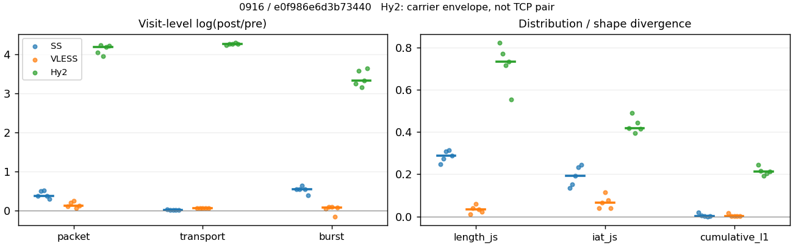
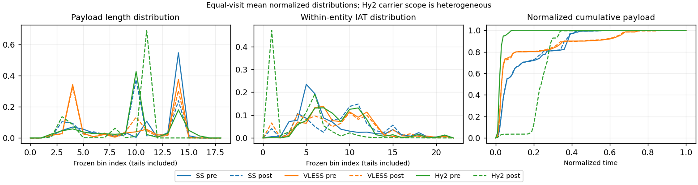

# 0916 · 条目 008 · wikipedia.org

目标：https://en.wikipedia.org/wiki/Transport_Layer_Security

活动标签：wikipedia.org::article_view。选定访问 15 次。

[返回总索引](../../README.md) · [统计口径](../../methods.md)

## 覆盖与资格（每次访问均保留）

| 部署 | 重复 | 主请求路由 | 活动状态 | 代理比较 | DIRECT pre | 请求 proxy/direct/unresolved | 错误 |
| --- | --- | --- | --- | --- | --- | --- | --- |
| Hy2 | 1 | proxy | passed | 1 | 0 | 34/0/0 | [] |
| Hy2 | 2 | proxy | passed | 1 | 0 | 34/0/0 | [] |
| Hy2 | 3 | proxy | passed | 1 | 0 | 34/0/0 | [] |
| Hy2 | 4 | proxy | passed | 1 | 0 | 34/0/0 | [] |
| Hy2 | 5 | proxy | passed | 1 | 0 | 34/0/0 | [] |
| SS | 1 | proxy | passed | 1 | 0 | 34/0/0 | [] |
| SS | 2 | proxy | passed | 1 | 0 | 34/0/0 | [] |
| SS | 3 | proxy | passed | 1 | 0 | 34/0/0 | [] |
| SS | 4 | proxy | passed | 1 | 0 | 34/0/0 | [] |
| SS | 5 | proxy | passed | 1 | 0 | 34/0/0 | [] |
| VLESS | 1 | proxy | passed | 1 | 0 | 34/0/0 | [] |
| VLESS | 2 | proxy | passed | 1 | 0 | 34/0/0 | [] |
| VLESS | 3 | proxy | passed | 1 | 0 | 34/0/0 | [] |
| VLESS | 4 | proxy | passed | 1 | 0 | 34/0/0 | [] |
| VLESS | 5 | proxy | passed | 1 | 0 | 34/0/0 | [] |

主请求非 proxy 的统计仅解释为已索引的辅助代理连接或 DIRECT 观测，不代表目标业务经代理传输。播放确认与配对资格是两道不同的门。

图中散点为单次访问，短线为重复中位数；Hy2 是共享载体包络，不能与 TCP 配对作等范围因果对比。

形态图先逐访问归一化，再对访问等权平均；实线 pre，虚线 post。分箱序号及边界见 methods，不将分箱索引误解为长度或时间。

## 每次访问的关键观测

### SS

范围：`exclusive_page`。每格 pre → post；空值为不可观测/不适用。

| 重复 | 包数 | 载荷字节 | burst | TCP FR | IAT中位µs | length JS | IAT JS |
| --- | --- | --- | --- | --- | --- | --- | --- |
| 1 | 518 → 750 | 6.5784e+05 → 6.7466e+05 | 296 → 510 | 35 → 39 | 46.367 → 402.82 | 0.24835 | 0.13489 |
| 2 | 624 → 1027 | 6.7303e+05 → 6.8633e+05 | 440 → 756 | 46 → 54 | 37.43 → 361.41 | 0.27372 | 0.15126 |
| 3 | 570 → 959 | 6.5382e+05 → 6.6458e+05 | 376 → 716 | 43 → 49 | 37.255 → 476.4 | 0.30812 | 0.19405 |
| 4 | 596 → 870 | 6.6695e+05 → 6.8001e+05 | 387 → 667 | 39 → 45 | 25.385 → 679.45 | 0.31323 | 0.23229 |
| 5 | 603 → 817 | 6.6953e+05 → 6.8434e+05 | 409 → 601 | 38 → 41 | 20.706 → 655.5 | 0.28699 | 0.24493 |

完整标量统计：中位数 [min,max]；Δ 为重复内逐访问变换的中位数，MAD 未缩放。n 为可用变换数；DIRECT-only 的 nΔ=0 不代表 pre 不可用。

| scope | 特征 | pre | post | Δ | IQRΔ | MADΔ | nΔ |
| --- | --- | --- | --- | --- | --- | --- | --- |
| exclusive_page | active_span_sum_s_1000ms | 7.8737 [7.866, 9.5984] | 9.0543 [8.3788, 9.9581] | 0.063155 | 0.030893 | 0.026356 | 5 |
| exclusive_page | active_span_sum_s_100ms | 1.5881 [1.4788, 2.3639] | 3.2351 [2.9989, 3.7671] | 0.71149 | 0.19321 | 0.11396 | 5 |
| exclusive_page | active_span_sum_s_500ms | 5.7532 [4.6971, 9.0885] | 6.9752 [6.5642, 9.9581] | 0.18873 | 0.26106 | 0.148 | 5 |
| exclusive_page | burst_bytes_iqr | 2896 [2896, 2896] | 1468 [1428, 1939] | -0.67943 | 0.050523 | 0.027626 | 5 |
| exclusive_page | burst_bytes_mad | 31 [0, 61] | 34 [0, 40] | -0.18721 | 0.25718 | 0.23478 | 3 |
| exclusive_page | burst_bytes_max | 20480 [20272, 20896] | 8716 [7362, 15708] | -0.85429 | 0.42557 | 0.15862 | 5 |
| exclusive_page | burst_bytes_mean | 1723.4 [1529.6, 2222.4] | 1019.5 [907.84, 1322.9] | -0.5217 | 0.0061733 | 0.0032661 | 5 |
| exclusive_page | burst_bytes_median | 31 [0, 61] | 34 [0, 40] | -0.18721 | 0.25718 | 0.23478 | 3 |
| exclusive_page | burst_bytes_min | 0 [0, 0] | 0 [0, 0] | — | — | — | 0 |
| exclusive_page | burst_bytes_p95 | 7974 [5802.4, 11428] | 2930 [2896, 5712] | -0.6935 | 0.31791 | 0.26329 | 5 |
| exclusive_page | burst_bytes_q25 | 0 [0, 0] | 0 [0, 0] | — | — | — | 0 |
| exclusive_page | burst_bytes_q75 | 2896 [2896, 2896] | 1468 [1428, 1939] | -0.67943 | 0.050523 | 0.027626 | 5 |
| exclusive_page | burst_bytes_std | 3192.7 [2615.5, 4192.1] | 1421.5 [1289.2, 2026.5] | -0.72691 | 0.10169 | 0.079321 | 5 |
| exclusive_page | burst_count | 387 [296, 440] | 667 [510, 756] | 0.54405 | 0.0030987 | 0.0027846 | 5 |
| exclusive_page | burst_duration_ms_iqr | 0.025386 [0.015667, 0.066217] | 0 [0, 0.005824] | -2.4309 | — | — | 1 |
| exclusive_page | burst_duration_ms_mad | 0 [0, 0] | 0 [0, 0] | — | — | — | 0 |
| exclusive_page | burst_duration_ms_max | 14990 [3287.4, 15001] | 6243.9 [1891.1, 30253] | -0.011739 | 0.0419 | 0.029097 | 5 |
| exclusive_page | burst_duration_ms_mean | 58.42 [45.001, 108.5] | 24.547 [10.741, 119.55] | -0.6612 | 0.76032 | 0.75825 | 5 |
| exclusive_page | burst_duration_ms_median | 0 [0, 0] | 0 [0, 0] | — | — | — | 0 |
| exclusive_page | burst_duration_ms_min | 0 [0, 0] | 0 [0, 0] | — | — | — | 0 |
| exclusive_page | burst_duration_ms_p95 | 101.13 [94.335, 137.47] | 4.499 [3.0364, 8.1227] | -3.1106 | 0.33019 | 0.2103 | 5 |
| exclusive_page | burst_duration_ms_q25 | 0 [0, 0] | 0 [0, 0] | — | — | — | 0 |
| exclusive_page | burst_duration_ms_q75 | 0.025386 [0.015667, 0.066217] | 0 [0, 0.005824] | -2.4309 | — | — | 1 |
| exclusive_page | burst_duration_ms_std | 775.9 [298.47, 1091] | 318.73 [98.972, 1520.3] | -0.30382 | 0.47998 | 0.47928 | 5 |
| exclusive_page | burst_packets_iqr | 1 [1, 1] | 0 [0, 1] | 0 | — | — | 1 |
| exclusive_page | burst_packets_mad | 0 [0, 0] | 0 [0, 0] | — | — | — | 0 |
| exclusive_page | burst_packets_max | 9 [8, 9] | 8 [6, 9] | -0.11778 | 0.1699 | 0.11778 | 5 |
| exclusive_page | burst_packets_mean | 1.516 [1.4182, 1.75] | 1.3585 [1.3043, 1.4706] | -0.12384 | 0.084955 | 0.042678 | 5 |
| exclusive_page | burst_packets_median | 1 [1, 1] | 1 [1, 1] | 0 | 0 | 0 | 5 |
| exclusive_page | burst_packets_min | 1 [1, 1] | 1 [1, 1] | 0 | 0 | 0 | 5 |
| exclusive_page | burst_packets_p95 | 3.6 [3, 4.25] | 3 [3, 3] | -0.18232 | 0.28768 | 0.16599 | 5 |
| exclusive_page | burst_packets_q25 | 1 [1, 1] | 1 [1, 1] | 0 | 0 | 0 | 5 |
| exclusive_page | burst_packets_q75 | 2 [2, 2] | 1 [1, 2] | -0.69315 | 0 | 0 | 5 |
| exclusive_page | burst_packets_std | 1.081 [0.88299, 1.4629] | 0.80824 [0.789, 0.95081] | -0.26193 | 0.19377 | 0.16526 | 5 |
| exclusive_page | connection_span_concurrency_max | 3 [3, 4] | 3 [3, 4] | 0 | 0 | 0 | 5 |
| exclusive_page | cumulative_l1 | — | — | 0.0014666 | 0.0039236 | 0.0012512 | 5 |
| exclusive_page | cumulative_max | — | — | 0.060594 | 0.069994 | 0.047891 | 5 |
| exclusive_page | direction_entropy | 0.69583 [0.68285, 0.73207] | 0.55781 [0.50326, 0.60047] | -0.13442 | 0.04601 | 0.039065 | 5 |
| exclusive_page | down_burst_count | 191 [146, 217] | 331 [253, 375] | 0.54978 | 0.0028163 | 0.0027542 | 5 |
| exclusive_page | down_ip_bytes | 6.6669e+05 [6.5331e+05, 6.7019e+05] | 6.8044e+05 [6.6989e+05, 6.9019e+05] | 0.024471 | 0.0046444 | 0.0040505 | 5 |
| exclusive_page | down_packets | 356 [333, 359] | 456 [429, 551] | 0.25331 | 0.18538 | 0.038563 | 5 |
| exclusive_page | down_transport_bytes | 6.4798e+05 [6.3528e+05, 6.5163e+05] | 6.5667e+05 [6.4231e+05, 6.6098e+05] | 0.013316 | 0.0025225 | 0.0015975 | 5 |
| exclusive_page | duration_s | 65.482 [5.9364, 67.016] | 65.481 [6.1803, 67.014] | -2.115e-05 | 2.867e-06 | 2.2571e-06 | 5 |
| exclusive_page | entity_count | 5 [4, 6] | 5 [4, 6] | 0 | 0 | 0 | 5 |
| exclusive_page | fr_runs | 39 [35, 46] | 45 [39, 54] | 0.13062 | 0.034887 | 0.022407 | 5 |
| exclusive_page | fr_runs_per_packet | 0.11337 [0.10479, 0.13105] | 0.092279 [0.089041, 0.098004] | -0.01999 | 0.016453 | 0.0042411 | 5 |
| exclusive_page | fr_switches | 34 [31, 40] | 40 [35, 48] | 0.1466 | 0.041158 | 0.025243 | 5 |
| exclusive_page | fr_switches_per_possible_transition | 0.10029 [0.093939, 0.11656] | 0.08365 [0.07947, 0.088073] | -0.017021 | 0.01453 | 0.0037268 | 5 |
| exclusive_page | full_retransmission_fraction | 0.0016584 [0, 0.0017544] | 0.010711 [0.0031283, 0.013464] | 0.0091082 | 0.004288 | 0.0026973 | 5 |
| exclusive_page | full_retransmission_packets | 1 [0, 1] | 9 [3, 11] | 2.2387 | 0.56366 | 0.15923 | 4 |
| exclusive_page | iat_count | 591 [514, 618] | 865 [746, 1021] | 0.38091 | 0.12955 | 0.075004 | 5 |
| exclusive_page | iat_js | — | — | 0.19405 | 0.081028 | 0.042785 | 5 |
| exclusive_page | iat_ks | — | — | 0.3488 | 0.1191 | 0.06003 | 5 |
| exclusive_page | iat_median_us | 37.255 [20.706, 46.367] | 476.4 [361.41, 679.45] | 2.5485 | 1.0196 | 0.38658 | 5 |
| exclusive_page | iat_us_iqr | 287.36 [101.23, 311.6] | 1396.2 [1172.5, 2028.3] | 1.8667 | 0.34657 | 0.33997 | 5 |
| exclusive_page | iat_us_mad | 30.072 [16.096, 35.956] | 468.35 [356.1, 642.46] | 2.7255 | 1.0391 | 0.33053 | 5 |
| exclusive_page | iat_us_max | 1.5001e+07 [3.2874e+06, 1.5001e+07] | 1.5328e+07 [3.2491e+06, 1.545e+07] | 0.021562 | 0.035326 | 0.0079233 | 5 |
| exclusive_page | iat_us_mean | 2.1739e+05 [33540, 3.1952e+05] | 1.325e+05 [23434, 2.183e+05] | -0.38093 | 0.14368 | 0.074993 | 5 |
| exclusive_page | iat_us_median | 37.255 [20.706, 46.367] | 476.4 [361.41, 679.45] | 2.5485 | 1.0196 | 0.38658 | 5 |
| exclusive_page | iat_us_min | 0.283 [0.135, 0.726] | 0.037 [0.036, 0.046] | -2.0003 | 0.30484 | 0.27062 | 5 |
| exclusive_page | iat_us_p95 | 1.0209e+05 [84866, 2.0628e+05] | 40284 [35279, 61496] | -0.93244 | 0.28772 | 0.18732 | 5 |
| exclusive_page | iat_us_q25 | 13.342 [11.908, 14.985] | 20.812 [14.06, 34.917] | 0.32845 | 0.30566 | 0.29266 | 5 |
| exclusive_page | iat_us_q75 | 302.35 [113.14, 326.33] | 1414.5 [1193.3, 2042.4] | 1.83 | 0.3373 | 0.33332 | 5 |
| exclusive_page | iat_us_std | 1.6802e+06 [2.3498e+05, 2.0533e+06] | 1.3377e+06 [1.8828e+05, 1.7407e+06] | -0.22159 | 0.093115 | 0.056434 | 5 |
| exclusive_page | iat_wasserstein_log1p_us | — | — | 1.2897 | 0.48239 | 0.20783 | 5 |
| exclusive_page | idle_gap_count_1000ms | 8 [3, 16] | 8 [3, 14] | 0 | 0 | 0 | 5 |
| exclusive_page | idle_gap_count_100ms | 29 [22, 34] | 29 [21, 32] | 0 | 0.078269 | 0.036368 | 5 |
| exclusive_page | idle_gap_count_500ms | 11 [4, 19] | 11 [3, 17] | -0.15415 | 0.17646 | 0.13353 | 5 |
| exclusive_page | idle_gap_sum_s_1000ms | 117.18 [9.3737, 180.96] | 117.02 [9.1031, 180.41] | -0.0097739 | 0.022645 | 0.0083501 | 5 |
| exclusive_page | idle_gap_sum_s_100ms | 124.64 [15.761, 187.25] | 123.4 [14.303, 185.6] | -0.015078 | 0.057529 | 0.006224 | 5 |
| exclusive_page | idle_gap_sum_s_500ms | 119.63 [12.543, 183.4] | 119.43 [10.717, 182.27] | -0.019792 | 0.054468 | 0.018082 | 5 |
| exclusive_page | ip_bytes | 6.9803e+05 [6.8356e+05, 7.0558e+05] | 7.3201e+05 [7.1842e+05, 7.4767e+05] | 0.047879 | 0.0058179 | 0.0030994 | 5 |
| exclusive_page | length_iqr | 2131.8 [1768.5, 2205] | 1723 [1344, 2117.5] | -0.18794 | 0.16962 | 0.12497 | 5 |
| exclusive_page | length_js | — | — | 0.28699 | 0.034407 | 0.021131 | 5 |
| exclusive_page | length_ks | — | — | 0.51061 | 0.019117 | 0.011533 | 5 |
| exclusive_page | length_mad | 0 [0, 208] | 941 [837.5, 1330] | 1.5094 | — | — | 1 |
| exclusive_page | length_max | 4096 [4096, 4344] | 5712 [2930, 9996] | 0.33256 | 0.28768 | 0.28768 | 5 |
| exclusive_page | length_mean | 1938.8 [1917.5, 1975.3] | 1462.4 [1245.6, 1540.3] | -0.282 | 0.17571 | 0.036177 | 5 |
| exclusive_page | length_median | 2896 [2896, 2896] | 1428 [1428, 1428] | -0.70706 | 0 | 0 | 5 |
| exclusive_page | length_min | 31 [9, 31] | 20 [7, 20] | -0.43825 | 0 | 0 | 5 |
| exclusive_page | length_p95 | 2896 [2896, 2896] | 2856 [2856, 2856] | -0.013908 | 0 | 0 | 5 |
| exclusive_page | length_q25 | 764.25 [691, 1127.5] | 576 [66.5, 752] | -0.34923 | 1.8595 | 0.37482 | 5 |
| exclusive_page | length_q75 | 2896 [2896, 2896] | 2299 [1448, 2856] | -0.23086 | 0.63963 | 0.21695 | 5 |
| exclusive_page | length_std | 1172 [1132.7, 1195.5] | 1005.3 [970.01, 1111.6] | -0.1534 | 0.038862 | 0.027662 | 5 |
| exclusive_page | length_wasserstein_bytes | — | — | 480.52 | 199.18 | 25.923 | 5 |
| exclusive_page | nonempty_entity_count | 5 [4, 6] | 5 [4, 6] | 0 | 0 | 0 | 5 |
| exclusive_page | nonempty_packets | 344 [331, 351] | 465 [438, 551] | 0.3014 | 0.1734 | 0.030318 | 5 |
| exclusive_page | offload_suspect_fraction | 0.34737 [0.33013, 0.39382] | 0.14828 [0.13242, 0.2] | -0.19568 | 0.0038813 | 0.0020198 | 5 |
| exclusive_page | packet_count | 596 [518, 624] | 870 [750, 1027] | 0.37825 | 0.12815 | 0.074531 | 5 |
| exclusive_page | rtt_median_ms | 0.056569 [0.04264, 0.10454] | 32.887 [26.325, 33.445] | 6.2123 | 0.27457 | 0.20505 | 5 |
| exclusive_page | rtt_sample_count | 214 [174, 258] | 151 [123, 202] | -0.27625 | 0.104 | 0.072443 | 5 |
| exclusive_page | tcp_ack_count | 591 [514, 618] | 863 [746, 1021] | 0.3786 | 0.12955 | 0.072689 | 5 |
| exclusive_page | tcp_fin_count | 10 [8, 12] | 10 [9, 12] | 0 | 0 | 0 | 5 |
| exclusive_page | tcp_packet_count | 596 [518, 624] | 870 [750, 1027] | 0.37825 | 0.12815 | 0.074531 | 5 |
| exclusive_page | tcp_rst_count | 0 [0, 0] | 0 [0, 0] | — | — | — | 0 |
| exclusive_page | tcp_syn_count | 10 [8, 12] | 10 [8, 12] | 0 | 0 | 0 | 5 |
| exclusive_page | tcp_window_raw_median | 65535 [65535, 65535] | 146 [135, 148] | -6.1067 | 0.041385 | 0.013606 | 5 |
| exclusive_page | transition_entropy | 0.41705 [0.39828, 0.4548] | 0.34639 [0.3345, 0.35881] | -0.05912 | 0.04712 | 0.00088293 | 5 |
| exclusive_page | transition_n_mm | 256 [250, 264] | 378 [362, 456] | 0.38582 | 0.22693 | 0.042873 | 5 |
| exclusive_page | transition_n_mp | 15 [14, 17] | 18 [16, 21] | 0.16252 | 0.04879 | 0.028988 | 5 |
| exclusive_page | transition_n_pm | 19 [17, 23] | 22 [19, 27] | 0.13353 | 0.035378 | 0.022306 | 5 |
| exclusive_page | transition_n_pp | 45 [38, 49] | 41 [34, 45] | -0.13353 | 0.062046 | 0.03974 | 5 |
| exclusive_page | transition_p_mm | 0.94485 [0.93633, 0.94796] | 0.9563 [0.95455, 0.95767] | 0.010062 | 0.0085293 | 0.00036913 | 5 |
| exclusive_page | transition_p_mp | 0.055147 [0.052045, 0.06367] | 0.043702 [0.042328, 0.045455] | -0.010062 | 0.0085293 | 0.00036913 | 5 |
| exclusive_page | transition_p_pm | 0.28571 [0.27869, 0.35593] | 0.34375 [0.29688, 0.41379] | 0.060168 | 0.0027363 | 0.002307 | 5 |
| exclusive_page | transition_p_pp | 0.71429 [0.64407, 0.72131] | 0.65625 [0.58621, 0.70312] | -0.060168 | 0.0027363 | 0.002307 | 5 |
| exclusive_page | transport_bytes | 6.6695e+05 [6.5382e+05, 6.7303e+05] | 6.8001e+05 [6.6458e+05, 6.8633e+05] | 0.019566 | 0.0024761 | 0.0023087 | 5 |
| exclusive_page | up_burst_count | 196 [150, 223] | 336 [257, 381] | 0.53844 | 0.0033689 | 0.0028132 | 5 |
| exclusive_page | up_byte_fraction | 0.028367 [0.024988, 0.031794] | 0.034329 [0.032677, 0.038177] | 0.0058918 | 0.0025469 | 0.00075311 | 5 |
| exclusive_page | up_ip_bytes | 31342 [26090, 35394] | 51562 [43358, 57478] | 0.49794 | 0.022322 | 0.012325 | 5 |
| exclusive_page | up_packets | 237 [185, 268] | 414 [321, 476] | 0.55781 | 0.023346 | 0.016625 | 5 |
| exclusive_page | up_transport_bytes | 18966 [16438, 21398] | 23344 [22046, 26126] | 0.20769 | 0.11074 | 0.038211 | 5 |
| exclusive_page | zero_iat_count | 0 [0, 0] | 0 [0, 0] | — | — | — | 0 |
| exclusive_page | zero_iat_fraction | 0 [0, 0] | 0 [0, 0] | 0 | 0 | 0 | 5 |

### VLESS

范围：`exclusive_page`。每格 pre → post；空值为不可观测/不适用。

| 重复 | 包数 | 载荷字节 | burst | TCP FR | IAT中位µs | length JS | IAT JS |
| --- | --- | --- | --- | --- | --- | --- | --- |
| 1 | 795 → 884 | 6.4515e+05 → 6.8512e+05 | 539 → 565 | 35 → 46 | 377.22 → 485.9 | 0.011207 | 0.037988 |
| 2 | 779 → 949 | 6.6002e+05 → 7.0054e+05 | 517 → 565 | 36 → 46 | 450.44 → 345.92 | 0.039373 | 0.064146 |
| 3 | 811 → 1050 | 6.4558e+05 → 6.858e+05 | 621 → 683 | 49 → 60 | 177.83 → 91.487 | 0.058865 | 0.11461 |
| 4 | 931 → 996 | 6.6183e+05 → 7.0173e+05 | 781 → 674 | 50 → 62 | 118.07 → 131.75 | 0.034836 | 0.07818 |
| 5 | 778 → 880 | 6.3511e+05 → 6.7407e+05 | 527 → 569 | 46 → 58 | 213.05 → 276.39 | 0.023115 | 0.039842 |

完整标量统计：中位数 [min,max]；Δ 为重复内逐访问变换的中位数，MAD 未缩放。n 为可用变换数；DIRECT-only 的 nΔ=0 不代表 pre 不可用。

| scope | 特征 | pre | post | Δ | IQRΔ | MADΔ | nΔ |
| --- | --- | --- | --- | --- | --- | --- | --- |
| exclusive_page | active_span_sum_s_1000ms | 8.6966 [8.2263, 8.7379] | 8.9303 [7.7665, 8.954] | 0.021771 | 0.051012 | 0.0074011 | 5 |
| exclusive_page | active_span_sum_s_100ms | 1.3834 [1.1537, 1.653] | 3.1216 [3.0101, 3.4462] | 0.81382 | 0.12087 | 0.079154 | 5 |
| exclusive_page | active_span_sum_s_500ms | 3.7562 [3.6373, 4.3131] | 7.402 [7.0971, 7.7665] | 0.64494 | 0.029972 | 0.020316 | 5 |
| exclusive_page | burst_bytes_iqr | 2896 [1489, 2896] | 2824 [1935, 2896] | 0 | 0.025176 | 0.025176 | 5 |
| exclusive_page | burst_bytes_mad | 24 [24, 31] | 72 [31, 108] | 0.96046 | 0.69315 | 0.54362 | 5 |
| exclusive_page | burst_bytes_max | 8688 [5792, 19776] | 5965 [5512, 8688] | -0.36122 | 0.45502 | 0.36122 | 5 |
| exclusive_page | burst_bytes_mean | 1196.9 [847.41, 1276.6] | 1184.7 [1004.1, 1239.9] | -0.017148 | 0.042206 | 0.017578 | 5 |
| exclusive_page | burst_bytes_median | 24 [24, 31] | 72 [31, 108] | 0.96046 | 0.69315 | 0.54362 | 5 |
| exclusive_page | burst_bytes_min | 0 [0, 0] | 0 [0, 0] | — | — | — | 0 |
| exclusive_page | burst_bytes_p95 | 3707.2 [2896, 4308] | 2896 [2896, 2896] | -0.24695 | 0.36419 | 0.1502 | 5 |
| exclusive_page | burst_bytes_q25 | 0 [0, 0] | 0 [0, 0] | — | — | — | 0 |
| exclusive_page | burst_bytes_q75 | 2896 [1489, 2896] | 2824 [1935, 2896] | 0 | 0.025176 | 0.025176 | 5 |
| exclusive_page | burst_bytes_std | 1573.7 [1289.3, 1789.5] | 1331.9 [1252.8, 1397.1] | -0.18173 | 0.13042 | 0.065772 | 5 |
| exclusive_page | burst_count | 539 [517, 781] | 569 [565, 683] | 0.07668 | 0.041673 | 0.018484 | 5 |
| exclusive_page | burst_duration_ms_iqr | 0.62713 [0, 1.7581] | 1.1239 [0.0063925, 2.6677] | 0.49853 | 0.89359 | 0.29003 | 4 |
| exclusive_page | burst_duration_ms_mad | 0 [0, 0] | 0 [0, 0] | — | — | — | 0 |
| exclusive_page | burst_duration_ms_max | 2176.9 [1659.8, 15000] | 14987 [915.47, 15022] | 1.8785 | 1.9325 | 0.32076 | 5 |
| exclusive_page | burst_duration_ms_mean | 18.28 [14.664, 69.825] | 33.867 [10.203, 41.522] | 0.51616 | 1.0733 | 0.32088 | 5 |
| exclusive_page | burst_duration_ms_median | 0 [0, 0] | 0 [0, 0] | — | — | — | 0 |
| exclusive_page | burst_duration_ms_min | 0 [0, 0] | 0 [0, 0] | — | — | — | 0 |
| exclusive_page | burst_duration_ms_p95 | 9.1359 [7.1807, 10.47] | 10.146 [9.7234, 12.977] | 0.1121 | 0.15226 | 0.10249 | 5 |
| exclusive_page | burst_duration_ms_q25 | 0 [0, 0] | 0 [0, 0] | — | — | — | 0 |
| exclusive_page | burst_duration_ms_q75 | 0.62713 [0, 1.7581] | 1.1239 [0.0063925, 2.6677] | 0.49853 | 0.89359 | 0.29003 | 4 |
| exclusive_page | burst_duration_ms_std | 125.91 [117.76, 923.9] | 582.31 [54.089, 640.65] | 1.4297 | 1.902 | 0.16863 | 5 |
| exclusive_page | burst_packets_iqr | 1 [0, 1] | 1 [1, 1] | 0 | 0 | 0 | 4 |
| exclusive_page | burst_packets_mad | 0 [0, 0] | 0 [0, 0] | — | — | — | 0 |
| exclusive_page | burst_packets_max | 7 [4, 11] | 7 [6, 7] | 0 | 0.96508 | 0.55962 | 5 |
| exclusive_page | burst_packets_mean | 1.475 [1.1921, 1.5068] | 1.5466 [1.4777, 1.6796] | 0.10861 | 0.10411 | 0.054499 | 5 |
| exclusive_page | burst_packets_median | 1 [1, 1] | 1 [1, 1] | 0 | 0 | 0 | 5 |
| exclusive_page | burst_packets_min | 1 [1, 1] | 1 [1, 1] | 0 | 0 | 0 | 5 |
| exclusive_page | burst_packets_p95 | 2 [2, 2] | 3 [3, 3] | 0.40547 | 0 | 0 | 5 |
| exclusive_page | burst_packets_q25 | 1 [1, 1] | 1 [1, 1] | 0 | 0 | 0 | 5 |
| exclusive_page | burst_packets_q75 | 2 [1, 2] | 2 [2, 2] | 0 | 0 | 0 | 5 |
| exclusive_page | burst_packets_std | 0.58685 [0.56228, 0.68246] | 0.89024 [0.82045, 0.96763] | 0.44946 | 0.005846 | 0.0033378 | 5 |
| exclusive_page | connection_span_concurrency_max | 3 [3, 4] | 3 [3, 4] | 0 | 0 | 0 | 5 |
| exclusive_page | cumulative_l1 | — | — | 0.0014173 | 0.0002636 | 0.00025283 | 5 |
| exclusive_page | cumulative_max | — | — | 0.027384 | 0.014218 | 0.0066546 | 5 |
| exclusive_page | direction_entropy | 0.51857 [0.48877, 0.57314] | 0.469 [0.44648, 0.51164] | -0.0615 | 0.037112 | 0.016104 | 5 |
| exclusive_page | down_burst_count | 267 [256, 388] | 282 [280, 339] | 0.077387 | 0.042071 | 0.018514 | 5 |
| exclusive_page | down_ip_bytes | 6.5301e+05 [6.4265e+05, 6.6817e+05] | 6.89e+05 [6.7495e+05, 7.0229e+05] | 0.049814 | 0.002677 | 0.00077421 | 5 |
| exclusive_page | down_packets | 483 [462, 499] | 561 [520, 584] | 0.12719 | 0.08733 | 0.047143 | 5 |
| exclusive_page | down_transport_bytes | 6.2723e+05 [6.1765e+05, 6.4244e+05] | 6.5858e+05 [6.4787e+05, 6.7309e+05] | 0.04777 | 0.0012749 | 0.00086717 | 5 |
| exclusive_page | duration_s | 65.149 [4.7412, 65.943] | 65.107 [4.646, 65.925] | -0.0005098 | 0.00037057 | 0.0002341 | 5 |
| exclusive_page | entity_count | 5 [5, 5] | 5 [5, 5] | 0 | 0 | 0 | 5 |
| exclusive_page | fr_runs | 46 [35, 50] | 58 [46, 62] | 0.2318 | 0.030011 | 0.01669 | 5 |
| exclusive_page | fr_runs_per_packet | 0.098501 [0.071575, 0.10913] | 0.1049 [0.08229, 0.11373] | 0.0092351 | 0.0090446 | 0.0059893 | 5 |
| exclusive_page | fr_switches | 41 [30, 45] | 53 [41, 57] | 0.25672 | 0.043196 | 0.022865 | 5 |
| exclusive_page | fr_switches_per_possible_transition | 0.088745 [0.061983, 0.099099] | 0.097002 [0.074007, 0.10495] | 0.01046 | 0.008438 | 0.0057464 | 5 |
| exclusive_page | full_retransmission_fraction | 0 [0, 0] | 0 [0, 0.0011364] | 0 | 0.00095238 | 0 | 5 |
| exclusive_page | full_retransmission_packets | 0 [0, 0] | 0 [0, 1] | — | — | — | 0 |
| exclusive_page | iat_count | 790 [773, 926] | 944 [875, 1045] | 0.12394 | 0.091802 | 0.056105 | 5 |
| exclusive_page | iat_js | — | — | 0.064146 | 0.038338 | 0.024304 | 5 |
| exclusive_page | iat_ks | — | — | 0.14638 | 0.090606 | 0.07934 | 5 |
| exclusive_page | iat_median_us | 213.05 [118.07, 450.44] | 276.39 [91.487, 485.9] | 0.10963 | 0.51716 | 0.15064 | 5 |
| exclusive_page | iat_us_iqr | 1202.2 [1058.2, 2615.2] | 1429 [1146.9, 2662.9] | 0.11767 | 0.2065 | 0.1145 | 5 |
| exclusive_page | iat_us_mad | 206.06 [109.62, 438.64] | 271.06 [91.38, 474.92] | 0.18312 | 0.50108 | 0.091026 | 5 |
| exclusive_page | iat_us_max | 1.5001e+07 [1.9462e+06, 1.5001e+07] | 1.5313e+07 [1.9741e+06, 1.5345e+07] | 0.020556 | 0.0015012 | 0.00096811 | 5 |
| exclusive_page | iat_us_mean | 1.3713e+05 [12877, 1.6303e+05] | 1.2057e+05 [11361, 1.4391e+05] | -0.12519 | 0.075699 | 0.05695 | 5 |
| exclusive_page | iat_us_median | 213.05 [118.07, 450.44] | 276.39 [91.487, 485.9] | 0.10963 | 0.51716 | 0.15064 | 5 |
| exclusive_page | iat_us_min | 1.274 [0.686, 2.772] | 0.036 [0.031, 0.036] | -3.5664 | 1.1451 | 0.59087 | 5 |
| exclusive_page | iat_us_p95 | 10641 [9956.6, 11366] | 43892 [41976, 48161] | 1.4737 | 0.066266 | 0.031562 | 5 |
| exclusive_page | iat_us_q25 | 45.18 [37.888, 45.684] | 17.744 [7.952, 43.096] | -0.94571 | 0.2965 | 0.24183 | 5 |
| exclusive_page | iat_us_q75 | 1242.3 [1096.1, 2660.8] | 1451.5 [1154.8, 2706] | 0.11482 | 0.19421 | 0.11492 | 5 |
| exclusive_page | iat_us_std | 1.326e+06 [97947, 1.486e+06] | 1.2676e+06 [79552, 1.3943e+06] | -0.093559 | 0.043586 | 0.029868 | 5 |
| exclusive_page | iat_wasserstein_log1p_us | — | — | 0.60519 | 0.21412 | 0.18079 | 5 |
| exclusive_page | idle_gap_count_1000ms | 8 [1, 11] | 8 [1, 10] | 0 | 0.09531 | 0 | 5 |
| exclusive_page | idle_gap_count_100ms | 26 [17, 32] | 33 [21, 36] | 0.21131 | 0.088879 | 0.027102 | 5 |
| exclusive_page | idle_gap_count_500ms | 15 [7, 18] | 10 [2, 12] | -0.49248 | 0.21357 | 0.087011 | 5 |
| exclusive_page | idle_gap_sum_s_1000ms | 117.33 [1.9462, 118.27] | 116.97 [1.9741, 118] | -0.002273 | 0.0090402 | 0.0007849 | 5 |
| exclusive_page | idle_gap_sum_s_100ms | 124.7 [8.5195, 125.6] | 122.82 [6.5405, 123.81] | -0.015896 | 0.010481 | 0.0015507 | 5 |
| exclusive_page | idle_gap_sum_s_500ms | 122.36 [6.4487, 123.06] | 118.51 [2.8896, 119.53] | -0.032193 | 0.024428 | 0.0030789 | 5 |
| exclusive_page | ip_bytes | 6.8773e+05 [6.7557e+05, 7.102e+05] | 7.416e+05 [7.2024e+05, 7.5412e+05] | 0.064026 | 0.0056501 | 0.0040227 | 5 |
| exclusive_page | length_iqr | 2752 [2752, 2752] | 2752 [1412, 2752] | 0 | 0 | 0 | 5 |
| exclusive_page | length_js | — | — | 0.034836 | 0.016257 | 0.011721 | 5 |
| exclusive_page | length_ks | — | — | 0.097121 | 0.049516 | 0.040115 | 5 |
| exclusive_page | length_mad | 1340 [1091, 1340] | 1327 [1136, 1340] | 0 | 0.0097489 | 0.0097489 | 5 |
| exclusive_page | length_max | 5792 [2896, 8688] | 2896 [2896, 2896] | -0.69315 | 0.75193 | 0.40547 | 5 |
| exclusive_page | length_mean | 1361.8 [1319.3, 1437.8] | 1269 [1198.9, 1321.7] | -0.070605 | 0.078922 | 0.042055 | 5 |
| exclusive_page | length_median | 1412 [1163, 1412] | 1399 [1208, 1412] | 0 | 0.0092494 | 0.0092494 | 5 |
| exclusive_page | length_min | 24 [21, 24] | 24 [9, 24] | 0 | 0 | 0 | 5 |
| exclusive_page | length_p95 | 2896 [2824, 2896] | 2824 [2824, 2852.8] | -0.025176 | 0.010147 | 0 | 5 |
| exclusive_page | length_q25 | 72 [72, 72] | 72 [72, 72] | 0 | 0 | 0 | 5 |
| exclusive_page | length_q75 | 2824 [2824, 2824] | 2824 [1484, 2824] | 0 | 0 | 0 | 5 |
| exclusive_page | length_std | 1252 [1222, 1356.8] | 1161.6 [1039.8, 1220.2] | -0.1229 | 0.11212 | 0.038608 | 5 |
| exclusive_page | length_wasserstein_bytes | — | — | 154.14 | 113.17 | 75.725 | 5 |
| exclusive_page | nonempty_entity_count | 5 [5, 5] | 5 [5, 5] | 0 | 0 | 0 | 5 |
| exclusive_page | nonempty_packets | 473 [449, 489] | 553 [510, 572] | 0.12915 | 0.078973 | 0.041068 | 5 |
| exclusive_page | offload_suspect_fraction | 0.25157 [0.21267, 0.25802] | 0.18862 [0.14571, 0.22398] | -0.038441 | 0.032432 | 0.01085 | 5 |
| exclusive_page | packet_count | 795 [778, 931] | 949 [880, 1050] | 0.1232 | 0.091283 | 0.055707 | 5 |
| exclusive_page | rtt_median_ms | 0.27228 [0.053778, 1.0115] | 1.1897 [0.10242, 2.813] | 1.0228 | 0.778 | 0.39946 | 5 |
| exclusive_page | rtt_sample_count | 287 [275, 408] | 348 [341, 405] | 0.18291 | 0.035429 | 0.024921 | 5 |
| exclusive_page | tcp_ack_count | 782 [764, 916] | 944 [875, 1045] | 0.13174 | 0.094628 | 0.054049 | 5 |
| exclusive_page | tcp_fin_count | 10 [10, 10] | 10 [10, 10] | 0 | 0 | 0 | 5 |
| exclusive_page | tcp_packet_count | 795 [778, 931] | 949 [880, 1050] | 0.1232 | 0.091283 | 0.055707 | 5 |
| exclusive_page | tcp_rst_count | 8 [6, 10] | 0 [0, 1] | -2.3026 | — | — | 1 |
| exclusive_page | tcp_syn_count | 10 [10, 10] | 10 [10, 10] | 0 | 0 | 0 | 5 |
| exclusive_page | tcp_window_raw_median | 65535 [65471, 65535] | 163 [156, 165] | -5.9956 | 0.012195 | 0.011218 | 5 |
| exclusive_page | transition_entropy | 0.34758 [0.27077, 0.385] | 0.3609 [0.29499, 0.38181] | 0.010038 | 0.01057 | 0.010296 | 5 |
| exclusive_page | transition_n_mm | 395 [365, 420] | 459 [430, 484] | 0.15016 | 0.10064 | 0.060189 | 5 |
| exclusive_page | transition_n_mp | 19 [13, 20] | 24 [18, 26] | 0.26236 | 0.091808 | 0.039221 | 5 |
| exclusive_page | transition_n_pm | 22 [17, 25] | 29 [23, 31] | 0.24512 | 0.05311 | 0.030011 | 5 |
| exclusive_page | transition_n_pp | 35 [28, 41] | 29 [22, 32] | -0.24116 | 0.084557 | 0.0066741 | 5 |
| exclusive_page | transition_p_mm | 0.95388 [0.94805, 0.96998] | 0.95059 [0.94639, 0.96414] | -0.0054155 | 0.0023674 | 0.0013315 | 5 |
| exclusive_page | transition_p_mp | 0.046117 [0.030023, 0.051948] | 0.049407 [0.035857, 0.053608] | 0.0054155 | 0.0023674 | 0.0013315 | 5 |
| exclusive_page | transition_p_pm | 0.37879 [0.32727, 0.44] | 0.4918 [0.44231, 0.56863] | 0.11328 | 0.0060606 | 0.0043013 | 5 |
| exclusive_page | transition_p_pp | 0.62121 [0.56, 0.67273] | 0.5082 [0.43137, 0.55769] | -0.11328 | 0.0060606 | 0.0043013 | 5 |
| exclusive_page | transport_bytes | 6.4558e+05 [6.3511e+05, 6.6183e+05] | 6.858e+05 [6.7407e+05, 7.0173e+05] | 0.059582 | 0.00058415 | 0.00053377 | 5 |
| exclusive_page | up_burst_count | 272 [261, 393] | 287 [285, 344] | 0.075986 | 0.041282 | 0.018453 | 5 |
| exclusive_page | up_byte_fraction | 0.02842 [0.027488, 0.029301] | 0.039679 [0.03886, 0.040813] | 0.011372 | 0.0002528 | 0.00014115 | 5 |
| exclusive_page | up_ip_bytes | 34293 [32922, 42036] | 48598 [45173, 52596] | 0.31895 | 0.048672 | 0.029696 | 5 |
| exclusive_page | up_packets | 298 [296, 437] | 378 [349, 466] | 0.18901 | 0.079822 | 0.055524 | 5 |
| exclusive_page | up_transport_bytes | 18347 [17458, 19392] | 27212 [26194, 28640] | 0.39419 | 0.010493 | 0.0042482 | 5 |
| exclusive_page | zero_iat_count | 0 [0, 0] | 0 [0, 0] | — | — | — | 0 |
| exclusive_page | zero_iat_fraction | 0 [0, 0] | 0 [0, 0] | 0 | 0 | 0 | 5 |

### Hy2

范围：`carrier_context_envelope`。每格 pre → post；空值为不可观测/不适用。

| 重复 | 包数 | 载荷字节 | burst | TCP FR | IAT中位µs | length JS | IAT JS |
| --- | --- | --- | --- | --- | --- | --- | --- |
| 1 | 736 → 42049 | 6.7145e+05 → 4.6114e+07 | 544 → 13892 | — | 213.4 → 3.9485 | 0.82282 | 0.41739 |
| 2 | 621 → 42857 | 6.516e+05 → 4.6327e+07 | 413 → 14765 | — | 179.33 → 3.3715 | 0.77161 | 0.49028 |
| 3 | 827 → 43013 | 6.5429e+05 → 4.6136e+07 | 648 → 15193 | — | 148.52 → 5.4695 | 0.71676 | 0.39485 |
| 4 | 645 → 42329 | 6.349e+05 → 4.6262e+07 | 495 → 13862 | — | 167.4 → 2.893 | 0.73342 | 0.44465 |
| 5 | 652 → 43931 | 6.5193e+05 → 4.6607e+07 | 427 → 16287 | — | 162.79 → 5.1715 | 0.55423 | 0.41601 |

完整标量统计：中位数 [min,max]；Δ 为重复内逐访问变换的中位数，MAD 未缩放。n 为可用变换数；DIRECT-only 的 nΔ=0 不代表 pre 不可用。

| scope | 特征 | pre | post | Δ | IQRΔ | MADΔ | nΔ |
| --- | --- | --- | --- | --- | --- | --- | --- |
| carrier_context_envelope | active_span_sum_s_1000ms | 4.3313 [3.9524, 7.3983] | 20.794 [16.997, 24.196] | 1.4587 | 0.13193 | 0.080851 | 5 |
| carrier_context_envelope | active_span_sum_s_100ms | 1.0252 [0.76017, 1.3614] | 6.8134 [6.6558, 8.7091] | 1.8772 | 0.30021 | 0.02838 | 5 |
| carrier_context_envelope | active_span_sum_s_500ms | 4.0544 [3.6471, 6.0259] | 16.238 [14.256, 22.509] | 1.3178 | 0.10463 | 0.069698 | 5 |
| carrier_context_envelope | burst_bytes_iqr | 1415 [1404, 2832] | 4276 [2887, 5726] | 1.1137 | 0.88843 | 0.28419 | 5 |
| carrier_context_envelope | burst_bytes_mad | 31 [0, 51] | 343 [261, 367] | 2.3023 | 0.31522 | 0.14248 | 4 |
| carrier_context_envelope | burst_bytes_max | 16384 [11424, 23149] | 1.9232e+05 [1.5722e+05, 2.5016e+05] | 2.4629 | 0.53554 | 0.35332 | 5 |
| carrier_context_envelope | burst_bytes_mean | 1282.6 [1009.7, 1577.7] | 3137.6 [2861.6, 3337.3] | 0.95625 | 0.30183 | 0.14485 | 5 |
| carrier_context_envelope | burst_bytes_median | 31 [0, 51] | 376 [294, 400] | 2.4041 | 0.29702 | 0.12906 | 4 |
| carrier_context_envelope | burst_bytes_min | 0 [0, 0] | 22 [22, 22] | — | — | — | 0 |
| carrier_context_envelope | burst_bytes_p95 | 5664 [2855.3, 7020] | 10932 [10932, 12373] | 0.65756 | 0.13069 | 0.12453 | 5 |
| carrier_context_envelope | burst_bytes_q25 | 0 [0, 0] | 73 [38, 96] | — | — | — | 0 |
| carrier_context_envelope | burst_bytes_q75 | 1415 [1404, 2832] | 4323 [2960, 5764] | 1.1246 | 0.88019 | 0.27988 | 5 |
| carrier_context_envelope | burst_bytes_std | 2390.7 [1557.4, 2558.1] | 5749.1 [5000.4, 6685.6] | 0.9607 | 0.22824 | 0.18218 | 5 |
| carrier_context_envelope | burst_count | 495 [413, 648] | 14765 [13862, 16287] | 3.3323 | 0.33645 | 0.17765 | 5 |
| carrier_context_envelope | burst_duration_ms_iqr | 0 [0, 0.82452] | 0.024919 [0.022885, 0.027393] | -3.4528 | 0.096924 | 0.096924 | 2 |
| carrier_context_envelope | burst_duration_ms_mad | 0 [0, 0] | 4.5e-05 [4.2e-05, 6.55e-05] | — | — | — | 0 |
| carrier_context_envelope | burst_duration_ms_max | 1662.8 [1009.1, 14958] | 10002 [9975.5, 10313] | 1.7942 | 0.43638 | 0.35984 | 5 |
| carrier_context_envelope | burst_duration_ms_mean | 15.32 [9.7743, 57.687] | 1.4019 [1.2453, 2.5418] | -2.3433 | 0.44512 | 0.26591 | 5 |
| carrier_context_envelope | burst_duration_ms_median | 0 [0, 0] | 4.5e-05 [4.2e-05, 6.55e-05] | — | — | — | 0 |
| carrier_context_envelope | burst_duration_ms_min | 0 [0, 0] | 0 [0, 0] | — | — | — | 0 |
| carrier_context_envelope | burst_duration_ms_p95 | 4.6273 [4.3516, 16.404] | 0.10831 [0.085712, 0.19373] | -3.9273 | 0.6249 | 0.45228 | 5 |
| carrier_context_envelope | burst_duration_ms_q25 | 0 [0, 0] | 0 [0, 0] | — | — | — | 0 |
| carrier_context_envelope | burst_duration_ms_q75 | 0 [0, 0.82452] | 0.024919 [0.022885, 0.027393] | -3.4528 | 0.096924 | 0.096924 | 2 |
| carrier_context_envelope | burst_duration_ms_std | 107.16 [66.083, 743.61] | 89.642 [86.319, 141.88] | -0.15406 | 0.51555 | 0.36839 | 5 |
| carrier_context_envelope | burst_packets_iqr | 0 [0, 1] | 3 [2, 3] | 0.89588 | 0.20273 | 0.20273 | 2 |
| carrier_context_envelope | burst_packets_mad | 0 [0, 0] | 1 [1, 1] | — | — | — | 0 |
| carrier_context_envelope | burst_packets_max | 7 [6, 13] | 138 [119, 193] | 3.1167 | 0.39087 | 0.35425 | 5 |
| carrier_context_envelope | burst_packets_mean | 1.3529 [1.2762, 1.5269] | 2.9026 [2.6973, 3.0536] | 0.79675 | 0.14752 | 0.054875 | 5 |
| carrier_context_envelope | burst_packets_median | 1 [1, 1] | 2 [2, 2] | 0.69315 | 0 | 0 | 5 |
| carrier_context_envelope | burst_packets_min | 1 [1, 1] | 1 [1, 1] | 0 | 0 | 0 | 5 |
| carrier_context_envelope | burst_packets_p95 | 3 [2, 3] | 8 [8, 9] | 1.0986 | 0.40547 | 0.11778 | 5 |
| carrier_context_envelope | burst_packets_q25 | 1 [1, 1] | 1 [1, 1] | 0 | 0 | 0 | 5 |
| carrier_context_envelope | burst_packets_q75 | 1 [1, 2] | 4 [3, 4] | 1.3863 | 0.69315 | 0 | 5 |
| carrier_context_envelope | burst_packets_std | 0.68217 [0.6514, 0.93957] | 3.9605 [3.2843, 4.5904] | 1.7588 | 0.35583 | 0.18193 | 5 |
| carrier_context_envelope | connection_span_concurrency_max | 3 [2, 3] | 1 [1, 1] | -1.0986 | 0 | 0 | 5 |
| carrier_context_envelope | cumulative_l1 | — | — | 0.21297 | 0.012234 | 0.0079088 | 5 |
| carrier_context_envelope | cumulative_max | — | — | 0.96199 | 0.0047359 | 0.0019265 | 5 |
| carrier_context_envelope | direction_entropy | 0.64313 [0.61384, 0.65527] | 0.76715 [0.74247, 0.78888] | 0.12921 | 0.021494 | 0.017321 | 5 |
| carrier_context_envelope | direction_run_analog_runs | 46 [39, 56] | 14765 [13862, 16287] | 5.7083 | 0.19921 | 0.13055 | 5 |
| carrier_context_envelope | direction_run_analog_runs_per_packet | 0.11947 [0.10026, 0.13861] | 0.34452 [0.32748, 0.37074] | 0.22735 | 0.040378 | 0.03398 | 5 |
| carrier_context_envelope | direction_run_analog_switches | 41 [34, 50] | 14764 [13861, 16286] | 5.8233 | 0.24586 | 0.1391 | 5 |
| carrier_context_envelope | direction_run_analog_switches_per_possible_transition | 0.11161 [0.088542, 0.12563] | 0.3445 [0.32747, 0.37073] | 0.23953 | 0.035432 | 0.033365 | 5 |
| carrier_context_envelope | down_burst_count | 245 [204, 322] | 7382 [6931, 8143] | 3.3425 | 0.33747 | 0.18168 | 5 |
| carrier_context_envelope | down_ip_bytes | 6.5432e+05 [6.3611e+05, 6.7148e+05] | 4.6517e+07 [4.6476e+07, 4.676e+07] | 4.2658 | 0.01592 | 0.012517 | 5 |
| carrier_context_envelope | down_packets | 400 [359, 462] | 33263 [33197, 33549] | 4.4293 | 0.10575 | 0.055977 | 5 |
| carrier_context_envelope | down_transport_bytes | 6.3348e+05 [6.174e+05, 6.498e+05] | 4.5584e+07 [4.5545e+07, 4.5821e+07] | 4.2759 | 0.011156 | 0.0058364 | 5 |
| carrier_context_envelope | duration_s | 62.535 [62.274, 65.267] | 62.52 [62.259, 65.236] | -0.00023794 | 3.8326e-05 | 3.223e-05 | 5 |
| carrier_context_envelope | entity_count | 5 [4, 6] | 1 [1, 1] | -1.6094 | 0 | 0 | 5 |
| carrier_context_envelope | full_retransmission_fraction | 0 [0, 0.0040761] | — | — | — | — | 0 |
| carrier_context_envelope | full_retransmission_packets | 0 [0, 3] | — | — | — | — | 0 |
| carrier_context_envelope | iat_count | 647 [616, 823] | 42856 [42048, 43930] | 4.1917 | 0.16448 | 0.050618 | 5 |
| carrier_context_envelope | iat_js | — | — | 0.41739 | 0.028647 | 0.022545 | 5 |
| carrier_context_envelope | iat_ks | — | — | 0.59926 | 0.048395 | 0.022183 | 5 |
| carrier_context_envelope | iat_median_us | 167.4 [148.52, 213.4] | 3.9485 [2.893, 5.4695] | -3.9739 | 0.54056 | 0.084227 | 5 |
| carrier_context_envelope | iat_us_iqr | 1106.8 [925.23, 1413.9] | 25.56 [23.068, 30.17] | -3.7143 | 0.20988 | 0.1253 | 5 |
| carrier_context_envelope | iat_us_mad | 159.19 [138.58, 202.87] | 3.9135 [2.857, 5.4325] | -3.9404 | 0.55552 | 0.07995 | 5 |
| carrier_context_envelope | iat_us_max | 1.5001e+07 [1.5001e+07, 1.5001e+07] | 1.0001e+07 [9.9755e+06, 1.0001e+07] | -0.40547 | 1.4213e-05 | 8.9529e-06 | 5 |
| carrier_context_envelope | iat_us_mean | 1.9122e+05 [1.5091e+05, 2.8209e+05] | 1486.9 [1421.7, 1516.7] | -4.855 | 0.14128 | 0.10658 | 5 |
| carrier_context_envelope | iat_us_median | 167.4 [148.52, 213.4] | 3.9485 [2.893, 5.4695] | -3.9739 | 0.54056 | 0.084227 | 5 |
| carrier_context_envelope | iat_us_min | 0.484 [0.154, 3.117] | 0.001 [0, 0.002] | -6.6425 | 1.1573 | 0.70899 | 3 |
| carrier_context_envelope | iat_us_p95 | 25943 [15459, 41648] | 215.56 [109.76, 630.21] | -4.6534 | 1.3916 | 0.78115 | 5 |
| carrier_context_envelope | iat_us_q25 | 42.173 [39.959, 50.806] | 0.045 [0.044, 0.047] | -6.8114 | 0.15738 | 0.060617 | 5 |
| carrier_context_envelope | iat_us_q75 | 1154.1 [965.19, 1454.1] | 25.604 [23.113, 30.215] | -3.7537 | 0.20885 | 0.12407 | 5 |
| carrier_context_envelope | iat_us_std | 1.5988e+06 [1.4234e+06, 1.9478e+06] | 87894 [82690, 90820] | -2.8737 | 0.067031 | 0.036266 | 5 |
| carrier_context_envelope | iat_wasserstein_log1p_us | — | — | 3.7041 | 0.062947 | 0.053824 | 5 |
| carrier_context_envelope | idle_gap_count_1000ms | 10 [9, 15] | 7 [7, 8] | -0.35667 | 0.10536 | 0.10536 | 5 |
| carrier_context_envelope | idle_gap_count_100ms | 27 [23, 28] | 60 [52, 69] | 0.89382 | 0.12871 | 0.065032 | 5 |
| carrier_context_envelope | idle_gap_count_500ms | 11 [10, 16] | 12 [10, 14] | 0 | 0.27763 | 0.18232 | 5 |
| carrier_context_envelope | idle_gap_sum_s_1000ms | 118.43 [114.89, 178.18] | 41.727 [38.977, 46.053] | -1.0459 | 0.094657 | 0.084136 | 5 |
| carrier_context_envelope | idle_gap_sum_s_100ms | 122.84 [117.89, 181.7] | 55.82 [55.419, 56.527] | -0.77617 | 0.028635 | 0.02383 | 5 |
| carrier_context_envelope | idle_gap_sum_s_500ms | 118.43 [114.89, 178.86] | 46.022 [42.615, 48.793] | -0.93146 | 0.10251 | 0.044717 | 5 |
| carrier_context_envelope | ip_bytes | 6.8592e+05 [6.6852e+05, 7.0986e+05] | 4.7447e+07 [4.7291e+07, 4.7837e+07] | 4.2411 | 0.026983 | 0.021171 | 5 |
| carrier_context_envelope | length_iqr | 980.75 [392.5, 1298] | 596 [596, 871] | -0.39894 | 0.54664 | 0.35325 | 5 |
| carrier_context_envelope | length_js | — | — | 0.73342 | 0.054849 | 0.038191 | 5 |
| carrier_context_envelope | length_ks | — | — | 0.43301 | 0.087953 | 0.040965 | 5 |
| carrier_context_envelope | length_mad | 468 [305, 608] | 0 [0, 0] | — | — | — | 0 |
| carrier_context_envelope | length_max | 8920 [8920, 8920] | 1441 [1441, 1441] | -1.823 | 0 | 0 | 5 |
| carrier_context_envelope | length_mean | 1675.9 [1447.5, 1851] | 1081 [1060.9, 1096.7] | -0.45724 | 0.080466 | 0.041484 | 5 |
| carrier_context_envelope | length_median | 1415 [1404, 1416] | 1441 [1441, 1441] | 0.018208 | 0.0078042 | 0.00070646 | 5 |
| carrier_context_envelope | length_min | 22 [13, 26] | 22 [22, 22] | 0 | 0 | 0 | 5 |
| carrier_context_envelope | length_p95 | 4248 [2830, 7075] | 1441 [1441, 1441] | -1.0811 | 0.64947 | 0.38977 | 5 |
| carrier_context_envelope | length_q25 | 1046.5 [715, 1399] | 845 [570, 845] | -0.21387 | 0.49916 | 0.29031 | 5 |
| carrier_context_envelope | length_q75 | 1695.8 [1417, 2663.5] | 1441 [1441, 1441] | -0.16279 | 0.55633 | 0.17958 | 5 |
| carrier_context_envelope | length_std | 1508.6 [1135.8, 1917.2] | 576.82 [571.21, 590.4] | -0.96139 | 0.14899 | 0.09945 | 5 |
| carrier_context_envelope | length_wasserstein_bytes | — | — | 628.99 | 111.04 | 84.887 | 5 |
| carrier_context_envelope | nonempty_entity_count | 5 [4, 6] | 1 [1, 1] | -1.6094 | 0 | 0 | 5 |
| carrier_context_envelope | nonempty_packets | 389 [343, 452] | 42857 [42049, 43931] | 4.7268 | 0.11509 | 0.08162 | 5 |
| carrier_context_envelope | offload_suspect_fraction | 0.14268 [0.13179, 0.20859] | 0 [0, 0] | -0.14268 | 0.063124 | 0.010891 | 5 |
| carrier_context_envelope | packet_count | 652 [621, 827] | 42857 [42049, 43931] | 4.184 | 0.16497 | 0.050316 | 5 |
| carrier_context_envelope | rtt_median_ms | 0.092821 [0.070094, 0.31146] | — | — | — | — | 0 |
| carrier_context_envelope | rtt_sample_count | 276 [228, 358] | 0 [0, 0] | — | — | — | 0 |
| carrier_context_envelope | tcp_ack_count | 647 [616, 823] | — | — | — | — | 0 |
| carrier_context_envelope | tcp_fin_count | 10 [8, 12] | — | — | — | — | 0 |
| carrier_context_envelope | tcp_packet_count | 652 [621, 827] | 0 [0, 0] | — | — | — | 0 |
| carrier_context_envelope | tcp_rst_count | 0 [0, 0] | — | — | — | — | 0 |
| carrier_context_envelope | tcp_syn_count | 10 [8, 12] | — | — | — | — | 0 |
| carrier_context_envelope | tcp_window_raw_median | 65535 [65535, 65535] | — | — | — | — | 0 |
| carrier_context_envelope | transition_entropy | 0.43466 [0.37017, 0.45998] | 0.76707 [0.74245, 0.78831] | 0.3376 | 0.048419 | 0.035979 | 5 |
| carrier_context_envelope | transition_n_mm | 308 [269, 351] | 25881 [25406, 26381] | 4.4454 | 0.099649 | 0.066931 | 5 |
| carrier_context_envelope | transition_n_mp | 19 [15, 23] | 7382 [6931, 8143] | 5.8993 | 0.2737 | 0.14444 | 5 |
| carrier_context_envelope | transition_n_pm | 22 [19, 28] | 7382 [6930, 8143] | 5.7526 | 0.22274 | 0.11303 | 5 |
| carrier_context_envelope | transition_n_pp | 40 [28, 47] | 2157 [1906, 2238] | 3.9757 | 0.14844 | 0.11179 | 5 |
| carrier_context_envelope | transition_p_mm | 0.9385 [0.93333, 0.95356] | 0.77807 [0.75728, 0.79194] | -0.16545 | 0.024323 | 0.022881 | 5 |
| carrier_context_envelope | transition_p_mp | 0.061497 [0.04644, 0.066667] | 0.22193 [0.20806, 0.24272] | 0.16545 | 0.024323 | 0.022881 | 5 |
| carrier_context_envelope | transition_p_pm | 0.36486 [0.31148, 0.44] | 0.77884 [0.76863, 0.78466] | 0.41397 | 0.052365 | 0.04108 | 5 |
| carrier_context_envelope | transition_p_pp | 0.63514 [0.56, 0.68852] | 0.22116 [0.21534, 0.23137] | -0.41397 | 0.052365 | 0.04108 | 5 |
| carrier_context_envelope | transport_bytes | 6.5193e+05 [6.349e+05, 6.7145e+05] | 4.6262e+07 [4.6114e+07, 4.6607e+07] | 4.264 | 0.013751 | 0.0082355 | 5 |
| carrier_context_envelope | up_burst_count | 250 [209, 326] | 7383 [6931, 8144] | 3.3223 | 0.33545 | 0.17369 | 5 |
| carrier_context_envelope | up_byte_fraction | 0.028305 [0.026505, 0.032239] | 0.014651 [0.0092927, 0.016881] | -0.012906 | 0.0023903 | 0.0012714 | 5 |
| carrier_context_envelope | up_ip_bytes | 32408 [31413, 38371] | 9.3025e+05 [6.7638e+05, 1.0765e+06] | 3.3571 | 0.35967 | 0.17135 | 5 |
| carrier_context_envelope | up_packets | 286 [246, 365] | 9594 [8852, 10382] | 3.4509 | 0.34348 | 0.16534 | 5 |
| carrier_context_envelope | up_transport_bytes | 18453 [17342, 21647] | 6.7778e+05 [4.2852e+05, 7.8579e+05] | 3.6568 | 0.23717 | 0.094619 | 5 |
| carrier_context_envelope | zero_iat_count | 0 [0, 0] | 0 [0, 1] | — | — | — | 0 |
| carrier_context_envelope | zero_iat_fraction | 0 [0, 0] | 0 [0, 2.3782e-05] | 0 | 2.2763e-05 | 0 | 5 |

## 不同部署对比

以下是各部署自身重复中位数的差异，不按重复编号强行配对。跨 TCP/Hy2 的行标记异质观测范围。

| 视角 | 特征 | 部署A | 部署B | A中位 | B中位 | B−A | 比较口径 |
| --- | --- | --- | --- | --- | --- | --- | --- |
| pre | burst_count | VLESS | SS | 539 | 387 | -152 | same_scope_unpaired_visits |
| pre | burst_count | VLESS | Hy2 | 539 | 495 | -44 | heterogeneous_scope_descriptive_only |
| pre | burst_count | SS | Hy2 | 387 | 495 | 108 | heterogeneous_scope_descriptive_only |
| pre | connection_span_concurrency_max | VLESS | SS | 3 | 3 | 0 | same_scope_unpaired_visits |
| pre | connection_span_concurrency_max | VLESS | Hy2 | 3 | 3 | 0 | heterogeneous_scope_descriptive_only |
| pre | connection_span_concurrency_max | SS | Hy2 | 3 | 3 | 0 | heterogeneous_scope_descriptive_only |
| pre | direction_entropy | VLESS | SS | 0.51857 | 0.69583 | 0.17726 | same_scope_unpaired_visits |
| pre | direction_entropy | VLESS | Hy2 | 0.51857 | 0.64313 | 0.12456 | heterogeneous_scope_descriptive_only |
| pre | direction_entropy | SS | Hy2 | 0.69583 | 0.64313 | -0.052703 | heterogeneous_scope_descriptive_only |
| pre | down_transport_bytes | VLESS | SS | 6.2723e+05 | 6.4798e+05 | 20752 | same_scope_unpaired_visits |
| pre | down_transport_bytes | VLESS | Hy2 | 6.2723e+05 | 6.3348e+05 | 6252 | heterogeneous_scope_descriptive_only |
| pre | down_transport_bytes | SS | Hy2 | 6.4798e+05 | 6.3348e+05 | -14500 | heterogeneous_scope_descriptive_only |
| pre | duration_s | VLESS | SS | 65.149 | 65.482 | 0.33359 | same_scope_unpaired_visits |
| pre | duration_s | VLESS | Hy2 | 65.149 | 62.535 | -2.6138 | heterogeneous_scope_descriptive_only |
| pre | duration_s | SS | Hy2 | 65.482 | 62.535 | -2.9474 | heterogeneous_scope_descriptive_only |
| pre | entity_count | VLESS | SS | 5 | 5 | 0 | same_scope_unpaired_visits |
| pre | entity_count | VLESS | Hy2 | 5 | 5 | 0 | heterogeneous_scope_descriptive_only |
| pre | entity_count | SS | Hy2 | 5 | 5 | 0 | heterogeneous_scope_descriptive_only |
| pre | fr_runs | VLESS | SS | 46 | 39 | -7 | same_scope_unpaired_visits |
| pre | fr_runs_per_packet | VLESS | SS | 0.098501 | 0.11337 | 0.014871 | same_scope_unpaired_visits |
| pre | fr_switches | VLESS | SS | 41 | 34 | -7 | same_scope_unpaired_visits |
| pre | fr_switches_per_possible_transition | VLESS | SS | 0.088745 | 0.10029 | 0.01155 | same_scope_unpaired_visits |
| pre | full_retransmission_fraction | VLESS | SS | 0 | 0.0016584 | 0.0016584 | same_scope_unpaired_visits |
| pre | full_retransmission_fraction | VLESS | Hy2 | 0 | 0 | 0 | heterogeneous_scope_descriptive_only |
| pre | full_retransmission_fraction | SS | Hy2 | 0.0016584 | 0 | -0.0016584 | heterogeneous_scope_descriptive_only |
| pre | iat_median_us | VLESS | SS | 213.05 | 37.255 | -175.8 | same_scope_unpaired_visits |
| pre | iat_median_us | VLESS | Hy2 | 213.05 | 167.4 | -45.648 | heterogeneous_scope_descriptive_only |
| pre | iat_median_us | SS | Hy2 | 37.255 | 167.4 | 130.15 | heterogeneous_scope_descriptive_only |
| pre | iat_us_p95 | VLESS | SS | 10641 | 1.0209e+05 | 91445 | same_scope_unpaired_visits |
| pre | iat_us_p95 | VLESS | Hy2 | 10641 | 25943 | 15302 | heterogeneous_scope_descriptive_only |
| pre | iat_us_p95 | SS | Hy2 | 1.0209e+05 | 25943 | -76143 | heterogeneous_scope_descriptive_only |
| pre | ip_bytes | VLESS | SS | 6.8773e+05 | 6.9803e+05 | 10299 | same_scope_unpaired_visits |
| pre | ip_bytes | VLESS | Hy2 | 6.8773e+05 | 6.8592e+05 | -1814 | heterogeneous_scope_descriptive_only |
| pre | ip_bytes | SS | Hy2 | 6.9803e+05 | 6.8592e+05 | -12113 | heterogeneous_scope_descriptive_only |
| pre | length_median | VLESS | SS | 1412 | 2896 | 1484 | same_scope_unpaired_visits |
| pre | length_median | VLESS | Hy2 | 1412 | 1415 | 3 | heterogeneous_scope_descriptive_only |
| pre | length_median | SS | Hy2 | 2896 | 1415 | -1481 | heterogeneous_scope_descriptive_only |
| pre | length_p95 | VLESS | SS | 2896 | 2896 | 0 | same_scope_unpaired_visits |
| pre | length_p95 | VLESS | Hy2 | 2896 | 4248 | 1352 | heterogeneous_scope_descriptive_only |
| pre | length_p95 | SS | Hy2 | 2896 | 4248 | 1352 | heterogeneous_scope_descriptive_only |
| pre | nonempty_packets | VLESS | SS | 473 | 344 | -129 | same_scope_unpaired_visits |
| pre | nonempty_packets | VLESS | Hy2 | 473 | 389 | -84 | heterogeneous_scope_descriptive_only |
| pre | nonempty_packets | SS | Hy2 | 344 | 389 | 45 | heterogeneous_scope_descriptive_only |
| pre | offload_suspect_fraction | VLESS | SS | 0.25157 | 0.34737 | 0.095796 | same_scope_unpaired_visits |
| pre | offload_suspect_fraction | VLESS | Hy2 | 0.25157 | 0.14268 | -0.10889 | heterogeneous_scope_descriptive_only |
| pre | offload_suspect_fraction | SS | Hy2 | 0.34737 | 0.14268 | -0.20468 | heterogeneous_scope_descriptive_only |
| pre | packet_count | VLESS | SS | 795 | 596 | -199 | same_scope_unpaired_visits |
| pre | packet_count | VLESS | Hy2 | 795 | 652 | -143 | heterogeneous_scope_descriptive_only |
| pre | packet_count | SS | Hy2 | 596 | 652 | 56 | heterogeneous_scope_descriptive_only |
| pre | rtt_median_ms | VLESS | SS | 0.27228 | 0.056569 | -0.21571 | same_scope_unpaired_visits |
| pre | rtt_median_ms | VLESS | Hy2 | 0.27228 | 0.092821 | -0.17946 | heterogeneous_scope_descriptive_only |
| pre | rtt_median_ms | SS | Hy2 | 0.056569 | 0.092821 | 0.036253 | heterogeneous_scope_descriptive_only |
| pre | transition_entropy | VLESS | SS | 0.34758 | 0.41705 | 0.069472 | same_scope_unpaired_visits |
| pre | transition_entropy | VLESS | Hy2 | 0.34758 | 0.43466 | 0.087083 | heterogeneous_scope_descriptive_only |
| pre | transition_entropy | SS | Hy2 | 0.41705 | 0.43466 | 0.017612 | heterogeneous_scope_descriptive_only |
| pre | transport_bytes | VLESS | SS | 6.4558e+05 | 6.6695e+05 | 21371 | same_scope_unpaired_visits |
| pre | transport_bytes | VLESS | Hy2 | 6.4558e+05 | 6.5193e+05 | 6358 | heterogeneous_scope_descriptive_only |
| pre | transport_bytes | SS | Hy2 | 6.6695e+05 | 6.5193e+05 | -15013 | heterogeneous_scope_descriptive_only |
| pre | up_byte_fraction | VLESS | SS | 0.02842 | 0.028367 | -5.2664e-05 | same_scope_unpaired_visits |
| pre | up_byte_fraction | VLESS | Hy2 | 0.02842 | 0.028305 | -0.00011457 | heterogeneous_scope_descriptive_only |
| pre | up_byte_fraction | SS | Hy2 | 0.028367 | 0.028305 | -6.1905e-05 | heterogeneous_scope_descriptive_only |
| pre | up_transport_bytes | VLESS | SS | 18347 | 18966 | 619 | same_scope_unpaired_visits |
| pre | up_transport_bytes | VLESS | Hy2 | 18347 | 18453 | 106 | heterogeneous_scope_descriptive_only |
| pre | up_transport_bytes | SS | Hy2 | 18966 | 18453 | -513 | heterogeneous_scope_descriptive_only |
| post | burst_count | VLESS | SS | 569 | 667 | 98 | same_scope_unpaired_visits |
| post | burst_count | VLESS | Hy2 | 569 | 14765 | 14196 | heterogeneous_scope_descriptive_only |
| post | burst_count | SS | Hy2 | 667 | 14765 | 14098 | heterogeneous_scope_descriptive_only |
| post | connection_span_concurrency_max | VLESS | SS | 3 | 3 | 0 | same_scope_unpaired_visits |
| post | connection_span_concurrency_max | VLESS | Hy2 | 3 | 1 | -2 | heterogeneous_scope_descriptive_only |
| post | connection_span_concurrency_max | SS | Hy2 | 3 | 1 | -2 | heterogeneous_scope_descriptive_only |
| post | direction_entropy | VLESS | SS | 0.469 | 0.55781 | 0.088818 | same_scope_unpaired_visits |
| post | direction_entropy | VLESS | Hy2 | 0.469 | 0.76715 | 0.29816 | heterogeneous_scope_descriptive_only |
| post | direction_entropy | SS | Hy2 | 0.55781 | 0.76715 | 0.20934 | heterogeneous_scope_descriptive_only |
| post | down_transport_bytes | VLESS | SS | 6.5858e+05 | 6.5667e+05 | -1917 | same_scope_unpaired_visits |
| post | down_transport_bytes | VLESS | Hy2 | 6.5858e+05 | 4.5584e+07 | 4.4925e+07 | heterogeneous_scope_descriptive_only |
| post | down_transport_bytes | SS | Hy2 | 6.5667e+05 | 4.5584e+07 | 4.4927e+07 | heterogeneous_scope_descriptive_only |
| post | duration_s | VLESS | SS | 65.107 | 65.481 | 0.37426 | same_scope_unpaired_visits |
| post | duration_s | VLESS | Hy2 | 65.107 | 62.52 | -2.5862 | heterogeneous_scope_descriptive_only |
| post | duration_s | SS | Hy2 | 65.481 | 62.52 | -2.9605 | heterogeneous_scope_descriptive_only |
| post | entity_count | VLESS | SS | 5 | 5 | 0 | same_scope_unpaired_visits |
| post | entity_count | VLESS | Hy2 | 5 | 1 | -4 | heterogeneous_scope_descriptive_only |
| post | entity_count | SS | Hy2 | 5 | 1 | -4 | heterogeneous_scope_descriptive_only |
| post | fr_runs | VLESS | SS | 58 | 45 | -13 | same_scope_unpaired_visits |
| post | fr_runs_per_packet | VLESS | SS | 0.1049 | 0.092279 | -0.012616 | same_scope_unpaired_visits |
| post | fr_switches | VLESS | SS | 53 | 40 | -13 | same_scope_unpaired_visits |
| post | fr_switches_per_possible_transition | VLESS | SS | 0.097002 | 0.08365 | -0.013352 | same_scope_unpaired_visits |
| post | full_retransmission_fraction | VLESS | SS | 0 | 0.010711 | 0.010711 | same_scope_unpaired_visits |
| post | iat_median_us | VLESS | SS | 276.39 | 476.4 | 200.01 | same_scope_unpaired_visits |
| post | iat_median_us | VLESS | Hy2 | 276.39 | 3.9485 | -272.44 | heterogeneous_scope_descriptive_only |
| post | iat_median_us | SS | Hy2 | 476.4 | 3.9485 | -472.45 | heterogeneous_scope_descriptive_only |
| post | iat_us_p95 | VLESS | SS | 43892 | 40284 | -3608.2 | same_scope_unpaired_visits |
| post | iat_us_p95 | VLESS | Hy2 | 43892 | 215.56 | -43677 | heterogeneous_scope_descriptive_only |
| post | iat_us_p95 | SS | Hy2 | 40284 | 215.56 | -40069 | heterogeneous_scope_descriptive_only |
| post | ip_bytes | VLESS | SS | 7.416e+05 | 7.3201e+05 | -9589 | same_scope_unpaired_visits |
| post | ip_bytes | VLESS | Hy2 | 7.416e+05 | 4.7447e+07 | 4.6705e+07 | heterogeneous_scope_descriptive_only |
| post | ip_bytes | SS | Hy2 | 7.3201e+05 | 4.7447e+07 | 4.6715e+07 | heterogeneous_scope_descriptive_only |
| post | length_median | VLESS | SS | 1399 | 1428 | 29 | same_scope_unpaired_visits |
| post | length_median | VLESS | Hy2 | 1399 | 1441 | 42 | heterogeneous_scope_descriptive_only |
| post | length_median | SS | Hy2 | 1428 | 1441 | 13 | heterogeneous_scope_descriptive_only |
| post | length_p95 | VLESS | SS | 2824 | 2856 | 32 | same_scope_unpaired_visits |
| post | length_p95 | VLESS | Hy2 | 2824 | 1441 | -1383 | heterogeneous_scope_descriptive_only |
| post | length_p95 | SS | Hy2 | 2856 | 1441 | -1415 | heterogeneous_scope_descriptive_only |
| post | nonempty_packets | VLESS | SS | 553 | 465 | -88 | same_scope_unpaired_visits |
| post | nonempty_packets | VLESS | Hy2 | 553 | 42857 | 42304 | heterogeneous_scope_descriptive_only |
| post | nonempty_packets | SS | Hy2 | 465 | 42857 | 42392 | heterogeneous_scope_descriptive_only |
| post | offload_suspect_fraction | VLESS | SS | 0.18862 | 0.14828 | -0.040344 | same_scope_unpaired_visits |
| post | offload_suspect_fraction | VLESS | Hy2 | 0.18862 | 0 | -0.18862 | heterogeneous_scope_descriptive_only |
| post | offload_suspect_fraction | SS | Hy2 | 0.14828 | 0 | -0.14828 | heterogeneous_scope_descriptive_only |
| post | packet_count | VLESS | SS | 949 | 870 | -79 | same_scope_unpaired_visits |
| post | packet_count | VLESS | Hy2 | 949 | 42857 | 41908 | heterogeneous_scope_descriptive_only |
| post | packet_count | SS | Hy2 | 870 | 42857 | 41987 | heterogeneous_scope_descriptive_only |
| post | rtt_median_ms | VLESS | SS | 1.1897 | 32.887 | 31.697 | same_scope_unpaired_visits |
| post | transition_entropy | VLESS | SS | 0.3609 | 0.34639 | -0.01451 | same_scope_unpaired_visits |
| post | transition_entropy | VLESS | Hy2 | 0.3609 | 0.76707 | 0.40617 | heterogeneous_scope_descriptive_only |
| post | transition_entropy | SS | Hy2 | 0.34639 | 0.76707 | 0.42068 | heterogeneous_scope_descriptive_only |
| post | transport_bytes | VLESS | SS | 6.858e+05 | 6.8001e+05 | -5785 | same_scope_unpaired_visits |
| post | transport_bytes | VLESS | Hy2 | 6.858e+05 | 4.6262e+07 | 4.5576e+07 | heterogeneous_scope_descriptive_only |
| post | transport_bytes | SS | Hy2 | 6.8001e+05 | 4.6262e+07 | 4.5582e+07 | heterogeneous_scope_descriptive_only |
| post | up_byte_fraction | VLESS | SS | 0.039679 | 0.034329 | -0.0053506 | same_scope_unpaired_visits |
| post | up_byte_fraction | VLESS | Hy2 | 0.039679 | 0.014651 | -0.025029 | heterogeneous_scope_descriptive_only |
| post | up_byte_fraction | SS | Hy2 | 0.034329 | 0.014651 | -0.019678 | heterogeneous_scope_descriptive_only |
| post | up_transport_bytes | VLESS | SS | 27212 | 23344 | -3868 | same_scope_unpaired_visits |
| post | up_transport_bytes | VLESS | Hy2 | 27212 | 6.7778e+05 | 6.5056e+05 | heterogeneous_scope_descriptive_only |
| post | up_transport_bytes | SS | Hy2 | 23344 | 6.7778e+05 | 6.5443e+05 | heterogeneous_scope_descriptive_only |
| transformation | burst_count | VLESS | SS | 0.07668 | 0.54405 | 0.46737 | same_scope_unpaired_visits |
| transformation | burst_count | VLESS | Hy2 | 0.07668 | 3.3323 | 3.2557 | heterogeneous_scope_descriptive_only |
| transformation | burst_count | SS | Hy2 | 0.54405 | 3.3323 | 2.7883 | heterogeneous_scope_descriptive_only |
| transformation | connection_span_concurrency_max | VLESS | SS | 0 | 0 | 0 | same_scope_unpaired_visits |
| transformation | connection_span_concurrency_max | VLESS | Hy2 | 0 | -1.0986 | -1.0986 | heterogeneous_scope_descriptive_only |
| transformation | connection_span_concurrency_max | SS | Hy2 | 0 | -1.0986 | -1.0986 | heterogeneous_scope_descriptive_only |
| transformation | direction_entropy | VLESS | SS | -0.0615 | -0.13442 | -0.072924 | same_scope_unpaired_visits |
| transformation | direction_entropy | VLESS | Hy2 | -0.0615 | 0.12921 | 0.19071 | heterogeneous_scope_descriptive_only |
| transformation | direction_entropy | SS | Hy2 | -0.13442 | 0.12921 | 0.26363 | heterogeneous_scope_descriptive_only |
| transformation | down_transport_bytes | VLESS | SS | 0.04777 | 0.013316 | -0.034454 | same_scope_unpaired_visits |
| transformation | down_transport_bytes | VLESS | Hy2 | 0.04777 | 4.2759 | 4.2282 | heterogeneous_scope_descriptive_only |
| transformation | down_transport_bytes | SS | Hy2 | 0.013316 | 4.2759 | 4.2626 | heterogeneous_scope_descriptive_only |
| transformation | duration_s | VLESS | SS | -0.0005098 | -2.115e-05 | 0.00048865 | same_scope_unpaired_visits |
| transformation | duration_s | VLESS | Hy2 | -0.0005098 | -0.00023794 | 0.00027185 | heterogeneous_scope_descriptive_only |
| transformation | duration_s | SS | Hy2 | -2.115e-05 | -0.00023794 | -0.00021679 | heterogeneous_scope_descriptive_only |
| transformation | entity_count | VLESS | SS | 0 | 0 | 0 | same_scope_unpaired_visits |
| transformation | entity_count | VLESS | Hy2 | 0 | -1.6094 | -1.6094 | heterogeneous_scope_descriptive_only |
| transformation | entity_count | SS | Hy2 | 0 | -1.6094 | -1.6094 | heterogeneous_scope_descriptive_only |
| transformation | fr_runs | VLESS | SS | 0.2318 | 0.13062 | -0.10118 | same_scope_unpaired_visits |
| transformation | fr_runs_per_packet | VLESS | SS | 0.0092351 | -0.01999 | -0.029226 | same_scope_unpaired_visits |
| transformation | fr_switches | VLESS | SS | 0.25672 | 0.1466 | -0.11012 | same_scope_unpaired_visits |
| transformation | fr_switches_per_possible_transition | VLESS | SS | 0.01046 | -0.017021 | -0.027481 | same_scope_unpaired_visits |
| transformation | full_retransmission_fraction | VLESS | SS | 0 | 0.0091082 | 0.0091082 | same_scope_unpaired_visits |
| transformation | iat_median_us | VLESS | SS | 0.10963 | 2.5485 | 2.4388 | same_scope_unpaired_visits |
| transformation | iat_median_us | VLESS | Hy2 | 0.10963 | -3.9739 | -4.0835 | heterogeneous_scope_descriptive_only |
| transformation | iat_median_us | SS | Hy2 | 2.5485 | -3.9739 | -6.5224 | heterogeneous_scope_descriptive_only |
| transformation | iat_us_p95 | VLESS | SS | 1.4737 | -0.93244 | -2.4061 | same_scope_unpaired_visits |
| transformation | iat_us_p95 | VLESS | Hy2 | 1.4737 | -4.6534 | -6.1271 | heterogeneous_scope_descriptive_only |
| transformation | iat_us_p95 | SS | Hy2 | -0.93244 | -4.6534 | -3.7209 | heterogeneous_scope_descriptive_only |
| transformation | ip_bytes | VLESS | SS | 0.064026 | 0.047879 | -0.016147 | same_scope_unpaired_visits |
| transformation | ip_bytes | VLESS | Hy2 | 0.064026 | 4.2411 | 4.1771 | heterogeneous_scope_descriptive_only |
| transformation | ip_bytes | SS | Hy2 | 0.047879 | 4.2411 | 4.1933 | heterogeneous_scope_descriptive_only |
| transformation | length_median | VLESS | SS | 0 | -0.70706 | -0.70706 | same_scope_unpaired_visits |
| transformation | length_median | VLESS | Hy2 | 0 | 0.018208 | 0.018208 | heterogeneous_scope_descriptive_only |
| transformation | length_median | SS | Hy2 | -0.70706 | 0.018208 | 0.72526 | heterogeneous_scope_descriptive_only |
| transformation | length_p95 | VLESS | SS | -0.025176 | -0.013908 | 0.011268 | same_scope_unpaired_visits |
| transformation | length_p95 | VLESS | Hy2 | -0.025176 | -1.0811 | -1.0559 | heterogeneous_scope_descriptive_only |
| transformation | length_p95 | SS | Hy2 | -0.013908 | -1.0811 | -1.0672 | heterogeneous_scope_descriptive_only |
| transformation | nonempty_packets | VLESS | SS | 0.12915 | 0.3014 | 0.17225 | same_scope_unpaired_visits |
| transformation | nonempty_packets | VLESS | Hy2 | 0.12915 | 4.7268 | 4.5976 | heterogeneous_scope_descriptive_only |
| transformation | nonempty_packets | SS | Hy2 | 0.3014 | 4.7268 | 4.4254 | heterogeneous_scope_descriptive_only |
| transformation | offload_suspect_fraction | VLESS | SS | -0.038441 | -0.19568 | -0.15724 | same_scope_unpaired_visits |
| transformation | offload_suspect_fraction | VLESS | Hy2 | -0.038441 | -0.14268 | -0.10424 | heterogeneous_scope_descriptive_only |
| transformation | offload_suspect_fraction | SS | Hy2 | -0.19568 | -0.14268 | 0.052999 | heterogeneous_scope_descriptive_only |
| transformation | packet_count | VLESS | SS | 0.1232 | 0.37825 | 0.25506 | same_scope_unpaired_visits |
| transformation | packet_count | VLESS | Hy2 | 0.1232 | 4.184 | 4.0608 | heterogeneous_scope_descriptive_only |
| transformation | packet_count | SS | Hy2 | 0.37825 | 4.184 | 3.8057 | heterogeneous_scope_descriptive_only |
| transformation | rtt_median_ms | VLESS | SS | 1.0228 | 6.2123 | 5.1895 | same_scope_unpaired_visits |
| transformation | transition_entropy | VLESS | SS | 0.010038 | -0.05912 | -0.069158 | same_scope_unpaired_visits |
| transformation | transition_entropy | VLESS | Hy2 | 0.010038 | 0.3376 | 0.32757 | heterogeneous_scope_descriptive_only |
| transformation | transition_entropy | SS | Hy2 | -0.05912 | 0.3376 | 0.39672 | heterogeneous_scope_descriptive_only |
| transformation | transport_bytes | VLESS | SS | 0.059582 | 0.019566 | -0.040016 | same_scope_unpaired_visits |
| transformation | transport_bytes | VLESS | Hy2 | 0.059582 | 4.264 | 4.2045 | heterogeneous_scope_descriptive_only |
| transformation | transport_bytes | SS | Hy2 | 0.019566 | 4.264 | 4.2445 | heterogeneous_scope_descriptive_only |
| transformation | up_byte_fraction | VLESS | SS | 0.011372 | 0.0058918 | -0.0054797 | same_scope_unpaired_visits |
| transformation | up_byte_fraction | VLESS | Hy2 | 0.011372 | -0.012906 | -0.024278 | heterogeneous_scope_descriptive_only |
| transformation | up_byte_fraction | SS | Hy2 | 0.0058918 | -0.012906 | -0.018798 | heterogeneous_scope_descriptive_only |
| transformation | up_transport_bytes | VLESS | SS | 0.39419 | 0.20769 | -0.1865 | same_scope_unpaired_visits |
| transformation | up_transport_bytes | VLESS | Hy2 | 0.39419 | 3.6568 | 3.2627 | heterogeneous_scope_descriptive_only |
| transformation | up_transport_bytes | SS | Hy2 | 0.20769 | 3.6568 | 3.4492 | heterogeneous_scope_descriptive_only |
| transformation | length_js | VLESS | SS | 0.034836 | 0.28699 | 0.25216 | same_scope_unpaired_visits |
| transformation | length_js | VLESS | Hy2 | 0.034836 | 0.73342 | 0.69858 | heterogeneous_scope_descriptive_only |
| transformation | length_js | SS | Hy2 | 0.28699 | 0.73342 | 0.44643 | heterogeneous_scope_descriptive_only |
| transformation | length_ks | VLESS | SS | 0.097121 | 0.51061 | 0.41349 | same_scope_unpaired_visits |
| transformation | length_ks | VLESS | Hy2 | 0.097121 | 0.43301 | 0.33589 | heterogeneous_scope_descriptive_only |
| transformation | length_ks | SS | Hy2 | 0.51061 | 0.43301 | -0.077607 | heterogeneous_scope_descriptive_only |
| transformation | length_wasserstein_bytes | VLESS | SS | 154.14 | 480.52 | 326.38 | same_scope_unpaired_visits |
| transformation | length_wasserstein_bytes | VLESS | Hy2 | 154.14 | 628.99 | 474.85 | heterogeneous_scope_descriptive_only |
| transformation | length_wasserstein_bytes | SS | Hy2 | 480.52 | 628.99 | 148.47 | heterogeneous_scope_descriptive_only |
| transformation | iat_js | VLESS | SS | 0.064146 | 0.19405 | 0.1299 | same_scope_unpaired_visits |
| transformation | iat_js | VLESS | Hy2 | 0.064146 | 0.41739 | 0.35324 | heterogeneous_scope_descriptive_only |
| transformation | iat_js | SS | Hy2 | 0.19405 | 0.41739 | 0.22334 | heterogeneous_scope_descriptive_only |
| transformation | iat_ks | VLESS | SS | 0.14638 | 0.3488 | 0.20243 | same_scope_unpaired_visits |
| transformation | iat_ks | VLESS | Hy2 | 0.14638 | 0.59926 | 0.45288 | heterogeneous_scope_descriptive_only |
| transformation | iat_ks | SS | Hy2 | 0.3488 | 0.59926 | 0.25045 | heterogeneous_scope_descriptive_only |
| transformation | iat_wasserstein_log1p_us | VLESS | SS | 0.60519 | 1.2897 | 0.68456 | same_scope_unpaired_visits |
| transformation | iat_wasserstein_log1p_us | VLESS | Hy2 | 0.60519 | 3.7041 | 3.0989 | heterogeneous_scope_descriptive_only |
| transformation | iat_wasserstein_log1p_us | SS | Hy2 | 1.2897 | 3.7041 | 2.4143 | heterogeneous_scope_descriptive_only |
| transformation | cumulative_l1 | VLESS | SS | 0.0014173 | 0.0014666 | 4.9286e-05 | same_scope_unpaired_visits |
| transformation | cumulative_l1 | VLESS | Hy2 | 0.0014173 | 0.21297 | 0.21155 | heterogeneous_scope_descriptive_only |
| transformation | cumulative_l1 | SS | Hy2 | 0.0014666 | 0.21297 | 0.2115 | heterogeneous_scope_descriptive_only |

## 可复核的访问标识

| 部署 | 重复 | session_id |
| --- | --- | --- |
| VLESS | 1 | 68709f95-80d2-47ac-a00c-890a5bf653ac |
| SS | 1 | 23fa2054-e45e-462f-9dea-7b75cae0cfee |
| Hy2 | 1 | a18751c6-d909-433b-bb6f-db05179f1707 |
| SS | 2 | 1d594c85-1af8-441c-9ea1-1dd81b7e788f |
| Hy2 | 2 | eaba5d17-95e4-4ddb-823c-11b06d36240f |
| VLESS | 2 | dcb33f20-31d1-483f-9088-eb5a4f3b7358 |
| Hy2 | 3 | 8d680b81-6c23-427b-811b-364de7a14473 |
| VLESS | 3 | 220b0687-8354-4b36-bfff-e21826a52628 |
| SS | 3 | 7edbee96-6913-48df-a077-bc0e027b9f5b |
| SS | 4 | 1059fc08-90ea-4351-9cc8-217b9078f013 |
| Hy2 | 4 | e1d4cb91-1e91-4398-bf8c-6009574a4151 |
| VLESS | 4 | 4271c729-2cda-4936-9e5e-dc40ecc059e7 |
| Hy2 | 5 | f005c2e6-8374-41ee-8969-02252f328373 |
| VLESS | 5 | 4922dff1-e13b-4213-b9ee-edfd226fd120 |
| SS | 5 | 99f14560-0fbc-4d28-be5f-ad0adbadf9bb |

全量三种 packet selection、Hy2 full 范围、Q25/Q75、直方图与曲线见机器可读产物；本页只显示 observed 主范围。
