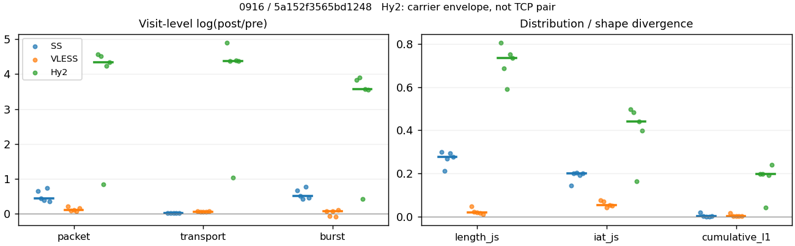
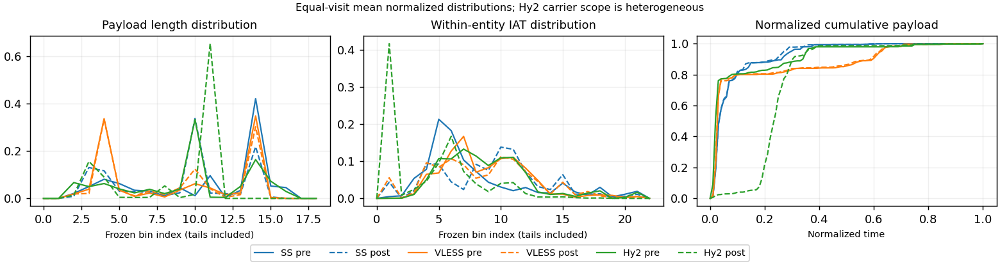

# 0916 · 条目 009 · wikipedia.org

目标：https://en.wikipedia.org/wiki/Hypertext_Transfer_Protocol

活动标签：wikipedia.org::article_view。选定访问 15 次。

[返回总索引](../../README.md) · [统计口径](../../methods.md)

## 覆盖与资格（每次访问均保留）

| 部署 | 重复 | 主请求路由 | 活动状态 | 代理比较 | DIRECT pre | 请求 proxy/direct/unresolved | 错误 |
| --- | --- | --- | --- | --- | --- | --- | --- |
| Hy2 | 1 | proxy | degraded | 1 | 0 | 24/0/0 | [] |
| Hy2 | 2 | proxy | passed | 1 | 0 | 30/0/0 | [] |
| Hy2 | 3 | proxy | degraded | 1 | 0 | 30/0/0 | [] |
| Hy2 | 4 | proxy | passed | 1 | 0 | 31/0/0 | [] |
| Hy2 | 5 | proxy | passed | 1 | 0 | 31/0/0 | [] |
| SS | 1 | proxy | passed | 1 | 0 | 31/0/0 | [] |
| SS | 2 | proxy | passed | 1 | 0 | 31/0/0 | [] |
| SS | 3 | proxy | passed | 1 | 0 | 30/0/0 | [] |
| SS | 4 | proxy | passed | 1 | 0 | 30/0/0 | [] |
| SS | 5 | proxy | passed | 1 | 0 | 31/0/0 | [] |
| VLESS | 1 | proxy | passed | 1 | 0 | 30/0/0 | [] |
| VLESS | 2 | proxy | passed | 1 | 0 | 30/0/0 | [] |
| VLESS | 3 | proxy | passed | 1 | 0 | 30/0/0 | [] |
| VLESS | 4 | proxy | passed | 1 | 0 | 30/0/0 | [] |
| VLESS | 5 | proxy | passed | 1 | 0 | 31/0/0 | [] |

主请求非 proxy 的统计仅解释为已索引的辅助代理连接或 DIRECT 观测，不代表目标业务经代理传输。播放确认与配对资格是两道不同的门。

图中散点为单次访问，短线为重复中位数；Hy2 是共享载体包络，不能与 TCP 配对作等范围因果对比。

形态图先逐访问归一化，再对访问等权平均；实线 pre，虚线 post。分箱序号及边界见 methods，不将分箱索引误解为长度或时间。

## 每次访问的关键观测

### SS

范围：`exclusive_page`。每格 pre → post；空值为不可观测/不适用。

| 重复 | 包数 | 载荷字节 | burst | TCP FR | IAT中位µs | length JS | IAT JS |
| --- | --- | --- | --- | --- | --- | --- | --- |
| 1 | 430 → 820 | 5.7147e+05 → 5.7989e+05 | 303 → 587 | 35 → 35 | 49.526 → 389.47 | 0.29876 | 0.14207 |
| 2 | 519 → 813 | 5.7976e+05 → 5.9165e+05 | 325 → 539 | 51 → 58 | 32.044 → 443.9 | 0.21159 | 0.19952 |
| 3 | 573 → 851 | 5.6516e+05 → 5.7747e+05 | 417 → 640 | 40 → 48 | 27.971 → 657.05 | 0.26806 | 0.20274 |
| 4 | 412 → 856 | 5.741e+05 → 5.8661e+05 | 258 → 558 | 48 → 50 | 60.111 → 378.39 | 0.29236 | 0.19069 |
| 5 | 558 → 797 | 5.8351e+05 → 5.941e+05 | 402 → 636 | 43 → 43 | 35.403 → 985.26 | 0.2764 | 0.20107 |

完整标量统计：中位数 [min,max]；Δ 为重复内逐访问变换的中位数，MAD 未缩放。n 为可用变换数；DIRECT-only 的 nΔ=0 不代表 pre 不可用。

| scope | 特征 | pre | post | Δ | IQRΔ | MADΔ | nΔ |
| --- | --- | --- | --- | --- | --- | --- | --- |
| exclusive_page | active_span_sum_s_1000ms | 8.3306 [5.6658, 8.4603] | 8.8761 [7.1928, 10.401] | 0.22201 | 0.18825 | 0.026509 | 5 |
| exclusive_page | active_span_sum_s_100ms | 1.5936 [1.3191, 2.0483] | 3.4848 [2.4941, 3.5812] | 0.70719 | 0.24169 | 0.16818 | 5 |
| exclusive_page | active_span_sum_s_500ms | 6.4237 [5.6658, 7.1276] | 8.0596 [5.9375, 9.134] | 0.224 | 0.046725 | 0.024031 | 5 |
| exclusive_page | burst_bytes_iqr | 2792 [1868, 2896] | 1465 [1428, 1532.5] | -0.6449 | 0.44381 | 0.062153 | 5 |
| exclusive_page | burst_bytes_mad | 31 [0, 31] | 34 [0, 34] | 0.092373 | 0.04063 | 0 | 4 |
| exclusive_page | burst_bytes_max | 20480 [17376, 20480] | 8790 [5712, 12852] | -0.83113 | 0.26817 | 0.22261 | 5 |
| exclusive_page | burst_bytes_mean | 1783.9 [1355.3, 2225.2] | 987.89 [902.29, 1097.7] | -0.4856 | 0.20592 | 0.078755 | 5 |
| exclusive_page | burst_bytes_median | 31 [0, 31] | 34 [0, 34] | 0.092373 | 0.04063 | 0 | 4 |
| exclusive_page | burst_bytes_min | 0 [0, 0] | 0 [0, 0] | — | — | — | 0 |
| exclusive_page | burst_bytes_p95 | 8688 [5792, 12288] | 3899.1 [2856, 4307.4] | -0.72058 | 0.094141 | 0.053237 | 5 |
| exclusive_page | burst_bytes_q25 | 0 [0, 0] | 0 [0, 0] | — | — | — | 0 |
| exclusive_page | burst_bytes_q75 | 2792 [1868, 2896] | 1465 [1428, 1532.5] | -0.6449 | 0.44381 | 0.062153 | 5 |
| exclusive_page | burst_bytes_std | 3375 [2539.4, 4469] | 1384.2 [1225.5, 1673.8] | -0.72855 | 0.19768 | 0.10202 | 5 |
| exclusive_page | burst_count | 325 [258, 417] | 587 [539, 640] | 0.50589 | 0.20255 | 0.077508 | 5 |
| exclusive_page | burst_duration_ms_iqr | 0.027992 [0, 0.072374] | 0.0001075 [0, 0.16278] | -1.6928 | 3.1864 | 2.5033 | 3 |
| exclusive_page | burst_duration_ms_mad | 0 [0, 0] | 0 [0, 0] | — | — | — | 0 |
| exclusive_page | burst_duration_ms_max | 13173 [2229.6, 15001] | 15455 [5128.9, 30295] | 0.029884 | 0.13409 | 0.029857 | 5 |
| exclusive_page | burst_duration_ms_mean | 91.357 [57.03, 290.31] | 125.81 [26.585, 132.03] | -0.20577 | 1.1772 | 0.60318 | 5 |
| exclusive_page | burst_duration_ms_median | 0 [0, 0] | 0 [0, 0] | — | — | — | 0 |
| exclusive_page | burst_duration_ms_min | 0 [0, 0] | 0 [0, 0] | — | — | — | 0 |
| exclusive_page | burst_duration_ms_p95 | 211.2 [95.802, 260.08] | 8.9907 [6.676, 32.085] | -2.6638 | 0.67097 | 0.35357 | 5 |
| exclusive_page | burst_duration_ms_q25 | 0 [0, 0] | 0 [0, 0] | — | — | — | 0 |
| exclusive_page | burst_duration_ms_q75 | 0.027992 [0, 0.072374] | 0.0001075 [0, 0.16278] | -1.6928 | 3.1864 | 2.5033 | 3 |
| exclusive_page | burst_duration_ms_std | 788.33 [254.97, 1872.4] | 1295.3 [295.53, 1559.4] | -0.06167 | 0.84934 | 0.4063 | 5 |
| exclusive_page | burst_packets_iqr | 1 [0, 1] | 1 [0, 1] | 0 | 0 | 0 | 3 |
| exclusive_page | burst_packets_mad | 0 [0, 0] | 0 [0, 0] | — | — | — | 0 |
| exclusive_page | burst_packets_max | 9 [6, 11] | 7 [6, 10] | -0.25131 | 0.19237 | 0.067139 | 5 |
| exclusive_page | burst_packets_mean | 1.4191 [1.3741, 1.5969] | 1.3969 [1.2531, 1.5341] | -0.040152 | 0.024208 | 0.016911 | 5 |
| exclusive_page | burst_packets_median | 1 [1, 1] | 1 [1, 1] | 0 | 0 | 0 | 5 |
| exclusive_page | burst_packets_min | 1 [1, 1] | 1 [1, 1] | 0 | 0 | 0 | 5 |
| exclusive_page | burst_packets_p95 | 3 [3, 4] | 3 [2, 4] | 0 | 0 | 0 | 5 |
| exclusive_page | burst_packets_q25 | 1 [1, 1] | 1 [1, 1] | 0 | 0 | 0 | 5 |
| exclusive_page | burst_packets_q75 | 2 [1, 2] | 2 [1, 2] | 0 | 0 | 0 | 5 |
| exclusive_page | burst_packets_std | 0.8918 [0.80648, 1.1925] | 0.83627 [0.72927, 0.95026] | -0.15484 | 0.096596 | 0.054208 | 5 |
| exclusive_page | connection_span_concurrency_max | 4 [3, 4] | 4 [3, 4] | 0 | 0 | 0 | 5 |
| exclusive_page | cumulative_l1 | — | — | 0.00080298 | 0.0011459 | 0.00048611 | 5 |
| exclusive_page | cumulative_max | — | — | 0.012889 | 0.035508 | 0.0083788 | 5 |
| exclusive_page | direction_entropy | 0.77823 [0.68671, 0.87529] | 0.5935 [0.53417, 0.63093] | -0.15687 | 0.093838 | 0.0311 | 5 |
| exclusive_page | down_burst_count | 160 [126, 206] | 291 [267, 318] | 0.51207 | 0.20507 | 0.0779 | 5 |
| exclusive_page | down_ip_bytes | 5.6534e+05 [5.6293e+05, 5.7855e+05] | 5.8255e+05 [5.7889e+05, 5.9047e+05] | 0.027954 | 0.0019274 | 0.0017561 | 5 |
| exclusive_page | down_packets | 310 [238, 325] | 458 [404, 489] | 0.3903 | 0.26168 | 0.15407 | 5 |
| exclusive_page | down_transport_bytes | 5.524e+05 [5.4599e+05, 5.6192e+05] | 5.5855e+05 [5.5408e+05, 5.6939e+05] | 0.013217 | 0.003633 | 0.0017766 | 5 |
| exclusive_page | duration_s | 66.672 [8.241, 91.617] | 66.67 [8.757, 91.616] | -6.7971e-06 | 5.0882e-06 | 4.8514e-06 | 5 |
| exclusive_page | entity_count | 6 [5, 6] | 6 [5, 6] | 0 | 0 | 0 | 5 |
| exclusive_page | fr_runs | 43 [35, 51] | 48 [35, 58] | 0.040822 | 0.12862 | 0.040822 | 5 |
| exclusive_page | fr_runs_per_packet | 0.14644 [0.13559, 0.21145] | 0.10644 [0.077434, 0.12775] | -0.043964 | 0.033061 | 0.015275 | 5 |
| exclusive_page | fr_switches | 37 [30, 45] | 43 [30, 52] | 0.04652 | 0.14458 | 0.04652 | 5 |
| exclusive_page | fr_switches_per_possible_transition | 0.12821 [0.12069, 0.19005] | 0.092965 [0.067114, 0.11607] | -0.038568 | 0.029056 | 0.014725 | 5 |
| exclusive_page | full_retransmission_fraction | 0 [0, 0.0017921] | 0.0062735 [0.00369, 0.011682] | 0.0060976 | 0.0025691 | 0.0016161 | 5 |
| exclusive_page | full_retransmission_packets | 0 [0, 1] | 5 [3, 10] | 1.6094 | — | — | 1 |
| exclusive_page | iat_count | 513 [406, 568] | 815 [791, 850] | 0.45305 | 0.2527 | 0.093298 | 5 |
| exclusive_page | iat_js | — | — | 0.19952 | 0.01038 | 0.0032229 | 5 |
| exclusive_page | iat_ks | — | — | 0.33723 | 0.050634 | 0.046662 | 5 |
| exclusive_page | iat_median_us | 35.403 [27.971, 60.111] | 443.9 [378.39, 985.26] | 2.6285 | 1.0943 | 0.56621 | 5 |
| exclusive_page | iat_us_iqr | 325.87 [294.07, 888.05] | 1602.1 [1044.4, 3238.7] | 1.5926 | 1.5163 | 0.8065 | 5 |
| exclusive_page | iat_us_mad | 29.319 [22.913, 48.635] | 437.34 [371.77, 969.23] | 2.8458 | 1.1208 | 0.6316 | 5 |
| exclusive_page | iat_us_max | 1.5001e+07 [5.1288e+06, 1.5001e+07] | 1.5424e+07 [5.1289e+06, 1.5488e+07] | 0.027797 | 0.0079008 | 0.0041618 | 5 |
| exclusive_page | iat_us_mean | 3.2267e+05 [56823, 6.0354e+05] | 1.6608e+05 [30261, 3.5201e+05] | -0.53914 | 0.17742 | 0.09093 | 5 |
| exclusive_page | iat_us_median | 35.403 [27.971, 60.111] | 443.9 [378.39, 985.26] | 2.6285 | 1.0943 | 0.56621 | 5 |
| exclusive_page | iat_us_min | 0.151 [0.027, 0.589] | 0.037 [0.036, 0.047] | -1.4338 | 0.70463 | 0.51208 | 5 |
| exclusive_page | iat_us_p95 | 2.1214e+05 [1.1361e+05, 1.3934e+06] | 71227 [32922, 2.3191e+05] | -1.2386 | 0.70177 | 0.43761 | 5 |
| exclusive_page | iat_us_q25 | 13.751 [12.12, 16.986] | 18.846 [16.07, 23.941] | 0.1735 | 0.41489 | 0.069646 | 5 |
| exclusive_page | iat_us_q75 | 339.62 [306.19, 903.38] | 1618.2 [1062.6, 3261.8] | 1.5613 | 1.4973 | 0.80458 | 5 |
| exclusive_page | iat_us_std | 2.0256e+06 [4.0796e+05, 2.8032e+06] | 1.4748e+06 [2.9052e+05, 2.1541e+06] | -0.26337 | 0.12218 | 0.076125 | 5 |
| exclusive_page | iat_wasserstein_log1p_us | — | — | 1.3149 | 0.42975 | 0.30175 | 5 |
| exclusive_page | idle_gap_count_1000ms | 13 [6, 31] | 12 [6, 27] | -0.080043 | 0.087011 | 0.058108 | 5 |
| exclusive_page | idle_gap_count_100ms | 35 [23, 54] | 32 [25, 52] | -0.03774 | 0.12136 | 0.069489 | 5 |
| exclusive_page | idle_gap_count_500ms | 16 [6, 33] | 13 [8, 29] | -0.12921 | 0.18232 | 0.078428 | 5 |
| exclusive_page | idle_gap_sum_s_1000ms | 125.84 [18.484, 334.48] | 125.4 [17.47, 287.4] | -0.017058 | 0.052916 | 0.020807 | 5 |
| exclusive_page | idle_gap_sum_s_100ms | 132.69 [22.653, 341.49] | 130.8 [22.169, 294.22] | -0.014336 | 0.010182 | 0.0038968 | 5 |
| exclusive_page | idle_gap_sum_s_500ms | 127.86 [18.484, 335.68] | 126.17 [18.725, 288.67] | -0.011115 | 0.0046988 | 0.0024768 | 5 |
| exclusive_page | ip_bytes | 5.9562e+05 [5.9391e+05, 6.1263e+05] | 6.3671e+05 [6.2723e+05, 6.4124e+05] | 0.054513 | 0.0029235 | 0.0028498 | 5 |
| exclusive_page | length_iqr | 2410 [1967.5, 3793] | 1354 [1324.5, 1385] | -0.55393 | 0.11669 | 0.10332 | 5 |
| exclusive_page | length_js | — | — | 0.2764 | 0.024301 | 0.015962 | 5 |
| exclusive_page | length_ks | — | — | 0.47259 | 0.045505 | 0.022987 | 5 |
| exclusive_page | length_mad | 824 [91, 1643] | 1260 [621, 1302] | 0.4247 | 0.89375 | 0.61074 | 5 |
| exclusive_page | length_max | 8920 [4096, 8920] | 4284 [2856, 7140] | -0.73341 | 0.8287 | 0.40547 | 5 |
| exclusive_page | length_mean | 1952.1 [1915.8, 2529.1] | 1286.1 [1202.1, 1470.6] | -0.40407 | 0.22408 | 0.13108 | 5 |
| exclusive_page | length_median | 2688 [1766, 2896] | 1428 [1428, 1428] | -0.63252 | 0.099083 | 0.074533 | 5 |
| exclusive_page | length_min | 31 [31, 31] | 20 [7, 20] | -0.43825 | 0 | 0 | 5 |
| exclusive_page | length_p95 | 3063.4 [2896, 8192] | 2856 [2856, 2856] | -0.070103 | 1.0398 | 0.056195 | 5 |
| exclusive_page | length_q25 | 486 [214.5, 928.5] | 106 [74, 872] | -1.3499 | 0.52457 | 0.28568 | 5 |
| exclusive_page | length_q75 | 2896 [2896, 4007.5] | 1468 [1428, 2196.5] | -0.67943 | 0.042588 | 0.028871 | 5 |
| exclusive_page | length_std | 1429 [1162.4, 2483.3] | 1020.7 [953.23, 1104.5] | -0.28806 | 0.56476 | 0.15008 | 5 |
| exclusive_page | length_wasserstein_bytes | — | — | 649.06 | 477.41 | 181.06 | 5 |
| exclusive_page | nonempty_entity_count | 6 [5, 6] | 6 [5, 6] | 0 | 0 | 0 | 5 |
| exclusive_page | nonempty_packets | 295 [227, 302] | 452 [404, 488] | 0.42437 | 0.21717 | 0.13338 | 5 |
| exclusive_page | offload_suspect_fraction | 0.30097 [0.28837, 0.33333] | 0.14024 [0.12266, 0.1722] | -0.16113 | 0.0078529 | 0.0051177 | 5 |
| exclusive_page | packet_count | 519 [412, 573] | 820 [797, 856] | 0.44883 | 0.24999 | 0.092332 | 5 |
| exclusive_page | rtt_median_ms | 0.057683 [0.039783, 0.078848] | 29.134 [21.761, 33.197] | 6.0167 | 0.60703 | 0.083814 | 5 |
| exclusive_page | rtt_sample_count | 192 [155, 228] | 158 [151, 194] | -0.1699 | 0.34721 | 0.19685 | 5 |
| exclusive_page | tcp_ack_count | 513 [406, 565] | 814 [790, 849] | 0.45305 | 0.24973 | 0.094563 | 5 |
| exclusive_page | tcp_fin_count | 11 [10, 12] | 12 [8, 13] | 0 | 0.080043 | 0.080043 | 5 |
| exclusive_page | tcp_packet_count | 519 [412, 573] | 820 [797, 856] | 0.44883 | 0.24999 | 0.092332 | 5 |
| exclusive_page | tcp_rst_count | 0 [0, 3] | 0 [0, 1] | -1.0986 | — | — | 1 |
| exclusive_page | tcp_syn_count | 12 [10, 12] | 12 [11, 14] | 0.09531 | 0.074108 | 0.058841 | 5 |
| exclusive_page | tcp_window_raw_median | 65535 [65504, 65535] | 145 [138, 151] | -6.1136 | 0.035564 | 0.035091 | 5 |
| exclusive_page | transition_entropy | 0.4952 [0.46156, 0.65302] | 0.37307 [0.29285, 0.43956] | -0.11762 | 0.099669 | 0.030419 | 5 |
| exclusive_page | transition_n_mm | 202 [137, 222] | 371 [325, 393] | 0.56103 | 0.30865 | 0.17537 | 5 |
| exclusive_page | transition_n_mp | 16 [13, 20] | 20 [13, 24] | 0.051293 | 0.18232 | 0.051293 | 5 |
| exclusive_page | transition_n_pm | 21 [17, 25] | 23 [17, 28] | 0.04256 | 0.11333 | 0.04256 | 5 |
| exclusive_page | transition_n_pp | 38 [33, 44] | 37 [30, 45] | -0.04652 | 0.054067 | 0.04652 | 5 |
| exclusive_page | transition_p_mm | 0.92778 [0.87821, 0.93277] | 0.95157 [0.93651, 0.96692] | 0.026598 | 0.018554 | 0.010522 | 5 |
| exclusive_page | transition_p_mp | 0.072222 [0.067227, 0.12179] | 0.048426 [0.033079, 0.063492] | -0.026598 | 0.018554 | 0.010522 | 5 |
| exclusive_page | transition_p_pm | 0.35593 [0.31481, 0.36538] | 0.36842 [0.31481, 0.43396] | 0.012489 | 0.037681 | 0.018509 | 5 |
| exclusive_page | transition_p_pp | 0.64407 [0.63462, 0.68519] | 0.63158 [0.56604, 0.68519] | -0.012489 | 0.037681 | 0.018509 | 5 |
| exclusive_page | transport_bytes | 5.741e+05 [5.6516e+05, 5.8351e+05] | 5.8661e+05 [5.7747e+05, 5.941e+05] | 0.020291 | 0.0035392 | 0.0012608 | 5 |
| exclusive_page | up_burst_count | 165 [132, 211] | 296 [272, 322] | 0.49986 | 0.20009 | 0.077163 | 5 |
| exclusive_page | up_byte_fraction | 0.037004 [0.033365, 0.038793] | 0.041597 [0.036807, 0.050555] | 0.0050836 | 0.0019953 | 0.0015049 | 5 |
| exclusive_page | up_ip_bytes | 32069 [28571, 34080] | 49447 [44844, 54160] | 0.43301 | 0.052301 | 0.034515 | 5 |
| exclusive_page | up_packets | 209 [174, 248] | 367 [355, 393] | 0.52978 | 0.19305 | 0.077066 | 5 |
| exclusive_page | up_transport_bytes | 21592 [19067, 22271] | 24713 [21344, 29656] | 0.14646 | 0.06405 | 0.033645 | 5 |
| exclusive_page | zero_iat_count | 0 [0, 0] | 0 [0, 0] | — | — | — | 0 |
| exclusive_page | zero_iat_fraction | 0 [0, 0] | 0 [0, 0] | 0 | 0 | 0 | 5 |

### VLESS

范围：`exclusive_page`。每格 pre → post；空值为不可观测/不适用。

| 重复 | 包数 | 载荷字节 | burst | TCP FR | IAT中位µs | length JS | IAT JS |
| --- | --- | --- | --- | --- | --- | --- | --- |
| 1 | 793 → 979 | 5.6934e+05 → 6.0835e+05 | 633 → 685 | 50 → 60 | 171.59 → 122.37 | 0.047639 | 0.074978 |
| 2 | 744 → 820 | 5.536e+05 → 5.8525e+05 | 606 → 570 | 39 → 46 | 120.04 → 126.78 | 0.021879 | 0.068694 |
| 3 | 737 → 821 | 5.5997e+05 → 5.9299e+05 | 536 → 578 | 38 → 46 | 228.74 → 373.99 | 0.019014 | 0.04191 |
| 4 | 728 → 790 | 5.5356e+05 → 5.8471e+05 | 528 → 490 | 35 → 44 | 204.69 → 337.63 | 0.017125 | 0.053905 |
| 5 | 808 → 949 | 5.7196e+05 → 6.1233e+05 | 637 → 715 | 46 → 52 | 210.09 → 240.91 | 0.010602 | 0.048835 |

完整标量统计：中位数 [min,max]；Δ 为重复内逐访问变换的中位数，MAD 未缩放。n 为可用变换数；DIRECT-only 的 nΔ=0 不代表 pre 不可用。

| scope | 特征 | pre | post | Δ | IQRΔ | MADΔ | nΔ |
| --- | --- | --- | --- | --- | --- | --- | --- |
| exclusive_page | active_span_sum_s_1000ms | 7.5477 [7.2939, 9.3255] | 7.5126 [6.7175, 9.1603] | -0.017875 | 0.062338 | 0.038462 | 5 |
| exclusive_page | active_span_sum_s_100ms | 1.331 [1.0732, 1.4776] | 2.7063 [2.6122, 3.3709] | 0.80438 | 0.089116 | 0.063786 | 5 |
| exclusive_page | active_span_sum_s_500ms | 3.6161 [3.3261, 5.029] | 6.3068 [6.1089, 8.4549] | 0.57832 | 0.053914 | 0.038258 | 5 |
| exclusive_page | burst_bytes_iqr | 2689 [1490, 2824] | 2824 [1520, 2824] | 0 | 0.019934 | 0.019934 | 5 |
| exclusive_page | burst_bytes_mad | 31 [24, 36] | 72 [31, 98] | 0.78016 | 0.14953 | 0.087011 | 5 |
| exclusive_page | burst_bytes_max | 8688 [5720, 14480] | 5369 [4832, 5944] | -0.4813 | 0.30736 | 0.20562 | 5 |
| exclusive_page | burst_bytes_mean | 913.53 [897.9, 1048.4] | 1025.9 [856.41, 1193.3] | -0.012672 | 0.13498 | 0.03464 | 5 |
| exclusive_page | burst_bytes_median | 31 [24, 36] | 72 [31, 98] | 0.78016 | 0.14953 | 0.087011 | 5 |
| exclusive_page | burst_bytes_min | 0 [0, 0] | 0 [0, 0] | — | — | — | 0 |
| exclusive_page | burst_bytes_p95 | 2896 [2896, 2968] | 2896 [2896, 2896] | 0 | 0 | 0 | 5 |
| exclusive_page | burst_bytes_q25 | 0 [0, 0] | 0 [0, 0] | — | — | — | 0 |
| exclusive_page | burst_bytes_q75 | 2689 [1490, 2824] | 2824 [1520, 2824] | 0 | 0.019934 | 0.019934 | 5 |
| exclusive_page | burst_bytes_std | 1457.5 [1274.2, 1506.8] | 1263.4 [1196, 1357.6] | -0.095914 | 0.038033 | 0.021072 | 5 |
| exclusive_page | burst_count | 606 [528, 637] | 578 [490, 715] | 0.07544 | 0.14019 | 0.040073 | 5 |
| exclusive_page | burst_duration_ms_iqr | 0 [0, 0.35788] | 0.000251 [0, 1.1818] | 0.52192 | 0.67263 | 0.67263 | 2 |
| exclusive_page | burst_duration_ms_mad | 0 [0, 0] | 0 [0, 0] | — | — | — | 0 |
| exclusive_page | burst_duration_ms_max | 2031.7 [1411.7, 15000] | 15005 [400.74, 15057] | 0.0037805 | 2.001 | 1.4633 | 5 |
| exclusive_page | burst_duration_ms_mean | 22.868 [16.924, 57.431] | 43.748 [7.9155, 72.304] | 0.45471 | 1.4008 | 0.99744 | 5 |
| exclusive_page | burst_duration_ms_median | 0 [0, 0] | 0 [0, 0] | — | — | — | 0 |
| exclusive_page | burst_duration_ms_min | 0 [0, 0] | 0 [0, 0] | — | — | — | 0 |
| exclusive_page | burst_duration_ms_p95 | 9.5158 [8.1204, 10.29] | 15.299 [8.8425, 47.215] | 0.39748 | 1.1117 | 0.43729 | 5 |
| exclusive_page | burst_duration_ms_q25 | 0 [0, 0] | 0 [0, 0] | — | — | — | 0 |
| exclusive_page | burst_duration_ms_q75 | 0 [0, 0.35788] | 0.000251 [0, 1.1818] | 0.52192 | 0.67263 | 0.67263 | 2 |
| exclusive_page | burst_duration_ms_std | 158.89 [110.58, 840.31] | 639.15 [39.774, 931.52] | 0.34094 | 1.7967 | 1.051 | 5 |
| exclusive_page | burst_packets_iqr | 0 [0, 1] | 1 [0, 1] | 0 | 0 | 0 | 2 |
| exclusive_page | burst_packets_mad | 0 [0, 0] | 0 [0, 0] | — | — | — | 0 |
| exclusive_page | burst_packets_max | 8 [4, 10] | 8 [6, 10] | 0 | 0.10536 | 0.10536 | 5 |
| exclusive_page | burst_packets_mean | 1.2684 [1.2277, 1.3788] | 1.4292 [1.3273, 1.6122] | 0.13176 | 0.11109 | 0.026747 | 5 |
| exclusive_page | burst_packets_median | 1 [1, 1] | 1 [1, 1] | 0 | 0 | 0 | 5 |
| exclusive_page | burst_packets_min | 1 [1, 1] | 1 [1, 1] | 0 | 0 | 0 | 5 |
| exclusive_page | burst_packets_p95 | 2 [2, 2] | 3 [3, 3] | 0.40547 | 0 | 0 | 5 |
| exclusive_page | burst_packets_q25 | 1 [1, 1] | 1 [1, 1] | 0 | 0 | 0 | 5 |
| exclusive_page | burst_packets_q75 | 1 [1, 2] | 2 [1, 2] | 0 | 0.69315 | 0 | 5 |
| exclusive_page | burst_packets_std | 0.57817 [0.49573, 0.69118] | 0.85761 [0.77858, 0.9544] | 0.36228 | 0.1438 | 0.10419 | 5 |
| exclusive_page | connection_span_concurrency_max | 3 [3, 4] | 3 [3, 4] | 0 | 0 | 0 | 5 |
| exclusive_page | cumulative_l1 | — | — | 0.0013106 | 5.75e-05 | 5.6516e-05 | 5 |
| exclusive_page | cumulative_max | — | — | 0.03624 | 0.020235 | 0.011826 | 5 |
| exclusive_page | direction_entropy | 0.57009 [0.54849, 0.62283] | 0.51345 [0.4903, 0.53999] | -0.058184 | 0.018186 | 0.01664 | 5 |
| exclusive_page | down_burst_count | 301 [262, 316] | 287 [243, 355] | 0.075986 | 0.14122 | 0.04039 | 5 |
| exclusive_page | down_ip_bytes | 5.6559e+05 [5.586e+05, 5.763e+05] | 5.9303e+05 [5.8571e+05, 6.0991e+05] | 0.047393 | 0.0093095 | 0.0010966 | 5 |
| exclusive_page | down_packets | 436 [407, 456] | 479 [460, 534] | 0.10792 | 0.016395 | 0.014498 | 5 |
| exclusive_page | down_transport_bytes | 5.4289e+05 [5.3726e+05, 5.5254e+05] | 5.6871e+05 [5.6123e+05, 5.835e+05] | 0.046475 | 0.0098616 | 0.0028246 | 5 |
| exclusive_page | duration_s | 66.042 [4.6577, 67.426] | 66.007 [4.5748, 67.385] | -0.00052745 | 0.00020911 | 0.00013057 | 5 |
| exclusive_page | entity_count | 4 [4, 5] | 4 [4, 5] | 0 | 0 | 0 | 5 |
| exclusive_page | fr_runs | 39 [35, 50] | 46 [44, 60] | 0.18232 | 0.025975 | 0.017242 | 5 |
| exclusive_page | fr_runs_per_packet | 0.097257 [0.08216, 0.11416] | 0.10132 [0.094017, 0.11342] | 0.0040647 | 0.010221 | 0.0047984 | 5 |
| exclusive_page | fr_switches | 35 [31, 45] | 42 [40, 55] | 0.20067 | 0.028988 | 0.018349 | 5 |
| exclusive_page | fr_switches_per_possible_transition | 0.088161 [0.07346, 0.10393] | 0.093333 [0.086207, 0.10496] | 0.0051721 | 0.0097892 | 0.0041364 | 5 |
| exclusive_page | full_retransmission_fraction | 0 [0, 0] | 0 [0, 0.0012195] | 0 | 0 | 0 | 5 |
| exclusive_page | full_retransmission_packets | 0 [0, 0] | 0 [0, 1] | — | — | — | 0 |
| exclusive_page | iat_count | 740 [724, 803] | 817 [786, 974] | 0.10849 | 0.064007 | 0.026328 | 5 |
| exclusive_page | iat_js | — | — | 0.053905 | 0.019859 | 0.011995 | 5 |
| exclusive_page | iat_ks | — | — | 0.096007 | 0.057381 | 0.012906 | 5 |
| exclusive_page | iat_median_us | 204.69 [120.04, 228.74] | 240.91 [122.37, 373.99] | 0.13687 | 0.43698 | 0.35475 | 5 |
| exclusive_page | iat_us_iqr | 1165.4 [1115.7, 1753.3] | 1430.9 [1355.8, 1786.8] | 0.19487 | 0.038559 | 0.028238 | 5 |
| exclusive_page | iat_us_mad | 196.81 [108.8, 221.81] | 236.43 [122.25, 366.42] | 0.15201 | 0.3501 | 0.34994 | 5 |
| exclusive_page | iat_us_max | 1.5001e+07 [1.7248e+06, 1.5001e+07] | 1.5318e+07 [1.7057e+06, 1.5442e+07] | 0.020943 | 0.0011165 | 0.0010822 | 5 |
| exclusive_page | iat_us_mean | 96011 [15426, 1.555e+05] | 88278 [12295, 1.3214e+05] | -0.11021 | 0.063286 | 0.026492 | 5 |
| exclusive_page | iat_us_median | 204.69 [120.04, 228.74] | 240.91 [122.37, 373.99] | 0.13687 | 0.43698 | 0.35475 | 5 |
| exclusive_page | iat_us_min | 2.342 [0.109, 3.259] | 0.037 [0.036, 0.038] | -4.1212 | 2.9967 | 0.35708 | 5 |
| exclusive_page | iat_us_p95 | 11162 [10151, 20401] | 43695 [41733, 51764] | 1.3647 | 0.20334 | 0.056104 | 5 |
| exclusive_page | iat_us_q25 | 43.477 [42.775, 47.585] | 20.73 [14.67, 26.423] | -0.74061 | 0.22437 | 0.19139 | 5 |
| exclusive_page | iat_us_q75 | 1208.9 [1158.5, 1798] | 1451.6 [1382.2, 1801.5] | 0.17655 | 0.037521 | 0.031122 | 5 |
| exclusive_page | iat_us_std | 1.103e+06 [1.006e+05, 1.4423e+06] | 1.0485e+06 [77822, 1.3288e+06] | -0.050684 | 0.03696 | 0.014506 | 5 |
| exclusive_page | iat_wasserstein_log1p_us | — | — | 0.48937 | 0.1447 | 0.073934 | 5 |
| exclusive_page | idle_gap_count_1000ms | 6 [2, 8] | 6 [2, 8] | 0 | 0 | 0 | 5 |
| exclusive_page | idle_gap_count_100ms | 24 [22, 29] | 28 [26, 35] | 0.18805 | 0.075913 | 0.016742 | 5 |
| exclusive_page | idle_gap_count_500ms | 12 [8, 14] | 8 [3, 9] | -0.48551 | 0.097164 | 0.053489 | 5 |
| exclusive_page | idle_gap_sum_s_1000ms | 62.621 [2.8299, 115.93] | 62.583 [2.8154, 115.62] | -0.0013922 | 0.0085598 | 0.0037164 | 5 |
| exclusive_page | idle_gap_sum_s_100ms | 68.838 [10.678, 123.45] | 67.34 [8.6727, 121.37] | -0.022293 | 0.0023559 | 0.0020576 | 5 |
| exclusive_page | idle_gap_sum_s_500ms | 66.796 [7.1264, 120.12] | 63.938 [3.6084, 116.28] | -0.043733 | 0.0074486 | 0.0040504 | 5 |
| exclusive_page | ip_bytes | 5.9826e+05 [5.9141e+05, 6.1394e+05] | 6.3594e+05 [6.2608e+05, 6.6195e+05] | 0.061081 | 0.016581 | 0.004102 | 5 |
| exclusive_page | length_iqr | 2752 [2752, 2752] | 2752 [1412, 2752] | 0 | 0 | 0 | 5 |
| exclusive_page | length_js | — | — | 0.019014 | 0.0047536 | 0.0028644 | 5 |
| exclusive_page | length_ks | — | — | 0.055337 | 0.016051 | 0.005696 | 5 |
| exclusive_page | length_mad | 1244.5 [1091, 1340] | 1132 [1045, 1298] | -0.031845 | 0.056249 | 0.045016 | 5 |
| exclusive_page | length_max | 4124 [2896, 8920] | 2896 [2896, 2896] | -0.35349 | 0.66859 | 0.33965 | 5 |
| exclusive_page | length_mean | 1299.4 [1296.2, 1380.6] | 1249.4 [1150, 1289.1] | -0.043264 | 0.029258 | 0.025274 | 5 |
| exclusive_page | length_median | 1316.5 [1163, 1412] | 1204 [1117, 1370] | -0.030196 | 0.052812 | 0.042652 | 5 |
| exclusive_page | length_min | 24 [24, 24] | 17 [5, 24] | -0.34484 | 0.69315 | 0.34484 | 5 |
| exclusive_page | length_p95 | 2896 [2824, 2896] | 2824 [2824, 2824] | -0.025176 | 0.025176 | 0 | 5 |
| exclusive_page | length_q25 | 72 [72, 72] | 72 [72, 72] | 0 | 0 | 0 | 5 |
| exclusive_page | length_q75 | 2824 [2824, 2824] | 2824 [1484, 2824] | 0 | 0 | 0 | 5 |
| exclusive_page | length_std | 1224.6 [1214.6, 1341.8] | 1176.8 [1052.1, 1190.7] | -0.047581 | 0.083159 | 0.012161 | 5 |
| exclusive_page | length_wasserstein_bytes | — | — | 81.831 | 36.036 | 16.76 | 5 |
| exclusive_page | nonempty_entity_count | 4 [4, 5] | 4 [4, 5] | 0 | 0 | 0 | 5 |
| exclusive_page | nonempty_packets | 432 [401, 441] | 468 [454, 529] | 0.11146 | 0.030107 | 0.017435 | 5 |
| exclusive_page | offload_suspect_fraction | 0.21816 [0.21287, 0.22665] | 0.19001 [0.1379, 0.19747] | -0.036582 | 0.0098241 | 0.0074021 | 5 |
| exclusive_page | packet_count | 744 [728, 808] | 821 [790, 979] | 0.10794 | 0.063583 | 0.026203 | 5 |
| exclusive_page | rtt_median_ms | 0.076116 [0.063173, 0.17812] | 0.064356 [0.048948, 1.2417] | -0.094884 | 0.24224 | 0.21421 | 5 |
| exclusive_page | rtt_sample_count | 324 [281, 340] | 342 [296, 425] | 0.15247 | 0.1176 | 0.082509 | 5 |
| exclusive_page | tcp_ack_count | 735 [718, 793] | 817 [786, 974] | 0.11947 | 0.069759 | 0.02898 | 5 |
| exclusive_page | tcp_fin_count | 8 [7, 10] | 8 [8, 10] | 0 | 0 | 0 | 5 |
| exclusive_page | tcp_packet_count | 744 [728, 808] | 821 [790, 979] | 0.10794 | 0.063583 | 0.026203 | 5 |
| exclusive_page | tcp_rst_count | 8 [5, 10] | 0 [0, 0] | — | — | — | 0 |
| exclusive_page | tcp_syn_count | 8 [8, 10] | 8 [8, 10] | 0 | 0 | 0 | 5 |
| exclusive_page | tcp_window_raw_median | 65535 [65535, 65535] | 161 [156, 163] | -6.0089 | 0.031351 | 0.012346 | 5 |
| exclusive_page | transition_entropy | 0.36084 [0.31722, 0.40731] | 0.35918 [0.33685, 0.38757] | 0.0007366 | 0.017027 | 0.01463 | 5 |
| exclusive_page | transition_n_mm | 354 [328, 359] | 396 [379, 436] | 0.12303 | 0.035226 | 0.021492 | 5 |
| exclusive_page | transition_n_mp | 16 [14, 20] | 19 [18, 25] | 0.22314 | 0.064539 | 0.028171 | 5 |
| exclusive_page | transition_n_pm | 19 [17, 25] | 23 [22, 30] | 0.19106 | 0.0087337 | 0.0087337 | 5 |
| exclusive_page | transition_n_pp | 36 [34, 43] | 29 [28, 35] | -0.25131 | 0.10563 | 0.09225 | 5 |
| exclusive_page | transition_p_mm | 0.95349 [0.94521, 0.96206] | 0.95226 [0.94577, 0.95652] | -0.001435 | 0.0043108 | 0.0019996 | 5 |
| exclusive_page | transition_p_mp | 0.046512 [0.03794, 0.054795] | 0.047739 [0.043478, 0.05423] | 0.001435 | 0.0043108 | 0.0019996 | 5 |
| exclusive_page | transition_p_pm | 0.35849 [0.32075, 0.38983] | 0.44231 [0.42623, 0.47619] | 0.10854 | 0.035428 | 0.020403 | 5 |
| exclusive_page | transition_p_pp | 0.64151 [0.61017, 0.67925] | 0.55769 [0.52381, 0.57377] | -0.10854 | 0.035428 | 0.020403 | 5 |
| exclusive_page | transport_bytes | 5.5997e+05 [5.5356e+05, 5.7196e+05] | 5.9299e+05 [5.8471e+05, 6.1233e+05] | 0.057303 | 0.010678 | 0.0025538 | 5 |
| exclusive_page | up_burst_count | 305 [266, 321] | 291 [247, 360] | 0.074901 | 0.13918 | 0.039762 | 5 |
| exclusive_page | up_byte_fraction | 0.030502 [0.029256, 0.033948] | 0.040943 [0.04014, 0.047081] | 0.010884 | 0.00090338 | 0.00044281 | 5 |
| exclusive_page | up_ip_bytes | 33692 [31752, 37641] | 42911 [39909, 52045] | 0.27273 | 0.09387 | 0.044086 | 5 |
| exclusive_page | up_packets | 337 [298, 352] | 360 [311, 445] | 0.16219 | 0.16166 | 0.077954 | 5 |
| exclusive_page | up_transport_bytes | 17080 [16196, 19417] | 24279 [23477, 28829] | 0.3651 | 0.0081957 | 0.0067941 | 5 |
| exclusive_page | zero_iat_count | 0 [0, 0] | 0 [0, 0] | — | — | — | 0 |
| exclusive_page | zero_iat_fraction | 0 [0, 0] | 0 [0, 0] | 0 | 0 | 0 | 5 |

### Hy2

范围：`carrier_context_envelope`。每格 pre → post；空值为不可观测/不适用。

| 重复 | 包数 | 载荷字节 | burst | TCP FR | IAT中位µs | length JS | IAT JS |
| --- | --- | --- | --- | --- | --- | --- | --- |
| 1 | 436 → 42169 | 3.4426e+05 → 4.5878e+07 | 306 → 14008 | — | 193.82 → 3.302 | 0.80435 | 0.49716 |
| 2 | 461 → 42087 | 5.6972e+05 → 4.5439e+07 | 289 → 14422 | — | 146.24 → 3.036 | 0.68735 | 0.48144 |
| 3 | 814 → 1908 | 5.8005e+05 → 1.6356e+06 | 680 → 1030 | — | 220.42 → 138.64 | 0.59114 | 0.16251 |
| 4 | 637 → 43903 | 5.7272e+05 → 4.6463e+07 | 451 → 15967 | — | 245.83 → 5.02 | 0.75224 | 0.43999 |
| 5 | 552 → 41914 | 5.7449e+05 → 4.5935e+07 | 402 → 13965 | — | 136.88 → 4.76 | 0.73471 | 0.39765 |

完整标量统计：中位数 [min,max]；Δ 为重复内逐访问变换的中位数，MAD 未缩放。n 为可用变换数；DIRECT-only 的 nΔ=0 不代表 pre 不可用。

| scope | 特征 | pre | post | Δ | IQRΔ | MADΔ | nΔ |
| --- | --- | --- | --- | --- | --- | --- | --- |
| carrier_context_envelope | active_span_sum_s_1000ms | 5.2144 [3.628, 7.4805] | 14.924 [6.5265, 24.124] | 1.0623 | 0.39596 | 0.38517 | 5 |
| carrier_context_envelope | active_span_sum_s_100ms | 1.0058 [0.3395, 1.4459] | 6.7385 [3.4532, 8.2038] | 1.9618 | 0.13 | 0.10927 | 5 |
| carrier_context_envelope | active_span_sum_s_500ms | 5.2144 [3.628, 7.4805] | 13.078 [5.8945, 20.73] | 1.0623 | 0.23069 | 0.2199 | 5 |
| carrier_context_envelope | burst_bytes_iqr | 1735.5 [1415, 2782] | 5068 [2848, 5130] | 0.69949 | 0.43707 | 0.099711 | 5 |
| carrier_context_envelope | burst_bytes_mad | 11 [0, 31] | 270 [220, 382] | 2.1864 | 0.7519 | 0.14269 | 3 |
| carrier_context_envelope | burst_bytes_max | 16237 [14254, 20480] | 1.8883e+05 [14566, 3.2253e+05] | 2.5257 | 0.53533 | 0.2788 | 5 |
| carrier_context_envelope | burst_bytes_mean | 1269.9 [853.02, 1971.4] | 3150.6 [1588, 3289.3] | 0.8292 | 0.21219 | 0.20775 | 5 |
| carrier_context_envelope | burst_bytes_median | 11 [0, 31] | 303 [253, 415] | 2.2994 | 0.72345 | 0.11587 | 3 |
| carrier_context_envelope | burst_bytes_min | 0 [0, 0] | 22 [22, 22] | — | — | — | 0 |
| carrier_context_envelope | burst_bytes_p95 | 5550 [2830, 10889] | 10932 [4323, 12142] | 0.6779 | 0.28768 | 0.15346 | 5 |
| carrier_context_envelope | burst_bytes_q25 | 0 [0, 0] | 85 [34, 100] | — | — | — | 0 |
| carrier_context_envelope | burst_bytes_q75 | 1735.5 [1415, 2782] | 5168 [2882, 5168] | 0.71135 | 0.43394 | 0.092039 | 5 |
| carrier_context_envelope | burst_bytes_std | 2153 [1304.6, 3812] | 5263.6 [1983.1, 6597] | 0.54846 | 0.32665 | 0.12973 | 5 |
| carrier_context_envelope | burst_count | 402 [289, 680] | 14008 [1030, 15967] | 3.5668 | 0.27594 | 0.25699 | 5 |
| carrier_context_envelope | burst_duration_ms_iqr | 0.18147 [0, 0.86166] | 0.024857 [0.023816, 0.89073] | -2.4025 | 1.2448 | 0.77494 | 4 |
| carrier_context_envelope | burst_duration_ms_mad | 0 [0, 0] | 4.6e-05 [4.3e-05, 9.7e-05] | — | — | — | 0 |
| carrier_context_envelope | burst_duration_ms_max | 2709.9 [370.3, 14963] | 10000 [301.2, 10000] | 0.24892 | 1.249 | 0.65188 | 5 |
| carrier_context_envelope | burst_duration_ms_mean | 20.823 [8.2681, 76.426] | 1.1204 [0.29056, 2.0779] | -3.8246 | 0.94938 | 0.16167 | 5 |
| carrier_context_envelope | burst_duration_ms_median | 0 [0, 0] | 4.6e-05 [4.3e-05, 9.7e-05] | — | — | — | 0 |
| carrier_context_envelope | burst_duration_ms_min | 0 [0, 0] | 0 [0, 0] | — | — | — | 0 |
| carrier_context_envelope | burst_duration_ms_p95 | 21.088 [2.721, 197.46] | 0.093233 [0.082951, 2.1618] | -5.4292 | 2.6009 | 2.229 | 5 |
| carrier_context_envelope | burst_duration_ms_q25 | 0 [0, 0] | 0 [0, 0] | — | — | — | 0 |
| carrier_context_envelope | burst_duration_ms_q75 | 0.18147 [0, 0.86166] | 0.024857 [0.023816, 0.89073] | -2.4025 | 1.2448 | 0.77494 | 4 |
| carrier_context_envelope | burst_duration_ms_std | 179.4 [50.104, 994.62] | 84.995 [5.6599, 89.991] | -1.3816 | 1.4536 | 0.63457 | 5 |
| carrier_context_envelope | burst_packets_iqr | 1 [0, 1] | 3 [1, 3] | 1.0986 | 0 | 0 | 4 |
| carrier_context_envelope | burst_packets_mad | 0 [0, 0] | 1 [1, 1] | — | — | — | 0 |
| carrier_context_envelope | burst_packets_max | 9 [5, 11] | 136 [13, 239] | 2.8954 | 0.45845 | 0.27847 | 5 |
| carrier_context_envelope | burst_packets_mean | 1.4124 [1.1971, 1.5952] | 2.9182 [1.8524, 3.0104] | 0.66616 | 0.14399 | 0.081843 | 5 |
| carrier_context_envelope | burst_packets_median | 1 [1, 1] | 2 [2, 2] | 0.69315 | 0 | 0 | 5 |
| carrier_context_envelope | burst_packets_min | 1 [1, 1] | 1 [1, 1] | 0 | 0 | 0 | 5 |
| carrier_context_envelope | burst_packets_p95 | 2 [2, 3] | 8 [4, 9] | 1.0986 | 0.40547 | 0.28768 | 5 |
| carrier_context_envelope | burst_packets_q25 | 1 [1, 1] | 1 [1, 1] | 0 | 0 | 0 | 5 |
| carrier_context_envelope | burst_packets_q75 | 2 [1, 2] | 4 [2, 4] | 0.69315 | 0 | 0 | 5 |
| carrier_context_envelope | burst_packets_std | 0.72625 [0.53905, 1.025] | 3.476 [1.3828, 4.5741] | 1.4957 | 0.075427 | 0.070029 | 5 |
| carrier_context_envelope | connection_span_concurrency_max | 4 [3, 10] | 1 [1, 1] | -1.3863 | 0.22314 | 0.22314 | 5 |
| carrier_context_envelope | cumulative_l1 | — | — | 0.19699 | 0.006258 | 0.0061442 | 5 |
| carrier_context_envelope | cumulative_max | — | — | 0.96598 | 0.0084548 | 0.0073196 | 5 |
| carrier_context_envelope | direction_entropy | 0.75672 [0.59618, 0.84894] | 0.76503 [0.74534, 0.93965] | -0.011377 | 0.17751 | 0.080839 | 5 |
| carrier_context_envelope | direction_run_analog_runs | 50 [48, 65] | 14008 [1030, 15967] | 5.6323 | 0.33231 | 0.15417 | 5 |
| carrier_context_envelope | direction_run_analog_runs_per_packet | 0.16779 [0.13462, 0.36517] | 0.34267 [0.33219, 0.53983] | 0.1654 | 0.073172 | 0.063676 | 5 |
| carrier_context_envelope | direction_run_analog_switches | 44 [43, 49] | 14007 [1029, 15966] | 5.76 | 0.15975 | 0.10456 | 5 |
| carrier_context_envelope | direction_run_analog_switches_per_possible_transition | 0.15068 [0.11809, 0.30247] | 0.34266 [0.33217, 0.53959] | 0.18248 | 0.06909 | 0.05863 | 5 |
| carrier_context_envelope | down_burst_count | 198 [142, 335] | 7004 [515, 7983] | 3.5779 | 0.31454 | 0.29961 | 5 |
| carrier_context_envelope | down_ip_bytes | 5.7005e+05 [3.2353e+05, 5.7653e+05] | 4.6062e+07 [1.5729e+06, 4.6571e+07] | 4.3982 | 0.00843 | 0.0068083 | 5 |
| carrier_context_envelope | down_packets | 311 [232, 428] | 32971 [1228, 33459] | 4.6653 | 0.28232 | 0.16879 | 5 |
| carrier_context_envelope | down_transport_bytes | 5.5333e+05 [3.1134e+05, 5.542e+05] | 4.5139e+07 [1.5385e+06, 4.5634e+07] | 4.4086 | 0.015582 | 0.011749 | 5 |
| carrier_context_envelope | duration_s | 61.853 [6.5287, 64.252] | 61.779 [6.5265, 64.231] | -0.00032239 | 0.00031599 | 0.00029978 | 5 |
| carrier_context_envelope | entity_count | 6 [5, 16] | 1 [1, 1] | -1.7918 | 0.69315 | 0.18232 | 5 |
| carrier_context_envelope | full_retransmission_fraction | 0 [0, 0.0054348] | — | — | — | — | 0 |
| carrier_context_envelope | full_retransmission_packets | 0 [0, 3] | — | — | — | — | 0 |
| carrier_context_envelope | iat_count | 546 [420, 804] | 42086 [1907, 43902] | 4.3407 | 0.28415 | 0.18425 | 5 |
| carrier_context_envelope | iat_js | — | — | 0.43999 | 0.083794 | 0.042343 | 5 |
| carrier_context_envelope | iat_ks | — | — | 0.62606 | 0.16031 | 0.043818 | 5 |
| carrier_context_envelope | iat_median_us | 193.82 [136.88, 245.83] | 4.76 [3.036, 138.64] | -3.8747 | 0.53234 | 0.1977 | 5 |
| carrier_context_envelope | iat_us_iqr | 1059.2 [881.98, 1450.7] | 24.739 [23.273, 1073.1] | -3.6349 | 0.13325 | 0.1191 | 5 |
| carrier_context_envelope | iat_us_mad | 182.76 [126.04, 238.77] | 4.724 [3, 138.56] | -3.7774 | 0.58532 | 0.24719 | 5 |
| carrier_context_envelope | iat_us_max | 1.5001e+07 [4.9277e+05, 1.5001e+07] | 1.0001e+07 [6.3201e+05, 1.0001e+07] | -0.40544 | 1.7048e-05 | 1.1377e-05 | 5 |
| carrier_context_envelope | iat_us_mean | 2.2085e+05 [9304.1, 5.2851e+05] | 1466.8 [1248.5, 3422.4] | -5.1756 | 0.41325 | 0.27509 | 5 |
| carrier_context_envelope | iat_us_median | 193.82 [136.88, 245.83] | 4.76 [3.036, 138.64] | -3.8747 | 0.53234 | 0.1977 | 5 |
| carrier_context_envelope | iat_us_min | 1.572 [0.246, 3.418] | 0.001 [0, 0.033] | -7.3601 | 2.0085 | 0.32743 | 3 |
| carrier_context_envelope | iat_us_p95 | 63515 [10807, 2.2744e+05] | 158.89 [96.186, 6141.2] | -5.57 | 2.7273 | 1.8609 | 5 |
| carrier_context_envelope | iat_us_q25 | 43.742 [23.378, 51.819] | 0.046 [0.044, 40.832] | -6.8123 | 0.63308 | 0.089565 | 5 |
| carrier_context_envelope | iat_us_q75 | 1082.6 [929.92, 1494.4] | 24.783 [23.322, 1114] | -3.6857 | 0.1562 | 0.14953 | 5 |
| carrier_context_envelope | iat_us_std | 1.6956e+06 [47338, 2.625e+06] | 85048 [24146, 93852] | -3.0554 | 0.091847 | 0.062842 | 5 |
| carrier_context_envelope | iat_wasserstein_log1p_us | — | — | 3.8377 | 0.47341 | 0.24871 | 5 |
| carrier_context_envelope | idle_gap_count_1000ms | 8 [0, 20] | 8 [0, 8] | -0.11157 | 0.39643 | 0.11157 | 4 |
| carrier_context_envelope | idle_gap_count_100ms | 27 [23, 34] | 49 [12, 76] | 0.40547 | 0.17015 | 0.14953 | 5 |
| carrier_context_envelope | idle_gap_count_500ms | 8 [0, 20] | 8 [1, 13] | -0.11157 | 0.41644 | 0.25541 | 4 |
| carrier_context_envelope | idle_gap_sum_s_1000ms | 118.56 [0, 237.37] | 40.107 [0, 46.929] | -1.0759 | 0.19068 | 0.072857 | 4 |
| carrier_context_envelope | idle_gap_sum_s_100ms | 123.1 [6.0346, 240.12] | 55.114 [3.0733, 56.205] | -0.81721 | 0.1863 | 0.14245 | 5 |
| carrier_context_envelope | idle_gap_sum_s_500ms | 118.56 [0, 237.37] | 43.501 [0.63201, 48.702] | -1.0353 | 0.21049 | 0.064936 | 4 |
| carrier_context_envelope | ip_bytes | 6.0333e+05 [3.6718e+05, 6.2254e+05] | 4.7059e+07 [1.6891e+06, 4.7693e+07] | 4.3632 | 0.0080154 | 0.005469 | 5 |
| carrier_context_envelope | length_iqr | 1595.2 [265.25, 2764] | 596 [596, 1405] | -0.98455 | 1.4991 | 0.54965 | 5 |
| carrier_context_envelope | length_js | — | — | 0.73471 | 0.064887 | 0.047358 | 5 |
| carrier_context_envelope | length_ks | — | — | 0.38764 | 0.12219 | 0.017281 | 5 |
| carrier_context_envelope | length_mad | 772 [9, 1531] | 0 [0, 11] | 0.20067 | — | — | 1 |
| carrier_context_envelope | length_max | 8920 [7140, 8920] | 1441 [1441, 1441] | -1.823 | 0 | 0 | 5 |
| carrier_context_envelope | length_mean | 1927.8 [1421.7, 2216.8] | 1079.6 [857.25, 1095.9] | -0.56478 | 0.069429 | 0.058908 | 5 |
| carrier_context_envelope | length_median | 1415 [1415, 1768] | 1441 [1430, 1441] | 0.018208 | 0.0076629 | 0 | 5 |
| carrier_context_envelope | length_min | 22 [11, 22] | 22 [22, 22] | 0 | 0 | 0 | 5 |
| carrier_context_envelope | length_p95 | 5667.8 [2830, 8920] | 1441 [1441, 1441] | -1.3695 | 0.40607 | 0.37065 | 5 |
| carrier_context_envelope | length_q25 | 542 [92, 1149.8] | 845 [36, 845] | 0.42987 | 1.0254 | 1.0112 | 5 |
| carrier_context_envelope | length_q75 | 2145 [1415, 2856] | 1441 [1441, 1441] | -0.3978 | 0.60482 | 0.28628 | 5 |
| carrier_context_envelope | length_std | 1832.3 [1028.7, 2363.6] | 578.04 [573.57, 672.26] | -1.1614 | 0.2346 | 0.16925 | 5 |
| carrier_context_envelope | length_wasserstein_bytes | — | — | 886.22 | 358.17 | 304.08 | 5 |
| carrier_context_envelope | nonempty_entity_count | 6 [5, 16] | 1 [1, 1] | -1.7918 | 0.69315 | 0.18232 | 5 |
| carrier_context_envelope | nonempty_packets | 298 [178, 408] | 42087 [1908, 43903] | 4.9463 | 0.30583 | 0.1537 | 5 |
| carrier_context_envelope | offload_suspect_fraction | 0.15826 [0.089681, 0.29501] | 0 [0, 0] | -0.15826 | 0.070786 | 0.051506 | 5 |
| carrier_context_envelope | packet_count | 552 [436, 814] | 42087 [1908, 43903] | 4.3298 | 0.28113 | 0.18427 | 5 |
| carrier_context_envelope | rtt_median_ms | 0.10285 [0.062369, 0.16816] | — | — | — | — | 0 |
| carrier_context_envelope | rtt_sample_count | 224 [162, 381] | 0 [0, 0] | — | — | — | 0 |
| carrier_context_envelope | tcp_ack_count | 546 [420, 804] | — | — | — | — | 0 |
| carrier_context_envelope | tcp_fin_count | 12 [10, 32] | — | — | — | — | 0 |
| carrier_context_envelope | tcp_packet_count | 552 [436, 814] | 0 [0, 0] | — | — | — | 0 |
| carrier_context_envelope | tcp_rst_count | 0 [0, 0] | — | — | — | — | 0 |
| carrier_context_envelope | tcp_syn_count | 12 [10, 32] | — | — | — | — | 0 |
| carrier_context_envelope | tcp_window_raw_median | 65535 [65471, 65535] | — | — | — | — | 0 |
| carrier_context_envelope | transition_entropy | 0.54212 [0.4274, 0.72267] | 0.76497 [0.74535, 0.91666] | 0.20322 | 0.16294 | 0.12584 | 5 |
| carrier_context_envelope | transition_n_mm | 209 [103, 324] | 25504 [713, 26044] | 4.8252 | 0.50351 | 0.30012 | 5 |
| carrier_context_envelope | transition_n_mp | 20 [19, 23] | 7004 [515, 7983] | 5.8554 | 0.22018 | 0.13398 | 5 |
| carrier_context_envelope | transition_n_pm | 24 [24, 26] | 7003 [514, 7983] | 5.673 | 0.10917 | 0.077039 | 5 |
| carrier_context_envelope | transition_n_pp | 39 [10, 42] | 2161 [165, 2460] | 3.9407 | 0.25568 | 0.2037 | 5 |
| carrier_context_envelope | transition_p_mm | 0.91266 [0.81746, 0.93642] | 0.77958 [0.58062, 0.78859] | -0.12407 | 0.052755 | 0.04695 | 5 |
| carrier_context_envelope | transition_p_mp | 0.087336 [0.063584, 0.18254] | 0.22042 [0.21141, 0.41938] | 0.12407 | 0.052755 | 0.04695 | 5 |
| carrier_context_envelope | transition_p_pm | 0.38095 [0.36364, 0.72222] | 0.76444 [0.757, 0.78564] | 0.38348 | 0.12846 | 0.022275 | 5 |
| carrier_context_envelope | transition_p_pp | 0.61905 [0.27778, 0.63636] | 0.23556 [0.21436, 0.243] | -0.38348 | 0.12846 | 0.022275 | 5 |
| carrier_context_envelope | transport_bytes | 5.7272e+05 [3.4426e+05, 5.8005e+05] | 4.5878e+07 [1.6356e+06, 4.6463e+07] | 4.3815 | 0.017044 | 0.014513 | 5 |
| carrier_context_envelope | up_burst_count | 204 [147, 345] | 7004 [515, 7984] | 3.5558 | 0.23986 | 0.21698 | 5 |
| carrier_context_envelope | up_byte_fraction | 0.035964 [0.033367, 0.095624] | 0.016111 [0.0094773, 0.059407] | -0.017446 | 0.010487 | 0.0090407 | 5 |
| carrier_context_envelope | up_ip_bytes | 33277 [28722, 46006] | 9.8586e+05 [1.1621e+05, 1.1222e+06] | 3.1281 | 0.49835 | 0.39357 | 5 |
| carrier_context_envelope | up_packets | 241 [186, 386] | 9198 [680, 10444] | 3.6778 | 0.20107 | 0.13079 | 5 |
| carrier_context_envelope | up_transport_bytes | 20661 [19010, 32919] | 7.2344e+05 [97169, 8.2974e+05] | 3.1115 | 0.59117 | 0.5276 | 5 |
| carrier_context_envelope | zero_iat_count | 0 [0, 0] | 0 [0, 2] | — | — | — | 0 |
| carrier_context_envelope | zero_iat_fraction | 0 [0, 0] | 0 [0, 4.5556e-05] | 0 | 2.3715e-05 | 0 | 5 |

## 不同部署对比

以下是各部署自身重复中位数的差异，不按重复编号强行配对。跨 TCP/Hy2 的行标记异质观测范围。

| 视角 | 特征 | 部署A | 部署B | A中位 | B中位 | B−A | 比较口径 |
| --- | --- | --- | --- | --- | --- | --- | --- |
| pre | burst_count | VLESS | SS | 606 | 325 | -281 | same_scope_unpaired_visits |
| pre | burst_count | VLESS | Hy2 | 606 | 402 | -204 | heterogeneous_scope_descriptive_only |
| pre | burst_count | SS | Hy2 | 325 | 402 | 77 | heterogeneous_scope_descriptive_only |
| pre | connection_span_concurrency_max | VLESS | SS | 3 | 4 | 1 | same_scope_unpaired_visits |
| pre | connection_span_concurrency_max | VLESS | Hy2 | 3 | 4 | 1 | heterogeneous_scope_descriptive_only |
| pre | connection_span_concurrency_max | SS | Hy2 | 4 | 4 | 0 | heterogeneous_scope_descriptive_only |
| pre | direction_entropy | VLESS | SS | 0.57009 | 0.77823 | 0.20814 | same_scope_unpaired_visits |
| pre | direction_entropy | VLESS | Hy2 | 0.57009 | 0.75672 | 0.18663 | heterogeneous_scope_descriptive_only |
| pre | direction_entropy | SS | Hy2 | 0.77823 | 0.75672 | -0.021509 | heterogeneous_scope_descriptive_only |
| pre | down_transport_bytes | VLESS | SS | 5.4289e+05 | 5.524e+05 | 9517 | same_scope_unpaired_visits |
| pre | down_transport_bytes | VLESS | Hy2 | 5.4289e+05 | 5.5333e+05 | 10448 | heterogeneous_scope_descriptive_only |
| pre | down_transport_bytes | SS | Hy2 | 5.524e+05 | 5.5333e+05 | 931 | heterogeneous_scope_descriptive_only |
| pre | duration_s | VLESS | SS | 66.042 | 66.672 | 0.62981 | same_scope_unpaired_visits |
| pre | duration_s | VLESS | Hy2 | 66.042 | 61.853 | -4.1886 | heterogeneous_scope_descriptive_only |
| pre | duration_s | SS | Hy2 | 66.672 | 61.853 | -4.8184 | heterogeneous_scope_descriptive_only |
| pre | entity_count | VLESS | SS | 4 | 6 | 2 | same_scope_unpaired_visits |
| pre | entity_count | VLESS | Hy2 | 4 | 6 | 2 | heterogeneous_scope_descriptive_only |
| pre | entity_count | SS | Hy2 | 6 | 6 | 0 | heterogeneous_scope_descriptive_only |
| pre | fr_runs | VLESS | SS | 39 | 43 | 4 | same_scope_unpaired_visits |
| pre | fr_runs_per_packet | VLESS | SS | 0.097257 | 0.14644 | 0.049187 | same_scope_unpaired_visits |
| pre | fr_switches | VLESS | SS | 35 | 37 | 2 | same_scope_unpaired_visits |
| pre | fr_switches_per_possible_transition | VLESS | SS | 0.088161 | 0.12821 | 0.040044 | same_scope_unpaired_visits |
| pre | full_retransmission_fraction | VLESS | SS | 0 | 0 | 0 | same_scope_unpaired_visits |
| pre | full_retransmission_fraction | VLESS | Hy2 | 0 | 0 | 0 | heterogeneous_scope_descriptive_only |
| pre | full_retransmission_fraction | SS | Hy2 | 0 | 0 | 0 | heterogeneous_scope_descriptive_only |
| pre | iat_median_us | VLESS | SS | 204.69 | 35.403 | -169.29 | same_scope_unpaired_visits |
| pre | iat_median_us | VLESS | Hy2 | 204.69 | 193.82 | -10.873 | heterogeneous_scope_descriptive_only |
| pre | iat_median_us | SS | Hy2 | 35.403 | 193.82 | 158.41 | heterogeneous_scope_descriptive_only |
| pre | iat_us_p95 | VLESS | SS | 11162 | 2.1214e+05 | 2.0098e+05 | same_scope_unpaired_visits |
| pre | iat_us_p95 | VLESS | Hy2 | 11162 | 63515 | 52354 | heterogeneous_scope_descriptive_only |
| pre | iat_us_p95 | SS | Hy2 | 2.1214e+05 | 63515 | -1.4863e+05 | heterogeneous_scope_descriptive_only |
| pre | ip_bytes | VLESS | SS | 5.9826e+05 | 5.9562e+05 | -2639 | same_scope_unpaired_visits |
| pre | ip_bytes | VLESS | Hy2 | 5.9826e+05 | 6.0333e+05 | 5070 | heterogeneous_scope_descriptive_only |
| pre | ip_bytes | SS | Hy2 | 5.9562e+05 | 6.0333e+05 | 7709 | heterogeneous_scope_descriptive_only |
| pre | length_median | VLESS | SS | 1316.5 | 2688 | 1371.5 | same_scope_unpaired_visits |
| pre | length_median | VLESS | Hy2 | 1316.5 | 1415 | 98.5 | heterogeneous_scope_descriptive_only |
| pre | length_median | SS | Hy2 | 2688 | 1415 | -1273 | heterogeneous_scope_descriptive_only |
| pre | length_p95 | VLESS | SS | 2896 | 3063.4 | 167.4 | same_scope_unpaired_visits |
| pre | length_p95 | VLESS | Hy2 | 2896 | 5667.8 | 2771.8 | heterogeneous_scope_descriptive_only |
| pre | length_p95 | SS | Hy2 | 3063.4 | 5667.8 | 2604.4 | heterogeneous_scope_descriptive_only |
| pre | nonempty_packets | VLESS | SS | 432 | 295 | -137 | same_scope_unpaired_visits |
| pre | nonempty_packets | VLESS | Hy2 | 432 | 298 | -134 | heterogeneous_scope_descriptive_only |
| pre | nonempty_packets | SS | Hy2 | 295 | 298 | 3 | heterogeneous_scope_descriptive_only |
| pre | offload_suspect_fraction | VLESS | SS | 0.21816 | 0.30097 | 0.082812 | same_scope_unpaired_visits |
| pre | offload_suspect_fraction | VLESS | Hy2 | 0.21816 | 0.15826 | -0.059902 | heterogeneous_scope_descriptive_only |
| pre | offload_suspect_fraction | SS | Hy2 | 0.30097 | 0.15826 | -0.14271 | heterogeneous_scope_descriptive_only |
| pre | packet_count | VLESS | SS | 744 | 519 | -225 | same_scope_unpaired_visits |
| pre | packet_count | VLESS | Hy2 | 744 | 552 | -192 | heterogeneous_scope_descriptive_only |
| pre | packet_count | SS | Hy2 | 519 | 552 | 33 | heterogeneous_scope_descriptive_only |
| pre | rtt_median_ms | VLESS | SS | 0.076116 | 0.057683 | -0.018433 | same_scope_unpaired_visits |
| pre | rtt_median_ms | VLESS | Hy2 | 0.076116 | 0.10285 | 0.026733 | heterogeneous_scope_descriptive_only |
| pre | rtt_median_ms | SS | Hy2 | 0.057683 | 0.10285 | 0.045166 | heterogeneous_scope_descriptive_only |
| pre | transition_entropy | VLESS | SS | 0.36084 | 0.4952 | 0.13436 | same_scope_unpaired_visits |
| pre | transition_entropy | VLESS | Hy2 | 0.36084 | 0.54212 | 0.18128 | heterogeneous_scope_descriptive_only |
| pre | transition_entropy | SS | Hy2 | 0.4952 | 0.54212 | 0.046924 | heterogeneous_scope_descriptive_only |
| pre | transport_bytes | VLESS | SS | 5.5997e+05 | 5.741e+05 | 14133 | same_scope_unpaired_visits |
| pre | transport_bytes | VLESS | Hy2 | 5.5997e+05 | 5.7272e+05 | 12759 | heterogeneous_scope_descriptive_only |
| pre | transport_bytes | SS | Hy2 | 5.741e+05 | 5.7272e+05 | -1374 | heterogeneous_scope_descriptive_only |
| pre | up_byte_fraction | VLESS | SS | 0.030502 | 0.037004 | 0.0065019 | same_scope_unpaired_visits |
| pre | up_byte_fraction | VLESS | Hy2 | 0.030502 | 0.035964 | 0.0054621 | heterogeneous_scope_descriptive_only |
| pre | up_byte_fraction | SS | Hy2 | 0.037004 | 0.035964 | -0.0010398 | heterogeneous_scope_descriptive_only |
| pre | up_transport_bytes | VLESS | SS | 17080 | 21592 | 4512 | same_scope_unpaired_visits |
| pre | up_transport_bytes | VLESS | Hy2 | 17080 | 20661 | 3581 | heterogeneous_scope_descriptive_only |
| pre | up_transport_bytes | SS | Hy2 | 21592 | 20661 | -931 | heterogeneous_scope_descriptive_only |
| post | burst_count | VLESS | SS | 578 | 587 | 9 | same_scope_unpaired_visits |
| post | burst_count | VLESS | Hy2 | 578 | 14008 | 13430 | heterogeneous_scope_descriptive_only |
| post | burst_count | SS | Hy2 | 587 | 14008 | 13421 | heterogeneous_scope_descriptive_only |
| post | connection_span_concurrency_max | VLESS | SS | 3 | 4 | 1 | same_scope_unpaired_visits |
| post | connection_span_concurrency_max | VLESS | Hy2 | 3 | 1 | -2 | heterogeneous_scope_descriptive_only |
| post | connection_span_concurrency_max | SS | Hy2 | 4 | 1 | -3 | heterogeneous_scope_descriptive_only |
| post | direction_entropy | VLESS | SS | 0.51345 | 0.5935 | 0.080046 | same_scope_unpaired_visits |
| post | direction_entropy | VLESS | Hy2 | 0.51345 | 0.76503 | 0.25158 | heterogeneous_scope_descriptive_only |
| post | direction_entropy | SS | Hy2 | 0.5935 | 0.76503 | 0.17154 | heterogeneous_scope_descriptive_only |
| post | down_transport_bytes | VLESS | SS | 5.6871e+05 | 5.5855e+05 | -10165 | same_scope_unpaired_visits |
| post | down_transport_bytes | VLESS | Hy2 | 5.6871e+05 | 4.5139e+07 | 4.457e+07 | heterogeneous_scope_descriptive_only |
| post | down_transport_bytes | SS | Hy2 | 5.5855e+05 | 4.5139e+07 | 4.458e+07 | heterogeneous_scope_descriptive_only |
| post | duration_s | VLESS | SS | 66.007 | 66.67 | 0.66294 | same_scope_unpaired_visits |
| post | duration_s | VLESS | Hy2 | 66.007 | 61.779 | -4.2277 | heterogeneous_scope_descriptive_only |
| post | duration_s | SS | Hy2 | 66.67 | 61.779 | -4.8906 | heterogeneous_scope_descriptive_only |
| post | entity_count | VLESS | SS | 4 | 6 | 2 | same_scope_unpaired_visits |
| post | entity_count | VLESS | Hy2 | 4 | 1 | -3 | heterogeneous_scope_descriptive_only |
| post | entity_count | SS | Hy2 | 6 | 1 | -5 | heterogeneous_scope_descriptive_only |
| post | fr_runs | VLESS | SS | 46 | 48 | 2 | same_scope_unpaired_visits |
| post | fr_runs_per_packet | VLESS | SS | 0.10132 | 0.10644 | 0.0051141 | same_scope_unpaired_visits |
| post | fr_switches | VLESS | SS | 42 | 43 | 1 | same_scope_unpaired_visits |
| post | fr_switches_per_possible_transition | VLESS | SS | 0.093333 | 0.092965 | -0.00036851 | same_scope_unpaired_visits |
| post | full_retransmission_fraction | VLESS | SS | 0 | 0.0062735 | 0.0062735 | same_scope_unpaired_visits |
| post | iat_median_us | VLESS | SS | 240.91 | 443.9 | 202.99 | same_scope_unpaired_visits |
| post | iat_median_us | VLESS | Hy2 | 240.91 | 4.76 | -236.15 | heterogeneous_scope_descriptive_only |
| post | iat_median_us | SS | Hy2 | 443.9 | 4.76 | -439.14 | heterogeneous_scope_descriptive_only |
| post | iat_us_p95 | VLESS | SS | 43695 | 71227 | 27532 | same_scope_unpaired_visits |
| post | iat_us_p95 | VLESS | Hy2 | 43695 | 158.89 | -43536 | heterogeneous_scope_descriptive_only |
| post | iat_us_p95 | SS | Hy2 | 71227 | 158.89 | -71068 | heterogeneous_scope_descriptive_only |
| post | ip_bytes | VLESS | SS | 6.3594e+05 | 6.3671e+05 | 775 | same_scope_unpaired_visits |
| post | ip_bytes | VLESS | Hy2 | 6.3594e+05 | 4.7059e+07 | 4.6423e+07 | heterogeneous_scope_descriptive_only |
| post | ip_bytes | SS | Hy2 | 6.3671e+05 | 4.7059e+07 | 4.6422e+07 | heterogeneous_scope_descriptive_only |
| post | length_median | VLESS | SS | 1204 | 1428 | 224 | same_scope_unpaired_visits |
| post | length_median | VLESS | Hy2 | 1204 | 1441 | 237 | heterogeneous_scope_descriptive_only |
| post | length_median | SS | Hy2 | 1428 | 1441 | 13 | heterogeneous_scope_descriptive_only |
| post | length_p95 | VLESS | SS | 2824 | 2856 | 32 | same_scope_unpaired_visits |
| post | length_p95 | VLESS | Hy2 | 2824 | 1441 | -1383 | heterogeneous_scope_descriptive_only |
| post | length_p95 | SS | Hy2 | 2856 | 1441 | -1415 | heterogeneous_scope_descriptive_only |
| post | nonempty_packets | VLESS | SS | 468 | 452 | -16 | same_scope_unpaired_visits |
| post | nonempty_packets | VLESS | Hy2 | 468 | 42087 | 41619 | heterogeneous_scope_descriptive_only |
| post | nonempty_packets | SS | Hy2 | 452 | 42087 | 41635 | heterogeneous_scope_descriptive_only |
| post | offload_suspect_fraction | VLESS | SS | 0.19001 | 0.14024 | -0.049768 | same_scope_unpaired_visits |
| post | offload_suspect_fraction | VLESS | Hy2 | 0.19001 | 0 | -0.19001 | heterogeneous_scope_descriptive_only |
| post | offload_suspect_fraction | SS | Hy2 | 0.14024 | 0 | -0.14024 | heterogeneous_scope_descriptive_only |
| post | packet_count | VLESS | SS | 821 | 820 | -1 | same_scope_unpaired_visits |
| post | packet_count | VLESS | Hy2 | 821 | 42087 | 41266 | heterogeneous_scope_descriptive_only |
| post | packet_count | SS | Hy2 | 820 | 42087 | 41267 | heterogeneous_scope_descriptive_only |
| post | rtt_median_ms | VLESS | SS | 0.064356 | 29.134 | 29.07 | same_scope_unpaired_visits |
| post | transition_entropy | VLESS | SS | 0.35918 | 0.37307 | 0.013892 | same_scope_unpaired_visits |
| post | transition_entropy | VLESS | Hy2 | 0.35918 | 0.76497 | 0.40579 | heterogeneous_scope_descriptive_only |
| post | transition_entropy | SS | Hy2 | 0.37307 | 0.76497 | 0.3919 | heterogeneous_scope_descriptive_only |
| post | transport_bytes | VLESS | SS | 5.9299e+05 | 5.8661e+05 | -6385 | same_scope_unpaired_visits |
| post | transport_bytes | VLESS | Hy2 | 5.9299e+05 | 4.5878e+07 | 4.5285e+07 | heterogeneous_scope_descriptive_only |
| post | transport_bytes | SS | Hy2 | 5.8661e+05 | 4.5878e+07 | 4.5291e+07 | heterogeneous_scope_descriptive_only |
| post | up_byte_fraction | VLESS | SS | 0.040943 | 0.041597 | 0.00065374 | same_scope_unpaired_visits |
| post | up_byte_fraction | VLESS | Hy2 | 0.040943 | 0.016111 | -0.024832 | heterogeneous_scope_descriptive_only |
| post | up_byte_fraction | SS | Hy2 | 0.041597 | 0.016111 | -0.025486 | heterogeneous_scope_descriptive_only |
| post | up_transport_bytes | VLESS | SS | 24279 | 24713 | 434 | same_scope_unpaired_visits |
| post | up_transport_bytes | VLESS | Hy2 | 24279 | 7.2344e+05 | 6.9916e+05 | heterogeneous_scope_descriptive_only |
| post | up_transport_bytes | SS | Hy2 | 24713 | 7.2344e+05 | 6.9873e+05 | heterogeneous_scope_descriptive_only |
| transformation | burst_count | VLESS | SS | 0.07544 | 0.50589 | 0.43045 | same_scope_unpaired_visits |
| transformation | burst_count | VLESS | Hy2 | 0.07544 | 3.5668 | 3.4914 | heterogeneous_scope_descriptive_only |
| transformation | burst_count | SS | Hy2 | 0.50589 | 3.5668 | 3.0609 | heterogeneous_scope_descriptive_only |
| transformation | connection_span_concurrency_max | VLESS | SS | 0 | 0 | 0 | same_scope_unpaired_visits |
| transformation | connection_span_concurrency_max | VLESS | Hy2 | 0 | -1.3863 | -1.3863 | heterogeneous_scope_descriptive_only |
| transformation | connection_span_concurrency_max | SS | Hy2 | 0 | -1.3863 | -1.3863 | heterogeneous_scope_descriptive_only |
| transformation | direction_entropy | VLESS | SS | -0.058184 | -0.15687 | -0.098689 | same_scope_unpaired_visits |
| transformation | direction_entropy | VLESS | Hy2 | -0.058184 | -0.011377 | 0.046806 | heterogeneous_scope_descriptive_only |
| transformation | direction_entropy | SS | Hy2 | -0.15687 | -0.011377 | 0.1455 | heterogeneous_scope_descriptive_only |
| transformation | down_transport_bytes | VLESS | SS | 0.046475 | 0.013217 | -0.033258 | same_scope_unpaired_visits |
| transformation | down_transport_bytes | VLESS | Hy2 | 0.046475 | 4.4086 | 4.3621 | heterogeneous_scope_descriptive_only |
| transformation | down_transport_bytes | SS | Hy2 | 0.013217 | 4.4086 | 4.3954 | heterogeneous_scope_descriptive_only |
| transformation | duration_s | VLESS | SS | -0.00052745 | -6.7971e-06 | 0.00052065 | same_scope_unpaired_visits |
| transformation | duration_s | VLESS | Hy2 | -0.00052745 | -0.00032239 | 0.00020506 | heterogeneous_scope_descriptive_only |
| transformation | duration_s | SS | Hy2 | -6.7971e-06 | -0.00032239 | -0.00031559 | heterogeneous_scope_descriptive_only |
| transformation | entity_count | VLESS | SS | 0 | 0 | 0 | same_scope_unpaired_visits |
| transformation | entity_count | VLESS | Hy2 | 0 | -1.7918 | -1.7918 | heterogeneous_scope_descriptive_only |
| transformation | entity_count | SS | Hy2 | 0 | -1.7918 | -1.7918 | heterogeneous_scope_descriptive_only |
| transformation | fr_runs | VLESS | SS | 0.18232 | 0.040822 | -0.1415 | same_scope_unpaired_visits |
| transformation | fr_runs_per_packet | VLESS | SS | 0.0040647 | -0.043964 | -0.048029 | same_scope_unpaired_visits |
| transformation | fr_switches | VLESS | SS | 0.20067 | 0.04652 | -0.15415 | same_scope_unpaired_visits |
| transformation | fr_switches_per_possible_transition | VLESS | SS | 0.0051721 | -0.038568 | -0.04374 | same_scope_unpaired_visits |
| transformation | full_retransmission_fraction | VLESS | SS | 0 | 0.0060976 | 0.0060976 | same_scope_unpaired_visits |
| transformation | iat_median_us | VLESS | SS | 0.13687 | 2.6285 | 2.4916 | same_scope_unpaired_visits |
| transformation | iat_median_us | VLESS | Hy2 | 0.13687 | -3.8747 | -4.0116 | heterogeneous_scope_descriptive_only |
| transformation | iat_median_us | SS | Hy2 | 2.6285 | -3.8747 | -6.5032 | heterogeneous_scope_descriptive_only |
| transformation | iat_us_p95 | VLESS | SS | 1.3647 | -1.2386 | -2.6034 | same_scope_unpaired_visits |
| transformation | iat_us_p95 | VLESS | Hy2 | 1.3647 | -5.57 | -6.9348 | heterogeneous_scope_descriptive_only |
| transformation | iat_us_p95 | SS | Hy2 | -1.2386 | -5.57 | -4.3314 | heterogeneous_scope_descriptive_only |
| transformation | ip_bytes | VLESS | SS | 0.061081 | 0.054513 | -0.0065672 | same_scope_unpaired_visits |
| transformation | ip_bytes | VLESS | Hy2 | 0.061081 | 4.3632 | 4.3021 | heterogeneous_scope_descriptive_only |
| transformation | ip_bytes | SS | Hy2 | 0.054513 | 4.3632 | 4.3087 | heterogeneous_scope_descriptive_only |
| transformation | length_median | VLESS | SS | -0.030196 | -0.63252 | -0.60233 | same_scope_unpaired_visits |
| transformation | length_median | VLESS | Hy2 | -0.030196 | 0.018208 | 0.048404 | heterogeneous_scope_descriptive_only |
| transformation | length_median | SS | Hy2 | -0.63252 | 0.018208 | 0.65073 | heterogeneous_scope_descriptive_only |
| transformation | length_p95 | VLESS | SS | -0.025176 | -0.070103 | -0.044927 | same_scope_unpaired_visits |
| transformation | length_p95 | VLESS | Hy2 | -0.025176 | -1.3695 | -1.3443 | heterogeneous_scope_descriptive_only |
| transformation | length_p95 | SS | Hy2 | -0.070103 | -1.3695 | -1.2994 | heterogeneous_scope_descriptive_only |
| transformation | nonempty_packets | VLESS | SS | 0.11146 | 0.42437 | 0.3129 | same_scope_unpaired_visits |
| transformation | nonempty_packets | VLESS | Hy2 | 0.11146 | 4.9463 | 4.8348 | heterogeneous_scope_descriptive_only |
| transformation | nonempty_packets | SS | Hy2 | 0.42437 | 4.9463 | 4.5219 | heterogeneous_scope_descriptive_only |
| transformation | offload_suspect_fraction | VLESS | SS | -0.036582 | -0.16113 | -0.12455 | same_scope_unpaired_visits |
| transformation | offload_suspect_fraction | VLESS | Hy2 | -0.036582 | -0.15826 | -0.12167 | heterogeneous_scope_descriptive_only |
| transformation | offload_suspect_fraction | SS | Hy2 | -0.16113 | -0.15826 | 0.0028747 | heterogeneous_scope_descriptive_only |
| transformation | packet_count | VLESS | SS | 0.10794 | 0.44883 | 0.34089 | same_scope_unpaired_visits |
| transformation | packet_count | VLESS | Hy2 | 0.10794 | 4.3298 | 4.2219 | heterogeneous_scope_descriptive_only |
| transformation | packet_count | SS | Hy2 | 0.44883 | 4.3298 | 3.881 | heterogeneous_scope_descriptive_only |
| transformation | rtt_median_ms | VLESS | SS | -0.094884 | 6.0167 | 6.1116 | same_scope_unpaired_visits |
| transformation | transition_entropy | VLESS | SS | 0.0007366 | -0.11762 | -0.11836 | same_scope_unpaired_visits |
| transformation | transition_entropy | VLESS | Hy2 | 0.0007366 | 0.20322 | 0.20249 | heterogeneous_scope_descriptive_only |
| transformation | transition_entropy | SS | Hy2 | -0.11762 | 0.20322 | 0.32085 | heterogeneous_scope_descriptive_only |
| transformation | transport_bytes | VLESS | SS | 0.057303 | 0.020291 | -0.037012 | same_scope_unpaired_visits |
| transformation | transport_bytes | VLESS | Hy2 | 0.057303 | 4.3815 | 4.3242 | heterogeneous_scope_descriptive_only |
| transformation | transport_bytes | SS | Hy2 | 0.020291 | 4.3815 | 4.3612 | heterogeneous_scope_descriptive_only |
| transformation | up_byte_fraction | VLESS | SS | 0.010884 | 0.0050836 | -0.0058006 | same_scope_unpaired_visits |
| transformation | up_byte_fraction | VLESS | Hy2 | 0.010884 | -0.017446 | -0.02833 | heterogeneous_scope_descriptive_only |
| transformation | up_byte_fraction | SS | Hy2 | 0.0050836 | -0.017446 | -0.02253 | heterogeneous_scope_descriptive_only |
| transformation | up_transport_bytes | VLESS | SS | 0.3651 | 0.14646 | -0.21865 | same_scope_unpaired_visits |
| transformation | up_transport_bytes | VLESS | Hy2 | 0.3651 | 3.1115 | 2.7464 | heterogeneous_scope_descriptive_only |
| transformation | up_transport_bytes | SS | Hy2 | 0.14646 | 3.1115 | 2.965 | heterogeneous_scope_descriptive_only |
| transformation | length_js | VLESS | SS | 0.019014 | 0.2764 | 0.25739 | same_scope_unpaired_visits |
| transformation | length_js | VLESS | Hy2 | 0.019014 | 0.73471 | 0.71569 | heterogeneous_scope_descriptive_only |
| transformation | length_js | SS | Hy2 | 0.2764 | 0.73471 | 0.45831 | heterogeneous_scope_descriptive_only |
| transformation | length_ks | VLESS | SS | 0.055337 | 0.47259 | 0.41726 | same_scope_unpaired_visits |
| transformation | length_ks | VLESS | Hy2 | 0.055337 | 0.38764 | 0.3323 | heterogeneous_scope_descriptive_only |
| transformation | length_ks | SS | Hy2 | 0.47259 | 0.38764 | -0.084953 | heterogeneous_scope_descriptive_only |
| transformation | length_wasserstein_bytes | VLESS | SS | 81.831 | 649.06 | 567.23 | same_scope_unpaired_visits |
| transformation | length_wasserstein_bytes | VLESS | Hy2 | 81.831 | 886.22 | 804.39 | heterogeneous_scope_descriptive_only |
| transformation | length_wasserstein_bytes | SS | Hy2 | 649.06 | 886.22 | 237.16 | heterogeneous_scope_descriptive_only |
| transformation | iat_js | VLESS | SS | 0.053905 | 0.19952 | 0.14561 | same_scope_unpaired_visits |
| transformation | iat_js | VLESS | Hy2 | 0.053905 | 0.43999 | 0.38609 | heterogeneous_scope_descriptive_only |
| transformation | iat_js | SS | Hy2 | 0.19952 | 0.43999 | 0.24048 | heterogeneous_scope_descriptive_only |
| transformation | iat_ks | VLESS | SS | 0.096007 | 0.33723 | 0.24123 | same_scope_unpaired_visits |
| transformation | iat_ks | VLESS | Hy2 | 0.096007 | 0.62606 | 0.53005 | heterogeneous_scope_descriptive_only |
| transformation | iat_ks | SS | Hy2 | 0.33723 | 0.62606 | 0.28882 | heterogeneous_scope_descriptive_only |
| transformation | iat_wasserstein_log1p_us | VLESS | SS | 0.48937 | 1.3149 | 0.82555 | same_scope_unpaired_visits |
| transformation | iat_wasserstein_log1p_us | VLESS | Hy2 | 0.48937 | 3.8377 | 3.3483 | heterogeneous_scope_descriptive_only |
| transformation | iat_wasserstein_log1p_us | SS | Hy2 | 1.3149 | 3.8377 | 2.5228 | heterogeneous_scope_descriptive_only |
| transformation | cumulative_l1 | VLESS | SS | 0.0013106 | 0.00080298 | -0.00050762 | same_scope_unpaired_visits |
| transformation | cumulative_l1 | VLESS | Hy2 | 0.0013106 | 0.19699 | 0.19568 | heterogeneous_scope_descriptive_only |
| transformation | cumulative_l1 | SS | Hy2 | 0.00080298 | 0.19699 | 0.19619 | heterogeneous_scope_descriptive_only |

## 可复核的访问标识

| 部署 | 重复 | session_id |
| --- | --- | --- |
| VLESS | 1 | f5c8cd87-a1f7-4b18-8a5d-97f9d6a16f9f |
| SS | 1 | ff45c96b-9b14-438c-b200-c21499359d54 |
| Hy2 | 1 | a293b581-ca2d-469f-acba-c55995635d40 |
| SS | 2 | 3b28412d-6027-43cf-ad25-d31086f20c9c |
| Hy2 | 2 | da31d60a-8ad2-4683-af94-6853076c5f6c |
| VLESS | 2 | c1011cd4-ca08-4144-94d1-fd20e90a90de |
| Hy2 | 3 | 7fef413a-9b5a-432d-9437-60bf5565cb3c |
| VLESS | 3 | 073e6e21-63f5-4102-ab9d-2f3d461b9768 |
| SS | 3 | 3e8e8a11-8afe-4427-9e93-ee51ef21f7f9 |
| SS | 4 | 9966f93a-667f-42a7-bafe-cdd3752e3ed9 |
| Hy2 | 4 | 6bfbf81c-794c-449a-8ce9-8a8781fe090b |
| VLESS | 4 | 9b0d54f0-2680-4885-bddd-ca809f35c25f |
| Hy2 | 5 | 17034b2f-db51-4e20-bc72-78524bd94666 |
| VLESS | 5 | 31e4c597-0c84-472d-b468-81aca7a73b97 |
| SS | 5 | 82d1a7fc-b828-48f1-9d09-ae0531f32fb5 |

全量三种 packet selection、Hy2 full 范围、Q25/Q75、直方图与曲线见机器可读产物；本页只显示 observed 主范围。
