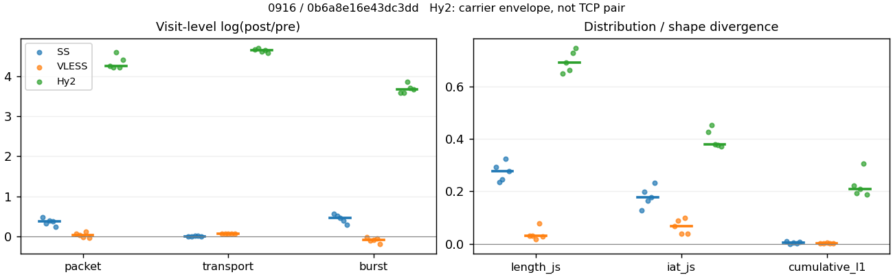
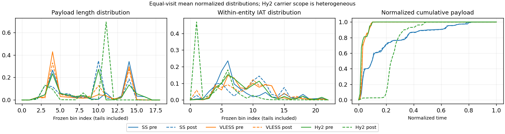

# 0916 · 条目 010 · developer.mozilla.org

目标：https://developer.mozilla.org/en-US/docs/Web/HTTP

活动标签：developer.mozilla.org::document_view。选定访问 15 次。

[返回总索引](../../README.md) · [统计口径](../../methods.md)

## 覆盖与资格（每次访问均保留）

| 部署 | 重复 | 主请求路由 | 活动状态 | 代理比较 | DIRECT pre | 请求 proxy/direct/unresolved | 错误 |
| --- | --- | --- | --- | --- | --- | --- | --- |
| Hy2 | 1 | proxy | passed | 1 | 0 | 75/0/0 | [] |
| Hy2 | 2 | proxy | passed | 1 | 0 | 76/0/0 | [] |
| Hy2 | 3 | proxy | passed | 1 | 0 | 75/0/0 | [] |
| Hy2 | 4 | proxy | passed | 1 | 0 | 75/0/0 | [] |
| Hy2 | 5 | proxy | passed | 1 | 0 | 75/0/0 | [] |
| SS | 1 | proxy | passed | 1 | 0 | 75/0/0 | [] |
| SS | 2 | proxy | passed | 1 | 0 | 75/0/0 | [] |
| SS | 3 | proxy | passed | 1 | 0 | 75/0/0 | [] |
| SS | 4 | proxy | passed | 1 | 0 | 75/0/0 | [] |
| SS | 5 | proxy | passed | 1 | 0 | 75/0/0 | [] |
| VLESS | 1 | proxy | passed | 1 | 0 | 75/0/0 | [] |
| VLESS | 2 | proxy | passed | 1 | 0 | 75/0/0 | [] |
| VLESS | 3 | proxy | passed | 1 | 0 | 75/0/0 | [] |
| VLESS | 4 | proxy | passed | 1 | 0 | 75/0/0 | [] |
| VLESS | 5 | proxy | passed | 1 | 0 | 75/0/0 | [] |

主请求非 proxy 的统计仅解释为已索引的辅助代理连接或 DIRECT 观测，不代表目标业务经代理传输。播放确认与配对资格是两道不同的门。

图中散点为单次访问，短线为重复中位数；Hy2 是共享载体包络，不能与 TCP 配对作等范围因果对比。

形态图先逐访问归一化，再对访问等权平均；实线 pre，虚线 post。分箱序号及边界见 methods，不将分箱索引误解为长度或时间。

## 每次访问的关键观测

### SS

范围：`exclusive_page`。每格 pre → post；空值为不可观测/不适用。

| 重复 | 包数 | 载荷字节 | burst | TCP FR | IAT中位µs | length JS | IAT JS |
| --- | --- | --- | --- | --- | --- | --- | --- |
| 1 | 426 → 686 | 4.5446e+05 → 4.5254e+05 | 290 → 510 | 42 → 42 | 60.861 → 666.07 | 0.29156 | 0.1269 |
| 2 | 502 → 699 | 4.485e+05 → 4.5308e+05 | 317 → 527 | 43 → 53 | 37.208 → 716.71 | 0.23568 | 0.19823 |
| 3 | 510 → 759 | 4.6085e+05 → 4.6735e+05 | 342 → 548 | 43 → 51 | 37.538 → 650.56 | 0.24584 | 0.16352 |
| 4 | 548 → 797 | 4.5195e+05 → 4.6128e+05 | 395 → 583 | 40 → 44 | 34.653 → 474.38 | 0.32495 | 0.1775 |
| 5 | 560 → 716 | 4.6996e+05 → 4.7027e+05 | 415 → 557 | 42 → 44 | 36.879 → 1028.2 | 0.27828 | 0.23365 |

完整标量统计：中位数 [min,max]；Δ 为重复内逐访问变换的中位数，MAD 未缩放。n 为可用变换数；DIRECT-only 的 nΔ=0 不代表 pre 不可用。

| scope | 特征 | pre | post | Δ | IQRΔ | MADΔ | nΔ |
| --- | --- | --- | --- | --- | --- | --- | --- |
| exclusive_page | active_span_sum_s_1000ms | 10.113 [8.6659, 10.502] | 11.381 [9.9498, 12.859] | 0.13815 | 0.15699 | 0.099235 | 5 |
| exclusive_page | active_span_sum_s_100ms | 1.5083 [1.381, 1.7483] | 3.4066 [2.8881, 3.4883] | 0.69495 | 0.12393 | 0.015714 | 5 |
| exclusive_page | active_span_sum_s_500ms | 7.935 [5.5005, 8.4872] | 8.5221 [8.2525, 10.026] | 0.188 | 0.17286 | 0.14876 | 5 |
| exclusive_page | burst_bytes_iqr | 1441.2 [956, 1741.5] | 1428 [1428, 1428] | -0.0092359 | 0.27638 | 0.18924 | 5 |
| exclusive_page | burst_bytes_mad | 39 [17, 64] | 34 [34, 40] | 0.025318 | 0.22957 | 0.16252 | 5 |
| exclusive_page | burst_bytes_max | 20480 [16384, 24576] | 5752 [4284, 7843] | -1.0537 | 0.16473 | 0.016152 | 5 |
| exclusive_page | burst_bytes_mean | 1347.5 [1132.4, 1567.1] | 852.82 [791.22, 887.34] | -0.45747 | 0.12929 | 0.088615 | 5 |
| exclusive_page | burst_bytes_median | 39 [17, 64] | 34 [34, 40] | 0.025318 | 0.22957 | 0.16252 | 5 |
| exclusive_page | burst_bytes_min | 0 [0, 0] | 0 [0, 0] | — | — | — | 0 |
| exclusive_page | burst_bytes_p95 | 8033.6 [4344, 8192] | 2896 [2856, 2926.6] | -1.0203 | 0.57528 | 0.033434 | 5 |
| exclusive_page | burst_bytes_q25 | 0 [0, 0] | 0 [0, 0] | — | — | — | 0 |
| exclusive_page | burst_bytes_q75 | 1441.2 [956, 1741.5] | 1428 [1428, 1428] | -0.0092359 | 0.27638 | 0.18924 | 5 |
| exclusive_page | burst_bytes_std | 2879.2 [2141.7, 3236.1] | 1206.2 [1096.6, 1250.2] | -0.87009 | 0.19826 | 0.1764 | 5 |
| exclusive_page | burst_count | 342 [290, 415] | 548 [510, 583] | 0.47146 | 0.119 | 0.082163 | 5 |
| exclusive_page | burst_duration_ms_iqr | 0.044812 [0, 0.053717] | 0 [0, 0] | — | — | — | 0 |
| exclusive_page | burst_duration_ms_mad | 0 [0, 0] | 0 [0, 0] | — | — | — | 0 |
| exclusive_page | burst_duration_ms_max | 15001 [1053.4, 15001] | 15045 [965.95, 26467] | 0.016767 | 0.088685 | 0.074859 | 5 |
| exclusive_page | burst_duration_ms_mean | 72.749 [25.012, 76.885] | 63.209 [11.455, 93.501] | -0.19587 | 0.37148 | 0.28977 | 5 |
| exclusive_page | burst_duration_ms_median | 0 [0, 0] | 0 [0, 0] | — | — | — | 0 |
| exclusive_page | burst_duration_ms_min | 0 [0, 0] | 0 [0, 0] | — | — | — | 0 |
| exclusive_page | burst_duration_ms_p95 | 203.91 [117.56, 231.87] | 18.562 [17.781, 19.549] | -2.3908 | 0.11592 | 0.10484 | 5 |
| exclusive_page | burst_duration_ms_q25 | 0 [0, 0] | 0 [0, 0] | — | — | — | 0 |
| exclusive_page | burst_duration_ms_q75 | 0.044812 [0, 0.053717] | 0 [0, 0] | — | — | — | 0 |
| exclusive_page | burst_duration_ms_std | 776.42 [98.354, 850.52] | 795.74 [66.534, 1326.5] | -0.03201 | 0.23271 | 0.17048 | 5 |
| exclusive_page | burst_packets_iqr | 1 [0, 1] | 0 [0, 0] | — | — | — | 0 |
| exclusive_page | burst_packets_mad | 0 [0, 0] | 0 [0, 0] | — | — | — | 0 |
| exclusive_page | burst_packets_max | 8 [8, 10] | 9 [8, 11] | 0.11778 | 0.31845 | 0.20067 | 5 |
| exclusive_page | burst_packets_mean | 1.469 [1.3494, 1.5836] | 1.3451 [1.2855, 1.385] | -0.073873 | 0.039548 | 0.02533 | 5 |
| exclusive_page | burst_packets_median | 1 [1, 1] | 1 [1, 1] | 0 | 0 | 0 | 5 |
| exclusive_page | burst_packets_min | 1 [1, 1] | 1 [1, 1] | 0 | 0 | 0 | 5 |
| exclusive_page | burst_packets_p95 | 3 [3, 4] | 3 [3, 3] | 0 | 0 | 0 | 5 |
| exclusive_page | burst_packets_q25 | 1 [1, 1] | 1 [1, 1] | 0 | 0 | 0 | 5 |
| exclusive_page | burst_packets_q75 | 2 [1, 2] | 1 [1, 1] | -0.69315 | 0 | 0 | 5 |
| exclusive_page | burst_packets_std | 0.90721 [0.77977, 1.0701] | 0.91036 [0.84227, 1.0032] | 0.041203 | 0.25744 | 0.11363 | 5 |
| exclusive_page | connection_span_concurrency_max | 3 [2, 4] | 3 [2, 4] | 0 | 0 | 0 | 5 |
| exclusive_page | cumulative_l1 | — | — | 0.0034053 | 0.0075941 | 0.0027826 | 5 |
| exclusive_page | cumulative_max | — | — | 0.079011 | 0.059991 | 0.036114 | 5 |
| exclusive_page | direction_entropy | 0.95927 [0.95191, 0.99152] | 0.6985 [0.64168, 0.73785] | -0.27526 | 0.041446 | 0.031367 | 5 |
| exclusive_page | down_burst_count | 169 [143, 205] | 272 [253, 289] | 0.4759 | 0.11867 | 0.082476 | 5 |
| exclusive_page | down_ip_bytes | 4.4318e+05 [4.4004e+05, 4.5971e+05] | 4.5257e+05 [4.4394e+05, 4.5838e+05] | 0.012778 | 0.013135 | 0.011058 | 5 |
| exclusive_page | down_packets | 282 [225, 290] | 373 [353, 432] | 0.37834 | 0.11887 | 0.088886 | 5 |
| exclusive_page | down_transport_bytes | 4.3144e+05 [4.2534e+05, 4.4464e+05] | 4.2949e+05 [4.2522e+05, 4.3991e+05] | 0.00031709 | 0.012623 | 0.0065659 | 5 |
| exclusive_page | duration_s | 64.475 [5.1804, 65.481] | 64.472 [5.1782, 65.343] | -8.508e-05 | 0.00038094 | 4.745e-05 | 5 |
| exclusive_page | entity_count | 5 [4, 5] | 5 [4, 5] | 0 | 0 | 0 | 5 |
| exclusive_page | fr_runs | 42 [40, 43] | 44 [42, 53] | 0.09531 | 0.12411 | 0.075315 | 5 |
| exclusive_page | fr_runs_per_packet | 0.14527 [0.13514, 0.175] | 0.11892 [0.099773, 0.14171] | -0.024858 | 0.013813 | 0.010504 | 5 |
| exclusive_page | fr_switches | 38 [35, 39] | 39 [38, 49] | 0.10821 | 0.13841 | 0.082842 | 5 |
| exclusive_page | fr_switches_per_possible_transition | 0.13356 [0.12027, 0.16102] | 0.10685 [0.08945, 0.13243] | -0.020623 | 0.011824 | 0.010203 | 5 |
| exclusive_page | full_retransmission_fraction | 0.0054745 [0.0039216, 0.011737] | 0.013175 [0.0043732, 0.017566] | 0.0068236 | 0.0032234 | 0.00243 | 5 |
| exclusive_page | full_retransmission_packets | 3 [2, 5] | 10 [3, 14] | 1.2528 | 0.62415 | 0.33647 | 5 |
| exclusive_page | iat_count | 505 [422, 555] | 711 [682, 792] | 0.37745 | 0.067522 | 0.04414 | 5 |
| exclusive_page | iat_js | — | — | 0.1775 | 0.034708 | 0.020731 | 5 |
| exclusive_page | iat_ks | — | — | 0.35742 | 0.041291 | 0.033997 | 5 |
| exclusive_page | iat_median_us | 37.208 [34.653, 60.861] | 666.07 [474.38, 1028.2] | 2.8525 | 0.34151 | 0.23584 | 5 |
| exclusive_page | iat_us_iqr | 499.3 [150.41, 993.57] | 3094.4 [1931.2, 3480.2] | 1.8241 | 0.77527 | 0.7284 | 5 |
| exclusive_page | iat_us_mad | 29.006 [27.428, 50.9] | 656.26 [463.88, 1015.3] | 3.0572 | 0.36483 | 0.22983 | 5 |
| exclusive_page | iat_us_max | 1.5001e+07 [1.0534e+06, 1.5001e+07] | 1.5328e+07 [9.6595e+05, 1.5385e+07] | 0.021539 | 0.021472 | 0.0037592 | 5 |
| exclusive_page | iat_us_mean | 2.4239e+05 [23032, 2.5507e+05] | 1.6604e+05 [14589, 1.8275e+05] | -0.37829 | 0.06796 | 0.044868 | 5 |
| exclusive_page | iat_us_median | 37.208 [34.653, 60.861] | 666.07 [474.38, 1028.2] | 2.8525 | 0.34151 | 0.23584 | 5 |
| exclusive_page | iat_us_min | 0.202 [0.034, 1.212] | 0.037 [0.035, 0.038] | -1.6973 | 1.627 | 0.95014 | 5 |
| exclusive_page | iat_us_p95 | 2.4806e+05 [1.9714e+05, 3.2363e+05] | 93788 [43595, 1.3778e+05] | -1.0857 | 0.24327 | 0.2318 | 5 |
| exclusive_page | iat_us_q25 | 14.725 [12.363, 20.335] | 22.346 [16.154, 28.884] | 0.42721 | 0.50435 | 0.24651 | 5 |
| exclusive_page | iat_us_q75 | 513.93 [162.77, 1013.9] | 3116.8 [1953.5, 3509.1] | 1.8025 | 0.72972 | 0.68258 | 5 |
| exclusive_page | iat_us_std | 1.7242e+06 [88976, 1.7888e+06] | 1.4326e+06 [62940, 1.522e+06] | -0.18949 | 0.038396 | 0.028025 | 5 |
| exclusive_page | iat_wasserstein_log1p_us | — | — | 1.37 | 0.18179 | 0.17572 | 5 |
| exclusive_page | idle_gap_count_1000ms | 11 [1, 14] | 11 [0, 12] | -0.12058 | 0.15172 | 0.077075 | 4 |
| exclusive_page | idle_gap_count_100ms | 33 [28, 37] | 35 [27, 39] | 0.052644 | 0.12598 | 0.089011 | 5 |
| exclusive_page | idle_gap_count_500ms | 13 [2, 19] | 13 [2, 17] | -0.11123 | 0.11778 | 0.013938 | 5 |
| exclusive_page | idle_gap_sum_s_1000ms | 115.87 [1.0534, 122.64] | 114.92 [0, 119.43] | -0.017367 | 0.10414 | 0.012715 | 4 |
| exclusive_page | idle_gap_sum_s_100ms | 124.99 [8.255, 130.11] | 123.13 [7.0616, 128.1] | -0.015559 | 0.095819 | 0.0016339 | 5 |
| exclusive_page | idle_gap_sum_s_500ms | 118.54 [1.7843, 126.12] | 117.61 [1.6973, 123.06] | -0.024527 | 0.035404 | 0.024112 | 5 |
| exclusive_page | ip_bytes | 4.8056e+05 [4.747e+05, 4.9921e+05] | 5.0799e+05 [4.9218e+05, 5.1256e+05] | 0.039677 | 0.016247 | 0.0084436 | 5 |
| exclusive_page | length_iqr | 2804 [2804, 2808.2] | 1329 [1140, 1343] | -0.74769 | 0.078953 | 0.011548 | 5 |
| exclusive_page | length_js | — | — | 0.27828 | 0.04572 | 0.032441 | 5 |
| exclusive_page | length_ks | — | — | 0.39085 | 0.023999 | 0.0021576 | 5 |
| exclusive_page | length_mad | 1365 [680, 1373.5] | 1097 [895, 1208] | -0.14509 | 0.10164 | 0.07874 | 5 |
| exclusive_page | length_max | 8920 [4745, 8920] | 2856 [2856, 4284] | -1.1389 | 0.4906 | 0 | 5 |
| exclusive_page | length_mean | 1571.8 [1515.2, 1893.6] | 1211.4 [1046, 1271] | -0.33597 | 0.1545 | 0.076497 | 5 |
| exclusive_page | length_median | 1448 [744, 1448] | 1428 [1428, 1428] | -0.013908 | 0.064907 | 0 | 5 |
| exclusive_page | length_min | 31 [17, 31] | 20 [10, 20] | -0.43825 | 0.092373 | 0 | 5 |
| exclusive_page | length_p95 | 2916.8 [2896, 8192] | 2856 [2856, 2856] | -0.021065 | 0.34668 | 0.0071567 | 5 |
| exclusive_page | length_q25 | 92 [87.75, 92] | 105 [86, 288] | 0.13217 | 0.7469 | 0.19961 | 5 |
| exclusive_page | length_q75 | 2896 [2896, 2896] | 1428 [1428, 1448] | -0.70706 | 0.013908 | 0 | 5 |
| exclusive_page | length_std | 1643.9 [1325.5, 2486.9] | 992.35 [898.26, 1017.7] | -0.53256 | 0.16049 | 0.14349 | 5 |
| exclusive_page | length_wasserstein_bytes | — | — | 603.96 | 120.03 | 115.56 | 5 |
| exclusive_page | nonempty_entity_count | 5 [4, 5] | 5 [4, 5] | 0 | 0 | 0 | 5 |
| exclusive_page | nonempty_packets | 296 [240, 299] | 374 [361, 441] | 0.34996 | 0.16479 | 0.058277 | 5 |
| exclusive_page | offload_suspect_fraction | 0.2451 [0.22066, 0.27092] | 0.11858 [0.080301, 0.12828] | -0.12652 | 0.022047 | 0.018501 | 5 |
| exclusive_page | packet_count | 510 [426, 560] | 716 [686, 797] | 0.37458 | 0.06654 | 0.043529 | 5 |
| exclusive_page | rtt_median_ms | 0.06472 [0.042755, 0.081757] | 32.225 [31.946, 33.761] | 6.2104 | 0.50998 | 0.24239 | 5 |
| exclusive_page | rtt_sample_count | 201 [179, 245] | 154 [153, 171] | -0.20344 | 0.21653 | 0.15772 | 5 |
| exclusive_page | tcp_ack_count | 505 [422, 555] | 710 [682, 791] | 0.37619 | 0.067522 | 0.042877 | 5 |
| exclusive_page | tcp_fin_count | 9 [7, 10] | 9 [8, 13] | 0.11778 | 0.13353 | 0.11778 | 5 |
| exclusive_page | tcp_packet_count | 510 [426, 560] | 716 [686, 797] | 0.37458 | 0.06654 | 0.043529 | 5 |
| exclusive_page | tcp_rst_count | 0 [0, 0] | 0 [0, 0] | — | — | — | 0 |
| exclusive_page | tcp_syn_count | 10 [8, 10] | 10 [8, 11] | 0 | 0.09531 | 0 | 5 |
| exclusive_page | tcp_window_raw_median | 65348 [65272, 65471] | 143 [135, 144] | -6.1242 | 0.026283 | 0.0076885 | 5 |
| exclusive_page | transition_entropy | 0.55457 [0.51958, 0.63126] | 0.44242 [0.38096, 0.47961] | -0.10992 | 0.046975 | 0.028694 | 5 |
| exclusive_page | transition_n_mm | 164 [112, 167] | 287 [267, 346] | 0.71321 | 0.19304 | 0.15554 | 5 |
| exclusive_page | transition_n_mp | 17 [16, 18] | 18 [17, 23] | 0.11778 | 0.15415 | 0.093526 | 5 |
| exclusive_page | transition_n_pm | 21 [19, 21] | 21 [21, 26] | 0.10008 | 0.12556 | 0.07427 | 5 |
| exclusive_page | transition_n_pp | 90 [86, 93] | 51 [34, 54] | -0.58996 | 0.10975 | 0.079137 | 5 |
| exclusive_page | transition_p_mm | 0.90164 [0.86822, 0.91111] | 0.93793 [0.92581, 0.95055] | 0.038015 | 0.009116 | 0.0076925 | 5 |
| exclusive_page | transition_p_mp | 0.098361 [0.088889, 0.13178] | 0.062069 [0.049451, 0.074194] | -0.038015 | 0.009116 | 0.0076925 | 5 |
| exclusive_page | transition_p_pm | 0.18421 [0.17117, 0.19626] | 0.29167 [0.28, 0.43333] | 0.1205 | 0.050941 | 0.028627 | 5 |
| exclusive_page | transition_p_pp | 0.81579 [0.80374, 0.82883] | 0.70833 [0.56667, 0.72] | -0.1205 | 0.050941 | 0.028627 | 5 |
| exclusive_page | transport_bytes | 4.5446e+05 [4.485e+05, 4.6996e+05] | 4.6128e+05 [4.5254e+05, 4.7027e+05] | 0.010153 | 0.013342 | 0.0095003 | 5 |
| exclusive_page | up_burst_count | 173 [147, 210] | 276 [257, 294] | 0.46711 | 0.11929 | 0.081847 | 5 |
| exclusive_page | up_byte_fraction | 0.053889 [0.050645, 0.056208] | 0.064569 [0.059422, 0.068923] | 0.01068 | 0.0029701 | 0.0020352 | 5 |
| exclusive_page | up_ip_bytes | 38049 [33560, 39506] | 54177 [48215, 55421] | 0.35409 | 0.032736 | 0.020781 | 5 |
| exclusive_page | up_packets | 236 [201, 271] | 359 [326, 365] | 0.39327 | 0.072553 | 0.046332 | 5 |
| exclusive_page | up_transport_bytes | 25326 [23016, 25713] | 30365 [26923, 32070] | 0.18146 | 0.049166 | 0.031121 | 5 |
| exclusive_page | zero_iat_count | 0 [0, 0] | 0 [0, 0] | — | — | — | 0 |
| exclusive_page | zero_iat_fraction | 0 [0, 0] | 0 [0, 0] | 0 | 0 | 0 | 5 |

### VLESS

范围：`exclusive_page`。每格 pre → post；空值为不可观测/不适用。

| 重复 | 包数 | 载荷字节 | burst | TCP FR | IAT中位µs | length JS | IAT JS |
| --- | --- | --- | --- | --- | --- | --- | --- |
| 1 | 614 → 661 | 4.4023e+05 → 4.7093e+05 | 412 → 406 | 44 → 52 | 166.39 → 448.77 | 0.030045 | 0.066577 |
| 2 | 639 → 665 | 4.4005e+05 → 4.692e+05 | 460 → 416 | 40 → 48 | 170.77 → 532.31 | 0.029594 | 0.088967 |
| 3 | 700 → 685 | 4.4473e+05 → 4.776e+05 | 472 → 432 | 52 → 58 | 189.97 → 599.19 | 0.017686 | 0.039609 |
| 4 | 713 → 801 | 4.4463e+05 → 4.7664e+05 | 528 → 502 | 44 → 52 | 172.31 → 294.98 | 0.078106 | 0.099155 |
| 5 | 729 → 708 | 4.4762e+05 → 4.7834e+05 | 544 → 455 | 60 → 68 | 145.94 → 453.06 | 0.029208 | 0.037941 |

完整标量统计：中位数 [min,max]；Δ 为重复内逐访问变换的中位数，MAD 未缩放。n 为可用变换数；DIRECT-only 的 nΔ=0 不代表 pre 不可用。

| scope | 特征 | pre | post | Δ | IQRΔ | MADΔ | nΔ |
| --- | --- | --- | --- | --- | --- | --- | --- |
| exclusive_page | active_span_sum_s_1000ms | 7.7189 [7.3013, 9.1241] | 7.4365 [6.9551, 8.6831] | -0.034587 | 0.018154 | 0.014956 | 5 |
| exclusive_page | active_span_sum_s_100ms | 1.2661 [1.1179, 1.4464] | 2.7993 [2.4649, 3.0694] | 0.78577 | 0.0073713 | 0.0049453 | 5 |
| exclusive_page | active_span_sum_s_500ms | 4.2019 [3.7145, 4.4101] | 6.9551 [6.0557, 7.2042] | 0.4816 | 0.01454 | 0.0073967 | 5 |
| exclusive_page | burst_bytes_iqr | 1868 [1448, 2732.5] | 2824 [2004, 2824] | 0.3004 | 0.23887 | 0.12598 | 5 |
| exclusive_page | burst_bytes_mad | 35 [27.5, 70.5] | 72 [72, 72] | 0.72132 | 0.7249 | 0.24116 | 5 |
| exclusive_page | burst_bytes_max | 13129 [5720, 23584] | 4832 [3946, 9030] | -0.96002 | 0.51513 | 0.27303 | 5 |
| exclusive_page | burst_bytes_mean | 942.22 [822.83, 1068.5] | 1105.6 [949.48, 1159.9] | 0.15987 | 0.044651 | 0.039849 | 5 |
| exclusive_page | burst_bytes_median | 35 [27.5, 70.5] | 72 [72, 72] | 0.72132 | 0.7249 | 0.24116 | 5 |
| exclusive_page | burst_bytes_min | 0 [0, 0] | 0 [0, 0] | — | — | — | 0 |
| exclusive_page | burst_bytes_p95 | 2896 [2896, 4627.2] | 2896 [2896, 2968] | 0 | 0 | 0 | 5 |
| exclusive_page | burst_bytes_q25 | 0 [0, 0] | 0 [0, 0] | — | — | — | 0 |
| exclusive_page | burst_bytes_q75 | 1868 [1448, 2732.5] | 2824 [2004, 2824] | 0.3004 | 0.23887 | 0.12598 | 5 |
| exclusive_page | burst_bytes_std | 1500.6 [1322.1, 1899.3] | 1260.3 [1222.3, 1425.1] | -0.2051 | 0.1249 | 0.073271 | 5 |
| exclusive_page | burst_count | 472 [412, 544] | 432 [406, 502] | -0.088553 | 0.050045 | 0.038057 | 5 |
| exclusive_page | burst_duration_ms_iqr | 0.17132 [0.033809, 0.96952] | 1.0195 [0.49444, 2.6659] | 2.2771 | 1.2123 | 1.0922 | 5 |
| exclusive_page | burst_duration_ms_mad | 0 [0, 0] | 0 [0, 0] | — | — | — | 0 |
| exclusive_page | burst_duration_ms_max | 1579.8 [1000.7, 15000] | 15028 [15023, 15046] | 2.2527 | 0.28282 | 0.14646 | 5 |
| exclusive_page | burst_duration_ms_mean | 18.548 [15.283, 42.89] | 48.438 [40.394, 53.268] | 1.055 | 0.35402 | 0.038011 | 5 |
| exclusive_page | burst_duration_ms_median | 0 [0, 0] | 0 [0, 0] | — | — | — | 0 |
| exclusive_page | burst_duration_ms_min | 0 [0, 0] | 0 [0, 0] | — | — | — | 0 |
| exclusive_page | burst_duration_ms_p95 | 10.002 [8.5278, 15.168] | 97.578 [9.7126, 114.4] | 1.918 | 0.85187 | 0.47622 | 5 |
| exclusive_page | burst_duration_ms_q25 | 0 [0, 0] | 0 [0, 0] | — | — | — | 0 |
| exclusive_page | burst_duration_ms_q75 | 0.17132 [0.033809, 0.96952] | 1.0195 [0.49444, 2.6659] | 2.2771 | 1.2123 | 1.0922 | 5 |
| exclusive_page | burst_duration_ms_std | 114.83 [91.94, 657.9] | 723.67 [671.73, 746] | 1.8665 | 0.23917 | 0.19672 | 5 |
| exclusive_page | burst_packets_iqr | 1 [1, 1] | 1 [1, 1] | 0 | 0 | 0 | 5 |
| exclusive_page | burst_packets_mad | 0 [0, 0] | 0 [0, 0] | — | — | — | 0 |
| exclusive_page | burst_packets_max | 7 [5, 14] | 9 [7, 11] | 0 | 0.55735 | 0.33647 | 5 |
| exclusive_page | burst_packets_mean | 1.3891 [1.3401, 1.4903] | 1.5956 [1.556, 1.6281] | 0.14042 | 0.060993 | 0.026452 | 5 |
| exclusive_page | burst_packets_median | 1 [1, 1] | 1 [1, 1] | 0 | 0 | 0 | 5 |
| exclusive_page | burst_packets_min | 1 [1, 1] | 1 [1, 1] | 0 | 0 | 0 | 5 |
| exclusive_page | burst_packets_p95 | 2 [2, 3] | 3 [3, 4] | 0.40547 | 0.11778 | 0 | 5 |
| exclusive_page | burst_packets_q25 | 1 [1, 1] | 1 [1, 1] | 0 | 0 | 0 | 5 |
| exclusive_page | burst_packets_q75 | 2 [2, 2] | 2 [2, 2] | 0 | 0 | 0 | 5 |
| exclusive_page | burst_packets_std | 0.75651 [0.64746, 0.87644] | 0.96442 [0.88246, 1.118] | 0.25167 | 0.047114 | 0.0088645 | 5 |
| exclusive_page | connection_span_concurrency_max | 3 [3, 4] | 3 [3, 4] | 0 | 0 | 0 | 5 |
| exclusive_page | cumulative_l1 | — | — | 0.0015073 | 0.0017233 | 0.00056941 | 5 |
| exclusive_page | cumulative_max | — | — | 0.028911 | 0.12025 | 0.0056059 | 5 |
| exclusive_page | direction_entropy | 0.81234 [0.78062, 0.86155] | 0.63851 [0.58424, 0.67431] | -0.18724 | 0.028521 | 0.017426 | 5 |
| exclusive_page | down_burst_count | 234 [204, 270] | 214 [201, 249] | -0.089345 | 0.050578 | 0.038453 | 5 |
| exclusive_page | down_ip_bytes | 4.4626e+05 [4.376e+05, 4.472e+05] | 4.7149e+05 [4.63e+05, 4.7396e+05] | 0.055077 | 0.0035256 | 0.0021807 | 5 |
| exclusive_page | down_packets | 397 [353, 413] | 406 [384, 450] | 0.077063 | 0.061924 | 0.048248 | 5 |
| exclusive_page | down_transport_bytes | 4.2549e+05 [4.1921e+05, 4.2637e+05] | 4.5021e+05 [4.43e+05, 4.5117e+05] | 0.055193 | 0.002565 | 0.00177 | 5 |
| exclusive_page | duration_s | 62.266 [62.019, 62.904] | 62.023 [62.014, 62.686] | -0.00064862 | 0.003202 | 0.00071462 | 5 |
| exclusive_page | entity_count | 4 [4, 4] | 4 [4, 4] | 0 | 0 | 0 | 5 |
| exclusive_page | fr_runs | 44 [40, 60] | 52 [48, 68] | 0.16705 | 0.041891 | 0.015267 | 5 |
| exclusive_page | fr_runs_per_packet | 0.12155 [0.10732, 0.14563] | 0.13368 [0.11556, 0.16307] | 0.015577 | 0.0053093 | 0.0024752 | 5 |
| exclusive_page | fr_switches | 40 [36, 56] | 48 [44, 64] | 0.18232 | 0.04879 | 0.018349 | 5 |
| exclusive_page | fr_switches_per_possible_transition | 0.11173 [0.098093, 0.13725] | 0.12468 [0.10762, 0.15496] | 0.016193 | 0.0047653 | 0.0018076 | 5 |
| exclusive_page | full_retransmission_fraction | 0.0013717 [0, 0.0031299] | 0 [0, 0.0015038] | -0.0013717 | 0.0016261 | 0.00025692 | 5 |
| exclusive_page | full_retransmission_packets | 1 [0, 2] | 0 [0, 1] | -0.69315 | — | — | 1 |
| exclusive_page | iat_count | 696 [610, 725] | 681 [657, 797] | 0.040129 | 0.096012 | 0.061916 | 5 |
| exclusive_page | iat_js | — | — | 0.066577 | 0.049358 | 0.026968 | 5 |
| exclusive_page | iat_ks | — | — | 0.11659 | 0.045446 | 0.033009 | 5 |
| exclusive_page | iat_median_us | 170.77 [145.94, 189.97] | 453.06 [294.98, 599.19] | 1.1328 | 0.14474 | 0.015915 | 5 |
| exclusive_page | iat_us_iqr | 1719.8 [1075.4, 2311.7] | 2461.7 [2143.3, 3991.7] | 0.46876 | 0.2559 | 0.1784 | 5 |
| exclusive_page | iat_us_mad | 163.64 [139.99, 183.19] | 441.97 [294.62, 584.79] | 1.1481 | 0.14136 | 0.018587 | 5 |
| exclusive_page | iat_us_max | 1.5001e+07 [1.5001e+07, 1.5001e+07] | 1.5312e+07 [1.5297e+07, 1.5429e+07] | 0.020549 | 0.0049921 | 0.0010121 | 5 |
| exclusive_page | iat_us_mean | 92437 [90153, 1.0942e+05] | 92857 [81480, 1.0095e+05] | -0.046144 | 0.089931 | 0.055527 | 5 |
| exclusive_page | iat_us_median | 170.77 [145.94, 189.97] | 453.06 [294.98, 599.19] | 1.1328 | 0.14474 | 0.015915 | 5 |
| exclusive_page | iat_us_min | 0.286 [0.209, 1.523] | 0.038 [0.032, 0.061] | -1.7047 | 1.4506 | 0.20723 | 5 |
| exclusive_page | iat_us_p95 | 25903 [10269, 34804] | 58586 [46657, 80583] | 0.89767 | 0.55432 | 0.37691 | 5 |
| exclusive_page | iat_us_q25 | 32.964 [32.738, 43.436] | 21.739 [11.134, 49.697] | -0.41356 | 0.98963 | 0.52685 | 5 |
| exclusive_page | iat_us_q75 | 1763.2 [1108.4, 2352.1] | 2483.5 [2154.5, 4007.5] | 0.45643 | 0.24031 | 0.16387 | 5 |
| exclusive_page | iat_us_std | 1.0648e+06 [1.0343e+06, 1.1374e+06] | 1.0795e+06 [1.0038e+06, 1.1224e+06] | -0.013263 | 0.031084 | 0.027491 | 5 |
| exclusive_page | iat_wasserstein_log1p_us | — | — | 0.62281 | 0.059568 | 0.04242 | 5 |
| exclusive_page | idle_gap_count_1000ms | 6 [4, 7] | 5 [4, 7] | 0 | 0.18232 | 0 | 5 |
| exclusive_page | idle_gap_count_100ms | 25 [23, 26] | 28 [24, 28] | 0.11333 | 0.070769 | 0 | 5 |
| exclusive_page | idle_gap_count_500ms | 11 [10, 12] | 6 [6, 7] | -0.539 | 0.09531 | 0.028171 | 5 |
| exclusive_page | idle_gap_sum_s_1000ms | 57.642 [56.414, 59.396] | 58.026 [55.799, 59.248] | -0.0027926 | 0.00060216 | 0.00030808 | 5 |
| exclusive_page | idle_gap_sum_s_100ms | 64.302 [62.746, 65.63] | 62.229 [60.436, 63.862] | -0.03234 | 0.0013473 | 0.00090879 | 5 |
| exclusive_page | idle_gap_sum_s_500ms | 61.128 [60.31, 62.842] | 58.026 [57.18, 59.525] | -0.053301 | 0.0038315 | 0.0027852 | 5 |
| exclusive_page | ip_bytes | 4.8109e+05 [4.7214e+05, 4.8552e+05] | 5.1339e+05 [5.0397e+05, 5.1913e+05] | 0.064977 | 0.0055211 | 0.0033968 | 5 |
| exclusive_page | length_iqr | 2752 [2485.5, 2752] | 2752 [1340, 2752] | 0 | 0 | 0 | 5 |
| exclusive_page | length_js | — | — | 0.029594 | 0.00083732 | 0.00045163 | 5 |
| exclusive_page | length_ks | — | — | 0.10894 | 0.020363 | 0.019706 | 5 |
| exclusive_page | length_mad | 151.5 [119, 308.5] | 759 [595, 1116] | 1.6094 | 0.60494 | 0.38748 | 5 |
| exclusive_page | length_max | 3253 [2896, 8920] | 2824 [2824, 2896] | -0.14142 | 0.66797 | 0.14142 | 5 |
| exclusive_page | length_mean | 1086.5 [1061.4, 1216.1] | 1170.6 [1059.2, 1210.6] | 0.016753 | 0.058828 | 0.037559 | 5 |
| exclusive_page | length_median | 185 [150, 344.5] | 831 [667, 1208] | 1.4922 | 0.54435 | 0.37862 | 5 |
| exclusive_page | length_min | 24 [24, 24] | 24 [12, 24] | 0 | 0 | 0 | 5 |
| exclusive_page | length_p95 | 2824 [2824, 2896] | 2824 [2824, 2824] | 0 | 0.025176 | 0 | 5 |
| exclusive_page | length_q25 | 72 [72, 72] | 72 [72, 72] | 0 | 0 | 0 | 5 |
| exclusive_page | length_q75 | 2824 [2557.5, 2824] | 2824 [1412, 2824] | 0 | 0 | 0 | 5 |
| exclusive_page | length_std | 1190.4 [1160.4, 1333.6] | 1134.2 [979.74, 1200.3] | -0.10534 | 0.074791 | 0.065166 | 5 |
| exclusive_page | length_wasserstein_bytes | — | — | 120.29 | 17.526 | 9.23 | 5 |
| exclusive_page | nonempty_entity_count | 4 [4, 4] | 4 [4, 4] | 0 | 0 | 0 | 5 |
| exclusive_page | nonempty_packets | 410 [362, 419] | 408 [389, 450] | 0.047377 | 0.059872 | 0.035314 | 5 |
| exclusive_page | offload_suspect_fraction | 0.18373 [0.17286, 0.21909] | 0.17664 [0.10487, 0.20301] | -0.016085 | 0.0066676 | 0.0058374 | 5 |
| exclusive_page | packet_count | 700 [614, 729] | 685 [661, 801] | 0.039883 | 0.09542 | 0.061544 | 5 |
| exclusive_page | rtt_median_ms | 0.12777 [0.07834, 0.35111] | 1.5783 [0.59039, 3.0544] | 2.2153 | 0.64585 | 0.49149 | 5 |
| exclusive_page | rtt_sample_count | 264 [232, 301] | 271 [256, 310] | 0.039846 | 0.043976 | 0.0303 | 5 |
| exclusive_page | tcp_ack_count | 688 [602, 718] | 681 [657, 797] | 0.052807 | 0.097653 | 0.063034 | 5 |
| exclusive_page | tcp_fin_count | 8 [7, 8] | 8 [8, 8] | 0 | 0 | 0 | 5 |
| exclusive_page | tcp_packet_count | 700 [614, 729] | 685 [661, 801] | 0.039883 | 0.09542 | 0.061544 | 5 |
| exclusive_page | tcp_rst_count | 8 [7, 8] | 0 [0, 1] | -1.9459 | — | — | 1 |
| exclusive_page | tcp_syn_count | 8 [8, 8] | 8 [8, 8] | 0 | 0 | 0 | 5 |
| exclusive_page | tcp_window_raw_median | 65535 [65471, 65535] | 162 [157, 189] | -6.0027 | 0.10789 | 0.031351 | 5 |
| exclusive_page | transition_entropy | 0.47407 [0.42982, 0.53663] | 0.47047 [0.41053, 0.5248] | -0.007026 | 0.012987 | 0.0081893 | 5 |
| exclusive_page | transition_n_mm | 276 [237, 296] | 313 [294, 361] | 0.17063 | 0.089717 | 0.044894 | 5 |
| exclusive_page | transition_n_mp | 18 [16, 26] | 22 [20, 30] | 0.20067 | 0.05757 | 0.022473 | 5 |
| exclusive_page | transition_n_pm | 22 [20, 30] | 26 [24, 34] | 0.16705 | 0.041891 | 0.015267 | 5 |
| exclusive_page | transition_n_pp | 76 [71, 81] | 37 [35, 43] | -0.73289 | 0.083349 | 0.014327 | 5 |
| exclusive_page | transition_p_mm | 0.93082 [0.91391, 0.94161] | 0.93038 [0.91254, 0.94256] | -0.0013708 | 0.0039235 | 0.0023388 | 5 |
| exclusive_page | transition_p_mp | 0.069182 [0.058394, 0.086093] | 0.06962 [0.057441, 0.087464] | 0.0013708 | 0.0039235 | 0.0023388 | 5 |
| exclusive_page | transition_p_pm | 0.22222 [0.21359, 0.28302] | 0.4127 [0.37681, 0.48571] | 0.19048 | 0.020373 | 0.012219 | 5 |
| exclusive_page | transition_p_pp | 0.77778 [0.71698, 0.78641] | 0.5873 [0.51429, 0.62319] | -0.19048 | 0.020373 | 0.012219 | 5 |
| exclusive_page | transport_bytes | 4.4463e+05 [4.4005e+05, 4.4762e+05] | 4.7664e+05 [4.692e+05, 4.7834e+05] | 0.067419 | 0.0031491 | 0.0021051 | 5 |
| exclusive_page | up_burst_count | 238 [208, 274] | 218 [205, 253] | -0.087776 | 0.049523 | 0.037669 | 5 |
| exclusive_page | up_byte_fraction | 0.043245 [0.041309, 0.047737] | 0.055343 [0.054304, 0.059308] | 0.011948 | 0.00052737 | 0.00037646 | 5 |
| exclusive_page | up_ip_bytes | 34535 [32542, 38320] | 42546 [39891, 45175] | 0.20362 | 0.022154 | 0.017161 | 5 |
| exclusive_page | up_packets | 287 [261, 329] | 279 [274, 351] | -0.010889 | 0.087768 | 0.070386 | 5 |
| exclusive_page | up_transport_bytes | 19232 [18178, 21252] | 26432 [25479, 28135] | 0.31555 | 0.033535 | 0.02209 | 5 |
| exclusive_page | zero_iat_count | 0 [0, 0] | 0 [0, 0] | — | — | — | 0 |
| exclusive_page | zero_iat_fraction | 0 [0, 0] | 0 [0, 0] | 0 | 0 | 0 | 5 |

### Hy2

范围：`carrier_context_envelope`。每格 pre → post；空值为不可观测/不适用。

| 重复 | 包数 | 载荷字节 | burst | TCP FR | IAT中位µs | length JS | IAT JS |
| --- | --- | --- | --- | --- | --- | --- | --- |
| 1 | 630 → 44473 | 4.4866e+05 → 4.7658e+07 | 433 → 15654 | — | 138.55 → 3.8415 | 0.64936 | 0.4256 |
| 2 | 663 → 45207 | 4.4654e+05 → 4.8742e+07 | 431 → 15607 | — | 217.74 → 4.0435 | 0.69157 | 0.4529 |
| 3 | 447 → 44613 | 4.7758e+05 → 4.8132e+07 | 328 → 15550 | — | 65.106 → 3.6015 | 0.66238 | 0.37864 |
| 4 | 630 → 42852 | 4.4405e+05 → 4.661e+07 | 413 → 16666 | — | 268.17 → 12.035 | 0.72785 | 0.37724 |
| 5 | 518 → 42178 | 4.654e+05 → 4.5312e+07 | 374 → 14627 | — | 91.49 → 4.552 | 0.74525 | 0.3702 |

完整标量统计：中位数 [min,max]；Δ 为重复内逐访问变换的中位数，MAD 未缩放。n 为可用变换数；DIRECT-only 的 nΔ=0 不代表 pre 不可用。

| scope | 特征 | pre | post | Δ | IQRΔ | MADΔ | nΔ |
| --- | --- | --- | --- | --- | --- | --- | --- |
| carrier_context_envelope | active_span_sum_s_1000ms | 6.9193 [6.1215, 7.8087] | 22.16 [16.73, 23.053] | 1.0826 | 0.2741 | 0.20391 | 5 |
| carrier_context_envelope | active_span_sum_s_100ms | 1.058 [0.67931, 1.6671] | 6.7881 [6.5223, 10.024] | 2.0906 | 0.56571 | 0.21121 | 5 |
| carrier_context_envelope | active_span_sum_s_500ms | 5.0293 [4.6442, 6.5567] | 18.375 [15.243, 19.745] | 1.1749 | 0.27171 | 0.12917 | 5 |
| carrier_context_envelope | burst_bytes_iqr | 1404 [422, 1565.5] | 5068 [4193, 5115] | 1.1795 | 0.71858 | 0.085374 | 5 |
| carrier_context_envelope | burst_bytes_mad | 39 [15.5, 64] | 267 [181, 367] | 1.9199 | 0.40678 | 0.23333 | 5 |
| carrier_context_envelope | burst_bytes_max | 23161 [17203, 28523] | 2.147e+05 [50088, 2.6768e+05] | 2.2391 | 0.54884 | 0.16735 | 5 |
| carrier_context_envelope | burst_bytes_mean | 1075.2 [1036.1, 1456] | 3095.3 [2796.7, 3123.1] | 0.95595 | 0.16573 | 0.12183 | 5 |
| carrier_context_envelope | burst_bytes_median | 39 [15.5, 64] | 300 [214, 400] | 2.0369 | 0.43721 | 0.23291 | 5 |
| carrier_context_envelope | burst_bytes_min | 0 [0, 0] | 22 [22, 25] | — | — | — | 0 |
| carrier_context_envelope | burst_bytes_p95 | 5123.2 [4056.5, 8564.1] | 10932 [9497.8, 10932] | 0.70542 | 0.33648 | 0.24834 | 5 |
| carrier_context_envelope | burst_bytes_q25 | 0 [0, 0] | 76 [38, 100] | — | — | — | 0 |
| carrier_context_envelope | burst_bytes_q75 | 1404 [422, 1565.5] | 5168 [4290, 5168] | 1.1943 | 0.7185 | 0.078873 | 5 |
| carrier_context_envelope | burst_bytes_std | 2336.8 [2157.7, 4075.7] | 5530.5 [3676.9, 6340.1] | 0.52098 | 0.37887 | 0.079115 | 5 |
| carrier_context_envelope | burst_count | 413 [328, 433] | 15607 [14627, 16666] | 3.6664 | 0.10831 | 0.077002 | 5 |
| carrier_context_envelope | burst_duration_ms_iqr | 0.82852 [0, 1.0508] | 0.023962 [0.015268, 0.024689] | -3.5939 | 1.2157 | 0.3442 | 4 |
| carrier_context_envelope | burst_duration_ms_mad | 0 [0, 0] | 4.5e-05 [4.3e-05, 5e-05] | — | — | — | 0 |
| carrier_context_envelope | burst_duration_ms_max | 2374.7 [722.76, 15001] | 10001 [643.91, 10265] | -0.11551 | 1.8434 | 1.5794 | 5 |
| carrier_context_envelope | burst_duration_ms_mean | 24.539 [14.089, 74.15] | 0.95345 [0.32503, 2.1114] | -3.5587 | 0.67454 | 0.46402 | 5 |
| carrier_context_envelope | burst_duration_ms_median | 0 [0, 0] | 4.5e-05 [4.3e-05, 5e-05] | — | — | — | 0 |
| carrier_context_envelope | burst_duration_ms_min | 0 [0, 0] | 0 [0, 0] | — | — | — | 0 |
| carrier_context_envelope | burst_duration_ms_p95 | 68.686 [46.112, 187.49] | 0.089947 [0.076258, 0.63507] | -6.6381 | 1.2876 | 0.91483 | 5 |
| carrier_context_envelope | burst_duration_ms_q25 | 0 [0, 0] | 0 [0, 0] | — | — | — | 0 |
| carrier_context_envelope | burst_duration_ms_q75 | 0.82852 [0, 1.0508] | 0.023962 [0.015268, 0.024689] | -3.5939 | 1.2157 | 0.3442 | 4 |
| carrier_context_envelope | burst_duration_ms_std | 171.05 [70.609, 845.79] | 77.975 [7.9443, 115.38] | -1.9921 | 1.6599 | 1.4665 | 5 |
| carrier_context_envelope | burst_packets_iqr | 1 [0, 1] | 3 [2, 3] | 0.89588 | 0.40547 | 0.20273 | 4 |
| carrier_context_envelope | burst_packets_mad | 0 [0, 0] | 1 [1, 1] | — | — | — | 0 |
| carrier_context_envelope | burst_packets_max | 8 [6, 11] | 160 [36, 192] | 2.8779 | 0.95098 | 0.55065 | 5 |
| carrier_context_envelope | burst_packets_mean | 1.455 [1.3628, 1.5383] | 2.869 [2.5712, 2.8966] | 0.66917 | 0.10044 | 0.064136 | 5 |
| carrier_context_envelope | burst_packets_median | 1 [1, 1] | 2 [2, 2] | 0.69315 | 0 | 0 | 5 |
| carrier_context_envelope | burst_packets_min | 1 [1, 1] | 1 [1, 1] | 0 | 0 | 0 | 5 |
| carrier_context_envelope | burst_packets_p95 | 3 [3, 3] | 8 [7, 8] | 0.98083 | 0 | 0 | 5 |
| carrier_context_envelope | burst_packets_q25 | 1 [1, 1] | 1 [1, 1] | 0 | 0 | 0 | 5 |
| carrier_context_envelope | burst_packets_q75 | 2 [1, 2] | 4 [3, 4] | 0.69315 | 0.28768 | 0.28768 | 5 |
| carrier_context_envelope | burst_packets_std | 0.7883 [0.67856, 1.0271] | 3.7529 [2.3021, 4.362] | 1.5663 | 0.41102 | 0.14446 | 5 |
| carrier_context_envelope | connection_span_concurrency_max | 3 [3, 3] | 1 [1, 1] | -1.0986 | 0 | 0 | 5 |
| carrier_context_envelope | cumulative_l1 | — | — | 0.20846 | 0.028389 | 0.015184 | 5 |
| carrier_context_envelope | cumulative_max | — | — | 0.96843 | 0.009011 | 0.00041699 | 5 |
| carrier_context_envelope | direction_entropy | 0.89326 [0.88669, 0.99839] | 0.77054 [0.7624, 0.78021] | -0.12736 | 0.059108 | 0.020878 | 5 |
| carrier_context_envelope | direction_run_analog_runs | 62 [41, 68] | 15607 [14627, 16666] | 5.5283 | 0.32781 | 0.089366 | 5 |
| carrier_context_envelope | direction_run_analog_runs_per_packet | 0.17597 [0.15636, 0.18994] | 0.34855 [0.34523, 0.38892] | 0.18503 | 0.017841 | 0.01244 | 5 |
| carrier_context_envelope | direction_run_analog_switches | 57 [37, 63] | 15606 [14626, 16665] | 5.6124 | 0.34906 | 0.097076 | 5 |
| carrier_context_envelope | direction_run_analog_switches_per_possible_transition | 0.16157 [0.14391, 0.17847] | 0.34854 [0.34522, 0.38891] | 0.19601 | 0.015899 | 0.0090385 | 5 |
| carrier_context_envelope | down_burst_count | 204 [162, 214] | 7803 [7313, 8333] | 3.6771 | 0.10889 | 0.076082 | 5 |
| carrier_context_envelope | down_ip_bytes | 4.4234e+05 [4.3749e+05, 4.6647e+05] | 4.7804e+07 [4.5674e+07, 4.8998e+07] | 4.6757 | 0.043009 | 0.035744 | 5 |
| carrier_context_envelope | down_packets | 368 [231, 386] | 34188 [32656, 35045] | 4.5288 | 0.24333 | 0.021444 | 5 |
| carrier_context_envelope | down_transport_bytes | 4.2311e+05 [4.1832e+05, 4.5442e+05] | 4.6847e+07 [4.476e+07, 4.8017e+07] | 4.7004 | 0.061259 | 0.037521 | 5 |
| carrier_context_envelope | duration_s | 61.687 [61.367, 61.986] | 61.413 [52.398, 61.765] | -0.00033266 | 0.00023082 | 0.00018808 | 5 |
| carrier_context_envelope | entity_count | 5 [4, 5] | 1 [1, 1] | -1.6094 | 0.22314 | 0 | 5 |
| carrier_context_envelope | full_retransmission_fraction | 0.0015873 [0, 0.013423] | — | — | — | — | 0 |
| carrier_context_envelope | full_retransmission_packets | 1 [0, 6] | — | — | — | — | 0 |
| carrier_context_envelope | iat_count | 625 [443, 658] | 44472 [42177, 45206] | 4.2649 | 0.17763 | 0.037131 | 5 |
| carrier_context_envelope | iat_js | — | — | 0.37864 | 0.048369 | 0.0084357 | 5 |
| carrier_context_envelope | iat_ks | — | — | 0.54088 | 0.094815 | 0.064948 | 5 |
| carrier_context_envelope | iat_median_us | 138.55 [65.106, 268.17] | 4.0435 [3.6015, 12.035] | -3.1038 | 0.58467 | 0.20915 | 5 |
| carrier_context_envelope | iat_us_iqr | 1118.5 [769.04, 1419.4] | 23.894 [23.328, 84.063] | -3.5074 | 0.43484 | 0.34733 | 5 |
| carrier_context_envelope | iat_us_mad | 129.94 [55.673, 260.07] | 4.0075 [3.5655, 11.998] | -3.0762 | 0.63316 | 0.32803 | 5 |
| carrier_context_envelope | iat_us_max | 1.5001e+07 [1.5001e+07, 1.5001e+07] | 1.0001e+07 [1e+07, 1.0001e+07] | -0.40548 | 4.8918e-05 | 2.06e-05 | 5 |
| carrier_context_envelope | iat_us_mean | 1.9806e+05 [1.7966e+05, 3.5701e+05] | 1376.6 [1222.8, 1462.1] | -5.0441 | 0.34263 | 0.15836 | 5 |
| carrier_context_envelope | iat_us_median | 138.55 [65.106, 268.17] | 4.0435 [3.6015, 12.035] | -3.1038 | 0.58467 | 0.20915 | 5 |
| carrier_context_envelope | iat_us_min | 0.586 [0.209, 1.243] | 0.001 [0, 0.001] | -6.4499 | 0.56062 | 0.37598 | 4 |
| carrier_context_envelope | iat_us_p95 | 85751 [43208, 2.1849e+05] | 150.75 [121.91, 967.25] | -6.2001 | 1.438 | 1.0787 | 5 |
| carrier_context_envelope | iat_us_q25 | 37.017 [21.266, 45.868] | 0.045 [0.044, 0.049] | -6.7349 | 0.50315 | 0.16994 | 5 |
| carrier_context_envelope | iat_us_q75 | 1155.5 [792.59, 1465.3] | 23.94 [23.373, 84.112] | -3.5325 | 0.43713 | 0.353 | 5 |
| carrier_context_envelope | iat_us_std | 1.5928e+06 [1.5354e+06, 2.1536e+06] | 83266 [73953, 91211] | -3.0414 | 0.17402 | 0.098015 | 5 |
| carrier_context_envelope | iat_wasserstein_log1p_us | — | — | 3.4791 | 0.42699 | 0.1506 | 5 |
| carrier_context_envelope | idle_gap_count_1000ms | 10 [8, 15] | 7 [7, 9] | -0.35667 | 0.22314 | 0.22314 | 5 |
| carrier_context_envelope | idle_gap_count_100ms | 30 [27, 33] | 57 [54, 70] | 0.74721 | 0.058841 | 0.054067 | 5 |
| carrier_context_envelope | idle_gap_count_500ms | 12 [11, 17] | 13 [9, 14] | 0 | 0.19416 | 0.080043 | 5 |
| carrier_context_envelope | idle_gap_sum_s_1000ms | 116.34 [110.73, 177.38] | 39.506 [29.344, 44.614] | -1.0988 | 0.32168 | 0.1876 | 5 |
| carrier_context_envelope | idle_gap_sum_s_100ms | 121.7 [116.98, 182.82] | 54.695 [42.373, 54.891] | -0.81554 | 0.22356 | 0.055334 | 5 |
| carrier_context_envelope | idle_gap_sum_s_500ms | 117.86 [111.98, 178.83] | 43.187 [32.652, 46.101] | -1.0074 | 0.27263 | 0.11215 | 5 |
| carrier_context_envelope | ip_bytes | 4.8152e+05 [4.769e+05, 5.0096e+05] | 4.8903e+07 [4.6493e+07, 5.0008e+07] | 4.6077 | 0.029857 | 0.016876 | 5 |
| carrier_context_envelope | length_iqr | 1320 [1297.8, 2746] | 596 [596, 596] | -0.79515 | 0.73682 | 0.017 | 5 |
| carrier_context_envelope | length_js | — | — | 0.69157 | 0.065469 | 0.03628 | 5 |
| carrier_context_envelope | length_ks | — | — | 0.52237 | 0.17252 | 0.067306 | 5 |
| carrier_context_envelope | length_mad | 620 [429, 1129] | 0 [0, 0] | — | — | — | 0 |
| carrier_context_envelope | length_max | 8920 [8920, 8920] | 1441 [1441, 1441] | -1.823 | 0 | 0 | 5 |
| carrier_context_envelope | length_mean | 1253.3 [1153.9, 2049.7] | 1078.2 [1071.6, 1087.7] | -0.15659 | 0.35066 | 0.088774 | 5 |
| carrier_context_envelope | length_median | 1397.5 [465, 1415] | 1441 [1441, 1441] | 0.030652 | 0.15061 | 0.012445 | 5 |
| carrier_context_envelope | length_min | 31 [17, 31] | 22 [22, 22] | -0.34294 | 0.25593 | 0 | 5 |
| carrier_context_envelope | length_p95 | 4112.5 [2830, 8920] | 1441 [1441, 1441] | -1.0487 | 0.53265 | 0.31939 | 5 |
| carrier_context_envelope | length_q25 | 95 [84, 106.25] | 845 [845, 845] | 2.1855 | 0.1274 | 0.09531 | 5 |
| carrier_context_envelope | length_q75 | 1415 [1404, 2830] | 1441 [1441, 1441] | 0.018208 | 0.69315 | 0.0078042 | 5 |
| carrier_context_envelope | length_std | 1388.3 [1270.6, 2801] | 580.88 [577.78, 586.36] | -0.87024 | 0.34376 | 0.087534 | 5 |
| carrier_context_envelope | length_wasserstein_bytes | — | — | 518.66 | 624.35 | 77.711 | 5 |
| carrier_context_envelope | nonempty_entity_count | 5 [4, 5] | 1 [1, 1] | -1.6094 | 0.22314 | 0 | 5 |
| carrier_context_envelope | nonempty_packets | 358 [233, 387] | 44473 [42178, 45207] | 4.8221 | 0.2723 | 0.06468 | 5 |
| carrier_context_envelope | offload_suspect_fraction | 0.095238 [0.068254, 0.21622] | 0 [0, 0] | -0.095238 | 0.13867 | 0.026984 | 5 |
| carrier_context_envelope | packet_count | 630 [447, 663] | 44473 [42178, 45207] | 4.2569 | 0.17745 | 0.03713 | 5 |
| carrier_context_envelope | rtt_median_ms | 0.13405 [0.05145, 0.1845] | — | — | — | — | 0 |
| carrier_context_envelope | rtt_sample_count | 244 [191, 256] | 0 [0, 0] | — | — | — | 0 |
| carrier_context_envelope | tcp_ack_count | 625 [443, 658] | — | — | — | — | 0 |
| carrier_context_envelope | tcp_fin_count | 10 [8, 10] | — | — | — | — | 0 |
| carrier_context_envelope | tcp_packet_count | 630 [447, 663] | 0 [0, 0] | — | — | — | 0 |
| carrier_context_envelope | tcp_rst_count | 0 [0, 0] | — | — | — | — | 0 |
| carrier_context_envelope | tcp_syn_count | 10 [8, 10] | — | — | — | — | 0 |
| carrier_context_envelope | tcp_window_raw_median | 65520 [65229, 65535] | — | — | — | — | 0 |
| carrier_context_envelope | transition_entropy | 0.63126 [0.57892, 0.6401] | 0.77046 [0.74914, 0.78014] | 0.14005 | 0.052293 | 0.022164 | 5 |
| carrier_context_envelope | transition_n_mm | 215 [102, 236] | 26361 [25039, 27242] | 4.809 | 0.37429 | 0.078976 | 5 |
| carrier_context_envelope | transition_n_mp | 26 [17, 29] | 7803 [7313, 8332] | 5.7042 | 0.34647 | 0.10613 | 5 |
| carrier_context_envelope | transition_n_pm | 31 [20, 34] | 7803 [7313, 8333] | 5.5283 | 0.35127 | 0.08943 | 5 |
| carrier_context_envelope | transition_n_pp | 81 [75, 90] | 2358 [1147, 2458] | 3.2769 | 0.03921 | 0.028461 | 5 |
| carrier_context_envelope | transition_p_mm | 0.884 [0.85714, 0.90076] | 0.7745 [0.75032, 0.77734] | -0.11743 | 0.013332 | 0.0073441 | 5 |
| carrier_context_envelope | transition_p_mp | 0.116 [0.099237, 0.14286] | 0.2255 [0.22266, 0.24968] | 0.11743 | 0.013332 | 0.0073441 | 5 |
| carrier_context_envelope | transition_p_pm | 0.25833 [0.18182, 0.31193] | 0.76794 [0.76099, 0.87901] | 0.56221 | 0.068521 | 0.023169 | 5 |
| carrier_context_envelope | transition_p_pp | 0.74167 [0.68807, 0.81818] | 0.23206 [0.12099, 0.23901] | -0.56221 | 0.068521 | 0.023169 | 5 |
| carrier_context_envelope | transport_bytes | 4.4866e+05 [4.4405e+05, 4.7758e+05] | 4.7658e+07 [4.5312e+07, 4.8742e+07] | 4.6536 | 0.052556 | 0.039147 | 5 |
| carrier_context_envelope | up_burst_count | 209 [166, 219] | 7804 [7314, 8333] | 3.6558 | 0.10775 | 0.077902 | 5 |
| carrier_context_envelope | up_byte_fraction | 0.056965 [0.048486, 0.058369] | 0.014889 [0.012175, 0.017007] | -0.039958 | 0.0067034 | 0.0035218 | 5 |
| carrier_context_envelope | up_ip_bytes | 39182 [34492, 40508] | 1.0103e+06 [8.183e+05, 1.0985e+06] | 3.2165 | 0.18576 | 0.117 | 5 |
| carrier_context_envelope | up_packets | 261 [216, 277] | 10134 [9480, 10285] | 3.6739 | 0.095135 | 0.071528 | 5 |
| carrier_context_envelope | up_transport_bytes | 25558 [22782, 26064] | 7.2574e+05 [5.5168e+05, 8.1051e+05] | 3.3266 | 0.26972 | 0.13964 | 5 |
| carrier_context_envelope | zero_iat_count | 0 [0, 0] | 0 [0, 1] | — | — | — | 0 |
| carrier_context_envelope | zero_iat_fraction | 0 [0, 0] | 0 [0, 2.2486e-05] | 0 | 0 | 0 | 5 |

## 不同部署对比

以下是各部署自身重复中位数的差异，不按重复编号强行配对。跨 TCP/Hy2 的行标记异质观测范围。

| 视角 | 特征 | 部署A | 部署B | A中位 | B中位 | B−A | 比较口径 |
| --- | --- | --- | --- | --- | --- | --- | --- |
| pre | burst_count | VLESS | SS | 472 | 342 | -130 | same_scope_unpaired_visits |
| pre | burst_count | VLESS | Hy2 | 472 | 413 | -59 | heterogeneous_scope_descriptive_only |
| pre | burst_count | SS | Hy2 | 342 | 413 | 71 | heterogeneous_scope_descriptive_only |
| pre | connection_span_concurrency_max | VLESS | SS | 3 | 3 | 0 | same_scope_unpaired_visits |
| pre | connection_span_concurrency_max | VLESS | Hy2 | 3 | 3 | 0 | heterogeneous_scope_descriptive_only |
| pre | connection_span_concurrency_max | SS | Hy2 | 3 | 3 | 0 | heterogeneous_scope_descriptive_only |
| pre | direction_entropy | VLESS | SS | 0.81234 | 0.95927 | 0.14693 | same_scope_unpaired_visits |
| pre | direction_entropy | VLESS | Hy2 | 0.81234 | 0.89326 | 0.080919 | heterogeneous_scope_descriptive_only |
| pre | direction_entropy | SS | Hy2 | 0.95927 | 0.89326 | -0.06601 | heterogeneous_scope_descriptive_only |
| pre | down_transport_bytes | VLESS | SS | 4.2549e+05 | 4.3144e+05 | 5950 | same_scope_unpaired_visits |
| pre | down_transport_bytes | VLESS | Hy2 | 4.2549e+05 | 4.2311e+05 | -2387 | heterogeneous_scope_descriptive_only |
| pre | down_transport_bytes | SS | Hy2 | 4.3144e+05 | 4.2311e+05 | -8337 | heterogeneous_scope_descriptive_only |
| pre | duration_s | VLESS | SS | 62.266 | 64.475 | 2.2086 | same_scope_unpaired_visits |
| pre | duration_s | VLESS | Hy2 | 62.266 | 61.687 | -0.57915 | heterogeneous_scope_descriptive_only |
| pre | duration_s | SS | Hy2 | 64.475 | 61.687 | -2.7878 | heterogeneous_scope_descriptive_only |
| pre | entity_count | VLESS | SS | 4 | 5 | 1 | same_scope_unpaired_visits |
| pre | entity_count | VLESS | Hy2 | 4 | 5 | 1 | heterogeneous_scope_descriptive_only |
| pre | entity_count | SS | Hy2 | 5 | 5 | 0 | heterogeneous_scope_descriptive_only |
| pre | fr_runs | VLESS | SS | 44 | 42 | -2 | same_scope_unpaired_visits |
| pre | fr_runs_per_packet | VLESS | SS | 0.12155 | 0.14527 | 0.023723 | same_scope_unpaired_visits |
| pre | fr_switches | VLESS | SS | 40 | 38 | -2 | same_scope_unpaired_visits |
| pre | fr_switches_per_possible_transition | VLESS | SS | 0.11173 | 0.13356 | 0.02183 | same_scope_unpaired_visits |
| pre | full_retransmission_fraction | VLESS | SS | 0.0013717 | 0.0054745 | 0.0041027 | same_scope_unpaired_visits |
| pre | full_retransmission_fraction | VLESS | Hy2 | 0.0013717 | 0.0015873 | 0.00021556 | heterogeneous_scope_descriptive_only |
| pre | full_retransmission_fraction | SS | Hy2 | 0.0054745 | 0.0015873 | -0.0038872 | heterogeneous_scope_descriptive_only |
| pre | iat_median_us | VLESS | SS | 170.77 | 37.208 | -133.56 | same_scope_unpaired_visits |
| pre | iat_median_us | VLESS | Hy2 | 170.77 | 138.55 | -32.222 | heterogeneous_scope_descriptive_only |
| pre | iat_median_us | SS | Hy2 | 37.208 | 138.55 | 101.34 | heterogeneous_scope_descriptive_only |
| pre | iat_us_p95 | VLESS | SS | 25903 | 2.4806e+05 | 2.2216e+05 | same_scope_unpaired_visits |
| pre | iat_us_p95 | VLESS | Hy2 | 25903 | 85751 | 59848 | heterogeneous_scope_descriptive_only |
| pre | iat_us_p95 | SS | Hy2 | 2.4806e+05 | 85751 | -1.6231e+05 | heterogeneous_scope_descriptive_only |
| pre | ip_bytes | VLESS | SS | 4.8109e+05 | 4.8056e+05 | -536 | same_scope_unpaired_visits |
| pre | ip_bytes | VLESS | Hy2 | 4.8109e+05 | 4.8152e+05 | 423 | heterogeneous_scope_descriptive_only |
| pre | ip_bytes | SS | Hy2 | 4.8056e+05 | 4.8152e+05 | 959 | heterogeneous_scope_descriptive_only |
| pre | length_median | VLESS | SS | 185 | 1448 | 1263 | same_scope_unpaired_visits |
| pre | length_median | VLESS | Hy2 | 185 | 1397.5 | 1212.5 | heterogeneous_scope_descriptive_only |
| pre | length_median | SS | Hy2 | 1448 | 1397.5 | -50.5 | heterogeneous_scope_descriptive_only |
| pre | length_p95 | VLESS | SS | 2824 | 2916.8 | 92.8 | same_scope_unpaired_visits |
| pre | length_p95 | VLESS | Hy2 | 2824 | 4112.5 | 1288.5 | heterogeneous_scope_descriptive_only |
| pre | length_p95 | SS | Hy2 | 2916.8 | 4112.5 | 1195.7 | heterogeneous_scope_descriptive_only |
| pre | nonempty_packets | VLESS | SS | 410 | 296 | -114 | same_scope_unpaired_visits |
| pre | nonempty_packets | VLESS | Hy2 | 410 | 358 | -52 | heterogeneous_scope_descriptive_only |
| pre | nonempty_packets | SS | Hy2 | 296 | 358 | 62 | heterogeneous_scope_descriptive_only |
| pre | offload_suspect_fraction | VLESS | SS | 0.18373 | 0.2451 | 0.061367 | same_scope_unpaired_visits |
| pre | offload_suspect_fraction | VLESS | Hy2 | 0.18373 | 0.095238 | -0.088493 | heterogeneous_scope_descriptive_only |
| pre | offload_suspect_fraction | SS | Hy2 | 0.2451 | 0.095238 | -0.14986 | heterogeneous_scope_descriptive_only |
| pre | packet_count | VLESS | SS | 700 | 510 | -190 | same_scope_unpaired_visits |
| pre | packet_count | VLESS | Hy2 | 700 | 630 | -70 | heterogeneous_scope_descriptive_only |
| pre | packet_count | SS | Hy2 | 510 | 630 | 120 | heterogeneous_scope_descriptive_only |
| pre | rtt_median_ms | VLESS | SS | 0.12777 | 0.06472 | -0.063055 | same_scope_unpaired_visits |
| pre | rtt_median_ms | VLESS | Hy2 | 0.12777 | 0.13405 | 0.006276 | heterogeneous_scope_descriptive_only |
| pre | rtt_median_ms | SS | Hy2 | 0.06472 | 0.13405 | 0.069331 | heterogeneous_scope_descriptive_only |
| pre | transition_entropy | VLESS | SS | 0.47407 | 0.55457 | 0.080501 | same_scope_unpaired_visits |
| pre | transition_entropy | VLESS | Hy2 | 0.47407 | 0.63126 | 0.15719 | heterogeneous_scope_descriptive_only |
| pre | transition_entropy | SS | Hy2 | 0.55457 | 0.63126 | 0.076685 | heterogeneous_scope_descriptive_only |
| pre | transport_bytes | VLESS | SS | 4.4463e+05 | 4.5446e+05 | 9834 | same_scope_unpaired_visits |
| pre | transport_bytes | VLESS | Hy2 | 4.4463e+05 | 4.4866e+05 | 4039 | heterogeneous_scope_descriptive_only |
| pre | transport_bytes | SS | Hy2 | 4.5446e+05 | 4.4866e+05 | -5795 | heterogeneous_scope_descriptive_only |
| pre | up_byte_fraction | VLESS | SS | 0.043245 | 0.053889 | 0.010645 | same_scope_unpaired_visits |
| pre | up_byte_fraction | VLESS | Hy2 | 0.043245 | 0.056965 | 0.01372 | heterogeneous_scope_descriptive_only |
| pre | up_byte_fraction | SS | Hy2 | 0.053889 | 0.056965 | 0.0030753 | heterogeneous_scope_descriptive_only |
| pre | up_transport_bytes | VLESS | SS | 19232 | 25326 | 6094 | same_scope_unpaired_visits |
| pre | up_transport_bytes | VLESS | Hy2 | 19232 | 25558 | 6326 | heterogeneous_scope_descriptive_only |
| pre | up_transport_bytes | SS | Hy2 | 25326 | 25558 | 232 | heterogeneous_scope_descriptive_only |
| post | burst_count | VLESS | SS | 432 | 548 | 116 | same_scope_unpaired_visits |
| post | burst_count | VLESS | Hy2 | 432 | 15607 | 15175 | heterogeneous_scope_descriptive_only |
| post | burst_count | SS | Hy2 | 548 | 15607 | 15059 | heterogeneous_scope_descriptive_only |
| post | connection_span_concurrency_max | VLESS | SS | 3 | 3 | 0 | same_scope_unpaired_visits |
| post | connection_span_concurrency_max | VLESS | Hy2 | 3 | 1 | -2 | heterogeneous_scope_descriptive_only |
| post | connection_span_concurrency_max | SS | Hy2 | 3 | 1 | -2 | heterogeneous_scope_descriptive_only |
| post | direction_entropy | VLESS | SS | 0.63851 | 0.6985 | 0.059989 | same_scope_unpaired_visits |
| post | direction_entropy | VLESS | Hy2 | 0.63851 | 0.77054 | 0.13203 | heterogeneous_scope_descriptive_only |
| post | direction_entropy | SS | Hy2 | 0.6985 | 0.77054 | 0.072039 | heterogeneous_scope_descriptive_only |
| post | down_transport_bytes | VLESS | SS | 4.5021e+05 | 4.2949e+05 | -20717 | same_scope_unpaired_visits |
| post | down_transport_bytes | VLESS | Hy2 | 4.5021e+05 | 4.6847e+07 | 4.6397e+07 | heterogeneous_scope_descriptive_only |
| post | down_transport_bytes | SS | Hy2 | 4.2949e+05 | 4.6847e+07 | 4.6418e+07 | heterogeneous_scope_descriptive_only |
| post | duration_s | VLESS | SS | 62.023 | 64.472 | 2.4485 | same_scope_unpaired_visits |
| post | duration_s | VLESS | Hy2 | 62.023 | 61.413 | -0.61008 | heterogeneous_scope_descriptive_only |
| post | duration_s | SS | Hy2 | 64.472 | 61.413 | -3.0586 | heterogeneous_scope_descriptive_only |
| post | entity_count | VLESS | SS | 4 | 5 | 1 | same_scope_unpaired_visits |
| post | entity_count | VLESS | Hy2 | 4 | 1 | -3 | heterogeneous_scope_descriptive_only |
| post | entity_count | SS | Hy2 | 5 | 1 | -4 | heterogeneous_scope_descriptive_only |
| post | fr_runs | VLESS | SS | 52 | 44 | -8 | same_scope_unpaired_visits |
| post | fr_runs_per_packet | VLESS | SS | 0.13368 | 0.11892 | -0.014757 | same_scope_unpaired_visits |
| post | fr_switches | VLESS | SS | 48 | 39 | -9 | same_scope_unpaired_visits |
| post | fr_switches_per_possible_transition | VLESS | SS | 0.12468 | 0.10685 | -0.017826 | same_scope_unpaired_visits |
| post | full_retransmission_fraction | VLESS | SS | 0 | 0.013175 | 0.013175 | same_scope_unpaired_visits |
| post | iat_median_us | VLESS | SS | 453.06 | 666.07 | 213.01 | same_scope_unpaired_visits |
| post | iat_median_us | VLESS | Hy2 | 453.06 | 4.0435 | -449.02 | heterogeneous_scope_descriptive_only |
| post | iat_median_us | SS | Hy2 | 666.07 | 4.0435 | -662.03 | heterogeneous_scope_descriptive_only |
| post | iat_us_p95 | VLESS | SS | 58586 | 93788 | 35202 | same_scope_unpaired_visits |
| post | iat_us_p95 | VLESS | Hy2 | 58586 | 150.75 | -58435 | heterogeneous_scope_descriptive_only |
| post | iat_us_p95 | SS | Hy2 | 93788 | 150.75 | -93638 | heterogeneous_scope_descriptive_only |
| post | ip_bytes | VLESS | SS | 5.1339e+05 | 5.0799e+05 | -5398 | same_scope_unpaired_visits |
| post | ip_bytes | VLESS | Hy2 | 5.1339e+05 | 4.8903e+07 | 4.8389e+07 | heterogeneous_scope_descriptive_only |
| post | ip_bytes | SS | Hy2 | 5.0799e+05 | 4.8903e+07 | 4.8395e+07 | heterogeneous_scope_descriptive_only |
| post | length_median | VLESS | SS | 831 | 1428 | 597 | same_scope_unpaired_visits |
| post | length_median | VLESS | Hy2 | 831 | 1441 | 610 | heterogeneous_scope_descriptive_only |
| post | length_median | SS | Hy2 | 1428 | 1441 | 13 | heterogeneous_scope_descriptive_only |
| post | length_p95 | VLESS | SS | 2824 | 2856 | 32 | same_scope_unpaired_visits |
| post | length_p95 | VLESS | Hy2 | 2824 | 1441 | -1383 | heterogeneous_scope_descriptive_only |
| post | length_p95 | SS | Hy2 | 2856 | 1441 | -1415 | heterogeneous_scope_descriptive_only |
| post | nonempty_packets | VLESS | SS | 408 | 374 | -34 | same_scope_unpaired_visits |
| post | nonempty_packets | VLESS | Hy2 | 408 | 44473 | 44065 | heterogeneous_scope_descriptive_only |
| post | nonempty_packets | SS | Hy2 | 374 | 44473 | 44099 | heterogeneous_scope_descriptive_only |
| post | offload_suspect_fraction | VLESS | SS | 0.17664 | 0.11858 | -0.058065 | same_scope_unpaired_visits |
| post | offload_suspect_fraction | VLESS | Hy2 | 0.17664 | 0 | -0.17664 | heterogeneous_scope_descriptive_only |
| post | offload_suspect_fraction | SS | Hy2 | 0.11858 | 0 | -0.11858 | heterogeneous_scope_descriptive_only |
| post | packet_count | VLESS | SS | 685 | 716 | 31 | same_scope_unpaired_visits |
| post | packet_count | VLESS | Hy2 | 685 | 44473 | 43788 | heterogeneous_scope_descriptive_only |
| post | packet_count | SS | Hy2 | 716 | 44473 | 43757 | heterogeneous_scope_descriptive_only |
| post | rtt_median_ms | VLESS | SS | 1.5783 | 32.225 | 30.647 | same_scope_unpaired_visits |
| post | transition_entropy | VLESS | SS | 0.47047 | 0.44242 | -0.028048 | same_scope_unpaired_visits |
| post | transition_entropy | VLESS | Hy2 | 0.47047 | 0.77046 | 0.29999 | heterogeneous_scope_descriptive_only |
| post | transition_entropy | SS | Hy2 | 0.44242 | 0.77046 | 0.32804 | heterogeneous_scope_descriptive_only |
| post | transport_bytes | VLESS | SS | 4.7664e+05 | 4.6128e+05 | -15356 | same_scope_unpaired_visits |
| post | transport_bytes | VLESS | Hy2 | 4.7664e+05 | 4.7658e+07 | 4.7181e+07 | heterogeneous_scope_descriptive_only |
| post | transport_bytes | SS | Hy2 | 4.6128e+05 | 4.7658e+07 | 4.7196e+07 | heterogeneous_scope_descriptive_only |
| post | up_byte_fraction | VLESS | SS | 0.055343 | 0.064569 | 0.0092258 | same_scope_unpaired_visits |
| post | up_byte_fraction | VLESS | Hy2 | 0.055343 | 0.014889 | -0.040454 | heterogeneous_scope_descriptive_only |
| post | up_byte_fraction | SS | Hy2 | 0.064569 | 0.014889 | -0.04968 | heterogeneous_scope_descriptive_only |
| post | up_transport_bytes | VLESS | SS | 26432 | 30365 | 3933 | same_scope_unpaired_visits |
| post | up_transport_bytes | VLESS | Hy2 | 26432 | 7.2574e+05 | 6.9931e+05 | heterogeneous_scope_descriptive_only |
| post | up_transport_bytes | SS | Hy2 | 30365 | 7.2574e+05 | 6.9537e+05 | heterogeneous_scope_descriptive_only |
| transformation | burst_count | VLESS | SS | -0.088553 | 0.47146 | 0.56002 | same_scope_unpaired_visits |
| transformation | burst_count | VLESS | Hy2 | -0.088553 | 3.6664 | 3.7549 | heterogeneous_scope_descriptive_only |
| transformation | burst_count | SS | Hy2 | 0.47146 | 3.6664 | 3.1949 | heterogeneous_scope_descriptive_only |
| transformation | connection_span_concurrency_max | VLESS | SS | 0 | 0 | 0 | same_scope_unpaired_visits |
| transformation | connection_span_concurrency_max | VLESS | Hy2 | 0 | -1.0986 | -1.0986 | heterogeneous_scope_descriptive_only |
| transformation | connection_span_concurrency_max | SS | Hy2 | 0 | -1.0986 | -1.0986 | heterogeneous_scope_descriptive_only |
| transformation | direction_entropy | VLESS | SS | -0.18724 | -0.27526 | -0.088015 | same_scope_unpaired_visits |
| transformation | direction_entropy | VLESS | Hy2 | -0.18724 | -0.12736 | 0.059888 | heterogeneous_scope_descriptive_only |
| transformation | direction_entropy | SS | Hy2 | -0.27526 | -0.12736 | 0.1479 | heterogeneous_scope_descriptive_only |
| transformation | down_transport_bytes | VLESS | SS | 0.055193 | 0.00031709 | -0.054876 | same_scope_unpaired_visits |
| transformation | down_transport_bytes | VLESS | Hy2 | 0.055193 | 4.7004 | 4.6452 | heterogeneous_scope_descriptive_only |
| transformation | down_transport_bytes | SS | Hy2 | 0.00031709 | 4.7004 | 4.7001 | heterogeneous_scope_descriptive_only |
| transformation | duration_s | VLESS | SS | -0.00064862 | -8.508e-05 | 0.00056354 | same_scope_unpaired_visits |
| transformation | duration_s | VLESS | Hy2 | -0.00064862 | -0.00033266 | 0.00031596 | heterogeneous_scope_descriptive_only |
| transformation | duration_s | SS | Hy2 | -8.508e-05 | -0.00033266 | -0.00024758 | heterogeneous_scope_descriptive_only |
| transformation | entity_count | VLESS | SS | 0 | 0 | 0 | same_scope_unpaired_visits |
| transformation | entity_count | VLESS | Hy2 | 0 | -1.6094 | -1.6094 | heterogeneous_scope_descriptive_only |
| transformation | entity_count | SS | Hy2 | 0 | -1.6094 | -1.6094 | heterogeneous_scope_descriptive_only |
| transformation | fr_runs | VLESS | SS | 0.16705 | 0.09531 | -0.071744 | same_scope_unpaired_visits |
| transformation | fr_runs_per_packet | VLESS | SS | 0.015577 | -0.024858 | -0.040434 | same_scope_unpaired_visits |
| transformation | fr_switches | VLESS | SS | 0.18232 | 0.10821 | -0.074108 | same_scope_unpaired_visits |
| transformation | fr_switches_per_possible_transition | VLESS | SS | 0.016193 | -0.020623 | -0.036816 | same_scope_unpaired_visits |
| transformation | full_retransmission_fraction | VLESS | SS | -0.0013717 | 0.0068236 | 0.0081954 | same_scope_unpaired_visits |
| transformation | iat_median_us | VLESS | SS | 1.1328 | 2.8525 | 1.7197 | same_scope_unpaired_visits |
| transformation | iat_median_us | VLESS | Hy2 | 1.1328 | -3.1038 | -4.2366 | heterogeneous_scope_descriptive_only |
| transformation | iat_median_us | SS | Hy2 | 2.8525 | -3.1038 | -5.9563 | heterogeneous_scope_descriptive_only |
| transformation | iat_us_p95 | VLESS | SS | 0.89767 | -1.0857 | -1.9834 | same_scope_unpaired_visits |
| transformation | iat_us_p95 | VLESS | Hy2 | 0.89767 | -6.2001 | -7.0978 | heterogeneous_scope_descriptive_only |
| transformation | iat_us_p95 | SS | Hy2 | -1.0857 | -6.2001 | -5.1144 | heterogeneous_scope_descriptive_only |
| transformation | ip_bytes | VLESS | SS | 0.064977 | 0.039677 | -0.0253 | same_scope_unpaired_visits |
| transformation | ip_bytes | VLESS | Hy2 | 0.064977 | 4.6077 | 4.5427 | heterogeneous_scope_descriptive_only |
| transformation | ip_bytes | SS | Hy2 | 0.039677 | 4.6077 | 4.568 | heterogeneous_scope_descriptive_only |
| transformation | length_median | VLESS | SS | 1.4922 | -0.013908 | -1.5061 | same_scope_unpaired_visits |
| transformation | length_median | VLESS | Hy2 | 1.4922 | 0.030652 | -1.4615 | heterogeneous_scope_descriptive_only |
| transformation | length_median | SS | Hy2 | -0.013908 | 0.030652 | 0.044561 | heterogeneous_scope_descriptive_only |
| transformation | length_p95 | VLESS | SS | 0 | -0.021065 | -0.021065 | same_scope_unpaired_visits |
| transformation | length_p95 | VLESS | Hy2 | 0 | -1.0487 | -1.0487 | heterogeneous_scope_descriptive_only |
| transformation | length_p95 | SS | Hy2 | -0.021065 | -1.0487 | -1.0276 | heterogeneous_scope_descriptive_only |
| transformation | nonempty_packets | VLESS | SS | 0.047377 | 0.34996 | 0.30259 | same_scope_unpaired_visits |
| transformation | nonempty_packets | VLESS | Hy2 | 0.047377 | 4.8221 | 4.7747 | heterogeneous_scope_descriptive_only |
| transformation | nonempty_packets | SS | Hy2 | 0.34996 | 4.8221 | 4.4721 | heterogeneous_scope_descriptive_only |
| transformation | offload_suspect_fraction | VLESS | SS | -0.016085 | -0.12652 | -0.11044 | same_scope_unpaired_visits |
| transformation | offload_suspect_fraction | VLESS | Hy2 | -0.016085 | -0.095238 | -0.079153 | heterogeneous_scope_descriptive_only |
| transformation | offload_suspect_fraction | SS | Hy2 | -0.12652 | -0.095238 | 0.031283 | heterogeneous_scope_descriptive_only |
| transformation | packet_count | VLESS | SS | 0.039883 | 0.37458 | 0.3347 | same_scope_unpaired_visits |
| transformation | packet_count | VLESS | Hy2 | 0.039883 | 4.2569 | 4.217 | heterogeneous_scope_descriptive_only |
| transformation | packet_count | SS | Hy2 | 0.37458 | 4.2569 | 3.8823 | heterogeneous_scope_descriptive_only |
| transformation | rtt_median_ms | VLESS | SS | 2.2153 | 6.2104 | 3.9952 | same_scope_unpaired_visits |
| transformation | transition_entropy | VLESS | SS | -0.007026 | -0.10992 | -0.10289 | same_scope_unpaired_visits |
| transformation | transition_entropy | VLESS | Hy2 | -0.007026 | 0.14005 | 0.14707 | heterogeneous_scope_descriptive_only |
| transformation | transition_entropy | SS | Hy2 | -0.10992 | 0.14005 | 0.24997 | heterogeneous_scope_descriptive_only |
| transformation | transport_bytes | VLESS | SS | 0.067419 | 0.010153 | -0.057265 | same_scope_unpaired_visits |
| transformation | transport_bytes | VLESS | Hy2 | 0.067419 | 4.6536 | 4.5862 | heterogeneous_scope_descriptive_only |
| transformation | transport_bytes | SS | Hy2 | 0.010153 | 4.6536 | 4.6435 | heterogeneous_scope_descriptive_only |
| transformation | up_byte_fraction | VLESS | SS | 0.011948 | 0.01068 | -0.0012679 | same_scope_unpaired_visits |
| transformation | up_byte_fraction | VLESS | Hy2 | 0.011948 | -0.039958 | -0.051905 | heterogeneous_scope_descriptive_only |
| transformation | up_byte_fraction | SS | Hy2 | 0.01068 | -0.039958 | -0.050637 | heterogeneous_scope_descriptive_only |
| transformation | up_transport_bytes | VLESS | SS | 0.31555 | 0.18146 | -0.13409 | same_scope_unpaired_visits |
| transformation | up_transport_bytes | VLESS | Hy2 | 0.31555 | 3.3266 | 3.0111 | heterogeneous_scope_descriptive_only |
| transformation | up_transport_bytes | SS | Hy2 | 0.18146 | 3.3266 | 3.1452 | heterogeneous_scope_descriptive_only |
| transformation | length_js | VLESS | SS | 0.029594 | 0.27828 | 0.24869 | same_scope_unpaired_visits |
| transformation | length_js | VLESS | Hy2 | 0.029594 | 0.69157 | 0.66198 | heterogeneous_scope_descriptive_only |
| transformation | length_js | SS | Hy2 | 0.27828 | 0.69157 | 0.41329 | heterogeneous_scope_descriptive_only |
| transformation | length_ks | VLESS | SS | 0.10894 | 0.39085 | 0.28191 | same_scope_unpaired_visits |
| transformation | length_ks | VLESS | Hy2 | 0.10894 | 0.52237 | 0.41343 | heterogeneous_scope_descriptive_only |
| transformation | length_ks | SS | Hy2 | 0.39085 | 0.52237 | 0.13153 | heterogeneous_scope_descriptive_only |
| transformation | length_wasserstein_bytes | VLESS | SS | 120.29 | 603.96 | 483.67 | same_scope_unpaired_visits |
| transformation | length_wasserstein_bytes | VLESS | Hy2 | 120.29 | 518.66 | 398.36 | heterogeneous_scope_descriptive_only |
| transformation | length_wasserstein_bytes | SS | Hy2 | 603.96 | 518.66 | -85.306 | heterogeneous_scope_descriptive_only |
| transformation | iat_js | VLESS | SS | 0.066577 | 0.1775 | 0.11092 | same_scope_unpaired_visits |
| transformation | iat_js | VLESS | Hy2 | 0.066577 | 0.37864 | 0.31206 | heterogeneous_scope_descriptive_only |
| transformation | iat_js | SS | Hy2 | 0.1775 | 0.37864 | 0.20114 | heterogeneous_scope_descriptive_only |
| transformation | iat_ks | VLESS | SS | 0.11659 | 0.35742 | 0.24083 | same_scope_unpaired_visits |
| transformation | iat_ks | VLESS | Hy2 | 0.11659 | 0.54088 | 0.42428 | heterogeneous_scope_descriptive_only |
| transformation | iat_ks | SS | Hy2 | 0.35742 | 0.54088 | 0.18345 | heterogeneous_scope_descriptive_only |
| transformation | iat_wasserstein_log1p_us | VLESS | SS | 0.62281 | 1.37 | 0.74723 | same_scope_unpaired_visits |
| transformation | iat_wasserstein_log1p_us | VLESS | Hy2 | 0.62281 | 3.4791 | 2.8563 | heterogeneous_scope_descriptive_only |
| transformation | iat_wasserstein_log1p_us | SS | Hy2 | 1.37 | 3.4791 | 2.1091 | heterogeneous_scope_descriptive_only |
| transformation | cumulative_l1 | VLESS | SS | 0.0015073 | 0.0034053 | 0.001898 | same_scope_unpaired_visits |
| transformation | cumulative_l1 | VLESS | Hy2 | 0.0015073 | 0.20846 | 0.20696 | heterogeneous_scope_descriptive_only |
| transformation | cumulative_l1 | SS | Hy2 | 0.0034053 | 0.20846 | 0.20506 | heterogeneous_scope_descriptive_only |

## 可复核的访问标识

| 部署 | 重复 | session_id |
| --- | --- | --- |
| VLESS | 1 | a2012a1e-eef3-49b5-ab39-2fb316712079 |
| SS | 1 | 0ef22889-bd3c-4151-99e8-6626e282b3b5 |
| Hy2 | 1 | 331d3480-19fc-4a34-bbac-990f111d14dc |
| SS | 2 | 08b012e4-df09-4cc8-87ed-2b1c4c1e99b9 |
| Hy2 | 2 | 0a661bb8-1e33-4506-866f-10866cbda36a |
| VLESS | 2 | 522b8afa-fdb5-4cc0-a54f-0a68e64925a6 |
| Hy2 | 3 | 8f5010ad-1e03-44cd-ac3c-1743de88a940 |
| VLESS | 3 | f93e8619-f961-4bbe-8e7e-b9cface479b9 |
| SS | 3 | dd6ad306-7754-4907-a7a8-bb64fbcc4b76 |
| SS | 4 | 68eca570-de43-4ee3-978e-bfd6b75ae875 |
| Hy2 | 4 | d6002c15-5018-490f-bd36-84266e0f60a6 |
| VLESS | 4 | 82adff33-9c96-4ec8-af6f-0ef33805adc5 |
| Hy2 | 5 | 09ef6d1c-bda9-4484-8458-52eb68725332 |
| VLESS | 5 | 5ee46e05-a5ad-42b8-a094-3f8a069be9af |
| SS | 5 | 42f99c84-e4da-47a2-af06-4cd71b61273d |

全量三种 packet selection、Hy2 full 范围、Q25/Q75、直方图与曲线见机器可读产物；本页只显示 observed 主范围。
