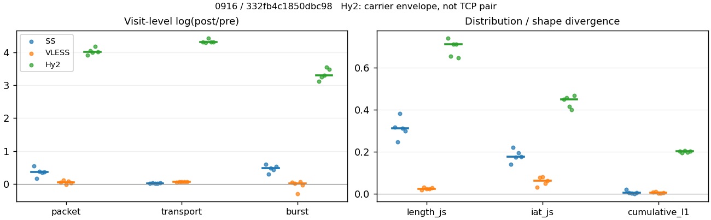
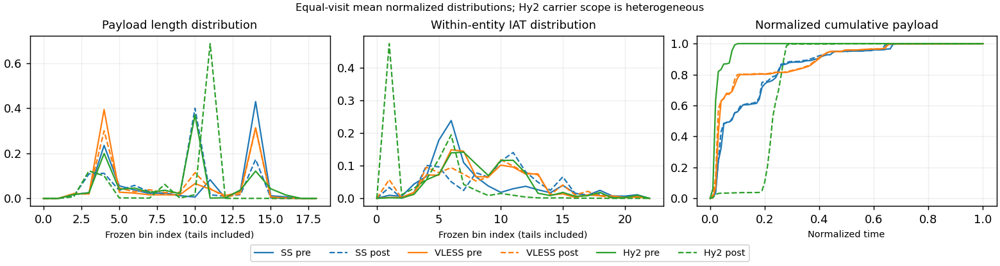

# 0916 · 条目 011 · developer.mozilla.org

目标：https://developer.mozilla.org/en-US/docs/Web/HTTP/Guides/Overview

活动标签：developer.mozilla.org::document_view。选定访问 15 次。

[返回总索引](../../README.md) · [统计口径](../../methods.md)

## 覆盖与资格（每次访问均保留）

| 部署 | 重复 | 主请求路由 | 活动状态 | 代理比较 | DIRECT pre | 请求 proxy/direct/unresolved | 错误 |
| --- | --- | --- | --- | --- | --- | --- | --- |
| Hy2 | 1 | proxy | passed | 1 | 0 | 89/0/0 | [] |
| Hy2 | 2 | proxy | passed | 1 | 0 | 89/0/0 | [] |
| Hy2 | 3 | proxy | passed | 1 | 0 | 89/0/0 | [] |
| Hy2 | 4 | proxy | passed | 1 | 0 | 89/0/0 | [] |
| Hy2 | 5 | proxy | passed | 1 | 0 | 89/0/0 | [] |
| SS | 1 | proxy | passed | 1 | 0 | 89/0/0 | [] |
| SS | 2 | proxy | passed | 1 | 0 | 83/0/0 | [] |
| SS | 3 | proxy | degraded | 1 | 0 | 89/0/0 | [] |
| SS | 4 | proxy | passed | 1 | 0 | 89/0/0 | [] |
| SS | 5 | proxy | passed | 1 | 0 | 89/0/0 | [] |
| VLESS | 1 | proxy | passed | 1 | 0 | 89/0/0 | [] |
| VLESS | 2 | proxy | passed | 1 | 0 | 89/0/0 | [] |
| VLESS | 3 | proxy | passed | 1 | 0 | 89/0/0 | [] |
| VLESS | 4 | proxy | passed | 1 | 0 | 89/0/0 | [] |
| VLESS | 5 | proxy | passed | 1 | 0 | 89/0/0 | [] |

主请求非 proxy 的统计仅解释为已索引的辅助代理连接或 DIRECT 观测，不代表目标业务经代理传输。播放确认与配对资格是两道不同的门。

图中散点为单次访问，短线为重复中位数；Hy2 是共享载体包络，不能与 TCP 配对作等范围因果对比。

形态图先逐访问归一化，再对访问等权平均；实线 pre，虚线 post。分箱序号及边界见 methods，不将分箱索引误解为长度或时间。

## 每次访问的关键观测

### SS

范围：`exclusive_page`。每格 pre → post；空值为不可观测/不适用。

| 重复 | 包数 | 载荷字节 | burst | TCP FR | IAT中位µs | length JS | IAT JS |
| --- | --- | --- | --- | --- | --- | --- | --- |
| 1 | 614 → 1060 | 6.3488e+05 → 6.3921e+05 | 419 → 755 | 53 → 55 | 50.423 → 384.63 | 0.3171 | 0.14077 |
| 2 | 628 → 743 | 5.1803e+05 → 5.2937e+05 | 422 → 568 | 59 → 71 | 32.192 → 1018.8 | 0.24623 | 0.21988 |
| 3 | 646 → 949 | 6.3158e+05 → 6.4377e+05 | 444 → 718 | 47 → 49 | 40.573 → 767.7 | 0.3828 | 0.17324 |
| 4 | 668 → 949 | 6.2551e+05 → 6.3306e+05 | 430 → 663 | 59 → 71 | 38.823 → 523.07 | 0.31115 | 0.1933 |
| 5 | 692 → 999 | 6.3132e+05 → 6.446e+05 | 447 → 751 | 60 → 62 | 43.124 → 699.29 | 0.29974 | 0.17606 |

完整标量统计：中位数 [min,max]；Δ 为重复内逐访问变换的中位数，MAD 未缩放。n 为可用变换数；DIRECT-only 的 nΔ=0 不代表 pre 不可用。

| scope | 特征 | pre | post | Δ | IQRΔ | MADΔ | nΔ |
| --- | --- | --- | --- | --- | --- | --- | --- |
| exclusive_page | active_span_sum_s_1000ms | 11.37 [7.9854, 15.2] | 11.796 [8.7087, 14.879] | 0.046005 | 0.10362 | 0.062917 | 5 |
| exclusive_page | active_span_sum_s_100ms | 2.2547 [1.3209, 2.6303] | 4.0049 [3.8719, 4.8775] | 0.71874 | 0.26888 | 0.21598 | 5 |
| exclusive_page | active_span_sum_s_500ms | 7.1462 [4.9988, 9.7871] | 8.9928 [5.8108, 11.774] | 0.1848 | 0.045612 | 0.034286 | 5 |
| exclusive_page | burst_bytes_iqr | 1726.8 [1448, 2896] | 1428 [1428, 1428] | -0.18997 | 0.33933 | 0.17606 | 5 |
| exclusive_page | burst_bytes_mad | 39 [31, 70] | 34 [34, 66.5] | -0.1372 | 0.81451 | 0.58493 | 5 |
| exclusive_page | burst_bytes_max | 17376 [11584, 20688] | 7140 [5860, 8568] | -1.0537 | 0.47427 | 0.033204 | 5 |
| exclusive_page | burst_bytes_mean | 1422.5 [1227.6, 1515.2] | 896.62 [846.64, 954.84] | -0.46152 | 0.07704 | 0.040527 | 5 |
| exclusive_page | burst_bytes_median | 39 [31, 70] | 34 [34, 66.5] | -0.1372 | 0.81451 | 0.58493 | 5 |
| exclusive_page | burst_bytes_min | 0 [0, 0] | 0 [0, 0] | — | — | — | 0 |
| exclusive_page | burst_bytes_p95 | 7240 [5792, 8192] | 2856 [2856, 4284] | -0.70706 | 0.22314 | 0.080553 | 5 |
| exclusive_page | burst_bytes_q25 | 0 [0, 0] | 0 [0, 0] | — | — | — | 0 |
| exclusive_page | burst_bytes_q75 | 1726.8 [1448, 2896] | 1428 [1428, 1428] | -0.18997 | 0.33933 | 0.17606 | 5 |
| exclusive_page | burst_bytes_std | 2729.3 [2372.3, 2878] | 1225.1 [1136.9, 1446.3] | -0.7918 | 0.065519 | 0.02139 | 5 |
| exclusive_page | burst_count | 430 [419, 447] | 718 [568, 755] | 0.48065 | 0.085857 | 0.047655 | 5 |
| exclusive_page | burst_duration_ms_iqr | 0.038889 [0.03194, 0.051226] | 0 [0, 0.000122] | -5.9309 | — | — | 1 |
| exclusive_page | burst_duration_ms_mad | 0 [0, 0] | 0 [0, 0] | — | — | — | 0 |
| exclusive_page | burst_duration_ms_max | 14321 [3120.8, 15001] | 15360 [3120.9, 55527] | 0.077223 | 1.2934 | 0.077204 | 5 |
| exclusive_page | burst_duration_ms_mean | 66.239 [26.361, 144.88] | 86.975 [12.195, 118.76] | -0.19038 | 0.82018 | 0.5003 | 5 |
| exclusive_page | burst_duration_ms_median | 0 [0, 0] | 0 [0, 0] | — | — | — | 0 |
| exclusive_page | burst_duration_ms_min | 0 [0, 0] | 0 [0, 0] | — | — | — | 0 |
| exclusive_page | burst_duration_ms_p95 | 203.11 [99.737, 274.16] | 9.2759 [3.2909, 21.1] | -2.6599 | 0.46874 | 0.30932 | 5 |
| exclusive_page | burst_duration_ms_q25 | 0 [0, 0] | 0 [0, 0] | — | — | — | 0 |
| exclusive_page | burst_duration_ms_q75 | 0.038889 [0.03194, 0.051226] | 0 [0, 0.000122] | -5.9309 | — | — | 1 |
| exclusive_page | burst_duration_ms_std | 738.07 [172.96, 1048.6] | 799.12 [126, 2233.9] | -0.042438 | 1.3396 | 0.27436 | 5 |
| exclusive_page | burst_packets_iqr | 1 [1, 1] | 0 [0, 1] | 0 | — | — | 1 |
| exclusive_page | burst_packets_mad | 0 [0, 0] | 0 [0, 0] | — | — | — | 0 |
| exclusive_page | burst_packets_max | 8 [5, 11] | 9 [7, 11] | -0.13353 | 0.45199 | 0.31845 | 5 |
| exclusive_page | burst_packets_mean | 1.4882 [1.455, 1.5535] | 1.3302 [1.3081, 1.4314] | -0.096036 | 0.047091 | 0.032925 | 5 |
| exclusive_page | burst_packets_median | 1 [1, 1] | 1 [1, 1] | 0 | 0 | 0 | 5 |
| exclusive_page | burst_packets_min | 1 [1, 1] | 1 [1, 1] | 0 | 0 | 0 | 5 |
| exclusive_page | burst_packets_p95 | 3 [3, 4] | 3 [2, 3.9] | 0 | 0.025318 | 0 | 5 |
| exclusive_page | burst_packets_q25 | 1 [1, 1] | 1 [1, 1] | 0 | 0 | 0 | 5 |
| exclusive_page | burst_packets_q75 | 2 [2, 2] | 1 [1, 2] | -0.69315 | 0 | 0 | 5 |
| exclusive_page | burst_packets_std | 0.98843 [0.78284, 1.1009] | 0.90428 [0.78843, 1.056] | -0.088983 | 0.069972 | 0.051197 | 5 |
| exclusive_page | connection_span_concurrency_max | 5 [4, 5] | 5 [4, 5] | 0 | 0 | 0 | 5 |
| exclusive_page | cumulative_l1 | — | — | 0.0038588 | 0.0024269 | 0.0018298 | 5 |
| exclusive_page | cumulative_max | — | — | 0.1445 | 0.093072 | 0.052305 | 5 |
| exclusive_page | direction_entropy | 0.91392 [0.9045, 0.92109] | 0.65575 [0.54008, 0.77365] | -0.25817 | 0.061662 | 0.031338 | 5 |
| exclusive_page | down_burst_count | 212 [207, 220] | 357 [281, 375] | 0.48411 | 0.085795 | 0.044637 | 5 |
| exclusive_page | down_ip_bytes | 6.2011e+05 [5.1012e+05, 6.2664e+05] | 6.3284e+05 [5.1496e+05, 6.419e+05] | 0.017932 | 0.0057586 | 0.0033647 | 5 |
| exclusive_page | down_packets | 351 [337, 393] | 510 [370, 592] | 0.27341 | 0.085299 | 0.076408 | 5 |
| exclusive_page | down_transport_bytes | 5.9962e+05 [4.9192e+05, 6.0907e+05] | 6.0603e+05 [4.9559e+05, 6.1596e+05] | 0.0074349 | 0.0061783 | 0.0032035 | 5 |
| exclusive_page | duration_s | 64.745 [4.9908, 77.429] | 64.574 [4.9105, 77.264] | -0.0024949 | 0.00051518 | 0.00036399 | 5 |
| exclusive_page | entity_count | 6 [4, 7] | 6 [4, 7] | 0 | 0 | 0 | 5 |
| exclusive_page | fr_runs | 59 [47, 60] | 62 [49, 71] | 0.041673 | 0.1481 | 0.0088829 | 5 |
| exclusive_page | fr_runs_per_packet | 0.15 [0.12434, 0.16761] | 0.11877 [0.090759, 0.18783] | -0.027309 | 0.010347 | 0.0064294 | 5 |
| exclusive_page | fr_switches | 53 [43, 53] | 55 [45, 65] | 0.045462 | 0.16327 | 0.0084211 | 5 |
| exclusive_page | fr_switches_per_possible_transition | 0.13754 [0.11497, 0.15318] | 0.1068 [0.083195, 0.17473] | -0.025153 | 0.010771 | 0.0078597 | 5 |
| exclusive_page | full_retransmission_fraction | 0.002994 [0.001548, 0.004886] | 0.0073762 [0.0021075, 0.016151] | 0.0043822 | 0.0085623 | 0.0045512 | 5 |
| exclusive_page | full_retransmission_packets | 2 [1, 3] | 7 [2, 12] | 1.2528 | 1.0986 | 0.539 | 5 |
| exclusive_page | iat_count | 642 [609, 685] | 945 [737, 1055] | 0.3703 | 0.032796 | 0.016504 | 5 |
| exclusive_page | iat_js | — | — | 0.17606 | 0.020055 | 0.017242 | 5 |
| exclusive_page | iat_ks | — | — | 0.32166 | 0.066275 | 0.044142 | 5 |
| exclusive_page | iat_median_us | 40.573 [32.192, 50.423] | 699.29 [384.63, 1018.8] | 2.786 | 0.33956 | 0.18527 | 5 |
| exclusive_page | iat_us_iqr | 405.09 [167.63, 2020.6] | 2534.5 [1396.5, 5039] | 1.8336 | 1.2023 | 0.88653 | 5 |
| exclusive_page | iat_us_mad | 30.448 [25.468, 42.257] | 687.97 [377.17, 992.25] | 2.9897 | 0.42922 | 0.26204 | 5 |
| exclusive_page | iat_us_max | 1.5001e+07 [3.1208e+06, 1.5001e+07] | 1.5361e+07 [3.1209e+06, 1.5471e+07] | 0.023714 | 0.0041845 | 0.0021842 | 5 |
| exclusive_page | iat_us_mean | 1.8945e+05 [23795, 3.0911e+05] | 1.3288e+05 [13555, 2.6082e+05] | -0.37057 | 0.034452 | 0.018548 | 5 |
| exclusive_page | iat_us_median | 40.573 [32.192, 50.423] | 699.29 [384.63, 1018.8] | 2.786 | 0.33956 | 0.18527 | 5 |
| exclusive_page | iat_us_min | 0.119 [0.015, 0.539] | 0.037 [0.031, 0.067] | -0.57443 | 1.5671 | 0.96794 | 5 |
| exclusive_page | iat_us_p95 | 1.2907e+05 [92507, 2.9353e+05] | 71852 [36479, 1.6967e+05] | -0.78985 | 0.36061 | 0.20411 | 5 |
| exclusive_page | iat_us_q25 | 17.41 [12.962, 18.557] | 16.946 [15.482, 85.186] | -0.027013 | 0.46012 | 0.15418 | 5 |
| exclusive_page | iat_us_q75 | 422.5 [180.59, 2039.2] | 2551.4 [1412.9, 5054.5] | 1.7982 | 1.1512 | 0.88038 | 5 |
| exclusive_page | iat_us_std | 1.5183e+06 [1.4644e+05, 1.9722e+06] | 1.2839e+06 [1.0766e+05, 1.8182e+06] | -0.17349 | 0.039964 | 0.033581 | 5 |
| exclusive_page | iat_wasserstein_log1p_us | — | — | 1.2976 | 0.11923 | 0.096739 | 5 |
| exclusive_page | idle_gap_count_1000ms | 13 [1, 19] | 12 [1, 19] | 0 | 0 | 0 | 5 |
| exclusive_page | idle_gap_count_100ms | 37 [30, 47] | 36 [29, 48] | -0.03279 | 0.0065026 | 0.0053908 | 5 |
| exclusive_page | idle_gap_count_500ms | 20 [3, 23] | 16 [3, 24] | 0 | 0.17609 | 0.09531 | 5 |
| exclusive_page | idle_gap_sum_s_1000ms | 112.45 [3.1208, 182.12] | 111.73 [3.1209, 180.43] | -0.006413 | 0.0093416 | 0.0039004 | 5 |
| exclusive_page | idle_gap_sum_s_100ms | 123.52 [12.149, 190.94] | 121.43 [10.428, 188.22] | -0.017112 | 0.0032084 | 0.0027515 | 5 |
| exclusive_page | idle_gap_sum_s_500ms | 118.27 [4.7375, 185.13] | 116.31 [4.6291, 183.54] | -0.016102 | 0.0057626 | 0.0051964 | 5 |
| exclusive_page | ip_bytes | 6.6524e+05 [5.508e+05, 6.6743e+05] | 6.979e+05 [5.7343e+05, 7.0319e+05] | 0.047925 | 0.0079203 | 0.0042691 | 5 |
| exclusive_page | length_iqr | 2801 [2790, 2803] | 1298.5 [964, 1363] | -0.76868 | 0.093687 | 0.048389 | 5 |
| exclusive_page | length_js | — | — | 0.31115 | 0.017362 | 0.01141 | 5 |
| exclusive_page | length_ks | — | — | 0.43117 | 0.023046 | 0.017788 | 5 |
| exclusive_page | length_mad | 1366 [1074.5, 1381] | 901 [0, 1254.5] | -0.35299 | 0.19051 | 0.098356 | 4 |
| exclusive_page | length_max | 4096 [3068, 8920] | 4284 [2856, 4284] | -0.36059 | 0.63545 | 0.34647 | 5 |
| exclusive_page | length_mean | 1620.5 [1471.7, 1793.4] | 1234.9 [1054.8, 1400.4] | -0.27054 | 0.074636 | 0.049485 | 5 |
| exclusive_page | length_median | 1448 [1448, 1821.5] | 1428 [1428, 1428] | -0.013908 | 0 | 0 | 5 |
| exclusive_page | length_min | 31 [31, 31] | 10 [2, 34] | -1.1314 | 0.69315 | 0.69315 | 5 |
| exclusive_page | length_p95 | 2896 [2896, 4096] | 2856 [2856, 2856] | -0.013908 | 0 | 0 | 5 |
| exclusive_page | length_q25 | 95 [93, 106] | 129.5 [65, 464] | 0.30718 | 1.1737 | 0.68667 | 5 |
| exclusive_page | length_q75 | 2896 [2896, 2896] | 1428 [1428, 1623.5] | -0.70706 | 0 | 0 | 5 |
| exclusive_page | length_std | 1294.1 [1241.1, 1733.7] | 961.2 [832.77, 990.2] | -0.39151 | 0.13649 | 0.11852 | 5 |
| exclusive_page | length_wasserstein_bytes | — | — | 530.86 | 176.8 | 110.95 | 5 |
| exclusive_page | nonempty_entity_count | 6 [4, 7] | 6 [4, 7] | 0 | 0 | 0 | 5 |
| exclusive_page | nonempty_packets | 378 [352, 400] | 522 [378, 606] | 0.28966 | 0.065818 | 0.042357 | 5 |
| exclusive_page | offload_suspect_fraction | 0.28013 [0.25318, 0.29721] | 0.10643 [0.080084, 0.13324] | -0.178 | 0.025237 | 0.021224 | 5 |
| exclusive_page | packet_count | 646 [614, 692] | 949 [743, 1060] | 0.36717 | 0.033489 | 0.01744 | 5 |
| exclusive_page | rtt_median_ms | 0.065925 [0.055602, 0.073577] | 32.289 [26.37, 34.065] | 6.1081 | 0.16116 | 0.11666 | 5 |
| exclusive_page | rtt_sample_count | 254 [240, 258] | 216 [146, 236] | -0.17768 | 0.22488 | 0.099291 | 5 |
| exclusive_page | tcp_ack_count | 642 [609, 684] | 944 [735, 1055] | 0.37177 | 0.031737 | 0.017964 | 5 |
| exclusive_page | tcp_fin_count | 12 [8, 13] | 13 [8, 15] | 0.09531 | 0.063058 | 0.047791 | 5 |
| exclusive_page | tcp_packet_count | 646 [614, 692] | 949 [743, 1060] | 0.36717 | 0.033489 | 0.01744 | 5 |
| exclusive_page | tcp_rst_count | 0 [0, 1] | 0 [0, 0] | — | — | — | 0 |
| exclusive_page | tcp_syn_count | 12 [8, 14] | 12 [9, 15] | 0 | 0.11778 | 0 | 5 |
| exclusive_page | tcp_window_raw_median | 65459 [65395, 65504] | 148 [133, 155] | -6.091 | 0.07593 | 0.045235 | 5 |
| exclusive_page | transition_entropy | 0.55754 [0.4963, 0.59632] | 0.42483 [0.34345, 0.59976] | -0.1187 | 0.019756 | 0.019475 | 5 |
| exclusive_page | transition_n_mm | 230 [206, 241] | 404 [258, 504] | 0.54609 | 0.083805 | 0.046954 | 5 |
| exclusive_page | transition_n_mp | 23 [20, 25] | 24 [21, 31] | 0.04879 | 0.17066 | 0.0062305 | 5 |
| exclusive_page | transition_n_pm | 28 [23, 30] | 31 [24, 35] | 0.04256 | 0.15031 | 0.0097698 | 5 |
| exclusive_page | transition_n_pp | 97 [87, 99] | 52 [47, 63] | -0.57409 | 0.056089 | 0.049379 | 5 |
| exclusive_page | transition_p_mm | 0.90551 [0.89177, 0.92126] | 0.94299 [0.89273, 0.95636] | 0.029328 | 0.0034992 | 0.0027135 | 5 |
| exclusive_page | transition_p_mp | 0.094488 [0.07874, 0.10823] | 0.057007 [0.043643, 0.10727] | -0.029328 | 0.0034992 | 0.0027135 | 5 |
| exclusive_page | transition_p_pm | 0.23016 [0.19167, 0.24348] | 0.36486 [0.31579, 0.40964] | 0.14453 | 0.034607 | 0.020403 | 5 |
| exclusive_page | transition_p_pp | 0.76984 [0.75652, 0.80833] | 0.63514 [0.59036, 0.68421] | -0.14453 | 0.034607 | 0.020403 | 5 |
| exclusive_page | transport_bytes | 6.3132e+05 [5.1803e+05, 6.3488e+05] | 6.3921e+05 [5.2937e+05, 6.446e+05] | 0.019123 | 0.0088176 | 0.0025314 | 5 |
| exclusive_page | up_burst_count | 218 [212, 227] | 361 [287, 380] | 0.47723 | 0.08594 | 0.050586 | 5 |
| exclusive_page | up_byte_fraction | 0.046869 [0.038244, 0.050397] | 0.054024 [0.043192, 0.063805] | 0.0095895 | 0.0024594 | 0.002435 | 5 |
| exclusive_page | up_ip_bytes | 40687 [39538, 47324] | 63086 [55998, 70352] | 0.36378 | 0.033854 | 0.015727 | 5 |
| exclusive_page | up_packets | 280 [277, 299] | 451 [373, 487] | 0.44971 | 0.063329 | 0.038111 | 5 |
| exclusive_page | up_transport_bytes | 26107 [24154, 31708] | 33776 [27806, 38572] | 0.19596 | 0.06458 | 0.0419 | 5 |
| exclusive_page | zero_iat_count | 0 [0, 0] | 0 [0, 0] | — | — | — | 0 |
| exclusive_page | zero_iat_fraction | 0 [0, 0] | 0 [0, 0] | 0 | 0 | 0 | 5 |

### VLESS

范围：`exclusive_page`。每格 pre → post；空值为不可观测/不适用。

| 重复 | 包数 | 载荷字节 | burst | TCP FR | IAT中位µs | length JS | IAT JS |
| --- | --- | --- | --- | --- | --- | --- | --- |
| 1 | 816 → 855 | 6.0486e+05 → 6.3681e+05 | 534 → 560 | 64 → 78 | 128.1 → 266.38 | 0.017879 | 0.030881 |
| 2 | 818 → 909 | 6.1274e+05 → 6.5205e+05 | 577 → 584 | 58 → 70 | 112.7 → 112.87 | 0.031585 | 0.076923 |
| 3 | 974 → 947 | 6.0552e+05 → 6.4472e+05 | 779 → 579 | 52 → 66 | 116.11 → 395.86 | 0.02168 | 0.07927 |
| 4 | 844 → 917 | 5.9742e+05 → 6.3726e+05 | 595 → 631 | 65 → 76 | 352 → 489.8 | 0.02282 | 0.047697 |
| 5 | 799 → 828 | 6.0446e+05 → 6.4369e+05 | 577 → 559 | 60 → 72 | 164.88 → 520.78 | 0.026798 | 0.061358 |

完整标量统计：中位数 [min,max]；Δ 为重复内逐访问变换的中位数，MAD 未缩放。n 为可用变换数；DIRECT-only 的 nΔ=0 不代表 pre 不可用。

| scope | 特征 | pre | post | Δ | IQRΔ | MADΔ | nΔ |
| --- | --- | --- | --- | --- | --- | --- | --- |
| exclusive_page | active_span_sum_s_1000ms | 9.5764 [8.4384, 9.8125] | 9.6145 [7.9912, 9.9048] | -0.01075 | 0.047725 | 0.034156 | 5 |
| exclusive_page | active_span_sum_s_100ms | 1.5735 [1.5199, 1.7455] | 3.3417 [2.6872, 3.5701] | 0.64947 | 0.16869 | 0.079634 | 5 |
| exclusive_page | active_span_sum_s_500ms | 4.9988 [4.2925, 5.9785] | 8.1545 [6.6518, 9.0977] | 0.48746 | 0.05136 | 0.049442 | 5 |
| exclusive_page | burst_bytes_iqr | 2230 [1412, 2647.2] | 2824 [2824, 2824] | 0.23615 | 0.46899 | 0.17152 | 5 |
| exclusive_page | burst_bytes_mad | 39 [31, 70.5] | 72 [72, 144.5] | 0.71767 | 0.14953 | 0.12501 | 5 |
| exclusive_page | burst_bytes_max | 17376 [8702, 18970] | 6402 [4236, 14480] | -0.80999 | 0.60376 | 0.41527 | 5 |
| exclusive_page | burst_bytes_mean | 1047.6 [777.31, 1132.7] | 1116.5 [1009.9, 1151.5] | 0.050119 | 0.088765 | 0.044449 | 5 |
| exclusive_page | burst_bytes_median | 39 [31, 70.5] | 72 [72, 144.5] | 0.71767 | 0.14953 | 0.12501 | 5 |
| exclusive_page | burst_bytes_min | 0 [0, 0] | 0 [0, 0] | — | — | — | 0 |
| exclusive_page | burst_bytes_p95 | 4351.2 [2896, 5648] | 2896 [2896, 2968] | -0.38256 | 0.38669 | 0.28541 | 5 |
| exclusive_page | burst_bytes_q25 | 0 [0, 0] | 0 [0, 0] | — | — | — | 0 |
| exclusive_page | burst_bytes_q75 | 2230 [1412, 2647.2] | 2824 [2824, 2824] | 0.23615 | 0.46899 | 0.17152 | 5 |
| exclusive_page | burst_bytes_std | 1759.6 [1510.7, 1970.7] | 1315.4 [1283, 1434.1] | -0.28086 | 0.098798 | 0.076318 | 5 |
| exclusive_page | burst_count | 577 [534, 779] | 579 [559, 631] | 0.012059 | 0.079234 | 0.043752 | 5 |
| exclusive_page | burst_duration_ms_iqr | 0.16251 [0, 1.1462] | 0.48493 [0.0080408, 1.0576] | -0.95792 | 1.8585 | 1.2368 | 4 |
| exclusive_page | burst_duration_ms_mad | 0 [0, 0] | 0 [0, 0] | — | — | — | 0 |
| exclusive_page | burst_duration_ms_max | 1586.8 [1410.8, 2053] | 15047 [1160.6, 15064] | 2.2456 | 0.30271 | 0.1225 | 5 |
| exclusive_page | burst_duration_ms_mean | 18.943 [14.434, 21.168] | 40.084 [11.559, 61.495] | 0.76155 | 0.26329 | 0.25985 | 5 |
| exclusive_page | burst_duration_ms_median | 0 [0, 0] | 0 [0, 0] | — | — | — | 0 |
| exclusive_page | burst_duration_ms_min | 0 [0, 0] | 0 [0, 0] | — | — | — | 0 |
| exclusive_page | burst_duration_ms_p95 | 10.046 [6.8701, 12] | 23.556 [9.9246, 56.106] | 0.70662 | 1.2234 | 0.6122 | 5 |
| exclusive_page | burst_duration_ms_q25 | 0 [0, 0] | 0 [0, 0] | — | — | — | 0 |
| exclusive_page | burst_duration_ms_q75 | 0.16251 [0, 1.1462] | 0.48493 [0.0080408, 1.0576] | -0.95792 | 1.8585 | 1.2368 | 4 |
| exclusive_page | burst_duration_ms_std | 115.57 [100.28, 134.87] | 629.83 [70.344, 879.24] | 1.785 | 0.22372 | 0.14136 | 5 |
| exclusive_page | burst_packets_iqr | 1 [0, 1] | 1 [1, 1] | 0 | 0 | 0 | 4 |
| exclusive_page | burst_packets_mad | 0 [0, 0] | 0 [0, 0] | — | — | — | 0 |
| exclusive_page | burst_packets_max | 11 [7, 12] | 7 [7, 11] | -0.35667 | 0.36497 | 0.18232 | 5 |
| exclusive_page | burst_packets_mean | 1.4177 [1.2503, 1.5281] | 1.5268 [1.4532, 1.6356] | 0.067345 | 0.069214 | 0.043134 | 5 |
| exclusive_page | burst_packets_median | 1 [1, 1] | 1 [1, 1] | 0 | 0 | 0 | 5 |
| exclusive_page | burst_packets_min | 1 [1, 1] | 1 [1, 1] | 0 | 0 | 0 | 5 |
| exclusive_page | burst_packets_p95 | 2 [2, 3] | 3 [3, 4] | 0.40547 | 0.11778 | 0.11778 | 5 |
| exclusive_page | burst_packets_q25 | 1 [1, 1] | 1 [1, 1] | 0 | 0 | 0 | 5 |
| exclusive_page | burst_packets_q75 | 2 [1, 2] | 2 [2, 2] | 0 | 0 | 0 | 5 |
| exclusive_page | burst_packets_std | 0.76377 [0.71423, 0.86449] | 0.92543 [0.86339, 1.0965] | 0.15157 | 0.33272 | 0.095892 | 5 |
| exclusive_page | connection_span_concurrency_max | 4 [3, 4] | 4 [3, 4] | 0 | 0 | 0 | 5 |
| exclusive_page | cumulative_l1 | — | — | 0.0055615 | 0.0059534 | 0.0038818 | 5 |
| exclusive_page | cumulative_max | — | — | 0.048023 | 0.24726 | 0.023029 | 5 |
| exclusive_page | direction_entropy | 0.79676 [0.7573, 0.81634] | 0.61486 [0.5637, 0.66236] | -0.15158 | 0.015931 | 0.0044056 | 5 |
| exclusive_page | down_burst_count | 286 [265, 387] | 287 [277, 313] | 0.013889 | 0.079866 | 0.045339 | 5 |
| exclusive_page | down_ip_bytes | 6.0633e+05 [6.0113e+05, 6.1386e+05] | 6.3606e+05 [6.3164e+05, 6.4738e+05] | 0.051728 | 0.0041892 | 0.0014447 | 5 |
| exclusive_page | down_packets | 484 [455, 521] | 516 [459, 559] | 0.045598 | 0.045908 | 0.024802 | 5 |
| exclusive_page | down_transport_bytes | 5.8096e+05 [5.7546e+05, 5.8974e+05] | 6.1147e+05 [6.0582e+05, 6.201e+05] | 0.050206 | 0.0017693 | 0.00098543 | 5 |
| exclusive_page | duration_s | 62.303 [3.8826, 63.511] | 62.257 [3.854, 62.876] | -0.0039036 | 0.0066597 | 0.0032236 | 5 |
| exclusive_page | entity_count | 5 [4, 5] | 5 [4, 5] | 0 | 0 | 0 | 5 |
| exclusive_page | fr_runs | 60 [52, 65] | 72 [66, 78] | 0.18805 | 0.015504 | 0.0097735 | 5 |
| exclusive_page | fr_runs_per_packet | 0.12749 [0.097744, 0.13216] | 0.14644 [0.12088, 0.15484] | 0.02268 | 0.0069598 | 0.0030715 | 5 |
| exclusive_page | fr_switches | 55 [47, 60] | 67 [61, 74] | 0.2041 | 0.012361 | 0.0067359 | 5 |
| exclusive_page | fr_switches_per_possible_transition | 0.12048 [0.089184, 0.12249] | 0.13813 [0.11275, 0.14653] | 0.023158 | 0.0068953 | 0.002895 | 5 |
| exclusive_page | full_retransmission_fraction | 0.0011848 [0, 0.0012516] | 0 [0, 0] | -0.0011848 | 0.0001958 | 6.673e-05 | 5 |
| exclusive_page | full_retransmission_packets | 1 [0, 1] | 0 [0, 0] | — | — | — | 0 |
| exclusive_page | iat_count | 813 [794, 969] | 904 [823, 942] | 0.046912 | 0.047557 | 0.036517 | 5 |
| exclusive_page | iat_js | — | — | 0.061358 | 0.029226 | 0.015565 | 5 |
| exclusive_page | iat_ks | — | — | 0.11977 | 0.060883 | 0.015068 | 5 |
| exclusive_page | iat_median_us | 128.1 [112.7, 352] | 395.86 [112.87, 520.78] | 0.73211 | 0.81973 | 0.41799 | 5 |
| exclusive_page | iat_us_iqr | 1594.2 [995.01, 1827.8] | 1961.5 [1464.5, 2569.1] | 0.32327 | 0.16252 | 0.06324 | 5 |
| exclusive_page | iat_us_mad | 121.64 [105.04, 344.39] | 388.36 [112.81, 512.01] | 0.76933 | 0.84283 | 0.43536 | 5 |
| exclusive_page | iat_us_max | 1.5001e+07 [1.5868e+06, 1.5001e+07] | 1.5297e+07 [1.5864e+06, 1.5322e+07] | 0.01952 | 0.00024218 | 0.00018648 | 5 |
| exclusive_page | iat_us_mean | 79462 [13725, 1.5251e+05] | 72851 [12618, 1.3607e+05] | -0.084102 | 0.041123 | 0.029914 | 5 |
| exclusive_page | iat_us_median | 128.1 [112.7, 352] | 395.86 [112.87, 520.78] | 0.73211 | 0.81973 | 0.41799 | 5 |
| exclusive_page | iat_us_min | 0.169 [0.021, 0.683] | 0.036 [0.035, 0.037] | -1.5464 | 2.3084 | 1.2099 | 5 |
| exclusive_page | iat_us_p95 | 26915 [10958, 36530] | 47440 [41989, 80548] | 0.79072 | 0.44868 | 0.22394 | 5 |
| exclusive_page | iat_us_q25 | 35.382 [32.006, 37.283] | 21.332 [12.601, 38.34] | -0.54847 | 0.66684 | 0.33465 | 5 |
| exclusive_page | iat_us_q75 | 1631.4 [1031.9, 1863.2] | 1999.8 [1485.8, 2581.7] | 0.30482 | 0.1533 | 0.059727 | 5 |
| exclusive_page | iat_us_std | 9.6735e+05 [94262, 1.3869e+06] | 9.2783e+05 [80971, 1.335e+06] | -0.038124 | 0.024334 | 0.020744 | 5 |
| exclusive_page | iat_wasserstein_log1p_us | — | — | 0.59163 | 0.28974 | 0.12446 | 5 |
| exclusive_page | idle_gap_count_1000ms | 6 [2, 10] | 5 [2, 8] | -0.13353 | 0.18232 | 0.089612 | 5 |
| exclusive_page | idle_gap_count_100ms | 28 [22, 33] | 34 [26, 37] | 0.16705 | 0.10873 | 0.056089 | 5 |
| exclusive_page | idle_gap_count_500ms | 13 [8, 15] | 7 [4, 9] | -0.539 | 0.10821 | 0.080043 | 5 |
| exclusive_page | idle_gap_sum_s_1000ms | 57.774 [2.7066, 114.41] | 57.595 [2.747, 113.21] | -0.0031011 | 0.0084033 | 0.0074836 | 5 |
| exclusive_page | idle_gap_sum_s_100ms | 66.013 [9.6251, 122.43] | 63.726 [8.0509, 119.44] | -0.034579 | 0.0094028 | 0.0087174 | 5 |
| exclusive_page | idle_gap_sum_s_500ms | 62.536 [6.8525, 118.01] | 58.949 [4.0864, 113.91] | -0.059075 | 0.012182 | 0.0095387 | 5 |
| exclusive_page | ip_bytes | 6.4726e+05 [6.4131e+05, 6.5616e+05] | 6.8723e+05 [6.8158e+05, 6.9967e+05] | 0.061894 | 0.0090633 | 0.0044495 | 5 |
| exclusive_page | length_iqr | 2752 [2741, 2752] | 2752 [2738, 2752] | 0 | 0 | 0 | 5 |
| exclusive_page | length_js | — | — | 0.02282 | 0.0051189 | 0.0039788 | 5 |
| exclusive_page | length_ks | — | — | 0.096992 | 0.0036636 | 0.0033554 | 5 |
| exclusive_page | length_mad | 565 [245.5, 1340] | 1091 [862.5, 1340] | 0.63765 | 0.34718 | 0.21947 | 5 |
| exclusive_page | length_max | 8439 [5720, 8920] | 2896 [2824, 3358] | -1.0695 | 0.41915 | 0.055432 | 5 |
| exclusive_page | length_mean | 1204.9 [1138.2, 1331.4] | 1251.1 [1180.8, 1384.3] | 0.036747 | 0.012377 | 0.0021886 | 5 |
| exclusive_page | length_median | 596 [276.5, 1412] | 1163 [934.5, 1412] | 0.64942 | 0.37532 | 0.19673 | 5 |
| exclusive_page | length_min | 24 [24, 24] | 24 [2, 24] | 0 | 0.6131 | 0 | 5 |
| exclusive_page | length_p95 | 2896 [2824, 2896] | 2824 [2824, 2896] | 0 | 0.025176 | 0 | 5 |
| exclusive_page | length_q25 | 72 [72, 83] | 72 [72, 86] | 0 | 0 | 0 | 5 |
| exclusive_page | length_q75 | 2824 [2824, 2824] | 2824 [2824, 2824] | 0 | 0 | 0 | 5 |
| exclusive_page | length_std | 1260.8 [1207.2, 1401.2] | 1153.3 [1133.8, 1185.5] | -0.082401 | 0.054355 | 0.034309 | 5 |
| exclusive_page | length_wasserstein_bytes | — | — | 110.09 | 38.301 | 23.552 | 5 |
| exclusive_page | nonempty_entity_count | 5 [4, 5] | 5 [4, 5] | 0 | 0 | 0 | 5 |
| exclusive_page | nonempty_packets | 499 [454, 532] | 514 [465, 546] | 0.025975 | 0.015358 | 0.012128 | 5 |
| exclusive_page | offload_suspect_fraction | 0.21209 [0.18583, 0.2176] | 0.19582 [0.18163, 0.2029] | -0.013179 | 0.0094138 | 0.0086049 | 5 |
| exclusive_page | packet_count | 818 [799, 974] | 909 [828, 947] | 0.046687 | 0.047303 | 0.036268 | 5 |
| exclusive_page | rtt_median_ms | 0.10053 [0.057533, 0.17876] | 0.80004 [0.17069, 1.1253] | 1.8704 | 1.291 | 0.9946 | 5 |
| exclusive_page | rtt_sample_count | 325 [305, 417] | 368 [341, 387] | 0.13353 | 0.092417 | 0.03188 | 5 |
| exclusive_page | tcp_ack_count | 804 [784, 960] | 903 [823, 942] | 0.056813 | 0.044463 | 0.036197 | 5 |
| exclusive_page | tcp_fin_count | 10 [8, 10] | 10 [8, 10] | 0 | 0 | 0 | 5 |
| exclusive_page | tcp_packet_count | 818 [799, 974] | 909 [828, 947] | 0.046687 | 0.047303 | 0.036268 | 5 |
| exclusive_page | tcp_rst_count | 9 [8, 10] | 0 [0, 1] | -2.3026 | — | — | 1 |
| exclusive_page | tcp_syn_count | 10 [8, 10] | 10 [8, 10] | 0 | 0 | 0 | 5 |
| exclusive_page | tcp_window_raw_median | 65535 [65450, 65535] | 173 [167, 190] | -5.9366 | 0.0057637 | 0.0052906 | 5 |
| exclusive_page | transition_entropy | 0.48494 [0.39703, 0.4961] | 0.47811 [0.42975, 0.50947] | 0.01337 | 0.0208 | 0.019355 | 5 |
| exclusive_page | transition_n_mm | 349 [311, 388] | 404 [349, 430] | 0.11528 | 0.012374 | 0.0067716 | 5 |
| exclusive_page | transition_n_mp | 25 [21, 28] | 31 [28, 35] | 0.22314 | 0.0080322 | 0.0080322 | 5 |
| exclusive_page | transition_n_pm | 30 [26, 32] | 36 [33, 39] | 0.18805 | 0.015504 | 0.0097735 | 5 |
| exclusive_page | transition_n_pp | 89 [76, 92] | 42 [33, 50] | -0.66717 | 0.11632 | 0.057406 | 5 |
| exclusive_page | transition_p_mm | 0.92746 [0.9256, 0.94866] | 0.92449 [0.91745, 0.93886] | -0.0071742 | 0.0053006 | 0.0026164 | 5 |
| exclusive_page | transition_p_mp | 0.072539 [0.051345, 0.074405] | 0.075515 [0.061135, 0.082547] | 0.0071742 | 0.0053006 | 0.0026164 | 5 |
| exclusive_page | transition_p_pm | 0.26446 [0.22034, 0.2963] | 0.48148 [0.39759, 0.51471] | 0.19721 | 0.032505 | 0.019808 | 5 |
| exclusive_page | transition_p_pp | 0.73554 [0.7037, 0.77966] | 0.51852 [0.48529, 0.60241] | -0.19721 | 0.032505 | 0.019808 | 5 |
| exclusive_page | transport_bytes | 6.0486e+05 [5.9742e+05, 6.1274e+05] | 6.4369e+05 [6.3681e+05, 6.5205e+05] | 0.062722 | 0.00069795 | 0.00054464 | 5 |
| exclusive_page | up_burst_count | 291 [269, 392] | 292 [282, 318] | 0.010257 | 0.078612 | 0.041673 | 5 |
| exclusive_page | up_byte_fraction | 0.03754 [0.036116, 0.040573] | 0.048993 [0.048666, 0.051573] | 0.011454 | 0.001007 | 0.0005529 | 5 |
| exclusive_page | up_ip_bytes | 41336 [39651, 48068] | 52251 [49943, 53742] | 0.23375 | 0.065908 | 0.029068 | 5 |
| exclusive_page | up_packets | 351 [332, 453] | 385 [359, 401] | 0.078187 | 0.010971 | 0.0080324 | 5 |
| exclusive_page | up_transport_bytes | 23002 [21831, 24568] | 31539 [30991, 33250] | 0.32847 | 0.04451 | 0.025856 | 5 |
| exclusive_page | zero_iat_count | 0 [0, 0] | 0 [0, 0] | — | — | — | 0 |
| exclusive_page | zero_iat_fraction | 0 [0, 0] | 0 [0, 0] | 0 | 0 | 0 | 5 |

### Hy2

范围：`carrier_context_envelope`。每格 pre → post；空值为不可观测/不适用。

| 重复 | 包数 | 载荷字节 | burst | TCP FR | IAT中位µs | length JS | IAT JS |
| --- | --- | --- | --- | --- | --- | --- | --- |
| 1 | 828 → 41904 | 6.1664e+05 → 4.6043e+07 | 592 → 13430 | — | 269.29 → 1.933 | 0.74011 | 0.44924 |
| 2 | 720 → 41638 | 6.2145e+05 → 4.618e+07 | 494 → 12795 | — | 128.87 → 0.804 | 0.65523 | 0.45759 |
| 3 | 794 → 43396 | 5.5487e+05 → 4.6599e+07 | 553 → 15101 | — | 146.91 → 4.069 | 0.71244 | 0.41472 |
| 4 | 656 → 43313 | 6.168e+05 → 4.6418e+07 | 440 → 15443 | — | 117.87 → 5.0295 | 0.71123 | 0.39984 |
| 5 | 783 → 43963 | 6.237e+05 → 4.6592e+07 | 500 → 16226 | — | 251.18 → 4.8305 | 0.64793 | 0.46746 |

完整标量统计：中位数 [min,max]；Δ 为重复内逐访问变换的中位数，MAD 未缩放。n 为可用变换数；DIRECT-only 的 nΔ=0 不代表 pre 不可用。

| scope | 特征 | pre | post | Δ | IQRΔ | MADΔ | nΔ |
| --- | --- | --- | --- | --- | --- | --- | --- |
| carrier_context_envelope | active_span_sum_s_1000ms | 6.2224 [5.7875, 7.8922] | 18.492 [15.124, 21.177] | 0.98707 | 0.045092 | 0.026478 | 5 |
| carrier_context_envelope | active_span_sum_s_100ms | 1.4966 [1.1462, 1.659] | 6.9735 [6.4627, 7.7001] | 1.5326 | 0.32705 | 0.096629 | 5 |
| carrier_context_envelope | active_span_sum_s_500ms | 5.6967 [4.8462, 7.3056] | 17.021 [13.047, 19.852] | 1.0545 | 0.13361 | 0.070426 | 5 |
| carrier_context_envelope | burst_bytes_iqr | 1415 [1329.5, 2093.8] | 4284 [4193, 5085] | 1.1701 | 0.17585 | 0.10908 | 5 |
| carrier_context_envelope | burst_bytes_mad | 35 [0, 67] | 273 [201, 398] | 1.8484 | 0.24519 | 0.21635 | 4 |
| carrier_context_envelope | burst_bytes_max | 20480 [20480, 28432] | 2.1742e+05 [1.2264e+05, 2.562e+05] | 2.2588 | 0.18604 | 0.10357 | 5 |
| carrier_context_envelope | burst_bytes_mean | 1247.4 [1003.4, 1401.8] | 3085.8 [2871.4, 3609.2] | 1.054 | 0.2897 | 0.13732 | 5 |
| carrier_context_envelope | burst_bytes_median | 35 [0, 67] | 306 [234, 431] | 1.9643 | 0.29438 | 0.22343 | 4 |
| carrier_context_envelope | burst_bytes_min | 0 [0, 0] | 22 [22, 22] | — | — | — | 0 |
| carrier_context_envelope | burst_bytes_p95 | 4245 [4212, 7919.4] | 10932 [10932, 13814] | 0.94595 | 0.056059 | 0.048255 | 5 |
| carrier_context_envelope | burst_bytes_q25 | 0 [0, 0] | 83 [39, 97] | — | — | — | 0 |
| carrier_context_envelope | burst_bytes_q75 | 1415 [1329.5, 2093.8] | 4323 [4290, 5168] | 1.1791 | 0.17854 | 0.11621 | 5 |
| carrier_context_envelope | burst_bytes_std | 2602.7 [2135.5, 3566.9] | 6179.3 [5039.1, 8319.3] | 1.0469 | 0.34289 | 0.31294 | 5 |
| carrier_context_envelope | burst_count | 500 [440, 592] | 15101 [12795, 16226] | 3.3072 | 0.22549 | 0.1726 | 5 |
| carrier_context_envelope | burst_duration_ms_iqr | 0.10092 [0.073021, 0.91562] | 0.024615 [0.023796, 0.025295] | -1.3971 | 0.38644 | 0.23673 | 5 |
| carrier_context_envelope | burst_duration_ms_mad | 0 [0, 0] | 4.4e-05 [4.3e-05, 4.6e-05] | — | — | — | 0 |
| carrier_context_envelope | burst_duration_ms_max | 1950.6 [1405.9, 14959] | 10001 [9975.5, 10340] | 1.6345 | 2.127 | 0.3609 | 5 |
| carrier_context_envelope | burst_duration_ms_mean | 24.782 [11.549, 44.816] | 1.1539 [0.98675, 1.326] | -3.1322 | 1.1368 | 0.54921 | 5 |
| carrier_context_envelope | burst_duration_ms_median | 0 [0, 0] | 4.4e-05 [4.3e-05, 4.6e-05] | — | — | — | 0 |
| carrier_context_envelope | burst_duration_ms_min | 0 [0, 0] | 0 [0, 0] | — | — | — | 0 |
| carrier_context_envelope | burst_duration_ms_p95 | 18.765 [7.423, 207.48] | 0.11028 [0.082273, 0.15667] | -5.4297 | 0.69099 | 0.46558 | 5 |
| carrier_context_envelope | burst_duration_ms_q25 | 0 [0, 0] | 0 [0, 0] | — | — | — | 0 |
| carrier_context_envelope | burst_duration_ms_q75 | 0.10092 [0.073021, 0.91562] | 0.024615 [0.023796, 0.025295] | -1.3971 | 0.38644 | 0.23673 | 5 |
| carrier_context_envelope | burst_duration_ms_std | 140.44 [84.258, 679.59] | 83.605 [79.009, 91.33] | -0.54526 | 1.9463 | 0.53747 | 5 |
| carrier_context_envelope | burst_packets_iqr | 1 [1, 1] | 3 [2, 3] | 1.0986 | 0 | 0 | 5 |
| carrier_context_envelope | burst_packets_mad | 0 [0, 0] | 1 [1, 1] | — | — | — | 0 |
| carrier_context_envelope | burst_packets_max | 9 [6, 14] | 174 [88, 185] | 3.0177 | 0.62092 | 0.13929 | 5 |
| carrier_context_envelope | burst_packets_mean | 1.4575 [1.3986, 1.566] | 2.8737 [2.7094, 3.2542] | 0.69388 | 0.17047 | 0.1085 | 5 |
| carrier_context_envelope | burst_packets_median | 1 [1, 1] | 2 [2, 2] | 0.69315 | 0 | 0 | 5 |
| carrier_context_envelope | burst_packets_min | 1 [1, 1] | 1 [1, 1] | 0 | 0 | 0 | 5 |
| carrier_context_envelope | burst_packets_p95 | 3 [2, 3] | 8 [8, 10] | 0.98083 | 0.22314 | 0 | 5 |
| carrier_context_envelope | burst_packets_q25 | 1 [1, 1] | 1 [1, 1] | 0 | 0 | 0 | 5 |
| carrier_context_envelope | burst_packets_q75 | 2 [2, 2] | 4 [3, 4] | 0.69315 | 0 | 0 | 5 |
| carrier_context_envelope | burst_packets_std | 0.85653 [0.75328, 1.0841] | 4.2873 [3.3704, 5.8588] | 1.4459 | 0.57698 | 0.27428 | 5 |
| carrier_context_envelope | connection_span_concurrency_max | 4 [4, 5] | 1 [1, 1] | -1.3863 | 0 | 0 | 5 |
| carrier_context_envelope | cumulative_l1 | — | — | 0.20099 | 0.0039202 | 0.0031074 | 5 |
| carrier_context_envelope | cumulative_max | — | — | 0.96419 | 0.0012084 | 0.00075299 | 5 |
| carrier_context_envelope | direction_entropy | 0.87259 [0.83164, 0.92615] | 0.77193 [0.72834, 0.79363] | -0.098747 | 0.060547 | 0.055477 | 5 |
| carrier_context_envelope | direction_run_analog_runs | 66 [56, 78] | 15101 [12795, 16226] | 5.4109 | 0.0952 | 0.07324 | 5 |
| carrier_context_envelope | direction_run_analog_runs_per_packet | 0.15349 [0.12739, 0.1715] | 0.34798 [0.30729, 0.36908] | 0.19449 | 0.01002 | 0.0086326 | 5 |
| carrier_context_envelope | direction_run_analog_switches | 55 [50, 72] | 15100 [12794, 16225] | 5.5162 | 0.19747 | 0.098929 | 5 |
| carrier_context_envelope | direction_run_analog_switches_per_possible_transition | 0.13661 [0.11613, 0.15931] | 0.34797 [0.30727, 0.36907] | 0.2139 | 0.012352 | 0.006021 | 5 |
| carrier_context_envelope | down_burst_count | 247 [217, 293] | 7550 [6397, 8113] | 3.3272 | 0.22542 | 0.16465 | 5 |
| carrier_context_envelope | down_ip_bytes | 6.1194e+05 [5.428e+05, 6.1926e+05] | 4.6682e+07 [4.6409e+07, 4.6816e+07] | 4.3286 | 0.018779 | 0.0060198 | 5 |
| carrier_context_envelope | down_packets | 453 [377, 465] | 33449 [33176, 33518] | 4.3039 | 0.11465 | 0.028206 | 5 |
| carrier_context_envelope | down_transport_bytes | 5.8792e+05 [5.1915e+05, 5.9504e+05] | 4.5746e+07 [4.548e+07, 4.5878e+07] | 4.3484 | 0.015623 | 0.0066857 | 5 |
| carrier_context_envelope | duration_s | 61.797 [61.33, 62.228] | 61.796 [61.32, 62.225] | -0.00017086 | 0.00019573 | 0.00012965 | 5 |
| carrier_context_envelope | entity_count | 6 [6, 11] | 1 [1, 1] | -1.7918 | 0 | 0 | 5 |
| carrier_context_envelope | full_retransmission_fraction | 0.0036232 [0.0025189, 0.0060976] | — | — | — | — | 0 |
| carrier_context_envelope | full_retransmission_packets | 3 [2, 4] | — | — | — | — | 0 |
| carrier_context_envelope | iat_count | 777 [650, 822] | 43312 [41637, 43962] | 4.0356 | 0.050895 | 0.030221 | 5 |
| carrier_context_envelope | iat_js | — | — | 0.44924 | 0.042871 | 0.018221 | 5 |
| carrier_context_envelope | iat_ks | — | — | 0.64438 | 0.012922 | 0.0071369 | 5 |
| carrier_context_envelope | iat_median_us | 146.91 [117.87, 269.29] | 4.069 [0.804, 5.0295] | -3.9512 | 1.3503 | 0.79695 | 5 |
| carrier_context_envelope | iat_us_iqr | 1053.9 [891.95, 1848.8] | 23.853 [23.018, 26.18] | -3.8116 | 0.24885 | 0.12528 | 5 |
| carrier_context_envelope | iat_us_mad | 137.75 [102.47, 259.14] | 4.033 [0.771, 4.9935] | -3.9239 | 1.3851 | 0.90249 | 5 |
| carrier_context_envelope | iat_us_max | 1.5001e+07 [1.5001e+07, 1.5001e+07] | 1.0001e+07 [1e+07, 1.0001e+07] | -0.40545 | 3.972e-05 | 1.3156e-05 | 5 |
| carrier_context_envelope | iat_us_mean | 1.5224e+05 [79620, 1.8774e+05] | 1429.3 [1394.8, 1485] | -4.6773 | 0.097149 | 0.049932 | 5 |
| carrier_context_envelope | iat_us_median | 146.91 [117.87, 269.29] | 4.069 [0.804, 5.0295] | -3.9512 | 1.3503 | 0.79695 | 5 |
| carrier_context_envelope | iat_us_min | 0.536 [0.261, 2.629] | 0.001 [0, 0.001] | -6.2841 | 0.17065 | 0.080617 | 3 |
| carrier_context_envelope | iat_us_p95 | 35996 [28430, 2.0183e+05] | 156.99 [105.05, 219.63] | -5.435 | 0.64143 | 0.22928 | 5 |
| carrier_context_envelope | iat_us_q25 | 40.378 [38.616, 48.217] | 0.046 [0.044, 0.049] | -6.8203 | 0.15689 | 0.08749 | 5 |
| carrier_context_envelope | iat_us_q75 | 1101.1 [930.56, 1897] | 23.897 [23.067, 26.226] | -3.8533 | 0.24078 | 0.12733 | 5 |
| carrier_context_envelope | iat_us_std | 1.4092e+06 [9.8684e+05, 1.5358e+06] | 90779 [88100, 94485] | -2.7436 | 0.040059 | 0.028727 | 5 |
| carrier_context_envelope | iat_wasserstein_log1p_us | — | — | 3.8479 | 0.22942 | 0.19367 | 5 |
| carrier_context_envelope | idle_gap_count_1000ms | 10 [5, 11] | 8 [7, 8] | -0.22314 | 0.45199 | 0.22884 | 5 |
| carrier_context_envelope | idle_gap_count_100ms | 28 [25, 35] | 55 [47, 62] | 0.55553 | 0.27051 | 0.07749 | 5 |
| carrier_context_envelope | idle_gap_count_500ms | 11 [6, 12] | 11 [9, 11] | 0 | 0.29598 | 0.20067 | 5 |
| carrier_context_envelope | idle_gap_sum_s_1000ms | 113.26 [56.12, 117.84] | 43.733 [40.73, 46.322] | -0.90137 | 0.097134 | 0.089814 | 5 |
| carrier_context_envelope | idle_gap_sum_s_100ms | 117.39 [61.189, 123.56] | 54.857 [54.207, 54.92] | -0.76777 | 0.061962 | 0.03426 | 5 |
| carrier_context_envelope | idle_gap_sum_s_500ms | 113.97 [56.646, 117.84] | 45.205 [42.055, 48.399] | -0.86332 | 0.10165 | 0.094774 | 5 |
| carrier_context_envelope | ip_bytes | 6.5901e+05 [5.9636e+05, 6.6456e+05] | 4.7631e+07 [4.7216e+07, 4.7823e+07] | 4.2761 | 0.018128 | 0.0056231 | 5 |
| carrier_context_envelope | length_iqr | 1265.8 [1135.2, 2707] | 596 [596, 1168] | -0.75318 | 0.08169 | 0.042568 | 5 |
| carrier_context_envelope | length_js | — | — | 0.71123 | 0.057204 | 0.028874 | 5 |
| carrier_context_envelope | length_ks | — | — | 0.50793 | 0.064681 | 0.04345 | 5 |
| carrier_context_envelope | length_mad | 522 [386, 1310] | 0 [0, 0] | — | — | — | 0 |
| carrier_context_envelope | length_max | 8920 [8920, 8920] | 1441 [1441, 1441] | -1.823 | 0 | 0 | 5 |
| carrier_context_envelope | length_mean | 1327 [1290.4, 1658.1] | 1073.8 [1059.8, 1109.1] | -0.22485 | 0.11892 | 0.049621 | 5 |
| carrier_context_envelope | length_median | 1404 [1404, 1415] | 1441 [1441, 1441] | 0.026012 | 0.0078042 | 0 | 5 |
| carrier_context_envelope | length_min | 31 [30, 31] | 22 [22, 22] | -0.34294 | 0 | 0 | 5 |
| carrier_context_envelope | length_p95 | 3894.1 [2875.2, 5635.8] | 1441 [1441, 1441] | -0.99414 | 0.45012 | 0.30334 | 5 |
| carrier_context_envelope | length_q25 | 149.25 [95.75, 268.75] | 845 [273, 845] | 1.7337 | 0.57426 | 0.30264 | 5 |
| carrier_context_envelope | length_q75 | 1415 [1404, 2802.8] | 1441 [1441, 1441] | 0.018208 | 0.010545 | 0.0078042 | 5 |
| carrier_context_envelope | length_std | 1486.5 [1187.9, 1960.7] | 582.67 [559.46, 588.82] | -0.92608 | 0.222 | 0.19508 | 5 |
| carrier_context_envelope | length_wasserstein_bytes | — | — | 466.98 | 270.81 | 73.192 | 5 |
| carrier_context_envelope | nonempty_entity_count | 6 [6, 11] | 1 [1, 1] | -1.7918 | 0 | 0 | 5 |
| carrier_context_envelope | nonempty_packets | 430 [372, 471] | 43313 [41638, 43963] | 4.6109 | 0.075966 | 0.072532 | 5 |
| carrier_context_envelope | offload_suspect_fraction | 0.10076 [0.080918, 0.20579] | 0 [0, 0] | -0.10076 | 0.049713 | 0.019838 | 5 |
| carrier_context_envelope | packet_count | 783 [656, 828] | 43313 [41638, 43963] | 4.028 | 0.056478 | 0.029546 | 5 |
| carrier_context_envelope | rtt_median_ms | 0.10417 [0.088387, 0.17889] | — | — | — | — | 0 |
| carrier_context_envelope | rtt_sample_count | 295 [258, 333] | 0 [0, 0] | — | — | — | 0 |
| carrier_context_envelope | tcp_ack_count | 777 [650, 822] | — | — | — | — | 0 |
| carrier_context_envelope | tcp_fin_count | 12 [10, 22] | — | — | — | — | 0 |
| carrier_context_envelope | tcp_packet_count | 783 [656, 828] | 0 [0, 0] | — | — | — | 0 |
| carrier_context_envelope | tcp_rst_count | 0 [0, 1] | — | — | — | — | 0 |
| carrier_context_envelope | tcp_syn_count | 12 [12, 22] | — | — | — | — | 0 |
| carrier_context_envelope | tcp_window_raw_median | 65504 [65498, 65535] | — | — | — | — | 0 |
| carrier_context_envelope | transition_entropy | 0.55353 [0.48538, 0.60265] | 0.77167 [0.72648, 0.7935] | 0.21814 | 0.028499 | 0.024256 | 5 |
| carrier_context_envelope | transition_n_mm | 275 [217, 318] | 25968 [25336, 26779] | 4.5478 | 0.25235 | 0.12628 | 5 |
| carrier_context_envelope | transition_n_mp | 26 [22, 34] | 7550 [6397, 8113] | 5.5932 | 0.19634 | 0.11836 | 5 |
| carrier_context_envelope | transition_n_pm | 29 [28, 38] | 7550 [6397, 8112] | 5.4447 | 0.19849 | 0.11735 | 5 |
| carrier_context_envelope | transition_n_pp | 93 [84, 99] | 2090 [2008, 2401] | 3.0998 | 0.1914 | 0.050002 | 5 |
| carrier_context_envelope | transition_p_mm | 0.90795 [0.89286, 0.92711] | 0.77475 [0.75745, 0.80718] | -0.13842 | 0.0093848 | 0.0047126 | 5 |
| carrier_context_envelope | transition_p_mp | 0.09205 [0.072886, 0.10714] | 0.22525 [0.19282, 0.24255] | 0.13842 | 0.0093848 | 0.0047126 | 5 |
| carrier_context_envelope | transition_p_pm | 0.24576 [0.22047, 0.31148] | 0.76978 [0.75606, 0.78697] | 0.51864 | 0.049453 | 0.03602 | 5 |
| carrier_context_envelope | transition_p_pp | 0.75424 [0.68852, 0.77953] | 0.23022 [0.21303, 0.24394] | -0.51864 | 0.049453 | 0.03602 | 5 |
| carrier_context_envelope | transport_bytes | 6.168e+05 [5.5487e+05, 6.237e+05] | 4.6418e+07 [4.6043e+07, 4.6599e+07] | 4.3135 | 0.007847 | 0.0052603 | 5 |
| carrier_context_envelope | up_burst_count | 253 [223, 299] | 7551 [6398, 8113] | 3.2875 | 0.22555 | 0.17587 | 5 |
| carrier_context_envelope | up_byte_fraction | 0.0475 [0.045955, 0.064372] | 0.015083 [0.011633, 0.018162] | -0.034341 | 0.0034296 | 0.0019044 | 5 |
| carrier_context_envelope | up_ip_bytes | 45671 [43902, 53562] | 9.3347e+05 [8.0738e+05, 1.1406e+06] | 2.9685 | 0.096555 | 0.048954 | 5 |
| carrier_context_envelope | up_packets | 318 [279, 367] | 9812 [8462, 10514] | 3.3662 | 0.18841 | 0.13223 | 5 |
| carrier_context_envelope | up_transport_bytes | 29298 [28662, 35718] | 6.9654e+05 [5.3999e+05, 8.4618e+05] | 3.0654 | 0.18469 | 0.09532 | 5 |
| carrier_context_envelope | zero_iat_count | 0 [0, 0] | 0 [0, 2] | — | — | — | 0 |
| carrier_context_envelope | zero_iat_fraction | 0 [0, 0] | 0 [0, 4.7729e-05] | 0 | 2.2747e-05 | 0 | 5 |

## 不同部署对比

以下是各部署自身重复中位数的差异，不按重复编号强行配对。跨 TCP/Hy2 的行标记异质观测范围。

| 视角 | 特征 | 部署A | 部署B | A中位 | B中位 | B−A | 比较口径 |
| --- | --- | --- | --- | --- | --- | --- | --- |
| pre | burst_count | VLESS | SS | 577 | 430 | -147 | same_scope_unpaired_visits |
| pre | burst_count | VLESS | Hy2 | 577 | 500 | -77 | heterogeneous_scope_descriptive_only |
| pre | burst_count | SS | Hy2 | 430 | 500 | 70 | heterogeneous_scope_descriptive_only |
| pre | connection_span_concurrency_max | VLESS | SS | 4 | 5 | 1 | same_scope_unpaired_visits |
| pre | connection_span_concurrency_max | VLESS | Hy2 | 4 | 4 | 0 | heterogeneous_scope_descriptive_only |
| pre | connection_span_concurrency_max | SS | Hy2 | 5 | 4 | -1 | heterogeneous_scope_descriptive_only |
| pre | direction_entropy | VLESS | SS | 0.79676 | 0.91392 | 0.11716 | same_scope_unpaired_visits |
| pre | direction_entropy | VLESS | Hy2 | 0.79676 | 0.87259 | 0.075836 | heterogeneous_scope_descriptive_only |
| pre | direction_entropy | SS | Hy2 | 0.91392 | 0.87259 | -0.041323 | heterogeneous_scope_descriptive_only |
| pre | down_transport_bytes | VLESS | SS | 5.8096e+05 | 5.9962e+05 | 18661 | same_scope_unpaired_visits |
| pre | down_transport_bytes | VLESS | Hy2 | 5.8096e+05 | 5.8792e+05 | 6966 | heterogeneous_scope_descriptive_only |
| pre | down_transport_bytes | SS | Hy2 | 5.9962e+05 | 5.8792e+05 | -11695 | heterogeneous_scope_descriptive_only |
| pre | duration_s | VLESS | SS | 62.303 | 64.745 | 2.4417 | same_scope_unpaired_visits |
| pre | duration_s | VLESS | Hy2 | 62.303 | 61.797 | -0.50644 | heterogeneous_scope_descriptive_only |
| pre | duration_s | SS | Hy2 | 64.745 | 61.797 | -2.9481 | heterogeneous_scope_descriptive_only |
| pre | entity_count | VLESS | SS | 5 | 6 | 1 | same_scope_unpaired_visits |
| pre | entity_count | VLESS | Hy2 | 5 | 6 | 1 | heterogeneous_scope_descriptive_only |
| pre | entity_count | SS | Hy2 | 6 | 6 | 0 | heterogeneous_scope_descriptive_only |
| pre | fr_runs | VLESS | SS | 60 | 59 | -1 | same_scope_unpaired_visits |
| pre | fr_runs_per_packet | VLESS | SS | 0.12749 | 0.15 | 0.02251 | same_scope_unpaired_visits |
| pre | fr_switches | VLESS | SS | 55 | 53 | -2 | same_scope_unpaired_visits |
| pre | fr_switches_per_possible_transition | VLESS | SS | 0.12048 | 0.13754 | 0.017054 | same_scope_unpaired_visits |
| pre | full_retransmission_fraction | VLESS | SS | 0.0011848 | 0.002994 | 0.0018092 | same_scope_unpaired_visits |
| pre | full_retransmission_fraction | VLESS | Hy2 | 0.0011848 | 0.0036232 | 0.0024384 | heterogeneous_scope_descriptive_only |
| pre | full_retransmission_fraction | SS | Hy2 | 0.002994 | 0.0036232 | 0.00062918 | heterogeneous_scope_descriptive_only |
| pre | iat_median_us | VLESS | SS | 128.1 | 40.573 | -87.526 | same_scope_unpaired_visits |
| pre | iat_median_us | VLESS | Hy2 | 128.1 | 146.91 | 18.81 | heterogeneous_scope_descriptive_only |
| pre | iat_median_us | SS | Hy2 | 40.573 | 146.91 | 106.34 | heterogeneous_scope_descriptive_only |
| pre | iat_us_p95 | VLESS | SS | 26915 | 1.2907e+05 | 1.0215e+05 | same_scope_unpaired_visits |
| pre | iat_us_p95 | VLESS | Hy2 | 26915 | 35996 | 9080.3 | heterogeneous_scope_descriptive_only |
| pre | iat_us_p95 | SS | Hy2 | 1.2907e+05 | 35996 | -93073 | heterogeneous_scope_descriptive_only |
| pre | ip_bytes | VLESS | SS | 6.4726e+05 | 6.6524e+05 | 17985 | same_scope_unpaired_visits |
| pre | ip_bytes | VLESS | Hy2 | 6.4726e+05 | 6.5901e+05 | 11747 | heterogeneous_scope_descriptive_only |
| pre | ip_bytes | SS | Hy2 | 6.6524e+05 | 6.5901e+05 | -6238 | heterogeneous_scope_descriptive_only |
| pre | length_median | VLESS | SS | 596 | 1448 | 852 | same_scope_unpaired_visits |
| pre | length_median | VLESS | Hy2 | 596 | 1404 | 808 | heterogeneous_scope_descriptive_only |
| pre | length_median | SS | Hy2 | 1448 | 1404 | -44 | heterogeneous_scope_descriptive_only |
| pre | length_p95 | VLESS | SS | 2896 | 2896 | 0 | same_scope_unpaired_visits |
| pre | length_p95 | VLESS | Hy2 | 2896 | 3894.1 | 998.15 | heterogeneous_scope_descriptive_only |
| pre | length_p95 | SS | Hy2 | 2896 | 3894.1 | 998.15 | heterogeneous_scope_descriptive_only |
| pre | nonempty_packets | VLESS | SS | 499 | 378 | -121 | same_scope_unpaired_visits |
| pre | nonempty_packets | VLESS | Hy2 | 499 | 430 | -69 | heterogeneous_scope_descriptive_only |
| pre | nonempty_packets | SS | Hy2 | 378 | 430 | 52 | heterogeneous_scope_descriptive_only |
| pre | offload_suspect_fraction | VLESS | SS | 0.21209 | 0.28013 | 0.068045 | same_scope_unpaired_visits |
| pre | offload_suspect_fraction | VLESS | Hy2 | 0.21209 | 0.10076 | -0.11133 | heterogeneous_scope_descriptive_only |
| pre | offload_suspect_fraction | SS | Hy2 | 0.28013 | 0.10076 | -0.17937 | heterogeneous_scope_descriptive_only |
| pre | packet_count | VLESS | SS | 818 | 646 | -172 | same_scope_unpaired_visits |
| pre | packet_count | VLESS | Hy2 | 818 | 783 | -35 | heterogeneous_scope_descriptive_only |
| pre | packet_count | SS | Hy2 | 646 | 783 | 137 | heterogeneous_scope_descriptive_only |
| pre | rtt_median_ms | VLESS | SS | 0.10053 | 0.065925 | -0.034601 | same_scope_unpaired_visits |
| pre | rtt_median_ms | VLESS | Hy2 | 0.10053 | 0.10417 | 0.0036395 | heterogeneous_scope_descriptive_only |
| pre | rtt_median_ms | SS | Hy2 | 0.065925 | 0.10417 | 0.03824 | heterogeneous_scope_descriptive_only |
| pre | transition_entropy | VLESS | SS | 0.48494 | 0.55754 | 0.072596 | same_scope_unpaired_visits |
| pre | transition_entropy | VLESS | Hy2 | 0.48494 | 0.55353 | 0.068592 | heterogeneous_scope_descriptive_only |
| pre | transition_entropy | SS | Hy2 | 0.55754 | 0.55353 | -0.0040044 | heterogeneous_scope_descriptive_only |
| pre | transport_bytes | VLESS | SS | 6.0486e+05 | 6.3132e+05 | 26465 | same_scope_unpaired_visits |
| pre | transport_bytes | VLESS | Hy2 | 6.0486e+05 | 6.168e+05 | 11946 | heterogeneous_scope_descriptive_only |
| pre | transport_bytes | SS | Hy2 | 6.3132e+05 | 6.168e+05 | -14519 | heterogeneous_scope_descriptive_only |
| pre | up_byte_fraction | VLESS | SS | 0.03754 | 0.046869 | 0.0093295 | same_scope_unpaired_visits |
| pre | up_byte_fraction | VLESS | Hy2 | 0.03754 | 0.0475 | 0.0099601 | heterogeneous_scope_descriptive_only |
| pre | up_byte_fraction | SS | Hy2 | 0.046869 | 0.0475 | 0.00063059 | heterogeneous_scope_descriptive_only |
| pre | up_transport_bytes | VLESS | SS | 23002 | 26107 | 3105 | same_scope_unpaired_visits |
| pre | up_transport_bytes | VLESS | Hy2 | 23002 | 29298 | 6296 | heterogeneous_scope_descriptive_only |
| pre | up_transport_bytes | SS | Hy2 | 26107 | 29298 | 3191 | heterogeneous_scope_descriptive_only |
| post | burst_count | VLESS | SS | 579 | 718 | 139 | same_scope_unpaired_visits |
| post | burst_count | VLESS | Hy2 | 579 | 15101 | 14522 | heterogeneous_scope_descriptive_only |
| post | burst_count | SS | Hy2 | 718 | 15101 | 14383 | heterogeneous_scope_descriptive_only |
| post | connection_span_concurrency_max | VLESS | SS | 4 | 5 | 1 | same_scope_unpaired_visits |
| post | connection_span_concurrency_max | VLESS | Hy2 | 4 | 1 | -3 | heterogeneous_scope_descriptive_only |
| post | connection_span_concurrency_max | SS | Hy2 | 5 | 1 | -4 | heterogeneous_scope_descriptive_only |
| post | direction_entropy | VLESS | SS | 0.61486 | 0.65575 | 0.040886 | same_scope_unpaired_visits |
| post | direction_entropy | VLESS | Hy2 | 0.61486 | 0.77193 | 0.15707 | heterogeneous_scope_descriptive_only |
| post | direction_entropy | SS | Hy2 | 0.65575 | 0.77193 | 0.11618 | heterogeneous_scope_descriptive_only |
| post | down_transport_bytes | VLESS | SS | 6.1147e+05 | 6.0603e+05 | -5440 | same_scope_unpaired_visits |
| post | down_transport_bytes | VLESS | Hy2 | 6.1147e+05 | 4.5746e+07 | 4.5134e+07 | heterogeneous_scope_descriptive_only |
| post | down_transport_bytes | SS | Hy2 | 6.0603e+05 | 4.5746e+07 | 4.514e+07 | heterogeneous_scope_descriptive_only |
| post | duration_s | VLESS | SS | 62.257 | 64.574 | 2.3164 | same_scope_unpaired_visits |
| post | duration_s | VLESS | Hy2 | 62.257 | 61.796 | -0.46164 | heterogeneous_scope_descriptive_only |
| post | duration_s | SS | Hy2 | 64.574 | 61.796 | -2.778 | heterogeneous_scope_descriptive_only |
| post | entity_count | VLESS | SS | 5 | 6 | 1 | same_scope_unpaired_visits |
| post | entity_count | VLESS | Hy2 | 5 | 1 | -4 | heterogeneous_scope_descriptive_only |
| post | entity_count | SS | Hy2 | 6 | 1 | -5 | heterogeneous_scope_descriptive_only |
| post | fr_runs | VLESS | SS | 72 | 62 | -10 | same_scope_unpaired_visits |
| post | fr_runs_per_packet | VLESS | SS | 0.14644 | 0.11877 | -0.027662 | same_scope_unpaired_visits |
| post | fr_switches | VLESS | SS | 67 | 55 | -12 | same_scope_unpaired_visits |
| post | fr_switches_per_possible_transition | VLESS | SS | 0.13813 | 0.1068 | -0.031336 | same_scope_unpaired_visits |
| post | full_retransmission_fraction | VLESS | SS | 0 | 0.0073762 | 0.0073762 | same_scope_unpaired_visits |
| post | iat_median_us | VLESS | SS | 395.86 | 699.29 | 303.43 | same_scope_unpaired_visits |
| post | iat_median_us | VLESS | Hy2 | 395.86 | 4.069 | -391.79 | heterogeneous_scope_descriptive_only |
| post | iat_median_us | SS | Hy2 | 699.29 | 4.069 | -695.23 | heterogeneous_scope_descriptive_only |
| post | iat_us_p95 | VLESS | SS | 47440 | 71852 | 24411 | same_scope_unpaired_visits |
| post | iat_us_p95 | VLESS | Hy2 | 47440 | 156.99 | -47283 | heterogeneous_scope_descriptive_only |
| post | iat_us_p95 | SS | Hy2 | 71852 | 156.99 | -71695 | heterogeneous_scope_descriptive_only |
| post | ip_bytes | VLESS | SS | 6.8723e+05 | 6.979e+05 | 10674 | same_scope_unpaired_visits |
| post | ip_bytes | VLESS | Hy2 | 6.8723e+05 | 4.7631e+07 | 4.6944e+07 | heterogeneous_scope_descriptive_only |
| post | ip_bytes | SS | Hy2 | 6.979e+05 | 4.7631e+07 | 4.6933e+07 | heterogeneous_scope_descriptive_only |
| post | length_median | VLESS | SS | 1163 | 1428 | 265 | same_scope_unpaired_visits |
| post | length_median | VLESS | Hy2 | 1163 | 1441 | 278 | heterogeneous_scope_descriptive_only |
| post | length_median | SS | Hy2 | 1428 | 1441 | 13 | heterogeneous_scope_descriptive_only |
| post | length_p95 | VLESS | SS | 2824 | 2856 | 32 | same_scope_unpaired_visits |
| post | length_p95 | VLESS | Hy2 | 2824 | 1441 | -1383 | heterogeneous_scope_descriptive_only |
| post | length_p95 | SS | Hy2 | 2856 | 1441 | -1415 | heterogeneous_scope_descriptive_only |
| post | nonempty_packets | VLESS | SS | 514 | 522 | 8 | same_scope_unpaired_visits |
| post | nonempty_packets | VLESS | Hy2 | 514 | 43313 | 42799 | heterogeneous_scope_descriptive_only |
| post | nonempty_packets | SS | Hy2 | 522 | 43313 | 42791 | heterogeneous_scope_descriptive_only |
| post | offload_suspect_fraction | VLESS | SS | 0.19582 | 0.10643 | -0.089392 | same_scope_unpaired_visits |
| post | offload_suspect_fraction | VLESS | Hy2 | 0.19582 | 0 | -0.19582 | heterogeneous_scope_descriptive_only |
| post | offload_suspect_fraction | SS | Hy2 | 0.10643 | 0 | -0.10643 | heterogeneous_scope_descriptive_only |
| post | packet_count | VLESS | SS | 909 | 949 | 40 | same_scope_unpaired_visits |
| post | packet_count | VLESS | Hy2 | 909 | 43313 | 42404 | heterogeneous_scope_descriptive_only |
| post | packet_count | SS | Hy2 | 949 | 43313 | 42364 | heterogeneous_scope_descriptive_only |
| post | rtt_median_ms | VLESS | SS | 0.80004 | 32.289 | 31.489 | same_scope_unpaired_visits |
| post | transition_entropy | VLESS | SS | 0.47811 | 0.42483 | -0.053283 | same_scope_unpaired_visits |
| post | transition_entropy | VLESS | Hy2 | 0.47811 | 0.77167 | 0.29356 | heterogeneous_scope_descriptive_only |
| post | transition_entropy | SS | Hy2 | 0.42483 | 0.77167 | 0.34684 | heterogeneous_scope_descriptive_only |
| post | transport_bytes | VLESS | SS | 6.4369e+05 | 6.3921e+05 | -4474 | same_scope_unpaired_visits |
| post | transport_bytes | VLESS | Hy2 | 6.4369e+05 | 4.6418e+07 | 4.5774e+07 | heterogeneous_scope_descriptive_only |
| post | transport_bytes | SS | Hy2 | 6.3921e+05 | 4.6418e+07 | 4.5779e+07 | heterogeneous_scope_descriptive_only |
| post | up_byte_fraction | VLESS | SS | 0.048993 | 0.054024 | 0.0050303 | same_scope_unpaired_visits |
| post | up_byte_fraction | VLESS | Hy2 | 0.048993 | 0.015083 | -0.03391 | heterogeneous_scope_descriptive_only |
| post | up_byte_fraction | SS | Hy2 | 0.054024 | 0.015083 | -0.038941 | heterogeneous_scope_descriptive_only |
| post | up_transport_bytes | VLESS | SS | 31539 | 33776 | 2237 | same_scope_unpaired_visits |
| post | up_transport_bytes | VLESS | Hy2 | 31539 | 6.9654e+05 | 6.65e+05 | heterogeneous_scope_descriptive_only |
| post | up_transport_bytes | SS | Hy2 | 33776 | 6.9654e+05 | 6.6276e+05 | heterogeneous_scope_descriptive_only |
| transformation | burst_count | VLESS | SS | 0.012059 | 0.48065 | 0.46859 | same_scope_unpaired_visits |
| transformation | burst_count | VLESS | Hy2 | 0.012059 | 3.3072 | 3.2951 | heterogeneous_scope_descriptive_only |
| transformation | burst_count | SS | Hy2 | 0.48065 | 3.3072 | 2.8265 | heterogeneous_scope_descriptive_only |
| transformation | connection_span_concurrency_max | VLESS | SS | 0 | 0 | 0 | same_scope_unpaired_visits |
| transformation | connection_span_concurrency_max | VLESS | Hy2 | 0 | -1.3863 | -1.3863 | heterogeneous_scope_descriptive_only |
| transformation | connection_span_concurrency_max | SS | Hy2 | 0 | -1.3863 | -1.3863 | heterogeneous_scope_descriptive_only |
| transformation | direction_entropy | VLESS | SS | -0.15158 | -0.25817 | -0.1066 | same_scope_unpaired_visits |
| transformation | direction_entropy | VLESS | Hy2 | -0.15158 | -0.098747 | 0.052829 | heterogeneous_scope_descriptive_only |
| transformation | direction_entropy | SS | Hy2 | -0.25817 | -0.098747 | 0.15943 | heterogeneous_scope_descriptive_only |
| transformation | down_transport_bytes | VLESS | SS | 0.050206 | 0.0074349 | -0.042771 | same_scope_unpaired_visits |
| transformation | down_transport_bytes | VLESS | Hy2 | 0.050206 | 4.3484 | 4.2982 | heterogeneous_scope_descriptive_only |
| transformation | down_transport_bytes | SS | Hy2 | 0.0074349 | 4.3484 | 4.341 | heterogeneous_scope_descriptive_only |
| transformation | duration_s | VLESS | SS | -0.0039036 | -0.0024949 | 0.0014087 | same_scope_unpaired_visits |
| transformation | duration_s | VLESS | Hy2 | -0.0039036 | -0.00017086 | 0.0037328 | heterogeneous_scope_descriptive_only |
| transformation | duration_s | SS | Hy2 | -0.0024949 | -0.00017086 | 0.002324 | heterogeneous_scope_descriptive_only |
| transformation | entity_count | VLESS | SS | 0 | 0 | 0 | same_scope_unpaired_visits |
| transformation | entity_count | VLESS | Hy2 | 0 | -1.7918 | -1.7918 | heterogeneous_scope_descriptive_only |
| transformation | entity_count | SS | Hy2 | 0 | -1.7918 | -1.7918 | heterogeneous_scope_descriptive_only |
| transformation | fr_runs | VLESS | SS | 0.18805 | 0.041673 | -0.14638 | same_scope_unpaired_visits |
| transformation | fr_runs_per_packet | VLESS | SS | 0.02268 | -0.027309 | -0.049989 | same_scope_unpaired_visits |
| transformation | fr_switches | VLESS | SS | 0.2041 | 0.045462 | -0.15863 | same_scope_unpaired_visits |
| transformation | fr_switches_per_possible_transition | VLESS | SS | 0.023158 | -0.025153 | -0.048311 | same_scope_unpaired_visits |
| transformation | full_retransmission_fraction | VLESS | SS | -0.0011848 | 0.0043822 | 0.005567 | same_scope_unpaired_visits |
| transformation | iat_median_us | VLESS | SS | 0.73211 | 2.786 | 2.0539 | same_scope_unpaired_visits |
| transformation | iat_median_us | VLESS | Hy2 | 0.73211 | -3.9512 | -4.6833 | heterogeneous_scope_descriptive_only |
| transformation | iat_median_us | SS | Hy2 | 2.786 | -3.9512 | -6.7372 | heterogeneous_scope_descriptive_only |
| transformation | iat_us_p95 | VLESS | SS | 0.79072 | -0.78985 | -1.5806 | same_scope_unpaired_visits |
| transformation | iat_us_p95 | VLESS | Hy2 | 0.79072 | -5.435 | -6.2257 | heterogeneous_scope_descriptive_only |
| transformation | iat_us_p95 | SS | Hy2 | -0.78985 | -5.435 | -4.6451 | heterogeneous_scope_descriptive_only |
| transformation | ip_bytes | VLESS | SS | 0.061894 | 0.047925 | -0.01397 | same_scope_unpaired_visits |
| transformation | ip_bytes | VLESS | Hy2 | 0.061894 | 4.2761 | 4.2142 | heterogeneous_scope_descriptive_only |
| transformation | ip_bytes | SS | Hy2 | 0.047925 | 4.2761 | 4.2282 | heterogeneous_scope_descriptive_only |
| transformation | length_median | VLESS | SS | 0.64942 | -0.013908 | -0.66333 | same_scope_unpaired_visits |
| transformation | length_median | VLESS | Hy2 | 0.64942 | 0.026012 | -0.62341 | heterogeneous_scope_descriptive_only |
| transformation | length_median | SS | Hy2 | -0.013908 | 0.026012 | 0.03992 | heterogeneous_scope_descriptive_only |
| transformation | length_p95 | VLESS | SS | 0 | -0.013908 | -0.013908 | same_scope_unpaired_visits |
| transformation | length_p95 | VLESS | Hy2 | 0 | -0.99414 | -0.99414 | heterogeneous_scope_descriptive_only |
| transformation | length_p95 | SS | Hy2 | -0.013908 | -0.99414 | -0.98023 | heterogeneous_scope_descriptive_only |
| transformation | nonempty_packets | VLESS | SS | 0.025975 | 0.28966 | 0.26369 | same_scope_unpaired_visits |
| transformation | nonempty_packets | VLESS | Hy2 | 0.025975 | 4.6109 | 4.5849 | heterogeneous_scope_descriptive_only |
| transformation | nonempty_packets | SS | Hy2 | 0.28966 | 4.6109 | 4.3212 | heterogeneous_scope_descriptive_only |
| transformation | offload_suspect_fraction | VLESS | SS | -0.013179 | -0.178 | -0.16482 | same_scope_unpaired_visits |
| transformation | offload_suspect_fraction | VLESS | Hy2 | -0.013179 | -0.10076 | -0.087576 | heterogeneous_scope_descriptive_only |
| transformation | offload_suspect_fraction | SS | Hy2 | -0.178 | -0.10076 | 0.077248 | heterogeneous_scope_descriptive_only |
| transformation | packet_count | VLESS | SS | 0.046687 | 0.36717 | 0.32048 | same_scope_unpaired_visits |
| transformation | packet_count | VLESS | Hy2 | 0.046687 | 4.028 | 3.9813 | heterogeneous_scope_descriptive_only |
| transformation | packet_count | SS | Hy2 | 0.36717 | 4.028 | 3.6608 | heterogeneous_scope_descriptive_only |
| transformation | rtt_median_ms | VLESS | SS | 1.8704 | 6.1081 | 4.2378 | same_scope_unpaired_visits |
| transformation | transition_entropy | VLESS | SS | 0.01337 | -0.1187 | -0.13207 | same_scope_unpaired_visits |
| transformation | transition_entropy | VLESS | Hy2 | 0.01337 | 0.21814 | 0.20477 | heterogeneous_scope_descriptive_only |
| transformation | transition_entropy | SS | Hy2 | -0.1187 | 0.21814 | 0.33684 | heterogeneous_scope_descriptive_only |
| transformation | transport_bytes | VLESS | SS | 0.062722 | 0.019123 | -0.043599 | same_scope_unpaired_visits |
| transformation | transport_bytes | VLESS | Hy2 | 0.062722 | 4.3135 | 4.2508 | heterogeneous_scope_descriptive_only |
| transformation | transport_bytes | SS | Hy2 | 0.019123 | 4.3135 | 4.2944 | heterogeneous_scope_descriptive_only |
| transformation | up_byte_fraction | VLESS | SS | 0.011454 | 0.0095895 | -0.0018642 | same_scope_unpaired_visits |
| transformation | up_byte_fraction | VLESS | Hy2 | 0.011454 | -0.034341 | -0.045795 | heterogeneous_scope_descriptive_only |
| transformation | up_byte_fraction | SS | Hy2 | 0.0095895 | -0.034341 | -0.043931 | heterogeneous_scope_descriptive_only |
| transformation | up_transport_bytes | VLESS | SS | 0.32847 | 0.19596 | -0.13251 | same_scope_unpaired_visits |
| transformation | up_transport_bytes | VLESS | Hy2 | 0.32847 | 3.0654 | 2.7369 | heterogeneous_scope_descriptive_only |
| transformation | up_transport_bytes | SS | Hy2 | 0.19596 | 3.0654 | 2.8694 | heterogeneous_scope_descriptive_only |
| transformation | length_js | VLESS | SS | 0.02282 | 0.31115 | 0.28833 | same_scope_unpaired_visits |
| transformation | length_js | VLESS | Hy2 | 0.02282 | 0.71123 | 0.68841 | heterogeneous_scope_descriptive_only |
| transformation | length_js | SS | Hy2 | 0.31115 | 0.71123 | 0.40008 | heterogeneous_scope_descriptive_only |
| transformation | length_ks | VLESS | SS | 0.096992 | 0.43117 | 0.33418 | same_scope_unpaired_visits |
| transformation | length_ks | VLESS | Hy2 | 0.096992 | 0.50793 | 0.41094 | heterogeneous_scope_descriptive_only |
| transformation | length_ks | SS | Hy2 | 0.43117 | 0.50793 | 0.076766 | heterogeneous_scope_descriptive_only |
| transformation | length_wasserstein_bytes | VLESS | SS | 110.09 | 530.86 | 420.77 | same_scope_unpaired_visits |
| transformation | length_wasserstein_bytes | VLESS | Hy2 | 110.09 | 466.98 | 356.89 | heterogeneous_scope_descriptive_only |
| transformation | length_wasserstein_bytes | SS | Hy2 | 530.86 | 466.98 | -63.883 | heterogeneous_scope_descriptive_only |
| transformation | iat_js | VLESS | SS | 0.061358 | 0.17606 | 0.1147 | same_scope_unpaired_visits |
| transformation | iat_js | VLESS | Hy2 | 0.061358 | 0.44924 | 0.38789 | heterogeneous_scope_descriptive_only |
| transformation | iat_js | SS | Hy2 | 0.17606 | 0.44924 | 0.27319 | heterogeneous_scope_descriptive_only |
| transformation | iat_ks | VLESS | SS | 0.11977 | 0.32166 | 0.2019 | same_scope_unpaired_visits |
| transformation | iat_ks | VLESS | Hy2 | 0.11977 | 0.64438 | 0.52461 | heterogeneous_scope_descriptive_only |
| transformation | iat_ks | SS | Hy2 | 0.32166 | 0.64438 | 0.32272 | heterogeneous_scope_descriptive_only |
| transformation | iat_wasserstein_log1p_us | VLESS | SS | 0.59163 | 1.2976 | 0.706 | same_scope_unpaired_visits |
| transformation | iat_wasserstein_log1p_us | VLESS | Hy2 | 0.59163 | 3.8479 | 3.2562 | heterogeneous_scope_descriptive_only |
| transformation | iat_wasserstein_log1p_us | SS | Hy2 | 1.2976 | 3.8479 | 2.5503 | heterogeneous_scope_descriptive_only |
| transformation | cumulative_l1 | VLESS | SS | 0.0055615 | 0.0038588 | -0.0017027 | same_scope_unpaired_visits |
| transformation | cumulative_l1 | VLESS | Hy2 | 0.0055615 | 0.20099 | 0.19543 | heterogeneous_scope_descriptive_only |
| transformation | cumulative_l1 | SS | Hy2 | 0.0038588 | 0.20099 | 0.19713 | heterogeneous_scope_descriptive_only |

## 可复核的访问标识

| 部署 | 重复 | session_id |
| --- | --- | --- |
| VLESS | 1 | e5f31348-ae6b-460c-a7e7-de2db0614ca3 |
| SS | 1 | 695001e2-98ae-4fca-b703-e93274a75e87 |
| Hy2 | 1 | 1267d586-0f6c-4416-8d66-b5925ea0712a |
| SS | 2 | 3e47f270-8eaa-4e99-a737-cdabf1263a56 |
| Hy2 | 2 | 5ea7aa32-5ed2-44e0-978f-132b9bba941d |
| VLESS | 2 | 76202863-6f12-402d-acc6-5b538c303847 |
| Hy2 | 3 | bb632add-b97c-4583-b75b-884acba68766 |
| VLESS | 3 | 18a22d0c-c7b0-4d17-951b-13d3333c08f3 |
| SS | 3 | 739c5985-70e4-4c80-802b-ae31649ed6ed |
| SS | 4 | 7db06e1d-6d95-4b2c-9586-c767e286c4ee |
| Hy2 | 4 | 51e309bc-3f48-4a5c-8047-1b8f64eba24f |
| VLESS | 4 | 59078eb2-1b62-4dfe-815a-738bed5f4504 |
| Hy2 | 5 | 6e13b26d-ff24-48cd-952f-ec5001cc8a93 |
| VLESS | 5 | 9601092a-ab31-4a92-be34-54582066b72f |
| SS | 5 | e923d11b-cf0a-444b-84ef-4b4033feff76 |

全量三种 packet selection、Hy2 full 范围、Q25/Q75、直方图与曲线见机器可读产物；本页只显示 observed 主范围。
