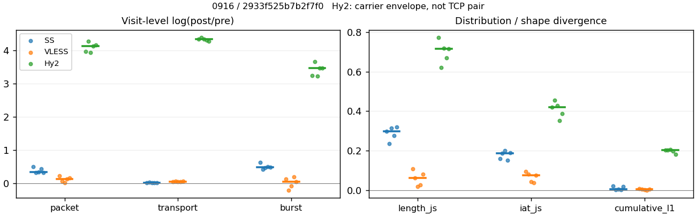
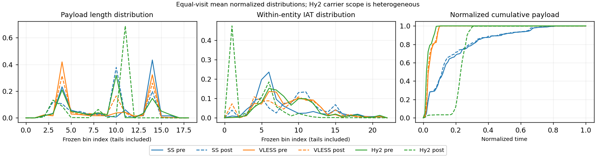

# 0916 · 条目 012 · developer.mozilla.org

目标：https://developer.mozilla.org/en-US/docs/Web/HTTP/Guides/Caching

活动标签：developer.mozilla.org::document_view。选定访问 15 次。

[返回总索引](../../README.md) · [统计口径](../../methods.md)

## 覆盖与资格（每次访问均保留）

| 部署 | 重复 | 主请求路由 | 活动状态 | 代理比较 | DIRECT pre | 请求 proxy/direct/unresolved | 错误 |
| --- | --- | --- | --- | --- | --- | --- | --- |
| Hy2 | 1 | proxy | passed | 1 | 0 | 87/0/0 | [] |
| Hy2 | 2 | proxy | passed | 1 | 0 | 87/0/0 | [] |
| Hy2 | 3 | proxy | passed | 1 | 0 | 87/0/0 | [] |
| Hy2 | 4 | proxy | passed | 1 | 0 | 87/0/0 | [] |
| Hy2 | 5 | proxy | passed | 1 | 0 | 87/0/0 | [] |
| SS | 1 | proxy | passed | 1 | 0 | 87/0/0 | [] |
| SS | 2 | proxy | passed | 1 | 0 | 87/0/0 | [] |
| SS | 3 | proxy | passed | 1 | 0 | 87/0/0 | [] |
| SS | 4 | proxy | passed | 1 | 0 | 87/0/0 | [] |
| SS | 5 | proxy | passed | 1 | 0 | 87/0/0 | [] |
| VLESS | 1 | proxy | passed | 1 | 0 | 87/0/0 | [] |
| VLESS | 2 | proxy | passed | 1 | 0 | 87/0/0 | [] |
| VLESS | 3 | proxy | passed | 1 | 0 | 87/0/0 | [] |
| VLESS | 4 | proxy | passed | 1 | 0 | 87/0/0 | [] |
| VLESS | 5 | proxy | passed | 1 | 0 | 87/0/0 | [] |

主请求非 proxy 的统计仅解释为已索引的辅助代理连接或 DIRECT 观测，不代表目标业务经代理传输。播放确认与配对资格是两道不同的门。

图中散点为单次访问，短线为重复中位数；Hy2 是共享载体包络，不能与 TCP 配对作等范围因果对比。

形态图先逐访问归一化，再对访问等权平均；实线 pre，虚线 post。分箱序号及边界见 methods，不将分箱索引误解为长度或时间。

## 每次访问的关键观测

### SS

范围：`exclusive_page`。每格 pre → post；空值为不可观测/不适用。

| 重复 | 包数 | 载荷字节 | burst | TCP FR | IAT中位µs | length JS | IAT JS |
| --- | --- | --- | --- | --- | --- | --- | --- |
| 1 | 559 → 922 | 5.9687e+05 → 6.0817e+05 | 350 → 662 | 44 → 50 | 37.465 → 535.43 | 0.29894 | 0.15928 |
| 2 | 618 → 866 | 6.197e+05 → 6.466e+05 | 410 → 627 | 53 → 55 | 47.757 → 860.3 | 0.23511 | 0.18626 |
| 3 | 571 → 804 | 5.9232e+05 → 6.0355e+05 | 337 → 543 | 45 → 57 | 32.285 → 347.46 | 0.31444 | 0.19983 |
| 4 | 678 → 1055 | 6.3286e+05 → 6.512e+05 | 451 → 743 | 56 → 65 | 38.575 → 471.5 | 0.27571 | 0.15017 |
| 5 | 624 → 864 | 6.0765e+05 → 6.198e+05 | 420 → 682 | 51 → 55 | 37.137 → 811.29 | 0.31902 | 0.1904 |

完整标量统计：中位数 [min,max]；Δ 为重复内逐访问变换的中位数，MAD 未缩放。n 为可用变换数；DIRECT-only 的 nΔ=0 不代表 pre 不可用。

| scope | 特征 | pre | post | Δ | IQRΔ | MADΔ | nΔ |
| --- | --- | --- | --- | --- | --- | --- | --- |
| exclusive_page | active_span_sum_s_1000ms | 9.4055 [8.1588, 11.927] | 10.833 [9.2828, 12.401] | 0.054425 | 0.070843 | 0.042268 | 5 |
| exclusive_page | active_span_sum_s_100ms | 2.3786 [1.4605, 2.6528] | 3.8685 [2.7047, 5.5132] | 0.54775 | 0.14527 | 0.076834 | 5 |
| exclusive_page | active_span_sum_s_500ms | 6.8946 [4.1816, 8.7738] | 7.9954 [6.1159, 10.844] | 0.21187 | 0.19892 | 0.063729 | 5 |
| exclusive_page | burst_bytes_iqr | 1861.5 [1448, 2896] | 1428 [1428, 1509] | -0.26511 | 0.48472 | 0.2512 | 5 |
| exclusive_page | burst_bytes_mad | 64 [31, 71] | 40 [34, 74] | -0.1372 | 0.58935 | 0.39209 | 5 |
| exclusive_page | burst_bytes_max | 20480 [17376, 20688] | 8568 [6116, 8864] | -0.87141 | 0.20618 | 0.16436 | 5 |
| exclusive_page | burst_bytes_mean | 1511.5 [1403.2, 1757.6] | 918.69 [876.45, 1111.5] | -0.46498 | 0.012412 | 0.0067358 | 5 |
| exclusive_page | burst_bytes_median | 64 [31, 71] | 40 [34, 74] | -0.1372 | 0.58935 | 0.39209 | 5 |
| exclusive_page | burst_bytes_min | 0 [0, 0] | 0 [0, 0] | — | — | — | 0 |
| exclusive_page | burst_bytes_p95 | 8464.8 [5839, 8729.6] | 2930 [2856, 4284] | -0.96939 | 0.34578 | 0.12922 | 5 |
| exclusive_page | burst_bytes_q25 | 0 [0, 0] | 0 [0, 0] | — | — | — | 0 |
| exclusive_page | burst_bytes_q75 | 1861.5 [1448, 2896] | 1428 [1428, 1509] | -0.26511 | 0.48472 | 0.2512 | 5 |
| exclusive_page | burst_bytes_std | 3301.1 [2631.5, 3699.9] | 1344.3 [1250.4, 1556.5] | -0.86273 | 0.048162 | 0.045011 | 5 |
| exclusive_page | burst_count | 410 [337, 451] | 662 [543, 743] | 0.48477 | 0.022202 | 0.014454 | 5 |
| exclusive_page | burst_duration_ms_iqr | 0.038665 [0.037458, 0.052321] | 0 [0, 0.0033425] | -2.4482 | — | — | 1 |
| exclusive_page | burst_duration_ms_mad | 0 [0, 0] | 0 [0, 0] | — | — | — | 0 |
| exclusive_page | burst_duration_ms_max | 5749.9 [1774.1, 15001] | 16383 [2323.7, 45481] | 0.67213 | 1.1087 | 0.67167 | 5 |
| exclusive_page | burst_duration_ms_mean | 35.585 [19.685, 111.83] | 67.965 [16.158, 129.09] | -0.013735 | 0.87579 | 0.71855 | 5 |
| exclusive_page | burst_duration_ms_median | 0 [0, 0] | 0 [0, 0] | — | — | — | 0 |
| exclusive_page | burst_duration_ms_min | 0 [0, 0] | 0 [0, 0] | — | — | — | 0 |
| exclusive_page | burst_duration_ms_p95 | 175.05 [87.556, 185.66] | 15.863 [8.9304, 17.402] | -2.3389 | 0.084555 | 0.056051 | 5 |
| exclusive_page | burst_duration_ms_q25 | 0 [0, 0] | 0 [0, 0] | — | — | — | 0 |
| exclusive_page | burst_duration_ms_q75 | 0.038665 [0.037458, 0.052321] | 0 [0, 0.0033425] | -2.4482 | — | — | 1 |
| exclusive_page | burst_duration_ms_std | 306.27 [116.27, 1074.6] | 805.32 [122.45, 1960.3] | 0.44493 | 0.88465 | 0.72843 | 5 |
| exclusive_page | burst_packets_iqr | 1 [1, 1] | 0 [0, 1] | 0 | — | — | 1 |
| exclusive_page | burst_packets_mad | 0 [0, 0] | 0 [0, 0] | — | — | — | 0 |
| exclusive_page | burst_packets_max | 9 [7, 11] | 11 [9, 13] | 0.22314 | 0.16705 | 0.14458 | 5 |
| exclusive_page | burst_packets_mean | 1.5073 [1.4857, 1.6944] | 1.3927 [1.2669, 1.4807] | -0.13482 | 0.049544 | 0.024536 | 5 |
| exclusive_page | burst_packets_median | 1 [1, 1] | 1 [1, 1] | 0 | 0 | 0 | 5 |
| exclusive_page | burst_packets_min | 1 [1, 1] | 1 [1, 1] | 0 | 0 | 0 | 5 |
| exclusive_page | burst_packets_p95 | 3 [3, 4] | 3 [3, 3] | 0 | 0 | 0 | 5 |
| exclusive_page | burst_packets_q25 | 1 [1, 1] | 1 [1, 1] | 0 | 0 | 0 | 5 |
| exclusive_page | burst_packets_q75 | 2 [2, 2] | 1 [1, 2] | -0.69315 | 0 | 0 | 5 |
| exclusive_page | burst_packets_std | 1.0085 [0.83511, 1.4834] | 0.9378 [0.82788, 1.0102] | -0.044802 | 0.094402 | 0.058301 | 5 |
| exclusive_page | connection_span_concurrency_max | 3 [3, 4] | 3 [3, 4] | 0 | 0 | 0 | 5 |
| exclusive_page | cumulative_l1 | — | — | 0.0042463 | 0.01534 | 0.0021097 | 5 |
| exclusive_page | cumulative_max | — | — | 0.18848 | 0.078473 | 0.041483 | 5 |
| exclusive_page | direction_entropy | 0.91644 [0.89815, 0.95576] | 0.64083 [0.58373, 0.69592] | -0.27562 | 0.045082 | 0.019816 | 5 |
| exclusive_page | down_burst_count | 202 [167, 223] | 329 [270, 369] | 0.48846 | 0.023197 | 0.015163 | 5 |
| exclusive_page | down_ip_bytes | 6.0196e+05 [5.8823e+05, 6.2624e+05] | 6.143e+05 [6.0206e+05, 6.4444e+05] | 0.028643 | 0.0059609 | 0.0054078 | 5 |
| exclusive_page | down_packets | 342 [322, 389] | 449 [444, 576] | 0.28694 | 0.12478 | 0.046187 | 5 |
| exclusive_page | down_transport_bytes | 5.8378e+05 [5.7068e+05, 6.0597e+05] | 5.9114e+05 [5.7866e+05, 6.1346e+05] | 0.013194 | 0.0013458 | 0.00069217 | 5 |
| exclusive_page | duration_s | 19.04 [5.8614, 64.698] | 19.038 [5.7298, 65.56] | -0.0031601 | 0.018791 | 0.015769 | 5 |
| exclusive_page | entity_count | 4 [3, 6] | 4 [3, 6] | 0 | 0 | 0 | 5 |
| exclusive_page | fr_runs | 51 [44, 56] | 55 [50, 65] | 0.12783 | 0.073528 | 0.052326 | 5 |
| exclusive_page | fr_runs_per_packet | 0.14088 [0.12195, 0.15362] | 0.11777 [0.097087, 0.12025] | -0.031193 | 0.010687 | 0.0040566 | 5 |
| exclusive_page | fr_switches | 47 [40, 51] | 51 [46, 60] | 0.13976 | 0.080841 | 0.058084 | 5 |
| exclusive_page | fr_switches_per_possible_transition | 0.13128 [0.11475, 0.13864] | 0.10817 [0.09002, 0.11465] | -0.027975 | 0.0093416 | 0.0036473 | 5 |
| exclusive_page | full_retransmission_fraction | 0.0016026 [0, 0.0029499] | 0.0086768 [0.0037313, 0.017062] | 0.0076567 | 0.0029031 | 0.001883 | 5 |
| exclusive_page | full_retransmission_packets | 1 [0, 2] | 8 [3, 18] | 2.0794 | 0.54931 | 0.11778 | 3 |
| exclusive_page | iat_count | 612 [555, 673] | 860 [801, 1050] | 0.34374 | 0.1046 | 0.016527 | 5 |
| exclusive_page | iat_js | — | — | 0.18626 | 0.031117 | 0.013565 | 5 |
| exclusive_page | iat_ks | — | — | 0.35654 | 0.031207 | 0.0097052 | 5 |
| exclusive_page | iat_median_us | 37.465 [32.285, 47.757] | 535.43 [347.46, 860.3] | 2.6597 | 0.38785 | 0.23149 | 5 |
| exclusive_page | iat_us_iqr | 368.37 [125.24, 699.01] | 1962.6 [1101.9, 4303.3] | 1.7083 | 0.63137 | 0.35781 | 5 |
| exclusive_page | iat_us_mad | 28.663 [20.905, 38.054] | 518.75 [343.44, 849.42] | 2.9287 | 0.30649 | 0.17684 | 5 |
| exclusive_page | iat_us_max | 1.5001e+07 [2.3226e+06, 1.5001e+07] | 1.4991e+07 [2.3237e+06, 1.5484e+07] | 0.00046298 | 0.023301 | 0.0011421 | 5 |
| exclusive_page | iat_us_mean | 92484 [27890, 2.8203e+05] | 65405 [16598, 1.6681e+05] | -0.43926 | 0.17255 | 0.0859 | 5 |
| exclusive_page | iat_us_median | 37.465 [32.285, 47.757] | 535.43 [347.46, 860.3] | 2.6597 | 0.38785 | 0.23149 | 5 |
| exclusive_page | iat_us_min | 0.314 [0.096, 0.386] | 0.036 [0.036, 0.038] | -2.1659 | 0.97957 | 0.15238 | 5 |
| exclusive_page | iat_us_p95 | 91956 [67043, 1.9214e+05] | 40742 [31323, 67703] | -0.89231 | 0.25284 | 0.15078 | 5 |
| exclusive_page | iat_us_q25 | 14.437 [13.979, 18.841] | 18.87 [16.103, 27.178] | 0.30002 | 0.36109 | 0.18715 | 5 |
| exclusive_page | iat_us_q75 | 382.93 [139.64, 717.85] | 1986.1 [1118.2, 4322.1] | 1.6804 | 0.56038 | 0.35056 | 5 |
| exclusive_page | iat_us_std | 8.8121e+05 [1.5259e+05, 1.8895e+06] | 7.3491e+05 [1.0772e+05, 1.4614e+06] | -0.21479 | 0.060987 | 0.033233 | 5 |
| exclusive_page | iat_wasserstein_log1p_us | — | — | 1.3127 | 0.093808 | 0.072729 | 5 |
| exclusive_page | idle_gap_count_1000ms | 8 [3, 15] | 8 [3, 12] | 0 | 0.22314 | 0 | 5 |
| exclusive_page | idle_gap_count_100ms | 31 [25, 38] | 28 [26, 36] | 0 | 0.24282 | 0.14953 | 5 |
| exclusive_page | idle_gap_count_500ms | 13 [8, 19] | 11 [6, 14] | -0.16705 | 0.17185 | 0.092946 | 5 |
| exclusive_page | idle_gap_sum_s_1000ms | 43.846 [5.2202, 163.2] | 42.822 [4.4043, 134.18] | -0.054664 | 0.1382 | 0.031043 | 5 |
| exclusive_page | idle_gap_sum_s_100ms | 51.071 [13.192, 170.23] | 49.685 [11.824, 139.35] | -0.1095 | 0.14183 | 0.08199 | 5 |
| exclusive_page | idle_gap_sum_s_500ms | 48.349 [8.5845, 165.76] | 46.273 [7.2416, 135.5] | -0.17012 | 0.13949 | 0.031418 | 5 |
| exclusive_page | ip_bytes | 6.4017e+05 [6.2207e+05, 6.6822e+05] | 6.707e+05 [6.5133e+05, 7.1476e+05] | 0.056359 | 0.020754 | 0.010405 | 5 |
| exclusive_page | length_iqr | 2801 [2790, 2804] | 1323.5 [1023, 2533] | -0.7497 | 0.11573 | 0.11083 | 5 |
| exclusive_page | length_js | — | — | 0.29894 | 0.03873 | 0.02008 | 5 |
| exclusive_page | length_ks | — | — | 0.44898 | 0.050276 | 0.0030728 | 5 |
| exclusive_page | length_mad | 1365 [1095, 1377] | 1157 [460, 1174] | -0.17149 | 0.26332 | 0.24115 | 5 |
| exclusive_page | length_max | 8920 [4096, 8920] | 2856 [2856, 5712] | -1.1389 | 0.80387 | 0 | 5 |
| exclusive_page | length_mean | 1678.6 [1605.2, 1796.2] | 1273.3 [1081.7, 1408.7] | -0.24301 | 0.15278 | 0.011377 | 5 |
| exclusive_page | length_median | 1448 [1448, 1801] | 1428 [1408, 1428] | -0.013908 | 0.066134 | 0 | 5 |
| exclusive_page | length_min | 31 [24, 31] | 20 [4, 20] | -0.43825 | 0.43721 | 0 | 5 |
| exclusive_page | length_p95 | 2896 [2896, 4096] | 2856 [2856, 2856] | -0.013908 | 0 | 0 | 5 |
| exclusive_page | length_q25 | 95 [92, 106] | 248 [98, 405] | 0.84999 | 1.1606 | 0.6106 | 5 |
| exclusive_page | length_q75 | 2896 [2896, 2896] | 1428 [1428, 2856] | -0.70706 | 0 | 0 | 5 |
| exclusive_page | length_std | 1440.5 [1245.9, 1963.9] | 976.6 [921.6, 1018.9] | -0.44665 | 0.21682 | 0.14855 | 5 |
| exclusive_page | length_wasserstein_bytes | — | — | 602.51 | 88.459 | 65.488 | 5 |
| exclusive_page | nonempty_entity_count | 4 [3, 6] | 4 [3, 6] | 0 | 0 | 0 | 5 |
| exclusive_page | nonempty_packets | 362 [343, 391] | 474 [459, 602] | 0.28551 | 0.15175 | 0.035095 | 5 |
| exclusive_page | offload_suspect_fraction | 0.29646 [0.26537, 0.31524] | 0.1128 [0.10806, 0.15704] | -0.17895 | 0.011805 | 0.0087854 | 5 |
| exclusive_page | packet_count | 618 [559, 678] | 866 [804, 1055] | 0.34221 | 0.10475 | 0.016788 | 5 |
| exclusive_page | rtt_median_ms | 0.072859 [0.064266, 0.078697] | 28.204 [27.729, 32.787] | 6.0322 | 0.14001 | 0.088013 | 5 |
| exclusive_page | rtt_sample_count | 241 [199, 261] | 185 [139, 207] | -0.27625 | 0.085585 | 0.04486 | 5 |
| exclusive_page | tcp_ack_count | 610 [555, 673] | 860 [800, 1050] | 0.34249 | 0.10249 | 0.015277 | 5 |
| exclusive_page | tcp_fin_count | 8 [6, 12] | 9 [6, 12] | 0 | 0.11778 | 0.087011 | 5 |
| exclusive_page | tcp_packet_count | 618 [559, 678] | 866 [804, 1055] | 0.34221 | 0.10475 | 0.016788 | 5 |
| exclusive_page | tcp_rst_count | 0 [0, 2] | 0 [0, 1] | -0.69315 | — | — | 1 |
| exclusive_page | tcp_syn_count | 8 [6, 12] | 10 [7, 12] | 0 | 0.15415 | 0 | 5 |
| exclusive_page | tcp_window_raw_median | 65504 [65440, 65535] | 154 [142, 156] | -6.0529 | 0.065248 | 0.013682 | 5 |
| exclusive_page | transition_entropy | 0.54114 [0.4963, 0.56642] | 0.43324 [0.36934, 0.43497] | -0.12852 | 0.022693 | 0.0075997 | 5 |
| exclusive_page | transition_n_mm | 217 [189, 235] | 378 [346, 468] | 0.60469 | 0.17163 | 0.087435 | 5 |
| exclusive_page | transition_n_mp | 21 [18, 23] | 24 [21, 28] | 0.15415 | 0.1097 | 0.067139 | 5 |
| exclusive_page | transition_n_pm | 25 [22, 28] | 27 [25, 32] | 0.12783 | 0.05657 | 0.050872 | 5 |
| exclusive_page | transition_n_pp | 94 [93, 103] | 48 [39, 69] | -0.67209 | 0.10817 | 0.097808 | 5 |
| exclusive_page | transition_p_mm | 0.91085 [0.9, 0.92032] | 0.94022 [0.93564, 0.95216] | 0.032521 | 0.0025011 | 0.0023266 | 5 |
| exclusive_page | transition_p_mp | 0.089147 [0.079681, 0.1] | 0.059783 [0.047836, 0.064356] | -0.032521 | 0.0025011 | 0.0023266 | 5 |
| exclusive_page | transition_p_pm | 0.20155 [0.1913, 0.21875] | 0.34722 [0.31683, 0.41791] | 0.14992 | 0.039821 | 0.033819 | 5 |
| exclusive_page | transition_p_pp | 0.79845 [0.78125, 0.8087] | 0.65278 [0.58209, 0.68317] | -0.14992 | 0.039821 | 0.033819 | 5 |
| exclusive_page | transport_bytes | 6.0765e+05 [5.9232e+05, 6.3286e+05] | 6.198e+05 [6.0355e+05, 6.512e+05] | 0.019795 | 0.0097902 | 0.0010296 | 5 |
| exclusive_page | up_burst_count | 208 [170, 228] | 333 [273, 374] | 0.48114 | 0.021237 | 0.013766 | 5 |
| exclusive_page | up_byte_fraction | 0.040285 [0.036526, 0.047128] | 0.046228 [0.041231, 0.057956] | 0.0060084 | 0.0016123 | 0.00093549 | 5 |
| exclusive_page | up_ip_bytes | 38215 [33839, 43581] | 56396 [49265, 70329] | 0.38917 | 0.041256 | 0.027686 | 5 |
| exclusive_page | up_packets | 275 [234, 289] | 419 [355, 479] | 0.42348 | 0.087804 | 0.0066869 | 5 |
| exclusive_page | up_transport_bytes | 24045 [21635, 29205] | 28652 [24885, 37741] | 0.16249 | 0.039502 | 0.020064 | 5 |
| exclusive_page | zero_iat_count | 0 [0, 0] | 0 [0, 0] | — | — | — | 0 |
| exclusive_page | zero_iat_fraction | 0 [0, 0] | 0 [0, 0] | 0 | 0 | 0 | 5 |

### VLESS

范围：`exclusive_page`。每格 pre → post；空值为不可观测/不适用。

| 重复 | 包数 | 载荷字节 | burst | TCP FR | IAT中位µs | length JS | IAT JS |
| --- | --- | --- | --- | --- | --- | --- | --- |
| 1 | 789 → 994 | 6.0194e+05 → 6.4009e+05 | 505 → 575 | 46 → 56 | 218.58 → 139.4 | 0.10896 | 0.093908 |
| 2 | 930 → 993 | 6.0891e+05 → 6.492e+05 | 757 → 623 | 46 → 56 | 140.69 → 218.66 | 0.061411 | 0.080276 |
| 3 | 858 → 874 | 6.015e+05 → 6.3473e+05 | 604 → 558 | 64 → 74 | 176.31 → 432.56 | 0.019339 | 0.043109 |
| 4 | 842 → 963 | 6.0163e+05 → 6.3361e+05 | 584 → 716 | 42 → 50 | 277.79 → 359.63 | 0.025891 | 0.037809 |
| 5 | 823 → 980 | 6.0218e+05 → 6.4265e+05 | 563 → 595 | 70 → 84 | 173.08 → 362.55 | 0.080253 | 0.074638 |

完整标量统计：中位数 [min,max]；Δ 为重复内逐访问变换的中位数，MAD 未缩放。n 为可用变换数；DIRECT-only 的 nΔ=0 不代表 pre 不可用。

| scope | 特征 | pre | post | Δ | IQRΔ | MADΔ | nΔ |
| --- | --- | --- | --- | --- | --- | --- | --- |
| exclusive_page | active_span_sum_s_1000ms | 8.2169 [8.0798, 10.256] | 8.5481 [7.9028, 9.7495] | -0.018623 | 0.063236 | 0.032041 | 5 |
| exclusive_page | active_span_sum_s_100ms | 1.6338 [1.5234, 1.8382] | 3.3109 [3.1158, 3.8871] | 0.70631 | 0.012622 | 0.0092187 | 5 |
| exclusive_page | active_span_sum_s_500ms | 4.7467 [3.7426, 5.1728] | 7.8469 [6.4183, 8.3907] | 0.50267 | 0.042803 | 0.021823 | 5 |
| exclusive_page | burst_bytes_iqr | 2824 [1448, 2896] | 2824 [2216.2, 2824] | 0 | 0.12853 | 0.10336 | 5 |
| exclusive_page | burst_bytes_mad | 31 [24, 64] | 72 [39, 77] | 0.6131 | 0.6131 | 0.38353 | 5 |
| exclusive_page | burst_bytes_max | 14480 [8688, 20480] | 6385 [5255, 8868] | -0.837 | 0.31442 | 0.17659 | 5 |
| exclusive_page | burst_bytes_mean | 1030.2 [804.38, 1192] | 1080.1 [884.92, 1137.5] | 0.0097584 | 0.20134 | 0.12323 | 5 |
| exclusive_page | burst_bytes_median | 31 [24, 64] | 72 [39, 77] | 0.6131 | 0.6131 | 0.38353 | 5 |
| exclusive_page | burst_bytes_min | 0 [0, 0] | 0 [0, 0] | — | — | — | 0 |
| exclusive_page | burst_bytes_p95 | 2968 [2896, 4308] | 2896 [2896, 2896] | -0.024558 | 0.36419 | 0.024558 | 5 |
| exclusive_page | burst_bytes_q25 | 0 [0, 0] | 0 [0, 0] | — | — | — | 0 |
| exclusive_page | burst_bytes_q75 | 2824 [1448, 2896] | 2824 [2216.2, 2824] | 0 | 0.12853 | 0.10336 | 5 |
| exclusive_page | burst_bytes_std | 1808.2 [1414.2, 1959.9] | 1308.3 [1246.4, 1382.8] | -0.35996 | 0.21235 | 0.012117 | 5 |
| exclusive_page | burst_count | 584 [505, 757] | 595 [558, 716] | 0.055282 | 0.20903 | 0.1345 | 5 |
| exclusive_page | burst_duration_ms_iqr | 0.47483 [0, 1.1462] | 1.0646 [0, 1.6084] | 0.51132 | 0.6426 | 0.51107 | 3 |
| exclusive_page | burst_duration_ms_mad | 0 [0, 0] | 0 [0, 0] | — | — | — | 0 |
| exclusive_page | burst_duration_ms_max | 2256.1 [1517.4, 15000] | 15010 [14967, 15058] | 1.8922 | 0.122 | 0.092148 | 5 |
| exclusive_page | burst_duration_ms_mean | 23.115 [16.287, 42.306] | 41.029 [29.157, 65.423] | 0.54867 | 0.54345 | 0.37528 | 5 |
| exclusive_page | burst_duration_ms_median | 0 [0, 0] | 0 [0, 0] | — | — | — | 0 |
| exclusive_page | burst_duration_ms_min | 0 [0, 0] | 0 [0, 0] | — | — | — | 0 |
| exclusive_page | burst_duration_ms_p95 | 10.095 [9.6223, 39.212] | 37.713 [9.4106, 62.153] | 0.28263 | 0.6552 | 0.35288 | 5 |
| exclusive_page | burst_duration_ms_q25 | 0 [0, 0] | 0 [0, 0] | — | — | — | 0 |
| exclusive_page | burst_duration_ms_q75 | 0.47483 [0, 1.1462] | 1.0646 [0, 1.6084] | 0.51132 | 0.6426 | 0.51107 | 3 |
| exclusive_page | burst_duration_ms_std | 143.28 [111.78, 628.94] | 631.85 [563.95, 858.62] | 1.4839 | 0.53515 | 0.272 | 5 |
| exclusive_page | burst_packets_iqr | 1 [0, 1] | 1 [0, 1] | 0 | 0 | 0 | 3 |
| exclusive_page | burst_packets_mad | 0 [0, 0] | 0 [0, 0] | — | — | — | 0 |
| exclusive_page | burst_packets_max | 6 [6, 10] | 9 [8, 11] | 0.28768 | 0.087011 | 0.087011 | 5 |
| exclusive_page | burst_packets_mean | 1.4418 [1.2285, 1.5624] | 1.5939 [1.345, 1.7287] | 0.10116 | 0.021623 | 0.018155 | 5 |
| exclusive_page | burst_packets_median | 1 [1, 1] | 1 [1, 1] | 0 | 0 | 0 | 5 |
| exclusive_page | burst_packets_min | 1 [1, 1] | 1 [1, 1] | 0 | 0 | 0 | 5 |
| exclusive_page | burst_packets_p95 | 2 [2, 3] | 3 [3, 4] | 0.40547 | 0.31015 | 0.28768 | 5 |
| exclusive_page | burst_packets_q25 | 1 [1, 1] | 1 [1, 1] | 0 | 0 | 0 | 5 |
| exclusive_page | burst_packets_q75 | 2 [1, 2] | 2 [1, 2] | 0 | 0 | 0 | 5 |
| exclusive_page | burst_packets_std | 0.70007 [0.51074, 0.86549] | 0.98551 [0.94759, 1.1558] | 0.34197 | 0.17778 | 0.1228 | 5 |
| exclusive_page | connection_span_concurrency_max | 3 [3, 4] | 3 [3, 4] | 0 | 0 | 0 | 5 |
| exclusive_page | cumulative_l1 | — | — | 0.0043049 | 0.0044055 | 0.0028876 | 5 |
| exclusive_page | cumulative_max | — | — | 0.17986 | 0.15331 | 0.14499 | 5 |
| exclusive_page | direction_entropy | 0.77273 [0.74484, 0.81704] | 0.56793 [0.53038, 0.64261] | -0.20409 | 0.056061 | 0.029106 | 5 |
| exclusive_page | down_burst_count | 290 [250, 376] | 295 [277, 356] | 0.055764 | 0.21079 | 0.13553 | 5 |
| exclusive_page | down_ip_bytes | 6.0743e+05 [6.0042e+05, 6.1055e+05] | 6.3614e+05 [6.3303e+05, 6.4542e+05] | 0.055541 | 0.015519 | 0.0022447 | 5 |
| exclusive_page | down_packets | 502 [470, 519] | 561 [510, 581] | 0.12153 | 0.12874 | 0.090156 | 5 |
| exclusive_page | down_transport_bytes | 5.8125e+05 [5.7553e+05, 5.8436e+05] | 6.0692e+05 [6.0606e+05, 6.1584e+05] | 0.049678 | 0.0098128 | 0.0034279 | 5 |
| exclusive_page | duration_s | 62.642 [62.01, 66.643] | 62.624 [61.908, 66.186] | -0.0062257 | 0.006185 | 0.0021812 | 5 |
| exclusive_page | entity_count | 5 [4, 5] | 5 [4, 5] | 0 | 0 | 0 | 5 |
| exclusive_page | fr_runs | 46 [42, 70] | 56 [50, 84] | 0.18232 | 0.022357 | 0.014389 | 5 |
| exclusive_page | fr_runs_per_packet | 0.09407 [0.083168, 0.14675] | 0.10219 [0.098425, 0.14947] | 0.0094478 | 0.010149 | 0.0057464 | 5 |
| exclusive_page | fr_switches | 41 [38, 65] | 51 [46, 79] | 0.19506 | 0.027198 | 0.023193 | 5 |
| exclusive_page | fr_switches_per_possible_transition | 0.084711 [0.075848, 0.13771] | 0.093923 [0.091071, 0.14183] | 0.01042 | 0.0090609 | 0.0050019 | 5 |
| exclusive_page | full_retransmission_fraction | 0.0012674 [0, 0.0032258] | 0 [0, 0] | -0.0012674 | 0.0023753 | 0.0012674 | 5 |
| exclusive_page | full_retransmission_packets | 1 [0, 3] | 0 [0, 0] | — | — | — | 0 |
| exclusive_page | iat_count | 838 [784, 925] | 975 [870, 989] | 0.13487 | 0.10969 | 0.068984 | 5 |
| exclusive_page | iat_js | — | — | 0.074638 | 0.037167 | 0.019269 | 5 |
| exclusive_page | iat_ks | — | — | 0.12664 | 0.073204 | 0.051325 | 5 |
| exclusive_page | iat_median_us | 176.31 [140.69, 277.79] | 359.63 [139.4, 432.56] | 0.44096 | 0.48116 | 0.29843 | 5 |
| exclusive_page | iat_us_iqr | 1394.8 [1278.9, 1903.2] | 1612.8 [1417.2, 2863.5] | 0.23192 | 0.13265 | 0.12633 | 5 |
| exclusive_page | iat_us_mad | 169.44 [133.14, 269.21] | 352.09 [139.28, 423.29] | 0.49545 | 0.49019 | 0.26314 | 5 |
| exclusive_page | iat_us_max | 1.5001e+07 [1.5001e+07, 1.5001e+07] | 1.5322e+07 [1.5279e+07, 1.5451e+07] | 0.021217 | 0.0048534 | 0.0028135 | 5 |
| exclusive_page | iat_us_mean | 88357 [77364, 1.5277e+05] | 75449 [68700, 1.3291e+05] | -0.14052 | 0.10875 | 0.067617 | 5 |
| exclusive_page | iat_us_median | 176.31 [140.69, 277.79] | 359.63 [139.4, 432.56] | 0.44096 | 0.48116 | 0.29843 | 5 |
| exclusive_page | iat_us_min | 0.236 [0.169, 2.761] | 0.037 [0.032, 0.038] | -1.9981 | 1.4327 | 0.47912 | 5 |
| exclusive_page | iat_us_p95 | 18800 [10805, 41610] | 43006 [42561, 49953] | 0.81708 | 1.0165 | 0.56424 | 5 |
| exclusive_page | iat_us_q25 | 38.154 [34.43, 43.288] | 15.393 [10.305, 36] | -0.90775 | 0.5043 | 0.29855 | 5 |
| exclusive_page | iat_us_q75 | 1435.5 [1313.4, 1941.4] | 1631.5 [1427.5, 2878.9] | 0.2169 | 0.14225 | 0.13011 | 5 |
| exclusive_page | iat_us_std | 1.019e+06 [9.5618e+05, 1.3732e+06] | 9.4564e+05 [9.0299e+05, 1.3268e+06] | -0.063037 | 0.034126 | 0.028675 | 5 |
| exclusive_page | iat_wasserstein_log1p_us | — | — | 0.57485 | 0.22972 | 0.13345 | 5 |
| exclusive_page | idle_gap_count_1000ms | 7 [6, 12] | 6 [5, 10] | -0.09531 | 0.18232 | 0.09531 | 5 |
| exclusive_page | idle_gap_count_100ms | 28 [23, 35] | 31 [26, 36] | 0.11333 | 0.016 | 0.0092736 | 5 |
| exclusive_page | idle_gap_count_500ms | 12 [12, 19] | 8 [6, 12] | -0.40547 | 0.054067 | 0.030772 | 5 |
| exclusive_page | idle_gap_sum_s_1000ms | 61.068 [57.989, 123.28] | 59.788 [57.738, 121.93] | -0.0043347 | 0.0071861 | 0.0021528 | 5 |
| exclusive_page | idle_gap_sum_s_100ms | 67.638 [64.545, 130.4] | 65.025 [62.525, 127.64] | -0.030534 | 0.0078152 | 0.0065483 | 5 |
| exclusive_page | idle_gap_sum_s_500ms | 64.526 [61.947, 127.07] | 60.489 [58.913, 122.92] | -0.050212 | 0.016381 | 0.014382 | 5 |
| exclusive_page | ip_bytes | 6.454e+05 [6.4295e+05, 6.5727e+05] | 6.929e+05 [6.8045e+05, 7.0138e+05] | 0.064955 | 0.01642 | 0.0097017 | 5 |
| exclusive_page | length_iqr | 2752 [2752, 2752] | 2752 [1376, 2752] | 0 | 0.69315 | 0 | 5 |
| exclusive_page | length_js | — | — | 0.061411 | 0.054362 | 0.03552 | 5 |
| exclusive_page | length_ks | — | — | 0.10518 | 0.034288 | 0.020285 | 5 |
| exclusive_page | length_mad | 350 [255, 548] | 1136 [860.5, 1265] | 1.0615 | 0.27764 | 0.14604 | 5 |
| exclusive_page | length_max | 5792 [2896, 8920] | 2896 [2824, 5648] | -0.69315 | 0.23615 | 0.23615 | 5 |
| exclusive_page | length_mean | 1227.6 [1179.4, 1262.4] | 1184.7 [1132.9, 1247.3] | -0.035642 | 0.10589 | 0.058529 | 5 |
| exclusive_page | length_median | 386 [286, 615] | 1208 [932.5, 1357] | 1.0353 | 0.25929 | 0.13888 | 5 |
| exclusive_page | length_min | 24 [2, 24] | 14 [2, 24] | 0 | 0.539 | 0 | 5 |
| exclusive_page | length_p95 | 2896 [2824, 2896] | 2824 [2824, 2824] | -0.025176 | 0.025176 | 0 | 5 |
| exclusive_page | length_q25 | 72 [72, 72] | 72 [72, 72] | 0 | 0 | 0 | 5 |
| exclusive_page | length_q75 | 2824 [2824, 2824] | 2824 [1448, 2824] | 0 | 0.66797 | 0 | 5 |
| exclusive_page | length_std | 1265.2 [1229.7, 1511.4] | 1136.3 [1007.7, 1179.1] | -0.17734 | 0.1772 | 0.12698 | 5 |
| exclusive_page | length_wasserstein_bytes | — | — | 208.63 | 224.61 | 128.22 | 5 |
| exclusive_page | nonempty_entity_count | 5 [4, 5] | 5 [4, 5] | 0 | 0 | 0 | 5 |
| exclusive_page | nonempty_packets | 496 [477, 510] | 548 [508, 565] | 0.099699 | 0.11357 | 0.064286 | 5 |
| exclusive_page | offload_suspect_fraction | 0.21212 [0.19032, 0.23447] | 0.16213 [0.1328, 0.19908] | -0.045117 | 0.037799 | 0.02087 | 5 |
| exclusive_page | packet_count | 842 [789, 930] | 980 [874, 994] | 0.13427 | 0.10905 | 0.068727 | 5 |
| exclusive_page | rtt_median_ms | 0.16764 [0.077045, 0.47193] | 1.1458 [0.050378, 2.0178] | 0.88704 | 1.5403 | 1.2281 | 5 |
| exclusive_page | rtt_sample_count | 319 [276, 399] | 373 [349, 424] | 0.12442 | 0.23761 | 0.10703 | 5 |
| exclusive_page | tcp_ack_count | 830 [775, 915] | 975 [870, 989] | 0.14447 | 0.11112 | 0.067707 | 5 |
| exclusive_page | tcp_fin_count | 9 [8, 10] | 10 [8, 10] | 0 | 0 | 0 | 5 |
| exclusive_page | tcp_packet_count | 842 [789, 930] | 980 [874, 994] | 0.13427 | 0.10905 | 0.068727 | 5 |
| exclusive_page | tcp_rst_count | 9 [8, 10] | 0 [0, 0] | — | — | — | 0 |
| exclusive_page | tcp_syn_count | 10 [8, 10] | 10 [8, 10] | 0 | 0 | 0 | 5 |
| exclusive_page | tcp_window_raw_median | 65535 [65451, 65535] | 164 [151, 217] | -5.9905 | 0.2041 | 0.081304 | 5 |
| exclusive_page | transition_entropy | 0.38379 [0.35432, 0.53565] | 0.36899 [0.35803, 0.48856] | -0.013361 | 0.035294 | 0.022887 | 5 |
| exclusive_page | transition_n_mm | 360 [321, 377] | 435 [403, 469] | 0.22758 | 0.18245 | 0.076327 | 5 |
| exclusive_page | transition_n_mp | 18 [17, 30] | 23 [21, 37] | 0.21131 | 0.035402 | 0.033813 | 5 |
| exclusive_page | transition_n_pm | 23 [21, 35] | 28 [25, 42] | 0.18232 | 0.022357 | 0.014389 | 5 |
| exclusive_page | transition_n_pp | 86 [76, 90] | 43 [40, 49] | -0.69315 | 0.09531 | 0.09531 | 5 |
| exclusive_page | transition_p_mm | 0.95174 [0.91453, 0.95685] | 0.95158 [0.92161, 0.95325] | -0.00080201 | 0.0065273 | 0.0042159 | 5 |
| exclusive_page | transition_p_mp | 0.048257 [0.043147, 0.08547] | 0.048421 [0.046748, 0.07839] | 0.00080201 | 0.0065273 | 0.0042159 | 5 |
| exclusive_page | transition_p_pm | 0.20721 [0.19626, 0.2963] | 0.41176 [0.36765, 0.49412] | 0.20456 | 0.033476 | 0.0036674 | 5 |
| exclusive_page | transition_p_pp | 0.79279 [0.7037, 0.80374] | 0.58824 [0.50588, 0.63235] | -0.20456 | 0.033476 | 0.0036674 | 5 |
| exclusive_page | transport_bytes | 6.0194e+05 [6.015e+05, 6.0891e+05] | 6.4009e+05 [6.3361e+05, 6.492e+05] | 0.061464 | 0.010279 | 0.0035763 | 5 |
| exclusive_page | up_burst_count | 294 [255, 381] | 300 [281, 360] | 0.054808 | 0.20729 | 0.13348 | 5 |
| exclusive_page | up_byte_fraction | 0.040332 [0.033661, 0.044265] | 0.051373 [0.043469, 0.055604] | 0.01104 | 0.00057065 | 0.0002981 | 5 |
| exclusive_page | up_ip_bytes | 40938 [37811, 46719] | 55705 [47303, 58790] | 0.27812 | 0.072374 | 0.029888 | 5 |
| exclusive_page | up_packets | 340 [319, 427] | 419 [364, 445] | 0.19433 | 0.1871 | 0.074802 | 5 |
| exclusive_page | up_transport_bytes | 24406 [20247, 26656] | 33149 [27542, 35734] | 0.30601 | 0.002815 | 0.0026408 | 5 |
| exclusive_page | zero_iat_count | 0 [0, 0] | 0 [0, 0] | — | — | — | 0 |
| exclusive_page | zero_iat_fraction | 0 [0, 0] | 0 [0, 0] | 0 | 0 | 0 | 5 |

### Hy2

范围：`carrier_context_envelope`。每格 pre → post；空值为不可观测/不适用。

| 重复 | 包数 | 载荷字节 | burst | TCP FR | IAT中位µs | length JS | IAT JS |
| --- | --- | --- | --- | --- | --- | --- | --- |
| 1 | 787 → 41556 | 5.9705e+05 → 4.5892e+07 | 517 → 13289 | — | 292.11 → 2.965 | 0.77173 | 0.42036 |
| 2 | 645 → 46561 | 6.1258e+05 → 4.9338e+07 | 433 → 17009 | — | 115.75 → 3.747 | 0.62172 | 0.45386 |
| 3 | 855 → 43961 | 6.024e+05 → 4.6609e+07 | 637 → 16161 | — | 164.72 → 4.937 | 0.71854 | 0.42791 |
| 4 | 668 → 41817 | 6.1829e+05 → 4.6148e+07 | 426 → 13780 | — | 113.56 → 2.0815 | 0.67078 | 0.35204 |
| 5 | 639 → 41478 | 6.3258e+05 → 4.5395e+07 | 430 → 13824 | — | 86.69 → 3.679 | 0.71561 | 0.38808 |

完整标量统计：中位数 [min,max]；Δ 为重复内逐访问变换的中位数，MAD 未缩放。n 为可用变换数；DIRECT-only 的 nΔ=0 不代表 pre 不可用。

| scope | 特征 | pre | post | Δ | IQRΔ | MADΔ | nΔ |
| --- | --- | --- | --- | --- | --- | --- | --- |
| carrier_context_envelope | active_span_sum_s_1000ms | 6.4537 [5.322, 9.0325] | 18.973 [15.522, 21.322] | 1.0191 | 0.18294 | 0.13164 | 5 |
| carrier_context_envelope | active_span_sum_s_100ms | 1.3657 [1.0763, 1.656] | 7.8426 [6.5634, 8.8368] | 1.7479 | 0.1407 | 0.080687 | 5 |
| carrier_context_envelope | active_span_sum_s_500ms | 5.6946 [4.606, 7.2858] | 17.539 [14.262, 20.733] | 1.1303 | 0.18216 | 0.14876 | 5 |
| carrier_context_envelope | burst_bytes_iqr | 1415 [1401.2, 2056] | 5100 [4223, 5130] | 1.1012 | 0.18115 | 0.18089 | 5 |
| carrier_context_envelope | burst_bytes_mad | 64 [31, 64] | 272 [265.5, 340] | 1.6701 | 0.46381 | 0.22314 | 5 |
| carrier_context_envelope | burst_bytes_max | 22342 [16384, 23862] | 2.323e+05 [1.0552e+05, 4.4851e+05] | 2.5638 | 0.40093 | 0.31302 | 5 |
| carrier_context_envelope | burst_bytes_mean | 1414.7 [945.68, 1471.1] | 3283.8 [2884, 3453.4] | 0.83613 | 0.29241 | 0.11811 | 5 |
| carrier_context_envelope | burst_bytes_median | 64 [31, 64] | 305 [298.5, 373] | 1.7627 | 0.46724 | 0.20127 | 5 |
| carrier_context_envelope | burst_bytes_min | 0 [0, 0] | 22 [22, 22] | — | — | — | 0 |
| carrier_context_envelope | burst_bytes_p95 | 6347.2 [3470.6, 7519.9] | 10932 [10932, 13814] | 0.77766 | 0.61327 | 0.33473 | 5 |
| carrier_context_envelope | burst_bytes_q25 | 0 [0, 0] | 68 [38, 100] | — | — | — | 0 |
| carrier_context_envelope | burst_bytes_q75 | 1415 [1401.2, 2056] | 5168 [4323, 5168] | 1.1246 | 0.17854 | 0.17073 | 5 |
| carrier_context_envelope | burst_bytes_std | 3348.2 [1969.7, 3623.5] | 5860.3 [4825.1, 8178.1] | 0.81403 | 0.41088 | 0.25427 | 5 |
| carrier_context_envelope | burst_count | 433 [426, 637] | 13824 [13289, 17009] | 3.4704 | 0.22989 | 0.20038 | 5 |
| carrier_context_envelope | burst_duration_ms_iqr | 0.095003 [0, 0.90704] | 0.024937 [0.022983, 0.028267] | -2.0534 | 1.6902 | 1.0247 | 4 |
| carrier_context_envelope | burst_duration_ms_mad | 0 [0, 0] | 4.4e-05 [4.2e-05, 6.2e-05] | — | — | — | 0 |
| carrier_context_envelope | burst_duration_ms_max | 14981 [1046.3, 15001] | 10001 [423.08, 10399] | -0.38337 | 0.039072 | 0.022068 | 5 |
| carrier_context_envelope | burst_duration_ms_mean | 51.028 [12.937, 128.88] | 1.1591 [0.40663, 1.4148] | -3.7847 | 0.21368 | 0.15633 | 5 |
| carrier_context_envelope | burst_duration_ms_median | 0 [0, 0] | 4.4e-05 [4.2e-05, 6.2e-05] | — | — | — | 0 |
| carrier_context_envelope | burst_duration_ms_min | 0 [0, 0] | 0 [0, 0] | — | — | — | 0 |
| carrier_context_envelope | burst_duration_ms_p95 | 63.419 [5.1306, 151.07] | 0.12975 [0.061237, 0.22759] | -6.5576 | 2.2349 | 0.38515 | 5 |
| carrier_context_envelope | burst_duration_ms_q25 | 0 [0, 0] | 0 [0, 0] | — | — | — | 0 |
| carrier_context_envelope | burst_duration_ms_q75 | 0.095003 [0, 0.90704] | 0.024937 [0.022983, 0.028267] | -2.0534 | 1.6902 | 1.0247 | 4 |
| carrier_context_envelope | burst_duration_ms_std | 726.01 [81.872, 1256.4] | 85.875 [9.0623, 100.36] | -2.1585 | 0.059204 | 0.042512 | 5 |
| carrier_context_envelope | burst_packets_iqr | 1 [0, 1] | 3 [2, 3] | 1.0986 | 0 | 0 | 4 |
| carrier_context_envelope | burst_packets_mad | 0 [0, 0] | 1 [1, 1] | — | — | — | 0 |
| carrier_context_envelope | burst_packets_max | 11 [5, 13] | 167 [77, 322] | 3.1403 | 0.92433 | 0.36824 | 5 |
| carrier_context_envelope | burst_packets_mean | 1.4896 [1.3422, 1.5681] | 3.0004 [2.7202, 3.1271] | 0.70264 | 0.046134 | 0.017282 | 5 |
| carrier_context_envelope | burst_packets_median | 1 [1, 1] | 2 [2, 2] | 0.69315 | 0 | 0 | 5 |
| carrier_context_envelope | burst_packets_min | 1 [1, 1] | 1 [1, 1] | 0 | 0 | 0 | 5 |
| carrier_context_envelope | burst_packets_p95 | 3 [3, 3] | 8 [8, 10] | 0.98083 | 0.11778 | 0 | 5 |
| carrier_context_envelope | burst_packets_q25 | 1 [1, 1] | 1 [1, 1] | 0 | 0 | 0 | 5 |
| carrier_context_envelope | burst_packets_q75 | 2 [1, 2] | 4 [3, 4] | 0.69315 | 0 | 0 | 5 |
| carrier_context_envelope | burst_packets_std | 0.93951 [0.72932, 1.1708] | 4.0287 [3.1478, 5.7296] | 1.4558 | 0.17673 | 0.13215 | 5 |
| carrier_context_envelope | connection_span_concurrency_max | 3 [3, 3] | 1 [1, 1] | -1.0986 | 0 | 0 | 5 |
| carrier_context_envelope | cumulative_l1 | — | — | 0.20352 | 0.005877 | 0.0033924 | 5 |
| carrier_context_envelope | cumulative_max | — | — | 0.96518 | 0.0028019 | 0.0014436 | 5 |
| carrier_context_envelope | direction_entropy | 0.90981 [0.82861, 0.92829] | 0.74896 [0.7304, 0.79562] | -0.12083 | 0.062641 | 0.040019 | 5 |
| carrier_context_envelope | direction_run_analog_runs | 65 [47, 78] | 13824 [13289, 17009] | 5.5007 | 0.22603 | 0.14412 | 5 |
| carrier_context_envelope | direction_run_analog_runs_per_packet | 0.16702 [0.12948, 0.17534] | 0.33329 [0.31979, 0.36762] | 0.18996 | 0.042236 | 0.028391 | 5 |
| carrier_context_envelope | direction_run_analog_switches | 59 [43, 73] | 13823 [13288, 17008] | 5.5794 | 0.21054 | 0.12606 | 5 |
| carrier_context_envelope | direction_run_analog_switches_per_possible_transition | 0.15486 [0.11978, 0.16389] | 0.33327 [0.31977, 0.36761] | 0.2014 | 0.038833 | 0.026744 | 5 |
| carrier_context_envelope | down_burst_count | 214 [210, 316] | 6912 [6644, 8504] | 3.4797 | 0.23443 | 0.20259 | 5 |
| carrier_context_envelope | down_ip_bytes | 6.0481e+05 [5.9462e+05, 6.2742e+05] | 4.6485e+07 [4.5699e+07, 4.9388e+07] | 4.3571 | 0.023213 | 0.021336 | 5 |
| carrier_context_envelope | down_packets | 382 [360, 469] | 33239 [32604, 35370] | 4.4661 | 0.23463 | 0.10766 | 5 |
| carrier_context_envelope | down_transport_bytes | 5.8579e+05 [5.702e+05, 6.0867e+05] | 4.5554e+07 [4.4786e+07, 4.8398e+07] | 4.3789 | 0.03144 | 0.030087 | 5 |
| carrier_context_envelope | duration_s | 61.738 [61.452, 62.886] | 61.723 [61.452, 62.872] | -0.00022924 | 0.00024195 | 5.1061e-05 | 5 |
| carrier_context_envelope | entity_count | 5 [4, 6] | 1 [1, 1] | -1.6094 | 0 | 0 | 5 |
| carrier_context_envelope | full_retransmission_fraction | 0.0023392 [0, 0.0078247] | — | — | — | — | 0 |
| carrier_context_envelope | full_retransmission_packets | 2 [0, 5] | — | — | — | — | 0 |
| carrier_context_envelope | iat_count | 662 [635, 850] | 41816 [41477, 46560] | 4.1458 | 0.20635 | 0.14126 | 5 |
| carrier_context_envelope | iat_js | — | — | 0.42036 | 0.039832 | 0.032278 | 5 |
| carrier_context_envelope | iat_ks | — | — | 0.60425 | 0.1015 | 0.052109 | 5 |
| carrier_context_envelope | iat_median_us | 115.75 [86.69, 292.11] | 3.679 [2.0815, 4.937] | -3.5075 | 0.56878 | 0.34779 | 5 |
| carrier_context_envelope | iat_us_iqr | 1281.8 [694.27, 1597.6] | 24.867 [22.117, 44.882] | -3.8867 | 0.60137 | 0.3932 | 5 |
| carrier_context_envelope | iat_us_mad | 104.03 [74.27, 282.02] | 3.643 [2.0495, 4.901] | -3.4597 | 0.59812 | 0.4448 | 5 |
| carrier_context_envelope | iat_us_max | 1.5001e+07 [1.5001e+07, 1.5001e+07] | 1.0001e+07 [9.9754e+06, 1.0001e+07] | -0.40549 | 5.1235e-05 | 3.2458e-05 | 5 |
| carrier_context_envelope | iat_us_mean | 1.7923e+05 [1.445e+05, 2.8925e+05] | 1473.6 [1319.8, 1498.4] | -4.8009 | 0.28228 | 0.15076 | 5 |
| carrier_context_envelope | iat_us_median | 115.75 [86.69, 292.11] | 3.679 [2.0815, 4.937] | -3.5075 | 0.56878 | 0.34779 | 5 |
| carrier_context_envelope | iat_us_min | 0.354 [0.139, 1.582] | 0.001 [0, 0.003] | -6.6733 | 1.2034 | 0.24441 | 3 |
| carrier_context_envelope | iat_us_p95 | 49264 [36634, 1.2284e+05] | 295.94 [98.228, 810.94] | -4.8186 | 1.7197 | 0.5384 | 5 |
| carrier_context_envelope | iat_us_q25 | 45.799 [27.144, 52.42] | 0.044 [0.042, 0.048] | -6.9943 | 0.40456 | 0.026295 | 5 |
| carrier_context_envelope | iat_us_q75 | 1331.1 [721.41, 1643.4] | 24.911 [22.159, 44.925] | -3.9206 | 0.60087 | 0.38572 | 5 |
| carrier_context_envelope | iat_us_std | 1.5205e+06 [1.3659e+06, 1.964e+06] | 89744 [81882, 94150] | -2.799 | 0.15551 | 0.016877 | 5 |
| carrier_context_envelope | iat_wasserstein_log1p_us | — | — | 3.7517 | 0.49579 | 0.17202 | 5 |
| carrier_context_envelope | idle_gap_count_1000ms | 10 [9, 16] | 9 [6, 9] | -0.22314 | 0.3001 | 0.11778 | 5 |
| carrier_context_envelope | idle_gap_count_100ms | 32 [26, 34] | 57 [40, 74] | 0.54654 | 0.51454 | 0.29165 | 5 |
| carrier_context_envelope | idle_gap_count_500ms | 12 [11, 17] | 10 [8, 11] | -0.20067 | 0.22314 | 0.20067 | 5 |
| carrier_context_envelope | idle_gap_sum_s_1000ms | 115.13 [112.2, 178.35] | 42.478 [41.311, 46.201] | -1.0192 | 0.044458 | 0.031903 | 5 |
| carrier_context_envelope | idle_gap_sum_s_100ms | 121.46 [117.48, 182.59] | 54.347 [52.785, 55.16] | -0.80002 | 0.028751 | 0.018517 | 5 |
| carrier_context_envelope | idle_gap_sum_s_500ms | 116.35 [112.95, 179.06] | 43.913 [42.139, 47.461] | -1.0107 | 0.055944 | 0.051024 | 5 |
| carrier_context_envelope | ip_bytes | 6.4696e+05 [6.3805e+05, 6.6593e+05] | 4.7319e+07 [4.6557e+07, 5.0642e+07] | 4.3007 | 0.020428 | 0.017773 | 5 |
| carrier_context_envelope | length_iqr | 1625.5 [1199.5, 2736] | 596 [596, 1208] | -0.71874 | 0.30391 | 0.26796 | 5 |
| carrier_context_envelope | length_js | — | — | 0.71561 | 0.047762 | 0.044827 | 5 |
| carrier_context_envelope | length_ks | — | — | 0.44478 | 0.12993 | 0.053595 | 5 |
| carrier_context_envelope | length_mad | 1239 [455, 1325] | 0 [0, 0] | — | — | — | 0 |
| carrier_context_envelope | length_max | 8920 [8920, 8920] | 1441 [1441, 1441] | -1.823 | 0 | 0 | 5 |
| carrier_context_envelope | length_mean | 1597.6 [1270.9, 1742.6] | 1094.4 [1059.6, 1104.3] | -0.36997 | 0.27862 | 0.095181 | 5 |
| carrier_context_envelope | length_median | 1404 [1385, 1415] | 1441 [1441, 1441] | 0.026012 | 0.021429 | 0.0078042 | 5 |
| carrier_context_envelope | length_min | 28 [8, 31] | 22 [22, 22] | -0.24116 | 1.2368 | 0.10178 | 5 |
| carrier_context_envelope | length_p95 | 5856.4 [2830, 7464] | 1441 [1441, 1441] | -1.4022 | 0.8442 | 0.24256 | 5 |
| carrier_context_envelope | length_q25 | 96 [94, 204.5] | 845 [233, 845] | 1.5005 | 0.77727 | 0.61383 | 5 |
| carrier_context_envelope | length_q75 | 1719.5 [1404, 2830] | 1441 [1441, 1441] | -0.1767 | 0.34201 | 0.1949 | 5 |
| carrier_context_envelope | length_std | 1951.1 [1228.5, 2052.7] | 571.64 [565.81, 593.71] | -1.2277 | 0.48094 | 0.056693 | 5 |
| carrier_context_envelope | length_wasserstein_bytes | — | — | 922.47 | 513.94 | 85.877 | 5 |
| carrier_context_envelope | nonempty_entity_count | 5 [4, 6] | 1 [1, 1] | -1.6094 | 0 | 0 | 5 |
| carrier_context_envelope | nonempty_packets | 387 [363, 474] | 41817 [41478, 46561] | 4.6826 | 0.20866 | 0.15278 | 5 |
| carrier_context_envelope | offload_suspect_fraction | 0.15569 [0.091228, 0.22222] | 0 [0, 0] | -0.15569 | 0.066221 | 0.059119 | 5 |
| carrier_context_envelope | packet_count | 668 [639, 855] | 41817 [41478, 46561] | 4.1368 | 0.20645 | 0.1425 | 5 |
| carrier_context_envelope | rtt_median_ms | 0.10333 [0.065845, 0.20392] | — | — | — | — | 0 |
| carrier_context_envelope | rtt_sample_count | 261 [244, 360] | 0 [0, 0] | — | — | — | 0 |
| carrier_context_envelope | tcp_ack_count | 662 [635, 850] | — | — | — | — | 0 |
| carrier_context_envelope | tcp_fin_count | 10 [8, 12] | — | — | — | — | 0 |
| carrier_context_envelope | tcp_packet_count | 668 [639, 855] | 0 [0, 0] | — | — | — | 0 |
| carrier_context_envelope | tcp_rst_count | 0 [0, 0] | — | — | — | — | 0 |
| carrier_context_envelope | tcp_syn_count | 10 [8, 12] | — | — | — | — | 0 |
| carrier_context_envelope | tcp_window_raw_median | 65496 [65471, 65535] | — | — | — | — | 0 |
| carrier_context_envelope | transition_entropy | 0.58387 [0.51038, 0.61791] | 0.74891 [0.73018, 0.7956] | 0.17769 | 0.092226 | 0.048496 | 5 |
| carrier_context_envelope | transition_n_mm | 223 [212, 317] | 26349 [25441, 26866] | 4.7513 | 0.31361 | 0.090773 | 5 |
| carrier_context_envelope | transition_n_mp | 28 [20, 34] | 6912 [6644, 8504] | 5.6299 | 0.24683 | 0.12423 | 5 |
| carrier_context_envelope | transition_n_pm | 32 [23, 39] | 6911 [6644, 8504] | 5.5314 | 0.17886 | 0.12772 | 5 |
| carrier_context_envelope | transition_n_pp | 91 [83, 99] | 1962 [1688, 2686] | 3.1009 | 0.21671 | 0.15428 | 5 |
| carrier_context_envelope | transition_p_mm | 0.9 [0.88703, 0.91736] | 0.788 [0.75896, 0.79907] | -0.12746 | 0.028429 | 0.026534 | 5 |
| carrier_context_envelope | transition_p_mp | 0.1 [0.082645, 0.11297] | 0.212 [0.20093, 0.24104] | 0.12746 | 0.028429 | 0.026534 | 5 |
| carrier_context_envelope | transition_p_pm | 0.26016 [0.19658, 0.31967] | 0.77888 [0.75996, 0.80319] | 0.51386 | 0.069232 | 0.050778 | 5 |
| carrier_context_envelope | transition_p_pp | 0.73984 [0.68033, 0.80342] | 0.22112 [0.19681, 0.24004] | -0.51386 | 0.069232 | 0.050778 | 5 |
| carrier_context_envelope | transport_bytes | 6.1258e+05 [5.9705e+05, 6.3258e+05] | 4.6148e+07 [4.5395e+07, 4.9338e+07] | 4.342 | 0.035961 | 0.029387 | 5 |
| carrier_context_envelope | up_burst_count | 219 [216, 321] | 6912 [6645, 8505] | 3.4611 | 0.22545 | 0.19822 | 5 |
| carrier_context_envelope | up_byte_fraction | 0.044753 [0.037787, 0.047956] | 0.013412 [0.0090892, 0.01906] | -0.030732 | 0.010405 | 0.0051522 | 5 |
| carrier_context_envelope | up_ip_bytes | 43427 [38503, 47147] | 8.573e+05 [6.5481e+05, 1.2537e+06] | 2.9988 | 0.17374 | 0.10426 | 5 |
| carrier_context_envelope | up_packets | 286 [279, 387] | 8874 [8489, 11191] | 3.401 | 0.16469 | 0.10599 | 5 |
| carrier_context_envelope | up_transport_bytes | 26851 [23903, 29651] | 6.0883e+05 [4.1712e+05, 9.4037e+05] | 3.188 | 0.23985 | 0.19035 | 5 |
| carrier_context_envelope | zero_iat_count | 0 [0, 0] | 0 [0, 1] | — | — | — | 0 |
| carrier_context_envelope | zero_iat_fraction | 0 [0, 0] | 0 [0, 2.3914e-05] | 0 | 2.1478e-05 | 0 | 5 |

## 不同部署对比

以下是各部署自身重复中位数的差异，不按重复编号强行配对。跨 TCP/Hy2 的行标记异质观测范围。

| 视角 | 特征 | 部署A | 部署B | A中位 | B中位 | B−A | 比较口径 |
| --- | --- | --- | --- | --- | --- | --- | --- |
| pre | burst_count | VLESS | SS | 584 | 410 | -174 | same_scope_unpaired_visits |
| pre | burst_count | VLESS | Hy2 | 584 | 433 | -151 | heterogeneous_scope_descriptive_only |
| pre | burst_count | SS | Hy2 | 410 | 433 | 23 | heterogeneous_scope_descriptive_only |
| pre | connection_span_concurrency_max | VLESS | SS | 3 | 3 | 0 | same_scope_unpaired_visits |
| pre | connection_span_concurrency_max | VLESS | Hy2 | 3 | 3 | 0 | heterogeneous_scope_descriptive_only |
| pre | connection_span_concurrency_max | SS | Hy2 | 3 | 3 | 0 | heterogeneous_scope_descriptive_only |
| pre | direction_entropy | VLESS | SS | 0.77273 | 0.91644 | 0.14371 | same_scope_unpaired_visits |
| pre | direction_entropy | VLESS | Hy2 | 0.77273 | 0.90981 | 0.13707 | heterogeneous_scope_descriptive_only |
| pre | direction_entropy | SS | Hy2 | 0.91644 | 0.90981 | -0.0066345 | heterogeneous_scope_descriptive_only |
| pre | down_transport_bytes | VLESS | SS | 5.8125e+05 | 5.8378e+05 | 2527 | same_scope_unpaired_visits |
| pre | down_transport_bytes | VLESS | Hy2 | 5.8125e+05 | 5.8579e+05 | 4539 | heterogeneous_scope_descriptive_only |
| pre | down_transport_bytes | SS | Hy2 | 5.8378e+05 | 5.8579e+05 | 2012 | heterogeneous_scope_descriptive_only |
| pre | duration_s | VLESS | SS | 62.642 | 19.04 | -43.602 | same_scope_unpaired_visits |
| pre | duration_s | VLESS | Hy2 | 62.642 | 61.738 | -0.904 | heterogeneous_scope_descriptive_only |
| pre | duration_s | SS | Hy2 | 19.04 | 61.738 | 42.698 | heterogeneous_scope_descriptive_only |
| pre | entity_count | VLESS | SS | 5 | 4 | -1 | same_scope_unpaired_visits |
| pre | entity_count | VLESS | Hy2 | 5 | 5 | 0 | heterogeneous_scope_descriptive_only |
| pre | entity_count | SS | Hy2 | 4 | 5 | 1 | heterogeneous_scope_descriptive_only |
| pre | fr_runs | VLESS | SS | 46 | 51 | 5 | same_scope_unpaired_visits |
| pre | fr_runs_per_packet | VLESS | SS | 0.09407 | 0.14088 | 0.046814 | same_scope_unpaired_visits |
| pre | fr_switches | VLESS | SS | 41 | 47 | 6 | same_scope_unpaired_visits |
| pre | fr_switches_per_possible_transition | VLESS | SS | 0.084711 | 0.13128 | 0.046574 | same_scope_unpaired_visits |
| pre | full_retransmission_fraction | VLESS | SS | 0.0012674 | 0.0016026 | 0.00033514 | same_scope_unpaired_visits |
| pre | full_retransmission_fraction | VLESS | Hy2 | 0.0012674 | 0.0023392 | 0.0010718 | heterogeneous_scope_descriptive_only |
| pre | full_retransmission_fraction | SS | Hy2 | 0.0016026 | 0.0023392 | 0.00073662 | heterogeneous_scope_descriptive_only |
| pre | iat_median_us | VLESS | SS | 176.31 | 37.465 | -138.85 | same_scope_unpaired_visits |
| pre | iat_median_us | VLESS | Hy2 | 176.31 | 115.75 | -60.562 | heterogeneous_scope_descriptive_only |
| pre | iat_median_us | SS | Hy2 | 37.465 | 115.75 | 78.287 | heterogeneous_scope_descriptive_only |
| pre | iat_us_p95 | VLESS | SS | 18800 | 91956 | 73156 | same_scope_unpaired_visits |
| pre | iat_us_p95 | VLESS | Hy2 | 18800 | 49264 | 30464 | heterogeneous_scope_descriptive_only |
| pre | iat_us_p95 | SS | Hy2 | 91956 | 49264 | -42692 | heterogeneous_scope_descriptive_only |
| pre | ip_bytes | VLESS | SS | 6.454e+05 | 6.4017e+05 | -5232 | same_scope_unpaired_visits |
| pre | ip_bytes | VLESS | Hy2 | 6.454e+05 | 6.4696e+05 | 1558 | heterogeneous_scope_descriptive_only |
| pre | ip_bytes | SS | Hy2 | 6.4017e+05 | 6.4696e+05 | 6790 | heterogeneous_scope_descriptive_only |
| pre | length_median | VLESS | SS | 386 | 1448 | 1062 | same_scope_unpaired_visits |
| pre | length_median | VLESS | Hy2 | 386 | 1404 | 1018 | heterogeneous_scope_descriptive_only |
| pre | length_median | SS | Hy2 | 1448 | 1404 | -44 | heterogeneous_scope_descriptive_only |
| pre | length_p95 | VLESS | SS | 2896 | 2896 | 0 | same_scope_unpaired_visits |
| pre | length_p95 | VLESS | Hy2 | 2896 | 5856.4 | 2960.4 | heterogeneous_scope_descriptive_only |
| pre | length_p95 | SS | Hy2 | 2896 | 5856.4 | 2960.4 | heterogeneous_scope_descriptive_only |
| pre | nonempty_packets | VLESS | SS | 496 | 362 | -134 | same_scope_unpaired_visits |
| pre | nonempty_packets | VLESS | Hy2 | 496 | 387 | -109 | heterogeneous_scope_descriptive_only |
| pre | nonempty_packets | SS | Hy2 | 362 | 387 | 25 | heterogeneous_scope_descriptive_only |
| pre | offload_suspect_fraction | VLESS | SS | 0.21212 | 0.29646 | 0.084339 | same_scope_unpaired_visits |
| pre | offload_suspect_fraction | VLESS | Hy2 | 0.21212 | 0.15569 | -0.056433 | heterogeneous_scope_descriptive_only |
| pre | offload_suspect_fraction | SS | Hy2 | 0.29646 | 0.15569 | -0.14077 | heterogeneous_scope_descriptive_only |
| pre | packet_count | VLESS | SS | 842 | 618 | -224 | same_scope_unpaired_visits |
| pre | packet_count | VLESS | Hy2 | 842 | 668 | -174 | heterogeneous_scope_descriptive_only |
| pre | packet_count | SS | Hy2 | 618 | 668 | 50 | heterogeneous_scope_descriptive_only |
| pre | rtt_median_ms | VLESS | SS | 0.16764 | 0.072859 | -0.094785 | same_scope_unpaired_visits |
| pre | rtt_median_ms | VLESS | Hy2 | 0.16764 | 0.10333 | -0.06431 | heterogeneous_scope_descriptive_only |
| pre | rtt_median_ms | SS | Hy2 | 0.072859 | 0.10333 | 0.030475 | heterogeneous_scope_descriptive_only |
| pre | transition_entropy | VLESS | SS | 0.38379 | 0.54114 | 0.15735 | same_scope_unpaired_visits |
| pre | transition_entropy | VLESS | Hy2 | 0.38379 | 0.58387 | 0.20008 | heterogeneous_scope_descriptive_only |
| pre | transition_entropy | SS | Hy2 | 0.54114 | 0.58387 | 0.042729 | heterogeneous_scope_descriptive_only |
| pre | transport_bytes | VLESS | SS | 6.0194e+05 | 6.0765e+05 | 5712 | same_scope_unpaired_visits |
| pre | transport_bytes | VLESS | Hy2 | 6.0194e+05 | 6.1258e+05 | 10645 | heterogeneous_scope_descriptive_only |
| pre | transport_bytes | SS | Hy2 | 6.0765e+05 | 6.1258e+05 | 4933 | heterogeneous_scope_descriptive_only |
| pre | up_byte_fraction | VLESS | SS | 0.040332 | 0.040285 | -4.7172e-05 | same_scope_unpaired_visits |
| pre | up_byte_fraction | VLESS | Hy2 | 0.040332 | 0.044753 | 0.0044203 | heterogeneous_scope_descriptive_only |
| pre | up_byte_fraction | SS | Hy2 | 0.040285 | 0.044753 | 0.0044675 | heterogeneous_scope_descriptive_only |
| pre | up_transport_bytes | VLESS | SS | 24406 | 24045 | -361 | same_scope_unpaired_visits |
| pre | up_transport_bytes | VLESS | Hy2 | 24406 | 26851 | 2445 | heterogeneous_scope_descriptive_only |
| pre | up_transport_bytes | SS | Hy2 | 24045 | 26851 | 2806 | heterogeneous_scope_descriptive_only |
| post | burst_count | VLESS | SS | 595 | 662 | 67 | same_scope_unpaired_visits |
| post | burst_count | VLESS | Hy2 | 595 | 13824 | 13229 | heterogeneous_scope_descriptive_only |
| post | burst_count | SS | Hy2 | 662 | 13824 | 13162 | heterogeneous_scope_descriptive_only |
| post | connection_span_concurrency_max | VLESS | SS | 3 | 3 | 0 | same_scope_unpaired_visits |
| post | connection_span_concurrency_max | VLESS | Hy2 | 3 | 1 | -2 | heterogeneous_scope_descriptive_only |
| post | connection_span_concurrency_max | SS | Hy2 | 3 | 1 | -2 | heterogeneous_scope_descriptive_only |
| post | direction_entropy | VLESS | SS | 0.56793 | 0.64083 | 0.072901 | same_scope_unpaired_visits |
| post | direction_entropy | VLESS | Hy2 | 0.56793 | 0.74896 | 0.18103 | heterogeneous_scope_descriptive_only |
| post | direction_entropy | SS | Hy2 | 0.64083 | 0.74896 | 0.10813 | heterogeneous_scope_descriptive_only |
| post | down_transport_bytes | VLESS | SS | 6.0692e+05 | 5.9114e+05 | -15775 | same_scope_unpaired_visits |
| post | down_transport_bytes | VLESS | Hy2 | 6.0692e+05 | 4.5554e+07 | 4.4947e+07 | heterogeneous_scope_descriptive_only |
| post | down_transport_bytes | SS | Hy2 | 5.9114e+05 | 4.5554e+07 | 4.4963e+07 | heterogeneous_scope_descriptive_only |
| post | duration_s | VLESS | SS | 62.624 | 19.038 | -43.587 | same_scope_unpaired_visits |
| post | duration_s | VLESS | Hy2 | 62.624 | 61.723 | -0.90121 | heterogeneous_scope_descriptive_only |
| post | duration_s | SS | Hy2 | 19.038 | 61.723 | 42.686 | heterogeneous_scope_descriptive_only |
| post | entity_count | VLESS | SS | 5 | 4 | -1 | same_scope_unpaired_visits |
| post | entity_count | VLESS | Hy2 | 5 | 1 | -4 | heterogeneous_scope_descriptive_only |
| post | entity_count | SS | Hy2 | 4 | 1 | -3 | heterogeneous_scope_descriptive_only |
| post | fr_runs | VLESS | SS | 56 | 55 | -1 | same_scope_unpaired_visits |
| post | fr_runs_per_packet | VLESS | SS | 0.10219 | 0.11777 | 0.015583 | same_scope_unpaired_visits |
| post | fr_switches | VLESS | SS | 51 | 51 | 0 | same_scope_unpaired_visits |
| post | fr_switches_per_possible_transition | VLESS | SS | 0.093923 | 0.10817 | 0.014245 | same_scope_unpaired_visits |
| post | full_retransmission_fraction | VLESS | SS | 0 | 0.0086768 | 0.0086768 | same_scope_unpaired_visits |
| post | iat_median_us | VLESS | SS | 359.63 | 535.43 | 175.8 | same_scope_unpaired_visits |
| post | iat_median_us | VLESS | Hy2 | 359.63 | 3.679 | -355.96 | heterogeneous_scope_descriptive_only |
| post | iat_median_us | SS | Hy2 | 535.43 | 3.679 | -531.76 | heterogeneous_scope_descriptive_only |
| post | iat_us_p95 | VLESS | SS | 43006 | 40742 | -2263.7 | same_scope_unpaired_visits |
| post | iat_us_p95 | VLESS | Hy2 | 43006 | 295.94 | -42710 | heterogeneous_scope_descriptive_only |
| post | iat_us_p95 | SS | Hy2 | 40742 | 295.94 | -40446 | heterogeneous_scope_descriptive_only |
| post | ip_bytes | VLESS | SS | 6.929e+05 | 6.707e+05 | -22206 | same_scope_unpaired_visits |
| post | ip_bytes | VLESS | Hy2 | 6.929e+05 | 4.7319e+07 | 4.6626e+07 | heterogeneous_scope_descriptive_only |
| post | ip_bytes | SS | Hy2 | 6.707e+05 | 4.7319e+07 | 4.6649e+07 | heterogeneous_scope_descriptive_only |
| post | length_median | VLESS | SS | 1208 | 1428 | 220 | same_scope_unpaired_visits |
| post | length_median | VLESS | Hy2 | 1208 | 1441 | 233 | heterogeneous_scope_descriptive_only |
| post | length_median | SS | Hy2 | 1428 | 1441 | 13 | heterogeneous_scope_descriptive_only |
| post | length_p95 | VLESS | SS | 2824 | 2856 | 32 | same_scope_unpaired_visits |
| post | length_p95 | VLESS | Hy2 | 2824 | 1441 | -1383 | heterogeneous_scope_descriptive_only |
| post | length_p95 | SS | Hy2 | 2856 | 1441 | -1415 | heterogeneous_scope_descriptive_only |
| post | nonempty_packets | VLESS | SS | 548 | 474 | -74 | same_scope_unpaired_visits |
| post | nonempty_packets | VLESS | Hy2 | 548 | 41817 | 41269 | heterogeneous_scope_descriptive_only |
| post | nonempty_packets | SS | Hy2 | 474 | 41817 | 41343 | heterogeneous_scope_descriptive_only |
| post | offload_suspect_fraction | VLESS | SS | 0.16213 | 0.1128 | -0.049337 | same_scope_unpaired_visits |
| post | offload_suspect_fraction | VLESS | Hy2 | 0.16213 | 0 | -0.16213 | heterogeneous_scope_descriptive_only |
| post | offload_suspect_fraction | SS | Hy2 | 0.1128 | 0 | -0.1128 | heterogeneous_scope_descriptive_only |
| post | packet_count | VLESS | SS | 980 | 866 | -114 | same_scope_unpaired_visits |
| post | packet_count | VLESS | Hy2 | 980 | 41817 | 40837 | heterogeneous_scope_descriptive_only |
| post | packet_count | SS | Hy2 | 866 | 41817 | 40951 | heterogeneous_scope_descriptive_only |
| post | rtt_median_ms | VLESS | SS | 1.1458 | 28.204 | 27.058 | same_scope_unpaired_visits |
| post | transition_entropy | VLESS | SS | 0.36899 | 0.43324 | 0.064254 | same_scope_unpaired_visits |
| post | transition_entropy | VLESS | Hy2 | 0.36899 | 0.74891 | 0.37992 | heterogeneous_scope_descriptive_only |
| post | transition_entropy | SS | Hy2 | 0.43324 | 0.74891 | 0.31566 | heterogeneous_scope_descriptive_only |
| post | transport_bytes | VLESS | SS | 6.4009e+05 | 6.198e+05 | -20298 | same_scope_unpaired_visits |
| post | transport_bytes | VLESS | Hy2 | 6.4009e+05 | 4.6148e+07 | 4.5508e+07 | heterogeneous_scope_descriptive_only |
| post | transport_bytes | SS | Hy2 | 6.198e+05 | 4.6148e+07 | 4.5529e+07 | heterogeneous_scope_descriptive_only |
| post | up_byte_fraction | VLESS | SS | 0.051373 | 0.046228 | -0.0051447 | same_scope_unpaired_visits |
| post | up_byte_fraction | VLESS | Hy2 | 0.051373 | 0.013412 | -0.037961 | heterogeneous_scope_descriptive_only |
| post | up_byte_fraction | SS | Hy2 | 0.046228 | 0.013412 | -0.032816 | heterogeneous_scope_descriptive_only |
| post | up_transport_bytes | VLESS | SS | 33149 | 28652 | -4497 | same_scope_unpaired_visits |
| post | up_transport_bytes | VLESS | Hy2 | 33149 | 6.0883e+05 | 5.7568e+05 | heterogeneous_scope_descriptive_only |
| post | up_transport_bytes | SS | Hy2 | 28652 | 6.0883e+05 | 5.8017e+05 | heterogeneous_scope_descriptive_only |
| transformation | burst_count | VLESS | SS | 0.055282 | 0.48477 | 0.42949 | same_scope_unpaired_visits |
| transformation | burst_count | VLESS | Hy2 | 0.055282 | 3.4704 | 3.4151 | heterogeneous_scope_descriptive_only |
| transformation | burst_count | SS | Hy2 | 0.48477 | 3.4704 | 2.9856 | heterogeneous_scope_descriptive_only |
| transformation | connection_span_concurrency_max | VLESS | SS | 0 | 0 | 0 | same_scope_unpaired_visits |
| transformation | connection_span_concurrency_max | VLESS | Hy2 | 0 | -1.0986 | -1.0986 | heterogeneous_scope_descriptive_only |
| transformation | connection_span_concurrency_max | SS | Hy2 | 0 | -1.0986 | -1.0986 | heterogeneous_scope_descriptive_only |
| transformation | direction_entropy | VLESS | SS | -0.20409 | -0.27562 | -0.071524 | same_scope_unpaired_visits |
| transformation | direction_entropy | VLESS | Hy2 | -0.20409 | -0.12083 | 0.083258 | heterogeneous_scope_descriptive_only |
| transformation | direction_entropy | SS | Hy2 | -0.27562 | -0.12083 | 0.15478 | heterogeneous_scope_descriptive_only |
| transformation | down_transport_bytes | VLESS | SS | 0.049678 | 0.013194 | -0.036484 | same_scope_unpaired_visits |
| transformation | down_transport_bytes | VLESS | Hy2 | 0.049678 | 4.3789 | 4.3293 | heterogeneous_scope_descriptive_only |
| transformation | down_transport_bytes | SS | Hy2 | 0.013194 | 4.3789 | 4.3657 | heterogeneous_scope_descriptive_only |
| transformation | duration_s | VLESS | SS | -0.0062257 | -0.0031601 | 0.0030657 | same_scope_unpaired_visits |
| transformation | duration_s | VLESS | Hy2 | -0.0062257 | -0.00022924 | 0.0059965 | heterogeneous_scope_descriptive_only |
| transformation | duration_s | SS | Hy2 | -0.0031601 | -0.00022924 | 0.0029308 | heterogeneous_scope_descriptive_only |
| transformation | entity_count | VLESS | SS | 0 | 0 | 0 | same_scope_unpaired_visits |
| transformation | entity_count | VLESS | Hy2 | 0 | -1.6094 | -1.6094 | heterogeneous_scope_descriptive_only |
| transformation | entity_count | SS | Hy2 | 0 | -1.6094 | -1.6094 | heterogeneous_scope_descriptive_only |
| transformation | fr_runs | VLESS | SS | 0.18232 | 0.12783 | -0.054488 | same_scope_unpaired_visits |
| transformation | fr_runs_per_packet | VLESS | SS | 0.0094478 | -0.031193 | -0.04064 | same_scope_unpaired_visits |
| transformation | fr_switches | VLESS | SS | 0.19506 | 0.13976 | -0.055299 | same_scope_unpaired_visits |
| transformation | fr_switches_per_possible_transition | VLESS | SS | 0.01042 | -0.027975 | -0.038394 | same_scope_unpaired_visits |
| transformation | full_retransmission_fraction | VLESS | SS | -0.0012674 | 0.0076567 | 0.0089241 | same_scope_unpaired_visits |
| transformation | iat_median_us | VLESS | SS | 0.44096 | 2.6597 | 2.2187 | same_scope_unpaired_visits |
| transformation | iat_median_us | VLESS | Hy2 | 0.44096 | -3.5075 | -3.9484 | heterogeneous_scope_descriptive_only |
| transformation | iat_median_us | SS | Hy2 | 2.6597 | -3.5075 | -6.1672 | heterogeneous_scope_descriptive_only |
| transformation | iat_us_p95 | VLESS | SS | 0.81708 | -0.89231 | -1.7094 | same_scope_unpaired_visits |
| transformation | iat_us_p95 | VLESS | Hy2 | 0.81708 | -4.8186 | -5.6357 | heterogeneous_scope_descriptive_only |
| transformation | iat_us_p95 | SS | Hy2 | -0.89231 | -4.8186 | -3.9263 | heterogeneous_scope_descriptive_only |
| transformation | ip_bytes | VLESS | SS | 0.064955 | 0.056359 | -0.0085957 | same_scope_unpaired_visits |
| transformation | ip_bytes | VLESS | Hy2 | 0.064955 | 4.3007 | 4.2357 | heterogeneous_scope_descriptive_only |
| transformation | ip_bytes | SS | Hy2 | 0.056359 | 4.3007 | 4.2443 | heterogeneous_scope_descriptive_only |
| transformation | length_median | VLESS | SS | 1.0353 | -0.013908 | -1.0492 | same_scope_unpaired_visits |
| transformation | length_median | VLESS | Hy2 | 1.0353 | 0.026012 | -1.0093 | heterogeneous_scope_descriptive_only |
| transformation | length_median | SS | Hy2 | -0.013908 | 0.026012 | 0.03992 | heterogeneous_scope_descriptive_only |
| transformation | length_p95 | VLESS | SS | -0.025176 | -0.013908 | 0.011268 | same_scope_unpaired_visits |
| transformation | length_p95 | VLESS | Hy2 | -0.025176 | -1.4022 | -1.377 | heterogeneous_scope_descriptive_only |
| transformation | length_p95 | SS | Hy2 | -0.013908 | -1.4022 | -1.3883 | heterogeneous_scope_descriptive_only |
| transformation | nonempty_packets | VLESS | SS | 0.099699 | 0.28551 | 0.18581 | same_scope_unpaired_visits |
| transformation | nonempty_packets | VLESS | Hy2 | 0.099699 | 4.6826 | 4.5829 | heterogeneous_scope_descriptive_only |
| transformation | nonempty_packets | SS | Hy2 | 0.28551 | 4.6826 | 4.3971 | heterogeneous_scope_descriptive_only |
| transformation | offload_suspect_fraction | VLESS | SS | -0.045117 | -0.17895 | -0.13384 | same_scope_unpaired_visits |
| transformation | offload_suspect_fraction | VLESS | Hy2 | -0.045117 | -0.15569 | -0.11057 | heterogeneous_scope_descriptive_only |
| transformation | offload_suspect_fraction | SS | Hy2 | -0.17895 | -0.15569 | 0.023264 | heterogeneous_scope_descriptive_only |
| transformation | packet_count | VLESS | SS | 0.13427 | 0.34221 | 0.20794 | same_scope_unpaired_visits |
| transformation | packet_count | VLESS | Hy2 | 0.13427 | 4.1368 | 4.0025 | heterogeneous_scope_descriptive_only |
| transformation | packet_count | SS | Hy2 | 0.34221 | 4.1368 | 3.7946 | heterogeneous_scope_descriptive_only |
| transformation | rtt_median_ms | VLESS | SS | 0.88704 | 6.0322 | 5.1452 | same_scope_unpaired_visits |
| transformation | transition_entropy | VLESS | SS | -0.013361 | -0.12852 | -0.11516 | same_scope_unpaired_visits |
| transformation | transition_entropy | VLESS | Hy2 | -0.013361 | 0.17769 | 0.19105 | heterogeneous_scope_descriptive_only |
| transformation | transition_entropy | SS | Hy2 | -0.12852 | 0.17769 | 0.30621 | heterogeneous_scope_descriptive_only |
| transformation | transport_bytes | VLESS | SS | 0.061464 | 0.019795 | -0.041669 | same_scope_unpaired_visits |
| transformation | transport_bytes | VLESS | Hy2 | 0.061464 | 4.342 | 4.2806 | heterogeneous_scope_descriptive_only |
| transformation | transport_bytes | SS | Hy2 | 0.019795 | 4.342 | 4.3223 | heterogeneous_scope_descriptive_only |
| transformation | up_byte_fraction | VLESS | SS | 0.01104 | 0.0060084 | -0.0050319 | same_scope_unpaired_visits |
| transformation | up_byte_fraction | VLESS | Hy2 | 0.01104 | -0.030732 | -0.041772 | heterogeneous_scope_descriptive_only |
| transformation | up_byte_fraction | SS | Hy2 | 0.0060084 | -0.030732 | -0.03674 | heterogeneous_scope_descriptive_only |
| transformation | up_transport_bytes | VLESS | SS | 0.30601 | 0.16249 | -0.14351 | same_scope_unpaired_visits |
| transformation | up_transport_bytes | VLESS | Hy2 | 0.30601 | 3.188 | 2.882 | heterogeneous_scope_descriptive_only |
| transformation | up_transport_bytes | SS | Hy2 | 0.16249 | 3.188 | 3.0255 | heterogeneous_scope_descriptive_only |
| transformation | length_js | VLESS | SS | 0.061411 | 0.29894 | 0.23752 | same_scope_unpaired_visits |
| transformation | length_js | VLESS | Hy2 | 0.061411 | 0.71561 | 0.6542 | heterogeneous_scope_descriptive_only |
| transformation | length_js | SS | Hy2 | 0.29894 | 0.71561 | 0.41667 | heterogeneous_scope_descriptive_only |
| transformation | length_ks | VLESS | SS | 0.10518 | 0.44898 | 0.3438 | same_scope_unpaired_visits |
| transformation | length_ks | VLESS | Hy2 | 0.10518 | 0.44478 | 0.3396 | heterogeneous_scope_descriptive_only |
| transformation | length_ks | SS | Hy2 | 0.44898 | 0.44478 | -0.0041998 | heterogeneous_scope_descriptive_only |
| transformation | length_wasserstein_bytes | VLESS | SS | 208.63 | 602.51 | 393.88 | same_scope_unpaired_visits |
| transformation | length_wasserstein_bytes | VLESS | Hy2 | 208.63 | 922.47 | 713.83 | heterogeneous_scope_descriptive_only |
| transformation | length_wasserstein_bytes | SS | Hy2 | 602.51 | 922.47 | 319.95 | heterogeneous_scope_descriptive_only |
| transformation | iat_js | VLESS | SS | 0.074638 | 0.18626 | 0.11162 | same_scope_unpaired_visits |
| transformation | iat_js | VLESS | Hy2 | 0.074638 | 0.42036 | 0.34572 | heterogeneous_scope_descriptive_only |
| transformation | iat_js | SS | Hy2 | 0.18626 | 0.42036 | 0.2341 | heterogeneous_scope_descriptive_only |
| transformation | iat_ks | VLESS | SS | 0.12664 | 0.35654 | 0.2299 | same_scope_unpaired_visits |
| transformation | iat_ks | VLESS | Hy2 | 0.12664 | 0.60425 | 0.4776 | heterogeneous_scope_descriptive_only |
| transformation | iat_ks | SS | Hy2 | 0.35654 | 0.60425 | 0.2477 | heterogeneous_scope_descriptive_only |
| transformation | iat_wasserstein_log1p_us | VLESS | SS | 0.57485 | 1.3127 | 0.73781 | same_scope_unpaired_visits |
| transformation | iat_wasserstein_log1p_us | VLESS | Hy2 | 0.57485 | 3.7517 | 3.1768 | heterogeneous_scope_descriptive_only |
| transformation | iat_wasserstein_log1p_us | SS | Hy2 | 1.3127 | 3.7517 | 2.439 | heterogeneous_scope_descriptive_only |
| transformation | cumulative_l1 | VLESS | SS | 0.0043049 | 0.0042463 | -5.862e-05 | same_scope_unpaired_visits |
| transformation | cumulative_l1 | VLESS | Hy2 | 0.0043049 | 0.20352 | 0.19921 | heterogeneous_scope_descriptive_only |
| transformation | cumulative_l1 | SS | Hy2 | 0.0042463 | 0.20352 | 0.19927 | heterogeneous_scope_descriptive_only |

## 可复核的访问标识

| 部署 | 重复 | session_id |
| --- | --- | --- |
| VLESS | 1 | 1519a0d2-672c-4183-b2e4-3b63b34e0b62 |
| SS | 1 | 3ba1e8f9-d35f-400c-af32-45edb008e854 |
| Hy2 | 1 | afe6822c-8ef9-49e0-b9c4-1f44f0f3a46d |
| SS | 2 | 5b782a25-3cb2-4c5b-be70-08dc40d6deb2 |
| Hy2 | 2 | aa86abbd-f6e7-4f9c-a52f-99ad6eb5314b |
| VLESS | 2 | 8839ca21-4f9d-4611-a6d5-199b7636016f |
| Hy2 | 3 | 647fa6f6-8202-420e-a722-430f0368c0d0 |
| VLESS | 3 | a068deac-09ef-423c-a837-4c354f94608a |
| SS | 3 | 07cbb8ca-1c01-4e8b-af31-f4fe62efca72 |
| SS | 4 | b670660d-0246-42c9-8866-5c2703b5c690 |
| Hy2 | 4 | 623e512d-9a8e-49d3-a0a6-3be6f207dba1 |
| VLESS | 4 | af4d2656-d4c9-4b89-ba5b-69dc496dc37a |
| Hy2 | 5 | 9e4acbfe-124d-4ed9-9a14-0cfa1b7002c8 |
| VLESS | 5 | 40485c83-797d-4e02-96fa-bca6de7519b6 |
| SS | 5 | 9cc482e1-9724-4514-811a-e60f46b968e0 |

全量三种 packet selection、Hy2 full 范围、Q25/Q75、直方图与曲线见机器可读产物；本页只显示 observed 主范围。
