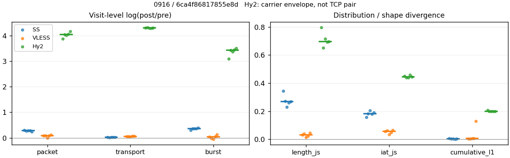
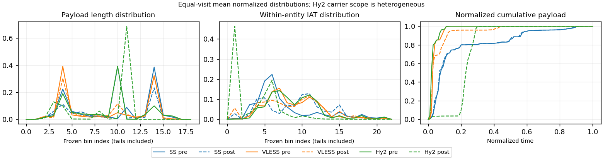

# 0916 · 条目 013 · developer.mozilla.org

目标：https://developer.mozilla.org/en-US/docs/Web/HTTP/Guides/Cookies

活动标签：developer.mozilla.org::document_view。选定访问 15 次。

[返回总索引](../../README.md) · [统计口径](../../methods.md)

## 覆盖与资格（每次访问均保留）

| 部署 | 重复 | 主请求路由 | 活动状态 | 代理比较 | DIRECT pre | 请求 proxy/direct/unresolved | 错误 |
| --- | --- | --- | --- | --- | --- | --- | --- |
| Hy2 | 1 | proxy | passed | 1 | 0 | 88/0/0 | [] |
| Hy2 | 2 | proxy | passed | 1 | 0 | 88/0/0 | [] |
| Hy2 | 3 | proxy | passed | 1 | 0 | 88/0/0 | [] |
| Hy2 | 4 | proxy | passed | 1 | 0 | 88/0/0 | [] |
| Hy2 | 5 | proxy | passed | 1 | 0 | 88/0/0 | [] |
| SS | 1 | proxy | passed | 1 | 0 | 88/0/0 | [] |
| SS | 2 | proxy | passed | 1 | 0 | 88/0/0 | [] |
| SS | 3 | proxy | passed | 1 | 0 | 88/0/0 | [] |
| SS | 4 | proxy | passed | 1 | 0 | 88/0/0 | [] |
| SS | 5 | proxy | passed | 1 | 0 | 88/0/0 | [] |
| VLESS | 1 | proxy | passed | 1 | 0 | 88/0/0 | [] |
| VLESS | 2 | proxy | passed | 1 | 0 | 88/0/0 | [] |
| VLESS | 3 | proxy | passed | 1 | 0 | 88/0/0 | [] |
| VLESS | 4 | proxy | passed | 1 | 0 | 89/0/0 | [] |
| VLESS | 5 | proxy | passed | 1 | 0 | 88/0/0 | [] |

主请求非 proxy 的统计仅解释为已索引的辅助代理连接或 DIRECT 观测，不代表目标业务经代理传输。播放确认与配对资格是两道不同的门。

图中散点为单次访问，短线为重复中位数；Hy2 是共享载体包络，不能与 TCP 配对作等范围因果对比。

形态图先逐访问归一化，再对访问等权平均；实线 pre，虚线 post。分箱序号及边界见 methods，不将分箱索引误解为长度或时间。

## 每次访问的关键观测

### SS

范围：`exclusive_page`。每格 pre → post；空值为不可观测/不适用。

| 重复 | 包数 | 载荷字节 | burst | TCP FR | IAT中位µs | length JS | IAT JS |
| --- | --- | --- | --- | --- | --- | --- | --- |
| 1 | 625 → 843 | 6.5192e+05 → 6.659e+05 | 446 → 602 | 54 → 56 | 41.41 → 473.07 | 0.3432 | 0.15656 |
| 2 | 670 → 876 | 6.4312e+05 → 6.5282e+05 | 480 → 688 | 52 → 52 | 38.722 → 688.66 | 0.27079 | 0.18311 |
| 3 | 692 → 915 | 6.0855e+05 → 6.263e+05 | 501 → 721 | 43 → 48 | 30.881 → 204.53 | 0.2291 | 0.2053 |
| 4 | 706 → 934 | 6.358e+05 → 6.5408e+05 | 472 → 680 | 57 → 81 | 40.791 → 764.12 | 0.25986 | 0.18016 |
| 5 | 674 → 852 | 6.4995e+05 → 6.6557e+05 | 449 → 665 | 49 → 65 | 37.519 → 845.38 | 0.26793 | 0.19037 |

完整标量统计：中位数 [min,max]；Δ 为重复内逐访问变换的中位数，MAD 未缩放。n 为可用变换数；DIRECT-only 的 nΔ=0 不代表 pre 不可用。

| scope | 特征 | pre | post | Δ | IQRΔ | MADΔ | nΔ |
| --- | --- | --- | --- | --- | --- | --- | --- |
| exclusive_page | active_span_sum_s_1000ms | 10.548 [9.8817, 13.83] | 13.415 [10.546, 14.873] | 0.072707 | 0.18518 | 0.034487 | 5 |
| exclusive_page | active_span_sum_s_100ms | 1.9543 [1.6543, 2.6668] | 4.3292 [3.4981, 4.4187] | 0.74168 | 0.15658 | 0.053651 | 5 |
| exclusive_page | active_span_sum_s_500ms | 7.6483 [6.1671, 8.3472] | 9.8296 [9.4879, 12.182] | 0.31525 | 0.23769 | 0.15178 | 5 |
| exclusive_page | burst_bytes_iqr | 1720.2 [1448, 2050] | 1428 [1428, 1428] | -0.18619 | 0.18198 | 0.17229 | 5 |
| exclusive_page | burst_bytes_mad | 31 [31, 71.5] | 65 [27, 69] | 0.092373 | 0.57239 | 0.23052 | 5 |
| exclusive_page | burst_bytes_max | 20480 [17393, 20688] | 8568 [5712, 9996] | -0.87141 | 0.33647 | 0.16338 | 5 |
| exclusive_page | burst_bytes_mean | 1347 [1214.7, 1461.7] | 961.88 [868.65, 1106.1] | -0.33676 | 0.0097454 | 0.0082691 | 5 |
| exclusive_page | burst_bytes_median | 31 [31, 71.5] | 65 [27, 69] | 0.092373 | 0.57239 | 0.23052 | 5 |
| exclusive_page | burst_bytes_min | 0 [0, 0] | 0 [0, 0] | — | — | — | 0 |
| exclusive_page | burst_bytes_p95 | 6288 [2896, 8688] | 2930 [2856, 4284] | -0.68148 | 0.53496 | 0.29772 | 5 |
| exclusive_page | burst_bytes_q25 | 0 [0, 0] | 0 [0, 0] | — | — | — | 0 |
| exclusive_page | burst_bytes_q75 | 1720.2 [1448, 2050] | 1428 [1428, 1428] | -0.18619 | 0.18198 | 0.17229 | 5 |
| exclusive_page | burst_bytes_std | 2975.7 [2663.2, 3103.8] | 1347.2 [1269.7, 1624] | -0.72223 | 0.10177 | 0.074484 | 5 |
| exclusive_page | burst_count | 472 [446, 501] | 680 [602, 721] | 0.36403 | 0.0051111 | 0.0040303 | 5 |
| exclusive_page | burst_duration_ms_iqr | 0.02396 [0, 0.039297] | 0 [0, 0] | — | — | — | 0 |
| exclusive_page | burst_duration_ms_mad | 0 [0, 0] | 0 [0, 0] | — | — | — | 0 |
| exclusive_page | burst_duration_ms_max | 15001 [3485.3, 15001] | 15026 [1040.6, 30377] | 0.0016535 | 0.023201 | 0.02199 | 5 |
| exclusive_page | burst_duration_ms_mean | 55.954 [27.145, 85.793] | 34.93 [10.342, 95.259] | -0.47119 | 0.20502 | 0.19345 | 5 |
| exclusive_page | burst_duration_ms_median | 0 [0, 0] | 0 [0, 0] | — | — | — | 0 |
| exclusive_page | burst_duration_ms_min | 0 [0, 0] | 0 [0, 0] | — | — | — | 0 |
| exclusive_page | burst_duration_ms_p95 | 93.502 [71.542, 185.23] | 11.311 [3.5613, 19.647] | -2.2437 | 0.57791 | 0.47644 | 5 |
| exclusive_page | burst_duration_ms_q25 | 0 [0, 0] | 0 [0, 0] | — | — | — | 0 |
| exclusive_page | burst_duration_ms_q75 | 0.02396 [0, 0.039297] | 0 [0, 0] | — | — | — | 0 |
| exclusive_page | burst_duration_ms_std | 716.15 [226.06, 958.73] | 588.63 [65.722, 1326] | -0.19609 | 0.070368 | 0.040097 | 5 |
| exclusive_page | burst_packets_iqr | 1 [0, 1] | 0 [0, 0] | — | — | — | 0 |
| exclusive_page | burst_packets_mad | 0 [0, 0] | 0 [0, 0] | — | — | — | 0 |
| exclusive_page | burst_packets_max | 10 [7, 11] | 9 [6, 12] | -0.15415 | 0.28768 | 0.20252 | 5 |
| exclusive_page | burst_packets_mean | 1.4013 [1.3812, 1.5011] | 1.2812 [1.2691, 1.4003] | -0.085253 | 0.0072194 | 0.0066617 | 5 |
| exclusive_page | burst_packets_median | 1 [1, 1] | 1 [1, 1] | 0 | 0 | 0 | 5 |
| exclusive_page | burst_packets_min | 1 [1, 1] | 1 [1, 1] | 0 | 0 | 0 | 5 |
| exclusive_page | burst_packets_p95 | 3 [3, 3] | 3 [2, 3] | 0 | 0 | 0 | 5 |
| exclusive_page | burst_packets_q25 | 1 [1, 1] | 1 [1, 1] | 0 | 0 | 0 | 5 |
| exclusive_page | burst_packets_q75 | 2 [1, 2] | 1 [1, 1] | -0.69315 | 0 | 0 | 5 |
| exclusive_page | burst_packets_std | 1.0035 [0.91149, 1.0854] | 0.83058 [0.70051, 1.0756] | -0.22867 | 0.2224 | 0.13571 | 5 |
| exclusive_page | connection_span_concurrency_max | 3 [3, 3] | 3 [3, 3] | 0 | 0 | 0 | 5 |
| exclusive_page | cumulative_l1 | — | — | 0.0035778 | 0.0011595 | 0.00072363 | 5 |
| exclusive_page | cumulative_max | — | — | 0.14737 | 0.025439 | 0.017699 | 5 |
| exclusive_page | direction_entropy | 0.91123 [0.89269, 0.93925] | 0.69269 [0.59245, 0.7018] | -0.22879 | 0.042114 | 0.03187 | 5 |
| exclusive_page | down_burst_count | 234 [221, 249] | 338 [299, 359] | 0.36587 | 0.0039024 | 0.0020472 | 5 |
| exclusive_page | down_ip_bytes | 6.3261e+05 [6.0624e+05, 6.4514e+05] | 6.4299e+05 [6.2315e+05, 6.5872e+05] | 0.020449 | 0.0046039 | 0.0042172 | 5 |
| exclusive_page | down_packets | 375 [335, 404] | 454 [438, 498] | 0.20919 | 0.025873 | 0.020868 | 5 |
| exclusive_page | down_transport_bytes | 6.1374e+05 [5.8671e+05, 6.2769e+05] | 6.1885e+05 [5.9812e+05, 6.3504e+05] | 0.011637 | 0.00078396 | 0.00042614 | 5 |
| exclusive_page | duration_s | 66.423 [7.4183, 68.41] | 66.258 [7.4156, 68.406] | -0.00035556 | 0.0024367 | 0.0003335 | 5 |
| exclusive_page | entity_count | 5 [3, 6] | 5 [3, 6] | 0 | 0 | 0 | 5 |
| exclusive_page | fr_runs | 52 [43, 57] | 56 [48, 81] | 0.11 | 0.2462 | 0.11 | 5 |
| exclusive_page | fr_runs_per_packet | 0.14005 [0.11257, 0.15254] | 0.11814 [0.10105, 0.15698] | -0.011513 | 0.043388 | 0.022886 | 5 |
| exclusive_page | fr_switches | 46 [40, 52] | 52 [45, 76] | 0.11778 | 0.27093 | 0.11778 | 5 |
| exclusive_page | fr_switches_per_possible_transition | 0.12849 [0.10554, 0.14286] | 0.11064 [0.095339, 0.14873] | -0.010202 | 0.042926 | 0.022017 | 5 |
| exclusive_page | full_retransmission_fraction | 0.0029674 [0.0014925, 0.0056657] | 0.0094899 [0.0057078, 0.031049] | 0.0052486 | 0.0055347 | 0.0010334 | 5 |
| exclusive_page | full_retransmission_packets | 2 [1, 4] | 8 [5, 29] | 1.6094 | 0.539 | 0.35667 | 5 |
| exclusive_page | iat_count | 669 [621, 701] | 870 [839, 929] | 0.2804 | 0.01139 | 0.010188 | 5 |
| exclusive_page | iat_js | — | — | 0.18311 | 0.010212 | 0.007263 | 5 |
| exclusive_page | iat_ks | — | — | 0.34279 | 0.047612 | 0.025609 | 5 |
| exclusive_page | iat_median_us | 38.722 [30.881, 41.41] | 688.66 [204.53, 845.38] | 2.8783 | 0.49454 | 0.2366 | 5 |
| exclusive_page | iat_us_iqr | 227.94 [90.059, 370.14] | 2530.6 [1042, 3477.6] | 2.4484 | 0.041798 | 0.035893 | 5 |
| exclusive_page | iat_us_mad | 30.142 [23.668, 35.984] | 680.43 [201.82, 827.69] | 3.1168 | 0.58745 | 0.23985 | 5 |
| exclusive_page | iat_us_max | 1.5001e+07 [4.2381e+06, 1.5001e+07] | 1.5328e+07 [4.2092e+06, 1.5361e+07] | 0.021569 | 0.0020961 | 0.002074 | 5 |
| exclusive_page | iat_us_mean | 1.9772e+05 [27343, 2.8136e+05] | 1.5093e+05 [20111, 2.1244e+05] | -0.27832 | 0.0084382 | 0.0057792 | 5 |
| exclusive_page | iat_us_median | 38.722 [30.881, 41.41] | 688.66 [204.53, 845.38] | 2.8783 | 0.49454 | 0.2366 | 5 |
| exclusive_page | iat_us_min | 0.037 [0.012, 1.223] | 0.037 [0.037, 0.049] | 0 | 3.6821 | 1.1787 | 5 |
| exclusive_page | iat_us_p95 | 1.9776e+05 [97872, 2.72e+05] | 86419 [41110, 1.7076e+05] | -0.86741 | 0.31678 | 0.19953 | 5 |
| exclusive_page | iat_us_q25 | 13.181 [12.436, 14.881] | 24.503 [10.334, 34.34] | 0.62004 | 0.84747 | 0.21619 | 5 |
| exclusive_page | iat_us_q75 | 241.12 [102.5, 383.31] | 2560.7 [1052.3, 3491.6] | 2.4001 | 0.10028 | 0.071148 | 5 |
| exclusive_page | iat_us_std | 1.5502e+06 [1.9795e+05, 1.9106e+06] | 1.3691e+06 [1.6031e+05, 1.6727e+06] | -0.12757 | 0.0087538 | 0.0053814 | 5 |
| exclusive_page | iat_wasserstein_log1p_us | — | — | 1.4467 | 0.20205 | 0.14019 | 5 |
| exclusive_page | idle_gap_count_1000ms | 12 [2, 18] | 11 [2, 15] | -0.087011 | 0.09531 | 0.087011 | 5 |
| exclusive_page | idle_gap_count_100ms | 41 [29, 42] | 40 [26, 51] | -0.024693 | 0.23871 | 0.084507 | 5 |
| exclusive_page | idle_gap_count_500ms | 21 [6, 22] | 15 [5, 21] | -0.22314 | 0.075508 | 0.040822 | 5 |
| exclusive_page | idle_gap_sum_s_1000ms | 121.47 [5.9813, 183.97] | 120.77 [5.2498, 179.48] | -0.019643 | 0.013633 | 0.0085346 | 5 |
| exclusive_page | idle_gap_sum_s_100ms | 130.32 [14.562, 192.2] | 127.68 [12.5, 190.24] | -0.01609 | 0.0087627 | 0.0043839 | 5 |
| exclusive_page | idle_gap_sum_s_500ms | 124.63 [8.7386, 186.93] | 121.48 [7.3428, 184.25] | -0.032958 | 0.029558 | 0.018341 | 5 |
| exclusive_page | ip_bytes | 6.7806e+05 [6.446e+05, 6.8511e+05] | 7.1008e+05 [6.8236e+05, 7.1576e+05] | 0.043778 | 0.012499 | 0.0071469 | 5 |
| exclusive_page | length_iqr | 2801 [2792, 2803.8] | 1341.5 [862.75, 2321.5] | -0.73395 | 0.42869 | 0.3132 | 5 |
| exclusive_page | length_js | — | — | 0.26793 | 0.010928 | 0.0080695 | 5 |
| exclusive_page | length_ks | — | — | 0.39855 | 0.021559 | 0.010787 | 5 |
| exclusive_page | length_mad | 1365.5 [1365, 1377] | 989 [414, 1194] | -0.32258 | 0.35335 | 0.18581 | 5 |
| exclusive_page | length_max | 8192 [3506, 8920] | 4284 [2856, 7140] | -0.73341 | 1.1849 | 0.40547 | 5 |
| exclusive_page | length_mean | 1683.8 [1562.1, 1841.6] | 1404.8 [1267.6, 1472.5] | -0.19043 | 0.019795 | 0.018509 | 5 |
| exclusive_page | length_median | 1448 [1448, 1448] | 1428 [1428, 1428] | -0.013908 | 0 | 0 | 5 |
| exclusive_page | length_min | 31 [18, 31] | 20 [12, 20] | -0.43825 | 0 | 0 | 5 |
| exclusive_page | length_p95 | 2896 [2896, 7240] | 2856 [2856, 2856] | -0.013908 | 0.34668 | 0 | 5 |
| exclusive_page | length_q25 | 95 [92.25, 104] | 534.5 [140.5, 666] | 1.7407 | 1.0018 | 0.20671 | 5 |
| exclusive_page | length_q75 | 2896 [2896, 2896] | 1482 [1428, 2856] | -0.66994 | 0.56201 | 0.037118 | 5 |
| exclusive_page | length_std | 1546.7 [1245.2, 2062.6] | 991.12 [953.29, 1071.9] | -0.48396 | 0.35336 | 0.25944 | 5 |
| exclusive_page | length_wasserstein_bytes | — | — | 614.52 | 246.7 | 215.28 | 5 |
| exclusive_page | nonempty_entity_count | 5 [3, 6] | 5 [3, 6] | 0 | 0 | 0 | 5 |
| exclusive_page | nonempty_packets | 382 [354, 407] | 474 [447, 516] | 0.21789 | 0.031889 | 0.019399 | 5 |
| exclusive_page | offload_suspect_fraction | 0.26771 [0.2432, 0.28042] | 0.14671 [0.12741, 0.15525] | -0.11687 | 0.022174 | 0.016828 | 5 |
| exclusive_page | packet_count | 674 [625, 706] | 876 [843, 934] | 0.27934 | 0.011773 | 0.01125 | 5 |
| exclusive_page | rtt_median_ms | 0.056502 [0.029374, 0.061997] | 32.568 [28.878, 37.316] | 6.3631 | 0.2426 | 0.12655 | 5 |
| exclusive_page | rtt_sample_count | 276 [262, 280] | 186 [137, 209] | -0.37894 | 0.11875 | 0.082407 | 5 |
| exclusive_page | tcp_ack_count | 669 [621, 701] | 869 [838, 925] | 0.27729 | 0.011338 | 0.0082249 | 5 |
| exclusive_page | tcp_fin_count | 9 [6, 12] | 11 [6, 13] | 0.080043 | 0.09531 | 0.080043 | 5 |
| exclusive_page | tcp_packet_count | 674 [625, 706] | 876 [843, 934] | 0.27934 | 0.011773 | 0.01125 | 5 |
| exclusive_page | tcp_rst_count | 0 [0, 0] | 0 [0, 0] | — | — | — | 0 |
| exclusive_page | tcp_syn_count | 10 [6, 12] | 10 [6, 15] | 0.11778 | 0.15415 | 0.11778 | 5 |
| exclusive_page | tcp_window_raw_median | 65401 [65368, 65504] | 151 [137, 168] | -6.0708 | 0.10814 | 0.056177 | 5 |
| exclusive_page | transition_entropy | 0.53158 [0.46993, 0.57541] | 0.44113 [0.39185, 0.52966] | -0.078078 | 0.10636 | 0.056204 | 5 |
| exclusive_page | transition_n_mm | 237 [201, 253] | 361 [337, 384] | 0.45879 | 0.061699 | 0.054644 | 5 |
| exclusive_page | transition_n_mp | 21 [19, 24] | 24 [21, 36] | 0.1466 | 0.28021 | 0.1466 | 5 |
| exclusive_page | transition_n_pm | 25 [21, 28] | 28 [23, 40] | 0.090972 | 0.26213 | 0.090972 | 5 |
| exclusive_page | transition_n_pp | 99 [97, 100] | 56 [43, 58] | -0.55207 | 0.14379 | 0.017392 | 5 |
| exclusive_page | transition_p_mm | 0.91336 [0.89732, 0.92692] | 0.93766 [0.91325, 0.94581] | 0.01889 | 0.028924 | 0.016729 | 5 |
| exclusive_page | transition_p_mp | 0.086643 [0.073077, 0.10268] | 0.062338 [0.054187, 0.086747] | -0.01889 | 0.028924 | 0.016729 | 5 |
| exclusive_page | transition_p_pm | 0.20161 [0.17647, 0.224] | 0.34848 [0.3012, 0.41667] | 0.17201 | 0.077541 | 0.02371 | 5 |
| exclusive_page | transition_p_pp | 0.79839 [0.776, 0.82353] | 0.65152 [0.58333, 0.6988] | -0.17201 | 0.077541 | 0.02371 | 5 |
| exclusive_page | transport_bytes | 6.4312e+05 [6.0855e+05, 6.5192e+05] | 6.5408e+05 [6.263e+05, 6.659e+05] | 0.023741 | 0.0071434 | 0.0046143 | 5 |
| exclusive_page | up_burst_count | 238 [225, 252] | 342 [303, 362] | 0.36222 | 0.0062767 | 0.0059518 | 5 |
| exclusive_page | up_byte_fraction | 0.04144 [0.035885, 0.045682] | 0.05203 [0.04499, 0.058473] | 0.0091749 | 0.0020244 | 0.0019538 | 5 |
| exclusive_page | up_ip_bytes | 42182 [38370, 45455] | 61354 [54923, 67086] | 0.39029 | 0.10107 | 0.057564 | 5 |
| exclusive_page | up_packets | 302 [290, 317] | 432 [389, 443] | 0.33833 | 0.014444 | 0.010786 | 5 |
| exclusive_page | up_transport_bytes | 26867 [21838, 29379] | 33966 [28177, 38246] | 0.25485 | 0.019779 | 0.013018 | 5 |
| exclusive_page | zero_iat_count | 0 [0, 0] | 0 [0, 0] | — | — | — | 0 |
| exclusive_page | zero_iat_fraction | 0 [0, 0] | 0 [0, 0] | 0 | 0 | 0 | 5 |

### VLESS

范围：`exclusive_page`。每格 pre → post；空值为不可观测/不适用。

| 重复 | 包数 | 载荷字节 | burst | TCP FR | IAT中位µs | length JS | IAT JS |
| --- | --- | --- | --- | --- | --- | --- | --- |
| 1 | 828 → 905 | 6.1916e+05 → 6.5222e+05 | 592 → 614 | 70 → 80 | 153.34 → 145.53 | 0.031776 | 0.055151 |
| 2 | 850 → 922 | 6.4065e+05 → 6.8115e+05 | 589 → 575 | 70 → 82 | 119.16 → 154.26 | 0.040397 | 0.061368 |
| 3 | 915 → 911 | 6.2455e+05 → 6.5043e+05 | 708 → 676 | 46 → 54 | 134.86 → 374.73 | 0.014779 | 0.034273 |
| 4 | 847 → 918 | 6.1911e+05 → 6.5875e+05 | 557 → 587 | 64 → 78 | 313.55 → 462.85 | 0.023235 | 0.047215 |
| 5 | 771 → 861 | 6.2849e+05 → 6.6977e+05 | 539 → 613 | 60 → 74 | 100.22 → 336.28 | 0.044713 | 0.063988 |

完整标量统计：中位数 [min,max]；Δ 为重复内逐访问变换的中位数，MAD 未缩放。n 为可用变换数；DIRECT-only 的 nΔ=0 不代表 pre 不可用。

| scope | 特征 | pre | post | Δ | IQRΔ | MADΔ | nΔ |
| --- | --- | --- | --- | --- | --- | --- | --- |
| exclusive_page | active_span_sum_s_1000ms | 9.0686 [7.5782, 9.5127] | 8.6774 [7.0129, 9.9091] | -0.009023 | 0.050044 | 0.03507 | 5 |
| exclusive_page | active_span_sum_s_100ms | 1.5968 [1.4735, 1.674] | 3.1169 [2.8955, 3.7507] | 0.67555 | 0.093982 | 0.046562 | 5 |
| exclusive_page | active_span_sum_s_500ms | 4.4016 [3.8103, 4.8974] | 7.6832 [6.4065, 8.0344] | 0.51961 | 0.062039 | 0.037452 | 5 |
| exclusive_page | burst_bytes_iqr | 2199.2 [1412, 2896] | 2824 [2824, 2824] | 0.25004 | 0.41329 | 0.25004 | 5 |
| exclusive_page | burst_bytes_mad | 39 [31, 71.5] | 72 [72, 72] | 0.6131 | 0.49532 | 0.22957 | 5 |
| exclusive_page | burst_bytes_max | 17304 [10729, 23265] | 6515 [5792, 8760] | -0.97675 | 0.46042 | 0.11771 | 5 |
| exclusive_page | burst_bytes_mean | 1087.7 [882.13, 1166] | 1092.6 [962.17, 1184.6] | 0.015516 | 0.075766 | 0.069841 | 5 |
| exclusive_page | burst_bytes_median | 39 [31, 71.5] | 72 [72, 72] | 0.6131 | 0.49532 | 0.22957 | 5 |
| exclusive_page | burst_bytes_min | 0 [0, 0] | 0 [0, 0] | — | — | — | 0 |
| exclusive_page | burst_bytes_p95 | 4380 [2896, 5648] | 2896 [2896, 2968] | -0.41372 | 0.53313 | 0.25425 | 5 |
| exclusive_page | burst_bytes_q25 | 0 [0, 0] | 0 [0, 0] | — | — | — | 0 |
| exclusive_page | burst_bytes_q75 | 2199.2 [1412, 2896] | 2824 [2824, 2824] | 0.25004 | 0.41329 | 0.25004 | 5 |
| exclusive_page | burst_bytes_std | 1917.6 [1833.5, 2029.5] | 1348.3 [1287.1, 1474.2] | -0.35224 | 0.068553 | 0.052425 | 5 |
| exclusive_page | burst_count | 589 [539, 708] | 613 [575, 676] | 0.036488 | 0.076516 | 0.060544 | 5 |
| exclusive_page | burst_duration_ms_iqr | 0.1401 [0, 0.73671] | 0.019124 [0, 1.386] | -0.35055 | 3.676 | 1.5439 | 4 |
| exclusive_page | burst_duration_ms_mad | 0 [0, 0] | 0 [0, 0] | — | — | — | 0 |
| exclusive_page | burst_duration_ms_max | 2368.9 [917.33, 15001] | 15033 [7842.5, 15051] | 1.849 | 2.3477 | 0.94843 | 5 |
| exclusive_page | burst_duration_ms_mean | 21.654 [10.441, 79.309] | 32.037 [22.232, 41.762] | 0.59707 | 1.2492 | 0.47692 | 5 |
| exclusive_page | burst_duration_ms_median | 0 [0, 0] | 0 [0, 0] | — | — | — | 0 |
| exclusive_page | burst_duration_ms_min | 0 [0, 0] | 0 [0, 0] | — | — | — | 0 |
| exclusive_page | burst_duration_ms_p95 | 9.9913 [6.5059, 13.405] | 10.862 [9.8215, 33.441] | 0.42115 | 0.77167 | 0.43404 | 5 |
| exclusive_page | burst_duration_ms_q25 | 0 [0, 0] | 0 [0, 0] | — | — | — | 0 |
| exclusive_page | burst_duration_ms_q75 | 0.1401 [0, 0.73671] | 0.019124 [0, 1.386] | -0.35055 | 3.676 | 1.5439 | 4 |
| exclusive_page | burst_duration_ms_std | 133.24 [75.12, 917.58] | 608.05 [322.08, 637.25] | 1.5181 | 1.9104 | 0.52665 | 5 |
| exclusive_page | burst_packets_iqr | 1 [0, 1] | 1 [0, 1] | 0 | 0 | 0 | 4 |
| exclusive_page | burst_packets_mad | 0 [0, 0] | 0 [0, 0] | — | — | — | 0 |
| exclusive_page | burst_packets_max | 9 [6, 13] | 7 [7, 11] | -0.16705 | 0.11778 | 0.08426 | 5 |
| exclusive_page | burst_packets_mean | 1.4304 [1.2924, 1.5206] | 1.4739 [1.3476, 1.6035] | 0.04187 | 0.024396 | 0.013833 | 5 |
| exclusive_page | burst_packets_median | 1 [1, 1] | 1 [1, 1] | 0 | 0 | 0 | 5 |
| exclusive_page | burst_packets_min | 1 [1, 1] | 1 [1, 1] | 0 | 0 | 0 | 5 |
| exclusive_page | burst_packets_p95 | 3 [2, 3] | 3 [3, 4] | 0 | 0.28768 | 0 | 5 |
| exclusive_page | burst_packets_q25 | 1 [1, 1] | 1 [1, 1] | 0 | 0 | 0 | 5 |
| exclusive_page | burst_packets_q75 | 2 [1, 2] | 2 [1, 2] | 0 | 0 | 0 | 5 |
| exclusive_page | burst_packets_std | 0.81394 [0.7235, 0.94815] | 0.90338 [0.87345, 1.0364] | 0.12801 | 0.16806 | 0.10772 | 5 |
| exclusive_page | connection_span_concurrency_max | 3 [3, 4] | 3 [3, 4] | 0 | 0 | 0 | 5 |
| exclusive_page | cumulative_l1 | — | — | 0.0055568 | 0.0018119 | 0.0011807 | 5 |
| exclusive_page | cumulative_max | — | — | 0.25897 | 0.1289 | 0.099617 | 5 |
| exclusive_page | direction_entropy | 0.78401 [0.74829, 0.84073] | 0.63851 [0.57392, 0.6471] | -0.17437 | 0.0077077 | 0.0046322 | 5 |
| exclusive_page | down_burst_count | 292 [267, 352] | 305 [285, 336] | 0.036732 | 0.077187 | 0.060997 | 5 |
| exclusive_page | down_ip_bytes | 6.264e+05 [6.2213e+05, 6.3932e+05] | 6.545e+05 [6.488e+05, 6.7322e+05] | 0.049501 | 0.0093959 | 0.0027764 | 5 |
| exclusive_page | down_packets | 490 [439, 514] | 510 [468, 533] | 0.054394 | 0.027671 | 0.018096 | 5 |
| exclusive_page | down_transport_bytes | 6.0354e+05 [5.9613e+05, 6.138e+05] | 6.2675e+05 [6.2244e+05, 6.4546e+05] | 0.050092 | 0.0085402 | 0.0017437 | 5 |
| exclusive_page | duration_s | 62.76 [58.815, 63.265] | 62.509 [13.835, 62.962] | -0.0047994 | 0.0033019 | 0.0019875 | 5 |
| exclusive_page | entity_count | 5 [4, 5] | 5 [4, 5] | 0 | 0 | 0 | 5 |
| exclusive_page | fr_runs | 64 [46, 70] | 78 [54, 82] | 0.16034 | 0.039602 | 0.026811 | 5 |
| exclusive_page | fr_runs_per_packet | 0.13363 [0.08932, 0.14463] | 0.15385 [0.10651, 0.15514] | 0.017188 | 0.0073471 | 0.0043175 | 5 |
| exclusive_page | fr_switches | 59 [42, 66] | 73 [50, 77] | 0.17435 | 0.043504 | 0.033275 | 5 |
| exclusive_page | fr_switches_per_possible_transition | 0.12387 [0.082192, 0.1375] | 0.14611 [0.099404, 0.14729] | 0.017212 | 0.007193 | 0.0037548 | 5 |
| exclusive_page | full_retransmission_fraction | 0.0011765 [0, 0.0043716] | 0 [0, 0] | -0.0011765 | 0.0011806 | 0.0011765 | 5 |
| exclusive_page | full_retransmission_packets | 1 [0, 4] | 0 [0, 0] | — | — | — | 0 |
| exclusive_page | iat_count | 842 [766, 911] | 907 [856, 917] | 0.081771 | 0.0083789 | 0.0075639 | 5 |
| exclusive_page | iat_js | — | — | 0.055151 | 0.014152 | 0.0079357 | 5 |
| exclusive_page | iat_ks | — | — | 0.097764 | 0.031716 | 0.01985 | 5 |
| exclusive_page | iat_median_us | 134.86 [100.22, 313.55] | 336.28 [145.53, 462.85] | 0.38943 | 0.76378 | 0.44168 | 5 |
| exclusive_page | iat_us_iqr | 1492.1 [1272.9, 1677.1] | 1826.9 [1397.8, 2115.6] | 0.17763 | 0.093801 | 0.054641 | 5 |
| exclusive_page | iat_us_mad | 127.34 [92.995, 303.92] | 334.73 [145.25, 454.36] | 0.40212 | 0.73082 | 0.36169 | 5 |
| exclusive_page | iat_us_max | 1.5001e+07 [1.5001e+07, 1.5001e+07] | 1.5312e+07 [7.8425e+06, 1.5447e+07] | 0.02052 | 0.0047322 | 0.0029793 | 5 |
| exclusive_page | iat_us_mean | 81862 [72541, 1.5119e+05] | 73946 [30025, 1.3778e+05] | -0.092946 | 0.015003 | 0.0077216 | 5 |
| exclusive_page | iat_us_median | 134.86 [100.22, 313.55] | 336.28 [145.53, 462.85] | 0.38943 | 0.76378 | 0.44168 | 5 |
| exclusive_page | iat_us_min | 0.259 [0.125, 1.501] | 0.037 [0.035, 0.038] | -1.9459 | 0.75303 | 0.53841 | 5 |
| exclusive_page | iat_us_p95 | 16562 [10035, 40835] | 45403 [41872, 59505] | 1.0752 | 0.87883 | 0.35339 | 5 |
| exclusive_page | iat_us_q25 | 42.98 [30.273, 48.454] | 23.568 [13.28, 33.473] | -0.65205 | 0.3674 | 0.17193 | 5 |
| exclusive_page | iat_us_q75 | 1522.4 [1318.1, 1713.1] | 1860.1 [1421.4, 2132.7] | 0.16497 | 0.092585 | 0.054083 | 5 |
| exclusive_page | iat_us_std | 9.8768e+05 [9.3134e+05, 1.3764e+06] | 9.3526e+05 [3.6815e+05, 1.2983e+06] | -0.025287 | 0.025069 | 0.014385 | 5 |
| exclusive_page | iat_wasserstein_log1p_us | — | — | 0.48343 | 0.16585 | 0.033865 | 5 |
| exclusive_page | idle_gap_count_1000ms | 8 [5, 11] | 5 [4, 11] | -0.18232 | 0.28768 | 0.18232 | 5 |
| exclusive_page | idle_gap_count_100ms | 29 [23, 31] | 29 [26, 35] | 0.12136 | 0.0092736 | 0.0078509 | 5 |
| exclusive_page | idle_gap_count_500ms | 15 [11, 18] | 7 [4, 13] | -0.51083 | 0.15415 | 0.09531 | 5 |
| exclusive_page | idle_gap_sum_s_1000ms | 59.777 [57.017, 117.46] | 58.197 [17.667, 116.97] | -0.0042038 | 0.017541 | 0.0014509 | 5 |
| exclusive_page | idle_gap_sum_s_100ms | 67.331 [64.423, 125.11] | 63.718 [22.806, 122.6] | -0.032675 | 0.0070742 | 0.0063662 | 5 |
| exclusive_page | idle_gap_sum_s_500ms | 64.526 [61.526, 122.54] | 60.219 [17.667, 118.55] | -0.053758 | 0.013238 | 0.011941 | 5 |
| exclusive_page | ip_bytes | 6.6852e+05 [6.6219e+05, 6.8484e+05] | 7.0682e+05 [6.9802e+05, 7.2943e+05] | 0.063083 | 0.0087468 | 0.0046024 | 5 |
| exclusive_page | length_iqr | 2752 [2740, 2752] | 2752 [2641, 2752] | 0 | 0 | 0 | 5 |
| exclusive_page | length_js | — | — | 0.031776 | 0.017162 | 0.0086217 | 5 |
| exclusive_page | length_ks | — | — | 0.095073 | 0.024228 | 0.0083325 | 5 |
| exclusive_page | length_mad | 509.5 [185, 1329] | 1132 [700, 1323] | 0.79831 | 0.62996 | 0.53241 | 5 |
| exclusive_page | length_max | 8688 [5792, 8920] | 3619 [2896, 4236] | -0.74468 | 0.12275 | 0.051529 | 5 |
| exclusive_page | length_mean | 1279.3 [1192.9, 1399.7] | 1280.4 [1210.9, 1404.1] | 0.0031195 | 0.02579 | 0.013905 | 5 |
| exclusive_page | length_median | 561 [216, 1412] | 1204 [772, 1412] | 0.76368 | 0.61312 | 0.51002 | 5 |
| exclusive_page | length_min | 24 [14, 24] | 24 [6, 24] | 0 | 0 | 0 | 5 |
| exclusive_page | length_p95 | 2824 [2824, 2896] | 2824 [2824, 2896] | 0 | 0 | 0 | 5 |
| exclusive_page | length_q25 | 72 [72, 84] | 72 [72, 183] | 0 | 0 | 0 | 5 |
| exclusive_page | length_q75 | 2824 [2824, 2824] | 2824 [2824, 2824] | 0 | 0 | 0 | 5 |
| exclusive_page | length_std | 1342.2 [1286.6, 1466.6] | 1175.8 [1085.4, 1199.4] | -0.13233 | 0.058872 | 0.039315 | 5 |
| exclusive_page | length_wasserstein_bytes | — | — | 168.41 | 63.766 | 36.132 | 5 |
| exclusive_page | nonempty_entity_count | 5 [4, 5] | 5 [4, 5] | 0 | 0 | 0 | 5 |
| exclusive_page | nonempty_packets | 495 [449, 519] | 520 [477, 544] | 0.060494 | 0.024699 | 0.011592 | 5 |
| exclusive_page | offload_suspect_fraction | 0.22941 [0.20109, 0.23188] | 0.19978 [0.1928, 0.20607] | -0.026521 | 0.0043558 | 0.0031826 | 5 |
| exclusive_page | packet_count | 847 [771, 915] | 911 [861, 922] | 0.081309 | 0.0084251 | 0.0076129 | 5 |
| exclusive_page | rtt_median_ms | 0.11478 [0.07704, 0.3645] | 0.14571 [0.085029, 1.8089] | 0.25444 | 1.314 | 0.15577 | 5 |
| exclusive_page | rtt_sample_count | 328 [300, 380] | 380 [349, 395] | 0.14979 | 0.010211 | 0.0087072 | 5 |
| exclusive_page | tcp_ack_count | 834 [754, 903] | 907 [856, 917] | 0.092479 | 0.0085884 | 0.006612 | 5 |
| exclusive_page | tcp_fin_count | 8 [8, 10] | 10 [8, 10] | 0 | 0.10536 | 0 | 5 |
| exclusive_page | tcp_packet_count | 847 [771, 915] | 911 [861, 922] | 0.081309 | 0.0084251 | 0.0076129 | 5 |
| exclusive_page | tcp_rst_count | 8 [8, 12] | 0 [0, 0] | — | — | — | 0 |
| exclusive_page | tcp_syn_count | 10 [8, 10] | 10 [8, 10] | 0 | 0 | 0 | 5 |
| exclusive_page | tcp_window_raw_median | 65535 [65535, 65535] | 183 [176, 216] | -5.8809 | 0.04879 | 0.032261 | 5 |
| exclusive_page | transition_entropy | 0.50606 [0.37517, 0.52959] | 0.4972 [0.39044, 0.5073] | -0.0018269 | 0.032204 | 0.017089 | 5 |
| exclusive_page | transition_n_mm | 336 [298, 382] | 403 [362, 417] | 0.18183 | 0.073603 | 0.012725 | 5 |
| exclusive_page | transition_n_mp | 27 [19, 31] | 34 [23, 36] | 0.19106 | 0.048202 | 0.039468 | 5 |
| exclusive_page | transition_n_pm | 32 [23, 35] | 39 [27, 41] | 0.16034 | 0.039602 | 0.026811 | 5 |
| exclusive_page | transition_n_pp | 87 [78, 91] | 42 [37, 49] | -0.72824 | 0.085079 | 0.067527 | 5 |
| exclusive_page | transition_p_mm | 0.9226 [0.91553, 0.95262] | 0.91878 [0.918, 0.947] | -0.0038189 | 0.0060269 | 0.0039 | 5 |
| exclusive_page | transition_p_mp | 0.077399 [0.047382, 0.084469] | 0.081218 [0.052995, 0.082005] | 0.0038189 | 0.0060269 | 0.0039 | 5 |
| exclusive_page | transition_p_pm | 0.27778 [0.20909, 0.30973] | 0.46591 [0.3913, 0.51948] | 0.18813 | 0.027533 | 0.021615 | 5 |
| exclusive_page | transition_p_pp | 0.72222 [0.69027, 0.79091] | 0.53409 [0.48052, 0.6087] | -0.18813 | 0.027533 | 0.021615 | 5 |
| exclusive_page | transport_bytes | 6.2455e+05 [6.1911e+05, 6.4065e+05] | 6.5875e+05 [6.5043e+05, 6.8115e+05] | 0.061301 | 0.010046 | 0.0023124 | 5 |
| exclusive_page | up_burst_count | 297 [272, 356] | 308 [290, 340] | 0.036248 | 0.075856 | 0.060099 | 5 |
| exclusive_page | up_byte_fraction | 0.03713 [0.032611, 0.041918] | 0.048576 [0.042597, 0.052398] | 0.01048 | 0.001257 | 0.00065501 | 5 |
| exclusive_page | up_ip_bytes | 41671 [40060, 45519] | 52311 [49214, 56211] | 0.23452 | 0.050866 | 0.027327 | 5 |
| exclusive_page | up_packets | 345 [332, 410] | 393 [385, 410] | 0.13534 | 0.067626 | 0.033333 | 5 |
| exclusive_page | up_transport_bytes | 22988 [20367, 26855] | 31999 [27706, 35691] | 0.30773 | 0.018628 | 0.013402 | 5 |
| exclusive_page | zero_iat_count | 0 [0, 0] | 0 [0, 0] | — | — | — | 0 |
| exclusive_page | zero_iat_fraction | 0 [0, 0] | 0 [0, 0] | 0 | 0 | 0 | 5 |

### Hy2

范围：`carrier_context_envelope`。每格 pre → post；空值为不可观测/不适用。

| 重复 | 包数 | 载荷字节 | burst | TCP FR | IAT中位µs | length JS | IAT JS |
| --- | --- | --- | --- | --- | --- | --- | --- |
| 1 | 873 → 42552 | 6.1816e+05 → 4.6084e+07 | 653 → 14438 | — | 196.56 → 3.76 | 0.79572 | 0.4498 |
| 2 | 774 → 44702 | 6.3479e+05 → 4.7836e+07 | 523 → 16114 | — | 185.62 → 4.114 | 0.65212 | 0.44025 |
| 3 | 782 → 43269 | 6.2574e+05 → 4.6215e+07 | 535 → 15655 | — | 149.19 → 4.543 | 0.71662 | 0.43979 |
| 4 | 747 → 43674 | 6.2787e+05 → 4.6336e+07 | 501 → 15841 | — | 170.13 → 4.993 | 0.69332 | 0.45767 |
| 5 | 653 → 42716 | 6.2169e+05 → 4.6256e+07 | 436 → 14587 | — | 161.13 → 3.707 | 0.69666 | 0.44596 |

完整标量统计：中位数 [min,max]；Δ 为重复内逐访问变换的中位数，MAD 未缩放。n 为可用变换数；DIRECT-only 的 nΔ=0 不代表 pre 不可用。

| scope | 特征 | pre | post | Δ | IQRΔ | MADΔ | nΔ |
| --- | --- | --- | --- | --- | --- | --- | --- |
| carrier_context_envelope | active_span_sum_s_1000ms | 6.5625 [5.1839, 8.4242] | 19.827 [17.764, 20.245] | 0.99579 | 0.31485 | 0.16326 | 5 |
| carrier_context_envelope | active_span_sum_s_100ms | 1.3414 [1.2952, 1.4697] | 6.9882 [6.5499, 7.5227] | 1.6328 | 0.061759 | 0.050473 | 5 |
| carrier_context_envelope | active_span_sum_s_500ms | 5.6625 [5.1839, 6.9717] | 17.843 [15.969, 18.287] | 1.0869 | 0.11014 | 0.10678 | 5 |
| carrier_context_envelope | burst_bytes_iqr | 1417 [1406, 1758] | 4253 [4225, 5126] | 1.1003 | 0.16104 | 0.15985 | 5 |
| carrier_context_envelope | burst_bytes_mad | 64 [39, 64] | 263 [224, 332] | 1.6306 | 0.058932 | 0.043252 | 5 |
| carrier_context_envelope | burst_bytes_max | 20480 [20480, 29232] | 2.1176e+05 [1.5866e+05, 2.7807e+05] | 2.2824 | 0.30417 | 0.25051 | 5 |
| carrier_context_envelope | burst_bytes_mean | 1213.8 [946.64, 1425.9] | 2968.6 [2925, 3191.9] | 0.89437 | 0.078249 | 0.046788 | 5 |
| carrier_context_envelope | burst_bytes_median | 64 [39, 64] | 296 [257, 365] | 1.741 | 0.061222 | 0.053459 | 5 |
| carrier_context_envelope | burst_bytes_min | 0 [0, 0] | 22 [22, 22] | — | — | — | 0 |
| carrier_context_envelope | burst_bytes_p95 | 4443.1 [3194.6, 6922] | 10932 [10932, 11528] | 0.90034 | 0.050303 | 0.045611 | 5 |
| carrier_context_envelope | burst_bytes_q25 | 0 [0, 0] | 74 [42, 98] | — | — | — | 0 |
| carrier_context_envelope | burst_bytes_q75 | 1417 [1406, 1758] | 4323 [4323, 5168] | 1.1232 | 0.16209 | 0.15429 | 5 |
| carrier_context_envelope | burst_bytes_std | 2684.6 [1836.9, 3373.1] | 6006.5 [5054.3, 7262.2] | 0.8053 | 0.15652 | 0.11807 | 5 |
| carrier_context_envelope | burst_count | 523 [436, 653] | 15655 [14438, 16114] | 3.4279 | 0.077472 | 0.051583 | 5 |
| carrier_context_envelope | burst_duration_ms_iqr | 0.39507 [0, 0.76938] | 0.024126 [0.022984, 0.025215] | -2.8832 | 0.35357 | 0.25173 | 4 |
| carrier_context_envelope | burst_duration_ms_mad | 0 [0, 0] | 4.3e-05 [4.2e-05, 4.6e-05] | — | — | — | 0 |
| carrier_context_envelope | burst_duration_ms_max | 14965 [1173.6, 15001] | 10001 [1387.4, 10342] | -0.36949 | 2.5085 | 2.0112 | 5 |
| carrier_context_envelope | burst_duration_ms_mean | 41.157 [11.616, 57.758] | 1.0191 [0.44193, 1.5851] | -3.5956 | 1.0191 | 1.0179 | 5 |
| carrier_context_envelope | burst_duration_ms_median | 0 [0, 0] | 4.3e-05 [4.2e-05, 4.6e-05] | — | — | — | 0 |
| carrier_context_envelope | burst_duration_ms_min | 0 [0, 0] | 0 [0, 0] | — | — | — | 0 |
| carrier_context_envelope | burst_duration_ms_p95 | 16.281 [8.0816, 34.789] | 0.097256 [0.080341, 0.11749] | -5.1204 | 1.1148 | 0.60541 | 5 |
| carrier_context_envelope | burst_duration_ms_q25 | 0 [0, 0] | 0 [0, 0] | — | — | — | 0 |
| carrier_context_envelope | burst_duration_ms_q75 | 0.39507 [0, 0.76938] | 0.024126 [0.022984, 0.025215] | -2.8832 | 0.35357 | 0.25173 | 4 |
| carrier_context_envelope | burst_duration_ms_std | 652.62 [73.451, 732.62] | 81.739 [15.213, 93.153] | -2.0624 | 2.0917 | 1.7329 | 5 |
| carrier_context_envelope | burst_packets_iqr | 1 [0, 1] | 2 [2, 3] | 0.69315 | 0.10137 | 0 | 4 |
| carrier_context_envelope | burst_packets_mad | 0 [0, 0] | 1 [1, 1] | — | — | — | 0 |
| carrier_context_envelope | burst_packets_max | 9 [6, 10] | 159 [113, 200] | 2.785 | 0.17152 | 0.15283 | 5 |
| carrier_context_envelope | burst_packets_mean | 1.4799 [1.3369, 1.4977] | 2.7741 [2.757, 2.9472] | 0.63706 | 0.042169 | 0.022366 | 5 |
| carrier_context_envelope | burst_packets_median | 1 [1, 1] | 2 [2, 2] | 0.69315 | 0 | 0 | 5 |
| carrier_context_envelope | burst_packets_min | 1 [1, 1] | 1 [1, 1] | 0 | 0 | 0 | 5 |
| carrier_context_envelope | burst_packets_p95 | 3 [2, 3] | 8 [8, 8] | 0.98083 | 0 | 0 | 5 |
| carrier_context_envelope | burst_packets_q25 | 1 [1, 1] | 1 [1, 1] | 0 | 0 | 0 | 5 |
| carrier_context_envelope | burst_packets_q75 | 2 [1, 2] | 3 [3, 4] | 0.40547 | 0.28768 | 0 | 5 |
| carrier_context_envelope | burst_packets_std | 0.83028 [0.76272, 0.91036] | 4.1322 [3.3945, 5.0622] | 1.6028 | 0.10309 | 0.096779 | 5 |
| carrier_context_envelope | connection_span_concurrency_max | 3 [3, 3] | 1 [1, 1] | -1.0986 | 0 | 0 | 5 |
| carrier_context_envelope | cumulative_l1 | — | — | 0.19903 | 0.0021918 | 0.0011635 | 5 |
| carrier_context_envelope | cumulative_max | — | — | 0.96444 | 0.00025878 | 0.00021128 | 5 |
| carrier_context_envelope | direction_entropy | 0.85207 [0.81288, 0.88884] | 0.78119 [0.75674, 0.78712] | -0.067235 | 0.015708 | 0.010929 | 5 |
| carrier_context_envelope | direction_run_analog_runs | 66 [56, 67] | 15655 [14438, 16114] | 5.4807 | 0.01386 | 0.011811 | 5 |
| carrier_context_envelope | direction_run_analog_runs_per_packet | 0.1466 [0.13158, 0.15172] | 0.36048 [0.3393, 0.36271] | 0.21099 | 0.0051754 | 0.0032624 | 5 |
| carrier_context_envelope | direction_run_analog_switches | 61 [52, 62] | 15654 [14437, 16113] | 5.5594 | 0.012639 | 0.011812 | 5 |
| carrier_context_envelope | direction_run_analog_switches_per_possible_transition | 0.13757 [0.1227, 0.14186] | 0.36046 [0.33929, 0.3627] | 0.22084 | 0.0057895 | 0.0042474 | 5 |
| carrier_context_envelope | down_burst_count | 259 [216, 324] | 7827 [7219, 8057] | 3.4375 | 0.078113 | 0.051864 | 5 |
| carrier_context_envelope | down_ip_bytes | 6.2216e+05 [6.1634e+05, 6.3091e+05] | 4.6504e+07 [4.6436e+07, 4.7969e+07] | 4.3213 | 0.010059 | 0.0078817 | 5 |
| carrier_context_envelope | down_packets | 447 [377, 484] | 33270 [33238, 34244] | 4.3137 | 0.038746 | 0.027255 | 5 |
| carrier_context_envelope | down_transport_bytes | 5.9872e+05 [5.9113e+05, 6.0768e+05] | 4.5572e+07 [4.5505e+07, 4.701e+07] | 4.3334 | 0.013821 | 0.0026208 | 5 |
| carrier_context_envelope | duration_s | 61.515 [60.747, 61.928] | 61.497 [60.738, 61.927] | -0.00015603 | 8.559e-05 | 7.9734e-05 | 5 |
| carrier_context_envelope | entity_count | 5 [4, 5] | 1 [1, 1] | -1.6094 | 0 | 0 | 5 |
| carrier_context_envelope | full_retransmission_fraction | 0.002291 [0.001292, 0.0053548] | — | — | — | — | 0 |
| carrier_context_envelope | full_retransmission_packets | 2 [1, 4] | — | — | — | — | 0 |
| carrier_context_envelope | iat_count | 769 [649, 868] | 43268 [42551, 44701] | 4.0627 | 0.055408 | 0.042932 | 5 |
| carrier_context_envelope | iat_js | — | — | 0.44596 | 0.0095508 | 0.0057065 | 5 |
| carrier_context_envelope | iat_ks | — | — | 0.65734 | 0.010349 | 0.0065739 | 5 |
| carrier_context_envelope | iat_median_us | 170.13 [149.19, 196.56] | 4.114 [3.707, 4.993] | -3.772 | 0.28079 | 0.18457 | 5 |
| carrier_context_envelope | iat_us_iqr | 1099.1 [1029.3, 1654.2] | 24.06 [23.165, 25.848] | -3.7899 | 0.36668 | 0.033837 | 5 |
| carrier_context_envelope | iat_us_mad | 160.66 [140.6, 185.33] | 4.078 [3.671, 4.957] | -3.7222 | 0.29673 | 0.18513 | 5 |
| carrier_context_envelope | iat_us_max | 1.5001e+07 [1.5001e+07, 1.5001e+07] | 1.0001e+07 [1.0001e+07, 1.0001e+07] | -0.40545 | 1.921e-05 | 9.9681e-06 | 5 |
| carrier_context_envelope | iat_us_mean | 1.5453e+05 [1.4299e+05, 1.8979e+05] | 1420.1 [1375.7, 1455.4] | -4.7214 | 0.034368 | 0.032031 | 5 |
| carrier_context_envelope | iat_us_median | 170.13 [149.19, 196.56] | 4.114 [3.707, 4.993] | -3.772 | 0.28079 | 0.18457 | 5 |
| carrier_context_envelope | iat_us_min | 0.682 [0.337, 1.719] | 0.001 [0, 0.001] | -6.9256 | 0.71789 | 0.5239 | 3 |
| carrier_context_envelope | iat_us_p95 | 41041 [26485, 55011] | 165.29 [125.38, 224.72] | -5.6358 | 0.03519 | 0.024809 | 5 |
| carrier_context_envelope | iat_us_q25 | 44.254 [40.211, 56.375] | 0.044 [0.043, 0.046] | -6.9135 | 0.26027 | 0.095805 | 5 |
| carrier_context_envelope | iat_us_q75 | 1155.4 [1073.5, 1706.6] | 24.104 [23.209, 25.892] | -3.8277 | 0.34363 | 0.031403 | 5 |
| carrier_context_envelope | iat_us_std | 1.4099e+06 [1.3623e+06, 1.5545e+06] | 88595 [82304, 91639] | -2.7547 | 0.092619 | 0.021851 | 5 |
| carrier_context_envelope | iat_wasserstein_log1p_us | — | — | 3.8714 | 0.095074 | 0.055887 | 5 |
| carrier_context_envelope | idle_gap_count_1000ms | 10 [10, 12] | 8 [6, 10] | -0.22314 | 0.3285 | 0.22314 | 5 |
| carrier_context_envelope | idle_gap_count_100ms | 31 [28, 33] | 60 [54, 65] | 0.69315 | 0.015267 | 0.015267 | 5 |
| carrier_context_envelope | idle_gap_count_500ms | 12 [11, 12] | 11 [8, 13] | -0.087011 | 0.0082988 | 0.0082988 | 5 |
| carrier_context_envelope | idle_gap_sum_s_1000ms | 113.79 [107.96, 117.99] | 41.832 [41.314, 43.733] | -1.0108 | 0.065094 | 0.031127 | 5 |
| carrier_context_envelope | idle_gap_sum_s_100ms | 118.74 [114.84, 122.64] | 54.457 [53.517, 55.129] | -0.77953 | 0.029505 | 0.015965 | 5 |
| carrier_context_envelope | idle_gap_sum_s_500ms | 114.37 [109.32, 117.99] | 44.026 [42.455, 45.528] | -0.94585 | 0.04408 | 0.032829 | 5 |
| carrier_context_envelope | ip_bytes | 6.6652e+05 [6.5573e+05, 6.7513e+05] | 4.7452e+07 [4.7276e+07, 4.9088e+07] | 4.2672 | 0.015745 | 0.0023098 | 5 |
| carrier_context_envelope | length_iqr | 1220 [1140.5, 1310.8] | 596 [596, 649.75] | -0.71308 | 0.043429 | 0.040145 | 5 |
| carrier_context_envelope | length_js | — | — | 0.69666 | 0.023297 | 0.019952 | 5 |
| carrier_context_envelope | length_ks | — | — | 0.49846 | 0.032044 | 0.022364 | 5 |
| carrier_context_envelope | length_mad | 766 [313.5, 1062.5] | 0 [0, 0] | — | — | — | 0 |
| carrier_context_envelope | length_max | 8920 [8920, 8920] | 1441 [1441, 1441] | -1.823 | 0 | 0 | 5 |
| carrier_context_envelope | length_mean | 1398.2 [1251.3, 1627.5] | 1070.1 [1060.9, 1083] | -0.26744 | 0.050639 | 0.040385 | 5 |
| carrier_context_envelope | length_median | 1415 [1404, 1415] | 1441 [1441, 1441] | 0.018208 | 0.0063807 | 0 | 5 |
| carrier_context_envelope | length_min | 22 [11, 31] | 22 [21, 22] | 0 | 0.55425 | 0.34294 | 5 |
| carrier_context_envelope | length_p95 | 3555.7 [2830, 8062.9] | 1441 [1441, 1441] | -0.90321 | 0.47366 | 0.22828 | 5 |
| carrier_context_envelope | length_q25 | 184 [106, 274.5] | 845 [791.25, 845] | 1.5244 | 0.27528 | 0.19691 | 5 |
| carrier_context_envelope | length_q75 | 1415 [1404, 1416.8] | 1441 [1441, 1441] | 0.018208 | 0 | 0 | 5 |
| carrier_context_envelope | length_std | 1593.2 [1177.2, 2142.7] | 584.14 [577.2, 592.28] | -1.0034 | 0.12398 | 0.098452 | 5 |
| carrier_context_envelope | length_wasserstein_bytes | — | — | 544.16 | 143.47 | 126.15 | 5 |
| carrier_context_envelope | nonempty_entity_count | 5 [4, 5] | 1 [1, 1] | -1.6094 | 0 | 0 | 5 |
| carrier_context_envelope | nonempty_packets | 453 [382, 494] | 43269 [42552, 44702] | 4.5897 | 0.049863 | 0.030377 | 5 |
| carrier_context_envelope | offload_suspect_fraction | 0.10997 [0.081329, 0.13629] | 0 [0, 0] | -0.10997 | 0.018508 | 0.013185 | 5 |
| carrier_context_envelope | packet_count | 774 [653, 873] | 43269 [42552, 44702] | 4.0562 | 0.055106 | 0.042865 | 5 |
| carrier_context_envelope | rtt_median_ms | 0.13375 [0.11106, 0.1506] | — | — | — | — | 0 |
| carrier_context_envelope | rtt_sample_count | 302 [256, 362] | 0 [0, 0] | — | — | — | 0 |
| carrier_context_envelope | tcp_ack_count | 769 [649, 868] | — | — | — | — | 0 |
| carrier_context_envelope | tcp_fin_count | 10 [8, 10] | — | — | — | — | 0 |
| carrier_context_envelope | tcp_packet_count | 774 [653, 873] | 0 [0, 0] | — | — | — | 0 |
| carrier_context_envelope | tcp_rst_count | 0 [0, 1] | — | — | — | — | 0 |
| carrier_context_envelope | tcp_syn_count | 10 [8, 10] | — | — | — | — | 0 |
| carrier_context_envelope | tcp_window_raw_median | 65535 [65496, 65535] | — | — | — | — | 0 |
| carrier_context_envelope | transition_entropy | 0.54559 [0.49972, 0.55869] | 0.78097 [0.75673, 0.78704] | 0.23922 | 0.012156 | 0.01087 | 5 |
| carrier_context_envelope | transition_n_mm | 295 [237, 338] | 25946 [25411, 26187] | 4.486 | 0.072106 | 0.040199 | 5 |
| carrier_context_envelope | transition_n_mp | 29 [24, 29] | 7827 [7219, 8057] | 5.6099 | 0.028962 | 0.01715 | 5 |
| carrier_context_envelope | transition_n_pm | 32 [28, 33] | 7827 [7218, 8056] | 5.4996 | 0.013746 | 0.011812 | 5 |
| carrier_context_envelope | transition_n_pp | 91 [89, 92] | 2203 [2063, 2401] | 3.2089 | 0.053618 | 0.044498 | 5 |
| carrier_context_envelope | transition_p_mm | 0.91049 [0.90554, 0.9235] | 0.76472 [0.76286, 0.78302] | -0.14268 | 0.0052964 | 0.0030985 | 5 |
| carrier_context_envelope | transition_p_mp | 0.089506 [0.076503, 0.094463] | 0.23528 [0.21698, 0.23714] | 0.14268 | 0.0052964 | 0.0030985 | 5 |
| carrier_context_envelope | transition_p_pm | 0.26016 [0.23932, 0.26446] | 0.7708 [0.76963, 0.78036] | 0.5159 | 0.006915 | 0.0052558 | 5 |
| carrier_context_envelope | transition_p_pp | 0.73984 [0.73554, 0.76068] | 0.2292 [0.21964, 0.23037] | -0.5159 | 0.006915 | 0.0052558 | 5 |
| carrier_context_envelope | transport_bytes | 6.2574e+05 [6.1816e+05, 6.3479e+05] | 4.6256e+07 [4.6084e+07, 4.7836e+07] | 4.3095 | 0.0093672 | 0.0073808 | 5 |
| carrier_context_envelope | up_burst_count | 264 [220, 329] | 7828 [7219, 8057] | 3.4183 | 0.076843 | 0.051307 | 5 |
| carrier_context_envelope | up_byte_fraction | 0.043189 [0.039095, 0.043722] | 0.015354 [0.011116, 0.017265] | -0.027835 | 0.0035432 | 0.0023885 | 5 |
| carrier_context_envelope | up_ip_bytes | 44221 [38701, 47319] | 9.9045e+05 [7.7219e+05, 1.1187e+06] | 3.1057 | 0.13289 | 0.12504 | 5 |
| carrier_context_envelope | up_packets | 328 [276, 389] | 10031 [9282, 10458] | 3.4621 | 0.12548 | 0.071675 | 5 |
| carrier_context_envelope | up_transport_bytes | 27027 [24305, 27165] | 7.0958e+05 [5.1229e+05, 8.2591e+05] | 3.2679 | 0.21328 | 0.13794 | 5 |
| carrier_context_envelope | zero_iat_count | 0 [0, 0] | 0 [0, 3] | — | — | — | 0 |
| carrier_context_envelope | zero_iat_fraction | 0 [0, 0] | 0 [0, 6.9335e-05] | 0 | 4.5795e-05 | 0 | 5 |

## 不同部署对比

以下是各部署自身重复中位数的差异，不按重复编号强行配对。跨 TCP/Hy2 的行标记异质观测范围。

| 视角 | 特征 | 部署A | 部署B | A中位 | B中位 | B−A | 比较口径 |
| --- | --- | --- | --- | --- | --- | --- | --- |
| pre | burst_count | VLESS | SS | 589 | 472 | -117 | same_scope_unpaired_visits |
| pre | burst_count | VLESS | Hy2 | 589 | 523 | -66 | heterogeneous_scope_descriptive_only |
| pre | burst_count | SS | Hy2 | 472 | 523 | 51 | heterogeneous_scope_descriptive_only |
| pre | connection_span_concurrency_max | VLESS | SS | 3 | 3 | 0 | same_scope_unpaired_visits |
| pre | connection_span_concurrency_max | VLESS | Hy2 | 3 | 3 | 0 | heterogeneous_scope_descriptive_only |
| pre | connection_span_concurrency_max | SS | Hy2 | 3 | 3 | 0 | heterogeneous_scope_descriptive_only |
| pre | direction_entropy | VLESS | SS | 0.78401 | 0.91123 | 0.12722 | same_scope_unpaired_visits |
| pre | direction_entropy | VLESS | Hy2 | 0.78401 | 0.85207 | 0.068054 | heterogeneous_scope_descriptive_only |
| pre | direction_entropy | SS | Hy2 | 0.91123 | 0.85207 | -0.059164 | heterogeneous_scope_descriptive_only |
| pre | down_transport_bytes | VLESS | SS | 6.0354e+05 | 6.1374e+05 | 10202 | same_scope_unpaired_visits |
| pre | down_transport_bytes | VLESS | Hy2 | 6.0354e+05 | 5.9872e+05 | -4817 | heterogeneous_scope_descriptive_only |
| pre | down_transport_bytes | SS | Hy2 | 6.1374e+05 | 5.9872e+05 | -15019 | heterogeneous_scope_descriptive_only |
| pre | duration_s | VLESS | SS | 62.76 | 66.423 | 3.6632 | same_scope_unpaired_visits |
| pre | duration_s | VLESS | Hy2 | 62.76 | 61.515 | -1.2452 | heterogeneous_scope_descriptive_only |
| pre | duration_s | SS | Hy2 | 66.423 | 61.515 | -4.9084 | heterogeneous_scope_descriptive_only |
| pre | entity_count | VLESS | SS | 5 | 5 | 0 | same_scope_unpaired_visits |
| pre | entity_count | VLESS | Hy2 | 5 | 5 | 0 | heterogeneous_scope_descriptive_only |
| pre | entity_count | SS | Hy2 | 5 | 5 | 0 | heterogeneous_scope_descriptive_only |
| pre | fr_runs | VLESS | SS | 64 | 52 | -12 | same_scope_unpaired_visits |
| pre | fr_runs_per_packet | VLESS | SS | 0.13363 | 0.14005 | 0.0064189 | same_scope_unpaired_visits |
| pre | fr_switches | VLESS | SS | 59 | 46 | -13 | same_scope_unpaired_visits |
| pre | fr_switches_per_possible_transition | VLESS | SS | 0.12387 | 0.12849 | 0.0046177 | same_scope_unpaired_visits |
| pre | full_retransmission_fraction | VLESS | SS | 0.0011765 | 0.0029674 | 0.0017909 | same_scope_unpaired_visits |
| pre | full_retransmission_fraction | VLESS | Hy2 | 0.0011765 | 0.002291 | 0.0011145 | heterogeneous_scope_descriptive_only |
| pre | full_retransmission_fraction | SS | Hy2 | 0.0029674 | 0.002291 | -0.00067641 | heterogeneous_scope_descriptive_only |
| pre | iat_median_us | VLESS | SS | 134.86 | 38.722 | -96.139 | same_scope_unpaired_visits |
| pre | iat_median_us | VLESS | Hy2 | 134.86 | 170.13 | 35.268 | heterogeneous_scope_descriptive_only |
| pre | iat_median_us | SS | Hy2 | 38.722 | 170.13 | 131.41 | heterogeneous_scope_descriptive_only |
| pre | iat_us_p95 | VLESS | SS | 16562 | 1.9776e+05 | 1.812e+05 | same_scope_unpaired_visits |
| pre | iat_us_p95 | VLESS | Hy2 | 16562 | 41041 | 24479 | heterogeneous_scope_descriptive_only |
| pre | iat_us_p95 | SS | Hy2 | 1.9776e+05 | 41041 | -1.5672e+05 | heterogeneous_scope_descriptive_only |
| pre | ip_bytes | VLESS | SS | 6.6852e+05 | 6.7806e+05 | 9549 | same_scope_unpaired_visits |
| pre | ip_bytes | VLESS | Hy2 | 6.6852e+05 | 6.6652e+05 | -1992 | heterogeneous_scope_descriptive_only |
| pre | ip_bytes | SS | Hy2 | 6.7806e+05 | 6.6652e+05 | -11541 | heterogeneous_scope_descriptive_only |
| pre | length_median | VLESS | SS | 561 | 1448 | 887 | same_scope_unpaired_visits |
| pre | length_median | VLESS | Hy2 | 561 | 1415 | 854 | heterogeneous_scope_descriptive_only |
| pre | length_median | SS | Hy2 | 1448 | 1415 | -33 | heterogeneous_scope_descriptive_only |
| pre | length_p95 | VLESS | SS | 2824 | 2896 | 72 | same_scope_unpaired_visits |
| pre | length_p95 | VLESS | Hy2 | 2824 | 3555.7 | 731.7 | heterogeneous_scope_descriptive_only |
| pre | length_p95 | SS | Hy2 | 2896 | 3555.7 | 659.7 | heterogeneous_scope_descriptive_only |
| pre | nonempty_packets | VLESS | SS | 495 | 382 | -113 | same_scope_unpaired_visits |
| pre | nonempty_packets | VLESS | Hy2 | 495 | 453 | -42 | heterogeneous_scope_descriptive_only |
| pre | nonempty_packets | SS | Hy2 | 382 | 453 | 71 | heterogeneous_scope_descriptive_only |
| pre | offload_suspect_fraction | VLESS | SS | 0.22941 | 0.26771 | 0.038294 | same_scope_unpaired_visits |
| pre | offload_suspect_fraction | VLESS | Hy2 | 0.22941 | 0.10997 | -0.11944 | heterogeneous_scope_descriptive_only |
| pre | offload_suspect_fraction | SS | Hy2 | 0.26771 | 0.10997 | -0.15773 | heterogeneous_scope_descriptive_only |
| pre | packet_count | VLESS | SS | 847 | 674 | -173 | same_scope_unpaired_visits |
| pre | packet_count | VLESS | Hy2 | 847 | 774 | -73 | heterogeneous_scope_descriptive_only |
| pre | packet_count | SS | Hy2 | 674 | 774 | 100 | heterogeneous_scope_descriptive_only |
| pre | rtt_median_ms | VLESS | SS | 0.11478 | 0.056502 | -0.058276 | same_scope_unpaired_visits |
| pre | rtt_median_ms | VLESS | Hy2 | 0.11478 | 0.13375 | 0.018972 | heterogeneous_scope_descriptive_only |
| pre | rtt_median_ms | SS | Hy2 | 0.056502 | 0.13375 | 0.077247 | heterogeneous_scope_descriptive_only |
| pre | transition_entropy | VLESS | SS | 0.50606 | 0.53158 | 0.025525 | same_scope_unpaired_visits |
| pre | transition_entropy | VLESS | Hy2 | 0.50606 | 0.54559 | 0.039538 | heterogeneous_scope_descriptive_only |
| pre | transition_entropy | SS | Hy2 | 0.53158 | 0.54559 | 0.014013 | heterogeneous_scope_descriptive_only |
| pre | transport_bytes | VLESS | SS | 6.2455e+05 | 6.4312e+05 | 18567 | same_scope_unpaired_visits |
| pre | transport_bytes | VLESS | Hy2 | 6.2455e+05 | 6.2574e+05 | 1194 | heterogeneous_scope_descriptive_only |
| pre | transport_bytes | SS | Hy2 | 6.4312e+05 | 6.2574e+05 | -17373 | heterogeneous_scope_descriptive_only |
| pre | up_byte_fraction | VLESS | SS | 0.03713 | 0.04144 | 0.0043094 | same_scope_unpaired_visits |
| pre | up_byte_fraction | VLESS | Hy2 | 0.03713 | 0.043189 | 0.0060582 | heterogeneous_scope_descriptive_only |
| pre | up_byte_fraction | SS | Hy2 | 0.04144 | 0.043189 | 0.0017488 | heterogeneous_scope_descriptive_only |
| pre | up_transport_bytes | VLESS | SS | 22988 | 26867 | 3879 | same_scope_unpaired_visits |
| pre | up_transport_bytes | VLESS | Hy2 | 22988 | 27027 | 4039 | heterogeneous_scope_descriptive_only |
| pre | up_transport_bytes | SS | Hy2 | 26867 | 27027 | 160 | heterogeneous_scope_descriptive_only |
| post | burst_count | VLESS | SS | 613 | 680 | 67 | same_scope_unpaired_visits |
| post | burst_count | VLESS | Hy2 | 613 | 15655 | 15042 | heterogeneous_scope_descriptive_only |
| post | burst_count | SS | Hy2 | 680 | 15655 | 14975 | heterogeneous_scope_descriptive_only |
| post | connection_span_concurrency_max | VLESS | SS | 3 | 3 | 0 | same_scope_unpaired_visits |
| post | connection_span_concurrency_max | VLESS | Hy2 | 3 | 1 | -2 | heterogeneous_scope_descriptive_only |
| post | connection_span_concurrency_max | SS | Hy2 | 3 | 1 | -2 | heterogeneous_scope_descriptive_only |
| post | direction_entropy | VLESS | SS | 0.63851 | 0.69269 | 0.054174 | same_scope_unpaired_visits |
| post | direction_entropy | VLESS | Hy2 | 0.63851 | 0.78119 | 0.14267 | heterogeneous_scope_descriptive_only |
| post | direction_entropy | SS | Hy2 | 0.69269 | 0.78119 | 0.088497 | heterogeneous_scope_descriptive_only |
| post | down_transport_bytes | VLESS | SS | 6.2675e+05 | 6.1885e+05 | -7895 | same_scope_unpaired_visits |
| post | down_transport_bytes | VLESS | Hy2 | 6.2675e+05 | 4.5572e+07 | 4.4945e+07 | heterogeneous_scope_descriptive_only |
| post | down_transport_bytes | SS | Hy2 | 6.1885e+05 | 4.5572e+07 | 4.4953e+07 | heterogeneous_scope_descriptive_only |
| post | duration_s | VLESS | SS | 62.509 | 66.258 | 3.7484 | same_scope_unpaired_visits |
| post | duration_s | VLESS | Hy2 | 62.509 | 61.497 | -1.0127 | heterogeneous_scope_descriptive_only |
| post | duration_s | SS | Hy2 | 66.258 | 61.497 | -4.7611 | heterogeneous_scope_descriptive_only |
| post | entity_count | VLESS | SS | 5 | 5 | 0 | same_scope_unpaired_visits |
| post | entity_count | VLESS | Hy2 | 5 | 1 | -4 | heterogeneous_scope_descriptive_only |
| post | entity_count | SS | Hy2 | 5 | 1 | -4 | heterogeneous_scope_descriptive_only |
| post | fr_runs | VLESS | SS | 78 | 56 | -22 | same_scope_unpaired_visits |
| post | fr_runs_per_packet | VLESS | SS | 0.15385 | 0.11814 | -0.035703 | same_scope_unpaired_visits |
| post | fr_switches | VLESS | SS | 73 | 52 | -21 | same_scope_unpaired_visits |
| post | fr_switches_per_possible_transition | VLESS | SS | 0.14611 | 0.11064 | -0.035472 | same_scope_unpaired_visits |
| post | full_retransmission_fraction | VLESS | SS | 0 | 0.0094899 | 0.0094899 | same_scope_unpaired_visits |
| post | iat_median_us | VLESS | SS | 336.28 | 688.66 | 352.38 | same_scope_unpaired_visits |
| post | iat_median_us | VLESS | Hy2 | 336.28 | 4.114 | -332.17 | heterogeneous_scope_descriptive_only |
| post | iat_median_us | SS | Hy2 | 688.66 | 4.114 | -684.54 | heterogeneous_scope_descriptive_only |
| post | iat_us_p95 | VLESS | SS | 45403 | 86419 | 41016 | same_scope_unpaired_visits |
| post | iat_us_p95 | VLESS | Hy2 | 45403 | 165.29 | -45238 | heterogeneous_scope_descriptive_only |
| post | iat_us_p95 | SS | Hy2 | 86419 | 165.29 | -86254 | heterogeneous_scope_descriptive_only |
| post | ip_bytes | VLESS | SS | 7.0682e+05 | 7.1008e+05 | 3262 | same_scope_unpaired_visits |
| post | ip_bytes | VLESS | Hy2 | 7.0682e+05 | 4.7452e+07 | 4.6745e+07 | heterogeneous_scope_descriptive_only |
| post | ip_bytes | SS | Hy2 | 7.1008e+05 | 4.7452e+07 | 4.6742e+07 | heterogeneous_scope_descriptive_only |
| post | length_median | VLESS | SS | 1204 | 1428 | 224 | same_scope_unpaired_visits |
| post | length_median | VLESS | Hy2 | 1204 | 1441 | 237 | heterogeneous_scope_descriptive_only |
| post | length_median | SS | Hy2 | 1428 | 1441 | 13 | heterogeneous_scope_descriptive_only |
| post | length_p95 | VLESS | SS | 2824 | 2856 | 32 | same_scope_unpaired_visits |
| post | length_p95 | VLESS | Hy2 | 2824 | 1441 | -1383 | heterogeneous_scope_descriptive_only |
| post | length_p95 | SS | Hy2 | 2856 | 1441 | -1415 | heterogeneous_scope_descriptive_only |
| post | nonempty_packets | VLESS | SS | 520 | 474 | -46 | same_scope_unpaired_visits |
| post | nonempty_packets | VLESS | Hy2 | 520 | 43269 | 42749 | heterogeneous_scope_descriptive_only |
| post | nonempty_packets | SS | Hy2 | 474 | 43269 | 42795 | heterogeneous_scope_descriptive_only |
| post | offload_suspect_fraction | VLESS | SS | 0.19978 | 0.14671 | -0.053067 | same_scope_unpaired_visits |
| post | offload_suspect_fraction | VLESS | Hy2 | 0.19978 | 0 | -0.19978 | heterogeneous_scope_descriptive_only |
| post | offload_suspect_fraction | SS | Hy2 | 0.14671 | 0 | -0.14671 | heterogeneous_scope_descriptive_only |
| post | packet_count | VLESS | SS | 911 | 876 | -35 | same_scope_unpaired_visits |
| post | packet_count | VLESS | Hy2 | 911 | 43269 | 42358 | heterogeneous_scope_descriptive_only |
| post | packet_count | SS | Hy2 | 876 | 43269 | 42393 | heterogeneous_scope_descriptive_only |
| post | rtt_median_ms | VLESS | SS | 0.14571 | 32.568 | 32.422 | same_scope_unpaired_visits |
| post | transition_entropy | VLESS | SS | 0.4972 | 0.44113 | -0.056074 | same_scope_unpaired_visits |
| post | transition_entropy | VLESS | Hy2 | 0.4972 | 0.78097 | 0.28377 | heterogeneous_scope_descriptive_only |
| post | transition_entropy | SS | Hy2 | 0.44113 | 0.78097 | 0.33984 | heterogeneous_scope_descriptive_only |
| post | transport_bytes | VLESS | SS | 6.5875e+05 | 6.5408e+05 | -4666 | same_scope_unpaired_visits |
| post | transport_bytes | VLESS | Hy2 | 6.5875e+05 | 4.6256e+07 | 4.5597e+07 | heterogeneous_scope_descriptive_only |
| post | transport_bytes | SS | Hy2 | 6.5408e+05 | 4.6256e+07 | 4.5602e+07 | heterogeneous_scope_descriptive_only |
| post | up_byte_fraction | VLESS | SS | 0.048576 | 0.05203 | 0.0034542 | same_scope_unpaired_visits |
| post | up_byte_fraction | VLESS | Hy2 | 0.048576 | 0.015354 | -0.033221 | heterogeneous_scope_descriptive_only |
| post | up_byte_fraction | SS | Hy2 | 0.05203 | 0.015354 | -0.036676 | heterogeneous_scope_descriptive_only |
| post | up_transport_bytes | VLESS | SS | 31999 | 33966 | 1967 | same_scope_unpaired_visits |
| post | up_transport_bytes | VLESS | Hy2 | 31999 | 7.0958e+05 | 6.7759e+05 | heterogeneous_scope_descriptive_only |
| post | up_transport_bytes | SS | Hy2 | 33966 | 7.0958e+05 | 6.7562e+05 | heterogeneous_scope_descriptive_only |
| transformation | burst_count | VLESS | SS | 0.036488 | 0.36403 | 0.32754 | same_scope_unpaired_visits |
| transformation | burst_count | VLESS | Hy2 | 0.036488 | 3.4279 | 3.3914 | heterogeneous_scope_descriptive_only |
| transformation | burst_count | SS | Hy2 | 0.36403 | 3.4279 | 3.0638 | heterogeneous_scope_descriptive_only |
| transformation | connection_span_concurrency_max | VLESS | SS | 0 | 0 | 0 | same_scope_unpaired_visits |
| transformation | connection_span_concurrency_max | VLESS | Hy2 | 0 | -1.0986 | -1.0986 | heterogeneous_scope_descriptive_only |
| transformation | connection_span_concurrency_max | SS | Hy2 | 0 | -1.0986 | -1.0986 | heterogeneous_scope_descriptive_only |
| transformation | direction_entropy | VLESS | SS | -0.17437 | -0.22879 | -0.054413 | same_scope_unpaired_visits |
| transformation | direction_entropy | VLESS | Hy2 | -0.17437 | -0.067235 | 0.10714 | heterogeneous_scope_descriptive_only |
| transformation | direction_entropy | SS | Hy2 | -0.22879 | -0.067235 | 0.16155 | heterogeneous_scope_descriptive_only |
| transformation | down_transport_bytes | VLESS | SS | 0.050092 | 0.011637 | -0.038456 | same_scope_unpaired_visits |
| transformation | down_transport_bytes | VLESS | Hy2 | 0.050092 | 4.3334 | 4.2833 | heterogeneous_scope_descriptive_only |
| transformation | down_transport_bytes | SS | Hy2 | 0.011637 | 4.3334 | 4.3218 | heterogeneous_scope_descriptive_only |
| transformation | duration_s | VLESS | SS | -0.0047994 | -0.00035556 | 0.0044439 | same_scope_unpaired_visits |
| transformation | duration_s | VLESS | Hy2 | -0.0047994 | -0.00015603 | 0.0046434 | heterogeneous_scope_descriptive_only |
| transformation | duration_s | SS | Hy2 | -0.00035556 | -0.00015603 | 0.00019953 | heterogeneous_scope_descriptive_only |
| transformation | entity_count | VLESS | SS | 0 | 0 | 0 | same_scope_unpaired_visits |
| transformation | entity_count | VLESS | Hy2 | 0 | -1.6094 | -1.6094 | heterogeneous_scope_descriptive_only |
| transformation | entity_count | SS | Hy2 | 0 | -1.6094 | -1.6094 | heterogeneous_scope_descriptive_only |
| transformation | fr_runs | VLESS | SS | 0.16034 | 0.11 | -0.050342 | same_scope_unpaired_visits |
| transformation | fr_runs_per_packet | VLESS | SS | 0.017188 | -0.011513 | -0.028701 | same_scope_unpaired_visits |
| transformation | fr_switches | VLESS | SS | 0.17435 | 0.11778 | -0.05657 | same_scope_unpaired_visits |
| transformation | fr_switches_per_possible_transition | VLESS | SS | 0.017212 | -0.010202 | -0.027414 | same_scope_unpaired_visits |
| transformation | full_retransmission_fraction | VLESS | SS | -0.0011765 | 0.0052486 | 0.0064251 | same_scope_unpaired_visits |
| transformation | iat_median_us | VLESS | SS | 0.38943 | 2.8783 | 2.4889 | same_scope_unpaired_visits |
| transformation | iat_median_us | VLESS | Hy2 | 0.38943 | -3.772 | -4.1614 | heterogeneous_scope_descriptive_only |
| transformation | iat_median_us | SS | Hy2 | 2.8783 | -3.772 | -6.6503 | heterogeneous_scope_descriptive_only |
| transformation | iat_us_p95 | VLESS | SS | 1.0752 | -0.86741 | -1.9426 | same_scope_unpaired_visits |
| transformation | iat_us_p95 | VLESS | Hy2 | 1.0752 | -5.6358 | -6.711 | heterogeneous_scope_descriptive_only |
| transformation | iat_us_p95 | SS | Hy2 | -0.86741 | -5.6358 | -4.7684 | heterogeneous_scope_descriptive_only |
| transformation | ip_bytes | VLESS | SS | 0.063083 | 0.043778 | -0.019304 | same_scope_unpaired_visits |
| transformation | ip_bytes | VLESS | Hy2 | 0.063083 | 4.2672 | 4.2041 | heterogeneous_scope_descriptive_only |
| transformation | ip_bytes | SS | Hy2 | 0.043778 | 4.2672 | 4.2234 | heterogeneous_scope_descriptive_only |
| transformation | length_median | VLESS | SS | 0.76368 | -0.013908 | -0.77759 | same_scope_unpaired_visits |
| transformation | length_median | VLESS | Hy2 | 0.76368 | 0.018208 | -0.74548 | heterogeneous_scope_descriptive_only |
| transformation | length_median | SS | Hy2 | -0.013908 | 0.018208 | 0.032116 | heterogeneous_scope_descriptive_only |
| transformation | length_p95 | VLESS | SS | 0 | -0.013908 | -0.013908 | same_scope_unpaired_visits |
| transformation | length_p95 | VLESS | Hy2 | 0 | -0.90321 | -0.90321 | heterogeneous_scope_descriptive_only |
| transformation | length_p95 | SS | Hy2 | -0.013908 | -0.90321 | -0.88931 | heterogeneous_scope_descriptive_only |
| transformation | nonempty_packets | VLESS | SS | 0.060494 | 0.21789 | 0.1574 | same_scope_unpaired_visits |
| transformation | nonempty_packets | VLESS | Hy2 | 0.060494 | 4.5897 | 4.5292 | heterogeneous_scope_descriptive_only |
| transformation | nonempty_packets | SS | Hy2 | 0.21789 | 4.5897 | 4.3718 | heterogeneous_scope_descriptive_only |
| transformation | offload_suspect_fraction | VLESS | SS | -0.026521 | -0.11687 | -0.090353 | same_scope_unpaired_visits |
| transformation | offload_suspect_fraction | VLESS | Hy2 | -0.026521 | -0.10997 | -0.083454 | heterogeneous_scope_descriptive_only |
| transformation | offload_suspect_fraction | SS | Hy2 | -0.11687 | -0.10997 | 0.0068991 | heterogeneous_scope_descriptive_only |
| transformation | packet_count | VLESS | SS | 0.081309 | 0.27934 | 0.19803 | same_scope_unpaired_visits |
| transformation | packet_count | VLESS | Hy2 | 0.081309 | 4.0562 | 3.9749 | heterogeneous_scope_descriptive_only |
| transformation | packet_count | SS | Hy2 | 0.27934 | 4.0562 | 3.7769 | heterogeneous_scope_descriptive_only |
| transformation | rtt_median_ms | VLESS | SS | 0.25444 | 6.3631 | 6.1087 | same_scope_unpaired_visits |
| transformation | transition_entropy | VLESS | SS | -0.0018269 | -0.078078 | -0.076251 | same_scope_unpaired_visits |
| transformation | transition_entropy | VLESS | Hy2 | -0.0018269 | 0.23922 | 0.24105 | heterogeneous_scope_descriptive_only |
| transformation | transition_entropy | SS | Hy2 | -0.078078 | 0.23922 | 0.3173 | heterogeneous_scope_descriptive_only |
| transformation | transport_bytes | VLESS | SS | 0.061301 | 0.023741 | -0.03756 | same_scope_unpaired_visits |
| transformation | transport_bytes | VLESS | Hy2 | 0.061301 | 4.3095 | 4.2482 | heterogeneous_scope_descriptive_only |
| transformation | transport_bytes | SS | Hy2 | 0.023741 | 4.3095 | 4.2858 | heterogeneous_scope_descriptive_only |
| transformation | up_byte_fraction | VLESS | SS | 0.01048 | 0.0091749 | -0.0013048 | same_scope_unpaired_visits |
| transformation | up_byte_fraction | VLESS | Hy2 | 0.01048 | -0.027835 | -0.038314 | heterogeneous_scope_descriptive_only |
| transformation | up_byte_fraction | SS | Hy2 | 0.0091749 | -0.027835 | -0.037009 | heterogeneous_scope_descriptive_only |
| transformation | up_transport_bytes | VLESS | SS | 0.30773 | 0.25485 | -0.052879 | same_scope_unpaired_visits |
| transformation | up_transport_bytes | VLESS | Hy2 | 0.30773 | 3.2679 | 2.9602 | heterogeneous_scope_descriptive_only |
| transformation | up_transport_bytes | SS | Hy2 | 0.25485 | 3.2679 | 3.0131 | heterogeneous_scope_descriptive_only |
| transformation | length_js | VLESS | SS | 0.031776 | 0.26793 | 0.23616 | same_scope_unpaired_visits |
| transformation | length_js | VLESS | Hy2 | 0.031776 | 0.69666 | 0.66489 | heterogeneous_scope_descriptive_only |
| transformation | length_js | SS | Hy2 | 0.26793 | 0.69666 | 0.42873 | heterogeneous_scope_descriptive_only |
| transformation | length_ks | VLESS | SS | 0.095073 | 0.39855 | 0.30348 | same_scope_unpaired_visits |
| transformation | length_ks | VLESS | Hy2 | 0.095073 | 0.49846 | 0.40339 | heterogeneous_scope_descriptive_only |
| transformation | length_ks | SS | Hy2 | 0.39855 | 0.49846 | 0.099911 | heterogeneous_scope_descriptive_only |
| transformation | length_wasserstein_bytes | VLESS | SS | 168.41 | 614.52 | 446.11 | same_scope_unpaired_visits |
| transformation | length_wasserstein_bytes | VLESS | Hy2 | 168.41 | 544.16 | 375.75 | heterogeneous_scope_descriptive_only |
| transformation | length_wasserstein_bytes | SS | Hy2 | 614.52 | 544.16 | -70.36 | heterogeneous_scope_descriptive_only |
| transformation | iat_js | VLESS | SS | 0.055151 | 0.18311 | 0.12796 | same_scope_unpaired_visits |
| transformation | iat_js | VLESS | Hy2 | 0.055151 | 0.44596 | 0.3908 | heterogeneous_scope_descriptive_only |
| transformation | iat_js | SS | Hy2 | 0.18311 | 0.44596 | 0.26284 | heterogeneous_scope_descriptive_only |
| transformation | iat_ks | VLESS | SS | 0.097764 | 0.34279 | 0.24503 | same_scope_unpaired_visits |
| transformation | iat_ks | VLESS | Hy2 | 0.097764 | 0.65734 | 0.55958 | heterogeneous_scope_descriptive_only |
| transformation | iat_ks | SS | Hy2 | 0.34279 | 0.65734 | 0.31455 | heterogeneous_scope_descriptive_only |
| transformation | iat_wasserstein_log1p_us | VLESS | SS | 0.48343 | 1.4467 | 0.96327 | same_scope_unpaired_visits |
| transformation | iat_wasserstein_log1p_us | VLESS | Hy2 | 0.48343 | 3.8714 | 3.388 | heterogeneous_scope_descriptive_only |
| transformation | iat_wasserstein_log1p_us | SS | Hy2 | 1.4467 | 3.8714 | 2.4247 | heterogeneous_scope_descriptive_only |
| transformation | cumulative_l1 | VLESS | SS | 0.0055568 | 0.0035778 | -0.001979 | same_scope_unpaired_visits |
| transformation | cumulative_l1 | VLESS | Hy2 | 0.0055568 | 0.19903 | 0.19348 | heterogeneous_scope_descriptive_only |
| transformation | cumulative_l1 | SS | Hy2 | 0.0035778 | 0.19903 | 0.19546 | heterogeneous_scope_descriptive_only |

## 可复核的访问标识

| 部署 | 重复 | session_id |
| --- | --- | --- |
| VLESS | 1 | b591685e-95af-4582-9f19-1c9e7f730911 |
| SS | 1 | 631e4959-e85e-4918-93e5-089714e7fcfc |
| Hy2 | 1 | c2f556cc-5bb8-4b21-aa4c-c03aff433b2b |
| SS | 2 | a9956da1-6ad6-49cf-96be-39f7ada85589 |
| Hy2 | 2 | 885f29e0-56a2-4644-baa7-09deb3eafabc |
| VLESS | 2 | fd8ba5dc-f2d9-4d92-bd3c-dc7f914a86c5 |
| Hy2 | 3 | f15fff8b-1ae7-443f-8f14-99aaacc1538d |
| VLESS | 3 | dc884d5d-5278-4960-8b9f-230d9d94b896 |
| SS | 3 | 9385a8ab-088a-43d1-85ba-0b07152209d0 |
| SS | 4 | 3b23a541-0019-426c-84de-e96b57bd805a |
| Hy2 | 4 | fad646e5-58c2-4e3a-80d0-cf096ea49af1 |
| VLESS | 4 | 49cae628-3dbb-43c8-81ee-c77dcd2bfe02 |
| Hy2 | 5 | 6a17cb5d-4ab5-496d-8381-0ad3c4222a0b |
| VLESS | 5 | 056e8ea3-757b-4759-9104-97f00fcb5164 |
| SS | 5 | a27ac1df-e1e7-44e0-93e6-db0fc964272b |

全量三种 packet selection、Hy2 full 范围、Q25/Q75、直方图与曲线见机器可读产物；本页只显示 observed 主范围。
