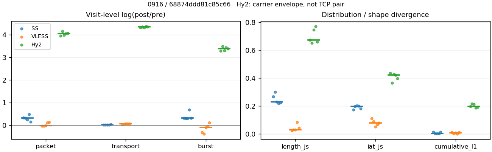
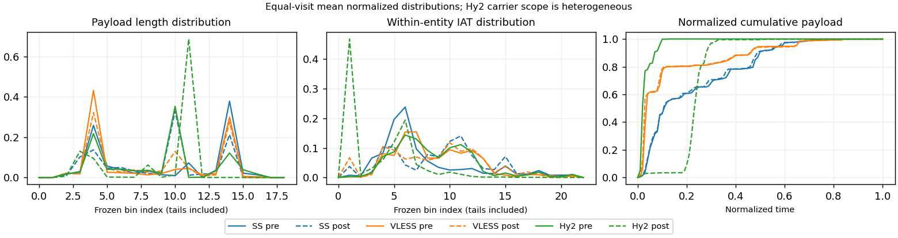

# 0916 · 条目 014 · developer.mozilla.org

目标：https://developer.mozilla.org/en-US/docs/Web/API/Fetch_API

活动标签：developer.mozilla.org::document_view。选定访问 15 次。

[返回总索引](../../README.md) · [统计口径](../../methods.md)

## 覆盖与资格（每次访问均保留）

| 部署 | 重复 | 主请求路由 | 活动状态 | 代理比较 | DIRECT pre | 请求 proxy/direct/unresolved | 错误 |
| --- | --- | --- | --- | --- | --- | --- | --- |
| Hy2 | 1 | proxy | passed | 1 | 0 | 99/0/0 | [] |
| Hy2 | 2 | proxy | passed | 1 | 0 | 99/0/0 | [] |
| Hy2 | 3 | proxy | passed | 1 | 0 | 94/0/0 | [] |
| Hy2 | 4 | proxy | passed | 1 | 0 | 99/0/0 | [] |
| Hy2 | 5 | proxy | passed | 1 | 0 | 99/0/0 | [] |
| SS | 1 | proxy | passed | 1 | 0 | 99/0/0 | [] |
| SS | 2 | proxy | passed | 1 | 0 | 99/0/0 | [] |
| SS | 3 | proxy | passed | 1 | 0 | 99/0/0 | [] |
| SS | 4 | proxy | passed | 1 | 0 | 99/0/0 | [] |
| SS | 5 | proxy | passed | 1 | 0 | 99/0/0 | [] |
| VLESS | 1 | proxy | passed | 1 | 0 | 99/0/0 | [] |
| VLESS | 2 | proxy | passed | 1 | 0 | 99/0/0 | [] |
| VLESS | 3 | proxy | passed | 1 | 0 | 99/0/0 | [] |
| VLESS | 4 | proxy | passed | 1 | 0 | 99/0/0 | [] |
| VLESS | 5 | proxy | passed | 1 | 0 | 99/0/0 | [] |

主请求非 proxy 的统计仅解释为已索引的辅助代理连接或 DIRECT 观测，不代表目标业务经代理传输。播放确认与配对资格是两道不同的门。

图中散点为单次访问，短线为重复中位数；Hy2 是共享载体包络，不能与 TCP 配对作等范围因果对比。

形态图先逐访问归一化，再对访问等权平均；实线 pre，虚线 post。分箱序号及边界见 methods，不将分箱索引误解为长度或时间。

## 每次访问的关键观测

### SS

范围：`exclusive_page`。每格 pre → post；空值为不可观测/不适用。

| 重复 | 包数 | 载荷字节 | burst | TCP FR | IAT中位µs | length JS | IAT JS |
| --- | --- | --- | --- | --- | --- | --- | --- |
| 1 | 669 → 928 | 5.8761e+05 → 5.9599e+05 | 442 → 606 | 59 → 60 | 35.431 → 494.01 | 0.26843 | 0.17293 |
| 2 | 635 → 869 | 6.0813e+05 → 6.2041e+05 | 465 → 627 | 48 → 53 | 34.141 → 778.13 | 0.3 | 0.19657 |
| 3 | 745 → 966 | 6.332e+05 → 6.454e+05 | 519 → 697 | 51 → 53 | 30.941 → 573.74 | 0.23052 | 0.20131 |
| 4 | 631 → 1023 | 5.9554e+05 → 6.071e+05 | 368 → 734 | 47 → 64 | 34.933 → 325.35 | 0.21901 | 0.19989 |
| 5 | 686 → 800 | 5.973e+05 → 6.1419e+05 | 471 → 649 | 49 → 59 | 36.399 → 1018.7 | 0.22371 | 0.17979 |

完整标量统计：中位数 [min,max]；Δ 为重复内逐访问变换的中位数，MAD 未缩放。n 为可用变换数；DIRECT-only 的 nΔ=0 不代表 pre 不可用。

| scope | 特征 | pre | post | Δ | IQRΔ | MADΔ | nΔ |
| --- | --- | --- | --- | --- | --- | --- | --- |
| exclusive_page | active_span_sum_s_1000ms | 11.909 [9.202, 13.171] | 12.827 [12.071, 15.186] | 0.14236 | 0.23124 | 0.11256 | 5 |
| exclusive_page | active_span_sum_s_100ms | 1.9735 [1.4484, 2.1631] | 4.1786 [3.0152, 4.4293] | 0.68524 | 0.12938 | 0.038548 | 5 |
| exclusive_page | active_span_sum_s_500ms | 8.3724 [5.9455, 8.6685] | 9.5939 [9.2037, 11.142] | 0.23769 | 0.10267 | 0.08551 | 5 |
| exclusive_page | burst_bytes_iqr | 1448 [1448, 1726] | 1428 [1428, 1439] | -0.013908 | 0 | 0 | 5 |
| exclusive_page | burst_bytes_mad | 39 [0, 64] | 34 [34, 65] | -0.060848 | 0.25512 | 0.11479 | 4 |
| exclusive_page | burst_bytes_max | 20480 [17376, 20688] | 9581 [5712, 17136] | -0.75967 | 0.40165 | 0.2899 | 5 |
| exclusive_page | burst_bytes_mean | 1307.8 [1220, 1618.3] | 946.37 [827.11, 989.49] | -0.29268 | 0.022491 | 0.013771 | 5 |
| exclusive_page | burst_bytes_median | 39 [0, 64] | 34 [34, 65] | -0.060848 | 0.25512 | 0.11479 | 4 |
| exclusive_page | burst_bytes_min | 0 [0, 0] | 0 [0, 0] | — | — | — | 0 |
| exclusive_page | burst_bytes_p95 | 5792 [5792, 9421.9] | 2969.6 [2856, 4284] | -0.70706 | 0.35259 | 0.30741 | 5 |
| exclusive_page | burst_bytes_q25 | 0 [0, 0] | 0 [0, 0] | — | — | — | 0 |
| exclusive_page | burst_bytes_q75 | 1448 [1448, 1726] | 1428 [1428, 1439] | -0.013908 | 0 | 0 | 5 |
| exclusive_page | burst_bytes_std | 2808.9 [2527.4, 3406.5] | 1430.1 [1209.3, 1532.9] | -0.71129 | 0.11987 | 0.09403 | 5 |
| exclusive_page | burst_count | 465 [368, 519] | 649 [606, 734] | 0.31557 | 0.021665 | 0.016661 | 5 |
| exclusive_page | burst_duration_ms_iqr | 0.036186 [0.013271, 0.051206] | 0 [0, 0.0052778] | -2.0061 | — | — | 1 |
| exclusive_page | burst_duration_ms_mad | 0 [0, 0] | 0 [0, 0] | — | — | — | 0 |
| exclusive_page | burst_duration_ms_max | 15000 [3340.5, 15001] | 15037 [2513.4, 15411] | 0.0023885 | 0.23824 | 0.024656 | 5 |
| exclusive_page | burst_duration_ms_mean | 59.105 [50.756, 96.692] | 52.659 [22.345, 61.068] | -0.45954 | 0.43622 | 0.35634 | 5 |
| exclusive_page | burst_duration_ms_median | 0 [0, 0] | 0 [0, 0] | — | — | — | 0 |
| exclusive_page | burst_duration_ms_min | 0 [0, 0] | 0 [0, 0] | — | — | — | 0 |
| exclusive_page | burst_duration_ms_p95 | 178.9 [100.3, 243.61] | 12.741 [5.503, 39.005] | -2.1219 | 0.36737 | 0.28992 | 5 |
| exclusive_page | burst_duration_ms_q25 | 0 [0, 0] | 0 [0, 0] | — | — | — | 0 |
| exclusive_page | burst_duration_ms_q75 | 0.036186 [0.013271, 0.051206] | 0 [0, 0.0052778] | -2.0061 | — | — | 1 |
| exclusive_page | burst_duration_ms_std | 690.32 [290.86, 992.76] | 786.03 [151.08, 821.43] | -0.23349 | 0.62446 | 0.40739 | 5 |
| exclusive_page | burst_packets_iqr | 1 [1, 1] | 0 [0, 1] | 0 | — | — | 1 |
| exclusive_page | burst_packets_mad | 0 [0, 0] | 0 [0, 0] | — | — | — | 0 |
| exclusive_page | burst_packets_max | 9 [7, 11] | 10 [8, 11] | 0.10536 | 0.20067 | 0.10536 | 5 |
| exclusive_page | burst_packets_mean | 1.4565 [1.3656, 1.7147] | 1.386 [1.2327, 1.5314] | -0.035102 | 0.17852 | 0.049911 | 5 |
| exclusive_page | burst_packets_median | 1 [1, 1] | 1 [1, 1] | 0 | 0 | 0 | 5 |
| exclusive_page | burst_packets_min | 1 [1, 1] | 1 [1, 1] | 0 | 0 | 0 | 5 |
| exclusive_page | burst_packets_p95 | 3 [3, 4] | 3 [2, 4] | 0 | 0.28768 | 0.28768 | 5 |
| exclusive_page | burst_packets_q25 | 1 [1, 1] | 1 [1, 1] | 0 | 0 | 0 | 5 |
| exclusive_page | burst_packets_q75 | 2 [2, 2] | 1 [1, 2] | -0.69315 | 0 | 0 | 5 |
| exclusive_page | burst_packets_std | 1.0063 [0.85238, 1.2281] | 0.96195 [0.76102, 1.171] | -0.12367 | 0.29852 | 0.1206 | 5 |
| exclusive_page | connection_span_concurrency_max | 4 [3, 4] | 3 [3, 4] | 0 | 0 | 0 | 5 |
| exclusive_page | cumulative_l1 | — | — | 0.003413 | 0.010075 | 0.002167 | 5 |
| exclusive_page | cumulative_max | — | — | 0.10468 | 0.12414 | 0.051406 | 5 |
| exclusive_page | direction_entropy | 0.92821 [0.9225, 0.96846] | 0.68589 [0.62903, 0.75635] | -0.27125 | 0.034799 | 0.022221 | 5 |
| exclusive_page | down_burst_count | 230 [182, 257] | 322 [300, 365] | 0.31929 | 0.018589 | 0.014364 | 5 |
| exclusive_page | down_ip_bytes | 5.9029e+05 [5.7713e+05, 6.2459e+05] | 6.0598e+05 [5.882e+05, 6.3433e+05] | 0.017228 | 0.0035241 | 0.0017732 | 5 |
| exclusive_page | down_packets | 374 [334, 407] | 510 [392, 557] | 0.31135 | 0.073649 | 0.058673 | 5 |
| exclusive_page | down_transport_bytes | 5.7074e+05 [5.5795e+05, 6.0338e+05] | 5.769e+05 [5.6161e+05, 6.0678e+05] | 0.0065437 | 0.0043273 | 0.00092126 | 5 |
| exclusive_page | duration_s | 20.27 [11.26, 66.838] | 20.749 [11.121, 66.352] | -0.0072943 | 0.010502 | 0.0053352 | 5 |
| exclusive_page | entity_count | 5 [4, 6] | 5 [4, 6] | 0 | 0 | 0 | 5 |
| exclusive_page | fr_runs | 49 [47, 59] | 59 [53, 64] | 0.099091 | 0.14725 | 0.082284 | 5 |
| exclusive_page | fr_runs_per_packet | 0.12564 [0.1202, 0.15325] | 0.11472 [0.099812, 0.14286] | -0.024579 | 0.017711 | 0.011021 | 5 |
| exclusive_page | fr_switches | 44 [43, 53] | 54 [47, 60] | 0.11 | 0.16131 | 0.091309 | 5 |
| exclusive_page | fr_switches_per_possible_transition | 0.11429 [0.11111, 0.13984] | 0.10503 [0.089524, 0.13235] | -0.021862 | 0.017392 | 0.010837 | 5 |
| exclusive_page | full_retransmission_fraction | 0.0029895 [0.0015848, 0.0040268] | 0.014663 [0.0086207, 0.025] | 0.013078 | 0.0080176 | 0.0046825 | 5 |
| exclusive_page | full_retransmission_packets | 2 [1, 3] | 15 [8, 20] | 2.1401 | 0.91629 | 0.56798 | 5 |
| exclusive_page | iat_count | 663 [627, 739] | 922 [795, 1019] | 0.31585 | 0.068135 | 0.054218 | 5 |
| exclusive_page | iat_js | — | — | 0.19657 | 0.020096 | 0.0047422 | 5 |
| exclusive_page | iat_ks | — | — | 0.36802 | 0.0064113 | 0.0039444 | 5 |
| exclusive_page | iat_median_us | 34.933 [30.941, 36.399] | 573.74 [325.35, 1018.7] | 2.9201 | 0.49145 | 0.28512 | 5 |
| exclusive_page | iat_us_iqr | 178.04 [158.02, 297.09] | 1893.5 [1097.8, 3173.7] | 2.3686 | 0.23317 | 0.11487 | 5 |
| exclusive_page | iat_us_mad | 26.485 [23.577, 28.066] | 558.98 [318.54, 1006.6] | 3.1659 | 0.40067 | 0.25875 | 5 |
| exclusive_page | iat_us_max | 1.5001e+07 [3.3405e+06, 1.5001e+07] | 1.5164e+07 [3.3428e+06, 1.546e+07] | 0.010814 | 0.026302 | 0.016165 | 5 |
| exclusive_page | iat_us_mean | 1.2415e+05 [37878, 3.0503e+05] | 77018 [26716, 2.2091e+05] | -0.32266 | 0.085984 | 0.059528 | 5 |
| exclusive_page | iat_us_median | 34.933 [30.941, 36.399] | 573.74 [325.35, 1018.7] | 2.9201 | 0.49145 | 0.28512 | 5 |
| exclusive_page | iat_us_min | 0.073 [0.013, 0.492] | 0.038 [0.036, 0.046] | -0.70694 | 2.5813 | 1.6365 | 5 |
| exclusive_page | iat_us_p95 | 1.2043e+05 [89133, 3.6751e+05] | 72930 [39397, 1.7386e+05] | -0.75123 | 0.14877 | 0.14603 | 5 |
| exclusive_page | iat_us_q25 | 13.45 [13.078, 15.272] | 19.027 [13.253, 26.261] | 0.37497 | 0.22142 | 0.18707 | 5 |
| exclusive_page | iat_us_q75 | 191.38 [171.47, 312.36] | 1919.8 [1111, 3192.1] | 2.3243 | 0.24154 | 0.099203 | 5 |
| exclusive_page | iat_us_std | 1.2086e+06 [2.3959e+05, 1.9702e+06] | 9.4994e+05 [1.937e+05, 1.6877e+06] | -0.15475 | 0.083563 | 0.030017 | 5 |
| exclusive_page | iat_wasserstein_log1p_us | — | — | 1.5647 | 0.18688 | 0.059411 | 5 |
| exclusive_page | idle_gap_count_1000ms | 10 [5, 17] | 9 [5, 15] | -0.10536 | 0.05617 | 0.036368 | 5 |
| exclusive_page | idle_gap_count_100ms | 36 [31, 50] | 39 [34, 52] | 0.039221 | 0.08183 | 0.06221 | 5 |
| exclusive_page | idle_gap_count_500ms | 13 [11, 24] | 12 [11, 21] | -0.087011 | 0.025318 | 0.018349 | 5 |
| exclusive_page | idle_gap_sum_s_1000ms | 68.056 [12.663, 179.58] | 64.673 [11.805, 178.8] | -0.050976 | 0.051426 | 0.032267 | 5 |
| exclusive_page | idle_gap_sum_s_100ms | 76.265 [23.028, 190.72] | 75.466 [20.494, 186.94] | -0.021373 | 0.07046 | 0.010841 | 5 |
| exclusive_page | idle_gap_sum_s_500ms | 71.899 [17.209, 183.54] | 69.018 [15.429, 181.61] | -0.040889 | 0.075534 | 0.034243 | 5 |
| exclusive_page | ip_bytes | 6.3308e+05 [6.2252e+05, 6.7207e+05] | 6.6862e+05 [6.492e+05, 7.0154e+05] | 0.043644 | 0.0031117 | 0.001679 | 5 |
| exclusive_page | length_iqr | 2804 [2803, 2806.2] | 1377 [1302, 2295] | -0.71078 | 0.29955 | 0.056362 | 5 |
| exclusive_page | length_js | — | — | 0.23052 | 0.044722 | 0.011508 | 5 |
| exclusive_page | length_ks | — | — | 0.37072 | 0.011183 | 0.0088784 | 5 |
| exclusive_page | length_mad | 1364.5 [1341, 1365] | 1109 [1009, 1250] | -0.2077 | 0.15133 | 0.093766 | 5 |
| exclusive_page | length_max | 8192 [5792, 8920] | 2896 [2856, 5712] | -0.70706 | 0.46274 | 0.34647 | 5 |
| exclusive_page | length_mean | 1531.5 [1523.1, 1809.9] | 1215.5 [1041.3, 1487.2] | -0.267 | 0.058949 | 0.031457 | 5 |
| exclusive_page | length_median | 1448 [1424, 1448] | 1428 [1321, 1428] | -0.013908 | 0 | 0 | 5 |
| exclusive_page | length_min | 31 [31, 31] | 20 [6, 20] | -0.43825 | 0 | 0 | 5 |
| exclusive_page | length_p95 | 2896 [2896, 8192] | 2856 [2856, 2856] | -0.013908 | 0 | 0 | 5 |
| exclusive_page | length_q25 | 92 [89.75, 93] | 126 [74, 561] | 0.31449 | 0.76496 | 0.54303 | 5 |
| exclusive_page | length_q75 | 2896 [2896, 2896] | 1482 [1428, 2856] | -0.66994 | 0.35998 | 0.037118 | 5 |
| exclusive_page | length_std | 1317.1 [1281.7, 2086.2] | 995.19 [949.88, 1056.9] | -0.30982 | 0.19929 | 0.093353 | 5 |
| exclusive_page | length_wasserstein_bytes | — | — | 481.79 | 89.579 | 57.463 | 5 |
| exclusive_page | nonempty_entity_count | 5 [4, 6] | 5 [4, 6] | 0 | 0 | 0 | 5 |
| exclusive_page | nonempty_packets | 390 [336, 410] | 510 [413, 583] | 0.28117 | 0.059849 | 0.037286 | 5 |
| exclusive_page | offload_suspect_fraction | 0.25235 [0.2315, 0.28368] | 0.14182 [0.10991, 0.16125] | -0.11134 | 0.021712 | 0.020894 | 5 |
| exclusive_page | packet_count | 669 [631, 745] | 928 [800, 1023] | 0.31372 | 0.067468 | 0.053939 | 5 |
| exclusive_page | rtt_median_ms | 0.05716 [0.044428, 0.072509] | 32.145 [28.113, 33.692] | 6.3602 | 0.16099 | 0.089857 | 5 |
| exclusive_page | rtt_sample_count | 269 [226, 302] | 179 [157, 206] | -0.39986 | 0.10854 | 0.072962 | 5 |
| exclusive_page | tcp_ack_count | 663 [627, 739] | 921 [794, 1019] | 0.31469 | 0.06705 | 0.05306 | 5 |
| exclusive_page | tcp_fin_count | 10 [8, 12] | 11 [9, 15] | 0.18232 | 0.22314 | 0.13613 | 5 |
| exclusive_page | tcp_packet_count | 669 [631, 745] | 928 [800, 1023] | 0.31372 | 0.067468 | 0.053939 | 5 |
| exclusive_page | tcp_rst_count | 0 [0, 0] | 0 [0, 0] | — | — | — | 0 |
| exclusive_page | tcp_syn_count | 10 [8, 12] | 11 [8, 13] | 0.080043 | 0.09531 | 0.015267 | 5 |
| exclusive_page | tcp_window_raw_median | 65427 [65349, 65535] | 151 [144, 153] | -6.0717 | 0.034866 | 0.011845 | 5 |
| exclusive_page | transition_entropy | 0.49705 [0.48708, 0.56748] | 0.43025 [0.38446, 0.51245] | -0.10263 | 0.045595 | 0.032698 | 5 |
| exclusive_page | transition_n_mm | 232 [180, 245] | 391 [295, 460] | 0.58881 | 0.15739 | 0.078801 | 5 |
| exclusive_page | transition_n_mp | 20 [20, 24] | 25 [21, 29] | 0.13976 | 0.21357 | 0.09894 | 5 |
| exclusive_page | transition_n_pm | 24 [23, 29] | 28 [25, 31] | 0.083382 | 0.11493 | 0.070769 | 5 |
| exclusive_page | transition_n_pp | 109 [108, 114] | 59 [58, 70] | -0.61381 | 0.0092167 | 0.0078778 | 5 |
| exclusive_page | transition_p_mm | 0.92063 [0.9, 0.92453] | 0.9399 [0.919, 0.95105] | 0.026521 | 0.019682 | 0.011982 | 5 |
| exclusive_page | transition_p_mp | 0.079365 [0.075472, 0.1] | 0.060096 [0.048951, 0.080997] | -0.026521 | 0.019682 | 0.011982 | 5 |
| exclusive_page | transition_p_pm | 0.17986 [0.17557, 0.21014] | 0.32184 [0.27083, 0.34444] | 0.12563 | 0.021987 | 0.015756 | 5 |
| exclusive_page | transition_p_pp | 0.82014 [0.78986, 0.82443] | 0.67816 [0.65556, 0.72917] | -0.12563 | 0.021987 | 0.015756 | 5 |
| exclusive_page | transport_bytes | 5.973e+05 [5.8761e+05, 6.332e+05] | 6.1419e+05 [5.9599e+05, 6.454e+05] | 0.019218 | 0.00090028 | 0.00077853 | 5 |
| exclusive_page | up_burst_count | 235 [186, 262] | 327 [306, 369] | 0.31194 | 0.024702 | 0.018952 | 5 |
| exclusive_page | up_byte_fraction | 0.045145 [0.041649, 0.050474] | 0.058168 [0.049743, 0.06135] | 0.012753 | 0.0049291 | 0.0036262 | 5 |
| exclusive_page | up_ip_bytes | 43170 [38212, 47477] | 62980 [60992, 67203] | 0.37767 | 0.058421 | 0.030199 | 5 |
| exclusive_page | up_packets | 301 [257, 338] | 418 [408, 466] | 0.31634 | 0.037416 | 0.025382 | 5 |
| exclusive_page | up_transport_bytes | 27454 [24804, 29817] | 36088 [30199, 38623] | 0.25877 | 0.076645 | 0.061965 | 5 |
| exclusive_page | zero_iat_count | 0 [0, 0] | 0 [0, 0] | — | — | — | 0 |
| exclusive_page | zero_iat_fraction | 0 [0, 0] | 0 [0, 0] | 0 | 0 | 0 | 5 |

### VLESS

范围：`exclusive_page`。每格 pre → post；空值为不可观测/不适用。

| 重复 | 包数 | 载荷字节 | burst | TCP FR | IAT中位µs | length JS | IAT JS |
| --- | --- | --- | --- | --- | --- | --- | --- |
| 1 | 955 → 924 | 6.2554e+05 → 6.5352e+05 | 750 → 546 | 48 → 56 | 106.71 → 328.41 | 0.024454 | 0.11055 |
| 2 | 964 → 930 | 6.2062e+05 → 6.5899e+05 | 805 → 555 | 46 → 56 | 88.31 → 238.04 | 0.029659 | 0.088677 |
| 3 | 889 → 883 | 5.9334e+05 → 6.3283e+05 | 601 → 549 | 58 → 70 | 130.77 → 483.25 | 0.028894 | 0.050487 |
| 4 | 895 → 1004 | 5.9306e+05 → 6.3372e+05 | 615 → 591 | 68 → 78 | 183.52 → 295.42 | 0.082693 | 0.067954 |
| 5 | 815 → 931 | 5.9161e+05 → 6.3252e+05 | 569 → 637 | 56 → 68 | 115.46 → 557.61 | 0.043733 | 0.077277 |

完整标量统计：中位数 [min,max]；Δ 为重复内逐访问变换的中位数，MAD 未缩放。n 为可用变换数；DIRECT-only 的 nΔ=0 不代表 pre 不可用。

| scope | 特征 | pre | post | Δ | IQRΔ | MADΔ | nΔ |
| --- | --- | --- | --- | --- | --- | --- | --- |
| exclusive_page | active_span_sum_s_1000ms | 9.6095 [8.6905, 11.025] | 9.7819 [8.0937, 10.499] | -0.038472 | 0.013893 | 0.010442 | 5 |
| exclusive_page | active_span_sum_s_100ms | 1.4408 [1.3996, 1.5821] | 3.3534 [2.8491, 3.6156] | 0.78375 | 0.13044 | 0.088134 | 5 |
| exclusive_page | active_span_sum_s_500ms | 5.3868 [5.0213, 5.6942] | 8.1618 [7.7967, 9.2457] | 0.45963 | 0.048555 | 0.026147 | 5 |
| exclusive_page | burst_bytes_iqr | 1868 [1272, 2824] | 2824 [2544, 2824] | 0.30887 | 0.69315 | 0.30887 | 5 |
| exclusive_page | burst_bytes_mad | 39 [24, 64] | 72 [36, 202] | 0.6131 | 0.43721 | 0.22957 | 5 |
| exclusive_page | burst_bytes_max | 14552 [11584, 20480] | 5792 [4832, 11584] | -0.69315 | 0.77291 | 0.46504 | 5 |
| exclusive_page | burst_bytes_mean | 964.33 [770.96, 1039.7] | 1152.7 [992.96, 1196.9] | 0.15494 | 0.25511 | 0.20097 | 5 |
| exclusive_page | burst_bytes_median | 39 [24, 64] | 72 [36, 202] | 0.6131 | 0.43721 | 0.22957 | 5 |
| exclusive_page | burst_bytes_min | 0 [0, 0] | 0 [0, 0] | — | — | — | 0 |
| exclusive_page | burst_bytes_p95 | 2896 [2896, 2968] | 2896 [2896, 2968] | 0 | 0.017744 | 0.017744 | 5 |
| exclusive_page | burst_bytes_q25 | 0 [0, 0] | 0 [0, 0] | — | — | — | 0 |
| exclusive_page | burst_bytes_q75 | 1868 [1272, 2824] | 2824 [2544, 2824] | 0.30887 | 0.69315 | 0.30887 | 5 |
| exclusive_page | burst_bytes_std | 1614.7 [1456.1, 2030.7] | 1331.4 [1250.4, 1452.1] | -0.1527 | 0.17751 | 0.14994 | 5 |
| exclusive_page | burst_count | 615 [569, 805] | 555 [546, 637] | -0.090496 | 0.27765 | 0.20339 | 5 |
| exclusive_page | burst_duration_ms_iqr | 0.40383 [0, 0.60523] | 1.928 [0.48371, 2.285] | 1.2249 | 0.97864 | 0.50821 | 3 |
| exclusive_page | burst_duration_ms_mad | 0 [0, 0] | 0 [0, 0] | — | — | — | 0 |
| exclusive_page | burst_duration_ms_max | 1615.7 [1100.6, 15001] | 15043 [1615.8, 15060] | 0.0028171 | 2.3032 | 0.0032282 | 5 |
| exclusive_page | burst_duration_ms_mean | 17.214 [11.449, 49.982] | 37.097 [12.862, 41.717] | 0.14905 | 0.67742 | 0.48192 | 5 |
| exclusive_page | burst_duration_ms_median | 0 [0, 0] | 0 [0, 0] | — | — | — | 0 |
| exclusive_page | burst_duration_ms_min | 0 [0, 0] | 0 [0, 0] | — | — | — | 0 |
| exclusive_page | burst_duration_ms_p95 | 6.189 [4.3929, 11.069] | 14.677 [10.665, 107.39] | 0.54421 | 1.8889 | 0.30134 | 5 |
| exclusive_page | burst_duration_ms_q25 | 0 [0, 0] | 0 [0, 0] | — | — | — | 0 |
| exclusive_page | burst_duration_ms_q75 | 0.40383 [0, 0.60523] | 1.928 [0.48371, 2.285] | 1.2249 | 0.97864 | 0.50821 | 3 |
| exclusive_page | burst_duration_ms_std | 109.38 [83.987, 642.99] | 621.78 [81.906, 643.13] | 0.15993 | 1.8071 | 0.23637 | 5 |
| exclusive_page | burst_packets_iqr | 1 [0, 1] | 1 [1, 1] | 0 | 0 | 0 | 3 |
| exclusive_page | burst_packets_mad | 0 [0, 0] | 0 [0, 0] | — | — | — | 0 |
| exclusive_page | burst_packets_max | 10 [7, 14] | 10 [7, 15] | 0 | 0.33647 | 0.33647 | 5 |
| exclusive_page | burst_packets_mean | 1.4323 [1.1975, 1.4792] | 1.6757 [1.4615, 1.6988] | 0.15473 | 0.20073 | 0.12973 | 5 |
| exclusive_page | burst_packets_median | 1 [1, 1] | 1 [1, 1] | 0 | 0 | 0 | 5 |
| exclusive_page | burst_packets_min | 1 [1, 1] | 1 [1, 1] | 0 | 0 | 0 | 5 |
| exclusive_page | burst_packets_p95 | 3 [2, 3] | 3 [3, 4] | 0 | 0.4502 | 0 | 5 |
| exclusive_page | burst_packets_q25 | 1 [1, 1] | 1 [1, 1] | 0 | 0 | 0 | 5 |
| exclusive_page | burst_packets_q75 | 2 [1, 2] | 2 [2, 2] | 0 | 0.69315 | 0 | 5 |
| exclusive_page | burst_packets_std | 0.70519 [0.59771, 0.99415] | 0.94912 [0.9107, 1.3856] | 0.32621 | 0.45498 | 0.34924 | 5 |
| exclusive_page | connection_span_concurrency_max | 4 [3, 4] | 4 [3, 4] | 0 | 0 | 0 | 5 |
| exclusive_page | cumulative_l1 | — | — | 0.0083708 | 0.0083616 | 0.0012756 | 5 |
| exclusive_page | cumulative_max | — | — | 0.042944 | 0.48868 | 0.021211 | 5 |
| exclusive_page | direction_entropy | 0.7969 [0.7841, 0.83081] | 0.59239 [0.57241, 0.618] | -0.20577 | 0.021399 | 0.014467 | 5 |
| exclusive_page | down_burst_count | 305 [282, 400] | 275 [271, 316] | -0.091291 | 0.27932 | 0.20513 | 5 |
| exclusive_page | down_ip_bytes | 5.97e+05 [5.9333e+05, 6.2766e+05] | 6.3164e+05 [6.2721e+05, 6.5665e+05] | 0.050495 | 0.0075294 | 0.0063923 | 5 |
| exclusive_page | down_packets | 517 [468, 524] | 553 [521, 585] | 0.10954 | 0.042805 | 0.0091889 | 5 |
| exclusive_page | down_transport_bytes | 5.6972e+05 [5.6895e+05, 6.0074e+05] | 6.0118e+05 [6.0008e+05, 6.2754e+05] | 0.051922 | 0.0064256 | 0.0026525 | 5 |
| exclusive_page | duration_s | 62.715 [3.8944, 65.507] | 62.23 [3.866, 65.489] | -0.0073143 | 0.0071805 | 0.0024685 | 5 |
| exclusive_page | entity_count | 5 [4, 5] | 5 [4, 5] | 0 | 0 | 0 | 5 |
| exclusive_page | fr_runs | 56 [46, 68] | 68 [56, 78] | 0.18805 | 0.040005 | 0.0086581 | 5 |
| exclusive_page | fr_runs_per_packet | 0.10943 [0.08972, 0.12806] | 0.13153 [0.10219, 0.1341] | 0.01247 | 0.0017712 | 0.0013573 | 5 |
| exclusive_page | fr_switches | 51 [41, 63] | 63 [51, 73] | 0.2041 | 0.044255 | 0.014158 | 5 |
| exclusive_page | fr_switches_per_possible_transition | 0.10095 [0.082329, 0.11977] | 0.12305 [0.09427, 0.12573] | 0.012726 | 0.0018986 | 0.0011135 | 5 |
| exclusive_page | full_retransmission_fraction | 0.0011173 [0, 0.003112] | 0 [0, 0] | -0.0011173 | 0.0012026 | 0.0011173 | 5 |
| exclusive_page | full_retransmission_packets | 1 [0, 3] | 0 [0, 0] | — | — | — | 0 |
| exclusive_page | iat_count | 890 [810, 959] | 925 [878, 999] | -0.0068105 | 0.14867 | 0.029287 | 5 |
| exclusive_page | iat_js | — | — | 0.077277 | 0.020723 | 0.0114 | 5 |
| exclusive_page | iat_ks | — | — | 0.11634 | 0.01158 | 0.011432 | 5 |
| exclusive_page | iat_median_us | 115.46 [88.31, 183.52] | 328.41 [238.04, 557.61] | 1.1242 | 0.31546 | 0.18287 | 5 |
| exclusive_page | iat_us_iqr | 1515.8 [932.43, 1712.8] | 2248.6 [1411.8, 2736.1] | 0.41483 | 0.034915 | 0.025341 | 5 |
| exclusive_page | iat_us_mad | 108.53 [80.473, 176.44] | 323.11 [237.92, 547.84] | 1.2207 | 0.25574 | 0.13665 | 5 |
| exclusive_page | iat_us_max | 1.5001e+07 [1.6157e+06, 1.5001e+07] | 1.5314e+07 [1.6158e+06, 1.5444e+07] | 0.02067 | 0.0017426 | 0.0015108 | 5 |
| exclusive_page | iat_us_mean | 76225 [10837, 1.5576e+05] | 73684 [10554, 1.3921e+05] | -0.026502 | 0.11494 | 0.057278 | 5 |
| exclusive_page | iat_us_median | 115.46 [88.31, 183.52] | 328.41 [238.04, 557.61] | 1.1242 | 0.31546 | 0.18287 | 5 |
| exclusive_page | iat_us_min | 0.75 [0.138, 0.82] | 0.036 [0.031, 0.043] | -2.9222 | 0.11966 | 0.11439 | 5 |
| exclusive_page | iat_us_p95 | 10135 [9416.6, 41127] | 44909 [41376, 85372] | 1.4802 | 0.03921 | 0.021219 | 5 |
| exclusive_page | iat_us_q25 | 32.801 [31.496, 40.352] | 16.354 [11.149, 40.974] | -0.73767 | 0.365 | 0.27756 | 5 |
| exclusive_page | iat_us_q75 | 1547.3 [972.78, 1745.1] | 2264.9 [1426.4, 2752.5] | 0.38686 | 0.025901 | 0.021812 | 5 |
| exclusive_page | iat_us_std | 9.4552e+05 [79713, 1.3897e+06] | 9.5278e+05 [65486, 1.3467e+06] | -0.054674 | 0.06574 | 0.062321 | 5 |
| exclusive_page | iat_wasserstein_log1p_us | — | — | 0.68696 | 0.26536 | 0.12091 | 5 |
| exclusive_page | idle_gap_count_1000ms | 5 [1, 12] | 5 [1, 10] | -0.09531 | 0.18232 | 0.09531 | 5 |
| exclusive_page | idle_gap_count_100ms | 28 [23, 37] | 32 [26, 41] | 0.1092 | 0.019948 | 0.013403 | 5 |
| exclusive_page | idle_gap_count_500ms | 13 [5, 18] | 8 [1, 11] | -0.49248 | 0.20764 | 0.057158 | 5 |
| exclusive_page | idle_gap_sum_s_1000ms | 56.816 [1.6157, 118.97] | 56.706 [1.6158, 118.68] | -0.0024525 | 0.010629 | 0.0025152 | 5 |
| exclusive_page | idle_gap_sum_s_100ms | 66.258 [8.8852, 128] | 63.851 [6.8604, 125.25] | -0.037005 | 0.01574 | 0.0088969 | 5 |
| exclusive_page | idle_gap_sum_s_500ms | 62.819 [4.632, 124.07] | 59.043 [1.6158, 119.52] | -0.061996 | 0.026646 | 0.023025 | 5 |
| exclusive_page | ip_bytes | 6.3957e+05 [6.3395e+05, 6.7518e+05] | 6.8695e+05 [6.7912e+05, 7.077e+05] | 0.060041 | 0.017828 | 0.011426 | 5 |
| exclusive_page | length_iqr | 2752 [2752, 2752] | 2752 [1340, 2752] | 0 | 0 | 0 | 5 |
| exclusive_page | length_js | — | — | 0.029659 | 0.014839 | 0.0052057 | 5 |
| exclusive_page | length_ks | — | — | 0.11831 | 0.012979 | 0.012687 | 5 |
| exclusive_page | length_mad | 348.5 [61.5, 481] | 906 [749.5, 1155] | 1.1982 | 1.3005 | 0.56505 | 5 |
| exclusive_page | length_max | 8688 [2896, 8920] | 2896 [2824, 2896] | -1.0986 | 0.43182 | 0.051529 | 5 |
| exclusive_page | length_mean | 1169.2 [1116.9, 1253.4] | 1206.9 [1077.8, 1223.4] | -0.022042 | 0.043963 | 0.013616 | 5 |
| exclusive_page | length_median | 384.5 [95, 553] | 978 [821.5, 1227] | 1.1604 | 1.2436 | 0.59023 | 5 |
| exclusive_page | length_min | 24 [24, 24] | 24 [7, 24] | 0 | 0.69315 | 0 | 5 |
| exclusive_page | length_p95 | 2824 [2824, 2896] | 2824 [2824, 2824] | 0 | 0.0076196 | 0 | 5 |
| exclusive_page | length_q25 | 72 [72, 72] | 72 [72, 72] | 0 | 0 | 0 | 5 |
| exclusive_page | length_q75 | 2824 [2824, 2824] | 2824 [1412, 2824] | 0 | 0 | 0 | 5 |
| exclusive_page | length_std | 1269.9 [1221, 1551] | 1129.7 [1024.1, 1187.3] | -0.15321 | 0.057176 | 0.034586 | 5 |
| exclusive_page | length_wasserstein_bytes | — | — | 144.69 | 108.86 | 21.427 | 5 |
| exclusive_page | nonempty_entity_count | 5 [4, 5] | 5 [4, 5] | 0 | 0 | 0 | 5 |
| exclusive_page | nonempty_packets | 530 [472, 535] | 546 [517, 588] | 0.082029 | 0.067055 | 0.019936 | 5 |
| exclusive_page | offload_suspect_fraction | 0.19264 [0.18848, 0.20472] | 0.18182 [0.12251, 0.19479] | -0.0099339 | 0.017339 | 0.01146 | 5 |
| exclusive_page | packet_count | 895 [815, 964] | 930 [883, 1004] | -0.006772 | 0.14792 | 0.029135 | 5 |
| exclusive_page | rtt_median_ms | 0.10714 [0.056591, 0.19036] | 2.3402 [1.1938, 2.6854] | 2.9363 | 0.26481 | 0.24042 | 5 |
| exclusive_page | rtt_sample_count | 341 [312, 425] | 354 [342, 391] | 0.026356 | 0.19799 | 0.11047 | 5 |
| exclusive_page | tcp_ack_count | 880 [800, 949] | 925 [878, 999] | 0.0045662 | 0.15153 | 0.030181 | 5 |
| exclusive_page | tcp_fin_count | 10 [8, 10] | 10 [8, 10] | 0 | 0 | 0 | 5 |
| exclusive_page | tcp_packet_count | 895 [815, 964] | 930 [883, 1004] | -0.006772 | 0.14792 | 0.029135 | 5 |
| exclusive_page | tcp_rst_count | 10 [8, 10] | 0 [0, 0] | — | — | — | 0 |
| exclusive_page | tcp_syn_count | 10 [8, 10] | 10 [8, 10] | 0 | 0 | 0 | 5 |
| exclusive_page | tcp_window_raw_median | 65535 [65347, 65535] | 170 [159, 181] | -5.9517 | 0.053775 | 0.027092 | 5 |
| exclusive_page | transition_entropy | 0.43718 [0.37951, 0.48549] | 0.44464 [0.37535, 0.45216] | -0.0041549 | 0.027909 | 0.016442 | 5 |
| exclusive_page | transition_n_mm | 373 [320, 382] | 436 [409, 468] | 0.20972 | 0.094668 | 0.035674 | 5 |
| exclusive_page | transition_n_mp | 23 [18, 29] | 29 [23, 34] | 0.22314 | 0.04948 | 0.021979 | 5 |
| exclusive_page | transition_n_pm | 28 [23, 34] | 34 [28, 39] | 0.18805 | 0.040005 | 0.0086581 | 5 |
| exclusive_page | transition_n_pp | 97 [90, 105] | 42 [40, 56] | -0.76214 | 0.1294 | 0.11333 | 5 |
| exclusive_page | transition_p_mm | 0.93955 [0.92786, 0.95238] | 0.93379 [0.93197, 0.95075] | -0.0016315 | 0.003268 | 0.0024768 | 5 |
| exclusive_page | transition_p_mp | 0.060453 [0.047619, 0.072139] | 0.06621 [0.049251, 0.068027] | 0.0016315 | 0.003268 | 0.0024768 | 5 |
| exclusive_page | transition_p_pm | 0.22581 [0.18605, 0.27419] | 0.45946 [0.33333, 0.48148] | 0.20729 | 0.046941 | 0.026365 | 5 |
| exclusive_page | transition_p_pp | 0.77419 [0.72581, 0.81395] | 0.54054 [0.51852, 0.66667] | -0.20729 | 0.046941 | 0.026365 | 5 |
| exclusive_page | transport_bytes | 5.9334e+05 [5.9161e+05, 6.2554e+05] | 6.3372e+05 [6.3252e+05, 6.5899e+05] | 0.064443 | 0.0063205 | 0.0024185 | 5 |
| exclusive_page | up_burst_count | 310 [287, 405] | 280 [275, 321] | -0.089715 | 0.276 | 0.20167 | 5 |
| exclusive_page | up_byte_fraction | 0.039636 [0.036088, 0.039861] | 0.050041 [0.04772, 0.051756] | 0.011632 | 0.00025729 | 0.00014527 | 5 |
| exclusive_page | up_ip_bytes | 42864 [40621, 47518] | 52139 [51055, 55316] | 0.19903 | 0.16005 | 0.078905 | 5 |
| exclusive_page | up_packets | 371 [347, 463] | 371 [362, 419] | -0.0082531 | 0.28769 | 0.15776 | 5 |
| exclusive_page | up_transport_bytes | 23620 [22397, 24794] | 32540 [31447, 32753] | 0.3269 | 0.014803 | 0.0074317 | 5 |
| exclusive_page | zero_iat_count | 0 [0, 0] | 0 [0, 0] | — | — | — | 0 |
| exclusive_page | zero_iat_fraction | 0 [0, 0] | 0 [0, 0] | 0 | 0 | 0 | 5 |

### Hy2

范围：`carrier_context_envelope`。每格 pre → post；空值为不可观测/不适用。

| 重复 | 包数 | 载荷字节 | burst | TCP FR | IAT中位µs | length JS | IAT JS |
| --- | --- | --- | --- | --- | --- | --- | --- |
| 1 | 830 → 43204 | 6.1601e+05 → 4.6178e+07 | 574 → 15292 | — | 187.31 → 4.475 | 0.67339 | 0.43495 |
| 2 | 691 → 43795 | 6.0664e+05 → 4.6386e+07 | 492 → 16055 | — | 74.015 → 4.7645 | 0.65197 | 0.36424 |
| 3 | 795 → 42348 | 6.2249e+05 → 4.6217e+07 | 525 → 14164 | — | 205.17 → 2.912 | 0.74593 | 0.42772 |
| 4 | 744 → 42527 | 5.9102e+05 → 4.6027e+07 | 470 → 14523 | — | 157.78 → 3.7505 | 0.76927 | 0.42056 |
| 5 | 737 → 42803 | 6.0061e+05 → 4.6574e+07 | 490 → 14290 | — | 127.58 → 3.5615 | 0.65894 | 0.39636 |

完整标量统计：中位数 [min,max]；Δ 为重复内逐访问变换的中位数，MAD 未缩放。n 为可用变换数；DIRECT-only 的 nΔ=0 不代表 pre 不可用。

| scope | 特征 | pre | post | Δ | IQRΔ | MADΔ | nΔ |
| --- | --- | --- | --- | --- | --- | --- | --- |
| carrier_context_envelope | active_span_sum_s_1000ms | 7.4222 [6.8191, 8.66] | 19.469 [16.985, 21.005] | 0.90253 | 0.079047 | 0.050705 | 5 |
| carrier_context_envelope | active_span_sum_s_100ms | 1.2551 [1.0108, 1.6938] | 7.3921 [6.5541, 7.9614] | 1.8018 | 0.29891 | 0.15003 | 5 |
| carrier_context_envelope | active_span_sum_s_500ms | 6.0046 [4.924, 7.1428] | 17.221 [15.88, 18.42] | 1.0746 | 0.068475 | 0.034838 | 5 |
| carrier_context_envelope | burst_bytes_iqr | 1731.2 [1407.5, 2002] | 5094 [4227, 5116] | 1.0835 | 0.023486 | 0.016148 | 5 |
| carrier_context_envelope | burst_bytes_mad | 39 [31, 39] | 275 [216.5, 303.5] | 1.9532 | 0.10648 | 0.076961 | 5 |
| carrier_context_envelope | burst_bytes_max | 24110 [20480, 25304] | 2.0104e+05 [1.7622e+05, 3.0054e+05] | 2.2194 | 0.10834 | 0.067119 | 5 |
| carrier_context_envelope | burst_bytes_mean | 1225.7 [1073.2, 1257.5] | 3169.2 [2889.2, 3263] | 0.97794 | 0.087939 | 0.05356 | 5 |
| carrier_context_envelope | burst_bytes_median | 39 [31, 39] | 308 [247.5, 336.5] | 2.0665 | 0.09531 | 0.068993 | 5 |
| carrier_context_envelope | burst_bytes_min | 0 [0, 0] | 22 [22, 22] | — | — | — | 0 |
| carrier_context_envelope | burst_bytes_p95 | 4516.9 [3696.3, 5881.4] | 10932 [10932, 11528] | 0.88386 | 0.29028 | 0.1725 | 5 |
| carrier_context_envelope | burst_bytes_q25 | 0 [0, 0] | 74 [52, 96] | — | — | — | 0 |
| carrier_context_envelope | burst_bytes_q75 | 1731.2 [1407.5, 2002] | 5168 [4323, 5168] | 1.0936 | 0.03152 | 0.028492 | 5 |
| carrier_context_envelope | burst_bytes_std | 2622.1 [2423.5, 2781.9] | 5642.7 [5184.7, 6930.2] | 0.83996 | 0.17529 | 0.10251 | 5 |
| carrier_context_envelope | burst_count | 492 [470, 574] | 14523 [14164, 16055] | 3.3729 | 0.1357 | 0.077849 | 5 |
| carrier_context_envelope | burst_duration_ms_iqr | 0.90599 [0.034443, 0.96563] | 0.024469 [0.023789, 0.024799] | -3.6032 | 0.84708 | 0.073065 | 5 |
| carrier_context_envelope | burst_duration_ms_mad | 0 [0, 0] | 4.4e-05 [4.3e-05, 4.5e-05] | — | — | — | 0 |
| carrier_context_envelope | burst_duration_ms_max | 1752.2 [817.43, 15001] | 10000 [449.5, 10360] | -0.38531 | 2.2229 | 0.9752 | 5 |
| carrier_context_envelope | burst_duration_ms_mean | 18.709 [10.036, 81.346] | 1.3658 [0.33919, 2.2977] | -3.5668 | 1.5949 | 0.51149 | 5 |
| carrier_context_envelope | burst_duration_ms_median | 0 [0, 0] | 4.4e-05 [4.3e-05, 4.5e-05] | — | — | — | 0 |
| carrier_context_envelope | burst_duration_ms_min | 0 [0, 0] | 0 [0, 0] | — | — | — | 0 |
| carrier_context_envelope | burst_duration_ms_p95 | 11 [6.1476, 131.36] | 0.10531 [0.086751, 0.11831] | -4.6487 | 1.7142 | 0.62204 | 5 |
| carrier_context_envelope | burst_duration_ms_q25 | 0 [0, 0] | 0 [0, 0] | — | — | — | 0 |
| carrier_context_envelope | burst_duration_ms_q75 | 0.90599 [0.034443, 0.96563] | 0.024469 [0.023789, 0.024799] | -3.6032 | 0.84708 | 0.073065 | 5 |
| carrier_context_envelope | burst_duration_ms_std | 125.42 [57.138, 963.81] | 92.582 [7.0471, 121.82] | -2.0683 | 2.2459 | 0.81069 | 5 |
| carrier_context_envelope | burst_packets_iqr | 1 [1, 1] | 3 [2, 3] | 1.0986 | 0 | 0 | 5 |
| carrier_context_envelope | burst_packets_mad | 0 [0, 0] | 1 [1, 1] | — | — | — | 0 |
| carrier_context_envelope | burst_packets_max | 9 [8, 11] | 151 [130, 216] | 2.6703 | 0.37007 | 0.050925 | 5 |
| carrier_context_envelope | burst_packets_mean | 1.5041 [1.4045, 1.583] | 2.9283 [2.7278, 2.9953] | 0.66981 | 0.016436 | 0.010467 | 5 |
| carrier_context_envelope | burst_packets_median | 1 [1, 1] | 2 [2, 2] | 0.69315 | 0 | 0 | 5 |
| carrier_context_envelope | burst_packets_min | 1 [1, 1] | 1 [1, 1] | 0 | 0 | 0 | 5 |
| carrier_context_envelope | burst_packets_p95 | 3 [2, 3] | 8 [8, 8] | 0.98083 | 0 | 0 | 5 |
| carrier_context_envelope | burst_packets_q25 | 1 [1, 1] | 1 [1, 1] | 0 | 0 | 0 | 5 |
| carrier_context_envelope | burst_packets_q75 | 2 [2, 2] | 4 [3, 4] | 0.69315 | 0 | 0 | 5 |
| carrier_context_envelope | burst_packets_std | 0.89712 [0.68052, 0.91121] | 3.8595 [3.5456, 4.828] | 1.6728 | 0.27259 | 0.062641 | 5 |
| carrier_context_envelope | connection_span_concurrency_max | 4 [4, 5] | 1 [1, 1] | -1.3863 | 0 | 0 | 5 |
| carrier_context_envelope | cumulative_l1 | — | — | 0.19724 | 0.020801 | 0.011395 | 5 |
| carrier_context_envelope | cumulative_max | — | — | 0.96397 | 0.002189 | 0.00075827 | 5 |
| carrier_context_envelope | direction_entropy | 0.89813 [0.82177, 0.9316] | 0.76338 [0.75304, 0.79394] | -0.13475 | 0.045739 | 0.012364 | 5 |
| carrier_context_envelope | direction_run_analog_runs | 62 [55, 71] | 14523 [14164, 16055] | 5.508 | 0.14269 | 0.064951 | 5 |
| carrier_context_envelope | direction_run_analog_runs_per_packet | 0.14988 [0.11387, 0.16173] | 0.3415 [0.33386, 0.36659] | 0.20733 | 0.036623 | 0.014427 | 5 |
| carrier_context_envelope | direction_run_analog_switches | 56 [50, 65] | 14522 [14163, 16054] | 5.6097 | 0.13956 | 0.066712 | 5 |
| carrier_context_envelope | direction_run_analog_switches_per_possible_transition | 0.13777 [0.1046, 0.15012] | 0.34149 [0.33384, 0.36658] | 0.22069 | 0.033776 | 0.012292 | 5 |
| carrier_context_envelope | down_burst_count | 243 [232, 284] | 7261 [7082, 8027] | 3.3852 | 0.13891 | 0.0806 | 5 |
| carrier_context_envelope | down_ip_bytes | 5.9624e+05 [5.8424e+05, 6.2435e+05] | 4.6502e+07 [4.6394e+07, 4.6795e+07] | 4.3566 | 0.039432 | 0.018475 | 5 |
| carrier_context_envelope | down_packets | 435 [366, 487] | 33176 [33096, 33552] | 4.3318 | 0.1451 | 0.077098 | 5 |
| carrier_context_envelope | down_transport_bytes | 5.7716e+05 [5.6158e+05, 5.9982e+05] | 4.5569e+07 [4.5466e+07, 4.5856e+07] | 4.3689 | 0.033874 | 0.017209 | 5 |
| carrier_context_envelope | duration_s | 61.625 [61.323, 62.252] | 61.622 [61.307, 62.251] | -3.6817e-06 | 3.548e-05 | 2.2253e-06 | 5 |
| carrier_context_envelope | entity_count | 6 [5, 6] | 1 [1, 1] | -1.7918 | 0 | 0 | 5 |
| carrier_context_envelope | full_retransmission_fraction | 0.0036145 [0, 0.0072359] | — | — | — | — | 0 |
| carrier_context_envelope | full_retransmission_packets | 3 [0, 5] | — | — | — | — | 0 |
| carrier_context_envelope | iat_count | 738 [685, 824] | 42802 [42347, 43794] | 4.0539 | 0.088307 | 0.072307 | 5 |
| carrier_context_envelope | iat_js | — | — | 0.42056 | 0.031362 | 0.014392 | 5 |
| carrier_context_envelope | iat_ks | — | — | 0.60661 | 0.062306 | 0.03366 | 5 |
| carrier_context_envelope | iat_median_us | 157.78 [74.015, 205.17] | 3.7505 [2.912, 4.7645] | -3.7342 | 0.16072 | 0.15564 | 5 |
| carrier_context_envelope | iat_us_iqr | 1239.4 [862.43, 1725.4] | 24.838 [23.673, 24.886] | -3.9298 | 0.3664 | 0.30905 | 5 |
| carrier_context_envelope | iat_us_mad | 147.47 [65.396, 198.51] | 3.7145 [2.876, 4.7275] | -3.6814 | 0.16502 | 0.15391 | 5 |
| carrier_context_envelope | iat_us_max | 1.5001e+07 [1.5001e+07, 1.5002e+07] | 1.0001e+07 [9.9757e+06, 1.0001e+07] | -0.40545 | 0.00011377 | 3.175e-05 | 5 |
| carrier_context_envelope | iat_us_mean | 1.6886e+05 [81975, 2.2251e+05] | 1437.8 [1399.9, 1470] | -4.7659 | 0.093633 | 0.054121 | 5 |
| carrier_context_envelope | iat_us_median | 157.78 [74.015, 205.17] | 3.7505 [2.912, 4.7645] | -3.7342 | 0.16072 | 0.15564 | 5 |
| carrier_context_envelope | iat_us_min | 0.301 [0.055, 0.534] | 0 [0, 0.002] | -4.5106 | 1.1965 | 1.1965 | 2 |
| carrier_context_envelope | iat_us_p95 | 58988 [13161, 92246] | 180.21 [123.45, 333.23] | -5.4266 | 1.0173 | 0.76698 | 5 |
| carrier_context_envelope | iat_us_q25 | 37.177 [22.769, 47.479] | 0.045 [0.043, 0.054] | -6.7168 | 0.6369 | 0.29006 | 5 |
| carrier_context_envelope | iat_us_q75 | 1276.6 [885.2, 1772.8] | 24.892 [23.718, 24.929] | -3.9575 | 0.37339 | 0.30676 | 5 |
| carrier_context_envelope | iat_us_std | 1.4496e+06 [1.0148e+06, 1.7491e+06] | 87879 [80226, 89331] | -2.8008 | 0.10067 | 0.093397 | 5 |
| carrier_context_envelope | iat_wasserstein_log1p_us | — | — | 3.7365 | 0.30886 | 0.17877 | 5 |
| carrier_context_envelope | idle_gap_count_1000ms | 10 [4, 13] | 8 [7, 11] | -0.22314 | 0.26966 | 0.13613 | 5 |
| carrier_context_envelope | idle_gap_count_100ms | 33 [25, 37] | 60 [53, 63] | 0.539 | 0.11441 | 0.03444 | 5 |
| carrier_context_envelope | idle_gap_count_500ms | 13 [6, 15] | 11 [8, 15] | 0 | 0.16705 | 0.16705 | 5 |
| carrier_context_envelope | idle_gap_sum_s_1000ms | 110.34 [56.865, 176.1] | 42.714 [40.301, 44.854] | -0.99918 | 0.039175 | 0.031217 | 5 |
| carrier_context_envelope | idle_gap_sum_s_100ms | 117.72 [63.502, 181.65] | 54.622 [53.345, 55.068] | -0.77701 | 0.056016 | 0.038731 | 5 |
| carrier_context_envelope | idle_gap_sum_s_500ms | 112.23 [58.679, 177.34] | 44.401 [43.337, 45.663] | -0.94953 | 0.027816 | 0.025798 | 5 |
| carrier_context_envelope | ip_bytes | 6.4273e+05 [6.298e+05, 6.6393e+05] | 4.7403e+07 [4.7218e+07, 4.7772e+07] | 4.3051 | 0.039251 | 0.011992 | 5 |
| carrier_context_envelope | length_iqr | 1309 [1193, 2718] | 596 [596, 1116] | -0.78678 | 0.041391 | 0.033401 | 5 |
| carrier_context_envelope | length_js | — | — | 0.67339 | 0.086994 | 0.02142 | 5 |
| carrier_context_envelope | length_ks | — | — | 0.51713 | 0.056257 | 0.022057 | 5 |
| carrier_context_envelope | length_mad | 940 [390, 1314] | 0 [0, 0] | — | — | — | 0 |
| carrier_context_envelope | length_max | 8920 [8920, 8920] | 1441 [1441, 1441] | -1.823 | 0 | 0 | 5 |
| carrier_context_envelope | length_mean | 1346.3 [1288.8, 1583.9] | 1082.3 [1059.2, 1091.4] | -0.21826 | 0.050629 | 0.03847 | 5 |
| carrier_context_envelope | length_median | 1405 [1404, 1415] | 1441 [1441, 1441] | 0.0253 | 0.0078042 | 0.000712 | 5 |
| carrier_context_envelope | length_min | 28 [4, 31] | 22 [22, 22] | -0.24116 | 0.25593 | 0.10178 | 5 |
| carrier_context_envelope | length_p95 | 4231.8 [2924, 5567] | 1441 [1441, 1441] | -1.0773 | 0.35176 | 0.20838 | 5 |
| carrier_context_envelope | length_q25 | 95.5 [92, 222] | 845 [325, 845] | 1.8121 | 0.84355 | 0.37338 | 5 |
| carrier_context_envelope | length_q75 | 1415 [1404, 2810] | 1441 [1441, 1441] | 0.018208 | 0.0078042 | 0.0078042 | 5 |
| carrier_context_envelope | length_std | 1511.2 [1263.2, 1814.3] | 582.36 [574.04, 589.49] | -0.95356 | 0.19738 | 0.16669 | 5 |
| carrier_context_envelope | length_wasserstein_bytes | — | — | 620.55 | 206.02 | 112.63 | 5 |
| carrier_context_envelope | nonempty_entity_count | 6 [5, 6] | 1 [1, 1] | -1.7918 | 0 | 0 | 5 |
| carrier_context_envelope | nonempty_packets | 439 [383, 483] | 42803 [42348, 43795] | 4.5734 | 0.084494 | 0.050309 | 5 |
| carrier_context_envelope | offload_suspect_fraction | 0.10855 [0.084337, 0.18813] | 0 [0, 0] | -0.10855 | 0.02849 | 0.021828 | 5 |
| carrier_context_envelope | packet_count | 744 [691, 830] | 42803 [42348, 43795] | 4.0459 | 0.086441 | 0.070519 | 5 |
| carrier_context_envelope | rtt_median_ms | 0.14647 [0.064312, 0.38197] | — | — | — | — | 0 |
| carrier_context_envelope | rtt_sample_count | 286 [283, 332] | 0 [0, 0] | — | — | — | 0 |
| carrier_context_envelope | tcp_ack_count | 738 [685, 824] | — | — | — | — | 0 |
| carrier_context_envelope | tcp_fin_count | 12 [10, 12] | — | — | — | — | 0 |
| carrier_context_envelope | tcp_packet_count | 744 [691, 830] | 0 [0, 0] | — | — | — | 0 |
| carrier_context_envelope | tcp_rst_count | 0 [0, 1] | — | — | — | — | 0 |
| carrier_context_envelope | tcp_syn_count | 12 [10, 12] | — | — | — | — | 0 |
| carrier_context_envelope | tcp_window_raw_median | 65535 [65379, 65535] | — | — | — | — | 0 |
| carrier_context_envelope | transition_entropy | 0.55453 [0.45553, 0.58532] | 0.76326 [0.75289, 0.79388] | 0.21418 | 0.077401 | 0.036239 | 5 |
| carrier_context_envelope | transition_n_mm | 267 [220, 333] | 25835 [25286, 26407] | 4.5722 | 0.17691 | 0.13229 | 5 |
| carrier_context_envelope | transition_n_mp | 26 [24, 31] | 7261 [7082, 8027] | 5.6838 | 0.10893 | 0.087849 | 5 |
| carrier_context_envelope | transition_n_pm | 30 [26, 34] | 7261 [7081, 8027] | 5.5406 | 0.14933 | 0.066464 | 5 |
| carrier_context_envelope | transition_n_pp | 102 [95, 106] | 2169 [2090, 2454] | 3.091 | 0.051216 | 0.027074 | 5 |
| carrier_context_envelope | transition_p_mm | 0.90625 [0.89597, 0.93277] | 0.78061 [0.75904, 0.78705] | -0.13892 | 0.027038 | 0.012138 | 5 |
| carrier_context_envelope | transition_p_mp | 0.09375 [0.067227, 0.10403] | 0.21939 [0.21295, 0.24096] | 0.13892 | 0.027038 | 0.012138 | 5 |
| carrier_context_envelope | transition_p_pm | 0.22727 [0.21488, 0.25185] | 0.76999 [0.76138, 0.77232] | 0.53924 | 0.0022008 | 0.0015485 | 5 |
| carrier_context_envelope | transition_p_pp | 0.77273 [0.74815, 0.78512] | 0.23001 [0.22768, 0.23862] | -0.53924 | 0.0022008 | 0.0015485 | 5 |
| carrier_context_envelope | transport_bytes | 6.0664e+05 [5.9102e+05, 6.2249e+05] | 4.6217e+07 [4.6027e+07, 4.6574e+07] | 4.3368 | 0.033865 | 0.018316 | 5 |
| carrier_context_envelope | up_burst_count | 249 [238, 290] | 7262 [7082, 8028] | 3.3607 | 0.13256 | 0.075158 | 5 |
| carrier_context_envelope | up_byte_fraction | 0.048963 [0.036415, 0.049814] | 0.015413 [0.011683, 0.017629] | -0.03355 | 0.0025795 | 0.0025712 | 5 |
| carrier_context_envelope | up_ip_bytes | 46415 [39580, 48082] | 9.7734e+05 [8.018e+05, 1.1112e+06] | 3.0472 | 0.044303 | 0.024825 | 5 |
| carrier_context_envelope | up_packets | 325 [309, 343] | 9431 [9172, 10482] | 3.3768 | 0.069754 | 0.033634 | 5 |
| carrier_context_envelope | up_transport_bytes | 29441 [22668, 30162] | 7.1173e+05 [5.3773e+05, 8.1775e+05] | 3.1953 | 0.11076 | 0.076621 | 5 |
| carrier_context_envelope | zero_iat_count | 0 [0, 0] | 1 [0, 1] | — | — | — | 0 |
| carrier_context_envelope | zero_iat_fraction | 0 [0, 0] | 2.2834e-05 [0, 2.3614e-05] | 2.2834e-05 | 2.3147e-05 | 7.8025e-07 | 5 |

## 不同部署对比

以下是各部署自身重复中位数的差异，不按重复编号强行配对。跨 TCP/Hy2 的行标记异质观测范围。

| 视角 | 特征 | 部署A | 部署B | A中位 | B中位 | B−A | 比较口径 |
| --- | --- | --- | --- | --- | --- | --- | --- |
| pre | burst_count | VLESS | SS | 615 | 465 | -150 | same_scope_unpaired_visits |
| pre | burst_count | VLESS | Hy2 | 615 | 492 | -123 | heterogeneous_scope_descriptive_only |
| pre | burst_count | SS | Hy2 | 465 | 492 | 27 | heterogeneous_scope_descriptive_only |
| pre | connection_span_concurrency_max | VLESS | SS | 4 | 4 | 0 | same_scope_unpaired_visits |
| pre | connection_span_concurrency_max | VLESS | Hy2 | 4 | 4 | 0 | heterogeneous_scope_descriptive_only |
| pre | connection_span_concurrency_max | SS | Hy2 | 4 | 4 | 0 | heterogeneous_scope_descriptive_only |
| pre | direction_entropy | VLESS | SS | 0.7969 | 0.92821 | 0.13131 | same_scope_unpaired_visits |
| pre | direction_entropy | VLESS | Hy2 | 0.7969 | 0.89813 | 0.10123 | heterogeneous_scope_descriptive_only |
| pre | direction_entropy | SS | Hy2 | 0.92821 | 0.89813 | -0.03008 | heterogeneous_scope_descriptive_only |
| pre | down_transport_bytes | VLESS | SS | 5.6972e+05 | 5.7074e+05 | 1025 | same_scope_unpaired_visits |
| pre | down_transport_bytes | VLESS | Hy2 | 5.6972e+05 | 5.7716e+05 | 7441 | heterogeneous_scope_descriptive_only |
| pre | down_transport_bytes | SS | Hy2 | 5.7074e+05 | 5.7716e+05 | 6416 | heterogeneous_scope_descriptive_only |
| pre | duration_s | VLESS | SS | 62.715 | 20.27 | -42.445 | same_scope_unpaired_visits |
| pre | duration_s | VLESS | Hy2 | 62.715 | 61.625 | -1.0904 | heterogeneous_scope_descriptive_only |
| pre | duration_s | SS | Hy2 | 20.27 | 61.625 | 41.355 | heterogeneous_scope_descriptive_only |
| pre | entity_count | VLESS | SS | 5 | 5 | 0 | same_scope_unpaired_visits |
| pre | entity_count | VLESS | Hy2 | 5 | 6 | 1 | heterogeneous_scope_descriptive_only |
| pre | entity_count | SS | Hy2 | 5 | 6 | 1 | heterogeneous_scope_descriptive_only |
| pre | fr_runs | VLESS | SS | 56 | 49 | -7 | same_scope_unpaired_visits |
| pre | fr_runs_per_packet | VLESS | SS | 0.10943 | 0.12564 | 0.016207 | same_scope_unpaired_visits |
| pre | fr_switches | VLESS | SS | 51 | 44 | -7 | same_scope_unpaired_visits |
| pre | fr_switches_per_possible_transition | VLESS | SS | 0.10095 | 0.11429 | 0.013333 | same_scope_unpaired_visits |
| pre | full_retransmission_fraction | VLESS | SS | 0.0011173 | 0.0029895 | 0.0018722 | same_scope_unpaired_visits |
| pre | full_retransmission_fraction | VLESS | Hy2 | 0.0011173 | 0.0036145 | 0.0024971 | heterogeneous_scope_descriptive_only |
| pre | full_retransmission_fraction | SS | Hy2 | 0.0029895 | 0.0036145 | 0.00062492 | heterogeneous_scope_descriptive_only |
| pre | iat_median_us | VLESS | SS | 115.46 | 34.933 | -80.53 | same_scope_unpaired_visits |
| pre | iat_median_us | VLESS | Hy2 | 115.46 | 157.78 | 42.319 | heterogeneous_scope_descriptive_only |
| pre | iat_median_us | SS | Hy2 | 34.933 | 157.78 | 122.85 | heterogeneous_scope_descriptive_only |
| pre | iat_us_p95 | VLESS | SS | 10135 | 1.2043e+05 | 1.1029e+05 | same_scope_unpaired_visits |
| pre | iat_us_p95 | VLESS | Hy2 | 10135 | 58988 | 48854 | heterogeneous_scope_descriptive_only |
| pre | iat_us_p95 | SS | Hy2 | 1.2043e+05 | 58988 | -61437 | heterogeneous_scope_descriptive_only |
| pre | ip_bytes | VLESS | SS | 6.3957e+05 | 6.3308e+05 | -6497 | same_scope_unpaired_visits |
| pre | ip_bytes | VLESS | Hy2 | 6.3957e+05 | 6.4273e+05 | 3161 | heterogeneous_scope_descriptive_only |
| pre | ip_bytes | SS | Hy2 | 6.3308e+05 | 6.4273e+05 | 9658 | heterogeneous_scope_descriptive_only |
| pre | length_median | VLESS | SS | 384.5 | 1448 | 1063.5 | same_scope_unpaired_visits |
| pre | length_median | VLESS | Hy2 | 384.5 | 1405 | 1020.5 | heterogeneous_scope_descriptive_only |
| pre | length_median | SS | Hy2 | 1448 | 1405 | -43 | heterogeneous_scope_descriptive_only |
| pre | length_p95 | VLESS | SS | 2824 | 2896 | 72 | same_scope_unpaired_visits |
| pre | length_p95 | VLESS | Hy2 | 2824 | 4231.8 | 1407.8 | heterogeneous_scope_descriptive_only |
| pre | length_p95 | SS | Hy2 | 2896 | 4231.8 | 1335.8 | heterogeneous_scope_descriptive_only |
| pre | nonempty_packets | VLESS | SS | 530 | 390 | -140 | same_scope_unpaired_visits |
| pre | nonempty_packets | VLESS | Hy2 | 530 | 439 | -91 | heterogeneous_scope_descriptive_only |
| pre | nonempty_packets | SS | Hy2 | 390 | 439 | 49 | heterogeneous_scope_descriptive_only |
| pre | offload_suspect_fraction | VLESS | SS | 0.19264 | 0.25235 | 0.059711 | same_scope_unpaired_visits |
| pre | offload_suspect_fraction | VLESS | Hy2 | 0.19264 | 0.10855 | -0.08409 | heterogeneous_scope_descriptive_only |
| pre | offload_suspect_fraction | SS | Hy2 | 0.25235 | 0.10855 | -0.1438 | heterogeneous_scope_descriptive_only |
| pre | packet_count | VLESS | SS | 895 | 669 | -226 | same_scope_unpaired_visits |
| pre | packet_count | VLESS | Hy2 | 895 | 744 | -151 | heterogeneous_scope_descriptive_only |
| pre | packet_count | SS | Hy2 | 669 | 744 | 75 | heterogeneous_scope_descriptive_only |
| pre | rtt_median_ms | VLESS | SS | 0.10714 | 0.05716 | -0.049982 | same_scope_unpaired_visits |
| pre | rtt_median_ms | VLESS | Hy2 | 0.10714 | 0.14647 | 0.03933 | heterogeneous_scope_descriptive_only |
| pre | rtt_median_ms | SS | Hy2 | 0.05716 | 0.14647 | 0.089312 | heterogeneous_scope_descriptive_only |
| pre | transition_entropy | VLESS | SS | 0.43718 | 0.49705 | 0.05987 | same_scope_unpaired_visits |
| pre | transition_entropy | VLESS | Hy2 | 0.43718 | 0.55453 | 0.11735 | heterogeneous_scope_descriptive_only |
| pre | transition_entropy | SS | Hy2 | 0.49705 | 0.55453 | 0.057478 | heterogeneous_scope_descriptive_only |
| pre | transport_bytes | VLESS | SS | 5.9334e+05 | 5.973e+05 | 3963 | same_scope_unpaired_visits |
| pre | transport_bytes | VLESS | Hy2 | 5.9334e+05 | 6.0664e+05 | 13309 | heterogeneous_scope_descriptive_only |
| pre | transport_bytes | SS | Hy2 | 5.973e+05 | 6.0664e+05 | 9346 | heterogeneous_scope_descriptive_only |
| pre | up_byte_fraction | VLESS | SS | 0.039636 | 0.045145 | 0.0055087 | same_scope_unpaired_visits |
| pre | up_byte_fraction | VLESS | Hy2 | 0.039636 | 0.048963 | 0.0093271 | heterogeneous_scope_descriptive_only |
| pre | up_byte_fraction | SS | Hy2 | 0.045145 | 0.048963 | 0.0038184 | heterogeneous_scope_descriptive_only |
| pre | up_transport_bytes | VLESS | SS | 23620 | 27454 | 3834 | same_scope_unpaired_visits |
| pre | up_transport_bytes | VLESS | Hy2 | 23620 | 29441 | 5821 | heterogeneous_scope_descriptive_only |
| pre | up_transport_bytes | SS | Hy2 | 27454 | 29441 | 1987 | heterogeneous_scope_descriptive_only |
| post | burst_count | VLESS | SS | 555 | 649 | 94 | same_scope_unpaired_visits |
| post | burst_count | VLESS | Hy2 | 555 | 14523 | 13968 | heterogeneous_scope_descriptive_only |
| post | burst_count | SS | Hy2 | 649 | 14523 | 13874 | heterogeneous_scope_descriptive_only |
| post | connection_span_concurrency_max | VLESS | SS | 4 | 3 | -1 | same_scope_unpaired_visits |
| post | connection_span_concurrency_max | VLESS | Hy2 | 4 | 1 | -3 | heterogeneous_scope_descriptive_only |
| post | connection_span_concurrency_max | SS | Hy2 | 3 | 1 | -2 | heterogeneous_scope_descriptive_only |
| post | direction_entropy | VLESS | SS | 0.59239 | 0.68589 | 0.093506 | same_scope_unpaired_visits |
| post | direction_entropy | VLESS | Hy2 | 0.59239 | 0.76338 | 0.17099 | heterogeneous_scope_descriptive_only |
| post | direction_entropy | SS | Hy2 | 0.68589 | 0.76338 | 0.077485 | heterogeneous_scope_descriptive_only |
| post | down_transport_bytes | VLESS | SS | 6.0118e+05 | 5.769e+05 | -24275 | same_scope_unpaired_visits |
| post | down_transport_bytes | VLESS | Hy2 | 6.0118e+05 | 4.5569e+07 | 4.4968e+07 | heterogeneous_scope_descriptive_only |
| post | down_transport_bytes | SS | Hy2 | 5.769e+05 | 4.5569e+07 | 4.4992e+07 | heterogeneous_scope_descriptive_only |
| post | duration_s | VLESS | SS | 62.23 | 20.749 | -41.481 | same_scope_unpaired_visits |
| post | duration_s | VLESS | Hy2 | 62.23 | 61.622 | -0.60748 | heterogeneous_scope_descriptive_only |
| post | duration_s | SS | Hy2 | 20.749 | 61.622 | 40.873 | heterogeneous_scope_descriptive_only |
| post | entity_count | VLESS | SS | 5 | 5 | 0 | same_scope_unpaired_visits |
| post | entity_count | VLESS | Hy2 | 5 | 1 | -4 | heterogeneous_scope_descriptive_only |
| post | entity_count | SS | Hy2 | 5 | 1 | -4 | heterogeneous_scope_descriptive_only |
| post | fr_runs | VLESS | SS | 68 | 59 | -9 | same_scope_unpaired_visits |
| post | fr_runs_per_packet | VLESS | SS | 0.13153 | 0.11472 | -0.016809 | same_scope_unpaired_visits |
| post | fr_switches | VLESS | SS | 63 | 54 | -9 | same_scope_unpaired_visits |
| post | fr_switches_per_possible_transition | VLESS | SS | 0.12305 | 0.10503 | -0.018014 | same_scope_unpaired_visits |
| post | full_retransmission_fraction | VLESS | SS | 0 | 0.014663 | 0.014663 | same_scope_unpaired_visits |
| post | iat_median_us | VLESS | SS | 328.41 | 573.74 | 245.32 | same_scope_unpaired_visits |
| post | iat_median_us | VLESS | Hy2 | 328.41 | 3.7505 | -324.66 | heterogeneous_scope_descriptive_only |
| post | iat_median_us | SS | Hy2 | 573.74 | 3.7505 | -569.98 | heterogeneous_scope_descriptive_only |
| post | iat_us_p95 | VLESS | SS | 44909 | 72930 | 28021 | same_scope_unpaired_visits |
| post | iat_us_p95 | VLESS | Hy2 | 44909 | 180.21 | -44729 | heterogeneous_scope_descriptive_only |
| post | iat_us_p95 | SS | Hy2 | 72930 | 180.21 | -72750 | heterogeneous_scope_descriptive_only |
| post | ip_bytes | VLESS | SS | 6.8695e+05 | 6.6862e+05 | -18332 | same_scope_unpaired_visits |
| post | ip_bytes | VLESS | Hy2 | 6.8695e+05 | 4.7403e+07 | 4.6716e+07 | heterogeneous_scope_descriptive_only |
| post | ip_bytes | SS | Hy2 | 6.6862e+05 | 4.7403e+07 | 4.6734e+07 | heterogeneous_scope_descriptive_only |
| post | length_median | VLESS | SS | 978 | 1428 | 450 | same_scope_unpaired_visits |
| post | length_median | VLESS | Hy2 | 978 | 1441 | 463 | heterogeneous_scope_descriptive_only |
| post | length_median | SS | Hy2 | 1428 | 1441 | 13 | heterogeneous_scope_descriptive_only |
| post | length_p95 | VLESS | SS | 2824 | 2856 | 32 | same_scope_unpaired_visits |
| post | length_p95 | VLESS | Hy2 | 2824 | 1441 | -1383 | heterogeneous_scope_descriptive_only |
| post | length_p95 | SS | Hy2 | 2856 | 1441 | -1415 | heterogeneous_scope_descriptive_only |
| post | nonempty_packets | VLESS | SS | 546 | 510 | -36 | same_scope_unpaired_visits |
| post | nonempty_packets | VLESS | Hy2 | 546 | 42803 | 42257 | heterogeneous_scope_descriptive_only |
| post | nonempty_packets | SS | Hy2 | 510 | 42803 | 42293 | heterogeneous_scope_descriptive_only |
| post | offload_suspect_fraction | VLESS | SS | 0.18182 | 0.14182 | -0.039996 | same_scope_unpaired_visits |
| post | offload_suspect_fraction | VLESS | Hy2 | 0.18182 | 0 | -0.18182 | heterogeneous_scope_descriptive_only |
| post | offload_suspect_fraction | SS | Hy2 | 0.14182 | 0 | -0.14182 | heterogeneous_scope_descriptive_only |
| post | packet_count | VLESS | SS | 930 | 928 | -2 | same_scope_unpaired_visits |
| post | packet_count | VLESS | Hy2 | 930 | 42803 | 41873 | heterogeneous_scope_descriptive_only |
| post | packet_count | SS | Hy2 | 928 | 42803 | 41875 | heterogeneous_scope_descriptive_only |
| post | rtt_median_ms | VLESS | SS | 2.3402 | 32.145 | 29.804 | same_scope_unpaired_visits |
| post | transition_entropy | VLESS | SS | 0.44464 | 0.43025 | -0.014389 | same_scope_unpaired_visits |
| post | transition_entropy | VLESS | Hy2 | 0.44464 | 0.76326 | 0.31862 | heterogeneous_scope_descriptive_only |
| post | transition_entropy | SS | Hy2 | 0.43025 | 0.76326 | 0.33301 | heterogeneous_scope_descriptive_only |
| post | transport_bytes | VLESS | SS | 6.3372e+05 | 6.1419e+05 | -19524 | same_scope_unpaired_visits |
| post | transport_bytes | VLESS | Hy2 | 6.3372e+05 | 4.6217e+07 | 4.5583e+07 | heterogeneous_scope_descriptive_only |
| post | transport_bytes | SS | Hy2 | 6.1419e+05 | 4.6217e+07 | 4.5603e+07 | heterogeneous_scope_descriptive_only |
| post | up_byte_fraction | VLESS | SS | 0.050041 | 0.058168 | 0.0081265 | same_scope_unpaired_visits |
| post | up_byte_fraction | VLESS | Hy2 | 0.050041 | 0.015413 | -0.034628 | heterogeneous_scope_descriptive_only |
| post | up_byte_fraction | SS | Hy2 | 0.058168 | 0.015413 | -0.042755 | heterogeneous_scope_descriptive_only |
| post | up_transport_bytes | VLESS | SS | 32540 | 36088 | 3548 | same_scope_unpaired_visits |
| post | up_transport_bytes | VLESS | Hy2 | 32540 | 7.1173e+05 | 6.7919e+05 | heterogeneous_scope_descriptive_only |
| post | up_transport_bytes | SS | Hy2 | 36088 | 7.1173e+05 | 6.7564e+05 | heterogeneous_scope_descriptive_only |
| transformation | burst_count | VLESS | SS | -0.090496 | 0.31557 | 0.40607 | same_scope_unpaired_visits |
| transformation | burst_count | VLESS | Hy2 | -0.090496 | 3.3729 | 3.4634 | heterogeneous_scope_descriptive_only |
| transformation | burst_count | SS | Hy2 | 0.31557 | 3.3729 | 3.0573 | heterogeneous_scope_descriptive_only |
| transformation | connection_span_concurrency_max | VLESS | SS | 0 | 0 | 0 | same_scope_unpaired_visits |
| transformation | connection_span_concurrency_max | VLESS | Hy2 | 0 | -1.3863 | -1.3863 | heterogeneous_scope_descriptive_only |
| transformation | connection_span_concurrency_max | SS | Hy2 | 0 | -1.3863 | -1.3863 | heterogeneous_scope_descriptive_only |
| transformation | direction_entropy | VLESS | SS | -0.20577 | -0.27125 | -0.065477 | same_scope_unpaired_visits |
| transformation | direction_entropy | VLESS | Hy2 | -0.20577 | -0.13475 | 0.071016 | heterogeneous_scope_descriptive_only |
| transformation | direction_entropy | SS | Hy2 | -0.27125 | -0.13475 | 0.13649 | heterogeneous_scope_descriptive_only |
| transformation | down_transport_bytes | VLESS | SS | 0.051922 | 0.0065437 | -0.045378 | same_scope_unpaired_visits |
| transformation | down_transport_bytes | VLESS | Hy2 | 0.051922 | 4.3689 | 4.3169 | heterogeneous_scope_descriptive_only |
| transformation | down_transport_bytes | SS | Hy2 | 0.0065437 | 4.3689 | 4.3623 | heterogeneous_scope_descriptive_only |
| transformation | duration_s | VLESS | SS | -0.0073143 | -0.0072943 | 2.0051e-05 | same_scope_unpaired_visits |
| transformation | duration_s | VLESS | Hy2 | -0.0073143 | -3.6817e-06 | 0.0073106 | heterogeneous_scope_descriptive_only |
| transformation | duration_s | SS | Hy2 | -0.0072943 | -3.6817e-06 | 0.0072906 | heterogeneous_scope_descriptive_only |
| transformation | entity_count | VLESS | SS | 0 | 0 | 0 | same_scope_unpaired_visits |
| transformation | entity_count | VLESS | Hy2 | 0 | -1.7918 | -1.7918 | heterogeneous_scope_descriptive_only |
| transformation | entity_count | SS | Hy2 | 0 | -1.7918 | -1.7918 | heterogeneous_scope_descriptive_only |
| transformation | fr_runs | VLESS | SS | 0.18805 | 0.099091 | -0.088961 | same_scope_unpaired_visits |
| transformation | fr_runs_per_packet | VLESS | SS | 0.01247 | -0.024579 | -0.037049 | same_scope_unpaired_visits |
| transformation | fr_switches | VLESS | SS | 0.2041 | 0.11 | -0.094094 | same_scope_unpaired_visits |
| transformation | fr_switches_per_possible_transition | VLESS | SS | 0.012726 | -0.021862 | -0.034588 | same_scope_unpaired_visits |
| transformation | full_retransmission_fraction | VLESS | SS | -0.0011173 | 0.013078 | 0.014195 | same_scope_unpaired_visits |
| transformation | iat_median_us | VLESS | SS | 1.1242 | 2.9201 | 1.7959 | same_scope_unpaired_visits |
| transformation | iat_median_us | VLESS | Hy2 | 1.1242 | -3.7342 | -4.8584 | heterogeneous_scope_descriptive_only |
| transformation | iat_median_us | SS | Hy2 | 2.9201 | -3.7342 | -6.6543 | heterogeneous_scope_descriptive_only |
| transformation | iat_us_p95 | VLESS | SS | 1.4802 | -0.75123 | -2.2315 | same_scope_unpaired_visits |
| transformation | iat_us_p95 | VLESS | Hy2 | 1.4802 | -5.4266 | -6.9068 | heterogeneous_scope_descriptive_only |
| transformation | iat_us_p95 | SS | Hy2 | -0.75123 | -5.4266 | -4.6753 | heterogeneous_scope_descriptive_only |
| transformation | ip_bytes | VLESS | SS | 0.060041 | 0.043644 | -0.016396 | same_scope_unpaired_visits |
| transformation | ip_bytes | VLESS | Hy2 | 0.060041 | 4.3051 | 4.2451 | heterogeneous_scope_descriptive_only |
| transformation | ip_bytes | SS | Hy2 | 0.043644 | 4.3051 | 4.2615 | heterogeneous_scope_descriptive_only |
| transformation | length_median | VLESS | SS | 1.1604 | -0.013908 | -1.1743 | same_scope_unpaired_visits |
| transformation | length_median | VLESS | Hy2 | 1.1604 | 0.0253 | -1.1351 | heterogeneous_scope_descriptive_only |
| transformation | length_median | SS | Hy2 | -0.013908 | 0.0253 | 0.039208 | heterogeneous_scope_descriptive_only |
| transformation | length_p95 | VLESS | SS | 0 | -0.013908 | -0.013908 | same_scope_unpaired_visits |
| transformation | length_p95 | VLESS | Hy2 | 0 | -1.0773 | -1.0773 | heterogeneous_scope_descriptive_only |
| transformation | length_p95 | SS | Hy2 | -0.013908 | -1.0773 | -1.0634 | heterogeneous_scope_descriptive_only |
| transformation | nonempty_packets | VLESS | SS | 0.082029 | 0.28117 | 0.19914 | same_scope_unpaired_visits |
| transformation | nonempty_packets | VLESS | Hy2 | 0.082029 | 4.5734 | 4.4914 | heterogeneous_scope_descriptive_only |
| transformation | nonempty_packets | SS | Hy2 | 0.28117 | 4.5734 | 4.2922 | heterogeneous_scope_descriptive_only |
| transformation | offload_suspect_fraction | VLESS | SS | -0.0099339 | -0.11134 | -0.10141 | same_scope_unpaired_visits |
| transformation | offload_suspect_fraction | VLESS | Hy2 | -0.0099339 | -0.10855 | -0.098614 | heterogeneous_scope_descriptive_only |
| transformation | offload_suspect_fraction | SS | Hy2 | -0.11134 | -0.10855 | 0.0027966 | heterogeneous_scope_descriptive_only |
| transformation | packet_count | VLESS | SS | -0.006772 | 0.31372 | 0.32049 | same_scope_unpaired_visits |
| transformation | packet_count | VLESS | Hy2 | -0.006772 | 4.0459 | 4.0526 | heterogeneous_scope_descriptive_only |
| transformation | packet_count | SS | Hy2 | 0.31372 | 4.0459 | 3.7321 | heterogeneous_scope_descriptive_only |
| transformation | rtt_median_ms | VLESS | SS | 2.9363 | 6.3602 | 3.4239 | same_scope_unpaired_visits |
| transformation | transition_entropy | VLESS | SS | -0.0041549 | -0.10263 | -0.098471 | same_scope_unpaired_visits |
| transformation | transition_entropy | VLESS | Hy2 | -0.0041549 | 0.21418 | 0.21834 | heterogeneous_scope_descriptive_only |
| transformation | transition_entropy | SS | Hy2 | -0.10263 | 0.21418 | 0.31681 | heterogeneous_scope_descriptive_only |
| transformation | transport_bytes | VLESS | SS | 0.064443 | 0.019218 | -0.045224 | same_scope_unpaired_visits |
| transformation | transport_bytes | VLESS | Hy2 | 0.064443 | 4.3368 | 4.2724 | heterogeneous_scope_descriptive_only |
| transformation | transport_bytes | SS | Hy2 | 0.019218 | 4.3368 | 4.3176 | heterogeneous_scope_descriptive_only |
| transformation | up_byte_fraction | VLESS | SS | 0.011632 | 0.012753 | 0.0011214 | same_scope_unpaired_visits |
| transformation | up_byte_fraction | VLESS | Hy2 | 0.011632 | -0.03355 | -0.045183 | heterogeneous_scope_descriptive_only |
| transformation | up_byte_fraction | SS | Hy2 | 0.012753 | -0.03355 | -0.046304 | heterogeneous_scope_descriptive_only |
| transformation | up_transport_bytes | VLESS | SS | 0.3269 | 0.25877 | -0.068131 | same_scope_unpaired_visits |
| transformation | up_transport_bytes | VLESS | Hy2 | 0.3269 | 3.1953 | 2.8684 | heterogeneous_scope_descriptive_only |
| transformation | up_transport_bytes | SS | Hy2 | 0.25877 | 3.1953 | 2.9365 | heterogeneous_scope_descriptive_only |
| transformation | length_js | VLESS | SS | 0.029659 | 0.23052 | 0.20086 | same_scope_unpaired_visits |
| transformation | length_js | VLESS | Hy2 | 0.029659 | 0.67339 | 0.64373 | heterogeneous_scope_descriptive_only |
| transformation | length_js | SS | Hy2 | 0.23052 | 0.67339 | 0.44287 | heterogeneous_scope_descriptive_only |
| transformation | length_ks | VLESS | SS | 0.11831 | 0.37072 | 0.25241 | same_scope_unpaired_visits |
| transformation | length_ks | VLESS | Hy2 | 0.11831 | 0.51713 | 0.39882 | heterogeneous_scope_descriptive_only |
| transformation | length_ks | SS | Hy2 | 0.37072 | 0.51713 | 0.14641 | heterogeneous_scope_descriptive_only |
| transformation | length_wasserstein_bytes | VLESS | SS | 144.69 | 481.79 | 337.1 | same_scope_unpaired_visits |
| transformation | length_wasserstein_bytes | VLESS | Hy2 | 144.69 | 620.55 | 475.86 | heterogeneous_scope_descriptive_only |
| transformation | length_wasserstein_bytes | SS | Hy2 | 481.79 | 620.55 | 138.76 | heterogeneous_scope_descriptive_only |
| transformation | iat_js | VLESS | SS | 0.077277 | 0.19657 | 0.11929 | same_scope_unpaired_visits |
| transformation | iat_js | VLESS | Hy2 | 0.077277 | 0.42056 | 0.34328 | heterogeneous_scope_descriptive_only |
| transformation | iat_js | SS | Hy2 | 0.19657 | 0.42056 | 0.22399 | heterogeneous_scope_descriptive_only |
| transformation | iat_ks | VLESS | SS | 0.11634 | 0.36802 | 0.25169 | same_scope_unpaired_visits |
| transformation | iat_ks | VLESS | Hy2 | 0.11634 | 0.60661 | 0.49027 | heterogeneous_scope_descriptive_only |
| transformation | iat_ks | SS | Hy2 | 0.36802 | 0.60661 | 0.23859 | heterogeneous_scope_descriptive_only |
| transformation | iat_wasserstein_log1p_us | VLESS | SS | 0.68696 | 1.5647 | 0.87771 | same_scope_unpaired_visits |
| transformation | iat_wasserstein_log1p_us | VLESS | Hy2 | 0.68696 | 3.7365 | 3.0495 | heterogeneous_scope_descriptive_only |
| transformation | iat_wasserstein_log1p_us | SS | Hy2 | 1.5647 | 3.7365 | 2.1718 | heterogeneous_scope_descriptive_only |
| transformation | cumulative_l1 | VLESS | SS | 0.0083708 | 0.003413 | -0.0049578 | same_scope_unpaired_visits |
| transformation | cumulative_l1 | VLESS | Hy2 | 0.0083708 | 0.19724 | 0.18887 | heterogeneous_scope_descriptive_only |
| transformation | cumulative_l1 | SS | Hy2 | 0.003413 | 0.19724 | 0.19383 | heterogeneous_scope_descriptive_only |

## 可复核的访问标识

| 部署 | 重复 | session_id |
| --- | --- | --- |
| VLESS | 1 | 45d65288-ea08-4684-8844-9b135babb268 |
| SS | 1 | dd7ea501-80bf-45eb-a44e-c5d8a20e0e6b |
| Hy2 | 1 | b6da60ff-ffbf-449a-ada0-454865b5aef3 |
| SS | 2 | bb6c5ac8-17f9-4cab-a62a-995ec1cf99f1 |
| Hy2 | 2 | 6bffaf1b-52ad-4b94-a35d-ff27dbd4aae1 |
| VLESS | 2 | eaa0daae-2e59-442a-869d-86f1fc075ed6 |
| Hy2 | 3 | 66de0184-13d7-46f7-86e8-50e44fe78c83 |
| VLESS | 3 | 5cdd2b1f-2b90-4364-97ac-5d1c5271dd94 |
| SS | 3 | 06ee22e0-cc92-4cde-ac56-ed38cb1ad29d |
| SS | 4 | 80f6a785-f644-40f8-8f0f-24f70f4846dd |
| Hy2 | 4 | 1d8524d8-ebb1-44c5-986c-d614eee9c5d5 |
| VLESS | 4 | 9652cf97-5dc6-477b-9169-935397acb326 |
| Hy2 | 5 | 4c6082cc-ad38-4f44-a45d-66aacd64d9bb |
| VLESS | 5 | 84ede260-43b5-4a96-8e2d-ad91891991b3 |
| SS | 5 | 36f8295f-b001-49a9-aa27-32593e44bb92 |

全量三种 packet selection、Hy2 full 范围、Q25/Q75、直方图与曲线见机器可读产物；本页只显示 observed 主范围。
