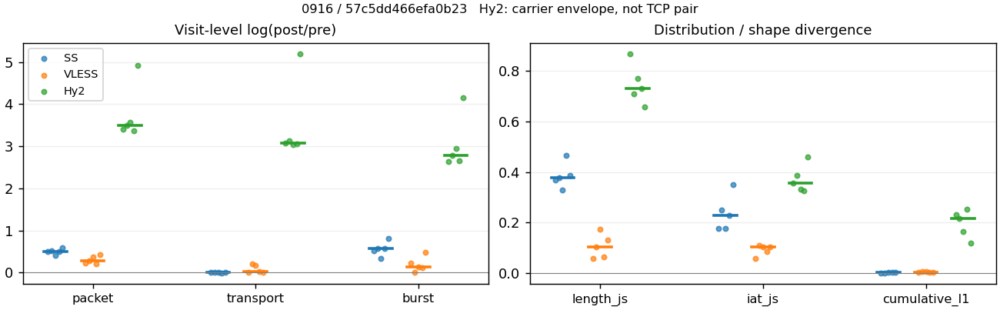
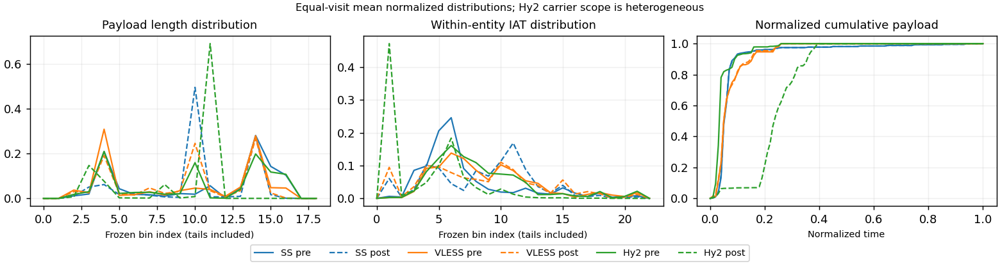

# 0916 · 条目 015 · github.com

目标：https://github.com/RakuLomis/TrafficTracer

活动标签：github.com::repository_view。选定访问 15 次。

[返回总索引](../../README.md) · [统计口径](../../methods.md)

## 覆盖与资格（每次访问均保留）

| 部署 | 重复 | 主请求路由 | 活动状态 | 代理比较 | DIRECT pre | 请求 proxy/direct/unresolved | 错误 |
| --- | --- | --- | --- | --- | --- | --- | --- |
| Hy2 | 1 | proxy | passed | 1 | 0 | 159/0/0 | [] |
| Hy2 | 2 | proxy | passed | 1 | 0 | 159/0/0 | [] |
| Hy2 | 3 | proxy | passed | 1 | 0 | 159/0/0 | [] |
| Hy2 | 4 | proxy | passed | 1 | 0 | 159/0/0 | [] |
| Hy2 | 5 | proxy | passed | 1 | 0 | 159/0/0 | [] |
| SS | 1 | proxy | passed | 1 | 0 | 159/0/0 | [] |
| SS | 2 | proxy | passed | 1 | 0 | 162/0/0 | [] |
| SS | 3 | proxy | passed | 1 | 0 | 162/0/0 | [] |
| SS | 4 | proxy | passed | 1 | 0 | 157/0/0 | [] |
| SS | 5 | proxy | passed | 1 | 0 | 159/0/0 | [] |
| VLESS | 1 | proxy | passed | 1 | 0 | 160/0/0 | [] |
| VLESS | 2 | proxy | passed | 1 | 0 | 160/0/0 | [] |
| VLESS | 3 | proxy | passed | 1 | 0 | 159/0/0 | [] |
| VLESS | 4 | proxy | passed | 1 | 0 | 159/0/0 | [] |
| VLESS | 5 | proxy | passed | 1 | 0 | 160/0/0 | [] |

主请求非 proxy 的统计仅解释为已索引的辅助代理连接或 DIRECT 观测，不代表目标业务经代理传输。播放确认与配对资格是两道不同的门。

图中散点为单次访问，短线为重复中位数；Hy2 是共享载体包络，不能与 TCP 配对作等范围因果对比。

形态图先逐访问归一化，再对访问等权平均；实线 pre，虚线 post。分箱序号及边界见 methods，不将分箱索引误解为长度或时间。

## 每次访问的关键观测

### SS

范围：`exclusive_page`。每格 pre → post；空值为不可观测/不适用。

| 重复 | 包数 | 载荷字节 | burst | TCP FR | IAT中位µs | length JS | IAT JS |
| --- | --- | --- | --- | --- | --- | --- | --- |
| 1 | 1338 → 2219 | 2.2524e+06 → 2.2558e+06 | 850 → 1434 | 78 → 82 | 28.575 → 141.93 | 0.36714 | 0.17582 |
| 2 | 1385 → 2318 | 2.2643e+06 → 2.2828e+06 | 947 → 1682 | 84 → 86 | 28.004 → 504.68 | 0.37891 | 0.24872 |
| 3 | 1442 → 2184 | 2.2712e+06 → 2.2795e+06 | 1017 → 1411 | 98 → 98 | 28.759 → 173.81 | 0.32981 | 0.17626 |
| 4 | 1467 → 2414 | 1.9532e+06 → 1.9477e+06 | 1037 → 1856 | 70 → 70 | 28.841 → 879.83 | 0.46637 | 0.22702 |
| 5 | 1399 → 2535 | 2.2518e+06 → 2.2577e+06 | 996 → 2232 | 81 → 89 | 29.563 → 1036.1 | 0.38651 | 0.34857 |

完整标量统计：中位数 [min,max]；Δ 为重复内逐访问变换的中位数，MAD 未缩放。n 为可用变换数；DIRECT-only 的 nΔ=0 不代表 pre 不可用。

| scope | 特征 | pre | post | Δ | IQRΔ | MADΔ | nΔ |
| --- | --- | --- | --- | --- | --- | --- | --- |
| exclusive_page | active_span_sum_s_1000ms | 16.511 [11.865, 17.297] | 16.908 [14.186, 20.413] | 0.074239 | 0.17585 | 0.086929 | 5 |
| exclusive_page | active_span_sum_s_100ms | 3.6381 [3.3184, 5.1652] | 7.1328 [5.4099, 7.9025] | 0.5346 | 0.15307 | 0.10722 | 5 |
| exclusive_page | active_span_sum_s_500ms | 12.736 [10.733, 14.018] | 14.839 [12.566, 16.995] | 0.173 | 0.034906 | 0.019609 | 5 |
| exclusive_page | burst_bytes_iqr | 2896 [2872, 2896] | 2856 [1428, 2856] | -0.013908 | 0.68483 | 0.0083218 | 5 |
| exclusive_page | burst_bytes_mad | 35 [31, 56] | 34 [34, 40] | 0.092373 | 0.50681 | 0.041158 | 5 |
| exclusive_page | burst_bytes_max | 29954 [26232, 43546] | 21420 [11648, 28560] | -0.42181 | 0.4966 | 0.28369 | 5 |
| exclusive_page | burst_bytes_mean | 2260.9 [1883.5, 2649.9] | 1357.2 [1011.5, 1615.5] | -0.56631 | 0.063444 | 0.044845 | 5 |
| exclusive_page | burst_bytes_median | 35 [31, 56] | 34 [34, 40] | 0.092373 | 0.50681 | 0.041158 | 5 |
| exclusive_page | burst_bytes_min | 0 [0, 0] | 0 [0, 0] | — | — | — | 0 |
| exclusive_page | burst_bytes_p95 | 11512 [8440, 17376] | 5712 [2856, 7140] | -0.88938 | 0.34176 | 0.19418 | 5 |
| exclusive_page | burst_bytes_q25 | 0 [0, 0] | 0 [0, 0] | — | — | — | 0 |
| exclusive_page | burst_bytes_q75 | 2896 [2872, 2896] | 2856 [1428, 2856] | -0.013908 | 0.68483 | 0.0083218 | 5 |
| exclusive_page | burst_bytes_std | 4400.3 [3824, 5309.9] | 1966.8 [1238.2, 2757.9] | -0.77138 | 0.17553 | 0.10876 | 5 |
| exclusive_page | burst_count | 996 [850, 1037] | 1682 [1411, 2232] | 0.57444 | 0.059105 | 0.051453 | 5 |
| exclusive_page | burst_duration_ms_iqr | 0 [0, 0.032266] | 0 [0, 0.01662] | -4.7578 | — | — | 1 |
| exclusive_page | burst_duration_ms_mad | 0 [0, 0] | 0 [0, 0] | — | — | — | 0 |
| exclusive_page | burst_duration_ms_max | 15000 [15000, 15001] | 19753 [2254.8, 46217] | 0.27518 | 0.68177 | 0.42176 | 5 |
| exclusive_page | burst_duration_ms_mean | 45.753 [41.353, 79.32] | 39.198 [11.86, 129.39] | -0.20377 | 0.44493 | 0.31844 | 5 |
| exclusive_page | burst_duration_ms_median | 0 [0, 0] | 0 [0, 0] | — | — | — | 0 |
| exclusive_page | burst_duration_ms_min | 0 [0, 0] | 0 [0, 0] | — | — | — | 0 |
| exclusive_page | burst_duration_ms_p95 | 32.25 [17.428, 88.787] | 1.1447 [0.42104, 4.0465] | -3.7106 | 1.2696 | 0.64051 | 5 |
| exclusive_page | burst_duration_ms_q25 | 0 [0, 0] | 0 [0, 0] | — | — | — | 0 |
| exclusive_page | burst_duration_ms_q75 | 0 [0, 0.032266] | 0 [0, 0.01662] | -4.7578 | — | — | 1 |
| exclusive_page | burst_duration_ms_std | 532.88 [521.48, 724.94] | 605.93 [114.55, 1754.4] | 0.12848 | 0.28517 | 0.18572 | 5 |
| exclusive_page | burst_packets_iqr | 0 [0, 1] | 0 [0, 1] | 0 | — | — | 1 |
| exclusive_page | burst_packets_mad | 0 [0, 0] | 0 [0, 0] | — | — | — | 0 |
| exclusive_page | burst_packets_max | 11 [9, 15] | 13 [11, 20] | 0.20067 | 0.12063 | 0.087011 | 5 |
| exclusive_page | burst_packets_mean | 1.4179 [1.4046, 1.5741] | 1.3781 [1.1358, 1.5478] | -0.059435 | 0.06692 | 0.042329 | 5 |
| exclusive_page | burst_packets_median | 1 [1, 1] | 1 [1, 1] | 0 | 0 | 0 | 5 |
| exclusive_page | burst_packets_min | 1 [1, 1] | 1 [1, 1] | 0 | 0 | 0 | 5 |
| exclusive_page | burst_packets_p95 | 3 [3, 3.55] | 3 [2, 4] | 0 | 0.52481 | 0.28768 | 5 |
| exclusive_page | burst_packets_q25 | 1 [1, 1] | 1 [1, 1] | 0 | 0 | 0 | 5 |
| exclusive_page | burst_packets_q75 | 1 [1, 2] | 1 [1, 2] | 0 | 0 | 0 | 5 |
| exclusive_page | burst_packets_std | 1.0487 [0.95687, 1.3822] | 1.0713 [0.55514, 1.2405] | -0.079587 | 0.28912 | 0.18713 | 5 |
| exclusive_page | connection_span_concurrency_max | 6 [4, 6] | 6 [4, 6] | 0 | 0 | 0 | 5 |
| exclusive_page | cumulative_l1 | — | — | 0.0011003 | 0.0010157 | 0.0003905 | 5 |
| exclusive_page | cumulative_max | — | — | 0.016822 | 0.012721 | 0.0062254 | 5 |
| exclusive_page | direction_entropy | 0.83118 [0.79037, 0.83566] | 0.56665 [0.50427, 0.77628] | -0.26454 | 0.038729 | 0.033839 | 5 |
| exclusive_page | down_burst_count | 494 [421, 515] | 837 [701, 1112] | 0.57922 | 0.057697 | 0.052373 | 5 |
| exclusive_page | down_ip_bytes | 2.2021e+06 [1.6693e+06, 2.2118e+06] | 2.2214e+06 [1.6774e+06, 2.2258e+06] | 0.0067661 | 0.00099643 | 0.00050761 | 5 |
| exclusive_page | down_packets | 798 [784, 804] | 1280 [1193, 1320] | 0.47512 | 0.022715 | 0.015085 | 5 |
| exclusive_page | down_transport_bytes | 2.1602e+06 [1.6277e+06, 2.171e+06] | 2.1525e+06 [1.6152e+06, 2.1554e+06] | -0.0050533 | 0.0022358 | 0.0021545 | 5 |
| exclusive_page | duration_s | 65.979 [65.459, 68.255] | 65.952 [65.459, 68.254] | -1.4719e-05 | 2.6442e-05 | 7.2375e-06 | 5 |
| exclusive_page | entity_count | 8 [8, 9] | 8 [8, 9] | 0 | 0 | 0 | 5 |
| exclusive_page | fr_runs | 81 [70, 98] | 86 [70, 98] | 0.02353 | 0.05001 | 0.02353 | 5 |
| exclusive_page | fr_runs_per_packet | 0.10163 [0.081395, 0.12039] | 0.065549 [0.053435, 0.073962] | -0.034156 | 0.0055493 | 0.0039992 | 5 |
| exclusive_page | fr_switches | 73 [62, 89] | 77 [62, 89] | 0.026317 | 0.05557 | 0.026317 | 5 |
| exclusive_page | fr_switches_per_possible_transition | 0.092522 [0.07277, 0.11056] | 0.059094 [0.047619, 0.067629] | -0.030737 | 0.005098 | 0.0038013 | 5 |
| exclusive_page | full_retransmission_fraction | 0.0050542 [0.0044843, 0.0078628] | 0.0069025 [0.0041425, 0.015385] | 0.0018484 | 0.0015625 | 0.001539 | 5 |
| exclusive_page | full_retransmission_packets | 7 [6, 11] | 16 [10, 39] | 0.8473 | 0.11778 | 0.097164 | 5 |
| exclusive_page | iat_count | 1391 [1330, 1459] | 2309 [2175, 2527] | 0.50827 | 0.017419 | 0.0093678 | 5 |
| exclusive_page | iat_js | — | — | 0.22702 | 0.072467 | 0.050761 | 5 |
| exclusive_page | iat_ks | — | — | 0.37202 | 0.069938 | 0.042653 | 5 |
| exclusive_page | iat_median_us | 28.759 [28.004, 29.563] | 504.68 [141.93, 1036.1] | 2.8916 | 1.6189 | 0.66512 | 5 |
| exclusive_page | iat_us_iqr | 110.87 [76.091, 116.05] | 1032 [874.51, 3889.3] | 2.186 | 1.0783 | 0.064464 | 5 |
| exclusive_page | iat_us_mad | 20.794 [20.201, 22.907] | 496.21 [140.03, 949.73] | 3.2013 | 1.7323 | 0.61101 | 5 |
| exclusive_page | iat_us_max | 1.5001e+07 [1.5001e+07, 1.5001e+07] | 1.5333e+07 [1.5315e+07, 1.5497e+07] | 0.021915 | 0.00051036 | 0.00047632 | 5 |
| exclusive_page | iat_us_mean | 1.2777e+05 [58799, 2.2204e+05] | 75983 [35767, 1.4668e+05] | -0.50025 | 0.022627 | 0.019473 | 5 |
| exclusive_page | iat_us_median | 28.759 [28.004, 29.563] | 504.68 [141.93, 1036.1] | 2.8916 | 1.6189 | 0.66512 | 5 |
| exclusive_page | iat_us_min | 0.06 [0.01, 0.139] | 0.033 [0.031, 0.036] | -0.51083 | 1.0814 | 0.7376 | 5 |
| exclusive_page | iat_us_p95 | 71897 [41598, 89011] | 29483 [27222, 37858] | -0.80709 | 0.096261 | 0.048441 | 5 |
| exclusive_page | iat_us_q25 | 12.639 [12.467, 13.041] | 13.492 [10.718, 140.51] | 0.065291 | 0.25411 | 0.15294 | 5 |
| exclusive_page | iat_us_q75 | 123.52 [88.632, 128.51] | 1046.7 [885.23, 3902.8] | 2.0974 | 1.0896 | 0.080935 | 5 |
| exclusive_page | iat_us_std | 1.2071e+06 [7.5214e+05, 1.6845e+06] | 9.4692e+05 [5.9445e+05, 1.3968e+06] | -0.24278 | 0.0137 | 0.0074836 | 5 |
| exclusive_page | iat_wasserstein_log1p_us | — | — | 1.4745 | 0.5319 | 0.36769 | 5 |
| exclusive_page | idle_gap_count_1000ms | 20 [13, 26] | 19 [11, 24] | -0.051293 | 0.1226 | 0.093853 | 5 |
| exclusive_page | idle_gap_count_100ms | 56 [43, 67] | 59 [44, 64] | 0.02299 | 0.046839 | 0.041549 | 5 |
| exclusive_page | idle_gap_count_500ms | 27 [15, 31] | 23 [13, 27] | -0.13815 | 0.068993 | 0.022192 | 5 |
| exclusive_page | idle_gap_sum_s_1000ms | 159.3 [66.338, 301.06] | 158.89 [64.895, 302.12] | -0.0063618 | 0.019391 | 0.0098895 | 5 |
| exclusive_page | idle_gap_sum_s_100ms | 172.22 [74.885, 314.54] | 169.31 [73.672, 311.9] | -0.016327 | 0.0046611 | 0.0039696 | 5 |
| exclusive_page | idle_gap_sum_s_500ms | 163.9 [67.47, 304.48] | 161.28 [66.515, 304.19] | -0.014249 | 0.0020869 | 0.0018428 | 5 |
| exclusive_page | ip_bytes | 2.3248e+06 [2.0297e+06, 2.3465e+06] | 2.4069e+06 [2.0889e+06, 2.4229e+06] | 0.028725 | 0.0087519 | 0.0032928 | 5 |
| exclusive_page | length_iqr | 3848.2 [2648, 3994.8] | 1428 [0, 1428] | -1.0034 | 0.06154 | 0.018681 | 4 |
| exclusive_page | length_js | — | — | 0.37891 | 0.019379 | 0.011771 | 5 |
| exclusive_page | length_ks | — | — | 0.46474 | 0.026695 | 0.01797 | 5 |
| exclusive_page | length_mad | 1783 [1232, 1956.5] | 524 [0, 1054.5] | -1.1954 | 1.2626 | 0.34427 | 4 |
| exclusive_page | length_max | 8948 [8948, 8948] | 5712 [4248, 9996] | -0.44886 | 0.40547 | 0.29612 | 5 |
| exclusive_page | length_mean | 2790.2 [2271.1, 2825.4] | 1711.7 [1486.8, 1739.9] | -0.47845 | 0.0094161 | 0.00511 | 5 |
| exclusive_page | length_median | 2664 [2160.5, 2896] | 1428 [1428, 1428] | -0.62355 | 0.10049 | 0.083502 | 5 |
| exclusive_page | length_min | 31 [8, 31] | 20 [3, 20] | -0.43825 | 1.4599 | 0.94908 | 5 |
| exclusive_page | length_p95 | 8192 [5792, 8896] | 2856 [2856, 2856] | -1.0537 | 0 | 0 | 5 |
| exclusive_page | length_q25 | 153.5 [101.25, 248] | 1428 [1416, 1428] | 2.2303 | 0.87901 | 0.41611 | 5 |
| exclusive_page | length_q75 | 4096 [2896, 4096] | 2856 [1428, 2856] | -0.36059 | 0 | 0 | 5 |
| exclusive_page | length_std | 2711.2 [1976.7, 2773] | 1032.5 [822.62, 1196.8] | -0.87671 | 0.14458 | 0.089914 | 5 |
| exclusive_page | length_wasserstein_bytes | — | — | 1401.8 | 106.44 | 74.275 | 5 |
| exclusive_page | nonempty_entity_count | 8 [8, 9] | 8 [8, 9] | 0 | 0 | 0 | 5 |
| exclusive_page | nonempty_packets | 814 [797, 860] | 1319 [1310, 1351] | 0.48227 | 0.0072356 | 0.0049337 | 5 |
| exclusive_page | offload_suspect_fraction | 0.3431 [0.32274, 0.35426] | 0.19558 [0.11019, 0.20708] | -0.15868 | 0.04333 | 0.033263 | 5 |
| exclusive_page | packet_count | 1399 [1338, 1467] | 2318 [2184, 2535] | 0.50588 | 0.016939 | 0.0091239 | 5 |
| exclusive_page | rtt_median_ms | 0.040411 [0.031396, 0.058883] | 27.746 [27.232, 38.367] | 6.749 | 0.2945 | 0.16788 | 5 |
| exclusive_page | rtt_sample_count | 570 [479, 571] | 335 [284, 473] | -0.47352 | 0.10902 | 0.10695 | 5 |
| exclusive_page | tcp_ack_count | 1391 [1330, 1459] | 2309 [2175, 2523] | 0.50827 | 0.018251 | 0.0093678 | 5 |
| exclusive_page | tcp_fin_count | 16 [15, 18] | 20 [15, 23] | 0.20067 | 0.16908 | 0.1466 | 5 |
| exclusive_page | tcp_packet_count | 1399 [1338, 1467] | 2318 [2184, 2535] | 0.50588 | 0.016939 | 0.0091239 | 5 |
| exclusive_page | tcp_rst_count | 0 [0, 0] | 0 [0, 0] | — | — | — | 0 |
| exclusive_page | tcp_syn_count | 16 [16, 18] | 18 [16, 21] | 0 | 0.11778 | 0 | 5 |
| exclusive_page | tcp_window_raw_median | 65535 [65471, 65535] | 168 [155, 168] | -5.9664 | 0.036368 | 0.00047314 | 5 |
| exclusive_page | transition_entropy | 0.4187 [0.34839, 0.46894] | 0.27694 [0.25738, 0.30534] | -0.13985 | 0.011002 | 0.0083931 | 5 |
| exclusive_page | transition_n_mm | 555 [545, 621] | 1096 [975, 1160] | 0.67863 | 0.018523 | 0.010876 | 5 |
| exclusive_page | transition_n_mp | 33 [27, 40] | 34 [27, 40] | 0.029853 | 0.060625 | 0.029853 | 5 |
| exclusive_page | transition_n_pm | 40 [35, 49] | 43 [35, 49] | 0.02353 | 0.051293 | 0.02353 | 5 |
| exclusive_page | transition_n_pp | 169 [165, 171] | 131 [102, 265] | -0.25886 | 0.17781 | 0.15574 | 5 |
| exclusive_page | transition_p_mm | 0.94388 [0.9322, 0.95833] | 0.96986 [0.96479, 0.97305] | 0.025334 | 0.0032563 | 0.0026095 | 5 |
| exclusive_page | transition_p_mp | 0.056122 [0.041667, 0.067797] | 0.030142 [0.026946, 0.035211] | -0.025334 | 0.0032563 | 0.0026095 | 5 |
| exclusive_page | transition_p_pm | 0.18957 [0.17157, 0.22791] | 0.26846 [0.11667, 0.30137] | 0.048531 | 0.036949 | 0.032733 | 5 |
| exclusive_page | transition_p_pp | 0.81043 [0.77209, 0.82843] | 0.73154 [0.69863, 0.88333] | -0.048531 | 0.036949 | 0.032733 | 5 |
| exclusive_page | transport_bytes | 2.2524e+06 [1.9532e+06, 2.2712e+06] | 2.2577e+06 [1.9477e+06, 2.2828e+06] | 0.0025954 | 0.0021257 | 0.0010777 | 5 |
| exclusive_page | up_burst_count | 502 [429, 522] | 845 [710, 1120] | 0.56973 | 0.060483 | 0.050544 | 5 |
| exclusive_page | up_byte_fraction | 0.048895 [0.035896, 0.16661] | 0.055858 [0.045301, 0.1707] | 0.0063107 | 0.0018682 | 0.0018483 | 5 |
| exclusive_page | up_ip_bytes | 1.4292e+05 [1.1301e+05, 3.6041e+05] | 1.9345e+05 [1.657e+05, 4.1148e+05] | 0.34226 | 0.07477 | 0.068363 | 5 |
| exclusive_page | up_packets | 615 [535, 669] | 1046 [891, 1255] | 0.576 | 0.082625 | 0.056985 | 5 |
| exclusive_page | up_transport_bytes | 1.1105e+05 [80831, 3.2543e+05] | 1.2751e+05 [1.0228e+05, 3.3247e+05] | 0.1493 | 0.029956 | 0.02129 | 5 |
| exclusive_page | zero_iat_count | 0 [0, 0] | 0 [0, 0] | — | — | — | 0 |
| exclusive_page | zero_iat_fraction | 0 [0, 0] | 0 [0, 0] | 0 | 0 | 0 | 5 |

### VLESS

范围：`exclusive_page`。每格 pre → post；空值为不可观测/不适用。

| 重复 | 包数 | 载荷字节 | burst | TCP FR | IAT中位µs | length JS | IAT JS |
| --- | --- | --- | --- | --- | --- | --- | --- |
| 1 | 1794 → 2248 | 2.1846e+06 → 2.2192e+06 | 1192 → 1506 | 84 → 102 | 114.28 → 73.626 | 0.058051 | 0.056754 |
| 2 | 384 → 506 | 2.2713e+05 → 2.7718e+05 | 278 → 278 | 43 → 56 | 139.37 → 480.01 | 0.10275 | 0.10914 |
| 3 | 338 → 490 | 2.2817e+05 → 2.6838e+05 | 233 → 267 | 39 → 50 | 145.62 → 397.74 | 0.17182 | 0.10397 |
| 4 | 2003 → 2468 | 2.2285e+06 → 2.2992e+06 | 1413 → 1579 | 94 → 116 | 147.09 → 67.708 | 0.061942 | 0.085943 |
| 5 | 1398 → 2148 | 2.2046e+06 → 2.2258e+06 | 957 → 1555 | 84 → 100 | 67.633 → 127.86 | 0.13153 | 0.1031 |

完整标量统计：中位数 [min,max]；Δ 为重复内逐访问变换的中位数，MAD 未缩放。n 为可用变换数；DIRECT-only 的 nΔ=0 不代表 pre 不可用。

| scope | 特征 | pre | post | Δ | IQRΔ | MADΔ | nΔ |
| --- | --- | --- | --- | --- | --- | --- | --- |
| exclusive_page | active_span_sum_s_1000ms | 11.253 [8.965, 14.287] | 11.288 [9.2901, 15.637] | 0.035622 | 0.03948 | 0.032526 | 5 |
| exclusive_page | active_span_sum_s_100ms | 1.9728 [0.78376, 2.3831] | 4.6996 [3.0993, 6.0751] | 1.0154 | 0.2733 | 0.19372 | 5 |
| exclusive_page | active_span_sum_s_500ms | 6.0614 [4.6868, 8.0893] | 10.146 [9.2901, 13.878] | 0.51731 | 0.10264 | 0.02712 | 5 |
| exclusive_page | burst_bytes_iqr | 2824 [1163, 2896] | 2824 [1566.5, 2824] | 0 | 0.25889 | 0.025176 | 5 |
| exclusive_page | burst_bytes_mad | 24 [0, 55] | 72 [31, 72] | 0.6131 | 0.41464 | 0.34377 | 3 |
| exclusive_page | burst_bytes_max | 30295 [17458, 34272] | 14120 [12801, 25416] | -0.4192 | 0.36896 | 0.24359 | 5 |
| exclusive_page | burst_bytes_mean | 1577.1 [817.01, 2303.6] | 1431.4 [997.04, 1473.6] | -0.07982 | 0.24418 | 0.13829 | 5 |
| exclusive_page | burst_bytes_median | 24 [0, 55] | 72 [31, 72] | 0.6131 | 0.41464 | 0.34377 | 3 |
| exclusive_page | burst_bytes_min | 0 [0, 0] | 0 [0, 0] | — | — | — | 0 |
| exclusive_page | burst_bytes_p95 | 7196.8 [2896, 15802] | 4344 [2896, 5759.6] | -0.22277 | 0.37377 | 0.19727 | 5 |
| exclusive_page | burst_bytes_q25 | 0 [0, 0] | 0 [0, 0] | — | — | — | 0 |
| exclusive_page | burst_bytes_q75 | 2824 [1163, 2896] | 2824 [1566.5, 2824] | 0 | 0.25889 | 0.025176 | 5 |
| exclusive_page | burst_bytes_std | 3185.8 [1951.7, 4948.1] | 1954.6 [1712.5, 2172.8] | -0.4885 | 0.26291 | 0.21785 | 5 |
| exclusive_page | burst_count | 957 [233, 1413] | 1506 [267, 1579] | 0.13621 | 0.12275 | 0.097614 | 5 |
| exclusive_page | burst_duration_ms_iqr | 0.12222 [0.032835, 3.1226] | 0.008261 [0, 3.2028] | -1.1973 | 2.0983 | 1.342 | 4 |
| exclusive_page | burst_duration_ms_mad | 0 [0, 0] | 0 [0, 0] | — | — | — | 0 |
| exclusive_page | burst_duration_ms_max | 15001 [15000, 15001] | 15355 [15019, 15436] | 0.023357 | 0.0046849 | 0.0044284 | 5 |
| exclusive_page | burst_duration_ms_mean | 41.323 [24.432, 159.83] | 79.896 [27.878, 277.7] | 0.38392 | 0.3951 | 0.25199 | 5 |
| exclusive_page | burst_duration_ms_median | 0 [0, 0] | 0 [0, 0] | — | — | — | 0 |
| exclusive_page | burst_duration_ms_min | 0 [0, 0] | 0 [0, 0] | — | — | — | 0 |
| exclusive_page | burst_duration_ms_p95 | 7.5537 [7.2057, 334.97] | 9.5081 [1.5133, 299.41] | -0.14013 | 0.49171 | 0.41651 | 5 |
| exclusive_page | burst_duration_ms_q25 | 0 [0, 0] | 0 [0, 0] | — | — | — | 0 |
| exclusive_page | burst_duration_ms_q75 | 0.12222 [0.032835, 3.1226] | 0.008261 [0, 3.2028] | -1.1973 | 2.0983 | 1.342 | 4 |
| exclusive_page | burst_duration_ms_std | 544.63 [451.09, 1091.3] | 1013 [550.73, 1827.4] | 0.46318 | 0.19636 | 0.14181 | 5 |
| exclusive_page | burst_packets_iqr | 1 [1, 1] | 1 [0, 1] | 0 | 0 | 0 | 4 |
| exclusive_page | burst_packets_mad | 0 [0, 0] | 0 [0, 0] | — | — | — | 0 |
| exclusive_page | burst_packets_max | 11 [4, 15] | 11 [11, 12] | 0.087011 | 1.0986 | 0.39717 | 5 |
| exclusive_page | burst_packets_mean | 1.4506 [1.3813, 1.505] | 1.563 [1.3814, 1.8352] | 0.097685 | 0.24338 | 0.13746 | 5 |
| exclusive_page | burst_packets_median | 1 [1, 1] | 1 [1, 1] | 0 | 0 | 0 | 5 |
| exclusive_page | burst_packets_min | 1 [1, 1] | 1 [1, 1] | 0 | 0 | 0 | 5 |
| exclusive_page | burst_packets_p95 | 3 [2, 3] | 3 [3, 5] | 0 | 0.28768 | 0 | 5 |
| exclusive_page | burst_packets_q25 | 1 [1, 1] | 1 [1, 1] | 0 | 0 | 0 | 5 |
| exclusive_page | burst_packets_q75 | 2 [2, 2] | 2 [1, 2] | 0 | 0 | 0 | 5 |
| exclusive_page | burst_packets_std | 0.88777 [0.5802, 0.98221] | 1.0826 [1.0291, 1.5208] | 0.19837 | 0.71592 | 0.13342 | 5 |
| exclusive_page | connection_span_concurrency_max | 4 [3, 6] | 4 [3, 6] | 0 | 0 | 0 | 5 |
| exclusive_page | cumulative_l1 | — | — | 0.0021013 | 0.0033887 | 0.0010363 | 5 |
| exclusive_page | cumulative_max | — | — | 0.043501 | 0.026922 | 0.022329 | 5 |
| exclusive_page | direction_entropy | 0.77216 [0.64271, 0.84459] | 0.56249 [0.48669, 0.94478] | -0.15602 | 0.25731 | 0.053644 | 5 |
| exclusive_page | down_burst_count | 475 [114, 702] | 750 [131, 785] | 0.139 | 0.12313 | 0.09588 | 5 |
| exclusive_page | down_ip_bytes | 2.1313e+06 [1.5915e+05, 2.1909e+06] | 2.1578e+06 [1.9383e+05, 2.2578e+06] | 0.030097 | 0.18137 | 0.017775 | 5 |
| exclusive_page | down_packets | 813 [188, 1183] | 1152 [254, 1414] | 0.23563 | 0.12252 | 0.065267 | 5 |
| exclusive_page | down_transport_bytes | 2.089e+06 [1.4933e+05, 2.1293e+06] | 2.0978e+06 [1.8059e+05, 2.1842e+06] | 0.02547 | 0.17853 | 0.021267 | 5 |
| exclusive_page | duration_s | 66.321 [64.794, 66.668] | 66.284 [64.767, 66.65] | -0.00041141 | 0.0002845 | 0.00014713 | 5 |
| exclusive_page | entity_count | 6 [5, 9] | 6 [5, 9] | 0 | 0 | 0 | 5 |
| exclusive_page | fr_runs | 84 [39, 94] | 100 [50, 116] | 0.2103 | 0.054305 | 0.035942 | 5 |
| exclusive_page | fr_runs_per_packet | 0.10182 [0.075067, 0.23077] | 0.085616 [0.076981, 0.21875] | -0.011197 | 0.018116 | 0.013111 | 5 |
| exclusive_page | fr_switches | 77 [34, 85] | 93 [45, 107] | 0.23018 | 0.072663 | 0.041384 | 5 |
| exclusive_page | fr_switches_per_possible_transition | 0.094132 [0.070081, 0.20732] | 0.080103 [0.072782, 0.2] | -0.0044199 | 0.01673 | 0.0084322 | 5 |
| exclusive_page | full_retransmission_fraction | 0.0014978 [0, 0.0064378] | 0 [0, 0] | -0.0014978 | 0.0039019 | 0.0014978 | 5 |
| exclusive_page | full_retransmission_packets | 3 [0, 9] | 0 [0, 0] | — | — | — | 0 |
| exclusive_page | iat_count | 1391 [333, 1994] | 2141 [485, 2459] | 0.27971 | 0.14974 | 0.070102 | 5 |
| exclusive_page | iat_js | — | — | 0.1031 | 0.018029 | 0.0060383 | 5 |
| exclusive_page | iat_ks | — | — | 0.14268 | 0.038509 | 0.011391 | 5 |
| exclusive_page | iat_median_us | 139.37 [67.633, 147.09] | 127.86 [67.708, 480.01] | 0.63687 | 1.4445 | 0.59977 | 5 |
| exclusive_page | iat_us_iqr | 902.54 [847.47, 4782.6] | 1025.3 [855.71, 9747.3] | 0.1905 | 0.65621 | 0.24379 | 5 |
| exclusive_page | iat_us_mad | 133.51 [59.56, 140.1] | 127.07 [67.656, 479.78] | 0.75773 | 1.4104 | 0.52143 | 5 |
| exclusive_page | iat_us_max | 1.5001e+07 [1.5001e+07, 1.5001e+07] | 1.5382e+07 [1.5322e+07, 1.5436e+07] | 0.025068 | 0.0055891 | 0.0035274 | 5 |
| exclusive_page | iat_us_mean | 1.5651e+05 [59948, 5.1615e+05] | 1.2684e+05 [47717, 3.8989e+05] | -0.28053 | 0.14857 | 0.070342 | 5 |
| exclusive_page | iat_us_median | 139.37 [67.633, 147.09] | 127.86 [67.708, 480.01] | 0.63687 | 1.4445 | 0.59977 | 5 |
| exclusive_page | iat_us_min | 0.254 [0.069, 3.167] | 0.033 [0.031, 0.037] | -1.9382 | 1.0329 | 0.86772 | 5 |
| exclusive_page | iat_us_p95 | 40207 [8347.4, 6.7311e+05] | 43482 [16855, 2.4018e+05] | 0.078298 | 1.7173 | 1.0929 | 5 |
| exclusive_page | iat_us_q25 | 26.144 [20.298, 33.859] | 10.895 [8.821, 16.804] | -0.83454 | 0.040934 | 0.039784 | 5 |
| exclusive_page | iat_us_q75 | 936.4 [867.77, 4808.7] | 1034.1 [870.41, 9764.1] | 0.1754 | 0.67717 | 0.24848 | 5 |
| exclusive_page | iat_us_std | 1.427e+06 [8.3928e+05, 2.54e+06] | 1.3108e+06 [7.5068e+05, 2.2293e+06] | -0.13047 | 0.052932 | 0.034025 | 5 |
| exclusive_page | iat_wasserstein_log1p_us | — | — | 0.72671 | 0.13396 | 0.083603 | 5 |
| exclusive_page | idle_gap_count_1000ms | 16 [10, 27] | 16 [10, 24] | -0.060625 | 0.074108 | 0.057158 | 5 |
| exclusive_page | idle_gap_count_100ms | 42 [37, 59] | 48 [41, 65] | 0.10536 | 0.02096 | 0.0085107 | 5 |
| exclusive_page | idle_gap_count_500ms | 22 [18, 36] | 16 [12, 24] | -0.40547 | 0.087011 | 0.025318 | 5 |
| exclusive_page | idle_gap_sum_s_1000ms | 184.53 [95.933, 298.77] | 184.8 [95.693, 298.02] | -0.0025045 | 0.00032056 | 0.00028925 | 5 |
| exclusive_page | idle_gap_sum_s_100ms | 194.01 [104.95, 309.69] | 191.29 [102.28, 305.82] | -0.014145 | 0.0025531 | 0.0013428 | 5 |
| exclusive_page | idle_gap_sum_s_500ms | 189.04 [101.28, 304.59] | 184.8 [97.076, 298.02] | -0.022701 | 0.0088956 | 0.00088137 | 5 |
| exclusive_page | ip_bytes | 2.2774e+06 [2.4573e+05, 2.3326e+06] | 2.3371e+06 [2.9426e+05, 2.4289e+06] | 0.040435 | 0.14991 | 0.014786 | 5 |
| exclusive_page | length_iqr | 2735 [1781, 2747] | 1412 [1340, 2732] | -0.28451 | 0.54099 | 0.27316 | 5 |
| exclusive_page | length_js | — | — | 0.10275 | 0.069585 | 0.04081 | 5 |
| exclusive_page | length_ks | — | — | 0.15911 | 0.05779 | 0.042237 | 5 |
| exclusive_page | length_mad | 1376 [483, 1678] | 1340 [849.5, 1376] | -0.018006 | 0.59114 | 0.20693 | 5 |
| exclusive_page | length_max | 8948 [8948, 8948] | 7240 [2824, 9884] | -0.21181 | 0.94147 | 0.3113 | 5 |
| exclusive_page | length_mean | 1886.9 [1214.6, 2672.2] | 1634.1 [1069.2, 1905.7] | -0.15326 | 0.089435 | 0.038323 | 5 |
| exclusive_page | length_median | 1448 [518, 2348] | 1412 [1200, 1448] | -0.024558 | 0.86528 | 0.484 | 5 |
| exclusive_page | length_min | 24 [16, 24] | 16 [8, 24] | 0 | 0.69315 | 0 | 5 |
| exclusive_page | length_p95 | 5864 [2824, 8920] | 2896 [2824, 2968] | -0.68094 | 0.79868 | 0.44402 | 5 |
| exclusive_page | length_q25 | 77 [72, 89] | 92 [72, 1412] | 0.17798 | 0.33833 | 0.17798 | 5 |
| exclusive_page | length_q75 | 2824 [1853, 2824] | 2824 [1412, 2824] | 0 | 0.2718 | 0 | 5 |
| exclusive_page | length_std | 1957.9 [1685.7, 2833.3] | 1325.5 [897.86, 1392.8] | -0.57327 | 0.25373 | 0.13683 | 5 |
| exclusive_page | length_wasserstein_bytes | — | — | 488.57 | 145.45 | 50.157 | 5 |
| exclusive_page | nonempty_entity_count | 6 [5, 9] | 6 [5, 9] | 0 | 0 | 0 | 5 |
| exclusive_page | nonempty_packets | 825 [169, 1181] | 1168 [251, 1407] | 0.31407 | 0.17257 | 0.081485 | 5 |
| exclusive_page | offload_suspect_fraction | 0.29106 [0.14583, 0.31903] | 0.2365 [0.085714, 0.26735] | -0.052409 | 0.034938 | 0.0053895 | 5 |
| exclusive_page | packet_count | 1398 [338, 2003] | 2148 [490, 2468] | 0.27589 | 0.14577 | 0.067132 | 5 |
| exclusive_page | rtt_median_ms | 0.10593 [0.065864, 0.13713] | 0.059604 [0.049793, 9.4058] | -0.27973 | 4.8949 | 0.55346 | 5 |
| exclusive_page | rtt_sample_count | 537 [129, 757] | 616 [198, 997] | 0.33358 | 0.063 | 0.058197 | 5 |
| exclusive_page | tcp_ack_count | 1380 [325, 1979] | 2141 [485, 2459] | 0.30653 | 0.16732 | 0.089362 | 5 |
| exclusive_page | tcp_fin_count | 12 [10, 15] | 12 [10, 18] | 0 | 0.18232 | 0 | 5 |
| exclusive_page | tcp_packet_count | 1398 [338, 2003] | 2148 [490, 2468] | 0.27589 | 0.14577 | 0.067132 | 5 |
| exclusive_page | tcp_rst_count | 11 [8, 15] | 0 [0, 0] | — | — | — | 0 |
| exclusive_page | tcp_syn_count | 12 [10, 18] | 12 [10, 18] | 0 | 0 | 0 | 5 |
| exclusive_page | tcp_window_raw_median | 65535 [65471, 65535] | 211 [131, 214] | -5.7385 | 0.48041 | 0.014118 | 5 |
| exclusive_page | transition_entropy | 0.41418 [0.32526, 0.66613] | 0.3414 [0.30944, 0.69298] | -0.012709 | 0.013002 | 0.0098843 | 5 |
| exclusive_page | transition_n_mm | 596 [104, 930] | 964 [135, 1191] | 0.24736 | 0.023083 | 0.01352 | 5 |
| exclusive_page | transition_n_mp | 35 [15, 38] | 43 [20, 49] | 0.25423 | 0.064539 | 0.033448 | 5 |
| exclusive_page | transition_n_pm | 42 [19, 47] | 50 [25, 58] | 0.2103 | 0.080281 | 0.035942 | 5 |
| exclusive_page | transition_n_pp | 141 [26, 157] | 89 [63, 104] | -0.33234 | 1.262 | 0.12778 | 5 |
| exclusive_page | transition_p_mm | 0.94453 [0.87395, 0.96129] | 0.9573 [0.86164, 0.96183] | -0.00025993 | 0.0035236 | 0.0027219 | 5 |
| exclusive_page | transition_p_mp | 0.055468 [0.03871, 0.12605] | 0.042701 [0.038168, 0.13836] | 0.00025993 | 0.0035236 | 0.0027219 | 5 |
| exclusive_page | transition_p_pm | 0.23039 [0.2246, 0.42857] | 0.32468 [0.27473, 0.36709] | 0.10008 | 0.25566 | 0.03662 | 5 |
| exclusive_page | transition_p_pp | 0.76961 [0.57143, 0.7754] | 0.67532 [0.63291, 0.72527] | -0.10008 | 0.25566 | 0.03662 | 5 |
| exclusive_page | transport_bytes | 2.1846e+06 [2.2713e+05, 2.2285e+06] | 2.2192e+06 [2.6838e+05, 2.2992e+06] | 0.031256 | 0.14656 | 0.021663 | 5 |
| exclusive_page | up_burst_count | 482 [119, 711] | 756 [136, 794] | 0.13353 | 0.12237 | 0.099248 | 5 |
| exclusive_page | up_byte_fraction | 0.052436 [0.042866, 0.34553] | 0.05753 [0.046903, 0.32711] | 0.0040374 | 0.02236 | 0.0014753 | 5 |
| exclusive_page | up_ip_bytes | 1.291e+05 [82545, 1.4605e+05] | 1.5408e+05 [97719, 1.8968e+05] | 0.17693 | 0.019177 | 0.010996 | 5 |
| exclusive_page | up_packets | 585 [150, 820] | 943 [236, 1054] | 0.32404 | 0.13218 | 0.072993 | 5 |
| exclusive_page | up_transport_bytes | 93645 [73413, 1.156e+05] | 1.0409e+05 [84803, 1.2805e+05] | 0.10752 | 0.038504 | 0.0052153 | 5 |
| exclusive_page | zero_iat_count | 0 [0, 0] | 0 [0, 0] | — | — | — | 0 |
| exclusive_page | zero_iat_fraction | 0 [0, 0] | 0 [0, 0] | 0 | 0 | 0 | 5 |

### Hy2

范围：`carrier_context_envelope`。每格 pre → post；空值为不可观测/不适用。

| 重复 | 包数 | 载荷字节 | burst | TCP FR | IAT中位µs | length JS | IAT JS |
| --- | --- | --- | --- | --- | --- | --- | --- |
| 1 | 1439 → 43412 | 2.2299e+06 → 4.7954e+07 | 976 → 13760 | — | 110.58 → 1.472 | 0.86753 | 0.35498 |
| 2 | 1448 → 47751 | 2.2267e+06 → 5.0568e+07 | 1088 → 17562 | — | 80.712 → 4.5455 | 0.70946 | 0.3853 |
| 3 | 1267 → 45384 | 2.2833e+06 → 4.8001e+07 | 866 → 16421 | — | 71.18 → 5.165 | 0.77143 | 0.33175 |
| 4 | 1504 → 43888 | 2.261e+06 → 4.794e+07 | 1046 → 14917 | — | 64.004 → 5.581 | 0.73168 | 0.32519 |
| 5 | 321 → 44386 | 2.6607e+05 → 4.7807e+07 | 233 → 14982 | — | 141.72 → 4.503 | 0.65764 | 0.45896 |

完整标量统计：中位数 [min,max]；Δ 为重复内逐访问变换的中位数，MAD 未缩放。n 为可用变换数；DIRECT-only 的 nΔ=0 不代表 pre 不可用。

| scope | 特征 | pre | post | Δ | IQRΔ | MADΔ | nΔ |
| --- | --- | --- | --- | --- | --- | --- | --- |
| carrier_context_envelope | active_span_sum_s_1000ms | 8.9413 [6.5159, 10.511] | 25.354 [14.236, 29.691] | 1.0802 | 0.33156 | 0.21156 | 5 |
| carrier_context_envelope | active_span_sum_s_100ms | 1.4727 [1.0906, 1.9456] | 7.9962 [7.6652, 10.526] | 1.8919 | 0.26163 | 0.10032 | 5 |
| carrier_context_envelope | active_span_sum_s_500ms | 8.2029 [6.0012, 9.1938] | 21.707 [13.385, 26.003] | 1.0025 | 0.15801 | 0.12861 | 5 |
| carrier_context_envelope | burst_bytes_iqr | 2727.5 [575, 2814.2] | 5100 [2786, 5726] | 0.73269 | 0.35487 | 0.28713 | 5 |
| carrier_context_envelope | burst_bytes_mad | 31 [0, 39] | 267 [251, 295.5] | 2.1305 | 0.1655 | 0.12415 | 3 |
| carrier_context_envelope | burst_bytes_max | 28305 [24129, 32325] | 1.7561e+05 [89175, 2.2654e+05] | 1.9009 | 0.71148 | 0.24783 | 5 |
| carrier_context_envelope | burst_bytes_mean | 2161.6 [1141.9, 2636.6] | 3191 [2879.4, 3485.1] | 0.39659 | 0.080835 | 0.05521 | 5 |
| carrier_context_envelope | burst_bytes_median | 31 [0, 39] | 300 [281, 328.5] | 2.2496 | 0.16016 | 0.11096 | 3 |
| carrier_context_envelope | burst_bytes_min | 0 [0, 0] | 22 [22, 22] | — | — | — | 0 |
| carrier_context_envelope | burst_bytes_p95 | 11189 [7107.2, 19228] | 11528 [9953.3, 12969] | 0.0048595 | 0.093045 | 0.068034 | 5 |
| carrier_context_envelope | burst_bytes_q25 | 0 [0, 0] | 64 [38, 96] | — | — | — | 0 |
| carrier_context_envelope | burst_bytes_q75 | 2727.5 [575, 2814.2] | 5168 [2882, 5764] | 0.74058 | 0.34657 | 0.28011 | 5 |
| carrier_context_envelope | burst_bytes_std | 4520.3 [3074.2, 5496.6] | 5507 [4369.1, 6113.2] | 0.063411 | 0.32914 | 0.09742 | 5 |
| carrier_context_envelope | burst_count | 976 [233, 1088] | 14982 [13760, 17562] | 2.7814 | 0.2849 | 0.13534 | 5 |
| carrier_context_envelope | burst_duration_ms_iqr | 0.035204 [0, 0.098505] | 0.025767 [0.022318, 0.030773] | -0.6312 | 0.90721 | 0.42552 | 4 |
| carrier_context_envelope | burst_duration_ms_mad | 0 [0, 0] | 4.6e-05 [4e-05, 8.9e-05] | — | — | — | 0 |
| carrier_context_envelope | burst_duration_ms_max | 15001 [15000, 15001] | 10228 [4178.3, 10250] | -0.38295 | 0.17691 | 0.0021024 | 5 |
| carrier_context_envelope | burst_duration_ms_mean | 41.567 [34.11, 157.07] | 1.9728 [0.94017, 2.5157] | -3.789 | 1.0453 | 0.34512 | 5 |
| carrier_context_envelope | burst_duration_ms_median | 0 [0, 0] | 4.6e-05 [4e-05, 8.9e-05] | — | — | — | 0 |
| carrier_context_envelope | burst_duration_ms_min | 0 [0, 0] | 0 [0, 0] | — | — | — | 0 |
| carrier_context_envelope | burst_duration_ms_p95 | 5.6765 [3.2222, 289.19] | 0.11456 [0.076569, 0.2181] | -3.8022 | 0.62318 | 0.49464 | 5 |
| carrier_context_envelope | burst_duration_ms_q25 | 0 [0, 0] | 0 [0, 0] | — | — | — | 0 |
| carrier_context_envelope | burst_duration_ms_q75 | 0.035204 [0, 0.098505] | 0.025767 [0.022318, 0.030773] | -0.6312 | 0.90721 | 0.42552 | 4 |
| carrier_context_envelope | burst_duration_ms_std | 557.72 [520.68, 1111.6] | 103.66 [42.576, 131.64] | -2.1335 | 0.65923 | 0.43912 | 5 |
| carrier_context_envelope | burst_packets_iqr | 1 [0, 1] | 3 [2, 3] | 1.0986 | 0 | 0 | 4 |
| carrier_context_envelope | burst_packets_mad | 0 [0, 0] | 1 [1, 1] | — | — | — | 0 |
| carrier_context_envelope | burst_packets_max | 10 [4, 16] | 126 [67, 172] | 2.6391 | 0.81199 | 0.60614 | 5 |
| carrier_context_envelope | burst_packets_mean | 1.4379 [1.3309, 1.4744] | 2.9421 [2.719, 3.1549] | 0.71598 | 0.046309 | 0.044744 | 5 |
| carrier_context_envelope | burst_packets_median | 1 [1, 1] | 2 [2, 2] | 0.69315 | 0 | 0 | 5 |
| carrier_context_envelope | burst_packets_min | 1 [1, 1] | 1 [1, 1] | 0 | 0 | 0 | 5 |
| carrier_context_envelope | burst_packets_p95 | 3 [3, 3] | 8 [8, 9] | 0.98083 | 0 | 0 | 5 |
| carrier_context_envelope | burst_packets_q25 | 1 [1, 1] | 1 [1, 1] | 0 | 0 | 0 | 5 |
| carrier_context_envelope | burst_packets_q75 | 2 [1, 2] | 4 [3, 4] | 0.69315 | 0 | 0 | 5 |
| carrier_context_envelope | burst_packets_std | 0.87154 [0.68948, 1.0628] | 3.7801 [2.8192, 4.2221] | 1.4025 | 0.23486 | 0.15579 | 5 |
| carrier_context_envelope | connection_span_concurrency_max | 6 [5, 6] | 1 [1, 1] | -1.7918 | 0 | 0 | 5 |
| carrier_context_envelope | cumulative_l1 | — | — | 0.21692 | 0.066638 | 0.034241 | 5 |
| carrier_context_envelope | cumulative_max | — | — | 0.91877 | 0.0073315 | 0.0056492 | 5 |
| carrier_context_envelope | direction_entropy | 0.79451 [0.79317, 0.98387] | 0.7671 [0.73216, 0.79919] | -0.051515 | 0.016161 | 0.0094949 | 5 |
| carrier_context_envelope | direction_run_analog_runs | 85 [51, 90] | 14982 [13760, 17562] | 5.3243 | 0.22039 | 0.21384 | 5 |
| carrier_context_envelope | direction_run_analog_runs_per_packet | 0.10417 [0.1007, 0.3806] | 0.33989 [0.31696, 0.36778] | 0.23668 | 0.037309 | 0.020416 | 5 |
| carrier_context_envelope | direction_run_analog_switches | 78 [44, 82] | 14981 [13759, 17561] | 5.404 | 0.22612 | 0.20052 | 5 |
| carrier_context_envelope | direction_run_analog_switches_per_possible_transition | 0.097531 [0.092199, 0.34646] | 0.33987 [0.31695, 0.36777] | 0.24497 | 0.038566 | 0.020217 | 5 |
| carrier_context_envelope | down_burst_count | 484 [113, 541] | 7491 [6880, 8781] | 2.7869 | 0.28651 | 0.13264 | 5 |
| carrier_context_envelope | down_ip_bytes | 2.1871e+06 [1.9251e+05, 2.2239e+06] | 4.8209e+07 [4.8009e+07, 5.057e+07] | 3.096 | 0.058539 | 0.020159 | 5 |
| carrier_context_envelope | down_packets | 828 [164, 869] | 34501 [34451, 36171] | 3.777 | 0.12889 | 0.074552 | 5 |
| carrier_context_envelope | down_transport_bytes | 2.1428e+06 [1.8393e+05, 2.185e+06] | 4.7243e+07 [4.7045e+07, 4.9557e+07] | 3.0963 | 0.057761 | 0.023024 | 5 |
| carrier_context_envelope | duration_s | 63.564 [60.934, 65.834] | 63.562 [52.215, 65.834] | -1.0782e-05 | 2.8334e-05 | 8.1941e-06 | 5 |
| carrier_context_envelope | entity_count | 8 [6, 8] | 1 [1, 1] | -2.0794 | 0.13353 | 0 | 5 |
| carrier_context_envelope | full_retransmission_fraction | 0.0069061 [0.0031153, 0.01105] | — | — | — | — | 0 |
| carrier_context_envelope | full_retransmission_packets | 10 [1, 14] | — | — | — | — | 0 |
| carrier_context_envelope | iat_count | 1431 [314, 1496] | 44385 [43411, 47750] | 3.4999 | 0.17248 | 0.087609 | 5 |
| carrier_context_envelope | iat_js | — | — | 0.35498 | 0.053548 | 0.029787 | 5 |
| carrier_context_envelope | iat_ks | — | — | 0.49931 | 0.065321 | 0.016714 | 5 |
| carrier_context_envelope | iat_median_us | 80.712 [64.004, 141.72] | 4.5455 [1.472, 5.581] | -2.8767 | 0.82581 | 0.43717 | 5 |
| carrier_context_envelope | iat_us_iqr | 595.36 [472.07, 2457.5] | 25.096 [23.119, 55.361] | -3.1012 | 0.50538 | 0.33864 | 5 |
| carrier_context_envelope | iat_us_mad | 70.174 [56.093, 131.19] | 4.5095 [1.44, 5.545] | -2.7448 | 0.89722 | 0.43069 | 5 |
| carrier_context_envelope | iat_us_max | 1.5001e+07 [1.5001e+07, 1.5002e+07] | 1e+07 [8.5454e+06, 1.0001e+07] | -0.40555 | 0.0026287 | 9.9195e-05 | 5 |
| carrier_context_envelope | iat_us_mean | 2.1414e+05 [2.044e+05, 7.795e+05] | 1450.6 [1093.5, 1481.4] | -5.123 | 0.26506 | 0.13768 | 5 |
| carrier_context_envelope | iat_us_median | 80.712 [64.004, 141.72] | 4.5455 [1.472, 5.581] | -2.8767 | 0.82581 | 0.43717 | 5 |
| carrier_context_envelope | iat_us_min | 0.152 [0.039, 2.259] | 0 [0, 0.002] | -4.0222 | 1.0017 | 1.0017 | 2 |
| carrier_context_envelope | iat_us_p95 | 15342 [14213, 4.5912e+06] | 205.84 [105.74, 840.49] | -4.9774 | 2.4292 | 2.0932 | 5 |
| carrier_context_envelope | iat_us_q25 | 23.395 [18.202, 29.92] | 0.044 [0.043, 0.051] | -6.2568 | 0.065919 | 0.046644 | 5 |
| carrier_context_envelope | iat_us_q75 | 613.56 [493.48, 2481.5] | 25.139 [23.163, 55.412] | -3.1438 | 0.48562 | 0.31888 | 5 |
| carrier_context_envelope | iat_us_std | 1.701e+06 [1.6491e+06, 3.119e+06] | 72641 [68173, 81888] | -3.1534 | 0.038787 | 0.030214 | 5 |
| carrier_context_envelope | iat_wasserstein_log1p_us | — | — | 3.1541 | 0.25444 | 0.13565 | 5 |
| carrier_context_envelope | idle_gap_count_1000ms | 26 [21, 26] | 10 [6, 10] | -0.95551 | 0 | 0 | 5 |
| carrier_context_envelope | idle_gap_count_100ms | 52 [41, 56] | 70 [43, 84] | 0.44183 | 0.072735 | 0.072735 | 5 |
| carrier_context_envelope | idle_gap_count_500ms | 27 [22, 28] | 13 [10, 17] | -0.58779 | 0.37185 | 0.24295 | 5 |
| carrier_context_envelope | idle_gap_sum_s_1000ms | 296.02 [238.25, 297.43] | 37.893 [35.323, 40.779] | -2.0422 | 0.10085 | 0.059972 | 5 |
| carrier_context_envelope | idle_gap_sum_s_100ms | 304.23 [243.67, 305.33] | 54.488 [44.55, 57.866] | -1.7198 | 0.074442 | 0.056542 | 5 |
| carrier_context_envelope | idle_gap_sum_s_500ms | 297.33 [238.76, 298.23] | 40.779 [38.83, 42.63] | -1.9867 | 0.058539 | 0.035492 | 5 |
| carrier_context_envelope | ip_bytes | 2.305e+06 [2.8288e+05, 2.3494e+06] | 4.917e+07 [4.905e+07, 5.1905e+07] | 3.0602 | 0.070216 | 0.017055 | 5 |
| carrier_context_envelope | length_iqr | 3260 [2573, 4406.5] | 596 [596, 1297] | -1.5253 | 0.16668 | 0.10397 | 5 |
| carrier_context_envelope | length_js | — | — | 0.73168 | 0.061969 | 0.039749 | 5 |
| carrier_context_envelope | length_ks | — | — | 0.43119 | 0.10765 | 0.043133 | 5 |
| carrier_context_envelope | length_mad | 1333 [755.5, 2418] | 0 [0, 0] | — | — | — | 0 |
| carrier_context_envelope | length_max | 8948 [8948, 8948] | 1441 [1441, 1441] | -1.8261 | 0 | 0 | 5 |
| carrier_context_envelope | length_mean | 2611.2 [1985.6, 3089.7] | 1077.1 [1057.7, 1104.6] | -0.86449 | 0.086278 | 0.082076 | 5 |
| carrier_context_envelope | length_median | 1415 [803.5, 2640] | 1441 [1441, 1441] | 0.018208 | 0.29995 | 0.29499 | 5 |
| carrier_context_envelope | length_min | 18 [16, 31] | 22 [22, 22] | 0.20067 | 0.54362 | 0.11778 | 5 |
| carrier_context_envelope | length_p95 | 8920 [8920, 8920] | 1441 [1441, 1441] | -1.823 | 0 | 0 | 5 |
| carrier_context_envelope | length_q25 | 240 [89.25, 389] | 845 [144, 845] | 1.2587 | 0.18741 | 0.11897 | 5 |
| carrier_context_envelope | length_q75 | 3649 [2828.8, 4552] | 1441 [1441, 1441] | -0.92912 | 0.25418 | 0.22111 | 5 |
| carrier_context_envelope | length_std | 2817.7 [2684.5, 3030.5] | 581.73 [570.87, 595.32] | -1.5965 | 0.076592 | 0.030878 | 5 |
| carrier_context_envelope | length_wasserstein_bytes | — | — | 1661.7 | 81.567 | 42.058 | 5 |
| carrier_context_envelope | nonempty_entity_count | 8 [6, 8] | 1 [1, 1] | -2.0794 | 0.13353 | 0 | 5 |
| carrier_context_envelope | nonempty_packets | 816 [134, 872] | 44386 [43412, 47751] | 4.0693 | 0.18906 | 0.14078 | 5 |
| carrier_context_envelope | offload_suspect_fraction | 0.24934 [0.15888, 0.33781] | 0 [0, 0] | -0.24934 | 0.048186 | 0.046245 | 5 |
| carrier_context_envelope | packet_count | 1439 [321, 1504] | 44386 [43412, 47751] | 3.4958 | 0.17172 | 0.089029 | 5 |
| carrier_context_envelope | rtt_median_ms | 0.07859 [0.049189, 0.111] | — | — | — | — | 0 |
| carrier_context_envelope | rtt_sample_count | 530 [139, 585] | 0 [0, 0] | — | — | — | 0 |
| carrier_context_envelope | tcp_ack_count | 1431 [314, 1496] | — | — | — | — | 0 |
| carrier_context_envelope | tcp_fin_count | 16 [12, 16] | — | — | — | — | 0 |
| carrier_context_envelope | tcp_packet_count | 1439 [321, 1504] | 0 [0, 0] | — | — | — | 0 |
| carrier_context_envelope | tcp_rst_count | 0 [0, 0] | — | — | — | — | 0 |
| carrier_context_envelope | tcp_syn_count | 16 [12, 16] | — | — | — | — | 0 |
| carrier_context_envelope | tcp_window_raw_median | 65535 [64890, 65535] | — | — | — | — | 0 |
| carrier_context_envelope | transition_entropy | 0.42974 [0.41083, 0.90578] | 0.76653 [0.7316, 0.79916] | 0.33022 | 0.037097 | 0.027648 | 5 |
| carrier_context_envelope | transition_n_mm | 579 [52, 618] | 27024 [26291, 27625] | 3.8566 | 0.15044 | 0.078639 | 5 |
| carrier_context_envelope | transition_n_mp | 35 [19, 37] | 7491 [6880, 8780] | 5.4693 | 0.24125 | 0.16319 | 5 |
| carrier_context_envelope | transition_n_pm | 42 [25, 45] | 7490 [6879, 8781] | 5.3242 | 0.2323 | 0.21385 | 5 |
| carrier_context_envelope | transition_n_pp | 161 [31, 164] | 2444 [1947, 2799] | 2.803 | 0.38023 | 0.27008 | 5 |
| carrier_context_envelope | transition_p_mm | 0.93994 [0.73239, 0.94548] | 0.78256 [0.75726, 0.80061] | -0.1598 | 0.032598 | 0.017674 | 5 |
| carrier_context_envelope | transition_p_mp | 0.060065 [0.054517, 0.26761] | 0.21744 [0.19939, 0.24274] | 0.1598 | 0.032598 | 0.017674 | 5 |
| carrier_context_envelope | transition_p_pm | 0.21531 [0.19802, 0.44643] | 0.75829 [0.75398, 0.79298] | 0.55644 | 0.019821 | 0.014642 | 5 |
| carrier_context_envelope | transition_p_pp | 0.78469 [0.55357, 0.80198] | 0.24171 [0.20702, 0.24602] | -0.55644 | 0.019821 | 0.014642 | 5 |
| carrier_context_envelope | transport_bytes | 2.2299e+06 [2.6607e+05, 2.2833e+06] | 4.7954e+07 [4.7807e+07, 5.0568e+07] | 3.0683 | 0.068658 | 0.022667 | 5 |
| carrier_context_envelope | up_burst_count | 492 [120, 547] | 7491 [6880, 8781] | 2.7759 | 0.28332 | 0.138 | 5 |
| carrier_context_envelope | up_byte_fraction | 0.043048 [0.03853, 0.30873] | 0.01595 [0.011723, 0.019988] | -0.027342 | 0.0022457 | 0.0017814 | 5 |
| carrier_context_envelope | up_ip_bytes | 1.1819e+05 [90375, 1.3192e+05] | 1.0407e+06 [8.1154e+05, 1.335e+06] | 2.1532 | 0.43973 | 0.22332 | 5 |
| carrier_context_envelope | up_packets | 588 [157, 635] | 9935 [8907, 11580] | 2.9273 | 0.32519 | 0.20945 | 5 |
| carrier_context_envelope | up_transport_bytes | 87112 [82143, 98700] | 7.6251e+05 [5.6215e+05, 1.0108e+06] | 2.0665 | 0.27415 | 0.16169 | 5 |
| carrier_context_envelope | zero_iat_count | 0 [0, 0] | 1 [0, 1] | — | — | — | 0 |
| carrier_context_envelope | zero_iat_fraction | 0 [0, 0] | 2.0942e-05 [0, 2.3036e-05] | 2.0942e-05 | 2.253e-05 | 2.0932e-06 | 5 |

## 不同部署对比

以下是各部署自身重复中位数的差异，不按重复编号强行配对。跨 TCP/Hy2 的行标记异质观测范围。

| 视角 | 特征 | 部署A | 部署B | A中位 | B中位 | B−A | 比较口径 |
| --- | --- | --- | --- | --- | --- | --- | --- |
| pre | burst_count | VLESS | SS | 957 | 996 | 39 | same_scope_unpaired_visits |
| pre | burst_count | VLESS | Hy2 | 957 | 976 | 19 | heterogeneous_scope_descriptive_only |
| pre | burst_count | SS | Hy2 | 996 | 976 | -20 | heterogeneous_scope_descriptive_only |
| pre | connection_span_concurrency_max | VLESS | SS | 4 | 6 | 2 | same_scope_unpaired_visits |
| pre | connection_span_concurrency_max | VLESS | Hy2 | 4 | 6 | 2 | heterogeneous_scope_descriptive_only |
| pre | connection_span_concurrency_max | SS | Hy2 | 6 | 6 | 0 | heterogeneous_scope_descriptive_only |
| pre | direction_entropy | VLESS | SS | 0.77216 | 0.83118 | 0.05903 | same_scope_unpaired_visits |
| pre | direction_entropy | VLESS | Hy2 | 0.77216 | 0.79451 | 0.022351 | heterogeneous_scope_descriptive_only |
| pre | direction_entropy | SS | Hy2 | 0.83118 | 0.79451 | -0.036679 | heterogeneous_scope_descriptive_only |
| pre | down_transport_bytes | VLESS | SS | 2.089e+06 | 2.1602e+06 | 71202 | same_scope_unpaired_visits |
| pre | down_transport_bytes | VLESS | Hy2 | 2.089e+06 | 2.1428e+06 | 53840 | heterogeneous_scope_descriptive_only |
| pre | down_transport_bytes | SS | Hy2 | 2.1602e+06 | 2.1428e+06 | -17362 | heterogeneous_scope_descriptive_only |
| pre | duration_s | VLESS | SS | 66.321 | 65.979 | -0.34209 | same_scope_unpaired_visits |
| pre | duration_s | VLESS | Hy2 | 66.321 | 63.564 | -2.7567 | heterogeneous_scope_descriptive_only |
| pre | duration_s | SS | Hy2 | 65.979 | 63.564 | -2.4146 | heterogeneous_scope_descriptive_only |
| pre | entity_count | VLESS | SS | 6 | 8 | 2 | same_scope_unpaired_visits |
| pre | entity_count | VLESS | Hy2 | 6 | 8 | 2 | heterogeneous_scope_descriptive_only |
| pre | entity_count | SS | Hy2 | 8 | 8 | 0 | heterogeneous_scope_descriptive_only |
| pre | fr_runs | VLESS | SS | 84 | 81 | -3 | same_scope_unpaired_visits |
| pre | fr_runs_per_packet | VLESS | SS | 0.10182 | 0.10163 | -0.00018707 | same_scope_unpaired_visits |
| pre | fr_switches | VLESS | SS | 77 | 73 | -4 | same_scope_unpaired_visits |
| pre | fr_switches_per_possible_transition | VLESS | SS | 0.094132 | 0.092522 | -0.0016098 | same_scope_unpaired_visits |
| pre | full_retransmission_fraction | VLESS | SS | 0.0014978 | 0.0050542 | 0.0035564 | same_scope_unpaired_visits |
| pre | full_retransmission_fraction | VLESS | Hy2 | 0.0014978 | 0.0069061 | 0.0054083 | heterogeneous_scope_descriptive_only |
| pre | full_retransmission_fraction | SS | Hy2 | 0.0050542 | 0.0069061 | 0.0018519 | heterogeneous_scope_descriptive_only |
| pre | iat_median_us | VLESS | SS | 139.37 | 28.759 | -110.61 | same_scope_unpaired_visits |
| pre | iat_median_us | VLESS | Hy2 | 139.37 | 80.712 | -58.662 | heterogeneous_scope_descriptive_only |
| pre | iat_median_us | SS | Hy2 | 28.759 | 80.712 | 51.953 | heterogeneous_scope_descriptive_only |
| pre | iat_us_p95 | VLESS | SS | 40207 | 71897 | 31690 | same_scope_unpaired_visits |
| pre | iat_us_p95 | VLESS | Hy2 | 40207 | 15342 | -24865 | heterogeneous_scope_descriptive_only |
| pre | iat_us_p95 | SS | Hy2 | 71897 | 15342 | -56555 | heterogeneous_scope_descriptive_only |
| pre | ip_bytes | VLESS | SS | 2.2774e+06 | 2.3248e+06 | 47467 | same_scope_unpaired_visits |
| pre | ip_bytes | VLESS | Hy2 | 2.2774e+06 | 2.305e+06 | 27584 | heterogeneous_scope_descriptive_only |
| pre | ip_bytes | SS | Hy2 | 2.3248e+06 | 2.305e+06 | -19883 | heterogeneous_scope_descriptive_only |
| pre | length_median | VLESS | SS | 1448 | 2664 | 1216 | same_scope_unpaired_visits |
| pre | length_median | VLESS | Hy2 | 1448 | 1415 | -33 | heterogeneous_scope_descriptive_only |
| pre | length_median | SS | Hy2 | 2664 | 1415 | -1249 | heterogeneous_scope_descriptive_only |
| pre | length_p95 | VLESS | SS | 5864 | 8192 | 2328 | same_scope_unpaired_visits |
| pre | length_p95 | VLESS | Hy2 | 5864 | 8920 | 3056 | heterogeneous_scope_descriptive_only |
| pre | length_p95 | SS | Hy2 | 8192 | 8920 | 728 | heterogeneous_scope_descriptive_only |
| pre | nonempty_packets | VLESS | SS | 825 | 814 | -11 | same_scope_unpaired_visits |
| pre | nonempty_packets | VLESS | Hy2 | 825 | 816 | -9 | heterogeneous_scope_descriptive_only |
| pre | nonempty_packets | SS | Hy2 | 814 | 816 | 2 | heterogeneous_scope_descriptive_only |
| pre | offload_suspect_fraction | VLESS | SS | 0.29106 | 0.3431 | 0.052039 | same_scope_unpaired_visits |
| pre | offload_suspect_fraction | VLESS | Hy2 | 0.29106 | 0.24934 | -0.041728 | heterogeneous_scope_descriptive_only |
| pre | offload_suspect_fraction | SS | Hy2 | 0.3431 | 0.24934 | -0.093767 | heterogeneous_scope_descriptive_only |
| pre | packet_count | VLESS | SS | 1398 | 1399 | 1 | same_scope_unpaired_visits |
| pre | packet_count | VLESS | Hy2 | 1398 | 1439 | 41 | heterogeneous_scope_descriptive_only |
| pre | packet_count | SS | Hy2 | 1399 | 1439 | 40 | heterogeneous_scope_descriptive_only |
| pre | rtt_median_ms | VLESS | SS | 0.10593 | 0.040411 | -0.065515 | same_scope_unpaired_visits |
| pre | rtt_median_ms | VLESS | Hy2 | 0.10593 | 0.07859 | -0.027336 | heterogeneous_scope_descriptive_only |
| pre | rtt_median_ms | SS | Hy2 | 0.040411 | 0.07859 | 0.038179 | heterogeneous_scope_descriptive_only |
| pre | transition_entropy | VLESS | SS | 0.41418 | 0.4187 | 0.0045173 | same_scope_unpaired_visits |
| pre | transition_entropy | VLESS | Hy2 | 0.41418 | 0.42974 | 0.015555 | heterogeneous_scope_descriptive_only |
| pre | transition_entropy | SS | Hy2 | 0.4187 | 0.42974 | 0.011037 | heterogeneous_scope_descriptive_only |
| pre | transport_bytes | VLESS | SS | 2.1846e+06 | 2.2524e+06 | 67813 | same_scope_unpaired_visits |
| pre | transport_bytes | VLESS | Hy2 | 2.1846e+06 | 2.2299e+06 | 45337 | heterogeneous_scope_descriptive_only |
| pre | transport_bytes | SS | Hy2 | 2.2524e+06 | 2.2299e+06 | -22476 | heterogeneous_scope_descriptive_only |
| pre | up_byte_fraction | VLESS | SS | 0.052436 | 0.048895 | -0.0035413 | same_scope_unpaired_visits |
| pre | up_byte_fraction | VLESS | Hy2 | 0.052436 | 0.043048 | -0.0093879 | heterogeneous_scope_descriptive_only |
| pre | up_byte_fraction | SS | Hy2 | 0.048895 | 0.043048 | -0.0058467 | heterogeneous_scope_descriptive_only |
| pre | up_transport_bytes | VLESS | SS | 93645 | 1.1105e+05 | 17407 | same_scope_unpaired_visits |
| pre | up_transport_bytes | VLESS | Hy2 | 93645 | 87112 | -6533 | heterogeneous_scope_descriptive_only |
| pre | up_transport_bytes | SS | Hy2 | 1.1105e+05 | 87112 | -23940 | heterogeneous_scope_descriptive_only |
| post | burst_count | VLESS | SS | 1506 | 1682 | 176 | same_scope_unpaired_visits |
| post | burst_count | VLESS | Hy2 | 1506 | 14982 | 13476 | heterogeneous_scope_descriptive_only |
| post | burst_count | SS | Hy2 | 1682 | 14982 | 13300 | heterogeneous_scope_descriptive_only |
| post | connection_span_concurrency_max | VLESS | SS | 4 | 6 | 2 | same_scope_unpaired_visits |
| post | connection_span_concurrency_max | VLESS | Hy2 | 4 | 1 | -3 | heterogeneous_scope_descriptive_only |
| post | connection_span_concurrency_max | SS | Hy2 | 6 | 1 | -5 | heterogeneous_scope_descriptive_only |
| post | direction_entropy | VLESS | SS | 0.56249 | 0.56665 | 0.0041585 | same_scope_unpaired_visits |
| post | direction_entropy | VLESS | Hy2 | 0.56249 | 0.7671 | 0.20461 | heterogeneous_scope_descriptive_only |
| post | direction_entropy | SS | Hy2 | 0.56665 | 0.7671 | 0.20046 | heterogeneous_scope_descriptive_only |
| post | down_transport_bytes | VLESS | SS | 2.0978e+06 | 2.1525e+06 | 54756 | same_scope_unpaired_visits |
| post | down_transport_bytes | VLESS | Hy2 | 2.0978e+06 | 4.7243e+07 | 4.5146e+07 | heterogeneous_scope_descriptive_only |
| post | down_transport_bytes | SS | Hy2 | 2.1525e+06 | 4.7243e+07 | 4.5091e+07 | heterogeneous_scope_descriptive_only |
| post | duration_s | VLESS | SS | 66.284 | 65.952 | -0.3325 | same_scope_unpaired_visits |
| post | duration_s | VLESS | Hy2 | 66.284 | 63.562 | -2.7218 | heterogeneous_scope_descriptive_only |
| post | duration_s | SS | Hy2 | 65.952 | 63.562 | -2.3893 | heterogeneous_scope_descriptive_only |
| post | entity_count | VLESS | SS | 6 | 8 | 2 | same_scope_unpaired_visits |
| post | entity_count | VLESS | Hy2 | 6 | 1 | -5 | heterogeneous_scope_descriptive_only |
| post | entity_count | SS | Hy2 | 8 | 1 | -7 | heterogeneous_scope_descriptive_only |
| post | fr_runs | VLESS | SS | 100 | 86 | -14 | same_scope_unpaired_visits |
| post | fr_runs_per_packet | VLESS | SS | 0.085616 | 0.065549 | -0.020068 | same_scope_unpaired_visits |
| post | fr_switches | VLESS | SS | 93 | 77 | -16 | same_scope_unpaired_visits |
| post | fr_switches_per_possible_transition | VLESS | SS | 0.080103 | 0.059094 | -0.021009 | same_scope_unpaired_visits |
| post | full_retransmission_fraction | VLESS | SS | 0 | 0.0069025 | 0.0069025 | same_scope_unpaired_visits |
| post | iat_median_us | VLESS | SS | 127.86 | 504.68 | 376.82 | same_scope_unpaired_visits |
| post | iat_median_us | VLESS | Hy2 | 127.86 | 4.5455 | -123.32 | heterogeneous_scope_descriptive_only |
| post | iat_median_us | SS | Hy2 | 504.68 | 4.5455 | -500.13 | heterogeneous_scope_descriptive_only |
| post | iat_us_p95 | VLESS | SS | 43482 | 29483 | -13999 | same_scope_unpaired_visits |
| post | iat_us_p95 | VLESS | Hy2 | 43482 | 205.84 | -43276 | heterogeneous_scope_descriptive_only |
| post | iat_us_p95 | SS | Hy2 | 29483 | 205.84 | -29277 | heterogeneous_scope_descriptive_only |
| post | ip_bytes | VLESS | SS | 2.3371e+06 | 2.4069e+06 | 69787 | same_scope_unpaired_visits |
| post | ip_bytes | VLESS | Hy2 | 2.3371e+06 | 4.917e+07 | 4.6833e+07 | heterogeneous_scope_descriptive_only |
| post | ip_bytes | SS | Hy2 | 2.4069e+06 | 4.917e+07 | 4.6763e+07 | heterogeneous_scope_descriptive_only |
| post | length_median | VLESS | SS | 1412 | 1428 | 16 | same_scope_unpaired_visits |
| post | length_median | VLESS | Hy2 | 1412 | 1441 | 29 | heterogeneous_scope_descriptive_only |
| post | length_median | SS | Hy2 | 1428 | 1441 | 13 | heterogeneous_scope_descriptive_only |
| post | length_p95 | VLESS | SS | 2896 | 2856 | -40 | same_scope_unpaired_visits |
| post | length_p95 | VLESS | Hy2 | 2896 | 1441 | -1455 | heterogeneous_scope_descriptive_only |
| post | length_p95 | SS | Hy2 | 2856 | 1441 | -1415 | heterogeneous_scope_descriptive_only |
| post | nonempty_packets | VLESS | SS | 1168 | 1319 | 151 | same_scope_unpaired_visits |
| post | nonempty_packets | VLESS | Hy2 | 1168 | 44386 | 43218 | heterogeneous_scope_descriptive_only |
| post | nonempty_packets | SS | Hy2 | 1319 | 44386 | 43067 | heterogeneous_scope_descriptive_only |
| post | offload_suspect_fraction | VLESS | SS | 0.2365 | 0.19558 | -0.040915 | same_scope_unpaired_visits |
| post | offload_suspect_fraction | VLESS | Hy2 | 0.2365 | 0 | -0.2365 | heterogeneous_scope_descriptive_only |
| post | offload_suspect_fraction | SS | Hy2 | 0.19558 | 0 | -0.19558 | heterogeneous_scope_descriptive_only |
| post | packet_count | VLESS | SS | 2148 | 2318 | 170 | same_scope_unpaired_visits |
| post | packet_count | VLESS | Hy2 | 2148 | 44386 | 42238 | heterogeneous_scope_descriptive_only |
| post | packet_count | SS | Hy2 | 2318 | 44386 | 42068 | heterogeneous_scope_descriptive_only |
| post | rtt_median_ms | VLESS | SS | 0.059604 | 27.746 | 27.687 | same_scope_unpaired_visits |
| post | transition_entropy | VLESS | SS | 0.3414 | 0.27694 | -0.064468 | same_scope_unpaired_visits |
| post | transition_entropy | VLESS | Hy2 | 0.3414 | 0.76653 | 0.42513 | heterogeneous_scope_descriptive_only |
| post | transition_entropy | SS | Hy2 | 0.27694 | 0.76653 | 0.4896 | heterogeneous_scope_descriptive_only |
| post | transport_bytes | VLESS | SS | 2.2192e+06 | 2.2577e+06 | 38478 | same_scope_unpaired_visits |
| post | transport_bytes | VLESS | Hy2 | 2.2192e+06 | 4.7954e+07 | 4.5735e+07 | heterogeneous_scope_descriptive_only |
| post | transport_bytes | SS | Hy2 | 2.2577e+06 | 4.7954e+07 | 4.5697e+07 | heterogeneous_scope_descriptive_only |
| post | up_byte_fraction | VLESS | SS | 0.05753 | 0.055858 | -0.0016722 | same_scope_unpaired_visits |
| post | up_byte_fraction | VLESS | Hy2 | 0.05753 | 0.01595 | -0.04158 | heterogeneous_scope_descriptive_only |
| post | up_byte_fraction | SS | Hy2 | 0.055858 | 0.01595 | -0.039908 | heterogeneous_scope_descriptive_only |
| post | up_transport_bytes | VLESS | SS | 1.0409e+05 | 1.2751e+05 | 23421 | same_scope_unpaired_visits |
| post | up_transport_bytes | VLESS | Hy2 | 1.0409e+05 | 7.6251e+05 | 6.5842e+05 | heterogeneous_scope_descriptive_only |
| post | up_transport_bytes | SS | Hy2 | 1.2751e+05 | 7.6251e+05 | 6.35e+05 | heterogeneous_scope_descriptive_only |
| transformation | burst_count | VLESS | SS | 0.13621 | 0.57444 | 0.43823 | same_scope_unpaired_visits |
| transformation | burst_count | VLESS | Hy2 | 0.13621 | 2.7814 | 2.6452 | heterogeneous_scope_descriptive_only |
| transformation | burst_count | SS | Hy2 | 0.57444 | 2.7814 | 2.207 | heterogeneous_scope_descriptive_only |
| transformation | connection_span_concurrency_max | VLESS | SS | 0 | 0 | 0 | same_scope_unpaired_visits |
| transformation | connection_span_concurrency_max | VLESS | Hy2 | 0 | -1.7918 | -1.7918 | heterogeneous_scope_descriptive_only |
| transformation | connection_span_concurrency_max | SS | Hy2 | 0 | -1.7918 | -1.7918 | heterogeneous_scope_descriptive_only |
| transformation | direction_entropy | VLESS | SS | -0.15602 | -0.26454 | -0.10852 | same_scope_unpaired_visits |
| transformation | direction_entropy | VLESS | Hy2 | -0.15602 | -0.051515 | 0.10451 | heterogeneous_scope_descriptive_only |
| transformation | direction_entropy | SS | Hy2 | -0.26454 | -0.051515 | 0.21302 | heterogeneous_scope_descriptive_only |
| transformation | down_transport_bytes | VLESS | SS | 0.02547 | -0.0050533 | -0.030523 | same_scope_unpaired_visits |
| transformation | down_transport_bytes | VLESS | Hy2 | 0.02547 | 3.0963 | 3.0709 | heterogeneous_scope_descriptive_only |
| transformation | down_transport_bytes | SS | Hy2 | -0.0050533 | 3.0963 | 3.1014 | heterogeneous_scope_descriptive_only |
| transformation | duration_s | VLESS | SS | -0.00041141 | -1.4719e-05 | 0.00039669 | same_scope_unpaired_visits |
| transformation | duration_s | VLESS | Hy2 | -0.00041141 | -1.0782e-05 | 0.00040063 | heterogeneous_scope_descriptive_only |
| transformation | duration_s | SS | Hy2 | -1.4719e-05 | -1.0782e-05 | 3.9361e-06 | heterogeneous_scope_descriptive_only |
| transformation | entity_count | VLESS | SS | 0 | 0 | 0 | same_scope_unpaired_visits |
| transformation | entity_count | VLESS | Hy2 | 0 | -2.0794 | -2.0794 | heterogeneous_scope_descriptive_only |
| transformation | entity_count | SS | Hy2 | 0 | -2.0794 | -2.0794 | heterogeneous_scope_descriptive_only |
| transformation | fr_runs | VLESS | SS | 0.2103 | 0.02353 | -0.18676 | same_scope_unpaired_visits |
| transformation | fr_runs_per_packet | VLESS | SS | -0.011197 | -0.034156 | -0.022959 | same_scope_unpaired_visits |
| transformation | fr_switches | VLESS | SS | 0.23018 | 0.026317 | -0.20386 | same_scope_unpaired_visits |
| transformation | fr_switches_per_possible_transition | VLESS | SS | -0.0044199 | -0.030737 | -0.026317 | same_scope_unpaired_visits |
| transformation | full_retransmission_fraction | VLESS | SS | -0.0014978 | 0.0018484 | 0.0033461 | same_scope_unpaired_visits |
| transformation | iat_median_us | VLESS | SS | 0.63687 | 2.8916 | 2.2547 | same_scope_unpaired_visits |
| transformation | iat_median_us | VLESS | Hy2 | 0.63687 | -2.8767 | -3.5136 | heterogeneous_scope_descriptive_only |
| transformation | iat_median_us | SS | Hy2 | 2.8916 | -2.8767 | -5.7683 | heterogeneous_scope_descriptive_only |
| transformation | iat_us_p95 | VLESS | SS | 0.078298 | -0.80709 | -0.88539 | same_scope_unpaired_visits |
| transformation | iat_us_p95 | VLESS | Hy2 | 0.078298 | -4.9774 | -5.0557 | heterogeneous_scope_descriptive_only |
| transformation | iat_us_p95 | SS | Hy2 | -0.80709 | -4.9774 | -4.1703 | heterogeneous_scope_descriptive_only |
| transformation | ip_bytes | VLESS | SS | 0.040435 | 0.028725 | -0.01171 | same_scope_unpaired_visits |
| transformation | ip_bytes | VLESS | Hy2 | 0.040435 | 3.0602 | 3.0198 | heterogeneous_scope_descriptive_only |
| transformation | ip_bytes | SS | Hy2 | 0.028725 | 3.0602 | 3.0315 | heterogeneous_scope_descriptive_only |
| transformation | length_median | VLESS | SS | -0.024558 | -0.62355 | -0.599 | same_scope_unpaired_visits |
| transformation | length_median | VLESS | Hy2 | -0.024558 | 0.018208 | 0.042766 | heterogeneous_scope_descriptive_only |
| transformation | length_median | SS | Hy2 | -0.62355 | 0.018208 | 0.64176 | heterogeneous_scope_descriptive_only |
| transformation | length_p95 | VLESS | SS | -0.68094 | -1.0537 | -0.37279 | same_scope_unpaired_visits |
| transformation | length_p95 | VLESS | Hy2 | -0.68094 | -1.823 | -1.142 | heterogeneous_scope_descriptive_only |
| transformation | length_p95 | SS | Hy2 | -1.0537 | -1.823 | -0.76922 | heterogeneous_scope_descriptive_only |
| transformation | nonempty_packets | VLESS | SS | 0.31407 | 0.48227 | 0.1682 | same_scope_unpaired_visits |
| transformation | nonempty_packets | VLESS | Hy2 | 0.31407 | 4.0693 | 3.7553 | heterogeneous_scope_descriptive_only |
| transformation | nonempty_packets | SS | Hy2 | 0.48227 | 4.0693 | 3.5871 | heterogeneous_scope_descriptive_only |
| transformation | offload_suspect_fraction | VLESS | SS | -0.052409 | -0.15868 | -0.10627 | same_scope_unpaired_visits |
| transformation | offload_suspect_fraction | VLESS | Hy2 | -0.052409 | -0.24934 | -0.19693 | heterogeneous_scope_descriptive_only |
| transformation | offload_suspect_fraction | SS | Hy2 | -0.15868 | -0.24934 | -0.090659 | heterogeneous_scope_descriptive_only |
| transformation | packet_count | VLESS | SS | 0.27589 | 0.50588 | 0.22999 | same_scope_unpaired_visits |
| transformation | packet_count | VLESS | Hy2 | 0.27589 | 3.4958 | 3.2199 | heterogeneous_scope_descriptive_only |
| transformation | packet_count | SS | Hy2 | 0.50588 | 3.4958 | 2.9899 | heterogeneous_scope_descriptive_only |
| transformation | rtt_median_ms | VLESS | SS | -0.27973 | 6.749 | 7.0288 | same_scope_unpaired_visits |
| transformation | transition_entropy | VLESS | SS | -0.012709 | -0.13985 | -0.12714 | same_scope_unpaired_visits |
| transformation | transition_entropy | VLESS | Hy2 | -0.012709 | 0.33022 | 0.34293 | heterogeneous_scope_descriptive_only |
| transformation | transition_entropy | SS | Hy2 | -0.13985 | 0.33022 | 0.47007 | heterogeneous_scope_descriptive_only |
| transformation | transport_bytes | VLESS | SS | 0.031256 | 0.0025954 | -0.028661 | same_scope_unpaired_visits |
| transformation | transport_bytes | VLESS | Hy2 | 0.031256 | 3.0683 | 3.037 | heterogeneous_scope_descriptive_only |
| transformation | transport_bytes | SS | Hy2 | 0.0025954 | 3.0683 | 3.0657 | heterogeneous_scope_descriptive_only |
| transformation | up_byte_fraction | VLESS | SS | 0.0040374 | 0.0063107 | 0.0022733 | same_scope_unpaired_visits |
| transformation | up_byte_fraction | VLESS | Hy2 | 0.0040374 | -0.027342 | -0.031379 | heterogeneous_scope_descriptive_only |
| transformation | up_byte_fraction | SS | Hy2 | 0.0063107 | -0.027342 | -0.033653 | heterogeneous_scope_descriptive_only |
| transformation | up_transport_bytes | VLESS | SS | 0.10752 | 0.1493 | 0.041785 | same_scope_unpaired_visits |
| transformation | up_transport_bytes | VLESS | Hy2 | 0.10752 | 2.0665 | 1.959 | heterogeneous_scope_descriptive_only |
| transformation | up_transport_bytes | SS | Hy2 | 0.1493 | 2.0665 | 1.9172 | heterogeneous_scope_descriptive_only |
| transformation | length_js | VLESS | SS | 0.10275 | 0.37891 | 0.27615 | same_scope_unpaired_visits |
| transformation | length_js | VLESS | Hy2 | 0.10275 | 0.73168 | 0.62893 | heterogeneous_scope_descriptive_only |
| transformation | length_js | SS | Hy2 | 0.37891 | 0.73168 | 0.35277 | heterogeneous_scope_descriptive_only |
| transformation | length_ks | VLESS | SS | 0.15911 | 0.46474 | 0.30563 | same_scope_unpaired_visits |
| transformation | length_ks | VLESS | Hy2 | 0.15911 | 0.43119 | 0.27208 | heterogeneous_scope_descriptive_only |
| transformation | length_ks | SS | Hy2 | 0.46474 | 0.43119 | -0.033545 | heterogeneous_scope_descriptive_only |
| transformation | length_wasserstein_bytes | VLESS | SS | 488.57 | 1401.8 | 913.23 | same_scope_unpaired_visits |
| transformation | length_wasserstein_bytes | VLESS | Hy2 | 488.57 | 1661.7 | 1173.1 | heterogeneous_scope_descriptive_only |
| transformation | length_wasserstein_bytes | SS | Hy2 | 1401.8 | 1661.7 | 259.88 | heterogeneous_scope_descriptive_only |
| transformation | iat_js | VLESS | SS | 0.1031 | 0.22702 | 0.12392 | same_scope_unpaired_visits |
| transformation | iat_js | VLESS | Hy2 | 0.1031 | 0.35498 | 0.25188 | heterogeneous_scope_descriptive_only |
| transformation | iat_js | SS | Hy2 | 0.22702 | 0.35498 | 0.12796 | heterogeneous_scope_descriptive_only |
| transformation | iat_ks | VLESS | SS | 0.14268 | 0.37202 | 0.22934 | same_scope_unpaired_visits |
| transformation | iat_ks | VLESS | Hy2 | 0.14268 | 0.49931 | 0.35663 | heterogeneous_scope_descriptive_only |
| transformation | iat_ks | SS | Hy2 | 0.37202 | 0.49931 | 0.12729 | heterogeneous_scope_descriptive_only |
| transformation | iat_wasserstein_log1p_us | VLESS | SS | 0.72671 | 1.4745 | 0.7478 | same_scope_unpaired_visits |
| transformation | iat_wasserstein_log1p_us | VLESS | Hy2 | 0.72671 | 3.1541 | 2.4274 | heterogeneous_scope_descriptive_only |
| transformation | iat_wasserstein_log1p_us | SS | Hy2 | 1.4745 | 3.1541 | 1.6796 | heterogeneous_scope_descriptive_only |
| transformation | cumulative_l1 | VLESS | SS | 0.0021013 | 0.0011003 | -0.001001 | same_scope_unpaired_visits |
| transformation | cumulative_l1 | VLESS | Hy2 | 0.0021013 | 0.21692 | 0.21482 | heterogeneous_scope_descriptive_only |
| transformation | cumulative_l1 | SS | Hy2 | 0.0011003 | 0.21692 | 0.21582 | heterogeneous_scope_descriptive_only |

## 可复核的访问标识

| 部署 | 重复 | session_id |
| --- | --- | --- |
| VLESS | 1 | bef623b1-fd46-428e-83ce-411b4cfd039d |
| SS | 1 | 464d627b-1682-458c-9347-de558e66d165 |
| Hy2 | 1 | 35ab5dc2-a3bd-4d48-ac48-15ad8f32917a |
| SS | 2 | 86fa139e-2256-4eff-9455-552634dff729 |
| Hy2 | 2 | cba7976e-a689-4d2b-9844-a4aa757f17d3 |
| VLESS | 2 | 053248a2-c63a-4c93-adb4-3d7518ec3c9a |
| Hy2 | 3 | 29b2cea1-571b-4057-a3d7-72b4ae70737a |
| VLESS | 3 | 4ec9c2d5-4c05-47ff-9a5a-8fb310ea4b67 |
| SS | 3 | 4bd67248-ea34-40ec-a3cd-7ec0bf23c7cf |
| SS | 4 | 9c784d46-c7cb-4aa0-ab7c-7e6e1d04c713 |
| Hy2 | 4 | a791989f-3ce5-489d-a5a7-d37e12854d26 |
| VLESS | 4 | b06ded1e-687c-4091-9db8-2342b9755599 |
| Hy2 | 5 | 8ebe6bf7-96b4-4f91-a800-aa0933ea3353 |
| VLESS | 5 | 7f5435f6-bdf9-46ef-bca6-be42f1fb27c5 |
| SS | 5 | c076f64c-872b-41af-b33a-ce889b8978ba |

全量三种 packet selection、Hy2 full 范围、Q25/Q75、直方图与曲线见机器可读产物；本页只显示 observed 主范围。
