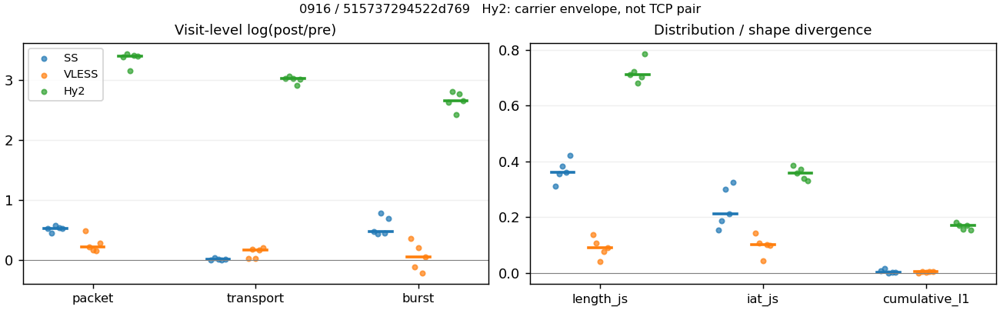
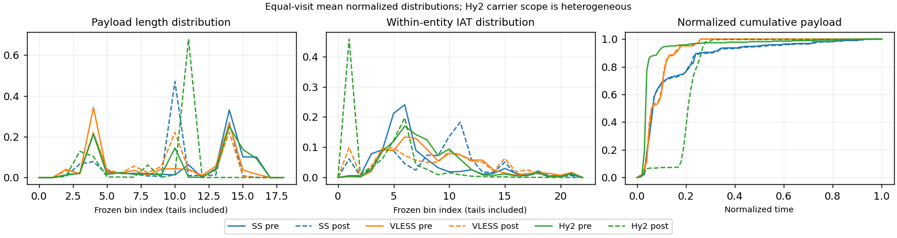

# 0916 · 条目 016 · github.com

目标：https://github.com/python/cpython

活动标签：github.com::repository_view。选定访问 15 次。

[返回总索引](../../README.md) · [统计口径](../../methods.md)

## 覆盖与资格（每次访问均保留）

| 部署 | 重复 | 主请求路由 | 活动状态 | 代理比较 | DIRECT pre | 请求 proxy/direct/unresolved | 错误 |
| --- | --- | --- | --- | --- | --- | --- | --- |
| Hy2 | 1 | proxy | passed | 1 | 0 | 188/0/0 | [] |
| Hy2 | 2 | proxy | passed | 1 | 0 | 186/0/0 | [] |
| Hy2 | 3 | proxy | passed | 1 | 0 | 187/0/0 | [] |
| Hy2 | 4 | proxy | passed | 1 | 0 | 168/0/0 | [] |
| Hy2 | 5 | proxy | passed | 1 | 0 | 187/0/0 | [] |
| SS | 1 | proxy | passed | 1 | 0 | 158/0/0 | [] |
| SS | 2 | proxy | passed | 1 | 0 | 164/0/0 | [] |
| SS | 3 | proxy | passed | 1 | 0 | 187/0/0 | [] |
| SS | 4 | proxy | passed | 1 | 0 | 171/0/0 | [] |
| SS | 5 | proxy | passed | 1 | 0 | 187/0/1 | [] |
| VLESS | 1 | proxy | passed | 1 | 0 | 185/0/0 | [] |
| VLESS | 2 | proxy | passed | 1 | 0 | 186/0/0 | [] |
| VLESS | 3 | proxy | passed | 1 | 0 | 186/0/0 | [] |
| VLESS | 4 | proxy | passed | 1 | 0 | 185/0/0 | [] |
| VLESS | 5 | proxy | passed | 1 | 0 | 187/0/0 | [] |

主请求非 proxy 的统计仅解释为已索引的辅助代理连接或 DIRECT 观测，不代表目标业务经代理传输。播放确认与配对资格是两道不同的门。

图中散点为单次访问，短线为重复中位数；Hy2 是共享载体包络，不能与 TCP 配对作等范围因果对比。

形态图先逐访问归一化，再对访问等权平均；实线 pre，虚线 post。分箱序号及边界见 methods，不将分箱索引误解为长度或时间。

## 每次访问的关键观测

### SS

范围：`exclusive_page`。每格 pre → post；空值为不可观测/不适用。

| 重复 | 包数 | 载荷字节 | burst | TCP FR | IAT中位µs | length JS | IAT JS |
| --- | --- | --- | --- | --- | --- | --- | --- |
| 1 | 1093 → 1853 | 1.686e+06 → 1.6917e+06 | 741 → 1193 | 69 → 69 | 29.19 → 173.14 | 0.31269 | 0.15364 |
| 2 | 1444 → 2269 | 1.9635e+06 → 2.0314e+06 | 1005 → 1549 | 99 → 109 | 28.163 → 393 | 0.35623 | 0.18812 |
| 3 | 1505 → 2673 | 2.3352e+06 → 2.3559e+06 | 1029 → 2237 | 107 → 111 | 32.231 → 1040.8 | 0.38386 | 0.30024 |
| 4 | 1429 → 2436 | 1.9986e+06 → 2.0049e+06 | 968 → 1516 | 90 → 92 | 30.076 → 136.64 | 0.36206 | 0.2109 |
| 5 | 1458 → 2467 | 2.3065e+06 → 2.3463e+06 | 1019 → 2037 | 85 → 91 | 28.673 → 846.97 | 0.42092 | 0.32452 |

完整标量统计：中位数 [min,max]；Δ 为重复内逐访问变换的中位数，MAD 未缩放。n 为可用变换数；DIRECT-only 的 nΔ=0 不代表 pre 不可用。

| scope | 特征 | pre | post | Δ | IQRΔ | MADΔ | nΔ |
| --- | --- | --- | --- | --- | --- | --- | --- |
| exclusive_page | active_span_sum_s_1000ms | 19.898 [13.18, 28.202] | 21.665 [18.138, 33.687] | 0.17771 | 0.13769 | 0.092618 | 5 |
| exclusive_page | active_span_sum_s_100ms | 3.1948 [2.8454, 4.3974] | 7.4064 [5.6052, 9.6529] | 0.67801 | 0.19765 | 0.13885 | 5 |
| exclusive_page | active_span_sum_s_500ms | 14.413 [9.433, 19.747] | 17.889 [14.737, 28.528] | 0.29206 | 0.14974 | 0.075838 | 5 |
| exclusive_page | burst_bytes_iqr | 2896 [1869, 2896] | 2395 [1462, 2856] | -0.013908 | 0.18776 | 0.17646 | 5 |
| exclusive_page | burst_bytes_mad | 35 [0, 64] | 40 [34, 50] | 0.0059172 | 0.19295 | 0.06068 | 4 |
| exclusive_page | burst_bytes_max | 28672 [24576, 42972] | 15708 [10232, 28560] | -0.63952 | 0.46771 | 0.23673 | 5 |
| exclusive_page | burst_bytes_mean | 2263.4 [1953.7, 2275.2] | 1311.4 [1053.1, 1418.1] | -0.4728 | 0.23009 | 0.074199 | 5 |
| exclusive_page | burst_bytes_median | 35 [0, 64] | 40 [34, 50] | 0.0059172 | 0.19295 | 0.06068 | 4 |
| exclusive_page | burst_bytes_min | 0 [0, 0] | 0 [0, 0] | — | — | — | 0 |
| exclusive_page | burst_bytes_p95 | 10406 [8688, 16384] | 5712 [2856, 5777.6] | -1.0423 | 0.52052 | 0.13451 | 5 |
| exclusive_page | burst_bytes_q25 | 0 [0, 0] | 0 [0, 0] | — | — | — | 0 |
| exclusive_page | burst_bytes_q75 | 2896 [1869, 2896] | 2395 [1462, 2856] | -0.013908 | 0.18776 | 0.17646 | 5 |
| exclusive_page | burst_bytes_std | 4625.7 [4059.9, 4952] | 1981.5 [1329.9, 2562.3] | -0.87639 | 0.40689 | 0.23965 | 5 |
| exclusive_page | burst_count | 1005 [741, 1029] | 1549 [1193, 2237] | 0.47623 | 0.24406 | 0.043604 | 5 |
| exclusive_page | burst_duration_ms_iqr | 0.014058 [0, 0.027361] | 0.0002415 [0, 0.004968] | -1.7061 | — | — | 1 |
| exclusive_page | burst_duration_ms_mad | 0 [0, 0] | 0 [0, 0] | — | — | — | 0 |
| exclusive_page | burst_duration_ms_max | 15000 [9411.9, 15001] | 30157 [9452.2, 46228] | 0.69832 | 0.67584 | 0.4272 | 5 |
| exclusive_page | burst_duration_ms_mean | 72.833 [58.515, 97.186] | 68.957 [33.32, 113.64] | -0.34315 | 0.70303 | 0.27378 | 5 |
| exclusive_page | burst_duration_ms_median | 0 [0, 0] | 0 [0, 0] | — | — | — | 0 |
| exclusive_page | burst_duration_ms_min | 0 [0, 0] | 0 [0, 0] | — | — | — | 0 |
| exclusive_page | burst_duration_ms_p95 | 114.61 [27.433, 292.92] | 5.9869 [0.96007, 20.132] | -3.1239 | 0.38513 | 0.21321 | 5 |
| exclusive_page | burst_duration_ms_q25 | 0 [0, 0] | 0 [0, 0] | — | — | — | 0 |
| exclusive_page | burst_duration_ms_q75 | 0.014058 [0, 0.027361] | 0.0002415 [0, 0.004968] | -1.7061 | — | — | 1 |
| exclusive_page | burst_duration_ms_std | 707.59 [562.19, 799.22] | 922.81 [433.4, 1851.9] | 0.14379 | 0.64002 | 0.34088 | 5 |
| exclusive_page | burst_packets_iqr | 1 [0, 1] | 1 [0, 1] | 0 | — | — | 1 |
| exclusive_page | burst_packets_mad | 0 [0, 0] | 0 [0, 0] | — | — | — | 0 |
| exclusive_page | burst_packets_max | 10 [9, 11] | 13 [12, 20] | 0.33647 | 0.1854 | 0.15415 | 5 |
| exclusive_page | burst_packets_mean | 1.4626 [1.4308, 1.4762] | 1.4648 [1.1949, 1.6069] | 0.0193 | 0.21837 | 0.065484 | 5 |
| exclusive_page | burst_packets_median | 1 [1, 1] | 1 [1, 1] | 0 | 0 | 0 | 5 |
| exclusive_page | burst_packets_min | 1 [1, 1] | 1 [1, 1] | 0 | 0 | 0 | 5 |
| exclusive_page | burst_packets_p95 | 3 [3, 4] | 3 [2, 4] | 0 | 0.40547 | 0.28768 | 5 |
| exclusive_page | burst_packets_q25 | 1 [1, 1] | 1 [1, 1] | 0 | 0 | 0 | 5 |
| exclusive_page | burst_packets_q75 | 2 [1, 2] | 2 [1, 2] | 0 | 1.3863 | 0.69315 | 5 |
| exclusive_page | burst_packets_std | 1.0905 [0.97761, 1.2007] | 1.0331 [0.70179, 1.4957] | -0.054087 | 0.27303 | 0.21955 | 5 |
| exclusive_page | connection_span_concurrency_max | 6 [5, 7] | 6 [5, 7] | 0 | 0 | 0 | 5 |
| exclusive_page | cumulative_l1 | — | — | 0.0023457 | 0.0064194 | 0.0015047 | 5 |
| exclusive_page | cumulative_max | — | — | 0.055838 | 0.027971 | 0.021813 | 5 |
| exclusive_page | direction_entropy | 0.85513 [0.79815, 0.86953] | 0.55255 [0.53284, 0.86455] | -0.29412 | 0.32008 | 0.034999 | 5 |
| exclusive_page | down_burst_count | 497 [366, 510] | 769 [592, 1114] | 0.48087 | 0.24474 | 0.044372 | 5 |
| exclusive_page | down_ip_bytes | 1.6705e+06 [1.6373e+06, 2.276e+06] | 1.6913e+06 [1.6528e+06, 2.3146e+06] | 0.012812 | 0.0049007 | 0.0033938 | 5 |
| exclusive_page | down_packets | 809 [621, 850] | 1292 [1099, 1366] | 0.46892 | 0.020982 | 0.015498 | 5 |
| exclusive_page | down_transport_bytes | 1.6286e+06 [1.605e+06, 2.2317e+06] | 1.6272e+06 [1.5954e+06, 2.2434e+06] | -0.00086183 | 0.007552 | 0.0051043 | 5 |
| exclusive_page | duration_s | 67.306 [12.228, 70.247] | 67.305 [12.228, 70.246] | -1.156e-05 | 5.3685e-06 | 3.2236e-06 | 5 |
| exclusive_page | entity_count | 9 [9, 11] | 9 [9, 11] | 0 | 0 | 0 | 5 |
| exclusive_page | fr_runs | 90 [69, 107] | 92 [69, 111] | 0.036701 | 0.046229 | 0.031507 | 5 |
| exclusive_page | fr_runs_per_packet | 0.1083 [0.10119, 0.12201] | 0.068939 [0.061939, 0.082701] | -0.042494 | 0.0071154 | 0.0033796 | 5 |
| exclusive_page | fr_switches | 80 [60, 98] | 82 [60, 102] | 0.040005 | 0.051293 | 0.035981 | 5 |
| exclusive_page | fr_switches_per_possible_transition | 0.097442 [0.091456, 0.1129] | 0.062548 [0.054299, 0.074981] | -0.039363 | 0.0069723 | 0.0014253 | 5 |
| exclusive_page | full_retransmission_fraction | 0.0048476 [0.0019934, 0.0064044] | 0.010539 [0.0044893, 0.028206] | 0.0043889 | 0.0052996 | 0.0034067 | 5 |
| exclusive_page | full_retransmission_packets | 7 [3, 9] | 20 [12, 64] | 1.3863 | 0.82198 | 0.48551 | 5 |
| exclusive_page | iat_count | 1433 [1084, 1496] | 2426 [1844, 2664] | 0.53128 | 0.0078171 | 0.0050122 | 5 |
| exclusive_page | iat_js | — | — | 0.2109 | 0.11212 | 0.057262 | 5 |
| exclusive_page | iat_ks | — | — | 0.37141 | 0.17367 | 0.098812 | 5 |
| exclusive_page | iat_median_us | 29.19 [28.163, 32.231] | 393 [136.64, 1040.8] | 2.6358 | 1.6054 | 0.83907 | 5 |
| exclusive_page | iat_us_iqr | 107.04 [88.876, 137.58] | 1012.1 [1003.1, 1786.5] | 2.4237 | 0.14343 | 0.13211 | 5 |
| exclusive_page | iat_us_mad | 20.909 [20.462, 24.335] | 386.34 [136.25, 906.23] | 2.9165 | 1.2697 | 0.70085 | 5 |
| exclusive_page | iat_us_max | 1.5001e+07 [9.4119e+06, 1.5001e+07] | 1.5361e+07 [9.4522e+06, 1.5508e+07] | 0.023704 | 0.0089292 | 0.0062508 | 5 |
| exclusive_page | iat_us_mean | 1.2307e+05 [59452, 2.6761e+05] | 75186 [34946, 1.5795e+05] | -0.53138 | 0.0075658 | 0.0041475 | 5 |
| exclusive_page | iat_us_median | 29.19 [28.163, 32.231] | 393 [136.64, 1040.8] | 2.6358 | 1.6054 | 0.83907 | 5 |
| exclusive_page | iat_us_min | 0.14 [0.005, 0.486] | 0.036 [0.032, 0.043] | -1.4759 | 0.92426 | 0.69315 | 5 |
| exclusive_page | iat_us_p95 | 95649 [87322, 2.4807e+05] | 33917 [32271, 79122] | -1.0509 | 0.14731 | 0.07924 | 5 |
| exclusive_page | iat_us_q25 | 12.774 [12.038, 12.95] | 15.102 [7.655, 114.78] | 0.22676 | 2.0011 | 0.7525 | 5 |
| exclusive_page | iat_us_q75 | 119.08 [101.65, 150.34] | 1117.9 [1016.6, 1882.5] | 2.3407 | 0.21778 | 0.16076 | 5 |
| exclusive_page | iat_us_std | 1.1679e+06 [4.8349e+05, 1.8587e+06] | 8.83e+05 [3.6061e+05, 1.4459e+06] | -0.25981 | 0.028562 | 0.01986 | 5 |
| exclusive_page | iat_wasserstein_log1p_us | — | — | 1.4988 | 0.78727 | 0.3761 | 5 |
| exclusive_page | idle_gap_count_1000ms | 25 [16, 34] | 22 [15, 35] | -0.03774 | 0.064539 | 0.03774 | 5 |
| exclusive_page | idle_gap_count_100ms | 71 [48, 88] | 72 [55, 102] | 0.028573 | 0.12215 | 0.041312 | 5 |
| exclusive_page | idle_gap_count_500ms | 32 [22, 38] | 29 [20, 38] | -0.09531 | 0.077451 | 0.063561 | 5 |
| exclusive_page | idle_gap_sum_s_1000ms | 162.79 [51.266, 372.92] | 161.7 [46.302, 369.7] | -0.0086793 | 0.031105 | 0.0043322 | 5 |
| exclusive_page | idle_gap_sum_s_100ms | 179.71 [61.601, 384.01] | 177.04 [58.835, 381.01] | -0.014982 | 0.026056 | 0.0071416 | 5 |
| exclusive_page | idle_gap_sum_s_500ms | 169.69 [55.013, 375.75] | 166.65 [49.703, 372.15] | -0.018101 | 0.049142 | 0.014136 | 5 |
| exclusive_page | ip_bytes | 2.0731e+06 [1.743e+06, 2.4136e+06] | 2.1632e+06 [1.7997e+06, 2.5191e+06] | 0.042782 | 0.012157 | 0.0074066 | 5 |
| exclusive_page | length_iqr | 2793 [2473, 3998.2] | 1428 [54, 2414.2] | -0.9377 | 0.35874 | 0.26686 | 5 |
| exclusive_page | length_js | — | — | 0.36206 | 0.027639 | 0.02181 | 5 |
| exclusive_page | length_ks | — | — | 0.48431 | 0.043349 | 0.029946 | 5 |
| exclusive_page | length_mad | 1452 [1448, 2168.5] | 54 [0, 1223] | -0.36867 | 1.762 | 0.1998 | 3 |
| exclusive_page | length_max | 8948 [8948, 8948] | 4284 [2856, 10136] | -0.73654 | 0.69315 | 0.40547 | 5 |
| exclusive_page | length_mean | 2634.3 [2380, 2745.8] | 1541.3 [1392.3, 1777.5] | -0.45603 | 0.11176 | 0.021561 | 5 |
| exclusive_page | length_median | 2688 [2436, 2896] | 1428 [1428, 1428] | -0.63252 | 0.074533 | 0.074533 | 5 |
| exclusive_page | length_min | 31 [8, 31] | 20 [10, 26] | -0.18232 | 0.26236 | 0.25593 | 5 |
| exclusive_page | length_p95 | 8192 [7240, 8192] | 2856 [2856, 2856] | -1.0537 | 0 | 0 | 5 |
| exclusive_page | length_q25 | 103 [97.75, 423] | 1428 [441.75, 1428] | 2.5545 | 1.1235 | 0.12712 | 5 |
| exclusive_page | length_q75 | 2896 [2896, 4096] | 2856 [1428, 2856] | -0.36059 | 0.65603 | 0.34647 | 5 |
| exclusive_page | length_std | 2626.7 [2058.6, 2713.1] | 972.13 [883.36, 1190.6] | -0.99398 | 0.20275 | 0.11659 | 5 |
| exclusive_page | length_wasserstein_bytes | — | — | 1269.1 | 95.327 | 74.132 | 5 |
| exclusive_page | nonempty_entity_count | 9 [9, 11] | 9 [9, 11] | 0 | 0 | 0 | 5 |
| exclusive_page | nonempty_packets | 831 [640, 877] | 1320 [1114, 1440] | 0.46849 | 0.084909 | 0.016502 | 5 |
| exclusive_page | offload_suspect_fraction | 0.33471 [0.31787, 0.35619] | 0.1908 [0.12028, 0.19538] | -0.14807 | 0.030899 | 0.01723 | 5 |
| exclusive_page | packet_count | 1444 [1093, 1505] | 2436 [1853, 2673] | 0.52788 | 0.0074452 | 0.0055027 | 5 |
| exclusive_page | rtt_median_ms | 0.042325 [0.029108, 0.047163] | 32.054 [28.304, 33.909] | 6.686 | 0.32438 | 0.17626 | 5 |
| exclusive_page | rtt_sample_count | 556 [430, 597] | 412 [287, 426] | -0.33748 | 0.015821 | 0.0098251 | 5 |
| exclusive_page | tcp_ack_count | 1433 [1084, 1496] | 2426 [1842, 2661] | 0.53019 | 0.0090383 | 0.0060974 | 5 |
| exclusive_page | tcp_fin_count | 18 [18, 22] | 20 [19, 25] | 0.09531 | 0.051293 | 0.032523 | 5 |
| exclusive_page | tcp_packet_count | 1444 [1093, 1505] | 2436 [1853, 2673] | 0.52788 | 0.0074452 | 0.0055027 | 5 |
| exclusive_page | tcp_rst_count | 0 [0, 0] | 0 [0, 0] | — | — | — | 0 |
| exclusive_page | tcp_syn_count | 18 [18, 22] | 21 [20, 22] | 0.10536 | 0.15415 | 0.04879 | 5 |
| exclusive_page | tcp_window_raw_median | 65504 [65504, 65535] | 153 [150, 154] | -6.0599 | 0.00047314 | 0.00047314 | 5 |
| exclusive_page | transition_entropy | 0.42843 [0.41764, 0.47951] | 0.29748 [0.2565, 0.36653] | -0.13335 | 0.031487 | 0.025007 | 5 |
| exclusive_page | transition_n_mm | 563 [420, 585] | 1036 [886, 1162] | 0.68333 | 0.11649 | 0.11182 | 5 |
| exclusive_page | transition_n_mp | 35 [26, 45] | 37 [26, 47] | 0.043485 | 0.056387 | 0.041072 | 5 |
| exclusive_page | transition_n_pm | 45 [34, 53] | 46 [34, 55] | 0.037041 | 0.047014 | 0.031952 | 5 |
| exclusive_page | transition_n_pp | 186 [151, 192] | 123 [103, 323] | -0.38255 | 0.95477 | 0.13875 | 5 |
| exclusive_page | transition_p_mm | 0.9417 [0.92846, 0.94355] | 0.96642 [0.95269, 0.97314] | 0.024833 | 0.0085669 | 0.0045542 | 5 |
| exclusive_page | transition_p_mp | 0.058296 [0.056452, 0.071542] | 0.033582 [0.02686, 0.047312] | -0.024833 | 0.0085669 | 0.0045542 | 5 |
| exclusive_page | transition_p_pm | 0.20675 [0.17949, 0.22388] | 0.24818 [0.12849, 0.30899] | 0.064391 | 0.15075 | 0.03914 | 5 |
| exclusive_page | transition_p_pp | 0.79325 [0.77612, 0.82051] | 0.75182 [0.69101, 0.87151] | -0.064391 | 0.15075 | 0.03914 | 5 |
| exclusive_page | transport_bytes | 1.9986e+06 [1.686e+06, 2.3352e+06] | 2.0314e+06 [1.6917e+06, 2.3559e+06] | 0.008828 | 0.013694 | 0.0056837 | 5 |
| exclusive_page | up_burst_count | 508 [375, 519] | 780 [601, 1123] | 0.47167 | 0.24338 | 0.042856 | 5 |
| exclusive_page | up_byte_fraction | 0.048037 [0.036593, 0.18561] | 0.056932 [0.046652, 0.19896] | 0.0088952 | 0.0056107 | 0.0044462 | 5 |
| exclusive_page | up_ip_bytes | 1.3764e+05 [1.0569e+05, 4.0339e+05] | 2.045e+05 [1.4691e+05, 4.7264e+05] | 0.32936 | 0.14645 | 0.079858 | 5 |
| exclusive_page | up_packets | 637 [472, 655] | 1143 [754, 1307] | 0.61169 | 0.10018 | 0.079162 | 5 |
| exclusive_page | up_transport_bytes | 1.0347e+05 [80988, 3.7096e+05] | 1.125e+05 [96314, 4.0417e+05] | 0.17331 | 0.10455 | 0.086682 | 5 |
| exclusive_page | zero_iat_count | 0 [0, 0] | 0 [0, 0] | — | — | — | 0 |
| exclusive_page | zero_iat_fraction | 0 [0, 0] | 0 [0, 0] | 0 | 0 | 0 | 5 |

### VLESS

范围：`exclusive_page`。每格 pre → post；空值为不可观测/不适用。

| 重复 | 包数 | 载荷字节 | burst | TCP FR | IAT中位µs | length JS | IAT JS |
| --- | --- | --- | --- | --- | --- | --- | --- |
| 1 | 1858 → 3011 | 2.2602e+06 → 2.3147e+06 | 1240 → 1767 | 92 → 108 | 117.04 → 19.714 | 0.13635 | 0.14271 |
| 2 | 709 → 877 | 4.122e+05 → 4.9325e+05 | 538 → 478 | 65 → 86 | 114.74 → 527.18 | 0.10618 | 0.10848 |
| 3 | 2154 → 2525 | 2.2294e+06 → 2.2866e+06 | 1495 → 1825 | 88 → 102 | 118.81 → 89.001 | 0.042167 | 0.044078 |
| 4 | 714 → 827 | 4.0133e+05 → 4.754e+05 | 549 → 443 | 67 → 86 | 122.8 → 579.98 | 0.076303 | 0.1022 |
| 5 | 627 → 830 | 3.6823e+05 → 4.5218e+05 | 486 → 508 | 71 → 92 | 139.9 → 690.94 | 0.091502 | 0.097652 |

完整标量统计：中位数 [min,max]；Δ 为重复内逐访问变换的中位数，MAD 未缩放。n 为可用变换数；DIRECT-only 的 nΔ=0 不代表 pre 不可用。

| scope | 特征 | pre | post | Δ | IQRΔ | MADΔ | nΔ |
| --- | --- | --- | --- | --- | --- | --- | --- |
| exclusive_page | active_span_sum_s_1000ms | 15.466 [14.272, 17.096] | 15.139 [14.505, 26.063] | 0.016163 | 0.0314 | 0.015769 | 5 |
| exclusive_page | active_span_sum_s_100ms | 1.9944 [1.8131, 2.5928] | 5.7826 [5.2295, 6.1964] | 1.1226 | 0.32019 | 0.037195 | 5 |
| exclusive_page | active_span_sum_s_500ms | 7.5168 [6.7684, 8.1421] | 13.835 [11.866, 16.287] | 0.60568 | 0.10854 | 0.044237 | 5 |
| exclusive_page | burst_bytes_iqr | 1163 [847, 2896] | 2019.5 [1448, 2824] | 0.46669 | 0.50962 | 0.40221 | 5 |
| exclusive_page | burst_bytes_mad | 24 [0, 39] | 43.5 [31, 72] | 0.6131 | 0.092726 | 0.018397 | 3 |
| exclusive_page | burst_bytes_max | 20480 [16485, 32805] | 12801 [12787, 14120] | -0.46993 | 0.56619 | 0.31422 | 5 |
| exclusive_page | burst_bytes_mean | 766.17 [731.01, 1822.8] | 1073.1 [890.13, 1310] | 0.16111 | 0.47188 | 0.2228 | 5 |
| exclusive_page | burst_bytes_median | 24 [0, 39] | 43.5 [31, 72] | 0.6131 | 0.092726 | 0.018397 | 3 |
| exclusive_page | burst_bytes_min | 0 [0, 0] | 0 [0, 0] | — | — | — | 0 |
| exclusive_page | burst_bytes_p95 | 2896 [2896, 9982.2] | 2911 [2831.8, 4380] | -0.022418 | 0.66859 | 0.027601 | 5 |
| exclusive_page | burst_bytes_q25 | 0 [0, 0] | 0 [0, 0] | — | — | — | 0 |
| exclusive_page | burst_bytes_q75 | 1163 [847, 2896] | 2019.5 [1448, 2824] | 0.46669 | 0.50962 | 0.40221 | 5 |
| exclusive_page | burst_bytes_std | 1979.3 [1693.6, 3738.9] | 1616.4 [1466.5, 1822.4] | -0.20253 | 0.34157 | 0.18379 | 5 |
| exclusive_page | burst_count | 549 [486, 1495] | 508 [443, 1825] | 0.044273 | 0.3177 | 0.16252 | 5 |
| exclusive_page | burst_duration_ms_iqr | 0.066513 [0, 0.14822] | 0.2883 [0.0001, 7.9843] | 0.51111 | 8.6096 | 4.2646 | 4 |
| exclusive_page | burst_duration_ms_mad | 0 [0, 0] | 0 [0, 0] | — | — | — | 0 |
| exclusive_page | burst_duration_ms_max | 15001 [15000, 15001] | 15337 [15048, 15423] | 0.022158 | 0.0056807 | 0.0031491 | 5 |
| exclusive_page | burst_duration_ms_mean | 79.178 [24.09, 107.5] | 134.89 [33.8, 280.29] | 0.74814 | 0.59843 | 0.44241 | 5 |
| exclusive_page | burst_duration_ms_median | 0 [0, 0] | 0 [0, 0] | — | — | — | 0 |
| exclusive_page | burst_duration_ms_min | 0 [0, 0] | 0 [0, 0] | — | — | — | 0 |
| exclusive_page | burst_duration_ms_p95 | 202.57 [4.9499, 268.98] | 210.81 [4.7645, 296.42] | 0.03988 | 0.40757 | 0.27374 | 5 |
| exclusive_page | burst_duration_ms_q25 | 0 [0, 0] | 0 [0, 0] | — | — | — | 0 |
| exclusive_page | burst_duration_ms_q75 | 0.066513 [0, 0.14822] | 0.2883 [0.0001, 7.9843] | 0.51111 | 8.6096 | 4.2646 | 4 |
| exclusive_page | burst_duration_ms_std | 717.56 [426.02, 973.06] | 1188.4 [624.91, 1895.4] | 0.6299 | 0.19031 | 0.18763 | 5 |
| exclusive_page | burst_packets_iqr | 1 [0, 1] | 1 [1, 1] | 0 | 0 | 0 | 4 |
| exclusive_page | burst_packets_mad | 0 [0, 0] | 0 [0, 0] | — | — | — | 0 |
| exclusive_page | burst_packets_max | 5 [4, 15] | 11 [11, 11] | 0.78846 | 1.3218 | 0.22314 | 5 |
| exclusive_page | burst_packets_mean | 1.3178 [1.2901, 1.4984] | 1.704 [1.3836, 1.8668] | 0.23621 | 0.2023 | 0.10761 | 5 |
| exclusive_page | burst_packets_median | 1 [1, 1] | 1 [1, 1] | 0 | 0 | 0 | 5 |
| exclusive_page | burst_packets_min | 1 [1, 1] | 1 [1, 1] | 0 | 0 | 0 | 5 |
| exclusive_page | burst_packets_p95 | 2 [2, 3] | 4 [3, 5] | 0.69315 | 0.62861 | 0.22314 | 5 |
| exclusive_page | burst_packets_q25 | 1 [1, 1] | 1 [1, 1] | 0 | 0 | 0 | 5 |
| exclusive_page | burst_packets_q75 | 2 [1, 2] | 2 [2, 2] | 0 | 0 | 0 | 5 |
| exclusive_page | burst_packets_std | 0.5916 [0.54557, 0.97716] | 1.2858 [0.91127, 1.4521] | 0.77633 | 0.79983 | 0.17905 | 5 |
| exclusive_page | connection_span_concurrency_max | 6 [4, 7] | 6 [4, 7] | 0 | 0 | 0 | 5 |
| exclusive_page | cumulative_l1 | — | — | 0.0039973 | 0.0021748 | 0.0017408 | 5 |
| exclusive_page | cumulative_max | — | — | 0.051134 | 0.055726 | 0.013846 | 5 |
| exclusive_page | direction_entropy | 0.86902 [0.6308, 0.91141] | 0.88073 [0.42165, 0.92232] | -0.0041313 | 0.17715 | 0.01584 | 5 |
| exclusive_page | down_burst_count | 270 [238, 744] | 249 [217, 909] | 0.045182 | 0.32093 | 0.16581 | 5 |
| exclusive_page | down_ip_bytes | 3.3826e+05 [2.9244e+05, 2.23e+06] | 4.0656e+05 [3.6333e+05, 2.2985e+06] | 0.17122 | 0.15367 | 0.045834 | 5 |
| exclusive_page | down_packets | 376 [319, 1285] | 470 [421, 1678] | 0.23653 | 0.091139 | 0.050228 | 5 |
| exclusive_page | down_transport_bytes | 3.1889e+05 [2.7577e+05, 2.1713e+06] | 3.8204e+05 [3.4136e+05, 2.2111e+06] | 0.1703 | 0.16006 | 0.043067 | 5 |
| exclusive_page | duration_s | 66.325 [63.37, 68.341] | 66.285 [63.353, 68.3] | -0.00060054 | 0.00033366 | 7.5414e-05 | 5 |
| exclusive_page | entity_count | 9 [7, 10] | 9 [7, 10] | 0 | 0 | 0 | 5 |
| exclusive_page | fr_runs | 71 [65, 92] | 92 [86, 108] | 0.24965 | 0.098766 | 0.030305 | 5 |
| exclusive_page | fr_runs_per_packet | 0.19006 [0.067073, 0.23906] | 0.19154 [0.064209, 0.22494] | 0.0014783 | 0.018374 | 0.0041497 | 5 |
| exclusive_page | fr_switches | 61 [55, 84] | 82 [76, 100] | 0.28336 | 0.12149 | 0.040038 | 5 |
| exclusive_page | fr_switches_per_possible_transition | 0.16566 [0.062069, 0.21254] | 0.17312 [0.059737, 0.20551] | 0.0046914 | 0.014488 | 0.0053936 | 5 |
| exclusive_page | full_retransmission_fraction | 0.0013928 [0, 0.0037675] | 0 [0, 0.0012048] | -0.0013928 | 0.0014104 | 0.0013928 | 5 |
| exclusive_page | full_retransmission_packets | 1 [0, 7] | 0 [0, 1] | — | — | — | 0 |
| exclusive_page | iat_count | 705 [617, 2147] | 867 [818, 3003] | 0.21539 | 0.12504 | 0.066724 | 5 |
| exclusive_page | iat_js | — | — | 0.1022 | 0.01083 | 0.0062782 | 5 |
| exclusive_page | iat_ks | — | — | 0.12942 | 0.013585 | 0.0044217 | 5 |
| exclusive_page | iat_median_us | 118.81 [114.74, 139.9] | 527.18 [19.714, 690.94] | 1.5249 | 1.8413 | 0.072246 | 5 |
| exclusive_page | iat_us_iqr | 3458.9 [782.45, 3983.5] | 9456.8 [570.32, 10138] | 0.86695 | 0.96778 | 0.16921 | 5 |
| exclusive_page | iat_us_mad | 108.55 [107.35, 132.92] | 526.85 [19.667, 688.4] | 1.5882 | 1.854 | 0.056458 | 5 |
| exclusive_page | iat_us_max | 1.5001e+07 [1.5001e+07, 1.5001e+07] | 1.5337e+07 [1.5314e+07, 1.5445e+07] | 0.022151 | 0.0044226 | 0.0014893 | 5 |
| exclusive_page | iat_us_mean | 2.83e+05 [88192, 4.4639e+05] | 2.1402e+05 [54257, 3.8032e+05] | -0.21615 | 0.11905 | 0.06324 | 5 |
| exclusive_page | iat_us_median | 118.81 [114.74, 139.9] | 527.18 [19.714, 690.94] | 1.5249 | 1.8413 | 0.072246 | 5 |
| exclusive_page | iat_us_min | 0.22 [0.004, 0.925] | 0.035 [0.026, 0.037] | -1.8383 | 2.9743 | 1.3806 | 5 |
| exclusive_page | iat_us_p95 | 5.8016e+05 [9419.9, 6.106e+05] | 1.6846e+05 [11305, 2.5964e+05] | -0.85513 | 1.1755 | 0.42764 | 5 |
| exclusive_page | iat_us_q25 | 27.053 [25.666, 30.78] | 13.86 [4.9325, 15.575] | -0.68123 | 0.10757 | 0.054551 | 5 |
| exclusive_page | iat_us_q75 | 3486 [809.41, 4009.2] | 9471.2 [575.25, 10154] | 0.86199 | 0.97962 | 0.16719 | 5 |
| exclusive_page | iat_us_std | 1.7729e+06 [1.0472e+06, 2.401e+06] | 1.5611e+06 [8.262e+05, 2.2506e+06] | -0.096635 | 0.05558 | 0.030557 | 5 |
| exclusive_page | iat_wasserstein_log1p_us | — | — | 0.89673 | 0.043609 | 0.024872 | 5 |
| exclusive_page | idle_gap_count_1000ms | 21 [13, 26] | 14 [13, 23] | -0.068993 | 0.080043 | 0.053609 | 5 |
| exclusive_page | idle_gap_count_100ms | 61 [46, 65] | 68 [53, 82] | 0.11955 | 0.028322 | 0.022105 | 5 |
| exclusive_page | idle_gap_count_500ms | 32 [25, 39] | 25 [15, 28] | -0.36772 | 0.024317 | 0.024317 | 5 |
| exclusive_page | idle_gap_sum_s_1000ms | 176.62 [147.69, 296.61] | 176.2 [147.92, 295.96] | -0.0021998 | 0.0015056 | 0.0013629 | 5 |
| exclusive_page | idle_gap_sum_s_100ms | 188.31 [160.56, 310.03] | 185.48 [157.09, 305.59] | -0.015134 | 0.0028866 | 0.0016472 | 5 |
| exclusive_page | idle_gap_sum_s_500ms | 184.12 [155.64, 304.9] | 178.84 [149.44, 297.26] | -0.029088 | 0.013879 | 0.0075862 | 5 |
| exclusive_page | ip_bytes | 4.4902e+05 [4.0079e+05, 2.3569e+06] | 5.3956e+05 [4.9603e+05, 2.4768e+06] | 0.16848 | 0.13406 | 0.04472 | 5 |
| exclusive_page | length_iqr | 2300 [1839, 2747] | 1340 [1328, 2716] | -0.34006 | 0.21469 | 0.20018 | 5 |
| exclusive_page | length_js | — | — | 0.091502 | 0.029875 | 0.015199 | 5 |
| exclusive_page | length_ks | — | — | 0.16717 | 0.035857 | 0.0342 | 5 |
| exclusive_page | length_mad | 530 [341.5, 1376] | 1021 [858, 1340] | 0.48173 | 0.67724 | 0.50824 | 5 |
| exclusive_page | length_max | 8948 [8948, 8948] | 2824 [2824, 7240] | -1.1533 | 0.79411 | 0 | 5 |
| exclusive_page | length_mean | 1239.8 [1153.2, 1987.9] | 1105.6 [1095.4, 1599] | -0.092708 | 0.053807 | 0.031911 | 5 |
| exclusive_page | length_median | 561 [397.5, 1484] | 1200 [1079, 1412] | 0.75232 | 0.78553 | 0.35256 | 5 |
| exclusive_page | length_min | 24 [7, 24] | 12 [7, 19] | -0.57536 | 0.45953 | 0.11778 | 5 |
| exclusive_page | length_p95 | 2846.8 [2824, 6000] | 2824 [2824, 2932] | -0.0080412 | 0.38802 | 0.0080412 | 5 |
| exclusive_page | length_q25 | 72 [72, 78] | 84 [72, 144] | 0.15415 | 0.33833 | 0.15415 | 5 |
| exclusive_page | length_q75 | 2372 [1911, 2824] | 1412 [1412, 2824] | -0.32526 | 0.21611 | 0.19347 | 5 |
| exclusive_page | length_std | 1591.1 [1527.2, 2113.4] | 985.63 [956.12, 1222.1] | -0.47237 | 0.085084 | 0.050614 | 5 |
| exclusive_page | length_wasserstein_bytes | — | — | 382.62 | 24.74 | 16.926 | 5 |
| exclusive_page | nonempty_entity_count | 9 [7, 10] | 9 [7, 10] | 0 | 0 | 0 | 5 |
| exclusive_page | nonempty_packets | 348 [297, 1312] | 449 [409, 1682] | 0.27221 | 0.099141 | 0.05137 | 5 |
| exclusive_page | offload_suspect_fraction | 0.15656 [0.14354, 0.3078] | 0.11125 [0.1012, 0.24832] | -0.047094 | 0.017147 | 0.012388 | 5 |
| exclusive_page | packet_count | 714 [627, 2154] | 877 [827, 3011] | 0.21265 | 0.12156 | 0.06573 | 5 |
| exclusive_page | rtt_median_ms | 0.076721 [0.071019, 0.12279] | 2.0182 [0.049092, 9.5112] | 3.347 | 5.4556 | 1.5372 | 5 |
| exclusive_page | rtt_sample_count | 294 [272, 796] | 349 [328, 1090] | 0.24927 | 0.084785 | 0.046687 | 5 |
| exclusive_page | tcp_ack_count | 690 [600, 2133] | 867 [818, 3002] | 0.24148 | 0.1422 | 0.071306 | 5 |
| exclusive_page | tcp_fin_count | 17 [14, 20] | 18 [14, 20] | 0 | 0.051293 | 0 | 5 |
| exclusive_page | tcp_packet_count | 714 [627, 2154] | 877 [827, 3011] | 0.21265 | 0.12156 | 0.06573 | 5 |
| exclusive_page | tcp_rst_count | 16 [14, 18] | 0 [0, 1] | -2.7726 | — | — | 1 |
| exclusive_page | tcp_syn_count | 18 [14, 20] | 18 [14, 20] | 0 | 0 | 0 | 5 |
| exclusive_page | tcp_window_raw_median | 65379 [64895, 65535] | 141 [131, 243] | -6.1392 | 0.56361 | 0.066132 | 5 |
| exclusive_page | transition_entropy | 0.60179 [0.2975, 0.69857] | 0.62076 [0.26007, 0.69622] | -0.0023582 | 0.02867 | 0.021333 | 5 |
| exclusive_page | transition_n_mm | 214 [165, 1060] | 271 [225, 1484] | 0.27424 | 0.11161 | 0.075698 | 5 |
| exclusive_page | transition_n_mp | 26 [23, 38] | 36 [33, 46] | 0.30748 | 0.13437 | 0.053529 | 5 |
| exclusive_page | transition_n_pm | 35 [32, 46] | 46 [43, 54] | 0.26469 | 0.11295 | 0.030772 | 5 |
| exclusive_page | transition_n_pp | 71 [61, 173] | 90 [87, 92] | 0.25911 | 0.86127 | 0.15181 | 5 |
| exclusive_page | transition_p_mm | 0.89956 [0.86387, 0.96627] | 0.89145 [0.86207, 0.96993] | -0.0018054 | 0.0075229 | 0.0063106 | 5 |
| exclusive_page | transition_p_mp | 0.10044 [0.033728, 0.13613] | 0.10855 [0.030065, 0.13793] | 0.0018054 | 0.0075229 | 0.0063106 | 5 |
| exclusive_page | transition_p_pm | 0.31068 [0.21005, 0.36458] | 0.33333 [0.31852, 0.375] | 0.0078389 | 0.14939 | 0.039089 | 5 |
| exclusive_page | transition_p_pp | 0.68932 [0.63542, 0.78995] | 0.66667 [0.625, 0.68148] | -0.0078389 | 0.14939 | 0.039089 | 5 |
| exclusive_page | transport_bytes | 4.122e+05 [3.6823e+05, 2.2602e+06] | 4.9325e+05 [4.5218e+05, 2.3147e+06] | 0.16938 | 0.15418 | 0.036001 | 5 |
| exclusive_page | up_burst_count | 279 [248, 751] | 259 [226, 916] | 0.043399 | 0.31457 | 0.15936 | 5 |
| exclusive_page | up_byte_fraction | 0.22638 [0.039358, 0.25108] | 0.22545 [0.044737, 0.24508] | -0.00070526 | 0.0053927 | 0.0051744 | 5 |
| exclusive_page | up_ip_bytes | 1.1076e+05 [1.0835e+05, 1.4211e+05] | 1.33e+05 [1.2953e+05, 1.7834e+05] | 0.18295 | 0.03428 | 0.019773 | 5 |
| exclusive_page | up_packets | 338 [308, 869] | 409 [374, 1333] | 0.23845 | 0.097848 | 0.052679 | 5 |
| exclusive_page | up_transport_bytes | 92878 [88958, 96999] | 1.0971e+05 [1.0355e+05, 1.112e+05] | 0.16633 | 0.023497 | 0.014407 | 5 |
| exclusive_page | zero_iat_count | 0 [0, 0] | 0 [0, 0] | — | — | — | 0 |
| exclusive_page | zero_iat_fraction | 0 [0, 0] | 0 [0, 0] | 0 | 0 | 0 | 5 |

### Hy2

范围：`carrier_context_envelope`。每格 pre → post；空值为不可观测/不适用。

| 重复 | 包数 | 载荷字节 | burst | TCP FR | IAT中位µs | length JS | IAT JS |
| --- | --- | --- | --- | --- | --- | --- | --- |
| 1 | 1506 → 44761 | 2.3477e+06 → 4.859e+07 | 1053 → 14740 | — | 90.216 → 3.628 | 0.71228 | 0.38703 |
| 2 | 1527 → 47556 | 2.3352e+06 → 5.0008e+07 | 1050 → 17552 | — | 70.524 → 4.68 | 0.7237 | 0.35917 |
| 3 | 1932 → 45294 | 2.3299e+06 → 4.8063e+07 | 1437 → 16251 | — | 95.338 → 5.459 | 0.68199 | 0.37129 |
| 4 | 1503 → 46005 | 2.6555e+06 → 4.8847e+07 | 1020 → 16386 | — | 72.552 → 6.0065 | 0.70469 | 0.33879 |
| 5 | 1478 → 44614 | 2.3379e+06 → 4.7896e+07 | 1048 → 15042 | — | 66.769 → 4.463 | 0.78537 | 0.3316 |

完整标量统计：中位数 [min,max]；Δ 为重复内逐访问变换的中位数，MAD 未缩放。n 为可用变换数；DIRECT-only 的 nΔ=0 不代表 pre 不可用。

| scope | 特征 | pre | post | Δ | IQRΔ | MADΔ | nΔ |
| --- | --- | --- | --- | --- | --- | --- | --- |
| carrier_context_envelope | active_span_sum_s_1000ms | 14.208 [9.9163, 15.28] | 24.596 [20.781, 26.665] | 0.59602 | 0.020157 | 0.010097 | 5 |
| carrier_context_envelope | active_span_sum_s_100ms | 2.0562 [1.5846, 2.1829] | 9.4928 [8.0877, 12.161] | 1.6762 | 0.16049 | 0.041394 | 5 |
| carrier_context_envelope | active_span_sum_s_500ms | 9.9086 [9.3579, 13.815] | 20.382 [17.794, 23.184] | 0.67679 | 0.14604 | 0.091312 | 5 |
| carrier_context_envelope | burst_bytes_iqr | 2808 [1762, 2830] | 4253 [2786, 5108] | 0.59301 | 0.24511 | 0.17786 | 5 |
| carrier_context_envelope | burst_bytes_mad | 31 [30, 35] | 268 [213, 379] | 2.1879 | 0.17051 | 0.15228 | 5 |
| carrier_context_envelope | burst_bytes_max | 29630 [24576, 51651] | 2.5044e+05 [1.2552e+05, 2.8472e+05] | 1.8632 | 0.42745 | 0.27125 | 5 |
| carrier_context_envelope | burst_bytes_mean | 2229.5 [1621.4, 2603.5] | 2981 [2849.1, 3296.5] | 0.35581 | 0.14336 | 0.1081 | 5 |
| carrier_context_envelope | burst_bytes_median | 31 [30, 35] | 301 [246, 412] | 2.3043 | 0.16523 | 0.15249 | 5 |
| carrier_context_envelope | burst_bytes_min | 0 [0, 0] | 22 [22, 22] | — | — | — | 0 |
| carrier_context_envelope | burst_bytes_p95 | 11681 [7076.8, 17408] | 10932 [10932, 11528] | -0.065659 | 0.13602 | 0.076923 | 5 |
| carrier_context_envelope | burst_bytes_q25 | 0 [0, 0] | 75 [60, 96] | — | — | — | 0 |
| carrier_context_envelope | burst_bytes_q75 | 2808 [1762, 2830] | 4323 [2882, 5168] | 0.60469 | 0.24629 | 0.17321 | 5 |
| carrier_context_envelope | burst_bytes_std | 4486.6 [3247.1, 5943.4] | 5993.9 [5002.4, 7527.8] | 0.29324 | 0.29239 | 0.1676 | 5 |
| carrier_context_envelope | burst_count | 1050 [1020, 1437] | 16251 [14740, 17552] | 2.664 | 0.1377 | 0.11266 | 5 |
| carrier_context_envelope | burst_duration_ms_iqr | 0.017339 [0, 0.049749] | 0.024463 [0.023188, 0.025184] | -0.04629 | 0.92105 | 0.43463 | 4 |
| carrier_context_envelope | burst_duration_ms_mad | 0 [0, 0] | 4.3e-05 [4e-05, 4.7e-05] | — | — | — | 0 |
| carrier_context_envelope | burst_duration_ms_max | 15001 [15000, 15001] | 9974.9 [6730.5, 10264] | -0.40799 | 0.038897 | 0.028517 | 5 |
| carrier_context_envelope | burst_duration_ms_mean | 51.515 [31.312, 133.16] | 1.9949 [1.4733, 2.9138] | -3.0008 | 0.9229 | 0.23058 | 5 |
| carrier_context_envelope | burst_duration_ms_median | 0 [0, 0] | 4.3e-05 [4e-05, 4.7e-05] | — | — | — | 0 |
| carrier_context_envelope | burst_duration_ms_min | 0 [0, 0] | 0 [0, 0] | — | — | — | 0 |
| carrier_context_envelope | burst_duration_ms_p95 | 6.0622 [2.7647, 201.66] | 0.10157 [0.080359, 0.11382] | -3.9936 | 0.21253 | 0.19406 | 5 |
| carrier_context_envelope | burst_duration_ms_q25 | 0 [0, 0] | 0 [0, 0] | — | — | — | 0 |
| carrier_context_envelope | burst_duration_ms_q75 | 0.017339 [0, 0.049749] | 0.024463 [0.023188, 0.025184] | -0.04629 | 0.92105 | 0.43463 | 4 |
| carrier_context_envelope | burst_duration_ms_std | 700.87 [501, 1107] | 108.46 [89.597, 135.05] | -1.6895 | 0.6706 | 0.11641 | 5 |
| carrier_context_envelope | burst_packets_iqr | 1 [0, 1] | 3 [2, 3] | 1.0986 | 0.10137 | 0 | 4 |
| carrier_context_envelope | burst_packets_mad | 0 [0, 0] | 1 [1, 1] | — | — | — | 0 |
| carrier_context_envelope | burst_packets_max | 10 [9, 11] | 180 [90, 205] | 2.7951 | 0.55027 | 0.33072 | 5 |
| carrier_context_envelope | burst_packets_mean | 1.4302 [1.3445, 1.4735] | 2.8076 [2.7094, 3.0367] | 0.72902 | 0.098733 | 0.023936 | 5 |
| carrier_context_envelope | burst_packets_median | 1 [1, 1] | 2 [2, 2] | 0.69315 | 0 | 0 | 5 |
| carrier_context_envelope | burst_packets_min | 1 [1, 1] | 1 [1, 1] | 0 | 0 | 0 | 5 |
| carrier_context_envelope | burst_packets_p95 | 3 [2, 3] | 8 [8, 8] | 0.98083 | 0 | 0 | 5 |
| carrier_context_envelope | burst_packets_q25 | 1 [1, 1] | 1 [1, 1] | 0 | 0 | 0 | 5 |
| carrier_context_envelope | burst_packets_q75 | 2 [1, 2] | 4 [3, 4] | 0.69315 | 0 | 0 | 5 |
| carrier_context_envelope | burst_packets_std | 0.93722 [0.88108, 0.9628] | 4.1518 [3.3943, 5.2959] | 1.4971 | 0.083954 | 0.053059 | 5 |
| carrier_context_envelope | connection_span_concurrency_max | 6 [6, 10] | 1 [1, 1] | -1.7918 | 0.15415 | 0 | 5 |
| carrier_context_envelope | cumulative_l1 | — | — | 0.17024 | 0.013813 | 0.01253 | 5 |
| carrier_context_envelope | cumulative_max | — | — | 0.911 | 0.0092175 | 0.0076573 | 5 |
| carrier_context_envelope | direction_entropy | 0.8363 [0.75907, 0.90057] | 0.78962 [0.75626, 0.80315] | -0.080048 | 0.065213 | 0.02354 | 5 |
| carrier_context_envelope | direction_run_analog_runs | 97 [85, 128] | 16251 [14740, 17552] | 5.0439 | 0.11372 | 0.11178 | 5 |
| carrier_context_envelope | direction_run_analog_runs_per_packet | 0.098765 [0.095195, 0.15006] | 0.35618 [0.3293, 0.36908] | 0.23127 | 0.041774 | 0.025145 | 5 |
| carrier_context_envelope | direction_run_analog_switches | 89 [76, 112] | 16250 [14739, 17551] | 5.1315 | 0.13762 | 0.13602 | 5 |
| carrier_context_envelope | direction_run_analog_switches_per_possible_transition | 0.0906 [0.087751, 0.13381] | 0.35616 [0.32929, 0.36907] | 0.24071 | 0.040723 | 0.018358 | 5 |
| carrier_context_envelope | down_burst_count | 521 [502, 714] | 8125 [7370, 8776] | 2.6716 | 0.14493 | 0.12081 | 5 |
| carrier_context_envelope | down_ip_bytes | 2.275e+06 [2.1938e+06, 2.2908e+06] | 4.8522e+07 [4.8173e+07, 4.9992e+07] | 3.0578 | 0.032627 | 0.0048358 | 5 |
| carrier_context_envelope | down_packets | 878 [834, 1117] | 34910 [34541, 35908] | 3.7099 | 0.035478 | 0.013738 | 5 |
| carrier_context_envelope | down_transport_bytes | 2.2276e+06 [2.1498e+06, 2.2451e+06] | 4.7545e+07 [4.7206e+07, 4.8986e+07] | 3.0586 | 0.029468 | 0.0049968 | 5 |
| carrier_context_envelope | duration_s | 65.64 [63.303, 69.206] | 65.622 [63.303, 69.202] | -8.984e-05 | 8.0593e-05 | 4.7699e-05 | 5 |
| carrier_context_envelope | entity_count | 9 [8, 16] | 1 [1, 1] | -2.1972 | 0.11778 | 0.11778 | 5 |
| carrier_context_envelope | full_retransmission_fraction | 0.0072037 [0.0031056, 0.007984] | — | — | — | — | 0 |
| carrier_context_envelope | full_retransmission_packets | 11 [6, 12] | — | — | — | — | 0 |
| carrier_context_envelope | iat_count | 1497 [1470, 1923] | 45293 [44613, 47555] | 3.4128 | 0.034116 | 0.019205 | 5 |
| carrier_context_envelope | iat_js | — | — | 0.35917 | 0.032501 | 0.020384 | 5 |
| carrier_context_envelope | iat_ks | — | — | 0.52587 | 0.07283 | 0.038297 | 5 |
| carrier_context_envelope | iat_median_us | 72.552 [66.769, 95.338] | 4.68 [3.628, 6.0065] | -2.7127 | 0.15474 | 0.14751 | 5 |
| carrier_context_envelope | iat_us_iqr | 423.02 [362.59, 673.62] | 24.846 [23.053, 25.992] | -2.8602 | 0.24464 | 0.21663 | 5 |
| carrier_context_envelope | iat_us_mad | 62.386 [57.829, 82.935] | 4.644 [3.592, 5.9695] | -2.5978 | 0.15782 | 0.12983 | 5 |
| carrier_context_envelope | iat_us_max | 1.5001e+07 [1.5001e+07, 1.5001e+07] | 9.9755e+06 [6.5789e+06, 1.0001e+07] | -0.408 | 0.04135 | 0.002512 | 5 |
| carrier_context_envelope | iat_us_mean | 2.0475e+05 [1.5369e+05, 2.6024e+05] | 1448.8 [1362.5, 1504.3] | -4.9949 | 0.28178 | 0.16985 | 5 |
| carrier_context_envelope | iat_us_median | 72.552 [66.769, 95.338] | 4.68 [3.628, 6.0065] | -2.7127 | 0.15474 | 0.14751 | 5 |
| carrier_context_envelope | iat_us_min | 0.107 [0.022, 0.567] | 0 [0, 0.001] | -3.8819 | 0.79089 | 0.79089 | 2 |
| carrier_context_envelope | iat_us_p95 | 40964 [14090, 93480] | 167.29 [130.48, 406.71] | -5.3182 | 0.80765 | 0.43102 | 5 |
| carrier_context_envelope | iat_us_q25 | 20.09 [17.058, 29.52] | 0.044 [0.042, 0.045] | -6.1238 | 0.46224 | 0.11705 | 5 |
| carrier_context_envelope | iat_us_q75 | 441.31 [382.68, 703.13] | 24.89 [23.096, 26.036] | -2.8999 | 0.25417 | 0.21216 | 5 |
| carrier_context_envelope | iat_us_std | 1.6336e+06 [1.3176e+06, 1.8715e+06] | 82935 [65552, 86488] | -3.0008 | 0.074303 | 0.054031 | 5 |
| carrier_context_envelope | iat_wasserstein_log1p_us | — | — | 3.0127 | 0.17038 | 0.093855 | 5 |
| carrier_context_envelope | idle_gap_count_1000ms | 25 [23, 30] | 8 [7, 13] | -1.0986 | 0.13613 | 0.09531 | 5 |
| carrier_context_envelope | idle_gap_count_100ms | 63 [54, 74] | 69 [64, 72] | 0.076373 | 0.089729 | 0.057158 | 5 |
| carrier_context_envelope | idle_gap_count_500ms | 29 [24, 38] | 14 [11, 18] | -0.82668 | 0.061409 | 0.055711 | 5 |
| carrier_context_envelope | idle_gap_sum_s_1000ms | 302.17 [214, 367.27] | 41.026 [39.01, 45.567] | -2.0016 | 0.032476 | 0.027676 | 5 |
| carrier_context_envelope | idle_gap_sum_s_100ms | 310.47 [226.36, 380.97] | 55.887 [55.215, 57.878] | -1.7254 | 0.0053356 | 0.0039448 | 5 |
| carrier_context_envelope | idle_gap_sum_s_500ms | 303.25 [214.73, 372.64] | 44.932 [42.921, 48.554] | -1.9399 | 0.051732 | 0.036389 | 5 |
| carrier_context_envelope | ip_bytes | 2.4263e+06 [2.4148e+06, 2.7341e+06] | 4.9843e+07 [4.9145e+07, 5.1339e+07] | 3.0131 | 0.012107 | 0.0094451 | 5 |
| carrier_context_envelope | length_iqr | 3554 [2065, 5568] | 689.25 [596, 1340] | -1.7856 | 0.76061 | 0.25856 | 5 |
| carrier_context_envelope | length_js | — | — | 0.71228 | 0.019007 | 0.011415 | 5 |
| carrier_context_envelope | length_ks | — | — | 0.53341 | 0.036959 | 0.030528 | 5 |
| carrier_context_envelope | length_mad | 1625 [1333, 2011] | 0 [0, 0] | — | — | — | 0 |
| carrier_context_envelope | length_max | 8948 [8948, 8948] | 1441 [1441, 1441] | -1.8261 | 0 | 0 | 5 |
| carrier_context_envelope | length_mean | 2707.8 [2112.4, 3113.2] | 1061.8 [1051.6, 1085.5] | -0.91406 | 0.038211 | 0.037377 | 5 |
| carrier_context_envelope | length_median | 1905 [1415, 2234] | 1441 [1441, 1441] | -0.27914 | 0.25288 | 0.15931 | 5 |
| carrier_context_envelope | length_min | 18 [14, 31] | 22 [22, 22] | 0.20067 | 0 | 0 | 5 |
| carrier_context_envelope | length_p95 | 8920 [7074.3, 8920] | 1441 [1441, 1441] | -1.823 | 0 | 0 | 5 |
| carrier_context_envelope | length_q25 | 116 [92, 765] | 751.75 [101, 845] | 1.9857 | 2.0749 | 0.16862 | 5 |
| carrier_context_envelope | length_q75 | 3652 [2830, 5660] | 1441 [1441, 1441] | -0.92994 | 0.30783 | 0.23281 | 5 |
| carrier_context_envelope | length_std | 2795.6 [2000.2, 3191] | 590.17 [575.88, 593.03] | -1.5611 | 0.10172 | 0.080141 | 5 |
| carrier_context_envelope | length_wasserstein_bytes | — | — | 1761.1 | 243.61 | 152.99 | 5 |
| carrier_context_envelope | nonempty_entity_count | 9 [8, 16] | 1 [1, 1] | -2.1972 | 0.11778 | 0.11778 | 5 |
| carrier_context_envelope | nonempty_packets | 867 [841, 1103] | 45294 [44614, 47556] | 3.9712 | 0.033265 | 0.016534 | 5 |
| carrier_context_envelope | offload_suspect_fraction | 0.30273 [0.2588, 0.32882] | 0 [0, 0] | -0.30273 | 0.025488 | 0.013219 | 5 |
| carrier_context_envelope | packet_count | 1506 [1478, 1932] | 45294 [44614, 47556] | 3.4074 | 0.029407 | 0.015478 | 5 |
| carrier_context_envelope | rtt_median_ms | 0.067929 [0.060491, 0.080441] | — | — | — | — | 0 |
| carrier_context_envelope | rtt_sample_count | 581 [572, 786] | 0 [0, 0] | — | — | — | 0 |
| carrier_context_envelope | tcp_ack_count | 1497 [1470, 1923] | — | — | — | — | 0 |
| carrier_context_envelope | tcp_fin_count | 18 [16, 32] | — | — | — | — | 0 |
| carrier_context_envelope | tcp_packet_count | 1506 [1478, 1932] | 0 [0, 0] | — | — | — | 0 |
| carrier_context_envelope | tcp_rst_count | 0 [0, 0] | — | — | — | — | 0 |
| carrier_context_envelope | tcp_syn_count | 18 [16, 32] | — | — | — | — | 0 |
| carrier_context_envelope | tcp_window_raw_median | 65535 [65505, 65535] | — | — | — | — | 0 |
| carrier_context_envelope | transition_entropy | 0.41206 [0.39426, 0.54513] | 0.78955 [0.75546, 0.80315] | 0.34932 | 0.08544 | 0.043666 | 5 |
| carrier_context_envelope | transition_n_mm | 594 [524, 809] | 27020 [26445, 27639] | 3.8401 | 0.099258 | 0.062966 | 5 |
| carrier_context_envelope | transition_n_mp | 41 [34, 53] | 8125 [7370, 8776] | 5.2185 | 0.16693 | 0.1603 | 5 |
| carrier_context_envelope | transition_n_pm | 48 [42, 59] | 8125 [7369, 8775] | 5.0541 | 0.11591 | 0.11325 | 5 |
| carrier_context_envelope | transition_n_pp | 188 [182, 201] | 2598 [2382, 2902] | 2.6297 | 0.0491 | 0.040154 | 5 |
| carrier_context_envelope | transition_p_mm | 0.94377 [0.90815, 0.94842] | 0.76531 [0.7556, 0.78948] | -0.15638 | 0.033926 | 0.013542 | 5 |
| carrier_context_envelope | transition_p_mp | 0.056231 [0.051583, 0.091854] | 0.23469 [0.21052, 0.2444] | 0.15638 | 0.033926 | 0.013542 | 5 |
| carrier_context_envelope | transition_p_pm | 0.2069 [0.18261, 0.22692] | 0.75341 [0.73842, 0.75772] | 0.54195 | 0.022574 | 0.020352 | 5 |
| carrier_context_envelope | transition_p_pp | 0.7931 [0.77308, 0.81739] | 0.24659 [0.24228, 0.26158] | -0.54195 | 0.022574 | 0.020352 | 5 |
| carrier_context_envelope | transport_bytes | 2.3379e+06 [2.3299e+06, 2.6555e+06] | 4.859e+07 [4.7896e+07, 5.0008e+07] | 3.0267 | 0.01022 | 0.0069065 | 5 |
| carrier_context_envelope | up_burst_count | 529 [518, 723] | 8126 [7370, 8776] | 2.6564 | 0.13065 | 0.1047 | 5 |
| carrier_context_envelope | up_byte_fraction | 0.047197 [0.042774, 0.19045] | 0.017665 [0.014397, 0.026649] | -0.030875 | 0.005931 | 0.0040069 | 5 |
| carrier_context_envelope | up_ip_bytes | 1.4399e+05 [1.3378e+05, 5.4024e+05] | 1.1493e+06 [9.7162e+05, 1.6124e+06] | 1.9995 | 0.17635 | 0.09028 | 5 |
| carrier_context_envelope | up_packets | 648 [628, 815] | 10724 [9752, 11648] | 2.7499 | 0.082357 | 0.07513 | 5 |
| carrier_context_envelope | up_transport_bytes | 1.1034e+05 [99885, 5.0575e+05] | 8.4904e+05 [6.8958e+05, 1.3017e+06] | 2.0159 | 0.24278 | 0.18338 | 5 |
| carrier_context_envelope | zero_iat_count | 0 [0, 0] | 2 [0, 2] | — | — | — | 0 |
| carrier_context_envelope | zero_iat_fraction | 0 [0, 0] | 4.3474e-05 [0, 4.483e-05] | 4.3474e-05 | 4.4157e-05 | 1.3555e-06 | 5 |

## 不同部署对比

以下是各部署自身重复中位数的差异，不按重复编号强行配对。跨 TCP/Hy2 的行标记异质观测范围。

| 视角 | 特征 | 部署A | 部署B | A中位 | B中位 | B−A | 比较口径 |
| --- | --- | --- | --- | --- | --- | --- | --- |
| pre | burst_count | VLESS | SS | 549 | 1005 | 456 | same_scope_unpaired_visits |
| pre | burst_count | VLESS | Hy2 | 549 | 1050 | 501 | heterogeneous_scope_descriptive_only |
| pre | burst_count | SS | Hy2 | 1005 | 1050 | 45 | heterogeneous_scope_descriptive_only |
| pre | connection_span_concurrency_max | VLESS | SS | 6 | 6 | 0 | same_scope_unpaired_visits |
| pre | connection_span_concurrency_max | VLESS | Hy2 | 6 | 6 | 0 | heterogeneous_scope_descriptive_only |
| pre | connection_span_concurrency_max | SS | Hy2 | 6 | 6 | 0 | heterogeneous_scope_descriptive_only |
| pre | direction_entropy | VLESS | SS | 0.86902 | 0.85513 | -0.013892 | same_scope_unpaired_visits |
| pre | direction_entropy | VLESS | Hy2 | 0.86902 | 0.8363 | -0.032714 | heterogeneous_scope_descriptive_only |
| pre | direction_entropy | SS | Hy2 | 0.85513 | 0.8363 | -0.018822 | heterogeneous_scope_descriptive_only |
| pre | down_transport_bytes | VLESS | SS | 3.1889e+05 | 1.6286e+06 | 1.3097e+06 | same_scope_unpaired_visits |
| pre | down_transport_bytes | VLESS | Hy2 | 3.1889e+05 | 2.2276e+06 | 1.9087e+06 | heterogeneous_scope_descriptive_only |
| pre | down_transport_bytes | SS | Hy2 | 1.6286e+06 | 2.2276e+06 | 5.9893e+05 | heterogeneous_scope_descriptive_only |
| pre | duration_s | VLESS | SS | 66.325 | 67.306 | 0.98116 | same_scope_unpaired_visits |
| pre | duration_s | VLESS | Hy2 | 66.325 | 65.64 | -0.68484 | heterogeneous_scope_descriptive_only |
| pre | duration_s | SS | Hy2 | 67.306 | 65.64 | -1.666 | heterogeneous_scope_descriptive_only |
| pre | entity_count | VLESS | SS | 9 | 9 | 0 | same_scope_unpaired_visits |
| pre | entity_count | VLESS | Hy2 | 9 | 9 | 0 | heterogeneous_scope_descriptive_only |
| pre | entity_count | SS | Hy2 | 9 | 9 | 0 | heterogeneous_scope_descriptive_only |
| pre | fr_runs | VLESS | SS | 71 | 90 | 19 | same_scope_unpaired_visits |
| pre | fr_runs_per_packet | VLESS | SS | 0.19006 | 0.1083 | -0.081755 | same_scope_unpaired_visits |
| pre | fr_switches | VLESS | SS | 61 | 80 | 19 | same_scope_unpaired_visits |
| pre | fr_switches_per_possible_transition | VLESS | SS | 0.16566 | 0.097442 | -0.068221 | same_scope_unpaired_visits |
| pre | full_retransmission_fraction | VLESS | SS | 0.0013928 | 0.0048476 | 0.0034549 | same_scope_unpaired_visits |
| pre | full_retransmission_fraction | VLESS | Hy2 | 0.0013928 | 0.0072037 | 0.0058109 | heterogeneous_scope_descriptive_only |
| pre | full_retransmission_fraction | SS | Hy2 | 0.0048476 | 0.0072037 | 0.002356 | heterogeneous_scope_descriptive_only |
| pre | iat_median_us | VLESS | SS | 118.81 | 29.19 | -89.617 | same_scope_unpaired_visits |
| pre | iat_median_us | VLESS | Hy2 | 118.81 | 72.552 | -46.255 | heterogeneous_scope_descriptive_only |
| pre | iat_median_us | SS | Hy2 | 29.19 | 72.552 | 43.362 | heterogeneous_scope_descriptive_only |
| pre | iat_us_p95 | VLESS | SS | 5.8016e+05 | 95649 | -4.8451e+05 | same_scope_unpaired_visits |
| pre | iat_us_p95 | VLESS | Hy2 | 5.8016e+05 | 40964 | -5.3919e+05 | heterogeneous_scope_descriptive_only |
| pre | iat_us_p95 | SS | Hy2 | 95649 | 40964 | -54685 | heterogeneous_scope_descriptive_only |
| pre | ip_bytes | VLESS | SS | 4.4902e+05 | 2.0731e+06 | 1.6241e+06 | same_scope_unpaired_visits |
| pre | ip_bytes | VLESS | Hy2 | 4.4902e+05 | 2.4263e+06 | 1.9772e+06 | heterogeneous_scope_descriptive_only |
| pre | ip_bytes | SS | Hy2 | 2.0731e+06 | 2.4263e+06 | 3.5312e+05 | heterogeneous_scope_descriptive_only |
| pre | length_median | VLESS | SS | 561 | 2688 | 2127 | same_scope_unpaired_visits |
| pre | length_median | VLESS | Hy2 | 561 | 1905 | 1344 | heterogeneous_scope_descriptive_only |
| pre | length_median | SS | Hy2 | 2688 | 1905 | -783 | heterogeneous_scope_descriptive_only |
| pre | length_p95 | VLESS | SS | 2846.8 | 8192 | 5345.2 | same_scope_unpaired_visits |
| pre | length_p95 | VLESS | Hy2 | 2846.8 | 8920 | 6073.2 | heterogeneous_scope_descriptive_only |
| pre | length_p95 | SS | Hy2 | 8192 | 8920 | 728 | heterogeneous_scope_descriptive_only |
| pre | nonempty_packets | VLESS | SS | 348 | 831 | 483 | same_scope_unpaired_visits |
| pre | nonempty_packets | VLESS | Hy2 | 348 | 867 | 519 | heterogeneous_scope_descriptive_only |
| pre | nonempty_packets | SS | Hy2 | 831 | 867 | 36 | heterogeneous_scope_descriptive_only |
| pre | offload_suspect_fraction | VLESS | SS | 0.15656 | 0.33471 | 0.17815 | same_scope_unpaired_visits |
| pre | offload_suspect_fraction | VLESS | Hy2 | 0.15656 | 0.30273 | 0.14617 | heterogeneous_scope_descriptive_only |
| pre | offload_suspect_fraction | SS | Hy2 | 0.33471 | 0.30273 | -0.031977 | heterogeneous_scope_descriptive_only |
| pre | packet_count | VLESS | SS | 714 | 1444 | 730 | same_scope_unpaired_visits |
| pre | packet_count | VLESS | Hy2 | 714 | 1506 | 792 | heterogeneous_scope_descriptive_only |
| pre | packet_count | SS | Hy2 | 1444 | 1506 | 62 | heterogeneous_scope_descriptive_only |
| pre | rtt_median_ms | VLESS | SS | 0.076721 | 0.042325 | -0.034396 | same_scope_unpaired_visits |
| pre | rtt_median_ms | VLESS | Hy2 | 0.076721 | 0.067929 | -0.0087925 | heterogeneous_scope_descriptive_only |
| pre | rtt_median_ms | SS | Hy2 | 0.042325 | 0.067929 | 0.025604 | heterogeneous_scope_descriptive_only |
| pre | transition_entropy | VLESS | SS | 0.60179 | 0.42843 | -0.17336 | same_scope_unpaired_visits |
| pre | transition_entropy | VLESS | Hy2 | 0.60179 | 0.41206 | -0.18973 | heterogeneous_scope_descriptive_only |
| pre | transition_entropy | SS | Hy2 | 0.42843 | 0.41206 | -0.016375 | heterogeneous_scope_descriptive_only |
| pre | transport_bytes | VLESS | SS | 4.122e+05 | 1.9986e+06 | 1.5864e+06 | same_scope_unpaired_visits |
| pre | transport_bytes | VLESS | Hy2 | 4.122e+05 | 2.3379e+06 | 1.9257e+06 | heterogeneous_scope_descriptive_only |
| pre | transport_bytes | SS | Hy2 | 1.9986e+06 | 2.3379e+06 | 3.3933e+05 | heterogeneous_scope_descriptive_only |
| pre | up_byte_fraction | VLESS | SS | 0.22638 | 0.048037 | -0.17834 | same_scope_unpaired_visits |
| pre | up_byte_fraction | VLESS | Hy2 | 0.22638 | 0.047197 | -0.17918 | heterogeneous_scope_descriptive_only |
| pre | up_byte_fraction | SS | Hy2 | 0.048037 | 0.047197 | -0.0008402 | heterogeneous_scope_descriptive_only |
| pre | up_transport_bytes | VLESS | SS | 92878 | 1.0347e+05 | 10589 | same_scope_unpaired_visits |
| pre | up_transport_bytes | VLESS | Hy2 | 92878 | 1.1034e+05 | 17463 | heterogeneous_scope_descriptive_only |
| pre | up_transport_bytes | SS | Hy2 | 1.0347e+05 | 1.1034e+05 | 6874 | heterogeneous_scope_descriptive_only |
| post | burst_count | VLESS | SS | 508 | 1549 | 1041 | same_scope_unpaired_visits |
| post | burst_count | VLESS | Hy2 | 508 | 16251 | 15743 | heterogeneous_scope_descriptive_only |
| post | burst_count | SS | Hy2 | 1549 | 16251 | 14702 | heterogeneous_scope_descriptive_only |
| post | connection_span_concurrency_max | VLESS | SS | 6 | 6 | 0 | same_scope_unpaired_visits |
| post | connection_span_concurrency_max | VLESS | Hy2 | 6 | 1 | -5 | heterogeneous_scope_descriptive_only |
| post | connection_span_concurrency_max | SS | Hy2 | 6 | 1 | -5 | heterogeneous_scope_descriptive_only |
| post | direction_entropy | VLESS | SS | 0.88073 | 0.55255 | -0.32818 | same_scope_unpaired_visits |
| post | direction_entropy | VLESS | Hy2 | 0.88073 | 0.78962 | -0.091109 | heterogeneous_scope_descriptive_only |
| post | direction_entropy | SS | Hy2 | 0.55255 | 0.78962 | 0.23707 | heterogeneous_scope_descriptive_only |
| post | down_transport_bytes | VLESS | SS | 3.8204e+05 | 1.6272e+06 | 1.2452e+06 | same_scope_unpaired_visits |
| post | down_transport_bytes | VLESS | Hy2 | 3.8204e+05 | 4.7545e+07 | 4.7163e+07 | heterogeneous_scope_descriptive_only |
| post | down_transport_bytes | SS | Hy2 | 1.6272e+06 | 4.7545e+07 | 4.5918e+07 | heterogeneous_scope_descriptive_only |
| post | duration_s | VLESS | SS | 66.285 | 67.305 | 1.0207 | same_scope_unpaired_visits |
| post | duration_s | VLESS | Hy2 | 66.285 | 65.622 | -0.66223 | heterogeneous_scope_descriptive_only |
| post | duration_s | SS | Hy2 | 67.305 | 65.622 | -1.6829 | heterogeneous_scope_descriptive_only |
| post | entity_count | VLESS | SS | 9 | 9 | 0 | same_scope_unpaired_visits |
| post | entity_count | VLESS | Hy2 | 9 | 1 | -8 | heterogeneous_scope_descriptive_only |
| post | entity_count | SS | Hy2 | 9 | 1 | -8 | heterogeneous_scope_descriptive_only |
| post | fr_runs | VLESS | SS | 92 | 92 | 0 | same_scope_unpaired_visits |
| post | fr_runs_per_packet | VLESS | SS | 0.19154 | 0.068939 | -0.1226 | same_scope_unpaired_visits |
| post | fr_switches | VLESS | SS | 82 | 82 | 0 | same_scope_unpaired_visits |
| post | fr_switches_per_possible_transition | VLESS | SS | 0.17312 | 0.062548 | -0.11057 | same_scope_unpaired_visits |
| post | full_retransmission_fraction | VLESS | SS | 0 | 0.010539 | 0.010539 | same_scope_unpaired_visits |
| post | iat_median_us | VLESS | SS | 527.18 | 393 | -134.18 | same_scope_unpaired_visits |
| post | iat_median_us | VLESS | Hy2 | 527.18 | 4.68 | -522.5 | heterogeneous_scope_descriptive_only |
| post | iat_median_us | SS | Hy2 | 393 | 4.68 | -388.32 | heterogeneous_scope_descriptive_only |
| post | iat_us_p95 | VLESS | SS | 1.6846e+05 | 33917 | -1.3454e+05 | same_scope_unpaired_visits |
| post | iat_us_p95 | VLESS | Hy2 | 1.6846e+05 | 167.29 | -1.6829e+05 | heterogeneous_scope_descriptive_only |
| post | iat_us_p95 | SS | Hy2 | 33917 | 167.29 | -33749 | heterogeneous_scope_descriptive_only |
| post | ip_bytes | VLESS | SS | 5.3956e+05 | 2.1632e+06 | 1.6237e+06 | same_scope_unpaired_visits |
| post | ip_bytes | VLESS | Hy2 | 5.3956e+05 | 4.9843e+07 | 4.9304e+07 | heterogeneous_scope_descriptive_only |
| post | ip_bytes | SS | Hy2 | 2.1632e+06 | 4.9843e+07 | 4.768e+07 | heterogeneous_scope_descriptive_only |
| post | length_median | VLESS | SS | 1200 | 1428 | 228 | same_scope_unpaired_visits |
| post | length_median | VLESS | Hy2 | 1200 | 1441 | 241 | heterogeneous_scope_descriptive_only |
| post | length_median | SS | Hy2 | 1428 | 1441 | 13 | heterogeneous_scope_descriptive_only |
| post | length_p95 | VLESS | SS | 2824 | 2856 | 32 | same_scope_unpaired_visits |
| post | length_p95 | VLESS | Hy2 | 2824 | 1441 | -1383 | heterogeneous_scope_descriptive_only |
| post | length_p95 | SS | Hy2 | 2856 | 1441 | -1415 | heterogeneous_scope_descriptive_only |
| post | nonempty_packets | VLESS | SS | 449 | 1320 | 871 | same_scope_unpaired_visits |
| post | nonempty_packets | VLESS | Hy2 | 449 | 45294 | 44845 | heterogeneous_scope_descriptive_only |
| post | nonempty_packets | SS | Hy2 | 1320 | 45294 | 43974 | heterogeneous_scope_descriptive_only |
| post | offload_suspect_fraction | VLESS | SS | 0.11125 | 0.1908 | 0.079551 | same_scope_unpaired_visits |
| post | offload_suspect_fraction | VLESS | Hy2 | 0.11125 | 0 | -0.11125 | heterogeneous_scope_descriptive_only |
| post | offload_suspect_fraction | SS | Hy2 | 0.1908 | 0 | -0.1908 | heterogeneous_scope_descriptive_only |
| post | packet_count | VLESS | SS | 877 | 2436 | 1559 | same_scope_unpaired_visits |
| post | packet_count | VLESS | Hy2 | 877 | 45294 | 44417 | heterogeneous_scope_descriptive_only |
| post | packet_count | SS | Hy2 | 2436 | 45294 | 42858 | heterogeneous_scope_descriptive_only |
| post | rtt_median_ms | VLESS | SS | 2.0182 | 32.054 | 30.036 | same_scope_unpaired_visits |
| post | transition_entropy | VLESS | SS | 0.62076 | 0.29748 | -0.32329 | same_scope_unpaired_visits |
| post | transition_entropy | VLESS | Hy2 | 0.62076 | 0.78955 | 0.16879 | heterogeneous_scope_descriptive_only |
| post | transition_entropy | SS | Hy2 | 0.29748 | 0.78955 | 0.49207 | heterogeneous_scope_descriptive_only |
| post | transport_bytes | VLESS | SS | 4.9325e+05 | 2.0314e+06 | 1.5382e+06 | same_scope_unpaired_visits |
| post | transport_bytes | VLESS | Hy2 | 4.9325e+05 | 4.859e+07 | 4.8097e+07 | heterogeneous_scope_descriptive_only |
| post | transport_bytes | SS | Hy2 | 2.0314e+06 | 4.859e+07 | 4.6558e+07 | heterogeneous_scope_descriptive_only |
| post | up_byte_fraction | VLESS | SS | 0.22545 | 0.056932 | -0.16852 | same_scope_unpaired_visits |
| post | up_byte_fraction | VLESS | Hy2 | 0.22545 | 0.017665 | -0.20779 | heterogeneous_scope_descriptive_only |
| post | up_byte_fraction | SS | Hy2 | 0.056932 | 0.017665 | -0.039267 | heterogeneous_scope_descriptive_only |
| post | up_transport_bytes | VLESS | SS | 1.0971e+05 | 1.125e+05 | 2791 | same_scope_unpaired_visits |
| post | up_transport_bytes | VLESS | Hy2 | 1.0971e+05 | 8.4904e+05 | 7.3933e+05 | heterogeneous_scope_descriptive_only |
| post | up_transport_bytes | SS | Hy2 | 1.125e+05 | 8.4904e+05 | 7.3654e+05 | heterogeneous_scope_descriptive_only |
| transformation | burst_count | VLESS | SS | 0.044273 | 0.47623 | 0.43195 | same_scope_unpaired_visits |
| transformation | burst_count | VLESS | Hy2 | 0.044273 | 2.664 | 2.6197 | heterogeneous_scope_descriptive_only |
| transformation | burst_count | SS | Hy2 | 0.47623 | 2.664 | 2.1877 | heterogeneous_scope_descriptive_only |
| transformation | connection_span_concurrency_max | VLESS | SS | 0 | 0 | 0 | same_scope_unpaired_visits |
| transformation | connection_span_concurrency_max | VLESS | Hy2 | 0 | -1.7918 | -1.7918 | heterogeneous_scope_descriptive_only |
| transformation | connection_span_concurrency_max | SS | Hy2 | 0 | -1.7918 | -1.7918 | heterogeneous_scope_descriptive_only |
| transformation | direction_entropy | VLESS | SS | -0.0041313 | -0.29412 | -0.28999 | same_scope_unpaired_visits |
| transformation | direction_entropy | VLESS | Hy2 | -0.0041313 | -0.080048 | -0.075917 | heterogeneous_scope_descriptive_only |
| transformation | direction_entropy | SS | Hy2 | -0.29412 | -0.080048 | 0.21407 | heterogeneous_scope_descriptive_only |
| transformation | down_transport_bytes | VLESS | SS | 0.1703 | -0.00086183 | -0.17116 | same_scope_unpaired_visits |
| transformation | down_transport_bytes | VLESS | Hy2 | 0.1703 | 3.0586 | 2.8883 | heterogeneous_scope_descriptive_only |
| transformation | down_transport_bytes | SS | Hy2 | -0.00086183 | 3.0586 | 3.0595 | heterogeneous_scope_descriptive_only |
| transformation | duration_s | VLESS | SS | -0.00060054 | -1.156e-05 | 0.00058898 | same_scope_unpaired_visits |
| transformation | duration_s | VLESS | Hy2 | -0.00060054 | -8.984e-05 | 0.0005107 | heterogeneous_scope_descriptive_only |
| transformation | duration_s | SS | Hy2 | -1.156e-05 | -8.984e-05 | -7.828e-05 | heterogeneous_scope_descriptive_only |
| transformation | entity_count | VLESS | SS | 0 | 0 | 0 | same_scope_unpaired_visits |
| transformation | entity_count | VLESS | Hy2 | 0 | -2.1972 | -2.1972 | heterogeneous_scope_descriptive_only |
| transformation | entity_count | SS | Hy2 | 0 | -2.1972 | -2.1972 | heterogeneous_scope_descriptive_only |
| transformation | fr_runs | VLESS | SS | 0.24965 | 0.036701 | -0.21295 | same_scope_unpaired_visits |
| transformation | fr_runs_per_packet | VLESS | SS | 0.0014783 | -0.042494 | -0.043972 | same_scope_unpaired_visits |
| transformation | fr_switches | VLESS | SS | 0.28336 | 0.040005 | -0.24336 | same_scope_unpaired_visits |
| transformation | fr_switches_per_possible_transition | VLESS | SS | 0.0046914 | -0.039363 | -0.044055 | same_scope_unpaired_visits |
| transformation | full_retransmission_fraction | VLESS | SS | -0.0013928 | 0.0043889 | 0.0057817 | same_scope_unpaired_visits |
| transformation | iat_median_us | VLESS | SS | 1.5249 | 2.6358 | 1.1109 | same_scope_unpaired_visits |
| transformation | iat_median_us | VLESS | Hy2 | 1.5249 | -2.7127 | -4.2375 | heterogeneous_scope_descriptive_only |
| transformation | iat_median_us | SS | Hy2 | 2.6358 | -2.7127 | -5.3485 | heterogeneous_scope_descriptive_only |
| transformation | iat_us_p95 | VLESS | SS | -0.85513 | -1.0509 | -0.19578 | same_scope_unpaired_visits |
| transformation | iat_us_p95 | VLESS | Hy2 | -0.85513 | -5.3182 | -4.463 | heterogeneous_scope_descriptive_only |
| transformation | iat_us_p95 | SS | Hy2 | -1.0509 | -5.3182 | -4.2673 | heterogeneous_scope_descriptive_only |
| transformation | ip_bytes | VLESS | SS | 0.16848 | 0.042782 | -0.1257 | same_scope_unpaired_visits |
| transformation | ip_bytes | VLESS | Hy2 | 0.16848 | 3.0131 | 2.8446 | heterogeneous_scope_descriptive_only |
| transformation | ip_bytes | SS | Hy2 | 0.042782 | 3.0131 | 2.9703 | heterogeneous_scope_descriptive_only |
| transformation | length_median | VLESS | SS | 0.75232 | -0.63252 | -1.3848 | same_scope_unpaired_visits |
| transformation | length_median | VLESS | Hy2 | 0.75232 | -0.27914 | -1.0315 | heterogeneous_scope_descriptive_only |
| transformation | length_median | SS | Hy2 | -0.63252 | -0.27914 | 0.35338 | heterogeneous_scope_descriptive_only |
| transformation | length_p95 | VLESS | SS | -0.0080412 | -1.0537 | -1.0457 | same_scope_unpaired_visits |
| transformation | length_p95 | VLESS | Hy2 | -0.0080412 | -1.823 | -1.8149 | heterogeneous_scope_descriptive_only |
| transformation | length_p95 | SS | Hy2 | -1.0537 | -1.823 | -0.76922 | heterogeneous_scope_descriptive_only |
| transformation | nonempty_packets | VLESS | SS | 0.27221 | 0.46849 | 0.19628 | same_scope_unpaired_visits |
| transformation | nonempty_packets | VLESS | Hy2 | 0.27221 | 3.9712 | 3.699 | heterogeneous_scope_descriptive_only |
| transformation | nonempty_packets | SS | Hy2 | 0.46849 | 3.9712 | 3.5027 | heterogeneous_scope_descriptive_only |
| transformation | offload_suspect_fraction | VLESS | SS | -0.047094 | -0.14807 | -0.10098 | same_scope_unpaired_visits |
| transformation | offload_suspect_fraction | VLESS | Hy2 | -0.047094 | -0.30273 | -0.25563 | heterogeneous_scope_descriptive_only |
| transformation | offload_suspect_fraction | SS | Hy2 | -0.14807 | -0.30273 | -0.15465 | heterogeneous_scope_descriptive_only |
| transformation | packet_count | VLESS | SS | 0.21265 | 0.52788 | 0.31523 | same_scope_unpaired_visits |
| transformation | packet_count | VLESS | Hy2 | 0.21265 | 3.4074 | 3.1947 | heterogeneous_scope_descriptive_only |
| transformation | packet_count | SS | Hy2 | 0.52788 | 3.4074 | 2.8795 | heterogeneous_scope_descriptive_only |
| transformation | rtt_median_ms | VLESS | SS | 3.347 | 6.686 | 3.339 | same_scope_unpaired_visits |
| transformation | transition_entropy | VLESS | SS | -0.0023582 | -0.13335 | -0.13099 | same_scope_unpaired_visits |
| transformation | transition_entropy | VLESS | Hy2 | -0.0023582 | 0.34932 | 0.35168 | heterogeneous_scope_descriptive_only |
| transformation | transition_entropy | SS | Hy2 | -0.13335 | 0.34932 | 0.48267 | heterogeneous_scope_descriptive_only |
| transformation | transport_bytes | VLESS | SS | 0.16938 | 0.008828 | -0.16055 | same_scope_unpaired_visits |
| transformation | transport_bytes | VLESS | Hy2 | 0.16938 | 3.0267 | 2.8573 | heterogeneous_scope_descriptive_only |
| transformation | transport_bytes | SS | Hy2 | 0.008828 | 3.0267 | 3.0178 | heterogeneous_scope_descriptive_only |
| transformation | up_byte_fraction | VLESS | SS | -0.00070526 | 0.0088952 | 0.0096005 | same_scope_unpaired_visits |
| transformation | up_byte_fraction | VLESS | Hy2 | -0.00070526 | -0.030875 | -0.03017 | heterogeneous_scope_descriptive_only |
| transformation | up_byte_fraction | SS | Hy2 | 0.0088952 | -0.030875 | -0.03977 | heterogeneous_scope_descriptive_only |
| transformation | up_transport_bytes | VLESS | SS | 0.16633 | 0.17331 | 0.0069869 | same_scope_unpaired_visits |
| transformation | up_transport_bytes | VLESS | Hy2 | 0.16633 | 2.0159 | 1.8496 | heterogeneous_scope_descriptive_only |
| transformation | up_transport_bytes | SS | Hy2 | 0.17331 | 2.0159 | 1.8426 | heterogeneous_scope_descriptive_only |
| transformation | length_js | VLESS | SS | 0.091502 | 0.36206 | 0.27055 | same_scope_unpaired_visits |
| transformation | length_js | VLESS | Hy2 | 0.091502 | 0.71228 | 0.62078 | heterogeneous_scope_descriptive_only |
| transformation | length_js | SS | Hy2 | 0.36206 | 0.71228 | 0.35022 | heterogeneous_scope_descriptive_only |
| transformation | length_ks | VLESS | SS | 0.16717 | 0.48431 | 0.31714 | same_scope_unpaired_visits |
| transformation | length_ks | VLESS | Hy2 | 0.16717 | 0.53341 | 0.36624 | heterogeneous_scope_descriptive_only |
| transformation | length_ks | SS | Hy2 | 0.48431 | 0.53341 | 0.049104 | heterogeneous_scope_descriptive_only |
| transformation | length_wasserstein_bytes | VLESS | SS | 382.62 | 1269.1 | 886.5 | same_scope_unpaired_visits |
| transformation | length_wasserstein_bytes | VLESS | Hy2 | 382.62 | 1761.1 | 1378.4 | heterogeneous_scope_descriptive_only |
| transformation | length_wasserstein_bytes | SS | Hy2 | 1269.1 | 1761.1 | 491.94 | heterogeneous_scope_descriptive_only |
| transformation | iat_js | VLESS | SS | 0.1022 | 0.2109 | 0.1087 | same_scope_unpaired_visits |
| transformation | iat_js | VLESS | Hy2 | 0.1022 | 0.35917 | 0.25697 | heterogeneous_scope_descriptive_only |
| transformation | iat_js | SS | Hy2 | 0.2109 | 0.35917 | 0.14827 | heterogeneous_scope_descriptive_only |
| transformation | iat_ks | VLESS | SS | 0.12942 | 0.37141 | 0.24199 | same_scope_unpaired_visits |
| transformation | iat_ks | VLESS | Hy2 | 0.12942 | 0.52587 | 0.39644 | heterogeneous_scope_descriptive_only |
| transformation | iat_ks | SS | Hy2 | 0.37141 | 0.52587 | 0.15446 | heterogeneous_scope_descriptive_only |
| transformation | iat_wasserstein_log1p_us | VLESS | SS | 0.89673 | 1.4988 | 0.6021 | same_scope_unpaired_visits |
| transformation | iat_wasserstein_log1p_us | VLESS | Hy2 | 0.89673 | 3.0127 | 2.116 | heterogeneous_scope_descriptive_only |
| transformation | iat_wasserstein_log1p_us | SS | Hy2 | 1.4988 | 3.0127 | 1.5139 | heterogeneous_scope_descriptive_only |
| transformation | cumulative_l1 | VLESS | SS | 0.0039973 | 0.0023457 | -0.0016517 | same_scope_unpaired_visits |
| transformation | cumulative_l1 | VLESS | Hy2 | 0.0039973 | 0.17024 | 0.16624 | heterogeneous_scope_descriptive_only |
| transformation | cumulative_l1 | SS | Hy2 | 0.0023457 | 0.17024 | 0.16789 | heterogeneous_scope_descriptive_only |

## 可复核的访问标识

| 部署 | 重复 | session_id |
| --- | --- | --- |
| VLESS | 1 | e6d3d316-1128-4b67-a18c-3b01c2390d34 |
| SS | 1 | 668e48de-9f29-4a1e-87e0-a01c6b64d326 |
| Hy2 | 1 | 1d5e7275-4ff2-4836-a1ed-fda753879679 |
| SS | 2 | 11db8f51-0741-40e3-baff-c2578ba2d60a |
| Hy2 | 2 | e944ed7e-379b-4fe2-bb1b-6926a231df4e |
| VLESS | 2 | 090abb33-a741-45fb-bfeb-819f703a086c |
| Hy2 | 3 | cae631dc-7ca0-449b-bb67-58ae1ae76b08 |
| VLESS | 3 | 5cce0bb5-422a-463c-996c-ecf6b72e0cc1 |
| SS | 3 | 0a0205a0-e6ed-4e53-bc61-79c83d7ba1fe |
| SS | 4 | 5c0d541a-8af2-4247-8f29-a04ab3f92398 |
| Hy2 | 4 | 74435ab1-d428-431b-b3c8-b638d825be67 |
| VLESS | 4 | ac9c9d17-197e-4b15-be14-7a788b2920bc |
| Hy2 | 5 | 47d2d80a-af0c-4092-9430-8b177a77d0e1 |
| VLESS | 5 | 2b59bf1f-fc90-4bf6-a2a0-4026880ec19c |
| SS | 5 | 55be0da8-d16a-42f9-9ae5-d621c25cd72f |

全量三种 packet selection、Hy2 full 范围、Q25/Q75、直方图与曲线见机器可读产物；本页只显示 observed 主范围。
