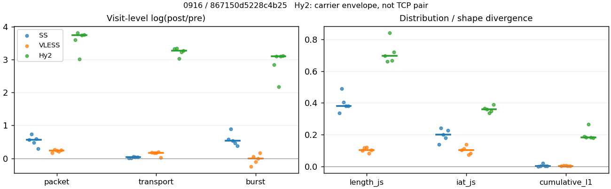
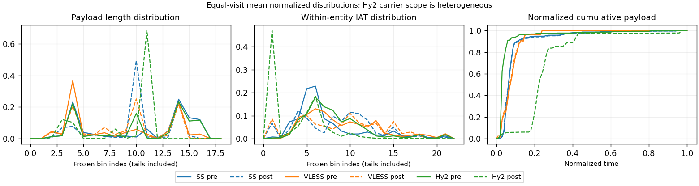

# 0916 · 条目 017 · github.com

目标：https://github.com/pallets/flask

活动标签：github.com::repository_view。选定访问 15 次。

[返回总索引](../../README.md) · [统计口径](../../methods.md)

## 覆盖与资格（每次访问均保留）

| 部署 | 重复 | 主请求路由 | 活动状态 | 代理比较 | DIRECT pre | 请求 proxy/direct/unresolved | 错误 |
| --- | --- | --- | --- | --- | --- | --- | --- |
| Hy2 | 1 | proxy | passed | 1 | 0 | 158/0/0 | [] |
| Hy2 | 2 | proxy | passed | 1 | 0 | 173/0/0 | [] |
| Hy2 | 3 | proxy | passed | 1 | 0 | 186/0/0 | [] |
| Hy2 | 4 | proxy | passed | 1 | 0 | 158/0/0 | [] |
| Hy2 | 5 | proxy | passed | 1 | 0 | 133/0/0 | [] |
| SS | 1 | proxy | passed | 1 | 0 | 186/0/0 | [] |
| SS | 2 | proxy | passed | 1 | 0 | 188/0/0 | [] |
| SS | 3 | proxy | passed | 1 | 0 | 163/0/1 | [] |
| SS | 4 | proxy | passed | 1 | 0 | 186/0/0 | [] |
| SS | 5 | proxy | passed | 1 | 0 | 186/0/0 | [] |
| VLESS | 1 | proxy | passed | 1 | 0 | 185/0/0 | [] |
| VLESS | 2 | proxy | passed | 1 | 0 | 185/0/0 | [] |
| VLESS | 3 | proxy | passed | 1 | 0 | 185/0/0 | [] |
| VLESS | 4 | proxy | passed | 1 | 0 | 185/0/0 | [] |
| VLESS | 5 | proxy | passed | 1 | 0 | 188/0/0 | [] |

主请求非 proxy 的统计仅解释为已索引的辅助代理连接或 DIRECT 观测，不代表目标业务经代理传输。播放确认与配对资格是两道不同的门。

图中散点为单次访问，短线为重复中位数；Hy2 是共享载体包络，不能与 TCP 配对作等范围因果对比。

形态图先逐访问归一化，再对访问等权平均；实线 pre，虚线 post。分箱序号及边界见 methods，不将分箱索引误解为长度或时间。

## 每次访问的关键观测

### SS

范围：`exclusive_page`。每格 pre → post；空值为不可观测/不适用。

| 重复 | 包数 | 载荷字节 | burst | TCP FR | IAT中位µs | length JS | IAT JS |
| --- | --- | --- | --- | --- | --- | --- | --- |
| 1 | 1324 → 2319 | 2.3261e+06 → 2.3311e+06 | 815 → 1459 | 110 → 114 | 38.818 → 158.99 | 0.33626 | 0.1394 |
| 2 | 1358 → 2814 | 2.3282e+06 → 2.3521e+06 | 972 → 2362 | 106 → 113 | 44.856 → 1027.8 | 0.4901 | 0.24227 |
| 3 | 1682 → 2713 | 2.0964e+06 → 2.2177e+06 | 1059 → 1805 | 96 → 113 | 20.77 → 206.92 | 0.40398 | 0.19966 |
| 4 | 1469 → 2659 | 2.3324e+06 → 2.4079e+06 | 1078 → 1723 | 110 → 124 | 31.666 → 142.38 | 0.38163 | 0.17842 |
| 5 | 1832 → 2450 | 2.3411e+06 → 2.4184e+06 | 1154 → 1675 | 102 → 104 | 21.907 → 204.81 | 0.38179 | 0.22547 |

完整标量统计：中位数 [min,max]；Δ 为重复内逐访问变换的中位数，MAD 未缩放。n 为可用变换数；DIRECT-only 的 nΔ=0 不代表 pre 不可用。

| scope | 特征 | pre | post | Δ | IQRΔ | MADΔ | nΔ |
| --- | --- | --- | --- | --- | --- | --- | --- |
| exclusive_page | active_span_sum_s_1000ms | 18.41 [15.745, 26.457] | 21.179 [18.041, 34.752] | 0.13613 | 0.09638 | 0.059175 | 5 |
| exclusive_page | active_span_sum_s_100ms | 3.662 [2.9028, 5.789] | 7.4137 [6.6474, 10.422] | 0.70533 | 0.25693 | 0.13957 | 5 |
| exclusive_page | active_span_sum_s_500ms | 14.578 [13.627, 19.119] | 18.954 [15.645, 30.177] | 0.30338 | 0.16604 | 0.1083 | 5 |
| exclusive_page | burst_bytes_iqr | 2896 [2658.5, 2896] | 1972.5 [1428, 2856] | -0.38403 | 0.65395 | 0.32303 | 5 |
| exclusive_page | burst_bytes_mad | 39 [31, 64] | 40 [34, 40] | -0.083881 | 0.22957 | 0.17625 | 5 |
| exclusive_page | burst_bytes_max | 29730 [24576, 51589] | 18564 [10427, 29988] | -0.7333 | 0.42267 | 0.21468 | 5 |
| exclusive_page | burst_bytes_mean | 2163.6 [1979.6, 2854.1] | 1397.5 [995.82, 1597.7] | -0.47697 | 0.14308 | 0.1032 | 5 |
| exclusive_page | burst_bytes_median | 39 [31, 64] | 40 [34, 40] | -0.083881 | 0.22957 | 0.17625 | 5 |
| exclusive_page | burst_bytes_min | 0 [0, 0] | 0 [0, 0] | — | — | — | 0 |
| exclusive_page | burst_bytes_p95 | 11584 [8899.6, 20480] | 5712 [2856, 7140] | -0.70706 | 0.485 | 0.26362 | 5 |
| exclusive_page | burst_bytes_q25 | 0 [0, 0] | 0 [0, 0] | — | — | — | 0 |
| exclusive_page | burst_bytes_q75 | 2896 [2658.5, 2896] | 1972.5 [1428, 2856] | -0.38403 | 0.65395 | 0.32303 | 5 |
| exclusive_page | burst_bytes_std | 4541.7 [4345.5, 5922.7] | 2189.1 [1232.6, 2794.3] | -0.7512 | 0.1272 | 0.079404 | 5 |
| exclusive_page | burst_count | 1059 [815, 1154] | 1723 [1459, 2362] | 0.53324 | 0.11336 | 0.064276 | 5 |
| exclusive_page | burst_duration_ms_iqr | 0.020219 [0, 0.055614] | 0.0026815 [0, 0.010555] | -1.6619 | 1.0931 | 0.13073 | 3 |
| exclusive_page | burst_duration_ms_mad | 0 [0, 0] | 0 [0, 0] | — | — | — | 0 |
| exclusive_page | burst_duration_ms_max | 15001 [15001, 15001] | 30107 [15425, 45897] | 0.69664 | 0.17037 | 0.16088 | 5 |
| exclusive_page | burst_duration_ms_mean | 85.789 [59.878, 151.26] | 85.06 [29.986, 140.84] | -0.13586 | 0.24387 | 0.12733 | 5 |
| exclusive_page | burst_duration_ms_median | 0 [0, 0] | 0 [0, 0] | — | — | — | 0 |
| exclusive_page | burst_duration_ms_min | 0 [0, 0] | 0 [0, 0] | — | — | — | 0 |
| exclusive_page | burst_duration_ms_p95 | 89.567 [55.303, 215.14] | 3.1929 [0.73339, 18.754] | -3.2205 | 0.57999 | 0.46641 | 5 |
| exclusive_page | burst_duration_ms_q25 | 0 [0, 0] | 0 [0, 0] | — | — | — | 0 |
| exclusive_page | burst_duration_ms_q75 | 0.020219 [0, 0.055614] | 0.0026815 [0, 0.010555] | -1.6619 | 1.0931 | 0.13073 | 3 |
| exclusive_page | burst_duration_ms_std | 802.8 [710.35, 1322.2] | 1000.4 [574.79, 1849.3] | 0.22 | 0.1925 | 0.1495 | 5 |
| exclusive_page | burst_packets_iqr | 1 [0, 1] | 1 [0, 1] | 0 | 0 | 0 | 3 |
| exclusive_page | burst_packets_mad | 0 [0, 0] | 0 [0, 0] | — | — | — | 0 |
| exclusive_page | burst_packets_max | 11 [9, 12] | 12 [11, 13] | 0.087011 | 0.26236 | 0.087011 | 5 |
| exclusive_page | burst_packets_mean | 1.5875 [1.3627, 1.6245] | 1.503 [1.1914, 1.5894] | -0.055164 | 0.060059 | 0.033324 | 5 |
| exclusive_page | burst_packets_median | 1 [1, 1] | 1 [1, 1] | 0 | 0 | 0 | 5 |
| exclusive_page | burst_packets_min | 1 [1, 1] | 1 [1, 1] | 0 | 0 | 0 | 5 |
| exclusive_page | burst_packets_p95 | 3 [3, 4.35] | 3 [2, 4] | -0.28768 | 0.37156 | 0.11778 | 5 |
| exclusive_page | burst_packets_q25 | 1 [1, 1] | 1 [1, 1] | 0 | 0 | 0 | 5 |
| exclusive_page | burst_packets_q75 | 2 [1, 2] | 2 [1, 2] | 0 | 0 | 0 | 5 |
| exclusive_page | burst_packets_std | 1.1421 [0.84663, 1.48] | 0.98161 [0.64659, 1.1752] | -0.26955 | 0.38908 | 0.15791 | 5 |
| exclusive_page | connection_span_concurrency_max | 7 [6, 8] | 6 [6, 7] | 0 | 0.13353 | 0 | 5 |
| exclusive_page | cumulative_l1 | — | — | 0.0014985 | 0.0024466 | 0.00080417 | 5 |
| exclusive_page | cumulative_max | — | — | 0.052994 | 0.063432 | 0.038654 | 5 |
| exclusive_page | direction_entropy | 0.88889 [0.7761, 0.91242] | 0.56793 [0.51637, 0.80755] | -0.32097 | 0.10556 | 0.054366 | 5 |
| exclusive_page | down_burst_count | 523 [402, 572] | 857 [724, 1176] | 0.53836 | 0.1153 | 0.065317 | 5 |
| exclusive_page | down_ip_bytes | 2.2768e+06 [1.8149e+06, 2.2965e+06] | 2.3027e+06 [1.8633e+06, 2.3979e+06] | 0.026338 | 0.020037 | 0.011946 | 5 |
| exclusive_page | down_packets | 792 [748, 1101] | 1428 [1360, 1546] | 0.54701 | 0.24217 | 0.12185 | 5 |
| exclusive_page | down_transport_bytes | 2.2341e+06 [1.7634e+06, 2.2552e+06] | 2.2303e+06 [1.7851e+06, 2.3168e+06] | 0.012233 | 0.028151 | 0.014707 | 5 |
| exclusive_page | duration_s | 66.106 [63.697, 68.629] | 66.385 [63.948, 68.627] | -8.2955e-06 | 0.0039368 | 1.372e-05 | 5 |
| exclusive_page | entity_count | 10 [10, 13] | 10 [10, 13] | 0 | 0 | 0 | 5 |
| exclusive_page | fr_runs | 106 [96, 110] | 113 [104, 124] | 0.063949 | 0.084083 | 0.044531 | 5 |
| exclusive_page | fr_runs_per_packet | 0.1353 [0.091562, 0.14115] | 0.075737 [0.070493, 0.081603] | -0.057019 | 0.033549 | 0.0083893 | 5 |
| exclusive_page | fr_switches | 96 [83, 100] | 103 [94, 114] | 0.070381 | 0.091419 | 0.048875 | 5 |
| exclusive_page | fr_switches_per_possible_transition | 0.12453 [0.082834, 0.12955] | 0.069501 [0.062893, 0.074315] | -0.052106 | 0.03283 | 0.0079479 | 5 |
| exclusive_page | full_retransmission_fraction | 0.0045317 [0.0011891, 0.0074881] | 0.016327 [0.0034498, 0.031331] | 0.010584 | 0.0088915 | 0.0086296 | 5 |
| exclusive_page | full_retransmission_packets | 6 [2, 11] | 40 [8, 85] | 1.8648 | 1.1939 | 0.62012 | 5 |
| exclusive_page | iat_count | 1459 [1313, 1822] | 2649 [2308, 2804] | 0.56407 | 0.1154 | 0.08304 | 5 |
| exclusive_page | iat_js | — | — | 0.19966 | 0.04705 | 0.025813 | 5 |
| exclusive_page | iat_ks | — | — | 0.36156 | 0.10748 | 0.016007 | 5 |
| exclusive_page | iat_median_us | 31.666 [20.77, 44.856] | 204.81 [142.38, 1027.8] | 2.2353 | 0.79556 | 0.73205 | 5 |
| exclusive_page | iat_us_iqr | 123.13 [71.244, 623.41] | 1008.4 [892.47, 3118.2] | 1.9807 | 1.0319 | 0.56795 | 5 |
| exclusive_page | iat_us_mad | 25.497 [14.964, 36.014] | 204.42 [142.2, 1017.8] | 2.6101 | 0.89584 | 0.73141 | 5 |
| exclusive_page | iat_us_max | 1.5001e+07 [1.5001e+07, 1.5001e+07] | 1.5361e+07 [1.5359e+07, 1.5459e+07] | 0.023714 | 0.0041631 | 0.00014935 | 5 |
| exclusive_page | iat_us_mean | 1.7941e+05 [1.2578e+05, 2.584e+05] | 90420 [71552, 1.5522e+05] | -0.56412 | 0.24088 | 0.15585 | 5 |
| exclusive_page | iat_us_median | 31.666 [20.77, 44.856] | 204.81 [142.38, 1027.8] | 2.2353 | 0.79556 | 0.73205 | 5 |
| exclusive_page | iat_us_min | 0.044 [0.011, 0.129] | 0.035 [0.031, 0.037] | -0.3502 | 1.2467 | 0.7084 | 5 |
| exclusive_page | iat_us_p95 | 1.1499e+05 [58362, 1.5713e+05] | 36631 [33655, 62114] | -1.0227 | 0.20455 | 0.11001 | 5 |
| exclusive_page | iat_us_q25 | 12.242 [11.886, 16.923] | 10.797 [8.097, 22.929] | -0.21162 | 0.24641 | 0.1502 | 5 |
| exclusive_page | iat_us_q75 | 135.37 [83.362, 638.83] | 1020.2 [900.57, 3141.1] | 1.895 | 0.91005 | 0.53724 | 5 |
| exclusive_page | iat_us_std | 1.4403e+06 [1.2206e+06, 1.8389e+06] | 1.0086e+06 [9.4057e+05, 1.4404e+06] | -0.26061 | 0.10319 | 0.078206 | 5 |
| exclusive_page | iat_wasserstein_log1p_us | — | — | 1.4016 | 0.42982 | 0.20538 | 5 |
| exclusive_page | idle_gap_count_1000ms | 26 [17, 31] | 26 [14, 29] | -0.066691 | 0.18232 | 0.10591 | 5 |
| exclusive_page | idle_gap_count_100ms | 73 [61, 91] | 75 [53, 116] | 0.027029 | 0.054808 | 0.02778 | 5 |
| exclusive_page | idle_gap_count_500ms | 36 [20, 37] | 31 [17, 32] | -0.14953 | 0.017337 | 0.012987 | 5 |
| exclusive_page | idle_gap_sum_s_1000ms | 220.2 [149.41, 390.34] | 219.48 [147.1, 358.86] | -0.036679 | 0.068556 | 0.033385 | 5 |
| exclusive_page | idle_gap_sum_s_100ms | 240.76 [161.49, 404.76] | 234.22 [157.73, 372.09] | -0.027513 | 0.060591 | 0.01778 | 5 |
| exclusive_page | idle_gap_sum_s_500ms | 226.82 [151.52, 394.18] | 222.62 [149.5, 361.02] | -0.048285 | 0.069205 | 0.034813 | 5 |
| exclusive_page | ip_bytes | 2.399e+06 [2.1841e+06, 2.4366e+06] | 2.5207e+06 [2.3757e+06, 2.566e+06] | 0.051194 | 0.013691 | 0.011956 | 5 |
| exclusive_page | length_iqr | 4004 [2648, 4958.5] | 1428 [325.75, 1428] | -1.031 | 0.21815 | 0.21381 | 5 |
| exclusive_page | length_js | — | — | 0.38179 | 0.022349 | 0.022194 | 5 |
| exclusive_page | length_ks | — | — | 0.45542 | 0.027526 | 0.019945 | 5 |
| exclusive_page | length_mad | 1898 [1119, 2664] | 40 [0, 943] | -3.2515 | 1.1464 | 0.079775 | 3 |
| exclusive_page | length_max | 8948 [8948, 8948] | 8568 [2856, 11424] | -0.043396 | 0.15415 | 0.15415 | 5 |
| exclusive_page | length_mean | 2868.8 [2065.4, 3100.2] | 1576.5 [1383.5, 1674.8] | -0.5679 | 0.23439 | 0.10835 | 5 |
| exclusive_page | length_median | 1976 [1696, 2872] | 1428 [1428, 1428] | -0.3248 | 0.41387 | 0.1528 | 5 |
| exclusive_page | length_min | 31 [12, 31] | 12 [10, 20] | -0.94908 | 0.76676 | 0.18232 | 5 |
| exclusive_page | length_p95 | 8192 [4096, 8192] | 2856 [2856, 2856] | -1.0537 | 0.34668 | 0 | 5 |
| exclusive_page | length_q25 | 92 [88, 248] | 1428 [479.5, 1428] | 2.5583 | 0.99164 | 0.22839 | 5 |
| exclusive_page | length_q75 | 4096 [2896, 5046.5] | 2856 [1428, 2856] | -0.56927 | 0.34647 | 0.20868 | 5 |
| exclusive_page | length_std | 2885 [1820.7, 3153] | 1040.8 [883.92, 1261.2] | -0.84101 | 0.28629 | 0.19158 | 5 |
| exclusive_page | length_wasserstein_bytes | — | — | 1654.7 | 795.94 | 368.94 | 5 |
| exclusive_page | nonempty_entity_count | 10 [10, 13] | 10 [10, 13] | 0 | 0 | 0 | 5 |
| exclusive_page | nonempty_packets | 813 [751, 1114] | 1492 [1397, 1603] | 0.57005 | 0.20999 | 0.11306 | 5 |
| exclusive_page | offload_suspect_fraction | 0.33294 [0.30044, 0.34366] | 0.15532 [0.13085, 0.19232] | -0.15794 | 0.012388 | 0.0066087 | 5 |
| exclusive_page | packet_count | 1469 [1324, 1832] | 2659 [2319, 2814] | 0.56048 | 0.1153 | 0.082407 | 5 |
| exclusive_page | rtt_median_ms | 0.036908 [0.032214, 0.080206] | 32.49 [28.097, 37.179] | 6.771 | 0.51317 | 0.218 | 5 |
| exclusive_page | rtt_sample_count | 606 [497, 648] | 413 [335, 472] | -0.31562 | 0.33009 | 0.13401 | 5 |
| exclusive_page | tcp_ack_count | 1456 [1313, 1820] | 2648 [2307, 2801] | 0.56363 | 0.11745 | 0.082977 | 5 |
| exclusive_page | tcp_fin_count | 20 [20, 26] | 22 [18, 33] | 0 | 0.18232 | 0.10536 | 5 |
| exclusive_page | tcp_packet_count | 1469 [1324, 1832] | 2659 [2319, 2814] | 0.56048 | 0.1153 | 0.082407 | 5 |
| exclusive_page | tcp_rst_count | 0 [0, 3] | 0 [0, 1] | -0.89588 | 0.20273 | 0.20273 | 2 |
| exclusive_page | tcp_syn_count | 20 [20, 26] | 23 [20, 27] | 0.03774 | 0.044452 | 0.03774 | 5 |
| exclusive_page | tcp_window_raw_median | 65535 [65418, 65535] | 155 [140, 168] | -6.0469 | 0.013514 | 0.011728 | 5 |
| exclusive_page | transition_entropy | 0.51871 [0.37635, 0.53555] | 0.31467 [0.29667, 0.32457] | -0.1991 | 0.11993 | 0.021776 | 5 |
| exclusive_page | transition_n_mm | 508 [453, 809] | 1210 [1150, 1340] | 0.84845 | 0.51684 | 0.15124 | 5 |
| exclusive_page | transition_n_mp | 44 [35, 46] | 47 [43, 53] | 0.087011 | 0.098165 | 0.054639 | 5 |
| exclusive_page | transition_n_pm | 52 [48, 54] | 56 [51, 61] | 0.056089 | 0.085522 | 0.036287 | 5 |
| exclusive_page | transition_n_pp | 192 [186, 203] | 130 [120, 340] | -0.36593 | 0.18539 | 0.10565 | 5 |
| exclusive_page | transition_p_mm | 0.91697 [0.91147, 0.95431] | 0.96247 [0.96087, 0.96568] | 0.044354 | 0.029949 | 0.006648 | 5 |
| exclusive_page | transition_p_mp | 0.083032 [0.045692, 0.088531] | 0.037529 [0.034318, 0.039134] | -0.044354 | 0.029949 | 0.006648 | 5 |
| exclusive_page | transition_p_pm | 0.21311 [0.19763, 0.225] | 0.28177 [0.14141, 0.33702] | 0.077703 | 0.026318 | 0.019881 | 5 |
| exclusive_page | transition_p_pp | 0.78689 [0.775, 0.80237] | 0.71823 [0.66298, 0.85859] | -0.077703 | 0.026318 | 0.019881 | 5 |
| exclusive_page | transport_bytes | 2.3282e+06 [2.0964e+06, 2.3411e+06] | 2.3521e+06 [2.2177e+06, 2.4184e+06] | 0.031867 | 0.022274 | 0.021653 | 5 |
| exclusive_page | up_burst_count | 536 [413, 582] | 866 [735, 1186] | 0.52821 | 0.11149 | 0.063275 | 5 |
| exclusive_page | up_byte_fraction | 0.041844 [0.033077, 0.15885] | 0.049424 [0.037829, 0.19508] | 0.0047519 | 0.0064388 | 0.0010202 | 5 |
| exclusive_page | up_ip_bytes | 1.2926e+05 [1.1253e+05, 3.6916e+05] | 1.9289e+05 [1.6579e+05, 5.124e+05] | 0.33705 | 0.074008 | 0.052826 | 5 |
| exclusive_page | up_packets | 677 [537, 731] | 1113 [959, 1386] | 0.57455 | 0.08275 | 0.077409 | 5 |
| exclusive_page | up_transport_bytes | 97421 [77148, 3.33e+05] | 1.1953e+05 [91088, 4.3264e+05] | 0.1661 | 0.13042 | 0.055501 | 5 |
| exclusive_page | zero_iat_count | 0 [0, 0] | 0 [0, 0] | — | — | — | 0 |
| exclusive_page | zero_iat_fraction | 0 [0, 0] | 0 [0, 0] | 0 | 0 | 0 | 5 |

### VLESS

范围：`exclusive_page`。每格 pre → post；空值为不可观测/不适用。

| 重复 | 包数 | 载荷字节 | burst | TCP FR | IAT中位µs | length JS | IAT JS |
| --- | --- | --- | --- | --- | --- | --- | --- |
| 1 | 611 → 721 | 3.2285e+05 → 3.867e+05 | 464 → 364 | 58 → 74 | 154.29 → 486.26 | 0.099079 | 0.10193 |
| 2 | 489 → 636 | 3.1251e+05 → 3.6816e+05 | 341 → 359 | 49 → 64 | 150.6 → 540.69 | 0.11825 | 0.11267 |
| 3 | 534 → 672 | 3.1344e+05 → 3.7176e+05 | 391 → 351 | 49 → 64 | 122.79 → 391.43 | 0.12174 | 0.13731 |
| 4 | 510 → 624 | 2.7895e+05 → 3.3675e+05 | 379 → 379 | 49 → 64 | 174.16 → 548.32 | 0.082174 | 0.073578 |
| 5 | 1541 → 1979 | 2.1563e+06 → 2.2034e+06 | 1121 → 1323 | 68 → 84 | 66.59 → 271.69 | 0.10276 | 0.082037 |

完整标量统计：中位数 [min,max]；Δ 为重复内逐访问变换的中位数，MAD 未缩放。n 为可用变换数；DIRECT-only 的 nΔ=0 不代表 pre 不可用。

| scope | 特征 | pre | post | Δ | IQRΔ | MADΔ | nΔ |
| --- | --- | --- | --- | --- | --- | --- | --- |
| exclusive_page | active_span_sum_s_1000ms | 11.578 [11.061, 14.708] | 11.422 [11.203, 13.699] | -0.013622 | 0.030293 | 0.026377 | 5 |
| exclusive_page | active_span_sum_s_100ms | 1.5473 [1.28, 2.6806] | 4.2741 [4.105, 5.8431] | 1.0234 | 0.13999 | 0.092244 | 5 |
| exclusive_page | active_span_sum_s_500ms | 6.1654 [5.5589, 7.648] | 10.571 [10.157, 12.579] | 0.53915 | 0.091675 | 0.04153 | 5 |
| exclusive_page | burst_bytes_iqr | 1163 [628, 2824] | 1967 [1544.5, 2824] | 0.46787 | 0.24738 | 0.18417 | 5 |
| exclusive_page | burst_bytes_mad | 0 [0, 31] | 31 [31, 48] | 0.43721 | — | — | 1 |
| exclusive_page | burst_bytes_max | 33399 [22915, 39551] | 12801 [11638, 21180] | -0.84603 | 0.41762 | 0.20822 | 5 |
| exclusive_page | burst_bytes_mean | 801.64 [695.8, 1923.5] | 1059.1 [888.51, 1665.5] | 0.1883 | 0.16612 | 0.090266 | 5 |
| exclusive_page | burst_bytes_median | 0 [0, 31] | 31 [31, 48] | 0.43721 | — | — | 1 |
| exclusive_page | burst_bytes_min | 0 [0, 0] | 0 [0, 0] | — | — | — | 0 |
| exclusive_page | burst_bytes_p95 | 2896 [2896, 9884] | 2896 [2896, 5648] | 0 | 0 | 0 | 5 |
| exclusive_page | burst_bytes_q25 | 0 [0, 0] | 0 [0, 0] | — | — | — | 0 |
| exclusive_page | burst_bytes_q75 | 1163 [628, 2824] | 1967 [1544.5, 2824] | 0.46787 | 0.24738 | 0.18417 | 5 |
| exclusive_page | burst_bytes_std | 2091.7 [1913.5, 4245] | 1682.2 [1403.6, 2373.4] | -0.28874 | 0.14389 | 0.073013 | 5 |
| exclusive_page | burst_count | 391 [341, 1121] | 364 [351, 1323] | 0 | 0.15936 | 0.10792 | 5 |
| exclusive_page | burst_duration_ms_iqr | 0.13517 [0.014725, 1.6568] | 0.98806 [0.26266, 8.7323] | 2.8813 | 2.304 | 1.6353 | 5 |
| exclusive_page | burst_duration_ms_mad | 0 [0, 0] | 0 [0, 0.000275] | — | — | — | 0 |
| exclusive_page | burst_duration_ms_max | 15001 [15000, 15001] | 15333 [15199, 15449] | 0.021883 | 0.011408 | 0.0061454 | 5 |
| exclusive_page | burst_duration_ms_mean | 81.779 [33.043, 112] | 259.13 [69.956, 288.55] | 1.0434 | 0.22641 | 0.20449 | 5 |
| exclusive_page | burst_duration_ms_median | 0 [0, 0] | 0 [0, 0.000275] | — | — | — | 0 |
| exclusive_page | burst_duration_ms_min | 0 [0, 0] | 0 [0, 0] | — | — | — | 0 |
| exclusive_page | burst_duration_ms_p95 | 203.09 [8.1014, 247.78] | 213.45 [9.8182, 236.16] | 0.12425 | 0.24836 | 0.067949 | 5 |
| exclusive_page | burst_duration_ms_q25 | 0 [0, 0] | 0 [0, 0] | — | — | — | 0 |
| exclusive_page | burst_duration_ms_q75 | 0.13517 [0.014725, 1.6568] | 0.98806 [0.26266, 8.7323] | 2.8813 | 2.304 | 1.6353 | 5 |
| exclusive_page | burst_duration_ms_std | 814.74 [489.47, 900.41] | 1788.4 [937.95, 1929.9] | 0.75515 | 0.088392 | 0.068915 | 5 |
| exclusive_page | burst_packets_iqr | 1 [1, 1] | 1 [1, 1] | 0 | 0 | 0 | 5 |
| exclusive_page | burst_packets_mad | 0 [0, 0] | 0 [0, 1] | — | — | — | 0 |
| exclusive_page | burst_packets_max | 5 [4, 11] | 11 [11, 15] | 0.78846 | 0.40547 | 0.22314 | 5 |
| exclusive_page | burst_packets_mean | 1.3657 [1.3168, 1.434] | 1.7716 [1.4958, 1.9808] | 0.2114 | 0.13604 | 0.12639 | 5 |
| exclusive_page | burst_packets_median | 1 [1, 1] | 1 [1, 2] | 0 | 0 | 0 | 5 |
| exclusive_page | burst_packets_min | 1 [1, 1] | 1 [1, 1] | 0 | 0 | 0 | 5 |
| exclusive_page | burst_packets_p95 | 2 [2, 3] | 5 [3, 5] | 0.91629 | 0.19845 | 0 | 5 |
| exclusive_page | burst_packets_q25 | 1 [1, 1] | 1 [1, 1] | 0 | 0 | 0 | 5 |
| exclusive_page | burst_packets_q75 | 2 [2, 2] | 2 [2, 2] | 0 | 0 | 0 | 5 |
| exclusive_page | burst_packets_std | 0.62632 [0.59129, 0.87621] | 1.5489 [0.9999, 1.5749] | 0.90544 | 0.25124 | 0.070083 | 5 |
| exclusive_page | connection_span_concurrency_max | 4 [4, 6] | 4 [4, 5] | 0 | 0 | 0 | 5 |
| exclusive_page | cumulative_l1 | — | — | 0.0027119 | 0.0028529 | 0.0012131 | 5 |
| exclusive_page | cumulative_max | — | — | 0.061158 | 0.0096064 | 0.0048388 | 5 |
| exclusive_page | direction_entropy | 0.86441 [0.77108, 0.88654] | 0.86666 [0.51845, 0.93296] | 0.0022518 | 0.036273 | 0.029367 | 5 |
| exclusive_page | down_burst_count | 192 [167, 557] | 178 [172, 658] | 0 | 0.16249 | 0.11 | 5 |
| exclusive_page | down_ip_bytes | 2.439e+05 [2.3414e+05, 2.0997e+06] | 2.9296e+05 [2.8105e+05, 2.1493e+06] | 0.18328 | 0.00599 | 0.0018209 | 5 |
| exclusive_page | down_packets | 289 [268, 876] | 361 [329, 1159] | 0.2125 | 0.01738 | 0.0099561 | 5 |
| exclusive_page | down_transport_bytes | 2.2881e+05 [2.2015e+05, 2.0541e+06] | 2.7413e+05 [2.6384e+05, 2.0889e+06] | 0.18069 | 0.0056078 | 0.0029683 | 5 |
| exclusive_page | duration_s | 65.634 [64.476, 66.149] | 65.594 [64.439, 66.129] | -0.00051265 | 0.00012531 | 6.5843e-05 | 5 |
| exclusive_page | entity_count | 7 [7, 8] | 7 [7, 8] | 0 | 0 | 0 | 5 |
| exclusive_page | fr_runs | 49 [49, 68] | 64 [64, 84] | 0.26706 | 0.023441 | 0 | 5 |
| exclusive_page | fr_runs_per_packet | 0.19216 [0.075724, 0.19795] | 0.19753 [0.071795, 0.20382] | 0.0015087 | 0.0036749 | 0.0023463 | 5 |
| exclusive_page | fr_switches | 42 [42, 61] | 57 [57, 77] | 0.30538 | 0.02775 | 0 | 5 |
| exclusive_page | fr_switches_per_possible_transition | 0.16935 [0.068462, 0.17544] | 0.17981 [0.066208, 0.18567] | 0.0063796 | 0.0036867 | 0.0026994 | 5 |
| exclusive_page | full_retransmission_fraction | 0 [0, 0.0032446] | 0 [0, 0] | 0 | 0.0016367 | 0 | 5 |
| exclusive_page | full_retransmission_packets | 0 [0, 5] | 0 [0, 0] | — | — | — | 0 |
| exclusive_page | iat_count | 527 [482, 1534] | 665 [617, 1972] | 0.23259 | 0.046891 | 0.028308 | 5 |
| exclusive_page | iat_js | — | — | 0.10193 | 0.030631 | 0.019894 | 5 |
| exclusive_page | iat_ks | — | — | 0.11143 | 0.036889 | 0.015002 | 5 |
| exclusive_page | iat_median_us | 150.6 [66.59, 174.16] | 486.26 [271.69, 548.32] | 1.1593 | 0.13031 | 0.012432 | 5 |
| exclusive_page | iat_us_iqr | 3170.1 [650.59, 3994.5] | 8699.1 [969.64, 8769.6] | 0.79968 | 0.15963 | 0.14632 | 5 |
| exclusive_page | iat_us_mad | 143.17 [58.934, 167.56] | 485.96 [267.77, 541.43] | 1.2218 | 0.12603 | 0.048913 | 5 |
| exclusive_page | iat_us_max | 1.5001e+07 [1.5001e+07, 1.5001e+07] | 1.5429e+07 [1.5333e+07, 1.5449e+07] | 0.028141 | 0.0018296 | 0.0010634 | 5 |
| exclusive_page | iat_us_mean | 3.7861e+05 [1.2399e+05, 4.1631e+05] | 3.0095e+05 [96658, 3.5057e+05] | -0.23355 | 0.04384 | 0.028375 | 5 |
| exclusive_page | iat_us_median | 150.6 [66.59, 174.16] | 486.26 [271.69, 548.32] | 1.1593 | 0.13031 | 0.012432 | 5 |
| exclusive_page | iat_us_min | 0.71 [0.067, 1.743] | 0.036 [0.035, 0.037] | -2.96 | 0.44925 | 0.3993 | 5 |
| exclusive_page | iat_us_p95 | 3.0384e+05 [19600, 5.3913e+05] | 1.5479e+05 [41358, 1.5629e+05] | -0.6768 | 0.56213 | 0.33825 | 5 |
| exclusive_page | iat_us_q25 | 29.523 [18.378, 32.136] | 14.977 [10.716, 20.621] | -0.44368 | 0.31377 | 0.17342 | 5 |
| exclusive_page | iat_us_q75 | 3202.2 [668.97, 4024] | 8714.1 [983.67, 8790.1] | 0.79388 | 0.1571 | 0.14456 | 5 |
| exclusive_page | iat_us_std | 2.2153e+06 [1.2516e+06, 2.3288e+06] | 1.9722e+06 [1.1212e+06, 2.157e+06] | -0.11007 | 0.011787 | 0.0061603 | 5 |
| exclusive_page | iat_wasserstein_log1p_us | — | — | 0.77644 | 0.1265 | 0.074173 | 5 |
| exclusive_page | idle_gap_count_1000ms | 16 [14, 18] | 15 [14, 18] | 0 | 0.064539 | 0 | 5 |
| exclusive_page | idle_gap_count_100ms | 44 [41, 55] | 48 [47, 57] | 0.087011 | 0.014085 | 0.014085 | 5 |
| exclusive_page | idle_gap_count_500ms | 24 [22, 29] | 17 [15, 19] | -0.38299 | 0.022757 | 0.020087 | 5 |
| exclusive_page | idle_gap_sum_s_1000ms | 177.88 [177.21, 236.33] | 177.88 [176.91, 236.98] | -1.926e-05 | 0.0017677 | 0.0016464 | 5 |
| exclusive_page | idle_gap_sum_s_100ms | 188.18 [187.52, 249.26] | 185.09 [184.61, 245.01] | -0.016416 | 0.0017786 | 0.00077757 | 5 |
| exclusive_page | idle_gap_sum_s_500ms | 183.86 [182.55, 243.72] | 179.14 [178.03, 237.84] | -0.025402 | 0.00094149 | 0.00061718 | 5 |
| exclusive_page | ip_bytes | 3.4119e+05 [3.0544e+05, 2.2364e+06] | 4.072e+05 [3.6963e+05, 2.3125e+06] | 0.17687 | 0.007876 | 0.004227 | 5 |
| exclusive_page | length_iqr | 1845.5 [1763, 2752] | 1340 [1340, 1412] | -0.32008 | 0.35295 | 0.045733 | 5 |
| exclusive_page | length_js | — | — | 0.10276 | 0.019166 | 0.015487 | 5 |
| exclusive_page | length_ks | — | — | 0.17269 | 0.014683 | 0.0077392 | 5 |
| exclusive_page | length_mad | 254 [134, 1340] | 887.5 [691, 1340] | 1.1679 | 0.73396 | 0.65077 | 5 |
| exclusive_page | length_max | 8948 [8948, 8948] | 2824 [2824, 9884] | -1.1533 | 0 | 0 | 5 |
| exclusive_page | length_mean | 1165.2 [1093.9, 2401.2] | 1072.4 [1042.3, 1883.3] | -0.083468 | 0.039871 | 0.027905 | 5 |
| exclusive_page | length_median | 289 [158, 1412] | 1200 [963, 1412] | 1.2036 | 0.34692 | 0.21837 | 5 |
| exclusive_page | length_min | 23 [21, 24] | 15 [7, 24] | -0.47 | 0.46864 | 0.37903 | 5 |
| exclusive_page | length_p95 | 2824 [2824, 8920] | 2824 [2824, 2824] | 0 | 0.010147 | 0 | 5 |
| exclusive_page | length_q25 | 72 [72, 84] | 72 [72, 1412] | 0 | 0 | 0 | 5 |
| exclusive_page | length_q75 | 1917.5 [1835, 2824] | 1412 [1412, 2824] | -0.29632 | 0.043978 | 0.034283 | 5 |
| exclusive_page | length_std | 1580.9 [1423.1, 2676.4] | 998.86 [895.08, 1272.9] | -0.50744 | 0.14326 | 0.081889 | 5 |
| exclusive_page | length_wasserstein_bytes | — | — | 450.12 | 109.4 | 84.769 | 5 |
| exclusive_page | nonempty_entity_count | 7 [7, 8] | 7 [7, 8] | 0 | 0 | 0 | 5 |
| exclusive_page | nonempty_packets | 269 [253, 898] | 351 [314, 1170] | 0.24735 | 0.02856 | 0.017235 | 5 |
| exclusive_page | offload_suspect_fraction | 0.14706 [0.14232, 0.27125] | 0.11058 [0.078869, 0.27034] | -0.048076 | 0.014228 | 0.011594 | 5 |
| exclusive_page | packet_count | 534 [489, 1541] | 672 [624, 1979] | 0.22986 | 0.04842 | 0.028123 | 5 |
| exclusive_page | rtt_median_ms | 0.090068 [0.05854, 0.1506] | 8.3726 [0.66373, 9.3196] | 4.0181 | 1.4267 | 0.62623 | 5 |
| exclusive_page | rtt_sample_count | 217 [188, 599] | 271 [262, 573] | 0.22222 | 0.11519 | 0.087185 | 5 |
| exclusive_page | tcp_ack_count | 516 [470, 1522] | 665 [617, 1972] | 0.25368 | 0.030598 | 0.025255 | 5 |
| exclusive_page | tcp_fin_count | 14 [12, 18] | 14 [14, 16] | 0 | 0.074108 | 0.074108 | 5 |
| exclusive_page | tcp_packet_count | 534 [489, 1541] | 672 [624, 1979] | 0.22986 | 0.04842 | 0.028123 | 5 |
| exclusive_page | tcp_rst_count | 12 [11, 14] | 0 [0, 0] | — | — | — | 0 |
| exclusive_page | tcp_syn_count | 14 [14, 18] | 14 [14, 16] | 0 | 0 | 0 | 5 |
| exclusive_page | tcp_window_raw_median | 65468 [65379, 65535] | 136 [131, 234] | -6.1753 | 0.018269 | 0.016863 | 5 |
| exclusive_page | transition_entropy | 0.60623 [0.33294, 0.61906] | 0.63369 [0.29367, 0.65182] | 0.024633 | 0.018724 | 0.010006 | 5 |
| exclusive_page | transition_n_mm | 169 [152, 661] | 211 [179, 992] | 0.22196 | 0.025203 | 0.02071 | 5 |
| exclusive_page | transition_n_mp | 18 [18, 27] | 25 [25, 35] | 0.3285 | 0.052251 | 0 | 5 |
| exclusive_page | transition_n_pm | 24 [24, 34] | 32 [32, 42] | 0.28768 | 0.0089687 | 0 | 5 |
| exclusive_page | transition_n_pp | 52 [49, 169] | 76 [58, 94] | 0.25951 | 0.23028 | 0.1394 | 5 |
| exclusive_page | transition_p_mm | 0.89714 [0.89163, 0.96076] | 0.88672 [0.87745, 0.96592] | -0.0096755 | 0.0074434 | 0.0047687 | 5 |
| exclusive_page | transition_p_mp | 0.10286 [0.039244, 0.10837] | 0.11328 [0.03408, 0.12255] | 0.0096755 | 0.0074434 | 0.0047687 | 5 |
| exclusive_page | transition_p_pm | 0.32 [0.16749, 0.34146] | 0.30882 [0.28319, 0.35556] | 0.004331 | 0.050492 | 0.028035 | 5 |
| exclusive_page | transition_p_pp | 0.68 [0.65854, 0.83251] | 0.69118 [0.64444, 0.71681] | -0.004331 | 0.050492 | 0.028035 | 5 |
| exclusive_page | transport_bytes | 3.1344e+05 [2.7895e+05, 2.1563e+06] | 3.7176e+05 [3.3675e+05, 2.2034e+06] | 0.17064 | 0.01658 | 0.009826 | 5 |
| exclusive_page | up_burst_count | 199 [174, 564] | 186 [179, 665] | 0 | 0.15635 | 0.10592 | 5 |
| exclusive_page | up_byte_fraction | 0.2199 [0.047408, 0.29321] | 0.21767 [0.051961, 0.28336] | -0.0022375 | 0.010896 | 0.00576 | 5 |
| exclusive_page | up_ip_bytes | 97293 [71301, 1.3678e+05] | 1.1425e+05 [87895, 1.6322e+05] | 0.16608 | 0.016151 | 0.008264 | 5 |
| exclusive_page | up_packets | 245 [219, 665] | 311 [295, 820] | 0.20952 | 0.040497 | 0.029017 | 5 |
| exclusive_page | up_transport_bytes | 84629 [58805, 1.0222e+05] | 97634 [72175, 1.1449e+05] | 0.14295 | 0.040515 | 0.02729 | 5 |
| exclusive_page | zero_iat_count | 0 [0, 0] | 0 [0, 0] | — | — | — | 0 |
| exclusive_page | zero_iat_fraction | 0 [0, 0] | 0 [0, 0] | 0 | 0 | 0 | 5 |

### Hy2

范围：`carrier_context_envelope`。每格 pre → post；空值为不可观测/不适用。

| 重复 | 包数 | 载荷字节 | burst | TCP FR | IAT中位µs | length JS | IAT JS |
| --- | --- | --- | --- | --- | --- | --- | --- |
| 1 | 1185 → 43743 | 1.6959e+06 → 4.7289e+07 | 857 → 14700 | — | 79.255 → 3.9815 | 0.69608 | 0.36546 |
| 2 | 1162 → 52672 | 1.9944e+06 → 5.681e+07 | 809 → 18095 | — | 58.844 → 3.612 | 0.66225 | 0.36055 |
| 3 | 2149 → 44081 | 2.3122e+06 → 4.7987e+07 | 1689 → 14856 | — | 106.51 → 6.021 | 0.8405 | 0.33564 |
| 4 | 1058 → 44968 | 1.8872e+06 → 4.8151e+07 | 703 → 15733 | — | 82.683 → 4.695 | 0.66596 | 0.34846 |
| 5 | 1036 → 44791 | 1.8191e+06 → 4.8228e+07 | 683 → 15550 | — | 95.547 → 4.671 | 0.72152 | 0.39048 |

完整标量统计：中位数 [min,max]；Δ 为重复内逐访问变换的中位数，MAD 未缩放。n 为可用变换数；DIRECT-only 的 nΔ=0 不代表 pre 不可用。

| scope | 特征 | pre | post | Δ | IQRΔ | MADΔ | nΔ |
| --- | --- | --- | --- | --- | --- | --- | --- |
| carrier_context_envelope | active_span_sum_s_1000ms | 11.051 [4.1386, 15.98] | 23.596 [17.843, 37.471] | 0.85224 | 0.29256 | 0.17242 | 5 |
| carrier_context_envelope | active_span_sum_s_100ms | 1.6817 [0.72046, 3.4744] | 9.9246 [6.8898, 12.048] | 1.7752 | 0.68762 | 0.35513 | 5 |
| carrier_context_envelope | active_span_sum_s_500ms | 9.5389 [4.1386, 13.659] | 21.382 [15.636, 28.595] | 0.73885 | 0.37352 | 0.17767 | 5 |
| carrier_context_envelope | burst_bytes_iqr | 2234 [1308.5, 2705] | 5072 [4227, 5130] | 0.83131 | 0.53515 | 0.20268 | 5 |
| carrier_context_envelope | burst_bytes_mad | 0 [0, 31] | 270.5 [175.5, 335] | 2.0569 | 0.32325 | 0.32325 | 2 |
| carrier_context_envelope | burst_bytes_max | 31652 [27447, 49297] | 1.8138e+05 [1.4456e+05, 3.3972e+05] | 1.6191 | 0.34921 | 0.1386 | 5 |
| carrier_context_envelope | burst_bytes_mean | 2465.3 [1369, 2684.5] | 3139.6 [3060.5, 3230.1] | 0.24177 | 0.33364 | 0.11068 | 5 |
| carrier_context_envelope | burst_bytes_median | 0 [0, 31] | 303.5 [204.5, 368] | 2.1803 | 0.29376 | 0.29376 | 2 |
| carrier_context_envelope | burst_bytes_min | 0 [0, 0] | 22 [22, 22] | — | — | — | 0 |
| carrier_context_envelope | burst_bytes_p95 | 14546 [5660, 20480] | 10932 [10932, 12373] | -0.28562 | 0.56422 | 0.34213 | 5 |
| carrier_context_envelope | burst_bytes_q25 | 0 [0, 0] | 95 [38, 96] | — | — | — | 0 |
| carrier_context_envelope | burst_bytes_q75 | 2234 [1308.5, 2705] | 5168 [4323, 5168] | 0.83869 | 0.53491 | 0.19131 | 5 |
| carrier_context_envelope | burst_bytes_std | 5517.2 [2535.4, 6134.3] | 5884.3 [4799.8, 6616.7] | 0.18173 | 0.10948 | 0.072919 | 5 |
| carrier_context_envelope | burst_count | 809 [683, 1689] | 15550 [14700, 18095] | 3.1076 | 0.26599 | 0.017729 | 5 |
| carrier_context_envelope | burst_duration_ms_iqr | 0 [0, 0.04073] | 0.024701 [0.023956, 0.028811] | -0.41394 | 0.09988 | 0.09988 | 2 |
| carrier_context_envelope | burst_duration_ms_mad | 0 [0, 0] | 4.4e-05 [4.2e-05, 8.6e-05] | — | — | — | 0 |
| carrier_context_envelope | burst_duration_ms_max | 15001 [15000, 15001] | 9975.4 [6658.1, 10001] | -0.40798 | 0.15759 | 0.0025626 | 5 |
| carrier_context_envelope | burst_duration_ms_mean | 66.818 [25.67, 175.14] | 1.6815 [1.2284, 2.0019] | -3.7311 | 0.96866 | 0.70346 | 5 |
| carrier_context_envelope | burst_duration_ms_median | 0 [0, 0] | 4.4e-05 [4.2e-05, 8.6e-05] | — | — | — | 0 |
| carrier_context_envelope | burst_duration_ms_min | 0 [0, 0] | 0 [0, 0] | — | — | — | 0 |
| carrier_context_envelope | burst_duration_ms_p95 | 11.531 [3.0619, 219.53] | 0.1042 [0.086256, 0.25845] | -4.7065 | 3.1898 | 2.2344 | 5 |
| carrier_context_envelope | burst_duration_ms_q25 | 0 [0, 0] | 0 [0, 0] | — | — | — | 0 |
| carrier_context_envelope | burst_duration_ms_q75 | 0 [0, 0.04073] | 0.024701 [0.023956, 0.028811] | -0.41394 | 0.09988 | 0.09988 | 2 |
| carrier_context_envelope | burst_duration_ms_std | 824.4 [415.92, 1279.8] | 91.623 [74.787, 107.51] | -2.0838 | 0.78319 | 0.46698 | 5 |
| carrier_context_envelope | burst_packets_iqr | 0 [0, 1] | 3 [2, 3] | 0.89588 | 0.20273 | 0.20273 | 2 |
| carrier_context_envelope | burst_packets_mad | 0 [0, 0] | 1 [1, 1] | — | — | — | 0 |
| carrier_context_envelope | burst_packets_max | 14 [9, 16] | 130 [105, 245] | 2.2285 | 0.69315 | 0.24748 | 5 |
| carrier_context_envelope | burst_packets_mean | 1.4363 [1.2724, 1.5168] | 2.9109 [2.8582, 2.9757] | 0.70635 | 0.12501 | 0.064937 | 5 |
| carrier_context_envelope | burst_packets_median | 1 [1, 1] | 2 [2, 2] | 0.69315 | 0 | 0 | 5 |
| carrier_context_envelope | burst_packets_min | 1 [1, 1] | 1 [1, 1] | 0 | 0 | 0 | 5 |
| carrier_context_envelope | burst_packets_p95 | 3 [2, 4] | 8 [8, 9] | 0.98083 | 0 | 0 | 5 |
| carrier_context_envelope | burst_packets_q25 | 1 [1, 1] | 1 [1, 1] | 0 | 0 | 0 | 5 |
| carrier_context_envelope | burst_packets_q75 | 1 [1, 2] | 4 [3, 4] | 1.3863 | 0.69315 | 0 | 5 |
| carrier_context_envelope | burst_packets_std | 0.96282 [0.82684, 1.3746] | 4.0413 [3.1516, 4.5885] | 1.3486 | 0.073491 | 0.062912 | 5 |
| carrier_context_envelope | connection_span_concurrency_max | 6 [4, 7] | 1 [1, 1] | -1.7918 | 0.15415 | 0.15415 | 5 |
| carrier_context_envelope | cumulative_l1 | — | — | 0.18257 | 0.0062561 | 0.0023781 | 5 |
| carrier_context_envelope | cumulative_max | — | — | 0.93793 | 0.03279 | 0.0025228 | 5 |
| carrier_context_envelope | direction_entropy | 0.87679 [0.71854, 0.93556] | 0.77245 [0.75024, 0.77725] | -0.10723 | 0.13893 | 0.054092 | 5 |
| carrier_context_envelope | direction_run_analog_runs | 74 [34, 100] | 15550 [14700, 18095] | 5.3036 | 0.13787 | 0.12583 | 5 |
| carrier_context_envelope | direction_run_analog_runs_per_packet | 0.11246 [0.053543, 0.13761] | 0.34354 [0.33605, 0.34987] | 0.23638 | 0.029036 | 0.016244 | 5 |
| carrier_context_envelope | direction_run_analog_switches | 65 [29, 91] | 15549 [14699, 18094] | 5.4211 | 0.16022 | 0.14796 | 5 |
| carrier_context_envelope | direction_run_analog_switches_per_possible_transition | 0.10015 [0.046032, 0.12558] | 0.34353 [0.33604, 0.34986] | 0.24969 | 0.023735 | 0.013805 | 5 |
| carrier_context_envelope | down_burst_count | 400 [339, 840] | 7775 [7350, 9047] | 3.1187 | 0.26826 | 0.013945 | 5 |
| carrier_context_envelope | down_ip_bytes | 1.8313e+06 [1.6577e+06, 2.2731e+06] | 4.8353e+07 [4.7519e+07, 5.6669e+07] | 3.2746 | 0.10331 | 0.081116 | 5 |
| carrier_context_envelope | down_packets | 651 [623, 1175] | 34631 [34030, 40671] | 3.974 | 0.10652 | 0.066955 | 5 |
| carrier_context_envelope | down_transport_bytes | 1.7975e+06 [1.622e+06, 2.2119e+06] | 4.7383e+07 [4.6566e+07, 5.553e+07] | 3.273 | 0.10747 | 0.08415 | 5 |
| carrier_context_envelope | duration_s | 65.439 [62.398, 67.964] | 65.438 [62.387, 67.955] | -4.6507e-05 | 0.00011387 | 3.9934e-05 | 5 |
| carrier_context_envelope | entity_count | 9 [5, 9] | 1 [1, 1] | -2.1972 | 0 | 0 | 5 |
| carrier_context_envelope | full_retransmission_fraction | 0.0084388 [0.0023267, 0.013233] | — | — | — | — | 0 |
| carrier_context_envelope | full_retransmission_packets | 10 [5, 14] | — | — | — | — | 0 |
| carrier_context_envelope | iat_count | 1153 [1031, 2140] | 44790 [43742, 52671] | 3.7581 | 0.15527 | 0.063606 | 5 |
| carrier_context_envelope | iat_js | — | — | 0.36055 | 0.016998 | 0.012085 | 5 |
| carrier_context_envelope | iat_ks | — | — | 0.52062 | 0.015988 | 0.008482 | 5 |
| carrier_context_envelope | iat_median_us | 82.683 [58.844, 106.51] | 4.671 [3.612, 6.021] | -2.873 | 0.12249 | 0.082324 | 5 |
| carrier_context_envelope | iat_us_iqr | 507.82 [422.02, 959.17] | 24.626 [23.133, 54.475] | -2.8857 | 0.22055 | 0.025783 | 5 |
| carrier_context_envelope | iat_us_mad | 70.799 [51.2, 96.404] | 4.634 [3.576, 5.985] | -2.7793 | 0.11277 | 0.058247 | 5 |
| carrier_context_envelope | iat_us_max | 1.5001e+07 [1.5001e+07, 1.5001e+07] | 1.0001e+07 [6.5639e+06, 1.0001e+07] | -0.40549 | 0.0025257 | 4.7502e-05 | 5 |
| carrier_context_envelope | iat_us_mean | 2.7543e+05 [1.4836e+05, 3.5964e+05] | 1426.3 [1242.4, 1517.2] | -5.3992 | 0.55944 | 0.14914 | 5 |
| carrier_context_envelope | iat_us_median | 82.683 [58.844, 106.51] | 4.671 [3.612, 6.021] | -2.873 | 0.12249 | 0.082324 | 5 |
| carrier_context_envelope | iat_us_min | 0.223 [0.016, 0.462] | 0.003 [0, 0.004] | -4.0171 | 0.3371 | 0.042564 | 4 |
| carrier_context_envelope | iat_us_p95 | 1.2275e+05 [4026.2, 2.1084e+05] | 174.5 [130.52, 857.19] | -6.556 | 3.5422 | 0.83133 | 5 |
| carrier_context_envelope | iat_us_q25 | 25.346 [16.949, 35.091] | 0.044 [0.041, 0.048] | -6.4027 | 0.34921 | 0.19183 | 5 |
| carrier_context_envelope | iat_us_q75 | 524.77 [454.96, 994.26] | 24.667 [23.177, 54.523] | -2.9332 | 0.18899 | 0.029803 | 5 |
| carrier_context_envelope | iat_us_std | 1.8187e+06 [1.3849e+06, 2.208e+06] | 72806 [57950, 89918] | -3.1939 | 0.34198 | 0.21818 | 5 |
| carrier_context_envelope | iat_wasserstein_log1p_us | — | — | 3.2109 | 0.092606 | 0.090022 | 5 |
| carrier_context_envelope | idle_gap_count_1000ms | 27 [17, 30] | 8 [7, 14] | -1.1787 | 0.49062 | 0.17127 | 5 |
| carrier_context_envelope | idle_gap_count_100ms | 61 [32, 71] | 77 [55, 96] | 0.25131 | 0.38888 | 0.21869 | 5 |
| carrier_context_envelope | idle_gap_count_500ms | 29 [17, 30] | 13 [11, 22] | -0.56798 | 0.52609 | 0.29173 | 5 |
| carrier_context_envelope | idle_gap_sum_s_1000ms | 305.62 [194.06, 366.22] | 41.843 [28.542, 49.551] | -2.0913 | 0.36899 | 0.26609 | 5 |
| carrier_context_envelope | idle_gap_sum_s_100ms | 315.89 [197.48, 376.04] | 54.864 [52.899, 61.065] | -1.7611 | 0.16785 | 0.14551 | 5 |
| carrier_context_envelope | idle_gap_sum_s_500ms | 305.62 [194.06, 367.73] | 44.056 [37.418, 52.319] | -2.0526 | 0.15744 | 0.11568 | 5 |
| carrier_context_envelope | ip_bytes | 1.9425e+06 [1.7578e+06, 2.4242e+06] | 4.941e+07 [4.8514e+07, 5.8285e+07] | 3.274 | 0.081621 | 0.043819 | 5 |
| carrier_context_envelope | length_iqr | 2930 [1975, 5275.8] | 596 [596, 596] | -1.5925 | 0.69122 | 0.39443 | 5 |
| carrier_context_envelope | length_js | — | — | 0.69608 | 0.05556 | 0.030117 | 5 |
| carrier_context_envelope | length_ks | — | — | 0.50912 | 0.045441 | 0.023165 | 5 |
| carrier_context_envelope | length_mad | 1339 [1278, 2151] | 0 [0, 0] | — | — | — | 0 |
| carrier_context_envelope | length_max | 8948 [8920, 8948] | 1441 [1441, 1441] | -1.8261 | 0 | 0 | 5 |
| carrier_context_envelope | length_mean | 2864.8 [1951.2, 3103.9] | 1078.6 [1070.8, 1088.6] | -0.97856 | 0.17054 | 0.085719 | 5 |
| carrier_context_envelope | length_median | 1742.5 [1415, 2234] | 1441 [1441, 1441] | -0.18998 | 0.3476 | 0.20678 | 5 |
| carrier_context_envelope | length_min | 31 [18, 31] | 22 [22, 22] | -0.34294 | 0.54362 | 0 | 5 |
| carrier_context_envelope | length_p95 | 8920 [5660, 8920] | 1441 [1441, 1441] | -1.823 | 0 | 0 | 5 |
| carrier_context_envelope | length_q25 | 92 [88, 855] | 845 [845, 845] | 2.2175 | 2.1207 | 0.044452 | 5 |
| carrier_context_envelope | length_q75 | 3368 [2830, 5367.8] | 1441 [1441, 1441] | -0.84898 | 0.55801 | 0.17404 | 5 |
| carrier_context_envelope | length_std | 2847 [1766, 3340.4] | 579.86 [578.34, 582.64] | -1.5905 | 0.16189 | 0.11901 | 5 |
| carrier_context_envelope | length_wasserstein_bytes | — | — | 1808.5 | 548.76 | 424.93 | 5 |
| carrier_context_envelope | nonempty_entity_count | 9 [5, 9] | 1 [1, 1] | -2.1972 | 0 | 0 | 5 |
| carrier_context_envelope | nonempty_packets | 654 [608, 1185] | 44791 [43743, 52672] | 4.2561 | 0.10665 | 0.059256 | 5 |
| carrier_context_envelope | offload_suspect_fraction | 0.28186 [0.22987, 0.32625] | 0 [0, 0] | -0.28186 | 0.028316 | 0.026233 | 5 |
| carrier_context_envelope | packet_count | 1162 [1036, 2149] | 44791 [43743, 52672] | 3.7496 | 0.15805 | 0.064371 | 5 |
| carrier_context_envelope | rtt_median_ms | 0.060045 [0.056904, 0.10144] | — | — | — | — | 0 |
| carrier_context_envelope | rtt_sample_count | 457 [362, 907] | 0 [0, 0] | — | — | — | 0 |
| carrier_context_envelope | tcp_ack_count | 1153 [1031, 2140] | — | — | — | — | 0 |
| carrier_context_envelope | tcp_fin_count | 18 [10, 18] | — | — | — | — | 0 |
| carrier_context_envelope | tcp_packet_count | 1162 [1036, 2149] | 0 [0, 0] | — | — | — | 0 |
| carrier_context_envelope | tcp_rst_count | 0 [0, 0] | — | — | — | — | 0 |
| carrier_context_envelope | tcp_syn_count | 18 [10, 18] | — | — | — | — | 0 |
| carrier_context_envelope | tcp_window_raw_median | 65535 [65380, 65535] | — | — | — | — | 0 |
| carrier_context_envelope | transition_entropy | 0.44429 [0.24639, 0.52958] | 0.77238 [0.75024, 0.77713] | 0.3313 | 0.075157 | 0.062938 | 5 |
| carrier_context_envelope | transition_n_mm | 426 [380, 900] | 26856 [26680, 31624] | 4.1372 | 0.211 | 0.119 | 5 |
| carrier_context_envelope | transition_n_mp | 28 [12, 41] | 7775 [7350, 9047] | 5.5703 | 0.21294 | 0.14196 | 5 |
| carrier_context_envelope | transition_n_pm | 37 [17, 50] | 7774 [7349, 9047] | 5.326 | 0.15254 | 0.11795 | 5 |
| carrier_context_envelope | transition_n_pp | 158 [118, 185] | 2385 [2033, 2953] | 2.7756 | 0.097251 | 0.070549 | 5 |
| carrier_context_envelope | transition_p_mm | 0.93833 [0.91127, 0.97576] | 0.77756 [0.77295, 0.78544] | -0.16455 | 0.016676 | 0.010234 | 5 |
| carrier_context_envelope | transition_p_mp | 0.061674 [0.024242, 0.088729] | 0.22244 [0.21456, 0.22705] | 0.16455 | 0.016676 | 0.010234 | 5 |
| carrier_context_envelope | transition_p_pm | 0.18974 [0.12593, 0.21277] | 0.76206 [0.75392, 0.7851] | 0.57233 | 0.0093201 | 0.00538 | 5 |
| carrier_context_envelope | transition_p_pp | 0.81026 [0.78723, 0.87407] | 0.23794 [0.2149, 0.24608] | -0.57233 | 0.0093201 | 0.00538 | 5 |
| carrier_context_envelope | transport_bytes | 1.8872e+06 [1.6959e+06, 2.3122e+06] | 4.8151e+07 [4.7289e+07, 5.681e+07] | 3.2776 | 0.088808 | 0.050483 | 5 |
| carrier_context_envelope | up_burst_count | 409 [344, 849] | 7775 [7350, 9048] | 3.0955 | 0.26487 | 0.022526 | 5 |
| carrier_context_envelope | up_byte_fraction | 0.043394 [0.011925, 0.16732] | 0.016394 [0.012568, 0.022543] | -0.028275 | 0.020603 | 0.018052 | 5 |
| carrier_context_envelope | up_ip_bytes | 1.0012e+05 [41850, 3.6192e+05] | 1.0752e+06 [8.6801e+05, 1.6167e+06] | 2.2962 | 0.98943 | 0.54785 | 5 |
| carrier_context_envelope | up_packets | 501 [385, 974] | 10160 [9461, 12001] | 3.103 | 0.20909 | 0.13842 | 5 |
| carrier_context_envelope | up_transport_bytes | 73873 [21694, 3.337e+05] | 7.9067e+05 [6.031e+05, 1.2807e+06] | 2.2808 | 1.0143 | 0.52706 | 5 |
| carrier_context_envelope | zero_iat_count | 0 [0, 0] | 0 [0, 1] | — | — | — | 0 |
| carrier_context_envelope | zero_iat_fraction | 0 [0, 0] | 0 [0, 2.2326e-05] | 0 | 0 | 0 | 5 |

## 不同部署对比

以下是各部署自身重复中位数的差异，不按重复编号强行配对。跨 TCP/Hy2 的行标记异质观测范围。

| 视角 | 特征 | 部署A | 部署B | A中位 | B中位 | B−A | 比较口径 |
| --- | --- | --- | --- | --- | --- | --- | --- |
| pre | burst_count | VLESS | SS | 391 | 1059 | 668 | same_scope_unpaired_visits |
| pre | burst_count | VLESS | Hy2 | 391 | 809 | 418 | heterogeneous_scope_descriptive_only |
| pre | burst_count | SS | Hy2 | 1059 | 809 | -250 | heterogeneous_scope_descriptive_only |
| pre | connection_span_concurrency_max | VLESS | SS | 4 | 7 | 3 | same_scope_unpaired_visits |
| pre | connection_span_concurrency_max | VLESS | Hy2 | 4 | 6 | 2 | heterogeneous_scope_descriptive_only |
| pre | connection_span_concurrency_max | SS | Hy2 | 7 | 6 | -1 | heterogeneous_scope_descriptive_only |
| pre | direction_entropy | VLESS | SS | 0.86441 | 0.88889 | 0.024484 | same_scope_unpaired_visits |
| pre | direction_entropy | VLESS | Hy2 | 0.86441 | 0.87679 | 0.01238 | heterogeneous_scope_descriptive_only |
| pre | direction_entropy | SS | Hy2 | 0.88889 | 0.87679 | -0.012104 | heterogeneous_scope_descriptive_only |
| pre | down_transport_bytes | VLESS | SS | 2.2881e+05 | 2.2341e+06 | 2.0053e+06 | same_scope_unpaired_visits |
| pre | down_transport_bytes | VLESS | Hy2 | 2.2881e+05 | 1.7975e+06 | 1.5686e+06 | heterogeneous_scope_descriptive_only |
| pre | down_transport_bytes | SS | Hy2 | 2.2341e+06 | 1.7975e+06 | -4.3669e+05 | heterogeneous_scope_descriptive_only |
| pre | duration_s | VLESS | SS | 65.634 | 66.106 | 0.47208 | same_scope_unpaired_visits |
| pre | duration_s | VLESS | Hy2 | 65.634 | 65.439 | -0.19486 | heterogeneous_scope_descriptive_only |
| pre | duration_s | SS | Hy2 | 66.106 | 65.439 | -0.66694 | heterogeneous_scope_descriptive_only |
| pre | entity_count | VLESS | SS | 7 | 10 | 3 | same_scope_unpaired_visits |
| pre | entity_count | VLESS | Hy2 | 7 | 9 | 2 | heterogeneous_scope_descriptive_only |
| pre | entity_count | SS | Hy2 | 10 | 9 | -1 | heterogeneous_scope_descriptive_only |
| pre | fr_runs | VLESS | SS | 49 | 106 | 57 | same_scope_unpaired_visits |
| pre | fr_runs_per_packet | VLESS | SS | 0.19216 | 0.1353 | -0.056856 | same_scope_unpaired_visits |
| pre | fr_switches | VLESS | SS | 42 | 96 | 54 | same_scope_unpaired_visits |
| pre | fr_switches_per_possible_transition | VLESS | SS | 0.16935 | 0.12453 | -0.044822 | same_scope_unpaired_visits |
| pre | full_retransmission_fraction | VLESS | SS | 0 | 0.0045317 | 0.0045317 | same_scope_unpaired_visits |
| pre | full_retransmission_fraction | VLESS | Hy2 | 0 | 0.0084388 | 0.0084388 | heterogeneous_scope_descriptive_only |
| pre | full_retransmission_fraction | SS | Hy2 | 0.0045317 | 0.0084388 | 0.0039071 | heterogeneous_scope_descriptive_only |
| pre | iat_median_us | VLESS | SS | 150.6 | 31.666 | -118.94 | same_scope_unpaired_visits |
| pre | iat_median_us | VLESS | Hy2 | 150.6 | 82.683 | -67.921 | heterogeneous_scope_descriptive_only |
| pre | iat_median_us | SS | Hy2 | 31.666 | 82.683 | 51.017 | heterogeneous_scope_descriptive_only |
| pre | iat_us_p95 | VLESS | SS | 3.0384e+05 | 1.1499e+05 | -1.8885e+05 | same_scope_unpaired_visits |
| pre | iat_us_p95 | VLESS | Hy2 | 3.0384e+05 | 1.2275e+05 | -1.8109e+05 | heterogeneous_scope_descriptive_only |
| pre | iat_us_p95 | SS | Hy2 | 1.1499e+05 | 1.2275e+05 | 7755.6 | heterogeneous_scope_descriptive_only |
| pre | ip_bytes | VLESS | SS | 3.4119e+05 | 2.399e+06 | 2.0578e+06 | same_scope_unpaired_visits |
| pre | ip_bytes | VLESS | Hy2 | 3.4119e+05 | 1.9425e+06 | 1.6013e+06 | heterogeneous_scope_descriptive_only |
| pre | ip_bytes | SS | Hy2 | 2.399e+06 | 1.9425e+06 | -4.565e+05 | heterogeneous_scope_descriptive_only |
| pre | length_median | VLESS | SS | 289 | 1976 | 1687 | same_scope_unpaired_visits |
| pre | length_median | VLESS | Hy2 | 289 | 1742.5 | 1453.5 | heterogeneous_scope_descriptive_only |
| pre | length_median | SS | Hy2 | 1976 | 1742.5 | -233.5 | heterogeneous_scope_descriptive_only |
| pre | length_p95 | VLESS | SS | 2824 | 8192 | 5368 | same_scope_unpaired_visits |
| pre | length_p95 | VLESS | Hy2 | 2824 | 8920 | 6096 | heterogeneous_scope_descriptive_only |
| pre | length_p95 | SS | Hy2 | 8192 | 8920 | 728 | heterogeneous_scope_descriptive_only |
| pre | nonempty_packets | VLESS | SS | 269 | 813 | 544 | same_scope_unpaired_visits |
| pre | nonempty_packets | VLESS | Hy2 | 269 | 654 | 385 | heterogeneous_scope_descriptive_only |
| pre | nonempty_packets | SS | Hy2 | 813 | 654 | -159 | heterogeneous_scope_descriptive_only |
| pre | offload_suspect_fraction | VLESS | SS | 0.14706 | 0.33294 | 0.18588 | same_scope_unpaired_visits |
| pre | offload_suspect_fraction | VLESS | Hy2 | 0.14706 | 0.28186 | 0.1348 | heterogeneous_scope_descriptive_only |
| pre | offload_suspect_fraction | SS | Hy2 | 0.33294 | 0.28186 | -0.05108 | heterogeneous_scope_descriptive_only |
| pre | packet_count | VLESS | SS | 534 | 1469 | 935 | same_scope_unpaired_visits |
| pre | packet_count | VLESS | Hy2 | 534 | 1162 | 628 | heterogeneous_scope_descriptive_only |
| pre | packet_count | SS | Hy2 | 1469 | 1162 | -307 | heterogeneous_scope_descriptive_only |
| pre | rtt_median_ms | VLESS | SS | 0.090068 | 0.036908 | -0.05316 | same_scope_unpaired_visits |
| pre | rtt_median_ms | VLESS | Hy2 | 0.090068 | 0.060045 | -0.030023 | heterogeneous_scope_descriptive_only |
| pre | rtt_median_ms | SS | Hy2 | 0.036908 | 0.060045 | 0.023137 | heterogeneous_scope_descriptive_only |
| pre | transition_entropy | VLESS | SS | 0.60623 | 0.51871 | -0.08752 | same_scope_unpaired_visits |
| pre | transition_entropy | VLESS | Hy2 | 0.60623 | 0.44429 | -0.16194 | heterogeneous_scope_descriptive_only |
| pre | transition_entropy | SS | Hy2 | 0.51871 | 0.44429 | -0.074422 | heterogeneous_scope_descriptive_only |
| pre | transport_bytes | VLESS | SS | 3.1344e+05 | 2.3282e+06 | 2.0148e+06 | same_scope_unpaired_visits |
| pre | transport_bytes | VLESS | Hy2 | 3.1344e+05 | 1.8872e+06 | 1.5738e+06 | heterogeneous_scope_descriptive_only |
| pre | transport_bytes | SS | Hy2 | 2.3282e+06 | 1.8872e+06 | -4.4102e+05 | heterogeneous_scope_descriptive_only |
| pre | up_byte_fraction | VLESS | SS | 0.2199 | 0.041844 | -0.17806 | same_scope_unpaired_visits |
| pre | up_byte_fraction | VLESS | Hy2 | 0.2199 | 0.043394 | -0.17651 | heterogeneous_scope_descriptive_only |
| pre | up_byte_fraction | SS | Hy2 | 0.041844 | 0.043394 | 0.00155 | heterogeneous_scope_descriptive_only |
| pre | up_transport_bytes | VLESS | SS | 84629 | 97421 | 12792 | same_scope_unpaired_visits |
| pre | up_transport_bytes | VLESS | Hy2 | 84629 | 73873 | -10756 | heterogeneous_scope_descriptive_only |
| pre | up_transport_bytes | SS | Hy2 | 97421 | 73873 | -23548 | heterogeneous_scope_descriptive_only |
| post | burst_count | VLESS | SS | 364 | 1723 | 1359 | same_scope_unpaired_visits |
| post | burst_count | VLESS | Hy2 | 364 | 15550 | 15186 | heterogeneous_scope_descriptive_only |
| post | burst_count | SS | Hy2 | 1723 | 15550 | 13827 | heterogeneous_scope_descriptive_only |
| post | connection_span_concurrency_max | VLESS | SS | 4 | 6 | 2 | same_scope_unpaired_visits |
| post | connection_span_concurrency_max | VLESS | Hy2 | 4 | 1 | -3 | heterogeneous_scope_descriptive_only |
| post | connection_span_concurrency_max | SS | Hy2 | 6 | 1 | -5 | heterogeneous_scope_descriptive_only |
| post | direction_entropy | VLESS | SS | 0.86666 | 0.56793 | -0.29873 | same_scope_unpaired_visits |
| post | direction_entropy | VLESS | Hy2 | 0.86666 | 0.77245 | -0.094212 | heterogeneous_scope_descriptive_only |
| post | direction_entropy | SS | Hy2 | 0.56793 | 0.77245 | 0.20452 | heterogeneous_scope_descriptive_only |
| post | down_transport_bytes | VLESS | SS | 2.7413e+05 | 2.2303e+06 | 1.9561e+06 | same_scope_unpaired_visits |
| post | down_transport_bytes | VLESS | Hy2 | 2.7413e+05 | 4.7383e+07 | 4.7109e+07 | heterogeneous_scope_descriptive_only |
| post | down_transport_bytes | SS | Hy2 | 2.2303e+06 | 4.7383e+07 | 4.5153e+07 | heterogeneous_scope_descriptive_only |
| post | duration_s | VLESS | SS | 65.594 | 66.385 | 0.79171 | same_scope_unpaired_visits |
| post | duration_s | VLESS | Hy2 | 65.594 | 65.438 | -0.15505 | heterogeneous_scope_descriptive_only |
| post | duration_s | SS | Hy2 | 66.385 | 65.438 | -0.94676 | heterogeneous_scope_descriptive_only |
| post | entity_count | VLESS | SS | 7 | 10 | 3 | same_scope_unpaired_visits |
| post | entity_count | VLESS | Hy2 | 7 | 1 | -6 | heterogeneous_scope_descriptive_only |
| post | entity_count | SS | Hy2 | 10 | 1 | -9 | heterogeneous_scope_descriptive_only |
| post | fr_runs | VLESS | SS | 64 | 113 | 49 | same_scope_unpaired_visits |
| post | fr_runs_per_packet | VLESS | SS | 0.19753 | 0.075737 | -0.12179 | same_scope_unpaired_visits |
| post | fr_switches | VLESS | SS | 57 | 103 | 46 | same_scope_unpaired_visits |
| post | fr_switches_per_possible_transition | VLESS | SS | 0.17981 | 0.069501 | -0.11031 | same_scope_unpaired_visits |
| post | full_retransmission_fraction | VLESS | SS | 0 | 0.016327 | 0.016327 | same_scope_unpaired_visits |
| post | iat_median_us | VLESS | SS | 486.26 | 204.81 | -281.45 | same_scope_unpaired_visits |
| post | iat_median_us | VLESS | Hy2 | 486.26 | 4.671 | -481.59 | heterogeneous_scope_descriptive_only |
| post | iat_median_us | SS | Hy2 | 204.81 | 4.671 | -200.14 | heterogeneous_scope_descriptive_only |
| post | iat_us_p95 | VLESS | SS | 1.5479e+05 | 36631 | -1.1816e+05 | same_scope_unpaired_visits |
| post | iat_us_p95 | VLESS | Hy2 | 1.5479e+05 | 174.5 | -1.5462e+05 | heterogeneous_scope_descriptive_only |
| post | iat_us_p95 | SS | Hy2 | 36631 | 174.5 | -36457 | heterogeneous_scope_descriptive_only |
| post | ip_bytes | VLESS | SS | 4.072e+05 | 2.5207e+06 | 2.1135e+06 | same_scope_unpaired_visits |
| post | ip_bytes | VLESS | Hy2 | 4.072e+05 | 4.941e+07 | 4.9003e+07 | heterogeneous_scope_descriptive_only |
| post | ip_bytes | SS | Hy2 | 2.5207e+06 | 4.941e+07 | 4.6889e+07 | heterogeneous_scope_descriptive_only |
| post | length_median | VLESS | SS | 1200 | 1428 | 228 | same_scope_unpaired_visits |
| post | length_median | VLESS | Hy2 | 1200 | 1441 | 241 | heterogeneous_scope_descriptive_only |
| post | length_median | SS | Hy2 | 1428 | 1441 | 13 | heterogeneous_scope_descriptive_only |
| post | length_p95 | VLESS | SS | 2824 | 2856 | 32 | same_scope_unpaired_visits |
| post | length_p95 | VLESS | Hy2 | 2824 | 1441 | -1383 | heterogeneous_scope_descriptive_only |
| post | length_p95 | SS | Hy2 | 2856 | 1441 | -1415 | heterogeneous_scope_descriptive_only |
| post | nonempty_packets | VLESS | SS | 351 | 1492 | 1141 | same_scope_unpaired_visits |
| post | nonempty_packets | VLESS | Hy2 | 351 | 44791 | 44440 | heterogeneous_scope_descriptive_only |
| post | nonempty_packets | SS | Hy2 | 1492 | 44791 | 43299 | heterogeneous_scope_descriptive_only |
| post | offload_suspect_fraction | VLESS | SS | 0.11058 | 0.15532 | 0.044745 | same_scope_unpaired_visits |
| post | offload_suspect_fraction | VLESS | Hy2 | 0.11058 | 0 | -0.11058 | heterogeneous_scope_descriptive_only |
| post | offload_suspect_fraction | SS | Hy2 | 0.15532 | 0 | -0.15532 | heterogeneous_scope_descriptive_only |
| post | packet_count | VLESS | SS | 672 | 2659 | 1987 | same_scope_unpaired_visits |
| post | packet_count | VLESS | Hy2 | 672 | 44791 | 44119 | heterogeneous_scope_descriptive_only |
| post | packet_count | SS | Hy2 | 2659 | 44791 | 42132 | heterogeneous_scope_descriptive_only |
| post | rtt_median_ms | VLESS | SS | 8.3726 | 32.49 | 24.117 | same_scope_unpaired_visits |
| post | transition_entropy | VLESS | SS | 0.63369 | 0.31467 | -0.31902 | same_scope_unpaired_visits |
| post | transition_entropy | VLESS | Hy2 | 0.63369 | 0.77238 | 0.13869 | heterogeneous_scope_descriptive_only |
| post | transition_entropy | SS | Hy2 | 0.31467 | 0.77238 | 0.45771 | heterogeneous_scope_descriptive_only |
| post | transport_bytes | VLESS | SS | 3.7176e+05 | 2.3521e+06 | 1.9804e+06 | same_scope_unpaired_visits |
| post | transport_bytes | VLESS | Hy2 | 3.7176e+05 | 4.8151e+07 | 4.7779e+07 | heterogeneous_scope_descriptive_only |
| post | transport_bytes | SS | Hy2 | 2.3521e+06 | 4.8151e+07 | 4.5799e+07 | heterogeneous_scope_descriptive_only |
| post | up_byte_fraction | VLESS | SS | 0.21767 | 0.049424 | -0.16824 | same_scope_unpaired_visits |
| post | up_byte_fraction | VLESS | Hy2 | 0.21767 | 0.016394 | -0.20127 | heterogeneous_scope_descriptive_only |
| post | up_byte_fraction | SS | Hy2 | 0.049424 | 0.016394 | -0.033029 | heterogeneous_scope_descriptive_only |
| post | up_transport_bytes | VLESS | SS | 97634 | 1.1953e+05 | 21893 | same_scope_unpaired_visits |
| post | up_transport_bytes | VLESS | Hy2 | 97634 | 7.9067e+05 | 6.9304e+05 | heterogeneous_scope_descriptive_only |
| post | up_transport_bytes | SS | Hy2 | 1.1953e+05 | 7.9067e+05 | 6.7114e+05 | heterogeneous_scope_descriptive_only |
| transformation | burst_count | VLESS | SS | 0 | 0.53324 | 0.53324 | same_scope_unpaired_visits |
| transformation | burst_count | VLESS | Hy2 | 0 | 3.1076 | 3.1076 | heterogeneous_scope_descriptive_only |
| transformation | burst_count | SS | Hy2 | 0.53324 | 3.1076 | 2.5744 | heterogeneous_scope_descriptive_only |
| transformation | connection_span_concurrency_max | VLESS | SS | 0 | 0 | 0 | same_scope_unpaired_visits |
| transformation | connection_span_concurrency_max | VLESS | Hy2 | 0 | -1.7918 | -1.7918 | heterogeneous_scope_descriptive_only |
| transformation | connection_span_concurrency_max | SS | Hy2 | 0 | -1.7918 | -1.7918 | heterogeneous_scope_descriptive_only |
| transformation | direction_entropy | VLESS | SS | 0.0022518 | -0.32097 | -0.32322 | same_scope_unpaired_visits |
| transformation | direction_entropy | VLESS | Hy2 | 0.0022518 | -0.10723 | -0.10949 | heterogeneous_scope_descriptive_only |
| transformation | direction_entropy | SS | Hy2 | -0.32097 | -0.10723 | 0.21373 | heterogeneous_scope_descriptive_only |
| transformation | down_transport_bytes | VLESS | SS | 0.18069 | 0.012233 | -0.16846 | same_scope_unpaired_visits |
| transformation | down_transport_bytes | VLESS | Hy2 | 0.18069 | 3.273 | 3.0924 | heterogeneous_scope_descriptive_only |
| transformation | down_transport_bytes | SS | Hy2 | 0.012233 | 3.273 | 3.2608 | heterogeneous_scope_descriptive_only |
| transformation | duration_s | VLESS | SS | -0.00051265 | -8.2955e-06 | 0.00050436 | same_scope_unpaired_visits |
| transformation | duration_s | VLESS | Hy2 | -0.00051265 | -4.6507e-05 | 0.00046615 | heterogeneous_scope_descriptive_only |
| transformation | duration_s | SS | Hy2 | -8.2955e-06 | -4.6507e-05 | -3.8212e-05 | heterogeneous_scope_descriptive_only |
| transformation | entity_count | VLESS | SS | 0 | 0 | 0 | same_scope_unpaired_visits |
| transformation | entity_count | VLESS | Hy2 | 0 | -2.1972 | -2.1972 | heterogeneous_scope_descriptive_only |
| transformation | entity_count | SS | Hy2 | 0 | -2.1972 | -2.1972 | heterogeneous_scope_descriptive_only |
| transformation | fr_runs | VLESS | SS | 0.26706 | 0.063949 | -0.20311 | same_scope_unpaired_visits |
| transformation | fr_runs_per_packet | VLESS | SS | 0.0015087 | -0.057019 | -0.058527 | same_scope_unpaired_visits |
| transformation | fr_switches | VLESS | SS | 0.30538 | 0.070381 | -0.235 | same_scope_unpaired_visits |
| transformation | fr_switches_per_possible_transition | VLESS | SS | 0.0063796 | -0.052106 | -0.058486 | same_scope_unpaired_visits |
| transformation | full_retransmission_fraction | VLESS | SS | 0 | 0.010584 | 0.010584 | same_scope_unpaired_visits |
| transformation | iat_median_us | VLESS | SS | 1.1593 | 2.2353 | 1.076 | same_scope_unpaired_visits |
| transformation | iat_median_us | VLESS | Hy2 | 1.1593 | -2.873 | -4.0323 | heterogeneous_scope_descriptive_only |
| transformation | iat_median_us | SS | Hy2 | 2.2353 | -2.873 | -5.1083 | heterogeneous_scope_descriptive_only |
| transformation | iat_us_p95 | VLESS | SS | -0.6768 | -1.0227 | -0.34586 | same_scope_unpaired_visits |
| transformation | iat_us_p95 | VLESS | Hy2 | -0.6768 | -6.556 | -5.8792 | heterogeneous_scope_descriptive_only |
| transformation | iat_us_p95 | SS | Hy2 | -1.0227 | -6.556 | -5.5333 | heterogeneous_scope_descriptive_only |
| transformation | ip_bytes | VLESS | SS | 0.17687 | 0.051194 | -0.12568 | same_scope_unpaired_visits |
| transformation | ip_bytes | VLESS | Hy2 | 0.17687 | 3.274 | 3.0971 | heterogeneous_scope_descriptive_only |
| transformation | ip_bytes | SS | Hy2 | 0.051194 | 3.274 | 3.2228 | heterogeneous_scope_descriptive_only |
| transformation | length_median | VLESS | SS | 1.2036 | -0.3248 | -1.5284 | same_scope_unpaired_visits |
| transformation | length_median | VLESS | Hy2 | 1.2036 | -0.18998 | -1.3936 | heterogeneous_scope_descriptive_only |
| transformation | length_median | SS | Hy2 | -0.3248 | -0.18998 | 0.13482 | heterogeneous_scope_descriptive_only |
| transformation | length_p95 | VLESS | SS | 0 | -1.0537 | -1.0537 | same_scope_unpaired_visits |
| transformation | length_p95 | VLESS | Hy2 | 0 | -1.823 | -1.823 | heterogeneous_scope_descriptive_only |
| transformation | length_p95 | SS | Hy2 | -1.0537 | -1.823 | -0.76922 | heterogeneous_scope_descriptive_only |
| transformation | nonempty_packets | VLESS | SS | 0.24735 | 0.57005 | 0.3227 | same_scope_unpaired_visits |
| transformation | nonempty_packets | VLESS | Hy2 | 0.24735 | 4.2561 | 4.0088 | heterogeneous_scope_descriptive_only |
| transformation | nonempty_packets | SS | Hy2 | 0.57005 | 4.2561 | 3.6861 | heterogeneous_scope_descriptive_only |
| transformation | offload_suspect_fraction | VLESS | SS | -0.048076 | -0.15794 | -0.10986 | same_scope_unpaired_visits |
| transformation | offload_suspect_fraction | VLESS | Hy2 | -0.048076 | -0.28186 | -0.23378 | heterogeneous_scope_descriptive_only |
| transformation | offload_suspect_fraction | SS | Hy2 | -0.15794 | -0.28186 | -0.12392 | heterogeneous_scope_descriptive_only |
| transformation | packet_count | VLESS | SS | 0.22986 | 0.56048 | 0.33062 | same_scope_unpaired_visits |
| transformation | packet_count | VLESS | Hy2 | 0.22986 | 3.7496 | 3.5197 | heterogeneous_scope_descriptive_only |
| transformation | packet_count | SS | Hy2 | 0.56048 | 3.7496 | 3.1891 | heterogeneous_scope_descriptive_only |
| transformation | rtt_median_ms | VLESS | SS | 4.0181 | 6.771 | 2.753 | same_scope_unpaired_visits |
| transformation | transition_entropy | VLESS | SS | 0.024633 | -0.1991 | -0.22374 | same_scope_unpaired_visits |
| transformation | transition_entropy | VLESS | Hy2 | 0.024633 | 0.3313 | 0.30666 | heterogeneous_scope_descriptive_only |
| transformation | transition_entropy | SS | Hy2 | -0.1991 | 0.3313 | 0.5304 | heterogeneous_scope_descriptive_only |
| transformation | transport_bytes | VLESS | SS | 0.17064 | 0.031867 | -0.13877 | same_scope_unpaired_visits |
| transformation | transport_bytes | VLESS | Hy2 | 0.17064 | 3.2776 | 3.1069 | heterogeneous_scope_descriptive_only |
| transformation | transport_bytes | SS | Hy2 | 0.031867 | 3.2776 | 3.2457 | heterogeneous_scope_descriptive_only |
| transformation | up_byte_fraction | VLESS | SS | -0.0022375 | 0.0047519 | 0.0069894 | same_scope_unpaired_visits |
| transformation | up_byte_fraction | VLESS | Hy2 | -0.0022375 | -0.028275 | -0.026037 | heterogeneous_scope_descriptive_only |
| transformation | up_byte_fraction | SS | Hy2 | 0.0047519 | -0.028275 | -0.033027 | heterogeneous_scope_descriptive_only |
| transformation | up_transport_bytes | VLESS | SS | 0.14295 | 0.1661 | 0.023152 | same_scope_unpaired_visits |
| transformation | up_transport_bytes | VLESS | Hy2 | 0.14295 | 2.2808 | 2.1378 | heterogeneous_scope_descriptive_only |
| transformation | up_transport_bytes | SS | Hy2 | 0.1661 | 2.2808 | 2.1147 | heterogeneous_scope_descriptive_only |
| transformation | length_js | VLESS | SS | 0.10276 | 0.38179 | 0.27903 | same_scope_unpaired_visits |
| transformation | length_js | VLESS | Hy2 | 0.10276 | 0.69608 | 0.59332 | heterogeneous_scope_descriptive_only |
| transformation | length_js | SS | Hy2 | 0.38179 | 0.69608 | 0.31429 | heterogeneous_scope_descriptive_only |
| transformation | length_ks | VLESS | SS | 0.17269 | 0.45542 | 0.28273 | same_scope_unpaired_visits |
| transformation | length_ks | VLESS | Hy2 | 0.17269 | 0.50912 | 0.33643 | heterogeneous_scope_descriptive_only |
| transformation | length_ks | SS | Hy2 | 0.45542 | 0.50912 | 0.053697 | heterogeneous_scope_descriptive_only |
| transformation | length_wasserstein_bytes | VLESS | SS | 450.12 | 1654.7 | 1204.5 | same_scope_unpaired_visits |
| transformation | length_wasserstein_bytes | VLESS | Hy2 | 450.12 | 1808.5 | 1358.4 | heterogeneous_scope_descriptive_only |
| transformation | length_wasserstein_bytes | SS | Hy2 | 1654.7 | 1808.5 | 153.84 | heterogeneous_scope_descriptive_only |
| transformation | iat_js | VLESS | SS | 0.10193 | 0.19966 | 0.097727 | same_scope_unpaired_visits |
| transformation | iat_js | VLESS | Hy2 | 0.10193 | 0.36055 | 0.25861 | heterogeneous_scope_descriptive_only |
| transformation | iat_js | SS | Hy2 | 0.19966 | 0.36055 | 0.16089 | heterogeneous_scope_descriptive_only |
| transformation | iat_ks | VLESS | SS | 0.11143 | 0.36156 | 0.25012 | same_scope_unpaired_visits |
| transformation | iat_ks | VLESS | Hy2 | 0.11143 | 0.52062 | 0.40918 | heterogeneous_scope_descriptive_only |
| transformation | iat_ks | SS | Hy2 | 0.36156 | 0.52062 | 0.15906 | heterogeneous_scope_descriptive_only |
| transformation | iat_wasserstein_log1p_us | VLESS | SS | 0.77644 | 1.4016 | 0.62512 | same_scope_unpaired_visits |
| transformation | iat_wasserstein_log1p_us | VLESS | Hy2 | 0.77644 | 3.2109 | 2.4345 | heterogeneous_scope_descriptive_only |
| transformation | iat_wasserstein_log1p_us | SS | Hy2 | 1.4016 | 3.2109 | 1.8094 | heterogeneous_scope_descriptive_only |
| transformation | cumulative_l1 | VLESS | SS | 0.0027119 | 0.0014985 | -0.0012133 | same_scope_unpaired_visits |
| transformation | cumulative_l1 | VLESS | Hy2 | 0.0027119 | 0.18257 | 0.17986 | heterogeneous_scope_descriptive_only |
| transformation | cumulative_l1 | SS | Hy2 | 0.0014985 | 0.18257 | 0.18107 | heterogeneous_scope_descriptive_only |

## 可复核的访问标识

| 部署 | 重复 | session_id |
| --- | --- | --- |
| VLESS | 1 | d33d6001-1674-429d-99c3-38c77c8a12a7 |
| SS | 1 | d263761d-81c1-4b12-8fad-289cab728bb6 |
| Hy2 | 1 | c8863809-ef38-4e67-84aa-3e35d2065c17 |
| SS | 2 | d60019da-4e1f-4483-9dd7-db35e176b76e |
| Hy2 | 2 | 50d5f572-3e70-4075-aaf0-74cbc60bdd58 |
| VLESS | 2 | 5a70d711-05cf-4e87-b50d-64e2266d4e75 |
| Hy2 | 3 | 65a71b3a-a021-4908-8a67-aff693b23e61 |
| VLESS | 3 | d5db48da-a8ff-41c8-9679-4905e3bda46f |
| SS | 3 | c1891c96-b3e3-4ac4-9948-64b318dc33ba |
| SS | 4 | ba668ceb-e713-460a-8c6f-e3f3d12aa925 |
| Hy2 | 4 | 0eb15d25-0069-484a-a400-4e7af56245cd |
| VLESS | 4 | 2ecbc4a2-ef87-4706-84c4-3852d211cef7 |
| Hy2 | 5 | 8c8f07fb-53b0-4b5a-a2bf-37418b898c5e |
| VLESS | 5 | 63228976-9855-487e-8c7e-4fe7add5367b |
| SS | 5 | e4a22732-4f4c-442e-b7af-4d58d557ca05 |

全量三种 packet selection、Hy2 full 范围、Q25/Q75、直方图与曲线见机器可读产物；本页只显示 observed 主范围。
