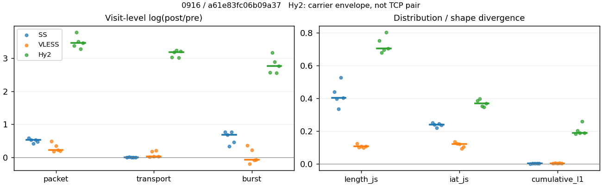
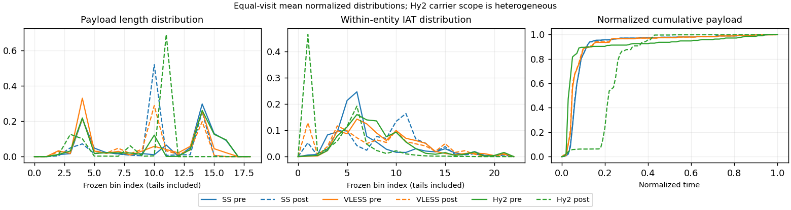

# 0916 · 条目 018 · github.com

目标：https://github.com/numpy/numpy

活动标签：github.com::repository_view。选定访问 15 次。

[返回总索引](../../README.md) · [统计口径](../../methods.md)

## 覆盖与资格（每次访问均保留）

| 部署 | 重复 | 主请求路由 | 活动状态 | 代理比较 | DIRECT pre | 请求 proxy/direct/unresolved | 错误 |
| --- | --- | --- | --- | --- | --- | --- | --- |
| Hy2 | 1 | proxy | passed | 1 | 0 | 195/0/0 | [] |
| Hy2 | 2 | proxy | passed | 1 | 0 | 171/0/0 | [] |
| Hy2 | 3 | proxy | passed | 1 | 0 | 179/0/0 | [] |
| Hy2 | 4 | proxy | passed | 1 | 0 | 192/0/0 | [] |
| Hy2 | 5 | proxy | passed | 1 | 0 | 178/0/0 | [] |
| SS | 1 | proxy | passed | 1 | 0 | 194/0/0 | [] |
| SS | 2 | proxy | passed | 1 | 0 | 191/0/0 | [] |
| SS | 3 | proxy | passed | 1 | 0 | 191/0/0 | [] |
| SS | 4 | proxy | passed | 1 | 0 | 191/0/0 | [] |
| SS | 5 | proxy | passed | 1 | 0 | 178/0/0 | [] |
| VLESS | 1 | proxy | passed | 1 | 0 | 192/0/0 | [] |
| VLESS | 2 | proxy | passed | 1 | 0 | 191/0/0 | [] |
| VLESS | 3 | proxy | passed | 1 | 0 | 192/0/0 | [] |
| VLESS | 4 | proxy | passed | 1 | 0 | 191/0/0 | [] |
| VLESS | 5 | proxy | passed | 1 | 0 | 182/0/0 | [] |

主请求非 proxy 的统计仅解释为已索引的辅助代理连接或 DIRECT 观测，不代表目标业务经代理传输。播放确认与配对资格是两道不同的门。

图中散点为单次访问，短线为重复中位数；Hy2 是共享载体包络，不能与 TCP 配对作等范围因果对比。

形态图先逐访问归一化，再对访问等权平均；实线 pre，虚线 post。分箱序号及边界见 methods，不将分箱索引误解为长度或时间。

## 每次访问的关键观测

### SS

范围：`exclusive_page`。每格 pre → post；空值为不可观测/不适用。

| 重复 | 包数 | 载荷字节 | burst | TCP FR | IAT中位µs | length JS | IAT JS |
| --- | --- | --- | --- | --- | --- | --- | --- |
| 1 | 1377 → 2486 | 2.3187e+06 → 2.34e+06 | 889 → 1921 | 97 → 103 | 33.721 → 623.39 | 0.43944 | 0.25078 |
| 2 | 1609 → 2753 | 2.3712e+06 → 2.4029e+06 | 1099 → 2175 | 114 → 130 | 30.062 → 715.14 | 0.3972 | 0.23912 |
| 3 | 1731 → 2628 | 2.3712e+06 → 2.3734e+06 | 1180 → 1660 | 106 → 112 | 22.551 → 144.16 | 0.33392 | 0.21975 |
| 4 | 2991 → 5074 | 4.172e+06 → 4.2035e+06 | 2046 → 4432 | 128 → 136 | 28.949 → 1028.6 | 0.52673 | 0.24322 |
| 5 | 1409 → 2284 | 2.0238e+06 → 2.0252e+06 | 961 → 1529 | 94 → 106 | 26.794 → 412.77 | 0.4013 | 0.2365 |

完整标量统计：中位数 [min,max]；Δ 为重复内逐访问变换的中位数，MAD 未缩放。n 为可用变换数；DIRECT-only 的 nΔ=0 不代表 pre 不可用。

| scope | 特征 | pre | post | Δ | IQRΔ | MADΔ | nΔ |
| --- | --- | --- | --- | --- | --- | --- | --- |
| exclusive_page | active_span_sum_s_1000ms | 22.313 [18.488, 27.215] | 24.517 [18.321, 29.975] | 0.088236 | 0.023465 | 0.0083565 | 5 |
| exclusive_page | active_span_sum_s_100ms | 3.7721 [3.3427, 11.066] | 7.3329 [6.2799, 17.406] | 0.63057 | 0.18006 | 0.11049 | 5 |
| exclusive_page | active_span_sum_s_500ms | 17.09 [14.042, 23.677] | 20.863 [15.633, 26.035] | 0.14909 | 0.09215 | 0.050388 | 5 |
| exclusive_page | burst_bytes_iqr | 2896 [2701, 2896] | 1860 [1428, 2856] | -0.44275 | 0.52683 | 0.2643 | 5 |
| exclusive_page | burst_bytes_mad | 48 [31, 64] | 40 [34, 65] | 0.029853 | 0.59136 | 0.27333 | 5 |
| exclusive_page | burst_bytes_max | 32321 [20272, 42705] | 14280 [7399, 25704] | -0.68482 | 0.49886 | 0.33444 | 5 |
| exclusive_page | burst_bytes_mean | 2105.9 [2009.5, 2608.2] | 1218.1 [948.44, 1429.7] | -0.66935 | 0.29767 | 0.096095 | 5 |
| exclusive_page | burst_bytes_median | 48 [31, 64] | 40 [34, 65] | 0.029853 | 0.59136 | 0.27333 | 5 |
| exclusive_page | burst_bytes_min | 0 [0, 0] | 0 [0, 0] | — | — | — | 0 |
| exclusive_page | burst_bytes_p95 | 9164 [8192, 16384] | 4284 [2856, 5712] | -0.99474 | 0.45881 | 0.28768 | 5 |
| exclusive_page | burst_bytes_q25 | 0 [0, 0] | 0 [0, 0] | — | — | — | 0 |
| exclusive_page | burst_bytes_q75 | 2896 [2701, 2896] | 1860 [1428, 2856] | -0.44275 | 0.52683 | 0.2643 | 5 |
| exclusive_page | burst_bytes_std | 4338.9 [3507.8, 5299.6] | 1611.7 [1140.2, 2494] | -1.1001 | 0.43034 | 0.090247 | 5 |
| exclusive_page | burst_count | 1099 [889, 2046] | 1921 [1529, 4432] | 0.68263 | 0.30611 | 0.090336 | 5 |
| exclusive_page | burst_duration_ms_iqr | 0.021994 [0, 0.038044] | 0 [0, 0.0049397] | — | — | — | 0 |
| exclusive_page | burst_duration_ms_mad | 0 [0, 0] | 0 [0, 0] | — | — | — | 0 |
| exclusive_page | burst_duration_ms_max | 15001 [15000, 15002] | 15484 [14839, 30380] | 0.031751 | 0.70101 | 0.042528 | 5 |
| exclusive_page | burst_duration_ms_mean | 47.728 [25.807, 106.79] | 67.37 [16.445, 90.03] | 0.17094 | 0.53644 | 0.36269 | 5 |
| exclusive_page | burst_duration_ms_median | 0 [0, 0] | 0 [0, 0] | — | — | — | 0 |
| exclusive_page | burst_duration_ms_min | 0 [0, 0] | 0 [0, 0] | — | — | — | 0 |
| exclusive_page | burst_duration_ms_p95 | 94.28 [5.1265, 192.19] | 1.6456 [0.1776, 6.2831] | -3.4206 | 0.6855 | 0.62754 | 5 |
| exclusive_page | burst_duration_ms_q25 | 0 [0, 0] | 0 [0, 0] | — | — | — | 0 |
| exclusive_page | burst_duration_ms_q75 | 0.021994 [0, 0.038044] | 0 [0, 0.0049397] | — | — | — | 0 |
| exclusive_page | burst_duration_ms_std | 650.99 [482.13, 900.59] | 946.86 [352.11, 1098.5] | 0.48061 | 0.47311 | 0.17879 | 5 |
| exclusive_page | burst_packets_iqr | 1 [0, 1] | 0 [0, 1] | — | — | — | 0 |
| exclusive_page | burst_packets_mad | 0 [0, 0] | 0 [0, 0] | — | — | — | 0 |
| exclusive_page | burst_packets_max | 10 [8, 11] | 12 [11, 16] | 0.31845 | 0.056089 | 0.056089 | 5 |
| exclusive_page | burst_packets_mean | 1.4662 [1.4619, 1.5489] | 1.2941 [1.1449, 1.5831] | -0.14555 | 0.19839 | 0.098893 | 5 |
| exclusive_page | burst_packets_median | 1 [1, 1] | 1 [1, 1] | 0 | 0 | 0 | 5 |
| exclusive_page | burst_packets_min | 1 [1, 1] | 1 [1, 1] | 0 | 0 | 0 | 5 |
| exclusive_page | burst_packets_p95 | 3 [3, 3.75] | 2 [2, 4] | -0.40547 | 0.40547 | 0.22314 | 5 |
| exclusive_page | burst_packets_q25 | 1 [1, 1] | 1 [1, 1] | 0 | 0 | 0 | 5 |
| exclusive_page | burst_packets_q75 | 2 [1, 2] | 1 [1, 2] | -0.69315 | 0 | 0 | 5 |
| exclusive_page | burst_packets_std | 1.0508 [0.94949, 1.2322] | 0.88742 [0.56663, 1.4544] | -0.21865 | 0.18466 | 0.12964 | 5 |
| exclusive_page | connection_span_concurrency_max | 6 [5, 7] | 6 [5, 7] | 0 | 0 | 0 | 5 |
| exclusive_page | cumulative_l1 | — | — | 0.0014267 | 0.00083979 | 0.00042126 | 5 |
| exclusive_page | cumulative_max | — | — | 0.040013 | 0.030375 | 0.017248 | 5 |
| exclusive_page | direction_entropy | 0.85575 [0.72812, 0.8798] | 0.53672 [0.36573, 0.84807] | -0.26433 | 0.07909 | 0.071311 | 5 |
| exclusive_page | down_burst_count | 543 [439, 1018] | 955 [760, 2211] | 0.68853 | 0.3077 | 0.088679 | 5 |
| exclusive_page | down_ip_bytes | 2.3042e+06 [1.6888e+06, 4.1824e+06] | 2.3228e+06 [1.699e+06, 4.2494e+06] | 0.013665 | 0.0099073 | 0.0029361 | 5 |
| exclusive_page | down_packets | 910 [774, 1746] | 1444 [1161, 2656] | 0.43835 | 0.042234 | 0.023377 | 5 |
| exclusive_page | down_transport_bytes | 2.2568e+06 [1.6485e+06, 4.0915e+06] | 2.2412e+06 [1.6384e+06, 4.1111e+06] | 0.0016094 | 0.010641 | 0.0031552 | 5 |
| exclusive_page | duration_s | 66.611 [66.247, 70.667] | 66.61 [66.492, 70.901] | -8.1564e-06 | 0.0033224 | 1.2568e-06 | 5 |
| exclusive_page | entity_count | 10 [9, 13] | 10 [9, 13] | 0 | 0 | 0 | 5 |
| exclusive_page | fr_runs | 106 [94, 128] | 112 [103, 136] | 0.060625 | 0.060126 | 0.0055648 | 5 |
| exclusive_page | fr_runs_per_packet | 0.11463 [0.07123, 0.12527] | 0.075403 [0.050333, 0.087957] | -0.034209 | 0.0031337 | 0.0031088 | 5 |
| exclusive_page | fr_switches | 96 [85, 118] | 102 [92, 126] | 0.067441 | 0.066462 | 0.0068167 | 5 |
| exclusive_page | fr_switches_per_possible_transition | 0.10481 [0.066032, 0.1126] | 0.067897 [0.046805, 0.079863] | -0.031141 | 0.0020276 | 0.0015927 | 5 |
| exclusive_page | full_retransmission_fraction | 0.0056778 [0.0036311, 0.0086655] | 0.0057078 [0.0025621, 0.014166] | -1.0809e-05 | 0.0038474 | 0.0029469 | 5 |
| exclusive_page | full_retransmission_packets | 8 [5, 17] | 15 [9, 39] | 0.58779 | 0.62861 | 0.58779 | 5 |
| exclusive_page | iat_count | 1596 [1366, 2981] | 2618 [2275, 5064] | 0.5299 | 0.05495 | 0.04439 | 5 |
| exclusive_page | iat_js | — | — | 0.23912 | 0.0067195 | 0.0041019 | 5 |
| exclusive_page | iat_ks | — | — | 0.40436 | 0.060696 | 0.036699 | 5 |
| exclusive_page | iat_median_us | 28.949 [22.551, 33.721] | 623.39 [144.16, 1028.6] | 2.917 | 0.43448 | 0.25216 | 5 |
| exclusive_page | iat_us_iqr | 111.45 [69.715, 159.17] | 1123.7 [867.53, 4946.6] | 2.3108 | 0.2899 | 0.21043 | 5 |
| exclusive_page | iat_us_mad | 19.845 [16.746, 24.613] | 551.72 [143.94, 1015.7] | 3.1098 | 0.40157 | 0.32444 | 5 |
| exclusive_page | iat_us_max | 1.5001e+07 [1.5001e+07, 1.5002e+07] | 1.536e+07 [1.5328e+07, 1.5484e+07] | 0.023595 | 0.0036737 | 0.0019394 | 5 |
| exclusive_page | iat_us_mean | 1.8196e+05 [79848, 2.041e+05] | 1.1471e+05 [44065, 1.1961e+05] | -0.52904 | 0.053126 | 0.043511 | 5 |
| exclusive_page | iat_us_median | 28.949 [22.551, 33.721] | 623.39 [144.16, 1028.6] | 2.917 | 0.43448 | 0.25216 | 5 |
| exclusive_page | iat_us_min | 0.065 [0.022, 0.214] | 0.036 [0.032, 0.037] | -0.70865 | 0.98852 | 0.5545 | 5 |
| exclusive_page | iat_us_p95 | 59430 [46877, 1.9636e+05] | 32156 [14803, 43719] | -1.2655 | 0.83811 | 0.2366 | 5 |
| exclusive_page | iat_us_q25 | 12.844 [11.411, 15.123] | 21.169 [8.573, 26.995] | 0.46956 | 0.76765 | 0.13187 | 5 |
| exclusive_page | iat_us_q75 | 123.3 [81.126, 174.3] | 1133.5 [876.11, 4970.1] | 2.2184 | 0.2273 | 0.16108 | 5 |
| exclusive_page | iat_us_std | 1.4536e+06 [9.3103e+05, 1.5817e+06] | 1.1409e+06 [7.0186e+05, 1.2655e+06] | -0.25786 | 0.01922 | 0.015639 | 5 |
| exclusive_page | iat_wasserstein_log1p_us | — | — | 1.4855 | 0.20905 | 0.1284 | 5 |
| exclusive_page | idle_gap_count_1000ms | 24 [9, 31] | 23 [7, 32] | -0.04256 | 0.054488 | 0.052751 | 5 |
| exclusive_page | idle_gap_count_100ms | 85 [54, 88] | 68 [56, 97] | 0.023257 | 0.065355 | 0.052244 | 5 |
| exclusive_page | idle_gap_count_500ms | 30 [17, 41] | 27 [14, 36] | -0.10536 | 0.034743 | 0.024693 | 5 |
| exclusive_page | idle_gap_sum_s_1000ms | 244.18 [88.868, 301.84] | 241.65 [87.376, 300.22] | -0.0092985 | 0.0050295 | 0.0039252 | 5 |
| exclusive_page | idle_gap_sum_s_100ms | 260.33 [105.3, 321.84] | 254.22 [102.45, 317.84] | -0.01504 | 0.01125 | 0.005496 | 5 |
| exclusive_page | idle_gap_sum_s_500ms | 247.71 [94.349, 308.65] | 245.59 [91.97, 302.42] | -0.015615 | 0.011765 | 0.0069976 | 5 |
| exclusive_page | ip_bytes | 2.4551e+06 [2.0973e+06, 4.3279e+06] | 2.5284e+06 [2.1599e+06, 4.5085e+06] | 0.040893 | 0.011532 | 0.004504 | 5 |
| exclusive_page | length_iqr | 2793 [2648, 4004] | 885.5 [0, 1428] | -1.031 | 0.1819 | 0.075281 | 3 |
| exclusive_page | length_js | — | — | 0.4013 | 0.04224 | 0.038132 | 5 |
| exclusive_page | length_ks | — | — | 0.49163 | 0.026604 | 0.019888 | 5 |
| exclusive_page | length_mad | 1616 [1200, 1989] | 88.5 [0, 1237] | -0.91382 | 1.2271 | 0.43888 | 3 |
| exclusive_page | length_max | 8948 [8948, 8948] | 5712 [2856, 9996] | -0.44886 | 0.51083 | 0.28768 | 5 |
| exclusive_page | length_mean | 2468.1 [2321.6, 2810.5] | 1555.7 [1484.3, 1713] | -0.47172 | 0.022284 | 0.020138 | 5 |
| exclusive_page | length_median | 2688 [2072, 2896] | 1428 [1428, 1428] | -0.63252 | 0.15507 | 0.074533 | 5 |
| exclusive_page | length_min | 31 [20, 31] | 20 [4, 20] | -0.43825 | 0.072571 | 0 | 5 |
| exclusive_page | length_p95 | 8192 [7240, 8192] | 2856 [2856, 2856] | -1.0537 | 0 | 0 | 5 |
| exclusive_page | length_q25 | 103.5 [92, 248] | 1428 [616.5, 1428] | 2.6245 | 0.8787 | 0.11778 | 5 |
| exclusive_page | length_q75 | 2896 [2896, 4096] | 1502 [1428, 2856] | -0.65653 | 0.34647 | 0.050523 | 5 |
| exclusive_page | length_std | 2491.2 [1982.9, 2799.9] | 921.8 [733.49, 1140.4] | -1.021 | 0.042679 | 0.019939 | 5 |
| exclusive_page | length_wasserstein_bytes | — | — | 1368.9 | 125.24 | 96.506 | 5 |
| exclusive_page | nonempty_entity_count | 10 [9, 13] | 10 [9, 13] | 0 | 0 | 0 | 5 |
| exclusive_page | nonempty_packets | 910 [820, 1797] | 1478 [1318, 2702] | 0.47457 | 0.032479 | 0.022045 | 5 |
| exclusive_page | offload_suspect_fraction | 0.32825 [0.32256, 0.36443] | 0.16927 [0.10307, 0.20636] | -0.15756 | 0.037953 | 0.033682 | 5 |
| exclusive_page | packet_count | 1609 [1377, 2991] | 2628 [2284, 5074] | 0.52852 | 0.05403 | 0.045474 | 5 |
| exclusive_page | rtt_median_ms | 0.048485 [0.025407, 0.064704] | 32.699 [28.046, 37.829] | 6.6596 | 0.45953 | 0.27625 | 5 |
| exclusive_page | rtt_sample_count | 630 [523, 1140] | 415 [367, 782] | -0.32104 | 0.080927 | 0.041217 | 5 |
| exclusive_page | tcp_ack_count | 1596 [1366, 2981] | 2618 [2274, 5063] | 0.5297 | 0.053928 | 0.044632 | 5 |
| exclusive_page | tcp_fin_count | 20 [18, 26] | 22 [18, 31] | 0 | 0.13976 | 0 | 5 |
| exclusive_page | tcp_packet_count | 1609 [1377, 2991] | 2628 [2284, 5074] | 0.52852 | 0.05403 | 0.045474 | 5 |
| exclusive_page | tcp_rst_count | 0 [0, 0] | 0 [0, 0] | — | — | — | 0 |
| exclusive_page | tcp_syn_count | 20 [18, 26] | 21 [19, 32] | 0.04879 | 0.054067 | 0.04879 | 5 |
| exclusive_page | tcp_window_raw_median | 65535 [65471, 65535] | 168 [153, 168] | -5.9664 | 0.017041 | 0.00047314 | 5 |
| exclusive_page | transition_entropy | 0.46093 [0.32216, 0.47748] | 0.30087 [0.21391, 0.36233] | -0.12972 | 0.026155 | 0.021481 | 5 |
| exclusive_page | transition_n_mm | 599 [528, 1368] | 1203 [903, 2445] | 0.625 | 0.11662 | 0.072316 | 5 |
| exclusive_page | transition_n_mp | 43 [38, 54] | 46 [42, 58] | 0.074108 | 0.075145 | 0.0066667 | 5 |
| exclusive_page | transition_n_pm | 53 [47, 64] | 56 [50, 68] | 0.061875 | 0.05952 | 0.0068156 | 5 |
| exclusive_page | transition_n_pp | 197 [190, 301] | 140 [114, 309] | -0.30647 | 0.21069 | 0.2096 | 5 |
| exclusive_page | transition_p_mm | 0.93286 [0.93012, 0.96203] | 0.96474 [0.95354, 0.97683] | 0.02326 | 0.007003 | 0.0044179 | 5 |
| exclusive_page | transition_p_mp | 0.067138 [0.037975, 0.069876] | 0.035264 [0.023172, 0.046463] | -0.02326 | 0.007003 | 0.0044179 | 5 |
| exclusive_page | transition_p_pm | 0.19748 [0.17534, 0.22134] | 0.30488 [0.14641, 0.35979] | 0.084876 | 0.039792 | 0.022523 | 5 |
| exclusive_page | transition_p_pp | 0.80252 [0.77866, 0.82466] | 0.69512 [0.64021, 0.85359] | -0.084876 | 0.039792 | 0.022523 | 5 |
| exclusive_page | transport_bytes | 2.3712e+06 [2.0238e+06, 4.172e+06] | 2.3734e+06 [2.0252e+06, 4.2035e+06] | 0.0075208 | 0.0082 | 0.0057591 | 5 |
| exclusive_page | up_burst_count | 556 [450, 1028] | 966 [769, 2221] | 0.67683 | 0.30297 | 0.093515 | 5 |
| exclusive_page | up_byte_fraction | 0.048092 [0.01929, 0.18543] | 0.055691 [0.021989, 0.191] | 0.0055698 | 0.0031485 | 0.0020299 | 5 |
| exclusive_page | up_ip_bytes | 1.5094e+05 [1.2818e+05, 4.0847e+05] | 2.3326e+05 [1.9015e+05, 4.6087e+05] | 0.39436 | 0.13314 | 0.092226 | 5 |
| exclusive_page | up_packets | 699 [574, 1245] | 1148 [1067, 2418] | 0.62737 | 0.093671 | 0.057234 | 5 |
| exclusive_page | up_transport_bytes | 1.1403e+05 [80476, 3.7528e+05] | 1.3218e+05 [92430, 3.8682e+05] | 0.13849 | 0.038569 | 0.029407 | 5 |
| exclusive_page | zero_iat_count | 0 [0, 0] | 0 [0, 0] | — | — | — | 0 |
| exclusive_page | zero_iat_fraction | 0 [0, 0] | 0 [0, 0] | 0 | 0 | 0 | 5 |

### VLESS

范围：`exclusive_page`。每格 pre → post；空值为不可观测/不适用。

| 重复 | 包数 | 载荷字节 | burst | TCP FR | IAT中位µs | length JS | IAT JS |
| --- | --- | --- | --- | --- | --- | --- | --- |
| 1 | 1891 → 3086 | 2.3231e+06 → 2.3672e+06 | 1231 → 1779 | 100 → 118 | 125.84 → 23.445 | 0.12294 | 0.13402 |
| 2 | 570 → 688 | 3.335e+05 → 4.0022e+05 | 424 → 352 | 57 → 74 | 146.54 → 401.29 | 0.10087 | 0.12232 |
| 3 | 2351 → 3362 | 2.3417e+06 → 2.4301e+06 | 1707 → 2150 | 116 → 136 | 123.2 → 44.505 | 0.10652 | 0.11984 |
| 4 | 605 → 761 | 3.2374e+05 → 4.0032e+05 | 473 → 437 | 61 → 80 | 120.07 → 412.16 | 0.099 | 0.091932 |
| 5 | 2044 → 2495 | 2.0466e+06 → 2.1038e+06 | 1629 → 1513 | 72 → 86 | 78.162 → 53.042 | 0.10583 | 0.10334 |

完整标量统计：中位数 [min,max]；Δ 为重复内逐访问变换的中位数，MAD 未缩放。n 为可用变换数；DIRECT-only 的 nΔ=0 不代表 pre 不可用。

| scope | 特征 | pre | post | Δ | IQRΔ | MADΔ | nΔ |
| --- | --- | --- | --- | --- | --- | --- | --- |
| exclusive_page | active_span_sum_s_1000ms | 14.459 [14.166, 18.99] | 14.298 [13.612, 18.497] | -0.011184 | 0.028988 | 0.015088 | 5 |
| exclusive_page | active_span_sum_s_100ms | 2.4837 [1.4471, 3.4366] | 5.6986 [4.7107, 7.8757] | 0.83049 | 0.20908 | 0.040077 | 5 |
| exclusive_page | active_span_sum_s_500ms | 8.2135 [6.3124, 10.092] | 13.467 [11.616, 17.64] | 0.58822 | 0.051441 | 0.029829 | 5 |
| exclusive_page | burst_bytes_iqr | 1876 [812, 2896] | 2824 [1520, 2824] | 0.40901 | 0.62697 | 0.36822 | 5 |
| exclusive_page | burst_bytes_mad | 24 [0, 48] | 43.5 [31, 72] | 0.43721 | 0.094621 | 0.031749 | 3 |
| exclusive_page | burst_bytes_max | 33556 [16499, 43107] | 17376 [13890, 28240] | -0.52509 | 0.44268 | 0.34054 | 5 |
| exclusive_page | burst_bytes_mean | 1256.4 [684.44, 1887.2] | 1137 [916.07, 1390.5] | 0.10145 | 0.48517 | 0.26702 | 5 |
| exclusive_page | burst_bytes_median | 24 [0, 48] | 43.5 [31, 72] | 0.43721 | 0.094621 | 0.031749 | 3 |
| exclusive_page | burst_bytes_min | 0 [0, 0] | 0 [0, 0] | — | — | — | 0 |
| exclusive_page | burst_bytes_p95 | 4272 [2896, 9942] | 2968 [2896, 4416] | 0 | 0.6799 | 0.011729 | 5 |
| exclusive_page | burst_bytes_q25 | 0 [0, 0] | 0 [0, 0] | — | — | — | 0 |
| exclusive_page | burst_bytes_q75 | 1876 [812, 2896] | 2824 [1520, 2824] | 0.40901 | 0.62697 | 0.36822 | 5 |
| exclusive_page | burst_bytes_std | 2697.5 [1824.4, 4057] | 1858.1 [1493.3, 2240.8] | -0.32768 | 0.29018 | 0.24363 | 5 |
| exclusive_page | burst_count | 1231 [424, 1707] | 1513 [352, 2150] | -0.073872 | 0.30989 | 0.11223 | 5 |
| exclusive_page | burst_duration_ms_iqr | 0.039457 [0, 0.3723] | 0.00846 [0.004861, 8.5897] | -2.094 | 4.2406 | 1.6904 | 3 |
| exclusive_page | burst_duration_ms_mad | 0 [0, 0] | 0 [0, 0] | — | — | — | 0 |
| exclusive_page | burst_duration_ms_max | 15000 [15000, 15001] | 15033 [15005, 15167] | 0.002174 | 0.0045732 | 0.0018552 | 5 |
| exclusive_page | burst_duration_ms_mean | 52.771 [27.787, 91.048] | 74.912 [24.961, 267.24] | 0.61551 | 0.42725 | 0.26515 | 5 |
| exclusive_page | burst_duration_ms_median | 0 [0, 0] | 0 [0, 0] | — | — | — | 0 |
| exclusive_page | burst_duration_ms_min | 0 [0, 0] | 0 [0, 0] | — | — | — | 0 |
| exclusive_page | burst_duration_ms_p95 | 9.849 [3.0001, 229.37] | 9.6232 [9.3103, 304.94] | 0.28476 | 0.55287 | 0.33054 | 5 |
| exclusive_page | burst_duration_ms_q25 | 0 [0, 0] | 0 [0, 0] | — | — | — | 0 |
| exclusive_page | burst_duration_ms_q75 | 0.039457 [0, 0.3723] | 0.00846 [0.004861, 8.5897] | -2.094 | 4.2406 | 1.6904 | 3 |
| exclusive_page | burst_duration_ms_std | 614.55 [407.2, 798.66] | 866.99 [506.85, 1798.5] | 0.5443 | 0.4488 | 0.23739 | 5 |
| exclusive_page | burst_packets_iqr | 1 [0, 1] | 1 [1, 1] | 0 | 0 | 0 | 3 |
| exclusive_page | burst_packets_mad | 0 [0, 0] | 0 [0, 0] | — | — | — | 0 |
| exclusive_page | burst_packets_max | 9 [4, 14] | 13 [11, 20] | 0.51083 | 0.23841 | 0.1431 | 5 |
| exclusive_page | burst_packets_mean | 1.3443 [1.2548, 1.5361] | 1.7347 [1.5637, 1.9545] | 0.27325 | 0.1816 | 0.101 | 5 |
| exclusive_page | burst_packets_median | 1 [1, 1] | 1 [1, 1] | 0 | 0 | 0 | 5 |
| exclusive_page | burst_packets_min | 1 [1, 1] | 1 [1, 1] | 0 | 0 | 0 | 5 |
| exclusive_page | burst_packets_p95 | 2 [2, 3] | 4 [3, 5] | 0.69315 | 0.51083 | 0.22314 | 5 |
| exclusive_page | burst_packets_q25 | 1 [1, 1] | 1 [1, 1] | 0 | 0 | 0 | 5 |
| exclusive_page | burst_packets_q75 | 2 [1, 2] | 2 [2, 2] | 0 | 0.69315 | 0 | 5 |
| exclusive_page | burst_packets_std | 0.77613 [0.58733, 0.95476] | 1.3289 [0.99832, 1.6387] | 0.70387 | 0.57237 | 0.29087 | 5 |
| exclusive_page | connection_span_concurrency_max | 6 [4, 7] | 6 [4, 7] | 0 | 0 | 0 | 5 |
| exclusive_page | cumulative_l1 | — | — | 0.0031313 | 0.0022371 | 0.0017179 | 5 |
| exclusive_page | cumulative_max | — | — | 0.053246 | 0.013221 | 0.0062038 | 5 |
| exclusive_page | direction_entropy | 0.71507 [0.68202, 0.89272] | 0.79604 [0.46699, 0.9264] | 0.0075752 | 0.23511 | 0.098279 | 5 |
| exclusive_page | down_burst_count | 611 [208, 848] | 753 [172, 1070] | -0.074203 | 0.31329 | 0.11584 | 5 |
| exclusive_page | down_ip_bytes | 1.6878e+06 [2.5605e+05, 2.293e+06] | 1.7448e+06 [3.1196e+05, 2.3855e+06] | 0.039552 | 0.16431 | 0.014316 | 5 |
| exclusive_page | down_packets | 1095 [298, 1370] | 1338 [369, 1844] | 0.23706 | 0.083423 | 0.036637 | 5 |
| exclusive_page | down_transport_bytes | 1.6308e+06 [2.4049e+05, 2.2217e+06] | 1.6752e+06 [2.9271e+05, 2.2895e+06] | 0.030089 | 0.16968 | 0.017794 | 5 |
| exclusive_page | duration_s | 64.758 [64.158, 69.171] | 64.719 [64.138, 69.153] | -0.00030099 | 5.5486e-05 | 2.9715e-05 | 5 |
| exclusive_page | entity_count | 9 [7, 11] | 9 [7, 11] | 0 | 0 | 0 | 5 |
| exclusive_page | fr_runs | 72 [57, 116] | 86 [74, 136] | 0.17768 | 0.095499 | 0.018616 | 5 |
| exclusive_page | fr_runs_per_packet | 0.085106 [0.062718, 0.20748] | 0.073833 [0.058783, 0.20672] | -0.0039344 | 0.010012 | 0.006643 | 5 |
| exclusive_page | fr_switches | 65 [49, 105] | 79 [66, 125] | 0.19506 | 0.11735 | 0.020707 | 5 |
| exclusive_page | fr_switches_per_possible_transition | 0.078045 [0.056968, 0.18246] | 0.068269 [0.054258, 0.18783] | -0.0027093 | 0.014312 | 0.0080839 | 5 |
| exclusive_page | full_retransmission_fraction | 0.0016529 [0, 0.005817] | 0 [0, 0.00029744] | -0.0016529 | 0.0017015 | 0.0010271 | 5 |
| exclusive_page | full_retransmission_packets | 2 [0, 11] | 0 [0, 1] | -1.9459 | — | — | 1 |
| exclusive_page | iat_count | 1882 [562, 2340] | 2488 [680, 3351] | 0.2325 | 0.15911 | 0.041905 | 5 |
| exclusive_page | iat_js | — | — | 0.11984 | 0.01898 | 0.01418 | 5 |
| exclusive_page | iat_ks | — | — | 0.21744 | 0.14092 | 0.082664 | 5 |
| exclusive_page | iat_median_us | 123.2 [78.162, 146.54] | 53.042 [23.445, 412.16] | -0.3877 | 2.0256 | 1.2927 | 5 |
| exclusive_page | iat_us_iqr | 1074.4 [677.97, 3210.4] | 778.23 [700.42, 9275.8] | 0.13793 | 1.2119 | 0.56572 | 5 |
| exclusive_page | iat_us_mad | 115.39 [69.245, 139.46] | 52.927 [23.403, 411.76] | -0.26874 | 2.0108 | 1.3251 | 5 |
| exclusive_page | iat_us_max | 1.5001e+07 [1.5001e+07, 1.5001e+07] | 1.5304e+07 [1.5033e+07, 1.5381e+07] | 0.020008 | 0.0011902 | 0.0010057 | 5 |
| exclusive_page | iat_us_mean | 1.3873e+05 [58147, 3.4124e+05] | 96806 [35478, 2.8165e+05] | -0.23463 | 0.15792 | 0.042737 | 5 |
| exclusive_page | iat_us_median | 123.2 [78.162, 146.54] | 53.042 [23.445, 412.16] | -0.3877 | 2.0256 | 1.2927 | 5 |
| exclusive_page | iat_us_min | 0.251 [0.031, 1.052] | 0.035 [0.031, 0.037] | -1.9701 | 2.0408 | 1.3774 | 5 |
| exclusive_page | iat_us_p95 | 10130 [9438.2, 3.172e+05] | 39984 [20849, 1.5701e+05] | 0.7344 | 1.6786 | 0.63856 | 5 |
| exclusive_page | iat_us_q25 | 25.833 [19.976, 31.929] | 7.5408 [6.019, 17.249] | -1.2313 | 0.68542 | 0.43728 | 5 |
| exclusive_page | iat_us_q75 | 1106.3 [703.8, 3235.5] | 785.77 [706.44, 9293.1] | 0.11017 | 1.2288 | 0.5587 | 5 |
| exclusive_page | iat_us_std | 1.3321e+06 [7.9462e+05, 2.0705e+06] | 1.1277e+06 [6.3079e+05, 1.8965e+06] | -0.11453 | 0.064997 | 0.026744 | 5 |
| exclusive_page | iat_wasserstein_log1p_us | — | — | 0.87579 | 0.25557 | 0.12835 | 5 |
| exclusive_page | idle_gap_count_1000ms | 14 [11, 28] | 14 [10, 26] | 0 | 0.074108 | 0 | 5 |
| exclusive_page | idle_gap_count_100ms | 51 [47, 71] | 56 [54, 78] | 0.09531 | 0.044807 | 0.0017841 | 5 |
| exclusive_page | idle_gap_count_500ms | 25 [22, 41] | 16 [12, 27] | -0.44629 | 0.03425 | 0.028552 | 5 |
| exclusive_page | idle_gap_sum_s_1000ms | 151.06 [92.899, 305.63] | 150.59 [92.588, 305.9] | -0.00076532 | 0.0039918 | 0.0023617 | 5 |
| exclusive_page | idle_gap_sum_s_100ms | 163.44 [106.37, 321.19] | 159.83 [102.41, 316.52] | -0.022356 | 0.0082881 | 0.0045632 | 5 |
| exclusive_page | idle_gap_sum_s_500ms | 158.39 [101.22, 314.53] | 151.95 [94.375, 306.76] | -0.041506 | 0.012747 | 0.011108 | 5 |
| exclusive_page | ip_bytes | 2.1529e+06 [3.5519e+05, 2.4639e+06] | 2.2349e+06 [4.3632e+05, 2.6106e+06] | 0.057843 | 0.13872 | 0.020449 | 5 |
| exclusive_page | length_iqr | 2746 [1646.8, 2746.5] | 1412 [1322.5, 2583] | -0.30301 | 0.42086 | 0.24181 | 5 |
| exclusive_page | length_js | — | — | 0.10583 | 0.0056551 | 0.0049622 | 5 |
| exclusive_page | length_ks | — | — | 0.17835 | 0.0044491 | 0.0041169 | 5 |
| exclusive_page | length_mad | 1340 [409, 1376] | 1171 [683, 1268] | -0.055229 | 0.52668 | 0.10609 | 5 |
| exclusive_page | length_max | 8948 [8948, 8948] | 7240 [2824, 8472] | -0.21181 | 0.94147 | 0.15715 | 5 |
| exclusive_page | length_mean | 1708 [1101.2, 1977.1] | 1319.3 [1034.4, 1438] | -0.21489 | 0.19288 | 0.14951 | 5 |
| exclusive_page | length_median | 1412 [457, 1448] | 1412 [1167, 1412] | 0 | 0.91272 | 0.025176 | 5 |
| exclusive_page | length_min | 24 [8, 24] | 8 [1, 24] | -0.69315 | 1.7918 | 0.69315 | 5 |
| exclusive_page | length_p95 | 4380 [2824, 7665.6] | 2824 [2824, 2896] | -0.43889 | 0.69315 | 0.43889 | 5 |
| exclusive_page | length_q25 | 77.5 [72, 78] | 108 [72, 241] | 0.32542 | 0.11428 | 0.10785 | 5 |
| exclusive_page | length_q75 | 2824 [1718.8, 2824] | 1520 [1412, 2824] | -0.28992 | 0.39945 | 0.28992 | 5 |
| exclusive_page | length_std | 1723.6 [1468.6, 2288.2] | 1022.8 [868.42, 1079] | -0.52536 | 0.053951 | 0.045222 | 5 |
| exclusive_page | length_wasserstein_bytes | — | — | 563.24 | 169.6 | 147.59 | 5 |
| exclusive_page | nonempty_entity_count | 9 [7, 11] | 9 [7, 11] | 0 | 0 | 0 | 5 |
| exclusive_page | nonempty_packets | 1148 [281, 1371] | 1463 [360, 1842] | 0.27484 | 0.047562 | 0.027096 | 5 |
| exclusive_page | offload_suspect_fraction | 0.26859 [0.13388, 0.28451] | 0.15497 [0.078844, 0.17876] | -0.089833 | 0.060941 | 0.02941 | 5 |
| exclusive_page | packet_count | 1891 [570, 2351] | 2495 [688, 3362] | 0.2294 | 0.15832 | 0.041252 | 5 |
| exclusive_page | rtt_median_ms | 0.087476 [0.053552, 0.17555] | 0.17834 [0.15702, 9.4101] | 1.2031 | 3.1191 | 1.3146 | 5 |
| exclusive_page | rtt_sample_count | 667 [234, 901] | 958 [282, 1223] | 0.19256 | 0.11897 | 0.086972 | 5 |
| exclusive_page | tcp_ack_count | 1865 [548, 2318] | 2488 [680, 3350] | 0.25627 | 0.15244 | 0.049368 | 5 |
| exclusive_page | tcp_fin_count | 16 [14, 22] | 18 [14, 23] | 0.044452 | 0.057158 | 0.044452 | 5 |
| exclusive_page | tcp_packet_count | 1891 [570, 2351] | 2495 [688, 3362] | 0.2294 | 0.15832 | 0.041252 | 5 |
| exclusive_page | tcp_rst_count | 14 [14, 22] | 0 [0, 1] | -3.091 | — | — | 1 |
| exclusive_page | tcp_syn_count | 18 [14, 22] | 18 [14, 22] | 0 | 0 | 0 | 5 |
| exclusive_page | tcp_window_raw_median | 65535 [65379, 65535] | 190 [131, 238] | -5.8433 | 0.40308 | 0.22525 | 5 |
| exclusive_page | transition_entropy | 0.35753 [0.28533, 0.63635] | 0.29298 [0.27671, 0.6649] | 0.0013282 | 0.074466 | 0.02964 | 5 |
| exclusive_page | transition_n_mm | 894 [166, 1065] | 1068 [200, 1583] | 0.26148 | 0.21002 | 0.090331 | 5 |
| exclusive_page | transition_n_mp | 29 [21, 47] | 36 [29, 57] | 0.21622 | 0.12432 | 0.023319 | 5 |
| exclusive_page | transition_n_pm | 36 [28, 58] | 43 [37, 68] | 0.17768 | 0.1132 | 0.018616 | 5 |
| exclusive_page | transition_n_pp | 176 [58, 190] | 114 [81, 309] | 0.31691 | 0.82874 | 0.24595 | 5 |
| exclusive_page | transition_p_mm | 0.95615 [0.8877, 0.96878] | 0.96524 [0.87336, 0.96793] | -0.0013923 | 0.015888 | 0.0089024 | 5 |
| exclusive_page | transition_p_mp | 0.04385 [0.031216, 0.1123] | 0.034756 [0.032072, 0.12664] | 0.0013923 | 0.015888 | 0.0089024 | 5 |
| exclusive_page | transition_p_pm | 0.23387 [0.16981, 0.33708] | 0.33058 [0.12216, 0.35602] | -0.0065001 | 0.14692 | 0.041152 | 5 |
| exclusive_page | transition_p_pp | 0.76613 [0.66292, 0.83019] | 0.66942 [0.64398, 0.87784] | 0.0065001 | 0.14692 | 0.041152 | 5 |
| exclusive_page | transport_bytes | 2.0466e+06 [3.2374e+05, 2.3417e+06] | 2.1038e+06 [4.0022e+05, 2.4301e+06] | 0.037052 | 0.15479 | 0.018242 | 5 |
| exclusive_page | up_burst_count | 620 [216, 859] | 760 [180, 1080] | -0.073544 | 0.30657 | 0.10878 | 5 |
| exclusive_page | up_byte_fraction | 0.20314 [0.044676, 0.27889] | 0.20375 [0.05088, 0.26863] | 0.00060739 | 0.013458 | 0.0059765 | 5 |
| exclusive_page | up_ip_bytes | 1.4284e+05 [97456, 4.6501e+05] | 1.9598e+05 [1.1839e+05, 4.9007e+05] | 0.19458 | 0.12565 | 0.080911 | 5 |
| exclusive_page | up_packets | 751 [272, 981] | 1157 [319, 1518] | 0.22108 | 0.2384 | 0.061691 | 5 |
| exclusive_page | up_transport_bytes | 1.0379e+05 [82408, 4.1575e+05] | 1.2045e+05 [98998, 4.2865e+05] | 0.14885 | 0.013033 | 0.0090698 | 5 |
| exclusive_page | zero_iat_count | 0 [0, 0] | 0 [0, 0] | — | — | — | 0 |
| exclusive_page | zero_iat_fraction | 0 [0, 0] | 0 [0, 0] | 0 | 0 | 0 | 5 |

### Hy2

范围：`carrier_context_envelope`。每格 pre → post；空值为不可观测/不适用。

| 重复 | 包数 | 载荷字节 | burst | TCP FR | IAT中位µs | length JS | IAT JS |
| --- | --- | --- | --- | --- | --- | --- | --- |
| 1 | 1485 → 43181 | 2.3122e+06 → 4.754e+07 | 1030 → 13413 | — | 86.986 → 2.527 | 0.75197 | 0.38433 |
| 2 | 1037 → 45277 | 1.9856e+06 → 4.7976e+07 | 675 → 15990 | — | 92.078 → 4.4785 | 0.67835 | 0.39603 |
| 3 | 1501 → 49666 | 2.0418e+06 → 5.1629e+07 | 1067 → 19048 | — | 80.074 → 5.305 | 0.6952 | 0.35139 |
| 4 | 1651 → 43616 | 2.3521e+06 → 4.8039e+07 | 1089 → 14039 | — | 98.916 → 2.975 | 0.80178 | 0.34605 |
| 5 | 1452 → 46329 | 1.9696e+06 → 4.899e+07 | 1043 → 16639 | — | 90.533 → 5.5075 | 0.70456 | 0.368 |

完整标量统计：中位数 [min,max]；Δ 为重复内逐访问变换的中位数，MAD 未缩放。n 为可用变换数；DIRECT-only 的 nΔ=0 不代表 pre 不可用。

| scope | 特征 | pre | post | Δ | IQRΔ | MADΔ | nΔ |
| --- | --- | --- | --- | --- | --- | --- | --- |
| carrier_context_envelope | active_span_sum_s_1000ms | 11.87 [9.0568, 15.371] | 21.434 [17.205, 28.684] | 0.6417 | 0.032761 | 0.017867 | 5 |
| carrier_context_envelope | active_span_sum_s_100ms | 1.7655 [1.5828, 2.2584] | 10.018 [6.8579, 11.032] | 1.697 | 0.28437 | 0.14819 | 5 |
| carrier_context_envelope | active_span_sum_s_500ms | 11.116 [9.0568, 11.894] | 19.489 [15.728, 22.233] | 0.56149 | 0.073622 | 0.064076 | 5 |
| carrier_context_envelope | burst_bytes_iqr | 2162.5 [586.5, 2830] | 4487.8 [2782, 5720] | 0.78142 | 0.15428 | 0.07773 | 5 |
| carrier_context_envelope | burst_bytes_mad | 31 [0, 39] | 270 [262, 329] | 2.0756 | 0.17256 | 0.10165 | 4 |
| carrier_context_envelope | burst_bytes_max | 34816 [27406, 51483] | 2.4239e+05 [1.2428e+05, 3.2299e+05] | 1.9957 | 0.8147 | 0.28646 | 5 |
| carrier_context_envelope | burst_bytes_mean | 2159.8 [1888.4, 2941.7] | 3000.4 [2710.5, 3544.3] | 0.44413 | 0.10855 | 0.016001 | 5 |
| carrier_context_envelope | burst_bytes_median | 31 [0, 39] | 303 [295, 362] | 2.194 | 0.17001 | 0.1031 | 4 |
| carrier_context_envelope | burst_bytes_min | 0 [0, 0] | 22 [22, 22] | — | — | — | 0 |
| carrier_context_envelope | burst_bytes_p95 | 11316 [9309, 20480] | 10932 [8646, 13814] | 0.1034 | 0.1884 | 0.032908 | 5 |
| carrier_context_envelope | burst_bytes_q25 | 0 [0, 0] | 74 [44, 100] | — | — | — | 0 |
| carrier_context_envelope | burst_bytes_q75 | 2162.5 [586.5, 2830] | 4563.8 [2882, 5764] | 0.79869 | 0.15987 | 0.087333 | 5 |
| carrier_context_envelope | burst_bytes_std | 4407.8 [4156.1, 6816.6] | 5833.2 [5017.5, 7450] | 0.26633 | 0.18355 | 0.13679 | 5 |
| carrier_context_envelope | burst_count | 1043 [675, 1089] | 15990 [13413, 19048] | 2.7696 | 0.31545 | 0.20298 | 5 |
| carrier_context_envelope | burst_duration_ms_iqr | 0.034221 [0, 0.060767] | 0.024323 [0.022962, 0.030677] | -0.26921 | 0.34137 | 0.036327 | 3 |
| carrier_context_envelope | burst_duration_ms_mad | 0 [0, 0] | 4.4e-05 [4e-05, 0.0001] | — | — | — | 0 |
| carrier_context_envelope | burst_duration_ms_max | 15001 [15000, 15001] | 6803.6 [6751.1, 10196] | -0.79067 | 0.38609 | 0.0077499 | 5 |
| carrier_context_envelope | burst_duration_ms_mean | 84.901 [30.604, 180.85] | 1.8628 [1.691, 2.2884] | -3.9162 | 1.3315 | 0.45366 | 5 |
| carrier_context_envelope | burst_duration_ms_median | 0 [0, 0] | 4.4e-05 [4e-05, 0.0001] | — | — | — | 0 |
| carrier_context_envelope | burst_duration_ms_min | 0 [0, 0] | 0 [0, 0] | — | — | — | 0 |
| carrier_context_envelope | burst_duration_ms_p95 | 46.637 [5.1838, 244.98] | 0.09075 [0.074478, 0.1507] | -6.4396 | 3.4673 | 1.5704 | 5 |
| carrier_context_envelope | burst_duration_ms_q25 | 0 [0, 0] | 0 [0, 0] | — | — | — | 0 |
| carrier_context_envelope | burst_duration_ms_q75 | 0.034221 [0, 0.060767] | 0.024323 [0.022962, 0.030677] | -0.26921 | 0.34137 | 0.036327 | 3 |
| carrier_context_envelope | burst_duration_ms_std | 770.71 [488.15, 1241.7] | 102.25 [75.478, 109.29] | -2.2257 | 0.9376 | 0.38614 | 5 |
| carrier_context_envelope | burst_packets_iqr | 1 [0, 1] | 3 [2, 3] | 1.0986 | 0 | 0 | 3 |
| carrier_context_envelope | burst_packets_mad | 0 [0, 0] | 1 [1, 1] | — | — | — | 0 |
| carrier_context_envelope | burst_packets_max | 10 [9, 11] | 174 [90, 232] | 2.8565 | 0.21563 | 0.19237 | 5 |
| carrier_context_envelope | burst_packets_mean | 1.4417 [1.3921, 1.5363] | 2.8316 [2.6074, 3.2193] | 0.69318 | 0.10039 | 0.0761 | 5 |
| carrier_context_envelope | burst_packets_median | 1 [1, 1] | 2 [2, 2] | 0.69315 | 0 | 0 | 5 |
| carrier_context_envelope | burst_packets_min | 1 [1, 1] | 1 [1, 1] | 0 | 0 | 0 | 5 |
| carrier_context_envelope | burst_packets_p95 | 3 [3, 4] | 8 [6, 10] | 0.98083 | 0.3285 | 0.22314 | 5 |
| carrier_context_envelope | burst_packets_q25 | 1 [1, 1] | 1 [1, 1] | 0 | 0 | 0 | 5 |
| carrier_context_envelope | burst_packets_q75 | 2 [1, 2] | 4 [3, 4] | 0.69315 | 0.40547 | 0 | 5 |
| carrier_context_envelope | burst_packets_std | 1.0611 [0.92537, 1.1306] | 4.0757 [3.2793, 5.1539] | 1.3458 | 0.13658 | 0.079497 | 5 |
| carrier_context_envelope | connection_span_concurrency_max | 6 [5, 7] | 1 [1, 1] | -1.7918 | 0.18232 | 0.15415 | 5 |
| carrier_context_envelope | cumulative_l1 | — | — | 0.18764 | 0.014564 | 0.0052779 | 5 |
| carrier_context_envelope | cumulative_max | — | — | 0.78626 | 0.14694 | 0.013496 | 5 |
| carrier_context_envelope | direction_entropy | 0.85605 [0.79819, 0.95877] | 0.79185 [0.73667, 0.82412] | -0.06328 | 0.044267 | 0.030495 | 5 |
| carrier_context_envelope | direction_run_analog_runs | 88 [86, 105] | 15990 [13413, 19048] | 5.2024 | 0.22709 | 0.15253 | 5 |
| carrier_context_envelope | direction_run_analog_runs_per_packet | 0.10578 [0.10175, 0.14642] | 0.35316 [0.31062, 0.38352] | 0.2156 | 0.044499 | 0.0088652 | 5 |
| carrier_context_envelope | direction_run_analog_switches | 79 [77, 96] | 15989 [13412, 19047] | 5.3102 | 0.21554 | 0.15001 | 5 |
| carrier_context_envelope | direction_run_analog_switches_per_possible_transition | 0.095771 [0.091124, 0.13345] | 0.35315 [0.31061, 0.38351] | 0.2238 | 0.043665 | 0.00432 | 5 |
| carrier_context_envelope | down_burst_count | 517 [333, 540] | 7995 [6706, 9524] | 2.7783 | 0.31423 | 0.20191 | 5 |
| carrier_context_envelope | down_ip_bytes | 1.7141e+06 [1.6474e+06, 2.2884e+06] | 4.8342e+07 [4.7785e+07, 5.1222e+07] | 3.3494 | 0.33866 | 0.047887 | 5 |
| carrier_context_envelope | down_packets | 848 [573, 966] | 34549 [34221, 36839] | 3.7714 | 0.073718 | 0.073659 | 5 |
| carrier_context_envelope | down_transport_bytes | 1.6699e+06 [1.6052e+06, 2.238e+06] | 4.7375e+07 [4.6827e+07, 5.0191e+07] | 3.3469 | 0.34222 | 0.056104 | 5 |
| carrier_context_envelope | duration_s | 64.314 [62.873, 65.487] | 64.299 [62.872, 65.47] | -0.00023336 | 0.00024661 | 0.0002195 | 5 |
| carrier_context_envelope | entity_count | 9 [9, 10] | 1 [1, 1] | -2.1972 | 0 | 0 | 5 |
| carrier_context_envelope | full_retransmission_fraction | 0.0073284 [0.0053872, 0.0086789] | — | — | — | — | 0 |
| carrier_context_envelope | full_retransmission_packets | 11 [8, 12] | — | — | — | — | 0 |
| carrier_context_envelope | iat_count | 1475 [1028, 1642] | 45276 [43180, 49665] | 3.469 | 0.12846 | 0.092303 | 5 |
| carrier_context_envelope | iat_js | — | — | 0.368 | 0.03294 | 0.016607 | 5 |
| carrier_context_envelope | iat_ks | — | — | 0.54481 | 0.0087949 | 0.0044407 | 5 |
| carrier_context_envelope | iat_median_us | 90.533 [80.074, 98.916] | 4.4785 [2.527, 5.5075] | -3.0233 | 0.70443 | 0.30904 | 5 |
| carrier_context_envelope | iat_us_iqr | 578.68 [459.51, 695.44] | 24.01 [23.298, 39.457] | -3.1837 | 0.2658 | 0.028667 | 5 |
| carrier_context_envelope | iat_us_mad | 78.661 [70.178, 87.518] | 4.4425 [2.492, 5.4705] | -2.8787 | 0.72698 | 0.28949 | 5 |
| carrier_context_envelope | iat_us_max | 1.5001e+07 [1.5001e+07, 1.5001e+07] | 6.7096e+06 [6.6301e+06, 1.0001e+07] | -0.80458 | 0.39737 | 0.011927 | 5 |
| carrier_context_envelope | iat_us_mean | 2.1107e+05 [1.7004e+05, 3.0204e+05] | 1420.2 [1310.1, 1460] | -4.9765 | 0.19169 | 0.11054 | 5 |
| carrier_context_envelope | iat_us_median | 90.533 [80.074, 98.916] | 4.4785 [2.527, 5.5075] | -3.0233 | 0.70443 | 0.30904 | 5 |
| carrier_context_envelope | iat_us_min | 0.069 [0.032, 0.812] | 0 [0, 0.002] | -3.5033 | 0.73076 | 0.73076 | 2 |
| carrier_context_envelope | iat_us_p95 | 41736 [36643, 2.3211e+05] | 181.46 [130.25, 808.24] | -5.4053 | 0.3989 | 0.23425 | 5 |
| carrier_context_envelope | iat_us_q25 | 24.633 [21.898, 26.024] | 0.044 [0.042, 0.048] | -6.3206 | 0.068669 | 0.06158 | 5 |
| carrier_context_envelope | iat_us_q75 | 600.58 [484.6, 721.47] | 24.054 [23.34, 39.5] | -3.224 | 0.254 | 0.023755 | 5 |
| carrier_context_envelope | iat_us_std | 1.6814e+06 [1.4098e+06, 1.894e+06] | 68088 [59855, 87648] | -3.1593 | 0.062632 | 0.051464 | 5 |
| carrier_context_envelope | iat_wasserstein_log1p_us | — | — | 3.0875 | 0.22282 | 0.046707 | 5 |
| carrier_context_envelope | idle_gap_count_1000ms | 25 [25, 32] | 11 [8, 13] | -1.0678 | 0.31845 | 0.22001 | 5 |
| carrier_context_envelope | idle_gap_count_100ms | 68 [56, 71] | 65 [56, 88] | 0 | 0.088404 | 0.060625 | 5 |
| carrier_context_envelope | idle_gap_count_500ms | 26 [25, 36] | 17 [10, 18] | -0.69315 | 0.4018 | 0.22314 | 5 |
| carrier_context_envelope | idle_gap_sum_s_1000ms | 299.38 [241.81, 361.52] | 42.866 [34.993, 45.667] | -1.89 | 0.091128 | 0.053706 | 5 |
| carrier_context_envelope | idle_gap_sum_s_100ms | 308.73 [252.06, 374.63] | 55.452 [53.058, 56.105] | -1.7084 | 0.23075 | 0.18203 | 5 |
| carrier_context_envelope | idle_gap_sum_s_500ms | 299.38 [241.81, 366.26] | 44.81 [41.709, 47.144] | -1.8581 | 0.16848 | 0.12731 | 5 |
| carrier_context_envelope | ip_bytes | 2.1201e+06 [2.0398e+06, 2.4382e+06] | 4.926e+07 [4.8749e+07, 5.302e+07] | 3.1839 | 0.18662 | 0.035272 | 5 |
| carrier_context_envelope | length_iqr | 2681 [2441, 7374] | 947 [596, 1340] | -1.4099 | 0.8766 | 0.50347 | 5 |
| carrier_context_envelope | length_js | — | — | 0.70456 | 0.056768 | 0.026201 | 5 |
| carrier_context_envelope | length_ks | — | — | 0.52912 | 0.015389 | 0.011233 | 5 |
| carrier_context_envelope | length_mad | 1339 [1026, 1857] | 0 [0, 0] | — | — | — | 0 |
| carrier_context_envelope | length_max | 8948 [8948, 8948] | 1441 [1441, 1441] | -1.8261 | 0 | 0 | 5 |
| carrier_context_envelope | length_mean | 2422.7 [2371.4, 3303.9] | 1059.6 [1039.5, 1101.4] | -0.82901 | 0.073967 | 0.058227 | 5 |
| carrier_context_envelope | length_median | 1804 [1417, 2006] | 1441 [1441, 1441] | -0.22467 | 0.049109 | 0.048555 | 5 |
| carrier_context_envelope | length_min | 31 [9, 31] | 22 [22, 22] | -0.34294 | 0.79493 | 0 | 5 |
| carrier_context_envelope | length_p95 | 8920 [8490, 8920] | 1441 [1441, 1441] | -1.823 | 0 | 0 | 5 |
| carrier_context_envelope | length_q25 | 149 [84, 389] | 494 [101, 845] | 0.87659 | 0.99596 | 0.89513 | 5 |
| carrier_context_envelope | length_q75 | 2830 [2830, 7458] | 1441 [1441, 1441] | -0.67494 | 0.25418 | 0 | 5 |
| carrier_context_envelope | length_std | 2466.2 [2352, 3489.9] | 590.46 [567.28, 598.55] | -1.4276 | 0.16436 | 0.013559 | 5 |
| carrier_context_envelope | length_wasserstein_bytes | — | — | 1419.3 | 435.66 | 42.305 | 5 |
| carrier_context_envelope | nonempty_entity_count | 9 [9, 10] | 1 [1, 1] | -2.1972 | 0 | 0 | 5 |
| carrier_context_envelope | nonempty_packets | 855 [601, 988] | 45277 [43181, 49666] | 4.0428 | 0.13293 | 0.12074 | 5 |
| carrier_context_envelope | offload_suspect_fraction | 0.30665 [0.28448, 0.31111] | 0 [0, 0] | -0.30665 | 0.0113 | 0.0044573 | 5 |
| carrier_context_envelope | packet_count | 1485 [1037, 1651] | 45277 [43181, 49666] | 3.4628 | 0.1292 | 0.09284 | 5 |
| carrier_context_envelope | rtt_median_ms | 0.071541 [0.047782, 0.1114] | — | — | — | — | 0 |
| carrier_context_envelope | rtt_sample_count | 588 [391, 603] | 0 [0, 0] | — | — | — | 0 |
| carrier_context_envelope | tcp_ack_count | 1475 [1028, 1642] | — | — | — | — | 0 |
| carrier_context_envelope | tcp_fin_count | 18 [18, 20] | — | — | — | — | 0 |
| carrier_context_envelope | tcp_packet_count | 1485 [1037, 1651] | 0 [0, 0] | — | — | — | 0 |
| carrier_context_envelope | tcp_rst_count | 0 [0, 0] | — | — | — | — | 0 |
| carrier_context_envelope | tcp_syn_count | 18 [18, 20] | — | — | — | — | 0 |
| carrier_context_envelope | tcp_window_raw_median | 65535 [65453, 65535] | — | — | — | — | 0 |
| carrier_context_envelope | transition_entropy | 0.4301 [0.41367, 0.55499] | 0.79135 [0.73449, 0.82412] | 0.32082 | 0.054041 | 0.040137 | 5 |
| carrier_context_envelope | transition_n_mm | 574 [329, 697] | 27315 [26502, 27530] | 3.8626 | 0.047042 | 0.042216 | 5 |
| carrier_context_envelope | transition_n_mp | 36 [34, 44] | 7995 [6706, 9524] | 5.4031 | 0.18655 | 0.11866 | 5 |
| carrier_context_envelope | transition_n_pm | 43 [42, 52] | 7994 [6706, 9523] | 5.2252 | 0.23907 | 0.12956 | 5 |
| carrier_context_envelope | transition_n_pp | 186 [184, 197] | 2736 [2047, 3303] | 2.6993 | 0.22816 | 0.12007 | 5 |
| carrier_context_envelope | transition_p_mm | 0.94062 [0.90137, 0.94472] | 0.76824 [0.74147, 0.80404] | -0.14378 | 0.034615 | 0.010652 | 5 |
| carrier_context_envelope | transition_p_mp | 0.059379 [0.055285, 0.09863] | 0.23176 [0.19596, 0.25853] | 0.14378 | 0.034615 | 0.010652 | 5 |
| carrier_context_envelope | transition_p_pm | 0.18696 [0.18584, 0.21849] | 0.74852 [0.74163, 0.77421] | 0.55653 | 0.0058406 | 0.0043259 | 5 |
| carrier_context_envelope | transition_p_pp | 0.81304 [0.78151, 0.81416] | 0.25148 [0.22579, 0.25837] | -0.55653 | 0.0058406 | 0.0043259 | 5 |
| carrier_context_envelope | transport_bytes | 2.0418e+06 [1.9696e+06, 2.3521e+06] | 4.8039e+07 [4.754e+07, 5.1629e+07] | 3.1848 | 0.1904 | 0.045502 | 5 |
| carrier_context_envelope | up_burst_count | 526 [342, 549] | 7995 [6707, 9524] | 2.7611 | 0.31663 | 0.20404 | 5 |
| carrier_context_envelope | up_byte_fraction | 0.1699 [0.037311, 0.18504] | 0.023417 [0.01382, 0.027863] | -0.14616 | 0.1196 | 0.015471 | 5 |
| carrier_context_envelope | up_ip_bytes | 3.6166e+05 [1.1957e+05, 4.06e+05] | 1.4408e+06 [9.1776e+05, 1.7977e+06] | 1.4879 | 0.43012 | 0.19027 | 5 |
| carrier_context_envelope | up_packets | 640 [464, 685] | 10780 [8960, 12827] | 2.8493 | 0.33397 | 0.2055 | 5 |
| carrier_context_envelope | up_transport_bytes | 3.3735e+05 [86271, 3.7184e+05] | 1.139e+06 [6.6389e+05, 1.4385e+06] | 1.3529 | 0.54503 | 0.20625 | 5 |
| carrier_context_envelope | zero_iat_count | 0 [0, 0] | 1 [0, 2] | — | — | — | 0 |
| carrier_context_envelope | zero_iat_fraction | 0 [0, 0] | 2.0135e-05 [0, 4.4174e-05] | 2.0135e-05 | 2.1585e-05 | 2.0135e-05 | 5 |

## 不同部署对比

以下是各部署自身重复中位数的差异，不按重复编号强行配对。跨 TCP/Hy2 的行标记异质观测范围。

| 视角 | 特征 | 部署A | 部署B | A中位 | B中位 | B−A | 比较口径 |
| --- | --- | --- | --- | --- | --- | --- | --- |
| pre | burst_count | VLESS | SS | 1231 | 1099 | -132 | same_scope_unpaired_visits |
| pre | burst_count | VLESS | Hy2 | 1231 | 1043 | -188 | heterogeneous_scope_descriptive_only |
| pre | burst_count | SS | Hy2 | 1099 | 1043 | -56 | heterogeneous_scope_descriptive_only |
| pre | connection_span_concurrency_max | VLESS | SS | 6 | 6 | 0 | same_scope_unpaired_visits |
| pre | connection_span_concurrency_max | VLESS | Hy2 | 6 | 6 | 0 | heterogeneous_scope_descriptive_only |
| pre | connection_span_concurrency_max | SS | Hy2 | 6 | 6 | 0 | heterogeneous_scope_descriptive_only |
| pre | direction_entropy | VLESS | SS | 0.71507 | 0.85575 | 0.14068 | same_scope_unpaired_visits |
| pre | direction_entropy | VLESS | Hy2 | 0.71507 | 0.85605 | 0.14099 | heterogeneous_scope_descriptive_only |
| pre | direction_entropy | SS | Hy2 | 0.85575 | 0.85605 | 0.00030336 | heterogeneous_scope_descriptive_only |
| pre | down_transport_bytes | VLESS | SS | 1.6308e+06 | 2.2568e+06 | 6.2591e+05 | same_scope_unpaired_visits |
| pre | down_transport_bytes | VLESS | Hy2 | 1.6308e+06 | 1.6699e+06 | 39071 | heterogeneous_scope_descriptive_only |
| pre | down_transport_bytes | SS | Hy2 | 2.2568e+06 | 1.6699e+06 | -5.8684e+05 | heterogeneous_scope_descriptive_only |
| pre | duration_s | VLESS | SS | 64.758 | 66.611 | 1.8528 | same_scope_unpaired_visits |
| pre | duration_s | VLESS | Hy2 | 64.758 | 64.314 | -0.44341 | heterogeneous_scope_descriptive_only |
| pre | duration_s | SS | Hy2 | 66.611 | 64.314 | -2.2962 | heterogeneous_scope_descriptive_only |
| pre | entity_count | VLESS | SS | 9 | 10 | 1 | same_scope_unpaired_visits |
| pre | entity_count | VLESS | Hy2 | 9 | 9 | 0 | heterogeneous_scope_descriptive_only |
| pre | entity_count | SS | Hy2 | 10 | 9 | -1 | heterogeneous_scope_descriptive_only |
| pre | fr_runs | VLESS | SS | 72 | 106 | 34 | same_scope_unpaired_visits |
| pre | fr_runs_per_packet | VLESS | SS | 0.085106 | 0.11463 | 0.029528 | same_scope_unpaired_visits |
| pre | fr_switches | VLESS | SS | 65 | 96 | 31 | same_scope_unpaired_visits |
| pre | fr_switches_per_possible_transition | VLESS | SS | 0.078045 | 0.10481 | 0.026764 | same_scope_unpaired_visits |
| pre | full_retransmission_fraction | VLESS | SS | 0.0016529 | 0.0056778 | 0.0040249 | same_scope_unpaired_visits |
| pre | full_retransmission_fraction | VLESS | Hy2 | 0.0016529 | 0.0073284 | 0.0056756 | heterogeneous_scope_descriptive_only |
| pre | full_retransmission_fraction | SS | Hy2 | 0.0056778 | 0.0073284 | 0.0016507 | heterogeneous_scope_descriptive_only |
| pre | iat_median_us | VLESS | SS | 123.2 | 28.949 | -94.254 | same_scope_unpaired_visits |
| pre | iat_median_us | VLESS | Hy2 | 123.2 | 90.533 | -32.67 | heterogeneous_scope_descriptive_only |
| pre | iat_median_us | SS | Hy2 | 28.949 | 90.533 | 61.584 | heterogeneous_scope_descriptive_only |
| pre | iat_us_p95 | VLESS | SS | 10130 | 59430 | 49300 | same_scope_unpaired_visits |
| pre | iat_us_p95 | VLESS | Hy2 | 10130 | 41736 | 31606 | heterogeneous_scope_descriptive_only |
| pre | iat_us_p95 | SS | Hy2 | 59430 | 41736 | -17694 | heterogeneous_scope_descriptive_only |
| pre | ip_bytes | VLESS | SS | 2.1529e+06 | 2.4551e+06 | 3.0227e+05 | same_scope_unpaired_visits |
| pre | ip_bytes | VLESS | Hy2 | 2.1529e+06 | 2.1201e+06 | -32760 | heterogeneous_scope_descriptive_only |
| pre | ip_bytes | SS | Hy2 | 2.4551e+06 | 2.1201e+06 | -3.3503e+05 | heterogeneous_scope_descriptive_only |
| pre | length_median | VLESS | SS | 1412 | 2688 | 1276 | same_scope_unpaired_visits |
| pre | length_median | VLESS | Hy2 | 1412 | 1804 | 392 | heterogeneous_scope_descriptive_only |
| pre | length_median | SS | Hy2 | 2688 | 1804 | -884 | heterogeneous_scope_descriptive_only |
| pre | length_p95 | VLESS | SS | 4380 | 8192 | 3812 | same_scope_unpaired_visits |
| pre | length_p95 | VLESS | Hy2 | 4380 | 8920 | 4540 | heterogeneous_scope_descriptive_only |
| pre | length_p95 | SS | Hy2 | 8192 | 8920 | 728 | heterogeneous_scope_descriptive_only |
| pre | nonempty_packets | VLESS | SS | 1148 | 910 | -238 | same_scope_unpaired_visits |
| pre | nonempty_packets | VLESS | Hy2 | 1148 | 855 | -293 | heterogeneous_scope_descriptive_only |
| pre | nonempty_packets | SS | Hy2 | 910 | 855 | -55 | heterogeneous_scope_descriptive_only |
| pre | offload_suspect_fraction | VLESS | SS | 0.26859 | 0.32825 | 0.059659 | same_scope_unpaired_visits |
| pre | offload_suspect_fraction | VLESS | Hy2 | 0.26859 | 0.30665 | 0.038063 | heterogeneous_scope_descriptive_only |
| pre | offload_suspect_fraction | SS | Hy2 | 0.32825 | 0.30665 | -0.021596 | heterogeneous_scope_descriptive_only |
| pre | packet_count | VLESS | SS | 1891 | 1609 | -282 | same_scope_unpaired_visits |
| pre | packet_count | VLESS | Hy2 | 1891 | 1485 | -406 | heterogeneous_scope_descriptive_only |
| pre | packet_count | SS | Hy2 | 1609 | 1485 | -124 | heterogeneous_scope_descriptive_only |
| pre | rtt_median_ms | VLESS | SS | 0.087476 | 0.048485 | -0.038991 | same_scope_unpaired_visits |
| pre | rtt_median_ms | VLESS | Hy2 | 0.087476 | 0.071541 | -0.015935 | heterogeneous_scope_descriptive_only |
| pre | rtt_median_ms | SS | Hy2 | 0.048485 | 0.071541 | 0.023056 | heterogeneous_scope_descriptive_only |
| pre | transition_entropy | VLESS | SS | 0.35753 | 0.46093 | 0.10339 | same_scope_unpaired_visits |
| pre | transition_entropy | VLESS | Hy2 | 0.35753 | 0.4301 | 0.072565 | heterogeneous_scope_descriptive_only |
| pre | transition_entropy | SS | Hy2 | 0.46093 | 0.4301 | -0.030829 | heterogeneous_scope_descriptive_only |
| pre | transport_bytes | VLESS | SS | 2.0466e+06 | 2.3712e+06 | 3.2456e+05 | same_scope_unpaired_visits |
| pre | transport_bytes | VLESS | Hy2 | 2.0466e+06 | 2.0418e+06 | -4832 | heterogeneous_scope_descriptive_only |
| pre | transport_bytes | SS | Hy2 | 2.3712e+06 | 2.0418e+06 | -3.2939e+05 | heterogeneous_scope_descriptive_only |
| pre | up_byte_fraction | VLESS | SS | 0.20314 | 0.048092 | -0.15505 | same_scope_unpaired_visits |
| pre | up_byte_fraction | VLESS | Hy2 | 0.20314 | 0.1699 | -0.033245 | heterogeneous_scope_descriptive_only |
| pre | up_byte_fraction | SS | Hy2 | 0.048092 | 0.1699 | 0.1218 | heterogeneous_scope_descriptive_only |
| pre | up_transport_bytes | VLESS | SS | 1.0379e+05 | 1.1403e+05 | 10245 | same_scope_unpaired_visits |
| pre | up_transport_bytes | VLESS | Hy2 | 1.0379e+05 | 3.3735e+05 | 2.3356e+05 | heterogeneous_scope_descriptive_only |
| pre | up_transport_bytes | SS | Hy2 | 1.1403e+05 | 3.3735e+05 | 2.2332e+05 | heterogeneous_scope_descriptive_only |
| post | burst_count | VLESS | SS | 1513 | 1921 | 408 | same_scope_unpaired_visits |
| post | burst_count | VLESS | Hy2 | 1513 | 15990 | 14477 | heterogeneous_scope_descriptive_only |
| post | burst_count | SS | Hy2 | 1921 | 15990 | 14069 | heterogeneous_scope_descriptive_only |
| post | connection_span_concurrency_max | VLESS | SS | 6 | 6 | 0 | same_scope_unpaired_visits |
| post | connection_span_concurrency_max | VLESS | Hy2 | 6 | 1 | -5 | heterogeneous_scope_descriptive_only |
| post | connection_span_concurrency_max | SS | Hy2 | 6 | 1 | -5 | heterogeneous_scope_descriptive_only |
| post | direction_entropy | VLESS | SS | 0.79604 | 0.53672 | -0.25932 | same_scope_unpaired_visits |
| post | direction_entropy | VLESS | Hy2 | 0.79604 | 0.79185 | -0.0041896 | heterogeneous_scope_descriptive_only |
| post | direction_entropy | SS | Hy2 | 0.53672 | 0.79185 | 0.25513 | heterogeneous_scope_descriptive_only |
| post | down_transport_bytes | VLESS | SS | 1.6752e+06 | 2.2412e+06 | 5.6603e+05 | same_scope_unpaired_visits |
| post | down_transport_bytes | VLESS | Hy2 | 1.6752e+06 | 4.7375e+07 | 4.5699e+07 | heterogeneous_scope_descriptive_only |
| post | down_transport_bytes | SS | Hy2 | 2.2412e+06 | 4.7375e+07 | 4.5133e+07 | heterogeneous_scope_descriptive_only |
| post | duration_s | VLESS | SS | 64.719 | 66.61 | 1.8913 | same_scope_unpaired_visits |
| post | duration_s | VLESS | Hy2 | 64.719 | 64.299 | -0.41928 | heterogeneous_scope_descriptive_only |
| post | duration_s | SS | Hy2 | 66.61 | 64.299 | -2.3106 | heterogeneous_scope_descriptive_only |
| post | entity_count | VLESS | SS | 9 | 10 | 1 | same_scope_unpaired_visits |
| post | entity_count | VLESS | Hy2 | 9 | 1 | -8 | heterogeneous_scope_descriptive_only |
| post | entity_count | SS | Hy2 | 10 | 1 | -9 | heterogeneous_scope_descriptive_only |
| post | fr_runs | VLESS | SS | 86 | 112 | 26 | same_scope_unpaired_visits |
| post | fr_runs_per_packet | VLESS | SS | 0.073833 | 0.075403 | 0.0015698 | same_scope_unpaired_visits |
| post | fr_switches | VLESS | SS | 79 | 102 | 23 | same_scope_unpaired_visits |
| post | fr_switches_per_possible_transition | VLESS | SS | 0.068269 | 0.067897 | -0.00037203 | same_scope_unpaired_visits |
| post | full_retransmission_fraction | VLESS | SS | 0 | 0.0057078 | 0.0057078 | same_scope_unpaired_visits |
| post | iat_median_us | VLESS | SS | 53.042 | 623.39 | 570.35 | same_scope_unpaired_visits |
| post | iat_median_us | VLESS | Hy2 | 53.042 | 4.4785 | -48.564 | heterogeneous_scope_descriptive_only |
| post | iat_median_us | SS | Hy2 | 623.39 | 4.4785 | -618.91 | heterogeneous_scope_descriptive_only |
| post | iat_us_p95 | VLESS | SS | 39984 | 32156 | -7828.3 | same_scope_unpaired_visits |
| post | iat_us_p95 | VLESS | Hy2 | 39984 | 181.46 | -39802 | heterogeneous_scope_descriptive_only |
| post | iat_us_p95 | SS | Hy2 | 32156 | 181.46 | -31974 | heterogeneous_scope_descriptive_only |
| post | ip_bytes | VLESS | SS | 2.2349e+06 | 2.5284e+06 | 2.9348e+05 | same_scope_unpaired_visits |
| post | ip_bytes | VLESS | Hy2 | 2.2349e+06 | 4.926e+07 | 4.7025e+07 | heterogeneous_scope_descriptive_only |
| post | ip_bytes | SS | Hy2 | 2.5284e+06 | 4.926e+07 | 4.6731e+07 | heterogeneous_scope_descriptive_only |
| post | length_median | VLESS | SS | 1412 | 1428 | 16 | same_scope_unpaired_visits |
| post | length_median | VLESS | Hy2 | 1412 | 1441 | 29 | heterogeneous_scope_descriptive_only |
| post | length_median | SS | Hy2 | 1428 | 1441 | 13 | heterogeneous_scope_descriptive_only |
| post | length_p95 | VLESS | SS | 2824 | 2856 | 32 | same_scope_unpaired_visits |
| post | length_p95 | VLESS | Hy2 | 2824 | 1441 | -1383 | heterogeneous_scope_descriptive_only |
| post | length_p95 | SS | Hy2 | 2856 | 1441 | -1415 | heterogeneous_scope_descriptive_only |
| post | nonempty_packets | VLESS | SS | 1463 | 1478 | 15 | same_scope_unpaired_visits |
| post | nonempty_packets | VLESS | Hy2 | 1463 | 45277 | 43814 | heterogeneous_scope_descriptive_only |
| post | nonempty_packets | SS | Hy2 | 1478 | 45277 | 43799 | heterogeneous_scope_descriptive_only |
| post | offload_suspect_fraction | VLESS | SS | 0.15497 | 0.16927 | 0.014303 | same_scope_unpaired_visits |
| post | offload_suspect_fraction | VLESS | Hy2 | 0.15497 | 0 | -0.15497 | heterogeneous_scope_descriptive_only |
| post | offload_suspect_fraction | SS | Hy2 | 0.16927 | 0 | -0.16927 | heterogeneous_scope_descriptive_only |
| post | packet_count | VLESS | SS | 2495 | 2628 | 133 | same_scope_unpaired_visits |
| post | packet_count | VLESS | Hy2 | 2495 | 45277 | 42782 | heterogeneous_scope_descriptive_only |
| post | packet_count | SS | Hy2 | 2628 | 45277 | 42649 | heterogeneous_scope_descriptive_only |
| post | rtt_median_ms | VLESS | SS | 0.17834 | 32.699 | 32.521 | same_scope_unpaired_visits |
| post | transition_entropy | VLESS | SS | 0.29298 | 0.30087 | 0.0078897 | same_scope_unpaired_visits |
| post | transition_entropy | VLESS | Hy2 | 0.29298 | 0.79135 | 0.49837 | heterogeneous_scope_descriptive_only |
| post | transition_entropy | SS | Hy2 | 0.30087 | 0.79135 | 0.49048 | heterogeneous_scope_descriptive_only |
| post | transport_bytes | VLESS | SS | 2.1038e+06 | 2.3734e+06 | 2.6955e+05 | same_scope_unpaired_visits |
| post | transport_bytes | VLESS | Hy2 | 2.1038e+06 | 4.8039e+07 | 4.5935e+07 | heterogeneous_scope_descriptive_only |
| post | transport_bytes | SS | Hy2 | 2.3734e+06 | 4.8039e+07 | 4.5665e+07 | heterogeneous_scope_descriptive_only |
| post | up_byte_fraction | VLESS | SS | 0.20375 | 0.055691 | -0.14806 | same_scope_unpaired_visits |
| post | up_byte_fraction | VLESS | Hy2 | 0.20375 | 0.023417 | -0.18033 | heterogeneous_scope_descriptive_only |
| post | up_byte_fraction | SS | Hy2 | 0.055691 | 0.023417 | -0.032275 | heterogeneous_scope_descriptive_only |
| post | up_transport_bytes | VLESS | SS | 1.2045e+05 | 1.3218e+05 | 11731 | same_scope_unpaired_visits |
| post | up_transport_bytes | VLESS | Hy2 | 1.2045e+05 | 1.139e+06 | 1.0185e+06 | heterogeneous_scope_descriptive_only |
| post | up_transport_bytes | SS | Hy2 | 1.3218e+05 | 1.139e+06 | 1.0068e+06 | heterogeneous_scope_descriptive_only |
| transformation | burst_count | VLESS | SS | -0.073872 | 0.68263 | 0.7565 | same_scope_unpaired_visits |
| transformation | burst_count | VLESS | Hy2 | -0.073872 | 2.7696 | 2.8435 | heterogeneous_scope_descriptive_only |
| transformation | burst_count | SS | Hy2 | 0.68263 | 2.7696 | 2.087 | heterogeneous_scope_descriptive_only |
| transformation | connection_span_concurrency_max | VLESS | SS | 0 | 0 | 0 | same_scope_unpaired_visits |
| transformation | connection_span_concurrency_max | VLESS | Hy2 | 0 | -1.7918 | -1.7918 | heterogeneous_scope_descriptive_only |
| transformation | connection_span_concurrency_max | SS | Hy2 | 0 | -1.7918 | -1.7918 | heterogeneous_scope_descriptive_only |
| transformation | direction_entropy | VLESS | SS | 0.0075752 | -0.26433 | -0.2719 | same_scope_unpaired_visits |
| transformation | direction_entropy | VLESS | Hy2 | 0.0075752 | -0.06328 | -0.070856 | heterogeneous_scope_descriptive_only |
| transformation | direction_entropy | SS | Hy2 | -0.26433 | -0.06328 | 0.20105 | heterogeneous_scope_descriptive_only |
| transformation | down_transport_bytes | VLESS | SS | 0.030089 | 0.0016094 | -0.028479 | same_scope_unpaired_visits |
| transformation | down_transport_bytes | VLESS | Hy2 | 0.030089 | 3.3469 | 3.3169 | heterogeneous_scope_descriptive_only |
| transformation | down_transport_bytes | SS | Hy2 | 0.0016094 | 3.3469 | 3.3453 | heterogeneous_scope_descriptive_only |
| transformation | duration_s | VLESS | SS | -0.00030099 | -8.1564e-06 | 0.00029284 | same_scope_unpaired_visits |
| transformation | duration_s | VLESS | Hy2 | -0.00030099 | -0.00023336 | 6.7639e-05 | heterogeneous_scope_descriptive_only |
| transformation | duration_s | SS | Hy2 | -8.1564e-06 | -0.00023336 | -0.0002252 | heterogeneous_scope_descriptive_only |
| transformation | entity_count | VLESS | SS | 0 | 0 | 0 | same_scope_unpaired_visits |
| transformation | entity_count | VLESS | Hy2 | 0 | -2.1972 | -2.1972 | heterogeneous_scope_descriptive_only |
| transformation | entity_count | SS | Hy2 | 0 | -2.1972 | -2.1972 | heterogeneous_scope_descriptive_only |
| transformation | fr_runs | VLESS | SS | 0.17768 | 0.060625 | -0.11706 | same_scope_unpaired_visits |
| transformation | fr_runs_per_packet | VLESS | SS | -0.0039344 | -0.034209 | -0.030275 | same_scope_unpaired_visits |
| transformation | fr_switches | VLESS | SS | 0.19506 | 0.067441 | -0.12762 | same_scope_unpaired_visits |
| transformation | fr_switches_per_possible_transition | VLESS | SS | -0.0027093 | -0.031141 | -0.028432 | same_scope_unpaired_visits |
| transformation | full_retransmission_fraction | VLESS | SS | -0.0016529 | -1.0809e-05 | 0.0016421 | same_scope_unpaired_visits |
| transformation | iat_median_us | VLESS | SS | -0.3877 | 2.917 | 3.3047 | same_scope_unpaired_visits |
| transformation | iat_median_us | VLESS | Hy2 | -0.3877 | -3.0233 | -2.6356 | heterogeneous_scope_descriptive_only |
| transformation | iat_median_us | SS | Hy2 | 2.917 | -3.0233 | -5.9404 | heterogeneous_scope_descriptive_only |
| transformation | iat_us_p95 | VLESS | SS | 0.7344 | -1.2655 | -1.9999 | same_scope_unpaired_visits |
| transformation | iat_us_p95 | VLESS | Hy2 | 0.7344 | -5.4053 | -6.1397 | heterogeneous_scope_descriptive_only |
| transformation | iat_us_p95 | SS | Hy2 | -1.2655 | -5.4053 | -4.1398 | heterogeneous_scope_descriptive_only |
| transformation | ip_bytes | VLESS | SS | 0.057843 | 0.040893 | -0.016951 | same_scope_unpaired_visits |
| transformation | ip_bytes | VLESS | Hy2 | 0.057843 | 3.1839 | 3.1261 | heterogeneous_scope_descriptive_only |
| transformation | ip_bytes | SS | Hy2 | 0.040893 | 3.1839 | 3.143 | heterogeneous_scope_descriptive_only |
| transformation | length_median | VLESS | SS | 0 | -0.63252 | -0.63252 | same_scope_unpaired_visits |
| transformation | length_median | VLESS | Hy2 | 0 | -0.22467 | -0.22467 | heterogeneous_scope_descriptive_only |
| transformation | length_median | SS | Hy2 | -0.63252 | -0.22467 | 0.40785 | heterogeneous_scope_descriptive_only |
| transformation | length_p95 | VLESS | SS | -0.43889 | -1.0537 | -0.61484 | same_scope_unpaired_visits |
| transformation | length_p95 | VLESS | Hy2 | -0.43889 | -1.823 | -1.3841 | heterogeneous_scope_descriptive_only |
| transformation | length_p95 | SS | Hy2 | -1.0537 | -1.823 | -0.76922 | heterogeneous_scope_descriptive_only |
| transformation | nonempty_packets | VLESS | SS | 0.27484 | 0.47457 | 0.19972 | same_scope_unpaired_visits |
| transformation | nonempty_packets | VLESS | Hy2 | 0.27484 | 4.0428 | 3.7679 | heterogeneous_scope_descriptive_only |
| transformation | nonempty_packets | SS | Hy2 | 0.47457 | 4.0428 | 3.5682 | heterogeneous_scope_descriptive_only |
| transformation | offload_suspect_fraction | VLESS | SS | -0.089833 | -0.15756 | -0.067728 | same_scope_unpaired_visits |
| transformation | offload_suspect_fraction | VLESS | Hy2 | -0.089833 | -0.30665 | -0.21682 | heterogeneous_scope_descriptive_only |
| transformation | offload_suspect_fraction | SS | Hy2 | -0.15756 | -0.30665 | -0.14909 | heterogeneous_scope_descriptive_only |
| transformation | packet_count | VLESS | SS | 0.2294 | 0.52852 | 0.29912 | same_scope_unpaired_visits |
| transformation | packet_count | VLESS | Hy2 | 0.2294 | 3.4628 | 3.2334 | heterogeneous_scope_descriptive_only |
| transformation | packet_count | SS | Hy2 | 0.52852 | 3.4628 | 2.9343 | heterogeneous_scope_descriptive_only |
| transformation | rtt_median_ms | VLESS | SS | 1.2031 | 6.6596 | 5.4565 | same_scope_unpaired_visits |
| transformation | transition_entropy | VLESS | SS | 0.0013282 | -0.12972 | -0.13105 | same_scope_unpaired_visits |
| transformation | transition_entropy | VLESS | Hy2 | 0.0013282 | 0.32082 | 0.31949 | heterogeneous_scope_descriptive_only |
| transformation | transition_entropy | SS | Hy2 | -0.12972 | 0.32082 | 0.45054 | heterogeneous_scope_descriptive_only |
| transformation | transport_bytes | VLESS | SS | 0.037052 | 0.0075208 | -0.029532 | same_scope_unpaired_visits |
| transformation | transport_bytes | VLESS | Hy2 | 0.037052 | 3.1848 | 3.1477 | heterogeneous_scope_descriptive_only |
| transformation | transport_bytes | SS | Hy2 | 0.0075208 | 3.1848 | 3.1772 | heterogeneous_scope_descriptive_only |
| transformation | up_byte_fraction | VLESS | SS | 0.00060739 | 0.0055698 | 0.0049624 | same_scope_unpaired_visits |
| transformation | up_byte_fraction | VLESS | Hy2 | 0.00060739 | -0.14616 | -0.14676 | heterogeneous_scope_descriptive_only |
| transformation | up_byte_fraction | SS | Hy2 | 0.0055698 | -0.14616 | -0.15173 | heterogeneous_scope_descriptive_only |
| transformation | up_transport_bytes | VLESS | SS | 0.14885 | 0.13849 | -0.010359 | same_scope_unpaired_visits |
| transformation | up_transport_bytes | VLESS | Hy2 | 0.14885 | 1.3529 | 1.204 | heterogeneous_scope_descriptive_only |
| transformation | up_transport_bytes | SS | Hy2 | 0.13849 | 1.3529 | 1.2144 | heterogeneous_scope_descriptive_only |
| transformation | length_js | VLESS | SS | 0.10583 | 0.4013 | 0.29547 | same_scope_unpaired_visits |
| transformation | length_js | VLESS | Hy2 | 0.10583 | 0.70456 | 0.59873 | heterogeneous_scope_descriptive_only |
| transformation | length_js | SS | Hy2 | 0.4013 | 0.70456 | 0.30325 | heterogeneous_scope_descriptive_only |
| transformation | length_ks | VLESS | SS | 0.17835 | 0.49163 | 0.31328 | same_scope_unpaired_visits |
| transformation | length_ks | VLESS | Hy2 | 0.17835 | 0.52912 | 0.35077 | heterogeneous_scope_descriptive_only |
| transformation | length_ks | SS | Hy2 | 0.49163 | 0.52912 | 0.037487 | heterogeneous_scope_descriptive_only |
| transformation | length_wasserstein_bytes | VLESS | SS | 563.24 | 1368.9 | 805.65 | same_scope_unpaired_visits |
| transformation | length_wasserstein_bytes | VLESS | Hy2 | 563.24 | 1419.3 | 856.04 | heterogeneous_scope_descriptive_only |
| transformation | length_wasserstein_bytes | SS | Hy2 | 1368.9 | 1419.3 | 50.383 | heterogeneous_scope_descriptive_only |
| transformation | iat_js | VLESS | SS | 0.11984 | 0.23912 | 0.11929 | same_scope_unpaired_visits |
| transformation | iat_js | VLESS | Hy2 | 0.11984 | 0.368 | 0.24817 | heterogeneous_scope_descriptive_only |
| transformation | iat_js | SS | Hy2 | 0.23912 | 0.368 | 0.12888 | heterogeneous_scope_descriptive_only |
| transformation | iat_ks | VLESS | SS | 0.21744 | 0.40436 | 0.18692 | same_scope_unpaired_visits |
| transformation | iat_ks | VLESS | Hy2 | 0.21744 | 0.54481 | 0.32738 | heterogeneous_scope_descriptive_only |
| transformation | iat_ks | SS | Hy2 | 0.40436 | 0.54481 | 0.14045 | heterogeneous_scope_descriptive_only |
| transformation | iat_wasserstein_log1p_us | VLESS | SS | 0.87579 | 1.4855 | 0.60966 | same_scope_unpaired_visits |
| transformation | iat_wasserstein_log1p_us | VLESS | Hy2 | 0.87579 | 3.0875 | 2.2117 | heterogeneous_scope_descriptive_only |
| transformation | iat_wasserstein_log1p_us | SS | Hy2 | 1.4855 | 3.0875 | 1.602 | heterogeneous_scope_descriptive_only |
| transformation | cumulative_l1 | VLESS | SS | 0.0031313 | 0.0014267 | -0.0017046 | same_scope_unpaired_visits |
| transformation | cumulative_l1 | VLESS | Hy2 | 0.0031313 | 0.18764 | 0.1845 | heterogeneous_scope_descriptive_only |
| transformation | cumulative_l1 | SS | Hy2 | 0.0014267 | 0.18764 | 0.18621 | heterogeneous_scope_descriptive_only |

## 可复核的访问标识

| 部署 | 重复 | session_id |
| --- | --- | --- |
| VLESS | 1 | 9e953ff7-0bfc-4584-8ae9-0690766bb0e4 |
| SS | 1 | 70db0ba5-4458-4fa7-a4e9-14e06ca55f66 |
| Hy2 | 1 | 9465370e-d6d6-4381-a8f9-4824dc1ff90a |
| SS | 2 | 5c107b02-fe04-48e8-805f-6b138db72043 |
| Hy2 | 2 | 7c8caa6a-c9ef-4f62-bbc0-17359080866f |
| VLESS | 2 | 795f15fc-c6ba-4871-9816-a703f11b0bdc |
| Hy2 | 3 | 4ce3cd38-e7f3-446e-a8cb-c6523102cada |
| VLESS | 3 | e9919ffd-4b86-4b2a-80a6-30bf58dfc98f |
| SS | 3 | 4d50713c-bdd2-4d42-a9bb-0930735eb256 |
| SS | 4 | ffa74c88-189a-4973-913a-fd9404dfe806 |
| Hy2 | 4 | 6da1e11a-0c66-4824-9d25-572c2a273f5f |
| VLESS | 4 | b4d897f5-7435-4cf9-942b-f97bd00216f2 |
| Hy2 | 5 | deee375a-9eac-476a-83e3-73d16ff9f3bc |
| VLESS | 5 | 2114d8fe-7e6d-4014-abe8-0f173d25726d |
| SS | 5 | e05040ca-1f51-45d9-97e6-16c945548fec |

全量三种 packet selection、Hy2 full 范围、Q25/Q75、直方图与曲线见机器可读产物；本页只显示 observed 主范围。
