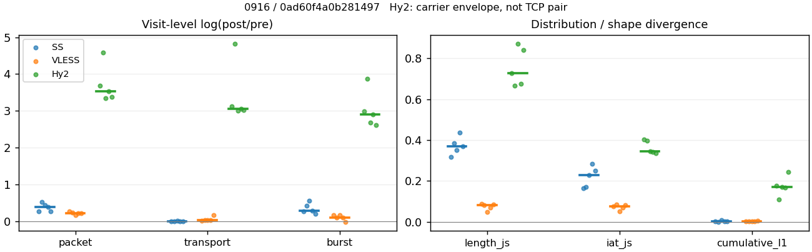
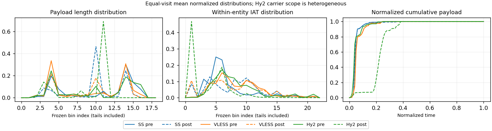

# 0916 · 条目 019 · github.com

目标：https://github.com/scikit-learn/scikit-learn

活动标签：github.com::repository_view。选定访问 15 次。

[返回总索引](../../README.md) · [统计口径](../../methods.md)

## 覆盖与资格（每次访问均保留）

| 部署 | 重复 | 主请求路由 | 活动状态 | 代理比较 | DIRECT pre | 请求 proxy/direct/unresolved | 错误 |
| --- | --- | --- | --- | --- | --- | --- | --- |
| Hy2 | 1 | proxy | passed | 1 | 0 | 172/0/0 | [] |
| Hy2 | 2 | proxy | passed | 1 | 0 | 191/0/0 | [] |
| Hy2 | 3 | proxy | passed | 1 | 0 | 191/0/0 | [] |
| Hy2 | 4 | proxy | passed | 1 | 0 | 192/0/0 | [] |
| Hy2 | 5 | proxy | passed | 1 | 0 | 195/0/0 | [] |
| SS | 1 | proxy | passed | 1 | 0 | 163/0/0 | [] |
| SS | 2 | proxy | passed | 1 | 0 | 191/0/0 | [] |
| SS | 3 | proxy | passed | 1 | 0 | 190/0/0 | [] |
| SS | 4 | proxy | passed | 1 | 0 | 170/0/0 | [] |
| SS | 5 | proxy | passed | 1 | 0 | 192/0/0 | [] |
| VLESS | 1 | proxy | passed | 1 | 0 | 191/0/0 | [] |
| VLESS | 2 | proxy | passed | 1 | 0 | 191/0/0 | [] |
| VLESS | 3 | proxy | passed | 1 | 0 | 191/0/0 | [] |
| VLESS | 4 | proxy | passed | 1 | 0 | 193/0/0 | [] |
| VLESS | 5 | proxy | passed | 1 | 0 | 191/0/0 | [] |

主请求非 proxy 的统计仅解释为已索引的辅助代理连接或 DIRECT 观测，不代表目标业务经代理传输。播放确认与配对资格是两道不同的门。

图中散点为单次访问，短线为重复中位数；Hy2 是共享载体包络，不能与 TCP 配对作等范围因果对比。

形态图先逐访问归一化，再对访问等权平均；实线 pre，虚线 post。分箱序号及边界见 methods，不将分箱索引误解为长度或时间。

## 每次访问的关键观测

### SS

范围：`exclusive_page`。每格 pre → post；空值为不可观测/不适用。

| 重复 | 包数 | 载荷字节 | burst | TCP FR | IAT中位µs | length JS | IAT JS |
| --- | --- | --- | --- | --- | --- | --- | --- |
| 1 | 1691 → 2217 | 2.0942e+06 → 2.0774e+06 | 1196 → 1560 | 76 → 80 | 18.18 → 108.48 | 0.31708 | 0.16434 |
| 2 | 1404 → 2376 | 2.3877e+06 → 2.3923e+06 | 1024 → 1550 | 117 → 129 | 32.999 → 154.51 | 0.38564 | 0.16953 |
| 3 | 1648 → 2559 | 2.3664e+06 → 2.3921e+06 | 981 → 1702 | 107 → 113 | 28.466 → 265.13 | 0.35192 | 0.22827 |
| 4 | 2334 → 3441 | 3.3264e+06 → 3.3398e+06 | 1654 → 2185 | 89 → 94 | 21.576 → 158.17 | 0.43645 | 0.28303 |
| 5 | 1861 → 2433 | 2.4181e+06 → 2.4088e+06 | 1297 → 1577 | 103 → 102 | 20.987 → 164.49 | 0.36877 | 0.25021 |

完整标量统计：中位数 [min,max]；Δ 为重复内逐访问变换的中位数，MAD 未缩放。n 为可用变换数；DIRECT-only 的 nΔ=0 不代表 pre 不可用。

| scope | 特征 | pre | post | Δ | IQRΔ | MADΔ | nΔ |
| --- | --- | --- | --- | --- | --- | --- | --- |
| exclusive_page | active_span_sum_s_1000ms | 18.808 [14.154, 21.146] | 19.725 [16.951, 22.842] | 0.077144 | 0.030331 | 0.02954 | 5 |
| exclusive_page | active_span_sum_s_100ms | 3.5972 [3.0669, 4.4621] | 6.9406 [6.3373, 8.32] | 0.65724 | 0.034514 | 0.034206 | 5 |
| exclusive_page | active_span_sum_s_500ms | 13.161 [11.395, 16.297] | 17.016 [15.392, 20.437] | 0.25687 | 0.074294 | 0.043804 | 5 |
| exclusive_page | burst_bytes_iqr | 2440 [2069, 2896] | 2856 [2129, 2856] | -0.013908 | 0.27852 | 0.12244 | 5 |
| exclusive_page | burst_bytes_mad | 37 [0, 64] | 34 [20, 40] | -0.11088 | 0.18008 | 0.11479 | 4 |
| exclusive_page | burst_bytes_max | 31202 [26480, 32905] | 21420 [15924, 29236] | -0.4293 | 0.23738 | 0.15879 | 5 |
| exclusive_page | burst_bytes_mean | 2011.1 [1751, 2412.3] | 1527.5 [1331.7, 1543.4] | -0.27438 | 0.13883 | 0.07507 | 5 |
| exclusive_page | burst_bytes_median | 37 [0, 64] | 34 [20, 40] | -0.11088 | 0.18008 | 0.11479 | 4 |
| exclusive_page | burst_bytes_min | 0 [0, 0] | 0 [0, 0] | — | — | — | 0 |
| exclusive_page | burst_bytes_p95 | 9583 [8192, 14896] | 5712 [4287.7, 7140] | -0.64741 | 0.47178 | 0.31112 | 5 |
| exclusive_page | burst_bytes_q25 | 0 [0, 0] | 0 [0, 0] | — | — | — | 0 |
| exclusive_page | burst_bytes_q75 | 2440 [2069, 2896] | 2856 [2129, 2856] | -0.013908 | 0.27852 | 0.12244 | 5 |
| exclusive_page | burst_bytes_std | 4450.9 [3880.2, 5089.4] | 2398.3 [2281.3, 2591.9] | -0.54749 | 0.12435 | 0.070858 | 5 |
| exclusive_page | burst_count | 1196 [981, 1654] | 1577 [1550, 2185] | 0.27842 | 0.14884 | 0.082949 | 5 |
| exclusive_page | burst_duration_ms_iqr | 0 [0, 0.04386] | 0.0002225 [0, 0.1488] | 1.2216 | — | — | 1 |
| exclusive_page | burst_duration_ms_mad | 0 [0, 0] | 0 [0, 0] | — | — | — | 0 |
| exclusive_page | burst_duration_ms_max | 15000 [15000, 15001] | 30101 [15490, 42808] | 0.69648 | 0.0070142 | 0.0055069 | 5 |
| exclusive_page | burst_duration_ms_mean | 48.508 [36.365, 76.615] | 83.131 [40.996, 111.81] | 0.1463 | 0.88401 | 0.31456 | 5 |
| exclusive_page | burst_duration_ms_median | 0 [0, 0] | 0 [0, 0] | — | — | — | 0 |
| exclusive_page | burst_duration_ms_min | 0 [0, 0] | 0 [0, 0] | — | — | — | 0 |
| exclusive_page | burst_duration_ms_p95 | 20.408 [2.5239, 94.246] | 3.182 [0.98671, 4.4878] | -1.8584 | 2.0564 | 0.91923 | 5 |
| exclusive_page | burst_duration_ms_q25 | 0 [0, 0] | 0 [0, 0] | — | — | — | 0 |
| exclusive_page | burst_duration_ms_q75 | 0 [0, 0.04386] | 0.0002225 [0, 0.1488] | 1.2216 | — | — | 1 |
| exclusive_page | burst_duration_ms_std | 641.21 [470.62, 837.47] | 1192.4 [725.06, 1365.1] | 0.41586 | 0.40158 | 0.33905 | 5 |
| exclusive_page | burst_packets_iqr | 0 [0, 1] | 1 [0, 1] | 0 | — | — | 1 |
| exclusive_page | burst_packets_mad | 0 [0, 0] | 0 [0, 0] | — | — | — | 0 |
| exclusive_page | burst_packets_max | 11 [8, 12] | 12 [11, 13] | 0.080043 | 0.16705 | 0.080043 | 5 |
| exclusive_page | burst_packets_mean | 1.4139 [1.3711, 1.6799] | 1.5329 [1.4212, 1.5748] | 0.072541 | 0.10463 | 0.039014 | 5 |
| exclusive_page | burst_packets_median | 1 [1, 1] | 1 [1, 1] | 0 | 0 | 0 | 5 |
| exclusive_page | burst_packets_min | 1 [1, 1] | 1 [1, 1] | 0 | 0 | 0 | 5 |
| exclusive_page | burst_packets_p95 | 3 [3, 4] | 4 [3, 4] | 0.28768 | 0.28768 | 0 | 5 |
| exclusive_page | burst_packets_q25 | 1 [1, 1] | 1 [1, 1] | 0 | 0 | 0 | 5 |
| exclusive_page | burst_packets_q75 | 1 [1, 2] | 2 [1, 2] | 0.69315 | 0.69315 | 0 | 5 |
| exclusive_page | burst_packets_std | 1.2925 [0.77118, 1.5646] | 1.0157 [0.89832, 1.1077] | -0.25015 | 0.23109 | 0.13821 | 5 |
| exclusive_page | connection_span_concurrency_max | 6 [6, 6] | 6 [6, 6] | 0 | 0 | 0 | 5 |
| exclusive_page | cumulative_l1 | — | — | 0.0021888 | 0.0011856 | 0.00077491 | 5 |
| exclusive_page | cumulative_max | — | — | 0.19231 | 0.11977 | 0.052004 | 5 |
| exclusive_page | direction_entropy | 0.78267 [0.71261, 0.91432] | 0.52877 [0.39408, 0.57371] | -0.25429 | 0.10583 | 0.045334 | 5 |
| exclusive_page | down_burst_count | 593 [486, 822] | 783 [769, 1088] | 0.28036 | 0.15089 | 0.083368 | 5 |
| exclusive_page | down_ip_bytes | 2.3169e+06 [2.0851e+06, 3.3104e+06] | 2.3445e+06 [2.0706e+06, 3.3424e+06] | 0.0096281 | 0.013156 | 0.0029707 | 5 |
| exclusive_page | down_packets | 1038 [745, 1409] | 1405 [1245, 2105] | 0.38076 | 0.14482 | 0.12414 | 5 |
| exclusive_page | down_transport_bytes | 2.278e+06 [2.0334e+06, 3.2371e+06] | 2.273e+06 [2.0057e+06, 3.2328e+06] | -0.0022034 | 0.0072825 | 0.0040136 | 5 |
| exclusive_page | duration_s | 65.774 [64.721, 66.398] | 65.773 [65.115, 66.659] | 0.0035255 | 0.0039208 | 0.003533 | 5 |
| exclusive_page | entity_count | 10 [10, 12] | 10 [10, 12] | 0 | 0 | 0 | 5 |
| exclusive_page | fr_runs | 103 [76, 117] | 102 [80, 129] | 0.054559 | 0.0033651 | 0.0032657 | 5 |
| exclusive_page | fr_runs_per_packet | 0.095106 [0.063571, 0.15294] | 0.070784 [0.044007, 0.091489] | -0.024322 | 0.01103 | 0.0062721 | 5 |
| exclusive_page | fr_switches | 92 [66, 105] | 91 [70, 117] | 0.060018 | 0.0025284 | 0.0013509 | 5 |
| exclusive_page | fr_switches_per_possible_transition | 0.085821 [0.056835, 0.13944] | 0.063636 [0.039511, 0.083691] | -0.022185 | 0.010534 | 0.005673 | 5 |
| exclusive_page | full_retransmission_fraction | 0.0068552 [0.0035613, 0.013601] | 0.006734 [0.003778, 0.011333] | -0.0030772 | 0.0069644 | 0.0019541 | 5 |
| exclusive_page | full_retransmission_packets | 16 [5, 23] | 16 [13, 29] | -0.19106 | 1.2724 | 0.077209 | 5 |
| exclusive_page | iat_count | 1681 [1392, 2324] | 2422 [2207, 3431] | 0.38956 | 0.16998 | 0.11732 | 5 |
| exclusive_page | iat_js | — | — | 0.22827 | 0.080681 | 0.054759 | 5 |
| exclusive_page | iat_ks | — | — | 0.36013 | 0.10912 | 0.032433 | 5 |
| exclusive_page | iat_median_us | 21.576 [18.18, 32.999] | 158.17 [108.48, 265.13] | 1.9921 | 0.27269 | 0.20584 | 5 |
| exclusive_page | iat_us_iqr | 71.855 [44.069, 131.84] | 957.55 [848.87, 1011.8] | 2.4992 | 0.57774 | 0.36515 | 5 |
| exclusive_page | iat_us_mad | 14.898 [14.182, 25.849] | 157.93 [105.24, 259.04] | 2.3625 | 0.3967 | 0.23911 | 5 |
| exclusive_page | iat_us_max | 1.5001e+07 [1.5001e+07, 1.5001e+07] | 1.5449e+07 [1.5332e+07, 1.549e+07] | 0.029399 | 0.0035125 | 0.0026494 | 5 |
| exclusive_page | iat_us_mean | 1.605e+05 [83490, 1.9543e+05] | 1.2269e+05 [47876, 1.4382e+05] | -0.43963 | 0.24481 | 0.11649 | 5 |
| exclusive_page | iat_us_median | 21.576 [18.18, 32.999] | 158.17 [108.48, 265.13] | 1.9921 | 0.27269 | 0.20584 | 5 |
| exclusive_page | iat_us_min | 0.304 [0.104, 0.358] | 0.035 [0.032, 0.038] | -2.1617 | 0.35222 | 0.16351 | 5 |
| exclusive_page | iat_us_p95 | 71078 [17489, 1.0176e+05] | 37593 [15945, 41021] | -0.63697 | 0.59159 | 0.27153 | 5 |
| exclusive_page | iat_us_q25 | 11.798 [10.723, 13.545] | 9.102 [7.6775, 14.409] | -0.25961 | 0.07464 | 0.074486 | 5 |
| exclusive_page | iat_us_q75 | 82.578 [55.867, 144.43] | 971.96 [857.97, 1021.5] | 2.3688 | 0.51938 | 0.32175 | 5 |
| exclusive_page | iat_us_std | 1.3959e+06 [9.6358e+05, 1.5865e+06] | 1.2439e+06 [7.3899e+05, 1.3982e+06] | -0.22068 | 0.15004 | 0.068934 | 5 |
| exclusive_page | iat_wasserstein_log1p_us | — | — | 1.2901 | 0.26739 | 0.15125 | 5 |
| exclusive_page | idle_gap_count_1000ms | 26 [14, 29] | 22 [12, 29] | 0 | 0.21131 | 0.1092 | 5 |
| exclusive_page | idle_gap_count_100ms | 70 [48, 77] | 71 [51, 79] | 0.060625 | 0.078597 | 0.046347 | 5 |
| exclusive_page | idle_gap_count_500ms | 29 [22, 36] | 25 [14, 35] | -0.12783 | 0.061409 | 0.040822 | 5 |
| exclusive_page | idle_gap_sum_s_1000ms | 278.12 [114.48, 301.59] | 277.44 [115, 299.68] | -0.0025396 | 0.0092191 | 0.0070437 | 5 |
| exclusive_page | idle_gap_sum_s_100ms | 293.33 [131.16, 317.04] | 290.22 [129.52, 313.95] | -0.010661 | 0.0028135 | 0.0019615 | 5 |
| exclusive_page | idle_gap_sum_s_500ms | 282.6 [119.33, 306.95] | 280.19 [117.4, 303.92] | -0.011893 | 0.0063907 | 0.0033595 | 5 |
| exclusive_page | ip_bytes | 2.461e+06 [2.1826e+06, 3.448e+06] | 2.5423e+06 [2.2098e+06, 3.5458e+06] | 0.027964 | 0.013409 | 0.0080172 | 5 |
| exclusive_page | length_iqr | 2648 [2648, 4253] | 1428 [912, 2574] | -0.84411 | 0.44839 | 0.22658 | 5 |
| exclusive_page | length_js | — | — | 0.36877 | 0.033715 | 0.016872 | 5 |
| exclusive_page | length_ks | — | — | 0.44439 | 0.028161 | 0.021322 | 5 |
| exclusive_page | length_mad | 1601 [928, 2756] | 193.5 [0, 1311] | -1.4679 | 2.6083 | 1.3354 | 4 |
| exclusive_page | length_max | 8948 [8948, 8948] | 8568 [8568, 9996] | -0.043396 | 0.15415 | 0 | 5 |
| exclusive_page | length_mean | 2277.6 [2098.4, 3121.2] | 1671.6 [1532.4, 1696.7] | -0.39629 | 0.12898 | 0.10686 | 5 |
| exclusive_page | length_median | 2362 [1968, 2896] | 1428 [1428, 1428] | -0.50323 | 0.30802 | 0.18249 | 5 |
| exclusive_page | length_min | 31 [8, 31] | 20 [13, 20] | -0.43825 | 0 | 0 | 5 |
| exclusive_page | length_p95 | 8192 [4760, 8192] | 2856 [2856, 2856] | -1.0537 | 0.20419 | 0 | 5 |
| exclusive_page | length_q25 | 248 [91, 248] | 1428 [282, 1428] | 1.7506 | 0.073178 | 0.073178 | 5 |
| exclusive_page | length_q75 | 2896 [2896, 4344] | 2856 [2340, 2856] | -0.11787 | 0.19927 | 0.10396 | 5 |
| exclusive_page | length_std | 2143.9 [1781.6, 3091.4] | 1149.1 [1129.3, 1217.2] | -0.60606 | 0.099333 | 0.059314 | 5 |
| exclusive_page | length_wasserstein_bytes | — | — | 1022.3 | 195.17 | 149.59 | 5 |
| exclusive_page | nonempty_entity_count | 10 [10, 12] | 10 [10, 12] | 0 | 0 | 0 | 5 |
| exclusive_page | nonempty_packets | 1039 [765, 1400] | 1441 [1234, 2136] | 0.40707 | 0.13686 | 0.12147 | 5 |
| exclusive_page | offload_suspect_fraction | 0.34004 [0.31054, 0.35922] | 0.18358 [0.16687, 0.19187] | -0.15645 | 0.015578 | 0.010897 | 5 |
| exclusive_page | packet_count | 1691 [1404, 2334] | 2433 [2217, 3441] | 0.38818 | 0.16922 | 0.11734 | 5 |
| exclusive_page | rtt_median_ms | 0.025194 [0.012465, 0.061501] | 29.093 [27.447, 32.606] | 7.0823 | 0.46873 | 0.38541 | 5 |
| exclusive_page | rtt_sample_count | 641 [563, 900] | 368 [337, 437] | -0.64295 | 0.33119 | 0.21775 | 5 |
| exclusive_page | tcp_ack_count | 1681 [1392, 2322] | 2419 [2206, 3430] | 0.39013 | 0.16926 | 0.11834 | 5 |
| exclusive_page | tcp_fin_count | 20 [19, 24] | 24 [19, 27] | 0.11778 | 0.052751 | 0.030772 | 5 |
| exclusive_page | tcp_packet_count | 1691 [1404, 2334] | 2433 [2217, 3441] | 0.38818 | 0.16922 | 0.11734 | 5 |
| exclusive_page | tcp_rst_count | 0 [0, 2] | 0 [0, 1] | -0.69315 | — | — | 1 |
| exclusive_page | tcp_syn_count | 20 [20, 24] | 23 [20, 25] | 0.04879 | 0.12783 | 0.04879 | 5 |
| exclusive_page | tcp_window_raw_median | 65535 [65379, 65535] | 161 [153, 168] | -6.0089 | 0.078156 | 0.04256 | 5 |
| exclusive_page | transition_entropy | 0.38966 [0.28856, 0.55893] | 0.29325 [0.19167, 0.34975] | -0.096895 | 0.023448 | 0.022959 | 5 |
| exclusive_page | transition_n_mm | 765 [455, 1069] | 1195 [1066, 1923] | 0.57183 | 0.16056 | 0.14522 | 5 |
| exclusive_page | transition_n_mp | 41 [28, 47] | 41 [30, 53] | 0.065958 | 0.013423 | 0.010388 | 5 |
| exclusive_page | transition_n_pm | 51 [38, 58] | 50 [40, 64] | 0.05506 | 0.014665 | 0.010898 | 5 |
| exclusive_page | transition_n_pp | 193 [157, 242] | 126 [88, 144] | -0.42641 | 0.21 | 0.097904 | 5 |
| exclusive_page | transition_p_mm | 0.95006 [0.90637, 0.9683] | 0.96683 [0.95613, 0.98112] | 0.016768 | 0.00858 | 0.0046378 | 5 |
| exclusive_page | transition_p_mp | 0.049939 [0.031703, 0.093625] | 0.033172 [0.018878, 0.043874] | -0.016768 | 0.00858 | 0.0046378 | 5 |
| exclusive_page | transition_p_pm | 0.20319 [0.15385, 0.23108] | 0.30108 [0.25773, 0.33684] | 0.10577 | 0.03647 | 0.02352 | 5 |
| exclusive_page | transition_p_pp | 0.79681 [0.76892, 0.84615] | 0.69892 [0.66316, 0.74227] | -0.10577 | 0.03647 | 0.02352 | 5 |
| exclusive_page | transport_bytes | 2.3877e+06 [2.0942e+06, 3.3264e+06] | 2.3923e+06 [2.0774e+06, 3.3398e+06] | 0.0019435 | 0.0078788 | 0.0057783 | 5 |
| exclusive_page | up_burst_count | 603 [495, 832] | 794 [781, 1097] | 0.2765 | 0.14683 | 0.082526 | 5 |
| exclusive_page | up_byte_fraction | 0.045136 [0.026844, 0.0496] | 0.049875 [0.032044, 0.054114] | 0.0051997 | 0.00094174 | 0.00068542 | 5 |
| exclusive_page | up_ip_bytes | 1.3873e+05 [97508, 1.6048e+05] | 1.9924e+05 [1.3919e+05, 2.034e+05] | 0.35588 | 0.10155 | 0.034634 | 5 |
| exclusive_page | up_packets | 698 [610, 925] | 1028 [972, 1336] | 0.36764 | 0.092871 | 0.056366 | 5 |
| exclusive_page | up_transport_bytes | 1.0681e+05 [60856, 1.1994e+05] | 1.1932e+05 [71702, 1.3035e+05] | 0.16401 | 0.096685 | 0.019717 | 5 |
| exclusive_page | zero_iat_count | 0 [0, 0] | 0 [0, 0] | — | — | — | 0 |
| exclusive_page | zero_iat_fraction | 0 [0, 0] | 0 [0, 0] | 0 | 0 | 0 | 5 |

### VLESS

范围：`exclusive_page`。每格 pre → post；空值为不可观测/不适用。

| 重复 | 包数 | 载荷字节 | burst | TCP FR | IAT中位µs | length JS | IAT JS |
| --- | --- | --- | --- | --- | --- | --- | --- |
| 1 | 1816 → 2369 | 2.3446e+06 → 2.3961e+06 | 1221 → 1439 | 104 → 124 | 140.12 → 59.302 | 0.087067 | 0.075953 |
| 2 | 1866 → 2356 | 2.2812e+06 → 2.3447e+06 | 1324 → 1457 | 98 → 114 | 80.419 → 47.125 | 0.083079 | 0.085272 |
| 3 | 2150 → 2561 | 2.258e+06 → 2.3223e+06 | 1498 → 1776 | 98 → 114 | 111.34 → 84.141 | 0.048207 | 0.04976 |
| 4 | 2159 → 2678 | 2.3638e+06 → 2.4192e+06 | 1538 → 1712 | 107 → 132 | 125.95 → 65.885 | 0.068204 | 0.068894 |
| 5 | 602 → 746 | 3.6656e+05 → 4.3326e+05 | 432 → 427 | 61 → 78 | 134.91 → 592.91 | 0.084472 | 0.080721 |

完整标量统计：中位数 [min,max]；Δ 为重复内逐访问变换的中位数，MAD 未缩放。n 为可用变换数；DIRECT-only 的 nΔ=0 不代表 pre 不可用。

| scope | 特征 | pre | post | Δ | IQRΔ | MADΔ | nΔ |
| --- | --- | --- | --- | --- | --- | --- | --- |
| exclusive_page | active_span_sum_s_1000ms | 16.273 [14.747, 18.795] | 16.436 [14.598, 17.905] | -0.0039104 | 0.020171 | 0.013897 | 5 |
| exclusive_page | active_span_sum_s_100ms | 2.7403 [1.6582, 3.5613] | 6.2206 [4.8953, 7.2539] | 0.8198 | 0.12603 | 0.1084 | 5 |
| exclusive_page | active_span_sum_s_500ms | 8.8247 [7.4056, 9.1299] | 14.222 [12.484, 15.818] | 0.52222 | 0.035308 | 0.027382 | 5 |
| exclusive_page | burst_bytes_iqr | 2824 [1163, 2896] | 2824 [1686, 2896] | 0.025176 | 0.025176 | 0.025176 | 5 |
| exclusive_page | burst_bytes_mad | 35 [0, 48] | 72 [35, 72] | 0.70723 | 0.13043 | 0.074766 | 4 |
| exclusive_page | burst_bytes_max | 29874 [25240, 40652] | 23168 [14120, 43440] | -0.56228 | 0.96295 | 0.20812 | 5 |
| exclusive_page | burst_bytes_mean | 1536.9 [848.52, 1920.2] | 1413.1 [1014.7, 1665.1] | -0.084004 | 0.073906 | 0.058153 | 5 |
| exclusive_page | burst_bytes_median | 35 [0, 48] | 72 [35, 72] | 0.70723 | 0.13043 | 0.074766 | 4 |
| exclusive_page | burst_bytes_min | 0 [0, 0] | 0 [0, 0] | — | — | — | 0 |
| exclusive_page | burst_bytes_p95 | 5864 [2896, 11584] | 4396.2 [2896, 5864] | -0.37996 | 0.3805 | 0.28863 | 5 |
| exclusive_page | burst_bytes_q25 | 0 [0, 0] | 0 [0, 0] | — | — | — | 0 |
| exclusive_page | burst_bytes_q75 | 2824 [1163, 2896] | 2824 [1686, 2896] | 0.025176 | 0.025176 | 0.025176 | 5 |
| exclusive_page | burst_bytes_std | 3334.4 [2154.3, 4001.4] | 2311.6 [1690.1, 2762.8] | -0.37038 | 0.080492 | 0.070221 | 5 |
| exclusive_page | burst_count | 1324 [432, 1538] | 1457 [427, 1776] | 0.10718 | 0.068556 | 0.057099 | 5 |
| exclusive_page | burst_duration_ms_iqr | 0.073078 [0.030045, 0.81699] | 0.0090682 [0.000431, 2.0524] | -1.4543 | 1.2743 | 1.0179 | 5 |
| exclusive_page | burst_duration_ms_mad | 0 [0, 0] | 0 [0, 0] | — | — | — | 0 |
| exclusive_page | burst_duration_ms_max | 15000 [15000, 15001] | 15132 [14976, 15480] | 0.0087287 | 0.015892 | 0.010406 | 5 |
| exclusive_page | burst_duration_ms_mean | 28.692 [22.764, 82.337] | 58.398 [29.026, 212.93] | 0.80884 | 0.43832 | 0.14128 | 5 |
| exclusive_page | burst_duration_ms_median | 0 [0, 0] | 0 [0, 0] | — | — | — | 0 |
| exclusive_page | burst_duration_ms_min | 0 [0, 0] | 0 [0, 0] | — | — | — | 0 |
| exclusive_page | burst_duration_ms_p95 | 8.6547 [7.6859, 219.97] | 9.4202 [9.2682, 201.93] | 0.068491 | 0.11479 | 0.070281 | 5 |
| exclusive_page | burst_duration_ms_q25 | 0 [0, 0] | 0 [0, 0] | — | — | — | 0 |
| exclusive_page | burst_duration_ms_q75 | 0.073078 [0.030045, 0.81699] | 0.0090682 [0.000431, 2.0524] | -1.4543 | 1.2743 | 1.0179 | 5 |
| exclusive_page | burst_duration_ms_std | 453.81 [400.15, 780.49] | 868.76 [557.9, 1633.8] | 0.68219 | 0.27032 | 0.056556 | 5 |
| exclusive_page | burst_packets_iqr | 1 [1, 1] | 1 [1, 1] | 0 | 0 | 0 | 5 |
| exclusive_page | burst_packets_mad | 0 [0, 0] | 0 [0, 0] | — | — | — | 0 |
| exclusive_page | burst_packets_max | 15 [4, 16] | 12 [11, 14] | -0.22314 | 0.28768 | 0.15155 | 5 |
| exclusive_page | burst_packets_mean | 1.4094 [1.3935, 1.4873] | 1.617 [1.442, 1.7471] | 0.10825 | 0.035893 | 0.0292 | 5 |
| exclusive_page | burst_packets_median | 1 [1, 1] | 1 [1, 1] | 0 | 0 | 0 | 5 |
| exclusive_page | burst_packets_min | 1 [1, 1] | 1 [1, 1] | 0 | 0 | 0 | 5 |
| exclusive_page | burst_packets_p95 | 3 [2, 3] | 4 [3, 4.7] | 0.28768 | 0.28768 | 0.28768 | 5 |
| exclusive_page | burst_packets_q25 | 1 [1, 1] | 1 [1, 1] | 0 | 0 | 0 | 5 |
| exclusive_page | burst_packets_q75 | 2 [2, 2] | 2 [2, 2] | 0 | 0 | 0 | 5 |
| exclusive_page | burst_packets_std | 0.92959 [0.57955, 0.97173] | 1.2046 [0.97838, 1.5015] | 0.25829 | 0.11918 | 0.11828 | 5 |
| exclusive_page | connection_span_concurrency_max | 4 [4, 8] | 4 [4, 8] | 0 | 0 | 0 | 5 |
| exclusive_page | cumulative_l1 | — | — | 0.0012796 | 0.000166 | 0.00011818 | 5 |
| exclusive_page | cumulative_max | — | — | 0.033388 | 0.034777 | 0.015959 | 5 |
| exclusive_page | direction_entropy | 0.72703 [0.658, 0.87612] | 0.53378 [0.5021, 0.9183] | -0.16866 | 0.037351 | 0.024596 | 5 |
| exclusive_page | down_burst_count | 658 [212, 764] | 725 [210, 884] | 0.10784 | 0.068436 | 0.057558 | 5 |
| exclusive_page | down_ip_bytes | 2.2227e+06 [2.8279e+05, 2.3122e+06] | 2.2819e+06 [3.3812e+05, 2.3651e+06] | 0.026103 | 0.0061819 | 0.0034882 | 5 |
| exclusive_page | down_packets | 1083 [329, 1282] | 1397 [392, 1527] | 0.20337 | 0.070691 | 0.042528 | 5 |
| exclusive_page | down_transport_bytes | 2.1615e+06 [2.6562e+05, 2.2473e+06] | 2.2108e+06 [3.1767e+05, 2.2856e+06] | 0.022542 | 0.0062962 | 0.0056549 | 5 |
| exclusive_page | duration_s | 67.188 [64.339, 68.004] | 67.168 [64.296, 67.966] | -0.00055782 | 0.00027241 | 0.00011622 | 5 |
| exclusive_page | entity_count | 8 [8, 10] | 8 [8, 10] | 0 | 0 | 0 | 5 |
| exclusive_page | fr_runs | 98 [61, 107] | 114 [78, 132] | 0.17589 | 0.058742 | 0.02466 | 5 |
| exclusive_page | fr_runs_per_packet | 0.089826 [0.075443, 0.19614] | 0.08577 [0.078893, 0.20312] | 0.0018484 | 0.0091785 | 0.0051351 | 5 |
| exclusive_page | fr_switches | 90 [53, 97] | 106 [70, 122] | 0.19106 | 0.065681 | 0.027426 | 5 |
| exclusive_page | fr_switches_per_possible_transition | 0.083102 [0.069713, 0.17492] | 0.079791 [0.073765, 0.18617] | 0.0031109 | 0.0082326 | 0.0072921 | 5 |
| exclusive_page | full_retransmission_fraction | 0.0016077 [0, 0.0060213] | 0 [0, 0.0013405] | -0.0016077 | 0.0040257 | 0.0029482 | 5 |
| exclusive_page | full_retransmission_packets | 3 [0, 13] | 0 [0, 1] | — | — | — | 0 |
| exclusive_page | iat_count | 1858 [594, 2149] | 2360 [738, 2668] | 0.21706 | 0.017737 | 0.016999 | 5 |
| exclusive_page | iat_js | — | — | 0.075953 | 0.011827 | 0.0070589 | 5 |
| exclusive_page | iat_ks | — | — | 0.14675 | 0.03204 | 0.022132 | 5 |
| exclusive_page | iat_median_us | 125.95 [80.419, 140.12] | 65.885 [47.125, 592.91] | -0.53445 | 0.36786 | 0.25437 | 5 |
| exclusive_page | iat_us_iqr | 1031.4 [839.01, 3977.1] | 994.63 [877.83, 9066.6] | -0.013169 | 0.081568 | 0.058399 | 5 |
| exclusive_page | iat_us_mad | 119.02 [73.808, 133.49] | 65.778 [47.017, 588.52] | -0.45096 | 0.35664 | 0.2146 | 5 |
| exclusive_page | iat_us_max | 1.5001e+07 [1.5001e+07, 1.5001e+07] | 1.5379e+07 [1.5312e+07, 1.548e+07] | 0.024905 | 0.0012299 | 0.00073693 | 5 |
| exclusive_page | iat_us_mean | 95656 [60856, 3.4511e+05] | 80164 [46445, 2.7755e+05] | -0.21869 | 0.016983 | 0.016153 | 5 |
| exclusive_page | iat_us_median | 125.95 [80.419, 140.12] | 65.885 [47.125, 592.91] | -0.53445 | 0.36786 | 0.25437 | 5 |
| exclusive_page | iat_us_min | 0.171 [0.028, 0.375] | 0.032 [0.031, 0.037] | -1.7077 | 0.85048 | 0.56695 | 5 |
| exclusive_page | iat_us_p95 | 10273 [9529.6, 3.2109e+05] | 41260 [38584, 1.585e+05] | 1.371 | 0.091456 | 0.039817 | 5 |
| exclusive_page | iat_us_q25 | 27.731 [23.972, 29.146] | 11.422 [7.9835, 16.02] | -0.92274 | 0.13966 | 0.12559 | 5 |
| exclusive_page | iat_us_q75 | 1055.4 [866.74, 4003.6] | 1002.6 [890.33, 9082.7] | -0.030257 | 0.078165 | 0.057105 | 5 |
| exclusive_page | iat_us_std | 1.0936e+06 [8.2448e+05, 2.0603e+06] | 1.0089e+06 [7.2158e+05, 1.8745e+06] | -0.10163 | 0.014122 | 0.0071632 | 5 |
| exclusive_page | iat_wasserstein_log1p_us | — | — | 0.7284 | 0.12077 | 0.046534 | 5 |
| exclusive_page | idle_gap_count_1000ms | 16 [10, 17] | 15 [10, 16] | -0.060625 | 0.060625 | 0.0039139 | 5 |
| exclusive_page | idle_gap_count_100ms | 54 [51, 55] | 60 [58, 63] | 0.090151 | 0.04879 | 0.018692 | 5 |
| exclusive_page | idle_gap_count_500ms | 28 [22, 28] | 18 [12, 19] | -0.40547 | 0.11123 | 0.0177 | 5 |
| exclusive_page | idle_gap_sum_s_1000ms | 185.76 [92.946, 190.25] | 185.44 [92.655, 190.23] | -0.0017303 | 0.002357 | 0.0014013 | 5 |
| exclusive_page | idle_gap_sum_s_100ms | 199.47 [106.68, 203.34] | 195.94 [102.95, 199.94] | -0.018563 | 0.0068017 | 0.0016976 | 5 |
| exclusive_page | idle_gap_sum_s_500ms | 193.21 [101.04, 197.59] | 187.66 [94.074, 192.35] | -0.029629 | 0.015333 | 0.0027416 | 5 |
| exclusive_page | ip_bytes | 2.3782e+06 [3.9782e+05, 2.4761e+06] | 2.4683e+06 [4.7244e+05, 2.5601e+06] | 0.03602 | 0.0038886 | 0.0026894 | 5 |
| exclusive_page | length_iqr | 2747 [1733.5, 2764] | 2617.5 [1376, 2746] | -0.047926 | 0.061888 | 0.042086 | 5 |
| exclusive_page | length_js | — | — | 0.083079 | 0.016268 | 0.0039881 | 5 |
| exclusive_page | length_ks | — | — | 0.12341 | 0.0141 | 0.0089587 | 5 |
| exclusive_page | length_mad | 1376 [477, 1428] | 1340 [800, 1376] | -0.026511 | 0.039164 | 0.026511 | 5 |
| exclusive_page | length_max | 8948 [8948, 8948] | 7240 [2824, 8095] | -0.21181 | 0 | 0 | 5 |
| exclusive_page | length_mean | 1853.9 [1178.6, 2110.3] | 1607.2 [1128.3, 1706.5] | -0.16501 | 0.12472 | 0.052299 | 5 |
| exclusive_page | length_median | 1484 [516, 1520] | 1412 [1208, 1448] | -0.041271 | 0.023351 | 0.016095 | 5 |
| exclusive_page | length_min | 24 [24, 24] | 24 [4, 24] | 0 | 0 | 0 | 5 |
| exclusive_page | length_p95 | 5852.8 [2824, 8652] | 2968 [2824, 3004] | -0.67903 | 0.48203 | 0.27357 | 5 |
| exclusive_page | length_q25 | 77 [72, 78] | 92 [72, 241] | 0.19106 | 0.96069 | 0.19106 | 5 |
| exclusive_page | length_q75 | 2824 [1805.5, 2842] | 2824 [1448, 2824] | 0 | 0.0063537 | 0 | 5 |
| exclusive_page | length_std | 2040.7 [1576.3, 2361.2] | 1308.3 [949.11, 1335.4] | -0.50734 | 0.074559 | 0.062613 | 5 |
| exclusive_page | length_wasserstein_bytes | — | — | 517.16 | 277.26 | 143.86 | 5 |
| exclusive_page | nonempty_entity_count | 8 [8, 10] | 8 [8, 10] | 0 | 0 | 0 | 5 |
| exclusive_page | nonempty_packets | 1111 [311, 1299] | 1411 [384, 1539] | 0.21085 | 0.042445 | 0.022663 | 5 |
| exclusive_page | offload_suspect_fraction | 0.306 [0.14286, 0.31256] | 0.25303 [0.10992, 0.26593] | -0.043693 | 0.0089537 | 0.0060436 | 5 |
| exclusive_page | packet_count | 1866 [602, 2159] | 2369 [746, 2678] | 0.21543 | 0.0187 | 0.017743 | 5 |
| exclusive_page | rtt_median_ms | 0.099599 [0.067794, 0.13458] | 0.059263 [0.05146, 8.9394] | -0.31795 | 0.3514 | 0.3091 | 5 |
| exclusive_page | rtt_sample_count | 726 [236, 827] | 936 [309, 1072] | 0.26951 | 0.01039 | 0.010033 | 5 |
| exclusive_page | tcp_ack_count | 1842 [580, 2131] | 2360 [737, 2668] | 0.23956 | 0.017548 | 0.014822 | 5 |
| exclusive_page | tcp_fin_count | 16 [16, 20] | 17 [16, 20] | 0 | 0 | 0 | 5 |
| exclusive_page | tcp_packet_count | 1866 [602, 2159] | 2369 [746, 2678] | 0.21543 | 0.0187 | 0.017743 | 5 |
| exclusive_page | tcp_rst_count | 16 [14, 18] | 0 [0, 1] | -2.7058 | 0.066766 | 0.066766 | 2 |
| exclusive_page | tcp_syn_count | 16 [16, 20] | 16 [16, 20] | 0 | 0 | 0 | 5 |
| exclusive_page | tcp_window_raw_median | 65535 [65471, 65535] | 215 [139, 221] | -5.7197 | 0.037388 | 0.02353 | 5 |
| exclusive_page | transition_entropy | 0.3754 [0.32504, 0.62126] | 0.33185 [0.31324, 0.66046] | -0.018539 | 0.031544 | 0.024805 | 5 |
| exclusive_page | transition_n_mm | 825 [189, 1029] | 1171 [217, 1292] | 0.27029 | 0.16019 | 0.07994 | 5 |
| exclusive_page | transition_n_mp | 41 [23, 44] | 49 [31, 56] | 0.20909 | 0.062914 | 0.030844 | 5 |
| exclusive_page | transition_n_pm | 49 [30, 53] | 57 [39, 66] | 0.17589 | 0.068132 | 0.02466 | 5 |
| exclusive_page | transition_n_pp | 172 [61, 182] | 110 [89, 116] | -0.45042 | 0.01206 | 0.0086581 | 5 |
| exclusive_page | transition_p_mm | 0.95244 [0.89151, 0.96168] | 0.95846 [0.875, 0.96163] | 0.0011754 | 0.0062919 | 0.0050631 | 5 |
| exclusive_page | transition_p_mp | 0.047564 [0.038318, 0.10849] | 0.041543 [0.038371, 0.125] | -0.0011754 | 0.0062919 | 0.0050631 | 5 |
| exclusive_page | transition_p_pm | 0.22222 [0.22172, 0.32967] | 0.34831 [0.30469, 0.36464] | 0.12609 | 0.014933 | 0.0084382 | 5 |
| exclusive_page | transition_p_pp | 0.77778 [0.67033, 0.77828] | 0.65169 [0.63536, 0.69531] | -0.12609 | 0.014933 | 0.0084382 | 5 |
| exclusive_page | transport_bytes | 2.2812e+06 [3.6656e+05, 2.3638e+06] | 2.3447e+06 [4.3326e+05, 2.4192e+06] | 0.027472 | 0.0049006 | 0.0042964 | 5 |
| exclusive_page | up_burst_count | 666 [220, 774] | 732 [217, 892] | 0.10652 | 0.068678 | 0.056646 | 5 |
| exclusive_page | up_byte_fraction | 0.049261 [0.045138, 0.27538] | 0.05522 [0.049849, 0.2668] | 0.0046602 | 0.0013002 | 0.0012996 | 5 |
| exclusive_page | up_ip_bytes | 1.4707e+05 [1.1504e+05, 1.6394e+05] | 1.752e+05 [1.3432e+05, 1.9497e+05] | 0.17338 | 0.020059 | 0.016775 | 5 |
| exclusive_page | up_packets | 797 [273, 913] | 989 [354, 1151] | 0.25578 | 0.028175 | 0.024134 | 5 |
| exclusive_page | up_transport_bytes | 1.0583e+05 [1.0094e+05, 1.1969e+05] | 1.2245e+05 [1.156e+05, 1.3395e+05] | 0.13553 | 0.011159 | 0.0093011 | 5 |
| exclusive_page | zero_iat_count | 0 [0, 0] | 0 [0, 0] | — | — | — | 0 |
| exclusive_page | zero_iat_fraction | 0 [0, 0] | 0 [0, 0] | 0 | 0 | 0 | 5 |

### Hy2

范围：`carrier_context_envelope`。每格 pre → post；空值为不可观测/不适用。

| 重复 | 包数 | 载荷字节 | burst | TCP FR | IAT中位µs | length JS | IAT JS |
| --- | --- | --- | --- | --- | --- | --- | --- |
| 1 | 1112 → 44234 | 2.0969e+06 → 4.7865e+07 | 749 → 14951 | — | 78.685 → 3.454 | 0.72713 | 0.40275 |
| 2 | 455 → 44889 | 3.8751e+05 → 4.7983e+07 | 333 → 16000 | — | 99.607 → 4.389 | 0.66599 | 0.39878 |
| 3 | 1553 → 44131 | 2.3689e+06 → 4.7847e+07 | 1008 → 14698 | — | 101.8 → 4.806 | 0.87094 | 0.34487 |
| 4 | 1389 → 47763 | 2.3873e+06 → 5.0882e+07 | 937 → 17099 | — | 72.226 → 5.049 | 0.67512 | 0.34361 |
| 5 | 1516 → 44245 | 2.3489e+06 → 4.7999e+07 | 1090 → 14812 | — | 88.578 → 5.533 | 0.83982 | 0.33489 |

完整标量统计：中位数 [min,max]；Δ 为重复内逐访问变换的中位数，MAD 未缩放。n 为可用变换数；DIRECT-only 的 nΔ=0 不代表 pre 不可用。

| scope | 特征 | pre | post | Δ | IQRΔ | MADΔ | nΔ |
| --- | --- | --- | --- | --- | --- | --- | --- |
| carrier_context_envelope | active_span_sum_s_1000ms | 11.883 [8.6647, 12.761] | 23.114 [14.88, 30.432] | 0.74698 | 0.39986 | 0.20649 | 5 |
| carrier_context_envelope | active_span_sum_s_100ms | 1.6423 [1.207, 1.9005] | 9.2707 [7.7572, 9.645] | 1.7308 | 0.032245 | 0.023194 | 5 |
| carrier_context_envelope | active_span_sum_s_500ms | 9.9189 [8.6647, 12.207] | 21.123 [14.239, 24.602] | 0.59613 | 0.39463 | 0.10837 | 5 |
| carrier_context_envelope | burst_bytes_iqr | 1722 [515, 2228.8] | 5094 [4223, 5723] | 0.8973 | 0.48654 | 0.063795 | 5 |
| carrier_context_envelope | burst_bytes_mad | 18 [0, 31] | 347 [261, 388.5] | 2.4153 | 0.38605 | 0.2848 | 3 |
| carrier_context_envelope | burst_bytes_max | 31263 [25991, 32812] | 1.8224e+05 [1.0018e+05, 2.2485e+05] | 1.7258 | 0.12409 | 0.11279 | 5 |
| carrier_context_envelope | burst_bytes_mean | 2350.1 [1163.7, 2799.7] | 3201.5 [2975.7, 3255.3] | 0.32582 | 0.25274 | 0.17059 | 5 |
| carrier_context_envelope | burst_bytes_median | 18 [0, 31] | 380 [294, 421.5] | 2.5062 | 0.37446 | 0.25659 | 3 |
| carrier_context_envelope | burst_bytes_min | 0 [0, 0] | 22 [22, 22] | — | — | — | 0 |
| carrier_context_envelope | burst_bytes_p95 | 15472 [6020.6, 20480] | 11528 [10932, 12373] | -0.22351 | 0.23832 | 0.22458 | 5 |
| carrier_context_envelope | burst_bytes_q25 | 0 [0, 0] | 74 [38, 100] | — | — | — | 0 |
| carrier_context_envelope | burst_bytes_q75 | 1722 [515, 2228.8] | 5168 [4323, 5764] | 0.92046 | 0.47044 | 0.079418 | 5 |
| carrier_context_envelope | burst_bytes_std | 5060.8 [3190.7, 5892.7] | 5176 [4545.1, 6493.9] | 0.0225 | 0.10548 | 0.074655 | 5 |
| carrier_context_envelope | burst_count | 937 [333, 1090] | 14951 [14698, 17099] | 2.9041 | 0.31405 | 0.22435 | 5 |
| carrier_context_envelope | burst_duration_ms_iqr | 0.050534 [0, 0.06544] | 0.024584 [0.023989, 0.028343] | -0.74419 | 0.098303 | 0.064949 | 4 |
| carrier_context_envelope | burst_duration_ms_mad | 0 [0, 0] | 4.5e-05 [4.2e-05, 8.4e-05] | — | — | — | 0 |
| carrier_context_envelope | burst_duration_ms_max | 15001 [15000, 15001] | 10205 [9975.6, 10243] | -0.38521 | 0.026387 | 0.0037379 | 5 |
| carrier_context_envelope | burst_duration_ms_mean | 41.638 [38.975, 154.38] | 2.093 [1.2616, 2.1852] | -3.2021 | 1.2062 | 0.27781 | 5 |
| carrier_context_envelope | burst_duration_ms_median | 0 [0, 0] | 4.5e-05 [4.2e-05, 8.4e-05] | — | — | — | 0 |
| carrier_context_envelope | burst_duration_ms_min | 0 [0, 0] | 0 [0, 0] | — | — | — | 0 |
| carrier_context_envelope | burst_duration_ms_p95 | 11.507 [4.8257, 254.92] | 0.10276 [0.087959, 0.12726] | -4.7183 | 0.85221 | 0.70501 | 5 |
| carrier_context_envelope | burst_duration_ms_q25 | 0 [0, 0] | 0 [0, 0] | — | — | — | 0 |
| carrier_context_envelope | burst_duration_ms_q75 | 0.050534 [0, 0.06544] | 0.024584 [0.023989, 0.028343] | -0.74419 | 0.098303 | 0.064949 | 4 |
| carrier_context_envelope | burst_duration_ms_std | 584.35 [510.99, 1211] | 115.44 [83.62, 120.46] | -1.7112 | 0.80232 | 0.2236 | 5 |
| carrier_context_envelope | burst_packets_iqr | 1 [0, 1] | 3 [2, 3] | 1.0986 | 0.10137 | 0 | 4 |
| carrier_context_envelope | burst_packets_mad | 0 [0, 0] | 1 [1, 1] | — | — | — | 0 |
| carrier_context_envelope | burst_packets_max | 9 [5, 11] | 131 [72, 161] | 2.7656 | 0.52466 | 0.28832 | 5 |
| carrier_context_envelope | burst_packets_mean | 1.4824 [1.3664, 1.5407] | 2.9586 [2.7933, 3.0025] | 0.68954 | 0.052218 | 0.02991 | 5 |
| carrier_context_envelope | burst_packets_median | 1 [1, 1] | 2 [2, 2] | 0.69315 | 0 | 0 | 5 |
| carrier_context_envelope | burst_packets_min | 1 [1, 1] | 1 [1, 1] | 0 | 0 | 0 | 5 |
| carrier_context_envelope | burst_packets_p95 | 3 [2, 3.65] | 8 [8, 9] | 0.98083 | 0.11778 | 0.078332 | 5 |
| carrier_context_envelope | burst_packets_q25 | 1 [1, 1] | 1 [1, 1] | 0 | 0 | 0 | 5 |
| carrier_context_envelope | burst_packets_q75 | 2 [1, 2] | 4 [3, 4] | 0.69315 | 0 | 0 | 5 |
| carrier_context_envelope | burst_packets_std | 0.88834 [0.6696, 1.0931] | 3.4789 [2.946, 4.5067] | 1.4402 | 0.44971 | 0.20759 | 5 |
| carrier_context_envelope | connection_span_concurrency_max | 6 [5, 7] | 1 [1, 1] | -1.7918 | 0 | 0 | 5 |
| carrier_context_envelope | cumulative_l1 | — | — | 0.17056 | 0.0088554 | 0.0064407 | 5 |
| carrier_context_envelope | cumulative_max | — | — | 0.91744 | 0.015237 | 0.012025 | 5 |
| carrier_context_envelope | direction_entropy | 0.8646 [0.81846, 0.99462] | 0.76678 [0.75665, 0.78694] | -0.086883 | 0.012437 | 0.010934 | 5 |
| carrier_context_envelope | direction_run_analog_runs | 97 [64, 105] | 14951 [14698, 17099] | 5.1317 | 0.37936 | 0.19015 | 5 |
| carrier_context_envelope | direction_run_analog_runs_per_packet | 0.11398 [0.10502, 0.32487] | 0.338 [0.33305, 0.358] | 0.22079 | 0.012901 | 0.011898 | 5 |
| carrier_context_envelope | direction_run_analog_switches | 87 [55, 95] | 14950 [14697, 17098] | 5.2249 | 0.41481 | 0.18341 | 5 |
| carrier_context_envelope | direction_run_analog_switches_per_possible_transition | 0.1036 [0.09221, 0.29255] | 0.33798 [0.33304, 0.35798] | 0.23131 | 0.01311 | 0.011241 | 5 |
| carrier_context_envelope | down_burst_count | 464 [162, 540] | 7475 [7349, 8549] | 2.9137 | 0.3161 | 0.22397 | 5 |
| carrier_context_envelope | down_ip_bytes | 2.2939e+06 [2.969e+05, 2.3422e+06] | 4.8235e+07 [4.7924e+07, 5.0902e+07] | 3.0788 | 0.10452 | 0.039365 | 5 |
| carrier_context_envelope | down_packets | 806 [230, 927] | 34500 [34341, 36530] | 3.8138 | 0.28143 | 0.14718 | 5 |
| carrier_context_envelope | down_transport_bytes | 2.2484e+06 [2.8486e+05, 2.3002e+06] | 4.7269e+07 [4.6962e+07, 4.9879e+07] | 3.0766 | 0.10125 | 0.036247 | 5 |
| carrier_context_envelope | duration_s | 64.377 [61.858, 65.562] | 64.376 [61.857, 65.553] | -8.8418e-05 | 9.7489e-05 | 5.3887e-05 | 5 |
| carrier_context_envelope | entity_count | 9 [9, 10] | 1 [1, 1] | -2.1972 | 0.10536 | 0 | 5 |
| carrier_context_envelope | full_retransmission_fraction | 0.0079156 [0.0043956, 0.0090148] | — | — | — | — | 0 |
| carrier_context_envelope | full_retransmission_packets | 10 [2, 14] | — | — | — | — | 0 |
| carrier_context_envelope | iat_count | 1380 [446, 1543] | 44244 [44130, 47762] | 3.5441 | 0.31117 | 0.16388 | 5 |
| carrier_context_envelope | iat_js | — | — | 0.34487 | 0.055168 | 0.009984 | 5 |
| carrier_context_envelope | iat_ks | — | — | 0.48687 | 0.06746 | 0.0068653 | 5 |
| carrier_context_envelope | iat_median_us | 88.578 [72.226, 101.8] | 4.806 [3.454, 5.533] | -3.0532 | 0.34898 | 0.072755 | 5 |
| carrier_context_envelope | iat_us_iqr | 525.56 [444.52, 1708.8] | 24.718 [23.089, 38.88] | -3.0874 | 0.32619 | 0.19787 | 5 |
| carrier_context_envelope | iat_us_mad | 75.416 [62.082, 93.31] | 4.77 [3.419, 5.497] | -2.9366 | 0.35476 | 0.08799 | 5 |
| carrier_context_envelope | iat_us_max | 1.5001e+07 [1.5001e+07, 1.5001e+07] | 1.0001e+07 [9.9748e+06, 1.0001e+07] | -0.40549 | 0.0025059 | 4.2353e-05 | 5 |
| carrier_context_envelope | iat_us_mean | 2.257e+05 [2.0235e+05, 7.2868e+05] | 1448.1 [1347.9, 1483.5] | -5.0839 | 0.37604 | 0.16255 | 5 |
| carrier_context_envelope | iat_us_median | 88.578 [72.226, 101.8] | 4.806 [3.454, 5.533] | -3.0532 | 0.34898 | 0.072755 | 5 |
| carrier_context_envelope | iat_us_min | 0.168 [0.065, 2.184] | 0.002 [0, 0.004] | -4.3691 | 0.58605 | 0.22737 | 4 |
| carrier_context_envelope | iat_us_p95 | 41411 [32728, 3.6711e+06] | 185.47 [134.25, 792.06] | -5.6782 | 2.4768 | 1.7332 | 5 |
| carrier_context_envelope | iat_us_q25 | 23.367 [18.132, 27.937] | 0.044 [0.041, 0.046] | -6.2749 | 0.36535 | 0.20921 | 5 |
| carrier_context_envelope | iat_us_q75 | 553.5 [464.34, 1726.9] | 24.764 [23.13, 38.925] | -3.1384 | 0.3137 | 0.2072 | 5 |
| carrier_context_envelope | iat_us_std | 1.7181e+06 [1.6214e+06, 3.0487e+06] | 82363 [78338, 88618] | -3.0318 | 0.19316 | 0.06713 | 5 |
| carrier_context_envelope | iat_wasserstein_log1p_us | — | — | 3.1091 | 0.20578 | 0.18554 | 5 |
| carrier_context_envelope | idle_gap_count_1000ms | 27 [20, 28] | 8 [7, 9] | -1.2528 | 0.17721 | 0.097164 | 5 |
| carrier_context_envelope | idle_gap_count_100ms | 63 [49, 72] | 70 [46, 88] | 0.11955 | 0.2008 | 0.16814 | 5 |
| carrier_context_envelope | idle_gap_count_500ms | 28 [20, 31] | 12 [9, 14] | -0.79851 | 0.074108 | 0.036368 | 5 |
| carrier_context_envelope | idle_gap_sum_s_1000ms | 301.8 [240.28, 365.81] | 42.439 [33.637, 46.978] | -2.0284 | 0.10944 | 0.089771 | 5 |
| carrier_context_envelope | idle_gap_sum_s_100ms | 312.37 [247.56, 376.67] | 55.085 [54.1, 57.221] | -1.7172 | 0.017822 | 0.016009 | 5 |
| carrier_context_envelope | idle_gap_sum_s_500ms | 301.8 [240.28, 367.75] | 44.43 [39.467, 47.619] | -1.9629 | 0.069498 | 0.048044 | 5 |
| carrier_context_envelope | ip_bytes | 2.4281e+06 [4.1133e+05, 2.4598e+06] | 4.9238e+07 [4.9082e+07, 5.2219e+07] | 3.0554 | 0.11656 | 0.057943 | 5 |
| carrier_context_envelope | length_iqr | 3632 [2756, 6380] | 596 [596, 596] | -1.8073 | 0.40861 | 0.20537 | 5 |
| carrier_context_envelope | length_js | — | — | 0.72713 | 0.1647 | 0.061136 | 5 |
| carrier_context_envelope | length_ks | — | — | 0.52056 | 0.090813 | 0.027823 | 5 |
| carrier_context_envelope | length_mad | 1728 [542, 2060] | 0 [0, 0] | — | — | — | 0 |
| carrier_context_envelope | length_max | 8948 [8948, 8948] | 1441 [1441, 1441] | -1.8261 | 0 | 0 | 5 |
| carrier_context_envelope | length_mean | 2760.2 [1967, 3286.7] | 1082.1 [1065.3, 1084.8] | -0.93386 | 0.1652 | 0.088741 | 5 |
| carrier_context_envelope | length_median | 1826 [577, 2148] | 1441 [1441, 1441] | -0.23679 | 0.39576 | 0.16241 | 5 |
| carrier_context_envelope | length_min | 18 [9, 31] | 22 [22, 22] | 0.20067 | 0.25131 | 0.25131 | 5 |
| carrier_context_envelope | length_p95 | 8920 [7458, 8920] | 1441 [1441, 1441] | -1.823 | 0 | 0 | 5 |
| carrier_context_envelope | length_q25 | 99 [74, 149] | 845 [845, 845] | 2.1442 | 0.10318 | 0.073331 | 5 |
| carrier_context_envelope | length_q75 | 3734 [2830, 6479] | 1441 [1441, 1441] | -0.95214 | 0.37998 | 0.19809 | 5 |
| carrier_context_envelope | length_std | 2858.9 [2556.8, 3339.7] | 583.45 [575.65, 585.74] | -1.5922 | 0.11905 | 0.071456 | 5 |
| carrier_context_envelope | length_wasserstein_bytes | — | — | 1847.8 | 458.63 | 236.49 | 5 |
| carrier_context_envelope | nonempty_entity_count | 9 [9, 10] | 1 [1, 1] | -2.1972 | 0.10536 | 0 | 5 |
| carrier_context_envelope | nonempty_packets | 806 [197, 927] | 44245 [44131, 47763] | 4.0819 | 0.28783 | 0.15699 | 5 |
| carrier_context_envelope | offload_suspect_fraction | 0.29222 [0.17582, 0.31821] | 0 [0, 0] | -0.29222 | 0.041606 | 0.021772 | 5 |
| carrier_context_envelope | packet_count | 1389 [455, 1553] | 44245 [44131, 47763] | 3.5377 | 0.30967 | 0.164 | 5 |
| carrier_context_envelope | rtt_median_ms | 0.09198 [0.054661, 0.098964] | — | — | — | — | 0 |
| carrier_context_envelope | rtt_sample_count | 526 [199, 603] | 0 [0, 0] | — | — | — | 0 |
| carrier_context_envelope | tcp_ack_count | 1380 [446, 1543] | — | — | — | — | 0 |
| carrier_context_envelope | tcp_fin_count | 18 [18, 20] | — | — | — | — | 0 |
| carrier_context_envelope | tcp_packet_count | 1389 [455, 1553] | 0 [0, 0] | — | — | — | 0 |
| carrier_context_envelope | tcp_rst_count | 0 [0, 0] | — | — | — | — | 0 |
| carrier_context_envelope | tcp_syn_count | 18 [18, 20] | — | — | — | — | 0 |
| carrier_context_envelope | tcp_window_raw_median | 65535 [64863, 65535] | — | — | — | — | 0 |
| carrier_context_envelope | transition_entropy | 0.45091 [0.41867, 0.86106] | 0.76624 [0.75642, 0.78689] | 0.30551 | 0.012284 | 0.0091104 | 5 |
| carrier_context_envelope | transition_n_mm | 520 [76, 639] | 27151 [26396, 27981] | 3.9855 | 0.29215 | 0.16816 | 5 |
| carrier_context_envelope | transition_n_mp | 39 [24, 43] | 7475 [7349, 8549] | 5.3159 | 0.45396 | 0.17478 | 5 |
| carrier_context_envelope | transition_n_pm | 48 [31, 52] | 7475 [7348, 8549] | 5.1415 | 0.3841 | 0.19061 | 5 |
| carrier_context_envelope | transition_n_pp | 182 [57, 185] | 2417 [2243, 2683] | 2.6743 | 0.26301 | 0.15101 | 5 |
| carrier_context_envelope | transition_p_mm | 0.93617 [0.76, 0.94407] | 0.78233 [0.76597, 0.78699] | -0.15024 | 0.0093291 | 0.0090525 | 5 |
| carrier_context_envelope | transition_p_mp | 0.06383 [0.055928, 0.24] | 0.21767 [0.21301, 0.23403] | 0.15024 | 0.0093291 | 0.0090525 | 5 |
| carrier_context_envelope | transition_p_pm | 0.21277 [0.18132, 0.35227] | 0.76239 [0.75566, 0.76752] | 0.54836 | 0.017065 | 0.010458 | 5 |
| carrier_context_envelope | transition_p_pp | 0.78723 [0.64773, 0.81868] | 0.23761 [0.23248, 0.24434] | -0.54836 | 0.017065 | 0.010458 | 5 |
| carrier_context_envelope | transport_bytes | 2.3489e+06 [3.8751e+05, 2.3873e+06] | 4.7983e+07 [4.7847e+07, 5.0882e+07] | 3.0593 | 0.11068 | 0.053754 | 5 |
| carrier_context_envelope | up_burst_count | 473 [171, 550] | 7476 [7349, 8550] | 2.8946 | 0.31205 | 0.22472 | 5 |
| carrier_context_envelope | up_byte_fraction | 0.042784 [0.03651, 0.26488] | 0.018327 [0.01207, 0.019705] | -0.030344 | 0.012655 | 0.0092129 | 5 |
| carrier_context_envelope | up_ip_bytes | 1.1767e+05 [1.0788e+05, 1.4143e+05] | 1.1732e+06 [8.4717e+05, 1.3172e+06] | 2.3275 | 0.52594 | 0.087901 | 5 |
| carrier_context_envelope | up_packets | 583 [225, 643] | 9893 [9631, 11233] | 2.9584 | 0.33932 | 0.22503 | 5 |
| carrier_context_envelope | up_transport_bytes | 1.005e+05 [83872, 1.0863e+05] | 8.7941e+05 [5.775e+05, 1.0026e+06] | 2.148 | 0.59452 | 0.29464 | 5 |
| carrier_context_envelope | zero_iat_count | 0 [0, 0] | 0 [0, 1] | — | — | — | 0 |
| carrier_context_envelope | zero_iat_fraction | 0 [0, 0] | 0 [0, 2.2608e-05] | 0 | 0 | 0 | 5 |

## 不同部署对比

以下是各部署自身重复中位数的差异，不按重复编号强行配对。跨 TCP/Hy2 的行标记异质观测范围。

| 视角 | 特征 | 部署A | 部署B | A中位 | B中位 | B−A | 比较口径 |
| --- | --- | --- | --- | --- | --- | --- | --- |
| pre | burst_count | VLESS | SS | 1324 | 1196 | -128 | same_scope_unpaired_visits |
| pre | burst_count | VLESS | Hy2 | 1324 | 937 | -387 | heterogeneous_scope_descriptive_only |
| pre | burst_count | SS | Hy2 | 1196 | 937 | -259 | heterogeneous_scope_descriptive_only |
| pre | connection_span_concurrency_max | VLESS | SS | 4 | 6 | 2 | same_scope_unpaired_visits |
| pre | connection_span_concurrency_max | VLESS | Hy2 | 4 | 6 | 2 | heterogeneous_scope_descriptive_only |
| pre | connection_span_concurrency_max | SS | Hy2 | 6 | 6 | 0 | heterogeneous_scope_descriptive_only |
| pre | direction_entropy | VLESS | SS | 0.72703 | 0.78267 | 0.055635 | same_scope_unpaired_visits |
| pre | direction_entropy | VLESS | Hy2 | 0.72703 | 0.8646 | 0.13756 | heterogeneous_scope_descriptive_only |
| pre | direction_entropy | SS | Hy2 | 0.78267 | 0.8646 | 0.08193 | heterogeneous_scope_descriptive_only |
| pre | down_transport_bytes | VLESS | SS | 2.1615e+06 | 2.278e+06 | 1.1656e+05 | same_scope_unpaired_visits |
| pre | down_transport_bytes | VLESS | Hy2 | 2.1615e+06 | 2.2484e+06 | 86949 | heterogeneous_scope_descriptive_only |
| pre | down_transport_bytes | SS | Hy2 | 2.278e+06 | 2.2484e+06 | -29615 | heterogeneous_scope_descriptive_only |
| pre | duration_s | VLESS | SS | 67.188 | 65.774 | -1.4143 | same_scope_unpaired_visits |
| pre | duration_s | VLESS | Hy2 | 67.188 | 64.377 | -2.8117 | heterogeneous_scope_descriptive_only |
| pre | duration_s | SS | Hy2 | 65.774 | 64.377 | -1.3973 | heterogeneous_scope_descriptive_only |
| pre | entity_count | VLESS | SS | 8 | 10 | 2 | same_scope_unpaired_visits |
| pre | entity_count | VLESS | Hy2 | 8 | 9 | 1 | heterogeneous_scope_descriptive_only |
| pre | entity_count | SS | Hy2 | 10 | 9 | -1 | heterogeneous_scope_descriptive_only |
| pre | fr_runs | VLESS | SS | 98 | 103 | 5 | same_scope_unpaired_visits |
| pre | fr_runs_per_packet | VLESS | SS | 0.089826 | 0.095106 | 0.0052803 | same_scope_unpaired_visits |
| pre | fr_switches | VLESS | SS | 90 | 92 | 2 | same_scope_unpaired_visits |
| pre | fr_switches_per_possible_transition | VLESS | SS | 0.083102 | 0.085821 | 0.0027184 | same_scope_unpaired_visits |
| pre | full_retransmission_fraction | VLESS | SS | 0.0016077 | 0.0068552 | 0.0052475 | same_scope_unpaired_visits |
| pre | full_retransmission_fraction | VLESS | Hy2 | 0.0016077 | 0.0079156 | 0.0063079 | heterogeneous_scope_descriptive_only |
| pre | full_retransmission_fraction | SS | Hy2 | 0.0068552 | 0.0079156 | 0.0010604 | heterogeneous_scope_descriptive_only |
| pre | iat_median_us | VLESS | SS | 125.95 | 21.576 | -104.37 | same_scope_unpaired_visits |
| pre | iat_median_us | VLESS | Hy2 | 125.95 | 88.578 | -37.368 | heterogeneous_scope_descriptive_only |
| pre | iat_median_us | SS | Hy2 | 21.576 | 88.578 | 67.002 | heterogeneous_scope_descriptive_only |
| pre | iat_us_p95 | VLESS | SS | 10273 | 71078 | 60805 | same_scope_unpaired_visits |
| pre | iat_us_p95 | VLESS | Hy2 | 10273 | 41411 | 31138 | heterogeneous_scope_descriptive_only |
| pre | iat_us_p95 | SS | Hy2 | 71078 | 41411 | -29668 | heterogeneous_scope_descriptive_only |
| pre | ip_bytes | VLESS | SS | 2.3782e+06 | 2.461e+06 | 82789 | same_scope_unpaired_visits |
| pre | ip_bytes | VLESS | Hy2 | 2.3782e+06 | 2.4281e+06 | 49887 | heterogeneous_scope_descriptive_only |
| pre | ip_bytes | SS | Hy2 | 2.461e+06 | 2.4281e+06 | -32902 | heterogeneous_scope_descriptive_only |
| pre | length_median | VLESS | SS | 1484 | 2362 | 878 | same_scope_unpaired_visits |
| pre | length_median | VLESS | Hy2 | 1484 | 1826 | 342 | heterogeneous_scope_descriptive_only |
| pre | length_median | SS | Hy2 | 2362 | 1826 | -536 | heterogeneous_scope_descriptive_only |
| pre | length_p95 | VLESS | SS | 5852.8 | 8192 | 2339.2 | same_scope_unpaired_visits |
| pre | length_p95 | VLESS | Hy2 | 5852.8 | 8920 | 3067.2 | heterogeneous_scope_descriptive_only |
| pre | length_p95 | SS | Hy2 | 8192 | 8920 | 728 | heterogeneous_scope_descriptive_only |
| pre | nonempty_packets | VLESS | SS | 1111 | 1039 | -72 | same_scope_unpaired_visits |
| pre | nonempty_packets | VLESS | Hy2 | 1111 | 806 | -305 | heterogeneous_scope_descriptive_only |
| pre | nonempty_packets | SS | Hy2 | 1039 | 806 | -233 | heterogeneous_scope_descriptive_only |
| pre | offload_suspect_fraction | VLESS | SS | 0.306 | 0.34004 | 0.034033 | same_scope_unpaired_visits |
| pre | offload_suspect_fraction | VLESS | Hy2 | 0.306 | 0.29222 | -0.013786 | heterogeneous_scope_descriptive_only |
| pre | offload_suspect_fraction | SS | Hy2 | 0.34004 | 0.29222 | -0.047819 | heterogeneous_scope_descriptive_only |
| pre | packet_count | VLESS | SS | 1866 | 1691 | -175 | same_scope_unpaired_visits |
| pre | packet_count | VLESS | Hy2 | 1866 | 1389 | -477 | heterogeneous_scope_descriptive_only |
| pre | packet_count | SS | Hy2 | 1691 | 1389 | -302 | heterogeneous_scope_descriptive_only |
| pre | rtt_median_ms | VLESS | SS | 0.099599 | 0.025194 | -0.074405 | same_scope_unpaired_visits |
| pre | rtt_median_ms | VLESS | Hy2 | 0.099599 | 0.09198 | -0.007619 | heterogeneous_scope_descriptive_only |
| pre | rtt_median_ms | SS | Hy2 | 0.025194 | 0.09198 | 0.066786 | heterogeneous_scope_descriptive_only |
| pre | transition_entropy | VLESS | SS | 0.3754 | 0.38966 | 0.014252 | same_scope_unpaired_visits |
| pre | transition_entropy | VLESS | Hy2 | 0.3754 | 0.45091 | 0.075501 | heterogeneous_scope_descriptive_only |
| pre | transition_entropy | SS | Hy2 | 0.38966 | 0.45091 | 0.061248 | heterogeneous_scope_descriptive_only |
| pre | transport_bytes | VLESS | SS | 2.2812e+06 | 2.3877e+06 | 1.0653e+05 | same_scope_unpaired_visits |
| pre | transport_bytes | VLESS | Hy2 | 2.2812e+06 | 2.3489e+06 | 67755 | heterogeneous_scope_descriptive_only |
| pre | transport_bytes | SS | Hy2 | 2.3877e+06 | 2.3489e+06 | -38778 | heterogeneous_scope_descriptive_only |
| pre | up_byte_fraction | VLESS | SS | 0.049261 | 0.045136 | -0.004125 | same_scope_unpaired_visits |
| pre | up_byte_fraction | VLESS | Hy2 | 0.049261 | 0.042784 | -0.0064769 | heterogeneous_scope_descriptive_only |
| pre | up_byte_fraction | SS | Hy2 | 0.045136 | 0.042784 | -0.002352 | heterogeneous_scope_descriptive_only |
| pre | up_transport_bytes | VLESS | SS | 1.0583e+05 | 1.0681e+05 | 982 | same_scope_unpaired_visits |
| pre | up_transport_bytes | VLESS | Hy2 | 1.0583e+05 | 1.005e+05 | -5333 | heterogeneous_scope_descriptive_only |
| pre | up_transport_bytes | SS | Hy2 | 1.0681e+05 | 1.005e+05 | -6315 | heterogeneous_scope_descriptive_only |
| post | burst_count | VLESS | SS | 1457 | 1577 | 120 | same_scope_unpaired_visits |
| post | burst_count | VLESS | Hy2 | 1457 | 14951 | 13494 | heterogeneous_scope_descriptive_only |
| post | burst_count | SS | Hy2 | 1577 | 14951 | 13374 | heterogeneous_scope_descriptive_only |
| post | connection_span_concurrency_max | VLESS | SS | 4 | 6 | 2 | same_scope_unpaired_visits |
| post | connection_span_concurrency_max | VLESS | Hy2 | 4 | 1 | -3 | heterogeneous_scope_descriptive_only |
| post | connection_span_concurrency_max | SS | Hy2 | 6 | 1 | -5 | heterogeneous_scope_descriptive_only |
| post | direction_entropy | VLESS | SS | 0.53378 | 0.52877 | -0.0050085 | same_scope_unpaired_visits |
| post | direction_entropy | VLESS | Hy2 | 0.53378 | 0.76678 | 0.233 | heterogeneous_scope_descriptive_only |
| post | direction_entropy | SS | Hy2 | 0.52877 | 0.76678 | 0.23801 | heterogeneous_scope_descriptive_only |
| post | down_transport_bytes | VLESS | SS | 2.2108e+06 | 2.273e+06 | 62272 | same_scope_unpaired_visits |
| post | down_transport_bytes | VLESS | Hy2 | 2.2108e+06 | 4.7269e+07 | 4.5058e+07 | heterogeneous_scope_descriptive_only |
| post | down_transport_bytes | SS | Hy2 | 2.273e+06 | 4.7269e+07 | 4.4996e+07 | heterogeneous_scope_descriptive_only |
| post | duration_s | VLESS | SS | 67.168 | 65.773 | -1.3946 | same_scope_unpaired_visits |
| post | duration_s | VLESS | Hy2 | 67.168 | 64.376 | -2.7914 | heterogeneous_scope_descriptive_only |
| post | duration_s | SS | Hy2 | 65.773 | 64.376 | -1.3969 | heterogeneous_scope_descriptive_only |
| post | entity_count | VLESS | SS | 8 | 10 | 2 | same_scope_unpaired_visits |
| post | entity_count | VLESS | Hy2 | 8 | 1 | -7 | heterogeneous_scope_descriptive_only |
| post | entity_count | SS | Hy2 | 10 | 1 | -9 | heterogeneous_scope_descriptive_only |
| post | fr_runs | VLESS | SS | 114 | 102 | -12 | same_scope_unpaired_visits |
| post | fr_runs_per_packet | VLESS | SS | 0.08577 | 0.070784 | -0.014986 | same_scope_unpaired_visits |
| post | fr_switches | VLESS | SS | 106 | 91 | -15 | same_scope_unpaired_visits |
| post | fr_switches_per_possible_transition | VLESS | SS | 0.079791 | 0.063636 | -0.016154 | same_scope_unpaired_visits |
| post | full_retransmission_fraction | VLESS | SS | 0 | 0.006734 | 0.006734 | same_scope_unpaired_visits |
| post | iat_median_us | VLESS | SS | 65.885 | 158.17 | 92.283 | same_scope_unpaired_visits |
| post | iat_median_us | VLESS | Hy2 | 65.885 | 4.806 | -61.079 | heterogeneous_scope_descriptive_only |
| post | iat_median_us | SS | Hy2 | 158.17 | 4.806 | -153.36 | heterogeneous_scope_descriptive_only |
| post | iat_us_p95 | VLESS | SS | 41260 | 37593 | -3667 | same_scope_unpaired_visits |
| post | iat_us_p95 | VLESS | Hy2 | 41260 | 185.47 | -41074 | heterogeneous_scope_descriptive_only |
| post | iat_us_p95 | SS | Hy2 | 37593 | 185.47 | -37407 | heterogeneous_scope_descriptive_only |
| post | ip_bytes | VLESS | SS | 2.4683e+06 | 2.5423e+06 | 73907 | same_scope_unpaired_visits |
| post | ip_bytes | VLESS | Hy2 | 2.4683e+06 | 4.9238e+07 | 4.6769e+07 | heterogeneous_scope_descriptive_only |
| post | ip_bytes | SS | Hy2 | 2.5423e+06 | 4.9238e+07 | 4.6696e+07 | heterogeneous_scope_descriptive_only |
| post | length_median | VLESS | SS | 1412 | 1428 | 16 | same_scope_unpaired_visits |
| post | length_median | VLESS | Hy2 | 1412 | 1441 | 29 | heterogeneous_scope_descriptive_only |
| post | length_median | SS | Hy2 | 1428 | 1441 | 13 | heterogeneous_scope_descriptive_only |
| post | length_p95 | VLESS | SS | 2968 | 2856 | -112 | same_scope_unpaired_visits |
| post | length_p95 | VLESS | Hy2 | 2968 | 1441 | -1527 | heterogeneous_scope_descriptive_only |
| post | length_p95 | SS | Hy2 | 2856 | 1441 | -1415 | heterogeneous_scope_descriptive_only |
| post | nonempty_packets | VLESS | SS | 1411 | 1441 | 30 | same_scope_unpaired_visits |
| post | nonempty_packets | VLESS | Hy2 | 1411 | 44245 | 42834 | heterogeneous_scope_descriptive_only |
| post | nonempty_packets | SS | Hy2 | 1441 | 44245 | 42804 | heterogeneous_scope_descriptive_only |
| post | offload_suspect_fraction | VLESS | SS | 0.25303 | 0.18358 | -0.069445 | same_scope_unpaired_visits |
| post | offload_suspect_fraction | VLESS | Hy2 | 0.25303 | 0 | -0.25303 | heterogeneous_scope_descriptive_only |
| post | offload_suspect_fraction | SS | Hy2 | 0.18358 | 0 | -0.18358 | heterogeneous_scope_descriptive_only |
| post | packet_count | VLESS | SS | 2369 | 2433 | 64 | same_scope_unpaired_visits |
| post | packet_count | VLESS | Hy2 | 2369 | 44245 | 41876 | heterogeneous_scope_descriptive_only |
| post | packet_count | SS | Hy2 | 2433 | 44245 | 41812 | heterogeneous_scope_descriptive_only |
| post | rtt_median_ms | VLESS | SS | 0.059263 | 29.093 | 29.034 | same_scope_unpaired_visits |
| post | transition_entropy | VLESS | SS | 0.33185 | 0.29325 | -0.038598 | same_scope_unpaired_visits |
| post | transition_entropy | VLESS | Hy2 | 0.33185 | 0.76624 | 0.43439 | heterogeneous_scope_descriptive_only |
| post | transition_entropy | SS | Hy2 | 0.29325 | 0.76624 | 0.47299 | heterogeneous_scope_descriptive_only |
| post | transport_bytes | VLESS | SS | 2.3447e+06 | 2.3923e+06 | 47641 | same_scope_unpaired_visits |
| post | transport_bytes | VLESS | Hy2 | 2.3447e+06 | 4.7983e+07 | 4.5639e+07 | heterogeneous_scope_descriptive_only |
| post | transport_bytes | SS | Hy2 | 2.3923e+06 | 4.7983e+07 | 4.5591e+07 | heterogeneous_scope_descriptive_only |
| post | up_byte_fraction | VLESS | SS | 0.05522 | 0.049875 | -0.0053457 | same_scope_unpaired_visits |
| post | up_byte_fraction | VLESS | Hy2 | 0.05522 | 0.018327 | -0.036893 | heterogeneous_scope_descriptive_only |
| post | up_byte_fraction | SS | Hy2 | 0.049875 | 0.018327 | -0.031547 | heterogeneous_scope_descriptive_only |
| post | up_transport_bytes | VLESS | SS | 1.2245e+05 | 1.1932e+05 | -3132 | same_scope_unpaired_visits |
| post | up_transport_bytes | VLESS | Hy2 | 1.2245e+05 | 8.7941e+05 | 7.5696e+05 | heterogeneous_scope_descriptive_only |
| post | up_transport_bytes | SS | Hy2 | 1.1932e+05 | 8.7941e+05 | 7.6009e+05 | heterogeneous_scope_descriptive_only |
| transformation | burst_count | VLESS | SS | 0.10718 | 0.27842 | 0.17124 | same_scope_unpaired_visits |
| transformation | burst_count | VLESS | Hy2 | 0.10718 | 2.9041 | 2.7969 | heterogeneous_scope_descriptive_only |
| transformation | burst_count | SS | Hy2 | 0.27842 | 2.9041 | 2.6257 | heterogeneous_scope_descriptive_only |
| transformation | connection_span_concurrency_max | VLESS | SS | 0 | 0 | 0 | same_scope_unpaired_visits |
| transformation | connection_span_concurrency_max | VLESS | Hy2 | 0 | -1.7918 | -1.7918 | heterogeneous_scope_descriptive_only |
| transformation | connection_span_concurrency_max | SS | Hy2 | 0 | -1.7918 | -1.7918 | heterogeneous_scope_descriptive_only |
| transformation | direction_entropy | VLESS | SS | -0.16866 | -0.25429 | -0.085634 | same_scope_unpaired_visits |
| transformation | direction_entropy | VLESS | Hy2 | -0.16866 | -0.086883 | 0.081773 | heterogeneous_scope_descriptive_only |
| transformation | direction_entropy | SS | Hy2 | -0.25429 | -0.086883 | 0.16741 | heterogeneous_scope_descriptive_only |
| transformation | down_transport_bytes | VLESS | SS | 0.022542 | -0.0022034 | -0.024746 | same_scope_unpaired_visits |
| transformation | down_transport_bytes | VLESS | Hy2 | 0.022542 | 3.0766 | 3.0541 | heterogeneous_scope_descriptive_only |
| transformation | down_transport_bytes | SS | Hy2 | -0.0022034 | 3.0766 | 3.0788 | heterogeneous_scope_descriptive_only |
| transformation | duration_s | VLESS | SS | -0.00055782 | 0.0035255 | 0.0040834 | same_scope_unpaired_visits |
| transformation | duration_s | VLESS | Hy2 | -0.00055782 | -8.8418e-05 | 0.0004694 | heterogeneous_scope_descriptive_only |
| transformation | duration_s | SS | Hy2 | 0.0035255 | -8.8418e-05 | -0.003614 | heterogeneous_scope_descriptive_only |
| transformation | entity_count | VLESS | SS | 0 | 0 | 0 | same_scope_unpaired_visits |
| transformation | entity_count | VLESS | Hy2 | 0 | -2.1972 | -2.1972 | heterogeneous_scope_descriptive_only |
| transformation | entity_count | SS | Hy2 | 0 | -2.1972 | -2.1972 | heterogeneous_scope_descriptive_only |
| transformation | fr_runs | VLESS | SS | 0.17589 | 0.054559 | -0.12133 | same_scope_unpaired_visits |
| transformation | fr_runs_per_packet | VLESS | SS | 0.0018484 | -0.024322 | -0.02617 | same_scope_unpaired_visits |
| transformation | fr_switches | VLESS | SS | 0.19106 | 0.060018 | -0.13104 | same_scope_unpaired_visits |
| transformation | fr_switches_per_possible_transition | VLESS | SS | 0.0031109 | -0.022185 | -0.025295 | same_scope_unpaired_visits |
| transformation | full_retransmission_fraction | VLESS | SS | -0.0016077 | -0.0030772 | -0.0014695 | same_scope_unpaired_visits |
| transformation | iat_median_us | VLESS | SS | -0.53445 | 1.9921 | 2.5265 | same_scope_unpaired_visits |
| transformation | iat_median_us | VLESS | Hy2 | -0.53445 | -3.0532 | -2.5187 | heterogeneous_scope_descriptive_only |
| transformation | iat_median_us | SS | Hy2 | 1.9921 | -3.0532 | -5.0452 | heterogeneous_scope_descriptive_only |
| transformation | iat_us_p95 | VLESS | SS | 1.371 | -0.63697 | -2.008 | same_scope_unpaired_visits |
| transformation | iat_us_p95 | VLESS | Hy2 | 1.371 | -5.6782 | -7.0492 | heterogeneous_scope_descriptive_only |
| transformation | iat_us_p95 | SS | Hy2 | -0.63697 | -5.6782 | -5.0412 | heterogeneous_scope_descriptive_only |
| transformation | ip_bytes | VLESS | SS | 0.03602 | 0.027964 | -0.0080556 | same_scope_unpaired_visits |
| transformation | ip_bytes | VLESS | Hy2 | 0.03602 | 3.0554 | 3.0193 | heterogeneous_scope_descriptive_only |
| transformation | ip_bytes | SS | Hy2 | 0.027964 | 3.0554 | 3.0274 | heterogeneous_scope_descriptive_only |
| transformation | length_median | VLESS | SS | -0.041271 | -0.50323 | -0.46196 | same_scope_unpaired_visits |
| transformation | length_median | VLESS | Hy2 | -0.041271 | -0.23679 | -0.19552 | heterogeneous_scope_descriptive_only |
| transformation | length_median | SS | Hy2 | -0.50323 | -0.23679 | 0.26644 | heterogeneous_scope_descriptive_only |
| transformation | length_p95 | VLESS | SS | -0.67903 | -1.0537 | -0.3747 | same_scope_unpaired_visits |
| transformation | length_p95 | VLESS | Hy2 | -0.67903 | -1.823 | -1.1439 | heterogeneous_scope_descriptive_only |
| transformation | length_p95 | SS | Hy2 | -1.0537 | -1.823 | -0.76922 | heterogeneous_scope_descriptive_only |
| transformation | nonempty_packets | VLESS | SS | 0.21085 | 0.40707 | 0.19622 | same_scope_unpaired_visits |
| transformation | nonempty_packets | VLESS | Hy2 | 0.21085 | 4.0819 | 3.8711 | heterogeneous_scope_descriptive_only |
| transformation | nonempty_packets | SS | Hy2 | 0.40707 | 4.0819 | 3.6749 | heterogeneous_scope_descriptive_only |
| transformation | offload_suspect_fraction | VLESS | SS | -0.043693 | -0.15645 | -0.11276 | same_scope_unpaired_visits |
| transformation | offload_suspect_fraction | VLESS | Hy2 | -0.043693 | -0.29222 | -0.24852 | heterogeneous_scope_descriptive_only |
| transformation | offload_suspect_fraction | SS | Hy2 | -0.15645 | -0.29222 | -0.13576 | heterogeneous_scope_descriptive_only |
| transformation | packet_count | VLESS | SS | 0.21543 | 0.38818 | 0.17275 | same_scope_unpaired_visits |
| transformation | packet_count | VLESS | Hy2 | 0.21543 | 3.5377 | 3.3222 | heterogeneous_scope_descriptive_only |
| transformation | packet_count | SS | Hy2 | 0.38818 | 3.5377 | 3.1495 | heterogeneous_scope_descriptive_only |
| transformation | rtt_median_ms | VLESS | SS | -0.31795 | 7.0823 | 7.4003 | same_scope_unpaired_visits |
| transformation | transition_entropy | VLESS | SS | -0.018539 | -0.096895 | -0.078355 | same_scope_unpaired_visits |
| transformation | transition_entropy | VLESS | Hy2 | -0.018539 | 0.30551 | 0.32405 | heterogeneous_scope_descriptive_only |
| transformation | transition_entropy | SS | Hy2 | -0.096895 | 0.30551 | 0.4024 | heterogeneous_scope_descriptive_only |
| transformation | transport_bytes | VLESS | SS | 0.027472 | 0.0019435 | -0.025529 | same_scope_unpaired_visits |
| transformation | transport_bytes | VLESS | Hy2 | 0.027472 | 3.0593 | 3.0318 | heterogeneous_scope_descriptive_only |
| transformation | transport_bytes | SS | Hy2 | 0.0019435 | 3.0593 | 3.0574 | heterogeneous_scope_descriptive_only |
| transformation | up_byte_fraction | VLESS | SS | 0.0046602 | 0.0051997 | 0.00053954 | same_scope_unpaired_visits |
| transformation | up_byte_fraction | VLESS | Hy2 | 0.0046602 | -0.030344 | -0.035004 | heterogeneous_scope_descriptive_only |
| transformation | up_byte_fraction | SS | Hy2 | 0.0051997 | -0.030344 | -0.035544 | heterogeneous_scope_descriptive_only |
| transformation | up_transport_bytes | VLESS | SS | 0.13553 | 0.16401 | 0.028483 | same_scope_unpaired_visits |
| transformation | up_transport_bytes | VLESS | Hy2 | 0.13553 | 2.148 | 2.0125 | heterogeneous_scope_descriptive_only |
| transformation | up_transport_bytes | SS | Hy2 | 0.16401 | 2.148 | 1.984 | heterogeneous_scope_descriptive_only |
| transformation | length_js | VLESS | SS | 0.083079 | 0.36877 | 0.28569 | same_scope_unpaired_visits |
| transformation | length_js | VLESS | Hy2 | 0.083079 | 0.72713 | 0.64405 | heterogeneous_scope_descriptive_only |
| transformation | length_js | SS | Hy2 | 0.36877 | 0.72713 | 0.35836 | heterogeneous_scope_descriptive_only |
| transformation | length_ks | VLESS | SS | 0.12341 | 0.44439 | 0.32098 | same_scope_unpaired_visits |
| transformation | length_ks | VLESS | Hy2 | 0.12341 | 0.52056 | 0.39715 | heterogeneous_scope_descriptive_only |
| transformation | length_ks | SS | Hy2 | 0.44439 | 0.52056 | 0.076172 | heterogeneous_scope_descriptive_only |
| transformation | length_wasserstein_bytes | VLESS | SS | 517.16 | 1022.3 | 505.11 | same_scope_unpaired_visits |
| transformation | length_wasserstein_bytes | VLESS | Hy2 | 517.16 | 1847.8 | 1330.7 | heterogeneous_scope_descriptive_only |
| transformation | length_wasserstein_bytes | SS | Hy2 | 1022.3 | 1847.8 | 825.57 | heterogeneous_scope_descriptive_only |
| transformation | iat_js | VLESS | SS | 0.075953 | 0.22827 | 0.15231 | same_scope_unpaired_visits |
| transformation | iat_js | VLESS | Hy2 | 0.075953 | 0.34487 | 0.26892 | heterogeneous_scope_descriptive_only |
| transformation | iat_js | SS | Hy2 | 0.22827 | 0.34487 | 0.1166 | heterogeneous_scope_descriptive_only |
| transformation | iat_ks | VLESS | SS | 0.14675 | 0.36013 | 0.21338 | same_scope_unpaired_visits |
| transformation | iat_ks | VLESS | Hy2 | 0.14675 | 0.48687 | 0.34012 | heterogeneous_scope_descriptive_only |
| transformation | iat_ks | SS | Hy2 | 0.36013 | 0.48687 | 0.12674 | heterogeneous_scope_descriptive_only |
| transformation | iat_wasserstein_log1p_us | VLESS | SS | 0.7284 | 1.2901 | 0.56167 | same_scope_unpaired_visits |
| transformation | iat_wasserstein_log1p_us | VLESS | Hy2 | 0.7284 | 3.1091 | 2.3807 | heterogeneous_scope_descriptive_only |
| transformation | iat_wasserstein_log1p_us | SS | Hy2 | 1.2901 | 3.1091 | 1.819 | heterogeneous_scope_descriptive_only |
| transformation | cumulative_l1 | VLESS | SS | 0.0012796 | 0.0021888 | 0.00090916 | same_scope_unpaired_visits |
| transformation | cumulative_l1 | VLESS | Hy2 | 0.0012796 | 0.17056 | 0.16928 | heterogeneous_scope_descriptive_only |
| transformation | cumulative_l1 | SS | Hy2 | 0.0021888 | 0.17056 | 0.16838 | heterogeneous_scope_descriptive_only |

## 可复核的访问标识

| 部署 | 重复 | session_id |
| --- | --- | --- |
| VLESS | 1 | 489ee13d-49e3-4348-b9c4-40f3e61726e2 |
| SS | 1 | 798b7ad3-a763-41a1-b8e9-16a3ab65ffaf |
| Hy2 | 1 | 1c61f848-5156-4cd8-b452-fae1ade6aeb7 |
| SS | 2 | eb1a971f-edb6-48d5-b07b-2ad8c0f609f6 |
| Hy2 | 2 | d6246a5b-dc4d-455e-a11d-6a836c04259a |
| VLESS | 2 | c0462f24-c911-42c8-9249-c606e89f4877 |
| Hy2 | 3 | 176e8eaa-a7a8-49af-bf59-91794a4a0ec4 |
| VLESS | 3 | a3563ebd-fd35-4754-b53b-c8aba7b5c793 |
| SS | 3 | b6aeb53d-3968-4fc2-96d7-dca98be91117 |
| SS | 4 | 16dc7eca-8799-495f-b77f-fe3ebb7f12f1 |
| Hy2 | 4 | 7397a7b3-c4e4-4fae-8c7c-ab9f945ef617 |
| VLESS | 4 | e0379d87-8b92-40c3-aa11-64dbbb6307e5 |
| Hy2 | 5 | 4a6ee613-f71e-4943-a980-735e165f9884 |
| VLESS | 5 | 76f9a028-303e-446d-a05a-728adce786f2 |
| SS | 5 | a803d707-72c9-4d7f-99b5-74155880f863 |

全量三种 packet selection、Hy2 full 范围、Q25/Q75、直方图与曲线见机器可读产物；本页只显示 observed 主范围。
