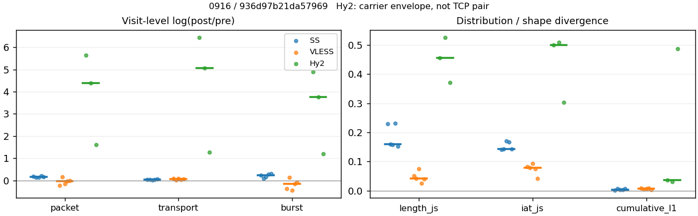
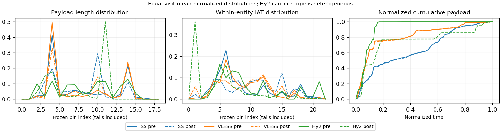

# 0916 · 条目 020 · bing.com

目标：https://www.bing.com/search?q=network+traffic+analysis

活动标签：bing.com::search_results_view。选定访问 15 次。

[返回总索引](../../README.md) · [统计口径](../../methods.md)

## 覆盖与资格（每次访问均保留）

| 部署 | 重复 | 主请求路由 | 活动状态 | 代理比较 | DIRECT pre | 请求 proxy/direct/unresolved | 错误 |
| --- | --- | --- | --- | --- | --- | --- | --- |
| Hy2 | 1 | direct | passed | 1 | 1 | 6/689/0 | [] |
| Hy2 | 2 | direct | passed | 0 | 1 | 0/687/0 | [] |
| Hy2 | 3 | direct | passed | 1 | 1 | 3/693/0 | [] |
| Hy2 | 4 | direct | passed | 0 | 1 | 0/682/0 | [] |
| Hy2 | 5 | direct | passed | 1 | 1 | 3/686/0 | [] |
| SS | 1 | proxy | passed | 1 | 0 | 650/0/0 | [] |
| SS | 2 | proxy | passed | 1 | 0 | 340/0/0 | [] |
| SS | 3 | proxy | passed | 1 | 0 | 682/0/0 | [] |
| SS | 4 | proxy | passed | 1 | 0 | 667/0/0 | [] |
| SS | 5 | proxy | passed | 1 | 0 | 360/0/0 | [] |
| VLESS | 1 | proxy | passed | 1 | 0 | 610/0/0 | [] |
| VLESS | 2 | proxy | passed | 1 | 0 | 666/0/0 | [] |
| VLESS | 3 | proxy | passed | 1 | 0 | 601/0/0 | [] |
| VLESS | 4 | proxy | passed | 1 | 0 | 729/0/0 | [] |
| VLESS | 5 | proxy | passed | 1 | 0 | 343/0/5 | [] |

主请求非 proxy 的统计仅解释为已索引的辅助代理连接或 DIRECT 观测，不代表目标业务经代理传输。播放确认与配对资格是两道不同的门。

图中散点为单次访问，短线为重复中位数；Hy2 是共享载体包络，不能与 TCP 配对作等范围因果对比。

形态图先逐访问归一化，再对访问等权平均；实线 pre，虚线 post。分箱序号及边界见 methods，不将分箱索引误解为长度或时间。

## 每次访问的关键观测

### SS

范围：`exclusive_page`。每格 pre → post；空值为不可观测/不适用。

| 重复 | 包数 | 载荷字节 | burst | TCP FR | IAT中位µs | length JS | IAT JS |
| --- | --- | --- | --- | --- | --- | --- | --- |
| 1 | 2501 → 2994 | 1.6837e+06 → 1.757e+06 | 1703 → 2155 | 456 → 501 | 49.823 → 1035.5 | 0.22992 | 0.1419 |
| 2 | 1375 → 1565 | 8.4021e+05 → 8.7807e+05 | 943 → 1039 | 271 → 292 | 60.272 → 1058.3 | 0.1591 | 0.14236 |
| 3 | 2804 → 3235 | 1.7807e+06 → 1.8122e+06 | 1853 → 2179 | 531 → 537 | 48.777 → 799.99 | 0.15721 | 0.16988 |
| 4 | 2619 → 3228 | 1.631e+06 → 1.6834e+06 | 1709 → 2271 | 468 → 486 | 41.401 → 928.41 | 0.232 | 0.16653 |
| 5 | 1615 → 1917 | 9.2616e+05 → 9.75e+05 | 991 → 1344 | 319 → 330 | 80.043 → 1055.3 | 0.15269 | 0.14281 |

完整标量统计：中位数 [min,max]；Δ 为重复内逐访问变换的中位数，MAD 未缩放。n 为可用变换数；DIRECT-only 的 nΔ=0 不代表 pre 不可用。

| scope | 特征 | pre | post | Δ | IQRΔ | MADΔ | nΔ |
| --- | --- | --- | --- | --- | --- | --- | --- |
| exclusive_page | active_span_sum_s_1000ms | 80.953 [51.632, 84.314] | 82.176 [57.994, 90.374] | 0.076247 | 0.044137 | 0.037299 | 5 |
| exclusive_page | active_span_sum_s_100ms | 6.3696 [3.9575, 8.0478] | 17.706 [11.072, 20.604] | 0.94099 | 0.099765 | 0.087804 | 5 |
| exclusive_page | active_span_sum_s_500ms | 58.802 [35.569, 65.525] | 70.945 [49.296, 78.726] | 0.2918 | 0.12404 | 0.047884 | 5 |
| exclusive_page | burst_bytes_iqr | 925.5 [890, 1140] | 1428 [1428, 1428] | 0.4337 | 0.17896 | 0.039113 | 5 |
| exclusive_page | burst_bytes_mad | 85 [85, 85] | 118 [74, 119] | 0.32803 | 0 | 0 | 5 |
| exclusive_page | burst_bytes_max | 20480 [19919, 22195] | 8568 [7140, 14160] | -0.87141 | 0.44223 | 0.20841 | 5 |
| exclusive_page | burst_bytes_mean | 954.37 [891, 988.66] | 815.31 [725.44, 845.11] | -0.19278 | 0.10822 | 0.059947 | 5 |
| exclusive_page | burst_bytes_median | 85 [85, 85] | 118 [74, 119] | 0.32803 | 0 | 0 | 5 |
| exclusive_page | burst_bytes_min | 0 [0, 0] | 0 [0, 0] | — | — | — | 0 |
| exclusive_page | burst_bytes_p95 | 4118.6 [3317.8, 5792] | 2856 [2856, 2930] | -0.36059 | 0.13983 | 0.11976 | 5 |
| exclusive_page | burst_bytes_q25 | 0 [0, 0] | 0 [0, 0] | — | — | — | 0 |
| exclusive_page | burst_bytes_q75 | 925.5 [890, 1140] | 1428 [1428, 1428] | 0.4337 | 0.17896 | 0.039113 | 5 |
| exclusive_page | burst_bytes_std | 2139.5 [2036.5, 2469] | 1135.5 [1043.1, 1257] | -0.63785 | 0.088119 | 0.056298 | 5 |
| exclusive_page | burst_count | 1703 [943, 1853] | 2155 [1039, 2271] | 0.2354 | 0.12225 | 0.069292 | 5 |
| exclusive_page | burst_duration_ms_iqr | 0.088119 [0.061686, 2.9849] | 0.23286 [0.0077945, 0.76313] | -0.2369 | 3.2469 | 1.8317 | 5 |
| exclusive_page | burst_duration_ms_mad | 0 [0, 0] | 0 [0, 0] | — | — | — | 0 |
| exclusive_page | burst_duration_ms_max | 12764 [9573.4, 15001] | 23130 [15004, 30524] | 0.68058 | 0.68978 | 0.21454 | 5 |
| exclusive_page | burst_duration_ms_mean | 96.972 [88.895, 160.91] | 93.41 [71.567, 170.94] | -0.18309 | 0.19237 | 0.057011 | 5 |
| exclusive_page | burst_duration_ms_median | 0 [0, 0] | 0 [0, 0] | — | — | — | 0 |
| exclusive_page | burst_duration_ms_min | 0 [0, 0] | 0 [0, 0] | — | — | — | 0 |
| exclusive_page | burst_duration_ms_p95 | 332.35 [281.92, 541.29] | 182.95 [171.28, 279.55] | -0.56972 | 0.051688 | 0.027229 | 5 |
| exclusive_page | burst_duration_ms_q25 | 0 [0, 0] | 0 [0, 0] | — | — | — | 0 |
| exclusive_page | burst_duration_ms_q75 | 0.088119 [0.061686, 2.9849] | 0.23286 [0.0077945, 0.76313] | -0.2369 | 3.2469 | 1.8317 | 5 |
| exclusive_page | burst_duration_ms_std | 627.08 [532.67, 922.74] | 831.82 [695.99, 1495] | 0.32391 | 0.063688 | 0.041366 | 5 |
| exclusive_page | burst_packets_iqr | 1 [1, 1] | 1 [1, 1] | 0 | 0 | 0 | 5 |
| exclusive_page | burst_packets_mad | 0 [0, 0] | 0 [0, 0] | — | — | — | 0 |
| exclusive_page | burst_packets_max | 10 [6, 12] | 12 [11, 14] | 0.24116 | 0.31015 | 0.1643 | 5 |
| exclusive_page | burst_packets_mean | 1.5132 [1.4581, 1.6297] | 1.4263 [1.3893, 1.5063] | -0.05548 | 0.056164 | 0.036402 | 5 |
| exclusive_page | burst_packets_median | 1 [1, 1] | 1 [1, 1] | 0 | 0 | 0 | 5 |
| exclusive_page | burst_packets_min | 1 [1, 1] | 1 [1, 1] | 0 | 0 | 0 | 5 |
| exclusive_page | burst_packets_p95 | 3 [3, 3] | 3 [3, 3] | 0 | 0 | 0 | 5 |
| exclusive_page | burst_packets_q25 | 1 [1, 1] | 1 [1, 1] | 0 | 0 | 0 | 5 |
| exclusive_page | burst_packets_q75 | 2 [2, 2] | 2 [2, 2] | 0 | 0 | 0 | 5 |
| exclusive_page | burst_packets_std | 0.92075 [0.72969, 1.0397] | 0.90833 [0.84654, 0.99799] | 0.057401 | 0.14895 | 0.12579 | 5 |
| exclusive_page | connection_span_concurrency_max | 5 [5, 5] | 5 [5, 5] | 0 | 0 | 0 | 5 |
| exclusive_page | cumulative_l1 | — | — | 0.0031872 | 0.0037403 | 0.00094486 | 5 |
| exclusive_page | cumulative_max | — | — | 0.027364 | 0.019938 | 0.012766 | 5 |
| exclusive_page | direction_entropy | 0.99954 [0.99468, 0.99981] | 0.84269 [0.79482, 0.88101] | -0.15711 | 0.04191 | 0.024443 | 5 |
| exclusive_page | down_burst_count | 847 [468, 922] | 1073 [516, 1131] | 0.23651 | 0.12283 | 0.071872 | 5 |
| exclusive_page | down_ip_bytes | 1.5611e+06 [8.1102e+05, 1.7059e+06] | 1.5937e+06 [8.287e+05, 1.725e+06] | 0.021573 | 0.002863 | 0.001956 | 5 |
| exclusive_page | down_packets | 1310 [734, 1528] | 1574 [813, 1758] | 0.14022 | 0.077777 | 0.037995 | 5 |
| exclusive_page | down_transport_bytes | 1.4872e+06 [7.7278e+05, 1.6264e+06] | 1.5021e+06 [7.8618e+05, 1.6334e+06] | 0.015335 | 0.0072033 | 0.0053495 | 5 |
| exclusive_page | duration_s | 66.055 [63.966, 68.586] | 66.054 [64.204, 68.585] | -7.4573e-06 | 0.0016939 | 1.2751e-06 | 5 |
| exclusive_page | entity_count | 9 [8, 11] | 9 [8, 11] | 0 | 0 | 0 | 5 |
| exclusive_page | fr_runs | 456 [271, 531] | 486 [292, 537] | 0.03774 | 0.040733 | 0.026504 | 5 |
| exclusive_page | fr_runs_per_packet | 0.32085 [0.30174, 0.34833] | 0.29436 [0.26256, 0.3341] | -0.026183 | 0.01272 | 0.0086408 | 5 |
| exclusive_page | fr_switches | 447 [263, 522] | 476 [284, 528] | 0.038549 | 0.041729 | 0.02712 | 5 |
| exclusive_page | fr_switches_per_possible_transition | 0.31713 [0.29721, 0.34156] | 0.29061 [0.25856, 0.32794] | -0.02561 | 0.012989 | 0.0085788 | 5 |
| exclusive_page | full_retransmission_fraction | 0.0029091 [0.0012384, 0.003923] | 0.020344 [0.0034003, 0.038978] | 0.019106 | 0.015432 | 0.0091493 | 5 |
| exclusive_page | full_retransmission_packets | 5 [2, 11] | 42 [11, 82] | 2.7246 | 1.1391 | 0.24583 | 5 |
| exclusive_page | iat_count | 2492 [1367, 2795] | 2985 [1557, 3226] | 0.17251 | 0.037103 | 0.029095 | 5 |
| exclusive_page | iat_js | — | — | 0.14281 | 0.024176 | 0.00091499 | 5 |
| exclusive_page | iat_ks | — | — | 0.29903 | 0.017263 | 0.010957 | 5 |
| exclusive_page | iat_median_us | 49.823 [41.401, 80.043] | 1035.5 [799.99, 1058.3] | 2.8656 | 0.23684 | 0.1686 | 5 |
| exclusive_page | iat_us_iqr | 3116.9 [2636.5, 3309.8] | 18480 [7440.8, 32239] | 1.7198 | 0.97364 | 0.57115 | 5 |
| exclusive_page | iat_us_mad | 44.139 [36.109, 69.433] | 1028.3 [792.54, 1054.2] | 3.0014 | 0.24162 | 0.14697 | 5 |
| exclusive_page | iat_us_max | 1.5001e+07 [1.5001e+07, 1.5001e+07] | 1.5461e+07 [1.5205e+07, 1.5489e+07] | 0.03018 | 0.0091559 | 0.0018134 | 5 |
| exclusive_page | iat_us_mean | 1.0235e+05 [96607, 1.9267e+05] | 88676 [78397, 1.6915e+05] | -0.17254 | 0.036689 | 0.029104 | 5 |
| exclusive_page | iat_us_median | 49.823 [41.401, 80.043] | 1035.5 [799.99, 1058.3] | 2.8656 | 0.23684 | 0.1686 | 5 |
| exclusive_page | iat_us_min | 0.088 [0.007, 0.186] | 0.037 [0.036, 0.038] | -0.86642 | 2.7747 | 0.72174 | 5 |
| exclusive_page | iat_us_p95 | 2.6593e+05 [2.241e+05, 4.6597e+05] | 2.0574e+05 [1.7845e+05, 2.8813e+05] | -0.26506 | 0.12884 | 0.046453 | 5 |
| exclusive_page | iat_us_q25 | 19.008 [15.892, 23.204] | 31.668 [20.26, 33.56] | 0.36899 | 0.27806 | 0.17873 | 5 |
| exclusive_page | iat_us_q75 | 3140.1 [2652.4, 3328.8] | 18513 [7472.5, 32260] | 1.7159 | 0.97126 | 0.56878 | 5 |
| exclusive_page | iat_us_std | 8.6218e+05 [7.9397e+05, 1.3143e+06] | 8.0239e+05 [7.1414e+05, 1.2293e+06] | -0.089239 | 0.020381 | 0.016726 | 5 |
| exclusive_page | iat_wasserstein_log1p_us | — | — | 1.4473 | 0.11938 | 0.062033 | 5 |
| exclusive_page | idle_gap_count_1000ms | 35 [32, 41] | 33 [29, 39] | -0.058841 | 0.0453 | 0.03647 | 5 |
| exclusive_page | idle_gap_count_100ms | 270 [179, 307] | 308 [215, 310] | 0.12373 | 0.054588 | 0.046637 | 5 |
| exclusive_page | idle_gap_count_500ms | 68 [59, 71] | 54 [43, 56] | -0.2489 | 0.061521 | 0.036722 | 5 |
| exclusive_page | idle_gap_sum_s_1000ms | 195.56 [167.74, 211.75] | 188.53 [161.58, 205.38] | -0.035353 | 0.0060568 | 0.0033998 | 5 |
| exclusive_page | idle_gap_sum_s_100ms | 248.65 [241.74, 278.03] | 240.51 [229.27, 268.36] | -0.03538 | 0.015318 | 0.0075384 | 5 |
| exclusive_page | idle_gap_sum_s_500ms | 214.58 [190.98, 227.81] | 198.64 [171.15, 215.12] | -0.070193 | 0.014981 | 0.0080044 | 5 |
| exclusive_page | ip_bytes | 1.7675e+06 [9.1189e+05, 1.9268e+06] | 1.8684e+06 [9.6424e+05, 1.9946e+06] | 0.055825 | 0.0039829 | 0.0036956 | 5 |
| exclusive_page | length_iqr | 1791.5 [1362, 2279.2] | 1309 [1309, 1314] | -0.31303 | 0.24922 | 0.1575 | 5 |
| exclusive_page | length_js | — | — | 0.1591 | 0.072703 | 0.0064059 | 5 |
| exclusive_page | length_ks | — | — | 0.24474 | 0.063951 | 0.022346 | 5 |
| exclusive_page | length_mad | 268 [123, 441] | 692.5 [637, 731.5] | 0.86578 | 0.65241 | 0.40303 | 5 |
| exclusive_page | length_max | 8948 [8192, 8948] | 2856 [2856, 3967] | -1.0537 | 0.088272 | 0.088272 | 5 |
| exclusive_page | length_mean | 1075.9 [993.73, 1151.6] | 980.63 [909.43, 1032.3] | -0.092751 | 0.037093 | 0.020465 | 5 |
| exclusive_page | length_median | 303 [154, 525] | 918.5 [747, 1333] | 0.95957 | 1.2342 | 0.40022 | 5 |
| exclusive_page | length_min | 24 [5, 31] | 7 [2, 20] | -0.45199 | 0.91629 | 0.78846 | 5 |
| exclusive_page | length_p95 | 2896 [2896, 2896] | 2856 [2856, 2856] | -0.013908 | 0 | 0 | 5 |
| exclusive_page | length_q25 | 86 [86, 86] | 119 [114, 119] | 0.32478 | 0.0084389 | 0 | 5 |
| exclusive_page | length_q75 | 1877.5 [1448, 2365.2] | 1428 [1428, 1428] | -0.27367 | 0.24179 | 0.15373 | 5 |
| exclusive_page | length_std | 1261.5 [1208.9, 1483.1] | 867.26 [848.48, 901.96] | -0.39659 | 0.1394 | 0.074958 | 5 |
| exclusive_page | length_wasserstein_bytes | — | — | 372.65 | 79.182 | 33.251 | 5 |
| exclusive_page | nonempty_entity_count | 9 [8, 11] | 9 [8, 11] | 0 | 0 | 0 | 5 |
| exclusive_page | nonempty_packets | 1462 [778, 1655] | 1702 [874, 1851] | 0.11635 | 0.038517 | 0.0060509 | 5 |
| exclusive_page | offload_suspect_fraction | 0.17118 [0.14241, 0.17513] | 0.074148 [0.068858, 0.099536] | -0.073557 | 0.029334 | 0.0047127 | 5 |
| exclusive_page | packet_count | 2501 [1375, 2804] | 2994 [1565, 3235] | 0.17143 | 0.036938 | 0.028445 | 5 |
| exclusive_page | rtt_median_ms | 0.086104 [0.082986, 0.088214] | 32.029 [27.028, 32.867] | 5.9049 | 0.13451 | 0.039219 | 5 |
| exclusive_page | rtt_sample_count | 1124 [636, 1247] | 837 [493, 963] | -0.25844 | 0.038942 | 0.035188 | 5 |
| exclusive_page | tcp_ack_count | 2491 [1367, 2795] | 2984 [1555, 3226] | 0.17093 | 0.03717 | 0.02752 | 5 |
| exclusive_page | tcp_fin_count | 18 [16, 22] | 18 [15, 24] | 0 | 0.10845 | 0.057158 | 5 |
| exclusive_page | tcp_packet_count | 2501 [1375, 2804] | 2994 [1565, 3235] | 0.17143 | 0.036938 | 0.028445 | 5 |
| exclusive_page | tcp_rst_count | 0 [0, 1] | 1 [0, 1] | — | — | — | 0 |
| exclusive_page | tcp_syn_count | 18 [16, 22] | 19 [17, 24] | 0.054067 | 0.060625 | 0.032944 | 5 |
| exclusive_page | tcp_window_raw_median | 65364 [65341, 65430] | 144 [134, 154] | -6.1179 | 0.10505 | 0.054419 | 5 |
| exclusive_page | transition_entropy | 0.89935 [0.87739, 0.92629] | 0.7909 [0.73353, 0.84045] | -0.10635 | 0.027846 | 0.0205 | 5 |
| exclusive_page | transition_n_mm | 492 [245, 615] | 992 [466, 1165] | 0.64293 | 0.10805 | 0.058317 | 5 |
| exclusive_page | transition_n_mp | 220 [128, 257] | 234 [138, 260] | 0.039479 | 0.036003 | 0.027873 | 5 |
| exclusive_page | transition_n_pm | 227 [135, 265] | 242 [146, 268] | 0.037899 | 0.04737 | 0.026642 | 5 |
| exclusive_page | transition_n_pp | 509 [262, 521] | 198 [116, 209] | -0.89989 | 0.12943 | 0.057544 | 5 |
| exclusive_page | transition_p_mm | 0.6996 [0.65684, 0.7141] | 0.80324 [0.77152, 0.83274] | 0.11223 | 0.0093283 | 0.0064058 | 5 |
| exclusive_page | transition_p_mp | 0.3004 [0.2859, 0.34316] | 0.19676 [0.16726, 0.22848] | -0.11223 | 0.0093283 | 0.0064058 | 5 |
| exclusive_page | transition_p_pm | 0.34005 [0.30634, 0.37412] | 0.55725 [0.54367, 0.57511] | 0.23273 | 0.020124 | 0.0057627 | 5 |
| exclusive_page | transition_p_pp | 0.65995 [0.62588, 0.69366] | 0.44275 [0.42489, 0.45633] | -0.23273 | 0.020124 | 0.0057627 | 5 |
| exclusive_page | transport_bytes | 1.631e+06 [8.4021e+05, 1.7807e+06] | 1.6834e+06 [8.7807e+05, 1.8122e+06] | 0.042619 | 0.012482 | 0.0087694 | 5 |
| exclusive_page | up_burst_count | 856 [475, 931] | 1082 [523, 1140] | 0.2343 | 0.12168 | 0.066769 | 5 |
| exclusive_page | up_byte_fraction | 0.088164 [0.080253, 0.090019] | 0.10465 [0.098676, 0.11451] | 0.019484 | 0.0091983 | 0.0049082 | 5 |
| exclusive_page | up_ip_bytes | 2.0637e+05 [1.0087e+05, 2.2084e+05] | 2.6952e+05 [1.3554e+05, 2.8676e+05] | 0.28604 | 0.024701 | 0.0093652 | 5 |
| exclusive_page | up_packets | 1191 [641, 1276] | 1420 [752, 1480] | 0.17586 | 0.050014 | 0.029581 | 5 |
| exclusive_page | up_transport_bytes | 1.438e+05 [67430, 1.5428e+05] | 1.7882e+05 [91886, 2.012e+05] | 0.23125 | 0.074611 | 0.052019 | 5 |
| exclusive_page | zero_iat_count | 0 [0, 0] | 0 [0, 0] | — | — | — | 0 |
| exclusive_page | zero_iat_fraction | 0 [0, 0] | 0 [0, 0] | 0 | 0 | 0 | 5 |

### VLESS

范围：`exclusive_page`。每格 pre → post；空值为不可观测/不适用。

| 重复 | 包数 | 载荷字节 | burst | TCP FR | IAT中位µs | length JS | IAT JS |
| --- | --- | --- | --- | --- | --- | --- | --- |
| 1 | 1086 → 873 | 5.3784e+05 → 5.8805e+05 | 772 → 532 | 68 → 78 | 67.392 → 685.23 | 0.050774 | 0.082621 |
| 2 | 2993 → 3471 | 2.3065e+06 → 2.3654e+06 | 1924 → 2184 | 384 → 398 | 173.03 → 170.8 | 0.041388 | 0.078131 |
| 3 | 1149 → 973 | 5.3752e+05 → 5.9351e+05 | 871 → 565 | 66 → 80 | 62.788 → 502.73 | 0.074859 | 0.092564 |
| 4 | 2819 → 2733 | 1.5502e+06 → 1.6152e+06 | 1930 → 1648 | 518 → 534 | 258.35 → 1056.3 | 0.024403 | 0.075893 |
| 5 | 1572 → 1547 | 9.9106e+05 → 1.0618e+06 | 1103 → 1018 | 84 → 100 | 115.9 → 445.46 | 0.040111 | 0.041988 |

完整标量统计：中位数 [min,max]；Δ 为重复内逐访问变换的中位数，MAD 未缩放。n 为可用变换数；DIRECT-only 的 nΔ=0 不代表 pre 不可用。

| scope | 特征 | pre | post | Δ | IQRΔ | MADΔ | nΔ |
| --- | --- | --- | --- | --- | --- | --- | --- |
| exclusive_page | active_span_sum_s_1000ms | 13.861 [9.5782, 58.593] | 14.194 [10.067, 57.802] | 0.0006195 | 0.037322 | 0.020237 | 5 |
| exclusive_page | active_span_sum_s_100ms | 2.2999 [1.7539, 5.6778] | 5.7961 [4.2267, 17.546] | 0.92431 | 0.22902 | 0.17533 | 5 |
| exclusive_page | active_span_sum_s_500ms | 7.3715 [5.104, 51.853] | 13.329 [9.2888, 56.877] | 0.52901 | 0.46725 | 0.12106 | 5 |
| exclusive_page | burst_bytes_iqr | 1359 [395.5, 2149] | 2824 [1681, 2824] | 0.69315 | 0.88604 | 0.46605 | 5 |
| exclusive_page | burst_bytes_mad | 31 [24, 85] | 85 [35.5, 86] | 0.39148 | 1.0087 | 0.39148 | 5 |
| exclusive_page | burst_bytes_max | 9319 [5720, 20896] | 6237 [5720, 12708] | -0.40965 | 0.25397 | 0.16629 | 5 |
| exclusive_page | burst_bytes_mean | 803.2 [617.13, 1198.8] | 1050.5 [980.12, 1105.4] | 0.19907 | 0.31248 | 0.26252 | 5 |
| exclusive_page | burst_bytes_median | 31 [24, 85] | 85 [35.5, 86] | 0.39148 | 1.0087 | 0.39148 | 5 |
| exclusive_page | burst_bytes_min | 0 [0, 0] | 0 [0, 0] | — | — | — | 0 |
| exclusive_page | burst_bytes_p95 | 2896 [2896, 4767.6] | 2896 [2896, 2896] | 0 | 0 | 0 | 5 |
| exclusive_page | burst_bytes_q25 | 0 [0, 0] | 0 [0, 0] | — | — | — | 0 |
| exclusive_page | burst_bytes_q75 | 1359 [395.5, 2149] | 2824 [1681, 2824] | 0.69315 | 0.88604 | 0.46605 | 5 |
| exclusive_page | burst_bytes_std | 1277.6 [1117.3, 2187.2] | 1297.5 [1212.8, 1396.9] | -0.052025 | 0.4952 | 0.19164 | 5 |
| exclusive_page | burst_count | 1103 [772, 1930] | 1018 [532, 2184] | -0.15796 | 0.29215 | 0.21438 | 5 |
| exclusive_page | burst_duration_ms_iqr | 0.05902 [0.032542, 0.92552] | 2.9754 [0.70276, 4.3415] | 3.1601 | 2.2346 | 1.4298 | 5 |
| exclusive_page | burst_duration_ms_mad | 0 [0, 0] | 0 [0, 0] | — | — | — | 0 |
| exclusive_page | burst_duration_ms_max | 14302 [11080, 15001] | 15044 [15018, 15505] | 0.050169 | 0.18281 | 0.046969 | 5 |
| exclusive_page | burst_duration_ms_mean | 58.492 [32.681, 93.44] | 87.694 [63.005, 179.61] | 0.65346 | 0.48051 | 0.32495 | 5 |
| exclusive_page | burst_duration_ms_median | 0 [0, 0] | 0 [0, 0] | — | — | — | 0 |
| exclusive_page | burst_duration_ms_min | 0 [0, 0] | 0 [0, 0] | — | — | — | 0 |
| exclusive_page | burst_duration_ms_p95 | 10.699 [9.8498, 199] | 154.7 [23.61, 159.56] | 0.82915 | 2.6052 | 1.0773 | 5 |
| exclusive_page | burst_duration_ms_q25 | 0 [0, 0] | 0 [0, 0] | — | — | — | 0 |
| exclusive_page | burst_duration_ms_q75 | 0.05902 [0.032542, 0.92552] | 2.9754 [0.70276, 4.3415] | 3.1601 | 2.2346 | 1.4298 | 5 |
| exclusive_page | burst_duration_ms_std | 605.74 [397, 1023.1] | 941.85 [796.02, 1528.1] | 0.40119 | 0.50237 | 0.12802 | 5 |
| exclusive_page | burst_packets_iqr | 1 [1, 1] | 1 [1, 1] | 0 | 0 | 0 | 5 |
| exclusive_page | burst_packets_mad | 0 [0, 0] | 0 [0, 0] | — | — | — | 0 |
| exclusive_page | burst_packets_max | 10 [4, 15] | 12 [11, 14] | 0.33647 | 0.59509 | 0.47957 | 5 |
| exclusive_page | burst_packets_mean | 1.4252 [1.3192, 1.5556] | 1.641 [1.5196, 1.7221] | 0.12698 | 0.089857 | 0.062813 | 5 |
| exclusive_page | burst_packets_median | 1 [1, 1] | 1 [1, 1] | 0 | 0 | 0 | 5 |
| exclusive_page | burst_packets_min | 1 [1, 1] | 1 [1, 1] | 0 | 0 | 0 | 5 |
| exclusive_page | burst_packets_p95 | 3 [2, 3] | 3 [3, 4] | 0 | 0.13976 | 0 | 5 |
| exclusive_page | burst_packets_q25 | 1 [1, 1] | 1 [1, 1] | 0 | 0 | 0 | 5 |
| exclusive_page | burst_packets_q75 | 2 [2, 2] | 2 [2, 2] | 0 | 0 | 0 | 5 |
| exclusive_page | burst_packets_std | 0.7218 [0.56827, 1.1167] | 1.0237 [0.98321, 1.2756] | 0.33464 | 0.53583 | 0.32485 | 5 |
| exclusive_page | connection_span_concurrency_max | 5 [3, 5] | 5 [3, 5] | 0 | 0 | 0 | 5 |
| exclusive_page | cumulative_l1 | — | — | 0.0074197 | 0.0024513 | 0.001477 | 5 |
| exclusive_page | cumulative_max | — | — | 0.025347 | 0.0010857 | 0.00091391 | 5 |
| exclusive_page | direction_entropy | 0.94107 [0.8177, 0.97683] | 0.68878 [0.54956, 0.79998] | -0.26813 | 0.020563 | 0.010634 | 5 |
| exclusive_page | down_burst_count | 547 [383, 961] | 505 [263, 1088] | -0.15867 | 0.29599 | 0.21721 | 5 |
| exclusive_page | down_ip_bytes | 9.8746e+05 [5.2645e+05, 2.3284e+06] | 1.0431e+06 [5.6149e+05, 2.3847e+06] | 0.054824 | 0.032677 | 0.020465 | 5 |
| exclusive_page | down_packets | 895 [580, 1803] | 903 [505, 2021] | -0.011187 | 0.079314 | 0.059228 | 5 |
| exclusive_page | down_transport_bytes | 9.4084e+05 [4.9524e+05, 2.2345e+06] | 9.9609e+05 [5.3518e+05, 2.2795e+06] | 0.057058 | 0.041371 | 0.022881 | 5 |
| exclusive_page | duration_s | 64.772 [62.983, 67.581] | 64.8 [62.961, 67.563] | -0.00034948 | 0.00010166 | 7.3539e-05 | 5 |
| exclusive_page | entity_count | 8 [6, 9] | 8 [6, 9] | 0 | 0 | 0 | 5 |
| exclusive_page | fr_runs | 84 [66, 518] | 100 [78, 534] | 0.1372 | 0.13854 | 0.055171 | 5 |
| exclusive_page | fr_runs_per_packet | 0.1095 [0.091603, 0.30506] | 0.15631 [0.11455, 0.33271] | 0.027645 | 0.020992 | 0.016291 | 5 |
| exclusive_page | fr_switches | 75 [59, 510] | 91 [72, 526] | 0.14953 | 0.15681 | 0.06339 | 5 |
| exclusive_page | fr_switches_per_possible_transition | 0.10081 [0.082599, 0.30178] | 0.14604 [0.10532, 0.32937] | 0.027592 | 0.020048 | 0.015181 | 5 |
| exclusive_page | full_retransmission_fraction | 0.0010642 [0, 0.0038168] | 0 [0, 0] | -0.0010642 | 0.0020047 | 0.0010642 | 5 |
| exclusive_page | full_retransmission_packets | 3 [0, 6] | 0 [0, 0] | — | — | — | 0 |
| exclusive_page | iat_count | 1563 [1080, 2985] | 1538 [867, 3463] | -0.031072 | 0.15125 | 0.1363 | 5 |
| exclusive_page | iat_js | — | — | 0.078131 | 0.0067272 | 0.0044894 | 5 |
| exclusive_page | iat_ks | — | — | 0.14311 | 0.056336 | 0.038424 | 5 |
| exclusive_page | iat_median_us | 115.9 [62.788, 258.35] | 502.73 [170.8, 1056.3] | 1.4082 | 0.73392 | 0.67204 | 5 |
| exclusive_page | iat_us_iqr | 1674.8 [1259.1, 3182.6] | 3787.6 [2395.2, 9393.7] | 0.93151 | 0.53568 | 0.16984 | 5 |
| exclusive_page | iat_us_mad | 109.57 [55.549, 251.03] | 496.41 [170.72, 1048.5] | 1.4295 | 0.80299 | 0.76061 | 5 |
| exclusive_page | iat_us_max | 1.5001e+07 [1.5001e+07, 1.5001e+07] | 1.5379e+07 [1.531e+07, 1.5505e+07] | 0.024874 | 0.0059058 | 0.0040475 | 5 |
| exclusive_page | iat_us_mean | 1.3713e+05 [83082, 1.9073e+05] | 1.5452e+05 [71553, 2.2526e+05] | 0.030246 | 0.15089 | 0.13619 | 5 |
| exclusive_page | iat_us_median | 115.9 [62.788, 258.35] | 502.73 [170.8, 1056.3] | 1.4082 | 0.73392 | 0.67204 | 5 |
| exclusive_page | iat_us_min | 0.092 [0.003, 0.161] | 0.036 [0.035, 0.037] | -0.91087 | 0.92541 | 0.5241 | 5 |
| exclusive_page | iat_us_p95 | 18522 [12040, 1.9776e+05] | 1.051e+05 [48979, 1.5718e+05] | 1.4032 | 1.7656 | 0.52682 | 5 |
| exclusive_page | iat_us_q25 | 25.091 [23.965, 38.456] | 19.757 [13.994, 46.249] | -0.23403 | 0.7256 | 0.37576 | 5 |
| exclusive_page | iat_us_q75 | 1699.8 [1284.2, 3221] | 3801.6 [2422.8, 9439.9] | 0.92135 | 0.53425 | 0.16396 | 5 |
| exclusive_page | iat_us_std | 1.3239e+06 [9.3932e+05, 1.5944e+06] | 1.4098e+06 [8.7249e+05, 1.7323e+06] | 0.020637 | 0.065263 | 0.062303 | 5 |
| exclusive_page | iat_wasserstein_log1p_us | — | — | 0.86246 | 0.40604 | 0.17949 | 5 |
| exclusive_page | idle_gap_count_1000ms | 19 [11, 22] | 18 [11, 22] | 0 | 0.09531 | 0.04652 | 5 |
| exclusive_page | idle_gap_count_100ms | 58 [37, 267] | 63 [40, 263] | 0.077962 | 0.054254 | 0.049524 | 5 |
| exclusive_page | idle_gap_count_500ms | 28 [18, 32] | 20 [12, 22] | -0.38777 | 0.09531 | 0.033448 | 5 |
| exclusive_page | idle_gap_sum_s_1000ms | 208.04 [138.03, 223.93] | 205.74 [137.82, 223.46] | -0.001576 | 0.0048401 | 0.0043131 | 5 |
| exclusive_page | idle_gap_sum_s_100ms | 235.49 [146.1, 260.96] | 231.85 [143.66, 248.87] | -0.016837 | 0.025494 | 0.0039735 | 5 |
| exclusive_page | idle_gap_sum_s_500ms | 212.71 [142.62, 230.42] | 207.83 [138.6, 224.32] | -0.026301 | 0.0020896 | 0.0015831 | 5 |
| exclusive_page | ip_bytes | 1.0728e+06 [5.9426e+05, 2.4622e+06] | 1.1429e+06 [6.3374e+05, 2.5483e+06] | 0.063253 | 0.028811 | 0.013295 | 5 |
| exclusive_page | length_iqr | 1364 [1327, 2752] | 1864 [1352, 2752] | 0 | 0.018664 | 0.018664 | 5 |
| exclusive_page | length_js | — | — | 0.041388 | 0.010663 | 0.0093857 | 5 |
| exclusive_page | length_ks | — | — | 0.14184 | 0.096825 | 0.035109 | 5 |
| exclusive_page | length_mad | 25.5 [22, 556.5] | 1113 [557, 1128] | 3.0839 | 1.1696 | 0.62524 | 5 |
| exclusive_page | length_max | 7276 [4096, 8920] | 2896 [2824, 4344] | -0.7195 | 0.0099249 | 0.0087479 | 5 |
| exclusive_page | length_mean | 912.94 [853.2, 1217.8] | 1178.5 [1006.4, 1216.2] | 0.11809 | 0.15951 | 0.13886 | 5 |
| exclusive_page | length_median | 97 [94, 628.5] | 1185 [629, 1200] | 2.0087 | 0.46458 | 0.32533 | 5 |
| exclusive_page | length_min | 11 [1, 18] | 9 [1, 17] | 0 | 0.20067 | 0 | 5 |
| exclusive_page | length_p95 | 2824 [2824, 2896] | 2824 [2824, 2824] | 0 | 0 | 0 | 5 |
| exclusive_page | length_q25 | 85 [72, 85] | 72 [72, 84] | -0.16599 | 0.16599 | 0 | 5 |
| exclusive_page | length_q75 | 1448 [1412, 2824] | 1936 [1424, 2824] | 0 | 0.0084627 | 0.0084627 | 5 |
| exclusive_page | length_std | 1110.2 [1096, 1363.6] | 1090.4 [1025.3, 1140.9] | -0.066676 | 0.009931 | 0.0084574 | 5 |
| exclusive_page | length_wasserstein_bytes | — | — | 244.19 | 109.03 | 79.254 | 5 |
| exclusive_page | nonempty_entity_count | 8 [6, 9] | 8 [6, 9] | 0 | 0 | 0 | 5 |
| exclusive_page | nonempty_packets | 917 [621, 1894] | 873 [499, 2006] | -0.056327 | 0.10869 | 0.10153 | 5 |
| exclusive_page | offload_suspect_fraction | 0.1426 [0.12097, 0.21717] | 0.16739 [0.12539, 0.17388] | -0.0057578 | 0.011823 | 0.010168 | 5 |
| exclusive_page | packet_count | 1572 [1086, 2993] | 1547 [873, 3471] | -0.030982 | 0.15023 | 0.13528 | 5 |
| exclusive_page | rtt_median_ms | 0.093208 [0.073778, 0.19225] | 3.4447 [0.49592, 3.7532] | 3.0809 | 0.69466 | 0.52885 | 5 |
| exclusive_page | rtt_sample_count | 588 [434, 1245] | 620 [350, 1430] | -0.048549 | 0.2681 | 0.16656 | 5 |
| exclusive_page | tcp_ack_count | 1546 [1068, 2971] | 1537 [867, 3463] | -0.026456 | 0.15009 | 0.12947 | 5 |
| exclusive_page | tcp_fin_count | 14 [12, 17] | 16 [12, 18] | 0.064539 | 0.01695 | 0.0095695 | 5 |
| exclusive_page | tcp_packet_count | 1572 [1086, 2993] | 1547 [873, 3471] | -0.030982 | 0.15023 | 0.13528 | 5 |
| exclusive_page | tcp_rst_count | 14 [12, 17] | 0 [0, 2] | -2.4241 | 0.40916 | 0.40916 | 2 |
| exclusive_page | tcp_syn_count | 16 [12, 18] | 16 [12, 18] | 0 | 0 | 0 | 5 |
| exclusive_page | tcp_window_raw_median | 65450 [65348, 65535] | 176 [157, 236] | -5.9199 | 0.38153 | 0.11138 | 5 |
| exclusive_page | transition_entropy | 0.4657 [0.38404, 0.85436] | 0.51982 [0.39338, 0.78657] | 0.0093391 | 0.12075 | 0.044779 | 5 |
| exclusive_page | transition_n_mm | 642 [332, 1159] | 712 [366, 1509] | 0.13172 | 0.053589 | 0.028235 | 5 |
| exclusive_page | transition_n_mp | 33 [26, 251] | 41 [33, 259] | 0.1643 | 0.17973 | 0.074108 | 5 |
| exclusive_page | transition_n_pm | 42 [33, 259] | 50 [39, 267] | 0.1372 | 0.13854 | 0.055171 | 5 |
| exclusive_page | transition_n_pp | 223 [191, 351] | 61 [55, 123] | -1.2657 | 0.18823 | 0.12427 | 5 |
| exclusive_page | transition_p_mm | 0.92222 [0.76802, 0.95111] | 0.91729 [0.78542, 0.94555] | -0.004929 | 0.02294 | 0.00063099 | 5 |
| exclusive_page | transition_p_mp | 0.077778 [0.048889, 0.23198] | 0.082707 [0.054449, 0.21458] | 0.004929 | 0.02294 | 0.00063099 | 5 |
| exclusive_page | transition_p_pm | 0.18026 [0.12891, 0.42599] | 0.45045 [0.40404, 0.68462] | 0.27513 | 0.011367 | 0.0064261 | 5 |
| exclusive_page | transition_p_pp | 0.81974 [0.57401, 0.87109] | 0.54955 [0.31538, 0.59596] | -0.27513 | 0.011367 | 0.0064261 | 5 |
| exclusive_page | transport_bytes | 9.9106e+05 [5.3752e+05, 2.3065e+06] | 1.0618e+06 [5.8805e+05, 2.3654e+06] | 0.068922 | 0.048139 | 0.027806 | 5 |
| exclusive_page | up_burst_count | 556 [389, 969] | 513 [269, 1096] | -0.15725 | 0.28838 | 0.21162 | 5 |
| exclusive_page | up_byte_fraction | 0.054364 [0.03119, 0.078654] | 0.061871 [0.036305, 0.092593] | 0.011196 | 0.0060212 | 0.0027434 | 5 |
| exclusive_page | up_ip_bytes | 85366 [67813, 1.4665e+05] | 99769 [72242, 1.6359e+05] | 0.085888 | 0.081792 | 0.02262 | 5 |
| exclusive_page | up_packets | 677 [506, 1201] | 644 [368, 1450] | -0.058286 | 0.23405 | 0.22574 | 5 |
| exclusive_page | up_transport_bytes | 50222 [41597, 84274] | 65693 [52866, 98372] | 0.23973 | 0.085162 | 0.028807 | 5 |
| exclusive_page | zero_iat_count | 0 [0, 0] | 0 [0, 0] | — | — | — | 0 |
| exclusive_page | zero_iat_fraction | 0 [0, 0] | 0 [0, 0] | 0 | 0 | 0 | 5 |

### Hy2

范围：`carrier_context_envelope`。每格 pre → post；空值为不可观测/不适用。

| 重复 | 包数 | 载荷字节 | burst | TCP FR | IAT中位µs | length JS | IAT JS |
| --- | --- | --- | --- | --- | --- | --- | --- |
| 1 | 145 → 40898 | 71744 → 4.4668e+07 | 104 → 13779 | — | 135.49 → 2.771 | 0.45566 | 0.50097 |
| 2 | — | — | — | — | — | — | — |
| 3 | 111 → 8893 | 57366 → 9.1163e+06 | 79 → 3401 | — | 128.53 → 5.2215 | 0.5253 | 0.50897 |
| 4 | — | — | — | — | — | — | — |
| 5 | 110 → 546 | 57475 → 2.0634e+05 | 77 → 257 | — | 97.639 → 154.05 | 0.37068 | 0.30258 |

范围：`direct_pre_only`。每格 pre → post；空值为不可观测/不适用。

| 重复 | 包数 | 载荷字节 | burst | TCP FR | IAT中位µs | length JS | IAT JS |
| --- | --- | --- | --- | --- | --- | --- | --- |
| 1 | 1782 → — | 1.1787e+06 → — | 1086 → — | 473 → — | 125.57 → — | — | — |
| 2 | 2123 → — | 2.2871e+06 → — | 1323 → — | 489 → — | 108.27 → — | — | — |
| 3 | 1764 → — | 1.2503e+06 → — | 1104 → — | 420 → — | 110.52 → — | — | — |
| 4 | 2001 → — | 2.2433e+06 → — | 1245 → — | 452 → — | 117.51 → — | — | — |
| 5 | 2183 → — | 1.4236e+06 → — | 1423 → — | 522 → — | 97.353 → — | — | — |

完整标量统计：中位数 [min,max]；Δ 为重复内逐访问变换的中位数，MAD 未缩放。n 为可用变换数；DIRECT-only 的 nΔ=0 不代表 pre 不可用。

| scope | 特征 | pre | post | Δ | IQRΔ | MADΔ | nΔ |
| --- | --- | --- | --- | --- | --- | --- | --- |
| carrier_context_envelope | active_span_sum_s_1000ms | 2.6653 [2.0401, 4.3762] | 9.9461 [8.9687, 11.896] | 1.3169 | 0.24033 | 0.16385 | 3 |
| carrier_context_envelope | active_span_sum_s_100ms | 0.21167 [0.15825, 0.3102] | 3.9932 [2.4865, 4.941] | 2.7681 | 0.38228 | 0.30452 | 3 |
| carrier_context_envelope | active_span_sum_s_500ms | 2.0401 [1.5582, 3.2825] | 9.1786 [8.1294, 11.292] | 1.3825 | 0.26892 | 0.14699 | 3 |
| carrier_context_envelope | burst_bytes_iqr | 1171.5 [969.5, 1441] | 2784 [751, 5072] | 1.0549 | 1.0586 | 0.41059 | 3 |
| carrier_context_envelope | burst_bytes_mad | 0 [0, 0] | 251 [95, 264] | — | — | — | 0 |
| carrier_context_envelope | burst_bytes_max | 5712 [4745, 5787] | 1.0018e+05 [9842, 1.5617e+05] | 2.8644 | 1.2829 | 0.431 | 3 |
| carrier_context_envelope | burst_bytes_mean | 726.15 [689.85, 746.43] | 2680.5 [802.86, 3241.8] | 1.306 | 0.73726 | 0.24142 | 3 |
| carrier_context_envelope | burst_bytes_median | 0 [0, 0] | 288 [132, 297] | — | — | — | 0 |
| carrier_context_envelope | burst_bytes_min | 0 [0, 0] | 22 [22, 25] | — | — | — | 0 |
| carrier_context_envelope | burst_bytes_p95 | 3104 [2896, 4096] | 8646 [3768.2, 11528] | 0.74709 | 0.59377 | 0.55318 | 3 |
| carrier_context_envelope | burst_bytes_q25 | 0 [0, 0] | 96 [37, 98] | — | — | — | 0 |
| carrier_context_envelope | burst_bytes_q75 | 1171.5 [969.5, 1441] | 2882 [788, 5168] | 1.0895 | 1.0439 | 0.39474 | 3 |
| carrier_context_envelope | burst_bytes_std | 1236.9 [1209.5, 1287.1] | 4782.9 [1474.3, 5986.4] | 1.3127 | 0.71186 | 0.28658 | 3 |
| carrier_context_envelope | burst_count | 79 [77, 104] | 3401 [257, 13779] | 3.7624 | 1.8406 | 1.1241 | 3 |
| carrier_context_envelope | burst_duration_ms_iqr | 0.35237 [0.25606, 0.37067] | 0.023871 [0.022884, 0.43339] | -2.415 | 1.4748 | 0.32768 | 3 |
| carrier_context_envelope | burst_duration_ms_mad | 0 [0, 0] | 4e-05 [0, 4.3e-05] | — | — | — | 0 |
| carrier_context_envelope | burst_duration_ms_max | 12888 [8884, 14851] | 10000 [5576.6, 10001] | -0.39535 | 0.47804 | 0.44236 | 3 |
| carrier_context_envelope | burst_duration_ms_mean | 333.74 [205.55, 528.94] | 6.3897 [2.1009, 55.962] | -4.4162 | 1.3988 | 0.16712 | 3 |
| carrier_context_envelope | burst_duration_ms_median | 0 [0, 0] | 4e-05 [0, 4.3e-05] | — | — | — | 0 |
| carrier_context_envelope | burst_duration_ms_min | 0 [0, 0] | 0 [0, 0] | — | — | — | 0 |
| carrier_context_envelope | burst_duration_ms_p95 | 538.38 [405.26, 662.65] | 0.073627 [0.056776, 102.83] | -8.6133 | 3.8547 | 0.75161 | 3 |
| carrier_context_envelope | burst_duration_ms_q25 | 0 [0, 0] | 0 [0, 0] | — | — | — | 0 |
| carrier_context_envelope | burst_duration_ms_q75 | 0.35237 [0.25606, 0.37067] | 0.023871 [0.022884, 0.43339] | -2.415 | 1.4748 | 0.32768 | 3 |
| carrier_context_envelope | burst_duration_ms_std | 1727.7 [1115, 2421.7] | 242.23 [117.51, 426.21] | -2.2501 | 0.45138 | 0.052205 | 3 |
| carrier_context_envelope | burst_packets_iqr | 1 [1, 1] | 2 [2, 3] | 0.69315 | 0.20273 | 0 | 3 |
| carrier_context_envelope | burst_packets_mad | 0 [0, 0] | 1 [0, 1] | — | — | — | 0 |
| carrier_context_envelope | burst_packets_max | 3 [3, 3] | 72 [11, 115] | 3.1781 | 1.1735 | 0.46827 | 3 |
| carrier_context_envelope | burst_packets_mean | 1.4051 [1.3942, 1.4286] | 2.6148 [2.1245, 2.9681] | 0.62111 | 0.17936 | 0.13448 | 3 |
| carrier_context_envelope | burst_packets_median | 1 [1, 1] | 2 [1, 2] | 0.69315 | 0.34657 | 0 | 3 |
| carrier_context_envelope | burst_packets_min | 1 [1, 1] | 1 [1, 1] | 0 | 0 | 0 | 3 |
| carrier_context_envelope | burst_packets_p95 | 2 [2, 3] | 6 [6, 8] | 1.0986 | 0.34657 | 0.28768 | 3 |
| carrier_context_envelope | burst_packets_q25 | 1 [1, 1] | 1 [1, 1] | 0 | 0 | 0 | 3 |
| carrier_context_envelope | burst_packets_q75 | 2 [2, 2] | 3 [3, 4] | 0.40547 | 0.14384 | 0 | 3 |
| carrier_context_envelope | burst_packets_std | 0.56817 [0.5619, 0.60627] | 3.2053 [1.8186, 4.0877] | 1.6652 | 0.41049 | 0.31918 | 3 |
| carrier_context_envelope | connection_span_concurrency_max | 3 [3, 3] | 1 [1, 1] | -1.0986 | 0 | 0 | 3 |
| carrier_context_envelope | cumulative_l1 | — | — | 0.036335 | 0.22839 | 0.0060342 | 3 |
| carrier_context_envelope | cumulative_max | — | — | 0.65714 | 0.086974 | 0.085746 | 3 |
| carrier_context_envelope | direction_entropy | 0.85077 [0.85077, 0.88129] | 0.82279 [0.75525, 0.98523] | -0.027983 | 0.13025 | 0.098062 | 3 |
| carrier_context_envelope | direction_run_analog_runs | 16 [16, 25] | 3401 [257, 13779] | 5.3592 | 1.7678 | 0.95279 | 3 |
| carrier_context_envelope | direction_run_analog_runs_per_packet | 0.34043 [0.34043, 0.41667] | 0.38244 [0.33691, 0.4707] | 0.04201 | 0.10501 | 0.08826 | 3 |
| carrier_context_envelope | direction_run_analog_switches | 13 [13, 21] | 3400 [256, 13778] | 5.5666 | 1.753 | 0.91972 | 3 |
| carrier_context_envelope | direction_run_analog_switches_per_possible_transition | 0.29545 [0.29545, 0.375] | 0.38237 [0.3369, 0.46972] | 0.086912 | 0.10619 | 0.087359 | 3 |
| carrier_context_envelope | down_burst_count | 38 [37, 50] | 1700 [128, 6889] | 3.8008 | 1.8423 | 1.1249 | 3 |
| carrier_context_envelope | down_ip_bytes | 51699 [51668, 62763] | 9.0768e+06 [1.6353e+05, 4.488e+07] | 5.1686 | 2.7104 | 1.4037 | 3 |
| carrier_context_envelope | down_packets | 59 [59, 77] | 6604 [312, 32010] | 4.7179 | 2.1823 | 1.3121 | 3 |
| carrier_context_envelope | down_transport_bytes | 48607 [48576, 58727] | 8.8919e+06 [1.5479e+05, 4.3983e+07] | 5.2098 | 2.7302 | 1.4089 | 3 |
| carrier_context_envelope | duration_s | 44.424 [39.923, 55.633] | 44.403 [39.826, 55.616] | -0.00046531 | 0.0010714 | 0.00016685 | 3 |
| carrier_context_envelope | entity_count | 3 [3, 4] | 1 [1, 1] | -1.0986 | 0.14384 | 0 | 3 |
| carrier_context_envelope | full_retransmission_fraction | 0 [0, 0.0090909] | — | — | — | — | 0 |
| carrier_context_envelope | full_retransmission_packets | 0 [0, 1] | — | — | — | — | 0 |
| carrier_context_envelope | iat_count | 108 [107, 141] | 8892 [545, 40897] | 4.4108 | 2.021 | 1.2593 | 3 |
| carrier_context_envelope | iat_js | — | — | 0.50097 | 0.10319 | 0.0079978 | 3 |
| carrier_context_envelope | iat_ks | — | — | 0.62303 | 0.23378 | 0.031681 | 3 |
| carrier_context_envelope | iat_median_us | 128.53 [97.639, 135.49] | 5.2215 [2.771, 154.05] | -3.2034 | 2.1729 | 0.68632 | 3 |
| carrier_context_envelope | iat_us_iqr | 3202.5 [2700, 3507] | 22.325 [21.518, 14328] | -5.0028 | 3.3629 | 0.054012 | 3 |
| carrier_context_envelope | iat_us_mad | 115.06 [86.102, 125.93] | 5.1845 [2.736, 154] | -3.0998 | 2.2053 | 0.72945 | 3 |
| carrier_context_envelope | iat_us_max | 1.5001e+07 [1.5001e+07, 1.5002e+07] | 1e+07 [9.1526e+06, 1.0001e+07] | -0.40549 | 0.044298 | 1.8286e-05 | 3 |
| carrier_context_envelope | iat_us_mean | 1.0945e+06 [1.0445e+06, 1.1766e+06] | 4993.6 [1359.9, 73075] | -5.4622 | 1.9687 | 1.1816 | 3 |
| carrier_context_envelope | iat_us_median | 128.53 [97.639, 135.49] | 5.2215 [2.771, 154.05] | -3.2034 | 2.1729 | 0.68632 | 3 |
| carrier_context_envelope | iat_us_min | 3.726 [3.348, 5.851] | 0.001 [0.001, 0.036] | -8.1161 | 2.0174 | 0.55825 | 3 |
| carrier_context_envelope | iat_us_p95 | 1.1795e+07 [1.1757e+07, 1.38e+07] | 79.92 [70.67, 1.5663e+05] | -11.899 | 3.9303 | 0.28321 | 3 |
| carrier_context_envelope | iat_us_q25 | 22.92 [21.013, 27.437] | 0.043 [0.041, 33.692] | -6.1917 | 3.4457 | 0.31439 | 3 |
| carrier_context_envelope | iat_us_q75 | 3229.9 [2722.9, 3528] | 22.368 [21.559, 14362] | -5.0094 | 3.3619 | 0.051434 | 3 |
| carrier_context_envelope | iat_us_std | 3.579e+06 [3.5232e+06, 3.8049e+06] | 1.93e+05 [81107, 5.5508e+05] | -2.9814 | 0.95383 | 0.78998 | 3 |
| carrier_context_envelope | iat_wasserstein_log1p_us | — | — | 4.5906 | 1.7345 | 0.29843 | 3 |
| carrier_context_envelope | idle_gap_count_1000ms | 10 [10, 13] | 7 [4, 10] | -0.35667 | 0.32696 | 0.094311 | 3 |
| carrier_context_envelope | idle_gap_count_100ms | 17 [16, 25] | 38 [33, 46] | 0.72392 | 0.097304 | 0.080454 | 3 |
| carrier_context_envelope | idle_gap_count_500ms | 12 [10, 15] | 8 [5, 11] | -0.40547 | 0.1915 | 0.09531 | 3 |
| carrier_context_envelope | idle_gap_sum_s_1000ms | 125.03 [114.44, 142.9] | 35.434 [29.88, 43.72] | -1.2609 | 0.079281 | 0.076572 | 3 |
| carrier_context_envelope | idle_gap_sum_s_100ms | 126.86 [116.95, 146.96] | 41.916 [35.833, 50.675] | -1.1074 | 0.059066 | 0.042671 | 3 |
| carrier_context_envelope | idle_gap_sum_s_500ms | 125.03 [115.55, 143.99] | 36.274 [30.647, 44.324] | -1.2375 | 0.074468 | 0.059272 | 3 |
| carrier_context_envelope | ip_bytes | 63255 [63186, 79348] | 9.3653e+06 [2.2162e+05, 4.5813e+07] | 4.9987 | 2.5523 | 1.3598 | 3 |
| carrier_context_envelope | length_iqr | 1384 [1200.5, 1454.5] | 596 [560.25, 1343] | -0.70025 | 0.4123 | 0.2041 | 3 |
| carrier_context_envelope | length_js | — | — | 0.45566 | 0.077311 | 0.069643 | 3 |
| carrier_context_envelope | length_ks | — | — | 0.36667 | 0.048282 | 0.026241 | 3 |
| carrier_context_envelope | length_mad | 959 [706, 1007] | 0 [0, 57.5] | -2.8629 | — | — | 1 |
| carrier_context_envelope | length_max | 4745 [4096, 5787] | 1441 [1441, 1441] | -1.1918 | 0.1728 | 0.14708 | 3 |
| carrier_context_envelope | length_mean | 1220.6 [1195.7, 1222.9] | 1025.1 [377.9, 1092.2] | -0.17451 | 0.54187 | 0.083934 | 3 |
| carrier_context_envelope | length_median | 1338.5 [1262, 1415] | 1441 [85.5, 1441] | 0.073788 | 1.4695 | 0.058852 | 3 |
| carrier_context_envelope | length_min | 22 [11, 24] | 22 [22, 22] | 0 | 0.39008 | 0.087011 | 3 |
| carrier_context_envelope | length_p95 | 2856 [2849.4, 2970.2] | 1441 [1441, 1441] | -0.68408 | 0.02076 | 0.0023136 | 3 |
| carrier_context_envelope | length_q25 | 247.5 [207, 293.5] | 98 [37, 845] | -1.0969 | 1.4749 | 0.62489 | 3 |
| carrier_context_envelope | length_q75 | 1591 [1448, 1748] | 1441 [597.25, 1441] | -0.19313 | 0.48747 | 0.18829 | 3 |
| carrier_context_envelope | length_std | 1124 [1054.6, 1158.2] | 571.04 [513.83, 602.16] | -0.7072 | 0.11118 | 0.075548 | 3 |
| carrier_context_envelope | length_wasserstein_bytes | — | — | 491.95 | 185.05 | 16.796 | 3 |
| carrier_context_envelope | nonempty_entity_count | 3 [3, 4] | 1 [1, 1] | -1.0986 | 0.14384 | 0 | 3 |
| carrier_context_envelope | nonempty_packets | 47 [47, 60] | 8893 [546, 40898] | 5.2429 | 2.036 | 1.2816 | 3 |
| carrier_context_envelope | offload_suspect_fraction | 0.10909 [0.096552, 0.12613] | 0 [0, 0] | -0.10909 | 0.014787 | 0.012539 | 3 |
| carrier_context_envelope | packet_count | 111 [110, 145] | 8893 [546, 40898] | 4.3835 | 2.02 | 1.2586 | 3 |
| carrier_context_envelope | rtt_median_ms | 0.10282 [0.080367, 0.11575] | — | — | — | — | 0 |
| carrier_context_envelope | rtt_sample_count | 46 [45, 60] | 0 [0, 0] | — | — | — | 0 |
| carrier_context_envelope | tcp_ack_count | 108 [107, 141] | — | — | — | — | 0 |
| carrier_context_envelope | tcp_fin_count | 5 [5, 6] | — | — | — | — | 0 |
| carrier_context_envelope | tcp_packet_count | 111 [110, 145] | 0 [0, 0] | — | — | — | 0 |
| carrier_context_envelope | tcp_rst_count | 2 [1, 2] | — | — | — | — | 0 |
| carrier_context_envelope | tcp_syn_count | 6 [6, 8] | — | — | — | — | 0 |
| carrier_context_envelope | tcp_window_raw_median | 65406 [65369, 65442] | — | — | — | — | 0 |
| carrier_context_envelope | transition_entropy | 0.73307 [0.73307, 0.80808] | 0.82266 [0.75514, 0.98361] | 0.08959 | 0.15174 | 0.14252 | 3 |
| carrier_context_envelope | transition_n_mm | 26 [26, 30] | 4904 [184, 25121] | 5.2397 | 2.3867 | 1.4906 | 3 |
| carrier_context_envelope | transition_n_mp | 5 [5, 9] | 1700 [128, 6889] | 5.8289 | 1.6989 | 0.81151 | 3 |
| carrier_context_envelope | transition_n_pm | 8 [8, 12] | 1700 [128, 6889] | 5.3589 | 1.7901 | 0.99383 | 3 |
| carrier_context_envelope | transition_n_pp | 5 [5, 5] | 588 [105, 1998] | 4.7673 | 1.473 | 1.2232 | 3 |
| carrier_context_envelope | transition_p_mm | 0.83871 [0.76923, 0.83871] | 0.74258 [0.58974, 0.78479] | -0.096129 | 0.13226 | 0.11168 | 3 |
| carrier_context_envelope | transition_p_mp | 0.16129 [0.16129, 0.23077] | 0.25742 [0.21521, 0.41026] | 0.096129 | 0.13226 | 0.11168 | 3 |
| carrier_context_envelope | transition_p_pm | 0.61538 [0.61538, 0.70588] | 0.74301 [0.54936, 0.77518] | 0.069295 | 0.096825 | 0.058328 | 3 |
| carrier_context_envelope | transition_p_pp | 0.38462 [0.29412, 0.38462] | 0.25699 [0.22482, 0.45064] | -0.069295 | 0.096825 | 0.058328 | 3 |
| carrier_context_envelope | transport_bytes | 57475 [57366, 71744] | 9.1163e+06 [2.0634e+05, 4.4668e+07] | 5.0684 | 2.5779 | 1.3656 | 3 |
| carrier_context_envelope | up_burst_count | 41 [40, 54] | 1701 [129, 6890] | 3.7254 | 1.839 | 1.1234 | 3 |
| carrier_context_envelope | up_byte_fraction | 0.15429 [0.15323, 0.18144] | 0.024608 [0.015333, 0.24981] | -0.12862 | 0.13081 | 0.037485 | 3 |
| carrier_context_envelope | up_ip_bytes | 11556 [11518, 16585] | 2.8843e+05 [58096, 9.3376e+05] | 3.2205 | 1.2079 | 0.81019 | 3 |
| carrier_context_envelope | up_packets | 52 [51, 68] | 2289 [234, 8888] | 3.7846 | 1.6747 | 1.0883 | 3 |
| carrier_context_envelope | up_transport_bytes | 8868 [8790, 13017] | 2.2434e+05 [51544, 6.849e+05] | 3.2395 | 1.1015 | 0.72349 | 3 |
| carrier_context_envelope | zero_iat_count | 0 [0, 0] | 0 [0, 0] | — | — | — | 0 |
| carrier_context_envelope | zero_iat_fraction | 0 [0, 0] | 0 [0, 0] | 0 | 0 | 0 | 3 |
| direct_pre_only | active_span_sum_s_1000ms | 18.097 [15.417, 20.075] | — | — | — | — | 0 |
| direct_pre_only | active_span_sum_s_100ms | 9.3709 [7.7835, 10.477] | — | — | — | — | 0 |
| direct_pre_only | active_span_sum_s_500ms | 13.818 [11.465, 15.475] | — | — | — | — | 0 |
| direct_pre_only | burst_bytes_iqr | 888.75 [807.5, 1081] | — | — | — | — | 0 |
| direct_pre_only | burst_bytes_mad | 114 [114, 115] | — | — | — | — | 0 |
| direct_pre_only | burst_bytes_max | 23120 [22357, 28495] | — | — | — | — | 0 |
| direct_pre_only | burst_bytes_mean | 1132.5 [1000.4, 1801.9] | — | — | — | — | 0 |
| direct_pre_only | burst_bytes_median | 114 [114, 115] | — | — | — | — | 0 |
| direct_pre_only | burst_bytes_min | 0 [0, 0] | — | — | — | — | 0 |
| direct_pre_only | burst_bytes_p95 | 7218 [4889.7, 12287] | — | — | — | — | 0 |
| direct_pre_only | burst_bytes_q25 | 0 [0, 0] | — | — | — | — | 0 |
| direct_pre_only | burst_bytes_q75 | 888.75 [807.5, 1081] | — | — | — | — | 0 |
| direct_pre_only | burst_bytes_std | 2986.2 [2651.4, 4290.6] | — | — | — | — | 0 |
| direct_pre_only | burst_count | 1245 [1086, 1423] | — | — | — | — | 0 |
| direct_pre_only | burst_duration_ms_iqr | 3.6472 [3.2392, 8.2256] | — | — | — | — | 0 |
| direct_pre_only | burst_duration_ms_mad | 0 [0, 0] | — | — | — | — | 0 |
| direct_pre_only | burst_duration_ms_max | 15001 [15000, 15001] | — | — | — | — | 0 |
| direct_pre_only | burst_duration_ms_mean | 57.724 [29.283, 75.364] | — | — | — | — | 0 |
| direct_pre_only | burst_duration_ms_median | 0 [0, 0] | — | — | — | — | 0 |
| direct_pre_only | burst_duration_ms_min | 0 [0, 0] | — | — | — | — | 0 |
| direct_pre_only | burst_duration_ms_p95 | 31.352 [26.211, 36.873] | — | — | — | — | 0 |
| direct_pre_only | burst_duration_ms_q25 | 0 [0, 0] | — | — | — | — | 0 |
| direct_pre_only | burst_duration_ms_q75 | 3.6472 [3.2392, 8.2256] | — | — | — | — | 0 |
| direct_pre_only | burst_duration_ms_std | 595.75 [441.87, 776.11] | — | — | — | — | 0 |
| direct_pre_only | burst_packets_iqr | 1 [1, 1] | — | — | — | — | 0 |
| direct_pre_only | burst_packets_mad | 0 [0, 0] | — | — | — | — | 0 |
| direct_pre_only | burst_packets_max | 12 [10, 19] | — | — | — | — | 0 |
| direct_pre_only | burst_packets_mean | 1.6047 [1.5341, 1.6409] | — | — | — | — | 0 |
| direct_pre_only | burst_packets_median | 1 [1, 1] | — | — | — | — | 0 |
| direct_pre_only | burst_packets_min | 1 [1, 1] | — | — | — | — | 0 |
| direct_pre_only | burst_packets_p95 | 3 [3, 3] | — | — | — | — | 0 |
| direct_pre_only | burst_packets_q25 | 1 [1, 1] | — | — | — | — | 0 |
| direct_pre_only | burst_packets_q75 | 2 [2, 2] | — | — | — | — | 0 |
| direct_pre_only | burst_packets_std | 0.92138 [0.91525, 1.0757] | — | — | — | — | 0 |
| direct_pre_only | connection_span_concurrency_max | 6 [5, 6] | — | — | — | — | 0 |
| direct_pre_only | direction_entropy | 0.9982 [0.98432, 1] | — | — | — | — | 0 |
| direct_pre_only | down_burst_count | 617 [538, 707] | — | — | — | — | 0 |
| direct_pre_only | down_ip_bytes | 1.2934e+06 [1.0565e+06, 2.1729e+06] | — | — | — | — | 0 |
| direct_pre_only | down_packets | 1153 [990, 1233] | — | — | — | — | 0 |
| direct_pre_only | down_transport_bytes | 1.2302e+06 [1.0048e+06, 2.1087e+06] | — | — | — | — | 0 |
| direct_pre_only | duration_s | 61.281 [61.224, 61.615] | — | — | — | — | 0 |
| direct_pre_only | entity_count | 11 [9, 12] | — | — | — | — | 0 |
| direct_pre_only | fr_runs | 473 [420, 522] | — | — | — | — | 0 |
| direct_pre_only | fr_runs_per_packet | 0.41257 [0.37793, 0.45481] | — | — | — | — | 0 |
| direct_pre_only | fr_switches | 463 [408, 513] | — | — | — | — | 0 |
| direct_pre_only | fr_switches_per_possible_transition | 0.40557 [0.37215, 0.44951] | — | — | — | — | 0 |
| direct_pre_only | full_retransmission_fraction | 0.0034014 [0.0014131, 0.0064132] | — | — | — | — | 0 |
| direct_pre_only | full_retransmission_packets | 6 [3, 14] | — | — | — | — | 0 |
| direct_pre_only | iat_count | 1990 [1752, 2174] | — | — | — | — | 0 |
| direct_pre_only | iat_median_us | 110.52 [97.353, 125.57] | — | — | — | — | 0 |
| direct_pre_only | iat_us_iqr | 3551.8 [3487.2, 4316.1] | — | — | — | — | 0 |
| direct_pre_only | iat_us_mad | 97.947 [85.221, 113.76] | — | — | — | — | 0 |
| direct_pre_only | iat_us_max | 1.5001e+07 [1.5001e+07, 1.5001e+07] | — | — | — | — | 0 |
| direct_pre_only | iat_us_mean | 1.6675e+05 [1.2104e+05, 1.9415e+05] | — | — | — | — | 0 |
| direct_pre_only | iat_us_median | 110.52 [97.353, 125.57] | — | — | — | — | 0 |
| direct_pre_only | iat_us_min | 0.248 [0.015, 0.38] | — | — | — | — | 0 |
| direct_pre_only | iat_us_p95 | 30907 [27669, 38712] | — | — | — | — | 0 |
| direct_pre_only | iat_us_q25 | 31.542 [29.319, 37.233] | — | — | — | — | 0 |
| direct_pre_only | iat_us_q75 | 3581.1 [3518.8, 4353.4] | — | — | — | — | 0 |
| direct_pre_only | iat_us_std | 1.4379e+06 [1.2157e+06, 1.5325e+06] | — | — | — | — | 0 |
| direct_pre_only | idle_gap_count_1000ms | 36 [22, 39] | — | — | — | — | 0 |
| direct_pre_only | idle_gap_count_100ms | 58 [47, 60] | — | — | — | — | 0 |
| direct_pre_only | idle_gap_count_500ms | 40 [27, 45] | — | — | — | — | 0 |
| direct_pre_only | idle_gap_sum_s_1000ms | 324.73 [222.04, 338.99] | — | — | — | — | 0 |
| direct_pre_only | idle_gap_sum_s_100ms | 332.37 [231.37, 346.61] | — | — | — | — | 0 |
| direct_pre_only | idle_gap_sum_s_500ms | 328.69 [226.18, 341.62] | — | — | — | — | 0 |
| direct_pre_only | ip_bytes | 1.5374e+06 [1.2716e+06, 2.3977e+06] | — | — | — | — | 0 |
| direct_pre_only | length_iqr | 1265.5 [1148.8, 2525] | — | — | — | — | 0 |
| direct_pre_only | length_mad | 312 [215.5, 603.5] | — | — | — | — | 0 |
| direct_pre_only | length_max | 8948 [8948, 8948] | — | — | — | — | 0 |
| direct_pre_only | length_mean | 1228.2 [1126.2, 1875.7] | — | — | — | — | 0 |
| direct_pre_only | length_median | 411 [253.5, 714.5] | — | — | — | — | 0 |
| direct_pre_only | length_min | 31 [3, 31] | — | — | — | — | 0 |
| direct_pre_only | length_p95 | 6477.9 [5430.5, 8920] | — | — | — | — | 0 |
| direct_pre_only | length_q25 | 115 [113, 115] | — | — | — | — | 0 |
| direct_pre_only | length_q75 | 1380.5 [1263.8, 2640] | — | — | — | — | 0 |
| direct_pre_only | length_std | 1999.2 [1789.2, 2640.9] | — | — | — | — | 0 |
| direct_pre_only | nonempty_entity_count | 11 [9, 12] | — | — | — | — | 0 |
| direct_pre_only | nonempty_packets | 1196 [1018, 1264] | — | — | — | — | 0 |
| direct_pre_only | offload_suspect_fraction | 0.13514 [0.12514, 0.2009] | — | — | — | — | 0 |
| direct_pre_only | packet_count | 2001 [1764, 2183] | — | — | — | — | 0 |
| direct_pre_only | rtt_median_ms | 0.12154 [0.1015, 0.12682] | — | — | — | — | 0 |
| direct_pre_only | rtt_sample_count | 868 [783, 1006] | — | — | — | — | 0 |
| direct_pre_only | tcp_ack_count | 1988 [1751, 2173] | — | — | — | — | 0 |
| direct_pre_only | tcp_fin_count | 20 [17, 23] | — | — | — | — | 0 |
| direct_pre_only | tcp_packet_count | 2001 [1764, 2183] | — | — | — | — | 0 |
| direct_pre_only | tcp_rst_count | 1 [1, 2] | — | — | — | — | 0 |
| direct_pre_only | tcp_syn_count | 22 [18, 24] | — | — | — | — | 0 |
| direct_pre_only | tcp_window_raw_median | 65419 [65418, 65422] | — | — | — | — | 0 |
| direct_pre_only | transition_entropy | 0.97398 [0.94074, 0.99172] | — | — | — | — | 0 |
| direct_pre_only | transition_n_mm | 350 [259, 461] | — | — | — | — | 0 |
| direct_pre_only | transition_n_mp | 228 [199, 254] | — | — | — | — | 0 |
| direct_pre_only | transition_n_pm | 235 [209, 259] | — | — | — | — | 0 |
| direct_pre_only | transition_n_pp | 308 [283, 392] | — | — | — | — | 0 |
| direct_pre_only | transition_p_mm | 0.6012 [0.53183, 0.68095] | — | — | — | — | 0 |
| direct_pre_only | transition_p_mp | 0.3988 [0.31905, 0.46817] | — | — | — | — | 0 |
| direct_pre_only | transition_p_pm | 0.43278 [0.39785, 0.44291] | — | — | — | — | 0 |
| direct_pre_only | transition_p_pp | 0.56722 [0.55709, 0.60215] | — | — | — | — | 0 |
| direct_pre_only | transport_bytes | 1.4236e+06 [1.1787e+06, 2.2871e+06] | — | — | — | — | 0 |
| direct_pre_only | up_burst_count | 628 [548, 716] | — | — | — | — | 0 |
| direct_pre_only | up_byte_fraction | 0.13583 [0.076608, 0.14754] | — | — | — | — | 0 |
| direct_pre_only | up_ip_bytes | 2.2411e+05 [2.1518e+05, 2.4398e+05] | — | — | — | — | 0 |
| direct_pre_only | up_packets | 848 [774, 969] | — | — | — | — | 0 |
| direct_pre_only | up_transport_bytes | 1.7834e+05 [1.7186e+05, 1.9336e+05] | — | — | — | — | 0 |
| direct_pre_only | zero_iat_count | 0 [0, 0] | — | — | — | — | 0 |
| direct_pre_only | zero_iat_fraction | 0 [0, 0] | — | — | — | — | 0 |

## 不同部署对比

以下是各部署自身重复中位数的差异，不按重复编号强行配对。跨 TCP/Hy2 的行标记异质观测范围。

| 视角 | 特征 | 部署A | 部署B | A中位 | B中位 | B−A | 比较口径 |
| --- | --- | --- | --- | --- | --- | --- | --- |
| pre | burst_count | VLESS | SS | 1103 | 1703 | 600 | same_scope_unpaired_visits |
| pre | burst_count | VLESS | Hy2 | 1103 | 79 | -1024 | heterogeneous_scope_descriptive_only |
| pre | burst_count | SS | Hy2 | 1703 | 79 | -1624 | heterogeneous_scope_descriptive_only |
| pre | connection_span_concurrency_max | VLESS | SS | 5 | 5 | 0 | same_scope_unpaired_visits |
| pre | connection_span_concurrency_max | VLESS | Hy2 | 5 | 3 | -2 | heterogeneous_scope_descriptive_only |
| pre | connection_span_concurrency_max | SS | Hy2 | 5 | 3 | -2 | heterogeneous_scope_descriptive_only |
| pre | direction_entropy | VLESS | SS | 0.94107 | 0.99954 | 0.058476 | same_scope_unpaired_visits |
| pre | direction_entropy | VLESS | Hy2 | 0.94107 | 0.85077 | -0.090297 | heterogeneous_scope_descriptive_only |
| pre | direction_entropy | SS | Hy2 | 0.99954 | 0.85077 | -0.14877 | heterogeneous_scope_descriptive_only |
| pre | down_transport_bytes | VLESS | SS | 9.4084e+05 | 1.4872e+06 | 5.4638e+05 | same_scope_unpaired_visits |
| pre | down_transport_bytes | VLESS | Hy2 | 9.4084e+05 | 48607 | -8.9224e+05 | heterogeneous_scope_descriptive_only |
| pre | down_transport_bytes | SS | Hy2 | 1.4872e+06 | 48607 | -1.4386e+06 | heterogeneous_scope_descriptive_only |
| pre | duration_s | VLESS | SS | 64.772 | 66.055 | 1.2826 | same_scope_unpaired_visits |
| pre | duration_s | VLESS | Hy2 | 64.772 | 44.424 | -20.348 | heterogeneous_scope_descriptive_only |
| pre | duration_s | SS | Hy2 | 66.055 | 44.424 | -21.631 | heterogeneous_scope_descriptive_only |
| pre | entity_count | VLESS | SS | 8 | 9 | 1 | same_scope_unpaired_visits |
| pre | entity_count | VLESS | Hy2 | 8 | 3 | -5 | heterogeneous_scope_descriptive_only |
| pre | entity_count | SS | Hy2 | 9 | 3 | -6 | heterogeneous_scope_descriptive_only |
| pre | fr_runs | VLESS | SS | 84 | 456 | 372 | same_scope_unpaired_visits |
| pre | fr_runs_per_packet | VLESS | SS | 0.1095 | 0.32085 | 0.21135 | same_scope_unpaired_visits |
| pre | fr_switches | VLESS | SS | 75 | 447 | 372 | same_scope_unpaired_visits |
| pre | fr_switches_per_possible_transition | VLESS | SS | 0.10081 | 0.31713 | 0.21632 | same_scope_unpaired_visits |
| pre | full_retransmission_fraction | VLESS | SS | 0.0010642 | 0.0029091 | 0.0018449 | same_scope_unpaired_visits |
| pre | full_retransmission_fraction | VLESS | Hy2 | 0.0010642 | 0 | -0.0010642 | heterogeneous_scope_descriptive_only |
| pre | full_retransmission_fraction | SS | Hy2 | 0.0029091 | 0 | -0.0029091 | heterogeneous_scope_descriptive_only |
| pre | iat_median_us | VLESS | SS | 115.9 | 49.823 | -66.08 | same_scope_unpaired_visits |
| pre | iat_median_us | VLESS | Hy2 | 115.9 | 128.53 | 12.628 | heterogeneous_scope_descriptive_only |
| pre | iat_median_us | SS | Hy2 | 49.823 | 128.53 | 78.708 | heterogeneous_scope_descriptive_only |
| pre | iat_us_p95 | VLESS | SS | 18522 | 2.6593e+05 | 2.474e+05 | same_scope_unpaired_visits |
| pre | iat_us_p95 | VLESS | Hy2 | 18522 | 1.1795e+07 | 1.1777e+07 | heterogeneous_scope_descriptive_only |
| pre | iat_us_p95 | SS | Hy2 | 2.6593e+05 | 1.1795e+07 | 1.1529e+07 | heterogeneous_scope_descriptive_only |
| pre | ip_bytes | VLESS | SS | 1.0728e+06 | 1.7675e+06 | 6.9464e+05 | same_scope_unpaired_visits |
| pre | ip_bytes | VLESS | Hy2 | 1.0728e+06 | 63255 | -1.0096e+06 | heterogeneous_scope_descriptive_only |
| pre | ip_bytes | SS | Hy2 | 1.7675e+06 | 63255 | -1.7042e+06 | heterogeneous_scope_descriptive_only |
| pre | length_median | VLESS | SS | 97 | 303 | 206 | same_scope_unpaired_visits |
| pre | length_median | VLESS | Hy2 | 97 | 1338.5 | 1241.5 | heterogeneous_scope_descriptive_only |
| pre | length_median | SS | Hy2 | 303 | 1338.5 | 1035.5 | heterogeneous_scope_descriptive_only |
| pre | length_p95 | VLESS | SS | 2824 | 2896 | 72 | same_scope_unpaired_visits |
| pre | length_p95 | VLESS | Hy2 | 2824 | 2856 | 32 | heterogeneous_scope_descriptive_only |
| pre | length_p95 | SS | Hy2 | 2896 | 2856 | -40 | heterogeneous_scope_descriptive_only |
| pre | nonempty_packets | VLESS | SS | 917 | 1462 | 545 | same_scope_unpaired_visits |
| pre | nonempty_packets | VLESS | Hy2 | 917 | 47 | -870 | heterogeneous_scope_descriptive_only |
| pre | nonempty_packets | SS | Hy2 | 1462 | 47 | -1415 | heterogeneous_scope_descriptive_only |
| pre | offload_suspect_fraction | VLESS | SS | 0.1426 | 0.17118 | 0.02858 | same_scope_unpaired_visits |
| pre | offload_suspect_fraction | VLESS | Hy2 | 0.1426 | 0.10909 | -0.033513 | heterogeneous_scope_descriptive_only |
| pre | offload_suspect_fraction | SS | Hy2 | 0.17118 | 0.10909 | -0.062093 | heterogeneous_scope_descriptive_only |
| pre | packet_count | VLESS | SS | 1572 | 2501 | 929 | same_scope_unpaired_visits |
| pre | packet_count | VLESS | Hy2 | 1572 | 111 | -1461 | heterogeneous_scope_descriptive_only |
| pre | packet_count | SS | Hy2 | 2501 | 111 | -2390 | heterogeneous_scope_descriptive_only |
| pre | rtt_median_ms | VLESS | SS | 0.093208 | 0.086104 | -0.007104 | same_scope_unpaired_visits |
| pre | rtt_median_ms | VLESS | Hy2 | 0.093208 | 0.10282 | 0.009607 | heterogeneous_scope_descriptive_only |
| pre | rtt_median_ms | SS | Hy2 | 0.086104 | 0.10282 | 0.016711 | heterogeneous_scope_descriptive_only |
| pre | transition_entropy | VLESS | SS | 0.4657 | 0.89935 | 0.43365 | same_scope_unpaired_visits |
| pre | transition_entropy | VLESS | Hy2 | 0.4657 | 0.73307 | 0.26737 | heterogeneous_scope_descriptive_only |
| pre | transition_entropy | SS | Hy2 | 0.89935 | 0.73307 | -0.16628 | heterogeneous_scope_descriptive_only |
| pre | transport_bytes | VLESS | SS | 9.9106e+05 | 1.631e+06 | 6.3996e+05 | same_scope_unpaired_visits |
| pre | transport_bytes | VLESS | Hy2 | 9.9106e+05 | 57475 | -9.3359e+05 | heterogeneous_scope_descriptive_only |
| pre | transport_bytes | SS | Hy2 | 1.631e+06 | 57475 | -1.5735e+06 | heterogeneous_scope_descriptive_only |
| pre | up_byte_fraction | VLESS | SS | 0.054364 | 0.088164 | 0.0338 | same_scope_unpaired_visits |
| pre | up_byte_fraction | VLESS | Hy2 | 0.054364 | 0.15429 | 0.099929 | heterogeneous_scope_descriptive_only |
| pre | up_byte_fraction | SS | Hy2 | 0.088164 | 0.15429 | 0.066129 | heterogeneous_scope_descriptive_only |
| pre | up_transport_bytes | VLESS | SS | 50222 | 1.438e+05 | 93576 | same_scope_unpaired_visits |
| pre | up_transport_bytes | VLESS | Hy2 | 50222 | 8868 | -41354 | heterogeneous_scope_descriptive_only |
| pre | up_transport_bytes | SS | Hy2 | 1.438e+05 | 8868 | -1.3493e+05 | heterogeneous_scope_descriptive_only |
| post | burst_count | VLESS | SS | 1018 | 2155 | 1137 | same_scope_unpaired_visits |
| post | burst_count | VLESS | Hy2 | 1018 | 3401 | 2383 | heterogeneous_scope_descriptive_only |
| post | burst_count | SS | Hy2 | 2155 | 3401 | 1246 | heterogeneous_scope_descriptive_only |
| post | connection_span_concurrency_max | VLESS | SS | 5 | 5 | 0 | same_scope_unpaired_visits |
| post | connection_span_concurrency_max | VLESS | Hy2 | 5 | 1 | -4 | heterogeneous_scope_descriptive_only |
| post | connection_span_concurrency_max | SS | Hy2 | 5 | 1 | -4 | heterogeneous_scope_descriptive_only |
| post | direction_entropy | VLESS | SS | 0.68878 | 0.84269 | 0.15391 | same_scope_unpaired_visits |
| post | direction_entropy | VLESS | Hy2 | 0.68878 | 0.82279 | 0.13401 | heterogeneous_scope_descriptive_only |
| post | direction_entropy | SS | Hy2 | 0.84269 | 0.82279 | -0.019905 | heterogeneous_scope_descriptive_only |
| post | down_transport_bytes | VLESS | SS | 9.9609e+05 | 1.5021e+06 | 5.0606e+05 | same_scope_unpaired_visits |
| post | down_transport_bytes | VLESS | Hy2 | 9.9609e+05 | 8.8919e+06 | 7.8958e+06 | heterogeneous_scope_descriptive_only |
| post | down_transport_bytes | SS | Hy2 | 1.5021e+06 | 8.8919e+06 | 7.3898e+06 | heterogeneous_scope_descriptive_only |
| post | duration_s | VLESS | SS | 64.8 | 66.054 | 1.2538 | same_scope_unpaired_visits |
| post | duration_s | VLESS | Hy2 | 64.8 | 44.403 | -20.397 | heterogeneous_scope_descriptive_only |
| post | duration_s | SS | Hy2 | 66.054 | 44.403 | -21.651 | heterogeneous_scope_descriptive_only |
| post | entity_count | VLESS | SS | 8 | 9 | 1 | same_scope_unpaired_visits |
| post | entity_count | VLESS | Hy2 | 8 | 1 | -7 | heterogeneous_scope_descriptive_only |
| post | entity_count | SS | Hy2 | 9 | 1 | -8 | heterogeneous_scope_descriptive_only |
| post | fr_runs | VLESS | SS | 100 | 486 | 386 | same_scope_unpaired_visits |
| post | fr_runs_per_packet | VLESS | SS | 0.15631 | 0.29436 | 0.13805 | same_scope_unpaired_visits |
| post | fr_switches | VLESS | SS | 91 | 476 | 385 | same_scope_unpaired_visits |
| post | fr_switches_per_possible_transition | VLESS | SS | 0.14604 | 0.29061 | 0.14456 | same_scope_unpaired_visits |
| post | full_retransmission_fraction | VLESS | SS | 0 | 0.020344 | 0.020344 | same_scope_unpaired_visits |
| post | iat_median_us | VLESS | SS | 502.73 | 1035.5 | 532.8 | same_scope_unpaired_visits |
| post | iat_median_us | VLESS | Hy2 | 502.73 | 5.2215 | -497.51 | heterogeneous_scope_descriptive_only |
| post | iat_median_us | SS | Hy2 | 1035.5 | 5.2215 | -1030.3 | heterogeneous_scope_descriptive_only |
| post | iat_us_p95 | VLESS | SS | 1.051e+05 | 2.0574e+05 | 1.0065e+05 | same_scope_unpaired_visits |
| post | iat_us_p95 | VLESS | Hy2 | 1.051e+05 | 79.92 | -1.0502e+05 | heterogeneous_scope_descriptive_only |
| post | iat_us_p95 | SS | Hy2 | 2.0574e+05 | 79.92 | -2.0566e+05 | heterogeneous_scope_descriptive_only |
| post | ip_bytes | VLESS | SS | 1.1429e+06 | 1.8684e+06 | 7.2553e+05 | same_scope_unpaired_visits |
| post | ip_bytes | VLESS | Hy2 | 1.1429e+06 | 9.3653e+06 | 8.2224e+06 | heterogeneous_scope_descriptive_only |
| post | ip_bytes | SS | Hy2 | 1.8684e+06 | 9.3653e+06 | 7.4969e+06 | heterogeneous_scope_descriptive_only |
| post | length_median | VLESS | SS | 1185 | 918.5 | -266.5 | same_scope_unpaired_visits |
| post | length_median | VLESS | Hy2 | 1185 | 1441 | 256 | heterogeneous_scope_descriptive_only |
| post | length_median | SS | Hy2 | 918.5 | 1441 | 522.5 | heterogeneous_scope_descriptive_only |
| post | length_p95 | VLESS | SS | 2824 | 2856 | 32 | same_scope_unpaired_visits |
| post | length_p95 | VLESS | Hy2 | 2824 | 1441 | -1383 | heterogeneous_scope_descriptive_only |
| post | length_p95 | SS | Hy2 | 2856 | 1441 | -1415 | heterogeneous_scope_descriptive_only |
| post | nonempty_packets | VLESS | SS | 873 | 1702 | 829 | same_scope_unpaired_visits |
| post | nonempty_packets | VLESS | Hy2 | 873 | 8893 | 8020 | heterogeneous_scope_descriptive_only |
| post | nonempty_packets | SS | Hy2 | 1702 | 8893 | 7191 | heterogeneous_scope_descriptive_only |
| post | offload_suspect_fraction | VLESS | SS | 0.16739 | 0.074148 | -0.093239 | same_scope_unpaired_visits |
| post | offload_suspect_fraction | VLESS | Hy2 | 0.16739 | 0 | -0.16739 | heterogeneous_scope_descriptive_only |
| post | offload_suspect_fraction | SS | Hy2 | 0.074148 | 0 | -0.074148 | heterogeneous_scope_descriptive_only |
| post | packet_count | VLESS | SS | 1547 | 2994 | 1447 | same_scope_unpaired_visits |
| post | packet_count | VLESS | Hy2 | 1547 | 8893 | 7346 | heterogeneous_scope_descriptive_only |
| post | packet_count | SS | Hy2 | 2994 | 8893 | 5899 | heterogeneous_scope_descriptive_only |
| post | rtt_median_ms | VLESS | SS | 3.4447 | 32.029 | 28.584 | same_scope_unpaired_visits |
| post | transition_entropy | VLESS | SS | 0.51982 | 0.7909 | 0.27108 | same_scope_unpaired_visits |
| post | transition_entropy | VLESS | Hy2 | 0.51982 | 0.82266 | 0.30284 | heterogeneous_scope_descriptive_only |
| post | transition_entropy | SS | Hy2 | 0.7909 | 0.82266 | 0.031756 | heterogeneous_scope_descriptive_only |
| post | transport_bytes | VLESS | SS | 1.0618e+06 | 1.6834e+06 | 6.2158e+05 | same_scope_unpaired_visits |
| post | transport_bytes | VLESS | Hy2 | 1.0618e+06 | 9.1163e+06 | 8.0545e+06 | heterogeneous_scope_descriptive_only |
| post | transport_bytes | SS | Hy2 | 1.6834e+06 | 9.1163e+06 | 7.4329e+06 | heterogeneous_scope_descriptive_only |
| post | up_byte_fraction | VLESS | SS | 0.061871 | 0.10465 | 0.042775 | same_scope_unpaired_visits |
| post | up_byte_fraction | VLESS | Hy2 | 0.061871 | 0.024608 | -0.037262 | heterogeneous_scope_descriptive_only |
| post | up_byte_fraction | SS | Hy2 | 0.10465 | 0.024608 | -0.080037 | heterogeneous_scope_descriptive_only |
| post | up_transport_bytes | VLESS | SS | 65693 | 1.7882e+05 | 1.1313e+05 | same_scope_unpaired_visits |
| post | up_transport_bytes | VLESS | Hy2 | 65693 | 2.2434e+05 | 1.5864e+05 | heterogeneous_scope_descriptive_only |
| post | up_transport_bytes | SS | Hy2 | 1.7882e+05 | 2.2434e+05 | 45515 | heterogeneous_scope_descriptive_only |
| transformation | burst_count | VLESS | SS | -0.15796 | 0.2354 | 0.39336 | same_scope_unpaired_visits |
| transformation | burst_count | VLESS | Hy2 | -0.15796 | 3.7624 | 3.9203 | heterogeneous_scope_descriptive_only |
| transformation | burst_count | SS | Hy2 | 0.2354 | 3.7624 | 3.527 | heterogeneous_scope_descriptive_only |
| transformation | connection_span_concurrency_max | VLESS | SS | 0 | 0 | 0 | same_scope_unpaired_visits |
| transformation | connection_span_concurrency_max | VLESS | Hy2 | 0 | -1.0986 | -1.0986 | heterogeneous_scope_descriptive_only |
| transformation | connection_span_concurrency_max | SS | Hy2 | 0 | -1.0986 | -1.0986 | heterogeneous_scope_descriptive_only |
| transformation | direction_entropy | VLESS | SS | -0.26813 | -0.15711 | 0.11102 | same_scope_unpaired_visits |
| transformation | direction_entropy | VLESS | Hy2 | -0.26813 | -0.027983 | 0.24015 | heterogeneous_scope_descriptive_only |
| transformation | direction_entropy | SS | Hy2 | -0.15711 | -0.027983 | 0.12913 | heterogeneous_scope_descriptive_only |
| transformation | down_transport_bytes | VLESS | SS | 0.057058 | 0.015335 | -0.041723 | same_scope_unpaired_visits |
| transformation | down_transport_bytes | VLESS | Hy2 | 0.057058 | 5.2098 | 5.1527 | heterogeneous_scope_descriptive_only |
| transformation | down_transport_bytes | SS | Hy2 | 0.015335 | 5.2098 | 5.1944 | heterogeneous_scope_descriptive_only |
| transformation | duration_s | VLESS | SS | -0.00034948 | -7.4573e-06 | 0.00034202 | same_scope_unpaired_visits |
| transformation | duration_s | VLESS | Hy2 | -0.00034948 | -0.00046531 | -0.00011583 | heterogeneous_scope_descriptive_only |
| transformation | duration_s | SS | Hy2 | -7.4573e-06 | -0.00046531 | -0.00045786 | heterogeneous_scope_descriptive_only |
| transformation | entity_count | VLESS | SS | 0 | 0 | 0 | same_scope_unpaired_visits |
| transformation | entity_count | VLESS | Hy2 | 0 | -1.0986 | -1.0986 | heterogeneous_scope_descriptive_only |
| transformation | entity_count | SS | Hy2 | 0 | -1.0986 | -1.0986 | heterogeneous_scope_descriptive_only |
| transformation | fr_runs | VLESS | SS | 0.1372 | 0.03774 | -0.099461 | same_scope_unpaired_visits |
| transformation | fr_runs_per_packet | VLESS | SS | 0.027645 | -0.026183 | -0.053828 | same_scope_unpaired_visits |
| transformation | fr_switches | VLESS | SS | 0.14953 | 0.038549 | -0.11098 | same_scope_unpaired_visits |
| transformation | fr_switches_per_possible_transition | VLESS | SS | 0.027592 | -0.02561 | -0.053202 | same_scope_unpaired_visits |
| transformation | full_retransmission_fraction | VLESS | SS | -0.0010642 | 0.019106 | 0.02017 | same_scope_unpaired_visits |
| transformation | iat_median_us | VLESS | SS | 1.4082 | 2.8656 | 1.4574 | same_scope_unpaired_visits |
| transformation | iat_median_us | VLESS | Hy2 | 1.4082 | -3.2034 | -4.6116 | heterogeneous_scope_descriptive_only |
| transformation | iat_median_us | SS | Hy2 | 2.8656 | -3.2034 | -6.069 | heterogeneous_scope_descriptive_only |
| transformation | iat_us_p95 | VLESS | SS | 1.4032 | -0.26506 | -1.6683 | same_scope_unpaired_visits |
| transformation | iat_us_p95 | VLESS | Hy2 | 1.4032 | -11.899 | -13.302 | heterogeneous_scope_descriptive_only |
| transformation | iat_us_p95 | SS | Hy2 | -0.26506 | -11.899 | -11.634 | heterogeneous_scope_descriptive_only |
| transformation | ip_bytes | VLESS | SS | 0.063253 | 0.055825 | -0.0074278 | same_scope_unpaired_visits |
| transformation | ip_bytes | VLESS | Hy2 | 0.063253 | 4.9987 | 4.9354 | heterogeneous_scope_descriptive_only |
| transformation | ip_bytes | SS | Hy2 | 0.055825 | 4.9987 | 4.9429 | heterogeneous_scope_descriptive_only |
| transformation | length_median | VLESS | SS | 2.0087 | 0.95957 | -1.0491 | same_scope_unpaired_visits |
| transformation | length_median | VLESS | Hy2 | 2.0087 | 0.073788 | -1.9349 | heterogeneous_scope_descriptive_only |
| transformation | length_median | SS | Hy2 | 0.95957 | 0.073788 | -0.88578 | heterogeneous_scope_descriptive_only |
| transformation | length_p95 | VLESS | SS | 0 | -0.013908 | -0.013908 | same_scope_unpaired_visits |
| transformation | length_p95 | VLESS | Hy2 | 0 | -0.68408 | -0.68408 | heterogeneous_scope_descriptive_only |
| transformation | length_p95 | SS | Hy2 | -0.013908 | -0.68408 | -0.67018 | heterogeneous_scope_descriptive_only |
| transformation | nonempty_packets | VLESS | SS | -0.056327 | 0.11635 | 0.17268 | same_scope_unpaired_visits |
| transformation | nonempty_packets | VLESS | Hy2 | -0.056327 | 5.2429 | 5.2992 | heterogeneous_scope_descriptive_only |
| transformation | nonempty_packets | SS | Hy2 | 0.11635 | 5.2429 | 5.1265 | heterogeneous_scope_descriptive_only |
| transformation | offload_suspect_fraction | VLESS | SS | -0.0057578 | -0.073557 | -0.067799 | same_scope_unpaired_visits |
| transformation | offload_suspect_fraction | VLESS | Hy2 | -0.0057578 | -0.10909 | -0.10333 | heterogeneous_scope_descriptive_only |
| transformation | offload_suspect_fraction | SS | Hy2 | -0.073557 | -0.10909 | -0.035534 | heterogeneous_scope_descriptive_only |
| transformation | packet_count | VLESS | SS | -0.030982 | 0.17143 | 0.20241 | same_scope_unpaired_visits |
| transformation | packet_count | VLESS | Hy2 | -0.030982 | 4.3835 | 4.4145 | heterogeneous_scope_descriptive_only |
| transformation | packet_count | SS | Hy2 | 0.17143 | 4.3835 | 4.2121 | heterogeneous_scope_descriptive_only |
| transformation | rtt_median_ms | VLESS | SS | 3.0809 | 5.9049 | 2.824 | same_scope_unpaired_visits |
| transformation | transition_entropy | VLESS | SS | 0.0093391 | -0.10635 | -0.11569 | same_scope_unpaired_visits |
| transformation | transition_entropy | VLESS | Hy2 | 0.0093391 | 0.08959 | 0.08025 | heterogeneous_scope_descriptive_only |
| transformation | transition_entropy | SS | Hy2 | -0.10635 | 0.08959 | 0.19594 | heterogeneous_scope_descriptive_only |
| transformation | transport_bytes | VLESS | SS | 0.068922 | 0.042619 | -0.026303 | same_scope_unpaired_visits |
| transformation | transport_bytes | VLESS | Hy2 | 0.068922 | 5.0684 | 4.9994 | heterogeneous_scope_descriptive_only |
| transformation | transport_bytes | SS | Hy2 | 0.042619 | 5.0684 | 5.0257 | heterogeneous_scope_descriptive_only |
| transformation | up_byte_fraction | VLESS | SS | 0.011196 | 0.019484 | 0.0082882 | same_scope_unpaired_visits |
| transformation | up_byte_fraction | VLESS | Hy2 | 0.011196 | -0.12862 | -0.13981 | heterogeneous_scope_descriptive_only |
| transformation | up_byte_fraction | SS | Hy2 | 0.019484 | -0.12862 | -0.1481 | heterogeneous_scope_descriptive_only |
| transformation | up_transport_bytes | VLESS | SS | 0.23973 | 0.23125 | -0.0084798 | same_scope_unpaired_visits |
| transformation | up_transport_bytes | VLESS | Hy2 | 0.23973 | 3.2395 | 2.9998 | heterogeneous_scope_descriptive_only |
| transformation | up_transport_bytes | SS | Hy2 | 0.23125 | 3.2395 | 3.0083 | heterogeneous_scope_descriptive_only |
| transformation | length_js | VLESS | SS | 0.041388 | 0.1591 | 0.11771 | same_scope_unpaired_visits |
| transformation | length_js | VLESS | Hy2 | 0.041388 | 0.45566 | 0.41427 | heterogeneous_scope_descriptive_only |
| transformation | length_js | SS | Hy2 | 0.1591 | 0.45566 | 0.29656 | heterogeneous_scope_descriptive_only |
| transformation | length_ks | VLESS | SS | 0.14184 | 0.24474 | 0.1029 | same_scope_unpaired_visits |
| transformation | length_ks | VLESS | Hy2 | 0.14184 | 0.36667 | 0.22483 | heterogeneous_scope_descriptive_only |
| transformation | length_ks | SS | Hy2 | 0.24474 | 0.36667 | 0.12193 | heterogeneous_scope_descriptive_only |
| transformation | length_wasserstein_bytes | VLESS | SS | 244.19 | 372.65 | 128.46 | same_scope_unpaired_visits |
| transformation | length_wasserstein_bytes | VLESS | Hy2 | 244.19 | 491.95 | 247.76 | heterogeneous_scope_descriptive_only |
| transformation | length_wasserstein_bytes | SS | Hy2 | 372.65 | 491.95 | 119.3 | heterogeneous_scope_descriptive_only |
| transformation | iat_js | VLESS | SS | 0.078131 | 0.14281 | 0.064679 | same_scope_unpaired_visits |
| transformation | iat_js | VLESS | Hy2 | 0.078131 | 0.50097 | 0.42284 | heterogeneous_scope_descriptive_only |
| transformation | iat_js | SS | Hy2 | 0.14281 | 0.50097 | 0.35816 | heterogeneous_scope_descriptive_only |
| transformation | iat_ks | VLESS | SS | 0.14311 | 0.29903 | 0.15592 | same_scope_unpaired_visits |
| transformation | iat_ks | VLESS | Hy2 | 0.14311 | 0.62303 | 0.47992 | heterogeneous_scope_descriptive_only |
| transformation | iat_ks | SS | Hy2 | 0.29903 | 0.62303 | 0.324 | heterogeneous_scope_descriptive_only |
| transformation | iat_wasserstein_log1p_us | VLESS | SS | 0.86246 | 1.4473 | 0.5848 | same_scope_unpaired_visits |
| transformation | iat_wasserstein_log1p_us | VLESS | Hy2 | 0.86246 | 4.5906 | 3.7281 | heterogeneous_scope_descriptive_only |
| transformation | iat_wasserstein_log1p_us | SS | Hy2 | 1.4473 | 4.5906 | 3.1433 | heterogeneous_scope_descriptive_only |
| transformation | cumulative_l1 | VLESS | SS | 0.0074197 | 0.0031872 | -0.0042324 | same_scope_unpaired_visits |
| transformation | cumulative_l1 | VLESS | Hy2 | 0.0074197 | 0.036335 | 0.028915 | heterogeneous_scope_descriptive_only |
| transformation | cumulative_l1 | SS | Hy2 | 0.0031872 | 0.036335 | 0.033148 | heterogeneous_scope_descriptive_only |

## 可复核的访问标识

| 部署 | 重复 | session_id |
| --- | --- | --- |
| VLESS | 1 | 58b3e7ba-b30d-4fde-900e-e16f6a898bd6 |
| SS | 1 | fb97889c-1da0-4573-b310-e9a8d900e964 |
| Hy2 | 1 | 29edb7ce-096d-4f5e-bbde-a20e46d6105d |
| SS | 2 | 103ccbf3-49d5-4e71-b973-b6948ebbe95c |
| Hy2 | 2 | e34acca2-e3a5-4ba0-b565-90030d5e852a |
| VLESS | 2 | fd7d2d14-e43d-4653-8cae-d2b087e39302 |
| Hy2 | 3 | 998ad013-632e-4232-8da8-1da98f5379c8 |
| VLESS | 3 | 030592b6-affe-48cc-a1c9-170dee951150 |
| SS | 3 | dc333b00-c770-4e1b-8652-5f68bb24127b |
| SS | 4 | 6b824e2c-2c97-46e0-97bb-98bdbb623864 |
| Hy2 | 4 | 612fb591-a976-4f8e-bc00-3040f2bfb630 |
| VLESS | 4 | a0ade112-e858-4526-b117-0b791c8feb5a |
| Hy2 | 5 | 5c8b9a88-8b26-45ec-8267-7431fe9d5ffa |
| VLESS | 5 | a73d3305-7527-445a-b1ac-2904227140b7 |
| SS | 5 | bb170ed8-2f12-4212-b85e-ae0dc4932482 |

全量三种 packet selection、Hy2 full 范围、Q25/Q75、直方图与曲线见机器可读产物；本页只显示 observed 主范围。
