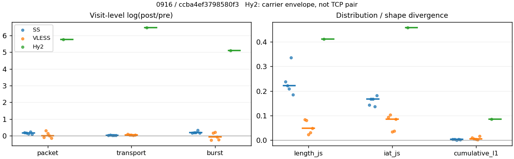
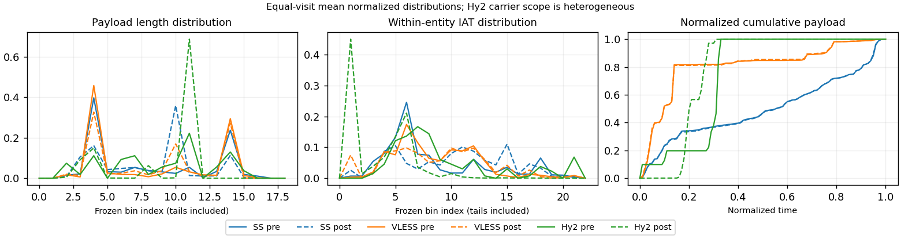

# 0916 · 条目 021 · bing.com

目标：https://www.bing.com/search?q=sourdough+bread+recipe

活动标签：bing.com::search_results_view。选定访问 15 次。

[返回总索引](../../README.md) · [统计口径](../../methods.md)

## 覆盖与资格（每次访问均保留）

| 部署 | 重复 | 主请求路由 | 活动状态 | 代理比较 | DIRECT pre | 请求 proxy/direct/unresolved | 错误 |
| --- | --- | --- | --- | --- | --- | --- | --- |
| Hy2 | 1 | direct | passed | 0 | 1 | 0/663/0 | [] |
| Hy2 | 2 | direct | passed | 0 | 1 | 0/685/0 | [] |
| Hy2 | 3 | direct | passed | 1 | 1 | 5/693/0 | [] |
| Hy2 | 4 | direct | passed | 0 | 1 | 0/674/0 | [] |
| Hy2 | 5 | direct | passed | 0 | 1 | 0/684/0 | [] |
| SS | 1 | proxy | passed | 1 | 0 | 754/0/0 | [] |
| SS | 2 | proxy | passed | 1 | 0 | 599/0/1 | [] |
| SS | 3 | proxy | passed | 1 | 0 | 693/0/0 | [] |
| SS | 4 | proxy | passed | 1 | 0 | 613/0/0 | [] |
| SS | 5 | proxy | passed | 1 | 0 | 481/0/0 | [] |
| VLESS | 1 | proxy | passed | 1 | 0 | 609/0/0 | [] |
| VLESS | 2 | proxy | passed | 1 | 0 | 491/0/0 | [] |
| VLESS | 3 | proxy | passed | 1 | 0 | 596/0/0 | [] |
| VLESS | 4 | proxy | passed | 1 | 0 | 382/0/0 | [] |
| VLESS | 5 | proxy | passed | 1 | 0 | 651/0/0 | [] |

主请求非 proxy 的统计仅解释为已索引的辅助代理连接或 DIRECT 观测，不代表目标业务经代理传输。播放确认与配对资格是两道不同的门。

图中散点为单次访问，短线为重复中位数；Hy2 是共享载体包络，不能与 TCP 配对作等范围因果对比。

形态图先逐访问归一化，再对访问等权平均；实线 pre，虚线 post。分箱序号及边界见 methods，不将分箱索引误解为长度或时间。

## 每次访问的关键观测

### SS

范围：`exclusive_page`。每格 pre → post；空值为不可观测/不适用。

| 重复 | 包数 | 载荷字节 | burst | TCP FR | IAT中位µs | length JS | IAT JS |
| --- | --- | --- | --- | --- | --- | --- | --- |
| 1 | 3357 → 4008 | 2.8609e+06 → 2.9068e+06 | 2305 → 2732 | 566 → 572 | 41.23 → 792.22 | 0.23789 | 0.14349 |
| 2 | 2225 → 2639 | 1.4465e+06 → 1.5122e+06 | 1551 → 1871 | 341 → 363 | 37.338 → 856.58 | 0.2226 | 0.1678 |
| 3 | 2773 → 3125 | 1.7981e+06 → 1.8488e+06 | 1808 → 2202 | 531 → 541 | 60.87 → 1371.2 | 0.20935 | 0.16705 |
| 4 | 2461 → 3128 | 1.6734e+06 → 1.7166e+06 | 1653 → 2315 | 401 → 423 | 43.597 → 1022.5 | 0.33652 | 0.13693 |
| 5 | 2080 → 2277 | 1.2257e+06 → 1.2593e+06 | 1425 → 1684 | 329 → 334 | 41.763 → 1021.7 | 0.1846 | 0.18222 |

完整标量统计：中位数 [min,max]；Δ 为重复内逐访问变换的中位数，MAD 未缩放。n 为可用变换数；DIRECT-only 的 nΔ=0 不代表 pre 不可用。

| scope | 特征 | pre | post | Δ | IQRΔ | MADΔ | nΔ |
| --- | --- | --- | --- | --- | --- | --- | --- |
| exclusive_page | active_span_sum_s_1000ms | 75.897 [60.569, 92.38] | 81.85 [67.994, 99.762] | 0.076871 | 0.040117 | 0.038761 | 5 |
| exclusive_page | active_span_sum_s_100ms | 7.8298 [5.2941, 9.7965] | 16.641 [14.63, 22.061] | 0.8306 | 0.09704 | 0.076674 | 5 |
| exclusive_page | active_span_sum_s_500ms | 54.217 [43.872, 71.26] | 69.74 [52.706, 82.226] | 0.14313 | 0.1231 | 0.039972 | 5 |
| exclusive_page | burst_bytes_iqr | 1234 [859, 1448] | 1428 [1428, 1428] | 0.14601 | 0.28967 | 0.15992 | 5 |
| exclusive_page | burst_bytes_mad | 85 [85, 85] | 95.5 [74, 119] | 0.11647 | 0.47506 | 0.22 | 5 |
| exclusive_page | burst_bytes_max | 22344 [20480, 24576] | 11424 [6972, 19992] | -0.67084 | 0.40243 | 0.20185 | 5 |
| exclusive_page | burst_bytes_mean | 994.53 [860.13, 1241.2] | 808.23 [741.52, 1064] | -0.15402 | 0.026197 | 0.014114 | 5 |
| exclusive_page | burst_bytes_median | 85 [85, 85] | 95.5 [74, 119] | 0.11647 | 0.47506 | 0.22 | 5 |
| exclusive_page | burst_bytes_min | 0 [0, 0] | 0 [0, 0] | — | — | — | 0 |
| exclusive_page | burst_bytes_p95 | 4285.9 [4083.6, 5792] | 2856 [2856, 4023.2] | -0.3644 | 0.04554 | 0.0068431 | 5 |
| exclusive_page | burst_bytes_q25 | 0 [0, 0] | 0 [0, 0] | — | — | — | 0 |
| exclusive_page | burst_bytes_q75 | 1234 [859, 1448] | 1428 [1428, 1428] | 0.14601 | 0.28967 | 0.15992 | 5 |
| exclusive_page | burst_bytes_std | 2057.3 [1850.2, 2574] | 1145.8 [1015.6, 1769.1] | -0.55405 | 0.031463 | 0.026082 | 5 |
| exclusive_page | burst_count | 1653 [1425, 2305] | 2202 [1684, 2732] | 0.18757 | 0.027192 | 0.01762 | 5 |
| exclusive_page | burst_duration_ms_iqr | 0.047196 [0.037896, 0.12802] | 0.000104 [0, 0.17088] | 0.28879 | 3.5424 | 0.89788 | 3 |
| exclusive_page | burst_duration_ms_mad | 0 [0, 0] | 0 [0, 0] | — | — | — | 0 |
| exclusive_page | burst_duration_ms_max | 12638 [10849, 15001] | 25452 [15047, 41869] | 0.52868 | 0.8606 | 0.37362 | 5 |
| exclusive_page | burst_duration_ms_mean | 96.428 [70.951, 125] | 84.062 [58.953, 96.943] | -0.18525 | 0.16094 | 0.068929 | 5 |
| exclusive_page | burst_duration_ms_median | 0 [0, 0] | 0 [0, 0] | — | — | — | 0 |
| exclusive_page | burst_duration_ms_min | 0 [0, 0] | 0 [0, 0] | — | — | — | 0 |
| exclusive_page | burst_duration_ms_p95 | 271.33 [232.42, 414.35] | 178.99 [174.28, 192.46] | -0.43288 | 0.15603 | 0.096689 | 5 |
| exclusive_page | burst_duration_ms_q25 | 0 [0, 0] | 0 [0, 0] | — | — | — | 0 |
| exclusive_page | burst_duration_ms_q75 | 0.047196 [0.037896, 0.12802] | 0.000104 [0, 0.17088] | 0.28879 | 3.5424 | 0.89788 | 3 |
| exclusive_page | burst_duration_ms_std | 567.52 [480.2, 953.51] | 917.09 [617.11, 1115.2] | 0.11759 | 0.38944 | 0.077355 | 5 |
| exclusive_page | burst_packets_iqr | 1 [1, 1] | 1 [0, 1] | 0 | 0 | 0 | 3 |
| exclusive_page | burst_packets_mad | 0 [0, 0] | 0 [0, 0] | — | — | — | 0 |
| exclusive_page | burst_packets_max | 11 [8, 16] | 12 [11, 12] | 0 | 0.37469 | 0.28768 | 5 |
| exclusive_page | burst_packets_mean | 1.4596 [1.4346, 1.5337] | 1.4105 [1.3512, 1.4671] | -0.076509 | 0.06071 | 0.020483 | 5 |
| exclusive_page | burst_packets_median | 1 [1, 1] | 1 [1, 1] | 0 | 0 | 0 | 5 |
| exclusive_page | burst_packets_min | 1 [1, 1] | 1 [1, 1] | 0 | 0 | 0 | 5 |
| exclusive_page | burst_packets_p95 | 3 [3, 3] | 3 [3, 3] | 0 | 0 | 0 | 5 |
| exclusive_page | burst_packets_q25 | 1 [1, 1] | 1 [1, 1] | 0 | 0 | 0 | 5 |
| exclusive_page | burst_packets_q75 | 2 [2, 2] | 2 [1, 2] | 0 | 0.69315 | 0 | 5 |
| exclusive_page | burst_packets_std | 0.87229 [0.75111, 0.94975] | 0.86356 [0.81016, 0.95737] | 0.093063 | 0.16798 | 0.017085 | 5 |
| exclusive_page | connection_span_concurrency_max | 5 [5, 6] | 5 [5, 6] | 0 | 0 | 0 | 5 |
| exclusive_page | cumulative_l1 | — | — | 0.003548 | 0.0015807 | 0.00095572 | 5 |
| exclusive_page | cumulative_max | — | — | 0.015067 | 0.032069 | 0.004559 | 5 |
| exclusive_page | direction_entropy | 0.99786 [0.96913, 0.99922] | 0.81509 [0.7513, 0.83719] | -0.18277 | 0.047642 | 0.025423 | 5 |
| exclusive_page | down_burst_count | 822 [708, 1146] | 1097 [838, 1360] | 0.18857 | 0.026733 | 0.017364 | 5 |
| exclusive_page | down_ip_bytes | 1.6057e+06 [1.1716e+06, 2.7883e+06] | 1.6428e+06 [1.1891e+06, 2.8211e+06] | 0.020596 | 0.0067174 | 0.0022578 | 5 |
| exclusive_page | down_packets | 1295 [1099, 1843] | 1650 [1162, 2231] | 0.1719 | 0.087701 | 0.068541 | 5 |
| exclusive_page | down_transport_bytes | 1.5383e+06 [1.1143e+06, 2.6924e+06] | 1.5568e+06 [1.1285e+06, 2.7048e+06] | 0.012583 | 0.0017942 | 0.00117 | 5 |
| exclusive_page | duration_s | 66.842 [63.6, 95.356] | 66.841 [63.614, 95.355] | -8.1223e-06 | 1.6228e-06 | 1.5338e-06 | 5 |
| exclusive_page | entity_count | 9 [8, 13] | 9 [8, 13] | 0 | 0 | 0 | 5 |
| exclusive_page | fr_runs | 401 [329, 566] | 423 [334, 572] | 0.018657 | 0.038328 | 0.0081123 | 5 |
| exclusive_page | fr_runs_per_packet | 0.2814 [0.26682, 0.3228] | 0.24593 [0.24089, 0.30739] | -0.020888 | 0.025105 | 0.010481 | 5 |
| exclusive_page | fr_switches | 391 [320, 553] | 413 [325, 559] | 0.01894 | 0.039236 | 0.0081485 | 5 |
| exclusive_page | fr_switches_per_possible_transition | 0.27633 [0.26162, 0.31949] | 0.24131 [0.23654, 0.30422] | -0.020315 | 0.024521 | 0.01012 | 5 |
| exclusive_page | full_retransmission_fraction | 0.0029789 [0.0018031, 0.0032507] | 0.011419 [0.0064, 0.03183] | 0.0090147 | 0.0045631 | 0.002762 | 5 |
| exclusive_page | full_retransmission_packets | 7 [5, 10] | 37 [20, 84] | 1.6487 | 0.31845 | 0.26236 | 5 |
| exclusive_page | iat_count | 2451 [2071, 3344] | 3117 [2268, 3995] | 0.17128 | 0.058046 | 0.05145 | 5 |
| exclusive_page | iat_js | — | — | 0.16705 | 0.024309 | 0.015179 | 5 |
| exclusive_page | iat_ks | — | — | 0.31875 | 0.0065443 | 0.0054804 | 5 |
| exclusive_page | iat_median_us | 41.763 [37.338, 60.87] | 1021.7 [792.22, 1371.2] | 3.1329 | 0.040293 | 0.022051 | 5 |
| exclusive_page | iat_us_iqr | 2438.3 [1147.5, 3734.7] | 9645.8 [9081.7, 18649] | 1.6081 | 0.69777 | 0.33092 | 5 |
| exclusive_page | iat_us_mad | 36.812 [30.727, 53.705] | 1013 [782.65, 1366.5] | 3.2803 | 0.078582 | 0.038914 | 5 |
| exclusive_page | iat_us_max | 1.5001e+07 [1.5001e+07, 1.5001e+07] | 1.5271e+07 [1.5034e+07, 1.5487e+07] | 0.01781 | 0.018125 | 0.0094827 | 5 |
| exclusive_page | iat_us_mean | 1.0213e+05 [85851, 1.1678e+05] | 84824 [60638, 93731] | -0.21986 | 0.070563 | 0.050945 | 5 |
| exclusive_page | iat_us_median | 41.763 [37.338, 60.87] | 1021.7 [792.22, 1371.2] | 3.1329 | 0.040293 | 0.022051 | 5 |
| exclusive_page | iat_us_min | 0.018 [0.012, 0.17] | 0.037 [0.033, 0.037] | 0.72055 | 1.8065 | 0.40547 | 5 |
| exclusive_page | iat_us_p95 | 2.4571e+05 [2.0957e+05, 3.2943e+05] | 1.9808e+05 [1.7514e+05, 2.4469e+05] | -0.21548 | 0.047207 | 0.045742 | 5 |
| exclusive_page | iat_us_q25 | 16.723 [14.768, 20.774] | 25.809 [16.717, 31.062] | 0.21702 | 0.44412 | 0.19317 | 5 |
| exclusive_page | iat_us_q75 | 2455.8 [1163.9, 3755.5] | 9674.5 [9112.8, 18675] | 1.604 | 0.69456 | 0.32926 | 5 |
| exclusive_page | iat_us_std | 8.3473e+05 [7.5301e+05, 9.7747e+05] | 7.8704e+05 [6.0129e+05, 8.2035e+05] | -0.11801 | 0.068291 | 0.057223 | 5 |
| exclusive_page | iat_wasserstein_log1p_us | — | — | 1.4919 | 0.0021493 | 0.0020948 | 5 |
| exclusive_page | idle_gap_count_1000ms | 33 [30, 44] | 27 [26, 39] | -0.13815 | 0.022473 | 0.017522 | 5 |
| exclusive_page | idle_gap_count_100ms | 252 [218, 328] | 276 [224, 337] | 0.027909 | 0.063821 | 0.00083947 | 5 |
| exclusive_page | idle_gap_count_500ms | 62 [55, 74] | 50 [43, 57] | -0.19531 | 0.078692 | 0.059177 | 5 |
| exclusive_page | idle_gap_sum_s_1000ms | 181.28 [159.32, 198.05] | 144.59 [141.72, 196.55] | -0.11705 | 0.19325 | 0.10911 | 5 |
| exclusive_page | idle_gap_sum_s_100ms | 242.5 [217.27, 277.29] | 220.19 [197.25, 261.01] | -0.046459 | 0.13657 | 0.010756 | 5 |
| exclusive_page | idle_gap_sum_s_500ms | 196.11 [178.69, 215.82] | 160.02 [155.41, 204.54] | -0.1396 | 0.12043 | 0.061604 | 5 |
| exclusive_page | ip_bytes | 1.8016e+06 [1.334e+06, 3.0357e+06] | 1.8937e+06 [1.3892e+06, 3.1333e+06] | 0.040498 | 0.0096445 | 0.0088462 | 5 |
| exclusive_page | length_iqr | 2076 [1362, 2804] | 1309 [1275.2, 1310] | -0.46885 | 0.13074 | 0.082775 | 5 |
| exclusive_page | length_js | — | — | 0.2226 | 0.028534 | 0.015289 | 5 |
| exclusive_page | length_ks | — | — | 0.26043 | 0.020172 | 0.0066071 | 5 |
| exclusive_page | length_mad | 391 [134.5, 873] | 607 [546.5, 820.5] | 0.33483 | 0.52058 | 0.32329 | 5 |
| exclusive_page | length_max | 8948 [8948, 8948] | 4284 [2856, 8568] | -0.73654 | 0.69315 | 0.40547 | 5 |
| exclusive_page | length_mean | 1131.9 [1042.3, 1459.6] | 1024.5 [977.57, 1233.8] | -0.099625 | 0.12831 | 0.068466 | 5 |
| exclusive_page | length_median | 475 [165.5, 958] | 1371 [989.5, 1428] | 0.97161 | 0.23005 | 0.14168 | 5 |
| exclusive_page | length_min | 24 [7, 31] | 13 [10, 20] | -0.86904 | 1.3173 | 0.080043 | 5 |
| exclusive_page | length_p95 | 2896 [2896, 4096] | 2856 [2856, 2856] | -0.013908 | 0.15809 | 0 | 5 |
| exclusive_page | length_q25 | 86 [86, 93] | 119 [118, 152.75] | 0.32478 | 0.089128 | 0.078252 | 5 |
| exclusive_page | length_q75 | 2162 [1448, 2896] | 1428 [1428, 1428] | -0.41476 | 0.12304 | 0.087734 | 5 |
| exclusive_page | length_std | 1427.8 [1179.1, 1630.5] | 891.84 [790.2, 1029.8] | -0.42121 | 0.10856 | 0.070226 | 5 |
| exclusive_page | length_wasserstein_bytes | — | — | 462.32 | 115.6 | 50.339 | 5 |
| exclusive_page | nonempty_entity_count | 9 [8, 13] | 9 [8, 13] | 0 | 0 | 0 | 5 |
| exclusive_page | nonempty_packets | 1425 [1176, 1960] | 1756 [1240, 2356] | 0.14404 | 0.11645 | 0.064827 | 5 |
| exclusive_page | offload_suspect_fraction | 0.17483 [0.14425, 0.22431] | 0.076856 [0.054987, 0.10953] | -0.089951 | 0.019245 | 0.0062294 | 5 |
| exclusive_page | packet_count | 2461 [2080, 3357] | 3125 [2277, 4008] | 0.17064 | 0.05774 | 0.051139 | 5 |
| exclusive_page | rtt_median_ms | 0.07513 [0.065278, 0.088776] | 27.767 [26.084, 36.185] | 5.9124 | 0.25893 | 0.16591 | 5 |
| exclusive_page | rtt_sample_count | 1075 [922, 1496] | 819 [667, 1101] | -0.30658 | 0.051763 | 0.034584 | 5 |
| exclusive_page | tcp_ack_count | 2451 [2069, 3339] | 3116 [2266, 3990] | 0.17014 | 0.057887 | 0.049906 | 5 |
| exclusive_page | tcp_fin_count | 18 [16, 26] | 21 [17, 27] | 0.10008 | 0.044736 | 0.039459 | 5 |
| exclusive_page | tcp_packet_count | 2461 [2080, 3357] | 3125 [2277, 4008] | 0.17064 | 0.05774 | 0.051139 | 5 |
| exclusive_page | tcp_rst_count | 2 [0, 5] | 0 [0, 1] | -1.1513 | 0.45815 | 0.45815 | 2 |
| exclusive_page | tcp_syn_count | 18 [16, 26] | 21 [17, 32] | 0.13976 | 0.093526 | 0.067877 | 5 |
| exclusive_page | tcp_window_raw_median | 65363 [65309, 65448] | 161 [140, 168] | -6.0063 | 0.14097 | 0.041749 | 5 |
| exclusive_page | transition_entropy | 0.84644 [0.82913, 0.90061] | 0.72941 [0.68994, 0.79915] | -0.10147 | 0.056778 | 0.0030174 | 5 |
| exclusive_page | transition_n_mm | 541 [448, 901] | 1020 [760, 1565] | 0.55214 | 0.19673 | 0.068709 | 5 |
| exclusive_page | transition_n_mp | 191 [156, 272] | 202 [158, 275] | 0.019194 | 0.043255 | 0.0082254 | 5 |
| exclusive_page | transition_n_pm | 200 [164, 281] | 211 [167, 284] | 0.018692 | 0.035413 | 0.0080726 | 5 |
| exclusive_page | transition_n_pp | 485 [391, 493] | 199 [146, 219] | -0.89084 | 0.11086 | 0.079407 | 5 |
| exclusive_page | transition_p_mm | 0.73907 [0.70913, 0.76812] | 0.84011 [0.79501, 0.85136] | 0.08588 | 0.022896 | 0.0034522 | 5 |
| exclusive_page | transition_p_mp | 0.26093 [0.23188, 0.29087] | 0.15989 [0.14864, 0.20499] | -0.08588 | 0.022896 | 0.0034522 | 5 |
| exclusive_page | transition_p_pm | 0.2955 [0.25797, 0.36305] | 0.54522 [0.47013, 0.57569] | 0.22236 | 0.025888 | 0.015691 | 5 |
| exclusive_page | transition_p_pp | 0.7045 [0.63695, 0.74203] | 0.45478 [0.42431, 0.52987] | -0.22236 | 0.025888 | 0.015691 | 5 |
| exclusive_page | transport_bytes | 1.6734e+06 [1.2257e+06, 2.8609e+06] | 1.7166e+06 [1.2593e+06, 2.9068e+06] | 0.02709 | 0.0022768 | 0.0015777 | 5 |
| exclusive_page | up_burst_count | 831 [717, 1159] | 1105 [846, 1372] | 0.18659 | 0.027644 | 0.017874 | 5 |
| exclusive_page | up_byte_fraction | 0.090152 [0.058901, 0.099429] | 0.10394 [0.069495, 0.11763] | 0.012376 | 0.0024999 | 0.0017812 | 5 |
| exclusive_page | up_ip_bytes | 1.959e+05 [1.6247e+05, 2.474e+05] | 2.5506e+05 [2.0005e+05, 3.1224e+05] | 0.23276 | 0.039476 | 0.024662 | 5 |
| exclusive_page | up_packets | 1166 [981, 1514] | 1465 [1115, 1777] | 0.16017 | 0.031159 | 0.022046 | 5 |
| exclusive_page | up_transport_bytes | 1.3509e+05 [1.1135e+05, 1.7878e+05] | 1.7787e+05 [1.309e+05, 2.0291e+05] | 0.16814 | 0.01959 | 0.013198 | 5 |
| exclusive_page | zero_iat_count | 0 [0, 0] | 0 [0, 0] | — | — | — | 0 |
| exclusive_page | zero_iat_fraction | 0 [0, 0] | 0 [0, 0] | 0 | 0 | 0 | 5 |

### VLESS

范围：`exclusive_page`。每格 pre → post；空值为不可观测/不适用。

| 重复 | 包数 | 载荷字节 | burst | TCP FR | IAT中位µs | length JS | IAT JS |
| --- | --- | --- | --- | --- | --- | --- | --- |
| 1 | 1131 → 1032 | 5.5164e+05 → 6.0788e+05 | 795 → 619 | 74 → 90 | 68.298 → 425.33 | 0.084032 | 0.093812 |
| 2 | 1541 → 2071 | 1.4641e+06 → 1.5212e+06 | 1031 → 1223 | 60 → 74 | 155.12 → 56.664 | 0.081489 | 0.10393 |
| 3 | 1762 → 2037 | 1.4881e+06 → 1.5517e+06 | 1180 → 1450 | 64 → 80 | 176.7 → 137.85 | 0.022845 | 0.034624 |
| 4 | 2109 → 2120 | 1.5671e+06 → 1.6142e+06 | 1488 → 1382 | 94 → 108 | 172.06 → 415.52 | 0.031305 | 0.036982 |
| 5 | 2347 → 2052 | 1.244e+06 → 1.2938e+06 | 1629 → 1277 | 276 → 292 | 94.617 → 619.88 | 0.048504 | 0.085474 |

完整标量统计：中位数 [min,max]；Δ 为重复内逐访问变换的中位数，MAD 未缩放。n 为可用变换数；DIRECT-only 的 nΔ=0 不代表 pre 不可用。

| scope | 特征 | pre | post | Δ | IQRΔ | MADΔ | nΔ |
| --- | --- | --- | --- | --- | --- | --- | --- |
| exclusive_page | active_span_sum_s_1000ms | 11.975 [10.524, 32.277] | 12.196 [10.182, 32.262] | -0.0004598 | 0.046109 | 0.032534 | 5 |
| exclusive_page | active_span_sum_s_100ms | 2.4097 [2.0395, 3.5089] | 5.181 [4.7074, 10.309] | 0.83043 | 0.13945 | 0.13343 | 5 |
| exclusive_page | active_span_sum_s_500ms | 7.571 [5.8395, 27.802] | 12.133 [10.182, 32.262] | 0.49092 | 0.066483 | 0.047209 | 5 |
| exclusive_page | burst_bytes_iqr | 2824 [692, 2896] | 2824 [2006, 2824] | 0 | 0.8401 | 0.025176 | 5 |
| exclusive_page | burst_bytes_mad | 31 [0, 84] | 72 [31, 84] | 0.54931 | 0.65073 | 0.29337 | 4 |
| exclusive_page | burst_bytes_max | 17376 [5792, 27640] | 8688 [8384, 23096] | -0.40547 | 0.51354 | 0.28768 | 5 |
| exclusive_page | burst_bytes_mean | 1053.1 [693.89, 1420.1] | 1070.1 [982.03, 1243.8] | 0.10354 | 0.41529 | 0.23607 | 5 |
| exclusive_page | burst_bytes_median | 31 [0, 84] | 72 [31, 84] | 0.54931 | 0.65073 | 0.29337 | 4 |
| exclusive_page | burst_bytes_min | 0 [0, 0] | 0 [0, 0] | — | — | — | 0 |
| exclusive_page | burst_bytes_p95 | 2896 [2896, 5792] | 2896 [2896, 2968] | 0 | 0.40547 | 0 | 5 |
| exclusive_page | burst_bytes_q25 | 0 [0, 0] | 0 [0, 0] | — | — | — | 0 |
| exclusive_page | burst_bytes_q75 | 2824 [692, 2896] | 2824 [2006, 2824] | 0 | 0.8401 | 0.025176 | 5 |
| exclusive_page | burst_bytes_std | 1762.9 [1207.2, 2239.7] | 1340.1 [1285.3, 1564.9] | -0.28983 | 0.11108 | 0.068732 | 5 |
| exclusive_page | burst_count | 1180 [795, 1629] | 1277 [619, 1450] | -0.073901 | 0.41423 | 0.17634 | 5 |
| exclusive_page | burst_duration_ms_iqr | 0.074048 [0.050538, 0.70595] | 1.5564 [0.0050958, 1.8929] | 3.2412 | 4.797 | 0.30481 | 5 |
| exclusive_page | burst_duration_ms_mad | 0 [0, 0] | 0 [0, 0] | — | — | — | 0 |
| exclusive_page | burst_duration_ms_max | 14543 [10136, 15001] | 15058 [15047, 15376] | 0.034819 | 0.30345 | 0.028735 | 5 |
| exclusive_page | burst_duration_ms_mean | 53.224 [24.135, 72.473] | 80.086 [29.413, 113.47] | 0.40858 | 0.47656 | 0.26576 | 5 |
| exclusive_page | burst_duration_ms_median | 0 [0, 0] | 0 [0, 0] | — | — | — | 0 |
| exclusive_page | burst_duration_ms_min | 0 [0, 0] | 0 [0, 0] | — | — | — | 0 |
| exclusive_page | burst_duration_ms_p95 | 9.8503 [7.8258, 201.01] | 10.117 [9.4705, 157.65] | 0.069896 | 0.2961 | 0.18688 | 5 |
| exclusive_page | burst_duration_ms_q25 | 0 [0, 0] | 0 [0, 0] | — | — | — | 0 |
| exclusive_page | burst_duration_ms_q75 | 0.074048 [0.050538, 0.70595] | 1.5564 [0.0050958, 1.8929] | 3.2412 | 4.797 | 0.30481 | 5 |
| exclusive_page | burst_duration_ms_std | 508.16 [381.96, 886.81] | 868.08 [572.83, 1214.3] | 0.53549 | 0.44129 | 0.22559 | 5 |
| exclusive_page | burst_packets_iqr | 1 [1, 1] | 1 [1, 1] | 0 | 0 | 0 | 5 |
| exclusive_page | burst_packets_mad | 0 [0, 0] | 0 [0, 0] | — | — | — | 0 |
| exclusive_page | burst_packets_max | 10 [4, 17] | 13 [12, 16] | 0.18232 | 0.81093 | 0.45059 | 5 |
| exclusive_page | burst_packets_mean | 1.4408 [1.4173, 1.4947] | 1.6069 [1.4048, 1.6934] | 0.10913 | 0.045719 | 0.030026 | 5 |
| exclusive_page | burst_packets_median | 1 [1, 1] | 1 [1, 1] | 0 | 0 | 0 | 5 |
| exclusive_page | burst_packets_min | 1 [1, 1] | 1 [1, 1] | 0 | 0 | 0 | 5 |
| exclusive_page | burst_packets_p95 | 3 [2, 3] | 3 [3, 4] | 0.28768 | 0.40547 | 0.28768 | 5 |
| exclusive_page | burst_packets_q25 | 1 [1, 1] | 1 [1, 1] | 0 | 0 | 0 | 5 |
| exclusive_page | burst_packets_q75 | 2 [2, 2] | 2 [2, 2] | 0 | 0 | 0 | 5 |
| exclusive_page | burst_packets_std | 0.76561 [0.60151, 1.0887] | 1.0646 [0.82603, 1.2566] | 0.31718 | 0.31477 | 0.17833 | 5 |
| exclusive_page | connection_span_concurrency_max | 4 [4, 5] | 4 [4, 5] | 0 | 0 | 0 | 5 |
| exclusive_page | cumulative_l1 | — | — | 0.0049342 | 0.0051809 | 0.0030901 | 5 |
| exclusive_page | cumulative_max | — | — | 0.029669 | 0.015161 | 0.0097235 | 5 |
| exclusive_page | direction_entropy | 0.71392 [0.61466, 0.98366] | 0.46066 [0.35867, 0.74326] | -0.25326 | 0.041807 | 0.028633 | 5 |
| exclusive_page | down_burst_count | 586 [394, 811] | 635 [306, 721] | -0.074316 | 0.41649 | 0.17845 | 5 |
| exclusive_page | down_ip_bytes | 1.4818e+06 [5.3733e+05, 1.578e+06] | 1.5411e+06 [5.8028e+05, 1.613e+06] | 0.035071 | 0.012358 | 0.008158 | 5 |
| exclusive_page | down_packets | 1078 [601, 1282] | 1191 [589, 1277] | 0.044843 | 0.10207 | 0.065012 | 5 |
| exclusive_page | down_transport_bytes | 1.4329e+06 [5.0603e+05, 1.5144e+06] | 1.4777e+06 [5.4958e+05, 1.5465e+06] | 0.032367 | 0.0024425 | 0.0015882 | 5 |
| exclusive_page | duration_s | 66.309 [62.436, 69.19] | 66.268 [62.418, 69.16] | -0.00061326 | 0.00020681 | 0.00017327 | 5 |
| exclusive_page | entity_count | 7 [7, 8] | 7 [7, 8] | 0 | 0 | 0 | 5 |
| exclusive_page | fr_runs | 74 [60, 276] | 90 [74, 292] | 0.19574 | 0.070884 | 0.027399 | 5 |
| exclusive_page | fr_runs_per_packet | 0.074603 [0.058932, 0.19742] | 0.085511 [0.062185, 0.24936] | 0.011491 | 0.034469 | 0.012597 | 5 |
| exclusive_page | fr_switches | 67 [53, 269] | 83 [67, 285] | 0.21415 | 0.083578 | 0.037166 | 5 |
| exclusive_page | fr_switches_per_possible_transition | 0.06869 [0.051948, 0.19339] | 0.079681 [0.056636, 0.24485] | 0.011882 | 0.033526 | 0.011569 | 5 |
| exclusive_page | full_retransmission_fraction | 0.0021304 [0, 0.0035367] | 0 [0, 0.00048733] | -0.001643 | 0.0022774 | 0.0012019 | 5 |
| exclusive_page | full_retransmission_packets | 4 [0, 6] | 0 [0, 1] | -1.6094 | — | — | 1 |
| exclusive_page | iat_count | 1754 [1124, 2340] | 2045 [1025, 2112] | 0.0052219 | 0.23785 | 0.13998 | 5 |
| exclusive_page | iat_js | — | — | 0.085474 | 0.056829 | 0.018456 | 5 |
| exclusive_page | iat_ks | — | — | 0.13561 | 0.10458 | 0.069144 | 5 |
| exclusive_page | iat_median_us | 155.12 [68.298, 176.7] | 415.52 [56.664, 619.88] | 0.88167 | 2.0773 | 0.99802 | 5 |
| exclusive_page | iat_us_iqr | 1568.7 [1118.8, 1977.5] | 2160.4 [1206.4, 5139.4] | 0.36123 | 0.67796 | 0.39217 | 5 |
| exclusive_page | iat_us_mad | 148.19 [61.981, 171.02] | 407.14 [56.555, 610.98] | 0.89879 | 2.1418 | 1.0402 | 5 |
| exclusive_page | iat_us_max | 1.5001e+07 [1.5001e+07, 1.5001e+07] | 1.5443e+07 [1.5319e+07, 1.5446e+07] | 0.029004 | 0.00088586 | 0.00018595 | 5 |
| exclusive_page | iat_us_mean | 1.3479e+05 [89690, 1.8175e+05] | 1.0255e+05 [93215, 1.9897e+05] | -0.0064736 | 0.23701 | 0.14002 | 5 |
| exclusive_page | iat_us_median | 155.12 [68.298, 176.7] | 415.52 [56.664, 619.88] | 0.88167 | 2.0773 | 0.99802 | 5 |
| exclusive_page | iat_us_min | 0.093 [0.041, 0.516] | 0.035 [0.032, 0.037] | -1.0361 | 1.5168 | 0.78826 | 5 |
| exclusive_page | iat_us_p95 | 10076 [9720.2, 1.9905e+05] | 41403 [18801, 1.555e+05] | 0.78578 | 0.77608 | 0.61404 | 5 |
| exclusive_page | iat_us_q25 | 32.827 [20.777, 36.742] | 24.178 [8.6002, 36.125] | -0.27347 | 0.086888 | 0.054563 | 5 |
| exclusive_page | iat_us_q75 | 1602.4 [1151.6, 1998.3] | 2188.4 [1230.6, 5175.6] | 0.34998 | 0.68055 | 0.39694 | 5 |
| exclusive_page | iat_us_std | 1.3244e+06 [9.711e+05, 1.5067e+06] | 1.1543e+06 [1.04e+06, 1.5963e+06] | 0.0077884 | 0.12371 | 0.060783 | 5 |
| exclusive_page | iat_wasserstein_log1p_us | — | — | 0.90571 | 0.53943 | 0.11185 | 5 |
| exclusive_page | idle_gap_count_1000ms | 17 [17, 23] | 16 [16, 22] | -0.060625 | 0.016173 | 0 | 5 |
| exclusive_page | idle_gap_count_100ms | 52 [41, 150] | 58 [46, 155] | 0.1092 | 0.023262 | 0.017392 | 5 |
| exclusive_page | idle_gap_count_500ms | 27 [24, 32] | 17 [16, 23] | -0.40547 | 0.075223 | 0.057158 | 5 |
| exclusive_page | idle_gap_sum_s_1000ms | 192.32 [177.6, 268.64] | 191.82 [177.46, 267.74] | -0.00079635 | 0.0030417 | 0.0018143 | 5 |
| exclusive_page | idle_gap_sum_s_100ms | 204.36 [193.75, 277.92] | 199.41 [190.53, 274.76] | -0.015001 | 0.0035515 | 0.0017781 | 5 |
| exclusive_page | idle_gap_sum_s_500ms | 196.72 [182.07, 274.34] | 191.82 [177.46, 268.49] | -0.025254 | 0.0030469 | 0.0026198 | 5 |
| exclusive_page | ip_bytes | 1.5442e+06 [6.1045e+05, 1.6768e+06] | 1.6312e+06 [6.6228e+05, 1.7252e+06] | 0.048714 | 0.026387 | 0.020263 | 5 |
| exclusive_page | length_iqr | 2752 [1363, 2752] | 2752 [1340, 2752] | 0 | 0 | 0 | 5 |
| exclusive_page | length_js | — | — | 0.048504 | 0.050184 | 0.025659 | 5 |
| exclusive_page | length_ks | — | — | 0.16287 | 0.12384 | 0.068259 | 5 |
| exclusive_page | length_mad | 193 [22, 1340] | 1340 [756, 1340] | 1.9377 | 3.4092 | 1.8118 | 5 |
| exclusive_page | length_max | 8920 [4096, 8920] | 2896 [2824, 4344] | -0.7195 | 0.43182 | 0.34764 | 5 |
| exclusive_page | length_mean | 1243.7 [861.94, 1544.4] | 1278.1 [1087.4, 1365.9] | 0.027264 | 0.21964 | 0.18923 | 5 |
| exclusive_page | length_median | 224 [94, 1412] | 1412 [828, 1412] | 1.8411 | 2.1443 | 0.53032 | 5 |
| exclusive_page | length_min | 21 [13, 24] | 13 [1, 24] | 0 | 1.7918 | 0 | 5 |
| exclusive_page | length_p95 | 2824 [2824, 2932] | 2824 [2824, 2896] | 0 | 0 | 0 | 5 |
| exclusive_page | length_q25 | 72 [72, 85] | 72 [72, 72] | 0 | 0.16599 | 0 | 5 |
| exclusive_page | length_q75 | 2824 [1448, 2824] | 2824 [1412, 2824] | 0 | 0 | 0 | 5 |
| exclusive_page | length_std | 1292.3 [1126.5, 1538.5] | 1091.8 [1038.7, 1187.4] | -0.099905 | 0.058834 | 0.018778 | 5 |
| exclusive_page | length_wasserstein_bytes | — | — | 270.71 | 116.08 | 110.15 | 5 |
| exclusive_page | nonempty_entity_count | 7 [7, 8] | 7 [7, 8] | 0 | 0 | 0 | 5 |
| exclusive_page | nonempty_packets | 1086 [640, 1398] | 1171 [559, 1263] | 0.0023781 | 0.18033 | 0.1377 | 5 |
| exclusive_page | offload_suspect_fraction | 0.21527 [0.13677, 0.28423] | 0.1719 [0.12403, 0.20613] | -0.016553 | 0.038966 | 0.028418 | 5 |
| exclusive_page | packet_count | 1762 [1131, 2347] | 2052 [1032, 2120] | 0.0052022 | 0.23663 | 0.13953 | 5 |
| exclusive_page | rtt_median_ms | 0.10324 [0.10024, 0.4844] | 1.8196 [0.091401, 2.7004] | 2.8694 | 3.2851 | 0.4224 | 5 |
| exclusive_page | rtt_sample_count | 609 [445, 985] | 816 [418, 875] | 0.022306 | 0.36373 | 0.14072 | 5 |
| exclusive_page | tcp_ack_count | 1739 [1110, 2327] | 2045 [1025, 2112] | 0.012387 | 0.2339 | 0.14157 | 5 |
| exclusive_page | tcp_fin_count | 14 [12, 15] | 14 [14, 16] | 0.064539 | 0.0095695 | 0.0095695 | 5 |
| exclusive_page | tcp_packet_count | 1762 [1131, 2347] | 2052 [1032, 2120] | 0.0052022 | 0.23663 | 0.13953 | 5 |
| exclusive_page | tcp_rst_count | 14 [12, 15] | 0 [0, 2] | -1.7918 | — | — | 1 |
| exclusive_page | tcp_syn_count | 14 [14, 16] | 14 [14, 16] | 0 | 0 | 0 | 5 |
| exclusive_page | tcp_window_raw_median | 65535 [65363, 65535] | 152 [151, 233] | -6.0638 | 0.13021 | 0.0092287 | 5 |
| exclusive_page | transition_entropy | 0.32858 [0.25718, 0.70332] | 0.31812 [0.23603, 0.69063] | -0.010459 | 0.015085 | 0.012851 | 5 |
| exclusive_page | transition_n_mm | 759 [342, 966] | 1009 [410, 1086] | 0.15544 | 0.054729 | 0.028819 | 5 |
| exclusive_page | transition_n_mp | 30 [23, 131] | 38 [30, 139] | 0.23639 | 0.10062 | 0.051293 | 5 |
| exclusive_page | transition_n_pm | 37 [30, 138] | 45 [37, 146] | 0.19574 | 0.070884 | 0.027399 | 5 |
| exclusive_page | transition_n_pp | 200 [129, 456] | 59 [44, 101] | -1.0756 | 0.2699 | 0.035421 | 5 |
| exclusive_page | transition_p_mm | 0.96119 [0.83563, 0.97371] | 0.95936 [0.84842, 0.97278] | -0.0018301 | 0.0063648 | 0.0026226 | 5 |
| exclusive_page | transition_p_mp | 0.038806 [0.026287, 0.16437] | 0.040636 [0.027223, 0.15158] | 0.0018301 | 0.0063648 | 0.0026226 | 5 |
| exclusive_page | transition_p_pm | 0.19028 [0.14176, 0.23232] | 0.45679 [0.43269, 0.59109] | 0.26811 | 0.025099 | 0.01937 | 5 |
| exclusive_page | transition_p_pp | 0.80972 [0.76768, 0.85824] | 0.54321 [0.40891, 0.56731] | -0.26811 | 0.025099 | 0.01937 | 5 |
| exclusive_page | transport_bytes | 1.4641e+06 [5.5164e+05, 1.5671e+06] | 1.5212e+06 [6.0788e+05, 1.6142e+06] | 0.03931 | 0.0036182 | 0.002555 | 5 |
| exclusive_page | up_burst_count | 594 [401, 818] | 642 [313, 729] | -0.073491 | 0.41199 | 0.17427 | 5 |
| exclusive_page | up_byte_fraction | 0.033614 [0.021305, 0.082693] | 0.041927 [0.028587, 0.095901] | 0.0083131 | 0.0011227 | 0.0010313 | 5 |
| exclusive_page | up_ip_bytes | 73113 [62409, 1.3312e+05] | 95391 [82000, 1.3471e+05] | 0.1265 | 0.18902 | 0.11465 | 5 |
| exclusive_page | up_packets | 684 [530, 1065] | 852 [443, 867] | -0.052005 | 0.41639 | 0.16063 | 5 |
| exclusive_page | up_transport_bytes | 45617 [31193, 77781] | 58296 [43486, 89292] | 0.25063 | 0.086992 | 0.081615 | 5 |
| exclusive_page | zero_iat_count | 0 [0, 0] | 0 [0, 0] | — | — | — | 0 |
| exclusive_page | zero_iat_fraction | 0 [0, 0] | 0 [0, 0] | 0 | 0 | 0 | 5 |

### Hy2

范围：`direct_pre_only`。每格 pre → post；空值为不可观测/不适用。

| 重复 | 包数 | 载荷字节 | burst | TCP FR | IAT中位µs | length JS | IAT JS |
| --- | --- | --- | --- | --- | --- | --- | --- |
| 1 | 1708 → — | 1.1742e+06 → — | 1050 → — | 457 → — | 137.48 → — | — | — |
| 2 | 1826 → — | 1.2395e+06 → — | 1170 → — | 498 → — | 129.77 → — | — | — |
| 3 | 1828 → — | 1.0945e+06 → — | 1148 → — | 483 → — | 126.06 → — | — | — |
| 4 | 1850 → — | 1.1931e+06 → — | 1198 → — | 499 → — | 120.21 → — | — | — |
| 5 | 1875 → — | 1.2583e+06 → — | 1162 → — | 494 → — | 121.69 → — | — | — |

范围：`carrier_context_envelope`。每格 pre → post；空值为不可观测/不适用。

| 重复 | 包数 | 载荷字节 | burst | TCP FR | IAT中位µs | length JS | IAT JS |
| --- | --- | --- | --- | --- | --- | --- | --- |
| 1 | — | — | — | — | — | — | — |
| 2 | — | — | — | — | — | — | — |
| 3 | 137 → 43039 | 71618 → 4.582e+07 | 97 → 16001 | — | 108.98 → 4.799 | 0.41122 | 0.45709 |
| 4 | — | — | — | — | — | — | — |
| 5 | — | — | — | — | — | — | — |

完整标量统计：中位数 [min,max]；Δ 为重复内逐访问变换的中位数，MAD 未缩放。n 为可用变换数；DIRECT-only 的 nΔ=0 不代表 pre 不可用。

| scope | 特征 | pre | post | Δ | IQRΔ | MADΔ | nΔ |
| --- | --- | --- | --- | --- | --- | --- | --- |
| carrier_context_envelope | active_span_sum_s_1000ms | 3.2786 [3.2786, 3.2786] | 19.239 [19.239, 19.239] | 1.7695 | — | — | 1 |
| carrier_context_envelope | active_span_sum_s_100ms | 0.20187 [0.20187, 0.20187] | 5.5377 [5.5377, 5.5377] | 3.3117 | — | — | 1 |
| carrier_context_envelope | active_span_sum_s_500ms | 1.7202 [1.7202, 1.7202] | 16.44 [16.44, 16.44] | 2.2573 | — | — | 1 |
| carrier_context_envelope | burst_bytes_iqr | 728 [728, 728] | 4223 [4223, 4223] | 1.758 | — | — | 1 |
| carrier_context_envelope | burst_bytes_mad | 0 [0, 0] | 266 [266, 266] | — | — | — | 0 |
| carrier_context_envelope | burst_bytes_max | 7588 [7588, 7588] | 2.0337e+05 [2.0337e+05, 2.0337e+05] | 3.2885 | — | — | 1 |
| carrier_context_envelope | burst_bytes_mean | 738.33 [738.33, 738.33] | 2863.6 [2863.6, 2863.6] | 1.3554 | — | — | 1 |
| carrier_context_envelope | burst_bytes_median | 0 [0, 0] | 300 [300, 300] | — | — | — | 0 |
| carrier_context_envelope | burst_bytes_min | 0 [0, 0] | 22 [22, 22] | — | — | — | 0 |
| carrier_context_envelope | burst_bytes_p95 | 2896 [2896, 2896] | 10932 [10932, 10932] | 1.3284 | — | — | 1 |
| carrier_context_envelope | burst_bytes_q25 | 0 [0, 0] | 100 [100, 100] | — | — | — | 0 |
| carrier_context_envelope | burst_bytes_q75 | 728 [728, 728] | 4323 [4323, 4323] | 1.7814 | — | — | 1 |
| carrier_context_envelope | burst_bytes_std | 1422.7 [1422.7, 1422.7] | 4964.1 [4964.1, 4964.1] | 1.2497 | — | — | 1 |
| carrier_context_envelope | burst_count | 97 [97, 97] | 16001 [16001, 16001] | 5.1057 | — | — | 1 |
| carrier_context_envelope | burst_duration_ms_iqr | 0.1946 [0.1946, 0.1946] | 0.023075 [0.023075, 0.023075] | -2.1322 | — | — | 1 |
| carrier_context_envelope | burst_duration_ms_mad | 0 [0, 0] | 4.2e-05 [4.2e-05, 4.2e-05] | — | — | — | 0 |
| carrier_context_envelope | burst_duration_ms_max | 11071 [11071, 11071] | 9975.6 [9975.6, 9975.6] | -0.10416 | — | — | 1 |
| carrier_context_envelope | burst_duration_ms_mean | 348.67 [348.67, 348.67] | 1.3083 [1.3083, 1.3083] | -5.5854 | — | — | 1 |
| carrier_context_envelope | burst_duration_ms_median | 0 [0, 0] | 4.2e-05 [4.2e-05, 4.2e-05] | — | — | — | 0 |
| carrier_context_envelope | burst_duration_ms_min | 0 [0, 0] | 0 [0, 0] | — | — | — | 0 |
| carrier_context_envelope | burst_duration_ms_p95 | 505 [505, 505] | 0.073899 [0.073899, 0.073899] | -8.8296 | — | — | 1 |
| carrier_context_envelope | burst_duration_ms_q25 | 0 [0, 0] | 0 [0, 0] | — | — | — | 0 |
| carrier_context_envelope | burst_duration_ms_q75 | 0.1946 [0.1946, 0.1946] | 0.023075 [0.023075, 0.023075] | -2.1322 | — | — | 1 |
| carrier_context_envelope | burst_duration_ms_std | 1773.8 [1773.8, 1773.8] | 85.327 [85.327, 85.327] | -3.0344 | — | — | 1 |
| carrier_context_envelope | burst_packets_iqr | 1 [1, 1] | 2 [2, 2] | 0.69315 | — | — | 1 |
| carrier_context_envelope | burst_packets_mad | 0 [0, 0] | 1 [1, 1] | — | — | — | 0 |
| carrier_context_envelope | burst_packets_max | 3 [3, 3] | 161 [161, 161] | 3.9828 | — | — | 1 |
| carrier_context_envelope | burst_packets_mean | 1.4124 [1.4124, 1.4124] | 2.6898 [2.6898, 2.6898] | 0.64419 | — | — | 1 |
| carrier_context_envelope | burst_packets_median | 1 [1, 1] | 2 [2, 2] | 0.69315 | — | — | 1 |
| carrier_context_envelope | burst_packets_min | 1 [1, 1] | 1 [1, 1] | 0 | — | — | 1 |
| carrier_context_envelope | burst_packets_p95 | 2 [2, 2] | 8 [8, 8] | 1.3863 | — | — | 1 |
| carrier_context_envelope | burst_packets_q25 | 1 [1, 1] | 1 [1, 1] | 0 | — | — | 1 |
| carrier_context_envelope | burst_packets_q75 | 2 [2, 2] | 3 [3, 3] | 0.40547 | — | — | 1 |
| carrier_context_envelope | burst_packets_std | 0.56991 [0.56991, 0.56991] | 3.3608 [3.3608, 3.3608] | 1.7744 | — | — | 1 |
| carrier_context_envelope | connection_span_concurrency_max | 3 [3, 3] | 1 [1, 1] | -1.0986 | — | — | 1 |
| carrier_context_envelope | cumulative_l1 | — | — | 0.085132 | — | — | 1 |
| carrier_context_envelope | cumulative_max | — | — | 0.74838 | — | — | 1 |
| carrier_context_envelope | direction_entropy | 0.89865 [0.89865, 0.89865] | 0.79425 [0.79425, 0.79425] | -0.1044 | — | — | 1 |
| carrier_context_envelope | direction_run_analog_runs | 22 [22, 22] | 16001 [16001, 16001] | 6.5894 | — | — | 1 |
| carrier_context_envelope | direction_run_analog_runs_per_packet | 0.40741 [0.40741, 0.40741] | 0.37178 [0.37178, 0.37178] | -0.035628 | — | — | 1 |
| carrier_context_envelope | direction_run_analog_switches | 17 [17, 17] | 16000 [16000, 16000] | 6.8471 | — | — | 1 |
| carrier_context_envelope | direction_run_analog_switches_per_possible_transition | 0.34694 [0.34694, 0.34694] | 0.37176 [0.37176, 0.37176] | 0.024826 | — | — | 1 |
| carrier_context_envelope | down_burst_count | 46 [46, 46] | 8000 [8000, 8000] | 5.1586 | — | — | 1 |
| carrier_context_envelope | down_ip_bytes | 62341 [62341, 62341] | 4.5928e+07 [4.5928e+07, 4.5928e+07] | 6.6022 | — | — | 1 |
| carrier_context_envelope | down_packets | 72 [72, 72] | 32730 [32730, 32730] | 6.1194 | — | — | 1 |
| carrier_context_envelope | down_transport_bytes | 58557 [58557, 58557] | 4.5012e+07 [4.5012e+07, 4.5012e+07] | 6.6447 | — | — | 1 |
| carrier_context_envelope | duration_s | 57.11 [57.11, 57.11] | 48.495 [48.495, 48.495] | -0.16353 | — | — | 1 |
| carrier_context_envelope | entity_count | 5 [5, 5] | 1 [1, 1] | -1.6094 | — | — | 1 |
| carrier_context_envelope | full_retransmission_fraction | 0 [0, 0] | — | — | — | — | 0 |
| carrier_context_envelope | full_retransmission_packets | 0 [0, 0] | — | — | — | — | 0 |
| carrier_context_envelope | iat_count | 132 [132, 132] | 43038 [43038, 43038] | 5.787 | — | — | 1 |
| carrier_context_envelope | iat_js | — | — | 0.45709 | — | — | 1 |
| carrier_context_envelope | iat_ks | — | — | 0.62172 | — | — | 1 |
| carrier_context_envelope | iat_median_us | 108.98 [108.98, 108.98] | 4.799 [4.799, 4.799] | -3.1227 | — | — | 1 |
| carrier_context_envelope | iat_us_iqr | 1693.4 [1693.4, 1693.4] | 23.061 [23.061, 23.061] | -4.2963 | — | — | 1 |
| carrier_context_envelope | iat_us_mad | 95.537 [95.537, 95.537] | 4.763 [4.763, 4.763] | -2.9986 | — | — | 1 |
| carrier_context_envelope | iat_us_max | 1.5001e+07 [1.5001e+07, 1.5001e+07] | 9.9756e+06 [9.9756e+06, 9.9756e+06] | -0.408 | — | — | 1 |
| carrier_context_envelope | iat_us_mean | 9.1767e+05 [9.1767e+05, 9.1767e+05] | 1126.8 [1126.8, 1126.8] | -6.7025 | — | — | 1 |
| carrier_context_envelope | iat_us_median | 108.98 [108.98, 108.98] | 4.799 [4.799, 4.799] | -3.1227 | — | — | 1 |
| carrier_context_envelope | iat_us_min | 3.36 [3.36, 3.36] | 0 [0, 0] | — | — | — | 0 |
| carrier_context_envelope | iat_us_p95 | 1.0698e+07 [1.0698e+07, 1.0698e+07] | 95.646 [95.646, 95.646] | -11.625 | — | — | 1 |
| carrier_context_envelope | iat_us_q25 | 32.032 [32.032, 32.032] | 0.044 [0.044, 0.044] | -6.5903 | — | — | 1 |
| carrier_context_envelope | iat_us_q75 | 1725.4 [1725.4, 1725.4] | 23.105 [23.105, 23.105] | -4.3132 | — | — | 1 |
| carrier_context_envelope | iat_us_std | 3.347e+06 [3.347e+06, 3.347e+06] | 68435 [68435, 68435] | -3.8899 | — | — | 1 |
| carrier_context_envelope | iat_wasserstein_log1p_us | — | — | 4.2933 | — | — | 1 |
| carrier_context_envelope | idle_gap_count_1000ms | 9 [9, 9] | 6 [6, 6] | -0.40547 | — | — | 1 |
| carrier_context_envelope | idle_gap_count_100ms | 18 [18, 18] | 69 [69, 69] | 1.3437 | — | — | 1 |
| carrier_context_envelope | idle_gap_count_500ms | 12 [12, 12] | 10 [10, 10] | -0.18232 | — | — | 1 |
| carrier_context_envelope | idle_gap_sum_s_1000ms | 117.85 [117.85, 117.85] | 29.256 [29.256, 29.256] | -1.3934 | — | — | 1 |
| carrier_context_envelope | idle_gap_sum_s_100ms | 120.93 [120.93, 120.93] | 42.957 [42.957, 42.957] | -1.035 | — | — | 1 |
| carrier_context_envelope | idle_gap_sum_s_500ms | 119.41 [119.41, 119.41] | 32.055 [32.055, 32.055] | -1.3151 | — | — | 1 |
| carrier_context_envelope | ip_bytes | 78822 [78822, 78822] | 4.7025e+07 [4.7025e+07, 4.7025e+07] | 6.3912 | — | — | 1 |
| carrier_context_envelope | length_iqr | 1145 [1145, 1145] | 596 [596, 596] | -0.65292 | — | — | 1 |
| carrier_context_envelope | length_js | — | — | 0.41122 | — | — | 1 |
| carrier_context_envelope | length_ks | — | — | 0.44444 | — | — | 1 |
| carrier_context_envelope | length_mad | 721.5 [721.5, 721.5] | 0 [0, 0] | — | — | — | 0 |
| carrier_context_envelope | length_max | 7588 [7588, 7588] | 1441 [1441, 1441] | -1.6612 | — | — | 1 |
| carrier_context_envelope | length_mean | 1326.3 [1326.3, 1326.3] | 1064.6 [1064.6, 1064.6] | -0.21974 | — | — | 1 |
| carrier_context_envelope | length_median | 1415 [1415, 1415] | 1441 [1441, 1441] | 0.018208 | — | — | 1 |
| carrier_context_envelope | length_min | 24 [24, 24] | 22 [22, 22] | -0.087011 | — | — | 1 |
| carrier_context_envelope | length_p95 | 2855.7 [2855.7, 2855.7] | 1441 [1441, 1441] | -0.68398 | — | — | 1 |
| carrier_context_envelope | length_q25 | 303 [303, 303] | 845 [845, 845] | 1.0256 | — | — | 1 |
| carrier_context_envelope | length_q75 | 1448 [1448, 1448] | 1441 [1441, 1441] | -0.004846 | — | — | 1 |
| carrier_context_envelope | length_std | 1436 [1436, 1436] | 586.32 [586.32, 586.32] | -0.89576 | — | — | 1 |
| carrier_context_envelope | length_wasserstein_bytes | — | — | 517.88 | — | — | 1 |
| carrier_context_envelope | nonempty_entity_count | 5 [5, 5] | 1 [1, 1] | -1.6094 | — | — | 1 |
| carrier_context_envelope | nonempty_packets | 54 [54, 54] | 43039 [43039, 43039] | 6.6809 | — | — | 1 |
| carrier_context_envelope | offload_suspect_fraction | 0.087591 [0.087591, 0.087591] | 0 [0, 0] | -0.087591 | — | — | 1 |
| carrier_context_envelope | packet_count | 137 [137, 137] | 43039 [43039, 43039] | 5.7499 | — | — | 1 |
| carrier_context_envelope | rtt_median_ms | 0.091279 [0.091279, 0.091279] | — | — | — | — | 0 |
| carrier_context_envelope | rtt_sample_count | 60 [60, 60] | 0 [0, 0] | — | — | — | 0 |
| carrier_context_envelope | tcp_ack_count | 132 [132, 132] | — | — | — | — | 0 |
| carrier_context_envelope | tcp_fin_count | 9 [9, 9] | — | — | — | — | 0 |
| carrier_context_envelope | tcp_packet_count | 137 [137, 137] | 0 [0, 0] | — | — | — | 0 |
| carrier_context_envelope | tcp_rst_count | 1 [1, 1] | — | — | — | — | 0 |
| carrier_context_envelope | tcp_syn_count | 10 [10, 10] | — | — | — | — | 0 |
| carrier_context_envelope | tcp_window_raw_median | 65442 [65442, 65442] | — | — | — | — | 0 |
| carrier_context_envelope | transition_entropy | 0.7901 [0.7901, 0.7901] | 0.79392 [0.79392, 0.79392] | 0.0038198 | — | — | 1 |
| carrier_context_envelope | transition_n_mm | 27 [27, 27] | 24730 [24730, 24730] | 6.8199 | — | — | 1 |
| carrier_context_envelope | transition_n_mp | 7 [7, 7] | 8000 [8000, 8000] | 7.0413 | — | — | 1 |
| carrier_context_envelope | transition_n_pm | 10 [10, 10] | 8000 [8000, 8000] | 6.6846 | — | — | 1 |
| carrier_context_envelope | transition_n_pp | 5 [5, 5] | 2308 [2308, 2308] | 6.1347 | — | — | 1 |
| carrier_context_envelope | transition_p_mm | 0.79412 [0.79412, 0.79412] | 0.75558 [0.75558, 0.75558] | -0.038542 | — | — | 1 |
| carrier_context_envelope | transition_p_mp | 0.20588 [0.20588, 0.20588] | 0.24442 [0.24442, 0.24442] | 0.038542 | — | — | 1 |
| carrier_context_envelope | transition_p_pm | 0.66667 [0.66667, 0.66667] | 0.7761 [0.7761, 0.7761] | 0.10943 | — | — | 1 |
| carrier_context_envelope | transition_p_pp | 0.33333 [0.33333, 0.33333] | 0.2239 [0.2239, 0.2239] | -0.10943 | — | — | 1 |
| carrier_context_envelope | transport_bytes | 71618 [71618, 71618] | 4.582e+07 [4.582e+07, 4.582e+07] | 6.4611 | — | — | 1 |
| carrier_context_envelope | up_burst_count | 51 [51, 51] | 8001 [8001, 8001] | 5.0555 | — | — | 1 |
| carrier_context_envelope | up_byte_fraction | 0.18237 [0.18237, 0.18237] | 0.017645 [0.017645, 0.017645] | -0.16472 | — | — | 1 |
| carrier_context_envelope | up_ip_bytes | 16481 [16481, 16481] | 1.0972e+06 [1.0972e+06, 1.0972e+06] | 4.1983 | — | — | 1 |
| carrier_context_envelope | up_packets | 65 [65, 65] | 10309 [10309, 10309] | 5.0664 | — | — | 1 |
| carrier_context_envelope | up_transport_bytes | 13061 [13061, 13061] | 8.0852e+05 [8.0852e+05, 8.0852e+05] | 4.1256 | — | — | 1 |
| carrier_context_envelope | zero_iat_count | 0 [0, 0] | 1 [1, 1] | — | — | — | 0 |
| carrier_context_envelope | zero_iat_fraction | 0 [0, 0] | 2.3235e-05 [2.3235e-05, 2.3235e-05] | 2.3235e-05 | — | — | 1 |
| direct_pre_only | active_span_sum_s_1000ms | 17.78 [15.774, 18.523] | — | — | — | — | 0 |
| direct_pre_only | active_span_sum_s_100ms | 9.2715 [8.8198, 10.219] | — | — | — | — | 0 |
| direct_pre_only | active_span_sum_s_500ms | 13.215 [12.575, 14.658] | — | — | — | — | 0 |
| direct_pre_only | burst_bytes_iqr | 879.75 [795.75, 909.75] | — | — | — | — | 0 |
| direct_pre_only | burst_bytes_mad | 115 [112, 115] | — | — | — | — | 0 |
| direct_pre_only | burst_bytes_max | 22730 [20480, 28679] | — | — | — | — | 0 |
| direct_pre_only | burst_bytes_mean | 1059.4 [953.42, 1118.3] | — | — | — | — | 0 |
| direct_pre_only | burst_bytes_median | 115 [112, 115] | — | — | — | — | 0 |
| direct_pre_only | burst_bytes_min | 0 [0, 0] | — | — | — | — | 0 |
| direct_pre_only | burst_bytes_p95 | 5760 [4417.1, 6989.7] | — | — | — | — | 0 |
| direct_pre_only | burst_bytes_q25 | 0 [0, 0] | — | — | — | — | 0 |
| direct_pre_only | burst_bytes_q75 | 879.75 [795.75, 909.75] | — | — | — | — | 0 |
| direct_pre_only | burst_bytes_std | 2737.4 [2338.2, 2913.7] | — | — | — | — | 0 |
| direct_pre_only | burst_count | 1162 [1050, 1198] | — | — | — | — | 0 |
| direct_pre_only | burst_duration_ms_iqr | 6.5681 [5.1044, 9.7647] | — | — | — | — | 0 |
| direct_pre_only | burst_duration_ms_mad | 0 [0, 0] | — | — | — | — | 0 |
| direct_pre_only | burst_duration_ms_max | 15001 [15001, 15001] | — | — | — | — | 0 |
| direct_pre_only | burst_duration_ms_mean | 61.9 [35.287, 82.972] | — | — | — | — | 0 |
| direct_pre_only | burst_duration_ms_median | 0 [0, 0] | — | — | — | — | 0 |
| direct_pre_only | burst_duration_ms_min | 0 [0, 0] | — | — | — | — | 0 |
| direct_pre_only | burst_duration_ms_p95 | 31.788 [27.151, 46.586] | — | — | — | — | 0 |
| direct_pre_only | burst_duration_ms_q25 | 0 [0, 0] | — | — | — | — | 0 |
| direct_pre_only | burst_duration_ms_q75 | 6.5681 [5.1044, 9.7647] | — | — | — | — | 0 |
| direct_pre_only | burst_duration_ms_std | 756.93 [483.97, 831.06] | — | — | — | — | 0 |
| direct_pre_only | burst_packets_iqr | 1 [1, 1] | — | — | — | — | 0 |
| direct_pre_only | burst_packets_mad | 0 [0, 0] | — | — | — | — | 0 |
| direct_pre_only | burst_packets_max | 15 [13, 19] | — | — | — | — | 0 |
| direct_pre_only | burst_packets_mean | 1.5923 [1.5442, 1.6267] | — | — | — | — | 0 |
| direct_pre_only | burst_packets_median | 1 [1, 1] | — | — | — | — | 0 |
| direct_pre_only | burst_packets_min | 1 [1, 1] | — | — | — | — | 0 |
| direct_pre_only | burst_packets_p95 | 3 [3, 3] | — | — | — | — | 0 |
| direct_pre_only | burst_packets_q25 | 1 [1, 1] | — | — | — | — | 0 |
| direct_pre_only | burst_packets_q75 | 2 [2, 2] | — | — | — | — | 0 |
| direct_pre_only | burst_packets_std | 0.99602 [0.88781, 1.0436] | — | — | — | — | 0 |
| direct_pre_only | connection_span_concurrency_max | 5 [5, 8] | — | — | — | — | 0 |
| direct_pre_only | direction_entropy | 0.99971 [0.99945, 1] | — | — | — | — | 0 |
| direct_pre_only | down_burst_count | 576 [520, 594] | — | — | — | — | 0 |
| direct_pre_only | down_ip_bytes | 1.1049e+06 [9.6601e+05, 1.1371e+06] | — | — | — | — | 0 |
| direct_pre_only | down_packets | 1014 [970, 1073] | — | — | — | — | 0 |
| direct_pre_only | down_transport_bytes | 1.0506e+06 [9.1333e+05, 1.0812e+06] | — | — | — | — | 0 |
| direct_pre_only | duration_s | 61.241 [61.215, 61.332] | — | — | — | — | 0 |
| direct_pre_only | entity_count | 10 [10, 14] | — | — | — | — | 0 |
| direct_pre_only | fr_runs | 494 [457, 499] | — | — | — | — | 0 |
| direct_pre_only | fr_runs_per_packet | 0.46132 [0.44868, 0.47204] | — | — | — | — | 0 |
| direct_pre_only | fr_switches | 484 [447, 489] | — | — | — | — | 0 |
| direct_pre_only | fr_switches_per_possible_transition | 0.45519 [0.44363, 0.46699] | — | — | — | — | 0 |
| direct_pre_only | full_retransmission_fraction | 0.0032859 [0.0017564, 0.0048649] | — | — | — | — | 0 |
| direct_pre_only | full_retransmission_packets | 6 [3, 9] | — | — | — | — | 0 |
| direct_pre_only | iat_count | 1816 [1698, 1865] | — | — | — | — | 0 |
| direct_pre_only | iat_median_us | 126.06 [120.21, 137.48] | — | — | — | — | 0 |
| direct_pre_only | iat_us_iqr | 3980.1 [3785, 4435.7] | — | — | — | — | 0 |
| direct_pre_only | iat_us_mad | 114.43 [106.67, 124.48] | — | — | — | — | 0 |
| direct_pre_only | iat_us_max | 1.5001e+07 [1.5001e+07, 1.5001e+07] | — | — | — | — | 0 |
| direct_pre_only | iat_us_mean | 1.6244e+05 [1.223e+05, 1.9166e+05] | — | — | — | — | 0 |
| direct_pre_only | iat_us_median | 126.06 [120.21, 137.48] | — | — | — | — | 0 |
| direct_pre_only | iat_us_min | 0.025 [0.01, 0.061] | — | — | — | — | 0 |
| direct_pre_only | iat_us_p95 | 37410 [28500, 40738] | — | — | — | — | 0 |
| direct_pre_only | iat_us_q25 | 35.528 [31.166, 38.197] | — | — | — | — | 0 |
| direct_pre_only | iat_us_q75 | 4018.3 [3816.2, 4471.2] | — | — | — | — | 0 |
| direct_pre_only | iat_us_std | 1.4392e+06 [1.2026e+06, 1.5345e+06] | — | — | — | — | 0 |
| direct_pre_only | idle_gap_count_1000ms | 26 [23, 36] | — | — | — | — | 0 |
| direct_pre_only | idle_gap_count_100ms | 50 [43, 55] | — | — | — | — | 0 |
| direct_pre_only | idle_gap_count_500ms | 31 [29, 41] | — | — | — | — | 0 |
| direct_pre_only | idle_gap_sum_s_1000ms | 280.37 [204.08, 341.67] | — | — | — | — | 0 |
| direct_pre_only | idle_gap_sum_s_100ms | 290.07 [212.42, 348.17] | — | — | — | — | 0 |
| direct_pre_only | idle_gap_sum_s_500ms | 285.38 [208.69, 344.87] | — | — | — | — | 0 |
| direct_pre_only | ip_bytes | 1.2896e+06 [1.1898e+06, 1.3561e+06] | — | — | — | — | 0 |
| direct_pre_only | length_iqr | 1207 [1122, 1228] | — | — | — | — | 0 |
| direct_pre_only | length_mad | 301 [278, 344] | — | — | — | — | 0 |
| direct_pre_only | length_max | 8948 [8948, 8948] | — | — | — | — | 0 |
| direct_pre_only | length_mean | 1142.9 [1045.4, 1183.7] | — | — | — | — | 0 |
| direct_pre_only | length_median | 400 [320, 452] | — | — | — | — | 0 |
| direct_pre_only | length_min | 30 [26, 31] | — | — | — | — | 0 |
| direct_pre_only | length_p95 | 5661 [4096, 5991.1] | — | — | — | — | 0 |
| direct_pre_only | length_q25 | 114 [112, 115] | — | — | — | — | 0 |
| direct_pre_only | length_q75 | 1322 [1236, 1340] | — | — | — | — | 0 |
| direct_pre_only | length_std | 1858.6 [1609.2, 1931.8] | — | — | — | — | 0 |
| direct_pre_only | nonempty_entity_count | 10 [10, 14] | — | — | — | — | 0 |
| direct_pre_only | nonempty_packets | 1055 [992, 1101] | — | — | — | — | 0 |
| direct_pre_only | offload_suspect_fraction | 0.13173 [0.1209, 0.13351] | — | — | — | — | 0 |
| direct_pre_only | packet_count | 1828 [1708, 1875] | — | — | — | — | 0 |
| direct_pre_only | rtt_median_ms | 0.11691 [0.10688, 0.12454] | — | — | — | — | 0 |
| direct_pre_only | rtt_sample_count | 847 [772, 860] | — | — | — | — | 0 |
| direct_pre_only | tcp_ack_count | 1815 [1696, 1865] | — | — | — | — | 0 |
| direct_pre_only | tcp_fin_count | 20 [19, 27] | — | — | — | — | 0 |
| direct_pre_only | tcp_packet_count | 1828 [1708, 1875] | — | — | — | — | 0 |
| direct_pre_only | tcp_rst_count | 1 [0, 4] | — | — | — | — | 0 |
| direct_pre_only | tcp_syn_count | 20 [20, 28] | — | — | — | — | 0 |
| direct_pre_only | tcp_window_raw_median | 65420 [65419, 65422] | — | — | — | — | 0 |
| direct_pre_only | transition_entropy | 0.99399 [0.99074, 0.99666] | — | — | — | — | 0 |
| direct_pre_only | transition_n_mm | 278 [259, 306] | — | — | — | — | 0 |
| direct_pre_only | transition_n_mp | 239 [220, 241] | — | — | — | — | 0 |
| direct_pre_only | transition_n_pm | 245 [227, 248] | — | — | — | — | 0 |
| direct_pre_only | transition_n_pp | 286 [275, 301] | — | — | — | — | 0 |
| direct_pre_only | transition_p_mm | 0.5451 [0.52465, 0.56147] | — | — | — | — | 0 |
| direct_pre_only | transition_p_mp | 0.4549 [0.43853, 0.47535] | — | — | — | — | 0 |
| direct_pre_only | transition_p_pm | 0.45315 [0.44872, 0.47419] | — | — | — | — | 0 |
| direct_pre_only | transition_p_pp | 0.54685 [0.52581, 0.55128] | — | — | — | — | 0 |
| direct_pre_only | transport_bytes | 1.1931e+06 [1.0945e+06, 1.2583e+06] | — | — | — | — | 0 |
| direct_pre_only | up_burst_count | 586 [530, 604] | — | — | — | — | 0 |
| direct_pre_only | up_byte_fraction | 0.14162 [0.11948, 0.16555] | — | — | — | — | 0 |
| direct_pre_only | up_ip_bytes | 2.1894e+05 [1.8469e+05, 2.269e+05] | — | — | — | — | 0 |
| direct_pre_only | up_packets | 807 [738, 817] | — | — | — | — | 0 |
| direct_pre_only | up_transport_bytes | 1.7705e+05 [1.4255e+05, 1.8454e+05] | — | — | — | — | 0 |
| direct_pre_only | zero_iat_count | 0 [0, 0] | — | — | — | — | 0 |
| direct_pre_only | zero_iat_fraction | 0 [0, 0] | — | — | — | — | 0 |

## 不同部署对比

以下是各部署自身重复中位数的差异，不按重复编号强行配对。跨 TCP/Hy2 的行标记异质观测范围。

| 视角 | 特征 | 部署A | 部署B | A中位 | B中位 | B−A | 比较口径 |
| --- | --- | --- | --- | --- | --- | --- | --- |
| pre | burst_count | VLESS | SS | 1180 | 1653 | 473 | same_scope_unpaired_visits |
| pre | burst_count | VLESS | Hy2 | 1180 | 97 | -1083 | heterogeneous_scope_descriptive_only |
| pre | burst_count | SS | Hy2 | 1653 | 97 | -1556 | heterogeneous_scope_descriptive_only |
| pre | connection_span_concurrency_max | VLESS | SS | 4 | 5 | 1 | same_scope_unpaired_visits |
| pre | connection_span_concurrency_max | VLESS | Hy2 | 4 | 3 | -1 | heterogeneous_scope_descriptive_only |
| pre | connection_span_concurrency_max | SS | Hy2 | 5 | 3 | -2 | heterogeneous_scope_descriptive_only |
| pre | direction_entropy | VLESS | SS | 0.71392 | 0.99786 | 0.28394 | same_scope_unpaired_visits |
| pre | direction_entropy | VLESS | Hy2 | 0.71392 | 0.89865 | 0.18473 | heterogeneous_scope_descriptive_only |
| pre | direction_entropy | SS | Hy2 | 0.99786 | 0.89865 | -0.099209 | heterogeneous_scope_descriptive_only |
| pre | down_transport_bytes | VLESS | SS | 1.4329e+06 | 1.5383e+06 | 1.0538e+05 | same_scope_unpaired_visits |
| pre | down_transport_bytes | VLESS | Hy2 | 1.4329e+06 | 58557 | -1.3743e+06 | heterogeneous_scope_descriptive_only |
| pre | down_transport_bytes | SS | Hy2 | 1.5383e+06 | 58557 | -1.4797e+06 | heterogeneous_scope_descriptive_only |
| pre | duration_s | VLESS | SS | 66.309 | 66.842 | 0.53376 | same_scope_unpaired_visits |
| pre | duration_s | VLESS | Hy2 | 66.309 | 57.11 | -9.1984 | heterogeneous_scope_descriptive_only |
| pre | duration_s | SS | Hy2 | 66.842 | 57.11 | -9.7321 | heterogeneous_scope_descriptive_only |
| pre | entity_count | VLESS | SS | 7 | 9 | 2 | same_scope_unpaired_visits |
| pre | entity_count | VLESS | Hy2 | 7 | 5 | -2 | heterogeneous_scope_descriptive_only |
| pre | entity_count | SS | Hy2 | 9 | 5 | -4 | heterogeneous_scope_descriptive_only |
| pre | fr_runs | VLESS | SS | 74 | 401 | 327 | same_scope_unpaired_visits |
| pre | fr_runs_per_packet | VLESS | SS | 0.074603 | 0.2814 | 0.2068 | same_scope_unpaired_visits |
| pre | fr_switches | VLESS | SS | 67 | 391 | 324 | same_scope_unpaired_visits |
| pre | fr_switches_per_possible_transition | VLESS | SS | 0.06869 | 0.27633 | 0.20763 | same_scope_unpaired_visits |
| pre | full_retransmission_fraction | VLESS | SS | 0.0021304 | 0.0029789 | 0.00084847 | same_scope_unpaired_visits |
| pre | full_retransmission_fraction | VLESS | Hy2 | 0.0021304 | 0 | -0.0021304 | heterogeneous_scope_descriptive_only |
| pre | full_retransmission_fraction | SS | Hy2 | 0.0029789 | 0 | -0.0029789 | heterogeneous_scope_descriptive_only |
| pre | iat_median_us | VLESS | SS | 155.12 | 41.763 | -113.35 | same_scope_unpaired_visits |
| pre | iat_median_us | VLESS | Hy2 | 155.12 | 108.98 | -46.142 | heterogeneous_scope_descriptive_only |
| pre | iat_median_us | SS | Hy2 | 41.763 | 108.98 | 67.213 | heterogeneous_scope_descriptive_only |
| pre | iat_us_p95 | VLESS | SS | 10076 | 2.4571e+05 | 2.3563e+05 | same_scope_unpaired_visits |
| pre | iat_us_p95 | VLESS | Hy2 | 10076 | 1.0698e+07 | 1.0688e+07 | heterogeneous_scope_descriptive_only |
| pre | iat_us_p95 | SS | Hy2 | 2.4571e+05 | 1.0698e+07 | 1.0452e+07 | heterogeneous_scope_descriptive_only |
| pre | ip_bytes | VLESS | SS | 1.5442e+06 | 1.8016e+06 | 2.574e+05 | same_scope_unpaired_visits |
| pre | ip_bytes | VLESS | Hy2 | 1.5442e+06 | 78822 | -1.4654e+06 | heterogeneous_scope_descriptive_only |
| pre | ip_bytes | SS | Hy2 | 1.8016e+06 | 78822 | -1.7228e+06 | heterogeneous_scope_descriptive_only |
| pre | length_median | VLESS | SS | 224 | 475 | 251 | same_scope_unpaired_visits |
| pre | length_median | VLESS | Hy2 | 224 | 1415 | 1191 | heterogeneous_scope_descriptive_only |
| pre | length_median | SS | Hy2 | 475 | 1415 | 940 | heterogeneous_scope_descriptive_only |
| pre | length_p95 | VLESS | SS | 2824 | 2896 | 72 | same_scope_unpaired_visits |
| pre | length_p95 | VLESS | Hy2 | 2824 | 2855.7 | 31.7 | heterogeneous_scope_descriptive_only |
| pre | length_p95 | SS | Hy2 | 2896 | 2855.7 | -40.3 | heterogeneous_scope_descriptive_only |
| pre | nonempty_packets | VLESS | SS | 1086 | 1425 | 339 | same_scope_unpaired_visits |
| pre | nonempty_packets | VLESS | Hy2 | 1086 | 54 | -1032 | heterogeneous_scope_descriptive_only |
| pre | nonempty_packets | SS | Hy2 | 1425 | 54 | -1371 | heterogeneous_scope_descriptive_only |
| pre | offload_suspect_fraction | VLESS | SS | 0.21527 | 0.17483 | -0.040436 | same_scope_unpaired_visits |
| pre | offload_suspect_fraction | VLESS | Hy2 | 0.21527 | 0.087591 | -0.12768 | heterogeneous_scope_descriptive_only |
| pre | offload_suspect_fraction | SS | Hy2 | 0.17483 | 0.087591 | -0.08724 | heterogeneous_scope_descriptive_only |
| pre | packet_count | VLESS | SS | 1762 | 2461 | 699 | same_scope_unpaired_visits |
| pre | packet_count | VLESS | Hy2 | 1762 | 137 | -1625 | heterogeneous_scope_descriptive_only |
| pre | packet_count | SS | Hy2 | 2461 | 137 | -2324 | heterogeneous_scope_descriptive_only |
| pre | rtt_median_ms | VLESS | SS | 0.10324 | 0.07513 | -0.028107 | same_scope_unpaired_visits |
| pre | rtt_median_ms | VLESS | Hy2 | 0.10324 | 0.091279 | -0.011958 | heterogeneous_scope_descriptive_only |
| pre | rtt_median_ms | SS | Hy2 | 0.07513 | 0.091279 | 0.016149 | heterogeneous_scope_descriptive_only |
| pre | transition_entropy | VLESS | SS | 0.32858 | 0.84644 | 0.51786 | same_scope_unpaired_visits |
| pre | transition_entropy | VLESS | Hy2 | 0.32858 | 0.7901 | 0.46151 | heterogeneous_scope_descriptive_only |
| pre | transition_entropy | SS | Hy2 | 0.84644 | 0.7901 | -0.056342 | heterogeneous_scope_descriptive_only |
| pre | transport_bytes | VLESS | SS | 1.4641e+06 | 1.6734e+06 | 2.0928e+05 | same_scope_unpaired_visits |
| pre | transport_bytes | VLESS | Hy2 | 1.4641e+06 | 71618 | -1.3925e+06 | heterogeneous_scope_descriptive_only |
| pre | transport_bytes | SS | Hy2 | 1.6734e+06 | 71618 | -1.6017e+06 | heterogeneous_scope_descriptive_only |
| pre | up_byte_fraction | VLESS | SS | 0.033614 | 0.090152 | 0.056538 | same_scope_unpaired_visits |
| pre | up_byte_fraction | VLESS | Hy2 | 0.033614 | 0.18237 | 0.14876 | heterogeneous_scope_descriptive_only |
| pre | up_byte_fraction | SS | Hy2 | 0.090152 | 0.18237 | 0.092219 | heterogeneous_scope_descriptive_only |
| pre | up_transport_bytes | VLESS | SS | 45617 | 1.3509e+05 | 89475 | same_scope_unpaired_visits |
| pre | up_transport_bytes | VLESS | Hy2 | 45617 | 13061 | -32556 | heterogeneous_scope_descriptive_only |
| pre | up_transport_bytes | SS | Hy2 | 1.3509e+05 | 13061 | -1.2203e+05 | heterogeneous_scope_descriptive_only |
| post | burst_count | VLESS | SS | 1277 | 2202 | 925 | same_scope_unpaired_visits |
| post | burst_count | VLESS | Hy2 | 1277 | 16001 | 14724 | heterogeneous_scope_descriptive_only |
| post | burst_count | SS | Hy2 | 2202 | 16001 | 13799 | heterogeneous_scope_descriptive_only |
| post | connection_span_concurrency_max | VLESS | SS | 4 | 5 | 1 | same_scope_unpaired_visits |
| post | connection_span_concurrency_max | VLESS | Hy2 | 4 | 1 | -3 | heterogeneous_scope_descriptive_only |
| post | connection_span_concurrency_max | SS | Hy2 | 5 | 1 | -4 | heterogeneous_scope_descriptive_only |
| post | direction_entropy | VLESS | SS | 0.46066 | 0.81509 | 0.35443 | same_scope_unpaired_visits |
| post | direction_entropy | VLESS | Hy2 | 0.46066 | 0.79425 | 0.33359 | heterogeneous_scope_descriptive_only |
| post | direction_entropy | SS | Hy2 | 0.81509 | 0.79425 | -0.020838 | heterogeneous_scope_descriptive_only |
| post | down_transport_bytes | VLESS | SS | 1.4777e+06 | 1.5568e+06 | 79093 | same_scope_unpaired_visits |
| post | down_transport_bytes | VLESS | Hy2 | 1.4777e+06 | 4.5012e+07 | 4.3534e+07 | heterogeneous_scope_descriptive_only |
| post | down_transport_bytes | SS | Hy2 | 1.5568e+06 | 4.5012e+07 | 4.3455e+07 | heterogeneous_scope_descriptive_only |
| post | duration_s | VLESS | SS | 66.268 | 66.841 | 0.57256 | same_scope_unpaired_visits |
| post | duration_s | VLESS | Hy2 | 66.268 | 48.495 | -17.773 | heterogeneous_scope_descriptive_only |
| post | duration_s | SS | Hy2 | 66.841 | 48.495 | -18.346 | heterogeneous_scope_descriptive_only |
| post | entity_count | VLESS | SS | 7 | 9 | 2 | same_scope_unpaired_visits |
| post | entity_count | VLESS | Hy2 | 7 | 1 | -6 | heterogeneous_scope_descriptive_only |
| post | entity_count | SS | Hy2 | 9 | 1 | -8 | heterogeneous_scope_descriptive_only |
| post | fr_runs | VLESS | SS | 90 | 423 | 333 | same_scope_unpaired_visits |
| post | fr_runs_per_packet | VLESS | SS | 0.085511 | 0.24593 | 0.16042 | same_scope_unpaired_visits |
| post | fr_switches | VLESS | SS | 83 | 413 | 330 | same_scope_unpaired_visits |
| post | fr_switches_per_possible_transition | VLESS | SS | 0.079681 | 0.24131 | 0.16163 | same_scope_unpaired_visits |
| post | full_retransmission_fraction | VLESS | SS | 0 | 0.011419 | 0.011419 | same_scope_unpaired_visits |
| post | iat_median_us | VLESS | SS | 415.52 | 1021.7 | 606.19 | same_scope_unpaired_visits |
| post | iat_median_us | VLESS | Hy2 | 415.52 | 4.799 | -410.72 | heterogeneous_scope_descriptive_only |
| post | iat_median_us | SS | Hy2 | 1021.7 | 4.799 | -1016.9 | heterogeneous_scope_descriptive_only |
| post | iat_us_p95 | VLESS | SS | 41403 | 1.9808e+05 | 1.5667e+05 | same_scope_unpaired_visits |
| post | iat_us_p95 | VLESS | Hy2 | 41403 | 95.646 | -41307 | heterogeneous_scope_descriptive_only |
| post | iat_us_p95 | SS | Hy2 | 1.9808e+05 | 95.646 | -1.9798e+05 | heterogeneous_scope_descriptive_only |
| post | ip_bytes | VLESS | SS | 1.6312e+06 | 1.8937e+06 | 2.6251e+05 | same_scope_unpaired_visits |
| post | ip_bytes | VLESS | Hy2 | 1.6312e+06 | 4.7025e+07 | 4.5394e+07 | heterogeneous_scope_descriptive_only |
| post | ip_bytes | SS | Hy2 | 1.8937e+06 | 4.7025e+07 | 4.5132e+07 | heterogeneous_scope_descriptive_only |
| post | length_median | VLESS | SS | 1412 | 1371 | -41 | same_scope_unpaired_visits |
| post | length_median | VLESS | Hy2 | 1412 | 1441 | 29 | heterogeneous_scope_descriptive_only |
| post | length_median | SS | Hy2 | 1371 | 1441 | 70 | heterogeneous_scope_descriptive_only |
| post | length_p95 | VLESS | SS | 2824 | 2856 | 32 | same_scope_unpaired_visits |
| post | length_p95 | VLESS | Hy2 | 2824 | 1441 | -1383 | heterogeneous_scope_descriptive_only |
| post | length_p95 | SS | Hy2 | 2856 | 1441 | -1415 | heterogeneous_scope_descriptive_only |
| post | nonempty_packets | VLESS | SS | 1171 | 1756 | 585 | same_scope_unpaired_visits |
| post | nonempty_packets | VLESS | Hy2 | 1171 | 43039 | 41868 | heterogeneous_scope_descriptive_only |
| post | nonempty_packets | SS | Hy2 | 1756 | 43039 | 41283 | heterogeneous_scope_descriptive_only |
| post | offload_suspect_fraction | VLESS | SS | 0.1719 | 0.076856 | -0.095042 | same_scope_unpaired_visits |
| post | offload_suspect_fraction | VLESS | Hy2 | 0.1719 | 0 | -0.1719 | heterogeneous_scope_descriptive_only |
| post | offload_suspect_fraction | SS | Hy2 | 0.076856 | 0 | -0.076856 | heterogeneous_scope_descriptive_only |
| post | packet_count | VLESS | SS | 2052 | 3125 | 1073 | same_scope_unpaired_visits |
| post | packet_count | VLESS | Hy2 | 2052 | 43039 | 40987 | heterogeneous_scope_descriptive_only |
| post | packet_count | SS | Hy2 | 3125 | 43039 | 39914 | heterogeneous_scope_descriptive_only |
| post | rtt_median_ms | VLESS | SS | 1.8196 | 27.767 | 25.947 | same_scope_unpaired_visits |
| post | transition_entropy | VLESS | SS | 0.31812 | 0.72941 | 0.41129 | same_scope_unpaired_visits |
| post | transition_entropy | VLESS | Hy2 | 0.31812 | 0.79392 | 0.47579 | heterogeneous_scope_descriptive_only |
| post | transition_entropy | SS | Hy2 | 0.72941 | 0.79392 | 0.064507 | heterogeneous_scope_descriptive_only |
| post | transport_bytes | VLESS | SS | 1.5212e+06 | 1.7166e+06 | 1.9543e+05 | same_scope_unpaired_visits |
| post | transport_bytes | VLESS | Hy2 | 1.5212e+06 | 4.582e+07 | 4.4299e+07 | heterogeneous_scope_descriptive_only |
| post | transport_bytes | SS | Hy2 | 1.7166e+06 | 4.582e+07 | 4.4104e+07 | heterogeneous_scope_descriptive_only |
| post | up_byte_fraction | VLESS | SS | 0.041927 | 0.10394 | 0.062011 | same_scope_unpaired_visits |
| post | up_byte_fraction | VLESS | Hy2 | 0.041927 | 0.017645 | -0.024282 | heterogeneous_scope_descriptive_only |
| post | up_byte_fraction | SS | Hy2 | 0.10394 | 0.017645 | -0.086293 | heterogeneous_scope_descriptive_only |
| post | up_transport_bytes | VLESS | SS | 58296 | 1.7787e+05 | 1.1958e+05 | same_scope_unpaired_visits |
| post | up_transport_bytes | VLESS | Hy2 | 58296 | 8.0852e+05 | 7.5022e+05 | heterogeneous_scope_descriptive_only |
| post | up_transport_bytes | SS | Hy2 | 1.7787e+05 | 8.0852e+05 | 6.3065e+05 | heterogeneous_scope_descriptive_only |
| transformation | burst_count | VLESS | SS | -0.073901 | 0.18757 | 0.26147 | same_scope_unpaired_visits |
| transformation | burst_count | VLESS | Hy2 | -0.073901 | 5.1057 | 5.1796 | heterogeneous_scope_descriptive_only |
| transformation | burst_count | SS | Hy2 | 0.18757 | 5.1057 | 4.9181 | heterogeneous_scope_descriptive_only |
| transformation | connection_span_concurrency_max | VLESS | SS | 0 | 0 | 0 | same_scope_unpaired_visits |
| transformation | connection_span_concurrency_max | VLESS | Hy2 | 0 | -1.0986 | -1.0986 | heterogeneous_scope_descriptive_only |
| transformation | connection_span_concurrency_max | SS | Hy2 | 0 | -1.0986 | -1.0986 | heterogeneous_scope_descriptive_only |
| transformation | direction_entropy | VLESS | SS | -0.25326 | -0.18277 | 0.07049 | same_scope_unpaired_visits |
| transformation | direction_entropy | VLESS | Hy2 | -0.25326 | -0.1044 | 0.14886 | heterogeneous_scope_descriptive_only |
| transformation | direction_entropy | SS | Hy2 | -0.18277 | -0.1044 | 0.078372 | heterogeneous_scope_descriptive_only |
| transformation | down_transport_bytes | VLESS | SS | 0.032367 | 0.012583 | -0.019785 | same_scope_unpaired_visits |
| transformation | down_transport_bytes | VLESS | Hy2 | 0.032367 | 6.6447 | 6.6123 | heterogeneous_scope_descriptive_only |
| transformation | down_transport_bytes | SS | Hy2 | 0.012583 | 6.6447 | 6.6321 | heterogeneous_scope_descriptive_only |
| transformation | duration_s | VLESS | SS | -0.00061326 | -8.1223e-06 | 0.00060514 | same_scope_unpaired_visits |
| transformation | duration_s | VLESS | Hy2 | -0.00061326 | -0.16353 | -0.16292 | heterogeneous_scope_descriptive_only |
| transformation | duration_s | SS | Hy2 | -8.1223e-06 | -0.16353 | -0.16352 | heterogeneous_scope_descriptive_only |
| transformation | entity_count | VLESS | SS | 0 | 0 | 0 | same_scope_unpaired_visits |
| transformation | entity_count | VLESS | Hy2 | 0 | -1.6094 | -1.6094 | heterogeneous_scope_descriptive_only |
| transformation | entity_count | SS | Hy2 | 0 | -1.6094 | -1.6094 | heterogeneous_scope_descriptive_only |
| transformation | fr_runs | VLESS | SS | 0.19574 | 0.018657 | -0.17709 | same_scope_unpaired_visits |
| transformation | fr_runs_per_packet | VLESS | SS | 0.011491 | -0.020888 | -0.032379 | same_scope_unpaired_visits |
| transformation | fr_switches | VLESS | SS | 0.21415 | 0.01894 | -0.19521 | same_scope_unpaired_visits |
| transformation | fr_switches_per_possible_transition | VLESS | SS | 0.011882 | -0.020315 | -0.032196 | same_scope_unpaired_visits |
| transformation | full_retransmission_fraction | VLESS | SS | -0.001643 | 0.0090147 | 0.010658 | same_scope_unpaired_visits |
| transformation | iat_median_us | VLESS | SS | 0.88167 | 3.1329 | 2.2513 | same_scope_unpaired_visits |
| transformation | iat_median_us | VLESS | Hy2 | 0.88167 | -3.1227 | -4.0044 | heterogeneous_scope_descriptive_only |
| transformation | iat_median_us | SS | Hy2 | 3.1329 | -3.1227 | -6.2556 | heterogeneous_scope_descriptive_only |
| transformation | iat_us_p95 | VLESS | SS | 0.78578 | -0.21548 | -1.0013 | same_scope_unpaired_visits |
| transformation | iat_us_p95 | VLESS | Hy2 | 0.78578 | -11.625 | -12.411 | heterogeneous_scope_descriptive_only |
| transformation | iat_us_p95 | SS | Hy2 | -0.21548 | -11.625 | -11.409 | heterogeneous_scope_descriptive_only |
| transformation | ip_bytes | VLESS | SS | 0.048714 | 0.040498 | -0.0082167 | same_scope_unpaired_visits |
| transformation | ip_bytes | VLESS | Hy2 | 0.048714 | 6.3912 | 6.3425 | heterogeneous_scope_descriptive_only |
| transformation | ip_bytes | SS | Hy2 | 0.040498 | 6.3912 | 6.3508 | heterogeneous_scope_descriptive_only |
| transformation | length_median | VLESS | SS | 1.8411 | 0.97161 | -0.86951 | same_scope_unpaired_visits |
| transformation | length_median | VLESS | Hy2 | 1.8411 | 0.018208 | -1.8229 | heterogeneous_scope_descriptive_only |
| transformation | length_median | SS | Hy2 | 0.97161 | 0.018208 | -0.9534 | heterogeneous_scope_descriptive_only |
| transformation | length_p95 | VLESS | SS | 0 | -0.013908 | -0.013908 | same_scope_unpaired_visits |
| transformation | length_p95 | VLESS | Hy2 | 0 | -0.68398 | -0.68398 | heterogeneous_scope_descriptive_only |
| transformation | length_p95 | SS | Hy2 | -0.013908 | -0.68398 | -0.67007 | heterogeneous_scope_descriptive_only |
| transformation | nonempty_packets | VLESS | SS | 0.0023781 | 0.14404 | 0.14166 | same_scope_unpaired_visits |
| transformation | nonempty_packets | VLESS | Hy2 | 0.0023781 | 6.6809 | 6.6785 | heterogeneous_scope_descriptive_only |
| transformation | nonempty_packets | SS | Hy2 | 0.14404 | 6.6809 | 6.5368 | heterogeneous_scope_descriptive_only |
| transformation | offload_suspect_fraction | VLESS | SS | -0.016553 | -0.089951 | -0.073398 | same_scope_unpaired_visits |
| transformation | offload_suspect_fraction | VLESS | Hy2 | -0.016553 | -0.087591 | -0.071039 | heterogeneous_scope_descriptive_only |
| transformation | offload_suspect_fraction | SS | Hy2 | -0.089951 | -0.087591 | 0.0023596 | heterogeneous_scope_descriptive_only |
| transformation | packet_count | VLESS | SS | 0.0052022 | 0.17064 | 0.16544 | same_scope_unpaired_visits |
| transformation | packet_count | VLESS | Hy2 | 0.0052022 | 5.7499 | 5.7447 | heterogeneous_scope_descriptive_only |
| transformation | packet_count | SS | Hy2 | 0.17064 | 5.7499 | 5.5792 | heterogeneous_scope_descriptive_only |
| transformation | rtt_median_ms | VLESS | SS | 2.8694 | 5.9124 | 3.043 | same_scope_unpaired_visits |
| transformation | transition_entropy | VLESS | SS | -0.010459 | -0.10147 | -0.091008 | same_scope_unpaired_visits |
| transformation | transition_entropy | VLESS | Hy2 | -0.010459 | 0.0038198 | 0.014278 | heterogeneous_scope_descriptive_only |
| transformation | transition_entropy | SS | Hy2 | -0.10147 | 0.0038198 | 0.10529 | heterogeneous_scope_descriptive_only |
| transformation | transport_bytes | VLESS | SS | 0.03931 | 0.02709 | -0.01222 | same_scope_unpaired_visits |
| transformation | transport_bytes | VLESS | Hy2 | 0.03931 | 6.4611 | 6.4218 | heterogeneous_scope_descriptive_only |
| transformation | transport_bytes | SS | Hy2 | 0.02709 | 6.4611 | 6.434 | heterogeneous_scope_descriptive_only |
| transformation | up_byte_fraction | VLESS | SS | 0.0083131 | 0.012376 | 0.0040625 | same_scope_unpaired_visits |
| transformation | up_byte_fraction | VLESS | Hy2 | 0.0083131 | -0.16472 | -0.17304 | heterogeneous_scope_descriptive_only |
| transformation | up_byte_fraction | SS | Hy2 | 0.012376 | -0.16472 | -0.1771 | heterogeneous_scope_descriptive_only |
| transformation | up_transport_bytes | VLESS | SS | 0.25063 | 0.16814 | -0.082495 | same_scope_unpaired_visits |
| transformation | up_transport_bytes | VLESS | Hy2 | 0.25063 | 4.1256 | 3.8749 | heterogeneous_scope_descriptive_only |
| transformation | up_transport_bytes | SS | Hy2 | 0.16814 | 4.1256 | 3.9574 | heterogeneous_scope_descriptive_only |
| transformation | length_js | VLESS | SS | 0.048504 | 0.2226 | 0.17409 | same_scope_unpaired_visits |
| transformation | length_js | VLESS | Hy2 | 0.048504 | 0.41122 | 0.36271 | heterogeneous_scope_descriptive_only |
| transformation | length_js | SS | Hy2 | 0.2226 | 0.41122 | 0.18862 | heterogeneous_scope_descriptive_only |
| transformation | length_ks | VLESS | SS | 0.16287 | 0.26043 | 0.097568 | same_scope_unpaired_visits |
| transformation | length_ks | VLESS | Hy2 | 0.16287 | 0.44444 | 0.28158 | heterogeneous_scope_descriptive_only |
| transformation | length_ks | SS | Hy2 | 0.26043 | 0.44444 | 0.18401 | heterogeneous_scope_descriptive_only |
| transformation | length_wasserstein_bytes | VLESS | SS | 270.71 | 462.32 | 191.61 | same_scope_unpaired_visits |
| transformation | length_wasserstein_bytes | VLESS | Hy2 | 270.71 | 517.88 | 247.17 | heterogeneous_scope_descriptive_only |
| transformation | length_wasserstein_bytes | SS | Hy2 | 462.32 | 517.88 | 55.566 | heterogeneous_scope_descriptive_only |
| transformation | iat_js | VLESS | SS | 0.085474 | 0.16705 | 0.081572 | same_scope_unpaired_visits |
| transformation | iat_js | VLESS | Hy2 | 0.085474 | 0.45709 | 0.37162 | heterogeneous_scope_descriptive_only |
| transformation | iat_js | SS | Hy2 | 0.16705 | 0.45709 | 0.29005 | heterogeneous_scope_descriptive_only |
| transformation | iat_ks | VLESS | SS | 0.13561 | 0.31875 | 0.18314 | same_scope_unpaired_visits |
| transformation | iat_ks | VLESS | Hy2 | 0.13561 | 0.62172 | 0.48611 | heterogeneous_scope_descriptive_only |
| transformation | iat_ks | SS | Hy2 | 0.31875 | 0.62172 | 0.30297 | heterogeneous_scope_descriptive_only |
| transformation | iat_wasserstein_log1p_us | VLESS | SS | 0.90571 | 1.4919 | 0.58617 | same_scope_unpaired_visits |
| transformation | iat_wasserstein_log1p_us | VLESS | Hy2 | 0.90571 | 4.2933 | 3.3876 | heterogeneous_scope_descriptive_only |
| transformation | iat_wasserstein_log1p_us | SS | Hy2 | 1.4919 | 4.2933 | 2.8015 | heterogeneous_scope_descriptive_only |
| transformation | cumulative_l1 | VLESS | SS | 0.0049342 | 0.003548 | -0.0013862 | same_scope_unpaired_visits |
| transformation | cumulative_l1 | VLESS | Hy2 | 0.0049342 | 0.085132 | 0.080198 | heterogeneous_scope_descriptive_only |
| transformation | cumulative_l1 | SS | Hy2 | 0.003548 | 0.085132 | 0.081584 | heterogeneous_scope_descriptive_only |

## 可复核的访问标识

| 部署 | 重复 | session_id |
| --- | --- | --- |
| VLESS | 1 | 6735faa2-ba4c-4239-9e77-4b2716c765f0 |
| SS | 1 | acd3cd3f-9b08-41d5-9bf8-c4929e1abf75 |
| Hy2 | 1 | 194743c9-11cc-465b-b739-9c8a02424a5c |
| SS | 2 | 106fbf55-323c-4f22-b1ea-a8daa402e854 |
| Hy2 | 2 | 88ecb84f-f70e-45f4-9b4e-11f31462f4c8 |
| VLESS | 2 | 27d56afd-8364-496d-8a8b-f0fbcdbfc0bf |
| Hy2 | 3 | 5ffb32a5-5366-4b39-a73f-8c26f86c957b |
| VLESS | 3 | fefc90ce-6b03-48ea-8d5a-7e52ee49ab73 |
| SS | 3 | 120d593e-a2eb-4d98-8353-822fe914277b |
| SS | 4 | 1f17dc92-33d8-4f4a-be5f-d3861a2d72b7 |
| Hy2 | 4 | 347e1c90-ba69-475f-abc5-f29a6100747f |
| VLESS | 4 | c60ce2c7-9dad-4d7a-a4e4-538e47608a91 |
| Hy2 | 5 | 2e18bc83-39a7-4ee4-8a3d-8a4f77db5be8 |
| VLESS | 5 | 186b1e49-83c8-4358-a1ac-d5f03555dd2b |
| SS | 5 | 30085939-af21-4258-ac15-6ef47660c747 |

全量三种 packet selection、Hy2 full 范围、Q25/Q75、直方图与曲线见机器可读产物；本页只显示 observed 主范围。
