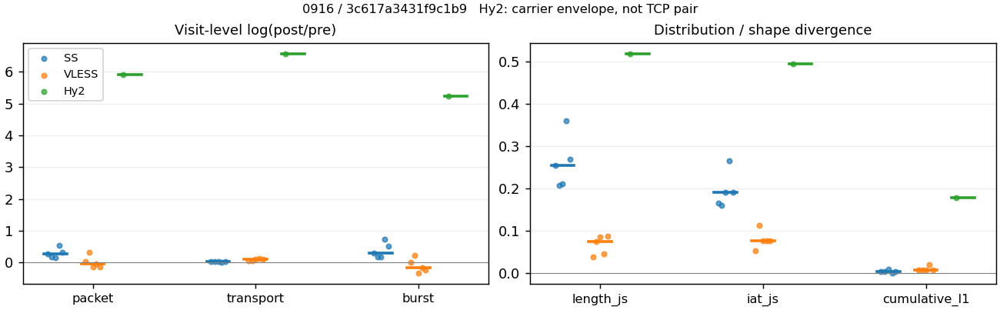
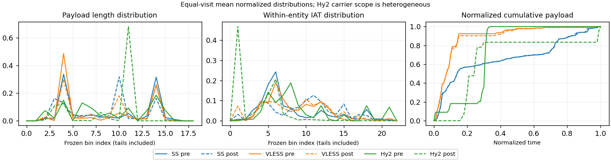

# 0916 · 条目 022 · bing.com

目标：https://www.bing.com/search?q=beginner+guitar+chords

活动标签：bing.com::search_results_view。选定访问 15 次。

[返回总索引](../../README.md) · [统计口径](../../methods.md)

## 覆盖与资格（每次访问均保留）

| 部署 | 重复 | 主请求路由 | 活动状态 | 代理比较 | DIRECT pre | 请求 proxy/direct/unresolved | 错误 |
| --- | --- | --- | --- | --- | --- | --- | --- |
| Hy2 | 1 | direct | passed | 0 | 1 | 0/663/0 | [] |
| Hy2 | 2 | direct | passed | 1 | 1 | 7/693/0 | [] |
| Hy2 | 3 | direct | passed | 0 | 1 | 0/685/0 | [] |
| Hy2 | 4 | direct | passed | 0 | 1 | 0/681/0 | [] |
| Hy2 | 5 | direct | passed | 0 | 1 | 0/682/0 | [] |
| SS | 1 | proxy | passed | 1 | 0 | 602/0/0 | [] |
| SS | 2 | proxy | passed | 1 | 0 | 633/0/0 | [] |
| SS | 3 | proxy | passed | 1 | 0 | 612/0/0 | [] |
| SS | 4 | proxy | passed | 1 | 0 | 151/0/0 | [] |
| SS | 5 | proxy | passed | 1 | 0 | 278/0/0 | [] |
| VLESS | 1 | proxy | passed | 1 | 0 | 479/0/0 | [] |
| VLESS | 2 | proxy | passed | 1 | 0 | 420/0/0 | [] |
| VLESS | 3 | proxy | passed | 1 | 0 | 580/0/0 | [] |
| VLESS | 4 | proxy | passed | 1 | 0 | 365/0/0 | [] |
| VLESS | 5 | proxy | passed | 1 | 0 | 369/0/0 | [] |

主请求非 proxy 的统计仅解释为已索引的辅助代理连接或 DIRECT 观测，不代表目标业务经代理传输。播放确认与配对资格是两道不同的门。

图中散点为单次访问，短线为重复中位数；Hy2 是共享载体包络，不能与 TCP 配对作等范围因果对比。

形态图先逐访问归一化，再对访问等权平均；实线 pre，虚线 post。分箱序号及边界见 methods，不将分箱索引误解为长度或时间。

## 每次访问的关键观测

### SS

范围：`exclusive_page`。每格 pre → post；空值为不可观测/不适用。

| 重复 | 包数 | 载荷字节 | burst | TCP FR | IAT中位µs | length JS | IAT JS |
| --- | --- | --- | --- | --- | --- | --- | --- |
| 1 | 2272 → 2967 | 1.5914e+06 → 1.6442e+06 | 1530 → 2077 | 404 → 420 | 43.692 → 784.53 | 0.2549 | 0.16478 |
| 2 | 2432 → 2889 | 1.6646e+06 → 1.713e+06 | 1674 → 1980 | 441 → 447 | 43.419 → 996.39 | 0.20746 | 0.15946 |
| 3 | 2477 → 2893 | 1.5925e+06 → 1.6413e+06 | 1686 → 2018 | 372 → 398 | 35.593 → 752.08 | 0.21038 | 0.19061 |
| 4 | 892 → 1519 | 9.8072e+05 → 9.8732e+05 | 520 → 1080 | 41 → 41 | 29.157 → 474.73 | 0.36018 | 0.26615 |
| 5 | 2497 → 3420 | 2.599e+06 → 2.65e+06 | 1667 → 2817 | 277 → 279 | 33.372 → 1044.2 | 0.2686 | 0.19083 |

完整标量统计：中位数 [min,max]；Δ 为重复内逐访问变换的中位数，MAD 未缩放。n 为可用变换数；DIRECT-only 的 nΔ=0 不代表 pre 不可用。

| scope | 特征 | pre | post | Δ | IQRΔ | MADΔ | nΔ |
| --- | --- | --- | --- | --- | --- | --- | --- |
| exclusive_page | active_span_sum_s_1000ms | 62.826 [9.6967, 84.527] | 70.821 [11.515, 88.04] | 0.055832 | 0.11327 | 0.032045 | 5 |
| exclusive_page | active_span_sum_s_100ms | 5.8367 [2.19, 9.6391] | 17.506 [4.3278, 18.24] | 0.96311 | 0.29112 | 0.13763 | 5 |
| exclusive_page | active_span_sum_s_500ms | 50.01 [8.4245, 56.146] | 60.968 [10.535, 68.16] | 0.19391 | 0.042256 | 0.029681 | 5 |
| exclusive_page | burst_bytes_iqr | 1146.8 [1071, 2678] | 1428 [1428, 1428] | 0.21934 | 0.49707 | 0.068339 | 5 |
| exclusive_page | burst_bytes_mad | 85 [31, 85] | 74 [27, 118] | -0.13815 | 0.46662 | 0.00043582 | 5 |
| exclusive_page | burst_bytes_max | 22344 [20688, 24576] | 11893 [8605, 14220] | -0.63061 | 0.20068 | 0.16943 | 5 |
| exclusive_page | burst_bytes_mean | 1040.2 [944.55, 1886] | 865.15 [791.61, 940.7] | -0.27306 | 0.35569 | 0.13385 | 5 |
| exclusive_page | burst_bytes_median | 85 [31, 85] | 74 [27, 118] | -0.13815 | 0.46662 | 0.00043582 | 5 |
| exclusive_page | burst_bytes_min | 0 [0, 0] | 0 [0, 0] | — | — | — | 0 |
| exclusive_page | burst_bytes_p95 | 4198.3 [3664, 11386] | 2896 [2856, 2931.7] | -0.37136 | 0.57319 | 0.13614 | 5 |
| exclusive_page | burst_bytes_q25 | 0 [0, 0] | 0 [0, 0] | — | — | — | 0 |
| exclusive_page | burst_bytes_q75 | 1146.8 [1071, 2678] | 1428 [1428, 1428] | 0.21934 | 0.49707 | 0.068339 | 5 |
| exclusive_page | burst_bytes_std | 2506 [2089.9, 4032.6] | 1251.7 [1190.6, 1473.9] | -0.74426 | 0.32439 | 0.19554 | 5 |
| exclusive_page | burst_count | 1667 [520, 1686] | 2018 [1080, 2817] | 0.30566 | 0.3449 | 0.13778 | 5 |
| exclusive_page | burst_duration_ms_iqr | 0.038916 [0.033317, 0.052796] | 0.0078645 [0, 0.15268] | -0.31593 | 3.875 | 1.3358 | 4 |
| exclusive_page | burst_duration_ms_mad | 0 [0, 0] | 0 [0, 0] | — | — | — | 0 |
| exclusive_page | burst_duration_ms_max | 15001 [15000, 15001] | 15397 [11935, 18086] | 0.026034 | 0.016512 | 0.012765 | 5 |
| exclusive_page | burst_duration_ms_mean | 99.142 [51.131, 107.95] | 71.344 [16.406, 76.755] | -0.37677 | 0.10804 | 0.091613 | 5 |
| exclusive_page | burst_duration_ms_median | 0 [0, 0] | 0 [0, 0] | — | — | — | 0 |
| exclusive_page | burst_duration_ms_min | 0 [0, 0] | 0 [0, 0] | — | — | — | 0 |
| exclusive_page | burst_duration_ms_p95 | 295.54 [57.6, 415.64] | 173.95 [0.9858, 195.76] | -0.75293 | 1.8311 | 0.24986 | 5 |
| exclusive_page | burst_duration_ms_q25 | 0 [0, 0] | 0 [0, 0] | — | — | — | 0 |
| exclusive_page | burst_duration_ms_q75 | 0.038916 [0.033317, 0.052796] | 0.0078645 [0, 0.15268] | -0.31593 | 3.875 | 1.3358 | 4 |
| exclusive_page | burst_duration_ms_std | 675.59 [584.27, 773.98] | 617.16 [365.39, 767.09] | -0.037663 | 0.1097 | 0.080973 | 5 |
| exclusive_page | burst_packets_iqr | 1 [1, 1] | 1 [0, 1] | 0 | 0 | 0 | 4 |
| exclusive_page | burst_packets_mad | 0 [0, 0] | 0 [0, 0] | — | — | — | 0 |
| exclusive_page | burst_packets_max | 10 [10, 11] | 11 [10, 12] | 0.09531 | 0.18232 | 0.087011 | 5 |
| exclusive_page | burst_packets_mean | 1.485 [1.4528, 1.7154] | 1.4285 [1.2141, 1.4591] | -0.038766 | 0.17404 | 0.043082 | 5 |
| exclusive_page | burst_packets_median | 1 [1, 1] | 1 [1, 1] | 0 | 0 | 0 | 5 |
| exclusive_page | burst_packets_min | 1 [1, 1] | 1 [1, 1] | 0 | 0 | 0 | 5 |
| exclusive_page | burst_packets_p95 | 3 [3, 4.05] | 3 [2, 3] | 0 | 0.3001 | 0 | 5 |
| exclusive_page | burst_packets_q25 | 1 [1, 1] | 1 [1, 1] | 0 | 0 | 0 | 5 |
| exclusive_page | burst_packets_q75 | 2 [2, 2] | 2 [1, 2] | 0 | 0 | 0 | 5 |
| exclusive_page | burst_packets_std | 0.88123 [0.83271, 1.4961] | 0.91282 [0.65211, 0.9438] | 0.035215 | 0.52465 | 0.090005 | 5 |
| exclusive_page | connection_span_concurrency_max | 5 [5, 6] | 5 [5, 6] | 0 | 0 | 0 | 5 |
| exclusive_page | cumulative_l1 | — | — | 0.0031495 | 0.00018985 | 0.00010094 | 5 |
| exclusive_page | cumulative_max | — | — | 0.032069 | 0.036832 | 0.0065025 | 5 |
| exclusive_page | direction_entropy | 0.99835 [0.77001, 0.9997] | 0.78354 [0.445, 0.81968] | -0.19858 | 0.02465 | 0.017583 | 5 |
| exclusive_page | down_burst_count | 830 [257, 839] | 1005 [537, 1406] | 0.30752 | 0.34655 | 0.13871 | 5 |
| exclusive_page | down_ip_bytes | 1.5367e+06 [9.7216e+05, 2.5958e+06] | 1.566e+06 [9.9066e+05, 2.6454e+06] | 0.018956 | 0.0008629 | 0.00010833 | 5 |
| exclusive_page | down_packets | 1275 [539, 1461] | 1546 [878, 1776] | 0.19524 | 0.099091 | 0.042391 | 5 |
| exclusive_page | down_transport_bytes | 1.468e+06 [9.4409e+05, 2.5197e+06] | 1.4843e+06 [9.4491e+05, 2.5529e+06] | 0.011305 | 0.0019906 | 0.0017613 | 5 |
| exclusive_page | duration_s | 65.036 [62.467, 69.52] | 65.679 [62.466, 69.52] | -1.2051e-05 | 1.1928e-05 | 9.6796e-06 | 5 |
| exclusive_page | entity_count | 8 [6, 10] | 8 [6, 10] | 0 | 0 | 0 | 5 |
| exclusive_page | fr_runs | 372 [41, 441] | 398 [41, 447] | 0.013514 | 0.031646 | 0.013514 | 5 |
| exclusive_page | fr_runs_per_packet | 0.2578 [0.071304, 0.31658] | 0.24165 [0.046857, 0.2744] | -0.036159 | 0.017734 | 0.011711 | 5 |
| exclusive_page | fr_switches | 364 [35, 431] | 390 [35, 437] | 0.013825 | 0.032202 | 0.013825 | 5 |
| exclusive_page | fr_switches_per_possible_transition | 0.25366 [0.061511, 0.31164] | 0.23795 [0.040276, 0.26992] | -0.035434 | 0.020486 | 0.014199 | 5 |
| exclusive_page | full_retransmission_fraction | 0.0036043 [0.0020559, 0.0089686] | 0.010384 [0.0046083, 0.021431] | 0.0083283 | 0.012012 | 0.0062199 | 5 |
| exclusive_page | full_retransmission_packets | 8 [5, 9] | 30 [7, 62] | 1.7918 | 1.0826 | 0.34831 | 5 |
| exclusive_page | iat_count | 2422 [886, 2489] | 2885 [1513, 3412] | 0.26772 | 0.14257 | 0.094869 | 5 |
| exclusive_page | iat_js | — | — | 0.19061 | 0.026044 | 0.025826 | 5 |
| exclusive_page | iat_ks | — | — | 0.3534 | 0.054598 | 0.032352 | 5 |
| exclusive_page | iat_median_us | 35.593 [29.157, 43.692] | 784.53 [474.73, 1044.2] | 3.0507 | 0.24532 | 0.16278 | 5 |
| exclusive_page | iat_us_iqr | 1366.7 [108.81, 2828] | 5677 [1151.3, 12138] | 1.4568 | 0.61875 | 0.50116 | 5 |
| exclusive_page | iat_us_mad | 28.378 [19.081, 38.019] | 773.9 [466.74, 1035.4] | 3.262 | 0.068135 | 0.064886 | 5 |
| exclusive_page | iat_us_max | 1.5001e+07 [1.5001e+07, 1.5001e+07] | 1.5397e+07 [1.5332e+07, 1.5454e+07] | 0.026034 | 0.0041017 | 0.0035736 | 5 |
| exclusive_page | iat_us_mean | 1.0235e+05 [79485, 1.0588e+05] | 75941 [46820, 89620] | -0.33237 | 0.35639 | 0.18729 | 5 |
| exclusive_page | iat_us_median | 35.593 [29.157, 43.692] | 784.53 [474.73, 1044.2] | 3.0507 | 0.24532 | 0.16278 | 5 |
| exclusive_page | iat_us_min | 0.046 [0.007, 0.22] | 0.037 [0.031, 0.037] | -0.26663 | 0.061861 | 0.048905 | 5 |
| exclusive_page | iat_us_p95 | 2.4365e+05 [42608, 2.8637e+05] | 1.7628e+05 [31808, 2.1398e+05] | -0.29138 | 0.051644 | 0.050701 | 5 |
| exclusive_page | iat_us_q25 | 15.043 [13.369, 17.064] | 22.375 [19.568, 35.348] | 0.40624 | 0.13266 | 0.10736 | 5 |
| exclusive_page | iat_us_q75 | 1380.1 [122.18, 2844.9] | 5712.3 [1170.8, 12158] | 1.4524 | 0.61001 | 0.4913 | 5 |
| exclusive_page | iat_us_std | 8.7108e+05 [7.8172e+05, 9.4467e+05] | 7.3084e+05 [5.9782e+05, 7.7305e+05] | -0.20656 | 0.15438 | 0.12308 | 5 |
| exclusive_page | iat_wasserstein_log1p_us | — | — | 1.5481 | 0.16314 | 0.13142 | 5 |
| exclusive_page | idle_gap_count_1000ms | 31 [7, 44] | 28 [5, 39] | -0.10178 | 0.051635 | 0.03279 | 5 |
| exclusive_page | idle_gap_count_100ms | 232 [33, 278] | 255 [33, 289] | 0.038806 | 0.044095 | 0.038806 | 5 |
| exclusive_page | idle_gap_count_500ms | 53 [9, 80] | 39 [6, 65] | -0.24846 | 0.099091 | 0.047791 | 5 |
| exclusive_page | idle_gap_sum_s_1000ms | 171.66 [60.727, 195.11] | 152.74 [59.323, 187.73] | -0.038534 | 0.093358 | 0.016751 | 5 |
| exclusive_page | idle_gap_sum_s_100ms | 233.88 [68.234, 250.24] | 207.16 [66.51, 243.94] | -0.048232 | 0.095726 | 0.022737 | 5 |
| exclusive_page | idle_gap_sum_s_500ms | 186.26 [62, 208.59] | 160.63 [60.303, 197.58] | -0.064743 | 0.09387 | 0.036997 | 5 |
| exclusive_page | ip_bytes | 1.7215e+06 [1.0273e+06, 2.7291e+06] | 1.8118e+06 [1.0789e+06, 2.8525e+06] | 0.04847 | 0.003307 | 0.0027407 | 5 |
| exclusive_page | length_iqr | 2602 [2099, 2755] | 1310 [773.5, 1388] | -0.68555 | 0.091859 | 0.091159 | 5 |
| exclusive_page | length_js | — | — | 0.2549 | 0.058219 | 0.044526 | 5 |
| exclusive_page | length_ks | — | — | 0.25522 | 0.18209 | 0.024298 | 5 |
| exclusive_page | length_mad | 344 [209, 1363] | 769 [577, 1354] | 0.79399 | 1.1395 | 0.64021 | 5 |
| exclusive_page | length_max | 8948 [6000, 8948] | 4284 [2856, 5712] | -0.73654 | 0.28768 | 0.28768 | 5 |
| exclusive_page | length_mean | 1197.5 [1103.6, 1759.7] | 1051.6 [960.94, 1437.8] | -0.20197 | 0.09222 | 0.074139 | 5 |
| exclusive_page | length_median | 428 [244, 1735] | 1141 [918, 1428] | 0.76307 | 1.3713 | 0.77698 | 5 |
| exclusive_page | length_min | 31 [16, 31] | 11 [2, 20] | -1.0361 | 0.91629 | 0.59784 | 5 |
| exclusive_page | length_p95 | 2896 [2896, 4096] | 2856 [2856, 2856] | -0.013908 | 0 | 0 | 5 |
| exclusive_page | length_q25 | 86 [86, 248] | 118 [40, 675.5] | 0.31634 | 0.13473 | 0.12629 | 5 |
| exclusive_page | length_q75 | 2688 [2185, 2896] | 1428 [1428, 1449] | -0.63252 | 0.13846 | 0.074533 | 5 |
| exclusive_page | length_std | 1470.5 [1215, 1604.2] | 935.5 [904.75, 1069.9] | -0.45225 | 0.29924 | 0.09538 | 5 |
| exclusive_page | length_wasserstein_bytes | — | — | 506.99 | 83.901 | 76.186 | 5 |
| exclusive_page | nonempty_entity_count | 8 [6, 10] | 8 [6, 10] | 0 | 0 | 0 | 5 |
| exclusive_page | nonempty_packets | 1393 [575, 1477] | 1647 [875, 1843] | 0.22138 | 0.096145 | 0.064875 | 5 |
| exclusive_page | offload_suspect_fraction | 0.18222 [0.17311, 0.33744] | 0.10211 [0.086619, 0.1348] | -0.095599 | 0.071732 | 0.024602 | 5 |
| exclusive_page | packet_count | 2432 [892, 2497] | 2893 [1519, 3420] | 0.26689 | 0.14235 | 0.094694 | 5 |
| exclusive_page | rtt_median_ms | 0.074141 [0.055298, 0.084135] | 31.948 [28.123, 33.706] | 6.0713 | 0.10347 | 0.055298 | 5 |
| exclusive_page | rtt_sample_count | 1021 [294, 1114] | 728 [201, 871] | -0.37791 | 0.12882 | 0.022969 | 5 |
| exclusive_page | tcp_ack_count | 2420 [886, 2486] | 2885 [1513, 3410] | 0.26782 | 0.14271 | 0.094494 | 5 |
| exclusive_page | tcp_fin_count | 16 [12, 20] | 16 [14, 22] | 0.04879 | 0.15415 | 0.10536 | 5 |
| exclusive_page | tcp_packet_count | 2432 [892, 2497] | 2893 [1519, 3420] | 0.26689 | 0.14235 | 0.094694 | 5 |
| exclusive_page | tcp_rst_count | 2 [0, 3] | 0 [0, 1] | -0.54931 | 0.54931 | 0.54931 | 2 |
| exclusive_page | tcp_syn_count | 16 [12, 20] | 16 [12, 21] | 0 | 0.04879 | 0 | 5 |
| exclusive_page | tcp_window_raw_median | 65352 [65347, 65535] | 147 [146, 151] | -6.097 | 0.013514 | 0.0068872 | 5 |
| exclusive_page | transition_entropy | 0.81609 [0.32057, 0.89494] | 0.71063 [0.2018, 0.75736] | -0.12632 | 0.018817 | 0.011264 | 5 |
| exclusive_page | transition_n_mm | 453 [386, 1006] | 1049 [775, 1450] | 0.69703 | 0.17361 | 0.088822 | 5 |
| exclusive_page | transition_n_mp | 179 [16, 211] | 192 [16, 214] | 0.014118 | 0.032602 | 0.014118 | 5 |
| exclusive_page | transition_n_pm | 185 [19, 220] | 198 [19, 223] | 0.013544 | 0.031809 | 0.013544 | 5 |
| exclusive_page | transition_n_pp | 475 [148, 500] | 188 [59, 200] | -0.91967 | 0.010582 | 0.007198 | 5 |
| exclusive_page | transition_p_mm | 0.76133 [0.68223, 0.9602] | 0.84529 [0.82226, 0.97977] | 0.083953 | 0.10825 | 0.056077 | 5 |
| exclusive_page | transition_p_mp | 0.23867 [0.039801, 0.31777] | 0.15471 [0.020228, 0.17774] | -0.083953 | 0.10825 | 0.056077 | 5 |
| exclusive_page | transition_p_pm | 0.29734 [0.11377, 0.41566] | 0.52645 [0.24359, 0.54941] | 0.22741 | 0.095367 | 0.0039544 | 5 |
| exclusive_page | transition_p_pp | 0.70266 [0.58434, 0.88623] | 0.47355 [0.45059, 0.75641] | -0.22741 | 0.095367 | 0.0039544 | 5 |
| exclusive_page | transport_bytes | 1.5925e+06 [9.8072e+05, 2.599e+06] | 1.6442e+06 [9.8732e+05, 2.65e+06] | 0.028674 | 0.010793 | 0.0039248 | 5 |
| exclusive_page | up_burst_count | 837 [263, 847] | 1013 [543, 1411] | 0.30381 | 0.34326 | 0.13684 | 5 |
| exclusive_page | up_byte_fraction | 0.0782 [0.030511, 0.091451] | 0.095664 [0.036642, 0.10756] | 0.015716 | 0.0099832 | 0.0017488 | 5 |
| exclusive_page | up_ip_bytes | 1.8485e+05 [55133, 2.0563e+05] | 2.4107e+05 [88266, 2.5993e+05] | 0.26555 | 0.18368 | 0.039291 | 5 |
| exclusive_page | up_packets | 1065 [353, 1157] | 1351 [641, 1644] | 0.23787 | 0.30379 | 0.088795 | 5 |
| exclusive_page | up_transport_bytes | 1.2453e+05 [36633, 1.4554e+05] | 1.5702e+05 [42406, 1.7686e+05] | 0.19489 | 0.0083476 | 0.0076252 | 5 |
| exclusive_page | zero_iat_count | 0 [0, 0] | 0 [0, 0] | — | — | — | 0 |
| exclusive_page | zero_iat_fraction | 0 [0, 0] | 0 [0, 0] | 0 | 0 | 0 | 5 |

### VLESS

范围：`exclusive_page`。每格 pre → post；空值为不可观测/不适用。

| 重复 | 包数 | 载荷字节 | burst | TCP FR | IAT中位µs | length JS | IAT JS |
| --- | --- | --- | --- | --- | --- | --- | --- |
| 1 | 2064 → 2151 | 1.6265e+06 → 1.7059e+06 | 1384 → 1402 | 94 → 116 | 104.2 → 162.05 | 0.038024 | 0.053527 |
| 2 | 1652 → 2286 | 1.5732e+06 → 1.6477e+06 | 1133 → 1411 | 90 → 110 | 123.2 → 49.426 | 0.075149 | 0.11335 |
| 3 | 1114 → 980 | 5.2253e+05 → 5.7945e+05 | 807 → 585 | 56 → 70 | 63.97 → 529 | 0.084795 | 0.075844 |
| 4 | 803 → 764 | 4.2059e+05 → 4.77e+05 | 543 → 457 | 66 → 80 | 91.085 → 639.21 | 0.045495 | 0.076546 |
| 5 | 1128 → 981 | 5.5318e+05 → 6.1059e+05 | 789 → 625 | 62 → 78 | 55.566 → 553.19 | 0.086493 | 0.076822 |

完整标量统计：中位数 [min,max]；Δ 为重复内逐访问变换的中位数，MAD 未缩放。n 为可用变换数；DIRECT-only 的 nΔ=0 不代表 pre 不可用。

| scope | 特征 | pre | post | Δ | IQRΔ | MADΔ | nΔ |
| --- | --- | --- | --- | --- | --- | --- | --- |
| exclusive_page | active_span_sum_s_1000ms | 10.925 [9.2614, 15.723] | 10.634 [9.608, 16.12] | 0.0047244 | 0.052016 | 0.031749 | 5 |
| exclusive_page | active_span_sum_s_100ms | 1.8725 [1.2016, 3.0398] | 4.1619 [3.698, 6.661] | 0.83871 | 0.045605 | 0.040021 | 5 |
| exclusive_page | active_span_sum_s_500ms | 5.8412 [4.7433, 9.3761] | 10.634 [9.4412, 15.772] | 0.5991 | 0.10275 | 0.079051 | 5 |
| exclusive_page | burst_bytes_iqr | 1450.5 [530.5, 2896] | 2528 [1942, 2824] | 0.55552 | 1.2901 | 0.5807 | 5 |
| exclusive_page | burst_bytes_mad | 24 [0, 31] | 72 [31, 72] | 0.84268 | 0.15328 | 0.12797 | 4 |
| exclusive_page | burst_bytes_max | 5792 [5792, 20480] | 8088 [5253, 15928] | -0.097678 | 0.45287 | 0.29918 | 5 |
| exclusive_page | burst_bytes_mean | 774.56 [647.5, 1388.6] | 1043.8 [976.95, 1216.8] | 0.29828 | 0.29701 | 0.12682 | 5 |
| exclusive_page | burst_bytes_median | 24 [0, 31] | 72 [31, 72] | 0.84268 | 0.15328 | 0.12797 | 4 |
| exclusive_page | burst_bytes_min | 0 [0, 0] | 0 [0, 0] | — | — | — | 0 |
| exclusive_page | burst_bytes_p95 | 2896 [2896, 5792] | 2896 [2896, 2968] | 0 | 0.38091 | 0 | 5 |
| exclusive_page | burst_bytes_q25 | 0 [0, 0] | 0 [0, 0] | — | — | — | 0 |
| exclusive_page | burst_bytes_q75 | 1450.5 [530.5, 2896] | 2528 [1942, 2824] | 0.55552 | 1.2901 | 0.5807 | 5 |
| exclusive_page | burst_bytes_std | 1219.4 [1167, 2417] | 1284.9 [1268, 1655.5] | 0.052251 | 0.27962 | 0.039811 | 5 |
| exclusive_page | burst_count | 807 [543, 1384] | 625 [457, 1411] | -0.17243 | 0.24594 | 0.14929 | 5 |
| exclusive_page | burst_duration_ms_iqr | 0.58309 [0.057311, 0.7256] | 0.98665 [0.0067575, 2.7489] | 1.3319 | 1.6164 | 0.98121 | 5 |
| exclusive_page | burst_duration_ms_mad | 0 [0, 0] | 0 [0, 0] | — | — | — | 0 |
| exclusive_page | burst_duration_ms_max | 10899 [6270.1, 14974] | 15054 [15003, 15395] | 0.32268 | 0.085145 | 0.059817 | 5 |
| exclusive_page | burst_duration_ms_mean | 46.233 [33.728, 55.136] | 84.252 [53.403, 135.89] | 0.60011 | 0.52908 | 0.29781 | 5 |
| exclusive_page | burst_duration_ms_median | 0 [0, 0] | 0 [0, 0] | — | — | — | 0 |
| exclusive_page | burst_duration_ms_min | 0 [0, 0] | 0 [0, 0] | — | — | — | 0 |
| exclusive_page | burst_duration_ms_p95 | 10.139 [10.09, 111.26] | 114.68 [11.124, 156.23] | 0.33944 | 2.134 | 0.24677 | 5 |
| exclusive_page | burst_duration_ms_q25 | 0 [0, 0] | 0 [0, 0] | — | — | — | 0 |
| exclusive_page | burst_duration_ms_q75 | 0.58309 [0.057311, 0.7256] | 0.98665 [0.0067575, 2.7489] | 1.3319 | 1.6164 | 0.98121 | 5 |
| exclusive_page | burst_duration_ms_std | 514.1 [396.24, 678.38] | 995.85 [805.24, 1341.9] | 0.86496 | 0.2712 | 0.094433 | 5 |
| exclusive_page | burst_packets_iqr | 1 [1, 1] | 1 [1, 1] | 0 | 0 | 0 | 5 |
| exclusive_page | burst_packets_mad | 0 [0, 0] | 0 [0, 0] | — | — | — | 0 |
| exclusive_page | burst_packets_max | 6 [4, 10] | 12 [9, 13] | 0.58779 | 0.47 | 0.36464 | 5 |
| exclusive_page | burst_packets_mean | 1.4581 [1.3804, 1.4913] | 1.6201 [1.5342, 1.6752] | 0.10539 | 0.029253 | 0.017252 | 5 |
| exclusive_page | burst_packets_median | 1 [1, 1] | 1 [1, 1] | 0 | 0 | 0 | 5 |
| exclusive_page | burst_packets_min | 1 [1, 1] | 1 [1, 1] | 0 | 0 | 0 | 5 |
| exclusive_page | burst_packets_p95 | 3 [2, 3] | 4 [3, 4.2] | 0.33647 | 0.15665 | 0.10008 | 5 |
| exclusive_page | burst_packets_q25 | 1 [1, 1] | 1 [1, 1] | 0 | 0 | 0 | 5 |
| exclusive_page | burst_packets_q75 | 2 [2, 2] | 2 [2, 2] | 0 | 0 | 0 | 5 |
| exclusive_page | burst_packets_std | 0.6635 [0.59064, 0.70193] | 1.1485 [0.95731, 1.3206] | 0.59654 | 0.10176 | 0.092793 | 5 |
| exclusive_page | connection_span_concurrency_max | 4 [4, 5] | 4 [4, 5] | 0 | 0 | 0 | 5 |
| exclusive_page | cumulative_l1 | — | — | 0.0075842 | 0.0011587 | 0.00064703 | 5 |
| exclusive_page | cumulative_max | — | — | 0.028639 | 0.030213 | 0.0032344 | 5 |
| exclusive_page | direction_entropy | 0.94225 [0.69782, 0.97821] | 0.6762 [0.40583, 0.74036] | -0.29199 | 0.0056281 | 0.003078 | 5 |
| exclusive_page | down_burst_count | 400 [268, 687] | 309 [225, 701] | -0.17489 | 0.24838 | 0.15015 | 5 |
| exclusive_page | down_ip_bytes | 5.4112e+05 [4.0924e+05, 1.6361e+06] | 5.8296e+05 [4.5279e+05, 1.7007e+06] | 0.074479 | 0.033342 | 0.026656 | 5 |
| exclusive_page | down_packets | 608 [443, 1220] | 557 [436, 1306] | -0.015928 | 0.13092 | 0.071682 | 5 |
| exclusive_page | down_transport_bytes | 5.0945e+05 [3.8615e+05, 1.5726e+06] | 5.5394e+05 [4.3004e+05, 1.6344e+06] | 0.083731 | 0.050377 | 0.023932 | 5 |
| exclusive_page | duration_s | 66.601 [62.781, 67.219] | 66.568 [62.75, 67.2] | -0.00049733 | 0.00017541 | 0.00016848 | 5 |
| exclusive_page | entity_count | 7 [7, 10] | 7 [7, 10] | 0 | 0 | 0 | 5 |
| exclusive_page | fr_runs | 66 [56, 94] | 80 [70, 116] | 0.2103 | 0.022473 | 0.012848 | 5 |
| exclusive_page | fr_runs_per_packet | 0.091093 [0.074603, 0.14379] | 0.13133 [0.086546, 0.18824] | 0.0413 | 0.025725 | 0.0090663 | 5 |
| exclusive_page | fr_switches | 59 [49, 84] | 73 [63, 106] | 0.23262 | 0.030643 | 0.018692 | 5 |
| exclusive_page | fr_switches_per_possible_transition | 0.082737 [0.0672, 0.13053] | 0.11977 [0.080032, 0.17464] | 0.040097 | 0.025341 | 0.0088119 | 5 |
| exclusive_page | full_retransmission_fraction | 0 [0, 0.00088652] | 0.00043745 [0, 0.0013089] | 0.00013284 | 0.00043745 | 0.0003046 | 5 |
| exclusive_page | full_retransmission_packets | 0 [0, 1] | 1 [0, 1] | 0 | — | — | 1 |
| exclusive_page | iat_count | 1121 [796, 2054] | 974 [757, 2277] | -0.050236 | 0.17051 | 0.090329 | 5 |
| exclusive_page | iat_js | — | — | 0.076546 | 0.00097824 | 0.00070221 | 5 |
| exclusive_page | iat_ks | — | — | 0.18131 | 0.019338 | 0.016357 | 5 |
| exclusive_page | iat_median_us | 91.085 [55.566, 123.2] | 529 [49.426, 639.21] | 1.9484 | 1.671 | 0.34969 | 5 |
| exclusive_page | iat_us_iqr | 1396.6 [1224.5, 1980.1] | 3274.4 [1136.9, 3774.5] | 0.58056 | 0.69488 | 0.37688 | 5 |
| exclusive_page | iat_us_mad | 84.691 [49.629, 116.14] | 521.21 [49.359, 629.39] | 2.0057 | 1.6947 | 0.39095 | 5 |
| exclusive_page | iat_us_max | 1.5001e+07 [1.5001e+07, 1.5001e+07] | 1.5362e+07 [1.5321e+07, 1.5473e+07] | 0.023742 | 0.0048001 | 0.0026177 | 5 |
| exclusive_page | iat_us_mean | 1.8304e+05 [1.1259e+05, 1.9697e+05] | 2.0677e+05 [1.0786e+05, 2.2295e+05] | 0.048592 | 0.17094 | 0.090852 | 5 |
| exclusive_page | iat_us_median | 91.085 [55.566, 123.2] | 529 [49.426, 639.21] | 1.9484 | 1.671 | 0.34969 | 5 |
| exclusive_page | iat_us_min | 0.14 [0.049, 0.384] | 0.036 [0.032, 0.037] | -1.4759 | 0.57249 | 0.39548 | 5 |
| exclusive_page | iat_us_p95 | 18889 [10197, 61929] | 92393 [42999, 1.1252e+05] | 1.4714 | 0.58729 | 0.22185 | 5 |
| exclusive_page | iat_us_q25 | 25.505 [17.91, 29.513] | 20.583 [7.615, 38.534] | -0.15963 | 0.5954 | 0.39465 | 5 |
| exclusive_page | iat_us_q75 | 1414.5 [1254.1, 2005.6] | 3293 [1144.5, 3797.2] | 0.5786 | 0.6943 | 0.3673 | 5 |
| exclusive_page | iat_us_std | 1.5269e+06 [1.1782e+06, 1.6102e+06] | 1.6271e+06 [1.1709e+06, 1.7231e+06] | 0.033291 | 0.073993 | 0.039533 | 5 |
| exclusive_page | iat_wasserstein_log1p_us | — | — | 0.96658 | 0.067753 | 0.026434 | 5 |
| exclusive_page | idle_gap_count_1000ms | 18 [14, 21] | 18 [12, 21] | 0 | 0.10536 | 0 | 5 |
| exclusive_page | idle_gap_count_100ms | 45 [40, 62] | 54 [44, 71] | 0.11 | 0.028573 | 0.014691 | 5 |
| exclusive_page | idle_gap_count_500ms | 26 [21, 31] | 18 [13, 22] | -0.38566 | 0.11185 | 0.042718 | 5 |
| exclusive_page | idle_gap_sum_s_1000ms | 206.6 [147.52, 230.88] | 207.32 [146.09, 230.24] | -0.0018043 | 0.0030733 | 0.0021204 | 5 |
| exclusive_page | idle_gap_sum_s_100ms | 215.36 [155.58, 243.79] | 212.82 [152.83, 239.85] | -0.01626 | 0.004927 | 0.0015994 | 5 |
| exclusive_page | idle_gap_sum_s_500ms | 211.98 [152.04, 237.44] | 207.32 [147.09, 231.04] | -0.027342 | 0.0051906 | 0.0033657 | 5 |
| exclusive_page | ip_bytes | 6.1179e+05 [4.6231e+05, 1.7337e+06] | 6.621e+05 [5.171e+05, 1.8187e+06] | 0.079032 | 0.01953 | 0.014898 | 5 |
| exclusive_page | length_iqr | 1707.5 [1327, 2752] | 2402 [1340, 2752] | 0.0094926 | 0.0053789 | 0.0051226 | 5 |
| exclusive_page | length_js | — | — | 0.075149 | 0.0393 | 0.011344 | 5 |
| exclusive_page | length_ks | — | — | 0.20105 | 0.10001 | 0.064551 | 5 |
| exclusive_page | length_mad | 22 [20, 1340] | 1128 [660, 1340] | 3.4965 | 3.1439 | 0.44065 | 5 |
| exclusive_page | length_max | 4096 [4096, 8920] | 2824 [2824, 4344] | -0.37186 | 0.32129 | 0 | 5 |
| exclusive_page | length_mean | 916.31 [840.08, 1592.4] | 1145.6 [1087.1, 1372.4] | 0.20282 | 0.19655 | 0.088213 | 5 |
| exclusive_page | length_median | 94 [92, 1412] | 1200 [732, 1412] | 2.074 | 1.8127 | 0.47279 | 5 |
| exclusive_page | length_min | 19 [13, 24] | 19 [11, 24] | 0 | 0.16705 | 0 | 5 |
| exclusive_page | length_p95 | 2824 [2824, 4344] | 2824 [2824, 2896] | 0 | 0 | 0 | 5 |
| exclusive_page | length_q25 | 84 [72, 85] | 72 [72, 72] | -0.15415 | 0.16599 | 0.011834 | 5 |
| exclusive_page | length_q75 | 1779.5 [1412, 2824] | 2474 [1412, 2824] | 0 | 0 | 0 | 5 |
| exclusive_page | length_std | 1143.4 [1077, 1718.9] | 1095.7 [1019.4, 1177.3] | -0.054932 | 0.083343 | 0.023267 | 5 |
| exclusive_page | length_wasserstein_bytes | — | — | 256.99 | 82.091 | 41.145 | 5 |
| exclusive_page | nonempty_entity_count | 7 [7, 10] | 7 [7, 10] | 0 | 0 | 0 | 5 |
| exclusive_page | nonempty_packets | 646 [459, 1260] | 533 [425, 1271] | -0.076961 | 0.14083 | 0.077458 | 5 |
| exclusive_page | offload_suspect_fraction | 0.15068 [0.12118, 0.25908] | 0.15445 [0.11735, 0.21525] | -0.003838 | 0.020139 | 0.0076033 | 5 |
| exclusive_page | packet_count | 1128 [803, 2064] | 981 [764, 2286] | -0.049787 | 0.16945 | 0.089842 | 5 |
| exclusive_page | rtt_median_ms | 0.13907 [0.087563, 0.45946] | 2.8451 [0.055555, 3.2344] | 3.1466 | 2.5846 | 0.34021 | 5 |
| exclusive_page | rtt_sample_count | 440 [304, 743] | 401 [305, 884] | 0.0032841 | 0.19359 | 0.11584 | 5 |
| exclusive_page | tcp_ack_count | 1107 [784, 2034] | 974 [757, 2275] | -0.035046 | 0.16757 | 0.086314 | 5 |
| exclusive_page | tcp_fin_count | 14 [12, 20] | 14 [14, 20] | 0 | 0.057158 | 0 | 5 |
| exclusive_page | tcp_packet_count | 1128 [803, 2064] | 981 [764, 2286] | -0.049787 | 0.16945 | 0.089842 | 5 |
| exclusive_page | tcp_rst_count | 14 [12, 20] | 0 [0, 2] | -2.1401 | — | — | 1 |
| exclusive_page | tcp_syn_count | 14 [14, 20] | 14 [14, 20] | 0 | 0 | 0 | 5 |
| exclusive_page | tcp_window_raw_median | 65450 [65364, 65535] | 153 [151, 156] | -6.0573 | 0.027273 | 0.015771 | 5 |
| exclusive_page | transition_entropy | 0.39371 [0.32742, 0.54193] | 0.45675 [0.30255, 0.58124] | 0.039313 | 0.058908 | 0.032379 | 5 |
| exclusive_page | transition_n_mm | 348 [261, 934] | 402 [296, 1113] | 0.13676 | 0.019637 | 0.010368 | 5 |
| exclusive_page | transition_n_mp | 26 [21, 37] | 33 [28, 48] | 0.26028 | 0.04256 | 0.021872 | 5 |
| exclusive_page | transition_n_pm | 33 [28, 47] | 40 [35, 58] | 0.2103 | 0.022473 | 0.012848 | 5 |
| exclusive_page | transition_n_pp | 219 [132, 236] | 56 [48, 66] | -1.2571 | 0.20064 | 0.17952 | 5 |
| exclusive_page | transition_p_mm | 0.94293 [0.90941, 0.96189] | 0.93488 [0.8997, 0.96031] | -0.0080511 | 0.0045344 | 0.0016787 | 5 |
| exclusive_page | transition_p_mp | 0.057065 [0.038105, 0.090592] | 0.065116 [0.039689, 0.1003] | 0.0080511 | 0.0045344 | 0.0016787 | 5 |
| exclusive_page | transition_p_pm | 0.16846 [0.11336, 0.24194] | 0.44944 [0.36458, 0.53398] | 0.29205 | 0.043198 | 0.0072381 | 5 |
| exclusive_page | transition_p_pp | 0.83154 [0.75806, 0.88664] | 0.55056 [0.46602, 0.63542] | -0.29205 | 0.043198 | 0.0072381 | 5 |
| exclusive_page | transport_bytes | 5.5318e+05 [4.2059e+05, 1.6265e+06] | 6.1059e+05 [4.77e+05, 1.7059e+06] | 0.098755 | 0.055713 | 0.027104 | 5 |
| exclusive_page | up_burst_count | 407 [275, 697] | 316 [232, 710] | -0.17003 | 0.24354 | 0.14842 | 5 |
| exclusive_page | up_byte_fraction | 0.079049 [0.025076, 0.081886] | 0.09231 [0.034388, 0.098441] | 0.013254 | 0.0044212 | 0.0033011 | 5 |
| exclusive_page | up_ip_bytes | 70668 [53072, 97607] | 79140 [64308, 1.1804e+05] | 0.19006 | 0.072655 | 0.070677 | 5 |
| exclusive_page | up_packets | 520 [360, 844] | 424 [328, 980] | -0.09309 | 0.21752 | 0.111 | 5 |
| exclusive_page | up_transport_bytes | 41309 [34440, 53867] | 56652 [46956, 71538] | 0.28371 | 0.051054 | 0.025315 | 5 |
| exclusive_page | zero_iat_count | 0 [0, 0] | 0 [0, 0] | — | — | — | 0 |
| exclusive_page | zero_iat_fraction | 0 [0, 0] | 0 [0, 0] | 0 | 0 | 0 | 5 |

### Hy2

范围：`direct_pre_only`。每格 pre → post；空值为不可观测/不适用。

| 重复 | 包数 | 载荷字节 | burst | TCP FR | IAT中位µs | length JS | IAT JS |
| --- | --- | --- | --- | --- | --- | --- | --- |
| 1 | 1648 → — | 1.109e+06 → — | 1041 → — | 454 → — | 136.78 → — | — | — |
| 2 | 1690 → — | 1.0702e+06 → — | 1031 → — | 493 → — | 139.38 → — | — | — |
| 3 | 2244 → — | 2.3614e+06 → — | 1483 → — | 481 → — | 91.85 → — | — | — |
| 4 | 1774 → — | 1.2795e+06 → — | 1118 → — | 453 → — | 129.86 → — | — | — |
| 5 | 1661 → — | 1.2296e+06 → — | 1042 → — | 370 → — | 111.8 → — | — | — |

范围：`carrier_context_envelope`。每格 pre → post；空值为不可观测/不适用。

| 重复 | 包数 | 载荷字节 | burst | TCP FR | IAT中位µs | length JS | IAT JS |
| --- | --- | --- | --- | --- | --- | --- | --- |
| 1 | — | — | — | — | — | — | — |
| 2 | 138 → 50574 | 77091 → 5.4196e+07 | 95 → 17843 | — | 121.54 → 3.481 | 0.51726 | 0.49496 |
| 3 | — | — | — | — | — | — | — |
| 4 | — | — | — | — | — | — | — |
| 5 | — | — | — | — | — | — | — |

完整标量统计：中位数 [min,max]；Δ 为重复内逐访问变换的中位数，MAD 未缩放。n 为可用变换数；DIRECT-only 的 nΔ=0 不代表 pre 不可用。

| scope | 特征 | pre | post | Δ | IQRΔ | MADΔ | nΔ |
| --- | --- | --- | --- | --- | --- | --- | --- |
| carrier_context_envelope | active_span_sum_s_1000ms | 3.3787 [3.3787, 3.3787] | 20.274 [20.274, 20.274] | 1.7918 | — | — | 1 |
| carrier_context_envelope | active_span_sum_s_100ms | 0.19103 [0.19103, 0.19103] | 7.9441 [7.9441, 7.9441] | 3.7278 | — | — | 1 |
| carrier_context_envelope | active_span_sum_s_500ms | 2.8078 [2.8078, 2.8078] | 18.954 [18.954, 18.954] | 1.9096 | — | — | 1 |
| carrier_context_envelope | burst_bytes_iqr | 663 [663, 663] | 4227 [4227, 4227] | 1.8525 | — | — | 1 |
| carrier_context_envelope | burst_bytes_mad | 0 [0, 0] | 267 [267, 267] | — | — | — | 0 |
| carrier_context_envelope | burst_bytes_max | 7588 [7588, 7588] | 1.7342e+05 [1.7342e+05, 1.7342e+05] | 3.1291 | — | — | 1 |
| carrier_context_envelope | burst_bytes_mean | 811.48 [811.48, 811.48] | 3037.4 [3037.4, 3037.4] | 1.3199 | — | — | 1 |
| carrier_context_envelope | burst_bytes_median | 0 [0, 0] | 300 [300, 300] | — | — | — | 0 |
| carrier_context_envelope | burst_bytes_min | 0 [0, 0] | 22 [22, 22] | — | — | — | 0 |
| carrier_context_envelope | burst_bytes_p95 | 4170.4 [4170.4, 4170.4] | 10932 [10932, 10932] | 0.96368 | — | — | 1 |
| carrier_context_envelope | burst_bytes_q25 | 0 [0, 0] | 96 [96, 96] | — | — | — | 0 |
| carrier_context_envelope | burst_bytes_q75 | 663 [663, 663] | 4323 [4323, 4323] | 1.8749 | — | — | 1 |
| carrier_context_envelope | burst_bytes_std | 1589.7 [1589.7, 1589.7] | 5508.1 [5508.1, 5508.1] | 1.2427 | — | — | 1 |
| carrier_context_envelope | burst_count | 95 [95, 95] | 17843 [17843, 17843] | 5.2355 | — | — | 1 |
| carrier_context_envelope | burst_duration_ms_iqr | 0.43615 [0.43615, 0.43615] | 0.022971 [0.022971, 0.022971] | -2.9437 | — | — | 1 |
| carrier_context_envelope | burst_duration_ms_mad | 0 [0, 0] | 4.2e-05 [4.2e-05, 4.2e-05] | — | — | — | 0 |
| carrier_context_envelope | burst_duration_ms_max | 12042 [12042, 12042] | 8021.6 [8021.6, 8021.6] | -0.40624 | — | — | 1 |
| carrier_context_envelope | burst_duration_ms_mean | 417.77 [417.77, 417.77] | 1.5935 [1.5935, 1.5935] | -5.569 | — | — | 1 |
| carrier_context_envelope | burst_duration_ms_median | 0 [0, 0] | 4.2e-05 [4.2e-05, 4.2e-05] | — | — | — | 0 |
| carrier_context_envelope | burst_duration_ms_min | 0 [0, 0] | 0 [0, 0] | — | — | — | 0 |
| carrier_context_envelope | burst_duration_ms_p95 | 423.84 [423.84, 423.84] | 0.078298 [0.078298, 0.078298] | -8.5966 | — | — | 1 |
| carrier_context_envelope | burst_duration_ms_q25 | 0 [0, 0] | 0 [0, 0] | — | — | — | 0 |
| carrier_context_envelope | burst_duration_ms_q75 | 0.43615 [0.43615, 0.43615] | 0.022971 [0.022971, 0.022971] | -2.9437 | — | — | 1 |
| carrier_context_envelope | burst_duration_ms_std | 2036.4 [2036.4, 2036.4] | 85.835 [85.835, 85.835] | -3.1665 | — | — | 1 |
| carrier_context_envelope | burst_packets_iqr | 1 [1, 1] | 3 [3, 3] | 1.0986 | — | — | 1 |
| carrier_context_envelope | burst_packets_mad | 0 [0, 0] | 1 [1, 1] | — | — | — | 0 |
| carrier_context_envelope | burst_packets_max | 3 [3, 3] | 125 [125, 125] | 3.7297 | — | — | 1 |
| carrier_context_envelope | burst_packets_mean | 1.4526 [1.4526, 1.4526] | 2.8344 [2.8344, 2.8344] | 0.66845 | — | — | 1 |
| carrier_context_envelope | burst_packets_median | 1 [1, 1] | 2 [2, 2] | 0.69315 | — | — | 1 |
| carrier_context_envelope | burst_packets_min | 1 [1, 1] | 1 [1, 1] | 0 | — | — | 1 |
| carrier_context_envelope | burst_packets_p95 | 3 [3, 3] | 8 [8, 8] | 0.98083 | — | — | 1 |
| carrier_context_envelope | burst_packets_q25 | 1 [1, 1] | 1 [1, 1] | 0 | — | — | 1 |
| carrier_context_envelope | burst_packets_q75 | 2 [2, 2] | 4 [4, 4] | 0.69315 | — | — | 1 |
| carrier_context_envelope | burst_packets_std | 0.61161 [0.61161, 0.61161] | 3.741 [3.741, 3.741] | 1.811 | — | — | 1 |
| carrier_context_envelope | connection_span_concurrency_max | 3 [3, 3] | 1 [1, 1] | -1.0986 | — | — | 1 |
| carrier_context_envelope | cumulative_l1 | — | — | 0.17849 | — | — | 1 |
| carrier_context_envelope | cumulative_max | — | — | 0.59711 | — | — | 1 |
| carrier_context_envelope | direction_entropy | 0.93571 [0.93571, 0.93571] | 0.77434 [0.77434, 0.77434] | -0.16137 | — | — | 1 |
| carrier_context_envelope | direction_run_analog_runs | 26 [26, 26] | 17843 [17843, 17843] | 6.5313 | — | — | 1 |
| carrier_context_envelope | direction_run_analog_runs_per_packet | 0.48148 [0.48148, 0.48148] | 0.35281 [0.35281, 0.35281] | -0.12867 | — | — | 1 |
| carrier_context_envelope | direction_run_analog_switches | 21 [21, 21] | 17842 [17842, 17842] | 6.7448 | — | — | 1 |
| carrier_context_envelope | direction_run_analog_switches_per_possible_transition | 0.42857 [0.42857, 0.42857] | 0.3528 [0.3528, 0.3528] | -0.075774 | — | — | 1 |
| carrier_context_envelope | down_burst_count | 45 [45, 45] | 8921 [8921, 8921] | 5.2895 | — | — | 1 |
| carrier_context_envelope | down_ip_bytes | 66531 [66531, 66531] | 5.4419e+07 [5.4419e+07, 5.4419e+07] | 6.7068 | — | — | 1 |
| carrier_context_envelope | down_packets | 72 [72, 72] | 39048 [39048, 39048] | 6.2959 | — | — | 1 |
| carrier_context_envelope | down_transport_bytes | 62747 [62747, 62747] | 5.3326e+07 [5.3326e+07, 5.3326e+07] | 6.7451 | — | — | 1 |
| carrier_context_envelope | duration_s | 59.349 [59.349, 59.349] | 59.333 [59.333, 59.333] | -0.00027597 | — | — | 1 |
| carrier_context_envelope | entity_count | 5 [5, 5] | 1 [1, 1] | -1.6094 | — | — | 1 |
| carrier_context_envelope | full_retransmission_fraction | 0 [0, 0] | — | — | — | — | 0 |
| carrier_context_envelope | full_retransmission_packets | 0 [0, 0] | — | — | — | — | 0 |
| carrier_context_envelope | iat_count | 133 [133, 133] | 50573 [50573, 50573] | 5.9408 | — | — | 1 |
| carrier_context_envelope | iat_js | — | — | 0.49496 | — | — | 1 |
| carrier_context_envelope | iat_ks | — | — | 0.64776 | — | — | 1 |
| carrier_context_envelope | iat_median_us | 121.54 [121.54, 121.54] | 3.481 [3.481, 3.481] | -3.5529 | — | — | 1 |
| carrier_context_envelope | iat_us_iqr | 2409.2 [2409.2, 2409.2] | 22.506 [22.506, 22.506] | -4.6733 | — | — | 1 |
| carrier_context_envelope | iat_us_mad | 107.67 [107.67, 107.67] | 3.445 [3.445, 3.445] | -3.4421 | — | — | 1 |
| carrier_context_envelope | iat_us_max | 1.5001e+07 [1.5001e+07, 1.5001e+07] | 1e+07 [1e+07, 1e+07] | -0.40552 | — | — | 1 |
| carrier_context_envelope | iat_us_mean | 9.534e+05 [9.534e+05, 9.534e+05] | 1173.2 [1173.2, 1173.2] | -6.7003 | — | — | 1 |
| carrier_context_envelope | iat_us_median | 121.54 [121.54, 121.54] | 3.481 [3.481, 3.481] | -3.5529 | — | — | 1 |
| carrier_context_envelope | iat_us_min | 1.931 [1.931, 1.931] | 0 [0, 0] | — | — | — | 0 |
| carrier_context_envelope | iat_us_p95 | 1.1979e+07 [1.1979e+07, 1.1979e+07] | 84.822 [84.822, 84.822] | -11.858 | — | — | 1 |
| carrier_context_envelope | iat_us_q25 | 35.923 [35.923, 35.923] | 0.045 [0.045, 0.045] | -6.6825 | — | — | 1 |
| carrier_context_envelope | iat_us_q75 | 2445.1 [2445.1, 2445.1] | 22.551 [22.551, 22.551] | -4.6861 | — | — | 1 |
| carrier_context_envelope | iat_us_std | 3.4221e+06 [3.4221e+06, 3.4221e+06] | 73074 [73074, 73074] | -3.8465 | — | — | 1 |
| carrier_context_envelope | iat_wasserstein_log1p_us | — | — | 4.5369 | — | — | 1 |
| carrier_context_envelope | idle_gap_count_1000ms | 10 [10, 10] | 8 [8, 8] | -0.22314 | — | — | 1 |
| carrier_context_envelope | idle_gap_count_100ms | 21 [21, 21] | 69 [69, 69] | 1.1896 | — | — | 1 |
| carrier_context_envelope | idle_gap_count_500ms | 11 [11, 11] | 10 [10, 10] | -0.09531 | — | — | 1 |
| carrier_context_envelope | idle_gap_sum_s_1000ms | 123.42 [123.42, 123.42] | 39.06 [39.06, 39.06] | -1.1505 | — | — | 1 |
| carrier_context_envelope | idle_gap_sum_s_100ms | 126.61 [126.61, 126.61] | 51.389 [51.389, 51.389] | -0.9017 | — | — | 1 |
| carrier_context_envelope | idle_gap_sum_s_500ms | 123.99 [123.99, 123.99] | 40.379 [40.379, 40.379] | -1.1219 | — | — | 1 |
| carrier_context_envelope | ip_bytes | 84347 [84347, 84347] | 5.5612e+07 [5.5612e+07, 5.5612e+07] | 6.4912 | — | — | 1 |
| carrier_context_envelope | length_iqr | 1766.5 [1766.5, 1766.5] | 596 [596, 596] | -1.0865 | — | — | 1 |
| carrier_context_envelope | length_js | — | — | 0.51726 | — | — | 1 |
| carrier_context_envelope | length_ks | — | — | 0.42593 | — | — | 1 |
| carrier_context_envelope | length_mad | 945.5 [945.5, 945.5] | 0 [0, 0] | — | — | — | 0 |
| carrier_context_envelope | length_max | 7588 [7588, 7588] | 1441 [1441, 1441] | -1.6612 | — | — | 1 |
| carrier_context_envelope | length_mean | 1427.6 [1427.6, 1427.6] | 1071.6 [1071.6, 1071.6] | -0.28684 | — | — | 1 |
| carrier_context_envelope | length_median | 1041.5 [1041.5, 1041.5] | 1441 [1441, 1441] | 0.32468 | — | — | 1 |
| carrier_context_envelope | length_min | 24 [24, 24] | 22 [22, 22] | -0.087011 | — | — | 1 |
| carrier_context_envelope | length_p95 | 4405 [4405, 4405] | 1441 [1441, 1441] | -1.1174 | — | — | 1 |
| carrier_context_envelope | length_q25 | 285.5 [285.5, 285.5] | 845 [845, 845] | 1.0851 | — | — | 1 |
| carrier_context_envelope | length_q75 | 2052 [2052, 2052] | 1441 [1441, 1441] | -0.35348 | — | — | 1 |
| carrier_context_envelope | length_std | 1560.8 [1560.8, 1560.8] | 580.34 [580.34, 580.34] | -0.98931 | — | — | 1 |
| carrier_context_envelope | length_wasserstein_bytes | — | — | 794.76 | — | — | 1 |
| carrier_context_envelope | nonempty_entity_count | 5 [5, 5] | 1 [1, 1] | -1.6094 | — | — | 1 |
| carrier_context_envelope | nonempty_packets | 54 [54, 54] | 50574 [50574, 50574] | 6.8422 | — | — | 1 |
| carrier_context_envelope | offload_suspect_fraction | 0.13043 [0.13043, 0.13043] | 0 [0, 0] | -0.13043 | — | — | 1 |
| carrier_context_envelope | packet_count | 138 [138, 138] | 50574 [50574, 50574] | 5.9039 | — | — | 1 |
| carrier_context_envelope | rtt_median_ms | 0.10313 [0.10313, 0.10313] | — | — | — | — | 0 |
| carrier_context_envelope | rtt_sample_count | 61 [61, 61] | 0 [0, 0] | — | — | — | 0 |
| carrier_context_envelope | tcp_ack_count | 133 [133, 133] | — | — | — | — | 0 |
| carrier_context_envelope | tcp_fin_count | 9 [9, 9] | — | — | — | — | 0 |
| carrier_context_envelope | tcp_packet_count | 138 [138, 138] | 0 [0, 0] | — | — | — | 0 |
| carrier_context_envelope | tcp_rst_count | 1 [1, 1] | — | — | — | — | 0 |
| carrier_context_envelope | tcp_syn_count | 10 [10, 10] | — | — | — | — | 0 |
| carrier_context_envelope | tcp_window_raw_median | 65406 [65406, 65406] | — | — | — | — | 0 |
| carrier_context_envelope | transition_entropy | 0.86299 [0.86299, 0.86299] | 0.77431 [0.77431, 0.77431] | -0.088681 | — | — | 1 |
| carrier_context_envelope | transition_n_mm | 23 [23, 23] | 30127 [30127, 30127] | 7.1777 | — | — | 1 |
| carrier_context_envelope | transition_n_mp | 9 [9, 9] | 8921 [8921, 8921] | 6.8989 | — | — | 1 |
| carrier_context_envelope | transition_n_pm | 12 [12, 12] | 8921 [8921, 8921] | 6.6113 | — | — | 1 |
| carrier_context_envelope | transition_n_pp | 5 [5, 5] | 2604 [2604, 2604] | 6.2554 | — | — | 1 |
| carrier_context_envelope | transition_p_mm | 0.71875 [0.71875, 0.71875] | 0.77154 [0.77154, 0.77154] | 0.052788 | — | — | 1 |
| carrier_context_envelope | transition_p_mp | 0.28125 [0.28125, 0.28125] | 0.22846 [0.22846, 0.22846] | -0.052788 | — | — | 1 |
| carrier_context_envelope | transition_p_pm | 0.70588 [0.70588, 0.70588] | 0.77406 [0.77406, 0.77406] | 0.068174 | — | — | 1 |
| carrier_context_envelope | transition_p_pp | 0.29412 [0.29412, 0.29412] | 0.22594 [0.22594, 0.22594] | -0.068174 | — | — | 1 |
| carrier_context_envelope | transport_bytes | 77091 [77091, 77091] | 5.4196e+07 [5.4196e+07, 5.4196e+07] | 6.5554 | — | — | 1 |
| carrier_context_envelope | up_burst_count | 50 [50, 50] | 8922 [8922, 8922] | 5.1843 | — | — | 1 |
| carrier_context_envelope | up_byte_fraction | 0.18607 [0.18607, 0.18607] | 0.016042 [0.016042, 0.016042] | -0.17002 | — | — | 1 |
| carrier_context_envelope | up_ip_bytes | 17816 [17816, 17816] | 1.1922e+06 [1.1922e+06, 1.1922e+06] | 4.2034 | — | — | 1 |
| carrier_context_envelope | up_packets | 66 [66, 66] | 11526 [11526, 11526] | 5.1627 | — | — | 1 |
| carrier_context_envelope | up_transport_bytes | 14344 [14344, 14344] | 8.6942e+05 [8.6942e+05, 8.6942e+05] | 4.1045 | — | — | 1 |
| carrier_context_envelope | zero_iat_count | 0 [0, 0] | 3 [3, 3] | — | — | — | 0 |
| carrier_context_envelope | zero_iat_fraction | 0 [0, 0] | 5.932e-05 [5.932e-05, 5.932e-05] | 5.932e-05 | — | — | 1 |
| direct_pre_only | active_span_sum_s_1000ms | 18.209 [15.612, 19.477] | — | — | — | — | 0 |
| direct_pre_only | active_span_sum_s_100ms | 9.0803 [7.4194, 9.5624] | — | — | — | — | 0 |
| direct_pre_only | active_span_sum_s_500ms | 13.369 [12.621, 13.96] | — | — | — | — | 0 |
| direct_pre_only | burst_bytes_iqr | 879 [782, 1135] | — | — | — | — | 0 |
| direct_pre_only | burst_bytes_mad | 115 [113, 115] | — | — | — | — | 0 |
| direct_pre_only | burst_bytes_max | 23649 [21217, 27964] | — | — | — | — | 0 |
| direct_pre_only | burst_bytes_mean | 1144.4 [1038, 1592.3] | — | — | — | — | 0 |
| direct_pre_only | burst_bytes_median | 115 [113, 115] | — | — | — | — | 0 |
| direct_pre_only | burst_bytes_min | 0 [0, 0] | — | — | — | — | 0 |
| direct_pre_only | burst_bytes_p95 | 6470.2 [4808.5, 8920] | — | — | — | — | 0 |
| direct_pre_only | burst_bytes_q25 | 0 [0, 0] | — | — | — | — | 0 |
| direct_pre_only | burst_bytes_q75 | 879 [782, 1135] | — | — | — | — | 0 |
| direct_pre_only | burst_bytes_std | 2851.2 [2675.9, 3573.8] | — | — | — | — | 0 |
| direct_pre_only | burst_count | 1042 [1031, 1483] | — | — | — | — | 0 |
| direct_pre_only | burst_duration_ms_iqr | 6.1712 [1.4345, 19.686] | — | — | — | — | 0 |
| direct_pre_only | burst_duration_ms_mad | 0 [0, 0] | — | — | — | — | 0 |
| direct_pre_only | burst_duration_ms_max | 15001 [15000, 15001] | — | — | — | — | 0 |
| direct_pre_only | burst_duration_ms_mean | 48.439 [29.292, 83.519] | — | — | — | — | 0 |
| direct_pre_only | burst_duration_ms_median | 0 [0, 0] | — | — | — | — | 0 |
| direct_pre_only | burst_duration_ms_min | 0 [0, 0] | — | — | — | — | 0 |
| direct_pre_only | burst_duration_ms_p95 | 29.766 [28.809, 44.053] | — | — | — | — | 0 |
| direct_pre_only | burst_duration_ms_q25 | 0 [0, 0] | — | — | — | — | 0 |
| direct_pre_only | burst_duration_ms_q75 | 6.1712 [1.4345, 19.686] | — | — | — | — | 0 |
| direct_pre_only | burst_duration_ms_std | 600.99 [455.12, 848.57] | — | — | — | — | 0 |
| direct_pre_only | burst_packets_iqr | 1 [1, 1] | — | — | — | — | 0 |
| direct_pre_only | burst_packets_mad | 0 [0, 0] | — | — | — | — | 0 |
| direct_pre_only | burst_packets_max | 15 [10, 24] | — | — | — | — | 0 |
| direct_pre_only | burst_packets_mean | 1.5868 [1.5131, 1.6392] | — | — | — | — | 0 |
| direct_pre_only | burst_packets_median | 1 [1, 1] | — | — | — | — | 0 |
| direct_pre_only | burst_packets_min | 1 [1, 1] | — | — | — | — | 0 |
| direct_pre_only | burst_packets_p95 | 3 [3, 3] | — | — | — | — | 0 |
| direct_pre_only | burst_packets_q25 | 1 [1, 1] | — | — | — | — | 0 |
| direct_pre_only | burst_packets_q75 | 2 [2, 2] | — | — | — | — | 0 |
| direct_pre_only | burst_packets_std | 0.94862 [0.83682, 1.2535] | — | — | — | — | 0 |
| direct_pre_only | connection_span_concurrency_max | 5 [5, 7] | — | — | — | — | 0 |
| direct_pre_only | direction_entropy | 0.99671 [0.98444, 0.99996] | — | — | — | — | 0 |
| direct_pre_only | down_burst_count | 515 [511, 736] | — | — | — | — | 0 |
| direct_pre_only | down_ip_bytes | 1.1102e+06 [9.7218e+05, 2.2506e+06] | — | — | — | — | 0 |
| direct_pre_only | down_packets | 942 [924, 1267] | — | — | — | — | 0 |
| direct_pre_only | down_transport_bytes | 1.0616e+06 [9.2312e+05, 2.1846e+06] | — | — | — | — | 0 |
| direct_pre_only | duration_s | 61.375 [61.222, 62.052] | — | — | — | — | 0 |
| direct_pre_only | entity_count | 11 [9, 12] | — | — | — | — | 0 |
| direct_pre_only | fr_runs | 454 [370, 493] | — | — | — | — | 0 |
| direct_pre_only | fr_runs_per_packet | 0.43474 [0.37316, 0.49798] | — | — | — | — | 0 |
| direct_pre_only | fr_switches | 443 [358, 484] | — | — | — | — | 0 |
| direct_pre_only | fr_switches_per_possible_transition | 0.42926 [0.36776, 0.49337] | — | — | — | — | 0 |
| direct_pre_only | full_retransmission_fraction | 0.0045096 [0.0018204, 0.004902] | — | — | — | — | 0 |
| direct_pre_only | full_retransmission_packets | 8 [3, 11] | — | — | — | — | 0 |
| direct_pre_only | iat_count | 1681 [1637, 2233] | — | — | — | — | 0 |
| direct_pre_only | iat_median_us | 129.86 [91.85, 139.38] | — | — | — | — | 0 |
| direct_pre_only | iat_us_iqr | 4053.3 [2945.8, 5055.3] | — | — | — | — | 0 |
| direct_pre_only | iat_us_mad | 117.73 [81.78, 127.76] | — | — | — | — | 0 |
| direct_pre_only | iat_us_max | 1.5001e+07 [1.5001e+07, 1.5001e+07] | — | — | — | — | 0 |
| direct_pre_only | iat_us_mean | 1.5733e+05 [1.4226e+05, 2.0967e+05] | — | — | — | — | 0 |
| direct_pre_only | iat_us_median | 129.86 [91.85, 139.38] | — | — | — | — | 0 |
| direct_pre_only | iat_us_min | 0.11 [0.007, 0.329] | — | — | — | — | 0 |
| direct_pre_only | iat_us_p95 | 32823 [29791, 40820] | — | — | — | — | 0 |
| direct_pre_only | iat_us_q25 | 36.662 [23.934, 39.54] | — | — | — | — | 0 |
| direct_pre_only | iat_us_q75 | 4089.9 [2969.7, 5094.8] | — | — | — | — | 0 |
| direct_pre_only | iat_us_std | 1.3879e+06 [1.275e+06, 1.605e+06] | — | — | — | — | 0 |
| direct_pre_only | idle_gap_count_1000ms | 29 [19, 38] | — | — | — | — | 0 |
| direct_pre_only | idle_gap_count_100ms | 49 [42, 62] | — | — | — | — | 0 |
| direct_pre_only | idle_gap_count_500ms | 32 [27, 42] | — | — | — | — | 0 |
| direct_pre_only | idle_gap_sum_s_1000ms | 277.39 [219.22, 333.11] | — | — | — | — | 0 |
| direct_pre_only | idle_gap_sum_s_100ms | 286.79 [229.57, 341.99] | — | — | — | — | 0 |
| direct_pre_only | idle_gap_sum_s_500ms | 282.46 [225.18, 337.58] | — | — | — | — | 0 |
| direct_pre_only | ip_bytes | 1.3163e+06 [1.1583e+06, 2.4783e+06] | — | — | — | — | 0 |
| direct_pre_only | length_iqr | 1329.8 [1054.2, 2445] | — | — | — | — | 0 |
| direct_pre_only | length_mad | 349.5 [109.5, 563] | — | — | — | — | 0 |
| direct_pre_only | length_max | 8948 [8948, 8948] | — | — | — | — | 0 |
| direct_pre_only | length_mean | 1227.9 [1081, 1831.9] | — | — | — | — | 0 |
| direct_pre_only | length_median | 458.5 [147.5, 674] | — | — | — | — | 0 |
| direct_pre_only | length_min | 30 [2, 31] | — | — | — | — | 0 |
| direct_pre_only | length_p95 | 5760 [5734.8, 8920] | — | — | — | — | 0 |
| direct_pre_only | length_q25 | 115 [113, 115] | — | — | — | — | 0 |
| direct_pre_only | length_q75 | 1444.8 [1167.2, 2560] | — | — | — | — | 0 |
| direct_pre_only | length_std | 1914.3 [1878.3, 2637.9] | — | — | — | — | 0 |
| direct_pre_only | nonempty_entity_count | 11 [9, 12] | — | — | — | — | 0 |
| direct_pre_only | nonempty_packets | 990 [948, 1289] | — | — | — | — | 0 |
| direct_pre_only | offload_suspect_fraction | 0.14656 [0.11479, 0.18405] | — | — | — | — | 0 |
| direct_pre_only | packet_count | 1690 [1648, 2244] | — | — | — | — | 0 |
| direct_pre_only | rtt_median_ms | 0.12034 [0.09745, 0.12779] | — | — | — | — | 0 |
| direct_pre_only | rtt_sample_count | 786 [724, 1009] | — | — | — | — | 0 |
| direct_pre_only | tcp_ack_count | 1680 [1633, 2233] | — | — | — | — | 0 |
| direct_pre_only | tcp_fin_count | 20 [15, 24] | — | — | — | — | 0 |
| direct_pre_only | tcp_packet_count | 1690 [1648, 2244] | — | — | — | — | 0 |
| direct_pre_only | tcp_rst_count | 2 [0, 4] | — | — | — | — | 0 |
| direct_pre_only | tcp_syn_count | 22 [18, 24] | — | — | — | — | 0 |
| direct_pre_only | tcp_window_raw_median | 65419 [65418, 65421] | — | — | — | — | 0 |
| direct_pre_only | transition_entropy | 0.98509 [0.93772, 0.99584] | — | — | — | — | 0 |
| direct_pre_only | transition_n_mm | 294 [207, 499] | — | — | — | — | 0 |
| direct_pre_only | transition_n_mp | 218 [174, 239] | — | — | — | — | 0 |
| direct_pre_only | transition_n_pm | 226 [184, 245] | — | — | — | — | 0 |
| direct_pre_only | transition_n_pp | 290 [277, 309] | — | — | — | — | 0 |
| direct_pre_only | transition_p_mm | 0.58269 [0.46413, 0.6845] | — | — | — | — | 0 |
| direct_pre_only | transition_p_mp | 0.41731 [0.3155, 0.53587] | — | — | — | — | 0 |
| direct_pre_only | transition_p_pm | 0.44141 [0.38095, 0.45794] | — | — | — | — | 0 |
| direct_pre_only | transition_p_pp | 0.55859 [0.54206, 0.61905] | — | — | — | — | 0 |
| direct_pre_only | transport_bytes | 1.2296e+06 [1.0702e+06, 2.3614e+06] | — | — | — | — | 0 |
| direct_pre_only | up_burst_count | 527 [520, 747] | — | — | — | — | 0 |
| direct_pre_only | up_byte_fraction | 0.13664 [0.074843, 0.15013] | — | — | — | — | 0 |
| direct_pre_only | up_ip_bytes | 2.0606e+05 [1.8612e+05, 2.2776e+05] | — | — | — | — | 0 |
| direct_pre_only | up_packets | 748 [724, 977] | — | — | — | — | 0 |
| direct_pre_only | up_transport_bytes | 1.6801e+05 [1.471e+05, 1.7673e+05] | — | — | — | — | 0 |
| direct_pre_only | zero_iat_count | 0 [0, 0] | — | — | — | — | 0 |
| direct_pre_only | zero_iat_fraction | 0 [0, 0] | — | — | — | — | 0 |

## 不同部署对比

以下是各部署自身重复中位数的差异，不按重复编号强行配对。跨 TCP/Hy2 的行标记异质观测范围。

| 视角 | 特征 | 部署A | 部署B | A中位 | B中位 | B−A | 比较口径 |
| --- | --- | --- | --- | --- | --- | --- | --- |
| pre | burst_count | VLESS | SS | 807 | 1667 | 860 | same_scope_unpaired_visits |
| pre | burst_count | VLESS | Hy2 | 807 | 95 | -712 | heterogeneous_scope_descriptive_only |
| pre | burst_count | SS | Hy2 | 1667 | 95 | -1572 | heterogeneous_scope_descriptive_only |
| pre | connection_span_concurrency_max | VLESS | SS | 4 | 5 | 1 | same_scope_unpaired_visits |
| pre | connection_span_concurrency_max | VLESS | Hy2 | 4 | 3 | -1 | heterogeneous_scope_descriptive_only |
| pre | connection_span_concurrency_max | SS | Hy2 | 5 | 3 | -2 | heterogeneous_scope_descriptive_only |
| pre | direction_entropy | VLESS | SS | 0.94225 | 0.99835 | 0.056102 | same_scope_unpaired_visits |
| pre | direction_entropy | VLESS | Hy2 | 0.94225 | 0.93571 | -0.0065373 | heterogeneous_scope_descriptive_only |
| pre | direction_entropy | SS | Hy2 | 0.99835 | 0.93571 | -0.062639 | heterogeneous_scope_descriptive_only |
| pre | down_transport_bytes | VLESS | SS | 5.0945e+05 | 1.468e+06 | 9.5853e+05 | same_scope_unpaired_visits |
| pre | down_transport_bytes | VLESS | Hy2 | 5.0945e+05 | 62747 | -4.467e+05 | heterogeneous_scope_descriptive_only |
| pre | down_transport_bytes | SS | Hy2 | 1.468e+06 | 62747 | -1.4052e+06 | heterogeneous_scope_descriptive_only |
| pre | duration_s | VLESS | SS | 66.601 | 65.036 | -1.565 | same_scope_unpaired_visits |
| pre | duration_s | VLESS | Hy2 | 66.601 | 59.349 | -7.252 | heterogeneous_scope_descriptive_only |
| pre | duration_s | SS | Hy2 | 65.036 | 59.349 | -5.687 | heterogeneous_scope_descriptive_only |
| pre | entity_count | VLESS | SS | 7 | 8 | 1 | same_scope_unpaired_visits |
| pre | entity_count | VLESS | Hy2 | 7 | 5 | -2 | heterogeneous_scope_descriptive_only |
| pre | entity_count | SS | Hy2 | 8 | 5 | -3 | heterogeneous_scope_descriptive_only |
| pre | fr_runs | VLESS | SS | 66 | 372 | 306 | same_scope_unpaired_visits |
| pre | fr_runs_per_packet | VLESS | SS | 0.091093 | 0.2578 | 0.1667 | same_scope_unpaired_visits |
| pre | fr_switches | VLESS | SS | 59 | 364 | 305 | same_scope_unpaired_visits |
| pre | fr_switches_per_possible_transition | VLESS | SS | 0.082737 | 0.25366 | 0.17092 | same_scope_unpaired_visits |
| pre | full_retransmission_fraction | VLESS | SS | 0 | 0.0036043 | 0.0036043 | same_scope_unpaired_visits |
| pre | full_retransmission_fraction | VLESS | Hy2 | 0 | 0 | 0 | heterogeneous_scope_descriptive_only |
| pre | full_retransmission_fraction | SS | Hy2 | 0.0036043 | 0 | -0.0036043 | heterogeneous_scope_descriptive_only |
| pre | iat_median_us | VLESS | SS | 91.085 | 35.593 | -55.492 | same_scope_unpaired_visits |
| pre | iat_median_us | VLESS | Hy2 | 91.085 | 121.54 | 30.453 | heterogeneous_scope_descriptive_only |
| pre | iat_median_us | SS | Hy2 | 35.593 | 121.54 | 85.944 | heterogeneous_scope_descriptive_only |
| pre | iat_us_p95 | VLESS | SS | 18889 | 2.4365e+05 | 2.2476e+05 | same_scope_unpaired_visits |
| pre | iat_us_p95 | VLESS | Hy2 | 18889 | 1.1979e+07 | 1.196e+07 | heterogeneous_scope_descriptive_only |
| pre | iat_us_p95 | SS | Hy2 | 2.4365e+05 | 1.1979e+07 | 1.1735e+07 | heterogeneous_scope_descriptive_only |
| pre | ip_bytes | VLESS | SS | 6.1179e+05 | 1.7215e+06 | 1.1097e+06 | same_scope_unpaired_visits |
| pre | ip_bytes | VLESS | Hy2 | 6.1179e+05 | 84347 | -5.2744e+05 | heterogeneous_scope_descriptive_only |
| pre | ip_bytes | SS | Hy2 | 1.7215e+06 | 84347 | -1.6372e+06 | heterogeneous_scope_descriptive_only |
| pre | length_median | VLESS | SS | 94 | 428 | 334 | same_scope_unpaired_visits |
| pre | length_median | VLESS | Hy2 | 94 | 1041.5 | 947.5 | heterogeneous_scope_descriptive_only |
| pre | length_median | SS | Hy2 | 428 | 1041.5 | 613.5 | heterogeneous_scope_descriptive_only |
| pre | length_p95 | VLESS | SS | 2824 | 2896 | 72 | same_scope_unpaired_visits |
| pre | length_p95 | VLESS | Hy2 | 2824 | 4405 | 1581 | heterogeneous_scope_descriptive_only |
| pre | length_p95 | SS | Hy2 | 2896 | 4405 | 1509 | heterogeneous_scope_descriptive_only |
| pre | nonempty_packets | VLESS | SS | 646 | 1393 | 747 | same_scope_unpaired_visits |
| pre | nonempty_packets | VLESS | Hy2 | 646 | 54 | -592 | heterogeneous_scope_descriptive_only |
| pre | nonempty_packets | SS | Hy2 | 1393 | 54 | -1339 | heterogeneous_scope_descriptive_only |
| pre | offload_suspect_fraction | VLESS | SS | 0.15068 | 0.18222 | 0.031533 | same_scope_unpaired_visits |
| pre | offload_suspect_fraction | VLESS | Hy2 | 0.15068 | 0.13043 | -0.02025 | heterogeneous_scope_descriptive_only |
| pre | offload_suspect_fraction | SS | Hy2 | 0.18222 | 0.13043 | -0.051784 | heterogeneous_scope_descriptive_only |
| pre | packet_count | VLESS | SS | 1128 | 2432 | 1304 | same_scope_unpaired_visits |
| pre | packet_count | VLESS | Hy2 | 1128 | 138 | -990 | heterogeneous_scope_descriptive_only |
| pre | packet_count | SS | Hy2 | 2432 | 138 | -2294 | heterogeneous_scope_descriptive_only |
| pre | rtt_median_ms | VLESS | SS | 0.13907 | 0.074141 | -0.064927 | same_scope_unpaired_visits |
| pre | rtt_median_ms | VLESS | Hy2 | 0.13907 | 0.10313 | -0.035937 | heterogeneous_scope_descriptive_only |
| pre | rtt_median_ms | SS | Hy2 | 0.074141 | 0.10313 | 0.028991 | heterogeneous_scope_descriptive_only |
| pre | transition_entropy | VLESS | SS | 0.39371 | 0.81609 | 0.42238 | same_scope_unpaired_visits |
| pre | transition_entropy | VLESS | Hy2 | 0.39371 | 0.86299 | 0.46927 | heterogeneous_scope_descriptive_only |
| pre | transition_entropy | SS | Hy2 | 0.81609 | 0.86299 | 0.0469 | heterogeneous_scope_descriptive_only |
| pre | transport_bytes | VLESS | SS | 5.5318e+05 | 1.5925e+06 | 1.0393e+06 | same_scope_unpaired_visits |
| pre | transport_bytes | VLESS | Hy2 | 5.5318e+05 | 77091 | -4.7608e+05 | heterogeneous_scope_descriptive_only |
| pre | transport_bytes | SS | Hy2 | 1.5925e+06 | 77091 | -1.5154e+06 | heterogeneous_scope_descriptive_only |
| pre | up_byte_fraction | VLESS | SS | 0.079049 | 0.0782 | -0.0008494 | same_scope_unpaired_visits |
| pre | up_byte_fraction | VLESS | Hy2 | 0.079049 | 0.18607 | 0.10702 | heterogeneous_scope_descriptive_only |
| pre | up_byte_fraction | SS | Hy2 | 0.0782 | 0.18607 | 0.10787 | heterogeneous_scope_descriptive_only |
| pre | up_transport_bytes | VLESS | SS | 41309 | 1.2453e+05 | 83225 | same_scope_unpaired_visits |
| pre | up_transport_bytes | VLESS | Hy2 | 41309 | 14344 | -26965 | heterogeneous_scope_descriptive_only |
| pre | up_transport_bytes | SS | Hy2 | 1.2453e+05 | 14344 | -1.1019e+05 | heterogeneous_scope_descriptive_only |
| post | burst_count | VLESS | SS | 625 | 2018 | 1393 | same_scope_unpaired_visits |
| post | burst_count | VLESS | Hy2 | 625 | 17843 | 17218 | heterogeneous_scope_descriptive_only |
| post | burst_count | SS | Hy2 | 2018 | 17843 | 15825 | heterogeneous_scope_descriptive_only |
| post | connection_span_concurrency_max | VLESS | SS | 4 | 5 | 1 | same_scope_unpaired_visits |
| post | connection_span_concurrency_max | VLESS | Hy2 | 4 | 1 | -3 | heterogeneous_scope_descriptive_only |
| post | connection_span_concurrency_max | SS | Hy2 | 5 | 1 | -4 | heterogeneous_scope_descriptive_only |
| post | direction_entropy | VLESS | SS | 0.6762 | 0.78354 | 0.10734 | same_scope_unpaired_visits |
| post | direction_entropy | VLESS | Hy2 | 0.6762 | 0.77434 | 0.098135 | heterogeneous_scope_descriptive_only |
| post | direction_entropy | SS | Hy2 | 0.78354 | 0.77434 | -0.0092038 | heterogeneous_scope_descriptive_only |
| post | down_transport_bytes | VLESS | SS | 5.5394e+05 | 1.4843e+06 | 9.3039e+05 | same_scope_unpaired_visits |
| post | down_transport_bytes | VLESS | Hy2 | 5.5394e+05 | 5.3326e+07 | 5.2772e+07 | heterogeneous_scope_descriptive_only |
| post | down_transport_bytes | SS | Hy2 | 1.4843e+06 | 5.3326e+07 | 5.1842e+07 | heterogeneous_scope_descriptive_only |
| post | duration_s | VLESS | SS | 66.568 | 65.679 | -0.88935 | same_scope_unpaired_visits |
| post | duration_s | VLESS | Hy2 | 66.568 | 59.333 | -7.2348 | heterogeneous_scope_descriptive_only |
| post | duration_s | SS | Hy2 | 65.679 | 59.333 | -6.3455 | heterogeneous_scope_descriptive_only |
| post | entity_count | VLESS | SS | 7 | 8 | 1 | same_scope_unpaired_visits |
| post | entity_count | VLESS | Hy2 | 7 | 1 | -6 | heterogeneous_scope_descriptive_only |
| post | entity_count | SS | Hy2 | 8 | 1 | -7 | heterogeneous_scope_descriptive_only |
| post | fr_runs | VLESS | SS | 80 | 398 | 318 | same_scope_unpaired_visits |
| post | fr_runs_per_packet | VLESS | SS | 0.13133 | 0.24165 | 0.11032 | same_scope_unpaired_visits |
| post | fr_switches | VLESS | SS | 73 | 390 | 317 | same_scope_unpaired_visits |
| post | fr_switches_per_possible_transition | VLESS | SS | 0.11977 | 0.23795 | 0.11818 | same_scope_unpaired_visits |
| post | full_retransmission_fraction | VLESS | SS | 0.00043745 | 0.010384 | 0.0099468 | same_scope_unpaired_visits |
| post | iat_median_us | VLESS | SS | 529 | 784.53 | 255.52 | same_scope_unpaired_visits |
| post | iat_median_us | VLESS | Hy2 | 529 | 3.481 | -525.52 | heterogeneous_scope_descriptive_only |
| post | iat_median_us | SS | Hy2 | 784.53 | 3.481 | -781.05 | heterogeneous_scope_descriptive_only |
| post | iat_us_p95 | VLESS | SS | 92393 | 1.7628e+05 | 83892 | same_scope_unpaired_visits |
| post | iat_us_p95 | VLESS | Hy2 | 92393 | 84.822 | -92308 | heterogeneous_scope_descriptive_only |
| post | iat_us_p95 | SS | Hy2 | 1.7628e+05 | 84.822 | -1.762e+05 | heterogeneous_scope_descriptive_only |
| post | ip_bytes | VLESS | SS | 6.621e+05 | 1.8118e+06 | 1.1496e+06 | same_scope_unpaired_visits |
| post | ip_bytes | VLESS | Hy2 | 6.621e+05 | 5.5612e+07 | 5.495e+07 | heterogeneous_scope_descriptive_only |
| post | ip_bytes | SS | Hy2 | 1.8118e+06 | 5.5612e+07 | 5.38e+07 | heterogeneous_scope_descriptive_only |
| post | length_median | VLESS | SS | 1200 | 1141 | -59 | same_scope_unpaired_visits |
| post | length_median | VLESS | Hy2 | 1200 | 1441 | 241 | heterogeneous_scope_descriptive_only |
| post | length_median | SS | Hy2 | 1141 | 1441 | 300 | heterogeneous_scope_descriptive_only |
| post | length_p95 | VLESS | SS | 2824 | 2856 | 32 | same_scope_unpaired_visits |
| post | length_p95 | VLESS | Hy2 | 2824 | 1441 | -1383 | heterogeneous_scope_descriptive_only |
| post | length_p95 | SS | Hy2 | 2856 | 1441 | -1415 | heterogeneous_scope_descriptive_only |
| post | nonempty_packets | VLESS | SS | 533 | 1647 | 1114 | same_scope_unpaired_visits |
| post | nonempty_packets | VLESS | Hy2 | 533 | 50574 | 50041 | heterogeneous_scope_descriptive_only |
| post | nonempty_packets | SS | Hy2 | 1647 | 50574 | 48927 | heterogeneous_scope_descriptive_only |
| post | offload_suspect_fraction | VLESS | SS | 0.15445 | 0.10211 | -0.052339 | same_scope_unpaired_visits |
| post | offload_suspect_fraction | VLESS | Hy2 | 0.15445 | 0 | -0.15445 | heterogeneous_scope_descriptive_only |
| post | offload_suspect_fraction | SS | Hy2 | 0.10211 | 0 | -0.10211 | heterogeneous_scope_descriptive_only |
| post | packet_count | VLESS | SS | 981 | 2893 | 1912 | same_scope_unpaired_visits |
| post | packet_count | VLESS | Hy2 | 981 | 50574 | 49593 | heterogeneous_scope_descriptive_only |
| post | packet_count | SS | Hy2 | 2893 | 50574 | 47681 | heterogeneous_scope_descriptive_only |
| post | rtt_median_ms | VLESS | SS | 2.8451 | 31.948 | 29.103 | same_scope_unpaired_visits |
| post | transition_entropy | VLESS | SS | 0.45675 | 0.71063 | 0.25388 | same_scope_unpaired_visits |
| post | transition_entropy | VLESS | Hy2 | 0.45675 | 0.77431 | 0.31756 | heterogeneous_scope_descriptive_only |
| post | transition_entropy | SS | Hy2 | 0.71063 | 0.77431 | 0.063678 | heterogeneous_scope_descriptive_only |
| post | transport_bytes | VLESS | SS | 6.1059e+05 | 1.6442e+06 | 1.0336e+06 | same_scope_unpaired_visits |
| post | transport_bytes | VLESS | Hy2 | 6.1059e+05 | 5.4196e+07 | 5.3585e+07 | heterogeneous_scope_descriptive_only |
| post | transport_bytes | SS | Hy2 | 1.6442e+06 | 5.4196e+07 | 5.2551e+07 | heterogeneous_scope_descriptive_only |
| post | up_byte_fraction | VLESS | SS | 0.09231 | 0.095664 | 0.0033543 | same_scope_unpaired_visits |
| post | up_byte_fraction | VLESS | Hy2 | 0.09231 | 0.016042 | -0.076268 | heterogeneous_scope_descriptive_only |
| post | up_byte_fraction | SS | Hy2 | 0.095664 | 0.016042 | -0.079622 | heterogeneous_scope_descriptive_only |
| post | up_transport_bytes | VLESS | SS | 56652 | 1.5702e+05 | 1.0037e+05 | same_scope_unpaired_visits |
| post | up_transport_bytes | VLESS | Hy2 | 56652 | 8.6942e+05 | 8.1277e+05 | heterogeneous_scope_descriptive_only |
| post | up_transport_bytes | SS | Hy2 | 1.5702e+05 | 8.6942e+05 | 7.1241e+05 | heterogeneous_scope_descriptive_only |
| transformation | burst_count | VLESS | SS | -0.17243 | 0.30566 | 0.47808 | same_scope_unpaired_visits |
| transformation | burst_count | VLESS | Hy2 | -0.17243 | 5.2355 | 5.4079 | heterogeneous_scope_descriptive_only |
| transformation | burst_count | SS | Hy2 | 0.30566 | 5.2355 | 4.9298 | heterogeneous_scope_descriptive_only |
| transformation | connection_span_concurrency_max | VLESS | SS | 0 | 0 | 0 | same_scope_unpaired_visits |
| transformation | connection_span_concurrency_max | VLESS | Hy2 | 0 | -1.0986 | -1.0986 | heterogeneous_scope_descriptive_only |
| transformation | connection_span_concurrency_max | SS | Hy2 | 0 | -1.0986 | -1.0986 | heterogeneous_scope_descriptive_only |
| transformation | direction_entropy | VLESS | SS | -0.29199 | -0.19858 | 0.093411 | same_scope_unpaired_visits |
| transformation | direction_entropy | VLESS | Hy2 | -0.29199 | -0.16137 | 0.13062 | heterogeneous_scope_descriptive_only |
| transformation | direction_entropy | SS | Hy2 | -0.19858 | -0.16137 | 0.037204 | heterogeneous_scope_descriptive_only |
| transformation | down_transport_bytes | VLESS | SS | 0.083731 | 0.011305 | -0.072426 | same_scope_unpaired_visits |
| transformation | down_transport_bytes | VLESS | Hy2 | 0.083731 | 6.7451 | 6.6613 | heterogeneous_scope_descriptive_only |
| transformation | down_transport_bytes | SS | Hy2 | 0.011305 | 6.7451 | 6.7338 | heterogeneous_scope_descriptive_only |
| transformation | duration_s | VLESS | SS | -0.00049733 | -1.2051e-05 | 0.00048528 | same_scope_unpaired_visits |
| transformation | duration_s | VLESS | Hy2 | -0.00049733 | -0.00027597 | 0.00022136 | heterogeneous_scope_descriptive_only |
| transformation | duration_s | SS | Hy2 | -1.2051e-05 | -0.00027597 | -0.00026391 | heterogeneous_scope_descriptive_only |
| transformation | entity_count | VLESS | SS | 0 | 0 | 0 | same_scope_unpaired_visits |
| transformation | entity_count | VLESS | Hy2 | 0 | -1.6094 | -1.6094 | heterogeneous_scope_descriptive_only |
| transformation | entity_count | SS | Hy2 | 0 | -1.6094 | -1.6094 | heterogeneous_scope_descriptive_only |
| transformation | fr_runs | VLESS | SS | 0.2103 | 0.013514 | -0.19678 | same_scope_unpaired_visits |
| transformation | fr_runs_per_packet | VLESS | SS | 0.0413 | -0.036159 | -0.077459 | same_scope_unpaired_visits |
| transformation | fr_switches | VLESS | SS | 0.23262 | 0.013825 | -0.2188 | same_scope_unpaired_visits |
| transformation | fr_switches_per_possible_transition | VLESS | SS | 0.040097 | -0.035434 | -0.075531 | same_scope_unpaired_visits |
| transformation | full_retransmission_fraction | VLESS | SS | 0.00013284 | 0.0083283 | 0.0081955 | same_scope_unpaired_visits |
| transformation | iat_median_us | VLESS | SS | 1.9484 | 3.0507 | 1.1023 | same_scope_unpaired_visits |
| transformation | iat_median_us | VLESS | Hy2 | 1.9484 | -3.5529 | -5.5013 | heterogeneous_scope_descriptive_only |
| transformation | iat_median_us | SS | Hy2 | 3.0507 | -3.5529 | -6.6036 | heterogeneous_scope_descriptive_only |
| transformation | iat_us_p95 | VLESS | SS | 1.4714 | -0.29138 | -1.7628 | same_scope_unpaired_visits |
| transformation | iat_us_p95 | VLESS | Hy2 | 1.4714 | -11.858 | -13.33 | heterogeneous_scope_descriptive_only |
| transformation | iat_us_p95 | SS | Hy2 | -0.29138 | -11.858 | -11.567 | heterogeneous_scope_descriptive_only |
| transformation | ip_bytes | VLESS | SS | 0.079032 | 0.04847 | -0.030563 | same_scope_unpaired_visits |
| transformation | ip_bytes | VLESS | Hy2 | 0.079032 | 6.4912 | 6.4122 | heterogeneous_scope_descriptive_only |
| transformation | ip_bytes | SS | Hy2 | 0.04847 | 6.4912 | 6.4427 | heterogeneous_scope_descriptive_only |
| transformation | length_median | VLESS | SS | 2.074 | 0.76307 | -1.3109 | same_scope_unpaired_visits |
| transformation | length_median | VLESS | Hy2 | 2.074 | 0.32468 | -1.7493 | heterogeneous_scope_descriptive_only |
| transformation | length_median | SS | Hy2 | 0.76307 | 0.32468 | -0.4384 | heterogeneous_scope_descriptive_only |
| transformation | length_p95 | VLESS | SS | 0 | -0.013908 | -0.013908 | same_scope_unpaired_visits |
| transformation | length_p95 | VLESS | Hy2 | 0 | -1.1174 | -1.1174 | heterogeneous_scope_descriptive_only |
| transformation | length_p95 | SS | Hy2 | -0.013908 | -1.1174 | -1.1035 | heterogeneous_scope_descriptive_only |
| transformation | nonempty_packets | VLESS | SS | -0.076961 | 0.22138 | 0.29834 | same_scope_unpaired_visits |
| transformation | nonempty_packets | VLESS | Hy2 | -0.076961 | 6.8422 | 6.9192 | heterogeneous_scope_descriptive_only |
| transformation | nonempty_packets | SS | Hy2 | 0.22138 | 6.8422 | 6.6208 | heterogeneous_scope_descriptive_only |
| transformation | offload_suspect_fraction | VLESS | SS | -0.003838 | -0.095599 | -0.091761 | same_scope_unpaired_visits |
| transformation | offload_suspect_fraction | VLESS | Hy2 | -0.003838 | -0.13043 | -0.1266 | heterogeneous_scope_descriptive_only |
| transformation | offload_suspect_fraction | SS | Hy2 | -0.095599 | -0.13043 | -0.034836 | heterogeneous_scope_descriptive_only |
| transformation | packet_count | VLESS | SS | -0.049787 | 0.26689 | 0.31668 | same_scope_unpaired_visits |
| transformation | packet_count | VLESS | Hy2 | -0.049787 | 5.9039 | 5.9537 | heterogeneous_scope_descriptive_only |
| transformation | packet_count | SS | Hy2 | 0.26689 | 5.9039 | 5.637 | heterogeneous_scope_descriptive_only |
| transformation | rtt_median_ms | VLESS | SS | 3.1466 | 6.0713 | 2.9247 | same_scope_unpaired_visits |
| transformation | transition_entropy | VLESS | SS | 0.039313 | -0.12632 | -0.16563 | same_scope_unpaired_visits |
| transformation | transition_entropy | VLESS | Hy2 | 0.039313 | -0.088681 | -0.12799 | heterogeneous_scope_descriptive_only |
| transformation | transition_entropy | SS | Hy2 | -0.12632 | -0.088681 | 0.037641 | heterogeneous_scope_descriptive_only |
| transformation | transport_bytes | VLESS | SS | 0.098755 | 0.028674 | -0.070081 | same_scope_unpaired_visits |
| transformation | transport_bytes | VLESS | Hy2 | 0.098755 | 6.5554 | 6.4566 | heterogeneous_scope_descriptive_only |
| transformation | transport_bytes | SS | Hy2 | 0.028674 | 6.5554 | 6.5267 | heterogeneous_scope_descriptive_only |
| transformation | up_byte_fraction | VLESS | SS | 0.013254 | 0.015716 | 0.0024615 | same_scope_unpaired_visits |
| transformation | up_byte_fraction | VLESS | Hy2 | 0.013254 | -0.17002 | -0.18328 | heterogeneous_scope_descriptive_only |
| transformation | up_byte_fraction | SS | Hy2 | 0.015716 | -0.17002 | -0.18574 | heterogeneous_scope_descriptive_only |
| transformation | up_transport_bytes | VLESS | SS | 0.28371 | 0.19489 | -0.088818 | same_scope_unpaired_visits |
| transformation | up_transport_bytes | VLESS | Hy2 | 0.28371 | 4.1045 | 3.8208 | heterogeneous_scope_descriptive_only |
| transformation | up_transport_bytes | SS | Hy2 | 0.19489 | 4.1045 | 3.9096 | heterogeneous_scope_descriptive_only |
| transformation | length_js | VLESS | SS | 0.075149 | 0.2549 | 0.17975 | same_scope_unpaired_visits |
| transformation | length_js | VLESS | Hy2 | 0.075149 | 0.51726 | 0.44211 | heterogeneous_scope_descriptive_only |
| transformation | length_js | SS | Hy2 | 0.2549 | 0.51726 | 0.26236 | heterogeneous_scope_descriptive_only |
| transformation | length_ks | VLESS | SS | 0.20105 | 0.25522 | 0.054172 | same_scope_unpaired_visits |
| transformation | length_ks | VLESS | Hy2 | 0.20105 | 0.42593 | 0.22488 | heterogeneous_scope_descriptive_only |
| transformation | length_ks | SS | Hy2 | 0.25522 | 0.42593 | 0.17071 | heterogeneous_scope_descriptive_only |
| transformation | length_wasserstein_bytes | VLESS | SS | 256.99 | 506.99 | 250 | same_scope_unpaired_visits |
| transformation | length_wasserstein_bytes | VLESS | Hy2 | 256.99 | 794.76 | 537.77 | heterogeneous_scope_descriptive_only |
| transformation | length_wasserstein_bytes | SS | Hy2 | 506.99 | 794.76 | 287.77 | heterogeneous_scope_descriptive_only |
| transformation | iat_js | VLESS | SS | 0.076546 | 0.19061 | 0.11406 | same_scope_unpaired_visits |
| transformation | iat_js | VLESS | Hy2 | 0.076546 | 0.49496 | 0.41842 | heterogeneous_scope_descriptive_only |
| transformation | iat_js | SS | Hy2 | 0.19061 | 0.49496 | 0.30435 | heterogeneous_scope_descriptive_only |
| transformation | iat_ks | VLESS | SS | 0.18131 | 0.3534 | 0.17209 | same_scope_unpaired_visits |
| transformation | iat_ks | VLESS | Hy2 | 0.18131 | 0.64776 | 0.46644 | heterogeneous_scope_descriptive_only |
| transformation | iat_ks | SS | Hy2 | 0.3534 | 0.64776 | 0.29436 | heterogeneous_scope_descriptive_only |
| transformation | iat_wasserstein_log1p_us | VLESS | SS | 0.96658 | 1.5481 | 0.58156 | same_scope_unpaired_visits |
| transformation | iat_wasserstein_log1p_us | VLESS | Hy2 | 0.96658 | 4.5369 | 3.5703 | heterogeneous_scope_descriptive_only |
| transformation | iat_wasserstein_log1p_us | SS | Hy2 | 1.5481 | 4.5369 | 2.9888 | heterogeneous_scope_descriptive_only |
| transformation | cumulative_l1 | VLESS | SS | 0.0075842 | 0.0031495 | -0.0044347 | same_scope_unpaired_visits |
| transformation | cumulative_l1 | VLESS | Hy2 | 0.0075842 | 0.17849 | 0.1709 | heterogeneous_scope_descriptive_only |
| transformation | cumulative_l1 | SS | Hy2 | 0.0031495 | 0.17849 | 0.17534 | heterogeneous_scope_descriptive_only |

## 可复核的访问标识

| 部署 | 重复 | session_id |
| --- | --- | --- |
| VLESS | 1 | fae6741b-f8de-42f6-a475-2fe6076a101b |
| SS | 1 | c36bec2a-0c63-4db9-8ddf-a2bdcfd84923 |
| Hy2 | 1 | 66da6dca-fa02-4191-9838-d961c1405c1e |
| SS | 2 | beed5511-ddb5-4860-bfda-8ca969164022 |
| Hy2 | 2 | af40a138-2c73-481d-8d35-956dec6ad1c5 |
| VLESS | 2 | 68bded51-bce9-47f1-b502-e4aff702e9a0 |
| Hy2 | 3 | 4bf06417-042b-44a3-8506-c1a3b048f8c9 |
| VLESS | 3 | dfb2e7f9-b1e9-4b92-9f50-0ce19ca054c0 |
| SS | 3 | 8e62a625-28c1-4c7a-be3d-9b6354cc5557 |
| SS | 4 | daf64491-3611-4a57-8ec5-842df5fc3c5d |
| Hy2 | 4 | 89fdc628-c953-4c0b-9edb-7c43b941ccfa |
| VLESS | 4 | 9038c2b5-cf8b-454a-9955-52db410b1ab9 |
| Hy2 | 5 | 56fb5632-df5c-4d90-83b0-ae831505d533 |
| VLESS | 5 | 966d98a6-a42b-4df3-92b8-c26c58fe8bd8 |
| SS | 5 | 64a46e93-41a2-4dc7-8f8a-f63579b87d2d |

全量三种 packet selection、Hy2 full 范围、Q25/Q75、直方图与曲线见机器可读产物；本页只显示 observed 主范围。
