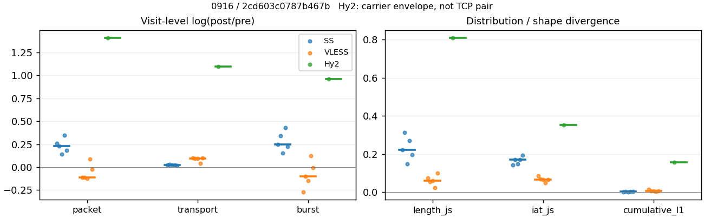
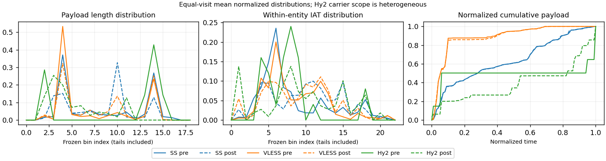

# 0916 · 条目 023 · bing.com

目标：https://www.bing.com/search?q=indoor+plant+care

活动标签：bing.com::search_results_view。选定访问 15 次。

[返回总索引](../../README.md) · [统计口径](../../methods.md)

## 覆盖与资格（每次访问均保留）

| 部署 | 重复 | 主请求路由 | 活动状态 | 代理比较 | DIRECT pre | 请求 proxy/direct/unresolved | 错误 |
| --- | --- | --- | --- | --- | --- | --- | --- |
| Hy2 | 1 | direct | passed | 0 | 1 | 0/679/0 | [] |
| Hy2 | 2 | direct | passed | 0 | 1 | 0/681/0 | [] |
| Hy2 | 3 | direct | passed | 1 | 1 | 2/685/0 | [] |
| Hy2 | 4 | direct | passed | 0 | 1 | 0/676/0 | [] |
| Hy2 | 5 | direct | passed | 0 | 1 | 0/669/0 | [] |
| SS | 1 | proxy | passed | 1 | 0 | 628/0/0 | [] |
| SS | 2 | proxy | passed | 1 | 0 | 691/0/0 | [] |
| SS | 3 | proxy | passed | 1 | 0 | 685/0/0 | [] |
| SS | 4 | proxy | passed | 1 | 0 | 359/0/0 | [] |
| SS | 5 | proxy | passed | 1 | 0 | 597/0/0 | [] |
| VLESS | 1 | proxy | passed | 1 | 0 | 313/0/0 | [] |
| VLESS | 2 | proxy | passed | 1 | 0 | 470/0/1 | [] |
| VLESS | 3 | proxy | passed | 1 | 0 | 479/0/0 | [] |
| VLESS | 4 | proxy | passed | 1 | 0 | 401/0/0 | [] |
| VLESS | 5 | proxy | passed | 1 | 0 | 493/0/0 | [] |

主请求非 proxy 的统计仅解释为已索引的辅助代理连接或 DIRECT 观测，不代表目标业务经代理传输。播放确认与配对资格是两道不同的门。

图中散点为单次访问，短线为重复中位数；Hy2 是共享载体包络，不能与 TCP 配对作等范围因果对比。

形态图先逐访问归一化，再对访问等权平均；实线 pre，虚线 post。分箱序号及边界见 methods，不将分箱索引误解为长度或时间。

## 每次访问的关键观测

### SS

范围：`exclusive_page`。每格 pre → post；空值为不可观测/不适用。

| 重复 | 包数 | 载荷字节 | burst | TCP FR | IAT中位µs | length JS | IAT JS |
| --- | --- | --- | --- | --- | --- | --- | --- |
| 1 | 2449 → 3164 | 1.6821e+06 → 1.7193e+06 | 1651 → 2109 | 435 → 455 | 49.77 → 767.19 | 0.22233 | 0.14209 |
| 2 | 3133 → 3938 | 2.748e+06 → 2.828e+06 | 2178 → 3058 | 443 → 469 | 43.901 → 1923.2 | 0.31275 | 0.17161 |
| 3 | 2856 → 3297 | 1.7751e+06 → 1.819e+06 | 1904 → 2220 | 512 → 527 | 42.057 → 746.29 | 0.14934 | 0.14967 |
| 4 | 2111 → 2988 | 1.9854e+06 → 2.0294e+06 | 1388 → 2132 | 299 → 304 | 37.239 → 537.73 | 0.27007 | 0.17233 |
| 5 | 2664 → 3203 | 1.6538e+06 → 1.6877e+06 | 1824 → 2276 | 384 → 397 | 38.208 → 886.75 | 0.1967 | 0.19485 |

完整标量统计：中位数 [min,max]；Δ 为重复内逐访问变换的中位数，MAD 未缩放。n 为可用变换数；DIRECT-only 的 nΔ=0 不代表 pre 不可用。

| scope | 特征 | pre | post | Δ | IQRΔ | MADΔ | nΔ |
| --- | --- | --- | --- | --- | --- | --- | --- |
| exclusive_page | active_span_sum_s_1000ms | 74.743 [52.894, 90.481] | 80.257 [54.735, 103.61] | 0.07118 | 0.042171 | 0.02767 | 5 |
| exclusive_page | active_span_sum_s_100ms | 6.9381 [5.295, 13.218] | 17.423 [12.376, 30.27] | 0.92079 | 0.07968 | 0.071797 | 5 |
| exclusive_page | active_span_sum_s_500ms | 57.228 [38.697, 63.556] | 70.613 [45.233, 83.034] | 0.16647 | 0.15782 | 0.015544 | 5 |
| exclusive_page | burst_bytes_iqr | 1160.2 [1001, 1630.8] | 1428 [1428, 1428] | 0.20764 | 0.2326 | 0.14764 | 5 |
| exclusive_page | burst_bytes_mad | 85 [85, 85] | 74 [40, 119] | -0.13859 | 0.5963 | 0.46662 | 5 |
| exclusive_page | burst_bytes_max | 22118 [20480, 24576] | 8688 [7140, 15868] | -0.94836 | 0.20826 | 0.11679 | 5 |
| exclusive_page | burst_bytes_mean | 1018.9 [906.7, 1430.4] | 819.37 [741.53, 951.88] | -0.22295 | 0.10956 | 0.08771 | 5 |
| exclusive_page | burst_bytes_median | 85 [85, 85] | 74 [40, 119] | -0.13859 | 0.5963 | 0.46662 | 5 |
| exclusive_page | burst_bytes_min | 0 [0, 0] | 0 [0, 0] | — | — | — | 0 |
| exclusive_page | burst_bytes_p95 | 4104.5 [2996.3, 6340.1] | 2916 [2856, 3813.2] | -0.34187 | 0.46474 | 0.29818 | 5 |
| exclusive_page | burst_bytes_q25 | 0 [0, 0] | 0 [0, 0] | — | — | — | 0 |
| exclusive_page | burst_bytes_q75 | 1160.2 [1001, 1630.8] | 1428 [1428, 1428] | 0.20764 | 0.2326 | 0.14764 | 5 |
| exclusive_page | burst_bytes_std | 2313.4 [2050.6, 2975.9] | 1230.1 [1144, 1648.2] | -0.59086 | 0.048024 | 0.040746 | 5 |
| exclusive_page | burst_count | 1824 [1388, 2178] | 2220 [2109, 3058] | 0.24483 | 0.11797 | 0.091282 | 5 |
| exclusive_page | burst_duration_ms_iqr | 0.047169 [0.038031, 0.067897] | 0.000601 [0, 0.49184] | -1.36 | 6.2568 | 3.1903 | 4 |
| exclusive_page | burst_duration_ms_mad | 0 [0, 0] | 0 [0, 0] | — | — | — | 0 |
| exclusive_page | burst_duration_ms_max | 14845 [11656, 15001] | 15279 [15213, 43457] | 0.27018 | 0.49214 | 0.24138 | 5 |
| exclusive_page | burst_duration_ms_mean | 90.483 [87.268, 102.2] | 78.6 [58.931, 81.739] | -0.25838 | 0.12033 | 0.11759 | 5 |
| exclusive_page | burst_duration_ms_median | 0 [0, 0] | 0 [0, 0] | — | — | — | 0 |
| exclusive_page | burst_duration_ms_min | 0 [0, 0] | 0 [0, 0] | — | — | — | 0 |
| exclusive_page | burst_duration_ms_p95 | 267.02 [243.15, 373.09] | 176.74 [169.07, 196.91] | -0.42592 | 0.043654 | 0.025363 | 5 |
| exclusive_page | burst_duration_ms_q25 | 0 [0, 0] | 0 [0, 0] | — | — | — | 0 |
| exclusive_page | burst_duration_ms_q75 | 0.047169 [0.038031, 0.067897] | 0.000601 [0, 0.49184] | -1.36 | 6.2568 | 3.1903 | 4 |
| exclusive_page | burst_duration_ms_std | 646.37 [617.36, 706.14] | 783.75 [638.78, 1177.1] | 0.23864 | 0.18386 | 0.16671 | 5 |
| exclusive_page | burst_packets_iqr | 1 [1, 1] | 1 [0, 1] | 0 | 0 | 0 | 4 |
| exclusive_page | burst_packets_mad | 0 [0, 0] | 0 [0, 0] | — | — | — | 0 |
| exclusive_page | burst_packets_max | 10 [9, 12] | 11 [11, 12] | 0.18232 | 0.26933 | 0.018349 | 5 |
| exclusive_page | burst_packets_mean | 1.4833 [1.4385, 1.5209] | 1.4073 [1.2878, 1.5002] | -0.037129 | 0.071795 | 0.044626 | 5 |
| exclusive_page | burst_packets_median | 1 [1, 1] | 1 [1, 1] | 0 | 0 | 0 | 5 |
| exclusive_page | burst_packets_min | 1 [1, 1] | 1 [1, 1] | 0 | 0 | 0 | 5 |
| exclusive_page | burst_packets_p95 | 3 [3, 3] | 3 [3, 3] | 0 | 0 | 0 | 5 |
| exclusive_page | burst_packets_q25 | 1 [1, 1] | 1 [1, 1] | 0 | 0 | 0 | 5 |
| exclusive_page | burst_packets_q75 | 2 [2, 2] | 2 [1, 2] | 0 | 0 | 0 | 5 |
| exclusive_page | burst_packets_std | 0.93141 [0.84855, 0.97903] | 0.8985 [0.75924, 1.0043] | 0.0045219 | 0.16773 | 0.070839 | 5 |
| exclusive_page | connection_span_concurrency_max | 5 [5, 6] | 5 [5, 6] | 0 | 0 | 0 | 5 |
| exclusive_page | cumulative_l1 | — | — | 0.0031122 | 0.0015761 | 0.00053842 | 5 |
| exclusive_page | cumulative_max | — | — | 0.030289 | 0.076141 | 0.0040128 | 5 |
| exclusive_page | direction_entropy | 0.99246 [0.91803, 0.99999] | 0.75972 [0.61653, 0.79822] | -0.23273 | 0.036257 | 0.026804 | 5 |
| exclusive_page | down_burst_count | 908 [690, 1084] | 1106 [1050, 1524] | 0.24602 | 0.11842 | 0.091872 | 5 |
| exclusive_page | down_ip_bytes | 1.7024e+06 [1.5802e+06, 2.6883e+06] | 1.73e+06 [1.6047e+06, 2.7393e+06] | 0.016061 | 0.0034312 | 0.00072178 | 5 |
| exclusive_page | down_packets | 1411 [1201, 1683] | 1755 [1674, 2065] | 0.20455 | 0.12017 | 0.03895 | 5 |
| exclusive_page | down_transport_bytes | 1.6224e+06 [1.5068e+06, 2.6007e+06] | 1.6352e+06 [1.5161e+06, 2.6305e+06] | 0.0078751 | 0.0052411 | 0.0035231 | 5 |
| exclusive_page | duration_s | 65.211 [63.276, 69.722] | 65.508 [63.275, 70.071] | -6.0843e-06 | 0.0045407 | 8.3733e-06 | 5 |
| exclusive_page | entity_count | 9 [8, 10] | 9 [8, 10] | 0 | 0 | 0 | 5 |
| exclusive_page | fr_runs | 435 [299, 512] | 455 [304, 527] | 0.033294 | 0.016075 | 0.011658 | 5 |
| exclusive_page | fr_runs_per_packet | 0.25313 [0.23882, 0.30377] | 0.22031 [0.17582, 0.27477] | -0.03282 | 0.029279 | 0.0089491 | 5 |
| exclusive_page | fr_switches | 426 [290, 504] | 446 [295, 519] | 0.034169 | 0.016552 | 0.011711 | 5 |
| exclusive_page | fr_switches_per_possible_transition | 0.24818 [0.23331, 0.29937] | 0.21596 [0.17151, 0.27173] | -0.032215 | 0.028846 | 0.0088547 | 5 |
| exclusive_page | full_retransmission_fraction | 0.003003 [0.00047371, 0.0057166] | 0.012739 [0.0046854, 0.021176] | 0.0088873 | 0.01042 | 0.0046756 | 5 |
| exclusive_page | full_retransmission_packets | 8 [1, 14] | 42 [14, 70] | 1.5656 | 0.82928 | 0.4262 | 5 |
| exclusive_page | iat_count | 2654 [2102, 3123] | 3193 [2979, 3928] | 0.22934 | 0.072097 | 0.044443 | 5 |
| exclusive_page | iat_js | — | — | 0.17161 | 0.02266 | 0.02194 | 5 |
| exclusive_page | iat_ks | — | — | 0.32319 | 0.004516 | 0.0023313 | 5 |
| exclusive_page | iat_median_us | 42.057 [37.239, 49.77] | 767.19 [537.73, 1923.2] | 2.8761 | 0.4092 | 0.20609 | 5 |
| exclusive_page | iat_us_iqr | 1748.8 [750.81, 3400] | 5982 [3304.5, 17467] | 1.5166 | 0.13107 | 0.096402 | 5 |
| exclusive_page | iat_us_mad | 36.351 [30.291, 42.583] | 757.47 [528.23, 1916.9] | 2.9988 | 0.42533 | 0.14011 | 5 |
| exclusive_page | iat_us_max | 1.5001e+07 [1.5001e+07, 1.5001e+07] | 1.5396e+07 [1.5272e+07, 1.5487e+07] | 0.025973 | 0.010027 | 0.0059027 | 5 |
| exclusive_page | iat_us_mean | 1.0636e+05 [87798, 1.1828e+05] | 83454 [73098, 89121] | -0.22701 | 0.073779 | 0.043778 | 5 |
| exclusive_page | iat_us_median | 42.057 [37.239, 49.77] | 767.19 [537.73, 1923.2] | 2.8761 | 0.4092 | 0.20609 | 5 |
| exclusive_page | iat_us_min | 0.097 [0.001, 0.175] | 0.037 [0.036, 0.038] | -0.99119 | 1.3596 | 0.56268 | 5 |
| exclusive_page | iat_us_p95 | 2.2572e+05 [2.105e+05, 2.5852e+05] | 1.7969e+05 [1.7342e+05, 1.9234e+05] | -0.2377 | 0.081875 | 0.058016 | 5 |
| exclusive_page | iat_us_q25 | 15.915 [14.226, 17.59] | 25.193 [17.873, 34.436] | 0.51758 | 0.40948 | 0.15417 | 5 |
| exclusive_page | iat_us_q75 | 1764.7 [765.03, 3417.5] | 6016.4 [3322.4, 17485] | 1.5113 | 0.13548 | 0.092716 | 5 |
| exclusive_page | iat_us_std | 8.5785e+05 [7.4319e+05, 1.0381e+06] | 7.8914e+05 [6.7962e+05, 8.7541e+05] | -0.11691 | 0.041442 | 0.027494 | 5 |
| exclusive_page | iat_wasserstein_log1p_us | — | — | 1.4511 | 0.20084 | 0.10602 | 5 |
| exclusive_page | idle_gap_count_1000ms | 36 [31, 45] | 33 [30, 41] | -0.082238 | 0.054222 | 0.010852 | 5 |
| exclusive_page | idle_gap_count_100ms | 261 [187, 301] | 296 [199, 328] | 0.062196 | 0.039383 | 0.023707 | 5 |
| exclusive_page | idle_gap_count_500ms | 62 [52, 91] | 49 [44, 71] | -0.2318 | 0.081126 | 0.064748 | 5 |
| exclusive_page | idle_gap_sum_s_1000ms | 195.72 [160.19, 258.77] | 193.87 [157.33, 246.46] | -0.030334 | 0.018048 | 0.012366 | 5 |
| exclusive_page | idle_gap_sum_s_100ms | 253.65 [226.08, 336.04] | 243.61 [215.98, 319.8] | -0.040401 | 0.0062239 | 0.0052982 | 5 |
| exclusive_page | idle_gap_sum_s_500ms | 209.92 [175.79, 288.59] | 203.38 [166.85, 267.03] | -0.053305 | 0.025459 | 0.021643 | 5 |
| exclusive_page | ip_bytes | 1.9238e+06 [1.7926e+06, 2.9112e+06] | 2.0048e+06 [1.873e+06, 3.0496e+06] | 0.046454 | 0.0026595 | 0.002572 | 5 |
| exclusive_page | length_iqr | 2602 [1724.2, 2803] | 1310 [765, 1354] | -0.6832 | 0.26406 | 0.18696 | 5 |
| exclusive_page | length_js | — | — | 0.22233 | 0.073375 | 0.047742 | 5 |
| exclusive_page | length_ks | — | — | 0.23978 | 0.092698 | 0.044152 | 5 |
| exclusive_page | length_mad | 434 [267, 1321.5] | 658.5 [20, 1091] | 0.40085 | 0.67348 | 0.50187 | 5 |
| exclusive_page | length_max | 8948 [8192, 8948] | 4284 [2856, 11424] | -0.73654 | 0.19932 | 0.18541 | 5 |
| exclusive_page | length_mean | 1174.7 [1047.9, 1585.8] | 948.39 [933.41, 1306.2] | -0.15188 | 0.097023 | 0.052135 | 5 |
| exclusive_page | length_median | 519 [303, 1406.5] | 800.5 [682, 1428] | 0.47063 | 0.26108 | 0.1975 | 5 |
| exclusive_page | length_min | 31 [31, 31] | 5 [3, 20] | -1.8245 | 1.674 | 0.51083 | 5 |
| exclusive_page | length_p95 | 2896 [2896, 4096] | 2856 [2856, 2856] | -0.013908 | 0.34668 | 0 | 5 |
| exclusive_page | length_q25 | 86 [86, 94] | 118 [74, 663] | 0.28185 | 0.088947 | 0.054461 | 5 |
| exclusive_page | length_q75 | 2688 [1810.2, 2896] | 1428 [1428, 1428] | -0.63252 | 0.22608 | 0.074533 | 5 |
| exclusive_page | length_std | 1509.7 [1162.7, 1801.1] | 910 [842.34, 1092.2] | -0.37477 | 0.19329 | 0.1217 | 5 |
| exclusive_page | length_wasserstein_bytes | — | — | 435.99 | 146.76 | 76.125 | 5 |
| exclusive_page | nonempty_entity_count | 9 [8, 10] | 9 [8, 10] | 0 | 0 | 0 | 5 |
| exclusive_page | nonempty_packets | 1517 [1252, 1842] | 1842 [1729, 2165] | 0.17216 | 0.090211 | 0.047972 | 5 |
| exclusive_page | offload_suspect_fraction | 0.17844 [0.16562, 0.25628] | 0.092604 [0.080862, 0.11011] | -0.092937 | 0.041264 | 0.022256 | 5 |
| exclusive_page | packet_count | 2664 [2111, 3133] | 3203 [2988, 3938] | 0.22868 | 0.071898 | 0.044423 | 5 |
| exclusive_page | rtt_median_ms | 0.073758 [0.062376, 0.079881] | 29.178 [25.692, 37.595] | 5.9158 | 0.29924 | 0.094998 | 5 |
| exclusive_page | rtt_sample_count | 1159 [883, 1368] | 852 [624, 1106] | -0.29947 | 0.099911 | 0.052202 | 5 |
| exclusive_page | tcp_ack_count | 2654 [2102, 3123] | 3191 [2978, 3927] | 0.22908 | 0.073227 | 0.044815 | 5 |
| exclusive_page | tcp_fin_count | 18 [16, 20] | 18 [16, 24] | 0 | 0.051293 | 0.051293 | 5 |
| exclusive_page | tcp_packet_count | 2664 [2111, 3133] | 3203 [2988, 3938] | 0.22868 | 0.071898 | 0.044423 | 5 |
| exclusive_page | tcp_rst_count | 0 [0, 2] | 0 [0, 1] | — | — | — | 0 |
| exclusive_page | tcp_syn_count | 18 [16, 20] | 19 [16, 22] | 0.04879 | 0.054067 | 0.04652 | 5 |
| exclusive_page | tcp_window_raw_median | 65365 [65356, 65451] | 151 [135, 161] | -6.0704 | 0.084047 | 0.064086 | 5 |
| exclusive_page | transition_entropy | 0.80491 [0.75332, 0.88043] | 0.66616 [0.54313, 0.74963] | -0.13875 | 0.03527 | 0.011487 | 5 |
| exclusive_page | transition_n_mm | 652 [501, 837] | 1208 [1174, 1476] | 0.62747 | 0.045849 | 0.024128 | 5 |
| exclusive_page | transition_n_mp | 209 [141, 249] | 219 [143, 257] | 0.032261 | 0.015114 | 0.014477 | 5 |
| exclusive_page | transition_n_pm | 217 [149, 255] | 227 [152, 262] | 0.035994 | 0.017972 | 0.0090591 | 5 |
| exclusive_page | transition_n_pp | 496 [267, 562] | 199 [112, 220] | -0.90711 | 0.069125 | 0.038362 | 5 |
| exclusive_page | transition_p_mm | 0.77899 [0.70563, 0.8295] | 0.86471 [0.82264, 0.90179] | 0.085725 | 0.026714 | 0.013443 | 5 |
| exclusive_page | transition_p_mp | 0.22101 [0.1705, 0.29437] | 0.13529 [0.098214, 0.17736] | -0.085725 | 0.026714 | 0.013443 | 5 |
| exclusive_page | transition_p_pm | 0.30435 [0.2813, 0.35817] | 0.51591 [0.50127, 0.57576] | 0.21997 | 0.015586 | 0.0084085 | 5 |
| exclusive_page | transition_p_pp | 0.69565 [0.64183, 0.7187] | 0.48409 [0.42424, 0.49873] | -0.21997 | 0.015586 | 0.0084085 | 5 |
| exclusive_page | transport_bytes | 1.7751e+06 [1.6538e+06, 2.748e+06] | 1.819e+06 [1.6877e+06, 2.828e+06] | 0.021922 | 0.0025692 | 0.0016373 | 5 |
| exclusive_page | up_burst_count | 916 [698, 1094] | 1114 [1059, 1534] | 0.24365 | 0.11752 | 0.0907 | 5 |
| exclusive_page | up_byte_fraction | 0.086008 [0.035571, 0.091247] | 0.10103 [0.042599, 0.11071] | 0.015022 | 0.0034427 | 0.0022409 | 5 |
| exclusive_page | up_ip_bytes | 2.1377e+05 [1.1803e+05, 2.2286e+05] | 2.7478e+05 [1.7422e+05, 3.1035e+05] | 0.25304 | 0.097145 | 0.037053 | 5 |
| exclusive_page | up_packets | 1253 [910, 1450] | 1482 [1314, 1873] | 0.19878 | 0.072061 | 0.057198 | 5 |
| exclusive_page | up_transport_bytes | 1.4728e+05 [70623, 1.5349e+05] | 1.8377e+05 [86451, 1.9745e+05] | 0.20222 | 0.029768 | 0.016794 | 5 |
| exclusive_page | zero_iat_count | 0 [0, 0] | 0 [0, 0] | — | — | — | 0 |
| exclusive_page | zero_iat_fraction | 0 [0, 0] | 0 [0, 0] | 0 | 0 | 0 | 5 |

### VLESS

范围：`exclusive_page`。每格 pre → post；空值为不可观测/不适用。

| 重复 | 包数 | 载荷字节 | burst | TCP FR | IAT中位µs | length JS | IAT JS |
| --- | --- | --- | --- | --- | --- | --- | --- |
| 1 | 1119 → 1000 | 5.5334e+05 → 6.1179e+05 | 783 → 599 | 76 → 88 | 73.133 → 560.45 | 0.076288 | 0.085377 |
| 2 | 1081 → 967 | 5.3839e+05 → 5.9287e+05 | 719 → 649 | 68 → 82 | 56.375 → 455.67 | 0.054312 | 0.070633 |
| 3 | 1160 → 1025 | 5.4302e+05 → 5.9826e+05 | 831 → 719 | 64 → 78 | 57.891 → 483.96 | 0.059865 | 0.067686 |
| 4 | 2544 → 2774 | 1.8482e+06 → 1.9215e+06 | 1615 → 1824 | 286 → 302 | 340.65 → 557.35 | 0.024441 | 0.050568 |
| 5 | 1094 → 1069 | 5.4786e+05 → 6.0481e+05 | 743 → 737 | 72 → 86 | 65.127 → 469.49 | 0.10084 | 0.066292 |

完整标量统计：中位数 [min,max]；Δ 为重复内逐访问变换的中位数，MAD 未缩放。n 为可用变换数；DIRECT-only 的 nΔ=0 不代表 pre 不可用。

| scope | 特征 | pre | post | Δ | IQRΔ | MADΔ | nΔ |
| --- | --- | --- | --- | --- | --- | --- | --- |
| exclusive_page | active_span_sum_s_1000ms | 10.548 [10.072, 35.458] | 11.373 [11.016, 35.71] | 0.05645 | 0.05134 | 0.035873 | 5 |
| exclusive_page | active_span_sum_s_100ms | 1.8695 [1.6743, 4.8423] | 4.3196 [4.227, 12.47] | 0.89864 | 0.063245 | 0.032557 | 5 |
| exclusive_page | active_span_sum_s_500ms | 6.0819 [5.319, 27.602] | 10.662 [10.114, 33.283] | 0.56139 | 0.098421 | 0.056895 | 5 |
| exclusive_page | burst_bytes_iqr | 1163 [572.5, 2896] | 2028 [1632, 2824] | 0.5082 | 0.60626 | 0.43686 | 5 |
| exclusive_page | burst_bytes_mad | 31 [24, 85] | 36 [31, 84] | 0.14953 | 0.25593 | 0.14953 | 5 |
| exclusive_page | burst_bytes_max | 5792 [5720, 20480] | 8391 [4875, 9648] | 0.0087033 | 0.45949 | 0.27843 | 5 |
| exclusive_page | burst_bytes_mean | 737.37 [653.46, 1144.4] | 913.51 [820.64, 1053.4] | 0.19882 | 0.13465 | 0.091819 | 5 |
| exclusive_page | burst_bytes_median | 31 [24, 85] | 36 [31, 84] | 0.14953 | 0.25593 | 0.14953 | 5 |
| exclusive_page | burst_bytes_min | 0 [0, 0] | 0 [0, 0] | — | — | — | 0 |
| exclusive_page | burst_bytes_p95 | 2896 [2896, 3536.2] | 2896 [2896, 2896] | 0 | 0 | 0 | 5 |
| exclusive_page | burst_bytes_q25 | 0 [0, 0] | 0 [0, 0] | — | — | — | 0 |
| exclusive_page | burst_bytes_q75 | 1163 [572.5, 2896] | 2028 [1632, 2824] | 0.5082 | 0.60626 | 0.43686 | 5 |
| exclusive_page | burst_bytes_std | 1221.7 [1134.3, 1860.8] | 1275.8 [1217.4, 1331.5] | 0.047332 | 0.05766 | 0.023292 | 5 |
| exclusive_page | burst_count | 783 [719, 1615] | 719 [599, 1824] | -0.10243 | 0.13666 | 0.09432 | 5 |
| exclusive_page | burst_duration_ms_iqr | 0.41292 [0.077602, 1.3692] | 0.007179 [0, 2.5482] | -1.9248 | 5.8871 | 3.5233 | 4 |
| exclusive_page | burst_duration_ms_mad | 0 [0, 0] | 0 [0, 0] | — | — | — | 0 |
| exclusive_page | burst_duration_ms_max | 14278 [5662.7, 15001] | 15056 [15014, 15454] | 0.05026 | 0.11592 | 0.04837 | 5 |
| exclusive_page | burst_duration_ms_mean | 71.358 [37.936, 86.68] | 137.29 [75.115, 155.59] | 0.585 | 0.088955 | 0.069396 | 5 |
| exclusive_page | burst_duration_ms_median | 0 [0, 0] | 0 [0, 0] | — | — | — | 0 |
| exclusive_page | burst_duration_ms_min | 0 [0, 0] | 0 [0, 0] | — | — | — | 0 |
| exclusive_page | burst_duration_ms_p95 | 17.123 [10.016, 199.86] | 134.65 [113.52, 155.43] | 1.8915 | 0.7586 | 0.41259 | 5 |
| exclusive_page | burst_duration_ms_q25 | 0 [0, 0] | 0 [0, 0] | — | — | — | 0 |
| exclusive_page | burst_duration_ms_q75 | 0.41292 [0.077602, 1.3692] | 0.007179 [0, 2.5482] | -1.9248 | 5.8871 | 3.5233 | 4 |
| exclusive_page | burst_duration_ms_std | 783.59 [267.49, 878.12] | 1340.7 [937.38, 1431.1] | 0.48842 | 0.060141 | 0.048662 | 5 |
| exclusive_page | burst_packets_iqr | 1 [1, 1] | 1 [0, 1] | 0 | 0 | 0 | 4 |
| exclusive_page | burst_packets_mad | 0 [0, 0] | 0 [0, 0] | — | — | — | 0 |
| exclusive_page | burst_packets_max | 9 [5, 13] | 12 [9, 14] | 0.20067 | 0.8473 | 0.5684 | 5 |
| exclusive_page | burst_packets_mean | 1.4724 [1.3959, 1.5752] | 1.49 [1.4256, 1.6694] | -0.0090147 | 0.03605 | 0.02613 | 5 |
| exclusive_page | burst_packets_median | 1 [1, 1] | 1 [1, 1] | 0 | 0 | 0 | 5 |
| exclusive_page | burst_packets_min | 1 [1, 1] | 1 [1, 1] | 0 | 0 | 0 | 5 |
| exclusive_page | burst_packets_p95 | 3 [2, 3] | 3 [3, 4] | 0 | 0.28768 | 0 | 5 |
| exclusive_page | burst_packets_q25 | 1 [1, 1] | 1 [1, 1] | 0 | 0 | 0 | 5 |
| exclusive_page | burst_packets_q75 | 2 [2, 2] | 2 [1, 2] | 0 | 0 | 0 | 5 |
| exclusive_page | burst_packets_std | 0.72674 [0.60359, 0.88839] | 1.1433 [0.89013, 1.2676] | 0.46352 | 0.2619 | 0.17524 | 5 |
| exclusive_page | connection_span_concurrency_max | 4 [4, 5] | 4 [4, 5] | 0 | 0 | 0 | 5 |
| exclusive_page | cumulative_l1 | — | — | 0.0075136 | 0.0006805 | 0.00043029 | 5 |
| exclusive_page | cumulative_max | — | — | 0.037792 | 0.020579 | 0.010647 | 5 |
| exclusive_page | direction_entropy | 0.97594 [0.79579, 0.97866] | 0.69621 [0.60594, 0.71016] | -0.2774 | 0.0097211 | 0.0088959 | 5 |
| exclusive_page | down_burst_count | 388 [356, 803] | 356 [296, 908] | -0.10349 | 0.13791 | 0.095304 | 5 |
| exclusive_page | down_ip_bytes | 5.3446e+05 [5.2563e+05, 1.8642e+06] | 5.7734e+05 [5.6545e+05, 1.9245e+06] | 0.073021 | 0.005826 | 0.0041447 | 5 |
| exclusive_page | down_packets | 598 [583, 1563] | 565 [533, 1626] | -0.056765 | 0.051599 | 0.032901 | 5 |
| exclusive_page | down_transport_bytes | 5.0378e+05 [4.9526e+05, 1.7828e+06] | 5.478e+05 [5.3768e+05, 1.8399e+06] | 0.082943 | 0.0015918 | 0.00082617 | 5 |
| exclusive_page | duration_s | 67.777 [61.967, 68.497] | 67.737 [61.946, 68.455] | -0.00061207 | 0.00027272 | 0.00027193 | 5 |
| exclusive_page | entity_count | 7 [7, 9] | 7 [7, 9] | 0 | 0 | 0 | 5 |
| exclusive_page | fr_runs | 72 [64, 286] | 86 [78, 302] | 0.17768 | 0.040608 | 0.020145 | 5 |
| exclusive_page | fr_runs_per_packet | 0.11356 [0.098462, 0.17909] | 0.15971 [0.14773, 0.18758] | 0.04337 | 0.0070213 | 0.0058961 | 5 |
| exclusive_page | fr_switches | 65 [57, 277] | 79 [71, 293] | 0.19506 | 0.046272 | 0.024568 | 5 |
| exclusive_page | fr_switches_per_possible_transition | 0.10367 [0.088647, 0.17443] | 0.1489 [0.13628, 0.18301] | 0.042358 | 0.0065449 | 0.0052718 | 5 |
| exclusive_page | full_retransmission_fraction | 0.00089366 [0, 0.0018501] | 0 [0, 0.001] | 0 | 0.00074853 | 0.00010634 | 5 |
| exclusive_page | full_retransmission_packets | 1 [0, 2] | 0 [0, 1] | -0.34657 | 0.34657 | 0.34657 | 2 |
| exclusive_page | iat_count | 1112 [1074, 2535] | 1018 [960, 2765] | -0.11221 | 0.089917 | 0.012315 | 5 |
| exclusive_page | iat_js | — | — | 0.067686 | 0.004341 | 0.0029471 | 5 |
| exclusive_page | iat_ks | — | — | 0.15218 | 0.045359 | 0.027743 | 5 |
| exclusive_page | iat_median_us | 65.127 [56.375, 340.65] | 483.96 [455.67, 560.45] | 2.0365 | 0.11444 | 0.061145 | 5 |
| exclusive_page | iat_us_iqr | 1492.6 [1161.6, 2444.9] | 3766.5 [3436.1, 3893.5] | 0.85503 | 0.16709 | 0.086039 | 5 |
| exclusive_page | iat_us_mad | 58.984 [50.495, 332.38] | 476.11 [449.43, 553.75] | 2.1228 | 0.12879 | 0.065458 | 5 |
| exclusive_page | iat_us_max | 1.5001e+07 [1.5001e+07, 1.5001e+07] | 1.5411e+07 [1.5385e+07, 1.5454e+07] | 0.026943 | 0.001429 | 0.0013748 | 5 |
| exclusive_page | iat_us_mean | 1.8916e+05 [99227, 2.0099e+05] | 2.0553e+05 [90900, 2.2245e+05] | 0.11138 | 0.089452 | 0.012097 | 5 |
| exclusive_page | iat_us_median | 65.127 [56.375, 340.65] | 483.96 [455.67, 560.45] | 2.0365 | 0.11444 | 0.061145 | 5 |
| exclusive_page | iat_us_min | 0.047 [0.001, 0.352] | 0.037 [0.036, 0.039] | -0.21256 | 1.4828 | 1.2977 | 5 |
| exclusive_page | iat_us_p95 | 28669 [16976, 1.9771e+05] | 1.1153e+05 [1.0374e+05, 1.4339e+05] | 1.3769 | 0.61365 | 0.44483 | 5 |
| exclusive_page | iat_us_q25 | 22.581 [18.195, 41.117] | 22.252 [17.575, 27.499] | -0.16267 | 0.43163 | 0.23961 | 5 |
| exclusive_page | iat_us_q75 | 1515.1 [1183.2, 2486] | 3788.7 [3463.6, 3911] | 0.84547 | 0.17266 | 0.087242 | 5 |
| exclusive_page | iat_us_std | 1.5599e+06 [1.0519e+06, 1.6228e+06] | 1.6498e+06 [1.0134e+06, 1.6979e+06] | 0.056131 | 0.043865 | 0.005368 | 5 |
| exclusive_page | iat_wasserstein_log1p_us | — | — | 0.91581 | 0.18949 | 0.092589 | 5 |
| exclusive_page | idle_gap_count_1000ms | 19 [14, 22] | 18 [13, 21] | -0.054067 | 0.0075472 | 0.0075472 | 5 |
| exclusive_page | idle_gap_count_100ms | 47 [46, 150] | 54 [52, 151] | 0.13884 | 0.016234 | 0.016234 | 5 |
| exclusive_page | idle_gap_count_500ms | 26 [21, 34] | 19 [13, 24] | -0.31366 | 0.034649 | 0.025975 | 5 |
| exclusive_page | idle_gap_sum_s_1000ms | 207.69 [163.63, 216.08] | 206.86 [163.14, 215.63] | -0.0040203 | 0.0018192 | 0.001063 | 5 |
| exclusive_page | idle_gap_sum_s_100ms | 216.33 [173.14, 246.7] | 213.65 [170.07, 238.87] | -0.013062 | 0.0054275 | 0.00073213 | 5 |
| exclusive_page | idle_gap_sum_s_500ms | 212.39 [168.13, 223.94] | 207.61 [163.14, 218.05] | -0.024515 | 0.0027292 | 0.0017303 | 5 |
| exclusive_page | ip_bytes | 6.0471e+05 [5.946e+05, 1.9804e+06] | 6.611e+05 [6.4347e+05, 2.0666e+06] | 0.078992 | 0.0055223 | 0.0039753 | 5 |
| exclusive_page | length_iqr | 1363 [1327, 2752] | 1985.8 [1376, 2752] | 0.11721 | 0.40308 | 0.28586 | 5 |
| exclusive_page | length_js | — | — | 0.059865 | 0.021975 | 0.016423 | 5 |
| exclusive_page | length_ks | — | — | 0.24753 | 0.021931 | 0.007037 | 5 |
| exclusive_page | length_mad | 22 [22, 173] | 870.5 [767, 951.5] | 3.6694 | 0.12658 | 0.025173 | 5 |
| exclusive_page | length_max | 4096 [4096, 8920] | 2824 [2824, 2896] | -0.37186 | 0 | 0 | 5 |
| exclusive_page | length_mean | 860.05 [835.42, 1157.3] | 1133.1 [1103.7, 1193.5] | 0.26103 | 0.058628 | 0.042263 | 5 |
| exclusive_page | length_median | 94 [94, 208] | 942.5 [839, 1023.5] | 2.2973 | 0.11633 | 0.023257 | 5 |
| exclusive_page | length_min | 23 [1, 24] | 16 [1, 23] | -0.087011 | 0.36291 | 0.087011 | 5 |
| exclusive_page | length_p95 | 2824 [2824, 2824] | 2824 [2824, 2824] | 0 | 0 | 0 | 5 |
| exclusive_page | length_q25 | 85 [72, 85] | 72 [72, 72] | -0.16599 | 0.0088627 | 0 | 5 |
| exclusive_page | length_q75 | 1448 [1412, 2824] | 2057.8 [1448, 2824] | 0.10263 | 0.37661 | 0.27398 | 5 |
| exclusive_page | length_std | 1123 [1092.5, 1271.5] | 1090 [1057.9, 1148.9] | -0.039616 | 0.072564 | 0.037367 | 5 |
| exclusive_page | length_wasserstein_bytes | — | — | 268.32 | 42.441 | 38.222 | 5 |
| exclusive_page | nonempty_entity_count | 7 [7, 9] | 7 [7, 9] | 0 | 0 | 0 | 5 |
| exclusive_page | nonempty_packets | 647 [626, 1597] | 548 [509, 1610] | -0.16061 | 0.061129 | 0.046291 | 5 |
| exclusive_page | offload_suspect_fraction | 0.14388 [0.125, 0.2158] | 0.141 [0.12535, 0.18349] | -0.0028785 | 0.036266 | 0.017605 | 5 |
| exclusive_page | packet_count | 1119 [1081, 2544] | 1025 [967, 2774] | -0.11144 | 0.089318 | 0.012284 | 5 |
| exclusive_page | rtt_median_ms | 0.10681 [0.08294, 0.57488] | 0.15114 [0.052953, 2.8551] | 0.42121 | 1.4429 | 0.86993 | 5 |
| exclusive_page | rtt_sample_count | 431 [408, 958] | 453 [402, 1153] | 0.021819 | 0.10781 | 0.072831 | 5 |
| exclusive_page | tcp_ack_count | 1098 [1062, 2517] | 1018 [960, 2764] | -0.10051 | 0.08974 | 0.012673 | 5 |
| exclusive_page | tcp_fin_count | 13 [12, 18] | 14 [14, 18] | 0.074108 | 0.074108 | 0.074108 | 5 |
| exclusive_page | tcp_packet_count | 1119 [1081, 2544] | 1025 [967, 2774] | -0.11144 | 0.089318 | 0.012284 | 5 |
| exclusive_page | tcp_rst_count | 13 [12, 18] | 0 [0, 1] | -2.8904 | — | — | 1 |
| exclusive_page | tcp_syn_count | 14 [14, 18] | 14 [14, 18] | 0 | 0 | 0 | 5 |
| exclusive_page | tcp_window_raw_median | 65364 [65348, 65535] | 158 [157, 183.5] | -6.0251 | 1.5299e-05 | 1.5299e-05 | 5 |
| exclusive_page | transition_entropy | 0.47412 [0.42547, 0.61231] | 0.52412 [0.49752, 0.55206] | 0.041868 | 0.025182 | 0.024489 | 5 |
| exclusive_page | transition_n_mm | 341 [336, 1070] | 400 [372, 1220] | 0.13119 | 0.057799 | 0.02941 | 5 |
| exclusive_page | transition_n_mp | 29 [25, 134] | 36 [32, 142] | 0.21622 | 0.053593 | 0.030637 | 5 |
| exclusive_page | transition_n_pm | 36 [32, 143] | 43 [39, 151] | 0.17768 | 0.040608 | 0.020145 | 5 |
| exclusive_page | transition_n_pp | 230 [222, 241] | 60 [55, 88] | -1.3524 | 0.060713 | 0.042951 | 5 |
| exclusive_page | transition_p_mm | 0.92077 [0.8887, 0.93404] | 0.91626 [0.89574, 0.92417] | -0.0025832 | 0.0080288 | 0.0067805 | 5 |
| exclusive_page | transition_p_mp | 0.079235 [0.065963, 0.1113] | 0.083744 [0.075829, 0.10426] | 0.0025832 | 0.0080288 | 0.0067805 | 5 |
| exclusive_page | transition_p_pm | 0.13793 [0.12121, 0.3724] | 0.42574 [0.39394, 0.6318] | 0.27273 | 0.018388 | 0.013324 | 5 |
| exclusive_page | transition_p_pp | 0.86207 [0.6276, 0.87879] | 0.57426 [0.3682, 0.60606] | -0.27273 | 0.018388 | 0.013324 | 5 |
| exclusive_page | transport_bytes | 5.4786e+05 [5.3839e+05, 1.8482e+06] | 6.0481e+05 [5.9287e+05, 1.9215e+06] | 0.09688 | 0.0025011 | 0.002007 | 5 |
| exclusive_page | up_burst_count | 395 [363, 812] | 363 [303, 916] | -0.10139 | 0.13544 | 0.093357 | 5 |
| exclusive_page | up_byte_fraction | 0.08012 [0.035367, 0.0826] | 0.093098 [0.042474, 0.095909] | 0.012978 | 0.0005725 | 0.0003306 | 5 |
| exclusive_page | up_ip_bytes | 70975 [68968, 1.1623e+05] | 81832 [78023, 1.4215e+05] | 0.12336 | 0.053881 | 0.0050065 | 5 |
| exclusive_page | up_packets | 521 [498, 981] | 472 [434, 1148] | -0.12154 | 0.1316 | 0.058862 | 5 |
| exclusive_page | up_transport_bytes | 44086 [43136, 65365] | 57013 [55195, 81613] | 0.24651 | 0.0048503 | 0.0032868 | 5 |
| exclusive_page | zero_iat_count | 0 [0, 0] | 0 [0, 0] | — | — | — | 0 |
| exclusive_page | zero_iat_fraction | 0 [0, 0] | 0 [0, 0] | 0 | 0 | 0 | 5 |

### Hy2

范围：`direct_pre_only`。每格 pre → post；空值为不可观测/不适用。

| 重复 | 包数 | 载荷字节 | burst | TCP FR | IAT中位µs | length JS | IAT JS |
| --- | --- | --- | --- | --- | --- | --- | --- |
| 1 | 1712 → — | 1.1397e+06 → — | 1077 → — | 462 → — | 144.97 → — | — | — |
| 2 | 1817 → — | 1.2205e+06 → — | 1156 → — | 474 → — | 121.2 → — | — | — |
| 3 | 1718 → — | 1.0727e+06 → — | 1051 → — | 493 → — | 137.39 → — | — | — |
| 4 | 1726 → — | 1.1949e+06 → — | 1068 → — | 473 → — | 130.18 → — | — | — |
| 5 | 2192 → — | 2.28e+06 → — | 1427 → — | 473 → — | 92.989 → — | — | — |

范围：`carrier_context_envelope`。每格 pre → post；空值为不可观测/不适用。

| 重复 | 包数 | 载荷字节 | burst | TCP FR | IAT中位µs | length JS | IAT JS |
| --- | --- | --- | --- | --- | --- | --- | --- |
| 1 | — | — | — | — | — | — | — |
| 2 | — | — | — | — | — | — | — |
| 3 | 27 → 110 | 14154 → 42192 | 18 → 47 | — | 101.86 → 411.62 | 0.80844 | 0.35422 |
| 4 | — | — | — | — | — | — | — |
| 5 | — | — | — | — | — | — | — |

完整标量统计：中位数 [min,max]；Δ 为重复内逐访问变换的中位数，MAD 未缩放。n 为可用变换数；DIRECT-only 的 nΔ=0 不代表 pre 不可用。

| scope | 特征 | pre | post | Δ | IQRΔ | MADΔ | nΔ |
| --- | --- | --- | --- | --- | --- | --- | --- |
| carrier_context_envelope | active_span_sum_s_1000ms | 0.63451 [0.63451, 0.63451] | 3.0976 [3.0976, 3.0976] | 1.5855 | — | — | 1 |
| carrier_context_envelope | active_span_sum_s_100ms | 0.004464 [0.004464, 0.004464] | 0.63258 [0.63258, 0.63258] | 4.9538 | — | — | 1 |
| carrier_context_envelope | active_span_sum_s_500ms | 0.63451 [0.63451, 0.63451] | 3.0976 [3.0976, 3.0976] | 1.5855 | — | — | 1 |
| carrier_context_envelope | burst_bytes_iqr | 1534.5 [1534.5, 1534.5] | 1697.5 [1697.5, 1697.5] | 0.10095 | — | — | 1 |
| carrier_context_envelope | burst_bytes_mad | 0 [0, 0] | 110 [110, 110] | — | — | — | 0 |
| carrier_context_envelope | burst_bytes_max | 4979 [4979, 4979] | 6097 [6097, 6097] | 0.20257 | — | — | 1 |
| carrier_context_envelope | burst_bytes_mean | 786.33 [786.33, 786.33] | 897.7 [897.7, 897.7] | 0.13246 | — | — | 1 |
| carrier_context_envelope | burst_bytes_median | 0 [0, 0] | 136 [136, 136] | — | — | — | 0 |
| carrier_context_envelope | burst_bytes_min | 0 [0, 0] | 22 [22, 22] | — | — | — | 0 |
| carrier_context_envelope | burst_bytes_p95 | 3155.7 [3155.7, 3155.7] | 3286.8 [3286.8, 3286.8] | 0.040688 | — | — | 1 |
| carrier_context_envelope | burst_bytes_q25 | 0 [0, 0] | 34 [34, 34] | — | — | — | 0 |
| carrier_context_envelope | burst_bytes_q75 | 1534.5 [1534.5, 1534.5] | 1731.5 [1731.5, 1731.5] | 0.12078 | — | — | 1 |
| carrier_context_envelope | burst_bytes_std | 1391.4 [1391.4, 1391.4] | 1333.6 [1333.6, 1333.6] | -0.042448 | — | — | 1 |
| carrier_context_envelope | burst_count | 18 [18, 18] | 47 [47, 47] | 0.95978 | — | — | 1 |
| carrier_context_envelope | burst_duration_ms_iqr | 0.41966 [0.41966, 0.41966] | 1.0147 [1.0147, 1.0147] | 0.88288 | — | — | 1 |
| carrier_context_envelope | burst_duration_ms_mad | 0 [0, 0] | 0.000253 [0.000253, 0.000253] | — | — | — | 0 |
| carrier_context_envelope | burst_duration_ms_max | 324 [324, 324] | 235.39 [235.39, 235.39] | -0.3195 | — | — | 1 |
| carrier_context_envelope | burst_duration_ms_mean | 35.183 [35.183, 35.183] | 16.688 [16.688, 16.688] | -0.74588 | — | — | 1 |
| carrier_context_envelope | burst_duration_ms_median | 0 [0, 0] | 0.000253 [0.000253, 0.000253] | — | — | — | 0 |
| carrier_context_envelope | burst_duration_ms_min | 0 [0, 0] | 0 [0, 0] | — | — | — | 0 |
| carrier_context_envelope | burst_duration_ms_p95 | 308.74 [308.74, 308.74] | 128.63 [128.63, 128.63] | -0.87557 | — | — | 1 |
| carrier_context_envelope | burst_duration_ms_q25 | 0 [0, 0] | 0 [0, 0] | — | — | — | 0 |
| carrier_context_envelope | burst_duration_ms_q75 | 0.41966 [0.41966, 0.41966] | 1.0147 [1.0147, 1.0147] | 0.88288 | — | — | 1 |
| carrier_context_envelope | burst_duration_ms_std | 98.984 [98.984, 98.984] | 50.979 [50.979, 50.979] | -0.66353 | — | — | 1 |
| carrier_context_envelope | burst_packets_iqr | 1 [1, 1] | 1 [1, 1] | 0 | — | — | 1 |
| carrier_context_envelope | burst_packets_mad | 0 [0, 0] | 1 [1, 1] | — | — | — | 0 |
| carrier_context_envelope | burst_packets_max | 3 [3, 3] | 10 [10, 10] | 1.204 | — | — | 1 |
| carrier_context_envelope | burst_packets_mean | 1.5 [1.5, 1.5] | 2.3404 [2.3404, 2.3404] | 0.44487 | — | — | 1 |
| carrier_context_envelope | burst_packets_median | 1 [1, 1] | 2 [2, 2] | 0.69315 | — | — | 1 |
| carrier_context_envelope | burst_packets_min | 1 [1, 1] | 1 [1, 1] | 0 | — | — | 1 |
| carrier_context_envelope | burst_packets_p95 | 2.15 [2.15, 2.15] | 6.7 [6.7, 6.7] | 1.1366 | — | — | 1 |
| carrier_context_envelope | burst_packets_q25 | 1 [1, 1] | 1 [1, 1] | 0 | — | — | 1 |
| carrier_context_envelope | burst_packets_q75 | 2 [2, 2] | 2 [2, 2] | 0 | — | — | 1 |
| carrier_context_envelope | burst_packets_std | 0.60093 [0.60093, 0.60093] | 2.0029 [2.0029, 2.0029] | 1.2039 | — | — | 1 |
| carrier_context_envelope | connection_span_concurrency_max | 1 [1, 1] | 1 [1, 1] | 0 | — | — | 1 |
| carrier_context_envelope | cumulative_l1 | — | — | 0.15846 | — | — | 1 |
| carrier_context_envelope | cumulative_max | — | — | 0.30191 | — | — | 1 |
| carrier_context_envelope | direction_entropy | 0.98523 [0.98523, 0.98523] | 0.99785 [0.99785, 0.99785] | 0.012625 | — | — | 1 |
| carrier_context_envelope | direction_run_analog_runs | 6 [6, 6] | 47 [47, 47] | 2.0584 | — | — | 1 |
| carrier_context_envelope | direction_run_analog_runs_per_packet | 0.85714 [0.85714, 0.85714] | 0.42727 [0.42727, 0.42727] | -0.42987 | — | — | 1 |
| carrier_context_envelope | direction_run_analog_switches | 4 [4, 4] | 46 [46, 46] | 2.4423 | — | — | 1 |
| carrier_context_envelope | direction_run_analog_switches_per_possible_transition | 0.8 [0.8, 0.8] | 0.42202 [0.42202, 0.42202] | -0.37798 | — | — | 1 |
| carrier_context_envelope | down_burst_count | 8 [8, 8] | 23 [23, 23] | 1.0561 | — | — | 1 |
| carrier_context_envelope | down_ip_bytes | 10598 [10598, 10598] | 29602 [29602, 29602] | 1.0272 | — | — | 1 |
| carrier_context_envelope | down_packets | 12 [12, 12] | 58 [58, 58] | 1.5755 | — | — | 1 |
| carrier_context_envelope | down_transport_bytes | 9958 [9958, 9958] | 27978 [27978, 27978] | 1.033 | — | — | 1 |
| carrier_context_envelope | duration_s | 5.9071 [5.9071, 5.9071] | 5.8896 [5.8896, 5.8896] | -0.0029692 | — | — | 1 |
| carrier_context_envelope | entity_count | 2 [2, 2] | 1 [1, 1] | -0.69315 | — | — | 1 |
| carrier_context_envelope | full_retransmission_fraction | 0 [0, 0] | — | — | — | — | 0 |
| carrier_context_envelope | full_retransmission_packets | 0 [0, 0] | — | — | — | — | 0 |
| carrier_context_envelope | iat_count | 25 [25, 25] | 109 [109, 109] | 1.4725 | — | — | 1 |
| carrier_context_envelope | iat_js | — | — | 0.35422 | — | — | 1 |
| carrier_context_envelope | iat_ks | — | — | 0.36624 | — | — | 1 |
| carrier_context_envelope | iat_median_us | 101.86 [101.86, 101.86] | 411.62 [411.62, 411.62] | 1.3965 | — | — | 1 |
| carrier_context_envelope | iat_us_iqr | 285.02 [285.02, 285.02] | 16736 [16736, 16736] | 4.0728 | — | — | 1 |
| carrier_context_envelope | iat_us_mad | 88.051 [88.051, 88.051] | 411.5 [411.5, 411.5] | 1.5419 | — | — | 1 |
| carrier_context_envelope | iat_us_max | 3.24e+05 [3.24e+05, 3.24e+05] | 1.4053e+06 [1.4053e+06, 1.4053e+06] | 1.4673 | — | — | 1 |
| carrier_context_envelope | iat_us_mean | 25380 [25380, 25380] | 54033 [54033, 54033] | 0.75562 | — | — | 1 |
| carrier_context_envelope | iat_us_median | 101.86 [101.86, 101.86] | 411.62 [411.62, 411.62] | 1.3965 | — | — | 1 |
| carrier_context_envelope | iat_us_min | 8.477 [8.477, 8.477] | 0.036 [0.036, 0.036] | -5.4616 | — | — | 1 |
| carrier_context_envelope | iat_us_p95 | 2.4518e+05 [2.4518e+05, 2.4518e+05] | 2.3211e+05 [2.3211e+05, 2.3211e+05] | -0.054788 | — | — | 1 |
| carrier_context_envelope | iat_us_q25 | 16.705 [16.705, 16.705] | 63.574 [63.574, 63.574] | 1.3365 | — | — | 1 |
| carrier_context_envelope | iat_us_q75 | 301.73 [301.73, 301.73] | 16800 [16800, 16800] | 4.0196 | — | — | 1 |
| carrier_context_envelope | iat_us_std | 85449 [85449, 85449] | 1.9601e+05 [1.9601e+05, 1.9601e+05] | 0.83023 | — | — | 1 |
| carrier_context_envelope | iat_wasserstein_log1p_us | — | — | 2.034 | — | — | 1 |
| carrier_context_envelope | idle_gap_count_1000ms | 0 [0, 0] | 2 [2, 2] | — | — | — | 0 |
| carrier_context_envelope | idle_gap_count_100ms | 2 [2, 2] | 13 [13, 13] | 1.8718 | — | — | 1 |
| carrier_context_envelope | idle_gap_count_500ms | 0 [0, 0] | 2 [2, 2] | — | — | — | 0 |
| carrier_context_envelope | idle_gap_sum_s_1000ms | 0 [0, 0] | 2.7919 [2.7919, 2.7919] | — | — | — | 0 |
| carrier_context_envelope | idle_gap_sum_s_100ms | 0.63004 [0.63004, 0.63004] | 5.257 [5.257, 5.257] | 2.1215 | — | — | 1 |
| carrier_context_envelope | idle_gap_sum_s_500ms | 0 [0, 0] | 2.7919 [2.7919, 2.7919] | — | — | — | 0 |
| carrier_context_envelope | ip_bytes | 15590 [15590, 15590] | 45272 [45272, 45272] | 1.0661 | — | — | 1 |
| carrier_context_envelope | length_iqr | 1456.5 [1456.5, 1456.5] | 479.5 [479.5, 479.5] | -1.111 | — | — | 1 |
| carrier_context_envelope | length_js | — | — | 0.80844 | — | — | 1 |
| carrier_context_envelope | length_ks | — | — | 0.71429 | — | — | 1 |
| carrier_context_envelope | length_mad | 734 [734, 734] | 82 [82, 82] | -2.1918 | — | — | 1 |
| carrier_context_envelope | length_max | 4979 [4979, 4979] | 1441 [1441, 1441] | -1.2399 | — | — | 1 |
| carrier_context_envelope | length_mean | 2022 [2022, 2022] | 383.56 [383.56, 383.56] | -1.6623 | — | — | 1 |
| carrier_context_envelope | length_median | 2100 [2100, 2100] | 107 [107, 107] | -2.9769 | — | — | 1 |
| carrier_context_envelope | length_min | 30 [30, 30] | 22 [22, 22] | -0.31015 | — | — | 1 |
| carrier_context_envelope | length_p95 | 4335.5 [4335.5, 4335.5] | 1441 [1441, 1441] | -1.1015 | — | — | 1 |
| carrier_context_envelope | length_q25 | 1033 [1033, 1033] | 34 [34, 34] | -3.4139 | — | — | 1 |
| carrier_context_envelope | length_q75 | 2489.5 [2489.5, 2489.5] | 513.5 [513.5, 513.5] | -1.5786 | — | — | 1 |
| carrier_context_envelope | length_std | 1574.8 [1574.8, 1574.8] | 510.09 [510.09, 510.09] | -1.1273 | — | — | 1 |
| carrier_context_envelope | length_wasserstein_bytes | — | — | 1639.5 | — | — | 1 |
| carrier_context_envelope | nonempty_entity_count | 2 [2, 2] | 1 [1, 1] | -0.69315 | — | — | 1 |
| carrier_context_envelope | nonempty_packets | 7 [7, 7] | 110 [110, 110] | 2.7546 | — | — | 1 |
| carrier_context_envelope | offload_suspect_fraction | 0.18519 [0.18519, 0.18519] | 0 [0, 0] | -0.18519 | — | — | 1 |
| carrier_context_envelope | packet_count | 27 [27, 27] | 110 [110, 110] | 1.4046 | — | — | 1 |
| carrier_context_envelope | rtt_median_ms | 0.031697 [0.031697, 0.031697] | — | — | — | — | 0 |
| carrier_context_envelope | rtt_sample_count | 14 [14, 14] | 0 [0, 0] | — | — | — | 0 |
| carrier_context_envelope | tcp_ack_count | 25 [25, 25] | — | — | — | — | 0 |
| carrier_context_envelope | tcp_fin_count | 4 [4, 4] | — | — | — | — | 0 |
| carrier_context_envelope | tcp_packet_count | 27 [27, 27] | 0 [0, 0] | — | — | — | 0 |
| carrier_context_envelope | tcp_rst_count | 0 [0, 0] | — | — | — | — | 0 |
| carrier_context_envelope | tcp_syn_count | 4 [4, 4] | — | — | — | — | 0 |
| carrier_context_envelope | tcp_window_raw_median | 62720 [62720, 62720] | — | — | — | — | 0 |
| carrier_context_envelope | transition_entropy | 0.55098 [0.55098, 0.55098] | 0.9802 [0.9802, 0.9802] | 0.42922 | — | — | 1 |
| carrier_context_envelope | transition_n_mm | 1 [1, 1] | 35 [35, 35] | 3.5553 | — | — | 1 |
| carrier_context_envelope | transition_n_mp | 2 [2, 2] | 23 [23, 23] | 2.4423 | — | — | 1 |
| carrier_context_envelope | transition_n_pm | 2 [2, 2] | 23 [23, 23] | 2.4423 | — | — | 1 |
| carrier_context_envelope | transition_n_pp | 0 [0, 0] | 28 [28, 28] | — | — | — | 0 |
| carrier_context_envelope | transition_p_mm | 0.33333 [0.33333, 0.33333] | 0.60345 [0.60345, 0.60345] | 0.27011 | — | — | 1 |
| carrier_context_envelope | transition_p_mp | 0.66667 [0.66667, 0.66667] | 0.39655 [0.39655, 0.39655] | -0.27011 | — | — | 1 |
| carrier_context_envelope | transition_p_pm | 1 [1, 1] | 0.45098 [0.45098, 0.45098] | -0.54902 | — | — | 1 |
| carrier_context_envelope | transition_p_pp | 0 [0, 0] | 0.54902 [0.54902, 0.54902] | 0.54902 | — | — | 1 |
| carrier_context_envelope | transport_bytes | 14154 [14154, 14154] | 42192 [42192, 42192] | 1.0922 | — | — | 1 |
| carrier_context_envelope | up_burst_count | 10 [10, 10] | 24 [24, 24] | 0.87547 | — | — | 1 |
| carrier_context_envelope | up_byte_fraction | 0.29645 [0.29645, 0.29645] | 0.33689 [0.33689, 0.33689] | 0.040435 | — | — | 1 |
| carrier_context_envelope | up_ip_bytes | 4992 [4992, 4992] | 15670 [15670, 15670] | 1.1439 | — | — | 1 |
| carrier_context_envelope | up_packets | 15 [15, 15] | 52 [52, 52] | 1.2432 | — | — | 1 |
| carrier_context_envelope | up_transport_bytes | 4196 [4196, 4196] | 14214 [14214, 14214] | 1.2201 | — | — | 1 |
| carrier_context_envelope | zero_iat_count | 0 [0, 0] | 0 [0, 0] | — | — | — | 0 |
| carrier_context_envelope | zero_iat_fraction | 0 [0, 0] | 0 [0, 0] | 0 | — | — | 1 |
| direct_pre_only | active_span_sum_s_1000ms | 17.319 [14.79, 19.079] | — | — | — | — | 0 |
| direct_pre_only | active_span_sum_s_100ms | 9.0147 [8.7369, 9.8204] | — | — | — | — | 0 |
| direct_pre_only | active_span_sum_s_500ms | 13.207 [12.289, 13.439] | — | — | — | — | 0 |
| direct_pre_only | burst_bytes_iqr | 861 [821, 1162.5] | — | — | — | — | 0 |
| direct_pre_only | burst_bytes_mad | 114 [114, 115] | — | — | — | — | 0 |
| direct_pre_only | burst_bytes_max | 24835 [20480, 29246] | — | — | — | — | 0 |
| direct_pre_only | burst_bytes_mean | 1058.2 [1020.6, 1597.7] | — | — | — | — | 0 |
| direct_pre_only | burst_bytes_median | 114 [114, 115] | — | — | — | — | 0 |
| direct_pre_only | burst_bytes_min | 0 [0, 0] | — | — | — | — | 0 |
| direct_pre_only | burst_bytes_p95 | 6128.5 [4525, 8920] | — | — | — | — | 0 |
| direct_pre_only | burst_bytes_q25 | 0 [0, 0] | — | — | — | — | 0 |
| direct_pre_only | burst_bytes_q75 | 861 [821, 1162.5] | — | — | — | — | 0 |
| direct_pre_only | burst_bytes_std | 2816.1 [2622.4, 3603.4] | — | — | — | — | 0 |
| direct_pre_only | burst_count | 1077 [1051, 1427] | — | — | — | — | 0 |
| direct_pre_only | burst_duration_ms_iqr | 7.2428 [0.77875, 10.264] | — | — | — | — | 0 |
| direct_pre_only | burst_duration_ms_mad | 0 [0, 0] | — | — | — | — | 0 |
| direct_pre_only | burst_duration_ms_max | 15001 [15001, 15001] | — | — | — | — | 0 |
| direct_pre_only | burst_duration_ms_mean | 57.636 [29.862, 83.181] | — | — | — | — | 0 |
| direct_pre_only | burst_duration_ms_median | 0 [0, 0] | — | — | — | — | 0 |
| direct_pre_only | burst_duration_ms_min | 0 [0, 0] | — | — | — | — | 0 |
| direct_pre_only | burst_duration_ms_p95 | 27.498 [25.074, 50.979] | — | — | — | — | 0 |
| direct_pre_only | burst_duration_ms_q25 | 0 [0, 0] | — | — | — | — | 0 |
| direct_pre_only | burst_duration_ms_q75 | 7.2428 [0.77875, 10.264] | — | — | — | — | 0 |
| direct_pre_only | burst_duration_ms_std | 641.31 [463.19, 847.78] | — | — | — | — | 0 |
| direct_pre_only | burst_packets_iqr | 1 [1, 1] | — | — | — | — | 0 |
| direct_pre_only | burst_packets_mad | 0 [0, 0] | — | — | — | — | 0 |
| direct_pre_only | burst_packets_max | 13 [13, 21] | — | — | — | — | 0 |
| direct_pre_only | burst_packets_mean | 1.5896 [1.5361, 1.6346] | — | — | — | — | 0 |
| direct_pre_only | burst_packets_median | 1 [1, 1] | — | — | — | — | 0 |
| direct_pre_only | burst_packets_min | 1 [1, 1] | — | — | — | — | 0 |
| direct_pre_only | burst_packets_p95 | 3 [3, 3] | — | — | — | — | 0 |
| direct_pre_only | burst_packets_q25 | 1 [1, 1] | — | — | — | — | 0 |
| direct_pre_only | burst_packets_q75 | 2 [2, 2] | — | — | — | — | 0 |
| direct_pre_only | burst_packets_std | 1.0063 [0.91368, 1.1581] | — | — | — | — | 0 |
| direct_pre_only | connection_span_concurrency_max | 5 [4, 6] | — | — | — | — | 0 |
| direct_pre_only | direction_entropy | 0.99976 [0.98205, 0.99998] | — | — | — | — | 0 |
| direct_pre_only | down_burst_count | 533 [521, 708] | — | — | — | — | 0 |
| direct_pre_only | down_ip_bytes | 1.0824e+06 [9.5567e+05, 2.1725e+06] | — | — | — | — | 0 |
| direct_pre_only | down_packets | 988 [959, 1264] | — | — | — | — | 0 |
| direct_pre_only | down_transport_bytes | 1.0313e+06 [9.0422e+05, 2.1067e+06] | — | — | — | — | 0 |
| direct_pre_only | duration_s | 61.36 [61.269, 61.953] | — | — | — | — | 0 |
| direct_pre_only | entity_count | 10 [9, 11] | — | — | — | — | 0 |
| direct_pre_only | fr_runs | 473 [462, 493] | — | — | — | — | 0 |
| direct_pre_only | fr_runs_per_packet | 0.46479 [0.3704, 0.47541] | — | — | — | — | 0 |
| direct_pre_only | fr_switches | 463 [451, 484] | — | — | — | — | 0 |
| direct_pre_only | fr_switches_per_possible_transition | 0.4588 [0.36493, 0.47082] | — | — | — | — | 0 |
| direct_pre_only | full_retransmission_fraction | 0.0027372 [0.00058411, 0.0044029] | — | — | — | — | 0 |
| direct_pre_only | full_retransmission_packets | 6 [1, 8] | — | — | — | — | 0 |
| direct_pre_only | iat_count | 1716 [1701, 2181] | — | — | — | — | 0 |
| direct_pre_only | iat_median_us | 130.18 [92.989, 144.97] | — | — | — | — | 0 |
| direct_pre_only | iat_us_iqr | 4197.5 [3339.1, 4325.1] | — | — | — | — | 0 |
| direct_pre_only | iat_us_mad | 117.14 [80.651, 132.48] | — | — | — | — | 0 |
| direct_pre_only | iat_us_max | 1.5001e+07 [1.5001e+07, 1.5001e+07] | — | — | — | — | 0 |
| direct_pre_only | iat_us_mean | 1.5904e+05 [1.3783e+05, 1.7445e+05] | — | — | — | — | 0 |
| direct_pre_only | iat_us_median | 130.18 [92.989, 144.97] | — | — | — | — | 0 |
| direct_pre_only | iat_us_min | 0.151 [0.014, 0.395] | — | — | — | — | 0 |
| direct_pre_only | iat_us_p95 | 31170 [26390, 41058] | — | — | — | — | 0 |
| direct_pre_only | iat_us_q25 | 36.505 [26.754, 40.276] | — | — | — | — | 0 |
| direct_pre_only | iat_us_q75 | 4234 [3365.9, 4365.4] | — | — | — | — | 0 |
| direct_pre_only | iat_us_std | 1.3724e+06 [1.2737e+06, 1.4752e+06] | — | — | — | — | 0 |
| direct_pre_only | idle_gap_count_1000ms | 27 [18, 36] | — | — | — | — | 0 |
| direct_pre_only | idle_gap_count_100ms | 50 [42, 58] | — | — | — | — | 0 |
| direct_pre_only | idle_gap_count_500ms | 32 [25, 42] | — | — | — | — | 0 |
| direct_pre_only | idle_gap_sum_s_1000ms | 270.21 [218.21, 345.73] | — | — | — | — | 0 |
| direct_pre_only | idle_gap_sum_s_100ms | 277.57 [226.82, 354.03] | — | — | — | — | 0 |
| direct_pre_only | idle_gap_sum_s_500ms | 274.19 [223.26, 349.85] | — | — | — | — | 0 |
| direct_pre_only | ip_bytes | 1.2848e+06 [1.1623e+06, 2.3942e+06] | — | — | — | — | 0 |
| direct_pre_only | length_iqr | 1203.5 [1142, 2437] | — | — | — | — | 0 |
| direct_pre_only | length_mad | 309 [301, 628] | — | — | — | — | 0 |
| direct_pre_only | length_max | 8948 [8948, 8948] | — | — | — | — | 0 |
| direct_pre_only | length_mean | 1172.4 [1034.4, 1785.4] | — | — | — | — | 0 |
| direct_pre_only | length_median | 411 [402, 739] | — | — | — | — | 0 |
| direct_pre_only | length_min | 31 [21, 31] | — | — | — | — | 0 |
| direct_pre_only | length_p95 | 5740.4 [4200, 8920] | — | — | — | — | 0 |
| direct_pre_only | length_q25 | 115 [114, 115] | — | — | — | — | 0 |
| direct_pre_only | length_q75 | 1318.5 [1256, 2552] | — | — | — | — | 0 |
| direct_pre_only | length_std | 1861.2 [1601.4, 2498] | — | — | — | — | 0 |
| direct_pre_only | nonempty_entity_count | 10 [9, 11] | — | — | — | — | 0 |
| direct_pre_only | nonempty_packets | 1037 [994, 1277] | — | — | — | — | 0 |
| direct_pre_only | offload_suspect_fraction | 0.13499 [0.12734, 0.19754] | — | — | — | — | 0 |
| direct_pre_only | packet_count | 1726 [1712, 2192] | — | — | — | — | 0 |
| direct_pre_only | rtt_median_ms | 0.1225 [0.10141, 0.12853] | — | — | — | — | 0 |
| direct_pre_only | rtt_sample_count | 790 [788, 977] | — | — | — | — | 0 |
| direct_pre_only | tcp_ack_count | 1714 [1697, 2181] | — | — | — | — | 0 |
| direct_pre_only | tcp_fin_count | 20 [17, 22] | — | — | — | — | 0 |
| direct_pre_only | tcp_packet_count | 1726 [1712, 2192] | — | — | — | — | 0 |
| direct_pre_only | tcp_rst_count | 2 [0, 4] | — | — | — | — | 0 |
| direct_pre_only | tcp_syn_count | 20 [18, 22] | — | — | — | — | 0 |
| direct_pre_only | tcp_window_raw_median | 65421 [65419, 65422] | — | — | — | — | 0 |
| direct_pre_only | transition_entropy | 0.99454 [0.93432, 0.99754] | — | — | — | — | 0 |
| direct_pre_only | transition_n_mm | 270 [247, 505] | — | — | — | — | 0 |
| direct_pre_only | transition_n_mp | 228 [222, 239] | — | — | — | — | 0 |
| direct_pre_only | transition_n_pm | 235 [229, 245] | — | — | — | — | 0 |
| direct_pre_only | transition_n_pp | 285 [272, 299] | — | — | — | — | 0 |
| direct_pre_only | transition_p_mm | 0.54217 [0.52665, 0.68895] | — | — | — | — | 0 |
| direct_pre_only | transition_p_mp | 0.45783 [0.31105, 0.47335] | — | — | — | — | 0 |
| direct_pre_only | transition_p_pm | 0.44677 [0.43902, 0.47115] | — | — | — | — | 0 |
| direct_pre_only | transition_p_pp | 0.55323 [0.52885, 0.56098] | — | — | — | — | 0 |
| direct_pre_only | transport_bytes | 1.1949e+06 [1.0727e+06, 2.28e+06] | — | — | — | — | 0 |
| direct_pre_only | up_burst_count | 544 [530, 719] | — | — | — | — | 0 |
| direct_pre_only | up_byte_fraction | 0.14723 [0.075996, 0.15706] | — | — | — | — | 0 |
| direct_pre_only | up_ip_bytes | 2.14e+05 [2.024e+05, 2.2169e+05] | — | — | — | — | 0 |
| direct_pre_only | up_packets | 753 [730, 928] | — | — | — | — | 0 |
| direct_pre_only | up_transport_bytes | 1.7327e+05 [1.6362e+05, 1.7969e+05] | — | — | — | — | 0 |
| direct_pre_only | zero_iat_count | 0 [0, 0] | — | — | — | — | 0 |
| direct_pre_only | zero_iat_fraction | 0 [0, 0] | — | — | — | — | 0 |

## 不同部署对比

以下是各部署自身重复中位数的差异，不按重复编号强行配对。跨 TCP/Hy2 的行标记异质观测范围。

| 视角 | 特征 | 部署A | 部署B | A中位 | B中位 | B−A | 比较口径 |
| --- | --- | --- | --- | --- | --- | --- | --- |
| pre | burst_count | VLESS | SS | 783 | 1824 | 1041 | same_scope_unpaired_visits |
| pre | burst_count | VLESS | Hy2 | 783 | 18 | -765 | heterogeneous_scope_descriptive_only |
| pre | burst_count | SS | Hy2 | 1824 | 18 | -1806 | heterogeneous_scope_descriptive_only |
| pre | connection_span_concurrency_max | VLESS | SS | 4 | 5 | 1 | same_scope_unpaired_visits |
| pre | connection_span_concurrency_max | VLESS | Hy2 | 4 | 1 | -3 | heterogeneous_scope_descriptive_only |
| pre | connection_span_concurrency_max | SS | Hy2 | 5 | 1 | -4 | heterogeneous_scope_descriptive_only |
| pre | direction_entropy | VLESS | SS | 0.97594 | 0.99246 | 0.016513 | same_scope_unpaired_visits |
| pre | direction_entropy | VLESS | Hy2 | 0.97594 | 0.98523 | 0.0092846 | heterogeneous_scope_descriptive_only |
| pre | direction_entropy | SS | Hy2 | 0.99246 | 0.98523 | -0.007228 | heterogeneous_scope_descriptive_only |
| pre | down_transport_bytes | VLESS | SS | 5.0378e+05 | 1.6224e+06 | 1.1186e+06 | same_scope_unpaired_visits |
| pre | down_transport_bytes | VLESS | Hy2 | 5.0378e+05 | 9958 | -4.9382e+05 | heterogeneous_scope_descriptive_only |
| pre | down_transport_bytes | SS | Hy2 | 1.6224e+06 | 9958 | -1.6124e+06 | heterogeneous_scope_descriptive_only |
| pre | duration_s | VLESS | SS | 67.777 | 65.211 | -2.5654 | same_scope_unpaired_visits |
| pre | duration_s | VLESS | Hy2 | 67.777 | 5.9071 | -61.87 | heterogeneous_scope_descriptive_only |
| pre | duration_s | SS | Hy2 | 65.211 | 5.9071 | -59.304 | heterogeneous_scope_descriptive_only |
| pre | entity_count | VLESS | SS | 7 | 9 | 2 | same_scope_unpaired_visits |
| pre | entity_count | VLESS | Hy2 | 7 | 2 | -5 | heterogeneous_scope_descriptive_only |
| pre | entity_count | SS | Hy2 | 9 | 2 | -7 | heterogeneous_scope_descriptive_only |
| pre | fr_runs | VLESS | SS | 72 | 435 | 363 | same_scope_unpaired_visits |
| pre | fr_runs_per_packet | VLESS | SS | 0.11356 | 0.25313 | 0.13957 | same_scope_unpaired_visits |
| pre | fr_switches | VLESS | SS | 65 | 426 | 361 | same_scope_unpaired_visits |
| pre | fr_switches_per_possible_transition | VLESS | SS | 0.10367 | 0.24818 | 0.14451 | same_scope_unpaired_visits |
| pre | full_retransmission_fraction | VLESS | SS | 0.00089366 | 0.003003 | 0.0021093 | same_scope_unpaired_visits |
| pre | full_retransmission_fraction | VLESS | Hy2 | 0.00089366 | 0 | -0.00089366 | heterogeneous_scope_descriptive_only |
| pre | full_retransmission_fraction | SS | Hy2 | 0.003003 | 0 | -0.003003 | heterogeneous_scope_descriptive_only |
| pre | iat_median_us | VLESS | SS | 65.127 | 42.057 | -23.07 | same_scope_unpaired_visits |
| pre | iat_median_us | VLESS | Hy2 | 65.127 | 101.86 | 36.732 | heterogeneous_scope_descriptive_only |
| pre | iat_median_us | SS | Hy2 | 42.057 | 101.86 | 59.802 | heterogeneous_scope_descriptive_only |
| pre | iat_us_p95 | VLESS | SS | 28669 | 2.2572e+05 | 1.9705e+05 | same_scope_unpaired_visits |
| pre | iat_us_p95 | VLESS | Hy2 | 28669 | 2.4518e+05 | 2.1651e+05 | heterogeneous_scope_descriptive_only |
| pre | iat_us_p95 | SS | Hy2 | 2.2572e+05 | 2.4518e+05 | 19462 | heterogeneous_scope_descriptive_only |
| pre | ip_bytes | VLESS | SS | 6.0471e+05 | 1.9238e+06 | 1.3191e+06 | same_scope_unpaired_visits |
| pre | ip_bytes | VLESS | Hy2 | 6.0471e+05 | 15590 | -5.8912e+05 | heterogeneous_scope_descriptive_only |
| pre | ip_bytes | SS | Hy2 | 1.9238e+06 | 15590 | -1.9083e+06 | heterogeneous_scope_descriptive_only |
| pre | length_median | VLESS | SS | 94 | 519 | 425 | same_scope_unpaired_visits |
| pre | length_median | VLESS | Hy2 | 94 | 2100 | 2006 | heterogeneous_scope_descriptive_only |
| pre | length_median | SS | Hy2 | 519 | 2100 | 1581 | heterogeneous_scope_descriptive_only |
| pre | length_p95 | VLESS | SS | 2824 | 2896 | 72 | same_scope_unpaired_visits |
| pre | length_p95 | VLESS | Hy2 | 2824 | 4335.5 | 1511.5 | heterogeneous_scope_descriptive_only |
| pre | length_p95 | SS | Hy2 | 2896 | 4335.5 | 1439.5 | heterogeneous_scope_descriptive_only |
| pre | nonempty_packets | VLESS | SS | 647 | 1517 | 870 | same_scope_unpaired_visits |
| pre | nonempty_packets | VLESS | Hy2 | 647 | 7 | -640 | heterogeneous_scope_descriptive_only |
| pre | nonempty_packets | SS | Hy2 | 1517 | 7 | -1510 | heterogeneous_scope_descriptive_only |
| pre | offload_suspect_fraction | VLESS | SS | 0.14388 | 0.17844 | 0.034562 | same_scope_unpaired_visits |
| pre | offload_suspect_fraction | VLESS | Hy2 | 0.14388 | 0.18519 | 0.041307 | heterogeneous_scope_descriptive_only |
| pre | offload_suspect_fraction | SS | Hy2 | 0.17844 | 0.18519 | 0.006745 | heterogeneous_scope_descriptive_only |
| pre | packet_count | VLESS | SS | 1119 | 2664 | 1545 | same_scope_unpaired_visits |
| pre | packet_count | VLESS | Hy2 | 1119 | 27 | -1092 | heterogeneous_scope_descriptive_only |
| pre | packet_count | SS | Hy2 | 2664 | 27 | -2637 | heterogeneous_scope_descriptive_only |
| pre | rtt_median_ms | VLESS | SS | 0.10681 | 0.073758 | -0.033057 | same_scope_unpaired_visits |
| pre | rtt_median_ms | VLESS | Hy2 | 0.10681 | 0.031697 | -0.075118 | heterogeneous_scope_descriptive_only |
| pre | rtt_median_ms | SS | Hy2 | 0.073758 | 0.031697 | -0.042061 | heterogeneous_scope_descriptive_only |
| pre | transition_entropy | VLESS | SS | 0.47412 | 0.80491 | 0.33079 | same_scope_unpaired_visits |
| pre | transition_entropy | VLESS | Hy2 | 0.47412 | 0.55098 | 0.076856 | heterogeneous_scope_descriptive_only |
| pre | transition_entropy | SS | Hy2 | 0.80491 | 0.55098 | -0.25393 | heterogeneous_scope_descriptive_only |
| pre | transport_bytes | VLESS | SS | 5.4786e+05 | 1.7751e+06 | 1.2272e+06 | same_scope_unpaired_visits |
| pre | transport_bytes | VLESS | Hy2 | 5.4786e+05 | 14154 | -5.3371e+05 | heterogeneous_scope_descriptive_only |
| pre | transport_bytes | SS | Hy2 | 1.7751e+06 | 14154 | -1.7609e+06 | heterogeneous_scope_descriptive_only |
| pre | up_byte_fraction | VLESS | SS | 0.08012 | 0.086008 | 0.0058877 | same_scope_unpaired_visits |
| pre | up_byte_fraction | VLESS | Hy2 | 0.08012 | 0.29645 | 0.21633 | heterogeneous_scope_descriptive_only |
| pre | up_byte_fraction | SS | Hy2 | 0.086008 | 0.29645 | 0.21045 | heterogeneous_scope_descriptive_only |
| pre | up_transport_bytes | VLESS | SS | 44086 | 1.4728e+05 | 1.032e+05 | same_scope_unpaired_visits |
| pre | up_transport_bytes | VLESS | Hy2 | 44086 | 4196 | -39890 | heterogeneous_scope_descriptive_only |
| pre | up_transport_bytes | SS | Hy2 | 1.4728e+05 | 4196 | -1.4309e+05 | heterogeneous_scope_descriptive_only |
| post | burst_count | VLESS | SS | 719 | 2220 | 1501 | same_scope_unpaired_visits |
| post | burst_count | VLESS | Hy2 | 719 | 47 | -672 | heterogeneous_scope_descriptive_only |
| post | burst_count | SS | Hy2 | 2220 | 47 | -2173 | heterogeneous_scope_descriptive_only |
| post | connection_span_concurrency_max | VLESS | SS | 4 | 5 | 1 | same_scope_unpaired_visits |
| post | connection_span_concurrency_max | VLESS | Hy2 | 4 | 1 | -3 | heterogeneous_scope_descriptive_only |
| post | connection_span_concurrency_max | SS | Hy2 | 5 | 1 | -4 | heterogeneous_scope_descriptive_only |
| post | direction_entropy | VLESS | SS | 0.69621 | 0.75972 | 0.063509 | same_scope_unpaired_visits |
| post | direction_entropy | VLESS | Hy2 | 0.69621 | 0.99785 | 0.30164 | heterogeneous_scope_descriptive_only |
| post | direction_entropy | SS | Hy2 | 0.75972 | 0.99785 | 0.23813 | heterogeneous_scope_descriptive_only |
| post | down_transport_bytes | VLESS | SS | 5.478e+05 | 1.6352e+06 | 1.0874e+06 | same_scope_unpaired_visits |
| post | down_transport_bytes | VLESS | Hy2 | 5.478e+05 | 27978 | -5.1982e+05 | heterogeneous_scope_descriptive_only |
| post | down_transport_bytes | SS | Hy2 | 1.6352e+06 | 27978 | -1.6073e+06 | heterogeneous_scope_descriptive_only |
| post | duration_s | VLESS | SS | 67.737 | 65.508 | -2.2298 | same_scope_unpaired_visits |
| post | duration_s | VLESS | Hy2 | 67.737 | 5.8896 | -61.848 | heterogeneous_scope_descriptive_only |
| post | duration_s | SS | Hy2 | 65.508 | 5.8896 | -59.618 | heterogeneous_scope_descriptive_only |
| post | entity_count | VLESS | SS | 7 | 9 | 2 | same_scope_unpaired_visits |
| post | entity_count | VLESS | Hy2 | 7 | 1 | -6 | heterogeneous_scope_descriptive_only |
| post | entity_count | SS | Hy2 | 9 | 1 | -8 | heterogeneous_scope_descriptive_only |
| post | fr_runs | VLESS | SS | 86 | 455 | 369 | same_scope_unpaired_visits |
| post | fr_runs_per_packet | VLESS | SS | 0.15971 | 0.22031 | 0.060601 | same_scope_unpaired_visits |
| post | fr_switches | VLESS | SS | 79 | 446 | 367 | same_scope_unpaired_visits |
| post | fr_switches_per_possible_transition | VLESS | SS | 0.1489 | 0.21596 | 0.067063 | same_scope_unpaired_visits |
| post | full_retransmission_fraction | VLESS | SS | 0 | 0.012739 | 0.012739 | same_scope_unpaired_visits |
| post | iat_median_us | VLESS | SS | 483.96 | 767.19 | 283.23 | same_scope_unpaired_visits |
| post | iat_median_us | VLESS | Hy2 | 483.96 | 411.62 | -72.348 | heterogeneous_scope_descriptive_only |
| post | iat_median_us | SS | Hy2 | 767.19 | 411.62 | -355.58 | heterogeneous_scope_descriptive_only |
| post | iat_us_p95 | VLESS | SS | 1.1153e+05 | 1.7969e+05 | 68156 | same_scope_unpaired_visits |
| post | iat_us_p95 | VLESS | Hy2 | 1.1153e+05 | 2.3211e+05 | 1.2058e+05 | heterogeneous_scope_descriptive_only |
| post | iat_us_p95 | SS | Hy2 | 1.7969e+05 | 2.3211e+05 | 52421 | heterogeneous_scope_descriptive_only |
| post | ip_bytes | VLESS | SS | 6.611e+05 | 2.0048e+06 | 1.3437e+06 | same_scope_unpaired_visits |
| post | ip_bytes | VLESS | Hy2 | 6.611e+05 | 45272 | -6.1582e+05 | heterogeneous_scope_descriptive_only |
| post | ip_bytes | SS | Hy2 | 2.0048e+06 | 45272 | -1.9595e+06 | heterogeneous_scope_descriptive_only |
| post | length_median | VLESS | SS | 942.5 | 800.5 | -142 | same_scope_unpaired_visits |
| post | length_median | VLESS | Hy2 | 942.5 | 107 | -835.5 | heterogeneous_scope_descriptive_only |
| post | length_median | SS | Hy2 | 800.5 | 107 | -693.5 | heterogeneous_scope_descriptive_only |
| post | length_p95 | VLESS | SS | 2824 | 2856 | 32 | same_scope_unpaired_visits |
| post | length_p95 | VLESS | Hy2 | 2824 | 1441 | -1383 | heterogeneous_scope_descriptive_only |
| post | length_p95 | SS | Hy2 | 2856 | 1441 | -1415 | heterogeneous_scope_descriptive_only |
| post | nonempty_packets | VLESS | SS | 548 | 1842 | 1294 | same_scope_unpaired_visits |
| post | nonempty_packets | VLESS | Hy2 | 548 | 110 | -438 | heterogeneous_scope_descriptive_only |
| post | nonempty_packets | SS | Hy2 | 1842 | 110 | -1732 | heterogeneous_scope_descriptive_only |
| post | offload_suspect_fraction | VLESS | SS | 0.141 | 0.092604 | -0.048396 | same_scope_unpaired_visits |
| post | offload_suspect_fraction | VLESS | Hy2 | 0.141 | 0 | -0.141 | heterogeneous_scope_descriptive_only |
| post | offload_suspect_fraction | SS | Hy2 | 0.092604 | 0 | -0.092604 | heterogeneous_scope_descriptive_only |
| post | packet_count | VLESS | SS | 1025 | 3203 | 2178 | same_scope_unpaired_visits |
| post | packet_count | VLESS | Hy2 | 1025 | 110 | -915 | heterogeneous_scope_descriptive_only |
| post | packet_count | SS | Hy2 | 3203 | 110 | -3093 | heterogeneous_scope_descriptive_only |
| post | rtt_median_ms | VLESS | SS | 0.15114 | 29.178 | 29.027 | same_scope_unpaired_visits |
| post | transition_entropy | VLESS | SS | 0.52412 | 0.66616 | 0.14204 | same_scope_unpaired_visits |
| post | transition_entropy | VLESS | Hy2 | 0.52412 | 0.9802 | 0.45608 | heterogeneous_scope_descriptive_only |
| post | transition_entropy | SS | Hy2 | 0.66616 | 0.9802 | 0.31404 | heterogeneous_scope_descriptive_only |
| post | transport_bytes | VLESS | SS | 6.0481e+05 | 1.819e+06 | 1.2142e+06 | same_scope_unpaired_visits |
| post | transport_bytes | VLESS | Hy2 | 6.0481e+05 | 42192 | -5.6262e+05 | heterogeneous_scope_descriptive_only |
| post | transport_bytes | SS | Hy2 | 1.819e+06 | 42192 | -1.7768e+06 | heterogeneous_scope_descriptive_only |
| post | up_byte_fraction | VLESS | SS | 0.093098 | 0.10103 | 0.0079319 | same_scope_unpaired_visits |
| post | up_byte_fraction | VLESS | Hy2 | 0.093098 | 0.33689 | 0.24379 | heterogeneous_scope_descriptive_only |
| post | up_byte_fraction | SS | Hy2 | 0.10103 | 0.33689 | 0.23586 | heterogeneous_scope_descriptive_only |
| post | up_transport_bytes | VLESS | SS | 57013 | 1.8377e+05 | 1.2676e+05 | same_scope_unpaired_visits |
| post | up_transport_bytes | VLESS | Hy2 | 57013 | 14214 | -42799 | heterogeneous_scope_descriptive_only |
| post | up_transport_bytes | SS | Hy2 | 1.8377e+05 | 14214 | -1.6956e+05 | heterogeneous_scope_descriptive_only |
| transformation | burst_count | VLESS | SS | -0.10243 | 0.24483 | 0.34726 | same_scope_unpaired_visits |
| transformation | burst_count | VLESS | Hy2 | -0.10243 | 0.95978 | 1.0622 | heterogeneous_scope_descriptive_only |
| transformation | burst_count | SS | Hy2 | 0.24483 | 0.95978 | 0.71494 | heterogeneous_scope_descriptive_only |
| transformation | connection_span_concurrency_max | VLESS | SS | 0 | 0 | 0 | same_scope_unpaired_visits |
| transformation | connection_span_concurrency_max | VLESS | Hy2 | 0 | 0 | 0 | heterogeneous_scope_descriptive_only |
| transformation | connection_span_concurrency_max | SS | Hy2 | 0 | 0 | 0 | heterogeneous_scope_descriptive_only |
| transformation | direction_entropy | VLESS | SS | -0.2774 | -0.23273 | 0.044665 | same_scope_unpaired_visits |
| transformation | direction_entropy | VLESS | Hy2 | -0.2774 | 0.012625 | 0.29002 | heterogeneous_scope_descriptive_only |
| transformation | direction_entropy | SS | Hy2 | -0.23273 | 0.012625 | 0.24536 | heterogeneous_scope_descriptive_only |
| transformation | down_transport_bytes | VLESS | SS | 0.082943 | 0.0078751 | -0.075068 | same_scope_unpaired_visits |
| transformation | down_transport_bytes | VLESS | Hy2 | 0.082943 | 1.033 | 0.9501 | heterogeneous_scope_descriptive_only |
| transformation | down_transport_bytes | SS | Hy2 | 0.0078751 | 1.033 | 1.0252 | heterogeneous_scope_descriptive_only |
| transformation | duration_s | VLESS | SS | -0.00061207 | -6.0843e-06 | 0.00060598 | same_scope_unpaired_visits |
| transformation | duration_s | VLESS | Hy2 | -0.00061207 | -0.0029692 | -0.0023571 | heterogeneous_scope_descriptive_only |
| transformation | duration_s | SS | Hy2 | -6.0843e-06 | -0.0029692 | -0.0029631 | heterogeneous_scope_descriptive_only |
| transformation | entity_count | VLESS | SS | 0 | 0 | 0 | same_scope_unpaired_visits |
| transformation | entity_count | VLESS | Hy2 | 0 | -0.69315 | -0.69315 | heterogeneous_scope_descriptive_only |
| transformation | entity_count | SS | Hy2 | 0 | -0.69315 | -0.69315 | heterogeneous_scope_descriptive_only |
| transformation | fr_runs | VLESS | SS | 0.17768 | 0.033294 | -0.14439 | same_scope_unpaired_visits |
| transformation | fr_runs_per_packet | VLESS | SS | 0.04337 | -0.03282 | -0.07619 | same_scope_unpaired_visits |
| transformation | fr_switches | VLESS | SS | 0.19506 | 0.034169 | -0.16089 | same_scope_unpaired_visits |
| transformation | fr_switches_per_possible_transition | VLESS | SS | 0.042358 | -0.032215 | -0.074573 | same_scope_unpaired_visits |
| transformation | full_retransmission_fraction | VLESS | SS | 0 | 0.0088873 | 0.0088873 | same_scope_unpaired_visits |
| transformation | iat_median_us | VLESS | SS | 2.0365 | 2.8761 | 0.83964 | same_scope_unpaired_visits |
| transformation | iat_median_us | VLESS | Hy2 | 2.0365 | 1.3965 | -0.63995 | heterogeneous_scope_descriptive_only |
| transformation | iat_median_us | SS | Hy2 | 2.8761 | 1.3965 | -1.4796 | heterogeneous_scope_descriptive_only |
| transformation | iat_us_p95 | VLESS | SS | 1.3769 | -0.2377 | -1.6146 | same_scope_unpaired_visits |
| transformation | iat_us_p95 | VLESS | Hy2 | 1.3769 | -0.054788 | -1.4317 | heterogeneous_scope_descriptive_only |
| transformation | iat_us_p95 | SS | Hy2 | -0.2377 | -0.054788 | 0.18291 | heterogeneous_scope_descriptive_only |
| transformation | ip_bytes | VLESS | SS | 0.078992 | 0.046454 | -0.032538 | same_scope_unpaired_visits |
| transformation | ip_bytes | VLESS | Hy2 | 0.078992 | 1.0661 | 0.98707 | heterogeneous_scope_descriptive_only |
| transformation | ip_bytes | SS | Hy2 | 0.046454 | 1.0661 | 1.0196 | heterogeneous_scope_descriptive_only |
| transformation | length_median | VLESS | SS | 2.2973 | 0.47063 | -1.8266 | same_scope_unpaired_visits |
| transformation | length_median | VLESS | Hy2 | 2.2973 | -2.9769 | -5.2741 | heterogeneous_scope_descriptive_only |
| transformation | length_median | SS | Hy2 | 0.47063 | -2.9769 | -3.4475 | heterogeneous_scope_descriptive_only |
| transformation | length_p95 | VLESS | SS | 0 | -0.013908 | -0.013908 | same_scope_unpaired_visits |
| transformation | length_p95 | VLESS | Hy2 | 0 | -1.1015 | -1.1015 | heterogeneous_scope_descriptive_only |
| transformation | length_p95 | SS | Hy2 | -0.013908 | -1.1015 | -1.0876 | heterogeneous_scope_descriptive_only |
| transformation | nonempty_packets | VLESS | SS | -0.16061 | 0.17216 | 0.33277 | same_scope_unpaired_visits |
| transformation | nonempty_packets | VLESS | Hy2 | -0.16061 | 2.7546 | 2.9152 | heterogeneous_scope_descriptive_only |
| transformation | nonempty_packets | SS | Hy2 | 0.17216 | 2.7546 | 2.5824 | heterogeneous_scope_descriptive_only |
| transformation | offload_suspect_fraction | VLESS | SS | -0.0028785 | -0.092937 | -0.090059 | same_scope_unpaired_visits |
| transformation | offload_suspect_fraction | VLESS | Hy2 | -0.0028785 | -0.18519 | -0.18231 | heterogeneous_scope_descriptive_only |
| transformation | offload_suspect_fraction | SS | Hy2 | -0.092937 | -0.18519 | -0.092248 | heterogeneous_scope_descriptive_only |
| transformation | packet_count | VLESS | SS | -0.11144 | 0.22868 | 0.34013 | same_scope_unpaired_visits |
| transformation | packet_count | VLESS | Hy2 | -0.11144 | 1.4046 | 1.5161 | heterogeneous_scope_descriptive_only |
| transformation | packet_count | SS | Hy2 | 0.22868 | 1.4046 | 1.176 | heterogeneous_scope_descriptive_only |
| transformation | rtt_median_ms | VLESS | SS | 0.42121 | 5.9158 | 5.4946 | same_scope_unpaired_visits |
| transformation | transition_entropy | VLESS | SS | 0.041868 | -0.13875 | -0.18061 | same_scope_unpaired_visits |
| transformation | transition_entropy | VLESS | Hy2 | 0.041868 | 0.42922 | 0.38736 | heterogeneous_scope_descriptive_only |
| transformation | transition_entropy | SS | Hy2 | -0.13875 | 0.42922 | 0.56797 | heterogeneous_scope_descriptive_only |
| transformation | transport_bytes | VLESS | SS | 0.09688 | 0.021922 | -0.074958 | same_scope_unpaired_visits |
| transformation | transport_bytes | VLESS | Hy2 | 0.09688 | 1.0922 | 0.99535 | heterogeneous_scope_descriptive_only |
| transformation | transport_bytes | SS | Hy2 | 0.021922 | 1.0922 | 1.0703 | heterogeneous_scope_descriptive_only |
| transformation | up_byte_fraction | VLESS | SS | 0.012978 | 0.015022 | 0.0020442 | same_scope_unpaired_visits |
| transformation | up_byte_fraction | VLESS | Hy2 | 0.012978 | 0.040435 | 0.027457 | heterogeneous_scope_descriptive_only |
| transformation | up_byte_fraction | SS | Hy2 | 0.015022 | 0.040435 | 0.025413 | heterogeneous_scope_descriptive_only |
| transformation | up_transport_bytes | VLESS | SS | 0.24651 | 0.20222 | -0.044293 | same_scope_unpaired_visits |
| transformation | up_transport_bytes | VLESS | Hy2 | 0.24651 | 1.2201 | 0.97358 | heterogeneous_scope_descriptive_only |
| transformation | up_transport_bytes | SS | Hy2 | 0.20222 | 1.2201 | 1.0179 | heterogeneous_scope_descriptive_only |
| transformation | length_js | VLESS | SS | 0.059865 | 0.22233 | 0.16247 | same_scope_unpaired_visits |
| transformation | length_js | VLESS | Hy2 | 0.059865 | 0.80844 | 0.74858 | heterogeneous_scope_descriptive_only |
| transformation | length_js | SS | Hy2 | 0.22233 | 0.80844 | 0.58611 | heterogeneous_scope_descriptive_only |
| transformation | length_ks | VLESS | SS | 0.24753 | 0.23978 | -0.0077579 | same_scope_unpaired_visits |
| transformation | length_ks | VLESS | Hy2 | 0.24753 | 0.71429 | 0.46675 | heterogeneous_scope_descriptive_only |
| transformation | length_ks | SS | Hy2 | 0.23978 | 0.71429 | 0.47451 | heterogeneous_scope_descriptive_only |
| transformation | length_wasserstein_bytes | VLESS | SS | 268.32 | 435.99 | 167.67 | same_scope_unpaired_visits |
| transformation | length_wasserstein_bytes | VLESS | Hy2 | 268.32 | 1639.5 | 1371.2 | heterogeneous_scope_descriptive_only |
| transformation | length_wasserstein_bytes | SS | Hy2 | 435.99 | 1639.5 | 1203.5 | heterogeneous_scope_descriptive_only |
| transformation | iat_js | VLESS | SS | 0.067686 | 0.17161 | 0.10392 | same_scope_unpaired_visits |
| transformation | iat_js | VLESS | Hy2 | 0.067686 | 0.35422 | 0.28653 | heterogeneous_scope_descriptive_only |
| transformation | iat_js | SS | Hy2 | 0.17161 | 0.35422 | 0.18261 | heterogeneous_scope_descriptive_only |
| transformation | iat_ks | VLESS | SS | 0.15218 | 0.32319 | 0.171 | same_scope_unpaired_visits |
| transformation | iat_ks | VLESS | Hy2 | 0.15218 | 0.36624 | 0.21405 | heterogeneous_scope_descriptive_only |
| transformation | iat_ks | SS | Hy2 | 0.32319 | 0.36624 | 0.043053 | heterogeneous_scope_descriptive_only |
| transformation | iat_wasserstein_log1p_us | VLESS | SS | 0.91581 | 1.4511 | 0.53533 | same_scope_unpaired_visits |
| transformation | iat_wasserstein_log1p_us | VLESS | Hy2 | 0.91581 | 2.034 | 1.1182 | heterogeneous_scope_descriptive_only |
| transformation | iat_wasserstein_log1p_us | SS | Hy2 | 1.4511 | 2.034 | 0.58289 | heterogeneous_scope_descriptive_only |
| transformation | cumulative_l1 | VLESS | SS | 0.0075136 | 0.0031122 | -0.0044014 | same_scope_unpaired_visits |
| transformation | cumulative_l1 | VLESS | Hy2 | 0.0075136 | 0.15846 | 0.15095 | heterogeneous_scope_descriptive_only |
| transformation | cumulative_l1 | SS | Hy2 | 0.0031122 | 0.15846 | 0.15535 | heterogeneous_scope_descriptive_only |

## 可复核的访问标识

| 部署 | 重复 | session_id |
| --- | --- | --- |
| VLESS | 1 | 9cfeeb97-e04f-4008-84c2-0dc26f1d4050 |
| SS | 1 | e69a5422-c48a-4166-8103-e4e8b0746e6f |
| Hy2 | 1 | f8e1f009-1479-42d3-8763-f1cd09656223 |
| SS | 2 | cef95131-87d6-4d32-aed2-239ac95b6978 |
| Hy2 | 2 | 8e294a3a-7c4d-4c6a-8432-0c2f0500efe7 |
| VLESS | 2 | 73b578de-a75a-45c0-931e-1d42aa70afb3 |
| Hy2 | 3 | 81b057a2-0f11-45ba-bef7-5a394ed2d8d9 |
| VLESS | 3 | 9de950b4-5962-429b-bfdf-7ffcdaf742f8 |
| SS | 3 | 8a3f5bbe-109b-44a9-8875-4433870db75d |
| SS | 4 | 0bbdfbe7-d995-42dc-94a7-d43ffd76dce6 |
| Hy2 | 4 | 0b5f874c-0efc-4dbc-825a-e7ec1a5db978 |
| VLESS | 4 | 2f9b51fb-131d-45c6-8038-fd0376da091e |
| Hy2 | 5 | 84e1a6e3-3576-43a2-a9fd-2d47d473ace5 |
| VLESS | 5 | 09eab424-034e-4e98-aa9e-c828bd36ddd6 |
| SS | 5 | 2adb18d7-033f-4ae4-b687-5370589c1229 |

全量三种 packet selection、Hy2 full 范围、Q25/Q75、直方图与曲线见机器可读产物；本页只显示 observed 主范围。
