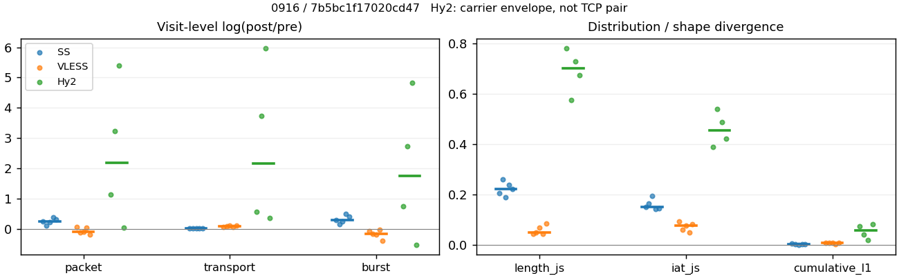
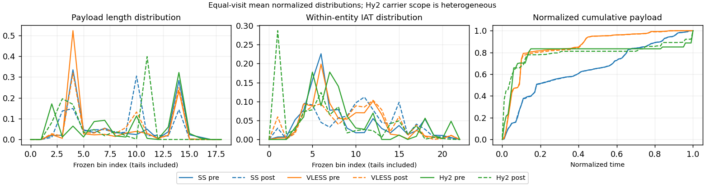

# 0916 · 条目 024 · bing.com

目标：https://www.bing.com/search?q=solar+system+facts

活动标签：bing.com::search_results_view。选定访问 15 次。

[返回总索引](../../README.md) · [统计口径](../../methods.md)

## 覆盖与资格（每次访问均保留）

| 部署 | 重复 | 主请求路由 | 活动状态 | 代理比较 | DIRECT pre | 请求 proxy/direct/unresolved | 错误 |
| --- | --- | --- | --- | --- | --- | --- | --- |
| Hy2 | 1 | direct | passed | 1 | 1 | 2/666/0 | [] |
| Hy2 | 2 | direct | passed | 1 | 1 | 5/707/0 | [] |
| Hy2 | 3 | direct | passed | 1 | 1 | 3/687/0 | [] |
| Hy2 | 4 | direct | passed | 0 | 1 | 0/690/0 | [] |
| Hy2 | 5 | direct | passed | 1 | 1 | 6/668/0 | [] |
| SS | 1 | proxy | passed | 1 | 0 | 634/0/0 | [] |
| SS | 2 | proxy | passed | 1 | 0 | 616/0/0 | [] |
| SS | 3 | proxy | passed | 1 | 0 | 654/0/1 | [] |
| SS | 4 | proxy | passed | 1 | 0 | 354/0/0 | [] |
| SS | 5 | proxy | passed | 1 | 0 | 339/0/0 | [] |
| VLESS | 1 | proxy | passed | 1 | 0 | 734/0/0 | [] |
| VLESS | 2 | proxy | passed | 1 | 0 | 485/0/1 | [] |
| VLESS | 3 | proxy | passed | 1 | 0 | 587/0/0 | [] |
| VLESS | 4 | proxy | passed | 1 | 0 | 323/0/0 | [] |
| VLESS | 5 | proxy | passed | 1 | 0 | 594/0/0 | [] |

主请求非 proxy 的统计仅解释为已索引的辅助代理连接或 DIRECT 观测，不代表目标业务经代理传输。播放确认与配对资格是两道不同的门。

图中散点为单次访问，短线为重复中位数；Hy2 是共享载体包络，不能与 TCP 配对作等范围因果对比。

形态图先逐访问归一化，再对访问等权平均；实线 pre，虚线 post。分箱序号及边界见 methods，不将分箱索引误解为长度或时间。

## 每次访问的关键观测

### SS

范围：`exclusive_page`。每格 pre → post；空值为不可观测/不适用。

| 重复 | 包数 | 载荷字节 | burst | TCP FR | IAT中位µs | length JS | IAT JS |
| --- | --- | --- | --- | --- | --- | --- | --- |
| 1 | 2395 → 3055 | 1.6636e+06 → 1.6971e+06 | 1576 → 2094 | 455 → 488 | 50.259 → 881.31 | 0.20581 | 0.15191 |
| 2 | 2338 → 2604 | 1.6266e+06 → 1.6613e+06 | 1609 → 1889 | 386 → 398 | 42.516 → 1314.1 | 0.25889 | 0.16516 |
| 3 | 3245 → 4069 | 2.6419e+06 → 2.7029e+06 | 2139 → 2725 | 446 → 454 | 34.766 → 530.69 | 0.18953 | 0.19353 |
| 4 | 2174 → 3219 | 1.8812e+06 → 1.938e+06 | 1436 → 2350 | 350 → 360 | 52.948 → 841.99 | 0.23797 | 0.1418 |
| 5 | 2296 → 3185 | 1.8376e+06 → 1.8811e+06 | 1519 → 2292 | 358 → 360 | 46.453 → 824.72 | 0.22189 | 0.14535 |

完整标量统计：中位数 [min,max]；Δ 为重复内逐访问变换的中位数，MAD 未缩放。n 为可用变换数；DIRECT-only 的 nΔ=0 不代表 pre 不可用。

| scope | 特征 | pre | post | Δ | IQRΔ | MADΔ | nΔ |
| --- | --- | --- | --- | --- | --- | --- | --- |
| exclusive_page | active_span_sum_s_1000ms | 65.984 [58.407, 84.481] | 71.139 [66.918, 91.725] | 0.079659 | 0.0070414 | 0.0044319 | 5 |
| exclusive_page | active_span_sum_s_100ms | 7.6007 [6.1699, 7.7825] | 17.121 [15.089, 19.097] | 0.87376 | 0.062534 | 0.023875 | 5 |
| exclusive_page | active_span_sum_s_500ms | 53.613 [45.739, 56.953] | 62.495 [55.888, 72.244] | 0.17441 | 0.048308 | 0.025999 | 5 |
| exclusive_page | burst_bytes_iqr | 1448 [1000, 1759.2] | 1428 [1428, 1456] | 0.0055097 | 0.32378 | 0.21412 | 5 |
| exclusive_page | burst_bytes_mad | 85 [85, 85] | 74 [54, 119] | -0.13859 | 0.5963 | 0.31508 | 5 |
| exclusive_page | burst_bytes_max | 22136 [20688, 24784] | 8812 [8263, 11424] | -0.88723 | 0.19167 | 0.098188 | 5 |
| exclusive_page | burst_bytes_mean | 1209.7 [1011, 1310] | 824.7 [810.46, 991.89] | -0.26422 | 0.16868 | 0.12376 | 5 |
| exclusive_page | burst_bytes_median | 85 [85, 85] | 74 [54, 119] | -0.13859 | 0.5963 | 0.31508 | 5 |
| exclusive_page | burst_bytes_min | 0 [0, 0] | 0 [0, 0] | — | — | — | 0 |
| exclusive_page | burst_bytes_p95 | 5792 [4364.5, 5792] | 2896 [2856, 4284] | -0.69315 | 0.28505 | 0.013908 | 5 |
| exclusive_page | burst_bytes_q25 | 0 [0, 0] | 0 [0, 0] | — | — | — | 0 |
| exclusive_page | burst_bytes_q75 | 1448 [1000, 1759.2] | 1428 [1428, 1456] | 0.0055097 | 0.32378 | 0.21412 | 5 |
| exclusive_page | burst_bytes_std | 2497.9 [2328.4, 2632.2] | 1209.4 [1163.4, 1518.4] | -0.70088 | 0.013247 | 0.0070562 | 5 |
| exclusive_page | burst_count | 1576 [1436, 2139] | 2292 [1889, 2725] | 0.28419 | 0.16924 | 0.12375 | 5 |
| exclusive_page | burst_duration_ms_iqr | 0.059067 [0.038151, 0.10619] | 0.000148 [0.000115, 0.18029] | -5.7038 | 6.7709 | 0.69961 | 5 |
| exclusive_page | burst_duration_ms_mad | 0 [0, 0] | 0 [0, 0] | — | — | — | 0 |
| exclusive_page | burst_duration_ms_max | 14231 [10179, 15001] | 21523 [15226, 36882] | 0.59998 | 0.29581 | 0.19731 | 5 |
| exclusive_page | burst_duration_ms_mean | 100.32 [81.809, 108.52] | 66.205 [61.057, 98.777] | -0.21575 | 0.19646 | 0.19235 | 5 |
| exclusive_page | burst_duration_ms_median | 0 [0, 0] | 0 [0, 0] | — | — | — | 0 |
| exclusive_page | burst_duration_ms_min | 0 [0, 0] | 0 [0, 0] | — | — | — | 0 |
| exclusive_page | burst_duration_ms_p95 | 269.98 [208.75, 375.08] | 172.52 [167.99, 191.03] | -0.47441 | 0.25386 | 0.13154 | 5 |
| exclusive_page | burst_duration_ms_q25 | 0 [0, 0] | 0 [0, 0] | — | — | — | 0 |
| exclusive_page | burst_duration_ms_q75 | 0.059067 [0.038151, 0.10619] | 0.000148 [0.000115, 0.18029] | -5.7038 | 6.7709 | 0.69961 | 5 |
| exclusive_page | burst_duration_ms_std | 609.05 [602.48, 805.17] | 783.32 [641.95, 1086.3] | 0.071659 | 0.19905 | 0.052772 | 5 |
| exclusive_page | burst_packets_iqr | 1 [1, 1] | 1 [1, 1] | 0 | 0 | 0 | 5 |
| exclusive_page | burst_packets_mad | 0 [0, 0] | 0 [0, 0] | — | — | — | 0 |
| exclusive_page | burst_packets_max | 11 [8, 11] | 11 [10, 12] | 0 | 0.09531 | 0.09531 | 5 |
| exclusive_page | burst_packets_mean | 1.5139 [1.4531, 1.5197] | 1.3896 [1.3698, 1.4932] | -0.052682 | 0.043299 | 0.031407 | 5 |
| exclusive_page | burst_packets_median | 1 [1, 1] | 1 [1, 1] | 0 | 0 | 0 | 5 |
| exclusive_page | burst_packets_min | 1 [1, 1] | 1 [1, 1] | 0 | 0 | 0 | 5 |
| exclusive_page | burst_packets_p95 | 3 [3, 3] | 3 [3, 3] | 0 | 0 | 0 | 5 |
| exclusive_page | burst_packets_q25 | 1 [1, 1] | 1 [1, 1] | 0 | 0 | 0 | 5 |
| exclusive_page | burst_packets_q75 | 2 [2, 2] | 2 [2, 2] | 0 | 0 | 0 | 5 |
| exclusive_page | burst_packets_std | 0.98482 [0.7823, 1.0473] | 0.8653 [0.76622, 0.96567] | -0.092867 | 0.045236 | 0.033514 | 5 |
| exclusive_page | connection_span_concurrency_max | 5 [5, 8] | 5 [5, 8] | 0 | 0 | 0 | 5 |
| exclusive_page | cumulative_l1 | — | — | 0.003628 | 0.0012359 | 0.00073233 | 5 |
| exclusive_page | cumulative_max | — | — | 0.023624 | 0.0066515 | 0.0061966 | 5 |
| exclusive_page | direction_entropy | 0.94949 [0.90724, 0.99994] | 0.71142 [0.65972, 0.82919] | -0.19993 | 0.021706 | 0.017609 | 5 |
| exclusive_page | down_burst_count | 783 [713, 1064] | 1140 [940, 1357] | 0.28672 | 0.17148 | 0.12546 | 5 |
| exclusive_page | down_ip_bytes | 1.7884e+06 [1.5542e+06, 2.5936e+06] | 1.8291e+06 [1.5666e+06, 2.6566e+06] | 0.022502 | 0.0064589 | 0.0046808 | 5 |
| exclusive_page | down_packets | 1254 [1210, 1831] | 1701 [1354, 2340] | 0.2714 | 0.032061 | 0.026113 | 5 |
| exclusive_page | down_transport_bytes | 1.7213e+06 [1.4912e+06, 2.4983e+06] | 1.7402e+06 [1.4957e+06, 2.5347e+06] | 0.010961 | 0.0088608 | 0.003512 | 5 |
| exclusive_page | duration_s | 64.873 [61.847, 67.081] | 64.946 [61.846, 67.079] | -8.6753e-06 | 0.00078018 | 1.4985e-05 | 5 |
| exclusive_page | entity_count | 10 [9, 14] | 10 [9, 14] | 0 | 0 | 0 | 5 |
| exclusive_page | fr_runs | 386 [350, 455] | 398 [360, 488] | 0.028171 | 0.012836 | 0.010393 | 5 |
| exclusive_page | fr_runs_per_packet | 0.27387 [0.22825, 0.32338] | 0.20327 [0.1883, 0.27838] | -0.045003 | 0.029853 | 0.024796 | 5 |
| exclusive_page | fr_switches | 377 [340, 445] | 389 [346, 478] | 0.028988 | 0.01311 | 0.010764 | 5 |
| exclusive_page | fr_switches_per_possible_transition | 0.26814 [0.22388, 0.31854] | 0.19693 [0.18458, 0.27424] | -0.0443 | 0.029004 | 0.024001 | 5 |
| exclusive_page | full_retransmission_fraction | 0.0036799 [0.0030488, 0.0045929] | 0.011905 [0.005161, 0.01964] | 0.008483 | 0.0029807 | 0.0024379 | 5 |
| exclusive_page | full_retransmission_packets | 8 [7, 12] | 35 [21, 60] | 1.6094 | 0.3419 | 0.16127 | 5 |
| exclusive_page | iat_count | 2329 [2164, 3234] | 3171 [2595, 4058] | 0.2443 | 0.10202 | 0.084693 | 5 |
| exclusive_page | iat_js | — | — | 0.15191 | 0.01981 | 0.010113 | 5 |
| exclusive_page | iat_ks | — | — | 0.30614 | 0.024424 | 0.011911 | 5 |
| exclusive_page | iat_median_us | 46.453 [34.766, 52.948] | 841.99 [530.69, 1314.1] | 2.8642 | 0.11014 | 0.097758 | 5 |
| exclusive_page | iat_us_iqr | 2553.6 [297.18, 3345.4] | 5363.6 [3164.8, 16337] | 1.2131 | 0.74326 | 0.41386 | 5 |
| exclusive_page | iat_us_mad | 41.278 [27.161, 47.273] | 828.49 [521.57, 1307.9] | 2.9705 | 0.02857 | 0.01548 | 5 |
| exclusive_page | iat_us_max | 1.5001e+07 [1.5001e+07, 1.5001e+07] | 1.536e+07 [1.5226e+07, 1.5499e+07] | 0.023642 | 0.0023891 | 0.0018286 | 5 |
| exclusive_page | iat_us_mean | 1.1065e+05 [67147, 1.2999e+05] | 82869 [53569, 99304] | -0.24339 | 0.10471 | 0.087244 | 5 |
| exclusive_page | iat_us_median | 46.453 [34.766, 52.948] | 841.99 [530.69, 1314.1] | 2.8642 | 0.11014 | 0.097758 | 5 |
| exclusive_page | iat_us_min | 0.162 [0.029, 0.197] | 0.036 [0.034, 0.038] | -1.45 | 1.615 | 0.24967 | 5 |
| exclusive_page | iat_us_p95 | 2.4425e+05 [2.0551e+05, 2.8176e+05] | 1.7235e+05 [1.7062e+05, 2.263e+05] | -0.21922 | 0.10546 | 0.033175 | 5 |
| exclusive_page | iat_us_q25 | 15.964 [13.591, 18.968] | 21.352 [19.366, 32.923] | 0.38443 | 0.12025 | 0.098378 | 5 |
| exclusive_page | iat_us_q75 | 2569.6 [310.77, 3364.3] | 5382.9 [3184.8, 16359] | 1.21 | 0.74179 | 0.41258 | 5 |
| exclusive_page | iat_us_std | 8.5928e+05 [6.1669e+05, 1.0544e+06] | 7.8002e+05 [5.4948e+05, 8.1156e+05] | -0.12801 | 0.045222 | 0.032601 | 5 |
| exclusive_page | iat_wasserstein_log1p_us | — | — | 1.2842 | 0.1155 | 0.030214 | 5 |
| exclusive_page | idle_gap_count_1000ms | 37 [32, 41] | 33 [31, 37] | -0.077962 | 0.05557 | 0.036449 | 5 |
| exclusive_page | idle_gap_count_100ms | 254 [231, 277] | 253 [246, 316] | 0.037271 | 0.063717 | 0.041216 | 5 |
| exclusive_page | idle_gap_count_500ms | 60 [45, 81] | 52 [40, 63] | -0.1431 | 0.062776 | 0.025318 | 5 |
| exclusive_page | idle_gap_sum_s_1000ms | 183.8 [151.37, 222.89] | 177.66 [149.03, 191.64] | -0.03395 | 0.011822 | 0.0066054 | 5 |
| exclusive_page | idle_gap_sum_s_100ms | 253.16 [209.9, 275.13] | 238.6 [200.71, 245.66] | -0.044747 | 0.0045244 | 0.0029146 | 5 |
| exclusive_page | idle_gap_sum_s_500ms | 207.15 [160.2, 235.56] | 195.04 [154.89, 204.25] | -0.046855 | 0.048618 | 0.013124 | 5 |
| exclusive_page | ip_bytes | 1.9573e+06 [1.7484e+06, 2.811e+06] | 2.0644e+06 [1.8061e+06, 2.9377e+06] | 0.044093 | 0.0092759 | 0.0091931 | 5 |
| exclusive_page | length_iqr | 2783 [1746.5, 2802] | 1310 [1237, 1330] | -0.74515 | 0.37452 | 0.014348 | 5 |
| exclusive_page | length_js | — | — | 0.22189 | 0.032161 | 0.016084 | 5 |
| exclusive_page | length_ks | — | — | 0.31893 | 0.070742 | 0.038633 | 5 |
| exclusive_page | length_mad | 841 [119, 1249] | 940 [580, 1181] | 0.23989 | 1.519 | 0.37408 | 5 |
| exclusive_page | length_max | 8948 [8948, 8948] | 4284 [4284, 4412] | -0.73654 | 0 | 0 | 5 |
| exclusive_page | length_mean | 1352 [1182.3, 1472] | 1073.7 [968.12, 1152.9] | -0.1999 | 0.090032 | 0.077461 | 5 |
| exclusive_page | length_median | 926 [154, 1334] | 1336 [892, 1428] | 0.31904 | 1.3843 | 0.25095 | 5 |
| exclusive_page | length_min | 18 [4, 31] | 3 [2, 18] | -2.1972 | 2.0477 | 0.54362 | 5 |
| exclusive_page | length_p95 | 2896 [2896, 4096] | 2856 [2856, 2856] | -0.013908 | 0.34668 | 0 | 5 |
| exclusive_page | length_q25 | 94 [86, 113] | 118 [118, 191] | 0.22739 | 0.1126 | 0.088947 | 5 |
| exclusive_page | length_q75 | 2896 [1832.5, 2896] | 1428 [1428, 1448] | -0.69315 | 0.42517 | 0.013908 | 5 |
| exclusive_page | length_std | 1308.7 [1261.6, 1720.4] | 933.64 [870.79, 1001.6] | -0.31829 | 0.307 | 0.050891 | 5 |
| exclusive_page | length_wasserstein_bytes | — | — | 408.35 | 149.72 | 55.731 | 5 |
| exclusive_page | nonempty_entity_count | 10 [9, 14] | 10 [9, 14] | 0 | 0 | 0 | 5 |
| exclusive_page | nonempty_packets | 1342 [1278, 1954] | 1771 [1441, 2411] | 0.21987 | 0.090591 | 0.080885 | 5 |
| exclusive_page | offload_suspect_fraction | 0.22928 [0.16367, 0.25667] | 0.098167 [0.086022, 0.14451] | -0.084769 | 0.04636 | 0.011438 | 5 |
| exclusive_page | packet_count | 2338 [2174, 3245] | 3185 [2604, 4069] | 0.2434 | 0.101 | 0.083887 | 5 |
| exclusive_page | rtt_median_ms | 0.073123 [0.06405, 0.087628] | 31.95 [26.657, 32.445] | 5.9216 | 0.20761 | 0.19043 | 5 |
| exclusive_page | rtt_sample_count | 1056 [915, 1363] | 832 [722, 914] | -0.24219 | 0.0065826 | 0.0052928 | 5 |
| exclusive_page | tcp_ack_count | 2329 [2161, 3234] | 3168 [2594, 4056] | 0.24383 | 0.10157 | 0.084222 | 5 |
| exclusive_page | tcp_fin_count | 19 [17, 26] | 23 [21, 29] | 0.1466 | 0.044951 | 0.037404 | 5 |
| exclusive_page | tcp_packet_count | 2338 [2174, 3245] | 3185 [2604, 4069] | 0.2434 | 0.101 | 0.083887 | 5 |
| exclusive_page | tcp_rst_count | 1 [0, 4] | 1 [0, 3] | 0 | 0.34657 | 0 | 3 |
| exclusive_page | tcp_syn_count | 20 [18, 28] | 24 [19, 31] | 0.09531 | 0.014771 | 0.0082988 | 5 |
| exclusive_page | tcp_window_raw_median | 65450 [65302, 65451] | 140 [137, 152] | -6.1474 | 0.047201 | 0.021646 | 5 |
| exclusive_page | transition_entropy | 0.80508 [0.74962, 0.90278] | 0.61656 [0.5811, 0.76387] | -0.16853 | 0.024221 | 0.017253 | 5 |
| exclusive_page | transition_n_mm | 671 [443, 1011] | 1247 [865, 1772] | 0.64506 | 0.10593 | 0.081834 | 5 |
| exclusive_page | transition_n_mp | 184 [166, 219] | 190 [167, 236] | 0.029676 | 0.013396 | 0.010984 | 5 |
| exclusive_page | transition_n_pm | 193 [174, 226] | 199 [179, 242] | 0.028331 | 0.012836 | 0.010552 | 5 |
| exclusive_page | transition_n_pp | 481 [243, 513] | 178 [164, 185] | -0.98291 | 0.55115 | 0.075582 | 5 |
| exclusive_page | transition_p_mm | 0.80167 [0.68261, 0.82666] | 0.8819 [0.81991, 0.89135] | 0.080396 | 0.041973 | 0.015704 | 5 |
| exclusive_page | transition_p_mp | 0.19833 [0.17334, 0.31739] | 0.1181 [0.10865, 0.18009] | -0.080396 | 0.041973 | 0.015704 | 5 |
| exclusive_page | transition_p_pm | 0.31966 [0.27337, 0.4228] | 0.52785 [0.51884, 0.57346] | 0.24125 | 0.13867 | 0.013232 | 5 |
| exclusive_page | transition_p_pp | 0.68034 [0.5772, 0.72663] | 0.47215 [0.42654, 0.48116] | -0.24125 | 0.13867 | 0.013232 | 5 |
| exclusive_page | transport_bytes | 1.8376e+06 [1.6266e+06, 2.6419e+06] | 1.8811e+06 [1.6613e+06, 2.7029e+06] | 0.022829 | 0.002306 | 0.0017464 | 5 |
| exclusive_page | up_burst_count | 793 [723, 1075] | 1152 [949, 1368] | 0.28167 | 0.16704 | 0.12206 | 5 |
| exclusive_page | up_byte_fraction | 0.063298 [0.054355, 0.084737] | 0.074867 [0.062224, 0.099695] | 0.013736 | 0.00342 | 0.0021667 | 5 |
| exclusive_page | up_ip_bytes | 1.9425e+05 [1.6002e+05, 2.1736e+05] | 2.395e+05 [2.353e+05, 2.8112e+05] | 0.25722 | 0.099558 | 0.047848 | 5 |
| exclusive_page | up_packets | 1128 [946, 1414] | 1484 [1250, 1729] | 0.21168 | 0.18664 | 0.10899 | 5 |
| exclusive_page | up_transport_bytes | 1.3543e+05 [1.1069e+05, 1.436e+05] | 1.6562e+05 [1.4083e+05, 1.6819e+05] | 0.19125 | 0.031073 | 0.02106 | 5 |
| exclusive_page | zero_iat_count | 0 [0, 0] | 0 [0, 0] | — | — | — | 0 |
| exclusive_page | zero_iat_fraction | 0 [0, 0] | 0 [0, 0] | 0 | 0 | 0 | 5 |

### VLESS

范围：`exclusive_page`。每格 pre → post；空值为不可观测/不适用。

| 重复 | 包数 | 载荷字节 | burst | TCP FR | IAT中位µs | length JS | IAT JS |
| --- | --- | --- | --- | --- | --- | --- | --- |
| 1 | 2903 → 3103 | 1.6081e+06 → 1.7048e+06 | 1926 → 1774 | 541 → 566 | 233.93 → 791.33 | 0.044018 | 0.094453 |
| 2 | 1158 → 1029 | 5.5471e+05 → 6.1218e+05 | 841 → 723 | 74 → 88 | 64.278 → 468.17 | 0.049697 | 0.061831 |
| 3 | 1106 → 1006 | 5.375e+05 → 6.0039e+05 | 796 → 654 | 64 → 80 | 54.255 → 478.87 | 0.068647 | 0.075765 |
| 4 | 1599 → 1677 | 1.0734e+06 → 1.1467e+06 | 1051 → 1035 | 118 → 136 | 168.69 → 424.77 | 0.043813 | 0.048345 |
| 5 | 1029 → 861 | 5.097e+05 → 5.6542e+05 | 755 → 515 | 62 → 76 | 53.286 → 541.43 | 0.085692 | 0.082665 |

完整标量统计：中位数 [min,max]；Δ 为重复内逐访问变换的中位数，MAD 未缩放。n 为可用变换数；DIRECT-only 的 nΔ=0 不代表 pre 不可用。

| scope | 特征 | pre | post | Δ | IQRΔ | MADΔ | nΔ |
| --- | --- | --- | --- | --- | --- | --- | --- |
| exclusive_page | active_span_sum_s_1000ms | 11.124 [9.5581, 63.212] | 11.181 [9.5356, 62.927] | -0.0023587 | 0.0096037 | 0.0074494 | 5 |
| exclusive_page | active_span_sum_s_100ms | 1.8103 [1.5663, 5.2416] | 4.532 [3.7383, 19.425] | 0.86994 | 0.093294 | 0.031509 | 5 |
| exclusive_page | active_span_sum_s_500ms | 6.5592 [5.0342, 54.084] | 11.181 [9.5356, 62.052] | 0.5333 | 0.19884 | 0.10546 | 5 |
| exclusive_page | burst_bytes_iqr | 590 [524.5, 2161.5] | 2302 [1520, 2824] | 1.085 | 1.14 | 0.53548 | 5 |
| exclusive_page | burst_bytes_mad | 31 [24, 85] | 72 [31, 85] | 0.25593 | 0.5363 | 0.25593 | 5 |
| exclusive_page | burst_bytes_max | 20200 [5720, 21192] | 8507 [6502, 13124] | -0.43124 | 0.98565 | 0.48526 | 5 |
| exclusive_page | burst_bytes_mean | 675.25 [659.58, 1021.3] | 960.99 [846.72, 1107.9] | 0.24976 | 0.16655 | 0.10917 | 5 |
| exclusive_page | burst_bytes_median | 31 [24, 85] | 72 [31, 85] | 0.25593 | 0.5363 | 0.25593 | 5 |
| exclusive_page | burst_bytes_min | 0 [0, 0] | 0 [0, 0] | — | — | — | 0 |
| exclusive_page | burst_bytes_p95 | 2896 [2896, 2896] | 2896 [2896, 2896] | 0 | 0 | 0 | 5 |
| exclusive_page | burst_bytes_q25 | 0 [0, 0] | 0 [0, 0] | — | — | — | 0 |
| exclusive_page | burst_bytes_q75 | 590 [524.5, 2161.5] | 2302 [1520, 2824] | 1.085 | 1.14 | 0.53548 | 5 |
| exclusive_page | burst_bytes_std | 1423.9 [1152, 1928] | 1293.6 [1214, 1393.4] | -0.088489 | 0.29373 | 0.17626 | 5 |
| exclusive_page | burst_count | 841 [755, 1926] | 723 [515, 1774] | -0.15118 | 0.11428 | 0.068974 | 5 |
| exclusive_page | burst_duration_ms_iqr | 0.058159 [0.03536, 1.0002] | 1.6999 [0, 4.5777] | 1.3009 | 1.8946 | 1.405 | 4 |
| exclusive_page | burst_duration_ms_mad | 0 [0, 0] | 0 [0, 0] | — | — | — | 0 |
| exclusive_page | burst_duration_ms_max | 14960 [13681, 15001] | 15062 [15014, 15116] | 0.0055722 | 0.0028092 | 0.0015145 | 5 |
| exclusive_page | burst_duration_ms_mean | 63.156 [50.728, 83.231] | 107.42 [79.083, 139.59] | 0.66662 | 0.22796 | 0.095203 | 5 |
| exclusive_page | burst_duration_ms_median | 0 [0, 0] | 0 [0, 0] | — | — | — | 0 |
| exclusive_page | burst_duration_ms_min | 0 [0, 0] | 0 [0, 0] | — | — | — | 0 |
| exclusive_page | burst_duration_ms_p95 | 13.687 [9.9368, 200.31] | 132.79 [114.67, 157.35] | 2.2723 | 2.6579 | 0.29841 | 5 |
| exclusive_page | burst_duration_ms_q25 | 0 [0, 0] | 0 [0, 0] | — | — | — | 0 |
| exclusive_page | burst_duration_ms_q75 | 0.058159 [0.03536, 1.0002] | 1.6999 [0, 4.5777] | 1.3009 | 1.8946 | 1.405 | 4 |
| exclusive_page | burst_duration_ms_std | 729.86 [607.96, 800.5] | 1174.2 [938.66, 1354.4] | 0.52566 | 0.074997 | 0.05574 | 5 |
| exclusive_page | burst_packets_iqr | 1 [1, 1] | 1 [0, 1] | 0 | 0 | 0 | 4 |
| exclusive_page | burst_packets_mad | 0 [0, 0] | 0 [0, 0] | — | — | — | 0 |
| exclusive_page | burst_packets_max | 8 [5, 15] | 12 [11, 13] | 0.40547 | 1.0186 | 0.47 | 5 |
| exclusive_page | burst_packets_mean | 1.3894 [1.3629, 1.5214] | 1.6203 [1.4232, 1.7492] | 0.10172 | 0.085864 | 0.047109 | 5 |
| exclusive_page | burst_packets_median | 1 [1, 1] | 1 [1, 1] | 0 | 0 | 0 | 5 |
| exclusive_page | burst_packets_min | 1 [1, 1] | 1 [1, 1] | 0 | 0 | 0 | 5 |
| exclusive_page | burst_packets_p95 | 3 [2, 3] | 4 [3, 4] | 0.28768 | 0.11778 | 0.11778 | 5 |
| exclusive_page | burst_packets_q25 | 1 [1, 1] | 1 [1, 1] | 0 | 0 | 0 | 5 |
| exclusive_page | burst_packets_q75 | 2 [2, 2] | 2 [1, 2] | 0 | 0 | 0 | 5 |
| exclusive_page | burst_packets_std | 0.68529 [0.58061, 1.0579] | 1.126 [1.105, 1.3019] | 0.61385 | 0.34185 | 0.13579 | 5 |
| exclusive_page | connection_span_concurrency_max | 4 [4, 8] | 4 [4, 8] | 0 | 0 | 0 | 5 |
| exclusive_page | cumulative_l1 | — | — | 0.0084017 | 0.00010895 | 8.7814e-05 | 5 |
| exclusive_page | cumulative_max | — | — | 0.036259 | 0.013493 | 0.0068021 | 5 |
| exclusive_page | direction_entropy | 0.97752 [0.81576, 0.98732] | 0.71847 [0.62447, 0.79556] | -0.25945 | 0.0694 | 0.0094003 | 5 |
| exclusive_page | down_burst_count | 417 [374, 957] | 358 [254, 882] | -0.15255 | 0.11709 | 0.070942 | 5 |
| exclusive_page | down_ip_bytes | 5.4268e+05 [4.9671e+05, 1.5985e+06] | 5.8408e+05 [5.3698e+05, 1.6807e+06] | 0.073511 | 0.023279 | 0.011006 | 5 |
| exclusive_page | down_packets | 612 [534, 1681] | 549 [485, 1804] | -0.060195 | 0.13686 | 0.048439 | 5 |
| exclusive_page | down_transport_bytes | 5.108e+05 [4.6889e+05, 1.511e+06] | 5.5547e+05 [5.117e+05, 1.5868e+06] | 0.08384 | 0.032023 | 0.0089215 | 5 |
| exclusive_page | duration_s | 65.853 [62.871, 67.934] | 65.836 [62.898, 67.891] | -0.00025551 | 0.00023263 | 0.00022179 | 5 |
| exclusive_page | entity_count | 8 [7, 12] | 8 [7, 12] | 0 | 0 | 0 | 5 |
| exclusive_page | fr_runs | 74 [62, 541] | 88 [76, 566] | 0.17327 | 0.061629 | 0.031301 | 5 |
| exclusive_page | fr_runs_per_packet | 0.11402 [0.10339, 0.30721] | 0.16379 [0.14137, 0.3178] | 0.050454 | 0.034825 | 0.0053256 | 5 |
| exclusive_page | fr_switches | 67 [55, 529] | 81 [69, 554] | 0.18976 | 0.073934 | 0.037017 | 5 |
| exclusive_page | fr_switches_per_possible_transition | 0.10436 [0.091653, 0.30246] | 0.15098 [0.13326, 0.31317] | 0.048972 | 0.033065 | 0.0050109 | 5 |
| exclusive_page | full_retransmission_fraction | 0.00090416 [0, 0.0029155] | 0.00032227 [0, 0.00099404] | 8.9877e-05 | 0.001359 | 0.00023239 | 5 |
| exclusive_page | full_retransmission_packets | 1 [0, 3] | 1 [0, 1] | 0 | 0 | 0 | 2 |
| exclusive_page | iat_count | 1151 [1022, 2891] | 1022 [854, 3091] | -0.095492 | 0.16676 | 0.084093 | 5 |
| exclusive_page | iat_js | — | — | 0.075765 | 0.020834 | 0.013934 | 5 |
| exclusive_page | iat_ks | — | — | 0.13911 | 0.055934 | 0.032546 | 5 |
| exclusive_page | iat_median_us | 64.278 [53.286, 233.93] | 478.87 [424.77, 791.33] | 1.9856 | 0.95904 | 0.33291 | 5 |
| exclusive_page | iat_us_iqr | 1771.3 [1078.8, 3318.6] | 3897.6 [2912.5, 8050.8] | 0.88624 | 0.15636 | 0.083219 | 5 |
| exclusive_page | iat_us_mad | 57.877 [45.898, 227.18] | 473.62 [420.17, 790.65] | 2.0765 | 1.0354 | 0.37732 | 5 |
| exclusive_page | iat_us_max | 1.5001e+07 [1.5001e+07, 1.5001e+07] | 1.5393e+07 [1.5365e+07, 1.5447e+07] | 0.025779 | 0.0041315 | 0.001838 | 5 |
| exclusive_page | iat_us_mean | 1.5073e+05 [1.0265e+05, 1.8931e+05] | 1.8008e+05 [95831, 2.0804e+05] | 0.094338 | 0.16644 | 0.083577 | 5 |
| exclusive_page | iat_us_median | 64.278 [53.286, 233.93] | 478.87 [424.77, 791.33] | 1.9856 | 0.95904 | 0.33291 | 5 |
| exclusive_page | iat_us_min | 0.132 [0.009, 0.309] | 0.036 [0.033, 0.037] | -1.2993 | 1.1738 | 0.9077 | 5 |
| exclusive_page | iat_us_p95 | 40195 [15693, 1.9933e+05] | 1.0909e+05 [81693, 1.5483e+05] | 1.0251 | 0.85628 | 0.54044 | 5 |
| exclusive_page | iat_us_q25 | 21.461 [20.54, 39.481] | 22.846 [21.261, 26.512] | 0.034512 | 0.42287 | 0.19749 | 5 |
| exclusive_page | iat_us_q75 | 1805 [1099.8, 3358.1] | 3924.1 [2936, 8073.5] | 0.87722 | 0.15397 | 0.083608 | 5 |
| exclusive_page | iat_us_std | 1.3998e+06 [1.0009e+06, 1.5731e+06] | 1.5287e+06 [9.7219e+05, 1.6547e+06] | 0.050535 | 0.072549 | 0.037523 | 5 |
| exclusive_page | iat_wasserstein_log1p_us | — | — | 0.84506 | 0.071166 | 0.058221 | 5 |
| exclusive_page | idle_gap_count_1000ms | 18 [13, 23] | 18 [13, 22] | 0 | 0.044452 | 0 | 5 |
| exclusive_page | idle_gap_count_100ms | 51 [38, 285] | 55 [45, 290] | 0.075508 | 0.078643 | 0.058116 | 5 |
| exclusive_page | idle_gap_count_500ms | 26 [20, 36] | 18 [13, 23] | -0.43078 | 0.023142 | 0.017242 | 5 |
| exclusive_page | idle_gap_sum_s_1000ms | 200.7 [144.48, 233.56] | 200.36 [144.25, 233.29] | -0.0016255 | 0.00048347 | 0.00044653 | 5 |
| exclusive_page | idle_gap_sum_s_100ms | 210.06 [152.48, 291.53] | 207.01 [150.05, 276.79] | -0.01606 | 0.0033578 | 0.0018986 | 5 |
| exclusive_page | idle_gap_sum_s_500ms | 205.26 [149.01, 242.69] | 200.36 [144.25, 234.16] | -0.02837 | 0.0051591 | 0.0040859 | 5 |
| exclusive_page | ip_bytes | 6.1489e+05 [5.6321e+05, 1.759e+06] | 6.6604e+05 [6.1067e+05, 1.8678e+06] | 0.079895 | 0.015482 | 0.013417 | 5 |
| exclusive_page | length_iqr | 1364 [1363, 2752] | 2752 [1328, 2752] | 0.38483 | 0.5022 | 0.31781 | 5 |
| exclusive_page | length_js | — | — | 0.049697 | 0.024629 | 0.0058841 | 5 |
| exclusive_page | length_ks | — | — | 0.23422 | 0.10468 | 0.037321 | 5 |
| exclusive_page | length_mad | 22 [22, 126] | 788 [559, 1140] | 3.537 | 0.80765 | 0.41074 | 5 |
| exclusive_page | length_max | 5648 [4096, 8948] | 2824 [2824, 2896] | -0.69315 | 0.75624 | 0.32129 | 5 |
| exclusive_page | length_mean | 887.97 [854.71, 1112.3] | 1168.3 [957.21, 1218.6] | 0.28492 | 0.24335 | 0.031574 | 5 |
| exclusive_page | length_median | 94 [94, 161] | 860 [631, 1212] | 2.1757 | 0.21123 | 0.17332 | 5 |
| exclusive_page | length_min | 24 [5, 24] | 5 [3, 24] | 0 | 1.5686 | 0 | 5 |
| exclusive_page | length_p95 | 2824 [2824, 2824] | 2824 [2824, 2824] | 0 | 0 | 0 | 5 |
| exclusive_page | length_q25 | 84 [72, 85] | 72 [72, 84] | -0.10536 | 0.16599 | 0.060625 | 5 |
| exclusive_page | length_q75 | 1448 [1448, 2824] | 2824 [1412, 2824] | 0.35966 | 0.48111 | 0.30831 | 5 |
| exclusive_page | length_std | 1122.8 [1118.6, 1254.1] | 1125.6 [968.14, 1136.7] | -0.042598 | 0.09586 | 0.054946 | 5 |
| exclusive_page | length_wasserstein_bytes | — | — | 294.99 | 132.6 | 55.617 | 5 |
| exclusive_page | nonempty_entity_count | 8 [7, 12] | 8 [7, 12] | 0 | 0 | 0 | 5 |
| exclusive_page | nonempty_packets | 649 [574, 1761] | 524 [464, 1781] | -0.17428 | 0.20963 | 0.039665 | 5 |
| exclusive_page | offload_suspect_fraction | 0.14296 [0.13558, 0.20013] | 0.15646 [0.10506, 0.16935] | 0.0063381 | 0.049761 | 0.014546 | 5 |
| exclusive_page | packet_count | 1158 [1029, 2903] | 1029 [861, 3103] | -0.094768 | 0.16573 | 0.08348 | 5 |
| exclusive_page | rtt_median_ms | 0.087721 [0.062815, 0.17976] | 2.3655 [0.053, 3.4671] | 2.5771 | 2.9101 | 1.2804 | 5 |
| exclusive_page | rtt_sample_count | 466 [417, 1256] | 462 [350, 1325] | -0.0046189 | 0.062101 | 0.058099 | 5 |
| exclusive_page | tcp_ack_count | 1138 [1010, 2871] | 1022 [854, 3090] | -0.081737 | 0.16615 | 0.086037 | 5 |
| exclusive_page | tcp_fin_count | 15 [12, 24] | 16 [14, 24] | 0.064539 | 0.01695 | 0.0095695 | 5 |
| exclusive_page | tcp_packet_count | 1158 [1029, 2903] | 1029 [861, 3103] | -0.094768 | 0.16573 | 0.08348 | 5 |
| exclusive_page | tcp_rst_count | 15 [12, 20] | 0 [0, 1] | -2.9957 | — | — | 1 |
| exclusive_page | tcp_syn_count | 16 [14, 24] | 16 [14, 24] | 0 | 0 | 0 | 5 |
| exclusive_page | tcp_window_raw_median | 65347 [65278, 65535] | 157 [154, 231] | -6.0312 | 0.083054 | 0.018237 | 5 |
| exclusive_page | transition_entropy | 0.47678 [0.43497, 0.85826] | 0.53181 [0.47555, 0.77388] | 0.068507 | 0.076478 | 0.0087117 | 5 |
| exclusive_page | transition_n_mm | 342 [294, 843] | 377 [334, 1070] | 0.12711 | 0.010786 | 0.010335 | 5 |
| exclusive_page | transition_n_mp | 30 [24, 259] | 37 [31, 271] | 0.20972 | 0.090419 | 0.046213 | 5 |
| exclusive_page | transition_n_pm | 37 [31, 270] | 44 [38, 283] | 0.17327 | 0.061629 | 0.031301 | 5 |
| exclusive_page | transition_n_pp | 223 [185, 377] | 63 [54, 145] | -1.264 | 0.40118 | 0.13147 | 5 |
| exclusive_page | transition_p_mm | 0.92453 [0.76497, 0.93258] | 0.91507 [0.79791, 0.92653] | -0.0089432 | 0.0062101 | 0.0018807 | 5 |
| exclusive_page | transition_p_mp | 0.075472 [0.067416, 0.23503] | 0.084932 [0.073474, 0.20209] | 0.0089432 | 0.0062101 | 0.0018807 | 5 |
| exclusive_page | transition_p_pm | 0.13704 [0.1245, 0.41731] | 0.42308 [0.38835, 0.66121] | 0.26286 | 0.042136 | 0.023181 | 5 |
| exclusive_page | transition_p_pp | 0.86296 [0.58269, 0.8755] | 0.57692 [0.33879, 0.61165] | -0.26286 | 0.042136 | 0.023181 | 5 |
| exclusive_page | transport_bytes | 5.5471e+05 [5.097e+05, 1.6081e+06] | 6.1218e+05 [5.6542e+05, 1.7048e+06] | 0.098576 | 0.037694 | 0.012069 | 5 |
| exclusive_page | up_burst_count | 424 [381, 969] | 365 [261, 892] | -0.14984 | 0.11154 | 0.067038 | 5 |
| exclusive_page | up_byte_fraction | 0.079153 [0.060368, 0.08242] | 0.092624 [0.06923, 0.098684] | 0.01347 | 0.0050318 | 0.0027937 | 5 |
| exclusive_page | up_ip_bytes | 72211 [66497, 1.6048e+05] | 83465 [73690, 1.8711e+05] | 0.15352 | 0.028885 | 0.010234 | 5 |
| exclusive_page | up_packets | 546 [495, 1222] | 480 [376, 1299] | -0.12883 | 0.1922 | 0.14614 | 5 |
| exclusive_page | up_transport_bytes | 44301 [40809, 97079] | 59249 [53714, 1.1802e+05] | 0.25574 | 0.075135 | 0.035006 | 5 |
| exclusive_page | zero_iat_count | 0 [0, 0] | 0 [0, 0] | — | — | — | 0 |
| exclusive_page | zero_iat_fraction | 0 [0, 0] | 0 [0, 0] | 0 | 0 | 0 | 5 |

### Hy2

范围：`carrier_context_envelope`。每格 pre → post；空值为不可观测/不适用。

| 重复 | 包数 | 载荷字节 | burst | TCP FR | IAT中位µs | length JS | IAT JS |
| --- | --- | --- | --- | --- | --- | --- | --- |
| 1 | 32 → 99 | 14218 → 24889 | 24 → 51 | — | 58.406 → 194.31 | 0.77876 | 0.38887 |
| 2 | 111 → 2803 | 62760 → 2.6524e+06 | 77 → 1182 | — | 147.7 → 6.6285 | 0.57509 | 0.5387 |
| 3 | 95 → 21001 | 57360 → 2.223e+07 | 63 → 7855 | — | 76.609 → 3.857 | 0.72743 | 0.48828 |
| 4 | — | — | — | — | — | — | — |
| 5 | 86 → 89 | 31227 → 45002 | 62 → 37 | — | 79.356 → 139.09 | 0.67324 | 0.42067 |

范围：`direct_pre_only`。每格 pre → post；空值为不可观测/不适用。

| 重复 | 包数 | 载荷字节 | burst | TCP FR | IAT中位µs | length JS | IAT JS |
| --- | --- | --- | --- | --- | --- | --- | --- |
| 1 | 1807 → — | 1.2167e+06 → — | 1163 → — | 475 → — | 125.4 → — | — | — |
| 2 | 2207 → — | 2.3139e+06 → — | 1418 → — | 538 → — | 110.88 → — | — | — |
| 3 | 2051 → — | 2.2452e+06 → — | 1291 → — | 454 → — | 100.73 → — | — | — |
| 4 | 1936 → — | 1.2524e+06 → — | 1225 → — | 503 → — | 126.06 → — | — | — |
| 5 | 2056 → — | 2.237e+06 → — | 1302 → — | 476 → — | 100.16 → — | — | — |

完整标量统计：中位数 [min,max]；Δ 为重复内逐访问变换的中位数，MAD 未缩放。n 为可用变换数；DIRECT-only 的 nΔ=0 不代表 pre 不可用。

| scope | 特征 | pre | post | Δ | IQRΔ | MADΔ | nΔ |
| --- | --- | --- | --- | --- | --- | --- | --- |
| carrier_context_envelope | active_span_sum_s_1000ms | 2.4763 [0.40916, 3.4051] | 4.6511 [2.1547, 11.773] | 0.99771 | 0.77559 | 0.52583 | 4 |
| carrier_context_envelope | active_span_sum_s_100ms | 0.033734 [0.0066257, 0.2195] | 1.2462 [0.50868, 3.3028] | 3.5782 | 2.019 | 1.0022 | 4 |
| carrier_context_envelope | active_span_sum_s_500ms | 1.4233 [0.40916, 3.1688] | 3.943 [1.303, 10.929] | 1.0806 | 1.3207 | 0.84483 | 4 |
| carrier_context_envelope | burst_bytes_iqr | 845.62 [204.75, 903] | 2606.5 [397.5, 2786] | 1.1921 | 0.92118 | 0.67381 | 4 |
| carrier_context_envelope | burst_bytes_mad | 0 [0, 0] | 126.25 [90, 263] | — | — | — | 0 |
| carrier_context_envelope | burst_bytes_max | 5156.5 [2834, 9552] | 28703 [3623, 2.5037e+05] | 1.6112 | 1.0816 | 0.79162 | 4 |
| carrier_context_envelope | burst_bytes_mean | 703.74 [503.66, 910.48] | 1730.1 [488.02, 2830.1] | 0.94719 | 0.43031 | 0.12622 | 4 |
| carrier_context_envelope | burst_bytes_median | 0 [0, 0] | 161.25 [123, 300] | — | — | — | 0 |
| carrier_context_envelope | burst_bytes_min | 0 [0, 0] | 22 [22, 22] | — | — | — | 0 |
| carrier_context_envelope | burst_bytes_p95 | 3559 [2730.6, 4697.8] | 5612.5 [2404, 8646] | 0.36181 | 0.56184 | 0.25858 | 4 |
| carrier_context_envelope | burst_bytes_q25 | 0 [0, 0] | 64.5 [33, 100] | — | — | — | 0 |
| carrier_context_envelope | burst_bytes_q75 | 845.62 [204.75, 903] | 2673 [430.5, 2882] | 1.2267 | 0.90569 | 0.66362 | 4 |
| carrier_context_envelope | burst_bytes_std | 1257.7 [991.65, 2033.2] | 2714.7 [855.82, 5995.7] | 0.77667 | 0.36502 | 0.17166 | 4 |
| carrier_context_envelope | burst_count | 62.5 [24, 77] | 616.5 [37, 7855] | 1.7425 | 2.8185 | 1.6237 | 4 |
| carrier_context_envelope | burst_duration_ms_iqr | 0.40666 [0.1572, 0.71645] | 0.15674 [0.021742, 0.77438] | -1.2312 | 3.8508 | 1.9513 | 4 |
| carrier_context_envelope | burst_duration_ms_mad | 0 [0, 0] | 3.975e-05 [3.6e-05, 0.000292] | — | — | — | 0 |
| carrier_context_envelope | burst_duration_ms_max | 6067.5 [205.25, 13467] | 5522.1 [101.35, 10319] | -0.20515 | 0.48075 | 0.28083 | 4 |
| carrier_context_envelope | burst_duration_ms_mean | 270.32 [17.001, 546.64] | 10.889 [2.307, 27.878] | -2.4877 | 2.609 | 1.6494 | 4 |
| carrier_context_envelope | burst_duration_ms_median | 0 [0, 0] | 3.975e-05 [3.6e-05, 0.000292] | — | — | — | 0 |
| carrier_context_envelope | burst_duration_ms_min | 0 [0, 0] | 0 [0, 0] | — | — | — | 0 |
| carrier_context_envelope | burst_duration_ms_p95 | 466.65 [168.25, 922.48] | 4.8606 [0.055177, 38.333] | -6.1183 | 6.791 | 3.3661 | 4 |
| carrier_context_envelope | burst_duration_ms_q25 | 0 [0, 0] | 0 [0, 0] | — | — | — | 0 |
| carrier_context_envelope | burst_duration_ms_q75 | 0.40666 [0.1572, 0.71645] | 0.15674 [0.021742, 0.77438] | -1.2312 | 3.8508 | 1.9513 | 4 |
| carrier_context_envelope | burst_duration_ms_std | 1138.9 [55.576, 2292.9] | 131.95 [14.49, 379.25] | -1.5491 | 1.1515 | 0.78171 | 4 |
| carrier_context_envelope | burst_packets_iqr | 1 [1, 1] | 1 [1, 2] | 0 | 0.17329 | 0 | 4 |
| carrier_context_envelope | burst_packets_mad | 0 [0, 0] | 1 [1, 1] | — | — | — | 0 |
| carrier_context_envelope | burst_packets_max | 2.5 [2, 3] | 21 [7, 180] | 1.9883 | 1.2787 | 0.55718 | 4 |
| carrier_context_envelope | burst_packets_mean | 1.4143 [1.3333, 1.5079] | 2.3884 [1.9412, 2.6736] | 0.52413 | 0.088827 | 0.03746 | 4 |
| carrier_context_envelope | burst_packets_median | 1 [1, 1] | 2 [2, 2] | 0.69315 | 0 | 0 | 4 |
| carrier_context_envelope | burst_packets_min | 1 [1, 1] | 1 [1, 1] | 0 | 0 | 0 | 4 |
| carrier_context_envelope | burst_packets_p95 | 2.5 [2, 3] | 5.5 [4, 6] | 0.69315 | 0.055786 | 0 | 4 |
| carrier_context_envelope | burst_packets_q25 | 1 [1, 1] | 1 [1, 1] | 0 | 0 | 0 | 4 |
| carrier_context_envelope | burst_packets_q75 | 2 [2, 2] | 2 [2, 3] | 0 | 0.10137 | 0 | 4 |
| carrier_context_envelope | burst_packets_std | 0.55032 [0.4714, 0.70986] | 1.881 [1.2589, 4.1114] | 1.2325 | 0.24712 | 0.143 | 4 |
| carrier_context_envelope | connection_span_concurrency_max | 3 [1, 5] | 1 [1, 1] | -1.0986 | 0.40236 | 0.25541 | 4 |
| carrier_context_envelope | cumulative_l1 | — | — | 0.05865 | 0.040621 | 0.020028 | 4 |
| carrier_context_envelope | cumulative_max | — | — | 0.35443 | 0.37238 | 0.15714 | 4 |
| carrier_context_envelope | direction_entropy | 0.95895 [0.89604, 0.99403] | 0.93414 [0.8027, 0.99991] | -0.0094191 | 0.05106 | 0.013835 | 4 |
| carrier_context_envelope | direction_run_analog_runs | 17 [6, 20] | 616.5 [37, 7855] | 3.1096 | 2.8233 | 1.6793 | 4 |
| carrier_context_envelope | direction_run_analog_runs_per_packet | 0.54386 [0.41667, 0.81818] | 0.41871 [0.37403, 0.51515] | -0.099269 | 0.18024 | 0.07827 | 4 |
| carrier_context_envelope | direction_run_analog_switches | 12.5 [4, 17] | 615.5 [36, 7854] | 3.3833 | 2.6127 | 1.5711 | 4 |
| carrier_context_envelope | direction_run_analog_switches_per_possible_transition | 0.4746 [0.37143, 0.75] | 0.41529 [0.374, 0.5102] | -0.029327 | 0.144 | 0.052466 | 4 |
| carrier_context_envelope | down_burst_count | 29 [11, 37] | 308 [18, 3927] | 1.7959 | 2.7915 | 1.6064 | 4 |
| carrier_context_envelope | down_ip_bytes | 36000 [10754, 55955] | 1.3188e+06 [18876, 2.2155e+07] | 2.2026 | 3.905 | 1.7771 | 4 |
| carrier_context_envelope | down_packets | 45.5 [15, 60] | 1016 [44, 15863] | 2.3882 | 3.0721 | 1.7001 | 4 |
| carrier_context_envelope | down_transport_bytes | 33598 [9958, 52811] | 1.2905e+06 [17364, 2.1711e+07] | 2.2175 | 3.9299 | 1.7639 | 4 |
| carrier_context_envelope | duration_s | 23.37 [2.1818, 43.694] | 23.35 [2.1547, 43.672] | -0.0025408 | 0.0060518 | 0.0020473 | 4 |
| carrier_context_envelope | entity_count | 3 [2, 6] | 1 [1, 1] | -1.0986 | 0.27465 | 0.20273 | 4 |
| carrier_context_envelope | full_retransmission_fraction | 0 [0, 0.021053] | — | — | — | — | 0 |
| carrier_context_envelope | full_retransmission_packets | 0 [0, 2] | — | — | — | — | 0 |
| carrier_context_envelope | iat_count | 86 [30, 108] | 1450 [88, 21000] | 2.2199 | 2.8879 | 1.5803 | 4 |
| carrier_context_envelope | iat_js | — | — | 0.45447 | 0.088164 | 0.049704 | 4 |
| carrier_context_envelope | iat_ks | — | — | 0.47724 | 0.30565 | 0.16792 | 4 |
| carrier_context_envelope | iat_median_us | 77.983 [58.406, 147.7] | 72.858 [3.857, 194.31] | -1.2138 | 3.7389 | 1.8325 | 4 |
| carrier_context_envelope | iat_us_iqr | 1202.8 [135.58, 3099.3] | 6960.8 [20.388, 15513] | -0.39151 | 8.7248 | 4.365 | 4 |
| carrier_context_envelope | iat_us_mad | 67.064 [45.597, 136.42] | 72.768 [3.821, 194.23] | -1.0683 | 3.8309 | 1.8845 | 4 |
| carrier_context_envelope | iat_us_max | 7.6825e+06 [2.0525e+05, 1.5001e+07] | 5.8091e+06 [8.5175e+05, 1.0001e+07] | 0.22251 | 1.5639 | 0.62924 | 4 |
| carrier_context_envelope | iat_us_mean | 5.8992e+05 [13639, 1.3872e+06] | 19826 [2079.6, 42899] | -2.1207 | 5.2336 | 2.7405 | 4 |
| carrier_context_envelope | iat_us_median | 77.983 [58.406, 147.7] | 72.858 [3.857, 194.31] | -1.2138 | 3.7389 | 1.8325 | 4 |
| carrier_context_envelope | iat_us_min | 3.245 [2.817, 6.56] | 0.019 [0.002, 0.037] | -5.9328 | 3.1357 | 1.5204 | 4 |
| carrier_context_envelope | iat_us_p95 | 5.9641e+06 [1.1019e+05, 1.4157e+07] | 68893 [45.366, 1.7041e+05] | -5.4619 | 10.495 | 5.3567 | 4 |
| carrier_context_envelope | iat_us_q25 | 19.35 [15.549, 69.04] | 3.6532 [0.042, 61.926] | -3.4171 | 6.1225 | 3.3217 | 4 |
| carrier_context_envelope | iat_us_q75 | 1220.1 [155.19, 3168.3] | 6991.8 [20.432, 15520] | -0.41753 | 8.6687 | 4.3526 | 4 |
| carrier_context_envelope | iat_us_std | 1.8883e+06 [50161, 4.0064e+06] | 1.4376e+05 [96581, 3.2501e+05] | -1.1041 | 3.2207 | 1.8586 | 4 |
| carrier_context_envelope | iat_wasserstein_log1p_us | — | — | 3.3739 | 2.5673 | 1.2472 | 4 |
| carrier_context_envelope | idle_gap_count_1000ms | 5 [0, 10] | 3 [0, 5] | -0.69315 | 0 | 0 | 2 |
| carrier_context_envelope | idle_gap_count_100ms | 11.5 [2, 19] | 20.5 [6, 38] | 0.64696 | 0.63848 | 0.40219 | 4 |
| carrier_context_envelope | idle_gap_count_500ms | 5 [0, 14] | 4 [1, 6] | -0.67906 | 0.16824 | 0.16824 | 2 |
| carrier_context_envelope | idle_gap_sum_s_1000ms | 60.923 [0, 124.21] | 16.771 [0, 35.755] | -1.2927 | 0.066687 | 0.066687 | 2 |
| carrier_context_envelope | idle_gap_sum_s_100ms | 63.271 [0.40254, 127.59] | 21.986 [1.646, 40.605] | -0.5914 | 1.6327 | 0.54535 | 4 |
| carrier_context_envelope | idle_gap_sum_s_500ms | 60.923 [0, 126.56] | 17.538 [0.85175, 36.482] | -1.279 | 0.073019 | 0.073019 | 2 |
| carrier_context_envelope | ip_bytes | 49084 [15914, 68580] | 1.3892e+06 [27661, 2.2818e+07] | 2.1186 | 3.7535 | 1.7008 | 4 |
| carrier_context_envelope | length_iqr | 1519.8 [1262.8, 2561.8] | 1220.5 [204, 1343] | -0.51789 | 0.98983 | 0.45304 | 4 |
| carrier_context_envelope | length_js | — | — | 0.70034 | 0.091563 | 0.05276 | 4 |
| carrier_context_envelope | length_ks | — | — | 0.45458 | 0.21948 | 0.11078 | 4 |
| carrier_context_envelope | length_mad | 733.25 [682, 1048] | 18.5 [0, 45] | -3.0678 | 0.27594 | 0.27594 | 2 |
| carrier_context_envelope | length_max | 5156.5 [2834, 8920] | 1441 [1441, 1441] | -1.1882 | 0.92036 | 0.46717 | 4 |
| carrier_context_envelope | length_mean | 1464.4 [1307.5, 1579.8] | 725.96 [251.4, 1058.5] | -0.69352 | 0.88663 | 0.35441 | 4 |
| carrier_context_envelope | length_median | 1563 [757, 2100] | 759.5 [62, 1441] | -1.5004 | 3.7244 | 1.8953 | 4 |
| carrier_context_envelope | length_min | 27 [22, 30] | 22 [22, 22] | -0.19858 | 0.2449 | 0.11157 | 4 |
| carrier_context_envelope | length_p95 | 3372.9 [2834, 7134.1] | 1441 [1441, 1441] | -0.84676 | 0.35967 | 0.12816 | 4 |
| carrier_context_envelope | length_q25 | 191.25 [88.25, 728] | 65.5 [33, 101] | -0.96008 | 0.74096 | 0.3561 | 4 |
| carrier_context_envelope | length_q75 | 1950 [1512.8, 2650] | 1287.5 [237, 1441] | -0.52297 | 1.0273 | 0.40011 | 4 |
| carrier_context_envelope | length_std | 1317.2 [1030.8, 2056.4] | 591.65 [400.67, 629.66] | -0.87436 | 0.24079 | 0.11342 | 4 |
| carrier_context_envelope | length_wasserstein_bytes | — | — | 914.7 | 194.02 | 180.05 | 4 |
| carrier_context_envelope | nonempty_entity_count | 3 [2, 6] | 1 [1, 1] | -1.0986 | 0.27465 | 0.20273 | 4 |
| carrier_context_envelope | nonempty_packets | 30 [9, 48] | 1451 [89, 21001] | 3.2326 | 2.4813 | 1.3348 | 4 |
| carrier_context_envelope | offload_suspect_fraction | 0.13293 [0.10811, 0.15625] | 0 [0, 0] | -0.13293 | 0.02195 | 0.014967 | 4 |
| carrier_context_envelope | packet_count | 90.5 [32, 111] | 1451 [89, 21001] | 2.1791 | 2.9157 | 1.5973 | 4 |
| carrier_context_envelope | rtt_median_ms | 0.053572 [0.019896, 0.12321] | — | — | — | — | 0 |
| carrier_context_envelope | rtt_sample_count | 41.5 [17, 47] | 0 [0, 0] | — | — | — | 0 |
| carrier_context_envelope | tcp_ack_count | 86 [30, 108] | — | — | — | — | 0 |
| carrier_context_envelope | tcp_fin_count | 5.5 [4, 12] | — | — | — | — | 0 |
| carrier_context_envelope | tcp_packet_count | 90.5 [32, 111] | 0 [0, 0] | — | — | — | 0 |
| carrier_context_envelope | tcp_rst_count | 0.5 [0, 2] | — | — | — | — | 0 |
| carrier_context_envelope | tcp_syn_count | 6 [4, 12] | — | — | — | — | 0 |
| carrier_context_envelope | tcp_window_raw_median | 64044 [62720, 65442] | — | — | — | — | 0 |
| carrier_context_envelope | transition_entropy | 0.76108 [0.60684, 0.84306] | 0.92512 [0.80253, 0.99178] | 0.17192 | 0.2919 | 0.16179 | 4 |
| carrier_context_envelope | transition_n_mm | 10.5 [3, 23] | 708 [26, 11936] | 3.184 | 2.5436 | 1.1138 | 4 |
| carrier_context_envelope | transition_n_mp | 5.5 [2, 7] | 308 [18, 3927] | 3.4808 | 2.8245 | 1.6686 | 4 |
| carrier_context_envelope | transition_n_pm | 7 [2, 10] | 307.5 [18, 3927] | 3.3016 | 2.4383 | 1.4895 | 4 |
| carrier_context_envelope | transition_n_pp | 2.5 [0, 5] | 130 [19, 1210] | 4.6674 | 0.82153 | 0.82153 | 2 |
| carrier_context_envelope | transition_p_mm | 0.68333 [0.4, 0.77273] | 0.64606 [0.53704, 0.75244] | -0.041624 | 0.096099 | 0.022584 | 4 |
| carrier_context_envelope | transition_p_mp | 0.31667 [0.22727, 0.6] | 0.35394 [0.24756, 0.46296] | 0.041624 | 0.096099 | 0.022584 | 4 |
| carrier_context_envelope | transition_p_pm | 0.83333 [0.61538, 1] | 0.6421 [0.40909, 0.76445] | -0.19123 | 0.54587 | 0.29044 | 4 |
| carrier_context_envelope | transition_p_pp | 0.16667 [0, 0.38462] | 0.3579 [0.23555, 0.59091] | 0.19123 | 0.54587 | 0.29044 | 4 |
| carrier_context_envelope | transport_bytes | 44294 [14218, 62760] | 1.3487e+06 [24889, 2.223e+07] | 2.1519 | 3.7866 | 1.6892 | 4 |
| carrier_context_envelope | up_burst_count | 33.5 [13, 40] | 308.5 [19, 3928] | 1.693 | 2.8402 | 1.6374 | 4 |
| carrier_context_envelope | up_byte_fraction | 0.22907 [0.15258, 0.40478] | 0.1696 [0.023361, 0.41323] | -0.059472 | 0.12771 | 0.065057 | 4 |
| carrier_context_envelope | up_ip_bytes | 11856 [5160, 15080] | 70360 [8785, 6.6318e+05] | 1.3955 | 2.2492 | 0.99193 | 4 |
| carrier_context_envelope | up_packets | 45 [17, 51] | 435 [45, 5138] | 1.8785 | 2.5531 | 1.4028 | 4 |
| carrier_context_envelope | up_transport_bytes | 9350.5 [4260, 12640] | 58180 [7525, 5.1931e+05] | 1.427 | 2.2114 | 0.9495 | 4 |
| carrier_context_envelope | zero_iat_count | 0 [0, 0] | 0 [0, 0] | — | — | — | 0 |
| carrier_context_envelope | zero_iat_fraction | 0 [0, 0] | 0 [0, 0] | 0 | 0 | 0 | 4 |
| direct_pre_only | active_span_sum_s_1000ms | 19.286 [15.981, 20.847] | — | — | — | — | 0 |
| direct_pre_only | active_span_sum_s_100ms | 9.948 [8.8907, 10.983] | — | — | — | — | 0 |
| direct_pre_only | active_span_sum_s_500ms | 14.564 [13.199, 16.113] | — | — | — | — | 0 |
| direct_pre_only | burst_bytes_iqr | 1012 [791, 1074] | — | — | — | — | 0 |
| direct_pre_only | burst_bytes_mad | 115 [115, 115] | — | — | — | — | 0 |
| direct_pre_only | burst_bytes_max | 23861 [22464, 29308] | — | — | — | — | 0 |
| direct_pre_only | burst_bytes_mean | 1631.8 [1022.4, 1739.1] | — | — | — | — | 0 |
| direct_pre_only | burst_bytes_median | 115 [115, 115] | — | — | — | — | 0 |
| direct_pre_only | burst_bytes_min | 0 [0, 0] | — | — | — | — | 0 |
| direct_pre_only | burst_bytes_p95 | 8960.3 [5142.5, 11739] | — | — | — | — | 0 |
| direct_pre_only | burst_bytes_q25 | 0 [0, 0] | — | — | — | — | 0 |
| direct_pre_only | burst_bytes_q75 | 1012 [791, 1074] | — | — | — | — | 0 |
| direct_pre_only | burst_bytes_std | 3791.6 [2578.7, 4261] | — | — | — | — | 0 |
| direct_pre_only | burst_count | 1291 [1163, 1418] | — | — | — | — | 0 |
| direct_pre_only | burst_duration_ms_iqr | 4.1666 [3.0142, 6.6643] | — | — | — | — | 0 |
| direct_pre_only | burst_duration_ms_mad | 0 [0, 0] | — | — | — | — | 0 |
| direct_pre_only | burst_duration_ms_max | 15000 [15000, 15001] | — | — | — | — | 0 |
| direct_pre_only | burst_duration_ms_mean | 46.528 [31.163, 62.264] | — | — | — | — | 0 |
| direct_pre_only | burst_duration_ms_median | 0 [0, 0] | — | — | — | — | 0 |
| direct_pre_only | burst_duration_ms_min | 0 [0, 0] | — | — | — | — | 0 |
| direct_pre_only | burst_duration_ms_p95 | 28.622 [26.946, 33.996] | — | — | — | — | 0 |
| direct_pre_only | burst_duration_ms_q25 | 0 [0, 0] | — | — | — | — | 0 |
| direct_pre_only | burst_duration_ms_q75 | 4.1666 [3.0142, 6.6643] | — | — | — | — | 0 |
| direct_pre_only | burst_duration_ms_std | 540.26 [456.63, 761.54] | — | — | — | — | 0 |
| direct_pre_only | burst_packets_iqr | 1 [1, 1] | — | — | — | — | 0 |
| direct_pre_only | burst_packets_mad | 0 [0, 0] | — | — | — | — | 0 |
| direct_pre_only | burst_packets_max | 15 [14, 18] | — | — | — | — | 0 |
| direct_pre_only | burst_packets_mean | 1.5791 [1.5537, 1.5887] | — | — | — | — | 0 |
| direct_pre_only | burst_packets_median | 1 [1, 1] | — | — | — | — | 0 |
| direct_pre_only | burst_packets_min | 1 [1, 1] | — | — | — | — | 0 |
| direct_pre_only | burst_packets_p95 | 3 [3, 3] | — | — | — | — | 0 |
| direct_pre_only | burst_packets_q25 | 1 [1, 1] | — | — | — | — | 0 |
| direct_pre_only | burst_packets_q75 | 2 [2, 2] | — | — | — | — | 0 |
| direct_pre_only | burst_packets_std | 0.94077 [0.87352, 1.0248] | — | — | — | — | 0 |
| direct_pre_only | connection_span_concurrency_max | 6 [4, 10] | — | — | — | — | 0 |
| direct_pre_only | direction_entropy | 0.99051 [0.98385, 0.99995] | — | — | — | — | 0 |
| direct_pre_only | down_burst_count | 640 [577, 701] | — | — | — | — | 0 |
| direct_pre_only | down_ip_bytes | 2.1243e+06 [1.0915e+06, 2.1894e+06] | — | — | — | — | 0 |
| direct_pre_only | down_packets | 1192 [1000, 1254] | — | — | — | — | 0 |
| direct_pre_only | down_transport_bytes | 2.0613e+06 [1.0394e+06, 2.124e+06] | — | — | — | — | 0 |
| direct_pre_only | duration_s | 61.363 [60.968, 61.591] | — | — | — | — | 0 |
| direct_pre_only | entity_count | 11 [9, 16] | — | — | — | — | 0 |
| direct_pre_only | fr_runs | 476 [454, 538] | — | — | — | — | 0 |
| direct_pre_only | fr_runs_per_packet | 0.42229 [0.37183, 0.45356] | — | — | — | — | 0 |
| direct_pre_only | fr_switches | 466 [443, 522] | — | — | — | — | 0 |
| direct_pre_only | fr_switches_per_possible_transition | 0.41494 [0.36612, 0.44809] | — | — | — | — | 0 |
| direct_pre_only | full_retransmission_fraction | 0.0029183 [0.0018124, 0.005534] | — | — | — | — | 0 |
| direct_pre_only | full_retransmission_packets | 6 [4, 10] | — | — | — | — | 0 |
| direct_pre_only | iat_count | 2040 [1798, 2191] | — | — | — | — | 0 |
| direct_pre_only | iat_median_us | 110.88 [100.16, 126.06] | — | — | — | — | 0 |
| direct_pre_only | iat_us_iqr | 3683.6 [3416.5, 4293.2] | — | — | — | — | 0 |
| direct_pre_only | iat_us_mad | 99.312 [86.706, 113.72] | — | — | — | — | 0 |
| direct_pre_only | iat_us_max | 1.5001e+07 [1.5001e+07, 1.5001e+07] | — | — | — | — | 0 |
| direct_pre_only | iat_us_mean | 1.329e+05 [1.177e+05, 1.8073e+05] | — | — | — | — | 0 |
| direct_pre_only | iat_us_median | 110.88 [100.16, 126.06] | — | — | — | — | 0 |
| direct_pre_only | iat_us_min | 0.052 [0.013, 0.255] | — | — | — | — | 0 |
| direct_pre_only | iat_us_p95 | 31810 [26466, 34706] | — | — | — | — | 0 |
| direct_pre_only | iat_us_q25 | 27.249 [26.757, 36.108] | — | — | — | — | 0 |
| direct_pre_only | iat_us_q75 | 3710.9 [3443.3, 4329.1] | — | — | — | — | 0 |
| direct_pre_only | iat_us_std | 1.2745e+06 [1.1625e+06, 1.5055e+06] | — | — | — | — | 0 |
| direct_pre_only | idle_gap_count_1000ms | 29 [20, 31] | — | — | — | — | 0 |
| direct_pre_only | idle_gap_count_100ms | 51 [44, 57] | — | — | — | — | 0 |
| direct_pre_only | idle_gap_count_500ms | 34 [26, 37] | — | — | — | — | 0 |
| direct_pre_only | idle_gap_sum_s_1000ms | 224.83 [218.11, 327.24] | — | — | — | — | 0 |
| direct_pre_only | idle_gap_sum_s_100ms | 232.03 [228.54, 337.95] | — | — | — | — | 0 |
| direct_pre_only | idle_gap_sum_s_500ms | 228.02 [223.91, 333.79] | — | — | — | — | 0 |
| direct_pre_only | ip_bytes | 2.3442e+06 [1.3109e+06, 2.429e+06] | — | — | — | — | 0 |
| direct_pre_only | length_iqr | 2202 [1096, 2485] | — | — | — | — | 0 |
| direct_pre_only | length_mad | 526 [164, 625] | — | — | — | — | 0 |
| direct_pre_only | length_max | 8948 [8948, 8948] | — | — | — | — | 0 |
| direct_pre_only | length_mean | 1815.8 [1129.3, 1838.8] | — | — | — | — | 0 |
| direct_pre_only | length_median | 637 [202, 737] | — | — | — | — | 0 |
| direct_pre_only | length_min | 31 [7, 31] | — | — | — | — | 0 |
| direct_pre_only | length_p95 | 8920 [5649.8, 8920] | — | — | — | — | 0 |
| direct_pre_only | length_q25 | 114 [114, 115] | — | — | — | — | 0 |
| direct_pre_only | length_q75 | 2317 [1210, 2600] | — | — | — | — | 0 |
| direct_pre_only | length_std | 2511.6 [1853.8, 2644.4] | — | — | — | — | 0 |
| direct_pre_only | nonempty_entity_count | 11 [9, 16] | — | — | — | — | 0 |
| direct_pre_only | nonempty_packets | 1221 [1053, 1274] | — | — | — | — | 0 |
| direct_pre_only | offload_suspect_fraction | 0.18985 [0.1212, 0.20768] | — | — | — | — | 0 |
| direct_pre_only | packet_count | 2051 [1807, 2207] | — | — | — | — | 0 |
| direct_pre_only | rtt_median_ms | 0.11197 [0.11063, 0.12494] | — | — | — | — | 0 |
| direct_pre_only | rtt_sample_count | 894 [839, 1005] | — | — | — | — | 0 |
| direct_pre_only | tcp_ack_count | 2039 [1796, 2190] | — | — | — | — | 0 |
| direct_pre_only | tcp_fin_count | 21 [18, 31] | — | — | — | — | 0 |
| direct_pre_only | tcp_packet_count | 2051 [1807, 2207] | — | — | — | — | 0 |
| direct_pre_only | tcp_rst_count | 1 [1, 2] | — | — | — | — | 0 |
| direct_pre_only | tcp_syn_count | 22 [18, 32] | — | — | — | — | 0 |
| direct_pre_only | tcp_window_raw_median | 65421 [65419, 65422] | — | — | — | — | 0 |
| direct_pre_only | transition_entropy | 0.97016 [0.93622, 0.9922] | — | — | — | — | 0 |
| direct_pre_only | transition_n_mm | 446 [241, 475] | — | — | — | — | 0 |
| direct_pre_only | transition_n_mp | 230 [217, 258] | — | — | — | — | 0 |
| direct_pre_only | transition_n_pm | 236 [226, 264] | — | — | — | — | 0 |
| direct_pre_only | transition_n_pp | 292 [284, 337] | — | — | — | — | 0 |
| direct_pre_only | transition_p_mm | 0.63352 [0.51168, 0.68642] | — | — | — | — | 0 |
| direct_pre_only | transition_p_mp | 0.36648 [0.31358, 0.48832] | — | — | — | — | 0 |
| direct_pre_only | transition_p_pm | 0.44964 [0.41187, 0.47653] | — | — | — | — | 0 |
| direct_pre_only | transition_p_pp | 0.55036 [0.52347, 0.58813] | — | — | — | — | 0 |
| direct_pre_only | transport_bytes | 2.237e+06 [1.2167e+06, 2.3139e+06] | — | — | — | — | 0 |
| direct_pre_only | up_burst_count | 651 [586, 717] | — | — | — | — | 0 |
| direct_pre_only | up_byte_fraction | 0.082077 [0.076461, 0.14575] | — | — | — | — | 0 |
| direct_pre_only | up_ip_bytes | 2.1986e+05 [2.1648e+05, 2.3964e+05] | — | — | — | — | 0 |
| direct_pre_only | up_packets | 846 [807, 953] | — | — | — | — | 0 |
| direct_pre_only | up_transport_bytes | 1.7733e+05 [1.7167e+05, 1.8992e+05] | — | — | — | — | 0 |
| direct_pre_only | zero_iat_count | 0 [0, 0] | — | — | — | — | 0 |
| direct_pre_only | zero_iat_fraction | 0 [0, 0] | — | — | — | — | 0 |

## 不同部署对比

以下是各部署自身重复中位数的差异，不按重复编号强行配对。跨 TCP/Hy2 的行标记异质观测范围。

| 视角 | 特征 | 部署A | 部署B | A中位 | B中位 | B−A | 比较口径 |
| --- | --- | --- | --- | --- | --- | --- | --- |
| pre | burst_count | VLESS | SS | 841 | 1576 | 735 | same_scope_unpaired_visits |
| pre | burst_count | VLESS | Hy2 | 841 | 62.5 | -778.5 | heterogeneous_scope_descriptive_only |
| pre | burst_count | SS | Hy2 | 1576 | 62.5 | -1513.5 | heterogeneous_scope_descriptive_only |
| pre | connection_span_concurrency_max | VLESS | SS | 4 | 5 | 1 | same_scope_unpaired_visits |
| pre | connection_span_concurrency_max | VLESS | Hy2 | 4 | 3 | -1 | heterogeneous_scope_descriptive_only |
| pre | connection_span_concurrency_max | SS | Hy2 | 5 | 3 | -2 | heterogeneous_scope_descriptive_only |
| pre | direction_entropy | VLESS | SS | 0.97752 | 0.94949 | -0.028022 | same_scope_unpaired_visits |
| pre | direction_entropy | VLESS | Hy2 | 0.97752 | 0.95895 | -0.018568 | heterogeneous_scope_descriptive_only |
| pre | direction_entropy | SS | Hy2 | 0.94949 | 0.95895 | 0.0094537 | heterogeneous_scope_descriptive_only |
| pre | down_transport_bytes | VLESS | SS | 5.108e+05 | 1.7213e+06 | 1.2105e+06 | same_scope_unpaired_visits |
| pre | down_transport_bytes | VLESS | Hy2 | 5.108e+05 | 33598 | -4.772e+05 | heterogeneous_scope_descriptive_only |
| pre | down_transport_bytes | SS | Hy2 | 1.7213e+06 | 33598 | -1.6877e+06 | heterogeneous_scope_descriptive_only |
| pre | duration_s | VLESS | SS | 65.853 | 64.873 | -0.97975 | same_scope_unpaired_visits |
| pre | duration_s | VLESS | Hy2 | 65.853 | 23.37 | -42.483 | heterogeneous_scope_descriptive_only |
| pre | duration_s | SS | Hy2 | 64.873 | 23.37 | -41.503 | heterogeneous_scope_descriptive_only |
| pre | entity_count | VLESS | SS | 8 | 10 | 2 | same_scope_unpaired_visits |
| pre | entity_count | VLESS | Hy2 | 8 | 3 | -5 | heterogeneous_scope_descriptive_only |
| pre | entity_count | SS | Hy2 | 10 | 3 | -7 | heterogeneous_scope_descriptive_only |
| pre | fr_runs | VLESS | SS | 74 | 386 | 312 | same_scope_unpaired_visits |
| pre | fr_runs_per_packet | VLESS | SS | 0.11402 | 0.27387 | 0.15984 | same_scope_unpaired_visits |
| pre | fr_switches | VLESS | SS | 67 | 377 | 310 | same_scope_unpaired_visits |
| pre | fr_switches_per_possible_transition | VLESS | SS | 0.10436 | 0.26814 | 0.16378 | same_scope_unpaired_visits |
| pre | full_retransmission_fraction | VLESS | SS | 0.00090416 | 0.0036799 | 0.0027757 | same_scope_unpaired_visits |
| pre | full_retransmission_fraction | VLESS | Hy2 | 0.00090416 | 0 | -0.00090416 | heterogeneous_scope_descriptive_only |
| pre | full_retransmission_fraction | SS | Hy2 | 0.0036799 | 0 | -0.0036799 | heterogeneous_scope_descriptive_only |
| pre | iat_median_us | VLESS | SS | 64.278 | 46.453 | -17.825 | same_scope_unpaired_visits |
| pre | iat_median_us | VLESS | Hy2 | 64.278 | 77.983 | 13.704 | heterogeneous_scope_descriptive_only |
| pre | iat_median_us | SS | Hy2 | 46.453 | 77.983 | 31.529 | heterogeneous_scope_descriptive_only |
| pre | iat_us_p95 | VLESS | SS | 40195 | 2.4425e+05 | 2.0406e+05 | same_scope_unpaired_visits |
| pre | iat_us_p95 | VLESS | Hy2 | 40195 | 5.9641e+06 | 5.9239e+06 | heterogeneous_scope_descriptive_only |
| pre | iat_us_p95 | SS | Hy2 | 2.4425e+05 | 5.9641e+06 | 5.7199e+06 | heterogeneous_scope_descriptive_only |
| pre | ip_bytes | VLESS | SS | 6.1489e+05 | 1.9573e+06 | 1.3424e+06 | same_scope_unpaired_visits |
| pre | ip_bytes | VLESS | Hy2 | 6.1489e+05 | 49084 | -5.6581e+05 | heterogeneous_scope_descriptive_only |
| pre | ip_bytes | SS | Hy2 | 1.9573e+06 | 49084 | -1.9082e+06 | heterogeneous_scope_descriptive_only |
| pre | length_median | VLESS | SS | 94 | 926 | 832 | same_scope_unpaired_visits |
| pre | length_median | VLESS | Hy2 | 94 | 1563 | 1469 | heterogeneous_scope_descriptive_only |
| pre | length_median | SS | Hy2 | 926 | 1563 | 637 | heterogeneous_scope_descriptive_only |
| pre | length_p95 | VLESS | SS | 2824 | 2896 | 72 | same_scope_unpaired_visits |
| pre | length_p95 | VLESS | Hy2 | 2824 | 3372.9 | 548.92 | heterogeneous_scope_descriptive_only |
| pre | length_p95 | SS | Hy2 | 2896 | 3372.9 | 476.92 | heterogeneous_scope_descriptive_only |
| pre | nonempty_packets | VLESS | SS | 649 | 1342 | 693 | same_scope_unpaired_visits |
| pre | nonempty_packets | VLESS | Hy2 | 649 | 30 | -619 | heterogeneous_scope_descriptive_only |
| pre | nonempty_packets | SS | Hy2 | 1342 | 30 | -1312 | heterogeneous_scope_descriptive_only |
| pre | offload_suspect_fraction | VLESS | SS | 0.14296 | 0.22928 | 0.08632 | same_scope_unpaired_visits |
| pre | offload_suspect_fraction | VLESS | Hy2 | 0.14296 | 0.13293 | -0.01003 | heterogeneous_scope_descriptive_only |
| pre | offload_suspect_fraction | SS | Hy2 | 0.22928 | 0.13293 | -0.09635 | heterogeneous_scope_descriptive_only |
| pre | packet_count | VLESS | SS | 1158 | 2338 | 1180 | same_scope_unpaired_visits |
| pre | packet_count | VLESS | Hy2 | 1158 | 90.5 | -1067.5 | heterogeneous_scope_descriptive_only |
| pre | packet_count | SS | Hy2 | 2338 | 90.5 | -2247.5 | heterogeneous_scope_descriptive_only |
| pre | rtt_median_ms | VLESS | SS | 0.087721 | 0.073123 | -0.014598 | same_scope_unpaired_visits |
| pre | rtt_median_ms | VLESS | Hy2 | 0.087721 | 0.053572 | -0.034149 | heterogeneous_scope_descriptive_only |
| pre | rtt_median_ms | SS | Hy2 | 0.073123 | 0.053572 | -0.019551 | heterogeneous_scope_descriptive_only |
| pre | transition_entropy | VLESS | SS | 0.47678 | 0.80508 | 0.3283 | same_scope_unpaired_visits |
| pre | transition_entropy | VLESS | Hy2 | 0.47678 | 0.76108 | 0.2843 | heterogeneous_scope_descriptive_only |
| pre | transition_entropy | SS | Hy2 | 0.80508 | 0.76108 | -0.044003 | heterogeneous_scope_descriptive_only |
| pre | transport_bytes | VLESS | SS | 5.5471e+05 | 1.8376e+06 | 1.2829e+06 | same_scope_unpaired_visits |
| pre | transport_bytes | VLESS | Hy2 | 5.5471e+05 | 44294 | -5.1042e+05 | heterogeneous_scope_descriptive_only |
| pre | transport_bytes | SS | Hy2 | 1.8376e+06 | 44294 | -1.7933e+06 | heterogeneous_scope_descriptive_only |
| pre | up_byte_fraction | VLESS | SS | 0.079153 | 0.063298 | -0.015856 | same_scope_unpaired_visits |
| pre | up_byte_fraction | VLESS | Hy2 | 0.079153 | 0.22907 | 0.14992 | heterogeneous_scope_descriptive_only |
| pre | up_byte_fraction | SS | Hy2 | 0.063298 | 0.22907 | 0.16577 | heterogeneous_scope_descriptive_only |
| pre | up_transport_bytes | VLESS | SS | 44301 | 1.3543e+05 | 91128 | same_scope_unpaired_visits |
| pre | up_transport_bytes | VLESS | Hy2 | 44301 | 9350.5 | -34950 | heterogeneous_scope_descriptive_only |
| pre | up_transport_bytes | SS | Hy2 | 1.3543e+05 | 9350.5 | -1.2608e+05 | heterogeneous_scope_descriptive_only |
| post | burst_count | VLESS | SS | 723 | 2292 | 1569 | same_scope_unpaired_visits |
| post | burst_count | VLESS | Hy2 | 723 | 616.5 | -106.5 | heterogeneous_scope_descriptive_only |
| post | burst_count | SS | Hy2 | 2292 | 616.5 | -1675.5 | heterogeneous_scope_descriptive_only |
| post | connection_span_concurrency_max | VLESS | SS | 4 | 5 | 1 | same_scope_unpaired_visits |
| post | connection_span_concurrency_max | VLESS | Hy2 | 4 | 1 | -3 | heterogeneous_scope_descriptive_only |
| post | connection_span_concurrency_max | SS | Hy2 | 5 | 1 | -4 | heterogeneous_scope_descriptive_only |
| post | direction_entropy | VLESS | SS | 0.71847 | 0.71142 | -0.0070504 | same_scope_unpaired_visits |
| post | direction_entropy | VLESS | Hy2 | 0.71847 | 0.93414 | 0.21567 | heterogeneous_scope_descriptive_only |
| post | direction_entropy | SS | Hy2 | 0.71142 | 0.93414 | 0.22272 | heterogeneous_scope_descriptive_only |
| post | down_transport_bytes | VLESS | SS | 5.5547e+05 | 1.7402e+06 | 1.1848e+06 | same_scope_unpaired_visits |
| post | down_transport_bytes | VLESS | Hy2 | 5.5547e+05 | 1.2905e+06 | 7.3505e+05 | heterogeneous_scope_descriptive_only |
| post | down_transport_bytes | SS | Hy2 | 1.7402e+06 | 1.2905e+06 | -4.4971e+05 | heterogeneous_scope_descriptive_only |
| post | duration_s | VLESS | SS | 65.836 | 64.946 | -0.88943 | same_scope_unpaired_visits |
| post | duration_s | VLESS | Hy2 | 65.836 | 23.35 | -42.486 | heterogeneous_scope_descriptive_only |
| post | duration_s | SS | Hy2 | 64.946 | 23.35 | -41.596 | heterogeneous_scope_descriptive_only |
| post | entity_count | VLESS | SS | 8 | 10 | 2 | same_scope_unpaired_visits |
| post | entity_count | VLESS | Hy2 | 8 | 1 | -7 | heterogeneous_scope_descriptive_only |
| post | entity_count | SS | Hy2 | 10 | 1 | -9 | heterogeneous_scope_descriptive_only |
| post | fr_runs | VLESS | SS | 88 | 398 | 310 | same_scope_unpaired_visits |
| post | fr_runs_per_packet | VLESS | SS | 0.16379 | 0.20327 | 0.039482 | same_scope_unpaired_visits |
| post | fr_switches | VLESS | SS | 81 | 389 | 308 | same_scope_unpaired_visits |
| post | fr_switches_per_possible_transition | VLESS | SS | 0.15098 | 0.19693 | 0.045942 | same_scope_unpaired_visits |
| post | full_retransmission_fraction | VLESS | SS | 0.00032227 | 0.011905 | 0.011582 | same_scope_unpaired_visits |
| post | iat_median_us | VLESS | SS | 478.87 | 841.99 | 363.12 | same_scope_unpaired_visits |
| post | iat_median_us | VLESS | Hy2 | 478.87 | 72.858 | -406.01 | heterogeneous_scope_descriptive_only |
| post | iat_median_us | SS | Hy2 | 841.99 | 72.858 | -769.14 | heterogeneous_scope_descriptive_only |
| post | iat_us_p95 | VLESS | SS | 1.0909e+05 | 1.7235e+05 | 63253 | same_scope_unpaired_visits |
| post | iat_us_p95 | VLESS | Hy2 | 1.0909e+05 | 68893 | -40200 | heterogeneous_scope_descriptive_only |
| post | iat_us_p95 | SS | Hy2 | 1.7235e+05 | 68893 | -1.0345e+05 | heterogeneous_scope_descriptive_only |
| post | ip_bytes | VLESS | SS | 6.6604e+05 | 2.0644e+06 | 1.3984e+06 | same_scope_unpaired_visits |
| post | ip_bytes | VLESS | Hy2 | 6.6604e+05 | 1.3892e+06 | 7.2315e+05 | heterogeneous_scope_descriptive_only |
| post | ip_bytes | SS | Hy2 | 2.0644e+06 | 1.3892e+06 | -6.7521e+05 | heterogeneous_scope_descriptive_only |
| post | length_median | VLESS | SS | 860 | 1336 | 476 | same_scope_unpaired_visits |
| post | length_median | VLESS | Hy2 | 860 | 759.5 | -100.5 | heterogeneous_scope_descriptive_only |
| post | length_median | SS | Hy2 | 1336 | 759.5 | -576.5 | heterogeneous_scope_descriptive_only |
| post | length_p95 | VLESS | SS | 2824 | 2856 | 32 | same_scope_unpaired_visits |
| post | length_p95 | VLESS | Hy2 | 2824 | 1441 | -1383 | heterogeneous_scope_descriptive_only |
| post | length_p95 | SS | Hy2 | 2856 | 1441 | -1415 | heterogeneous_scope_descriptive_only |
| post | nonempty_packets | VLESS | SS | 524 | 1771 | 1247 | same_scope_unpaired_visits |
| post | nonempty_packets | VLESS | Hy2 | 524 | 1451 | 927 | heterogeneous_scope_descriptive_only |
| post | nonempty_packets | SS | Hy2 | 1771 | 1451 | -320 | heterogeneous_scope_descriptive_only |
| post | offload_suspect_fraction | VLESS | SS | 0.15646 | 0.098167 | -0.058295 | same_scope_unpaired_visits |
| post | offload_suspect_fraction | VLESS | Hy2 | 0.15646 | 0 | -0.15646 | heterogeneous_scope_descriptive_only |
| post | offload_suspect_fraction | SS | Hy2 | 0.098167 | 0 | -0.098167 | heterogeneous_scope_descriptive_only |
| post | packet_count | VLESS | SS | 1029 | 3185 | 2156 | same_scope_unpaired_visits |
| post | packet_count | VLESS | Hy2 | 1029 | 1451 | 422 | heterogeneous_scope_descriptive_only |
| post | packet_count | SS | Hy2 | 3185 | 1451 | -1734 | heterogeneous_scope_descriptive_only |
| post | rtt_median_ms | VLESS | SS | 2.3655 | 31.95 | 29.585 | same_scope_unpaired_visits |
| post | transition_entropy | VLESS | SS | 0.53181 | 0.61656 | 0.08476 | same_scope_unpaired_visits |
| post | transition_entropy | VLESS | Hy2 | 0.53181 | 0.92512 | 0.39332 | heterogeneous_scope_descriptive_only |
| post | transition_entropy | SS | Hy2 | 0.61656 | 0.92512 | 0.30856 | heterogeneous_scope_descriptive_only |
| post | transport_bytes | VLESS | SS | 6.1218e+05 | 1.8811e+06 | 1.2689e+06 | same_scope_unpaired_visits |
| post | transport_bytes | VLESS | Hy2 | 6.1218e+05 | 1.3487e+06 | 7.3652e+05 | heterogeneous_scope_descriptive_only |
| post | transport_bytes | SS | Hy2 | 1.8811e+06 | 1.3487e+06 | -5.3236e+05 | heterogeneous_scope_descriptive_only |
| post | up_byte_fraction | VLESS | SS | 0.092624 | 0.074867 | -0.017757 | same_scope_unpaired_visits |
| post | up_byte_fraction | VLESS | Hy2 | 0.092624 | 0.1696 | 0.076977 | heterogeneous_scope_descriptive_only |
| post | up_byte_fraction | SS | Hy2 | 0.074867 | 0.1696 | 0.094734 | heterogeneous_scope_descriptive_only |
| post | up_transport_bytes | VLESS | SS | 59249 | 1.6562e+05 | 1.0637e+05 | same_scope_unpaired_visits |
| post | up_transport_bytes | VLESS | Hy2 | 59249 | 58180 | -1069 | heterogeneous_scope_descriptive_only |
| post | up_transport_bytes | SS | Hy2 | 1.6562e+05 | 58180 | -1.0744e+05 | heterogeneous_scope_descriptive_only |
| transformation | burst_count | VLESS | SS | -0.15118 | 0.28419 | 0.43537 | same_scope_unpaired_visits |
| transformation | burst_count | VLESS | Hy2 | -0.15118 | 1.7425 | 1.8936 | heterogeneous_scope_descriptive_only |
| transformation | burst_count | SS | Hy2 | 0.28419 | 1.7425 | 1.4583 | heterogeneous_scope_descriptive_only |
| transformation | connection_span_concurrency_max | VLESS | SS | 0 | 0 | 0 | same_scope_unpaired_visits |
| transformation | connection_span_concurrency_max | VLESS | Hy2 | 0 | -1.0986 | -1.0986 | heterogeneous_scope_descriptive_only |
| transformation | connection_span_concurrency_max | SS | Hy2 | 0 | -1.0986 | -1.0986 | heterogeneous_scope_descriptive_only |
| transformation | direction_entropy | VLESS | SS | -0.25945 | -0.19993 | 0.059525 | same_scope_unpaired_visits |
| transformation | direction_entropy | VLESS | Hy2 | -0.25945 | -0.0094191 | 0.25003 | heterogeneous_scope_descriptive_only |
| transformation | direction_entropy | SS | Hy2 | -0.19993 | -0.0094191 | 0.19051 | heterogeneous_scope_descriptive_only |
| transformation | down_transport_bytes | VLESS | SS | 0.08384 | 0.010961 | -0.072879 | same_scope_unpaired_visits |
| transformation | down_transport_bytes | VLESS | Hy2 | 0.08384 | 2.2175 | 2.1336 | heterogeneous_scope_descriptive_only |
| transformation | down_transport_bytes | SS | Hy2 | 0.010961 | 2.2175 | 2.2065 | heterogeneous_scope_descriptive_only |
| transformation | duration_s | VLESS | SS | -0.00025551 | -8.6753e-06 | 0.00024684 | same_scope_unpaired_visits |
| transformation | duration_s | VLESS | Hy2 | -0.00025551 | -0.0025408 | -0.0022853 | heterogeneous_scope_descriptive_only |
| transformation | duration_s | SS | Hy2 | -8.6753e-06 | -0.0025408 | -0.0025322 | heterogeneous_scope_descriptive_only |
| transformation | entity_count | VLESS | SS | 0 | 0 | 0 | same_scope_unpaired_visits |
| transformation | entity_count | VLESS | Hy2 | 0 | -1.0986 | -1.0986 | heterogeneous_scope_descriptive_only |
| transformation | entity_count | SS | Hy2 | 0 | -1.0986 | -1.0986 | heterogeneous_scope_descriptive_only |
| transformation | fr_runs | VLESS | SS | 0.17327 | 0.028171 | -0.1451 | same_scope_unpaired_visits |
| transformation | fr_runs_per_packet | VLESS | SS | 0.050454 | -0.045003 | -0.095457 | same_scope_unpaired_visits |
| transformation | fr_switches | VLESS | SS | 0.18976 | 0.028988 | -0.16077 | same_scope_unpaired_visits |
| transformation | fr_switches_per_possible_transition | VLESS | SS | 0.048972 | -0.0443 | -0.093272 | same_scope_unpaired_visits |
| transformation | full_retransmission_fraction | VLESS | SS | 8.9877e-05 | 0.008483 | 0.0083932 | same_scope_unpaired_visits |
| transformation | iat_median_us | VLESS | SS | 1.9856 | 2.8642 | 0.8786 | same_scope_unpaired_visits |
| transformation | iat_median_us | VLESS | Hy2 | 1.9856 | -1.2138 | -3.1995 | heterogeneous_scope_descriptive_only |
| transformation | iat_median_us | SS | Hy2 | 2.8642 | -1.2138 | -4.0781 | heterogeneous_scope_descriptive_only |
| transformation | iat_us_p95 | VLESS | SS | 1.0251 | -0.21922 | -1.2443 | same_scope_unpaired_visits |
| transformation | iat_us_p95 | VLESS | Hy2 | 1.0251 | -5.4619 | -6.487 | heterogeneous_scope_descriptive_only |
| transformation | iat_us_p95 | SS | Hy2 | -0.21922 | -5.4619 | -5.2427 | heterogeneous_scope_descriptive_only |
| transformation | ip_bytes | VLESS | SS | 0.079895 | 0.044093 | -0.035802 | same_scope_unpaired_visits |
| transformation | ip_bytes | VLESS | Hy2 | 0.079895 | 2.1186 | 2.0387 | heterogeneous_scope_descriptive_only |
| transformation | ip_bytes | SS | Hy2 | 0.044093 | 2.1186 | 2.0745 | heterogeneous_scope_descriptive_only |
| transformation | length_median | VLESS | SS | 2.1757 | 0.31904 | -1.8567 | same_scope_unpaired_visits |
| transformation | length_median | VLESS | Hy2 | 2.1757 | -1.5004 | -3.6762 | heterogeneous_scope_descriptive_only |
| transformation | length_median | SS | Hy2 | 0.31904 | -1.5004 | -1.8195 | heterogeneous_scope_descriptive_only |
| transformation | length_p95 | VLESS | SS | 0 | -0.013908 | -0.013908 | same_scope_unpaired_visits |
| transformation | length_p95 | VLESS | Hy2 | 0 | -0.84676 | -0.84676 | heterogeneous_scope_descriptive_only |
| transformation | length_p95 | SS | Hy2 | -0.013908 | -0.84676 | -0.83285 | heterogeneous_scope_descriptive_only |
| transformation | nonempty_packets | VLESS | SS | -0.17428 | 0.21987 | 0.39415 | same_scope_unpaired_visits |
| transformation | nonempty_packets | VLESS | Hy2 | -0.17428 | 3.2326 | 3.4068 | heterogeneous_scope_descriptive_only |
| transformation | nonempty_packets | SS | Hy2 | 0.21987 | 3.2326 | 3.0127 | heterogeneous_scope_descriptive_only |
| transformation | offload_suspect_fraction | VLESS | SS | 0.0063381 | -0.084769 | -0.091107 | same_scope_unpaired_visits |
| transformation | offload_suspect_fraction | VLESS | Hy2 | 0.0063381 | -0.13293 | -0.13926 | heterogeneous_scope_descriptive_only |
| transformation | offload_suspect_fraction | SS | Hy2 | -0.084769 | -0.13293 | -0.048157 | heterogeneous_scope_descriptive_only |
| transformation | packet_count | VLESS | SS | -0.094768 | 0.2434 | 0.33816 | same_scope_unpaired_visits |
| transformation | packet_count | VLESS | Hy2 | -0.094768 | 2.1791 | 2.2739 | heterogeneous_scope_descriptive_only |
| transformation | packet_count | SS | Hy2 | 0.2434 | 2.1791 | 1.9358 | heterogeneous_scope_descriptive_only |
| transformation | rtt_median_ms | VLESS | SS | 2.5771 | 5.9216 | 3.3445 | same_scope_unpaired_visits |
| transformation | transition_entropy | VLESS | SS | 0.068507 | -0.16853 | -0.23703 | same_scope_unpaired_visits |
| transformation | transition_entropy | VLESS | Hy2 | 0.068507 | 0.17192 | 0.10341 | heterogeneous_scope_descriptive_only |
| transformation | transition_entropy | SS | Hy2 | -0.16853 | 0.17192 | 0.34045 | heterogeneous_scope_descriptive_only |
| transformation | transport_bytes | VLESS | SS | 0.098576 | 0.022829 | -0.075747 | same_scope_unpaired_visits |
| transformation | transport_bytes | VLESS | Hy2 | 0.098576 | 2.1519 | 2.0533 | heterogeneous_scope_descriptive_only |
| transformation | transport_bytes | SS | Hy2 | 0.022829 | 2.1519 | 2.1291 | heterogeneous_scope_descriptive_only |
| transformation | up_byte_fraction | VLESS | SS | 0.01347 | 0.013736 | 0.00026551 | same_scope_unpaired_visits |
| transformation | up_byte_fraction | VLESS | Hy2 | 0.01347 | -0.059472 | -0.072942 | heterogeneous_scope_descriptive_only |
| transformation | up_byte_fraction | SS | Hy2 | 0.013736 | -0.059472 | -0.073208 | heterogeneous_scope_descriptive_only |
| transformation | up_transport_bytes | VLESS | SS | 0.25574 | 0.19125 | -0.064483 | same_scope_unpaired_visits |
| transformation | up_transport_bytes | VLESS | Hy2 | 0.25574 | 1.427 | 1.1713 | heterogeneous_scope_descriptive_only |
| transformation | up_transport_bytes | SS | Hy2 | 0.19125 | 1.427 | 1.2358 | heterogeneous_scope_descriptive_only |
| transformation | length_js | VLESS | SS | 0.049697 | 0.22189 | 0.1722 | same_scope_unpaired_visits |
| transformation | length_js | VLESS | Hy2 | 0.049697 | 0.70034 | 0.65064 | heterogeneous_scope_descriptive_only |
| transformation | length_js | SS | Hy2 | 0.22189 | 0.70034 | 0.47844 | heterogeneous_scope_descriptive_only |
| transformation | length_ks | VLESS | SS | 0.23422 | 0.31893 | 0.084714 | same_scope_unpaired_visits |
| transformation | length_ks | VLESS | Hy2 | 0.23422 | 0.45458 | 0.22036 | heterogeneous_scope_descriptive_only |
| transformation | length_ks | SS | Hy2 | 0.31893 | 0.45458 | 0.13565 | heterogeneous_scope_descriptive_only |
| transformation | length_wasserstein_bytes | VLESS | SS | 294.99 | 408.35 | 113.36 | same_scope_unpaired_visits |
| transformation | length_wasserstein_bytes | VLESS | Hy2 | 294.99 | 914.7 | 619.71 | heterogeneous_scope_descriptive_only |
| transformation | length_wasserstein_bytes | SS | Hy2 | 408.35 | 914.7 | 506.35 | heterogeneous_scope_descriptive_only |
| transformation | iat_js | VLESS | SS | 0.075765 | 0.15191 | 0.076144 | same_scope_unpaired_visits |
| transformation | iat_js | VLESS | Hy2 | 0.075765 | 0.45447 | 0.37871 | heterogeneous_scope_descriptive_only |
| transformation | iat_js | SS | Hy2 | 0.15191 | 0.45447 | 0.30256 | heterogeneous_scope_descriptive_only |
| transformation | iat_ks | VLESS | SS | 0.13911 | 0.30614 | 0.16703 | same_scope_unpaired_visits |
| transformation | iat_ks | VLESS | Hy2 | 0.13911 | 0.47724 | 0.33813 | heterogeneous_scope_descriptive_only |
| transformation | iat_ks | SS | Hy2 | 0.30614 | 0.47724 | 0.17109 | heterogeneous_scope_descriptive_only |
| transformation | iat_wasserstein_log1p_us | VLESS | SS | 0.84506 | 1.2842 | 0.43911 | same_scope_unpaired_visits |
| transformation | iat_wasserstein_log1p_us | VLESS | Hy2 | 0.84506 | 3.3739 | 2.5289 | heterogeneous_scope_descriptive_only |
| transformation | iat_wasserstein_log1p_us | SS | Hy2 | 1.2842 | 3.3739 | 2.0897 | heterogeneous_scope_descriptive_only |
| transformation | cumulative_l1 | VLESS | SS | 0.0084017 | 0.003628 | -0.0047736 | same_scope_unpaired_visits |
| transformation | cumulative_l1 | VLESS | Hy2 | 0.0084017 | 0.05865 | 0.050249 | heterogeneous_scope_descriptive_only |
| transformation | cumulative_l1 | SS | Hy2 | 0.003628 | 0.05865 | 0.055022 | heterogeneous_scope_descriptive_only |

## 可复核的访问标识

| 部署 | 重复 | session_id |
| --- | --- | --- |
| VLESS | 1 | 0cb10bd0-0fbe-4d4f-895b-4c48787f4afb |
| SS | 1 | d38d5801-172e-4f6b-832e-64c93fc6fd8c |
| Hy2 | 1 | c8c678fa-99a6-4178-9002-f283900902da |
| SS | 2 | 6c1d24fe-5cdc-46c7-a633-6b3006fe0b08 |
| Hy2 | 2 | 1f82021d-6109-4389-b7d7-e96f7b0b9155 |
| VLESS | 2 | 73530315-5a5d-46ce-b444-81c4641fc4b8 |
| Hy2 | 3 | c42a7a34-20d1-4c2d-bc38-a5381f863b41 |
| VLESS | 3 | 7e5f2125-d258-425d-bebb-de7bfb3bcd11 |
| SS | 3 | 97e32cb7-da1b-4ecf-a6ed-b82fe8691656 |
| SS | 4 | 05b65b70-c562-4b17-a381-3a9b977bebbe |
| Hy2 | 4 | cbcc569b-ce70-43e0-8d91-c93cf2ad2a3c |
| VLESS | 4 | e356716b-d030-4ac9-9f3f-c144496b5c3d |
| Hy2 | 5 | e019c41c-ea7d-474a-8cbd-bd99940dd3b4 |
| VLESS | 5 | ff45df5e-500d-40c7-9bbd-44ef23b8ef95 |
| SS | 5 | be08aa8d-e380-420f-a3c5-c0779e8b4b72 |

全量三种 packet selection、Hy2 full 范围、Q25/Q75、直方图与曲线见机器可读产物；本页只显示 observed 主范围。
