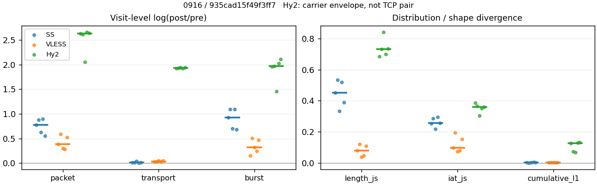
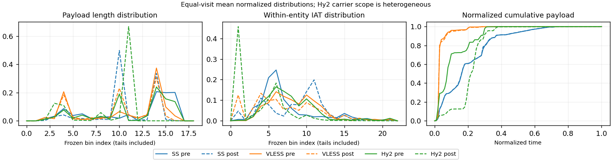

# 0916 · 条目 025 · youtube.com

目标：https://www.youtube.com/results?search_query=watercolor+tutorial

活动标签：youtube.com::search_results_view。选定访问 15 次。

[返回总索引](../../README.md) · [统计口径](../../methods.md)

## 覆盖与资格（每次访问均保留）

| 部署 | 重复 | 主请求路由 | 活动状态 | 代理比较 | DIRECT pre | 请求 proxy/direct/unresolved | 错误 |
| --- | --- | --- | --- | --- | --- | --- | --- |
| Hy2 | 1 | proxy | passed | 1 | 1 | 192/1/0 | [] |
| Hy2 | 2 | proxy | passed | 1 | 1 | 190/1/0 | [] |
| Hy2 | 3 | proxy | passed | 1 | 1 | 188/1/0 | [] |
| Hy2 | 4 | proxy | passed | 1 | 1 | 193/1/0 | [] |
| Hy2 | 5 | proxy | passed | 1 | 1 | 188/1/0 | [] |
| SS | 1 | proxy | passed | 1 | 0 | 192/0/0 | [] |
| SS | 2 | proxy | passed | 1 | 0 | 192/0/0 | [] |
| SS | 3 | proxy | passed | 1 | 0 | 193/0/0 | [] |
| SS | 4 | proxy | passed | 1 | 0 | 186/0/0 | [] |
| SS | 5 | proxy | passed | 1 | 0 | 191/0/0 | [] |
| VLESS | 1 | proxy | passed | 1 | 0 | 193/0/0 | [] |
| VLESS | 2 | proxy | passed | 1 | 0 | 192/0/0 | [] |
| VLESS | 3 | proxy | passed | 1 | 0 | 190/0/0 | [] |
| VLESS | 4 | proxy | passed | 1 | 0 | 186/0/0 | [] |
| VLESS | 5 | proxy | passed | 1 | 0 | 194/0/0 | [] |

主请求非 proxy 的统计仅解释为已索引的辅助代理连接或 DIRECT 观测，不代表目标业务经代理传输。播放确认与配对资格是两道不同的门。

图中散点为单次访问，短线为重复中位数；Hy2 是共享载体包络，不能与 TCP 配对作等范围因果对比。

形态图先逐访问归一化，再对访问等权平均；实线 pre，虚线 post。分箱序号及边界见 methods，不将分箱索引误解为长度或时间。

## 每次访问的关键观测

### SS

范围：`exclusive_page`。每格 pre → post；空值为不可观测/不适用。

| 重复 | 包数 | 载荷字节 | burst | TCP FR | IAT中位µs | length JS | IAT JS |
| --- | --- | --- | --- | --- | --- | --- | --- |
| 1 | 3560 → 7771 | 7.7571e+06 → 7.8617e+06 | 2386 → 6038 | 191 → 207 | 30.966 → 622.54 | 0.45009 | 0.25483 |
| 2 | 3396 → 8170 | 7.8032e+06 → 7.8763e+06 | 2404 → 7160 | 218 → 224 | 45.629 → 1021.4 | 0.53276 | 0.28514 |
| 3 | 4073 → 7636 | 7.8256e+06 → 8.1076e+06 | 2634 → 5323 | 221 → 240 | 22.685 → 152.13 | 0.33243 | 0.21767 |
| 4 | 3113 → 7641 | 7.7134e+06 → 7.7597e+06 | 2064 → 6180 | 162 → 168 | 35.4 → 784.91 | 0.51865 | 0.29423 |
| 5 | 4279 → 7422 | 7.8142e+06 → 7.8896e+06 | 2741 → 5421 | 231 → 237 | 25.062 → 352.01 | 0.39003 | 0.25614 |

完整标量统计：中位数 [min,max]；Δ 为重复内逐访问变换的中位数，MAD 未缩放。n 为可用变换数；DIRECT-only 的 nΔ=0 不代表 pre 不可用。

| scope | 特征 | pre | post | Δ | IQRΔ | MADΔ | nΔ |
| --- | --- | --- | --- | --- | --- | --- | --- |
| exclusive_page | active_span_sum_s_1000ms | 36.747 [25.161, 43.19] | 44.052 [28.87, 55.06] | 0.18133 | 0.045034 | 0.026194 | 5 |
| exclusive_page | active_span_sum_s_100ms | 9.8483 [8.5586, 16.795] | 17.578 [16.578, 27.176] | 0.57933 | 0.12091 | 0.098094 | 5 |
| exclusive_page | active_span_sum_s_500ms | 26.941 [23.631, 33.918] | 35.706 [26.771, 45.145] | 0.28168 | 0.053144 | 0.040067 | 5 |
| exclusive_page | burst_bytes_iqr | 4344 [3352, 5792] | 2856 [2856, 2856] | -0.41937 | 0.11523 | 0.058785 | 5 |
| exclusive_page | burst_bytes_mad | 39 [37, 39] | 40 [34, 65] | 0.025318 | 0.052644 | 0.052644 | 5 |
| exclusive_page | burst_bytes_max | 22760 [20480, 29336] | 15708 [11424, 27132] | -0.4476 | 0.47289 | 0.13613 | 5 |
| exclusive_page | burst_bytes_mean | 3245.9 [2850.8, 3737.1] | 1302 [1100, 1523.1] | -0.91505 | 0.40971 | 0.17563 | 5 |
| exclusive_page | burst_bytes_median | 39 [37, 39] | 40 [34, 65] | 0.025318 | 0.052644 | 0.052644 | 5 |
| exclusive_page | burst_bytes_min | 0 [0, 0] | 0 [0, 0] | — | — | — | 0 |
| exclusive_page | burst_bytes_p95 | 16384 [16384, 20480] | 4284 [2856, 5712] | -1.3414 | 0.51083 | 0.28768 | 5 |
| exclusive_page | burst_bytes_q25 | 0 [0, 0] | 0 [0, 0] | — | — | — | 0 |
| exclusive_page | burst_bytes_q75 | 4344 [3352, 5792] | 2856 [2856, 2856] | -0.41937 | 0.11523 | 0.058785 | 5 |
| exclusive_page | burst_bytes_std | 5295.3 [5097.9, 6112.4] | 1693 [1323.2, 2401.9] | -1.1649 | 0.39202 | 0.22184 | 5 |
| exclusive_page | burst_count | 2404 [2064, 2741] | 6038 [5323, 7160] | 0.92845 | 0.38784 | 0.16822 | 5 |
| exclusive_page | burst_duration_ms_iqr | 0.027106 [0.02189, 0.031826] | 0 [0, 9.9e-05] | -5.8471 | 0.23469 | 0.23469 | 2 |
| exclusive_page | burst_duration_ms_mad | 0 [0, 0] | 0 [0, 0] | — | — | — | 0 |
| exclusive_page | burst_duration_ms_max | 15001 [10608, 15001] | 15360 [10852, 45752] | 0.02365 | 0.67335 | 0.081365 | 5 |
| exclusive_page | burst_duration_ms_mean | 59.005 [26.101, 114.11] | 17.651 [7.7056, 34.517] | -1.2068 | 0.024268 | 0.0132 | 5 |
| exclusive_page | burst_duration_ms_median | 0 [0, 0] | 0 [0, 0] | — | — | — | 0 |
| exclusive_page | burst_duration_ms_min | 0 [0, 0] | 0 [0, 0] | — | — | — | 0 |
| exclusive_page | burst_duration_ms_p95 | 28.776 [8.8052, 70.462] | 0.84622 [0.73672, 0.97941] | -3.4158 | 0.47382 | 0.28534 | 5 |
| exclusive_page | burst_duration_ms_q25 | 0 [0, 0] | 0 [0, 0] | — | — | — | 0 |
| exclusive_page | burst_duration_ms_q75 | 0.027106 [0.02189, 0.031826] | 0 [0, 9.9e-05] | -5.8471 | 0.23469 | 0.23469 | 2 |
| exclusive_page | burst_duration_ms_std | 811.76 [410.46, 1150] | 528.31 [202.3, 869.04] | -0.57545 | 0.16386 | 0.14593 | 5 |
| exclusive_page | burst_packets_iqr | 1 [1, 1] | 0 [0, 1] | 0 | 0 | 0 | 2 |
| exclusive_page | burst_packets_mad | 0 [0, 0] | 0 [0, 0] | — | — | — | 0 |
| exclusive_page | burst_packets_max | 34 [9, 39] | 12 [9, 12] | -1.0415 | 0.65775 | 0.39087 | 5 |
| exclusive_page | burst_packets_mean | 1.5082 [1.4126, 1.5611] | 1.287 [1.1411, 1.4345] | -0.14782 | 0.067503 | 0.050915 | 5 |
| exclusive_page | burst_packets_median | 1 [1, 1] | 1 [1, 1] | 0 | 0 | 0 | 5 |
| exclusive_page | burst_packets_min | 1 [1, 1] | 1 [1, 1] | 0 | 0 | 0 | 5 |
| exclusive_page | burst_packets_p95 | 3 [3, 4] | 3 [2, 3] | -0.28768 | 0.11778 | 0.11778 | 5 |
| exclusive_page | burst_packets_q25 | 1 [1, 1] | 1 [1, 1] | 0 | 0 | 0 | 5 |
| exclusive_page | burst_packets_q75 | 2 [2, 2] | 1 [1, 2] | -0.69315 | 0.69315 | 0 | 5 |
| exclusive_page | burst_packets_std | 1.1814 [0.93789, 1.3497] | 0.70295 [0.51696, 0.90896] | -0.5192 | 0.10732 | 0.071453 | 5 |
| exclusive_page | connection_span_concurrency_max | 12 [11, 14] | 12 [11, 14] | 0 | 0 | 0 | 5 |
| exclusive_page | cumulative_l1 | — | — | 0.001178 | 0.0026207 | 0.00044657 | 5 |
| exclusive_page | cumulative_max | — | — | 0.041005 | 0.022712 | 0.01894 | 5 |
| exclusive_page | direction_entropy | 0.5898 [0.53969, 0.64518] | 0.35365 [0.28112, 0.37863] | -0.23991 | 0.099414 | 0.053868 | 5 |
| exclusive_page | down_burst_count | 1192 [1026, 1360] | 3009 [2650, 3570] | 0.93355 | 0.38858 | 0.16701 | 5 |
| exclusive_page | down_ip_bytes | 7.7998e+06 [7.7408e+06, 7.8427e+06] | 7.9718e+06 [7.9011e+06, 8.1925e+06] | 0.021812 | 0.0045313 | 0.0032175 | 5 |
| exclusive_page | down_packets | 2184 [1915, 2684] | 4338 [4281, 4509] | 0.69017 | 0.21121 | 0.12221 | 5 |
| exclusive_page | down_transport_bytes | 7.6969e+06 [7.6411e+06, 7.7061e+06] | 7.7489e+06 [7.6766e+06, 7.9569e+06] | 0.0071399 | 0.0039866 | 0.0025111 | 5 |
| exclusive_page | duration_s | 70.919 [16.939, 73.11] | 70.918 [16.938, 73.109] | -8.2712e-06 | 8.6551e-06 | 8.2836e-07 | 5 |
| exclusive_page | entity_count | 21 [12, 24] | 21 [12, 24] | 0 | 0 | 0 | 5 |
| exclusive_page | fr_runs | 218 [162, 231] | 224 [168, 240] | 0.036368 | 0.053294 | 0.010725 | 5 |
| exclusive_page | fr_runs_per_packet | 0.08814 [0.083851, 0.11319] | 0.052251 [0.038462, 0.054358] | -0.041041 | 0.010007 | 0.0056586 | 5 |
| exclusive_page | fr_switches | 197 [150, 210] | 203 [156, 216] | 0.039221 | 0.059443 | 0.01105 | 5 |
| exclusive_page | fr_switches_per_possible_transition | 0.079646 [0.078125, 0.10341] | 0.047586 [0.035813, 0.049781] | -0.036903 | 0.010718 | 0.0054092 | 5 |
| exclusive_page | full_retransmission_fraction | 0.0019642 [0.00058893, 0.0022486] | 0.0059976 [0.0017013, 0.019644] | 0.0053451 | 0.0033077 | 0.0032442 | 5 |
| exclusive_page | full_retransmission_packets | 7 [2, 8] | 49 [13, 150] | 1.9981 | 1.4649 | 0.9331 | 5 |
| exclusive_page | iat_count | 3540 [3101, 4258] | 7629 [7401, 8149] | 0.7837 | 0.25024 | 0.11654 | 5 |
| exclusive_page | iat_js | — | — | 0.25614 | 0.030309 | 0.028995 | 5 |
| exclusive_page | iat_ks | — | — | 0.41478 | 0.0091508 | 0.0079896 | 5 |
| exclusive_page | iat_median_us | 30.966 [22.685, 45.629] | 622.54 [152.13, 1021.4] | 3.0009 | 0.45652 | 0.10752 | 5 |
| exclusive_page | iat_us_iqr | 119.95 [69.199, 543.55] | 1053.4 [939.11, 3443.6] | 2.4174 | 0.42667 | 0.19051 | 5 |
| exclusive_page | iat_us_mad | 22.259 [15.785, 36.299] | 587.3 [152, 1007.4] | 3.2728 | 0.29844 | 0.050564 | 5 |
| exclusive_page | iat_us_max | 1.5001e+07 [1.1513e+07, 1.5001e+07] | 1.5452e+07 [1.1446e+07, 1.5472e+07] | 0.029597 | 0.0035481 | 0.0012797 | 5 |
| exclusive_page | iat_us_mean | 1.1367e+05 [46715, 2.1538e+05] | 54588 [18987, 89803] | -0.77339 | 0.14125 | 0.10137 | 5 |
| exclusive_page | iat_us_median | 30.966 [22.685, 45.629] | 622.54 [152.13, 1021.4] | 3.0009 | 0.45652 | 0.10752 | 5 |
| exclusive_page | iat_us_min | 0.037 [0.023, 0.063] | 0.032 [0.03, 0.036] | -0.20972 | 0.73493 | 0.46768 | 5 |
| exclusive_page | iat_us_p95 | 41592 [41036, 97118] | 26582 [7183.7, 27944] | -1.0562 | 0.8024 | 0.61292 | 5 |
| exclusive_page | iat_us_q25 | 14.052 [12.317, 17.593] | 20.695 [7.7598, 81.996] | 0.38715 | 1.5138 | 0.84918 | 5 |
| exclusive_page | iat_us_q75 | 134 [81.516, 561.14] | 1074.1 [946.87, 3525.6] | 2.3447 | 0.37085 | 0.10766 | 5 |
| exclusive_page | iat_us_std | 1.1838e+06 [5.9994e+05, 1.6424e+06] | 8.1592e+05 [3.7654e+05, 1.0562e+06] | -0.38753 | 0.06984 | 0.054461 | 5 |
| exclusive_page | iat_wasserstein_log1p_us | — | — | 1.56 | 0.28713 | 0.18439 | 5 |
| exclusive_page | idle_gap_count_1000ms | 40 [18, 70] | 33 [18, 71] | -0.016529 | 0.11778 | 0.030714 | 5 |
| exclusive_page | idle_gap_count_100ms | 134 [83, 163] | 135 [68, 161] | -0.012346 | 0.021228 | 0.019781 | 5 |
| exclusive_page | idle_gap_count_500ms | 53 [20, 84] | 44 [21, 87] | -0.040274 | 0.14045 | 0.075365 | 5 |
| exclusive_page | idle_gap_sum_s_1000ms | 420.09 [119.7, 683.7] | 368.26 [115.99, 676.75] | -0.031542 | 0.028173 | 0.020154 | 5 |
| exclusive_page | idle_gap_sum_s_100ms | 451.7 [134.55, 710.1] | 398.42 [128.28, 704.63] | -0.034521 | 0.036189 | 0.022943 | 5 |
| exclusive_page | idle_gap_sum_s_500ms | 429.11 [121.23, 692.98] | 376.21 [118.08, 686.66] | -0.026308 | 0.032923 | 0.017155 | 5 |
| exclusive_page | ip_bytes | 7.9802e+06 [7.8756e+06, 8.0378e+06] | 8.342e+06 [8.2339e+06, 8.5724e+06] | 0.048389 | 0.004428 | 0.0038911 | 5 |
| exclusive_page | length_iqr | 5024 [3294, 7320] | 1428 [1428, 1428] | -1.258 | 0.717 | 0.37638 | 5 |
| exclusive_page | length_js | — | — | 0.45009 | 0.12862 | 0.068567 | 5 |
| exclusive_page | length_ks | — | — | 0.563 | 0.077059 | 0.026478 | 5 |
| exclusive_page | length_mad | 2436 [1577, 3595.5] | 70 [0, 884] | -1.2953 | 1.6297 | 0.61584 | 3 |
| exclusive_page | length_max | 8920 [8920, 8920] | 9996 [5712, 15708] | 0.11389 | 0.57352 | 0.45199 | 5 |
| exclusive_page | length_mean | 3579.6 [2963.3, 4051.5] | 1788.8 [1776.5, 1837.2] | -0.69372 | 0.23062 | 0.11604 | 5 |
| exclusive_page | length_median | 2896 [2896, 3945] | 1428 [1428, 1428] | -0.70706 | 0.19598 | 0 | 5 |
| exclusive_page | length_min | 31 [15, 31] | 8 [3, 12] | -1.1314 | 0.43825 | 0.22314 | 5 |
| exclusive_page | length_p95 | 8192 [8192, 8192] | 2856 [2856, 2856] | -1.0537 | 0 | 0 | 5 |
| exclusive_page | length_q25 | 905 [802, 1148] | 1428 [1428, 1428] | 0.4561 | 0.11267 | 0.075528 | 5 |
| exclusive_page | length_q75 | 6000 [4096, 8192] | 2856 [2856, 2856] | -0.74234 | 0.63436 | 0.3114 | 5 |
| exclusive_page | length_std | 2957.2 [2556, 3254.2] | 918.33 [861.59, 1108.4] | -1.1694 | 0.39774 | 0.1353 | 5 |
| exclusive_page | length_wasserstein_bytes | — | — | 2051.8 | 1035.8 | 531.62 | 5 |
| exclusive_page | nonempty_entity_count | 21 [12, 24] | 21 [12, 24] | 0 | 0 | 0 | 5 |
| exclusive_page | nonempty_packets | 2167 [1926, 2637] | 4368 [4287, 4548] | 0.70712 | 0.20454 | 0.10863 | 5 |
| exclusive_page | offload_suspect_fraction | 0.38841 [0.37367, 0.41825] | 0.20143 [0.17799, 0.22996] | -0.18152 | 0.013673 | 0.0082096 | 5 |
| exclusive_page | packet_count | 3560 [3113, 4279] | 7641 [7422, 8170] | 0.78064 | 0.24938 | 0.1173 | 5 |
| exclusive_page | rtt_median_ms | 0.058496 [0.043773, 0.070839] | 33.079 [32.787, 35.717] | 6.356 | 0.26849 | 0.133 | 5 |
| exclusive_page | rtt_sample_count | 1352 [1161, 1521] | 750 [706, 1121] | -0.45039 | 0.25666 | 0.25666 | 5 |
| exclusive_page | tcp_ack_count | 3540 [3101, 4258] | 7625 [7394, 8141] | 0.78318 | 0.24895 | 0.11653 | 5 |
| exclusive_page | tcp_fin_count | 41 [24, 48] | 48 [27, 54] | 0.11778 | 0.039846 | 0.039846 | 5 |
| exclusive_page | tcp_packet_count | 3560 [3113, 4279] | 7641 [7422, 8170] | 0.78064 | 0.24938 | 0.1173 | 5 |
| exclusive_page | tcp_rst_count | 0 [0, 3] | 0 [0, 0] | — | — | — | 0 |
| exclusive_page | tcp_syn_count | 42 [24, 48] | 49 [29, 53] | 0.17435 | 0.093932 | 0.058269 | 5 |
| exclusive_page | tcp_window_raw_median | 65535 [65535, 65535] | 168 [150, 168] | -5.9664 | 0.011976 | 0 | 5 |
| exclusive_page | transition_entropy | 0.34483 [0.33827, 0.41749] | 0.21649 [0.17104, 0.22242] | -0.1447 | 0.058018 | 0.027858 | 5 |
| exclusive_page | transition_n_mm | 1768 [1505, 2201] | 4007 [3887, 4101] | 0.81819 | 0.2695 | 0.13369 | 5 |
| exclusive_page | transition_n_mp | 93 [73, 100] | 96 [76, 103] | 0.040274 | 0.063561 | 0.010715 | 5 |
| exclusive_page | transition_n_pm | 104 [77, 110] | 107 [80, 113] | 0.038221 | 0.054559 | 0.011314 | 5 |
| exclusive_page | transition_n_pp | 205 [197, 208] | 176 [125, 207] | -0.14272 | 0.065975 | 0.062294 | 5 |
| exclusive_page | transition_p_mm | 0.95654 [0.9418, 0.95718] | 0.9759 [0.97462, 0.98169] | 0.0218 | 0.0077239 | 0.0037168 | 5 |
| exclusive_page | transition_p_mp | 0.043459 [0.042818, 0.058198] | 0.024102 [0.018309, 0.025376] | -0.0218 | 0.0077239 | 0.0037168 | 5 |
| exclusive_page | transition_p_pm | 0.33441 [0.28102, 0.34921] | 0.37809 [0.35313, 0.40357] | 0.049224 | 0.015035 | 0.0098939 | 5 |
| exclusive_page | transition_p_pp | 0.66559 [0.65079, 0.71898] | 0.62191 [0.59643, 0.64687] | -0.049224 | 0.015035 | 0.0098939 | 5 |
| exclusive_page | transport_bytes | 7.8032e+06 [7.7134e+06, 7.8256e+06] | 7.8763e+06 [7.7597e+06, 8.1076e+06] | 0.0096133 | 0.0040812 | 0.0036283 | 5 |
| exclusive_page | up_burst_count | 1212 [1038, 1381] | 3029 [2673, 3590] | 0.92341 | 0.38711 | 0.1694 | 5 |
| exclusive_page | up_byte_fraction | 0.014233 [0.0093769, 0.01527] | 0.016669 [0.010719, 0.018591] | 0.002548 | 0.00020385 | 0.00011287 | 5 |
| exclusive_page | up_ip_bytes | 1.8349e+05 [1.348e+05, 1.978e+05] | 3.799e+05 [3.3286e+05, 4.0398e+05] | 0.74132 | 0.15393 | 0.088682 | 5 |
| exclusive_page | up_packets | 1419 [1198, 1595] | 3326 [3084, 3889] | 0.90929 | 0.27426 | 0.11183 | 5 |
| exclusive_page | up_transport_bytes | 1.1122e+05 [72328, 1.195e+05] | 1.3151e+05 [83180, 1.5073e+05] | 0.18069 | 0.014155 | 0.013147 | 5 |
| exclusive_page | zero_iat_count | 0 [0, 0] | 0 [0, 0] | — | — | — | 0 |
| exclusive_page | zero_iat_fraction | 0 [0, 0] | 0 [0, 0] | 0 | 0 | 0 | 5 |

### VLESS

范围：`exclusive_page`。每格 pre → post；空值为不可观测/不适用。

| 重复 | 包数 | 载荷字节 | burst | TCP FR | IAT中位µs | length JS | IAT JS |
| --- | --- | --- | --- | --- | --- | --- | --- |
| 1 | 3368 → 4933 | 5.2544e+06 → 5.3912e+06 | 2587 → 3006 | 140 → 182 | 75.679 → 29.528 | 0.078138 | 0.097293 |
| 2 | 3806 → 6882 | 5.2253e+06 → 5.3935e+06 | 2584 → 4277 | 154 → 198 | 177.27 → 16.659 | 0.12152 | 0.19435 |
| 3 | 2673 → 3614 | 3.2093e+06 → 3.365e+06 | 1816 → 2493 | 150 → 190 | 154.41 → 79.317 | 0.03921 | 0.071886 |
| 4 | 2661 → 3538 | 3.2558e+06 → 3.3601e+06 | 1812 → 2322 | 130 → 158 | 224.83 → 55.384 | 0.047031 | 0.078295 |
| 5 | 2590 → 4391 | 3.23e+06 → 3.3775e+06 | 1776 → 2843 | 142 → 182 | 155.39 → 29.45 | 0.10995 | 0.15369 |

完整标量统计：中位数 [min,max]；Δ 为重复内逐访问变换的中位数，MAD 未缩放。n 为可用变换数；DIRECT-only 的 nΔ=0 不代表 pre 不可用。

| scope | 特征 | pre | post | Δ | IQRΔ | MADΔ | nΔ |
| --- | --- | --- | --- | --- | --- | --- | --- |
| exclusive_page | active_span_sum_s_1000ms | 26.347 [20.307, 29.064] | 29.161 [24.364, 30.81] | 0.08508 | 0.04315 | 0.026745 | 5 |
| exclusive_page | active_span_sum_s_100ms | 3.2983 [2.8892, 4.7475] | 11.175 [9.7138, 11.89] | 1.1095 | 0.13876 | 0.10946 | 5 |
| exclusive_page | active_span_sum_s_500ms | 11.928 [10.418, 14.159] | 26.429 [21.013, 28.855] | 0.71197 | 0.14164 | 0.093054 | 5 |
| exclusive_page | burst_bytes_iqr | 2896 [2896, 2896] | 2824 [2824, 2896] | -0.025176 | 0 | 0 | 5 |
| exclusive_page | burst_bytes_mad | 0 [0, 24] | 39 [24, 61] | 0.70916 | 0.22366 | 0.22366 | 2 |
| exclusive_page | burst_bytes_max | 20480 [17376, 20480] | 14228 [10136, 63748] | -0.36424 | 0.65921 | 0.21182 | 5 |
| exclusive_page | burst_bytes_mean | 1818.7 [1767.2, 2031.1] | 1349.8 [1188, 1793.5] | -0.26947 | 0.2094 | 0.14508 | 5 |
| exclusive_page | burst_bytes_median | 0 [0, 24] | 39 [24, 61] | 0.70916 | 0.22366 | 0.22366 | 2 |
| exclusive_page | burst_bytes_min | 0 [0, 0] | 0 [0, 0] | — | — | — | 0 |
| exclusive_page | burst_bytes_p95 | 8688 [7240, 10064] | 4344 [3271.6, 5864] | -0.57766 | 0.2075 | 0.14066 | 5 |
| exclusive_page | burst_bytes_q25 | 0 [0, 0] | 0 [0, 0] | — | — | — | 0 |
| exclusive_page | burst_bytes_q75 | 2896 [2896, 2896] | 2824 [2824, 2896] | -0.025176 | 0 | 0 | 5 |
| exclusive_page | burst_bytes_std | 3140.6 [2754.1, 3776.3] | 1708.8 [1572.7, 3087.5] | -0.51731 | 0.19614 | 0.15614 | 5 |
| exclusive_page | burst_count | 1816 [1776, 2587] | 2843 [2322, 4277] | 0.31685 | 0.2225 | 0.15365 | 5 |
| exclusive_page | burst_duration_ms_iqr | 0.46396 [0, 0.58211] | 0.005438 [0.0037755, 0.0089545] | -4.668 | 0.18914 | 0.081625 | 4 |
| exclusive_page | burst_duration_ms_mad | 0 [0, 0] | 0 [0, 0] | — | — | — | 0 |
| exclusive_page | burst_duration_ms_max | 15001 [15001, 15001] | 15024 [15009, 15058] | 0.001536 | 0.0024322 | 0.0010067 | 5 |
| exclusive_page | burst_duration_ms_mean | 54.175 [41.119, 138] | 25.915 [13.261, 73.18] | -0.86901 | 0.3386 | 0.23466 | 5 |
| exclusive_page | burst_duration_ms_median | 0 [0, 0] | 0 [0, 0] | — | — | — | 0 |
| exclusive_page | burst_duration_ms_min | 0 [0, 0] | 0 [0, 0] | — | — | — | 0 |
| exclusive_page | burst_duration_ms_p95 | 9.7824 [5.3899, 35.871] | 6.3638 [4.0926, 9.5458] | -0.13132 | 0.29367 | 0.083818 | 5 |
| exclusive_page | burst_duration_ms_q25 | 0 [0, 0] | 0 [0, 0] | — | — | — | 0 |
| exclusive_page | burst_duration_ms_q75 | 0.46396 [0, 0.58211] | 0.005438 [0.0037755, 0.0089545] | -4.668 | 0.18914 | 0.081625 | 4 |
| exclusive_page | burst_duration_ms_std | 763.16 [665.44, 1299.1] | 539.51 [304.81, 965.91] | -0.40033 | 0.13894 | 0.10397 | 5 |
| exclusive_page | burst_packets_iqr | 1 [0, 1] | 1 [1, 1] | 0 | 0 | 0 | 4 |
| exclusive_page | burst_packets_mad | 0 [0, 0] | 0 [0, 0] | — | — | — | 0 |
| exclusive_page | burst_packets_max | 7 [5, 9] | 7 [7, 27] | 0.33647 | 0.96508 | 0.58779 | 5 |
| exclusive_page | burst_packets_mean | 1.4685 [1.3019, 1.4729] | 1.5445 [1.4497, 1.6411] | 0.057403 | 0.051555 | 0.031014 | 5 |
| exclusive_page | burst_packets_median | 1 [1, 1] | 1 [1, 1] | 0 | 0 | 0 | 5 |
| exclusive_page | burst_packets_min | 1 [1, 1] | 1 [1, 1] | 0 | 0 | 0 | 5 |
| exclusive_page | burst_packets_p95 | 2 [2, 3] | 3 [3, 4] | 0.40547 | 0.11778 | 0.11778 | 5 |
| exclusive_page | burst_packets_q25 | 1 [1, 1] | 1 [1, 1] | 0 | 0 | 0 | 5 |
| exclusive_page | burst_packets_q75 | 2 [1, 2] | 2 [2, 2] | 0 | 0 | 0 | 5 |
| exclusive_page | burst_packets_std | 0.62708 [0.59392, 0.68054] | 0.92283 [0.84758, 1.2602] | 0.37204 | 0.026317 | 0.016396 | 5 |
| exclusive_page | connection_span_concurrency_max | 11 [9, 11] | 11 [9, 11] | 0 | 0 | 0 | 5 |
| exclusive_page | cumulative_l1 | — | — | 0.0033044 | 0.0024538 | 0.0004288 | 5 |
| exclusive_page | cumulative_max | — | — | 0.036094 | 0.015417 | 0.013567 | 5 |
| exclusive_page | direction_entropy | 0.41239 [0.31718, 0.57441] | 0.37857 [0.28503, 0.43324] | -0.037918 | 0.018016 | 0.012249 | 5 |
| exclusive_page | down_burst_count | 899 [878, 1284] | 1412 [1154, 2128] | 0.3227 | 0.22541 | 0.15242 | 5 |
| exclusive_page | down_ip_bytes | 3.2838e+06 [3.2274e+06, 5.2903e+06] | 3.3946e+06 [3.3637e+06, 5.4752e+06] | 0.037645 | 0.011846 | 0.007971 | 5 |
| exclusive_page | down_packets | 1686 [1616, 2424] | 2418 [2056, 3836] | 0.40299 | 0.18831 | 0.056024 | 5 |
| exclusive_page | down_transport_bytes | 3.1984e+06 [3.1396e+06, 5.1876e+06] | 3.2751e+06 [3.2565e+06, 5.2893e+06] | 0.024729 | 0.010437 | 0.0053119 | 5 |
| exclusive_page | duration_s | 69.071 [64.634, 75.574] | 69.036 [64.608, 75.568] | -0.00051411 | 0.00011774 | 0.00011249 | 5 |
| exclusive_page | entity_count | 20 [14, 22] | 20 [14, 22] | 0 | 0 | 0 | 5 |
| exclusive_page | fr_runs | 142 [130, 154] | 182 [158, 198] | 0.24818 | 0.014926 | 0.011791 | 5 |
| exclusive_page | fr_runs_per_packet | 0.082019 [0.066009, 0.092932] | 0.078145 [0.052885, 0.095573] | -0.010586 | 0.011309 | 0.0042012 | 5 |
| exclusive_page | fr_switches | 122 [116, 132] | 163 [144, 176] | 0.28358 | 0.019418 | 0.014384 | 5 |
| exclusive_page | fr_switches_per_possible_transition | 0.073838 [0.057118, 0.081454] | 0.07016 [0.047286, 0.086382] | -0.0074562 | 0.009613 | 0.0032854 | 5 |
| exclusive_page | full_retransmission_fraction | 0.0007722 [0, 0.0015032] | 0 [0, 0] | -0.0007722 | 0.00073634 | 0.00071236 | 5 |
| exclusive_page | full_retransmission_packets | 2 [0, 5] | 0 [0, 0] | — | — | — | 0 |
| exclusive_page | iat_count | 2653 [2570, 3784] | 4371 [3524, 6860] | 0.38343 | 0.22751 | 0.097257 | 5 |
| exclusive_page | iat_js | — | — | 0.097293 | 0.075392 | 0.025406 | 5 |
| exclusive_page | iat_ks | — | — | 0.20204 | 0.15367 | 0.037108 | 5 |
| exclusive_page | iat_median_us | 155.39 [75.679, 224.83] | 29.528 [16.659, 79.317] | -1.4011 | 0.7221 | 0.4599 | 5 |
| exclusive_page | iat_us_iqr | 937.23 [909.58, 1093] | 636.71 [489.39, 990.58] | -0.38662 | 0.59355 | 0.33454 | 5 |
| exclusive_page | iat_us_mad | 145.56 [67.97, 216.93] | 29.422 [16.611, 78.855] | -1.3663 | 0.76037 | 0.52898 | 5 |
| exclusive_page | iat_us_max | 1.5001e+07 [1.5001e+07, 1.5001e+07] | 1.5384e+07 [1.5303e+07, 1.5445e+07] | 0.025197 | 0.0038205 | 0.0033226 | 5 |
| exclusive_page | iat_us_mean | 1.3269e+05 [65619, 2.2546e+05] | 80767 [44601, 1.6921e+05] | -0.3861 | 0.22714 | 0.099068 | 5 |
| exclusive_page | iat_us_median | 155.39 [75.679, 224.83] | 29.528 [16.659, 79.317] | -1.4011 | 0.7221 | 0.4599 | 5 |
| exclusive_page | iat_us_min | 0.242 [0.048, 0.73] | 0.033 [0.021, 0.035] | -2.4437 | 1.5971 | 0.59395 | 5 |
| exclusive_page | iat_us_p95 | 9717.7 [9508.3, 33184] | 42479 [9849.3, 43377] | 1.1816 | 1.1059 | 0.2935 | 5 |
| exclusive_page | iat_us_q25 | 32.324 [22.206, 41.307] | 6.731 [4.601, 11.748] | -1.1936 | 0.85682 | 0.18149 | 5 |
| exclusive_page | iat_us_q75 | 978.16 [941.9, 1115.2] | 642.68 [493.99, 1000.3] | -0.42003 | 0.61065 | 0.30865 | 5 |
| exclusive_page | iat_us_std | 1.3152e+06 [9.0124e+05, 1.7397e+06] | 9.9234e+05 [7.4493e+05, 1.5128e+06] | -0.19047 | 0.10645 | 0.050735 | 5 |
| exclusive_page | iat_wasserstein_log1p_us | — | — | 1.0451 | 0.54385 | 0.29423 | 5 |
| exclusive_page | idle_gap_count_1000ms | 42 [19, 48] | 36 [16, 49] | -0.11778 | 0.15415 | 0.054067 | 5 |
| exclusive_page | idle_gap_count_100ms | 103 [79, 114] | 117 [96, 125] | 0.12744 | 0.07416 | 0.03533 | 5 |
| exclusive_page | idle_gap_count_500ms | 62 [40, 67] | 38 [20, 54] | -0.5368 | 0.1085 | 0.06282 | 5 |
| exclusive_page | idle_gap_sum_s_1000ms | 473.02 [192.29, 576.49] | 470.71 [189.27, 571.87] | -0.0068982 | 0.00315 | 0.0020013 | 5 |
| exclusive_page | idle_gap_sum_s_100ms | 498.17 [215.01, 593.5] | 489.63 [207.78, 586.57] | -0.01728 | 0.009054 | 0.0055305 | 5 |
| exclusive_page | idle_gap_sum_s_500ms | 487.93 [206.74, 585.49] | 472.67 [192.74, 575.27] | -0.033169 | 0.021022 | 0.01557 | 5 |
| exclusive_page | ip_bytes | 3.3941e+06 [3.3482e+06, 5.4294e+06] | 3.6145e+06 [3.546e+06, 5.7649e+06] | 0.059912 | 0.017339 | 0.011737 | 5 |
| exclusive_page | length_iqr | 2453.5 [2061, 2732] | 2171 [1248, 2679.2] | -0.036631 | 0.1718 | 0.021536 | 5 |
| exclusive_page | length_js | — | — | 0.078138 | 0.062919 | 0.031812 | 5 |
| exclusive_page | length_ks | — | — | 0.16015 | 0.14452 | 0.078969 | 5 |
| exclusive_page | length_mad | 1377 [820, 1484] | 1340 [816, 1340] | -0.10207 | 0.16935 | 0.094516 | 5 |
| exclusive_page | length_max | 8920 [8920, 8920] | 8688 [5864, 11584] | -0.026353 | 0.33647 | 0.18232 | 5 |
| exclusive_page | length_mean | 2113.9 [1986, 2743.8] | 1692.7 [1440.6, 1852] | -0.37684 | 0.20716 | 0.064474 | 5 |
| exclusive_page | length_median | 2076 [1484, 2824] | 1412 [1412, 1484] | -0.38544 | 0.56971 | 0.30771 | 5 |
| exclusive_page | length_min | 24 [24, 24] | 24 [1, 24] | 0 | 0.40547 | 0 | 5 |
| exclusive_page | length_p95 | 5864 [5648, 8920] | 3040 [2896, 4236] | -0.69315 | 0.086058 | 0.051529 | 5 |
| exclusive_page | length_q25 | 370.5 [92, 835] | 241 [144.75, 653] | 0.33062 | 0.31931 | 0.19745 | 5 |
| exclusive_page | length_q75 | 2824 [2824, 2896] | 2824 [1765, 2824] | -0.025176 | 0.40271 | 0.025176 | 5 |
| exclusive_page | length_std | 1912.1 [1708.9, 2535.3] | 1378.1 [1061.5, 1436.1] | -0.57018 | 0.22596 | 0.025432 | 5 |
| exclusive_page | length_wasserstein_bytes | — | — | 676.08 | 328.15 | 203.3 | 5 |
| exclusive_page | nonempty_entity_count | 20 [14, 22] | 20 [14, 22] | 0 | 0 | 0 | 5 |
| exclusive_page | nonempty_packets | 1616 [1528, 2333] | 2329 [1970, 3744] | 0.41878 | 0.20403 | 0.054221 | 5 |
| exclusive_page | offload_suspect_fraction | 0.34718 [0.31003, 0.36075] | 0.24731 [0.16124, 0.29982] | -0.097314 | 0.096505 | 0.042618 | 5 |
| exclusive_page | packet_count | 2673 [2590, 3806] | 4391 [3538, 6882] | 0.38163 | 0.22629 | 0.096769 | 5 |
| exclusive_page | rtt_median_ms | 0.30295 [0.064315, 0.41362] | 0.048525 [0.045687, 0.078472] | -1.8607 | 0.86922 | 0.28215 | 5 |
| exclusive_page | rtt_sample_count | 953 [916, 1350] | 1609 [1400, 2460] | 0.4576 | 0.16819 | 0.10575 | 5 |
| exclusive_page | tcp_ack_count | 2620 [2530, 3742] | 4370 [3524, 6860] | 0.39514 | 0.2292 | 0.098718 | 5 |
| exclusive_page | tcp_fin_count | 38 [27, 42] | 40 [28, 44] | 0.036368 | 0.04652 | 0.036368 | 5 |
| exclusive_page | tcp_packet_count | 2673 [2590, 3806] | 4391 [3538, 6882] | 0.38163 | 0.22629 | 0.096769 | 5 |
| exclusive_page | tcp_rst_count | 39 [27, 42] | 0 [0, 1] | -3.6499 | 0.038981 | 0.038981 | 2 |
| exclusive_page | tcp_syn_count | 40 [28, 44] | 40 [28, 44] | 0 | 0 | 0 | 5 |
| exclusive_page | tcp_window_raw_median | 65535 [65535, 65535] | 168 [161, 189] | -5.9664 | 0.10899 | 0.04256 | 5 |
| exclusive_page | transition_entropy | 0.29495 [0.21724, 0.32087] | 0.2685 [0.19356, 0.31786] | -0.023681 | 0.0087068 | 0.005023 | 5 |
| exclusive_page | transition_n_mm | 1407 [1304, 2122] | 2067 [1716, 3459] | 0.43559 | 0.16699 | 0.053027 | 5 |
| exclusive_page | transition_n_mp | 51 [51, 55] | 72 [65, 77] | 0.33085 | 0.026317 | 0.013986 | 5 |
| exclusive_page | transition_n_pm | 71 [65, 77] | 91 [79, 99] | 0.24818 | 0.014926 | 0.011791 | 5 |
| exclusive_page | transition_n_pp | 63 [57, 151] | 84 [80, 88] | 0.27193 | 0.09029 | 0.057248 | 5 |
| exclusive_page | transition_p_mm | 0.96288 [0.96236, 0.97474] | 0.96679 [0.95812, 0.97822] | 0.0024446 | 0.0021829 | 0.0011393 | 5 |
| exclusive_page | transition_p_mp | 0.037118 [0.025264, 0.037638] | 0.033209 [0.021776, 0.041876] | -0.0024446 | 0.0021829 | 0.0011393 | 5 |
| exclusive_page | transition_p_pm | 0.52985 [0.30093, 0.57463] | 0.53216 [0.47305, 0.53672] | -0.0023881 | 0.025291 | 0.02059 | 5 |
| exclusive_page | transition_p_pp | 0.47015 [0.42537, 0.69907] | 0.46784 [0.46328, 0.52695] | 0.0023881 | 0.025291 | 0.02059 | 5 |
| exclusive_page | transport_bytes | 3.2558e+06 [3.2093e+06, 5.2544e+06] | 3.3775e+06 [3.3601e+06, 5.3935e+06] | 0.031688 | 0.013096 | 0.0059718 | 5 |
| exclusive_page | up_burst_count | 918 [898, 1303] | 1431 [1168, 2149] | 0.3111 | 0.21965 | 0.15486 | 5 |
| exclusive_page | up_byte_fraction | 0.017634 [0.012711, 0.021971] | 0.025318 [0.01891, 0.032267] | 0.0076845 | 0.0033969 | 0.0014849 | 5 |
| exclusive_page | up_ip_bytes | 1.2132e+05 [1.1034e+05, 1.5011e+05] | 2.0541e+05 [1.6393e+05, 2.8963e+05] | 0.45967 | 0.1987 | 0.06964 | 5 |
| exclusive_page | up_packets | 1021 [974, 1395] | 1947 [1482, 3046] | 0.45456 | 0.33329 | 0.12117 | 5 |
| exclusive_page | up_transport_bytes | 69727 [57412, 78577] | 1.0858e+05 [85073, 1.1795e+05] | 0.42298 | 0.020682 | 0.016814 | 5 |
| exclusive_page | zero_iat_count | 0 [0, 0] | 0 [0, 0] | — | — | — | 0 |
| exclusive_page | zero_iat_fraction | 0 [0, 0] | 0 [0, 0] | 0 | 0 | 0 | 5 |

### Hy2

范围：`carrier_context_envelope`。每格 pre → post；空值为不可观测/不适用。

| 重复 | 包数 | 载荷字节 | burst | TCP FR | IAT中位µs | length JS | IAT JS |
| --- | --- | --- | --- | --- | --- | --- | --- |
| 1 | 3567 → 49518 | 7.8238e+06 → 5.3785e+07 | 2198 → 15600 | — | 91.166 → 1.892 | 0.68388 | 0.38765 |
| 2 | 3701 → 50467 | 7.7065e+06 → 5.3334e+07 | 2536 → 18230 | — | 65.603 → 4.498 | 0.73273 | 0.36623 |
| 3 | 6493 → 50625 | 7.7255e+06 → 5.3867e+07 | 4843 → 20715 | — | 136.44 → 18.782 | 0.84046 | 0.30273 |
| 4 | 3569 → 50991 | 7.9151e+06 → 5.4214e+07 | 2347 → 17883 | — | 61.763 → 4.691 | 0.6986 | 0.34992 |
| 5 | 3667 → 51508 | 7.7223e+06 → 5.3717e+07 | 2333 → 19324 | — | 71.064 → 5.183 | 0.73638 | 0.35844 |

范围：`direct_pre_only`。每格 pre → post；空值为不可观测/不适用。

| 重复 | 包数 | 载荷字节 | burst | TCP FR | IAT中位µs | length JS | IAT JS |
| --- | --- | --- | --- | --- | --- | --- | --- |
| 1 | 37 → — | 8637 → — | 25 → — | 7 → — | 175.32 → — | — | — |
| 2 | 29 → — | 8669 → — | 19 → — | 7 → — | 326.02 → — | — | — |
| 3 | 31 → — | 8703 → — | 23 → — | 7 → — | 158.39 → — | — | — |
| 4 | 35 → — | 8735 → — | 25 → — | 7 → — | 127.24 → — | — | — |
| 5 | 31 → — | 8638 → — | 23 → — | 7 → — | 164.29 → — | — | — |

完整标量统计：中位数 [min,max]；Δ 为重复内逐访问变换的中位数，MAD 未缩放。n 为可用变换数；DIRECT-only 的 nΔ=0 不代表 pre 不可用。

| scope | 特征 | pre | post | Δ | IQRΔ | MADΔ | nΔ |
| --- | --- | --- | --- | --- | --- | --- | --- |
| carrier_context_envelope | active_span_sum_s_1000ms | 24.376 [21.343, 30.243] | 22.894 [22.401, 36.683] | 0.070139 | 0.13288 | 0.12292 | 5 |
| carrier_context_envelope | active_span_sum_s_100ms | 3.5265 [2.9159, 5.5] | 10.536 [8.8048, 13.344] | 0.95846 | 0.26834 | 0.072123 | 5 |
| carrier_context_envelope | active_span_sum_s_500ms | 18.226 [15.977, 22.353] | 20.391 [19.025, 31.582] | 0.22941 | 0.084294 | 0.075663 | 5 |
| carrier_context_envelope | burst_bytes_iqr | 4242.8 [2830, 5064] | 3689 [2792, 5095] | -0.0044859 | 0.33125 | 0.18753 | 5 |
| carrier_context_envelope | burst_bytes_mad | 31 [0, 39] | 312 [263, 556] | 2.3468 | 0.22509 | 0.1741 | 4 |
| carrier_context_envelope | burst_bytes_max | 23120 [20480, 28672] | 2.257e+05 [1.2552e+05, 2.8383e+05] | 2.2645 | 0.025087 | 0.01402 | 5 |
| carrier_context_envelope | burst_bytes_mean | 3310 [1595.2, 3559.5] | 2925.6 [2600.4, 3447.8] | -0.037971 | 0.074645 | 0.068569 | 5 |
| carrier_context_envelope | burst_bytes_median | 31 [0, 39] | 345 [296, 589] | 2.4439 | 0.20673 | 0.15265 | 4 |
| carrier_context_envelope | burst_bytes_min | 0 [0, 0] | 22 [22, 25] | — | — | — | 0 |
| carrier_context_envelope | burst_bytes_p95 | 17797 [5820.9, 20480] | 10932 [8700.2, 11528] | -0.48975 | 0.087323 | 0.084921 | 5 |
| carrier_context_envelope | burst_bytes_q25 | 0 [0, 0] | 90 [38, 98] | — | — | — | 0 |
| carrier_context_envelope | burst_bytes_q75 | 4242.8 [2830, 5064] | 3727 [2882, 5168] | 0.018208 | 0.31375 | 0.17907 | 5 |
| carrier_context_envelope | burst_bytes_std | 5481.6 [2417, 6068.3] | 5729 [3638.2, 8095.5] | 0.058893 | 0.2297 | 0.13145 | 5 |
| carrier_context_envelope | burst_count | 2347 [2198, 4843] | 18230 [15600, 20715] | 1.9725 | 0.07099 | 0.058232 | 5 |
| carrier_context_envelope | burst_duration_ms_iqr | 0.056074 [0.025261, 0.14534] | 0.023489 [0.017261, 0.024963] | -0.87013 | 0.59327 | 0.50787 | 5 |
| carrier_context_envelope | burst_duration_ms_mad | 0 [0, 0] | 4.2e-05 [4e-05, 5e-05] | — | — | — | 0 |
| carrier_context_envelope | burst_duration_ms_max | 15001 [15001, 15001] | 10001 [775.96, 10214] | -0.40543 | 0.020673 | 0.02057 | 5 |
| carrier_context_envelope | burst_duration_ms_mean | 103.49 [56.35, 179.59] | 1.0283 [0.3508, 1.6059] | -4.8266 | 1.2304 | 0.86037 | 5 |
| carrier_context_envelope | burst_duration_ms_median | 0 [0, 0] | 4.2e-05 [4e-05, 5e-05] | — | — | — | 0 |
| carrier_context_envelope | burst_duration_ms_min | 0 [0, 0] | 0 [0, 0] | — | — | — | 0 |
| carrier_context_envelope | burst_duration_ms_p95 | 6.5167 [1.4034, 40.957] | 0.12166 [0.079434, 0.78642] | -4.1143 | 0.62545 | 0.33257 | 5 |
| carrier_context_envelope | burst_duration_ms_q25 | 0 [0, 0] | 0 [0, 0] | — | — | — | 0 |
| carrier_context_envelope | burst_duration_ms_q75 | 0.056074 [0.025261, 0.14534] | 0.023489 [0.017261, 0.024963] | -0.87013 | 0.59327 | 0.50787 | 5 |
| carrier_context_envelope | burst_duration_ms_std | 1145.6 [819.38, 1562.1] | 80.312 [7.9984, 96.414] | -2.7688 | 0.60059 | 0.40152 | 5 |
| carrier_context_envelope | burst_packets_iqr | 1 [1, 1] | 2 [2, 3] | 0.69315 | 0.40547 | 0 | 5 |
| carrier_context_envelope | burst_packets_mad | 0 [0, 0] | 1 [1, 1] | — | — | — | 0 |
| carrier_context_envelope | burst_packets_max | 13 [11, 37] | 162 [90, 204] | 2.4589 | 0.82895 | 0.26942 | 5 |
| carrier_context_envelope | burst_packets_mean | 1.5207 [1.3407, 1.6228] | 2.7683 [2.4439, 3.1742] | 0.62865 | 0.039839 | 0.028254 | 5 |
| carrier_context_envelope | burst_packets_median | 1 [1, 1] | 2 [2, 2] | 0.69315 | 0 | 0 | 5 |
| carrier_context_envelope | burst_packets_min | 1 [1, 1] | 1 [1, 1] | 0 | 0 | 0 | 5 |
| carrier_context_envelope | burst_packets_p95 | 3 [2, 3] | 8 [7, 9] | 0.98083 | 0.11778 | 0.11778 | 5 |
| carrier_context_envelope | burst_packets_q25 | 1 [1, 1] | 1 [1, 1] | 0 | 0 | 0 | 5 |
| carrier_context_envelope | burst_packets_q75 | 2 [2, 2] | 3 [3, 4] | 0.40547 | 0.28768 | 0 | 5 |
| carrier_context_envelope | burst_packets_std | 0.95873 [0.67274, 1.1358] | 3.9462 [2.3251, 5.7276] | 1.2839 | 0.19517 | 0.05639 | 5 |
| carrier_context_envelope | connection_span_concurrency_max | 13 [12, 14] | 1 [1, 1] | -2.5649 | 0.080043 | 0.074108 | 5 |
| carrier_context_envelope | cumulative_l1 | — | — | 0.12554 | 0.054661 | 0.00568 | 5 |
| carrier_context_envelope | cumulative_max | — | — | 0.72821 | 0.41641 | 0.10175 | 5 |
| carrier_context_envelope | direction_entropy | 0.57242 [0.40036, 0.59201] | 0.7932 [0.74342, 0.80837] | 0.2026 | 0.061197 | 0.031604 | 5 |
| carrier_context_envelope | direction_run_analog_runs | 186 [185, 196] | 18230 [15600, 20715] | 4.5851 | 0.10402 | 0.058279 | 5 |
| carrier_context_envelope | direction_run_analog_runs_per_packet | 0.082479 [0.050581, 0.088018] | 0.36123 [0.31504, 0.40919] | 0.27706 | 0.031745 | 0.017373 | 5 |
| carrier_context_envelope | direction_run_analog_switches | 170 [169, 181] | 18229 [15599, 20714] | 4.675 | 0.071636 | 0.052417 | 5 |
| carrier_context_envelope | direction_run_analog_switches_per_possible_transition | 0.075887 [0.046891, 0.079107] | 0.36121 [0.31502, 0.40917] | 0.28373 | 0.028858 | 0.016718 | 5 |
| carrier_context_envelope | down_burst_count | 1163 [1091, 2414] | 9115 [7800, 10357] | 1.9788 | 0.072616 | 0.060835 | 5 |
| carrier_context_envelope | down_ip_bytes | 7.8462e+06 [7.7325e+06, 7.9194e+06] | 5.4049e+07 [5.34e+07, 5.4274e+07] | 1.9324 | 0.0046465 | 0.0029178 | 5 |
| carrier_context_envelope | down_packets | 2331 [2221, 3921] | 38725 [38368, 39215] | 2.819 | 0.028921 | 0.016536 | 5 |
| carrier_context_envelope | down_transport_bytes | 7.6422e+06 [7.6148e+06, 7.8038e+06] | 5.2955e+07 [5.2326e+07, 5.3195e+07] | 1.9274 | 0.0063106 | 0.003405 | 5 |
| carrier_context_envelope | duration_s | 64.952 [62.988, 66.577] | 64.947 [62.987, 66.561] | -7.7446e-05 | 0.00017985 | 6.4694e-05 | 5 |
| carrier_context_envelope | entity_count | 16 [15, 21] | 1 [1, 1] | -2.7726 | 0.064539 | 0.064539 | 5 |
| carrier_context_envelope | full_retransmission_fraction | 0.0019089 [0.00046204, 0.0047632] | — | — | — | — | 0 |
| carrier_context_envelope | full_retransmission_packets | 7 [3, 17] | — | — | — | — | 0 |
| carrier_context_envelope | iat_count | 3652 [3548, 6478] | 50624 [49517, 51507] | 2.6351 | 0.029413 | 0.018057 | 5 |
| carrier_context_envelope | iat_js | — | — | 0.35844 | 0.016315 | 0.008523 | 5 |
| carrier_context_envelope | iat_ks | — | — | 0.52959 | 0.056341 | 0.0032729 | 5 |
| carrier_context_envelope | iat_median_us | 71.064 [61.763, 136.44] | 4.691 [1.892, 18.782] | -2.6182 | 0.10233 | 0.061792 | 5 |
| carrier_context_envelope | iat_us_iqr | 450.34 [393.51, 801.75] | 23.842 [23.26, 82.584] | -2.8808 | 0.06431 | 0.059856 | 5 |
| carrier_context_envelope | iat_us_mad | 60.009 [54.379, 122.06] | 4.655 [1.858, 18.745] | -2.458 | 0.048549 | 0.046611 | 5 |
| carrier_context_envelope | iat_us_max | 1.5001e+07 [1.5001e+07, 1.5004e+07] | 1.0001e+07 [9.975e+06, 1.0001e+07] | -0.40548 | 0.00017275 | 4.969e-05 | 5 |
| carrier_context_envelope | iat_us_mean | 1.9809e+05 [1.073e+05, 2.3109e+05] | 1273.7 [1222.9, 1327.4] | -5.0617 | 0.066503 | 0.049221 | 5 |
| carrier_context_envelope | iat_us_median | 71.064 [61.763, 136.44] | 4.691 [1.892, 18.782] | -2.6182 | 0.10233 | 0.061792 | 5 |
| carrier_context_envelope | iat_us_min | 0.06 [0.002, 0.106] | 0.001 [0, 0.003] | -2.9957 | 0.26531 | 0 | 3 |
| carrier_context_envelope | iat_us_p95 | 12914 [2793.6, 30542] | 147.78 [114.1, 915.62] | -4.6285 | 0.61893 | 0.51846 | 5 |
| carrier_context_envelope | iat_us_q25 | 21.61 [15.002, 41.011] | 0.044 [0.042, 0.051] | -6.2433 | 0.073612 | 0.047967 | 5 |
| carrier_context_envelope | iat_us_q75 | 465.34 [415.12, 842.76] | 23.885 [23.304, 82.635] | -2.9162 | 0.057024 | 0.043582 | 5 |
| carrier_context_envelope | iat_us_std | 1.62e+06 [1.1722e+06, 1.8005e+06] | 82375 [68830, 84054] | -2.9606 | 0.11685 | 0.11497 | 5 |
| carrier_context_envelope | iat_wasserstein_log1p_us | — | — | 2.9462 | 0.21659 | 0.11629 | 5 |
| carrier_context_envelope | idle_gap_count_1000ms | 59 [55, 64] | 7 [5, 9] | -2.0794 | 0.43667 | 0.26933 | 5 |
| carrier_context_envelope | idle_gap_count_100ms | 137 [129, 138] | 68 [63, 84] | -0.68543 | 0.14994 | 0.098694 | 5 |
| carrier_context_envelope | idle_gap_count_500ms | 66 [61, 79] | 11 [9, 12] | -1.8192 | 0.25857 | 0.15239 | 5 |
| carrier_context_envelope | idle_gap_sum_s_1000ms | 706.03 [664.83, 794.18] | 40.094 [29.878, 43.328] | -2.9085 | 0.078423 | 0.055585 | 5 |
| carrier_context_envelope | idle_gap_sum_s_100ms | 726.45 [689.57, 816.57] | 53.466 [52.49, 55.193] | -2.5896 | 0.092347 | 0.03189 | 5 |
| carrier_context_envelope | idle_gap_sum_s_500ms | 711.75 [672.72, 804.64] | 42.935 [34.978, 45.458] | -2.8736 | 0.10145 | 0.065566 | 5 |
| carrier_context_envelope | ip_bytes | 8.0097e+06 [7.8993e+06, 8.1013e+06] | 5.5172e+07 [5.4747e+07, 5.5642e+07] | 1.9298 | 0.0090279 | 0.0046533 | 5 |
| carrier_context_envelope | length_iqr | 4257 [1415, 5463.5] | 869.5 [596, 1341] | -1.2489 | 0.75839 | 0.38425 | 5 |
| carrier_context_envelope | length_js | — | — | 0.73273 | 0.037783 | 0.034132 | 5 |
| carrier_context_envelope | length_ks | — | — | 0.6086 | 0.0097532 | 0.0061493 | 5 |
| carrier_context_envelope | length_mad | 1970 [542, 2130] | 0 [0, 0] | — | — | — | 0 |
| carrier_context_envelope | length_max | 8920 [8920, 8920] | 1441 [1441, 1441] | -1.823 | 0 | 0 | 5 |
| carrier_context_envelope | length_mean | 3487.1 [1993.7, 3647.5] | 1063.2 [1042.9, 1086.2] | -1.1675 | 0.027124 | 0.026346 | 5 |
| carrier_context_envelope | length_median | 2722.5 [1415, 2830] | 1441 [1441, 1441] | -0.63621 | 0.049992 | 0.038726 | 5 |
| carrier_context_envelope | length_min | 6 [2, 31] | 22 [22, 22] | 1.2993 | 2.1972 | 1.0986 | 5 |
| carrier_context_envelope | length_p95 | 8920 [5064, 8920] | 1441 [1441, 1441] | -1.823 | 0 | 0 | 5 |
| carrier_context_envelope | length_q25 | 1266 [1196, 1415] | 571.5 [100, 845] | -0.79239 | 1.3372 | 0.44499 | 5 |
| carrier_context_envelope | length_q75 | 5660 [2830, 6725.8] | 1441 [1441, 1441] | -1.3681 | 0.082268 | 0.082268 | 5 |
| carrier_context_envelope | length_std | 3049.1 [1518.6, 3197.9] | 590.81 [573.41, 597.76] | -1.6411 | 0.11421 | 0.057809 | 5 |
| carrier_context_envelope | length_wasserstein_bytes | — | — | 2407.4 | 124.62 | 98.044 | 5 |
| carrier_context_envelope | nonempty_entity_count | 16 [15, 21] | 1 [1, 1] | -2.7726 | 0.064539 | 0.064539 | 5 |
| carrier_context_envelope | nonempty_packets | 2243 [2170, 3875] | 50625 [49518, 51508] | 3.1071 | 0.033805 | 0.021237 | 5 |
| carrier_context_envelope | offload_suspect_fraction | 0.37349 [0.22393, 0.41233] | 0 [0, 0] | -0.37349 | 0.017016 | 0.010079 | 5 |
| carrier_context_envelope | packet_count | 3667 [3567, 6493] | 50625 [49518, 51508] | 2.6306 | 0.029647 | 0.017895 | 5 |
| carrier_context_envelope | rtt_median_ms | 0.093973 [0.072889, 0.15698] | — | — | — | — | 0 |
| carrier_context_envelope | rtt_sample_count | 1268 [1181, 2528] | 0 [0, 0] | — | — | — | 0 |
| carrier_context_envelope | tcp_ack_count | 3652 [3548, 6478] | — | — | — | — | 0 |
| carrier_context_envelope | tcp_fin_count | 32 [30, 42] | — | — | — | — | 0 |
| carrier_context_envelope | tcp_packet_count | 3667 [3567, 6493] | 0 [0, 0] | — | — | — | 0 |
| carrier_context_envelope | tcp_rst_count | 0 [0, 0] | — | — | — | — | 0 |
| carrier_context_envelope | tcp_syn_count | 32 [30, 42] | — | — | — | — | 0 |
| carrier_context_envelope | tcp_window_raw_median | 65535 [65535, 65535] | — | — | — | — | 0 |
| carrier_context_envelope | transition_entropy | 0.33638 [0.22415, 0.34509] | 0.78091 [0.7414, 0.80836] | 0.4499 | 0.044967 | 0.029487 | 5 |
| carrier_context_envelope | transition_n_mm | 1853 [1771, 3475] | 29253 [28174, 31269] | 2.7838 | 0.10555 | 0.054984 | 5 |
| carrier_context_envelope | transition_n_mp | 83 [81, 89] | 9115 [7800, 10357] | 4.704 | 0.069922 | 0.052828 | 5 |
| carrier_context_envelope | transition_n_pm | 89 [86, 92] | 9114 [7799, 10357] | 4.6632 | 0.07745 | 0.053453 | 5 |
| carrier_context_envelope | transition_n_pp | 205 [204, 216] | 2834 [1736, 3121] | 2.6119 | 0.066814 | 0.052979 | 5 |
| carrier_context_envelope | transition_p_mm | 0.95713 [0.9556, 0.97503] | 0.76243 [0.7312, 0.80035] | -0.19317 | 0.024158 | 0.01525 | 5 |
| carrier_context_envelope | transition_p_mp | 0.042872 [0.024972, 0.044397] | 0.23757 [0.19965, 0.2688] | 0.19317 | 0.024158 | 0.01525 | 5 |
| carrier_context_envelope | transition_p_pm | 0.29966 [0.28477, 0.31081] | 0.75583 [0.74646, 0.85645] | 0.45966 | 0.016505 | 0.0087313 | 5 |
| carrier_context_envelope | transition_p_pp | 0.70034 [0.68919, 0.71523] | 0.24417 [0.14355, 0.25354] | -0.45966 | 0.016505 | 0.0087313 | 5 |
| carrier_context_envelope | transport_bytes | 7.7255e+06 [7.7065e+06, 7.9151e+06] | 5.3785e+07 [5.3334e+07, 5.4214e+07] | 1.9345 | 0.01179 | 0.0066807 | 5 |
| carrier_context_envelope | up_burst_count | 1184 [1107, 2429] | 9115 [7800, 10358] | 1.9662 | 0.069391 | 0.05567 | 5 |
| carrier_context_envelope | up_byte_fraction | 0.011902 [0.010604, 0.01407] | 0.018905 [0.012477, 0.020078] | 0.0060082 | 0.0037116 | 0.0026765 | 5 |
| carrier_context_envelope | up_ip_bytes | 1.668e+05 [1.5063e+05, 2.1723e+05] | 1.347e+06 [1.0107e+06, 1.4183e+06] | 2.0541 | 0.13757 | 0.10281 | 5 |
| carrier_context_envelope | up_packets | 1348 [1236, 2572] | 12094 [10449, 12783] | 2.1346 | 0.038962 | 0.032816 | 5 |
| carrier_context_envelope | up_transport_bytes | 91723 [81888, 1.1137e+05] | 1.0083e+06 [6.7208e+05, 1.0885e+06] | 2.2798 | 0.22972 | 0.11745 | 5 |
| carrier_context_envelope | zero_iat_count | 0 [0, 0] | 0 [0, 1] | — | — | — | 0 |
| carrier_context_envelope | zero_iat_fraction | 0 [0, 0] | 0 [0, 1.9815e-05] | 0 | 1.9415e-05 | 0 | 5 |
| direct_pre_only | active_span_sum_s_1000ms | 0.21628 [0.20345, 1.0836] | — | — | — | — | 0 |
| direct_pre_only | active_span_sum_s_100ms | 0.060866 [0.05422, 0.091842] | — | — | — | — | 0 |
| direct_pre_only | active_span_sum_s_500ms | 0.21628 [0.20345, 0.57752] | — | — | — | — | 0 |
| direct_pre_only | burst_bytes_iqr | 335 [92, 696.5] | — | — | — | — | 0 |
| direct_pre_only | burst_bytes_mad | 0 [0, 0] | — | — | — | — | 0 |
| direct_pre_only | burst_bytes_max | 2865 [1738, 4266] | — | — | — | — | 0 |
| direct_pre_only | burst_bytes_mean | 375.57 [345.48, 456.26] | — | — | — | — | 0 |
| direct_pre_only | burst_bytes_median | 0 [0, 0] | — | — | — | — | 0 |
| direct_pre_only | burst_bytes_min | 0 [0, 0] | — | — | — | — | 0 |
| direct_pre_only | burst_bytes_p95 | 1747.2 [1459.4, 2019.6] | — | — | — | — | 0 |
| direct_pre_only | burst_bytes_q25 | 0 [0, 0] | — | — | — | — | 0 |
| direct_pre_only | burst_bytes_q75 | 335 [92, 696.5] | — | — | — | — | 0 |
| direct_pre_only | burst_bytes_std | 706.86 [584.97, 1009.8] | — | — | — | — | 0 |
| direct_pre_only | burst_count | 23 [19, 25] | — | — | — | — | 0 |
| direct_pre_only | burst_duration_ms_iqr | 3.037 [1.3968, 19.195] | — | — | — | — | 0 |
| direct_pre_only | burst_duration_ms_mad | 0 [0, 0] | — | — | — | — | 0 |
| direct_pre_only | burst_duration_ms_max | 15001 [15000, 15003] | — | — | — | — | 0 |
| direct_pre_only | burst_duration_ms_mean | 1243.3 [617.5, 1541] | — | — | — | — | 0 |
| direct_pre_only | burst_duration_ms_median | 0 [0, 0] | — | — | — | — | 0 |
| direct_pre_only | burst_duration_ms_min | 0 [0, 0] | — | — | — | — | 0 |
| direct_pre_only | burst_duration_ms_p95 | 12102 [228.12, 14174] | — | — | — | — | 0 |
| direct_pre_only | burst_duration_ms_q25 | 0 [0, 0] | — | — | — | — | 0 |
| direct_pre_only | burst_duration_ms_q75 | 3.037 [1.3968, 19.195] | — | — | — | — | 0 |
| direct_pre_only | burst_duration_ms_std | 4058.7 [2936.5, 4461.6] | — | — | — | — | 0 |
| direct_pre_only | burst_packets_iqr | 1 [1, 1] | — | — | — | — | 0 |
| direct_pre_only | burst_packets_mad | 0 [0, 0] | — | — | — | — | 0 |
| direct_pre_only | burst_packets_max | 3 [2, 3] | — | — | — | — | 0 |
| direct_pre_only | burst_packets_mean | 1.4 [1.3478, 1.5263] | — | — | — | — | 0 |
| direct_pre_only | burst_packets_median | 1 [1, 1] | — | — | — | — | 0 |
| direct_pre_only | burst_packets_min | 1 [1, 1] | — | — | — | — | 0 |
| direct_pre_only | burst_packets_p95 | 2 [2, 2.1] | — | — | — | — | 0 |
| direct_pre_only | burst_packets_q25 | 1 [1, 1] | — | — | — | — | 0 |
| direct_pre_only | burst_packets_q75 | 2 [2, 2] | — | — | — | — | 0 |
| direct_pre_only | burst_packets_std | 0.56569 [0.47628, 0.59546] | — | — | — | — | 0 |
| direct_pre_only | connection_span_concurrency_max | 1 [1, 1] | — | — | — | — | 0 |
| direct_pre_only | direction_entropy | 0.99403 [0.97095, 0.99403] | — | — | — | — | 0 |
| direct_pre_only | down_burst_count | 11 [9, 12] | — | — | — | — | 0 |
| direct_pre_only | down_ip_bytes | 6690 [6636, 6844] | — | — | — | — | 0 |
| direct_pre_only | down_packets | 16 [15, 19] | — | — | — | — | 0 |
| direct_pre_only | down_transport_bytes | 5849 [5848, 5850] | — | — | — | — | 0 |
| direct_pre_only | duration_s | 44.287 [43.562, 61.087] | — | — | — | — | 0 |
| direct_pre_only | entity_count | 1 [1, 1] | — | — | — | — | 0 |
| direct_pre_only | fr_runs | 7 [7, 7] | — | — | — | — | 0 |
| direct_pre_only | fr_runs_per_packet | 0.63636 [0.63636, 0.7] | — | — | — | — | 0 |
| direct_pre_only | fr_switches | 6 [6, 6] | — | — | — | — | 0 |
| direct_pre_only | fr_switches_per_possible_transition | 0.6 [0.6, 0.66667] | — | — | — | — | 0 |
| direct_pre_only | full_retransmission_fraction | 0 [0, 0] | — | — | — | — | 0 |
| direct_pre_only | full_retransmission_packets | 0 [0, 0] | — | — | — | — | 0 |
| direct_pre_only | iat_count | 30 [28, 36] | — | — | — | — | 0 |
| direct_pre_only | iat_median_us | 164.29 [127.24, 326.02] | — | — | — | — | 0 |
| direct_pre_only | iat_us_iqr | 1847.9 [1616.2, 5463.1] | — | — | — | — | 0 |
| direct_pre_only | iat_us_mad | 150.05 [104.24, 302.22] | — | — | — | — | 0 |
| direct_pre_only | iat_us_max | 1.5001e+07 [1.5001e+07, 1.5003e+07] | — | — | — | — | 0 |
| direct_pre_only | iat_us_mean | 1.5817e+06 [1.4521e+06, 1.7685e+06] | — | — | — | — | 0 |
| direct_pre_only | iat_us_median | 164.29 [127.24, 326.02] | — | — | — | — | 0 |
| direct_pre_only | iat_us_min | 6.81 [6.022, 10.846] | — | — | — | — | 0 |
| direct_pre_only | iat_us_p95 | 1.4679e+07 [1.4257e+07, 1.5001e+07] | — | — | — | — | 0 |
| direct_pre_only | iat_us_q25 | 57.731 [46.043, 87.413] | — | — | — | — | 0 |
| direct_pre_only | iat_us_q75 | 1893.9 [1673.9, 5550.5] | — | — | — | — | 0 |
| direct_pre_only | iat_us_std | 4.5446e+06 [4.3398e+06, 4.8037e+06] | — | — | — | — | 0 |
| direct_pre_only | idle_gap_count_1000ms | 3 [3, 4] | — | — | — | — | 0 |
| direct_pre_only | idle_gap_count_100ms | 4 [4, 7] | — | — | — | — | 0 |
| direct_pre_only | idle_gap_count_500ms | 3 [3, 5] | — | — | — | — | 0 |
| direct_pre_only | idle_gap_sum_s_1000ms | 44.083 [43.35, 60.003] | — | — | — | — | 0 |
| direct_pre_only | idle_gap_sum_s_100ms | 44.195 [43.501, 61.032] | — | — | — | — | 0 |
| direct_pre_only | idle_gap_sum_s_500ms | 44.083 [43.35, 60.509] | — | — | — | — | 0 |
| direct_pre_only | ip_bytes | 10331 [10193, 10577] | — | — | — | — | 0 |
| direct_pre_only | length_iqr | 1130.5 [886.5, 1317] | — | — | — | — | 0 |
| direct_pre_only | length_mad | 539 [303.5, 651] | — | — | — | — | 0 |
| direct_pre_only | length_max | 2865 [1738, 4266] | — | — | — | — | 0 |
| direct_pre_only | length_mean | 791.18 [785.18, 866.9] | — | — | — | — | 0 |
| direct_pre_only | length_median | 578 [334.5, 815] | — | — | — | — | 0 |
| direct_pre_only | length_min | 31 [31, 31] | — | — | — | — | 0 |
| direct_pre_only | length_p95 | 2301.5 [1602, 3142.8] | — | — | — | — | 0 |
| direct_pre_only | length_q25 | 56.5 [47.75, 83] | — | — | — | — | 0 |
| direct_pre_only | length_q75 | 1187 [934.25, 1400] | — | — | — | — | 0 |
| direct_pre_only | length_std | 872.39 [627.5, 1256.2] | — | — | — | — | 0 |
| direct_pre_only | nonempty_entity_count | 1 [1, 1] | — | — | — | — | 0 |
| direct_pre_only | nonempty_packets | 11 [10, 11] | — | — | — | — | 0 |
| direct_pre_only | offload_suspect_fraction | 0.064516 [0.054054, 0.068966] | — | — | — | — | 0 |
| direct_pre_only | packet_count | 31 [29, 37] | — | — | — | — | 0 |
| direct_pre_only | rtt_median_ms | 0.095078 [0.081881, 0.10917] | — | — | — | — | 0 |
| direct_pre_only | rtt_sample_count | 14 [13, 15] | — | — | — | — | 0 |
| direct_pre_only | tcp_ack_count | 30 [28, 36] | — | — | — | — | 0 |
| direct_pre_only | tcp_fin_count | 2 [2, 2] | — | — | — | — | 0 |
| direct_pre_only | tcp_packet_count | 31 [29, 37] | — | — | — | — | 0 |
| direct_pre_only | tcp_rst_count | 0 [0, 0] | — | — | — | — | 0 |
| direct_pre_only | tcp_syn_count | 2 [2, 2] | — | — | — | — | 0 |
| direct_pre_only | tcp_window_raw_median | 65369 [65369, 65369] | — | — | — | — | 0 |
| direct_pre_only | transition_entropy | 0.97095 [0.89999, 0.97095] | — | — | — | — | 0 |
| direct_pre_only | transition_n_mm | 2 [1, 2] | — | — | — | — | 0 |
| direct_pre_only | transition_n_mp | 3 [3, 3] | — | — | — | — | 0 |
| direct_pre_only | transition_n_pm | 3 [3, 3] | — | — | — | — | 0 |
| direct_pre_only | transition_n_pp | 2 [2, 2] | — | — | — | — | 0 |
| direct_pre_only | transition_p_mm | 0.4 [0.25, 0.4] | — | — | — | — | 0 |
| direct_pre_only | transition_p_mp | 0.6 [0.6, 0.75] | — | — | — | — | 0 |
| direct_pre_only | transition_p_pm | 0.6 [0.6, 0.6] | — | — | — | — | 0 |
| direct_pre_only | transition_p_pp | 0.4 [0.4, 0.4] | — | — | — | — | 0 |
| direct_pre_only | transport_bytes | 8669 [8637, 8735] | — | — | — | — | 0 |
| direct_pre_only | up_burst_count | 12 [10, 13] | — | — | — | — | 0 |
| direct_pre_only | up_byte_fraction | 0.32541 [0.32288, 0.33028] | — | — | — | — | 0 |
| direct_pre_only | up_ip_bytes | 3641 [3557, 3777] | — | — | — | — | 0 |
| direct_pre_only | up_packets | 15 [14, 18] | — | — | — | — | 0 |
| direct_pre_only | up_transport_bytes | 2821 [2789, 2885] | — | — | — | — | 0 |
| direct_pre_only | zero_iat_count | 0 [0, 0] | — | — | — | — | 0 |
| direct_pre_only | zero_iat_fraction | 0 [0, 0] | — | — | — | — | 0 |

## 不同部署对比

以下是各部署自身重复中位数的差异，不按重复编号强行配对。跨 TCP/Hy2 的行标记异质观测范围。

| 视角 | 特征 | 部署A | 部署B | A中位 | B中位 | B−A | 比较口径 |
| --- | --- | --- | --- | --- | --- | --- | --- |
| pre | burst_count | VLESS | SS | 1816 | 2404 | 588 | same_scope_unpaired_visits |
| pre | burst_count | VLESS | Hy2 | 1816 | 2347 | 531 | heterogeneous_scope_descriptive_only |
| pre | burst_count | SS | Hy2 | 2404 | 2347 | -57 | heterogeneous_scope_descriptive_only |
| pre | connection_span_concurrency_max | VLESS | SS | 11 | 12 | 1 | same_scope_unpaired_visits |
| pre | connection_span_concurrency_max | VLESS | Hy2 | 11 | 13 | 2 | heterogeneous_scope_descriptive_only |
| pre | connection_span_concurrency_max | SS | Hy2 | 12 | 13 | 1 | heterogeneous_scope_descriptive_only |
| pre | direction_entropy | VLESS | SS | 0.41239 | 0.5898 | 0.17741 | same_scope_unpaired_visits |
| pre | direction_entropy | VLESS | Hy2 | 0.41239 | 0.57242 | 0.16003 | heterogeneous_scope_descriptive_only |
| pre | direction_entropy | SS | Hy2 | 0.5898 | 0.57242 | -0.017376 | heterogeneous_scope_descriptive_only |
| pre | down_transport_bytes | VLESS | SS | 3.1984e+06 | 7.6969e+06 | 4.4985e+06 | same_scope_unpaired_visits |
| pre | down_transport_bytes | VLESS | Hy2 | 3.1984e+06 | 7.6422e+06 | 4.4438e+06 | heterogeneous_scope_descriptive_only |
| pre | down_transport_bytes | SS | Hy2 | 7.6969e+06 | 7.6422e+06 | -54657 | heterogeneous_scope_descriptive_only |
| pre | duration_s | VLESS | SS | 69.071 | 70.919 | 1.8472 | same_scope_unpaired_visits |
| pre | duration_s | VLESS | Hy2 | 69.071 | 64.952 | -4.1198 | heterogeneous_scope_descriptive_only |
| pre | duration_s | SS | Hy2 | 70.919 | 64.952 | -5.967 | heterogeneous_scope_descriptive_only |
| pre | entity_count | VLESS | SS | 20 | 21 | 1 | same_scope_unpaired_visits |
| pre | entity_count | VLESS | Hy2 | 20 | 16 | -4 | heterogeneous_scope_descriptive_only |
| pre | entity_count | SS | Hy2 | 21 | 16 | -5 | heterogeneous_scope_descriptive_only |
| pre | fr_runs | VLESS | SS | 142 | 218 | 76 | same_scope_unpaired_visits |
| pre | fr_runs_per_packet | VLESS | SS | 0.082019 | 0.08814 | 0.0061214 | same_scope_unpaired_visits |
| pre | fr_switches | VLESS | SS | 122 | 197 | 75 | same_scope_unpaired_visits |
| pre | fr_switches_per_possible_transition | VLESS | SS | 0.073838 | 0.079646 | 0.0058077 | same_scope_unpaired_visits |
| pre | full_retransmission_fraction | VLESS | SS | 0.0007722 | 0.0019642 | 0.001192 | same_scope_unpaired_visits |
| pre | full_retransmission_fraction | VLESS | Hy2 | 0.0007722 | 0.0019089 | 0.0011367 | heterogeneous_scope_descriptive_only |
| pre | full_retransmission_fraction | SS | Hy2 | 0.0019642 | 0.0019089 | -5.5237e-05 | heterogeneous_scope_descriptive_only |
| pre | iat_median_us | VLESS | SS | 155.39 | 30.966 | -124.43 | same_scope_unpaired_visits |
| pre | iat_median_us | VLESS | Hy2 | 155.39 | 71.064 | -84.33 | heterogeneous_scope_descriptive_only |
| pre | iat_median_us | SS | Hy2 | 30.966 | 71.064 | 40.097 | heterogeneous_scope_descriptive_only |
| pre | iat_us_p95 | VLESS | SS | 9717.7 | 41592 | 31875 | same_scope_unpaired_visits |
| pre | iat_us_p95 | VLESS | Hy2 | 9717.7 | 12914 | 3195.9 | heterogeneous_scope_descriptive_only |
| pre | iat_us_p95 | SS | Hy2 | 41592 | 12914 | -28679 | heterogeneous_scope_descriptive_only |
| pre | ip_bytes | VLESS | SS | 3.3941e+06 | 7.9802e+06 | 4.586e+06 | same_scope_unpaired_visits |
| pre | ip_bytes | VLESS | Hy2 | 3.3941e+06 | 8.0097e+06 | 4.6156e+06 | heterogeneous_scope_descriptive_only |
| pre | ip_bytes | SS | Hy2 | 7.9802e+06 | 8.0097e+06 | 29528 | heterogeneous_scope_descriptive_only |
| pre | length_median | VLESS | SS | 2076 | 2896 | 820 | same_scope_unpaired_visits |
| pre | length_median | VLESS | Hy2 | 2076 | 2722.5 | 646.5 | heterogeneous_scope_descriptive_only |
| pre | length_median | SS | Hy2 | 2896 | 2722.5 | -173.5 | heterogeneous_scope_descriptive_only |
| pre | length_p95 | VLESS | SS | 5864 | 8192 | 2328 | same_scope_unpaired_visits |
| pre | length_p95 | VLESS | Hy2 | 5864 | 8920 | 3056 | heterogeneous_scope_descriptive_only |
| pre | length_p95 | SS | Hy2 | 8192 | 8920 | 728 | heterogeneous_scope_descriptive_only |
| pre | nonempty_packets | VLESS | SS | 1616 | 2167 | 551 | same_scope_unpaired_visits |
| pre | nonempty_packets | VLESS | Hy2 | 1616 | 2243 | 627 | heterogeneous_scope_descriptive_only |
| pre | nonempty_packets | SS | Hy2 | 2167 | 2243 | 76 | heterogeneous_scope_descriptive_only |
| pre | offload_suspect_fraction | VLESS | SS | 0.34718 | 0.38841 | 0.041233 | same_scope_unpaired_visits |
| pre | offload_suspect_fraction | VLESS | Hy2 | 0.34718 | 0.37349 | 0.026319 | heterogeneous_scope_descriptive_only |
| pre | offload_suspect_fraction | SS | Hy2 | 0.38841 | 0.37349 | -0.014915 | heterogeneous_scope_descriptive_only |
| pre | packet_count | VLESS | SS | 2673 | 3560 | 887 | same_scope_unpaired_visits |
| pre | packet_count | VLESS | Hy2 | 2673 | 3667 | 994 | heterogeneous_scope_descriptive_only |
| pre | packet_count | SS | Hy2 | 3560 | 3667 | 107 | heterogeneous_scope_descriptive_only |
| pre | rtt_median_ms | VLESS | SS | 0.30295 | 0.058496 | -0.24445 | same_scope_unpaired_visits |
| pre | rtt_median_ms | VLESS | Hy2 | 0.30295 | 0.093973 | -0.20897 | heterogeneous_scope_descriptive_only |
| pre | rtt_median_ms | SS | Hy2 | 0.058496 | 0.093973 | 0.035477 | heterogeneous_scope_descriptive_only |
| pre | transition_entropy | VLESS | SS | 0.29495 | 0.34483 | 0.049879 | same_scope_unpaired_visits |
| pre | transition_entropy | VLESS | Hy2 | 0.29495 | 0.33638 | 0.041435 | heterogeneous_scope_descriptive_only |
| pre | transition_entropy | SS | Hy2 | 0.34483 | 0.33638 | -0.008444 | heterogeneous_scope_descriptive_only |
| pre | transport_bytes | VLESS | SS | 3.2558e+06 | 7.8032e+06 | 4.5474e+06 | same_scope_unpaired_visits |
| pre | transport_bytes | VLESS | Hy2 | 3.2558e+06 | 7.7255e+06 | 4.4697e+06 | heterogeneous_scope_descriptive_only |
| pre | transport_bytes | SS | Hy2 | 7.8032e+06 | 7.7255e+06 | -77690 | heterogeneous_scope_descriptive_only |
| pre | up_byte_fraction | VLESS | SS | 0.017634 | 0.014233 | -0.0034004 | same_scope_unpaired_visits |
| pre | up_byte_fraction | VLESS | Hy2 | 0.017634 | 0.011902 | -0.0057318 | heterogeneous_scope_descriptive_only |
| pre | up_byte_fraction | SS | Hy2 | 0.014233 | 0.011902 | -0.0023314 | heterogeneous_scope_descriptive_only |
| pre | up_transport_bytes | VLESS | SS | 69727 | 1.1122e+05 | 41495 | same_scope_unpaired_visits |
| pre | up_transport_bytes | VLESS | Hy2 | 69727 | 91723 | 21996 | heterogeneous_scope_descriptive_only |
| pre | up_transport_bytes | SS | Hy2 | 1.1122e+05 | 91723 | -19499 | heterogeneous_scope_descriptive_only |
| post | burst_count | VLESS | SS | 2843 | 6038 | 3195 | same_scope_unpaired_visits |
| post | burst_count | VLESS | Hy2 | 2843 | 18230 | 15387 | heterogeneous_scope_descriptive_only |
| post | burst_count | SS | Hy2 | 6038 | 18230 | 12192 | heterogeneous_scope_descriptive_only |
| post | connection_span_concurrency_max | VLESS | SS | 11 | 12 | 1 | same_scope_unpaired_visits |
| post | connection_span_concurrency_max | VLESS | Hy2 | 11 | 1 | -10 | heterogeneous_scope_descriptive_only |
| post | connection_span_concurrency_max | SS | Hy2 | 12 | 1 | -11 | heterogeneous_scope_descriptive_only |
| post | direction_entropy | VLESS | SS | 0.37857 | 0.35365 | -0.024916 | same_scope_unpaired_visits |
| post | direction_entropy | VLESS | Hy2 | 0.37857 | 0.7932 | 0.41463 | heterogeneous_scope_descriptive_only |
| post | direction_entropy | SS | Hy2 | 0.35365 | 0.7932 | 0.43955 | heterogeneous_scope_descriptive_only |
| post | down_transport_bytes | VLESS | SS | 3.2751e+06 | 7.7489e+06 | 4.4738e+06 | same_scope_unpaired_visits |
| post | down_transport_bytes | VLESS | Hy2 | 3.2751e+06 | 5.2955e+07 | 4.968e+07 | heterogeneous_scope_descriptive_only |
| post | down_transport_bytes | SS | Hy2 | 7.7489e+06 | 5.2955e+07 | 4.5206e+07 | heterogeneous_scope_descriptive_only |
| post | duration_s | VLESS | SS | 69.036 | 70.918 | 1.8825 | same_scope_unpaired_visits |
| post | duration_s | VLESS | Hy2 | 69.036 | 64.947 | -4.089 | heterogeneous_scope_descriptive_only |
| post | duration_s | SS | Hy2 | 70.918 | 64.947 | -5.9715 | heterogeneous_scope_descriptive_only |
| post | entity_count | VLESS | SS | 20 | 21 | 1 | same_scope_unpaired_visits |
| post | entity_count | VLESS | Hy2 | 20 | 1 | -19 | heterogeneous_scope_descriptive_only |
| post | entity_count | SS | Hy2 | 21 | 1 | -20 | heterogeneous_scope_descriptive_only |
| post | fr_runs | VLESS | SS | 182 | 224 | 42 | same_scope_unpaired_visits |
| post | fr_runs_per_packet | VLESS | SS | 0.078145 | 0.052251 | -0.025894 | same_scope_unpaired_visits |
| post | fr_switches | VLESS | SS | 163 | 203 | 40 | same_scope_unpaired_visits |
| post | fr_switches_per_possible_transition | VLESS | SS | 0.07016 | 0.047586 | -0.022575 | same_scope_unpaired_visits |
| post | full_retransmission_fraction | VLESS | SS | 0 | 0.0059976 | 0.0059976 | same_scope_unpaired_visits |
| post | iat_median_us | VLESS | SS | 29.528 | 622.54 | 593.01 | same_scope_unpaired_visits |
| post | iat_median_us | VLESS | Hy2 | 29.528 | 4.691 | -24.837 | heterogeneous_scope_descriptive_only |
| post | iat_median_us | SS | Hy2 | 622.54 | 4.691 | -617.85 | heterogeneous_scope_descriptive_only |
| post | iat_us_p95 | VLESS | SS | 42479 | 26582 | -15897 | same_scope_unpaired_visits |
| post | iat_us_p95 | VLESS | Hy2 | 42479 | 147.78 | -42331 | heterogeneous_scope_descriptive_only |
| post | iat_us_p95 | SS | Hy2 | 26582 | 147.78 | -26434 | heterogeneous_scope_descriptive_only |
| post | ip_bytes | VLESS | SS | 3.6145e+06 | 8.342e+06 | 4.7276e+06 | same_scope_unpaired_visits |
| post | ip_bytes | VLESS | Hy2 | 3.6145e+06 | 5.5172e+07 | 5.1557e+07 | heterogeneous_scope_descriptive_only |
| post | ip_bytes | SS | Hy2 | 8.342e+06 | 5.5172e+07 | 4.683e+07 | heterogeneous_scope_descriptive_only |
| post | length_median | VLESS | SS | 1412 | 1428 | 16 | same_scope_unpaired_visits |
| post | length_median | VLESS | Hy2 | 1412 | 1441 | 29 | heterogeneous_scope_descriptive_only |
| post | length_median | SS | Hy2 | 1428 | 1441 | 13 | heterogeneous_scope_descriptive_only |
| post | length_p95 | VLESS | SS | 3040 | 2856 | -184 | same_scope_unpaired_visits |
| post | length_p95 | VLESS | Hy2 | 3040 | 1441 | -1599 | heterogeneous_scope_descriptive_only |
| post | length_p95 | SS | Hy2 | 2856 | 1441 | -1415 | heterogeneous_scope_descriptive_only |
| post | nonempty_packets | VLESS | SS | 2329 | 4368 | 2039 | same_scope_unpaired_visits |
| post | nonempty_packets | VLESS | Hy2 | 2329 | 50625 | 48296 | heterogeneous_scope_descriptive_only |
| post | nonempty_packets | SS | Hy2 | 4368 | 50625 | 46257 | heterogeneous_scope_descriptive_only |
| post | offload_suspect_fraction | VLESS | SS | 0.24731 | 0.20143 | -0.045887 | same_scope_unpaired_visits |
| post | offload_suspect_fraction | VLESS | Hy2 | 0.24731 | 0 | -0.24731 | heterogeneous_scope_descriptive_only |
| post | offload_suspect_fraction | SS | Hy2 | 0.20143 | 0 | -0.20143 | heterogeneous_scope_descriptive_only |
| post | packet_count | VLESS | SS | 4391 | 7641 | 3250 | same_scope_unpaired_visits |
| post | packet_count | VLESS | Hy2 | 4391 | 50625 | 46234 | heterogeneous_scope_descriptive_only |
| post | packet_count | SS | Hy2 | 7641 | 50625 | 42984 | heterogeneous_scope_descriptive_only |
| post | rtt_median_ms | VLESS | SS | 0.048525 | 33.079 | 33.031 | same_scope_unpaired_visits |
| post | transition_entropy | VLESS | SS | 0.2685 | 0.21649 | -0.052018 | same_scope_unpaired_visits |
| post | transition_entropy | VLESS | Hy2 | 0.2685 | 0.78091 | 0.5124 | heterogeneous_scope_descriptive_only |
| post | transition_entropy | SS | Hy2 | 0.21649 | 0.78091 | 0.56442 | heterogeneous_scope_descriptive_only |
| post | transport_bytes | VLESS | SS | 3.3775e+06 | 7.8763e+06 | 4.4988e+06 | same_scope_unpaired_visits |
| post | transport_bytes | VLESS | Hy2 | 3.3775e+06 | 5.3785e+07 | 5.0408e+07 | heterogeneous_scope_descriptive_only |
| post | transport_bytes | SS | Hy2 | 7.8763e+06 | 5.3785e+07 | 4.5909e+07 | heterogeneous_scope_descriptive_only |
| post | up_byte_fraction | VLESS | SS | 0.025318 | 0.016669 | -0.0086497 | same_scope_unpaired_visits |
| post | up_byte_fraction | VLESS | Hy2 | 0.025318 | 0.018905 | -0.0064137 | heterogeneous_scope_descriptive_only |
| post | up_byte_fraction | SS | Hy2 | 0.016669 | 0.018905 | 0.002236 | heterogeneous_scope_descriptive_only |
| post | up_transport_bytes | VLESS | SS | 1.0858e+05 | 1.3151e+05 | 22931 | same_scope_unpaired_visits |
| post | up_transport_bytes | VLESS | Hy2 | 1.0858e+05 | 1.0083e+06 | 8.9968e+05 | heterogeneous_scope_descriptive_only |
| post | up_transport_bytes | SS | Hy2 | 1.3151e+05 | 1.0083e+06 | 8.7675e+05 | heterogeneous_scope_descriptive_only |
| transformation | burst_count | VLESS | SS | 0.31685 | 0.92845 | 0.6116 | same_scope_unpaired_visits |
| transformation | burst_count | VLESS | Hy2 | 0.31685 | 1.9725 | 1.6556 | heterogeneous_scope_descriptive_only |
| transformation | burst_count | SS | Hy2 | 0.92845 | 1.9725 | 1.044 | heterogeneous_scope_descriptive_only |
| transformation | connection_span_concurrency_max | VLESS | SS | 0 | 0 | 0 | same_scope_unpaired_visits |
| transformation | connection_span_concurrency_max | VLESS | Hy2 | 0 | -2.5649 | -2.5649 | heterogeneous_scope_descriptive_only |
| transformation | connection_span_concurrency_max | SS | Hy2 | 0 | -2.5649 | -2.5649 | heterogeneous_scope_descriptive_only |
| transformation | direction_entropy | VLESS | SS | -0.037918 | -0.23991 | -0.20199 | same_scope_unpaired_visits |
| transformation | direction_entropy | VLESS | Hy2 | -0.037918 | 0.2026 | 0.24052 | heterogeneous_scope_descriptive_only |
| transformation | direction_entropy | SS | Hy2 | -0.23991 | 0.2026 | 0.44251 | heterogeneous_scope_descriptive_only |
| transformation | down_transport_bytes | VLESS | SS | 0.024729 | 0.0071399 | -0.017589 | same_scope_unpaired_visits |
| transformation | down_transport_bytes | VLESS | Hy2 | 0.024729 | 1.9274 | 1.9027 | heterogeneous_scope_descriptive_only |
| transformation | down_transport_bytes | SS | Hy2 | 0.0071399 | 1.9274 | 1.9203 | heterogeneous_scope_descriptive_only |
| transformation | duration_s | VLESS | SS | -0.00051411 | -8.2712e-06 | 0.00050584 | same_scope_unpaired_visits |
| transformation | duration_s | VLESS | Hy2 | -0.00051411 | -7.7446e-05 | 0.00043666 | heterogeneous_scope_descriptive_only |
| transformation | duration_s | SS | Hy2 | -8.2712e-06 | -7.7446e-05 | -6.9175e-05 | heterogeneous_scope_descriptive_only |
| transformation | entity_count | VLESS | SS | 0 | 0 | 0 | same_scope_unpaired_visits |
| transformation | entity_count | VLESS | Hy2 | 0 | -2.7726 | -2.7726 | heterogeneous_scope_descriptive_only |
| transformation | entity_count | SS | Hy2 | 0 | -2.7726 | -2.7726 | heterogeneous_scope_descriptive_only |
| transformation | fr_runs | VLESS | SS | 0.24818 | 0.036368 | -0.21181 | same_scope_unpaired_visits |
| transformation | fr_runs_per_packet | VLESS | SS | -0.010586 | -0.041041 | -0.030456 | same_scope_unpaired_visits |
| transformation | fr_switches | VLESS | SS | 0.28358 | 0.039221 | -0.24435 | same_scope_unpaired_visits |
| transformation | fr_switches_per_possible_transition | VLESS | SS | -0.0074562 | -0.036903 | -0.029447 | same_scope_unpaired_visits |
| transformation | full_retransmission_fraction | VLESS | SS | -0.0007722 | 0.0053451 | 0.0061173 | same_scope_unpaired_visits |
| transformation | iat_median_us | VLESS | SS | -1.4011 | 3.0009 | 4.402 | same_scope_unpaired_visits |
| transformation | iat_median_us | VLESS | Hy2 | -1.4011 | -2.6182 | -1.2171 | heterogeneous_scope_descriptive_only |
| transformation | iat_median_us | SS | Hy2 | 3.0009 | -2.6182 | -5.6191 | heterogeneous_scope_descriptive_only |
| transformation | iat_us_p95 | VLESS | SS | 1.1816 | -1.0562 | -2.2378 | same_scope_unpaired_visits |
| transformation | iat_us_p95 | VLESS | Hy2 | 1.1816 | -4.6285 | -5.81 | heterogeneous_scope_descriptive_only |
| transformation | iat_us_p95 | SS | Hy2 | -1.0562 | -4.6285 | -3.5722 | heterogeneous_scope_descriptive_only |
| transformation | ip_bytes | VLESS | SS | 0.059912 | 0.048389 | -0.011523 | same_scope_unpaired_visits |
| transformation | ip_bytes | VLESS | Hy2 | 0.059912 | 1.9298 | 1.8699 | heterogeneous_scope_descriptive_only |
| transformation | ip_bytes | SS | Hy2 | 0.048389 | 1.9298 | 1.8814 | heterogeneous_scope_descriptive_only |
| transformation | length_median | VLESS | SS | -0.38544 | -0.70706 | -0.32162 | same_scope_unpaired_visits |
| transformation | length_median | VLESS | Hy2 | -0.38544 | -0.63621 | -0.25078 | heterogeneous_scope_descriptive_only |
| transformation | length_median | SS | Hy2 | -0.70706 | -0.63621 | 0.070842 | heterogeneous_scope_descriptive_only |
| transformation | length_p95 | VLESS | SS | -0.69315 | -1.0537 | -0.36059 | same_scope_unpaired_visits |
| transformation | length_p95 | VLESS | Hy2 | -0.69315 | -1.823 | -1.1298 | heterogeneous_scope_descriptive_only |
| transformation | length_p95 | SS | Hy2 | -1.0537 | -1.823 | -0.76922 | heterogeneous_scope_descriptive_only |
| transformation | nonempty_packets | VLESS | SS | 0.41878 | 0.70712 | 0.28834 | same_scope_unpaired_visits |
| transformation | nonempty_packets | VLESS | Hy2 | 0.41878 | 3.1071 | 2.6883 | heterogeneous_scope_descriptive_only |
| transformation | nonempty_packets | SS | Hy2 | 0.70712 | 3.1071 | 2.4 | heterogeneous_scope_descriptive_only |
| transformation | offload_suspect_fraction | VLESS | SS | -0.097314 | -0.18152 | -0.084204 | same_scope_unpaired_visits |
| transformation | offload_suspect_fraction | VLESS | Hy2 | -0.097314 | -0.37349 | -0.27618 | heterogeneous_scope_descriptive_only |
| transformation | offload_suspect_fraction | SS | Hy2 | -0.18152 | -0.37349 | -0.19198 | heterogeneous_scope_descriptive_only |
| transformation | packet_count | VLESS | SS | 0.38163 | 0.78064 | 0.39901 | same_scope_unpaired_visits |
| transformation | packet_count | VLESS | Hy2 | 0.38163 | 2.6306 | 2.249 | heterogeneous_scope_descriptive_only |
| transformation | packet_count | SS | Hy2 | 0.78064 | 2.6306 | 1.85 | heterogeneous_scope_descriptive_only |
| transformation | rtt_median_ms | VLESS | SS | -1.8607 | 6.356 | 8.2167 | same_scope_unpaired_visits |
| transformation | transition_entropy | VLESS | SS | -0.023681 | -0.1447 | -0.12102 | same_scope_unpaired_visits |
| transformation | transition_entropy | VLESS | Hy2 | -0.023681 | 0.4499 | 0.47358 | heterogeneous_scope_descriptive_only |
| transformation | transition_entropy | SS | Hy2 | -0.1447 | 0.4499 | 0.5946 | heterogeneous_scope_descriptive_only |
| transformation | transport_bytes | VLESS | SS | 0.031688 | 0.0096133 | -0.022075 | same_scope_unpaired_visits |
| transformation | transport_bytes | VLESS | Hy2 | 0.031688 | 1.9345 | 1.9028 | heterogeneous_scope_descriptive_only |
| transformation | transport_bytes | SS | Hy2 | 0.0096133 | 1.9345 | 1.9249 | heterogeneous_scope_descriptive_only |
| transformation | up_byte_fraction | VLESS | SS | 0.0076845 | 0.002548 | -0.0051364 | same_scope_unpaired_visits |
| transformation | up_byte_fraction | VLESS | Hy2 | 0.0076845 | 0.0060082 | -0.0016763 | heterogeneous_scope_descriptive_only |
| transformation | up_byte_fraction | SS | Hy2 | 0.002548 | 0.0060082 | 0.0034602 | heterogeneous_scope_descriptive_only |
| transformation | up_transport_bytes | VLESS | SS | 0.42298 | 0.18069 | -0.24229 | same_scope_unpaired_visits |
| transformation | up_transport_bytes | VLESS | Hy2 | 0.42298 | 2.2798 | 1.8568 | heterogeneous_scope_descriptive_only |
| transformation | up_transport_bytes | SS | Hy2 | 0.18069 | 2.2798 | 2.0991 | heterogeneous_scope_descriptive_only |
| transformation | length_js | VLESS | SS | 0.078138 | 0.45009 | 0.37195 | same_scope_unpaired_visits |
| transformation | length_js | VLESS | Hy2 | 0.078138 | 0.73273 | 0.6546 | heterogeneous_scope_descriptive_only |
| transformation | length_js | SS | Hy2 | 0.45009 | 0.73273 | 0.28265 | heterogeneous_scope_descriptive_only |
| transformation | length_ks | VLESS | SS | 0.16015 | 0.563 | 0.40284 | same_scope_unpaired_visits |
| transformation | length_ks | VLESS | Hy2 | 0.16015 | 0.6086 | 0.44845 | heterogeneous_scope_descriptive_only |
| transformation | length_ks | SS | Hy2 | 0.563 | 0.6086 | 0.045601 | heterogeneous_scope_descriptive_only |
| transformation | length_wasserstein_bytes | VLESS | SS | 676.08 | 2051.8 | 1375.7 | same_scope_unpaired_visits |
| transformation | length_wasserstein_bytes | VLESS | Hy2 | 676.08 | 2407.4 | 1731.3 | heterogeneous_scope_descriptive_only |
| transformation | length_wasserstein_bytes | SS | Hy2 | 2051.8 | 2407.4 | 355.6 | heterogeneous_scope_descriptive_only |
| transformation | iat_js | VLESS | SS | 0.097293 | 0.25614 | 0.15885 | same_scope_unpaired_visits |
| transformation | iat_js | VLESS | Hy2 | 0.097293 | 0.35844 | 0.26115 | heterogeneous_scope_descriptive_only |
| transformation | iat_js | SS | Hy2 | 0.25614 | 0.35844 | 0.1023 | heterogeneous_scope_descriptive_only |
| transformation | iat_ks | VLESS | SS | 0.20204 | 0.41478 | 0.21274 | same_scope_unpaired_visits |
| transformation | iat_ks | VLESS | Hy2 | 0.20204 | 0.52959 | 0.32754 | heterogeneous_scope_descriptive_only |
| transformation | iat_ks | SS | Hy2 | 0.41478 | 0.52959 | 0.11481 | heterogeneous_scope_descriptive_only |
| transformation | iat_wasserstein_log1p_us | VLESS | SS | 1.0451 | 1.56 | 0.5149 | same_scope_unpaired_visits |
| transformation | iat_wasserstein_log1p_us | VLESS | Hy2 | 1.0451 | 2.9462 | 1.901 | heterogeneous_scope_descriptive_only |
| transformation | iat_wasserstein_log1p_us | SS | Hy2 | 1.56 | 2.9462 | 1.3861 | heterogeneous_scope_descriptive_only |
| transformation | cumulative_l1 | VLESS | SS | 0.0033044 | 0.001178 | -0.0021264 | same_scope_unpaired_visits |
| transformation | cumulative_l1 | VLESS | Hy2 | 0.0033044 | 0.12554 | 0.12224 | heterogeneous_scope_descriptive_only |
| transformation | cumulative_l1 | SS | Hy2 | 0.001178 | 0.12554 | 0.12436 | heterogeneous_scope_descriptive_only |

## 可复核的访问标识

| 部署 | 重复 | session_id |
| --- | --- | --- |
| VLESS | 1 | ea76a840-05bc-4e5c-8630-05155af30d73 |
| SS | 1 | 062ce9e4-0f4c-45b3-b99b-398f5eb931dc |
| Hy2 | 1 | 0a976380-0f8c-497f-b43b-48d36455e2f5 |
| SS | 2 | f792b335-6763-4f59-85fc-9fbe26cc7c37 |
| Hy2 | 2 | 41b7900b-8bf9-4b03-891b-d5a7d20ae90a |
| VLESS | 2 | afc65370-89ed-42dd-818e-b898abf5413e |
| Hy2 | 3 | 0130fe7e-f0b7-40af-9839-785c29521098 |
| VLESS | 3 | a2045373-7141-4aef-8ccb-4055190f634b |
| SS | 3 | 95fc6c92-defe-4cd4-8e2a-e8a78afa874c |
| SS | 4 | 2b55e6d1-f365-4dc6-a82c-df9507864919 |
| Hy2 | 4 | 62d70876-bb39-4c22-807c-07450e13bc31 |
| VLESS | 4 | 466e3ce1-b962-4b2d-b0cd-8e575ba9115e |
| Hy2 | 5 | 6cd0ff05-a612-448f-9500-a09ccd8196c8 |
| VLESS | 5 | 9b8e1dcd-b22f-47c3-a066-fc7c3f943370 |
| SS | 5 | 0fe30aec-e43e-475e-be33-dfc3e745308b |

全量三种 packet selection、Hy2 full 范围、Q25/Q75、直方图与曲线见机器可读产物；本页只显示 observed 主范围。
