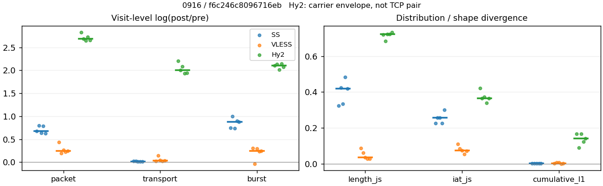
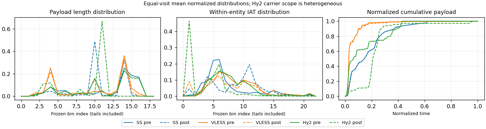

# 0916 · 条目 026 · youtube.com

目标：https://www.youtube.com/results?search_query=bicycle+maintenance

活动标签：youtube.com::search_results_view。选定访问 15 次。

[返回总索引](../../README.md) · [统计口径](../../methods.md)

## 覆盖与资格（每次访问均保留）

| 部署 | 重复 | 主请求路由 | 活动状态 | 代理比较 | DIRECT pre | 请求 proxy/direct/unresolved | 错误 |
| --- | --- | --- | --- | --- | --- | --- | --- |
| Hy2 | 1 | proxy | passed | 1 | 1 | 179/1/0 | [] |
| Hy2 | 2 | proxy | passed | 1 | 1 | 187/1/0 | [] |
| Hy2 | 3 | proxy | passed | 1 | 1 | 187/1/0 | [] |
| Hy2 | 4 | proxy | passed | 1 | 1 | 191/1/0 | [] |
| Hy2 | 5 | proxy | passed | 1 | 1 | 195/1/0 | [] |
| SS | 1 | proxy | passed | 1 | 0 | 188/0/0 | [] |
| SS | 2 | proxy | passed | 1 | 0 | 186/0/0 | [] |
| SS | 3 | proxy | passed | 1 | 0 | 195/0/0 | [] |
| SS | 4 | proxy | passed | 1 | 0 | 193/0/0 | [] |
| SS | 5 | proxy | passed | 1 | 0 | 187/0/0 | [] |
| VLESS | 1 | proxy | passed | 1 | 0 | 194/0/0 | [] |
| VLESS | 2 | proxy | passed | 1 | 0 | 186/0/0 | [] |
| VLESS | 3 | proxy | passed | 1 | 0 | 194/0/0 | [] |
| VLESS | 4 | proxy | passed | 1 | 0 | 188/0/0 | [] |
| VLESS | 5 | proxy | passed | 1 | 0 | 187/0/0 | [] |

主请求非 proxy 的统计仅解释为已索引的辅助代理连接或 DIRECT 观测，不代表目标业务经代理传输。播放确认与配对资格是两道不同的门。

图中散点为单次访问，短线为重复中位数；Hy2 是共享载体包络，不能与 TCP 配对作等范围因果对比。

形态图先逐访问归一化，再对访问等权平均；实线 pre，虚线 post。分箱序号及边界见 methods，不将分箱索引误解为长度或时间。

## 每次访问的关键观测

### SS

范围：`exclusive_page`。每格 pre → post；空值为不可观测/不适用。

| 重复 | 包数 | 载荷字节 | burst | TCP FR | IAT中位µs | length JS | IAT JS |
| --- | --- | --- | --- | --- | --- | --- | --- |
| 1 | 4008 → 7888 | 7.8074e+06 → 7.9767e+06 | 2788 → 5861 | 162 → 168 | 23.899 → 294.59 | 0.32267 | 0.22555 |
| 2 | 3678 → 8179 | 7.7717e+06 → 7.9388e+06 | 2619 → 7088 | 200 → 242 | 31.968 → 824.46 | 0.42304 | 0.25624 |
| 3 | 3982 → 7537 | 7.8416e+06 → 7.9317e+06 | 2628 → 5512 | 223 → 226 | 26.08 → 311.44 | 0.33291 | 0.25744 |
| 4 | 4162 → 9190 | 8.6147e+06 → 8.7166e+06 | 2971 → 7258 | 215 → 235 | 29.585 → 528.17 | 0.48408 | 0.22664 |
| 5 | 4411 → 8217 | 7.801e+06 → 7.885e+06 | 2986 → 7202 | 230 → 240 | 28.792 → 1020.5 | 0.42021 | 0.29956 |

完整标量统计：中位数 [min,max]；Δ 为重复内逐访问变换的中位数，MAD 未缩放。n 为可用变换数；DIRECT-only 的 nΔ=0 不代表 pre 不可用。

| scope | 特征 | pre | post | Δ | IQRΔ | MADΔ | nΔ |
| --- | --- | --- | --- | --- | --- | --- | --- |
| exclusive_page | active_span_sum_s_1000ms | 37.94 [27.734, 50.324] | 43.127 [34.332, 54.763] | 0.1229 | 0.016818 | 0.011579 | 5 |
| exclusive_page | active_span_sum_s_100ms | 14.164 [9.0648, 18.182] | 22.567 [16.378, 36.59] | 0.57971 | 0.12577 | 0.11394 | 5 |
| exclusive_page | active_span_sum_s_500ms | 30.53 [23.166, 45.55] | 38.705 [26.857, 49.924] | 0.12587 | 0.19687 | 0.036166 | 5 |
| exclusive_page | burst_bytes_iqr | 4096 [4096, 4344] | 1951.5 [1428, 2856] | -0.74141 | 0.69315 | 0.37111 | 5 |
| exclusive_page | burst_bytes_mad | 35 [31, 39] | 40 [32, 47] | 0.13353 | 0.19406 | 0.10178 | 5 |
| exclusive_page | burst_bytes_max | 26480 [20480, 28672] | 18564 [11424, 45696] | -0.36903 | 0.73967 | 0.47165 | 5 |
| exclusive_page | burst_bytes_mean | 2899.6 [2612.5, 2983.9] | 1201 [1094.8, 1439] | -0.86971 | 0.15215 | 0.10462 | 5 |
| exclusive_page | burst_bytes_median | 35 [31, 39] | 40 [32, 47] | 0.13353 | 0.19406 | 0.10178 | 5 |
| exclusive_page | burst_bytes_min | 0 [0, 0] | 0 [0, 0] | — | — | — | 0 |
| exclusive_page | burst_bytes_p95 | 14480 [11584, 16384] | 4284 [2856, 5712] | -1.2179 | 0.22973 | 0.16415 | 5 |
| exclusive_page | burst_bytes_q25 | 0 [0, 0] | 0 [0, 0] | — | — | — | 0 |
| exclusive_page | burst_bytes_q75 | 4096 [4096, 4344] | 1951.5 [1428, 2856] | -0.74141 | 0.69315 | 0.37111 | 5 |
| exclusive_page | burst_bytes_std | 4801.7 [4254.2, 5229.6] | 1707.7 [1362.8, 2266] | -1.0338 | 0.30206 | 0.19754 | 5 |
| exclusive_page | burst_count | 2788 [2619, 2986] | 7088 [5512, 7258] | 0.88042 | 0.15021 | 0.11519 | 5 |
| exclusive_page | burst_duration_ms_iqr | 0.01707 [0, 0.025207] | 0 [0, 0] | — | — | — | 0 |
| exclusive_page | burst_duration_ms_mad | 0 [0, 0] | 0 [0, 0] | — | — | — | 0 |
| exclusive_page | burst_duration_ms_max | 15001 [15001, 15001] | 30251 [30043, 47215] | 0.7014 | 0.11256 | 0.0068953 | 5 |
| exclusive_page | burst_duration_ms_mean | 81.29 [51.06, 117.78] | 21.019 [11.394, 33.26] | -1.4679 | 0.23545 | 0.12313 | 5 |
| exclusive_page | burst_duration_ms_median | 0 [0, 0] | 0 [0, 0] | — | — | — | 0 |
| exclusive_page | burst_duration_ms_min | 0 [0, 0] | 0 [0, 0] | — | — | — | 0 |
| exclusive_page | burst_duration_ms_p95 | 15.815 [6.7589, 21.175] | 0.75194 [0.57064, 0.97126] | -2.7901 | 0.58852 | 0.55363 | 5 |
| exclusive_page | burst_duration_ms_q25 | 0 [0, 0] | 0 [0, 0] | — | — | — | 0 |
| exclusive_page | burst_duration_ms_q75 | 0.01707 [0, 0.025207] | 0 [0, 0] | — | — | — | 0 |
| exclusive_page | burst_duration_ms_std | 1003.3 [782.34, 1242.8] | 588.84 [565.71, 730.36] | -0.53159 | 0.06088 | 0.059603 | 5 |
| exclusive_page | burst_packets_iqr | 1 [0, 1] | 0 [0, 0] | — | — | — | 0 |
| exclusive_page | burst_packets_mad | 0 [0, 0] | 0 [0, 0] | — | — | — | 0 |
| exclusive_page | burst_packets_max | 23 [12, 42] | 9 [8, 16] | -1.0561 | 0.93431 | 0.30207 | 5 |
| exclusive_page | burst_packets_mean | 1.4376 [1.4009, 1.5152] | 1.2662 [1.1409, 1.3674] | -0.10266 | 0.095324 | 0.036719 | 5 |
| exclusive_page | burst_packets_median | 1 [1, 1] | 1 [1, 1] | 0 | 0 | 0 | 5 |
| exclusive_page | burst_packets_min | 1 [1, 1] | 1 [1, 1] | 0 | 0 | 0 | 5 |
| exclusive_page | burst_packets_p95 | 3 [3, 3] | 2 [2, 3] | -0.40547 | 0.40547 | 0 | 5 |
| exclusive_page | burst_packets_q25 | 1 [1, 1] | 1 [1, 1] | 0 | 0 | 0 | 5 |
| exclusive_page | burst_packets_q75 | 2 [1, 2] | 1 [1, 1] | -0.69315 | 0.69315 | 0 | 5 |
| exclusive_page | burst_packets_std | 1.0559 [0.84833, 1.2961] | 0.6514 [0.50269, 0.85494] | -0.46912 | 0.075325 | 0.044584 | 5 |
| exclusive_page | connection_span_concurrency_max | 12 [9, 20] | 12 [9, 15] | 0 | 0.10536 | 0 | 5 |
| exclusive_page | cumulative_l1 | — | — | 0.0017604 | 0.00056132 | 0.00043816 | 5 |
| exclusive_page | cumulative_max | — | — | 0.033696 | 0.023317 | 0.010947 | 5 |
| exclusive_page | direction_entropy | 0.57414 [0.5284, 0.61037] | 0.3452 [0.29282, 0.36727] | -0.23557 | 0.016662 | 0.0091383 | 5 |
| exclusive_page | down_burst_count | 1387 [1300, 1485] | 3535 [2747, 3620] | 0.88357 | 0.15268 | 0.11678 | 5 |
| exclusive_page | down_ip_bytes | 7.8513e+06 [7.7862e+06, 8.6202e+06] | 8.0344e+06 [8.0003e+06, 8.8406e+06] | 0.025237 | 0.01023 | 0.0055483 | 5 |
| exclusive_page | down_packets | 2474 [2175, 2715] | 4407 [4293, 5191] | 0.6192 | 0.10341 | 0.060759 | 5 |
| exclusive_page | down_transport_bytes | 7.725e+06 [7.673e+06, 8.4914e+06] | 7.8049e+06 [7.7755e+06, 8.5701e+06] | 0.0092277 | 0.0078749 | 0.0011388 | 5 |
| exclusive_page | duration_s | 67.644 [66.435, 72.918] | 67.644 [66.433, 72.917] | -7.3966e-06 | 4.5807e-06 | 7.9596e-07 | 5 |
| exclusive_page | entity_count | 18 [14, 23] | 18 [14, 23] | 0 | 0 | 0 | 5 |
| exclusive_page | fr_runs | 215 [162, 230] | 235 [168, 242] | 0.04256 | 0.05258 | 0.029196 | 5 |
| exclusive_page | fr_runs_per_packet | 0.088514 [0.067782, 0.093589] | 0.051154 [0.037308, 0.055645] | -0.037944 | 0.0090021 | 0.0056537 | 5 |
| exclusive_page | fr_switches | 192 [148, 214] | 212 [154, 224] | 0.04567 | 0.059351 | 0.031142 | 5 |
| exclusive_page | fr_switches_per_possible_transition | 0.080907 [0.06229, 0.085458] | 0.047273 [0.034306, 0.051637] | -0.033957 | 0.0081673 | 0.0046862 | 5 |
| exclusive_page | full_retransmission_fraction | 0.0017579 [0.00068012, 0.002643] | 0.005876 [0.0023123, 0.012715] | 0.0034166 | 0.0038988 | 0.0017844 | 5 |
| exclusive_page | full_retransmission_packets | 7 [3, 11] | 54 [19, 104] | 1.8458 | 0.47957 | 0.25474 | 5 |
| exclusive_page | iat_count | 3994 [3659, 4395] | 8160 [7519, 9167] | 0.67877 | 0.15498 | 0.054984 | 5 |
| exclusive_page | iat_js | — | — | 0.25624 | 0.0308 | 0.029607 | 5 |
| exclusive_page | iat_ks | — | — | 0.39382 | 0.0054844 | 0.0041377 | 5 |
| exclusive_page | iat_median_us | 28.792 [23.899, 31.968] | 528.17 [294.59, 1020.5] | 2.8821 | 0.73827 | 0.37041 | 5 |
| exclusive_page | iat_us_iqr | 126.52 [85.532, 137.17] | 1636.5 [1009.3, 6413.6] | 2.5138 | 0.04865 | 0.045678 | 5 |
| exclusive_page | iat_us_mad | 21.206 [18.336, 24.379] | 516.95 [294.51, 1009.4] | 3.115 | 0.68412 | 0.35943 | 5 |
| exclusive_page | iat_us_max | 1.5001e+07 [1.5001e+07, 1.5001e+07] | 1.5486e+07 [1.5455e+07, 2.4065e+07] | 0.031813 | 0.002403 | 0.0020175 | 5 |
| exclusive_page | iat_us_mean | 1.5195e+05 [1.0739e+05, 1.8921e+05] | 66330 [24321, 90263] | -0.74013 | 0.18874 | 0.099933 | 5 |
| exclusive_page | iat_us_median | 28.792 [23.899, 31.968] | 528.17 [294.59, 1020.5] | 2.8821 | 0.73827 | 0.37041 | 5 |
| exclusive_page | iat_us_min | 0.049 [0.016, 0.081] | 0.036 [0.031, 0.038] | -0.27958 | 0.33663 | 0.31128 | 5 |
| exclusive_page | iat_us_p95 | 66319 [40816, 93547] | 22983 [14818, 25671] | -1.1173 | 0.331 | 0.19473 | 5 |
| exclusive_page | iat_us_q25 | 12.787 [11.328, 13.502] | 13.399 [11.505, 26.319] | 0.060773 | 0.33672 | 0.16026 | 5 |
| exclusive_page | iat_us_q75 | 139.3 [98.241, 150.68] | 1654.3 [1020.8, 6439.9] | 2.4253 | 0.07032 | 0.049151 | 5 |
| exclusive_page | iat_us_std | 1.3567e+06 [1.1586e+06, 1.6073e+06] | 8.9822e+05 [5.1029e+05, 1.1204e+06] | -0.36088 | 0.094419 | 0.051544 | 5 |
| exclusive_page | iat_wasserstein_log1p_us | — | — | 1.5504 | 0.077947 | 0.049941 | 5 |
| exclusive_page | idle_gap_count_1000ms | 51 [44, 61] | 48 [28, 57] | -0.067823 | 0.042916 | 0.035718 | 5 |
| exclusive_page | idle_gap_count_100ms | 132 [124, 208] | 119 [90, 133] | -0.17472 | 0.39809 | 0.19072 | 5 |
| exclusive_page | idle_gap_count_500ms | 64 [51, 68] | 59 [35, 66] | -0.081346 | 0.11894 | 0.081346 | 5 |
| exclusive_page | idle_gap_sum_s_1000ms | 518.06 [405.71, 727.97] | 498.12 [179.61, 680.74] | -0.039248 | 0.063565 | 0.033082 | 5 |
| exclusive_page | idle_gap_sum_s_100ms | 541.84 [427.59, 745.9] | 518.68 [196.61, 698.92] | -0.043675 | 0.047567 | 0.028424 | 5 |
| exclusive_page | idle_gap_sum_s_500ms | 525.47 [410.36, 731.16] | 499.88 [184.24, 685.58] | -0.049934 | 0.050196 | 0.033278 | 5 |
| exclusive_page | ip_bytes | 8.0307e+06 [7.9632e+06, 8.8314e+06] | 8.4471e+06 [8.3878e+06, 9.2724e+06] | 0.048732 | 0.010281 | 0.0052176 | 5 |
| exclusive_page | length_iqr | 4096 [3234, 6281] | 1428 [0, 1428] | -0.95741 | 0.31044 | 0.11815 | 4 |
| exclusive_page | length_js | — | — | 0.42021 | 0.090132 | 0.063867 | 5 |
| exclusive_page | length_ks | — | — | 0.53564 | 0.060844 | 0.040658 | 5 |
| exclusive_page | length_mad | 1944 [1656, 2400] | 281 [0, 1228] | -0.6454 | 0.84275 | 0.18604 | 3 |
| exclusive_page | length_max | 8920 [8920, 8920] | 9996 [8568, 14280] | 0.11389 | 0.14197 | 0.13353 | 5 |
| exclusive_page | length_mean | 3266.7 [2931.6, 3636.7] | 1795.3 [1666, 1825.4] | -0.612 | 0.10618 | 0.077271 | 5 |
| exclusive_page | length_median | 2896 [2896, 2896] | 1428 [1428, 1428] | -0.70706 | 0 | 0 | 5 |
| exclusive_page | length_min | 30 [13, 31] | 6 [3, 6] | -1.6094 | 0.17589 | 0.03279 | 5 |
| exclusive_page | length_p95 | 8192 [8192, 8350.4] | 2856 [2856, 2856] | -1.0537 | 0 | 0 | 5 |
| exclusive_page | length_q25 | 919 [744, 1026] | 1428 [1428, 1428] | 0.44074 | 0.11365 | 0.064031 | 5 |
| exclusive_page | length_q75 | 4840 [4096, 7200] | 2856 [1428, 2856] | -0.52749 | 0.50529 | 0.1669 | 5 |
| exclusive_page | length_std | 2828.4 [2481.9, 3031.9] | 969.6 [875.49, 1145.9] | -1.042 | 0.12838 | 0.098069 | 5 |
| exclusive_page | length_wasserstein_bytes | — | — | 1702.3 | 503.59 | 213.76 | 5 |
| exclusive_page | nonempty_entity_count | 18 [14, 23] | 18 [14, 23] | 0 | 0 | 0 | 5 |
| exclusive_page | nonempty_packets | 2429 [2137, 2661] | 4418 [4349, 5232] | 0.63345 | 0.11603 | 0.077092 | 5 |
| exclusive_page | offload_suspect_fraction | 0.38427 [0.37325, 0.3895] | 0.19966 [0.13928, 0.23086] | -0.18533 | 0.032732 | 0.026693 | 5 |
| exclusive_page | packet_count | 4008 [3678, 4411] | 8179 [7537, 9190] | 0.67705 | 0.15408 | 0.054946 | 5 |
| exclusive_page | rtt_median_ms | 0.051343 [0.036345, 0.053174] | 34.507 [33.207, 37.982] | 6.5895 | 0.18158 | 0.1141 | 5 |
| exclusive_page | rtt_sample_count | 1483 [1452, 1644] | 973 [752, 1127] | -0.40031 | 0.25507 | 0.02274 | 5 |
| exclusive_page | tcp_ack_count | 3991 [3657, 4395] | 8159 [7516, 9163] | 0.67927 | 0.1593 | 0.055726 | 5 |
| exclusive_page | tcp_fin_count | 36 [28, 46] | 36 [29, 57] | 0.077962 | 0.082692 | 0.04287 | 5 |
| exclusive_page | tcp_packet_count | 4008 [3678, 4411] | 8179 [7537, 9190] | 0.67705 | 0.15408 | 0.054946 | 5 |
| exclusive_page | tcp_rst_count | 2 [0, 18] | 1 [0, 2] | -1.0986 | 0.75204 | 0.40547 | 3 |
| exclusive_page | tcp_syn_count | 36 [28, 46] | 38 [29, 48] | 0.04256 | 0.025533 | 0.018065 | 5 |
| exclusive_page | tcp_window_raw_median | 65535 [65535, 65535] | 168 [148, 168] | -5.9664 | 0.011976 | 0 | 5 |
| exclusive_page | transition_entropy | 0.34876 [0.28905, 0.36903] | 0.21748 [0.16775, 0.23282] | -0.13621 | 0.022354 | 0.014907 | 5 |
| exclusive_page | transition_n_mm | 2002 [1724, 2223] | 4025 [3930, 4812] | 0.72613 | 0.12561 | 0.097864 | 5 |
| exclusive_page | transition_n_mp | 94 [72, 105] | 104 [75, 110] | 0.04652 | 0.060274 | 0.026912 | 5 |
| exclusive_page | transition_n_pm | 98 [76, 109] | 108 [79, 114] | 0.044851 | 0.058449 | 0.035281 | 5 |
| exclusive_page | transition_n_pp | 213 [200, 226] | 167 [143, 185] | -0.2433 | 0.093934 | 0.050815 | 5 |
| exclusive_page | transition_p_mm | 0.95485 [0.95091, 0.96571] | 0.97505 [0.97277, 0.98242] | 0.021862 | 0.0050057 | 0.0021313 | 5 |
| exclusive_page | transition_p_mp | 0.045149 [0.034286, 0.04909] | 0.024952 [0.017577, 0.027228] | -0.021862 | 0.0050057 | 0.0021313 | 5 |
| exclusive_page | transition_p_pm | 0.30247 [0.27536, 0.34385] | 0.38603 [0.35586, 0.42379] | 0.079943 | 0.014362 | 0.0080726 | 5 |
| exclusive_page | transition_p_pp | 0.69753 [0.65615, 0.72464] | 0.61397 [0.57621, 0.64414] | -0.079943 | 0.014362 | 0.0080726 | 5 |
| exclusive_page | transport_bytes | 7.8074e+06 [7.7717e+06, 8.6147e+06] | 7.9388e+06 [7.885e+06, 8.7166e+06] | 0.011766 | 0.0098544 | 0.0010545 | 5 |
| exclusive_page | up_burst_count | 1401 [1319, 1501] | 3553 [2765, 3638] | 0.8773 | 0.14777 | 0.11362 | 5 |
| exclusive_page | up_byte_fraction | 0.012698 [0.010554, 0.014307] | 0.015983 [0.012026, 0.017289] | 0.0024988 | 0.0013342 | 0.00078399 | 5 |
| exclusive_page | up_ip_bytes | 1.7813e+05 [1.6478e+05, 2.1112e+05] | 3.8758e+05 [3.4373e+05, 4.3184e+05] | 0.73525 | 0.04288 | 0.023242 | 5 |
| exclusive_page | up_packets | 1581 [1503, 1696] | 3886 [3130, 3999] | 0.83245 | 0.10268 | 0.072629 | 5 |
| exclusive_page | up_transport_bytes | 98683 [82396, 1.2325e+05] | 1.2677e+05 [95926, 1.4649e+05] | 0.17274 | 0.079496 | 0.020703 | 5 |
| exclusive_page | zero_iat_count | 0 [0, 0] | 0 [0, 0] | — | — | — | 0 |
| exclusive_page | zero_iat_fraction | 0 [0, 0] | 0 [0, 0] | 0 | 0 | 0 | 5 |

### VLESS

范围：`exclusive_page`。每格 pre → post；空值为不可观测/不适用。

| 重复 | 包数 | 载荷字节 | burst | TCP FR | IAT中位µs | length JS | IAT JS |
| --- | --- | --- | --- | --- | --- | --- | --- |
| 1 | 3447 → 5307 | 5.3199e+06 → 5.4651e+06 | 2679 → 3630 | 150 → 196 | 85.255 → 27.38 | 0.085748 | 0.11142 |
| 2 | 1378 → 1675 | 7.6036e+05 → 8.8214e+05 | 1136 → 1100 | 132 → 164 | 139.55 → 339.19 | 0.061854 | 0.084776 |
| 3 | 2636 → 3426 | 3.0414e+06 → 3.1823e+06 | 1760 → 2360 | 136 → 192 | 119.14 → 68.252 | 0.035737 | 0.075151 |
| 4 | 3778 → 4740 | 4.1419e+06 → 4.261e+06 | 2604 → 3295 | 144 → 176 | 145.79 → 90.733 | 0.028625 | 0.054025 |
| 5 | 2749 → 3499 | 3.226e+06 → 3.3322e+06 | 1966 → 2498 | 130 → 160 | 144.16 → 80.798 | 0.027636 | 0.071541 |

完整标量统计：中位数 [min,max]；Δ 为重复内逐访问变换的中位数，MAD 未缩放。n 为可用变换数；DIRECT-only 的 nΔ=0 不代表 pre 不可用。

| scope | 特征 | pre | post | Δ | IQRΔ | MADΔ | nΔ |
| --- | --- | --- | --- | --- | --- | --- | --- |
| exclusive_page | active_span_sum_s_1000ms | 23.367 [22.698, 30.463] | 25.914 [22.867, 35.836] | 0.09227 | 0.089677 | 0.070175 | 5 |
| exclusive_page | active_span_sum_s_100ms | 2.8728 [2.4367, 4.5422] | 9.7786 [8.6963, 12.307] | 1.1323 | 0.19988 | 0.10425 | 5 |
| exclusive_page | active_span_sum_s_500ms | 11.825 [9.9131, 14.358] | 23.973 [20.141, 30.689] | 0.70892 | 0.058683 | 0.050702 | 5 |
| exclusive_page | burst_bytes_iqr | 2896 [968.75, 2896] | 2824 [1448, 2824] | -0.025176 | 0.025176 | 0 | 5 |
| exclusive_page | burst_bytes_mad | 0 [0, 0] | 31.5 [24, 53] | — | — | — | 0 |
| exclusive_page | burst_bytes_max | 20480 [5792, 22518] | 20272 [6308, 25992] | 0.085341 | 0.18976 | 0.095549 | 5 |
| exclusive_page | burst_bytes_mean | 1640.9 [669.33, 1985.8] | 1333.9 [801.95, 1505.5] | -0.2071 | 0.041047 | 0.040949 | 5 |
| exclusive_page | burst_bytes_median | 0 [0, 0] | 31.5 [24, 53] | — | — | — | 0 |
| exclusive_page | burst_bytes_min | 0 [0, 0] | 0 [0, 0] | — | — | — | 0 |
| exclusive_page | burst_bytes_p95 | 7240 [2896, 10136] | 4344 [2896, 5792] | -0.55962 | 0.13999 | 0.091201 | 5 |
| exclusive_page | burst_bytes_q25 | 0 [0, 0] | 0 [0, 0] | — | — | — | 0 |
| exclusive_page | burst_bytes_q75 | 2896 [968.75, 2896] | 2824 [1448, 2824] | -0.025176 | 0.025176 | 0 | 5 |
| exclusive_page | burst_bytes_std | 2784.1 [1155.2, 3920] | 1785.1 [1232.5, 2251.9] | -0.42801 | 0.018541 | 0.016456 | 5 |
| exclusive_page | burst_count | 1966 [1136, 2679] | 2498 [1100, 3630] | 0.23949 | 0.05799 | 0.053858 | 5 |
| exclusive_page | burst_duration_ms_iqr | 0.15256 [0, 0.38333] | 0.000258 [7.5e-05, 0.012584] | -6.3823 | 2.4829 | 1.462 | 3 |
| exclusive_page | burst_duration_ms_mad | 0 [0, 0] | 0 [0, 0] | — | — | — | 0 |
| exclusive_page | burst_duration_ms_max | 15001 [15001, 15001] | 15049 [14979, 15238] | 0.0031973 | 0.008404 | 0.0046165 | 5 |
| exclusive_page | burst_duration_ms_mean | 128.55 [30.136, 242.19] | 34.978 [21.893, 122.7] | -0.67996 | 0.44907 | 0.36039 | 5 |
| exclusive_page | burst_duration_ms_median | 0 [0, 0] | 0 [0, 0] | — | — | — | 0 |
| exclusive_page | burst_duration_ms_min | 0 [0, 0] | 0 [0, 0] | — | — | — | 0 |
| exclusive_page | burst_duration_ms_p95 | 7.2662 [4.5298, 202.58] | 8.7181 [3.4862, 155.72] | -0.26186 | 0.44524 | 0.44402 | 5 |
| exclusive_page | burst_duration_ms_q25 | 0 [0, 0] | 0 [0, 0] | — | — | — | 0 |
| exclusive_page | burst_duration_ms_q75 | 0.15256 [0, 0.38333] | 0.000258 [7.5e-05, 0.012584] | -6.3823 | 2.4829 | 1.462 | 3 |
| exclusive_page | burst_duration_ms_std | 1260.8 [515.16, 1727.4] | 632.46 [485.85, 1249.3] | -0.32403 | 0.29134 | 0.24153 | 5 |
| exclusive_page | burst_packets_iqr | 1 [0, 1] | 1 [1, 1] | 0 | 0 | 0 | 3 |
| exclusive_page | burst_packets_mad | 0 [0, 0] | 0 [0, 0] | — | — | — | 0 |
| exclusive_page | burst_packets_max | 7 [3, 16] | 9 [7, 11] | 0.15415 | 0.45199 | 0.29783 | 5 |
| exclusive_page | burst_packets_mean | 1.3983 [1.213, 1.4977] | 1.4517 [1.4007, 1.5227] | 0.0017506 | 0.13625 | 0.032968 | 5 |
| exclusive_page | burst_packets_median | 1 [1, 1] | 1 [1, 1] | 0 | 0 | 0 | 5 |
| exclusive_page | burst_packets_min | 1 [1, 1] | 1 [1, 1] | 0 | 0 | 0 | 5 |
| exclusive_page | burst_packets_p95 | 2 [2, 3] | 3 [3, 4] | 0.40547 | 0 | 0 | 5 |
| exclusive_page | burst_packets_q25 | 1 [1, 1] | 1 [1, 1] | 0 | 0 | 0 | 5 |
| exclusive_page | burst_packets_q75 | 2 [1, 2] | 2 [2, 2] | 0 | 0.69315 | 0 | 5 |
| exclusive_page | burst_packets_std | 0.63036 [0.46007, 0.75227] | 0.92296 [0.77332, 1.0271] | 0.27146 | 0.079498 | 0.049343 | 5 |
| exclusive_page | connection_span_concurrency_max | 11 [9, 16] | 11 [9, 11] | 0 | 0 | 0 | 5 |
| exclusive_page | cumulative_l1 | — | — | 0.0028913 | 0.0056841 | 0.0022539 | 5 |
| exclusive_page | cumulative_max | — | — | 0.034769 | 0.019825 | 0.0073425 | 5 |
| exclusive_page | direction_entropy | 0.38564 [0.37169, 0.70812] | 0.36933 [0.33771, 0.68282] | -0.026901 | 0.021264 | 0.010586 | 5 |
| exclusive_page | down_burst_count | 976 [560, 1329] | 1242 [542, 1805] | 0.24102 | 0.061869 | 0.057811 | 5 |
| exclusive_page | down_ip_bytes | 3.2677e+06 [7.4318e+05, 5.3514e+06] | 3.3634e+06 [8.4232e+05, 5.5103e+06] | 0.029258 | 0.011143 | 0.004042 | 5 |
| exclusive_page | down_packets | 1699 [730, 2381] | 2009 [897, 3028] | 0.18018 | 0.038414 | 0.025831 | 5 |
| exclusive_page | down_transport_bytes | 3.1793e+06 [7.0509e+05, 5.2468e+06] | 3.2588e+06 [7.9554e+05, 5.3527e+06] | 0.024717 | 0.014688 | 0.0047352 | 5 |
| exclusive_page | duration_s | 68.16 [65.353, 71.967] | 68.083 [65.327, 71.948] | -0.00038943 | 0.00023444 | 0.00012615 | 5 |
| exclusive_page | entity_count | 16 [14, 21] | 16 [14, 21] | 0 | 0 | 0 | 5 |
| exclusive_page | fr_runs | 136 [130, 150] | 176 [160, 196] | 0.21706 | 0.05984 | 0.016394 | 5 |
| exclusive_page | fr_runs_per_packet | 0.079657 [0.062827, 0.20402] | 0.08222 [0.065549, 0.20222] | 0.0025631 | 0.0045212 | 0.0043621 | 5 |
| exclusive_page | fr_switches | 116 [116, 129] | 160 [146, 175] | 0.24362 | 0.074957 | 0.020479 | 5 |
| exclusive_page | fr_switches_per_possible_transition | 0.071693 [0.056239, 0.18384] | 0.075569 [0.059948, 0.18616] | 0.0037085 | 0.0015476 | 0.0013802 | 5 |
| exclusive_page | full_retransmission_fraction | 0.00075873 [0, 0.0017406] | 0 [0, 0.00029189] | -0.00046684 | 0.0004303 | 0.00032723 | 5 |
| exclusive_page | full_retransmission_packets | 2 [0, 6] | 0 [0, 1] | -0.69315 | — | — | 1 |
| exclusive_page | iat_count | 2735 [1362, 3762] | 3485 [1659, 5286] | 0.24234 | 0.036187 | 0.021556 | 5 |
| exclusive_page | iat_js | — | — | 0.075151 | 0.013235 | 0.0096247 | 5 |
| exclusive_page | iat_ks | — | — | 0.15973 | 0.03763 | 0.022275 | 5 |
| exclusive_page | iat_median_us | 139.55 [85.255, 145.79] | 80.798 [27.38, 339.19] | -0.55709 | 0.10473 | 0.082837 | 5 |
| exclusive_page | iat_us_iqr | 967.76 [840.71, 2341.1] | 878.74 [540.42, 4376.3] | 0.016163 | 0.049162 | 0.038092 | 5 |
| exclusive_page | iat_us_mad | 131.97 [75.039, 136.23] | 77.688 [27.244, 339.08] | -0.46111 | 0.097351 | 0.092068 | 5 |
| exclusive_page | iat_us_max | 1.5001e+07 [1.5001e+07, 1.5001e+07] | 1.5456e+07 [1.5382e+07, 1.5482e+07] | 0.029879 | 0.00058294 | 0.00054055 | 5 |
| exclusive_page | iat_us_mean | 1.9803e+05 [99583, 4.5371e+05] | 1.5759e+05 [64443, 3.7217e+05] | -0.24336 | 0.20675 | 0.045259 | 5 |
| exclusive_page | iat_us_median | 139.55 [85.255, 145.79] | 80.798 [27.38, 339.19] | -0.55709 | 0.10473 | 0.082837 | 5 |
| exclusive_page | iat_us_min | 0.331 [0.138, 1.371] | 0.035 [0.031, 0.036] | -2.3681 | 0.76895 | 0.47678 | 5 |
| exclusive_page | iat_us_p95 | 9702.1 [9619.6, 4.1325e+05] | 43075 [39690, 1.5719e+05] | 1.4173 | 1.2854 | 0.079906 | 5 |
| exclusive_page | iat_us_q25 | 35.777 [26.906, 38.933] | 11.316 [7.278, 16.69] | -0.91099 | 0.43229 | 0.14305 | 5 |
| exclusive_page | iat_us_q75 | 1003.5 [868.85, 2377.1] | 889.64 [547.7, 4393] | -0.0049521 | 0.038446 | 0.037096 | 5 |
| exclusive_page | iat_us_std | 1.6355e+06 [1.1348e+06, 2.441e+06] | 1.4592e+06 [9.2118e+05, 2.2281e+06] | -0.11275 | 0.096641 | 0.02149 | 5 |
| exclusive_page | iat_wasserstein_log1p_us | — | — | 0.7125 | 0.078656 | 0.062886 | 5 |
| exclusive_page | idle_gap_count_1000ms | 48 [26, 65] | 45 [23, 59] | -0.082238 | 0.1397 | 0.099333 | 5 |
| exclusive_page | idle_gap_count_100ms | 107 [91, 122] | 121 [101, 135] | 0.16034 | 0.10571 | 0.056082 | 5 |
| exclusive_page | idle_gap_count_500ms | 67 [48, 85] | 46 [30, 66] | -0.36179 | 0.21655 | 0.10834 | 5 |
| exclusive_page | idle_gap_sum_s_1000ms | 593.86 [310.71, 802.66] | 530.14 [304.81, 715.77] | -0.0081474 | 0.015218 | 0.0067399 | 5 |
| exclusive_page | idle_gap_sum_s_100ms | 615.41 [336.77, 822.92] | 545.26 [328.34, 732.88] | -0.013255 | 0.014453 | 0.0029763 | 5 |
| exclusive_page | idle_gap_sum_s_500ms | 606.13 [326.81, 815.42] | 530.81 [309.96, 720.46] | -0.022135 | 0.032065 | 0.0056848 | 5 |
| exclusive_page | ip_bytes | 3.3688e+06 [8.319e+05, 5.4991e+06] | 3.5157e+06 [9.7057e+05, 5.7436e+06] | 0.043491 | 0.013603 | 0.0047187 | 5 |
| exclusive_page | length_iqr | 2750 [2335, 2752] | 2680 [1376, 2752] | -0.014447 | 0.089357 | 0.014447 | 5 |
| exclusive_page | length_js | — | — | 0.035737 | 0.033229 | 0.0081009 | 5 |
| exclusive_page | length_ks | — | — | 0.095851 | 0.030826 | 0.019869 | 5 |
| exclusive_page | length_mad | 1304 [732, 1424] | 1340 [1021, 1376] | 0.027233 | 0.13633 | 0.083309 | 5 |
| exclusive_page | length_max | 8920 [5792, 8920] | 8760 [2896, 10136] | -0.0181 | 0.15415 | 0.12072 | 5 |
| exclusive_page | length_mean | 1952.1 [1175.2, 2732.4] | 1699.1 [1087.7, 1859.5] | -0.13884 | 0.01368 | 0.0089395 | 5 |
| exclusive_page | length_median | 1520 [804, 2824] | 1412 [1093, 1484] | -0.073703 | 0.021105 | 0.021105 | 5 |
| exclusive_page | length_min | 24 [24, 24] | 24 [8, 24] | 0 | 0 | 0 | 5 |
| exclusive_page | length_p95 | 5648 [2824, 8688] | 3040 [2824, 4344] | -0.39683 | 0.30659 | 0.22261 | 5 |
| exclusive_page | length_q25 | 74 [72, 561] | 108 [72, 715] | 0.24256 | 0.31585 | 0.1355 | 5 |
| exclusive_page | length_q75 | 2824 [2824, 2896] | 2824 [1448, 2824] | 0 | 0.025176 | 0 | 5 |
| exclusive_page | length_std | 1746.6 [1230.9, 2482] | 1396.5 [1028.5, 1476.6] | -0.21967 | 0.066658 | 0.039952 | 5 |
| exclusive_page | length_wasserstein_bytes | — | — | 273.75 | 114.98 | 55.871 | 5 |
| exclusive_page | nonempty_entity_count | 16 [14, 21] | 16 [14, 21] | 0 | 0 | 0 | 5 |
| exclusive_page | nonempty_packets | 1632 [647, 2292] | 1946 [811, 2939] | 0.18414 | 0.049952 | 0.025883 | 5 |
| exclusive_page | offload_suspect_fraction | 0.32319 [0.1553, 0.36147] | 0.24781 [0.11104, 0.28208] | -0.068383 | 0.011862 | 0.0071242 | 5 |
| exclusive_page | packet_count | 2749 [1378, 3778] | 3499 [1675, 5307] | 0.24124 | 0.035288 | 0.020891 | 5 |
| exclusive_page | rtt_median_ms | 0.16753 [0.062581, 0.21906] | 0.048018 [0.030717, 0.07784] | -1.0347 | 0.57191 | 0.32306 | 5 |
| exclusive_page | rtt_sample_count | 1010 [590, 1384] | 1434 [694, 2200] | 0.35052 | 0.088706 | 0.071962 | 5 |
| exclusive_page | tcp_ack_count | 2707 [1331, 3732] | 3485 [1659, 5284] | 0.25263 | 0.04192 | 0.024793 | 5 |
| exclusive_page | tcp_fin_count | 31 [28, 39] | 32 [28, 42] | 0.031749 | 0.039221 | 0.031749 | 5 |
| exclusive_page | tcp_packet_count | 2749 [1378, 3778] | 3499 [1675, 5307] | 0.24124 | 0.035288 | 0.020891 | 5 |
| exclusive_page | tcp_rst_count | 31 [28, 45] | 1 [0, 13] | -2.9957 | 1.0797 | 0.40547 | 3 |
| exclusive_page | tcp_syn_count | 32 [28, 42] | 32 [28, 42] | 0 | 0 | 0 | 5 |
| exclusive_page | tcp_window_raw_median | 65535 [65478, 65535] | 170 [141, 195] | -5.9545 | 0.11155 | 0.057158 | 5 |
| exclusive_page | transition_entropy | 0.27415 [0.23516, 0.57072] | 0.28125 [0.23629, 0.57016] | 0.0059948 | 0.0076575 | 0.0065538 | 5 |
| exclusive_page | transition_n_mm | 1444 [456, 2056] | 1728 [582, 2657] | 0.2255 | 0.06443 | 0.04595 | 5 |
| exclusive_page | transition_n_mp | 51 [50, 56] | 72 [66, 79] | 0.27763 | 0.096992 | 0.026317 | 5 |
| exclusive_page | transition_n_pm | 66 [65, 75] | 88 [80, 98] | 0.21706 | 0.05984 | 0.016394 | 5 |
| exclusive_page | transition_n_pp | 71 [58, 149] | 85 [58, 86] | 0 | 0.17599 | 0.09685 | 5 |
| exclusive_page | transition_p_mm | 0.96589 [0.90119, 0.97348] | 0.96321 [0.89815, 0.97184] | -0.0026756 | 0.00070662 | 0.00036204 | 5 |
| exclusive_page | transition_p_mp | 0.034114 [0.026515, 0.098814] | 0.036789 [0.028164, 0.10185] | 0.0026756 | 0.00070662 | 0.00036204 | 5 |
| exclusive_page | transition_p_pm | 0.5137 [0.30374, 0.52846] | 0.53261 [0.50867, 0.57971] | 0.051255 | 0.039823 | 0.021432 | 5 |
| exclusive_page | transition_p_pp | 0.4863 [0.47154, 0.69626] | 0.46739 [0.42029, 0.49133] | -0.051255 | 0.039823 | 0.021432 | 5 |
| exclusive_page | transport_bytes | 3.226e+06 [7.6036e+05, 5.3199e+06] | 3.3322e+06 [8.8214e+05, 5.4651e+06] | 0.032388 | 0.016943 | 0.0054597 | 5 |
| exclusive_page | up_burst_count | 990 [576, 1350] | 1256 [558, 1825] | 0.23798 | 0.054189 | 0.049981 | 5 |
| exclusive_page | up_byte_fraction | 0.015355 [0.013745, 0.072685] | 0.022515 [0.020572, 0.098168] | 0.0075307 | 0.0021395 | 0.00070373 | 5 |
| exclusive_page | up_ip_bytes | 1.1815e+05 [88719, 1.4767e+05] | 1.7723e+05 [1.2825e+05, 2.3323e+05] | 0.40552 | 0.023075 | 0.01897 | 5 |
| exclusive_page | up_packets | 1050 [648, 1438] | 1490 [778, 2279] | 0.34999 | 0.042563 | 0.033234 | 5 |
| exclusive_page | up_transport_bytes | 63597 [46707, 73125] | 95935 [73338, 1.1243e+05] | 0.43017 | 0.037996 | 0.019065 | 5 |
| exclusive_page | zero_iat_count | 0 [0, 0] | 0 [0, 0] | — | — | — | 0 |
| exclusive_page | zero_iat_fraction | 0 [0, 0] | 0 [0, 0] | 0 | 0 | 0 | 5 |

### Hy2

范围：`carrier_context_envelope`。每格 pre → post；空值为不可观测/不适用。

| 重复 | 包数 | 载荷字节 | burst | TCP FR | IAT中位µs | length JS | IAT JS |
| --- | --- | --- | --- | --- | --- | --- | --- |
| 1 | 2974 → 50124 | 6.0054e+06 → 5.432e+07 | 1962 → 16049 | — | 110.96 → 2.368 | 0.71928 | 0.42129 |
| 2 | 3654 → 53917 | 7.7182e+06 → 5.7143e+07 | 2280 → 19271 | — | 69.443 → 4.7465 | 0.68306 | 0.36591 |
| 3 | 4171 → 58587 | 7.8058e+06 → 6.2616e+07 | 2738 → 20560 | — | 91.521 → 5.2295 | 0.72255 | 0.37198 |
| 4 | 3293 → 50347 | 7.796e+06 → 5.3697e+07 | 2031 → 17304 | — | 66.3 → 4.8815 | 0.72327 | 0.34045 |
| 5 | 3637 → 51945 | 7.8702e+06 → 5.5115e+07 | 2322 → 18379 | — | 76.817 → 5.0835 | 0.73248 | 0.36558 |

范围：`direct_pre_only`。每格 pre → post；空值为不可观测/不适用。

| 重复 | 包数 | 载荷字节 | burst | TCP FR | IAT中位µs | length JS | IAT JS |
| --- | --- | --- | --- | --- | --- | --- | --- |
| 1 | 31 → — | 8617 → — | 21 → — | 5 → — | 190.1 → — | — | — |
| 2 | 29 → — | 8616 → — | 21 → — | 7 → — | 152.54 → — | — | — |
| 3 | 27 → — | 8615 → — | 19 → — | 7 → — | 202.03 → — | — | — |
| 4 | 35 → — | 8640 → — | 27 → — | 7 → — | 164.07 → — | — | — |
| 5 | 29 → — | 8616 → — | 19 → — | 5 → — | 158.66 → — | — | — |

完整标量统计：中位数 [min,max]；Δ 为重复内逐访问变换的中位数，MAD 未缩放。n 为可用变换数；DIRECT-only 的 nΔ=0 不代表 pre 不可用。

| scope | 特征 | pre | post | Δ | IQRΔ | MADΔ | nΔ |
| --- | --- | --- | --- | --- | --- | --- | --- |
| carrier_context_envelope | active_span_sum_s_1000ms | 21.179 [16.43, 27.423] | 23.918 [23.227, 29.341] | 0.099407 | 0.057162 | 0.03178 | 5 |
| carrier_context_envelope | active_span_sum_s_100ms | 3.001 [2.6212, 4.1191] | 10.098 [9.7778, 12.854] | 1.2242 | 0.04766 | 0.043022 | 5 |
| carrier_context_envelope | active_span_sum_s_500ms | 17.391 [11.629, 22.072] | 21.428 [19.249, 26.444] | 0.18069 | 0.17765 | 0.079184 | 5 |
| carrier_context_envelope | burst_bytes_iqr | 4634 [2979, 5377] | 5069 [4237.5, 5089] | 0.089723 | 0.19561 | 0.14477 | 5 |
| carrier_context_envelope | burst_bytes_mad | 39 [0, 39] | 268 [265, 343] | 2.0366 | 0.22636 | 0.11103 | 4 |
| carrier_context_envelope | burst_bytes_max | 26032 [22000, 26380] | 2.319e+05 [1.6696e+05, 2.7173e+05] | 2.2363 | 0.17187 | 0.09585 | 5 |
| carrier_context_envelope | burst_bytes_mean | 3385.2 [2850.9, 3838.5] | 3045.5 [2965.3, 3384.6] | -0.12245 | 0.19848 | 0.090207 | 5 |
| carrier_context_envelope | burst_bytes_median | 39 [0, 39] | 301 [298, 376] | 2.1533 | 0.22112 | 0.11124 | 4 |
| carrier_context_envelope | burst_bytes_min | 0 [0, 0] | 22 [22, 22] | — | — | — | 0 |
| carrier_context_envelope | burst_bytes_p95 | 17806 [15299, 20480] | 10932 [10932, 11528] | -0.43476 | 0.085138 | 0.054992 | 5 |
| carrier_context_envelope | burst_bytes_q25 | 0 [0, 0] | 85.5 [68, 99] | — | — | — | 0 |
| carrier_context_envelope | burst_bytes_q75 | 4634 [2979, 5377] | 5168 [4323, 5168] | 0.10907 | 0.19457 | 0.14871 | 5 |
| carrier_context_envelope | burst_bytes_std | 5531.9 [4956, 6388.6] | 5709.7 [5528.3, 7595.5] | 0.031642 | 0.22421 | 0.1595 | 5 |
| carrier_context_envelope | burst_count | 2280 [1962, 2738] | 18379 [16049, 20560] | 2.1017 | 0.065646 | 0.032902 | 5 |
| carrier_context_envelope | burst_duration_ms_iqr | 0.12938 [0.069605, 0.17406] | 0.025009 [0.023845, 0.025353] | -1.6298 | 0.66558 | 0.31033 | 5 |
| carrier_context_envelope | burst_duration_ms_mad | 0 [0, 0] | 4.4e-05 [4.1e-05, 4.5e-05] | — | — | — | 0 |
| carrier_context_envelope | burst_duration_ms_max | 15001 [15001, 15001] | 10000 [239.72, 11930] | -0.40552 | 0.94116 | 0.17646 | 5 |
| carrier_context_envelope | burst_duration_ms_mean | 114.11 [71.817, 141.74] | 0.97091 [0.2854, 1.6537] | -4.6765 | 0.88541 | 0.51257 | 5 |
| carrier_context_envelope | burst_duration_ms_median | 0 [0, 0] | 4.4e-05 [4.1e-05, 4.5e-05] | — | — | — | 0 |
| carrier_context_envelope | burst_duration_ms_min | 0 [0, 0] | 0 [0, 0] | — | — | — | 0 |
| carrier_context_envelope | burst_duration_ms_p95 | 8.1178 [4.8073, 24.628] | 0.10718 [0.083432, 0.11684] | -4.5778 | 1.2965 | 0.77443 | 5 |
| carrier_context_envelope | burst_duration_ms_q25 | 0 [0, 0] | 0 [0, 0] | — | — | — | 0 |
| carrier_context_envelope | burst_duration_ms_q75 | 0.12938 [0.069605, 0.17406] | 0.025009 [0.023845, 0.025353] | -1.6298 | 0.66558 | 0.31033 | 5 |
| carrier_context_envelope | burst_duration_ms_std | 1192.5 [960.65, 1333.2] | 70.684 [4.6458, 113.54] | -2.8256 | 1.0528 | 0.60657 | 5 |
| carrier_context_envelope | burst_packets_iqr | 1 [1, 1] | 3 [3, 3] | 1.0986 | 0 | 0 | 5 |
| carrier_context_envelope | burst_packets_mad | 0 [0, 0] | 1 [1, 1] | — | — | — | 0 |
| carrier_context_envelope | burst_packets_max | 16 [8, 33] | 174 [127, 199] | 2.5207 | 0.8812 | 0.49971 | 5 |
| carrier_context_envelope | burst_packets_mean | 1.5663 [1.5158, 1.6214] | 2.8496 [2.7978, 3.1232] | 0.59025 | 0.041507 | 0.033049 | 5 |
| carrier_context_envelope | burst_packets_median | 1 [1, 1] | 2 [2, 2] | 0.69315 | 0 | 0 | 5 |
| carrier_context_envelope | burst_packets_min | 1 [1, 1] | 1 [1, 1] | 0 | 0 | 0 | 5 |
| carrier_context_envelope | burst_packets_p95 | 3 [3, 3] | 8 [8, 8] | 0.98083 | 0 | 0 | 5 |
| carrier_context_envelope | burst_packets_q25 | 1 [1, 1] | 1 [1, 1] | 0 | 0 | 0 | 5 |
| carrier_context_envelope | burst_packets_q75 | 2 [2, 2] | 4 [4, 4] | 0.69315 | 0 | 0 | 5 |
| carrier_context_envelope | burst_packets_std | 0.90361 [0.76468, 1.1978] | 3.8873 [3.8248, 5.2902] | 1.5147 | 0.4759 | 0.25251 | 5 |
| carrier_context_envelope | connection_span_concurrency_max | 12 [10, 13] | 1 [1, 1] | -2.4849 | 0.080043 | 0.080043 | 5 |
| carrier_context_envelope | cumulative_l1 | — | — | 0.14226 | 0.043673 | 0.023575 | 5 |
| carrier_context_envelope | cumulative_max | — | — | 0.71601 | 0.3405 | 0.17999 | 5 |
| carrier_context_envelope | direction_entropy | 0.556 [0.52883, 0.59707] | 0.77418 [0.75206, 0.78941] | 0.20792 | 0.046084 | 0.02289 | 5 |
| carrier_context_envelope | direction_run_analog_runs | 198 [144, 214] | 18379 [16049, 20560] | 4.5769 | 0.079784 | 0.065926 | 5 |
| carrier_context_envelope | direction_run_analog_runs_per_packet | 0.086157 [0.076037, 0.095153] | 0.35093 [0.32019, 0.35742] | 0.25866 | 0.013132 | 0.012006 | 5 |
| carrier_context_envelope | direction_run_analog_switches | 182 [128, 192] | 18378 [16048, 20559] | 4.6649 | 0.081098 | 0.062162 | 5 |
| carrier_context_envelope | direction_run_analog_switches_per_possible_transition | 0.079473 [0.070325, 0.086215] | 0.35092 [0.32017, 0.35741] | 0.26759 | 0.0128 | 0.0094185 | 5 |
| carrier_context_envelope | down_burst_count | 1132 [973, 1361] | 9189 [8024, 10280] | 2.1098 | 0.063171 | 0.031608 | 5 |
| carrier_context_envelope | down_ip_bytes | 7.8177e+06 [6.0353e+06, 7.8787e+06] | 5.5221e+07 [5.3859e+07, 6.2924e+07] | 1.9993 | 0.13415 | 0.069331 | 5 |
| carrier_context_envelope | down_packets | 2296 [1849, 2635] | 39806 [38918, 45240] | 2.8617 | 0.055307 | 0.018629 | 5 |
| carrier_context_envelope | down_transport_bytes | 7.7071e+06 [5.939e+06, 7.7591e+06] | 5.4107e+07 [5.277e+07, 6.1657e+07] | 1.9949 | 0.13654 | 0.071115 | 5 |
| carrier_context_envelope | duration_s | 65.188 [63.006, 66.867] | 65.171 [63.005, 66.853] | -0.00019916 | 0.00013132 | 6.1052e-05 | 5 |
| carrier_context_envelope | entity_count | 16 [15, 22] | 1 [1, 1] | -2.7726 | 0 | 0 | 5 |
| carrier_context_envelope | full_retransmission_fraction | 0.0024746 [0.0019157, 0.0057162] | — | — | — | — | 0 |
| carrier_context_envelope | full_retransmission_packets | 9 [7, 17] | — | — | — | — | 0 |
| carrier_context_envelope | iat_count | 3615 [2958, 4155] | 51944 [50123, 58586] | 2.696 | 0.066611 | 0.035692 | 5 |
| carrier_context_envelope | iat_js | — | — | 0.36591 | 0.0063987 | 0.0060683 | 5 |
| carrier_context_envelope | iat_ks | — | — | 0.51243 | 0.01527 | 0.014845 | 5 |
| carrier_context_envelope | iat_median_us | 76.817 [66.3, 110.96] | 4.8815 [2.368, 5.2295] | -2.7154 | 0.17915 | 0.10668 | 5 |
| carrier_context_envelope | iat_us_iqr | 428.5 [410.51, 839.09] | 24.112 [23.11, 25.422] | -2.8645 | 0.46486 | 0.039824 | 5 |
| carrier_context_envelope | iat_us_mad | 67.936 [57.299, 100.02] | 4.8455 [2.333, 5.1935] | -2.5999 | 0.2325 | 0.12964 | 5 |
| carrier_context_envelope | iat_us_max | 1.5001e+07 [1.5001e+07, 1.5001e+07] | 1.0001e+07 [1e+07, 1.0001e+07] | -0.40546 | 1.5639e-05 | 1.2782e-05 | 5 |
| carrier_context_envelope | iat_us_mean | 1.94e+05 [1.7506e+05, 2.347e+05] | 1254.6 [1097.2, 1327.9] | -5.0724 | 0.037925 | 0.023111 | 5 |
| carrier_context_envelope | iat_us_median | 76.817 [66.3, 110.96] | 4.8815 [2.368, 5.2295] | -2.7154 | 0.17915 | 0.10668 | 5 |
| carrier_context_envelope | iat_us_min | 0.059 [0.01, 0.432] | 0 [0, 0] | — | — | — | 0 |
| carrier_context_envelope | iat_us_p95 | 10919 [8520.3, 30856] | 152.18 [119.14, 259.56] | -4.4915 | 0.092288 | 0.090018 | 5 |
| carrier_context_envelope | iat_us_q25 | 19.675 [18.245, 25.263] | 0.044 [0.043, 0.045] | -6.0947 | 0.18825 | 0.067282 | 5 |
| carrier_context_envelope | iat_us_q75 | 446.74 [430.03, 864.36] | 24.157 [23.154, 25.466] | -2.908 | 0.45076 | 0.043384 | 5 |
| carrier_context_envelope | iat_us_std | 1.6018e+06 [1.4993e+06, 1.7984e+06] | 73687 [69137, 85510] | -3.0577 | 0.053198 | 0.041569 | 5 |
| carrier_context_envelope | iat_wasserstein_log1p_us | — | — | 2.9791 | 0.12703 | 0.058201 | 5 |
| carrier_context_envelope | idle_gap_count_1000ms | 59 [46, 64] | 7 [5, 10] | -1.8827 | 0.25131 | 0.12487 | 5 |
| carrier_context_envelope | idle_gap_count_100ms | 136 [97, 143] | 74 [61, 80] | -0.61592 | 0.11473 | 0.077231 | 5 |
| carrier_context_envelope | idle_gap_count_500ms | 64 [52, 71] | 12 [9, 15] | -1.5622 | 0.16252 | 0.095848 | 5 |
| carrier_context_envelope | idle_gap_sum_s_1000ms | 680.16 [609.06, 748.18] | 41.535 [34.941, 43.627] | -2.842 | 0.058292 | 0.05279 | 5 |
| carrier_context_envelope | idle_gap_sum_s_100ms | 698.69 [622.52, 765.24] | 54.715 [51.428, 56.955] | -2.5471 | 0.080572 | 0.050849 | 5 |
| carrier_context_envelope | idle_gap_sum_s_500ms | 682.71 [613.86, 751.97] | 43.743 [37.839, 47.604] | -2.7552 | 0.012042 | 0.0075005 | 5 |
| carrier_context_envelope | ip_bytes | 7.9676e+06 [6.1605e+06, 8.0598e+06] | 5.6569e+07 [5.5107e+07, 6.4256e+07] | 2.0037 | 0.13199 | 0.0698 | 5 |
| carrier_context_envelope | length_iqr | 4449 [1953, 6090] | 596 [596, 1000] | -1.6127 | 0.46775 | 0.34777 | 5 |
| carrier_context_envelope | length_js | — | — | 0.72255 | 0.0039883 | 0.0032688 | 5 |
| carrier_context_envelope | length_ks | — | — | 0.60725 | 0.092302 | 0.044734 | 5 |
| carrier_context_envelope | length_mad | 2025 [801, 2423.5] | 0 [0, 0] | — | — | — | 0 |
| carrier_context_envelope | length_max | 8920 [8920, 8920] | 1441 [1441, 1441] | -1.823 | 0 | 0 | 5 |
| carrier_context_envelope | length_mean | 3331.1 [2997.6, 3773.5] | 1066.5 [1059.8, 1083.7] | -1.1452 | 0.076078 | 0.04818 | 5 |
| carrier_context_envelope | length_median | 2808 [1735, 2830] | 1441 [1441, 1441] | -0.66714 | 0.2898 | 0.0078042 | 5 |
| carrier_context_envelope | length_min | 17 [6, 31] | 22 [22, 22] | 0.25783 | 1.4881 | 0.60077 | 5 |
| carrier_context_envelope | length_p95 | 8920 [8920, 8920] | 1441 [1441, 1441] | -1.823 | 0 | 0 | 5 |
| carrier_context_envelope | length_q25 | 1167 [985, 1415] | 845 [441, 845] | -0.51555 | 0.16752 | 0.14465 | 5 |
| carrier_context_envelope | length_q75 | 5616 [3368, 7075] | 1441 [1441, 1441] | -1.3603 | 0.0078042 | 0.0078042 | 5 |
| carrier_context_envelope | length_std | 3044 [2798.3, 3222.6] | 585.57 [574.3, 588.67] | -1.6487 | 0.062123 | 0.043054 | 5 |
| carrier_context_envelope | length_wasserstein_bytes | — | — | 2275.2 | 199.86 | 165.74 | 5 |
| carrier_context_envelope | nonempty_entity_count | 16 [15, 22] | 1 [1, 1] | -2.7726 | 0 | 0 | 5 |
| carrier_context_envelope | nonempty_packets | 2249 [1813, 2604] | 51945 [50124, 58587] | 3.1472 | 0.053625 | 0.033708 | 5 |
| carrier_context_envelope | offload_suspect_fraction | 0.38506 [0.3154, 0.40905] | 0 [0, 0] | -0.38506 | 0.053885 | 0.023992 | 5 |
| carrier_context_envelope | packet_count | 3637 [2974, 4171] | 51945 [50124, 58587] | 2.6916 | 0.068114 | 0.035517 | 5 |
| carrier_context_envelope | rtt_median_ms | 0.13897 [0.10604, 0.16844] | — | — | — | — | 0 |
| carrier_context_envelope | rtt_sample_count | 1237 [1050, 1460] | 0 [0, 0] | — | — | — | 0 |
| carrier_context_envelope | tcp_ack_count | 3615 [2958, 4155] | — | — | — | — | 0 |
| carrier_context_envelope | tcp_fin_count | 32 [30, 44] | — | — | — | — | 0 |
| carrier_context_envelope | tcp_packet_count | 3637 [2974, 4171] | 0 [0, 0] | — | — | — | 0 |
| carrier_context_envelope | tcp_rst_count | 0 [0, 0] | — | — | — | — | 0 |
| carrier_context_envelope | tcp_syn_count | 32 [30, 44] | — | — | — | — | 0 |
| carrier_context_envelope | tcp_window_raw_median | 65535 [65535, 65535] | — | — | — | — | 0 |
| carrier_context_envelope | transition_entropy | 0.34625 [0.31326, 0.36484] | 0.77419 [0.75004, 0.7893] | 0.43497 | 0.018472 | 0.010386 | 5 |
| carrier_context_envelope | transition_n_mm | 1822 [1519, 2199] | 31293 [30266, 34960] | 2.8216 | 0.088465 | 0.055419 | 5 |
| carrier_context_envelope | transition_n_mp | 89 [61, 91] | 9189 [8024, 10280] | 4.6961 | 0.087021 | 0.053221 | 5 |
| carrier_context_envelope | transition_n_pm | 93 [67, 101] | 9189 [8024, 10279] | 4.6346 | 0.075396 | 0.070645 | 5 |
| carrier_context_envelope | transition_n_pp | 198 [150, 213] | 2949 [2777, 3123] | 2.6957 | 0.143 | 0.067807 | 5 |
| carrier_context_envelope | transition_p_mm | 0.95534 [0.95243, 0.96139] | 0.77277 [0.7659, 0.79592] | -0.18328 | 0.010678 | 0.0056197 | 5 |
| carrier_context_envelope | transition_p_mp | 0.044658 [0.038608, 0.047569] | 0.22723 [0.20408, 0.2341] | 0.18328 | 0.010678 | 0.0056197 | 5 |
| carrier_context_envelope | transition_p_pm | 0.31 [0.29787, 0.32753] | 0.757 [0.74255, 0.77019] | 0.43539 | 0.025333 | 0.0077017 | 5 |
| carrier_context_envelope | transition_p_pp | 0.69 [0.67247, 0.70213] | 0.243 [0.22981, 0.25745] | -0.43539 | 0.025333 | 0.0077017 | 5 |
| carrier_context_envelope | transport_bytes | 7.796e+06 [6.0054e+06, 7.8702e+06] | 5.5115e+07 [5.3697e+07, 6.2616e+07] | 2.002 | 0.13583 | 0.072231 | 5 |
| carrier_context_envelope | up_burst_count | 1148 [989, 1377] | 9190 [8025, 10280] | 2.0936 | 0.068081 | 0.034218 | 5 |
| carrier_context_envelope | up_byte_fraction | 0.011619 [0.011065, 0.014118] | 0.017271 [0.015314, 0.018585] | 0.0056331 | 0.0017011 | 0.001333 | 5 |
| carrier_context_envelope | up_ip_bytes | 1.5754e+05 [1.2528e+05, 1.8112e+05] | 1.3326e+06 [1.2096e+06, 1.4193e+06] | 2.119 | 0.15346 | 0.079253 | 5 |
| carrier_context_envelope | up_packets | 1301 [1125, 1536] | 12139 [10807, 13347] | 2.2624 | 0.076997 | 0.020693 | 5 |
| carrier_context_envelope | up_transport_bytes | 89677 [66449, 1.1111e+05] | 9.5891e+05 [9.0703e+05, 1.062e+06] | 2.3452 | 0.13138 | 0.1265 | 5 |
| carrier_context_envelope | zero_iat_count | 0 [0, 0] | 1 [1, 2] | — | — | — | 0 |
| carrier_context_envelope | zero_iat_fraction | 0 [0, 0] | 1.9951e-05 [1.7069e-05, 3.9725e-05] | 1.9951e-05 | 1.9956e-05 | 2.882e-06 | 5 |
| direct_pre_only | active_span_sum_s_1000ms | 0.23148 [0.1696, 0.45756] | — | — | — | — | 0 |
| direct_pre_only | active_span_sum_s_100ms | 0.083234 [0.057362, 0.11985] | — | — | — | — | 0 |
| direct_pre_only | active_span_sum_s_500ms | 0.23148 [0.1696, 0.45756] | — | — | — | — | 0 |
| direct_pre_only | burst_bytes_iqr | 339.5 [74, 587] | — | — | — | — | 0 |
| direct_pre_only | burst_bytes_mad | 0 [0, 0] | — | — | — | — | 0 |
| direct_pre_only | burst_bytes_max | 2866 [1738, 4267] | — | — | — | — | 0 |
| direct_pre_only | burst_bytes_mean | 410.33 [320, 453.47] | — | — | — | — | 0 |
| direct_pre_only | burst_bytes_median | 0 [0, 0] | — | — | — | — | 0 |
| direct_pre_only | burst_bytes_min | 0 [0, 0] | — | — | — | — | 0 |
| direct_pre_only | burst_bytes_p95 | 1738 [1446.9, 1990.7] | — | — | — | — | 0 |
| direct_pre_only | burst_bytes_q25 | 0 [0, 0] | — | — | — | — | 0 |
| direct_pre_only | burst_bytes_q75 | 339.5 [74, 587] | — | — | — | — | 0 |
| direct_pre_only | burst_bytes_std | 807.14 [556.25, 1007.3] | — | — | — | — | 0 |
| direct_pre_only | burst_count | 21 [19, 27] | — | — | — | — | 0 |
| direct_pre_only | burst_duration_ms_iqr | 3.9491 [1.2953, 36.72] | — | — | — | — | 0 |
| direct_pre_only | burst_duration_ms_mad | 0 [0, 0] | — | — | — | — | 0 |
| direct_pre_only | burst_duration_ms_max | 15001 [15000, 15001] | — | — | — | — | 0 |
| direct_pre_only | burst_duration_ms_mean | 1115 [635.87, 1399.4] | — | — | — | — | 0 |
| direct_pre_only | burst_duration_ms_median | 0 [0, 0] | — | — | — | — | 0 |
| direct_pre_only | burst_duration_ms_min | 0 [0, 0] | — | — | — | — | 0 |
| direct_pre_only | burst_duration_ms_p95 | 8248.4 [257.69, 11724] | — | — | — | — | 0 |
| direct_pre_only | burst_duration_ms_q25 | 0 [0, 0] | — | — | — | — | 0 |
| direct_pre_only | burst_duration_ms_q75 | 3.9491 [1.2953, 36.72] | — | — | — | — | 0 |
| direct_pre_only | burst_duration_ms_std | 3565.5 [2841.5, 4083.9] | — | — | — | — | 0 |
| direct_pre_only | burst_packets_iqr | 1 [1, 1] | — | — | — | — | 0 |
| direct_pre_only | burst_packets_mad | 0 [0, 0] | — | — | — | — | 0 |
| direct_pre_only | burst_packets_max | 2 [2, 3] | — | — | — | — | 0 |
| direct_pre_only | burst_packets_mean | 1.4211 [1.2963, 1.5263] | — | — | — | — | 0 |
| direct_pre_only | burst_packets_median | 1 [1, 1] | — | — | — | — | 0 |
| direct_pre_only | burst_packets_min | 1 [1, 1] | — | — | — | — | 0 |
| direct_pre_only | burst_packets_p95 | 2 [2, 3] | — | — | — | — | 0 |
| direct_pre_only | burst_packets_q25 | 1 [1, 1] | — | — | — | — | 0 |
| direct_pre_only | burst_packets_q75 | 2 [2, 2] | — | — | — | — | 0 |
| direct_pre_only | burst_packets_std | 0.49373 [0.45662, 0.67811] | — | — | — | — | 0 |
| direct_pre_only | connection_span_concurrency_max | 1 [1, 1] | — | — | — | — | 0 |
| direct_pre_only | direction_entropy | 0.97095 [0.9183, 0.99403] | — | — | — | — | 0 |
| direct_pre_only | down_burst_count | 10 [9, 13] | — | — | — | — | 0 |
| direct_pre_only | down_ip_bytes | 6615 [6562, 6794] | — | — | — | — | 0 |
| direct_pre_only | down_packets | 15 [14, 18] | — | — | — | — | 0 |
| direct_pre_only | down_transport_bytes | 5827 [5826, 5850] | — | — | — | — | 0 |
| direct_pre_only | duration_s | 41.593 [38.21, 61.666] | — | — | — | — | 0 |
| direct_pre_only | entity_count | 1 [1, 1] | — | — | — | — | 0 |
| direct_pre_only | fr_runs | 7 [5, 7] | — | — | — | — | 0 |
| direct_pre_only | fr_runs_per_packet | 0.63636 [0.5, 0.77778] | — | — | — | — | 0 |
| direct_pre_only | fr_switches | 6 [4, 6] | — | — | — | — | 0 |
| direct_pre_only | fr_switches_per_possible_transition | 0.6 [0.44444, 0.75] | — | — | — | — | 0 |
| direct_pre_only | full_retransmission_fraction | 0 [0, 0] | — | — | — | — | 0 |
| direct_pre_only | full_retransmission_packets | 0 [0, 0] | — | — | — | — | 0 |
| direct_pre_only | iat_count | 28 [26, 34] | — | — | — | — | 0 |
| direct_pre_only | iat_median_us | 164.07 [152.54, 202.03] | — | — | — | — | 0 |
| direct_pre_only | iat_us_iqr | 2948.1 [1770.4, 30537] | — | — | — | — | 0 |
| direct_pre_only | iat_us_mad | 150.54 [138.32, 186.44] | — | — | — | — | 0 |
| direct_pre_only | iat_us_max | 1.5001e+07 [1.5001e+07, 1.5001e+07] | — | — | — | — | 0 |
| direct_pre_only | iat_us_mean | 1.5997e+06 [1.3646e+06, 2.0123e+06] | — | — | — | — | 0 |
| direct_pre_only | iat_us_median | 164.07 [152.54, 202.03] | — | — | — | — | 0 |
| direct_pre_only | iat_us_min | 6.756 [5.165, 9.591] | — | — | — | — | 0 |
| direct_pre_only | iat_us_p95 | 1.409e+07 [1.253e+07, 1.5001e+07] | — | — | — | — | 0 |
| direct_pre_only | iat_us_q25 | 54.908 [27.361, 86.514] | — | — | — | — | 0 |
| direct_pre_only | iat_us_q75 | 3003 [1856.9, 30564] | — | — | — | — | 0 |
| direct_pre_only | iat_us_std | 4.4401e+06 [4.0577e+06, 5.0858e+06] | — | — | — | — | 0 |
| direct_pre_only | idle_gap_count_1000ms | 3 [3, 5] | — | — | — | — | 0 |
| direct_pre_only | idle_gap_count_100ms | 4 [4, 6] | — | — | — | — | 0 |
| direct_pre_only | idle_gap_count_500ms | 3 [3, 5] | — | — | — | — | 0 |
| direct_pre_only | idle_gap_sum_s_1000ms | 41.361 [37.943, 61.463] | — | — | — | — | 0 |
| direct_pre_only | idle_gap_sum_s_100ms | 41.516 [38.09, 61.582] | — | — | — | — | 0 |
| direct_pre_only | idle_gap_sum_s_500ms | 41.361 [37.943, 61.463] | — | — | — | — | 0 |
| direct_pre_only | ip_bytes | 10140 [10035, 10476] | — | — | — | — | 0 |
| direct_pre_only | length_iqr | 1215 [900, 1317] | — | — | — | — | 0 |
| direct_pre_only | length_mad | 644.5 [513, 651] | — | — | — | — | 0 |
| direct_pre_only | length_max | 2866 [1738, 4267] | — | — | — | — | 0 |
| direct_pre_only | length_mean | 861.6 [785.45, 957.44] | — | — | — | — | 0 |
| direct_pre_only | length_median | 701 [587, 816] | — | — | — | — | 0 |
| direct_pre_only | length_min | 31 [31, 31] | — | — | — | — | 0 |
| direct_pre_only | length_p95 | 2358.4 [1602.5, 3255.4] | — | — | — | — | 0 |
| direct_pre_only | length_q25 | 78.5 [74, 83] | — | — | — | — | 0 |
| direct_pre_only | length_q75 | 1293.5 [974, 1400] | — | — | — | — | 0 |
| direct_pre_only | length_std | 880.05 [627.61, 1288.9] | — | — | — | — | 0 |
| direct_pre_only | nonempty_entity_count | 1 [1, 1] | — | — | — | — | 0 |
| direct_pre_only | nonempty_packets | 10 [9, 11] | — | — | — | — | 0 |
| direct_pre_only | offload_suspect_fraction | 0.068966 [0.057143, 0.074074] | — | — | — | — | 0 |
| direct_pre_only | packet_count | 29 [27, 35] | — | — | — | — | 0 |
| direct_pre_only | rtt_median_ms | 0.091683 [0.04634, 0.10849] | — | — | — | — | 0 |
| direct_pre_only | rtt_sample_count | 13 [11, 15] | — | — | — | — | 0 |
| direct_pre_only | tcp_ack_count | 28 [26, 34] | — | — | — | — | 0 |
| direct_pre_only | tcp_fin_count | 2 [2, 2] | — | — | — | — | 0 |
| direct_pre_only | tcp_packet_count | 29 [27, 35] | — | — | — | — | 0 |
| direct_pre_only | tcp_rst_count | 0 [0, 0] | — | — | — | — | 0 |
| direct_pre_only | tcp_syn_count | 2 [2, 2] | — | — | — | — | 0 |
| direct_pre_only | tcp_window_raw_median | 65369 [62720, 65369] | — | — | — | — | 0 |
| direct_pre_only | transition_entropy | 0.95121 [0.60684, 0.98386] | — | — | — | — | 0 |
| direct_pre_only | transition_n_mm | 1 [0, 2] | — | — | — | — | 0 |
| direct_pre_only | transition_n_mp | 3 [2, 3] | — | — | — | — | 0 |
| direct_pre_only | transition_n_pm | 3 [2, 3] | — | — | — | — | 0 |
| direct_pre_only | transition_n_pp | 2 [2, 3] | — | — | — | — | 0 |
| direct_pre_only | transition_p_mm | 0.33333 [0, 0.5] | — | — | — | — | 0 |
| direct_pre_only | transition_p_mp | 0.66667 [0.5, 1] | — | — | — | — | 0 |
| direct_pre_only | transition_p_pm | 0.6 [0.4, 0.6] | — | — | — | — | 0 |
| direct_pre_only | transition_p_pp | 0.4 [0.4, 0.6] | — | — | — | — | 0 |
| direct_pre_only | transport_bytes | 8616 [8615, 8640] | — | — | — | — | 0 |
| direct_pre_only | up_burst_count | 11 [10, 14] | — | — | — | — | 0 |
| direct_pre_only | up_byte_fraction | 0.3237 [0.32292, 0.32374] | — | — | — | — | 0 |
| direct_pre_only | up_ip_bytes | 3577 [3473, 3682] | — | — | — | — | 0 |
| direct_pre_only | up_packets | 15 [13, 17] | — | — | — | — | 0 |
| direct_pre_only | up_transport_bytes | 2789 [2789, 2790] | — | — | — | — | 0 |
| direct_pre_only | zero_iat_count | 0 [0, 0] | — | — | — | — | 0 |
| direct_pre_only | zero_iat_fraction | 0 [0, 0] | — | — | — | — | 0 |

## 不同部署对比

以下是各部署自身重复中位数的差异，不按重复编号强行配对。跨 TCP/Hy2 的行标记异质观测范围。

| 视角 | 特征 | 部署A | 部署B | A中位 | B中位 | B−A | 比较口径 |
| --- | --- | --- | --- | --- | --- | --- | --- |
| pre | burst_count | VLESS | SS | 1966 | 2788 | 822 | same_scope_unpaired_visits |
| pre | burst_count | VLESS | Hy2 | 1966 | 2280 | 314 | heterogeneous_scope_descriptive_only |
| pre | burst_count | SS | Hy2 | 2788 | 2280 | -508 | heterogeneous_scope_descriptive_only |
| pre | connection_span_concurrency_max | VLESS | SS | 11 | 12 | 1 | same_scope_unpaired_visits |
| pre | connection_span_concurrency_max | VLESS | Hy2 | 11 | 12 | 1 | heterogeneous_scope_descriptive_only |
| pre | connection_span_concurrency_max | SS | Hy2 | 12 | 12 | 0 | heterogeneous_scope_descriptive_only |
| pre | direction_entropy | VLESS | SS | 0.38564 | 0.57414 | 0.1885 | same_scope_unpaired_visits |
| pre | direction_entropy | VLESS | Hy2 | 0.38564 | 0.556 | 0.17036 | heterogeneous_scope_descriptive_only |
| pre | direction_entropy | SS | Hy2 | 0.57414 | 0.556 | -0.018135 | heterogeneous_scope_descriptive_only |
| pre | down_transport_bytes | VLESS | SS | 3.1793e+06 | 7.725e+06 | 4.5457e+06 | same_scope_unpaired_visits |
| pre | down_transport_bytes | VLESS | Hy2 | 3.1793e+06 | 7.7071e+06 | 4.5278e+06 | heterogeneous_scope_descriptive_only |
| pre | down_transport_bytes | SS | Hy2 | 7.725e+06 | 7.7071e+06 | -17886 | heterogeneous_scope_descriptive_only |
| pre | duration_s | VLESS | SS | 68.16 | 67.644 | -0.51531 | same_scope_unpaired_visits |
| pre | duration_s | VLESS | Hy2 | 68.16 | 65.188 | -2.9714 | heterogeneous_scope_descriptive_only |
| pre | duration_s | SS | Hy2 | 67.644 | 65.188 | -2.4561 | heterogeneous_scope_descriptive_only |
| pre | entity_count | VLESS | SS | 16 | 18 | 2 | same_scope_unpaired_visits |
| pre | entity_count | VLESS | Hy2 | 16 | 16 | 0 | heterogeneous_scope_descriptive_only |
| pre | entity_count | SS | Hy2 | 18 | 16 | -2 | heterogeneous_scope_descriptive_only |
| pre | fr_runs | VLESS | SS | 136 | 215 | 79 | same_scope_unpaired_visits |
| pre | fr_runs_per_packet | VLESS | SS | 0.079657 | 0.088514 | 0.0088569 | same_scope_unpaired_visits |
| pre | fr_switches | VLESS | SS | 116 | 192 | 76 | same_scope_unpaired_visits |
| pre | fr_switches_per_possible_transition | VLESS | SS | 0.071693 | 0.080907 | 0.0092139 | same_scope_unpaired_visits |
| pre | full_retransmission_fraction | VLESS | SS | 0.00075873 | 0.0017579 | 0.00099919 | same_scope_unpaired_visits |
| pre | full_retransmission_fraction | VLESS | Hy2 | 0.00075873 | 0.0024746 | 0.0017158 | heterogeneous_scope_descriptive_only |
| pre | full_retransmission_fraction | SS | Hy2 | 0.0017579 | 0.0024746 | 0.00071666 | heterogeneous_scope_descriptive_only |
| pre | iat_median_us | VLESS | SS | 139.55 | 28.792 | -110.76 | same_scope_unpaired_visits |
| pre | iat_median_us | VLESS | Hy2 | 139.55 | 76.817 | -62.736 | heterogeneous_scope_descriptive_only |
| pre | iat_median_us | SS | Hy2 | 28.792 | 76.817 | 48.025 | heterogeneous_scope_descriptive_only |
| pre | iat_us_p95 | VLESS | SS | 9702.1 | 66319 | 56617 | same_scope_unpaired_visits |
| pre | iat_us_p95 | VLESS | Hy2 | 9702.1 | 10919 | 1217.4 | heterogeneous_scope_descriptive_only |
| pre | iat_us_p95 | SS | Hy2 | 66319 | 10919 | -55400 | heterogeneous_scope_descriptive_only |
| pre | ip_bytes | VLESS | SS | 3.3688e+06 | 8.0307e+06 | 4.6618e+06 | same_scope_unpaired_visits |
| pre | ip_bytes | VLESS | Hy2 | 3.3688e+06 | 7.9676e+06 | 4.5988e+06 | heterogeneous_scope_descriptive_only |
| pre | ip_bytes | SS | Hy2 | 8.0307e+06 | 7.9676e+06 | -63094 | heterogeneous_scope_descriptive_only |
| pre | length_median | VLESS | SS | 1520 | 2896 | 1376 | same_scope_unpaired_visits |
| pre | length_median | VLESS | Hy2 | 1520 | 2808 | 1288 | heterogeneous_scope_descriptive_only |
| pre | length_median | SS | Hy2 | 2896 | 2808 | -88 | heterogeneous_scope_descriptive_only |
| pre | length_p95 | VLESS | SS | 5648 | 8192 | 2544 | same_scope_unpaired_visits |
| pre | length_p95 | VLESS | Hy2 | 5648 | 8920 | 3272 | heterogeneous_scope_descriptive_only |
| pre | length_p95 | SS | Hy2 | 8192 | 8920 | 728 | heterogeneous_scope_descriptive_only |
| pre | nonempty_packets | VLESS | SS | 1632 | 2429 | 797 | same_scope_unpaired_visits |
| pre | nonempty_packets | VLESS | Hy2 | 1632 | 2249 | 617 | heterogeneous_scope_descriptive_only |
| pre | nonempty_packets | SS | Hy2 | 2429 | 2249 | -180 | heterogeneous_scope_descriptive_only |
| pre | offload_suspect_fraction | VLESS | SS | 0.32319 | 0.38427 | 0.06108 | same_scope_unpaired_visits |
| pre | offload_suspect_fraction | VLESS | Hy2 | 0.32319 | 0.38506 | 0.061871 | heterogeneous_scope_descriptive_only |
| pre | offload_suspect_fraction | SS | Hy2 | 0.38427 | 0.38506 | 0.00079087 | heterogeneous_scope_descriptive_only |
| pre | packet_count | VLESS | SS | 2749 | 4008 | 1259 | same_scope_unpaired_visits |
| pre | packet_count | VLESS | Hy2 | 2749 | 3637 | 888 | heterogeneous_scope_descriptive_only |
| pre | packet_count | SS | Hy2 | 4008 | 3637 | -371 | heterogeneous_scope_descriptive_only |
| pre | rtt_median_ms | VLESS | SS | 0.16753 | 0.051343 | -0.11619 | same_scope_unpaired_visits |
| pre | rtt_median_ms | VLESS | Hy2 | 0.16753 | 0.13897 | -0.028557 | heterogeneous_scope_descriptive_only |
| pre | rtt_median_ms | SS | Hy2 | 0.051343 | 0.13897 | 0.087631 | heterogeneous_scope_descriptive_only |
| pre | transition_entropy | VLESS | SS | 0.27415 | 0.34876 | 0.074613 | same_scope_unpaired_visits |
| pre | transition_entropy | VLESS | Hy2 | 0.27415 | 0.34625 | 0.072103 | heterogeneous_scope_descriptive_only |
| pre | transition_entropy | SS | Hy2 | 0.34876 | 0.34625 | -0.0025106 | heterogeneous_scope_descriptive_only |
| pre | transport_bytes | VLESS | SS | 3.226e+06 | 7.8074e+06 | 4.5814e+06 | same_scope_unpaired_visits |
| pre | transport_bytes | VLESS | Hy2 | 3.226e+06 | 7.796e+06 | 4.57e+06 | heterogeneous_scope_descriptive_only |
| pre | transport_bytes | SS | Hy2 | 7.8074e+06 | 7.796e+06 | -11409 | heterogeneous_scope_descriptive_only |
| pre | up_byte_fraction | VLESS | SS | 0.015355 | 0.012698 | -0.0026567 | same_scope_unpaired_visits |
| pre | up_byte_fraction | VLESS | Hy2 | 0.015355 | 0.011619 | -0.0037357 | heterogeneous_scope_descriptive_only |
| pre | up_byte_fraction | SS | Hy2 | 0.012698 | 0.011619 | -0.0010789 | heterogeneous_scope_descriptive_only |
| pre | up_transport_bytes | VLESS | SS | 63597 | 98683 | 35086 | same_scope_unpaired_visits |
| pre | up_transport_bytes | VLESS | Hy2 | 63597 | 89677 | 26080 | heterogeneous_scope_descriptive_only |
| pre | up_transport_bytes | SS | Hy2 | 98683 | 89677 | -9006 | heterogeneous_scope_descriptive_only |
| post | burst_count | VLESS | SS | 2498 | 7088 | 4590 | same_scope_unpaired_visits |
| post | burst_count | VLESS | Hy2 | 2498 | 18379 | 15881 | heterogeneous_scope_descriptive_only |
| post | burst_count | SS | Hy2 | 7088 | 18379 | 11291 | heterogeneous_scope_descriptive_only |
| post | connection_span_concurrency_max | VLESS | SS | 11 | 12 | 1 | same_scope_unpaired_visits |
| post | connection_span_concurrency_max | VLESS | Hy2 | 11 | 1 | -10 | heterogeneous_scope_descriptive_only |
| post | connection_span_concurrency_max | SS | Hy2 | 12 | 1 | -11 | heterogeneous_scope_descriptive_only |
| post | direction_entropy | VLESS | SS | 0.36933 | 0.3452 | -0.024125 | same_scope_unpaired_visits |
| post | direction_entropy | VLESS | Hy2 | 0.36933 | 0.77418 | 0.40486 | heterogeneous_scope_descriptive_only |
| post | direction_entropy | SS | Hy2 | 0.3452 | 0.77418 | 0.42898 | heterogeneous_scope_descriptive_only |
| post | down_transport_bytes | VLESS | SS | 3.2588e+06 | 7.8049e+06 | 4.5461e+06 | same_scope_unpaired_visits |
| post | down_transport_bytes | VLESS | Hy2 | 3.2588e+06 | 5.4107e+07 | 5.0848e+07 | heterogeneous_scope_descriptive_only |
| post | down_transport_bytes | SS | Hy2 | 7.8049e+06 | 5.4107e+07 | 4.6302e+07 | heterogeneous_scope_descriptive_only |
| post | duration_s | VLESS | SS | 68.083 | 67.644 | -0.43952 | same_scope_unpaired_visits |
| post | duration_s | VLESS | Hy2 | 68.083 | 65.171 | -2.9118 | heterogeneous_scope_descriptive_only |
| post | duration_s | SS | Hy2 | 67.644 | 65.171 | -2.4723 | heterogeneous_scope_descriptive_only |
| post | entity_count | VLESS | SS | 16 | 18 | 2 | same_scope_unpaired_visits |
| post | entity_count | VLESS | Hy2 | 16 | 1 | -15 | heterogeneous_scope_descriptive_only |
| post | entity_count | SS | Hy2 | 18 | 1 | -17 | heterogeneous_scope_descriptive_only |
| post | fr_runs | VLESS | SS | 176 | 235 | 59 | same_scope_unpaired_visits |
| post | fr_runs_per_packet | VLESS | SS | 0.08222 | 0.051154 | -0.031066 | same_scope_unpaired_visits |
| post | fr_switches | VLESS | SS | 160 | 212 | 52 | same_scope_unpaired_visits |
| post | fr_switches_per_possible_transition | VLESS | SS | 0.075569 | 0.047273 | -0.028297 | same_scope_unpaired_visits |
| post | full_retransmission_fraction | VLESS | SS | 0 | 0.005876 | 0.005876 | same_scope_unpaired_visits |
| post | iat_median_us | VLESS | SS | 80.798 | 528.17 | 447.37 | same_scope_unpaired_visits |
| post | iat_median_us | VLESS | Hy2 | 80.798 | 4.8815 | -75.916 | heterogeneous_scope_descriptive_only |
| post | iat_median_us | SS | Hy2 | 528.17 | 4.8815 | -523.28 | heterogeneous_scope_descriptive_only |
| post | iat_us_p95 | VLESS | SS | 43075 | 22983 | -20092 | same_scope_unpaired_visits |
| post | iat_us_p95 | VLESS | Hy2 | 43075 | 152.18 | -42923 | heterogeneous_scope_descriptive_only |
| post | iat_us_p95 | SS | Hy2 | 22983 | 152.18 | -22831 | heterogeneous_scope_descriptive_only |
| post | ip_bytes | VLESS | SS | 3.5157e+06 | 8.4471e+06 | 4.9314e+06 | same_scope_unpaired_visits |
| post | ip_bytes | VLESS | Hy2 | 3.5157e+06 | 5.6569e+07 | 5.3053e+07 | heterogeneous_scope_descriptive_only |
| post | ip_bytes | SS | Hy2 | 8.4471e+06 | 5.6569e+07 | 4.8122e+07 | heterogeneous_scope_descriptive_only |
| post | length_median | VLESS | SS | 1412 | 1428 | 16 | same_scope_unpaired_visits |
| post | length_median | VLESS | Hy2 | 1412 | 1441 | 29 | heterogeneous_scope_descriptive_only |
| post | length_median | SS | Hy2 | 1428 | 1441 | 13 | heterogeneous_scope_descriptive_only |
| post | length_p95 | VLESS | SS | 3040 | 2856 | -184 | same_scope_unpaired_visits |
| post | length_p95 | VLESS | Hy2 | 3040 | 1441 | -1599 | heterogeneous_scope_descriptive_only |
| post | length_p95 | SS | Hy2 | 2856 | 1441 | -1415 | heterogeneous_scope_descriptive_only |
| post | nonempty_packets | VLESS | SS | 1946 | 4418 | 2472 | same_scope_unpaired_visits |
| post | nonempty_packets | VLESS | Hy2 | 1946 | 51945 | 49999 | heterogeneous_scope_descriptive_only |
| post | nonempty_packets | SS | Hy2 | 4418 | 51945 | 47527 | heterogeneous_scope_descriptive_only |
| post | offload_suspect_fraction | VLESS | SS | 0.24781 | 0.19966 | -0.048153 | same_scope_unpaired_visits |
| post | offload_suspect_fraction | VLESS | Hy2 | 0.24781 | 0 | -0.24781 | heterogeneous_scope_descriptive_only |
| post | offload_suspect_fraction | SS | Hy2 | 0.19966 | 0 | -0.19966 | heterogeneous_scope_descriptive_only |
| post | packet_count | VLESS | SS | 3499 | 8179 | 4680 | same_scope_unpaired_visits |
| post | packet_count | VLESS | Hy2 | 3499 | 51945 | 48446 | heterogeneous_scope_descriptive_only |
| post | packet_count | SS | Hy2 | 8179 | 51945 | 43766 | heterogeneous_scope_descriptive_only |
| post | rtt_median_ms | VLESS | SS | 0.048018 | 34.507 | 34.459 | same_scope_unpaired_visits |
| post | transition_entropy | VLESS | SS | 0.28125 | 0.21748 | -0.06377 | same_scope_unpaired_visits |
| post | transition_entropy | VLESS | Hy2 | 0.28125 | 0.77419 | 0.49294 | heterogeneous_scope_descriptive_only |
| post | transition_entropy | SS | Hy2 | 0.21748 | 0.77419 | 0.55671 | heterogeneous_scope_descriptive_only |
| post | transport_bytes | VLESS | SS | 3.3322e+06 | 7.9388e+06 | 4.6066e+06 | same_scope_unpaired_visits |
| post | transport_bytes | VLESS | Hy2 | 3.3322e+06 | 5.5115e+07 | 5.1782e+07 | heterogeneous_scope_descriptive_only |
| post | transport_bytes | SS | Hy2 | 7.9388e+06 | 5.5115e+07 | 4.7176e+07 | heterogeneous_scope_descriptive_only |
| post | up_byte_fraction | VLESS | SS | 0.022515 | 0.015983 | -0.0065317 | same_scope_unpaired_visits |
| post | up_byte_fraction | VLESS | Hy2 | 0.022515 | 0.017271 | -0.0052431 | heterogeneous_scope_descriptive_only |
| post | up_byte_fraction | SS | Hy2 | 0.015983 | 0.017271 | 0.0012886 | heterogeneous_scope_descriptive_only |
| post | up_transport_bytes | VLESS | SS | 95935 | 1.2677e+05 | 30836 | same_scope_unpaired_visits |
| post | up_transport_bytes | VLESS | Hy2 | 95935 | 9.5891e+05 | 8.6298e+05 | heterogeneous_scope_descriptive_only |
| post | up_transport_bytes | SS | Hy2 | 1.2677e+05 | 9.5891e+05 | 8.3214e+05 | heterogeneous_scope_descriptive_only |
| transformation | burst_count | VLESS | SS | 0.23949 | 0.88042 | 0.64093 | same_scope_unpaired_visits |
| transformation | burst_count | VLESS | Hy2 | 0.23949 | 2.1017 | 1.8622 | heterogeneous_scope_descriptive_only |
| transformation | burst_count | SS | Hy2 | 0.88042 | 2.1017 | 1.2213 | heterogeneous_scope_descriptive_only |
| transformation | connection_span_concurrency_max | VLESS | SS | 0 | 0 | 0 | same_scope_unpaired_visits |
| transformation | connection_span_concurrency_max | VLESS | Hy2 | 0 | -2.4849 | -2.4849 | heterogeneous_scope_descriptive_only |
| transformation | connection_span_concurrency_max | SS | Hy2 | 0 | -2.4849 | -2.4849 | heterogeneous_scope_descriptive_only |
| transformation | direction_entropy | VLESS | SS | -0.026901 | -0.23557 | -0.20867 | same_scope_unpaired_visits |
| transformation | direction_entropy | VLESS | Hy2 | -0.026901 | 0.20792 | 0.23482 | heterogeneous_scope_descriptive_only |
| transformation | direction_entropy | SS | Hy2 | -0.23557 | 0.20792 | 0.44349 | heterogeneous_scope_descriptive_only |
| transformation | down_transport_bytes | VLESS | SS | 0.024717 | 0.0092277 | -0.015489 | same_scope_unpaired_visits |
| transformation | down_transport_bytes | VLESS | Hy2 | 0.024717 | 1.9949 | 1.9702 | heterogeneous_scope_descriptive_only |
| transformation | down_transport_bytes | SS | Hy2 | 0.0092277 | 1.9949 | 1.9857 | heterogeneous_scope_descriptive_only |
| transformation | duration_s | VLESS | SS | -0.00038943 | -7.3966e-06 | 0.00038204 | same_scope_unpaired_visits |
| transformation | duration_s | VLESS | Hy2 | -0.00038943 | -0.00019916 | 0.00019028 | heterogeneous_scope_descriptive_only |
| transformation | duration_s | SS | Hy2 | -7.3966e-06 | -0.00019916 | -0.00019176 | heterogeneous_scope_descriptive_only |
| transformation | entity_count | VLESS | SS | 0 | 0 | 0 | same_scope_unpaired_visits |
| transformation | entity_count | VLESS | Hy2 | 0 | -2.7726 | -2.7726 | heterogeneous_scope_descriptive_only |
| transformation | entity_count | SS | Hy2 | 0 | -2.7726 | -2.7726 | heterogeneous_scope_descriptive_only |
| transformation | fr_runs | VLESS | SS | 0.21706 | 0.04256 | -0.1745 | same_scope_unpaired_visits |
| transformation | fr_runs_per_packet | VLESS | SS | 0.0025631 | -0.037944 | -0.040507 | same_scope_unpaired_visits |
| transformation | fr_switches | VLESS | SS | 0.24362 | 0.04567 | -0.19795 | same_scope_unpaired_visits |
| transformation | fr_switches_per_possible_transition | VLESS | SS | 0.0037085 | -0.033957 | -0.037665 | same_scope_unpaired_visits |
| transformation | full_retransmission_fraction | VLESS | SS | -0.00046684 | 0.0034166 | 0.0038834 | same_scope_unpaired_visits |
| transformation | iat_median_us | VLESS | SS | -0.55709 | 2.8821 | 3.4392 | same_scope_unpaired_visits |
| transformation | iat_median_us | VLESS | Hy2 | -0.55709 | -2.7154 | -2.1583 | heterogeneous_scope_descriptive_only |
| transformation | iat_median_us | SS | Hy2 | 2.8821 | -2.7154 | -5.5976 | heterogeneous_scope_descriptive_only |
| transformation | iat_us_p95 | VLESS | SS | 1.4173 | -1.1173 | -2.5346 | same_scope_unpaired_visits |
| transformation | iat_us_p95 | VLESS | Hy2 | 1.4173 | -4.4915 | -5.9088 | heterogeneous_scope_descriptive_only |
| transformation | iat_us_p95 | SS | Hy2 | -1.1173 | -4.4915 | -3.3742 | heterogeneous_scope_descriptive_only |
| transformation | ip_bytes | VLESS | SS | 0.043491 | 0.048732 | 0.0052414 | same_scope_unpaired_visits |
| transformation | ip_bytes | VLESS | Hy2 | 0.043491 | 2.0037 | 1.9602 | heterogeneous_scope_descriptive_only |
| transformation | ip_bytes | SS | Hy2 | 0.048732 | 2.0037 | 1.955 | heterogeneous_scope_descriptive_only |
| transformation | length_median | VLESS | SS | -0.073703 | -0.70706 | -0.63335 | same_scope_unpaired_visits |
| transformation | length_median | VLESS | Hy2 | -0.073703 | -0.66714 | -0.59343 | heterogeneous_scope_descriptive_only |
| transformation | length_median | SS | Hy2 | -0.70706 | -0.66714 | 0.03992 | heterogeneous_scope_descriptive_only |
| transformation | length_p95 | VLESS | SS | -0.39683 | -1.0537 | -0.6569 | same_scope_unpaired_visits |
| transformation | length_p95 | VLESS | Hy2 | -0.39683 | -1.823 | -1.4261 | heterogeneous_scope_descriptive_only |
| transformation | length_p95 | SS | Hy2 | -1.0537 | -1.823 | -0.76922 | heterogeneous_scope_descriptive_only |
| transformation | nonempty_packets | VLESS | SS | 0.18414 | 0.63345 | 0.44931 | same_scope_unpaired_visits |
| transformation | nonempty_packets | VLESS | Hy2 | 0.18414 | 3.1472 | 2.963 | heterogeneous_scope_descriptive_only |
| transformation | nonempty_packets | SS | Hy2 | 0.63345 | 3.1472 | 2.5137 | heterogeneous_scope_descriptive_only |
| transformation | offload_suspect_fraction | VLESS | SS | -0.068383 | -0.18533 | -0.11695 | same_scope_unpaired_visits |
| transformation | offload_suspect_fraction | VLESS | Hy2 | -0.068383 | -0.38506 | -0.31667 | heterogeneous_scope_descriptive_only |
| transformation | offload_suspect_fraction | SS | Hy2 | -0.18533 | -0.38506 | -0.19972 | heterogeneous_scope_descriptive_only |
| transformation | packet_count | VLESS | SS | 0.24124 | 0.67705 | 0.43581 | same_scope_unpaired_visits |
| transformation | packet_count | VLESS | Hy2 | 0.24124 | 2.6916 | 2.4504 | heterogeneous_scope_descriptive_only |
| transformation | packet_count | SS | Hy2 | 0.67705 | 2.6916 | 2.0146 | heterogeneous_scope_descriptive_only |
| transformation | rtt_median_ms | VLESS | SS | -1.0347 | 6.5895 | 7.6242 | same_scope_unpaired_visits |
| transformation | transition_entropy | VLESS | SS | 0.0059948 | -0.13621 | -0.14221 | same_scope_unpaired_visits |
| transformation | transition_entropy | VLESS | Hy2 | 0.0059948 | 0.43497 | 0.42897 | heterogeneous_scope_descriptive_only |
| transformation | transition_entropy | SS | Hy2 | -0.13621 | 0.43497 | 0.57118 | heterogeneous_scope_descriptive_only |
| transformation | transport_bytes | VLESS | SS | 0.032388 | 0.011766 | -0.020622 | same_scope_unpaired_visits |
| transformation | transport_bytes | VLESS | Hy2 | 0.032388 | 2.002 | 1.9696 | heterogeneous_scope_descriptive_only |
| transformation | transport_bytes | SS | Hy2 | 0.011766 | 2.002 | 1.9902 | heterogeneous_scope_descriptive_only |
| transformation | up_byte_fraction | VLESS | SS | 0.0075307 | 0.0024988 | -0.0050318 | same_scope_unpaired_visits |
| transformation | up_byte_fraction | VLESS | Hy2 | 0.0075307 | 0.0056331 | -0.0018975 | heterogeneous_scope_descriptive_only |
| transformation | up_byte_fraction | SS | Hy2 | 0.0024988 | 0.0056331 | 0.0031343 | heterogeneous_scope_descriptive_only |
| transformation | up_transport_bytes | VLESS | SS | 0.43017 | 0.17274 | -0.25743 | same_scope_unpaired_visits |
| transformation | up_transport_bytes | VLESS | Hy2 | 0.43017 | 2.3452 | 1.915 | heterogeneous_scope_descriptive_only |
| transformation | up_transport_bytes | SS | Hy2 | 0.17274 | 2.3452 | 2.1725 | heterogeneous_scope_descriptive_only |
| transformation | length_js | VLESS | SS | 0.035737 | 0.42021 | 0.38447 | same_scope_unpaired_visits |
| transformation | length_js | VLESS | Hy2 | 0.035737 | 0.72255 | 0.68681 | heterogeneous_scope_descriptive_only |
| transformation | length_js | SS | Hy2 | 0.42021 | 0.72255 | 0.30234 | heterogeneous_scope_descriptive_only |
| transformation | length_ks | VLESS | SS | 0.095851 | 0.53564 | 0.43979 | same_scope_unpaired_visits |
| transformation | length_ks | VLESS | Hy2 | 0.095851 | 0.60725 | 0.5114 | heterogeneous_scope_descriptive_only |
| transformation | length_ks | SS | Hy2 | 0.53564 | 0.60725 | 0.071613 | heterogeneous_scope_descriptive_only |
| transformation | length_wasserstein_bytes | VLESS | SS | 273.75 | 1702.3 | 1428.5 | same_scope_unpaired_visits |
| transformation | length_wasserstein_bytes | VLESS | Hy2 | 273.75 | 2275.2 | 2001.4 | heterogeneous_scope_descriptive_only |
| transformation | length_wasserstein_bytes | SS | Hy2 | 1702.3 | 2275.2 | 572.91 | heterogeneous_scope_descriptive_only |
| transformation | iat_js | VLESS | SS | 0.075151 | 0.25624 | 0.18109 | same_scope_unpaired_visits |
| transformation | iat_js | VLESS | Hy2 | 0.075151 | 0.36591 | 0.29076 | heterogeneous_scope_descriptive_only |
| transformation | iat_js | SS | Hy2 | 0.25624 | 0.36591 | 0.10967 | heterogeneous_scope_descriptive_only |
| transformation | iat_ks | VLESS | SS | 0.15973 | 0.39382 | 0.23409 | same_scope_unpaired_visits |
| transformation | iat_ks | VLESS | Hy2 | 0.15973 | 0.51243 | 0.3527 | heterogeneous_scope_descriptive_only |
| transformation | iat_ks | SS | Hy2 | 0.39382 | 0.51243 | 0.11861 | heterogeneous_scope_descriptive_only |
| transformation | iat_wasserstein_log1p_us | VLESS | SS | 0.7125 | 1.5504 | 0.83792 | same_scope_unpaired_visits |
| transformation | iat_wasserstein_log1p_us | VLESS | Hy2 | 0.7125 | 2.9791 | 2.2666 | heterogeneous_scope_descriptive_only |
| transformation | iat_wasserstein_log1p_us | SS | Hy2 | 1.5504 | 2.9791 | 1.4287 | heterogeneous_scope_descriptive_only |
| transformation | cumulative_l1 | VLESS | SS | 0.0028913 | 0.0017604 | -0.0011309 | same_scope_unpaired_visits |
| transformation | cumulative_l1 | VLESS | Hy2 | 0.0028913 | 0.14226 | 0.13937 | heterogeneous_scope_descriptive_only |
| transformation | cumulative_l1 | SS | Hy2 | 0.0017604 | 0.14226 | 0.1405 | heterogeneous_scope_descriptive_only |

## 可复核的访问标识

| 部署 | 重复 | session_id |
| --- | --- | --- |
| VLESS | 1 | 60774991-5ffb-45f7-8304-96f1e0a07d41 |
| SS | 1 | c5820ac0-09e2-41fb-abb9-ea01d1814b47 |
| Hy2 | 1 | 84b79fe3-b212-4828-8da3-883535eaf65c |
| SS | 2 | 4425fd1e-1ce5-4f2e-8bc0-7a41288caa64 |
| Hy2 | 2 | 1beaa97b-9cdd-47e8-a655-97b40e523002 |
| VLESS | 2 | cc4010d8-5c36-4a49-817e-3108c5bc3ad2 |
| Hy2 | 3 | 11090452-d457-41cd-a5da-4cc04228fa48 |
| VLESS | 3 | 132938a0-253d-48d7-b33e-46a0a896b2c6 |
| SS | 3 | b09fd9b7-0725-47f7-a2f1-a72899cc0122 |
| SS | 4 | 04dc3d47-98b4-415d-ab48-9584f198f4c6 |
| Hy2 | 4 | 2c57d81c-c9c4-4c2f-9351-b429047533ed |
| VLESS | 4 | bdda7ac5-9a72-4cc0-b520-4d901540e191 |
| Hy2 | 5 | 35682e8c-5091-41af-ad8d-e8a9d239eca1 |
| VLESS | 5 | 384ffc10-b5ad-4757-a141-0b6dcf2a86c7 |
| SS | 5 | 85af1a0c-6a39-4160-a8b4-67385f466c19 |

全量三种 packet selection、Hy2 full 范围、Q25/Q75、直方图与曲线见机器可读产物；本页只显示 observed 主范围。
