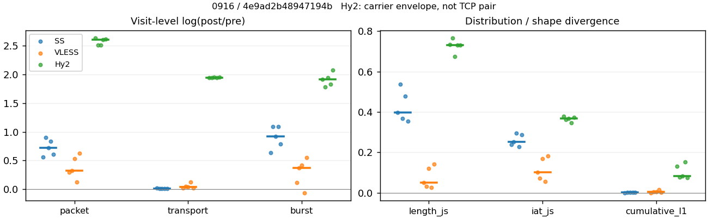
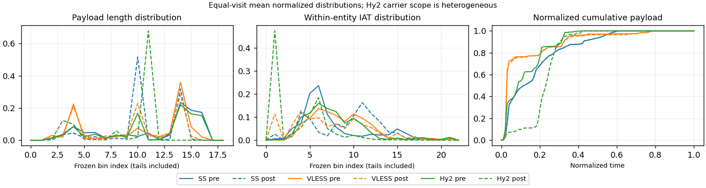

# 0916 · 条目 027 · youtube.com

目标：https://www.youtube.com/results?search_query=piano+practice

活动标签：youtube.com::search_results_view。选定访问 15 次。

[返回总索引](../../README.md) · [统计口径](../../methods.md)

## 覆盖与资格（每次访问均保留）

| 部署 | 重复 | 主请求路由 | 活动状态 | 代理比较 | DIRECT pre | 请求 proxy/direct/unresolved | 错误 |
| --- | --- | --- | --- | --- | --- | --- | --- |
| Hy2 | 1 | proxy | passed | 1 | 1 | 194/1/0 | [] |
| Hy2 | 2 | proxy | passed | 1 | 1 | 195/1/0 | [] |
| Hy2 | 3 | proxy | passed | 1 | 1 | 187/1/0 | [] |
| Hy2 | 4 | proxy | passed | 1 | 1 | 188/1/0 | [] |
| Hy2 | 5 | proxy | passed | 1 | 1 | 188/1/0 | [] |
| SS | 1 | proxy | passed | 1 | 0 | 193/0/0 | [] |
| SS | 2 | proxy | passed | 1 | 0 | 191/0/0 | [] |
| SS | 3 | proxy | passed | 1 | 0 | 189/0/0 | [] |
| SS | 4 | proxy | passed | 1 | 0 | 187/0/0 | [] |
| SS | 5 | proxy | passed | 1 | 0 | 191/0/0 | [] |
| VLESS | 1 | proxy | passed | 1 | 0 | 188/0/0 | [] |
| VLESS | 2 | proxy | passed | 1 | 0 | 195/0/0 | [] |
| VLESS | 3 | proxy | passed | 1 | 0 | 189/0/0 | [] |
| VLESS | 4 | proxy | passed | 1 | 0 | 30/0/0 | [] |
| VLESS | 5 | proxy | passed | 1 | 0 | 191/0/0 | [] |

主请求非 proxy 的统计仅解释为已索引的辅助代理连接或 DIRECT 观测，不代表目标业务经代理传输。播放确认与配对资格是两道不同的门。

图中散点为单次访问，短线为重复中位数；Hy2 是共享载体包络，不能与 TCP 配对作等范围因果对比。

形态图先逐访问归一化，再对访问等权平均；实线 pre，虚线 post。分箱序号及边界见 methods，不将分箱索引误解为长度或时间。

## 每次访问的关键观测

### SS

范围：`exclusive_page`。每格 pre → post；空值为不可观测/不适用。

| 重复 | 包数 | 载荷字节 | burst | TCP FR | IAT中位µs | length JS | IAT JS |
| --- | --- | --- | --- | --- | --- | --- | --- |
| 1 | 3081 → 5368 | 5.7603e+06 → 5.8484e+06 | 2049 → 3853 | 157 → 161 | 26.367 → 352.36 | 0.39792 | 0.23773 |
| 2 | 3637 → 8972 | 7.7277e+06 → 7.7938e+06 | 2613 → 7802 | 266 → 275 | 57.745 → 1028.3 | 0.53656 | 0.25181 |
| 3 | 3755 → 7693 | 7.6328e+06 → 7.7067e+06 | 2487 → 6237 | 206 → 221 | 32.66 → 840.13 | 0.36666 | 0.29398 |
| 4 | 3914 → 9044 | 7.6102e+06 → 7.6821e+06 | 2689 → 8005 | 198 → 215 | 45.996 → 1030.8 | 0.47765 | 0.22836 |
| 5 | 4149 → 7582 | 7.66e+06 → 7.7084e+06 | 2709 → 5977 | 202 → 207 | 27.642 → 675.68 | 0.35445 | 0.28677 |

完整标量统计：中位数 [min,max]；Δ 为重复内逐访问变换的中位数，MAD 未缩放。n 为可用变换数；DIRECT-only 的 nΔ=0 不代表 pre 不可用。

| scope | 特征 | pre | post | Δ | IQRΔ | MADΔ | nΔ |
| --- | --- | --- | --- | --- | --- | --- | --- |
| exclusive_page | active_span_sum_s_1000ms | 36.932 [29.204, 64.77] | 40.858 [34.91, 75.938] | 0.15908 | 0.040078 | 0.01938 | 5 |
| exclusive_page | active_span_sum_s_100ms | 12.575 [7.2379, 27.081] | 21.773 [15.441, 41.309] | 0.4289 | 0.12675 | 0.11914 | 5 |
| exclusive_page | active_span_sum_s_500ms | 30.014 [20.002, 49.161] | 35.291 [27.213, 66.252] | 0.24913 | 0.15822 | 0.058729 | 5 |
| exclusive_page | burst_bytes_iqr | 4344 [3104, 4344] | 2856 [1428, 2856] | -0.41937 | 0.72686 | 0.3361 | 5 |
| exclusive_page | burst_bytes_mad | 39 [0, 39] | 38 [0, 65] | 0.11446 | 0.29572 | 0.1704 | 4 |
| exclusive_page | burst_bytes_max | 23760 [20480, 28672] | 15708 [7588, 17136] | -0.51474 | 0.49718 | 0.24946 | 5 |
| exclusive_page | burst_bytes_mean | 2830.1 [2811.3, 3069.1] | 1235.6 [959.66, 1517.9] | -0.90979 | 0.29647 | 0.17172 | 5 |
| exclusive_page | burst_bytes_median | 39 [0, 39] | 38 [0, 65] | 0.11446 | 0.29572 | 0.1704 | 4 |
| exclusive_page | burst_bytes_min | 0 [0, 0] | 0 [0, 0] | — | — | — | 0 |
| exclusive_page | burst_bytes_p95 | 14480 [13240, 16384] | 4284 [2856, 5712] | -1.3414 | 0.49499 | 0.28193 | 5 |
| exclusive_page | burst_bytes_q25 | 0 [0, 0] | 0 [0, 0] | — | — | — | 0 |
| exclusive_page | burst_bytes_q75 | 4344 [3104, 4344] | 2856 [1428, 2856] | -0.41937 | 0.72686 | 0.3361 | 5 |
| exclusive_page | burst_bytes_std | 4900.1 [4603.8, 5192.4] | 1696.6 [1133.6, 2136.3] | -1.1186 | 0.42558 | 0.24182 | 5 |
| exclusive_page | burst_count | 2613 [2049, 2709] | 6237 [3853, 8005] | 0.91942 | 0.29956 | 0.17147 | 5 |
| exclusive_page | burst_duration_ms_iqr | 0.025835 [0.024146, 0.027786] | 0 [0, 8.2e-05] | -5.7528 | — | — | 1 |
| exclusive_page | burst_duration_ms_mad | 0 [0, 0] | 0 [0, 0] | — | — | — | 0 |
| exclusive_page | burst_duration_ms_max | 15001 [15001, 15001] | 30592 [15360, 43897] | 0.71262 | 0.69308 | 0.36111 | 5 |
| exclusive_page | burst_duration_ms_mean | 99.07 [47.443, 167.07] | 27.741 [8.923, 48.148] | -1.5838 | 0.17212 | 0.08709 | 5 |
| exclusive_page | burst_duration_ms_median | 0 [0, 0] | 0 [0, 0] | — | — | — | 0 |
| exclusive_page | burst_duration_ms_min | 0 [0, 0] | 0 [0, 0] | — | — | — | 0 |
| exclusive_page | burst_duration_ms_p95 | 31.19 [22.252, 58.18] | 0.83683 [0.24516, 0.99837] | -3.8749 | 1.3326 | 0.59435 | 5 |
| exclusive_page | burst_duration_ms_q25 | 0 [0, 0] | 0 [0, 0] | — | — | — | 0 |
| exclusive_page | burst_duration_ms_q75 | 0.025835 [0.024146, 0.027786] | 0 [0, 8.2e-05] | -5.7528 | — | — | 1 |
| exclusive_page | burst_duration_ms_std | 1104.4 [707.48, 1457] | 686.49 [277.65, 873] | -0.65271 | 0.19819 | 0.11684 | 5 |
| exclusive_page | burst_packets_iqr | 1 [1, 1] | 0 [0, 1] | 0 | — | — | 1 |
| exclusive_page | burst_packets_mad | 0 [0, 0] | 0 [0, 0] | — | — | — | 0 |
| exclusive_page | burst_packets_max | 16 [11, 37] | 10 [8, 16] | -0.69315 | 0.57596 | 0.18232 | 5 |
| exclusive_page | burst_packets_mean | 1.5037 [1.3919, 1.5316] | 1.2334 [1.1298, 1.3932] | -0.19093 | 0.01377 | 0.011268 | 5 |
| exclusive_page | burst_packets_median | 1 [1, 1] | 1 [1, 1] | 0 | 0 | 0 | 5 |
| exclusive_page | burst_packets_min | 1 [1, 1] | 1 [1, 1] | 0 | 0 | 0 | 5 |
| exclusive_page | burst_packets_p95 | 3 [3, 4] | 3 [2, 3] | -0.28768 | 0.40547 | 0.11778 | 5 |
| exclusive_page | burst_packets_q25 | 1 [1, 1] | 1 [1, 1] | 0 | 0 | 0 | 5 |
| exclusive_page | burst_packets_q75 | 2 [2, 2] | 1 [1, 2] | -0.69315 | 0 | 0 | 5 |
| exclusive_page | burst_packets_std | 1.1209 [0.72269, 1.1593] | 0.64567 [0.47289, 0.80249] | -0.51627 | 0.2273 | 0.16949 | 5 |
| exclusive_page | connection_span_concurrency_max | 12 [11, 12] | 12 [11, 12] | 0 | 0 | 0 | 5 |
| exclusive_page | cumulative_l1 | — | — | 0.0013239 | 0.00028447 | 0.00014646 | 5 |
| exclusive_page | cumulative_max | — | — | 0.023942 | 0.019924 | 0.016402 | 5 |
| exclusive_page | direction_entropy | 0.57191 [0.53757, 0.66323] | 0.35042 [0.31788, 0.386] | -0.22255 | 0.041064 | 0.028973 | 5 |
| exclusive_page | down_burst_count | 1295 [1014, 1348] | 3111 [1916, 3995] | 0.92306 | 0.30064 | 0.17155 | 5 |
| exclusive_page | down_ip_bytes | 7.668e+06 [5.7748e+06, 7.7135e+06] | 7.8208e+06 [5.9051e+06, 7.8856e+06] | 0.022064 | 0.0031363 | 0.0013482 | 5 |
| exclusive_page | down_packets | 2332 [1904, 2566] | 4308 [3085, 4754] | 0.60653 | 0.18474 | 0.096345 | 5 |
| exclusive_page | down_transport_bytes | 7.5466e+06 [5.6756e+06, 7.6032e+06] | 7.5934e+06 [5.7443e+06, 7.6405e+06] | 0.0061885 | 0.0025188 | 0.0012888 | 5 |
| exclusive_page | duration_s | 74.569 [65.848, 85.877] | 74.829 [65.846, 85.877] | -9.0799e-06 | 0.00066362 | 1.1528e-05 | 5 |
| exclusive_page | entity_count | 15 [14, 25] | 15 [14, 25] | 0 | 0 | 0 | 5 |
| exclusive_page | fr_runs | 202 [157, 266] | 215 [161, 275] | 0.033275 | 0.045128 | 0.0088237 | 5 |
| exclusive_page | fr_runs_per_packet | 0.086124 [0.07981, 0.12957] | 0.051098 [0.044876, 0.057822] | -0.03739 | 0.0078184 | 0.0039595 | 5 |
| exclusive_page | fr_switches | 188 [136, 241] | 200 [140, 250] | 0.036664 | 0.046615 | 0.010416 | 5 |
| exclusive_page | fr_switches_per_possible_transition | 0.080123 [0.074692, 0.11884] | 0.046053 [0.041876, 0.052843] | -0.034781 | 0.0085218 | 0.0050562 | 5 |
| exclusive_page | full_retransmission_fraction | 0.0015979 [0.00097371, 0.0019282] | 0.0059795 [0.0026378, 0.0078241] | 0.0043816 | 0.0046775 | 0.0024688 | 5 |
| exclusive_page | full_retransmission_packets | 6 [3, 8] | 42 [20, 70] | 2.0369 | 1.1192 | 0.60218 | 5 |
| exclusive_page | iat_count | 3740 [3060, 4135] | 7678 [5347, 9029] | 0.71927 | 0.23528 | 0.12045 | 5 |
| exclusive_page | iat_js | — | — | 0.25181 | 0.049036 | 0.02345 | 5 |
| exclusive_page | iat_ks | — | — | 0.39955 | 0.089734 | 0.054358 | 5 |
| exclusive_page | iat_median_us | 32.66 [26.367, 57.745] | 840.13 [352.36, 1030.8] | 3.1096 | 0.31681 | 0.13784 | 5 |
| exclusive_page | iat_us_iqr | 125.33 [89.212, 3543.8] | 2119.6 [1011.3, 6030.9] | 2.4125 | 1.734 | 0.75548 | 5 |
| exclusive_page | iat_us_mad | 24.159 [18.94, 46.728] | 823.44 [346.66, 1022] | 3.3594 | 0.42801 | 0.16945 | 5 |
| exclusive_page | iat_us_max | 1.5001e+07 [1.5001e+07, 1.5001e+07] | 1.5457e+07 [1.536e+07, 1.5488e+07] | 0.029963 | 0.00087851 | 0.00073922 | 5 |
| exclusive_page | iat_us_mean | 1.906e+05 [84131, 2.1948e+05] | 89555 [41323, 1.1993e+05] | -0.71096 | 0.23442 | 0.12784 | 5 |
| exclusive_page | iat_us_median | 32.66 [26.367, 57.745] | 840.13 [352.36, 1030.8] | 3.1096 | 0.31681 | 0.13784 | 5 |
| exclusive_page | iat_us_min | 0.025 [0.008, 0.082] | 0.032 [0.031, 0.036] | 0.36464 | 0.52787 | 0.29676 | 5 |
| exclusive_page | iat_us_p95 | 68566 [41509, 1.0014e+05] | 27239 [18072, 32752] | -0.92316 | 0.38817 | 0.29656 | 5 |
| exclusive_page | iat_us_q25 | 14.284 [12.924, 21.796] | 18.428 [14.377, 20.817] | 0.19514 | 0.14821 | 0.088599 | 5 |
| exclusive_page | iat_us_q75 | 139.61 [102.3, 3565.6] | 2138.7 [1025.7, 6048.4] | 2.2933 | 1.6408 | 0.74673 | 5 |
| exclusive_page | iat_us_std | 1.609e+06 [9.4833e+05, 1.6931e+06] | 1.0964e+06 [6.6052e+05, 1.2566e+06] | -0.36168 | 0.11147 | 0.063521 | 5 |
| exclusive_page | iat_wasserstein_log1p_us | — | — | 1.5518 | 0.19764 | 0.10736 | 5 |
| exclusive_page | idle_gap_count_1000ms | 57 [33, 76] | 61 [34, 78] | 0.025975 | 0.045357 | 0.04148 | 5 |
| exclusive_page | idle_gap_count_100ms | 148 [106, 182] | 129 [102, 168] | -0.11996 | 0.057357 | 0.025995 | 5 |
| exclusive_page | idle_gap_count_500ms | 73 [42, 85] | 75 [39, 88] | -0.05196 | 0.10114 | 0.078988 | 5 |
| exclusive_page | idle_gap_sum_s_1000ms | 554.03 [280.96, 870.62] | 549.26 [278.93, 866.75] | -0.0086487 | 0.0030253 | 0.0016251 | 5 |
| exclusive_page | idle_gap_sum_s_100ms | 581.12 [302.75, 894.98] | 568.73 [299, 885.83] | -0.012451 | 0.0018781 | 0.0016293 | 5 |
| exclusive_page | idle_gap_sum_s_500ms | 563.23 [287.14, 877.54] | 556.96 [281.99, 873.87] | -0.011206 | 0.011164 | 0.0069121 | 5 |
| exclusive_page | ip_bytes | 7.8284e+06 [5.9209e+06, 7.9173e+06] | 8.1765e+06 [6.1757e+06, 8.3209e+06] | 0.043517 | 0.0075934 | 0.0062142 | 5 |
| exclusive_page | length_iqr | 4056 [3140, 7232] | 1428 [0, 1428] | -0.80968 | 0.12799 | 0.021737 | 3 |
| exclusive_page | length_js | — | — | 0.39792 | 0.11099 | 0.043464 | 5 |
| exclusive_page | length_ks | — | — | 0.55328 | 0.044605 | 0.018918 | 5 |
| exclusive_page | length_mad | 2192 [1448, 2648] | 40 [0, 1355] | -0.61642 | 1.7921 | 0.55004 | 3 |
| exclusive_page | length_max | 8920 [8920, 8920] | 4284 [2856, 8568] | -0.73341 | 1.0986 | 0.40547 | 5 |
| exclusive_page | length_mean | 3278.7 [3026.5, 3764.1] | 1781.9 [1603.4, 1910.6] | -0.60977 | 0.19978 | 0.10778 | 5 |
| exclusive_page | length_median | 2896 [2896, 2896] | 1428 [1428, 1428] | -0.70706 | 0 | 0 | 5 |
| exclusive_page | length_min | 28 [8, 31] | 6 [6, 6] | -1.5404 | 0.43825 | 0.10178 | 5 |
| exclusive_page | length_p95 | 8480 [8192, 8920] | 2856 [2856, 2856] | -1.0883 | 0.058785 | 0.034552 | 5 |
| exclusive_page | length_q25 | 887 [536, 960] | 1428 [1428, 1428] | 0.47619 | 0.26153 | 0.079088 | 5 |
| exclusive_page | length_q75 | 4592 [4096, 8192] | 2856 [1428, 2856] | -0.47489 | 0.97323 | 0.1143 | 5 |
| exclusive_page | length_std | 2857.3 [2618.5, 3215.8] | 971.75 [767.59, 1029.6] | -1.0422 | 0.31921 | 0.079606 | 5 |
| exclusive_page | length_wasserstein_bytes | — | — | 1765.3 | 544.99 | 254.84 | 5 |
| exclusive_page | nonempty_entity_count | 15 [14, 25] | 15 [14, 25] | 0 | 0 | 0 | 5 |
| exclusive_page | nonempty_packets | 2299 [1825, 2531] | 4325 [3061, 4791] | 0.6194 | 0.20287 | 0.10224 | 5 |
| exclusive_page | offload_suspect_fraction | 0.3813 [0.35276, 0.38482] | 0.20008 [0.11831, 0.26639] | -0.18122 | 0.056735 | 0.041697 | 5 |
| exclusive_page | packet_count | 3755 [3081, 4149] | 7693 [5368, 9044] | 0.71722 | 0.23463 | 0.12032 | 5 |
| exclusive_page | rtt_median_ms | 0.059885 [0.0489, 0.069314] | 32.17 [26.82, 37.58] | 6.2864 | 0.42994 | 0.23704 | 5 |
| exclusive_page | rtt_sample_count | 1474 [1138, 1490] | 891 [594, 1649] | -0.44399 | 0.65719 | 0.20615 | 5 |
| exclusive_page | tcp_ack_count | 3740 [3060, 4135] | 7675 [5346, 9028] | 0.71888 | 0.23596 | 0.12073 | 5 |
| exclusive_page | tcp_fin_count | 30 [27, 48] | 34 [29, 58] | 0.12516 | 0.038221 | 0.029853 | 5 |
| exclusive_page | tcp_packet_count | 3755 [3081, 4149] | 7693 [5368, 9044] | 0.71722 | 0.23463 | 0.12032 | 5 |
| exclusive_page | tcp_rst_count | 0 [0, 0] | 0 [0, 0] | — | — | — | 0 |
| exclusive_page | tcp_syn_count | 30 [28, 50] | 34 [31, 59] | 0.09531 | 0.13272 | 0.070204 | 5 |
| exclusive_page | tcp_window_raw_median | 65535 [65535, 65535] | 166 [150, 168] | -5.9784 | 0.074108 | 0.011976 | 5 |
| exclusive_page | transition_entropy | 0.34807 [0.32644, 0.45819] | 0.21378 [0.19671, 0.23706] | -0.13564 | 0.031248 | 0.015728 | 5 |
| exclusive_page | transition_n_mm | 1897 [1505, 2123] | 3949 [2755, 4414] | 0.72045 | 0.22388 | 0.11582 | 5 |
| exclusive_page | transition_n_mp | 91 [63, 115] | 99 [65, 120] | 0.04256 | 0.049243 | 0.011307 | 5 |
| exclusive_page | transition_n_pm | 97 [73, 126] | 101 [75, 130] | 0.031253 | 0.042651 | 0.010844 | 5 |
| exclusive_page | transition_n_pp | 206 [163, 214] | 162 [145, 212] | -0.20875 | 0.11351 | 0.091738 | 5 |
| exclusive_page | transition_p_mm | 0.95471 [0.93187, 0.95982] | 0.97675 [0.97266, 0.97806] | 0.021529 | 0.0055058 | 0.0036774 | 5 |
| exclusive_page | transition_p_mp | 0.045294 [0.040179, 0.068128] | 0.02325 [0.021937, 0.027341] | -0.021529 | 0.0055058 | 0.0036774 | 5 |
| exclusive_page | transition_p_pm | 0.31908 [0.30932, 0.37059] | 0.38235 [0.34091, 0.39759] | 0.063274 | 0.039312 | 0.014184 | 5 |
| exclusive_page | transition_p_pp | 0.68092 [0.62941, 0.69068] | 0.61765 [0.60241, 0.65909] | -0.063274 | 0.039312 | 0.014184 | 5 |
| exclusive_page | transport_bytes | 7.6328e+06 [5.7603e+06, 7.7277e+06] | 7.7067e+06 [5.8484e+06, 7.7938e+06] | 0.0093955 | 0.0011116 | 0.00087116 | 5 |
| exclusive_page | up_burst_count | 1318 [1035, 1361] | 3126 [1937, 4010] | 0.91581 | 0.29848 | 0.1714 | 5 |
| exclusive_page | up_byte_fraction | 0.012206 [0.011204, 0.016111] | 0.014696 [0.01272, 0.019671] | 0.0030909 | 0.0014518 | 0.00046887 | 5 |
| exclusive_page | up_ip_bytes | 1.6835e+05 [1.4613e+05, 2.0375e+05] | 3.6013e+05 [2.7067e+05, 4.3535e+05] | 0.75928 | 0.11582 | 0.06599 | 5 |
| exclusive_page | up_packets | 1519 [1177, 1583] | 3416 [2283, 4290] | 0.8757 | 0.28491 | 0.14901 | 5 |
| exclusive_page | up_transport_bytes | 86199 [84725, 1.245e+05] | 1.0875e+05 [98053, 1.5331e+05] | 0.20591 | 0.050485 | 0.04824 | 5 |
| exclusive_page | zero_iat_count | 0 [0, 0] | 0 [0, 0] | — | — | — | 0 |
| exclusive_page | zero_iat_fraction | 0 [0, 0] | 0 [0, 0] | 0 | 0 | 0 | 5 |

### VLESS

范围：`exclusive_page`。每格 pre → post；空值为不可观测/不适用。

| 重复 | 包数 | 载荷字节 | burst | TCP FR | IAT中位µs | length JS | IAT JS |
| --- | --- | --- | --- | --- | --- | --- | --- |
| 1 | 3808 → 5099 | 5.1409e+06 → 5.2499e+06 | 3055 → 3415 | 126 → 156 | 85.841 → 36.815 | 0.050803 | 0.10109 |
| 2 | 2463 → 3408 | 3.101e+06 → 3.2552e+06 | 1602 → 2317 | 155 → 196 | 151.1 → 76.865 | 0.032177 | 0.073149 |
| 3 | 2522 → 4307 | 3.1244e+06 → 3.2465e+06 | 1762 → 2680 | 134 → 166 | 149.39 → 17.255 | 0.12047 | 0.17001 |
| 4 | 682 → 771 | 3.8931e+05 → 4.4213e+05 | 601 → 565 | 52 → 66 | 143.57 → 489.36 | 0.025917 | 0.057126 |
| 5 | 3616 → 6746 | 5.116e+06 → 5.2293e+06 | 2429 → 4225 | 132 → 166 | 189.54 → 12.098 | 0.14136 | 0.18141 |

完整标量统计：中位数 [min,max]；Δ 为重复内逐访问变换的中位数，MAD 未缩放。n 为可用变换数；DIRECT-only 的 nΔ=0 不代表 pre 不可用。

| scope | 特征 | pre | post | Δ | IQRΔ | MADΔ | nΔ |
| --- | --- | --- | --- | --- | --- | --- | --- |
| exclusive_page | active_span_sum_s_1000ms | 22.241 [11.755, 25.689] | 24.448 [11.682, 25.784] | 0.0036923 | 0.044434 | 0.030665 | 5 |
| exclusive_page | active_span_sum_s_100ms | 3.0328 [1.3764, 4.0274] | 9.1699 [3.4914, 10.548] | 0.9628 | 0.1211 | 0.089162 | 5 |
| exclusive_page | active_span_sum_s_500ms | 11.022 [4.7683, 12.65] | 21.593 [9.2499, 25.784] | 0.67249 | 0.049467 | 0.025222 | 5 |
| exclusive_page | burst_bytes_iqr | 2896 [1163, 2896] | 2824 [1491, 2824] | -0.025176 | 0.025176 | 0 | 5 |
| exclusive_page | burst_bytes_mad | 24 [0, 24] | 53 [31, 53] | 0.79224 | 0.15337 | 0 | 3 |
| exclusive_page | burst_bytes_max | 20480 [3737, 20480] | 11584 [4832, 58100] | -0.16436 | 0.8268 | 0.42134 | 5 |
| exclusive_page | burst_bytes_mean | 1773.2 [647.77, 2106.2] | 1237.7 [782.53, 1537.3] | -0.32051 | 0.2906 | 0.21113 | 5 |
| exclusive_page | burst_bytes_median | 24 [0, 24] | 53 [31, 53] | 0.79224 | 0.15337 | 0 | 3 |
| exclusive_page | burst_bytes_min | 0 [0, 0] | 0 [0, 0] | — | — | — | 0 |
| exclusive_page | burst_bytes_p95 | 8616 [2824, 8758.2] | 4236 [2824, 5720] | -0.66858 | 0.54185 | 0.36141 | 5 |
| exclusive_page | burst_bytes_q25 | 0 [0, 0] | 0 [0, 0] | — | — | — | 0 |
| exclusive_page | burst_bytes_q75 | 2896 [1163, 2896] | 2824 [1491, 2824] | -0.025176 | 0.025176 | 0 | 5 |
| exclusive_page | burst_bytes_std | 3048.4 [1056.8, 3464.8] | 1586.8 [1170.6, 2254.4] | -0.42977 | 0.24288 | 0.21144 | 5 |
| exclusive_page | burst_count | 1762 [601, 3055] | 2680 [565, 4225] | 0.36902 | 0.30797 | 0.18452 | 5 |
| exclusive_page | burst_duration_ms_iqr | 0.26155 [0, 0.60158] | 0.003496 [0, 0.005835] | -4.4082 | 0.50073 | 0.26175 | 3 |
| exclusive_page | burst_duration_ms_mad | 0 [0, 0] | 0 [0, 0] | — | — | — | 0 |
| exclusive_page | burst_duration_ms_max | 15001 [722.85, 15001] | 14313 [320.48, 15045] | -0.00060847 | 0.048269 | 0.0035602 | 5 |
| exclusive_page | burst_duration_ms_mean | 73.825 [13.268, 112.83] | 10.882 [7.108, 23.815] | -1.1785 | 1.5401 | 0.97424 | 5 |
| exclusive_page | burst_duration_ms_median | 0 [0, 0] | 0 [0, 0] | — | — | — | 0 |
| exclusive_page | burst_duration_ms_min | 0 [0, 0] | 0 [0, 0] | — | — | — | 0 |
| exclusive_page | burst_duration_ms_p95 | 9.2669 [3.6923, 32.161] | 8.5181 [3.6309, 37.852] | -0.084249 | 0.28445 | 0.17619 | 5 |
| exclusive_page | burst_duration_ms_q25 | 0 [0, 0] | 0 [0, 0] | — | — | — | 0 |
| exclusive_page | burst_duration_ms_q75 | 0.26155 [0, 0.60158] | 0.003496 [0, 0.005835] | -4.4082 | 0.50073 | 0.26175 | 3 |
| exclusive_page | burst_duration_ms_std | 928.74 [78.894, 1192.3] | 259.77 [37.481, 508.27] | -0.60859 | 0.90453 | 0.3071 | 5 |
| exclusive_page | burst_packets_iqr | 1 [0, 1] | 1 [0, 1] | 0 | 0 | 0 | 3 |
| exclusive_page | burst_packets_mad | 0 [0, 0] | 0 [0, 0] | — | — | — | 0 |
| exclusive_page | burst_packets_max | 7 [3, 12] | 9 [6, 17] | 0.34831 | 0.25951 | 0.16252 | 5 |
| exclusive_page | burst_packets_mean | 1.4313 [1.1348, 1.5375] | 1.4931 [1.3646, 1.6071] | 0.11582 | 0.1105 | 0.06472 | 5 |
| exclusive_page | burst_packets_median | 1 [1, 1] | 1 [1, 1] | 0 | 0 | 0 | 5 |
| exclusive_page | burst_packets_min | 1 [1, 1] | 1 [1, 1] | 0 | 0 | 0 | 5 |
| exclusive_page | burst_packets_p95 | 2 [2, 3] | 3 [3, 3] | 0.40547 | 0 | 0 | 5 |
| exclusive_page | burst_packets_q25 | 1 [1, 1] | 1 [1, 1] | 0 | 0 | 0 | 5 |
| exclusive_page | burst_packets_q75 | 2 [1, 2] | 2 [1, 2] | 0 | 0 | 0 | 5 |
| exclusive_page | burst_packets_std | 0.61922 [0.36503, 0.80116] | 0.90974 [0.88936, 0.94302] | 0.38385 | 0.07531 | 0.069983 | 5 |
| exclusive_page | connection_span_concurrency_max | 9 [5, 9] | 9 [5, 9] | 0 | 0 | 0 | 5 |
| exclusive_page | cumulative_l1 | — | — | 0.0045072 | 0.0027257 | 0.0022458 | 5 |
| exclusive_page | cumulative_max | — | — | 0.044649 | 0.052147 | 0.031427 | 5 |
| exclusive_page | direction_entropy | 0.44151 [0.31085, 0.60574] | 0.36078 [0.2315, 0.62371] | -0.046466 | 0.089578 | 0.044726 | 5 |
| exclusive_page | down_burst_count | 873 [297, 1520] | 1332 [279, 2105] | 0.37335 | 0.31058 | 0.18283 | 5 |
| exclusive_page | down_ip_bytes | 3.1459e+06 [3.8636e+05, 5.2037e+06] | 3.2807e+06 [4.2844e+05, 5.3465e+06] | 0.041955 | 0.0126 | 0.01162 | 5 |
| exclusive_page | down_packets | 1575 [357, 2326] | 2405 [415, 3768] | 0.30393 | 0.2143 | 0.12701 | 5 |
| exclusive_page | down_transport_bytes | 3.0645e+06 [3.6774e+05, 5.0901e+06] | 3.1555e+06 [4.068e+05, 5.1699e+06] | 0.029266 | 0.021194 | 0.012671 | 5 |
| exclusive_page | duration_s | 64.901 [4.6146, 72.776] | 64.862 [4.5972, 72.707] | -0.00064304 | 0.00034524 | 0.00031203 | 5 |
| exclusive_page | entity_count | 15 [7, 20] | 15 [7, 20] | 0 | 0 | 0 | 5 |
| exclusive_page | fr_runs | 132 [52, 155] | 166 [66, 196] | 0.22919 | 0.020542 | 0.0092252 | 5 |
| exclusive_page | fr_runs_per_packet | 0.088742 [0.058537, 0.1543] | 0.070759 [0.044986, 0.16837] | -0.0053052 | 0.01421 | 0.008245 | 5 |
| exclusive_page | fr_switches | 117 [45, 135] | 150 [59, 176] | 0.25511 | 0.025259 | 0.015155 | 5 |
| exclusive_page | fr_switches_per_possible_transition | 0.078983 [0.052232, 0.13636] | 0.064378 [0.041088, 0.15325] | -0.0035526 | 0.014315 | 0.0075911 | 5 |
| exclusive_page | full_retransmission_fraction | 0 [0, 0.00052521] | 0 [0, 0] | 0 | 0 | 0 | 5 |
| exclusive_page | full_retransmission_packets | 0 [0, 2] | 0 [0, 0] | — | — | — | 0 |
| exclusive_page | iat_count | 2506 [675, 3793] | 4291 [764, 6731] | 0.32701 | 0.24489 | 0.20316 | 5 |
| exclusive_page | iat_js | — | — | 0.10109 | 0.096859 | 0.043968 | 5 |
| exclusive_page | iat_ks | — | — | 0.23698 | 0.21887 | 0.12982 | 5 |
| exclusive_page | iat_median_us | 149.39 [85.841, 189.54] | 36.815 [12.098, 489.36] | -0.84659 | 1.4826 | 1.3119 | 5 |
| exclusive_page | iat_us_iqr | 922.92 [721.93, 1847.7] | 616.44 [481.46, 3414.9] | -0.31992 | 0.31797 | 0.2579 | 5 |
| exclusive_page | iat_us_mad | 140.35 [72.765, 181.24] | 36.711 [12.054, 479.72] | -0.68416 | 1.4908 | 1.4145 | 5 |
| exclusive_page | iat_us_max | 1.5001e+07 [2.4992e+06, 1.5001e+07] | 1.541e+07 [2.4564e+06, 1.5466e+07] | 0.026886 | 0.0062565 | 0.0032684 | 5 |
| exclusive_page | iat_us_mean | 1.4108e+05 [24562, 1.8341e+05] | 78783 [21440, 1.3209e+05] | -0.32826 | 0.24464 | 0.1923 | 5 |
| exclusive_page | iat_us_median | 149.39 [85.841, 189.54] | 36.815 [12.098, 489.36] | -0.84659 | 1.4826 | 1.3119 | 5 |
| exclusive_page | iat_us_min | 0.387 [0.261, 3.097] | 0.033 [0.032, 0.037] | -2.4619 | 0.50286 | 0.25464 | 5 |
| exclusive_page | iat_us_p95 | 9939.3 [8373.8, 44905] | 36004 [9168.4, 88534] | 0.67883 | 0.867 | 0.60831 | 5 |
| exclusive_page | iat_us_q25 | 32.821 [27.066, 34.58] | 7.593 [4.341, 22.379] | -1.2711 | 0.95737 | 0.65579 | 5 |
| exclusive_page | iat_us_q75 | 956.06 [748.99, 1877.6] | 621.22 [485.8, 3437.3] | -0.34235 | 0.32512 | 0.25943 | 5 |
| exclusive_page | iat_us_std | 1.3435e+06 [1.5886e+05, 1.5635e+06] | 1.0306e+06 [1.3611e+05, 1.3319e+06] | -0.16034 | 0.10828 | 0.019708 | 5 |
| exclusive_page | iat_wasserstein_log1p_us | — | — | 0.93031 | 0.72368 | 0.38255 | 5 |
| exclusive_page | idle_gap_count_1000ms | 30 [2, 42] | 29 [2, 40] | -0.033902 | 0.04879 | 0.033902 | 5 |
| exclusive_page | idle_gap_count_100ms | 82 [28, 102] | 101 [35, 114] | 0.1884 | 0.097176 | 0.034743 | 5 |
| exclusive_page | idle_gap_count_500ms | 47 [12, 62] | 31 [5, 42] | -0.44895 | 0.057624 | 0.03279 | 5 |
| exclusive_page | idle_gap_sum_s_1000ms | 332.33 [4.8248, 505.52] | 331.14 [4.6983, 505.84] | -0.0035729 | 0.0068744 | 0.0042147 | 5 |
| exclusive_page | idle_gap_sum_s_100ms | 350.51 [15.203, 526.61] | 344.5 [12.889, 519.74] | -0.017294 | 0.0024146 | 0.0015372 | 5 |
| exclusive_page | idle_gap_sum_s_500ms | 343.48 [11.811, 518.63] | 332.01 [7.1303, 507.37] | -0.032785 | 0.0020208 | 0.0011845 | 5 |
| exclusive_page | ip_bytes | 3.2555e+06 [4.2472e+05, 5.3389e+06] | 3.4794e+06 [4.8256e+05, 5.5939e+06] | 0.061608 | 0.013277 | 0.008373 | 5 |
| exclusive_page | length_iqr | 2689.2 [1733, 2752] | 2208 [1340, 2728] | -0.022955 | 0.35609 | 0.26519 | 5 |
| exclusive_page | length_js | — | — | 0.050803 | 0.088298 | 0.024887 | 5 |
| exclusive_page | length_ks | — | — | 0.14648 | 0.17486 | 0.080181 | 5 |
| exclusive_page | length_mad | 1320 [809, 1376] | 1171 [819, 1376] | 0.012285 | 0.14628 | 0.13206 | 5 |
| exclusive_page | length_max | 8920 [2896, 8920] | 7240 [2824, 11584] | -0.025176 | 0.33647 | 0.1835 | 5 |
| exclusive_page | length_mean | 2071.5 [1155.2, 2422.7] | 1417.1 [1127.9, 1819.7] | -0.28619 | 0.22243 | 0.11607 | 5 |
| exclusive_page | length_median | 1759 [881, 2824] | 1412 [891, 1448] | -0.21974 | 0.59427 | 0.23103 | 5 |
| exclusive_page | length_min | 24 [8, 24] | 24 [7, 24] | 0 | 0 | 0 | 5 |
| exclusive_page | length_p95 | 5828 [2824, 7204] | 2896 [2824, 4236] | -0.62741 | 0.17448 | 0.090915 | 5 |
| exclusive_page | length_q25 | 134.75 [72, 1163] | 180 [72, 616] | 0 | 0.92505 | 0.51516 | 5 |
| exclusive_page | length_q75 | 2824 [2824, 2896] | 2800 [1556, 2824] | -0.025176 | 0.56463 | 0.025176 | 5 |
| exclusive_page | length_std | 1901.5 [1161.8, 2036.9] | 1106.7 [1055, 1463.4] | -0.3842 | 0.28193 | 0.18391 | 5 |
| exclusive_page | length_wasserstein_bytes | — | — | 606.66 | 320.66 | 236.92 | 5 |
| exclusive_page | nonempty_entity_count | 15 [7, 20] | 15 [7, 20] | 0 | 0 | 0 | 5 |
| exclusive_page | nonempty_packets | 1510 [337, 2255] | 2346 [392, 3690] | 0.30717 | 0.21226 | 0.13344 | 5 |
| exclusive_page | offload_suspect_fraction | 0.33699 [0.15689, 0.37223] | 0.15965 [0.13748, 0.28104] | -0.079065 | 0.08725 | 0.059657 | 5 |
| exclusive_page | packet_count | 2522 [682, 3808] | 4307 [771, 6746] | 0.32475 | 0.24325 | 0.20209 | 5 |
| exclusive_page | rtt_median_ms | 0.1989 [0.051071, 0.44847] | 0.049159 [0.035809, 0.13093] | -0.41815 | 0.90685 | 0.37999 | 5 |
| exclusive_page | rtt_sample_count | 921 [320, 1581] | 1548 [352, 2395] | 0.49366 | 0.26143 | 0.16461 | 5 |
| exclusive_page | tcp_ack_count | 2477 [661, 3764] | 4291 [764, 6731] | 0.34186 | 0.24886 | 0.19704 | 5 |
| exclusive_page | tcp_fin_count | 29 [14, 38] | 30 [14, 40] | 0.033902 | 0.017392 | 0.017392 | 5 |
| exclusive_page | tcp_packet_count | 2522 [682, 3808] | 4307 [771, 6746] | 0.32475 | 0.24325 | 0.20209 | 5 |
| exclusive_page | tcp_rst_count | 29 [14, 36] | 0 [0, 0] | — | — | — | 0 |
| exclusive_page | tcp_syn_count | 30 [14, 40] | 30 [14, 40] | 0 | 0 | 0 | 5 |
| exclusive_page | tcp_window_raw_median | 65535 [65461, 65535] | 166 [136, 206] | -5.9784 | 0.14885 | 0.12445 | 5 |
| exclusive_page | transition_entropy | 0.30513 [0.21094, 0.45499] | 0.25415 [0.1687, 0.49686] | -0.015646 | 0.05771 | 0.031112 | 5 |
| exclusive_page | transition_n_mm | 1300 [261, 2063] | 2102 [298, 3468] | 0.32265 | 0.2566 | 0.15788 | 5 |
| exclusive_page | transition_n_mp | 51 [19, 58] | 67 [26, 78] | 0.28768 | 0.023399 | 0.014815 | 5 |
| exclusive_page | transition_n_pm | 66 [26, 77] | 83 [33, 98] | 0.22919 | 0.024263 | 0.011976 | 5 |
| exclusive_page | transition_n_pp | 60 [24, 76] | 71 [28, 80] | 0.025975 | 0.15415 | 0.094968 | 5 |
| exclusive_page | transition_p_mm | 0.96225 [0.93214, 0.97588] | 0.96911 [0.91975, 0.98077] | 0.0011752 | 0.0079886 | 0.0042697 | 5 |
| exclusive_page | transition_p_mp | 0.03775 [0.024125, 0.067857] | 0.03089 [0.019231, 0.080247] | -0.0011752 | 0.0079886 | 0.0042697 | 5 |
| exclusive_page | transition_p_pm | 0.52 [0.46853, 0.56618] | 0.54098 [0.51553, 0.59712] | 0.046996 | 0.032357 | 0.026013 | 5 |
| exclusive_page | transition_p_pp | 0.48 [0.43382, 0.53147] | 0.45902 [0.40288, 0.48447] | -0.046996 | 0.032357 | 0.026013 | 5 |
| exclusive_page | transport_bytes | 3.1244e+06 [3.8931e+05, 5.1409e+06] | 3.2552e+06 [4.4213e+05, 5.2499e+06] | 0.038339 | 0.026612 | 0.016439 | 5 |
| exclusive_page | up_burst_count | 889 [304, 1535] | 1348 [286, 2120] | 0.36478 | 0.3054 | 0.18615 | 5 |
| exclusive_page | up_byte_fraction | 0.019174 [0.009828, 0.055406] | 0.028032 [0.015067, 0.079909] | 0.0088586 | 0.0050585 | 0.003494 | 5 |
| exclusive_page | up_ip_bytes | 1.1626e+05 [38358, 1.3513e+05] | 1.9406e+05 [54126, 2.4739e+05] | 0.46396 | 0.23322 | 0.11961 | 5 |
| exclusive_page | up_packets | 959 [325, 1626] | 1902 [356, 2978] | 0.49173 | 0.40915 | 0.21611 | 5 |
| exclusive_page | up_transport_bytes | 50784 [21570, 70353] | 80024 [35330, 1.0778e+05] | 0.44914 | 0.028188 | 0.022583 | 5 |
| exclusive_page | zero_iat_count | 0 [0, 0] | 0 [0, 0] | — | — | — | 0 |
| exclusive_page | zero_iat_fraction | 0 [0, 0] | 0 [0, 0] | 0 | 0 | 0 | 5 |

### Hy2

范围：`carrier_context_envelope`。每格 pre → post；空值为不可观测/不适用。

| 重复 | 包数 | 载荷字节 | burst | TCP FR | IAT中位µs | length JS | IAT JS |
| --- | --- | --- | --- | --- | --- | --- | --- |
| 1 | 3599 → 50045 | 7.7152e+06 → 5.3674e+07 | 2445 → 16619 | — | 69.485 → 3.1215 | 0.73268 | 0.37797 |
| 2 | 4034 → 49808 | 7.7688e+06 → 5.4065e+07 | 2734 → 16231 | — | 65.638 → 3.493 | 0.7646 | 0.36322 |
| 3 | 4094 → 50567 | 7.6138e+06 → 5.366e+07 | 2562 → 17919 | — | 89.496 → 5.124 | 0.67362 | 0.3669 |
| 4 | 3508 → 47651 | 7.6202e+06 → 5.3077e+07 | 2344 → 14572 | — | 85.844 → 0.2935 | 0.73161 | 0.34699 |
| 5 | 3769 → 51388 | 7.6811e+06 → 5.4005e+07 | 2398 → 19031 | — | 85.37 → 4.893 | 0.72965 | 0.37292 |

范围：`direct_pre_only`。每格 pre → post；空值为不可观测/不适用。

| 重复 | 包数 | 载荷字节 | burst | TCP FR | IAT中位µs | length JS | IAT JS |
| --- | --- | --- | --- | --- | --- | --- | --- |
| 1 | 33 → — | 8703 → — | 23 → — | 5 → — | 150.59 → — | — | — |
| 2 | 29 → — | 8639 → — | 21 → — | 7 → — | 116.39 → — | — | — |
| 3 | 31 → — | 8670 → — | 21 → — | 7 → — | 128.44 → — | — | — |
| 4 | 37 → — | 8670 → — | 27 → — | 7 → — | 201.94 → — | — | — |
| 5 | 31 → — | 8734 → — | 23 → — | 7 → — | 143.11 → — | — | — |

完整标量统计：中位数 [min,max]；Δ 为重复内逐访问变换的中位数，MAD 未缩放。n 为可用变换数；DIRECT-only 的 nΔ=0 不代表 pre 不可用。

| scope | 特征 | pre | post | Δ | IQRΔ | MADΔ | nΔ |
| --- | --- | --- | --- | --- | --- | --- | --- |
| carrier_context_envelope | active_span_sum_s_1000ms | 25.466 [21.019, 28.656] | 23.954 [23.681, 30.011] | 0.092345 | 0.18257 | 0.056089 | 5 |
| carrier_context_envelope | active_span_sum_s_100ms | 3.5497 [2.7941, 4.2355] | 9.9027 [9.5489, 12.26] | 1.081 | 0.082391 | 0.071959 | 5 |
| carrier_context_envelope | active_span_sum_s_500ms | 20.619 [16.342, 21.735] | 22.062 [20.238, 24.686] | 0.12734 | 0.064621 | 0.059667 | 5 |
| carrier_context_envelope | burst_bytes_iqr | 3303 [2830, 5064] | 5045 [2786, 5703] | 0.11884 | 0.3432 | 0.28253 | 5 |
| carrier_context_envelope | burst_bytes_mad | 33 [31, 39] | 261 [235, 321] | 2.068 | 0.3135 | 0.1825 | 5 |
| carrier_context_envelope | burst_bytes_max | 27017 [20480, 28672] | 2.6355e+05 [2.3817e+05, 3.2299e+05] | 2.4217 | 0.24533 | 0.23349 | 5 |
| carrier_context_envelope | burst_bytes_mean | 3155.5 [2841.5, 3250.9] | 3229.7 [2837.7, 3642.4] | 0.023236 | 0.10605 | 0.090457 | 5 |
| carrier_context_envelope | burst_bytes_median | 33 [31, 39] | 294 [268, 354] | 2.1871 | 0.3043 | 0.18075 | 5 |
| carrier_context_envelope | burst_bytes_min | 0 [0, 0] | 22 [22, 25] | — | — | — | 0 |
| carrier_context_envelope | burst_bytes_p95 | 17840 [13576, 20480] | 11528 [8943.5, 13814] | -0.43666 | 0.35806 | 0.22006 | 5 |
| carrier_context_envelope | burst_bytes_q25 | 0 [0, 0] | 71 [57, 98] | — | — | — | 0 |
| carrier_context_envelope | burst_bytes_q75 | 3303 [2830, 5064] | 5143 [2882, 5764] | 0.12947 | 0.347 | 0.25929 | 5 |
| carrier_context_envelope | burst_bytes_std | 5365 [4899.5, 5759.3] | 6499.8 [5364.1, 6653.3] | 0.12097 | 0.054348 | 0.033695 | 5 |
| carrier_context_envelope | burst_count | 2445 [2344, 2734] | 16619 [14572, 19031] | 1.9165 | 0.11783 | 0.089258 | 5 |
| carrier_context_envelope | burst_duration_ms_iqr | 0.092559 [0.022421, 0.1363] | 0.025018 [0.022717, 0.03511] | -0.96936 | 1.0747 | 0.58185 | 5 |
| carrier_context_envelope | burst_duration_ms_mad | 0 [0, 0] | 4.3e-05 [4.1e-05, 0.000109] | — | — | — | 0 |
| carrier_context_envelope | burst_duration_ms_max | 15001 [15001, 15001] | 10329 [6899.1, 10508] | -0.37321 | 0.21102 | 0.017182 | 5 |
| carrier_context_envelope | burst_duration_ms_mean | 88.757 [61.463, 164.77] | 1.0382 [0.77318, 1.1628] | -4.4958 | 0.36678 | 0.24731 | 5 |
| carrier_context_envelope | burst_duration_ms_median | 0 [0, 0] | 4.3e-05 [4.1e-05, 0.000109] | — | — | — | 0 |
| carrier_context_envelope | burst_duration_ms_min | 0 [0, 0] | 0 [0, 0] | — | — | — | 0 |
| carrier_context_envelope | burst_duration_ms_p95 | 3.5165 [3.297, 32.332] | 0.10759 [0.093837, 0.23929] | -3.4869 | 0.75102 | 0.54882 | 5 |
| carrier_context_envelope | burst_duration_ms_q25 | 0 [0, 0] | 0 [0, 0] | — | — | — | 0 |
| carrier_context_envelope | burst_duration_ms_q75 | 0.092559 [0.022421, 0.1363] | 0.025018 [0.022717, 0.03511] | -0.96936 | 1.0747 | 0.58185 | 5 |
| carrier_context_envelope | burst_duration_ms_std | 1011.1 [878.64, 1483.1] | 77.564 [50.615, 87.415] | -2.7661 | 0.37575 | 0.22852 | 5 |
| carrier_context_envelope | burst_packets_iqr | 1 [1, 1] | 3 [2, 3] | 1.0986 | 0 | 0 | 5 |
| carrier_context_envelope | burst_packets_mad | 0 [0, 0] | 1 [1, 1] | — | — | — | 0 |
| carrier_context_envelope | burst_packets_max | 12 [8, 37] | 193 [174, 232] | 2.7136 | 0.69315 | 0.43056 | 5 |
| carrier_context_envelope | burst_packets_mean | 1.4966 [1.472, 1.598] | 3.0113 [2.7002, 3.27] | 0.71577 | 0.16356 | 0.065849 | 5 |
| carrier_context_envelope | burst_packets_median | 1 [1, 1] | 2 [2, 2] | 0.69315 | 0 | 0 | 5 |
| carrier_context_envelope | burst_packets_min | 1 [1, 1] | 1 [1, 1] | 0 | 0 | 0 | 5 |
| carrier_context_envelope | burst_packets_p95 | 3 [3, 3] | 8 [7, 10] | 0.98083 | 0 | 0 | 5 |
| carrier_context_envelope | burst_packets_q25 | 1 [1, 1] | 1 [1, 1] | 0 | 0 | 0 | 5 |
| carrier_context_envelope | burst_packets_q75 | 2 [2, 2] | 4 [3, 4] | 0.69315 | 0 | 0 | 5 |
| carrier_context_envelope | burst_packets_std | 0.88993 [0.85547, 1.2021] | 4.5289 [3.5544, 4.624] | 1.5019 | 0.2122 | 0.12515 | 5 |
| carrier_context_envelope | connection_span_concurrency_max | 12 [11, 15] | 1 [1, 1] | -2.4849 | 0 | 0 | 5 |
| carrier_context_envelope | cumulative_l1 | — | — | 0.082104 | 0.055178 | 0.0059212 | 5 |
| carrier_context_envelope | cumulative_max | — | — | 0.64444 | 0.2233 | 0.18633 | 5 |
| carrier_context_envelope | direction_entropy | 0.57156 [0.52971, 0.62349] | 0.76704 [0.71177, 0.79858] | 0.18215 | 0.090417 | 0.045914 | 5 |
| carrier_context_envelope | direction_run_analog_runs | 211 [183, 217] | 16619 [14572, 19031] | 4.3774 | 0.13573 | 0.038966 | 5 |
| carrier_context_envelope | direction_run_analog_runs_per_packet | 0.086193 [0.076511, 0.10289] | 0.33208 [0.30581, 0.37034] | 0.23968 | 0.048662 | 0.019546 | 5 |
| carrier_context_envelope | direction_run_analog_switches | 189 [167, 200] | 16618 [14571, 19030] | 4.4688 | 0.10258 | 0.018411 | 5 |
| carrier_context_envelope | direction_run_analog_switches_per_possible_transition | 0.078774 [0.070824, 0.093001] | 0.33207 [0.30579, 0.37033] | 0.24795 | 0.044458 | 0.020933 | 5 |
| carrier_context_envelope | down_burst_count | 1211 [1164, 1356] | 8309 [7286, 9515] | 1.9259 | 0.11719 | 0.0918 | 5 |
| carrier_context_envelope | down_ip_bytes | 7.705e+06 [7.648e+06, 7.7868e+06] | 5.3886e+07 [5.3461e+07, 5.4402e+07] | 1.9445 | 0.0019193 | 0.0013761 | 5 |
| carrier_context_envelope | down_packets | 2406 [2168, 2655] | 38845 [38360, 39025] | 2.7842 | 0.12794 | 0.086483 | 5 |
| carrier_context_envelope | down_transport_bytes | 7.588e+06 [7.5229e+06, 7.656e+06] | 5.2801e+07 [5.2387e+07, 5.3309e+07] | 1.9406 | 0.0027818 | 0.0015528 | 5 |
| carrier_context_envelope | duration_s | 63.327 [62.078, 66.249] | 63.326 [62.076, 66.232] | -2.2181e-05 | 0.00011174 | 2.0369e-05 | 5 |
| carrier_context_envelope | entity_count | 16 [16, 23] | 1 [1, 1] | -2.7726 | 0.31845 | 0 | 5 |
| carrier_context_envelope | full_retransmission_fraction | 0.0027268 [0.00053064, 0.005835] | — | — | — | — | 0 |
| carrier_context_envelope | full_retransmission_packets | 10 [2, 21] | — | — | — | — | 0 |
| carrier_context_envelope | iat_count | 3753 [3492, 4078] | 50044 [47650, 51387] | 2.6134 | 0.097964 | 0.02525 | 5 |
| carrier_context_envelope | iat_js | — | — | 0.3669 | 0.0097025 | 0.0060234 | 5 |
| carrier_context_envelope | iat_ks | — | — | 0.51304 | 0.020424 | 0.011255 | 5 |
| carrier_context_envelope | iat_median_us | 85.37 [65.638, 89.496] | 3.493 [0.2935, 5.124] | -2.9334 | 0.24253 | 0.074197 | 5 |
| carrier_context_envelope | iat_us_iqr | 541.22 [312.99, 695.68] | 24.539 [22.934, 50.702] | -2.8883 | 0.45496 | 0.2694 | 5 |
| carrier_context_envelope | iat_us_mad | 75.695 [56.542, 78.224] | 3.457 [0.2605, 5.088] | -2.7946 | 0.22157 | 0.061891 | 5 |
| carrier_context_envelope | iat_us_max | 1.5001e+07 [1.5001e+07, 1.5002e+07] | 1.0001e+07 [1.0001e+07, 1.0001e+07] | -0.40546 | 1.1063e-05 | 8.2473e-06 | 5 |
| carrier_context_envelope | iat_us_mean | 1.6869e+05 [1.6296e+05, 2.3217e+05] | 1270.3 [1239.4, 1323.5] | -4.8888 | 0.17141 | 0.0099394 | 5 |
| carrier_context_envelope | iat_us_median | 85.37 [65.638, 89.496] | 3.493 [0.2935, 5.124] | -2.9334 | 0.24253 | 0.074197 | 5 |
| carrier_context_envelope | iat_us_min | 0.167 [0.085, 0.303] | 0.001 [0, 0.004] | -4.4427 | 0.27228 | 0.19208 | 3 |
| carrier_context_envelope | iat_us_p95 | 7596.6 [4709.7, 37005] | 153.1 [122.36, 894.09] | -3.8869 | 0.41121 | 0.39373 | 5 |
| carrier_context_envelope | iat_us_q25 | 20.245 [17.317, 23.152] | 0.043 [0.042, 0.043] | -6.178 | 0.13902 | 0.093585 | 5 |
| carrier_context_envelope | iat_us_q75 | 564.38 [333.23, 714.56] | 24.581 [22.977, 50.745] | -2.9276 | 0.46921 | 0.28278 | 5 |
| carrier_context_envelope | iat_us_std | 1.4566e+06 [1.4425e+06, 1.7956e+06] | 79735 [74719, 81665] | -2.9604 | 0.086788 | 0.060579 | 5 |
| carrier_context_envelope | iat_wasserstein_log1p_us | — | — | 3.002 | 0.14077 | 0.08443 | 5 |
| carrier_context_envelope | idle_gap_count_1000ms | 62 [51, 66] | 7 [5, 9] | -2.1401 | 0.19605 | 0.10368 | 5 |
| carrier_context_envelope | idle_gap_count_100ms | 136 [124, 148] | 69 [57, 96] | -0.67855 | 0.24497 | 0.13821 | 5 |
| carrier_context_envelope | idle_gap_count_500ms | 64 [57, 76] | 12 [9, 13] | -1.8458 | 0.1481 | 0.010471 | 5 |
| carrier_context_envelope | idle_gap_sum_s_1000ms | 651.08 [589.74, 801.6] | 39.569 [33.259, 42.551] | -2.8895 | 0.13532 | 0.084475 | 5 |
| carrier_context_envelope | idle_gap_sum_s_100ms | 673.97 [608.03, 826.02] | 53.538 [49.816, 56.329] | -2.5294 | 0.12645 | 0.093736 | 5 |
| carrier_context_envelope | idle_gap_sum_s_500ms | 655.03 [595.24, 809.21] | 40.978 [38.584, 45.994] | -2.8318 | 0.079658 | 0.035718 | 5 |
| carrier_context_envelope | ip_bytes | 7.8773e+06 [7.803e+06, 7.979e+06] | 5.5076e+07 [5.4411e+07, 5.546e+07] | 1.9421 | 0.0096694 | 0.0032081 | 5 |
| carrier_context_envelope | length_iqr | 4014 [2815, 5345] | 596 [596, 1321] | -1.6589 | 0.85445 | 0.53481 | 5 |
| carrier_context_envelope | length_js | — | — | 0.73161 | 0.0030286 | 0.0019645 | 5 |
| carrier_context_envelope | length_ks | — | — | 0.56168 | 0.054095 | 0.010804 | 5 |
| carrier_context_envelope | length_mad | 1771 [1294, 2292] | 0 [0, 0] | — | — | — | 0 |
| carrier_context_envelope | length_max | 8920 [8920, 8920] | 1441 [1441, 1441] | -1.823 | 0 | 0 | 5 |
| carrier_context_envelope | length_mean | 3234.1 [2912.7, 3658.2] | 1072.5 [1050.9, 1113.9] | -1.1241 | 0.091215 | 0.051281 | 5 |
| carrier_context_envelope | length_median | 2234 [2215.5, 2823] | 1441 [1441, 1441] | -0.43846 | 0.16699 | 0.0083156 | 5 |
| carrier_context_envelope | length_min | 25 [2, 31] | 22 [22, 22] | -0.12783 | 0.62861 | 0.21511 | 5 |
| carrier_context_envelope | length_p95 | 8920 [8920, 8920] | 1441 [1441, 1441] | -1.823 | 0 | 0 | 5 |
| carrier_context_envelope | length_q25 | 1397 [993, 1404] | 845 [120, 845] | -0.50774 | 0.52351 | 0.21357 | 5 |
| carrier_context_envelope | length_q75 | 5007 [4212, 6479] | 1441 [1441, 1441] | -1.2455 | 0.22215 | 0.12259 | 5 |
| carrier_context_envelope | length_std | 3011.1 [2627.8, 3216.1] | 581.43 [557.72, 591.94] | -1.6267 | 0.094654 | 0.078469 | 5 |
| carrier_context_envelope | length_wasserstein_bytes | — | — | 2188.9 | 362.68 | 269.69 | 5 |
| carrier_context_envelope | nonempty_entity_count | 16 [16, 23] | 1 [1, 1] | -2.7726 | 0.31845 | 0 | 5 |
| carrier_context_envelope | nonempty_packets | 2375 [2109, 2614] | 50045 [47651, 51388] | 3.0744 | 0.092064 | 0.061503 | 5 |
| carrier_context_envelope | offload_suspect_fraction | 0.35367 [0.3349, 0.38369] | 0 [0, 0] | -0.35367 | 0.0033644 | 0.0019405 | 5 |
| carrier_context_envelope | packet_count | 3769 [3508, 4094] | 50045 [47651, 51388] | 2.6089 | 0.098818 | 0.023409 | 5 |
| carrier_context_envelope | rtt_median_ms | 0.12736 [0.07417, 0.14364] | — | — | — | — | 0 |
| carrier_context_envelope | rtt_sample_count | 1326 [1257, 1486] | 0 [0, 0] | — | — | — | 0 |
| carrier_context_envelope | tcp_ack_count | 3753 [3492, 4078] | — | — | — | — | 0 |
| carrier_context_envelope | tcp_fin_count | 32 [32, 46] | — | — | — | — | 0 |
| carrier_context_envelope | tcp_packet_count | 3769 [3508, 4094] | 0 [0, 0] | — | — | — | 0 |
| carrier_context_envelope | tcp_rst_count | 0 [0, 0] | — | — | — | — | 0 |
| carrier_context_envelope | tcp_syn_count | 32 [32, 46] | — | — | — | — | 0 |
| carrier_context_envelope | tcp_window_raw_median | 65535 [65535, 65535] | — | — | — | — | 0 |
| carrier_context_envelope | transition_entropy | 0.34379 [0.31486, 0.38731] | 0.76564 [0.71131, 0.79849] | 0.41416 | 0.061879 | 0.035828 | 5 |
| carrier_context_envelope | transition_n_mm | 1957 [1679, 2206] | 30536 [29430, 31074] | 2.729 | 0.16159 | 0.12588 | 5 |
| carrier_context_envelope | transition_n_mp | 90 [81, 97] | 8309 [7286, 9515] | 4.5033 | 0.084254 | 0.0040451 | 5 |
| carrier_context_envelope | transition_n_pm | 99 [86, 103] | 8309 [7285, 9515] | 4.4392 | 0.11955 | 0.039104 | 5 |
| carrier_context_envelope | transition_n_pp | 208 [195, 219] | 2855 [2005, 2927] | 2.6077 | 0.11965 | 0.065746 | 5 |
| carrier_context_envelope | transition_p_mm | 0.95595 [0.94805, 0.9608] | 0.7861 [0.75568, 0.81006] | -0.16525 | 0.030036 | 0.019357 | 5 |
| carrier_context_envelope | transition_p_mp | 0.044046 [0.039199, 0.051948] | 0.2139 [0.18994, 0.24432] | 0.16525 | 0.030036 | 0.019357 | 5 |
| carrier_context_envelope | transition_p_pm | 0.31132 [0.30605, 0.3377] | 0.75834 [0.74194, 0.78418] | 0.44132 | 0.020036 | 0.014279 | 5 |
| carrier_context_envelope | transition_p_pp | 0.68868 [0.6623, 0.69395] | 0.24166 [0.21582, 0.25806] | -0.44132 | 0.020036 | 0.014279 | 5 |
| carrier_context_envelope | transport_bytes | 7.6811e+06 [7.6138e+06, 7.7688e+06] | 5.3674e+07 [5.3077e+07, 5.4065e+07] | 1.9409 | 0.010222 | 0.0011984 | 5 |
| carrier_context_envelope | up_burst_count | 1234 [1180, 1378] | 8310 [7286, 9516] | 1.9072 | 0.11846 | 0.086758 | 5 |
| carrier_context_envelope | up_byte_fraction | 0.012123 [0.01116, 0.01617] | 0.016007 [0.013004, 0.020442] | 0.0020208 | 0.0022248 | 0.0020484 | 5 |
| carrier_context_envelope | up_ip_bytes | 1.6593e+05 [1.5497e+05, 1.9785e+05] | 1.1897e+06 [9.5036e+05, 1.4524e+06] | 1.8749 | 0.1563 | 0.095069 | 5 |
| carrier_context_envelope | up_packets | 1398 [1340, 1521] | 11200 [9291, 12443] | 2.0809 | 0.14682 | 0.12227 | 5 |
| carrier_context_envelope | up_transport_bytes | 93116 [85039, 1.2476e+05] | 8.5892e+05 [6.9022e+05, 1.104e+06] | 2.0939 | 0.18855 | 0.15215 | 5 |
| carrier_context_envelope | zero_iat_count | 0 [0, 0] | 0 [0, 1] | — | — | — | 0 |
| carrier_context_envelope | zero_iat_fraction | 0 [0, 0] | 0 [0, 1.9776e-05] | 0 | 1.946e-05 | 0 | 5 |
| direct_pre_only | active_span_sum_s_1000ms | 0.21203 [0.18425, 0.22395] | — | — | — | — | 0 |
| direct_pre_only | active_span_sum_s_100ms | 0.069147 [0.053006, 0.10129] | — | — | — | — | 0 |
| direct_pre_only | active_span_sum_s_500ms | 0.21203 [0.18425, 0.22395] | — | — | — | — | 0 |
| direct_pre_only | burst_bytes_iqr | 578 [83, 696.5] | — | — | — | — | 0 |
| direct_pre_only | burst_bytes_mad | 0 [0, 0] | — | — | — | — | 0 |
| direct_pre_only | burst_bytes_max | 2856 [1834, 2867] | — | — | — | — | 0 |
| direct_pre_only | burst_bytes_mean | 379.74 [321.11, 412.86] | — | — | — | — | 0 |
| direct_pre_only | burst_bytes_median | 0 [0, 0] | — | — | — | — | 0 |
| direct_pre_only | burst_bytes_min | 0 [0, 0] | — | — | — | — | 0 |
| direct_pre_only | burst_bytes_p95 | 1738 [1459.4, 1780.1] | — | — | — | — | 0 |
| direct_pre_only | burst_bytes_q25 | 0 [0, 0] | — | — | — | — | 0 |
| direct_pre_only | burst_bytes_q75 | 578 [83, 696.5] | — | — | — | — | 0 |
| direct_pre_only | burst_bytes_std | 744.48 [594.94, 761.08] | — | — | — | — | 0 |
| direct_pre_only | burst_count | 23 [21, 27] | — | — | — | — | 0 |
| direct_pre_only | burst_duration_ms_iqr | 1.8476 [1.0807, 2.9955] | — | — | — | — | 0 |
| direct_pre_only | burst_duration_ms_mad | 0 [0, 0] | — | — | — | — | 0 |
| direct_pre_only | burst_duration_ms_max | 15000 [15000, 15001] | — | — | — | — | 0 |
| direct_pre_only | burst_duration_ms_mean | 1028 [698.34, 1189.2] | — | — | — | — | 0 |
| direct_pre_only | burst_duration_ms_median | 0 [0, 0] | — | — | — | — | 0 |
| direct_pre_only | burst_duration_ms_min | 0 [0, 0] | — | — | — | — | 0 |
| direct_pre_only | burst_duration_ms_p95 | 6405.2 [2588.7, 10936] | — | — | — | — | 0 |
| direct_pre_only | burst_duration_ms_q25 | 0 [0, 0] | — | — | — | — | 0 |
| direct_pre_only | burst_duration_ms_q75 | 1.8476 [1.0807, 2.9955] | — | — | — | — | 0 |
| direct_pre_only | burst_duration_ms_std | 3407.9 [2887.9, 3843.1] | — | — | — | — | 0 |
| direct_pre_only | burst_packets_iqr | 1 [1, 1] | — | — | — | — | 0 |
| direct_pre_only | burst_packets_mad | 0 [0, 0] | — | — | — | — | 0 |
| direct_pre_only | burst_packets_max | 3 [2, 3] | — | — | — | — | 0 |
| direct_pre_only | burst_packets_mean | 1.381 [1.3478, 1.4762] | — | — | — | — | 0 |
| direct_pre_only | burst_packets_median | 1 [1, 1] | — | — | — | — | 0 |
| direct_pre_only | burst_packets_min | 1 [1, 1] | — | — | — | — | 0 |
| direct_pre_only | burst_packets_p95 | 2 [2, 2.9] | — | — | — | — | 0 |
| direct_pre_only | burst_packets_q25 | 1 [1, 1] | — | — | — | — | 0 |
| direct_pre_only | burst_packets_q75 | 2 [2, 2] | — | — | — | — | 0 |
| direct_pre_only | burst_packets_std | 0.55432 [0.47628, 0.64781] | — | — | — | — | 0 |
| direct_pre_only | connection_span_concurrency_max | 1 [1, 1] | — | — | — | — | 0 |
| direct_pre_only | direction_entropy | 0.99403 [0.97095, 1] | — | — | — | — | 0 |
| direct_pre_only | down_burst_count | 11 [10, 13] | — | — | — | — | 0 |
| direct_pre_only | down_ip_bytes | 6689 [6638, 6845] | — | — | — | — | 0 |
| direct_pre_only | down_packets | 16 [15, 19] | — | — | — | — | 0 |
| direct_pre_only | down_transport_bytes | 5849 [5849, 5850] | — | — | — | — | 0 |
| direct_pre_only | duration_s | 42.356 [36.595, 61.015] | — | — | — | — | 0 |
| direct_pre_only | entity_count | 1 [1, 1] | — | — | — | — | 0 |
| direct_pre_only | fr_runs | 7 [5, 7] | — | — | — | — | 0 |
| direct_pre_only | fr_runs_per_packet | 0.63636 [0.5, 0.7] | — | — | — | — | 0 |
| direct_pre_only | fr_switches | 6 [4, 6] | — | — | — | — | 0 |
| direct_pre_only | fr_switches_per_possible_transition | 0.6 [0.44444, 0.66667] | — | — | — | — | 0 |
| direct_pre_only | full_retransmission_fraction | 0 [0, 0] | — | — | — | — | 0 |
| direct_pre_only | full_retransmission_packets | 0 [0, 0] | — | — | — | — | 0 |
| direct_pre_only | iat_count | 30 [28, 36] | — | — | — | — | 0 |
| direct_pre_only | iat_median_us | 143.11 [116.39, 201.94] | — | — | — | — | 0 |
| direct_pre_only | iat_us_iqr | 2490.1 [1408.2, 5631.9] | — | — | — | — | 0 |
| direct_pre_only | iat_us_mad | 124.99 [105.08, 188.49] | — | — | — | — | 0 |
| direct_pre_only | iat_us_max | 1.5001e+07 [1.5001e+07, 1.5001e+07] | — | — | — | — | 0 |
| direct_pre_only | iat_us_mean | 1.4119e+06 [1.293e+06, 1.9067e+06] | — | — | — | — | 0 |
| direct_pre_only | iat_us_median | 143.11 [116.39, 201.94] | — | — | — | — | 0 |
| direct_pre_only | iat_us_min | 4.387 [3.642, 6.303] | — | — | — | — | 0 |
| direct_pre_only | iat_us_p95 | 1.371e+07 [1.1993e+07, 1.5e+07] | — | — | — | — | 0 |
| direct_pre_only | iat_us_q25 | 48.881 [31.349, 68.62] | — | — | — | — | 0 |
| direct_pre_only | iat_us_q75 | 2558.7 [1439.6, 5680.8] | — | — | — | — | 0 |
| direct_pre_only | iat_us_std | 4.2327e+06 [3.9747e+06, 4.7663e+06] | — | — | — | — | 0 |
| direct_pre_only | idle_gap_count_1000ms | 3 [3, 5] | — | — | — | — | 0 |
| direct_pre_only | idle_gap_count_100ms | 4 [4, 6] | — | — | — | — | 0 |
| direct_pre_only | idle_gap_count_500ms | 3 [3, 5] | — | — | — | — | 0 |
| direct_pre_only | idle_gap_sum_s_1000ms | 42.134 [36.408, 60.791] | — | — | — | — | 0 |
| direct_pre_only | idle_gap_sum_s_100ms | 42.303 [36.515, 60.955] | — | — | — | — | 0 |
| direct_pre_only | idle_gap_sum_s_500ms | 42.134 [36.408, 60.791] | — | — | — | — | 0 |
| direct_pre_only | ip_bytes | 10362 [10163, 10610] | — | — | — | — | 0 |
| direct_pre_only | length_iqr | 1222.8 [1021.2, 1317] | — | — | — | — | 0 |
| direct_pre_only | length_mad | 640 [304, 651] | — | — | — | — | 0 |
| direct_pre_only | length_max | 2856 [1834, 2867] | — | — | — | — | 0 |
| direct_pre_only | length_mean | 794 [722.5, 870.3] | — | — | — | — | 0 |
| direct_pre_only | length_median | 696.5 [335, 815] | — | — | — | — | 0 |
| direct_pre_only | length_min | 31 [31, 31] | — | — | — | — | 0 |
| direct_pre_only | length_p95 | 2318 [1650, 2387.7] | — | — | — | — | 0 |
| direct_pre_only | length_q25 | 78.5 [56.5, 83] | — | — | — | — | 0 |
| direct_pre_only | length_q75 | 1301.2 [1080.5, 1400] | — | — | — | — | 0 |
| direct_pre_only | length_std | 875.82 [641.21, 887.55] | — | — | — | — | 0 |
| direct_pre_only | nonempty_entity_count | 1 [1, 1] | — | — | — | — | 0 |
| direct_pre_only | nonempty_packets | 11 [10, 12] | — | — | — | — | 0 |
| direct_pre_only | offload_suspect_fraction | 0.064516 [0.054054, 0.068966] | — | — | — | — | 0 |
| direct_pre_only | packet_count | 31 [29, 37] | — | — | — | — | 0 |
| direct_pre_only | rtt_median_ms | 0.08769 [0.047116, 0.10286] | — | — | — | — | 0 |
| direct_pre_only | rtt_sample_count | 14 [12, 15] | — | — | — | — | 0 |
| direct_pre_only | tcp_ack_count | 30 [28, 36] | — | — | — | — | 0 |
| direct_pre_only | tcp_fin_count | 2 [2, 2] | — | — | — | — | 0 |
| direct_pre_only | tcp_packet_count | 31 [29, 37] | — | — | — | — | 0 |
| direct_pre_only | tcp_rst_count | 0 [0, 0] | — | — | — | — | 0 |
| direct_pre_only | tcp_syn_count | 2 [2, 2] | — | — | — | — | 0 |
| direct_pre_only | tcp_window_raw_median | 65369 [62720, 65369] | — | — | — | — | 0 |
| direct_pre_only | transition_entropy | 0.97095 [0.89999, 0.9868] | — | — | — | — | 0 |
| direct_pre_only | transition_n_mm | 2 [1, 3] | — | — | — | — | 0 |
| direct_pre_only | transition_n_mp | 3 [2, 3] | — | — | — | — | 0 |
| direct_pre_only | transition_n_pm | 3 [2, 3] | — | — | — | — | 0 |
| direct_pre_only | transition_n_pp | 2 [2, 3] | — | — | — | — | 0 |
| direct_pre_only | transition_p_mm | 0.4 [0.25, 0.5] | — | — | — | — | 0 |
| direct_pre_only | transition_p_mp | 0.6 [0.5, 0.75] | — | — | — | — | 0 |
| direct_pre_only | transition_p_pm | 0.6 [0.4, 0.6] | — | — | — | — | 0 |
| direct_pre_only | transition_p_pp | 0.4 [0.4, 0.6] | — | — | — | — | 0 |
| direct_pre_only | transport_bytes | 8670 [8639, 8734] | — | — | — | — | 0 |
| direct_pre_only | up_burst_count | 12 [11, 14] | — | — | — | — | 0 |
| direct_pre_only | up_byte_fraction | 0.32537 [0.32284, 0.33032] | — | — | — | — | 0 |
| direct_pre_only | up_ip_bytes | 3673 [3525, 3765] | — | — | — | — | 0 |
| direct_pre_only | up_packets | 15 [14, 18] | — | — | — | — | 0 |
| direct_pre_only | up_transport_bytes | 2821 [2789, 2885] | — | — | — | — | 0 |
| direct_pre_only | zero_iat_count | 0 [0, 0] | — | — | — | — | 0 |
| direct_pre_only | zero_iat_fraction | 0 [0, 0] | — | — | — | — | 0 |

## 不同部署对比

以下是各部署自身重复中位数的差异，不按重复编号强行配对。跨 TCP/Hy2 的行标记异质观测范围。

| 视角 | 特征 | 部署A | 部署B | A中位 | B中位 | B−A | 比较口径 |
| --- | --- | --- | --- | --- | --- | --- | --- |
| pre | burst_count | VLESS | SS | 1762 | 2613 | 851 | same_scope_unpaired_visits |
| pre | burst_count | VLESS | Hy2 | 1762 | 2445 | 683 | heterogeneous_scope_descriptive_only |
| pre | burst_count | SS | Hy2 | 2613 | 2445 | -168 | heterogeneous_scope_descriptive_only |
| pre | connection_span_concurrency_max | VLESS | SS | 9 | 12 | 3 | same_scope_unpaired_visits |
| pre | connection_span_concurrency_max | VLESS | Hy2 | 9 | 12 | 3 | heterogeneous_scope_descriptive_only |
| pre | connection_span_concurrency_max | SS | Hy2 | 12 | 12 | 0 | heterogeneous_scope_descriptive_only |
| pre | direction_entropy | VLESS | SS | 0.44151 | 0.57191 | 0.1304 | same_scope_unpaired_visits |
| pre | direction_entropy | VLESS | Hy2 | 0.44151 | 0.57156 | 0.13005 | heterogeneous_scope_descriptive_only |
| pre | direction_entropy | SS | Hy2 | 0.57191 | 0.57156 | -0.00034805 | heterogeneous_scope_descriptive_only |
| pre | down_transport_bytes | VLESS | SS | 3.0645e+06 | 7.5466e+06 | 4.4821e+06 | same_scope_unpaired_visits |
| pre | down_transport_bytes | VLESS | Hy2 | 3.0645e+06 | 7.588e+06 | 4.5235e+06 | heterogeneous_scope_descriptive_only |
| pre | down_transport_bytes | SS | Hy2 | 7.5466e+06 | 7.588e+06 | 41372 | heterogeneous_scope_descriptive_only |
| pre | duration_s | VLESS | SS | 64.901 | 74.569 | 9.6678 | same_scope_unpaired_visits |
| pre | duration_s | VLESS | Hy2 | 64.901 | 63.327 | -1.5748 | heterogeneous_scope_descriptive_only |
| pre | duration_s | SS | Hy2 | 74.569 | 63.327 | -11.243 | heterogeneous_scope_descriptive_only |
| pre | entity_count | VLESS | SS | 15 | 15 | 0 | same_scope_unpaired_visits |
| pre | entity_count | VLESS | Hy2 | 15 | 16 | 1 | heterogeneous_scope_descriptive_only |
| pre | entity_count | SS | Hy2 | 15 | 16 | 1 | heterogeneous_scope_descriptive_only |
| pre | fr_runs | VLESS | SS | 132 | 202 | 70 | same_scope_unpaired_visits |
| pre | fr_runs_per_packet | VLESS | SS | 0.088742 | 0.086124 | -0.0026173 | same_scope_unpaired_visits |
| pre | fr_switches | VLESS | SS | 117 | 188 | 71 | same_scope_unpaired_visits |
| pre | fr_switches_per_possible_transition | VLESS | SS | 0.078983 | 0.080123 | 0.00114 | same_scope_unpaired_visits |
| pre | full_retransmission_fraction | VLESS | SS | 0 | 0.0015979 | 0.0015979 | same_scope_unpaired_visits |
| pre | full_retransmission_fraction | VLESS | Hy2 | 0 | 0.0027268 | 0.0027268 | heterogeneous_scope_descriptive_only |
| pre | full_retransmission_fraction | SS | Hy2 | 0.0015979 | 0.0027268 | 0.001129 | heterogeneous_scope_descriptive_only |
| pre | iat_median_us | VLESS | SS | 149.39 | 32.66 | -116.73 | same_scope_unpaired_visits |
| pre | iat_median_us | VLESS | Hy2 | 149.39 | 85.37 | -64.022 | heterogeneous_scope_descriptive_only |
| pre | iat_median_us | SS | Hy2 | 32.66 | 85.37 | 52.711 | heterogeneous_scope_descriptive_only |
| pre | iat_us_p95 | VLESS | SS | 9939.3 | 68566 | 58627 | same_scope_unpaired_visits |
| pre | iat_us_p95 | VLESS | Hy2 | 9939.3 | 7596.6 | -2342.6 | heterogeneous_scope_descriptive_only |
| pre | iat_us_p95 | SS | Hy2 | 68566 | 7596.6 | -60969 | heterogeneous_scope_descriptive_only |
| pre | ip_bytes | VLESS | SS | 3.2555e+06 | 7.8284e+06 | 4.5729e+06 | same_scope_unpaired_visits |
| pre | ip_bytes | VLESS | Hy2 | 3.2555e+06 | 7.8773e+06 | 4.6219e+06 | heterogeneous_scope_descriptive_only |
| pre | ip_bytes | SS | Hy2 | 7.8284e+06 | 7.8773e+06 | 48985 | heterogeneous_scope_descriptive_only |
| pre | length_median | VLESS | SS | 1759 | 2896 | 1137 | same_scope_unpaired_visits |
| pre | length_median | VLESS | Hy2 | 1759 | 2234 | 475 | heterogeneous_scope_descriptive_only |
| pre | length_median | SS | Hy2 | 2896 | 2234 | -662 | heterogeneous_scope_descriptive_only |
| pre | length_p95 | VLESS | SS | 5828 | 8480 | 2652 | same_scope_unpaired_visits |
| pre | length_p95 | VLESS | Hy2 | 5828 | 8920 | 3092 | heterogeneous_scope_descriptive_only |
| pre | length_p95 | SS | Hy2 | 8480 | 8920 | 440 | heterogeneous_scope_descriptive_only |
| pre | nonempty_packets | VLESS | SS | 1510 | 2299 | 789 | same_scope_unpaired_visits |
| pre | nonempty_packets | VLESS | Hy2 | 1510 | 2375 | 865 | heterogeneous_scope_descriptive_only |
| pre | nonempty_packets | SS | Hy2 | 2299 | 2375 | 76 | heterogeneous_scope_descriptive_only |
| pre | offload_suspect_fraction | VLESS | SS | 0.33699 | 0.3813 | 0.044309 | same_scope_unpaired_visits |
| pre | offload_suspect_fraction | VLESS | Hy2 | 0.33699 | 0.35367 | 0.016687 | heterogeneous_scope_descriptive_only |
| pre | offload_suspect_fraction | SS | Hy2 | 0.3813 | 0.35367 | -0.027622 | heterogeneous_scope_descriptive_only |
| pre | packet_count | VLESS | SS | 2522 | 3755 | 1233 | same_scope_unpaired_visits |
| pre | packet_count | VLESS | Hy2 | 2522 | 3769 | 1247 | heterogeneous_scope_descriptive_only |
| pre | packet_count | SS | Hy2 | 3755 | 3769 | 14 | heterogeneous_scope_descriptive_only |
| pre | rtt_median_ms | VLESS | SS | 0.1989 | 0.059885 | -0.13902 | same_scope_unpaired_visits |
| pre | rtt_median_ms | VLESS | Hy2 | 0.1989 | 0.12736 | -0.071544 | heterogeneous_scope_descriptive_only |
| pre | rtt_median_ms | SS | Hy2 | 0.059885 | 0.12736 | 0.067473 | heterogeneous_scope_descriptive_only |
| pre | transition_entropy | VLESS | SS | 0.30513 | 0.34807 | 0.042947 | same_scope_unpaired_visits |
| pre | transition_entropy | VLESS | Hy2 | 0.30513 | 0.34379 | 0.038659 | heterogeneous_scope_descriptive_only |
| pre | transition_entropy | SS | Hy2 | 0.34807 | 0.34379 | -0.0042881 | heterogeneous_scope_descriptive_only |
| pre | transport_bytes | VLESS | SS | 3.1244e+06 | 7.6328e+06 | 4.5084e+06 | same_scope_unpaired_visits |
| pre | transport_bytes | VLESS | Hy2 | 3.1244e+06 | 7.6811e+06 | 4.5567e+06 | heterogeneous_scope_descriptive_only |
| pre | transport_bytes | SS | Hy2 | 7.6328e+06 | 7.6811e+06 | 48289 | heterogeneous_scope_descriptive_only |
| pre | up_byte_fraction | VLESS | SS | 0.019174 | 0.012206 | -0.0069676 | same_scope_unpaired_visits |
| pre | up_byte_fraction | VLESS | Hy2 | 0.019174 | 0.012123 | -0.0070508 | heterogeneous_scope_descriptive_only |
| pre | up_byte_fraction | SS | Hy2 | 0.012206 | 0.012123 | -8.3153e-05 | heterogeneous_scope_descriptive_only |
| pre | up_transport_bytes | VLESS | SS | 50784 | 86199 | 35415 | same_scope_unpaired_visits |
| pre | up_transport_bytes | VLESS | Hy2 | 50784 | 93116 | 42332 | heterogeneous_scope_descriptive_only |
| pre | up_transport_bytes | SS | Hy2 | 86199 | 93116 | 6917 | heterogeneous_scope_descriptive_only |
| post | burst_count | VLESS | SS | 2680 | 6237 | 3557 | same_scope_unpaired_visits |
| post | burst_count | VLESS | Hy2 | 2680 | 16619 | 13939 | heterogeneous_scope_descriptive_only |
| post | burst_count | SS | Hy2 | 6237 | 16619 | 10382 | heterogeneous_scope_descriptive_only |
| post | connection_span_concurrency_max | VLESS | SS | 9 | 12 | 3 | same_scope_unpaired_visits |
| post | connection_span_concurrency_max | VLESS | Hy2 | 9 | 1 | -8 | heterogeneous_scope_descriptive_only |
| post | connection_span_concurrency_max | SS | Hy2 | 12 | 1 | -11 | heterogeneous_scope_descriptive_only |
| post | direction_entropy | VLESS | SS | 0.36078 | 0.35042 | -0.010363 | same_scope_unpaired_visits |
| post | direction_entropy | VLESS | Hy2 | 0.36078 | 0.76704 | 0.40626 | heterogeneous_scope_descriptive_only |
| post | direction_entropy | SS | Hy2 | 0.35042 | 0.76704 | 0.41663 | heterogeneous_scope_descriptive_only |
| post | down_transport_bytes | VLESS | SS | 3.1555e+06 | 7.5934e+06 | 4.4379e+06 | same_scope_unpaired_visits |
| post | down_transport_bytes | VLESS | Hy2 | 3.1555e+06 | 5.2801e+07 | 4.9646e+07 | heterogeneous_scope_descriptive_only |
| post | down_transport_bytes | SS | Hy2 | 7.5934e+06 | 5.2801e+07 | 4.5208e+07 | heterogeneous_scope_descriptive_only |
| post | duration_s | VLESS | SS | 64.862 | 74.829 | 9.9674 | same_scope_unpaired_visits |
| post | duration_s | VLESS | Hy2 | 64.862 | 63.326 | -1.5357 | heterogeneous_scope_descriptive_only |
| post | duration_s | SS | Hy2 | 74.829 | 63.326 | -11.503 | heterogeneous_scope_descriptive_only |
| post | entity_count | VLESS | SS | 15 | 15 | 0 | same_scope_unpaired_visits |
| post | entity_count | VLESS | Hy2 | 15 | 1 | -14 | heterogeneous_scope_descriptive_only |
| post | entity_count | SS | Hy2 | 15 | 1 | -14 | heterogeneous_scope_descriptive_only |
| post | fr_runs | VLESS | SS | 166 | 215 | 49 | same_scope_unpaired_visits |
| post | fr_runs_per_packet | VLESS | SS | 0.070759 | 0.051098 | -0.01966 | same_scope_unpaired_visits |
| post | fr_switches | VLESS | SS | 150 | 200 | 50 | same_scope_unpaired_visits |
| post | fr_switches_per_possible_transition | VLESS | SS | 0.064378 | 0.046053 | -0.018325 | same_scope_unpaired_visits |
| post | full_retransmission_fraction | VLESS | SS | 0 | 0.0059795 | 0.0059795 | same_scope_unpaired_visits |
| post | iat_median_us | VLESS | SS | 36.815 | 840.13 | 803.31 | same_scope_unpaired_visits |
| post | iat_median_us | VLESS | Hy2 | 36.815 | 3.493 | -33.322 | heterogeneous_scope_descriptive_only |
| post | iat_median_us | SS | Hy2 | 840.13 | 3.493 | -836.63 | heterogeneous_scope_descriptive_only |
| post | iat_us_p95 | VLESS | SS | 36004 | 27239 | -8765.5 | same_scope_unpaired_visits |
| post | iat_us_p95 | VLESS | Hy2 | 36004 | 153.1 | -35851 | heterogeneous_scope_descriptive_only |
| post | iat_us_p95 | SS | Hy2 | 27239 | 153.1 | -27086 | heterogeneous_scope_descriptive_only |
| post | ip_bytes | VLESS | SS | 3.4794e+06 | 8.1765e+06 | 4.6972e+06 | same_scope_unpaired_visits |
| post | ip_bytes | VLESS | Hy2 | 3.4794e+06 | 5.5076e+07 | 5.1597e+07 | heterogeneous_scope_descriptive_only |
| post | ip_bytes | SS | Hy2 | 8.1765e+06 | 5.5076e+07 | 4.69e+07 | heterogeneous_scope_descriptive_only |
| post | length_median | VLESS | SS | 1412 | 1428 | 16 | same_scope_unpaired_visits |
| post | length_median | VLESS | Hy2 | 1412 | 1441 | 29 | heterogeneous_scope_descriptive_only |
| post | length_median | SS | Hy2 | 1428 | 1441 | 13 | heterogeneous_scope_descriptive_only |
| post | length_p95 | VLESS | SS | 2896 | 2856 | -40 | same_scope_unpaired_visits |
| post | length_p95 | VLESS | Hy2 | 2896 | 1441 | -1455 | heterogeneous_scope_descriptive_only |
| post | length_p95 | SS | Hy2 | 2856 | 1441 | -1415 | heterogeneous_scope_descriptive_only |
| post | nonempty_packets | VLESS | SS | 2346 | 4325 | 1979 | same_scope_unpaired_visits |
| post | nonempty_packets | VLESS | Hy2 | 2346 | 50045 | 47699 | heterogeneous_scope_descriptive_only |
| post | nonempty_packets | SS | Hy2 | 4325 | 50045 | 45720 | heterogeneous_scope_descriptive_only |
| post | offload_suspect_fraction | VLESS | SS | 0.15965 | 0.20008 | 0.040429 | same_scope_unpaired_visits |
| post | offload_suspect_fraction | VLESS | Hy2 | 0.15965 | 0 | -0.15965 | heterogeneous_scope_descriptive_only |
| post | offload_suspect_fraction | SS | Hy2 | 0.20008 | 0 | -0.20008 | heterogeneous_scope_descriptive_only |
| post | packet_count | VLESS | SS | 4307 | 7693 | 3386 | same_scope_unpaired_visits |
| post | packet_count | VLESS | Hy2 | 4307 | 50045 | 45738 | heterogeneous_scope_descriptive_only |
| post | packet_count | SS | Hy2 | 7693 | 50045 | 42352 | heterogeneous_scope_descriptive_only |
| post | rtt_median_ms | VLESS | SS | 0.049159 | 32.17 | 32.121 | same_scope_unpaired_visits |
| post | transition_entropy | VLESS | SS | 0.25415 | 0.21378 | -0.04037 | same_scope_unpaired_visits |
| post | transition_entropy | VLESS | Hy2 | 0.25415 | 0.76564 | 0.5115 | heterogeneous_scope_descriptive_only |
| post | transition_entropy | SS | Hy2 | 0.21378 | 0.76564 | 0.55187 | heterogeneous_scope_descriptive_only |
| post | transport_bytes | VLESS | SS | 3.2552e+06 | 7.7067e+06 | 4.4515e+06 | same_scope_unpaired_visits |
| post | transport_bytes | VLESS | Hy2 | 3.2552e+06 | 5.3674e+07 | 5.0419e+07 | heterogeneous_scope_descriptive_only |
| post | transport_bytes | SS | Hy2 | 7.7067e+06 | 5.3674e+07 | 4.5967e+07 | heterogeneous_scope_descriptive_only |
| post | up_byte_fraction | VLESS | SS | 0.028032 | 0.014696 | -0.013336 | same_scope_unpaired_visits |
| post | up_byte_fraction | VLESS | Hy2 | 0.028032 | 0.016007 | -0.012026 | heterogeneous_scope_descriptive_only |
| post | up_byte_fraction | SS | Hy2 | 0.014696 | 0.016007 | 0.0013106 | heterogeneous_scope_descriptive_only |
| post | up_transport_bytes | VLESS | SS | 80024 | 1.0875e+05 | 28730 | same_scope_unpaired_visits |
| post | up_transport_bytes | VLESS | Hy2 | 80024 | 8.5892e+05 | 7.7889e+05 | heterogeneous_scope_descriptive_only |
| post | up_transport_bytes | SS | Hy2 | 1.0875e+05 | 8.5892e+05 | 7.5016e+05 | heterogeneous_scope_descriptive_only |
| transformation | burst_count | VLESS | SS | 0.36902 | 0.91942 | 0.5504 | same_scope_unpaired_visits |
| transformation | burst_count | VLESS | Hy2 | 0.36902 | 1.9165 | 1.5475 | heterogeneous_scope_descriptive_only |
| transformation | burst_count | SS | Hy2 | 0.91942 | 1.9165 | 0.99708 | heterogeneous_scope_descriptive_only |
| transformation | connection_span_concurrency_max | VLESS | SS | 0 | 0 | 0 | same_scope_unpaired_visits |
| transformation | connection_span_concurrency_max | VLESS | Hy2 | 0 | -2.4849 | -2.4849 | heterogeneous_scope_descriptive_only |
| transformation | connection_span_concurrency_max | SS | Hy2 | 0 | -2.4849 | -2.4849 | heterogeneous_scope_descriptive_only |
| transformation | direction_entropy | VLESS | SS | -0.046466 | -0.22255 | -0.17609 | same_scope_unpaired_visits |
| transformation | direction_entropy | VLESS | Hy2 | -0.046466 | 0.18215 | 0.22861 | heterogeneous_scope_descriptive_only |
| transformation | direction_entropy | SS | Hy2 | -0.22255 | 0.18215 | 0.4047 | heterogeneous_scope_descriptive_only |
| transformation | down_transport_bytes | VLESS | SS | 0.029266 | 0.0061885 | -0.023077 | same_scope_unpaired_visits |
| transformation | down_transport_bytes | VLESS | Hy2 | 0.029266 | 1.9406 | 1.9114 | heterogeneous_scope_descriptive_only |
| transformation | down_transport_bytes | SS | Hy2 | 0.0061885 | 1.9406 | 1.9344 | heterogeneous_scope_descriptive_only |
| transformation | duration_s | VLESS | SS | -0.00064304 | -9.0799e-06 | 0.00063396 | same_scope_unpaired_visits |
| transformation | duration_s | VLESS | Hy2 | -0.00064304 | -2.2181e-05 | 0.00062086 | heterogeneous_scope_descriptive_only |
| transformation | duration_s | SS | Hy2 | -9.0799e-06 | -2.2181e-05 | -1.3101e-05 | heterogeneous_scope_descriptive_only |
| transformation | entity_count | VLESS | SS | 0 | 0 | 0 | same_scope_unpaired_visits |
| transformation | entity_count | VLESS | Hy2 | 0 | -2.7726 | -2.7726 | heterogeneous_scope_descriptive_only |
| transformation | entity_count | SS | Hy2 | 0 | -2.7726 | -2.7726 | heterogeneous_scope_descriptive_only |
| transformation | fr_runs | VLESS | SS | 0.22919 | 0.033275 | -0.19591 | same_scope_unpaired_visits |
| transformation | fr_runs_per_packet | VLESS | SS | -0.0053052 | -0.03739 | -0.032085 | same_scope_unpaired_visits |
| transformation | fr_switches | VLESS | SS | 0.25511 | 0.036664 | -0.21844 | same_scope_unpaired_visits |
| transformation | fr_switches_per_possible_transition | VLESS | SS | -0.0035526 | -0.034781 | -0.031228 | same_scope_unpaired_visits |
| transformation | full_retransmission_fraction | VLESS | SS | 0 | 0.0043816 | 0.0043816 | same_scope_unpaired_visits |
| transformation | iat_median_us | VLESS | SS | -0.84659 | 3.1096 | 3.9562 | same_scope_unpaired_visits |
| transformation | iat_median_us | VLESS | Hy2 | -0.84659 | -2.9334 | -2.0868 | heterogeneous_scope_descriptive_only |
| transformation | iat_median_us | SS | Hy2 | 3.1096 | -2.9334 | -6.043 | heterogeneous_scope_descriptive_only |
| transformation | iat_us_p95 | VLESS | SS | 0.67883 | -0.92316 | -1.602 | same_scope_unpaired_visits |
| transformation | iat_us_p95 | VLESS | Hy2 | 0.67883 | -3.8869 | -4.5657 | heterogeneous_scope_descriptive_only |
| transformation | iat_us_p95 | SS | Hy2 | -0.92316 | -3.8869 | -2.9637 | heterogeneous_scope_descriptive_only |
| transformation | ip_bytes | VLESS | SS | 0.061608 | 0.043517 | -0.018091 | same_scope_unpaired_visits |
| transformation | ip_bytes | VLESS | Hy2 | 0.061608 | 1.9421 | 1.8805 | heterogeneous_scope_descriptive_only |
| transformation | ip_bytes | SS | Hy2 | 0.043517 | 1.9421 | 1.8985 | heterogeneous_scope_descriptive_only |
| transformation | length_median | VLESS | SS | -0.21974 | -0.70706 | -0.48732 | same_scope_unpaired_visits |
| transformation | length_median | VLESS | Hy2 | -0.21974 | -0.43846 | -0.21872 | heterogeneous_scope_descriptive_only |
| transformation | length_median | SS | Hy2 | -0.70706 | -0.43846 | 0.2686 | heterogeneous_scope_descriptive_only |
| transformation | length_p95 | VLESS | SS | -0.62741 | -1.0883 | -0.46088 | same_scope_unpaired_visits |
| transformation | length_p95 | VLESS | Hy2 | -0.62741 | -1.823 | -1.1956 | heterogeneous_scope_descriptive_only |
| transformation | length_p95 | SS | Hy2 | -1.0883 | -1.823 | -0.73467 | heterogeneous_scope_descriptive_only |
| transformation | nonempty_packets | VLESS | SS | 0.30717 | 0.6194 | 0.31224 | same_scope_unpaired_visits |
| transformation | nonempty_packets | VLESS | Hy2 | 0.30717 | 3.0744 | 2.7672 | heterogeneous_scope_descriptive_only |
| transformation | nonempty_packets | SS | Hy2 | 0.6194 | 3.0744 | 2.455 | heterogeneous_scope_descriptive_only |
| transformation | offload_suspect_fraction | VLESS | SS | -0.079065 | -0.18122 | -0.10215 | same_scope_unpaired_visits |
| transformation | offload_suspect_fraction | VLESS | Hy2 | -0.079065 | -0.35367 | -0.27461 | heterogeneous_scope_descriptive_only |
| transformation | offload_suspect_fraction | SS | Hy2 | -0.18122 | -0.35367 | -0.17246 | heterogeneous_scope_descriptive_only |
| transformation | packet_count | VLESS | SS | 0.32475 | 0.71722 | 0.39248 | same_scope_unpaired_visits |
| transformation | packet_count | VLESS | Hy2 | 0.32475 | 2.6089 | 2.2841 | heterogeneous_scope_descriptive_only |
| transformation | packet_count | SS | Hy2 | 0.71722 | 2.6089 | 1.8916 | heterogeneous_scope_descriptive_only |
| transformation | rtt_median_ms | VLESS | SS | -0.41815 | 6.2864 | 6.7045 | same_scope_unpaired_visits |
| transformation | transition_entropy | VLESS | SS | -0.015646 | -0.13564 | -0.11999 | same_scope_unpaired_visits |
| transformation | transition_entropy | VLESS | Hy2 | -0.015646 | 0.41416 | 0.4298 | heterogeneous_scope_descriptive_only |
| transformation | transition_entropy | SS | Hy2 | -0.13564 | 0.41416 | 0.54979 | heterogeneous_scope_descriptive_only |
| transformation | transport_bytes | VLESS | SS | 0.038339 | 0.0093955 | -0.028943 | same_scope_unpaired_visits |
| transformation | transport_bytes | VLESS | Hy2 | 0.038339 | 1.9409 | 1.9026 | heterogeneous_scope_descriptive_only |
| transformation | transport_bytes | SS | Hy2 | 0.0093955 | 1.9409 | 1.9315 | heterogeneous_scope_descriptive_only |
| transformation | up_byte_fraction | VLESS | SS | 0.0088586 | 0.0030909 | -0.0057677 | same_scope_unpaired_visits |
| transformation | up_byte_fraction | VLESS | Hy2 | 0.0088586 | 0.0020208 | -0.0068378 | heterogeneous_scope_descriptive_only |
| transformation | up_byte_fraction | SS | Hy2 | 0.0030909 | 0.0020208 | -0.0010701 | heterogeneous_scope_descriptive_only |
| transformation | up_transport_bytes | VLESS | SS | 0.44914 | 0.20591 | -0.24323 | same_scope_unpaired_visits |
| transformation | up_transport_bytes | VLESS | Hy2 | 0.44914 | 2.0939 | 1.6448 | heterogeneous_scope_descriptive_only |
| transformation | up_transport_bytes | SS | Hy2 | 0.20591 | 2.0939 | 1.888 | heterogeneous_scope_descriptive_only |
| transformation | length_js | VLESS | SS | 0.050803 | 0.39792 | 0.34711 | same_scope_unpaired_visits |
| transformation | length_js | VLESS | Hy2 | 0.050803 | 0.73161 | 0.68081 | heterogeneous_scope_descriptive_only |
| transformation | length_js | SS | Hy2 | 0.39792 | 0.73161 | 0.3337 | heterogeneous_scope_descriptive_only |
| transformation | length_ks | VLESS | SS | 0.14648 | 0.55328 | 0.4068 | same_scope_unpaired_visits |
| transformation | length_ks | VLESS | Hy2 | 0.14648 | 0.56168 | 0.4152 | heterogeneous_scope_descriptive_only |
| transformation | length_ks | SS | Hy2 | 0.55328 | 0.56168 | 0.0084002 | heterogeneous_scope_descriptive_only |
| transformation | length_wasserstein_bytes | VLESS | SS | 606.66 | 1765.3 | 1158.6 | same_scope_unpaired_visits |
| transformation | length_wasserstein_bytes | VLESS | Hy2 | 606.66 | 2188.9 | 1582.3 | heterogeneous_scope_descriptive_only |
| transformation | length_wasserstein_bytes | SS | Hy2 | 1765.3 | 2188.9 | 423.66 | heterogeneous_scope_descriptive_only |
| transformation | iat_js | VLESS | SS | 0.10109 | 0.25181 | 0.15072 | same_scope_unpaired_visits |
| transformation | iat_js | VLESS | Hy2 | 0.10109 | 0.3669 | 0.2658 | heterogeneous_scope_descriptive_only |
| transformation | iat_js | SS | Hy2 | 0.25181 | 0.3669 | 0.11509 | heterogeneous_scope_descriptive_only |
| transformation | iat_ks | VLESS | SS | 0.23698 | 0.39955 | 0.16257 | same_scope_unpaired_visits |
| transformation | iat_ks | VLESS | Hy2 | 0.23698 | 0.51304 | 0.27606 | heterogeneous_scope_descriptive_only |
| transformation | iat_ks | SS | Hy2 | 0.39955 | 0.51304 | 0.11349 | heterogeneous_scope_descriptive_only |
| transformation | iat_wasserstein_log1p_us | VLESS | SS | 0.93031 | 1.5518 | 0.62151 | same_scope_unpaired_visits |
| transformation | iat_wasserstein_log1p_us | VLESS | Hy2 | 0.93031 | 3.002 | 2.0717 | heterogeneous_scope_descriptive_only |
| transformation | iat_wasserstein_log1p_us | SS | Hy2 | 1.5518 | 3.002 | 1.4502 | heterogeneous_scope_descriptive_only |
| transformation | cumulative_l1 | VLESS | SS | 0.0045072 | 0.0013239 | -0.0031833 | same_scope_unpaired_visits |
| transformation | cumulative_l1 | VLESS | Hy2 | 0.0045072 | 0.082104 | 0.077597 | heterogeneous_scope_descriptive_only |
| transformation | cumulative_l1 | SS | Hy2 | 0.0013239 | 0.082104 | 0.080781 | heterogeneous_scope_descriptive_only |

## 可复核的访问标识

| 部署 | 重复 | session_id |
| --- | --- | --- |
| VLESS | 1 | 4201d56f-833c-4dd9-ba76-1da2e6bdb494 |
| SS | 1 | a3bb49e3-7ca7-43a6-8a4b-64ed8b16bf3b |
| Hy2 | 1 | 5c17f361-0528-460b-bc04-fc6a14d687bc |
| SS | 2 | 49c3174d-80fa-4fe6-b0d6-8ec3c7aa245e |
| Hy2 | 2 | d27cdf49-2fb0-42f3-aa9d-bd64c6063ee4 |
| VLESS | 2 | 7f7aa3b4-3f19-4139-8f62-21dd3573ece7 |
| Hy2 | 3 | cb6b8ce6-9ba8-4ade-b5b4-2efd3e5c783f |
| VLESS | 3 | 321d26aa-d6e0-4cdd-b938-9314a7672e23 |
| SS | 3 | b9eefd93-5d2b-4a2d-b866-e322e9002061 |
| SS | 4 | 7fe76ce6-ec33-423d-9000-d3f7b9ff1040 |
| Hy2 | 4 | f8d3971c-257b-4a54-b7ac-a62754da097c |
| VLESS | 4 | aaf1a5a9-f6f2-4e59-8a98-fdfd333b65af |
| Hy2 | 5 | 19a8f390-26d3-48db-a031-e5808ef0ba86 |
| VLESS | 5 | 1345fe69-13a7-4a90-85e4-cb21982a57e6 |
| SS | 5 | 7067c47a-9bfe-4a6b-952f-7b281acba7c3 |

全量三种 packet selection、Hy2 full 范围、Q25/Q75、直方图与曲线见机器可读产物；本页只显示 observed 主范围。
