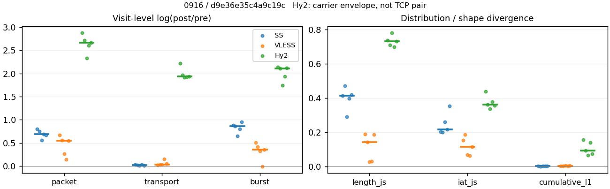
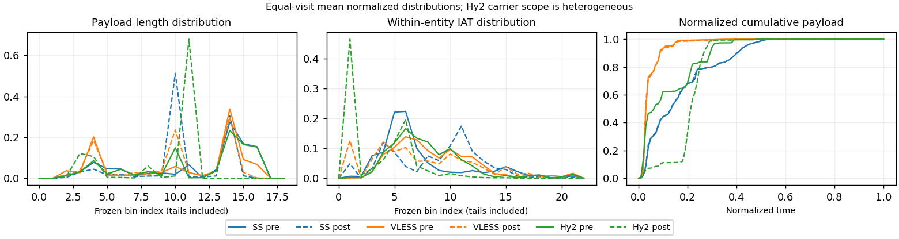

# 0916 · 条目 028 · youtube.com

目标：https://www.youtube.com/results?search_query=bread+baking

活动标签：youtube.com::search_results_view。选定访问 15 次。

[返回总索引](../../README.md) · [统计口径](../../methods.md)

## 覆盖与资格（每次访问均保留）

| 部署 | 重复 | 主请求路由 | 活动状态 | 代理比较 | DIRECT pre | 请求 proxy/direct/unresolved | 错误 |
| --- | --- | --- | --- | --- | --- | --- | --- |
| Hy2 | 1 | proxy | passed | 1 | 1 | 188/1/0 | [] |
| Hy2 | 2 | proxy | passed | 1 | 1 | 193/1/0 | [] |
| Hy2 | 3 | proxy | passed | 1 | 1 | 193/1/0 | [] |
| Hy2 | 4 | proxy | passed | 1 | 1 | 192/1/0 | [] |
| Hy2 | 5 | proxy | passed | 1 | 1 | 177/1/0 | [] |
| SS | 1 | proxy | passed | 1 | 0 | 189/0/0 | [] |
| SS | 2 | proxy | passed | 1 | 0 | 190/0/0 | [] |
| SS | 3 | proxy | passed | 1 | 0 | 185/0/0 | [] |
| SS | 4 | proxy | passed | 1 | 0 | 191/0/0 | [] |
| SS | 5 | proxy | passed | 1 | 0 | 183/0/0 | [] |
| VLESS | 1 | proxy | passed | 1 | 0 | 185/0/0 | [] |
| VLESS | 2 | proxy | passed | 1 | 0 | 188/0/0 | [] |
| VLESS | 3 | proxy | passed | 1 | 0 | 186/0/0 | [] |
| VLESS | 4 | proxy | passed | 1 | 0 | 186/0/0 | [] |
| VLESS | 5 | proxy | passed | 1 | 0 | 198/0/0 | [] |

主请求非 proxy 的统计仅解释为已索引的辅助代理连接或 DIRECT 观测，不代表目标业务经代理传输。播放确认与配对资格是两道不同的门。

图中散点为单次访问，短线为重复中位数；Hy2 是共享载体包络，不能与 TCP 配对作等范围因果对比。

形态图先逐访问归一化，再对访问等权平均；实线 pre，虚线 post。分箱序号及边界见 methods，不将分箱索引误解为长度或时间。

## 每次访问的关键观测

### SS

范围：`exclusive_page`。每格 pre → post；空值为不可观测/不适用。

| 重复 | 包数 | 载荷字节 | burst | TCP FR | IAT中位µs | length JS | IAT JS |
| --- | --- | --- | --- | --- | --- | --- | --- |
| 1 | 3613 → 8021 | 7.7703e+06 → 7.9907e+06 | 2475 → 5989 | 199 → 223 | 32.011 → 309.34 | 0.41193 | 0.20317 |
| 2 | 5860 → 12452 | 1.2011e+07 → 1.2194e+07 | 4477 → 10565 | 321 → 386 | 49.266 → 898.65 | 0.46965 | 0.19911 |
| 3 | 4407 → 7700 | 7.7906e+06 → 7.8684e+06 | 2855 → 5461 | 216 → 221 | 20.94 → 212.49 | 0.29038 | 0.25889 |
| 4 | 4096 → 8169 | 7.8328e+06 → 8.072e+06 | 2705 → 6032 | 217 → 227 | 22.936 → 206.95 | 0.39638 | 0.21486 |
| 5 | 4263 → 8296 | 7.5727e+06 → 7.6487e+06 | 2906 → 7570 | 202 → 218 | 30.222 → 1053.7 | 0.41743 | 0.35385 |

完整标量统计：中位数 [min,max]；Δ 为重复内逐访问变换的中位数，MAD 未缩放。n 为可用变换数；DIRECT-only 的 nΔ=0 不代表 pre 不可用。

| scope | 特征 | pre | post | Δ | IQRΔ | MADΔ | nΔ |
| --- | --- | --- | --- | --- | --- | --- | --- |
| exclusive_page | active_span_sum_s_1000ms | 36.286 [32.884, 87.223] | 43.267 [37.134, 94.804] | 0.083346 | 0.047896 | 0.017516 | 5 |
| exclusive_page | active_span_sum_s_100ms | 10.952 [8.8535, 38.361] | 19.274 [16.037, 59.058] | 0.50663 | 0.13377 | 0.075158 | 5 |
| exclusive_page | active_span_sum_s_500ms | 29.061 [26.937, 74.465] | 38.559 [31.747, 85.848] | 0.16428 | 0.044064 | 0.022034 | 5 |
| exclusive_page | burst_bytes_iqr | 3640 [3104, 4146.5] | 2856 [1428, 2856] | -0.37284 | 0.46207 | 0.28957 | 5 |
| exclusive_page | burst_bytes_mad | 39 [31, 39] | 40 [34, 40] | 0.025318 | 0 | 0 | 5 |
| exclusive_page | burst_bytes_max | 26080 [20480, 28672] | 17136 [7140, 39984] | -0.41999 | 0.49146 | 0.39671 | 5 |
| exclusive_page | burst_bytes_mean | 2728.8 [2605.9, 3139.5] | 1334.2 [1010.4, 1440.8] | -0.84343 | 0.083817 | 0.07153 | 5 |
| exclusive_page | burst_bytes_median | 39 [31, 39] | 40 [34, 40] | 0.025318 | 0 | 0 | 5 |
| exclusive_page | burst_bytes_min | 0 [0, 0] | 0 [0, 0] | — | — | — | 0 |
| exclusive_page | burst_bytes_p95 | 13032 [12231, 16384] | 4284 [2856, 5712] | -1.3414 | 0.15596 | 0.11313 | 5 |
| exclusive_page | burst_bytes_q25 | 0 [0, 0] | 0 [0, 0] | — | — | — | 0 |
| exclusive_page | burst_bytes_q75 | 3640 [3104, 4146.5] | 2856 [1428, 2856] | -0.37284 | 0.46207 | 0.28957 | 5 |
| exclusive_page | burst_bytes_std | 4707.5 [4325.5, 5240.8] | 1958.3 [1179.1, 2274.9] | -0.94877 | 0.10625 | 0.097999 | 5 |
| exclusive_page | burst_count | 2855 [2475, 4477] | 6032 [5461, 10565] | 0.85859 | 0.081707 | 0.056617 | 5 |
| exclusive_page | burst_duration_ms_iqr | 0.021403 [0, 0.029556] | 0 [0, 4e-05] | -6.3065 | — | — | 1 |
| exclusive_page | burst_duration_ms_mad | 0 [0, 0] | 0 [0, 0] | — | — | — | 0 |
| exclusive_page | burst_duration_ms_max | 15001 [15001, 15001] | 30362 [15105, 30694] | 0.70508 | 0.68402 | 0.010877 | 5 |
| exclusive_page | burst_duration_ms_mean | 85.154 [29.225, 101.52] | 21.811 [9.0241, 29.309] | -1.3014 | 0.15002 | 0.091046 | 5 |
| exclusive_page | burst_duration_ms_median | 0 [0, 0] | 0 [0, 0] | — | — | — | 0 |
| exclusive_page | burst_duration_ms_min | 0 [0, 0] | 0 [0, 0] | — | — | — | 0 |
| exclusive_page | burst_duration_ms_p95 | 11.905 [7.3601, 35.816] | 0.91552 [0.1577, 3.9788] | -2.8211 | 1.6823 | 0.93747 | 5 |
| exclusive_page | burst_duration_ms_q25 | 0 [0, 0] | 0 [0, 0] | — | — | — | 0 |
| exclusive_page | burst_duration_ms_q75 | 0.021403 [0, 0.029556] | 0 [0, 4e-05] | -6.3065 | — | — | 1 |
| exclusive_page | burst_duration_ms_std | 991.57 [508.32, 1129.6] | 568.05 [272.76, 669.2] | -0.62252 | 0.10178 | 0.099026 | 5 |
| exclusive_page | burst_packets_iqr | 1 [0, 1] | 0 [0, 1] | 0 | — | — | 1 |
| exclusive_page | burst_packets_mad | 0 [0, 0] | 0 [0, 0] | — | — | — | 0 |
| exclusive_page | burst_packets_max | 15 [12, 45] | 11 [7, 14] | -0.59784 | 0.52098 | 0.35667 | 5 |
| exclusive_page | burst_packets_mean | 1.467 [1.3089, 1.5436] | 1.3393 [1.0959, 1.41] | -0.10486 | 0.021107 | 0.014328 | 5 |
| exclusive_page | burst_packets_median | 1 [1, 1] | 1 [1, 1] | 0 | 0 | 0 | 5 |
| exclusive_page | burst_packets_min | 1 [1, 1] | 1 [1, 1] | 0 | 0 | 0 | 5 |
| exclusive_page | burst_packets_p95 | 3 [3, 4] | 3 [2, 3] | -0.28768 | 0.16908 | 0.11778 | 5 |
| exclusive_page | burst_packets_q25 | 1 [1, 1] | 1 [1, 1] | 0 | 0 | 0 | 5 |
| exclusive_page | burst_packets_q75 | 2 [1, 2] | 1 [1, 2] | -0.69315 | 0.69315 | 0 | 5 |
| exclusive_page | burst_packets_std | 1.0784 [0.75703, 1.2405] | 0.76585 [0.45459, 0.88] | -0.40298 | 0.069445 | 0.061094 | 5 |
| exclusive_page | connection_span_concurrency_max | 12 [10, 13] | 12 [10, 14] | 0 | 0 | 0 | 5 |
| exclusive_page | cumulative_l1 | — | — | 0.0017536 | 0.001076 | 0.00060906 | 5 |
| exclusive_page | cumulative_max | — | — | 0.02689 | 0.082038 | 0.018165 | 5 |
| exclusive_page | direction_entropy | 0.53572 [0.51455, 0.60324] | 0.33165 [0.31935, 0.35471] | -0.20761 | 0.019076 | 0.010319 | 5 |
| exclusive_page | down_burst_count | 1419 [1227, 2228] | 3005 [2721, 5272] | 0.86131 | 0.081831 | 0.054444 | 5 |
| exclusive_page | down_ip_bytes | 7.8399e+06 [7.6294e+06, 1.2045e+07] | 8.0788e+06 [7.7771e+06, 1.2362e+07] | 0.025941 | 0.019221 | 0.0067761 | 5 |
| exclusive_page | down_packets | 2611 [2180, 3329] | 4560 [4256, 6775] | 0.62393 | 0.21641 | 0.097484 | 5 |
| exclusive_page | down_transport_bytes | 7.6951e+06 [7.4936e+06, 1.1872e+07] | 7.844e+06 [7.5553e+06, 1.2007e+07] | 0.011304 | 0.015953 | 0.0031015 | 5 |
| exclusive_page | duration_s | 67.383 [65.861, 80.231] | 68.119 [65.861, 80.23] | -7.3806e-06 | 1.9548e-06 | 1.0981e-06 | 5 |
| exclusive_page | entity_count | 21 [14, 23] | 21 [14, 23] | 0 | 0 | 0 | 5 |
| exclusive_page | fr_runs | 216 [199, 321] | 223 [218, 386] | 0.076227 | 0.068814 | 0.03764 | 5 |
| exclusive_page | fr_runs_per_packet | 0.086111 [0.078264, 0.097866] | 0.049655 [0.047509, 0.056458] | -0.038602 | 0.011232 | 0.0057444 | 5 |
| exclusive_page | fr_switches | 194 [177, 300] | 204 [201, 365] | 0.081678 | 0.076893 | 0.045477 | 5 |
| exclusive_page | fr_switches_per_possible_transition | 0.077693 [0.072135, 0.092053] | 0.044977 [0.042902, 0.05355] | -0.034791 | 0.010763 | 0.0047193 | 5 |
| exclusive_page | full_retransmission_fraction | 0.0014075 [0.00068074, 0.003418] | 0.0082718 [0.0024108, 0.014445] | 0.0075892 | 0.0079414 | 0.0045037 | 5 |
| exclusive_page | full_retransmission_packets | 6 [3, 14] | 103 [20, 118] | 2.2687 | 0.81281 | 0.67576 | 5 |
| exclusive_page | iat_count | 4249 [3591, 5839] | 8146 [7681, 12431] | 0.69315 | 0.088233 | 0.062487 | 5 |
| exclusive_page | iat_js | — | — | 0.21486 | 0.055725 | 0.015742 | 5 |
| exclusive_page | iat_ks | — | — | 0.36987 | 0.057479 | 0.038657 | 5 |
| exclusive_page | iat_median_us | 30.222 [20.94, 49.266] | 309.34 [206.95, 1053.7] | 2.3172 | 0.63529 | 0.11745 | 5 |
| exclusive_page | iat_us_iqr | 120.83 [62.442, 2873.1] | 1225.6 [959.2, 7008.7] | 2.4328 | 0.54337 | 0.35276 | 5 |
| exclusive_page | iat_us_mad | 21.709 [14.684, 40.311] | 309.24 [203.88, 1044.5] | 2.6717 | 0.5816 | 0.15949 | 5 |
| exclusive_page | iat_us_max | 1.5001e+07 [1.5001e+07, 1.5001e+07] | 1.5455e+07 [1.536e+07, 1.5497e+07] | 0.029828 | 0.0022188 | 0.0021102 | 5 |
| exclusive_page | iat_us_mean | 1.4697e+05 [53026, 1.7937e+05] | 70001 [26613, 80979] | -0.68937 | 0.087171 | 0.065216 | 5 |
| exclusive_page | iat_us_median | 30.222 [20.94, 49.266] | 309.34 [206.95, 1053.7] | 2.3172 | 0.63529 | 0.11745 | 5 |
| exclusive_page | iat_us_min | 0.053 [0.01, 0.077] | 0.034 [0.031, 0.037] | -0.38677 | 1.679 | 0.52305 | 5 |
| exclusive_page | iat_us_p95 | 51162 [35253, 89587] | 21044 [13169, 27911] | -0.98466 | 0.2778 | 0.18155 | 5 |
| exclusive_page | iat_us_q25 | 13.521 [11.538, 16.307] | 12.782 [8.956, 133.82] | -0.056208 | 0.10176 | 0.085875 | 5 |
| exclusive_page | iat_us_q75 | 134.49 [73.98, 2889.4] | 1238.4 [969.75, 7024.3] | 2.3088 | 0.47105 | 0.31598 | 5 |
| exclusive_page | iat_us_std | 1.35e+06 [7.822e+05, 1.5575e+06] | 9.3761e+05 [5.5817e+05, 1.0518e+06] | -0.33745 | 0.056566 | 0.039439 | 5 |
| exclusive_page | iat_wasserstein_log1p_us | — | — | 1.3532 | 0.16562 | 0.050182 | 5 |
| exclusive_page | idle_gap_count_1000ms | 54 [20, 66] | 46 [18, 67] | 0 | 0.10536 | 0.015038 | 5 |
| exclusive_page | idle_gap_count_100ms | 142 [95, 248] | 125 [90, 183] | -0.12751 | 0.21787 | 0.14442 | 5 |
| exclusive_page | idle_gap_count_500ms | 63 [29, 84] | 57 [26, 79] | -0.074108 | 0.04783 | 0.035091 | 5 |
| exclusive_page | idle_gap_sum_s_1000ms | 583.95 [183.09, 782.04] | 581.19 [179.66, 775.37] | -0.0085654 | 0.0098904 | 0.0060715 | 5 |
| exclusive_page | idle_gap_sum_s_100ms | 606.09 [206.31, 830.91] | 596.4 [200.76, 811.12] | -0.016118 | 0.013117 | 0.0079824 | 5 |
| exclusive_page | idle_gap_sum_s_500ms | 589.9 [189.04, 794.8] | 585.75 [185.05, 784.33] | -0.012971 | 0.0062072 | 0.0059162 | 5 |
| exclusive_page | ip_bytes | 8.0201e+06 [7.7947e+06, 1.2316e+07] | 8.4784e+06 [8.1652e+06, 1.2923e+07] | 0.048096 | 0.016829 | 0.0093942 | 5 |
| exclusive_page | length_iqr | 3600 [2888, 6280] | 1428 [1428, 1428] | -0.92466 | 0.60054 | 0.22037 | 5 |
| exclusive_page | length_js | — | — | 0.41193 | 0.021055 | 0.015551 | 5 |
| exclusive_page | length_ks | — | — | 0.52621 | 0.0025119 | 0.0020629 | 5 |
| exclusive_page | length_mad | 1496 [1448, 2496] | 12 [0, 550] | -4.8256 | 1.8622 | 0.0010689 | 3 |
| exclusive_page | length_max | 8920 [8920, 8920] | 9996 [2856, 14280] | 0.11389 | 0.47 | 0.33647 | 5 |
| exclusive_page | length_mean | 3108.3 [2833, 3670.4] | 1778.4 [1689.4, 1783.6] | -0.60968 | 0.21865 | 0.10966 | 5 |
| exclusive_page | length_median | 2896 [2688, 2896] | 1428 [1428, 1428] | -0.70706 | 0 | 0 | 5 |
| exclusive_page | length_min | 30 [3, 31] | 6 [6, 10] | -1.1314 | 1.3218 | 0.51083 | 5 |
| exclusive_page | length_p95 | 8192 [8192, 8688] | 2856 [2856, 2856] | -1.0537 | 0 | 0 | 5 |
| exclusive_page | length_q25 | 960 [496, 1448] | 1428 [1428, 1428] | 0.3971 | 0.27344 | 0.22979 | 5 |
| exclusive_page | length_q75 | 4096 [4096, 7240] | 2856 [2856, 2856] | -0.36059 | 0.56961 | 0 | 5 |
| exclusive_page | length_std | 2637 [2501.9, 3049.8] | 966.01 [883.45, 1090.1] | -1.041 | 0.085498 | 0.048774 | 5 |
| exclusive_page | length_wasserstein_bytes | — | — | 1659.2 | 631.81 | 301.43 | 5 |
| exclusive_page | nonempty_entity_count | 21 [14, 23] | 21 [14, 23] | 0 | 0 | 0 | 5 |
| exclusive_page | nonempty_packets | 2581 [2117, 3280] | 4569 [4301, 6837] | 0.63976 | 0.22383 | 0.11231 | 5 |
| exclusive_page | offload_suspect_fraction | 0.37978 [0.37116, 0.40454] | 0.18503 [0.16514, 0.21753] | -0.19184 | 0.0029188 | 0.0029099 | 5 |
| exclusive_page | packet_count | 4263 [3613, 5860] | 8169 [7700, 12452] | 0.69034 | 0.087931 | 0.063396 | 5 |
| exclusive_page | rtt_median_ms | 0.053565 [0.038298, 0.059033] | 34.826 [19.856, 38.334] | 6.476 | 0.38129 | 0.25639 | 5 |
| exclusive_page | rtt_sample_count | 1565 [1361, 2457] | 936 [749, 2266] | -0.4039 | 0.29417 | 0.26463 | 5 |
| exclusive_page | tcp_ack_count | 4249 [3591, 5839] | 8143 [7679, 12430] | 0.69278 | 0.088394 | 0.062775 | 5 |
| exclusive_page | tcp_fin_count | 42 [28, 44] | 46 [28, 56] | 0.16252 | 0.076082 | 0.071547 | 5 |
| exclusive_page | tcp_packet_count | 4263 [3613, 5860] | 8169 [7700, 12452] | 0.69034 | 0.087931 | 0.063396 | 5 |
| exclusive_page | tcp_rst_count | 0 [0, 1] | 0 [0, 0] | — | — | — | 0 |
| exclusive_page | tcp_syn_count | 42 [28, 46] | 43 [31, 49] | 0.063179 | 0.014665 | 0.011886 | 5 |
| exclusive_page | tcp_window_raw_median | 65535 [65535, 65535] | 168 [164, 168] | -5.9664 | 0.011976 | 0 | 5 |
| exclusive_page | transition_entropy | 0.32971 [0.31522, 0.37115] | 0.20631 [0.19531, 0.2316] | -0.13439 | 0.029626 | 0.017286 | 5 |
| exclusive_page | transition_n_mm | 2177 [1709, 2719] | 4187 [3936, 6231] | 0.7338 | 0.23706 | 0.13688 | 5 |
| exclusive_page | transition_n_mp | 92 [81, 145] | 99 [93, 178] | 0.083382 | 0.084662 | 0.05261 | 5 |
| exclusive_page | transition_n_pm | 101 [96, 155] | 108 [103, 187] | 0.080043 | 0.070381 | 0.03774 | 5 |
| exclusive_page | transition_n_pp | 202 [194, 240] | 161 [147, 220] | -0.20526 | 0.10531 | 0.088676 | 5 |
| exclusive_page | transition_p_mm | 0.95864 [0.94937, 0.96048] | 0.9769 [0.97223, 0.97861] | 0.019978 | 0.0064311 | 0.0029979 | 5 |
| exclusive_page | transition_p_mp | 0.041364 [0.039522, 0.050628] | 0.023098 [0.021386, 0.027773] | -0.019978 | 0.0064311 | 0.0029979 | 5 |
| exclusive_page | transition_p_pm | 0.33444 [0.31475, 0.39241] | 0.40602 [0.36735, 0.45946] | 0.059214 | 0.01134 | 0.0066209 | 5 |
| exclusive_page | transition_p_pp | 0.66556 [0.60759, 0.68525] | 0.59398 [0.54054, 0.63265] | -0.059214 | 0.01134 | 0.0066209 | 5 |
| exclusive_page | transport_bytes | 7.7906e+06 [7.5727e+06, 1.2011e+07] | 7.9907e+06 [7.6487e+06, 1.2194e+07] | 0.015166 | 0.01799 | 0.0052338 | 5 |
| exclusive_page | up_burst_count | 1436 [1248, 2249] | 3027 [2740, 5293] | 0.8559 | 0.081585 | 0.058749 | 5 |
| exclusive_page | up_byte_fraction | 0.012265 [0.010455, 0.014723] | 0.015362 [0.012212, 0.018369] | 0.0017568 | 0.0019549 | 0.00015474 | 5 |
| exclusive_page | up_ip_bytes | 1.8916e+05 [1.6526e+05, 2.7058e+05] | 3.8813e+05 [3.3983e+05, 5.6084e+05] | 0.72886 | 0.06023 | 0.041071 | 5 |
| exclusive_page | up_packets | 1625 [1433, 2531] | 3536 [3140, 5677] | 0.80781 | 0.10399 | 0.08645 | 5 |
| exclusive_page | up_transport_bytes | 1.1248e+05 [79175, 1.3876e+05] | 1.2957e+05 [93406, 1.8733e+05] | 0.16529 | 0.10782 | 0.032599 | 5 |
| exclusive_page | zero_iat_count | 0 [0, 0] | 0 [0, 0] | — | — | — | 0 |
| exclusive_page | zero_iat_fraction | 0 [0, 0] | 0 [0, 0] | 0 | 0 | 0 | 5 |

### VLESS

范围：`exclusive_page`。每格 pre → post；空值为不可观测/不适用。

| 重复 | 包数 | 载荷字节 | burst | TCP FR | IAT中位µs | length JS | IAT JS |
| --- | --- | --- | --- | --- | --- | --- | --- |
| 1 | 2412 → 4684 | 5.2055e+06 → 5.2977e+06 | 1717 → 2836 | 117 → 148 | 58.762 → 15.55 | 0.18779 | 0.15339 |
| 2 | 2436 → 4243 | 3.1908e+06 → 3.2911e+06 | 1737 → 2624 | 116 → 142 | 143.04 → 13.941 | 0.14175 | 0.18599 |
| 3 | 2601 → 3395 | 3.1582e+06 → 3.2651e+06 | 1750 → 2422 | 124 → 154 | 153.48 → 79.254 | 0.027105 | 0.069349 |
| 4 | 1220 → 1398 | 6.8244e+05 → 7.9403e+05 | 915 → 909 | 120 → 148 | 260.85 → 732.62 | 0.02854 | 0.063857 |
| 5 | 2358 → 4065 | 3.4051e+06 → 3.5776e+06 | 1748 → 2498 | 164 → 208 | 99.719 → 63.977 | 0.18696 | 0.11434 |

完整标量统计：中位数 [min,max]；Δ 为重复内逐访问变换的中位数，MAD 未缩放。n 为可用变换数；DIRECT-only 的 nΔ=0 不代表 pre 不可用。

| scope | 特征 | pre | post | Δ | IQRΔ | MADΔ | nΔ |
| --- | --- | --- | --- | --- | --- | --- | --- |
| exclusive_page | active_span_sum_s_1000ms | 21.087 [20.578, 32.566] | 24.039 [20.289, 38.762] | 0.015339 | 0.18141 | 0.10477 | 5 |
| exclusive_page | active_span_sum_s_100ms | 2.9566 [2.643, 4.1057] | 9.1038 [8.3316, 13.528] | 1.1481 | 0.1234 | 0.044552 | 5 |
| exclusive_page | active_span_sum_s_500ms | 10.016 [9.2896, 15.797] | 20.775 [19.137, 33.598] | 0.67729 | 0.092592 | 0.01616 | 5 |
| exclusive_page | burst_bytes_iqr | 2896 [1352, 3883] | 2824 [1852, 2896] | -0.025176 | 0.025176 | 0.025176 | 5 |
| exclusive_page | burst_bytes_mad | 0 [0, 0] | 24 [24, 53] | — | — | — | 0 |
| exclusive_page | burst_bytes_max | 20480 [5792, 25304] | 17376 [4832, 34752] | -0.16436 | 0.14583 | 0.12897 | 5 |
| exclusive_page | burst_bytes_mean | 1837 [745.83, 3031.7] | 1348.1 [873.52, 1868] | -0.30758 | 0.089913 | 0.074024 | 5 |
| exclusive_page | burst_bytes_median | 0 [0, 0] | 24 [24, 53] | — | — | — | 0 |
| exclusive_page | burst_bytes_min | 0 [0, 0] | 0 [0, 0] | — | — | — | 0 |
| exclusive_page | burst_bytes_p95 | 8760 [2896, 15536] | 4344 [2896, 7204] | -0.69315 | 0.046009 | 0.037688 | 5 |
| exclusive_page | burst_bytes_q25 | 0 [0, 0] | 0 [0, 0] | — | — | — | 0 |
| exclusive_page | burst_bytes_q75 | 2896 [1352, 3883] | 2824 [1852, 2896] | -0.025176 | 0.025176 | 0.025176 | 5 |
| exclusive_page | burst_bytes_std | 3311.2 [1167.4, 5110.3] | 1735.9 [1197.2, 2924.5] | -0.55813 | 0.041334 | 0.032928 | 5 |
| exclusive_page | burst_count | 1737 [915, 1750] | 2498 [909, 2836] | 0.35702 | 0.087563 | 0.055522 | 5 |
| exclusive_page | burst_duration_ms_iqr | 0.19589 [0.024013, 0.50978] | 0.0039775 [0.00016825, 0.97904] | -3.8969 | 3.2204 | 2.1564 | 5 |
| exclusive_page | burst_duration_ms_mad | 0 [0, 0] | 0 [0, 0] | — | — | — | 0 |
| exclusive_page | burst_duration_ms_max | 15001 [15001, 15001] | 15048 [14557, 15225] | 0.0031235 | 0.0012471 | 0.0007307 | 5 |
| exclusive_page | burst_duration_ms_mean | 89.935 [72.658, 272.03] | 29.653 [21.766, 166.71] | -0.89618 | 0.46501 | 0.30922 | 5 |
| exclusive_page | burst_duration_ms_median | 0 [0, 0] | 0 [0, 0] | — | — | — | 0 |
| exclusive_page | burst_duration_ms_min | 0 [0, 0] | 0 [0, 0] | — | — | — | 0 |
| exclusive_page | burst_duration_ms_p95 | 16.288 [7.0732, 201.39] | 5.2626 [1.5461, 158.66] | -0.5953 | 1.9254 | 0.35685 | 5 |
| exclusive_page | burst_duration_ms_q25 | 0 [0, 0] | 0 [0, 0] | — | — | — | 0 |
| exclusive_page | burst_duration_ms_q75 | 0.19589 [0.024013, 0.50978] | 0.0039775 [0.00016825, 0.97904] | -3.8969 | 3.2204 | 2.1564 | 5 |
| exclusive_page | burst_duration_ms_std | 1044.8 [925.62, 1808.8] | 604.22 [508.48, 1467.3] | -0.42652 | 0.32871 | 0.21725 | 5 |
| exclusive_page | burst_packets_iqr | 1 [1, 1] | 1 [1, 1] | 0 | 0 | 0 | 5 |
| exclusive_page | burst_packets_mad | 0 [0, 0] | 0 [0, 0] | — | — | — | 0 |
| exclusive_page | burst_packets_max | 7 [4, 10] | 9 [7, 18] | 0.51083 | 0.3083 | 0.076961 | 5 |
| exclusive_page | burst_packets_mean | 1.4024 [1.3333, 1.4863] | 1.617 [1.4017, 1.6516] | 0.14277 | 0.019507 | 0.019109 | 5 |
| exclusive_page | burst_packets_median | 1 [1, 1] | 1 [1, 1] | 0 | 0 | 0 | 5 |
| exclusive_page | burst_packets_min | 1 [1, 1] | 1 [1, 1] | 0 | 0 | 0 | 5 |
| exclusive_page | burst_packets_p95 | 2 [2, 3] | 4 [3, 4] | 0.40547 | 0.28768 | 0.11778 | 5 |
| exclusive_page | burst_packets_q25 | 1 [1, 1] | 1 [1, 1] | 0 | 0 | 0 | 5 |
| exclusive_page | burst_packets_q75 | 2 [2, 2] | 2 [2, 2] | 0 | 0 | 0 | 5 |
| exclusive_page | burst_packets_std | 0.59827 [0.57387, 0.7893] | 1.033 [0.7849, 1.254] | 0.46296 | 0.14961 | 0.12483 | 5 |
| exclusive_page | connection_span_concurrency_max | 9 [9, 11] | 9 [9, 11] | 0 | 0 | 0 | 5 |
| exclusive_page | cumulative_l1 | — | — | 0.0030078 | 0.0018505 | 0.0010106 | 5 |
| exclusive_page | cumulative_max | — | — | 0.046658 | 0.056428 | 0.018608 | 5 |
| exclusive_page | direction_entropy | 0.41651 [0.37882, 0.70862] | 0.3683 [0.28499, 0.70514] | -0.091856 | 0.10173 | 0.03966 | 5 |
| exclusive_page | down_burst_count | 862 [450, 868] | 1238 [447, 1412] | 0.36084 | 0.088256 | 0.054631 | 5 |
| exclusive_page | down_ip_bytes | 3.2256e+06 [6.6993e+05, 5.2331e+06] | 3.3457e+06 [7.5924e+05, 5.3672e+06] | 0.036557 | 0.022922 | 0.011269 | 5 |
| exclusive_page | down_packets | 1452 [676, 1658] | 2374 [786, 2797] | 0.45978 | 0.38577 | 0.19583 | 5 |
| exclusive_page | down_transport_bytes | 3.1476e+06 [6.3466e+05, 5.1575e+06] | 3.2222e+06 [7.1825e+05, 5.2216e+06] | 0.025305 | 0.014786 | 0.01291 | 5 |
| exclusive_page | duration_s | 68.551 [64.426, 72.192] | 68.527 [64.378, 72.154] | -0.00034493 | 0.0002747 | 9.8167e-05 | 5 |
| exclusive_page | entity_count | 15 [13, 22] | 15 [13, 22] | 0 | 0 | 0 | 5 |
| exclusive_page | fr_runs | 120 [116, 164] | 148 [142, 208] | 0.21667 | 0.025318 | 0.014434 | 5 |
| exclusive_page | fr_runs_per_packet | 0.084112 [0.077889, 0.19672] | 0.081181 [0.054452, 0.21023] | -0.019234 | 0.032952 | 0.019301 | 5 |
| exclusive_page | fr_switches | 105 [102, 142] | 133 [129, 186] | 0.24116 | 0.028988 | 0.016079 | 5 |
| exclusive_page | fr_switches_per_possible_transition | 0.074128 [0.069708, 0.17647] | 0.074349 [0.049205, 0.19303] | -0.016152 | 0.029564 | 0.015833 | 5 |
| exclusive_page | full_retransmission_fraction | 0 [0, 0.0037313] | 0 [0, 0] | 0 | 0.00081967 | 0 | 5 |
| exclusive_page | full_retransmission_packets | 0 [0, 9] | 0 [0, 0] | — | — | — | 0 |
| exclusive_page | iat_count | 2397 [1205, 2587] | 4043 [1383, 4669] | 0.54855 | 0.28952 | 0.11818 | 5 |
| exclusive_page | iat_js | — | — | 0.11434 | 0.084044 | 0.04499 | 5 |
| exclusive_page | iat_ks | — | — | 0.20822 | 0.11928 | 0.081142 | 5 |
| exclusive_page | iat_median_us | 143.04 [58.762, 260.85] | 63.977 [13.941, 732.62] | -0.66089 | 0.8856 | 0.66855 | 5 |
| exclusive_page | iat_us_iqr | 1007.4 [531.2, 2531.9] | 824.23 [62.454, 7645.6] | -0.17056 | 0.52069 | 0.37196 | 5 |
| exclusive_page | iat_us_mad | 134.25 [50.038, 253.33] | 63.932 [13.895, 724.78] | -0.63526 | 0.80847 | 0.54024 | 5 |
| exclusive_page | iat_us_max | 1.5001e+07 [1.5001e+07, 1.5001e+07] | 1.5426e+07 [1.5368e+07, 1.545e+07] | 0.027925 | 0.0046656 | 0.0015507 | 5 |
| exclusive_page | iat_us_mean | 2.2558e+05 [1.4031e+05, 4.4803e+05] | 1.4508e+05 [71937, 3.8996e+05] | -0.54973 | 0.28973 | 0.11832 | 5 |
| exclusive_page | iat_us_median | 143.04 [58.762, 260.85] | 63.977 [13.941, 732.62] | -0.66089 | 0.8856 | 0.66855 | 5 |
| exclusive_page | iat_us_min | 0.433 [0.009, 1.369] | 0.031 [0.022, 0.036] | -2.6856 | 1.2174 | 1.0705 | 5 |
| exclusive_page | iat_us_p95 | 19320 [9801.5, 6.2086e+05] | 41659 [26022, 1.5724e+05] | 0.29778 | 2.4258 | 1.1492 | 5 |
| exclusive_page | iat_us_q25 | 34.599 [18.374, 37.971] | 6.6025 [3.139, 32.974] | -1.149 | 0.67232 | 0.61807 | 5 |
| exclusive_page | iat_us_q75 | 1042 [549.58, 2569.9] | 835.89 [65.593, 7678.6] | -0.18118 | 0.51845 | 0.38779 | 5 |
| exclusive_page | iat_us_std | 1.7354e+06 [1.3561e+06, 2.4183e+06] | 1.4029e+06 [9.7811e+05, 2.2735e+06] | -0.26015 | 0.14518 | 0.066596 | 5 |
| exclusive_page | iat_wasserstein_log1p_us | — | — | 0.81013 | 0.80273 | 0.094466 | 5 |
| exclusive_page | idle_gap_count_1000ms | 42 [27, 63] | 39 [29, 55] | -0.074108 | 0.064095 | 0.055945 | 5 |
| exclusive_page | idle_gap_count_100ms | 92 [84, 141] | 100 [98, 158] | 0.11384 | 0.059528 | 0.029953 | 5 |
| exclusive_page | idle_gap_count_500ms | 60 [47, 86] | 41 [31, 61] | -0.38077 | 0.061992 | 0.035388 | 5 |
| exclusive_page | idle_gap_sum_s_1000ms | 519.03 [309.96, 667.81] | 515.28 [311.77, 660.79] | -0.0012895 | 0.0079561 | 0.0059749 | 5 |
| exclusive_page | idle_gap_sum_s_100ms | 537.11 [332.5, 696.27] | 530.21 [325.81, 686.02] | -0.012928 | 0.0025132 | 0.0016644 | 5 |
| exclusive_page | idle_gap_sum_s_500ms | 530.58 [324.66, 684.58] | 518.54 [313.3, 665.95] | -0.022959 | 0.0072284 | 0.0044409 | 5 |
| exclusive_page | ip_bytes | 3.3174e+06 [7.4578e+05, 5.3309e+06] | 3.5203e+06 [8.6747e+05, 5.5436e+06] | 0.059363 | 0.030509 | 0.015622 | 5 |
| exclusive_page | length_iqr | 2734 [2300, 4380] | 1846 [1616, 2716] | -0.28754 | 0.21346 | 0.18649 | 5 |
| exclusive_page | length_js | — | — | 0.14175 | 0.15842 | 0.04604 | 5 |
| exclusive_page | length_ks | — | — | 0.2611 | 0.18211 | 0.062341 | 5 |
| exclusive_page | length_mad | 1059 [777.5, 2120] | 1232 [736, 1376] | 0.18553 | 0.65102 | 0.076324 | 5 |
| exclusive_page | length_max | 8920 [4096, 8920] | 7240 [2856, 11296] | -0.20867 | 0.33647 | 0.15191 | 5 |
| exclusive_page | length_mean | 2225.1 [1118.8, 3742.2] | 1554.8 [1127.9, 1949.1] | -0.44281 | 0.40132 | 0.2095 | 5 |
| exclusive_page | length_median | 1879.5 [849.5, 2896] | 1412 [1008, 1484] | -0.286 | 0.32244 | 0.23441 | 5 |
| exclusive_page | length_min | 24 [21, 24] | 20 [3, 24] | -0.18232 | 1.5686 | 0.18232 | 5 |
| exclusive_page | length_p95 | 7240 [2856, 8920] | 2896 [2824, 4344] | -0.7195 | 0.29685 | 0.19679 | 5 |
| exclusive_page | length_q25 | 92 [72, 1412] | 180 [72, 1208] | 0.18232 | 0.67117 | 0.33836 | 5 |
| exclusive_page | length_q75 | 2824 [2372, 5792] | 2824 [1797.2, 2824] | -0.064723 | 0.27748 | 0.064723 | 5 |
| exclusive_page | length_std | 2104.1 [1137.7, 2940.7] | 1099.8 [1074.8, 1467.6] | -0.6487 | 0.47093 | 0.26432 | 5 |
| exclusive_page | length_wasserstein_bytes | — | — | 822.94 | 1025.6 | 552.27 | 5 |
| exclusive_page | nonempty_entity_count | 15 [13, 22] | 15 [13, 22] | 0 | 0 | 0 | 5 |
| exclusive_page | nonempty_packets | 1391 [610, 1592] | 2301 [704, 2718] | 0.47374 | 0.41747 | 0.19613 | 5 |
| exclusive_page | offload_suspect_fraction | 0.32471 [0.15164, 0.42123] | 0.16999 [0.13019, 0.30359] | -0.11764 | 0.054985 | 0.038966 | 5 |
| exclusive_page | packet_count | 2412 [1220, 2601] | 4065 [1398, 4684] | 0.5446 | 0.28851 | 0.1191 | 5 |
| exclusive_page | rtt_median_ms | 0.10851 [0.065577, 0.22955] | 0.052157 [0.025805, 2.1254] | -0.93266 | 2.0964 | 0.60183 | 5 |
| exclusive_page | rtt_sample_count | 897 [479, 911] | 1379 [572, 1817] | 0.43006 | 0.29206 | 0.18021 | 5 |
| exclusive_page | tcp_ack_count | 2369 [1176, 2560] | 4043 [1383, 4667] | 0.56669 | 0.28958 | 0.11136 | 5 |
| exclusive_page | tcp_fin_count | 29 [26, 42] | 30 [26, 44] | 0.033902 | 0.036368 | 0.012618 | 5 |
| exclusive_page | tcp_packet_count | 2412 [1220, 2601] | 4065 [1398, 4684] | 0.5446 | 0.28851 | 0.1191 | 5 |
| exclusive_page | tcp_rst_count | 28 [26, 42] | 0 [0, 2] | -2.9486 | 0.30952 | 0.30952 | 2 |
| exclusive_page | tcp_syn_count | 30 [26, 44] | 30 [26, 44] | 0 | 0 | 0 | 5 |
| exclusive_page | tcp_window_raw_median | 65535 [65535, 65535] | 182 [141, 190] | -5.8863 | 0.12119 | 0.043017 | 5 |
| exclusive_page | transition_entropy | 0.28438 [0.267, 0.55967] | 0.27783 [0.19956, 0.58802] | -0.055646 | 0.095649 | 0.03111 | 5 |
| exclusive_page | transition_n_mm | 1216 [432, 1413] | 2001 [495, 2509] | 0.5113 | 0.48164 | 0.21302 | 5 |
| exclusive_page | transition_n_mp | 45 [44, 60] | 59 [58, 82] | 0.27193 | 0.022473 | 0.018153 | 5 |
| exclusive_page | transition_n_pm | 60 [58, 82] | 74 [71, 104] | 0.21667 | 0.027951 | 0.014434 | 5 |
| exclusive_page | transition_n_pp | 58 [55, 72] | 61 [55, 92] | 0.050431 | 0.014713 | 0.014713 | 5 |
| exclusive_page | transition_p_mm | 0.96508 [0.90566, 0.96715] | 0.96398 [0.8935, 0.97702] | 0.0076015 | 0.015112 | 0.0077768 | 5 |
| exclusive_page | transition_p_mp | 0.034921 [0.032854, 0.09434] | 0.036021 [0.022975, 0.1065] | -0.0076015 | 0.015112 | 0.0077768 | 5 |
| exclusive_page | transition_p_pm | 0.51327 [0.5, 0.53247] | 0.54815 [0.53061, 0.57463] | 0.044712 | 0.0084746 | 0.0050388 | 5 |
| exclusive_page | transition_p_pp | 0.48673 [0.46753, 0.5] | 0.45185 [0.42537, 0.46939] | -0.044712 | 0.0084746 | 0.0050388 | 5 |
| exclusive_page | transport_bytes | 3.1908e+06 [6.8244e+05, 5.2055e+06] | 3.2911e+06 [7.9403e+05, 5.2977e+06] | 0.033284 | 0.018501 | 0.015724 | 5 |
| exclusive_page | up_burst_count | 875 [465, 885] | 1260 [462, 1424] | 0.35328 | 0.086873 | 0.056367 | 5 |
| exclusive_page | up_byte_fraction | 0.014623 [0.009209, 0.070014] | 0.022455 [0.014354, 0.095431] | 0.0078316 | 0.0035307 | 0.0026862 | 5 |
| exclusive_page | up_ip_bytes | 95007 [75852, 1.2722e+05] | 1.7458e+05 [1.0822e+05, 2.1905e+05] | 0.5434 | 0.13931 | 0.092215 | 5 |
| exclusive_page | up_packets | 943 [544, 978] | 1662 [612, 1887] | 0.53027 | 0.25805 | 0.14554 | 5 |
| exclusive_page | up_transport_bytes | 47780 [43268, 76690] | 75775 [68900, 1.1959e+05] | 0.46144 | 0.0010195 | 0.00074312 | 5 |
| exclusive_page | zero_iat_count | 0 [0, 0] | 0 [0, 0] | — | — | — | 0 |
| exclusive_page | zero_iat_fraction | 0 [0, 0] | 0 [0, 0] | 0 | 0 | 0 | 5 |

### Hy2

范围：`carrier_context_envelope`。每格 pre → post；空值为不可观测/不适用。

| 重复 | 包数 | 载荷字节 | burst | TCP FR | IAT中位µs | length JS | IAT JS |
| --- | --- | --- | --- | --- | --- | --- | --- |
| 1 | 2809 → 49908 | 5.8605e+06 → 5.4124e+07 | 1869 → 15904 | — | 111.32 → 1.848 | 0.73674 | 0.43799 |
| 2 | 3375 → 51263 | 7.6624e+06 → 5.4889e+07 | 2132 → 17655 | — | 66.135 → 4.112 | 0.71016 | 0.35985 |
| 3 | 4866 → 50381 | 7.8971e+06 → 5.3622e+07 | 3104 → 17796 | — | 78.831 → 6.432 | 0.77945 | 0.33527 |
| 4 | 3703 → 50413 | 7.8058e+06 → 5.378e+07 | 2512 → 17407 | — | 88.081 → 3.871 | 0.69889 | 0.37741 |
| 5 | 3522 → 50877 | 7.7562e+06 → 5.3632e+07 | 2181 → 18175 | — | 80.808 → 5.4095 | 0.7311 | 0.3549 |

范围：`direct_pre_only`。每格 pre → post；空值为不可观测/不适用。

| 重复 | 包数 | 载荷字节 | burst | TCP FR | IAT中位µs | length JS | IAT JS |
| --- | --- | --- | --- | --- | --- | --- | --- |
| 1 | 35 → — | 8669 → — | 25 → — | 7 → — | 140.94 → — | — | — |
| 2 | 27 → — | 8669 → — | 19 → — | 7 → — | 151.35 → — | — | — |
| 3 | 31 → — | 8670 → — | 21 → — | 7 → — | 209.34 → — | — | — |
| 4 | 35 → — | 8638 → — | 25 → — | 7 → — | 193.03 → — | — | — |
| 5 | 29 → — | 8639 → — | 21 → — | 7 → — | 177.3 → — | — | — |

完整标量统计：中位数 [min,max]；Δ 为重复内逐访问变换的中位数，MAD 未缩放。n 为可用变换数；DIRECT-only 的 nΔ=0 不代表 pre 不可用。

| scope | 特征 | pre | post | Δ | IQRΔ | MADΔ | nΔ |
| --- | --- | --- | --- | --- | --- | --- | --- |
| carrier_context_envelope | active_span_sum_s_1000ms | 19.274 [16.24, 27.842] | 23.224 [21.426, 27.038] | 0.17459 | 0.36513 | 0.16391 | 5 |
| carrier_context_envelope | active_span_sum_s_100ms | 3.943 [2.4943, 4.3946] | 9.5315 [8.9227, 11.494] | 1.0698 | 0.40109 | 0.20475 | 5 |
| carrier_context_envelope | active_span_sum_s_500ms | 17.588 [14.074, 22.806] | 21.426 [19.274, 24.074] | 0.16312 | 0.32267 | 0.21362 | 5 |
| carrier_context_envelope | burst_bytes_iqr | 4245 [3379, 5089] | 5070 [4210, 5130] | 0.18936 | 0.22362 | 0.13418 | 5 |
| carrier_context_envelope | burst_bytes_mad | 31 [0, 39] | 261 [202, 405.5] | 2.0712 | 0.15789 | 0.041834 | 4 |
| carrier_context_envelope | burst_bytes_max | 24965 [20480, 29100] | 2.0035e+05 [1.3933e+05, 3.6738e+05] | 2.1167 | 0.19313 | 0.14228 | 5 |
| carrier_context_envelope | burst_bytes_mean | 3135.6 [2544.2, 3594] | 3089.6 [2950.9, 3403.2] | -0.0057584 | 0.22685 | 0.13921 | 5 |
| carrier_context_envelope | burst_bytes_median | 31 [0, 39] | 294 [235, 438.5] | 2.1845 | 0.16434 | 0.049512 | 4 |
| carrier_context_envelope | burst_bytes_min | 0 [0, 0] | 22 [22, 22] | — | — | — | 0 |
| carrier_context_envelope | burst_bytes_p95 | 17840 [11320, 20480] | 10932 [10932, 11528] | -0.44985 | 0.12946 | 0.11627 | 5 |
| carrier_context_envelope | burst_bytes_q25 | 0 [0, 0] | 80 [38, 98] | — | — | — | 0 |
| carrier_context_envelope | burst_bytes_q75 | 4245 [3379, 5089] | 5168 [4290, 5168] | 0.19674 | 0.2233 | 0.14555 | 5 |
| carrier_context_envelope | burst_bytes_std | 5578.2 [4294.6, 5909.8] | 6042.6 [5100.8, 8615.8] | 0.15313 | 0.15947 | 0.13089 | 5 |
| carrier_context_envelope | burst_count | 2181 [1869, 3104] | 17655 [15904, 18175] | 2.114 | 0.18447 | 0.027209 | 5 |
| carrier_context_envelope | burst_duration_ms_iqr | 0.088402 [0.030442, 0.14285] | 0.024259 [0.024219, 0.025612] | -1.2942 | 0.56231 | 0.37483 | 5 |
| carrier_context_envelope | burst_duration_ms_mad | 0 [0, 0] | 4.3e-05 [4.2e-05, 5e-05] | — | — | — | 0 |
| carrier_context_envelope | burst_duration_ms_max | 15001 [15001, 15001] | 9975 [9022.6, 10197] | -0.40804 | 0.0043668 | 0.0026032 | 5 |
| carrier_context_envelope | burst_duration_ms_mean | 122.39 [102.18, 136.18] | 1.2325 [0.97332, 1.7338] | -4.5982 | 0.18314 | 0.090601 | 5 |
| carrier_context_envelope | burst_duration_ms_median | 0 [0, 0] | 4.3e-05 [4.2e-05, 5e-05] | — | — | — | 0 |
| carrier_context_envelope | burst_duration_ms_min | 0 [0, 0] | 0 [0, 0] | — | — | — | 0 |
| carrier_context_envelope | burst_duration_ms_p95 | 11.839 [3.4513, 16.398] | 0.10486 [0.091074, 0.12199] | -4.7131 | 0.48448 | 0.30623 | 5 |
| carrier_context_envelope | burst_duration_ms_q25 | 0 [0, 0] | 0 [0, 0] | — | — | — | 0 |
| carrier_context_envelope | burst_duration_ms_q75 | 0.088402 [0.030442, 0.14285] | 0.024259 [0.024219, 0.025612] | -1.2942 | 0.56231 | 0.37483 | 5 |
| carrier_context_envelope | burst_duration_ms_std | 1211 [1151.3, 1284] | 84.531 [76.213, 113.58] | -2.6894 | 0.055171 | 0.027877 | 5 |
| carrier_context_envelope | burst_packets_iqr | 1 [1, 1] | 3 [2, 3] | 1.0986 | 0.40547 | 0 | 5 |
| carrier_context_envelope | burst_packets_mad | 0 [0, 0] | 1 [1, 1] | — | — | — | 0 |
| carrier_context_envelope | burst_packets_max | 20 [12, 24] | 145 [100, 265] | 1.981 | 0.93697 | 0.37156 | 5 |
| carrier_context_envelope | burst_packets_mean | 1.5677 [1.4741, 1.6149] | 2.8961 [2.7993, 3.1381] | 0.60662 | 0.084253 | 0.056497 | 5 |
| carrier_context_envelope | burst_packets_median | 1 [1, 1] | 2 [2, 2] | 0.69315 | 0 | 0 | 5 |
| carrier_context_envelope | burst_packets_min | 1 [1, 1] | 1 [1, 1] | 0 | 0 | 0 | 5 |
| carrier_context_envelope | burst_packets_p95 | 3 [3, 3] | 8 [8, 8] | 0.98083 | 0 | 0 | 5 |
| carrier_context_envelope | burst_packets_q25 | 1 [1, 1] | 1 [1, 1] | 0 | 0 | 0 | 5 |
| carrier_context_envelope | burst_packets_q75 | 2 [2, 2] | 4 [3, 4] | 0.69315 | 0.28768 | 0 | 5 |
| carrier_context_envelope | burst_packets_std | 1.0108 [0.92096, 1.1018] | 4.1695 [3.434, 6.08] | 1.3308 | 0.14398 | 0.13282 | 5 |
| carrier_context_envelope | connection_span_concurrency_max | 12 [11, 15] | 1 [1, 1] | -2.4849 | 0.080043 | 0.080043 | 5 |
| carrier_context_envelope | cumulative_l1 | — | — | 0.092359 | 0.067338 | 0.026255 | 5 |
| carrier_context_envelope | cumulative_max | — | — | 0.44264 | 0.40539 | 0.097831 | 5 |
| carrier_context_envelope | direction_entropy | 0.59302 [0.49088, 0.61348] | 0.77506 [0.75246, 0.79174] | 0.18204 | 0.055846 | 0.039577 | 5 |
| carrier_context_envelope | direction_run_analog_runs | 197 [151, 213] | 17655 [15904, 18175] | 4.5246 | 0.11159 | 0.099162 | 5 |
| carrier_context_envelope | direction_run_analog_runs_per_packet | 0.089067 [0.069291, 0.096804] | 0.34529 [0.31867, 0.35723] | 0.25533 | 0.020607 | 0.013757 | 5 |
| carrier_context_envelope | direction_run_analog_switches | 182 [134, 191] | 17654 [15903, 18174] | 4.6037 | 0.091027 | 0.069341 | 5 |
| carrier_context_envelope | direction_run_analog_switches_per_possible_transition | 0.081982 [0.062582, 0.087638] | 0.34527 [0.31865, 0.35722] | 0.26224 | 0.017603 | 0.012998 | 5 |
| carrier_context_envelope | down_burst_count | 1083 [926, 1541] | 8827 [7952, 9087] | 2.1214 | 0.18258 | 0.02887 | 5 |
| carrier_context_envelope | down_ip_bytes | 7.7871e+06 [5.8813e+06, 7.9462e+06] | 5.3926e+07 [5.3848e+07, 5.5007e+07] | 1.9337 | 0.035566 | 0.01879 | 5 |
| carrier_context_envelope | down_packets | 2252 [1741, 3160] | 38903 [38685, 39622] | 2.8493 | 0.080762 | 0.068859 | 5 |
| carrier_context_envelope | down_transport_bytes | 7.6689e+06 [5.7906e+06, 7.7817e+06] | 5.2843e+07 [5.2763e+07, 5.3897e+07] | 1.9286 | 0.035073 | 0.013095 | 5 |
| carrier_context_envelope | duration_s | 65.12 [63.686, 65.464] | 65.119 [63.678, 65.463] | -4.3467e-05 | 7.4513e-05 | 3.6359e-05 | 5 |
| carrier_context_envelope | entity_count | 17 [15, 22] | 1 [1, 1] | -2.8332 | 0.31845 | 0.12516 | 5 |
| carrier_context_envelope | full_retransmission_fraction | 0.0017778 [0.001233, 0.002136] | — | — | — | — | 0 |
| carrier_context_envelope | full_retransmission_packets | 6 [5, 7] | — | — | — | — | 0 |
| carrier_context_envelope | iat_count | 3507 [2792, 4844] | 50412 [49907, 51262] | 2.6746 | 0.10826 | 0.057586 | 5 |
| carrier_context_envelope | iat_js | — | — | 0.35985 | 0.022517 | 0.017566 | 5 |
| carrier_context_envelope | iat_ks | — | — | 0.50762 | 0.047132 | 0.029202 | 5 |
| carrier_context_envelope | iat_median_us | 80.808 [66.135, 111.32] | 4.112 [1.848, 6.432] | -2.7778 | 0.42082 | 0.27177 | 5 |
| carrier_context_envelope | iat_us_iqr | 486.38 [409.05, 1042.1] | 23.537 [21.907, 28.047] | -2.8836 | 0.47801 | 0.030531 | 5 |
| carrier_context_envelope | iat_us_mad | 71.08 [58.221, 99.81] | 4.076 [1.814, 6.396] | -2.6591 | 0.41904 | 0.30121 | 5 |
| carrier_context_envelope | iat_us_max | 1.5001e+07 [1.5001e+07, 1.5001e+07] | 1.0001e+07 [9.262e+06, 1.0001e+07] | -0.40548 | 5.8346e-05 | 3.9956e-05 | 5 |
| carrier_context_envelope | iat_us_mean | 1.9049e+05 [1.5475e+05, 2.6883e+05] | 1281.2 [1251.6, 1306.1] | -5.0251 | 0.192 | 0.11475 | 5 |
| carrier_context_envelope | iat_us_median | 80.808 [66.135, 111.32] | 4.112 [1.848, 6.432] | -2.7778 | 0.42082 | 0.27177 | 5 |
| carrier_context_envelope | iat_us_min | 0.144 [0.077, 0.255] | 0.001 [0, 0.002] | -5.1358 | 0.9453 | 0.40547 | 3 |
| carrier_context_envelope | iat_us_p95 | 13143 [5473.6, 38233] | 152.4 [108.67, 589.3] | -4.5423 | 0.69513 | 0.43569 | 5 |
| carrier_context_envelope | iat_us_q25 | 24.051 [17.687, 27.762] | 0.043 [0.043, 0.044] | -6.3037 | 0.21522 | 0.16648 | 5 |
| carrier_context_envelope | iat_us_q75 | 510.63 [426.74, 1069.9] | 23.581 [21.95, 28.09] | -2.9262 | 0.4698 | 0.027564 | 5 |
| carrier_context_envelope | iat_us_std | 1.5633e+06 [1.4252e+06, 1.9148e+06] | 77341 [72180, 85759] | -3.0411 | 0.04481 | 0.024429 | 5 |
| carrier_context_envelope | iat_wasserstein_log1p_us | — | — | 2.9456 | 0.3206 | 0.087382 | 5 |
| carrier_context_envelope | idle_gap_count_1000ms | 61 [57, 67] | 7 [7, 8] | -2.165 | 0.13353 | 0.093819 | 5 |
| carrier_context_envelope | idle_gap_count_100ms | 133 [114, 144] | 67 [66, 89] | -0.68566 | 0.28463 | 0.094502 | 5 |
| carrier_context_envelope | idle_gap_count_500ms | 64 [62, 74] | 11 [7, 14] | -1.7452 | 0.45228 | 0.25716 | 5 |
| carrier_context_envelope | idle_gap_sum_s_1000ms | 721.79 [585.03, 785.31] | 41.017 [38.425, 43.757] | -2.8203 | 0.15542 | 0.096541 | 5 |
| carrier_context_envelope | idle_gap_sum_s_100ms | 745.69 [601.81, 807.25] | 55.652 [53.054, 56.541] | -2.5964 | 0.11846 | 0.069881 | 5 |
| carrier_context_envelope | idle_gap_sum_s_500ms | 726.83 [588.62, 790.68] | 42.974 [40.474, 45.845] | -2.8233 | 0.13055 | 0.064749 | 5 |
| carrier_context_envelope | ip_bytes | 7.9397e+06 [6.0069e+06, 8.1506e+06] | 5.5192e+07 [5.5032e+07, 5.6325e+07] | 1.9365 | 0.040594 | 0.026657 | 5 |
| carrier_context_envelope | length_iqr | 4727.2 [1415, 5590.8] | 596 [596, 1130] | -2.0709 | 0.74435 | 0.16777 | 5 |
| carrier_context_envelope | length_js | — | — | 0.7311 | 0.026581 | 0.020946 | 5 |
| carrier_context_envelope | length_ks | — | — | 0.62461 | 0.068522 | 0.0078137 | 5 |
| carrier_context_envelope | length_mad | 2046 [1019.5, 2415.5] | 0 [0, 0] | — | — | — | 0 |
| carrier_context_envelope | length_max | 8920 [8920, 8920] | 1441 [1441, 1441] | -1.823 | 0 | 0 | 5 |
| carrier_context_envelope | length_mean | 3494.6 [2569, 3610.9] | 1066.8 [1054.1, 1084.5] | -1.1915 | 0.036185 | 0.021389 | 5 |
| carrier_context_envelope | length_median | 2808 [1810.5, 2830] | 1441 [1441, 1441] | -0.66714 | 0.25359 | 0.0078042 | 5 |
| carrier_context_envelope | length_min | 31 [13, 31] | 22 [22, 22] | -0.34294 | 0.38946 | 0 | 5 |
| carrier_context_envelope | length_p95 | 8920 [8490, 8920] | 1441 [1441, 1441] | -1.823 | 0 | 0 | 5 |
| carrier_context_envelope | length_q25 | 1070 [888.25, 1415] | 845 [311, 845] | -0.23608 | 0.39527 | 0.18616 | 5 |
| carrier_context_envelope | length_q75 | 5680.2 [2830, 6479] | 1441 [1441, 1441] | -1.3717 | 0.0605 | 0.056929 | 5 |
| carrier_context_envelope | length_std | 3097.1 [2239.8, 3190.9] | 584.38 [573.9, 594.01] | -1.6677 | 0.054727 | 0.033458 | 5 |
| carrier_context_envelope | length_wasserstein_bytes | — | — | 2418.8 | 83.411 | 81.753 | 5 |
| carrier_context_envelope | nonempty_entity_count | 17 [15, 22] | 1 [1, 1] | -2.8332 | 0.31845 | 0.12516 | 5 |
| carrier_context_envelope | nonempty_packets | 2190 [1677, 3074] | 50413 [49908, 51263] | 3.1363 | 0.05944 | 0.048263 | 5 |
| carrier_context_envelope | offload_suspect_fraction | 0.37105 [0.32655, 0.39763] | 0 [0, 0] | -0.37105 | 0.062439 | 0.026579 | 5 |
| carrier_context_envelope | packet_count | 3522 [2809, 4866] | 50413 [49908, 51263] | 2.6704 | 0.10947 | 0.059276 | 5 |
| carrier_context_envelope | rtt_median_ms | 0.12866 [0.087958, 0.1433] | — | — | — | — | 0 |
| carrier_context_envelope | rtt_sample_count | 1189 [1000, 1669] | 0 [0, 0] | — | — | — | 0 |
| carrier_context_envelope | tcp_ack_count | 3507 [2792, 4844] | — | — | — | — | 0 |
| carrier_context_envelope | tcp_fin_count | 34 [30, 44] | — | — | — | — | 0 |
| carrier_context_envelope | tcp_packet_count | 3522 [2809, 4866] | 0 [0, 0] | — | — | — | 0 |
| carrier_context_envelope | tcp_rst_count | 0 [0, 0] | — | — | — | — | 0 |
| carrier_context_envelope | tcp_syn_count | 34 [30, 44] | — | — | — | — | 0 |
| carrier_context_envelope | tcp_window_raw_median | 65535 [65535, 65535] | — | — | — | — | 0 |
| carrier_context_envelope | transition_entropy | 0.35478 [0.28193, 0.3676] | 0.77475 [0.75007, 0.79155] | 0.4139 | 0.030705 | 0.018605 | 5 |
| carrier_context_envelope | transition_n_mm | 1776 [1354, 2645] | 30200 [29680, 31185] | 2.8335 | 0.10715 | 0.053857 | 5 |
| carrier_context_envelope | transition_n_mp | 90 [65, 91] | 8827 [7952, 9087] | 4.6148 | 0.072031 | 0.039963 | 5 |
| carrier_context_envelope | transition_n_pm | 92 [69, 100] | 8827 [7951, 9087] | 4.5928 | 0.10863 | 0.10451 | 5 |
| carrier_context_envelope | transition_n_pp | 202 [172, 216] | 2813 [2798, 3022] | 2.6312 | 0.16883 | 0.069866 | 5 |
| carrier_context_envelope | transition_p_mm | 0.95342 [0.95177, 0.96674] | 0.77629 [0.7656, 0.79682] | -0.17614 | 0.012338 | 0.011677 | 5 |
| carrier_context_envelope | transition_p_mp | 0.046584 [0.03326, 0.048232] | 0.22371 [0.20318, 0.2344] | 0.17614 | 0.012338 | 0.011677 | 5 |
| carrier_context_envelope | transition_p_pm | 0.31646 [0.28631, 0.33113] | 0.75619 [0.73825, 0.76075] | 0.4443 | 0.020958 | 0.013308 | 5 |
| carrier_context_envelope | transition_p_pp | 0.68354 [0.66887, 0.71369] | 0.24381 [0.23925, 0.26175] | -0.4443 | 0.020958 | 0.013308 | 5 |
| carrier_context_envelope | transport_bytes | 7.7562e+06 [5.8605e+06, 7.8971e+06] | 5.378e+07 [5.3622e+07, 5.4889e+07] | 1.9337 | 0.038956 | 0.018198 | 5 |
| carrier_context_envelope | up_burst_count | 1098 [943, 1563] | 8828 [7952, 9088] | 2.1065 | 0.18633 | 0.025574 | 5 |
| carrier_context_envelope | up_byte_fraction | 0.011919 [0.011049, 0.014716] | 0.01711 [0.014528, 0.018074] | 0.004949 | 0.0019983 | 0.0017559 | 5 |
| carrier_context_envelope | up_ip_bytes | 1.5253e+05 [1.2559e+05, 2.0435e+05] | 1.2276e+06 [1.1065e+06, 1.318e+06] | 2.0693 | 0.27084 | 0.16045 | 5 |
| carrier_context_envelope | up_packets | 1251 [1068, 1706] | 11641 [10771, 12110] | 2.2443 | 0.19913 | 0.066797 | 5 |
| carrier_context_envelope | up_transport_bytes | 87271 [69848, 1.1539e+05] | 9.2605e+05 [7.7902e+05, 9.9208e+05] | 2.2982 | 0.33471 | 0.17178 | 5 |
| carrier_context_envelope | zero_iat_count | 0 [0, 0] | 0 [0, 2] | — | — | — | 0 |
| carrier_context_envelope | zero_iat_fraction | 0 [0, 0] | 0 [0, 3.9311e-05] | 0 | 1.9508e-05 | 0 | 5 |
| direct_pre_only | active_span_sum_s_1000ms | 0.21389 [0.21255, 0.25157] | — | — | — | — | 0 |
| direct_pre_only | active_span_sum_s_100ms | 0.067861 [0.057196, 0.079351] | — | — | — | — | 0 |
| direct_pre_only | active_span_sum_s_500ms | 0.21389 [0.21255, 0.25157] | — | — | — | — | 0 |
| direct_pre_only | burst_bytes_iqr | 334.5 [92, 578] | — | — | — | — | 0 |
| direct_pre_only | burst_bytes_mad | 0 [0, 0] | — | — | — | — | 0 |
| direct_pre_only | burst_bytes_max | 2866 [2856, 4266] | — | — | — | — | 0 |
| direct_pre_only | burst_bytes_mean | 411.38 [345.52, 456.26] | — | — | — | — | 0 |
| direct_pre_only | burst_bytes_median | 0 [0, 0] | — | — | — | — | 0 |
| direct_pre_only | burst_bytes_min | 0 [0, 0] | — | — | — | — | 0 |
| direct_pre_only | burst_bytes_p95 | 1738 [1670.4, 2019.6] | — | — | — | — | 0 |
| direct_pre_only | burst_bytes_q25 | 0 [0, 0] | — | — | — | — | 0 |
| direct_pre_only | burst_bytes_q75 | 334.5 [92, 578] | — | — | — | — | 0 |
| direct_pre_only | burst_bytes_std | 744.48 [699.7, 1010.5] | — | — | — | — | 0 |
| direct_pre_only | burst_count | 21 [19, 25] | — | — | — | — | 0 |
| direct_pre_only | burst_duration_ms_iqr | 2.445 [0.91425, 7.0666] | — | — | — | — | 0 |
| direct_pre_only | burst_duration_ms_mad | 0 [0, 0] | — | — | — | — | 0 |
| direct_pre_only | burst_duration_ms_max | 15001 [15000, 15001] | — | — | — | — | 0 |
| direct_pre_only | burst_duration_ms_mean | 978.62 [669.22, 1384] | — | — | — | — | 0 |
| direct_pre_only | burst_duration_ms_median | 0 [0, 0] | — | — | — | — | 0 |
| direct_pre_only | burst_duration_ms_min | 0 [0, 0] | — | — | — | — | 0 |
| direct_pre_only | burst_duration_ms_p95 | 4545 [1220.9, 13857] | — | — | — | — | 0 |
| direct_pre_only | burst_duration_ms_q25 | 0 [0, 0] | — | — | — | — | 0 |
| direct_pre_only | burst_duration_ms_q75 | 2.445 [0.91425, 7.0666] | — | — | — | — | 0 |
| direct_pre_only | burst_duration_ms_std | 3389.7 [2939.8, 4236.1] | — | — | — | — | 0 |
| direct_pre_only | burst_packets_iqr | 1 [1, 1] | — | — | — | — | 0 |
| direct_pre_only | burst_packets_mad | 0 [0, 0] | — | — | — | — | 0 |
| direct_pre_only | burst_packets_max | 3 [2, 3] | — | — | — | — | 0 |
| direct_pre_only | burst_packets_mean | 1.4 [1.381, 1.4762] | — | — | — | — | 0 |
| direct_pre_only | burst_packets_median | 1 [1, 1] | — | — | — | — | 0 |
| direct_pre_only | burst_packets_min | 1 [1, 1] | — | — | — | — | 0 |
| direct_pre_only | burst_packets_p95 | 2 [2, 2] | — | — | — | — | 0 |
| direct_pre_only | burst_packets_q25 | 1 [1, 1] | — | — | — | — | 0 |
| direct_pre_only | burst_packets_q75 | 2 [2, 2] | — | — | — | — | 0 |
| direct_pre_only | burst_packets_std | 0.56569 [0.48562, 0.58709] | — | — | — | — | 0 |
| direct_pre_only | connection_span_concurrency_max | 1 [1, 1] | — | — | — | — | 0 |
| direct_pre_only | direction_entropy | 0.99403 [0.9183, 0.99403] | — | — | — | — | 0 |
| direct_pre_only | down_burst_count | 10 [9, 12] | — | — | — | — | 0 |
| direct_pre_only | down_ip_bytes | 6689 [6584, 6793] | — | — | — | — | 0 |
| direct_pre_only | down_packets | 16 [14, 18] | — | — | — | — | 0 |
| direct_pre_only | down_transport_bytes | 5849 [5848, 5850] | — | — | — | — | 0 |
| direct_pre_only | duration_s | 44.071 [33.597, 60.229] | — | — | — | — | 0 |
| direct_pre_only | entity_count | 1 [1, 1] | — | — | — | — | 0 |
| direct_pre_only | fr_runs | 7 [7, 7] | — | — | — | — | 0 |
| direct_pre_only | fr_runs_per_packet | 0.63636 [0.63636, 0.77778] | — | — | — | — | 0 |
| direct_pre_only | fr_switches | 6 [6, 6] | — | — | — | — | 0 |
| direct_pre_only | fr_switches_per_possible_transition | 0.6 [0.6, 0.75] | — | — | — | — | 0 |
| direct_pre_only | full_retransmission_fraction | 0 [0, 0] | — | — | — | — | 0 |
| direct_pre_only | full_retransmission_packets | 0 [0, 0] | — | — | — | — | 0 |
| direct_pre_only | iat_count | 30 [26, 34] | — | — | — | — | 0 |
| direct_pre_only | iat_median_us | 177.3 [140.94, 209.34] | — | — | — | — | 0 |
| direct_pre_only | iat_us_iqr | 2666.5 [1291.9, 6812.8] | — | — | — | — | 0 |
| direct_pre_only | iat_us_mad | 164.76 [127.63, 190.39] | — | — | — | — | 0 |
| direct_pre_only | iat_us_max | 1.5001e+07 [1.5001e+07, 1.5001e+07] | — | — | — | — | 0 |
| direct_pre_only | iat_us_mean | 1.469e+06 [1.2922e+06, 1.7715e+06] | — | — | — | — | 0 |
| direct_pre_only | iat_us_median | 177.3 [140.94, 209.34] | — | — | — | — | 0 |
| direct_pre_only | iat_us_min | 5.542 [4.58, 10.251] | — | — | — | — | 0 |
| direct_pre_only | iat_us_p95 | 1.4486e+07 [1.2096e+07, 1.5001e+07] | — | — | — | — | 0 |
| direct_pre_only | iat_us_q25 | 54.372 [50.18, 82.886] | — | — | — | — | 0 |
| direct_pre_only | iat_us_q75 | 2718.8 [1342.1, 6867.2] | — | — | — | — | 0 |
| direct_pre_only | iat_us_std | 4.3869e+06 [4.0101e+06, 4.6966e+06] | — | — | — | — | 0 |
| direct_pre_only | idle_gap_count_1000ms | 3 [3, 5] | — | — | — | — | 0 |
| direct_pre_only | idle_gap_count_100ms | 4 [4, 6] | — | — | — | — | 0 |
| direct_pre_only | idle_gap_count_500ms | 3 [3, 5] | — | — | — | — | 0 |
| direct_pre_only | idle_gap_sum_s_1000ms | 43.858 [33.385, 60.015] | — | — | — | — | 0 |
| direct_pre_only | idle_gap_sum_s_100ms | 44.001 [33.54, 60.162] | — | — | — | — | 0 |
| direct_pre_only | idle_gap_sum_s_500ms | 43.858 [33.385, 60.015] | — | — | — | — | 0 |
| direct_pre_only | ip_bytes | 10298 [10089, 10505] | — | — | — | — | 0 |
| direct_pre_only | length_iqr | 1130.5 [931, 1231] | — | — | — | — | 0 |
| direct_pre_only | length_mad | 539 [503, 640] | — | — | — | — | 0 |
| direct_pre_only | length_max | 2866 [2856, 4266] | — | — | — | — | 0 |
| direct_pre_only | length_mean | 788.18 [785.27, 963.22] | — | — | — | — | 0 |
| direct_pre_only | length_median | 578 [577, 696.5] | — | — | — | — | 0 |
| direct_pre_only | length_min | 31 [31, 31] | — | — | — | — | 0 |
| direct_pre_only | length_p95 | 2318 [2302.5, 3267.6] | — | — | — | — | 0 |
| direct_pre_only | length_q25 | 56.5 [56.5, 78.5] | — | — | — | — | 0 |
| direct_pre_only | length_q75 | 1187 [1005, 1309.5] | — | — | — | — | 0 |
| direct_pre_only | length_std | 875.82 [872.84, 1291.2] | — | — | — | — | 0 |
| direct_pre_only | nonempty_entity_count | 1 [1, 1] | — | — | — | — | 0 |
| direct_pre_only | nonempty_packets | 11 [9, 11] | — | — | — | — | 0 |
| direct_pre_only | offload_suspect_fraction | 0.064516 [0.057143, 0.074074] | — | — | — | — | 0 |
| direct_pre_only | packet_count | 31 [27, 35] | — | — | — | — | 0 |
| direct_pre_only | rtt_median_ms | 0.10718 [0.072057, 0.15061] | — | — | — | — | 0 |
| direct_pre_only | rtt_sample_count | 14 [13, 14] | — | — | — | — | 0 |
| direct_pre_only | tcp_ack_count | 30 [26, 34] | — | — | — | — | 0 |
| direct_pre_only | tcp_fin_count | 2 [2, 2] | — | — | — | — | 0 |
| direct_pre_only | tcp_packet_count | 31 [27, 35] | — | — | — | — | 0 |
| direct_pre_only | tcp_rst_count | 0 [0, 0] | — | — | — | — | 0 |
| direct_pre_only | tcp_syn_count | 2 [2, 2] | — | — | — | — | 0 |
| direct_pre_only | tcp_window_raw_median | 65369 [65369, 65369] | — | — | — | — | 0 |
| direct_pre_only | transition_entropy | 0.97095 [0.60684, 0.97095] | — | — | — | — | 0 |
| direct_pre_only | transition_n_mm | 2 [0, 2] | — | — | — | — | 0 |
| direct_pre_only | transition_n_mp | 3 [3, 3] | — | — | — | — | 0 |
| direct_pre_only | transition_n_pm | 3 [3, 3] | — | — | — | — | 0 |
| direct_pre_only | transition_n_pp | 2 [2, 2] | — | — | — | — | 0 |
| direct_pre_only | transition_p_mm | 0.4 [0, 0.4] | — | — | — | — | 0 |
| direct_pre_only | transition_p_mp | 0.6 [0.6, 1] | — | — | — | — | 0 |
| direct_pre_only | transition_p_pm | 0.6 [0.6, 0.6] | — | — | — | — | 0 |
| direct_pre_only | transition_p_pp | 0.4 [0.4, 0.4] | — | — | — | — | 0 |
| direct_pre_only | transport_bytes | 8669 [8638, 8670] | — | — | — | — | 0 |
| direct_pre_only | up_burst_count | 11 [10, 13] | — | — | — | — | 0 |
| direct_pre_only | up_byte_fraction | 0.32537 [0.32284, 0.32541] | — | — | — | — | 0 |
| direct_pre_only | up_ip_bytes | 3609 [3505, 3713] | — | — | — | — | 0 |
| direct_pre_only | up_packets | 15 [13, 17] | — | — | — | — | 0 |
| direct_pre_only | up_transport_bytes | 2821 [2789, 2821] | — | — | — | — | 0 |
| direct_pre_only | zero_iat_count | 0 [0, 0] | — | — | — | — | 0 |
| direct_pre_only | zero_iat_fraction | 0 [0, 0] | — | — | — | — | 0 |

## 不同部署对比

以下是各部署自身重复中位数的差异，不按重复编号强行配对。跨 TCP/Hy2 的行标记异质观测范围。

| 视角 | 特征 | 部署A | 部署B | A中位 | B中位 | B−A | 比较口径 |
| --- | --- | --- | --- | --- | --- | --- | --- |
| pre | burst_count | VLESS | SS | 1737 | 2855 | 1118 | same_scope_unpaired_visits |
| pre | burst_count | VLESS | Hy2 | 1737 | 2181 | 444 | heterogeneous_scope_descriptive_only |
| pre | burst_count | SS | Hy2 | 2855 | 2181 | -674 | heterogeneous_scope_descriptive_only |
| pre | connection_span_concurrency_max | VLESS | SS | 9 | 12 | 3 | same_scope_unpaired_visits |
| pre | connection_span_concurrency_max | VLESS | Hy2 | 9 | 12 | 3 | heterogeneous_scope_descriptive_only |
| pre | connection_span_concurrency_max | SS | Hy2 | 12 | 12 | 0 | heterogeneous_scope_descriptive_only |
| pre | direction_entropy | VLESS | SS | 0.41651 | 0.53572 | 0.11921 | same_scope_unpaired_visits |
| pre | direction_entropy | VLESS | Hy2 | 0.41651 | 0.59302 | 0.17651 | heterogeneous_scope_descriptive_only |
| pre | direction_entropy | SS | Hy2 | 0.53572 | 0.59302 | 0.057305 | heterogeneous_scope_descriptive_only |
| pre | down_transport_bytes | VLESS | SS | 3.1476e+06 | 7.6951e+06 | 4.5475e+06 | same_scope_unpaired_visits |
| pre | down_transport_bytes | VLESS | Hy2 | 3.1476e+06 | 7.6689e+06 | 4.5213e+06 | heterogeneous_scope_descriptive_only |
| pre | down_transport_bytes | SS | Hy2 | 7.6951e+06 | 7.6689e+06 | -26151 | heterogeneous_scope_descriptive_only |
| pre | duration_s | VLESS | SS | 68.551 | 67.383 | -1.1682 | same_scope_unpaired_visits |
| pre | duration_s | VLESS | Hy2 | 68.551 | 65.12 | -3.4312 | heterogeneous_scope_descriptive_only |
| pre | duration_s | SS | Hy2 | 67.383 | 65.12 | -2.263 | heterogeneous_scope_descriptive_only |
| pre | entity_count | VLESS | SS | 15 | 21 | 6 | same_scope_unpaired_visits |
| pre | entity_count | VLESS | Hy2 | 15 | 17 | 2 | heterogeneous_scope_descriptive_only |
| pre | entity_count | SS | Hy2 | 21 | 17 | -4 | heterogeneous_scope_descriptive_only |
| pre | fr_runs | VLESS | SS | 120 | 216 | 96 | same_scope_unpaired_visits |
| pre | fr_runs_per_packet | VLESS | SS | 0.084112 | 0.086111 | 0.001999 | same_scope_unpaired_visits |
| pre | fr_switches | VLESS | SS | 105 | 194 | 89 | same_scope_unpaired_visits |
| pre | fr_switches_per_possible_transition | VLESS | SS | 0.074128 | 0.077693 | 0.0035653 | same_scope_unpaired_visits |
| pre | full_retransmission_fraction | VLESS | SS | 0 | 0.0014075 | 0.0014075 | same_scope_unpaired_visits |
| pre | full_retransmission_fraction | VLESS | Hy2 | 0 | 0.0017778 | 0.0017778 | heterogeneous_scope_descriptive_only |
| pre | full_retransmission_fraction | SS | Hy2 | 0.0014075 | 0.0017778 | 0.00037032 | heterogeneous_scope_descriptive_only |
| pre | iat_median_us | VLESS | SS | 143.04 | 30.222 | -112.82 | same_scope_unpaired_visits |
| pre | iat_median_us | VLESS | Hy2 | 143.04 | 80.808 | -62.234 | heterogeneous_scope_descriptive_only |
| pre | iat_median_us | SS | Hy2 | 30.222 | 80.808 | 50.586 | heterogeneous_scope_descriptive_only |
| pre | iat_us_p95 | VLESS | SS | 19320 | 51162 | 31842 | same_scope_unpaired_visits |
| pre | iat_us_p95 | VLESS | Hy2 | 19320 | 13143 | -6177.9 | heterogeneous_scope_descriptive_only |
| pre | iat_us_p95 | SS | Hy2 | 51162 | 13143 | -38020 | heterogeneous_scope_descriptive_only |
| pre | ip_bytes | VLESS | SS | 3.3174e+06 | 8.0201e+06 | 4.7027e+06 | same_scope_unpaired_visits |
| pre | ip_bytes | VLESS | Hy2 | 3.3174e+06 | 7.9397e+06 | 4.6222e+06 | heterogeneous_scope_descriptive_only |
| pre | ip_bytes | SS | Hy2 | 8.0201e+06 | 7.9397e+06 | -80467 | heterogeneous_scope_descriptive_only |
| pre | length_median | VLESS | SS | 1879.5 | 2896 | 1016.5 | same_scope_unpaired_visits |
| pre | length_median | VLESS | Hy2 | 1879.5 | 2808 | 928.5 | heterogeneous_scope_descriptive_only |
| pre | length_median | SS | Hy2 | 2896 | 2808 | -88 | heterogeneous_scope_descriptive_only |
| pre | length_p95 | VLESS | SS | 7240 | 8192 | 952 | same_scope_unpaired_visits |
| pre | length_p95 | VLESS | Hy2 | 7240 | 8920 | 1680 | heterogeneous_scope_descriptive_only |
| pre | length_p95 | SS | Hy2 | 8192 | 8920 | 728 | heterogeneous_scope_descriptive_only |
| pre | nonempty_packets | VLESS | SS | 1391 | 2581 | 1190 | same_scope_unpaired_visits |
| pre | nonempty_packets | VLESS | Hy2 | 1391 | 2190 | 799 | heterogeneous_scope_descriptive_only |
| pre | nonempty_packets | SS | Hy2 | 2581 | 2190 | -391 | heterogeneous_scope_descriptive_only |
| pre | offload_suspect_fraction | VLESS | SS | 0.32471 | 0.37978 | 0.055067 | same_scope_unpaired_visits |
| pre | offload_suspect_fraction | VLESS | Hy2 | 0.32471 | 0.37105 | 0.046338 | heterogeneous_scope_descriptive_only |
| pre | offload_suspect_fraction | SS | Hy2 | 0.37978 | 0.37105 | -0.008729 | heterogeneous_scope_descriptive_only |
| pre | packet_count | VLESS | SS | 2412 | 4263 | 1851 | same_scope_unpaired_visits |
| pre | packet_count | VLESS | Hy2 | 2412 | 3522 | 1110 | heterogeneous_scope_descriptive_only |
| pre | packet_count | SS | Hy2 | 4263 | 3522 | -741 | heterogeneous_scope_descriptive_only |
| pre | rtt_median_ms | VLESS | SS | 0.10851 | 0.053565 | -0.054942 | same_scope_unpaired_visits |
| pre | rtt_median_ms | VLESS | Hy2 | 0.10851 | 0.12866 | 0.020156 | heterogeneous_scope_descriptive_only |
| pre | rtt_median_ms | SS | Hy2 | 0.053565 | 0.12866 | 0.075098 | heterogeneous_scope_descriptive_only |
| pre | transition_entropy | VLESS | SS | 0.28438 | 0.32971 | 0.045328 | same_scope_unpaired_visits |
| pre | transition_entropy | VLESS | Hy2 | 0.28438 | 0.35478 | 0.070399 | heterogeneous_scope_descriptive_only |
| pre | transition_entropy | SS | Hy2 | 0.32971 | 0.35478 | 0.025071 | heterogeneous_scope_descriptive_only |
| pre | transport_bytes | VLESS | SS | 3.1908e+06 | 7.7906e+06 | 4.5998e+06 | same_scope_unpaired_visits |
| pre | transport_bytes | VLESS | Hy2 | 3.1908e+06 | 7.7562e+06 | 4.5653e+06 | heterogeneous_scope_descriptive_only |
| pre | transport_bytes | SS | Hy2 | 7.7906e+06 | 7.7562e+06 | -34431 | heterogeneous_scope_descriptive_only |
| pre | up_byte_fraction | VLESS | SS | 0.014623 | 0.012265 | -0.0023582 | same_scope_unpaired_visits |
| pre | up_byte_fraction | VLESS | Hy2 | 0.014623 | 0.011919 | -0.0027046 | heterogeneous_scope_descriptive_only |
| pre | up_byte_fraction | SS | Hy2 | 0.012265 | 0.011919 | -0.00034635 | heterogeneous_scope_descriptive_only |
| pre | up_transport_bytes | VLESS | SS | 47780 | 1.1248e+05 | 64703 | same_scope_unpaired_visits |
| pre | up_transport_bytes | VLESS | Hy2 | 47780 | 87271 | 39491 | heterogeneous_scope_descriptive_only |
| pre | up_transport_bytes | SS | Hy2 | 1.1248e+05 | 87271 | -25212 | heterogeneous_scope_descriptive_only |
| post | burst_count | VLESS | SS | 2498 | 6032 | 3534 | same_scope_unpaired_visits |
| post | burst_count | VLESS | Hy2 | 2498 | 17655 | 15157 | heterogeneous_scope_descriptive_only |
| post | burst_count | SS | Hy2 | 6032 | 17655 | 11623 | heterogeneous_scope_descriptive_only |
| post | connection_span_concurrency_max | VLESS | SS | 9 | 12 | 3 | same_scope_unpaired_visits |
| post | connection_span_concurrency_max | VLESS | Hy2 | 9 | 1 | -8 | heterogeneous_scope_descriptive_only |
| post | connection_span_concurrency_max | SS | Hy2 | 12 | 1 | -11 | heterogeneous_scope_descriptive_only |
| post | direction_entropy | VLESS | SS | 0.3683 | 0.33165 | -0.036647 | same_scope_unpaired_visits |
| post | direction_entropy | VLESS | Hy2 | 0.3683 | 0.77506 | 0.40676 | heterogeneous_scope_descriptive_only |
| post | direction_entropy | SS | Hy2 | 0.33165 | 0.77506 | 0.44341 | heterogeneous_scope_descriptive_only |
| post | down_transport_bytes | VLESS | SS | 3.2222e+06 | 7.844e+06 | 4.6218e+06 | same_scope_unpaired_visits |
| post | down_transport_bytes | VLESS | Hy2 | 3.2222e+06 | 5.2843e+07 | 4.9621e+07 | heterogeneous_scope_descriptive_only |
| post | down_transport_bytes | SS | Hy2 | 7.844e+06 | 5.2843e+07 | 4.4999e+07 | heterogeneous_scope_descriptive_only |
| post | duration_s | VLESS | SS | 68.527 | 68.119 | -0.40836 | same_scope_unpaired_visits |
| post | duration_s | VLESS | Hy2 | 68.527 | 65.119 | -3.408 | heterogeneous_scope_descriptive_only |
| post | duration_s | SS | Hy2 | 68.119 | 65.119 | -2.9997 | heterogeneous_scope_descriptive_only |
| post | entity_count | VLESS | SS | 15 | 21 | 6 | same_scope_unpaired_visits |
| post | entity_count | VLESS | Hy2 | 15 | 1 | -14 | heterogeneous_scope_descriptive_only |
| post | entity_count | SS | Hy2 | 21 | 1 | -20 | heterogeneous_scope_descriptive_only |
| post | fr_runs | VLESS | SS | 148 | 223 | 75 | same_scope_unpaired_visits |
| post | fr_runs_per_packet | VLESS | SS | 0.081181 | 0.049655 | -0.031526 | same_scope_unpaired_visits |
| post | fr_switches | VLESS | SS | 133 | 204 | 71 | same_scope_unpaired_visits |
| post | fr_switches_per_possible_transition | VLESS | SS | 0.074349 | 0.044977 | -0.029373 | same_scope_unpaired_visits |
| post | full_retransmission_fraction | VLESS | SS | 0 | 0.0082718 | 0.0082718 | same_scope_unpaired_visits |
| post | iat_median_us | VLESS | SS | 63.977 | 309.34 | 245.37 | same_scope_unpaired_visits |
| post | iat_median_us | VLESS | Hy2 | 63.977 | 4.112 | -59.865 | heterogeneous_scope_descriptive_only |
| post | iat_median_us | SS | Hy2 | 309.34 | 4.112 | -305.23 | heterogeneous_scope_descriptive_only |
| post | iat_us_p95 | VLESS | SS | 41659 | 21044 | -20615 | same_scope_unpaired_visits |
| post | iat_us_p95 | VLESS | Hy2 | 41659 | 152.4 | -41507 | heterogeneous_scope_descriptive_only |
| post | iat_us_p95 | SS | Hy2 | 21044 | 152.4 | -20891 | heterogeneous_scope_descriptive_only |
| post | ip_bytes | VLESS | SS | 3.5203e+06 | 8.4784e+06 | 4.9581e+06 | same_scope_unpaired_visits |
| post | ip_bytes | VLESS | Hy2 | 3.5203e+06 | 5.5192e+07 | 5.1671e+07 | heterogeneous_scope_descriptive_only |
| post | ip_bytes | SS | Hy2 | 8.4784e+06 | 5.5192e+07 | 4.6713e+07 | heterogeneous_scope_descriptive_only |
| post | length_median | VLESS | SS | 1412 | 1428 | 16 | same_scope_unpaired_visits |
| post | length_median | VLESS | Hy2 | 1412 | 1441 | 29 | heterogeneous_scope_descriptive_only |
| post | length_median | SS | Hy2 | 1428 | 1441 | 13 | heterogeneous_scope_descriptive_only |
| post | length_p95 | VLESS | SS | 2896 | 2856 | -40 | same_scope_unpaired_visits |
| post | length_p95 | VLESS | Hy2 | 2896 | 1441 | -1455 | heterogeneous_scope_descriptive_only |
| post | length_p95 | SS | Hy2 | 2856 | 1441 | -1415 | heterogeneous_scope_descriptive_only |
| post | nonempty_packets | VLESS | SS | 2301 | 4569 | 2268 | same_scope_unpaired_visits |
| post | nonempty_packets | VLESS | Hy2 | 2301 | 50413 | 48112 | heterogeneous_scope_descriptive_only |
| post | nonempty_packets | SS | Hy2 | 4569 | 50413 | 45844 | heterogeneous_scope_descriptive_only |
| post | offload_suspect_fraction | VLESS | SS | 0.16999 | 0.18503 | 0.015041 | same_scope_unpaired_visits |
| post | offload_suspect_fraction | VLESS | Hy2 | 0.16999 | 0 | -0.16999 | heterogeneous_scope_descriptive_only |
| post | offload_suspect_fraction | SS | Hy2 | 0.18503 | 0 | -0.18503 | heterogeneous_scope_descriptive_only |
| post | packet_count | VLESS | SS | 4065 | 8169 | 4104 | same_scope_unpaired_visits |
| post | packet_count | VLESS | Hy2 | 4065 | 50413 | 46348 | heterogeneous_scope_descriptive_only |
| post | packet_count | SS | Hy2 | 8169 | 50413 | 42244 | heterogeneous_scope_descriptive_only |
| post | rtt_median_ms | VLESS | SS | 0.052157 | 34.826 | 34.774 | same_scope_unpaired_visits |
| post | transition_entropy | VLESS | SS | 0.27783 | 0.20631 | -0.071527 | same_scope_unpaired_visits |
| post | transition_entropy | VLESS | Hy2 | 0.27783 | 0.77475 | 0.49691 | heterogeneous_scope_descriptive_only |
| post | transition_entropy | SS | Hy2 | 0.20631 | 0.77475 | 0.56844 | heterogeneous_scope_descriptive_only |
| post | transport_bytes | VLESS | SS | 3.2911e+06 | 7.9907e+06 | 4.6997e+06 | same_scope_unpaired_visits |
| post | transport_bytes | VLESS | Hy2 | 3.2911e+06 | 5.378e+07 | 5.0489e+07 | heterogeneous_scope_descriptive_only |
| post | transport_bytes | SS | Hy2 | 7.9907e+06 | 5.378e+07 | 4.5789e+07 | heterogeneous_scope_descriptive_only |
| post | up_byte_fraction | VLESS | SS | 0.022455 | 0.015362 | -0.0070925 | same_scope_unpaired_visits |
| post | up_byte_fraction | VLESS | Hy2 | 0.022455 | 0.01711 | -0.0053448 | heterogeneous_scope_descriptive_only |
| post | up_byte_fraction | SS | Hy2 | 0.015362 | 0.01711 | 0.0017477 | heterogeneous_scope_descriptive_only |
| post | up_transport_bytes | VLESS | SS | 75775 | 1.2957e+05 | 53797 | same_scope_unpaired_visits |
| post | up_transport_bytes | VLESS | Hy2 | 75775 | 9.2605e+05 | 8.5028e+05 | heterogeneous_scope_descriptive_only |
| post | up_transport_bytes | SS | Hy2 | 1.2957e+05 | 9.2605e+05 | 7.9648e+05 | heterogeneous_scope_descriptive_only |
| transformation | burst_count | VLESS | SS | 0.35702 | 0.85859 | 0.50158 | same_scope_unpaired_visits |
| transformation | burst_count | VLESS | Hy2 | 0.35702 | 2.114 | 1.7569 | heterogeneous_scope_descriptive_only |
| transformation | burst_count | SS | Hy2 | 0.85859 | 2.114 | 1.2554 | heterogeneous_scope_descriptive_only |
| transformation | connection_span_concurrency_max | VLESS | SS | 0 | 0 | 0 | same_scope_unpaired_visits |
| transformation | connection_span_concurrency_max | VLESS | Hy2 | 0 | -2.4849 | -2.4849 | heterogeneous_scope_descriptive_only |
| transformation | connection_span_concurrency_max | SS | Hy2 | 0 | -2.4849 | -2.4849 | heterogeneous_scope_descriptive_only |
| transformation | direction_entropy | VLESS | SS | -0.091856 | -0.20761 | -0.11575 | same_scope_unpaired_visits |
| transformation | direction_entropy | VLESS | Hy2 | -0.091856 | 0.18204 | 0.2739 | heterogeneous_scope_descriptive_only |
| transformation | direction_entropy | SS | Hy2 | -0.20761 | 0.18204 | 0.38965 | heterogeneous_scope_descriptive_only |
| transformation | down_transport_bytes | VLESS | SS | 0.025305 | 0.011304 | -0.014 | same_scope_unpaired_visits |
| transformation | down_transport_bytes | VLESS | Hy2 | 0.025305 | 1.9286 | 1.9033 | heterogeneous_scope_descriptive_only |
| transformation | down_transport_bytes | SS | Hy2 | 0.011304 | 1.9286 | 1.9173 | heterogeneous_scope_descriptive_only |
| transformation | duration_s | VLESS | SS | -0.00034493 | -7.3806e-06 | 0.00033755 | same_scope_unpaired_visits |
| transformation | duration_s | VLESS | Hy2 | -0.00034493 | -4.3467e-05 | 0.00030147 | heterogeneous_scope_descriptive_only |
| transformation | duration_s | SS | Hy2 | -7.3806e-06 | -4.3467e-05 | -3.6087e-05 | heterogeneous_scope_descriptive_only |
| transformation | entity_count | VLESS | SS | 0 | 0 | 0 | same_scope_unpaired_visits |
| transformation | entity_count | VLESS | Hy2 | 0 | -2.8332 | -2.8332 | heterogeneous_scope_descriptive_only |
| transformation | entity_count | SS | Hy2 | 0 | -2.8332 | -2.8332 | heterogeneous_scope_descriptive_only |
| transformation | fr_runs | VLESS | SS | 0.21667 | 0.076227 | -0.14044 | same_scope_unpaired_visits |
| transformation | fr_runs_per_packet | VLESS | SS | -0.019234 | -0.038602 | -0.019368 | same_scope_unpaired_visits |
| transformation | fr_switches | VLESS | SS | 0.24116 | 0.081678 | -0.15948 | same_scope_unpaired_visits |
| transformation | fr_switches_per_possible_transition | VLESS | SS | -0.016152 | -0.034791 | -0.018639 | same_scope_unpaired_visits |
| transformation | full_retransmission_fraction | VLESS | SS | 0 | 0.0075892 | 0.0075892 | same_scope_unpaired_visits |
| transformation | iat_median_us | VLESS | SS | -0.66089 | 2.3172 | 2.9781 | same_scope_unpaired_visits |
| transformation | iat_median_us | VLESS | Hy2 | -0.66089 | -2.7778 | -2.1169 | heterogeneous_scope_descriptive_only |
| transformation | iat_median_us | SS | Hy2 | 2.3172 | -2.7778 | -5.095 | heterogeneous_scope_descriptive_only |
| transformation | iat_us_p95 | VLESS | SS | 0.29778 | -0.98466 | -1.2824 | same_scope_unpaired_visits |
| transformation | iat_us_p95 | VLESS | Hy2 | 0.29778 | -4.5423 | -4.84 | heterogeneous_scope_descriptive_only |
| transformation | iat_us_p95 | SS | Hy2 | -0.98466 | -4.5423 | -3.5576 | heterogeneous_scope_descriptive_only |
| transformation | ip_bytes | VLESS | SS | 0.059363 | 0.048096 | -0.011267 | same_scope_unpaired_visits |
| transformation | ip_bytes | VLESS | Hy2 | 0.059363 | 1.9365 | 1.8771 | heterogeneous_scope_descriptive_only |
| transformation | ip_bytes | SS | Hy2 | 0.048096 | 1.9365 | 1.8884 | heterogeneous_scope_descriptive_only |
| transformation | length_median | VLESS | SS | -0.286 | -0.70706 | -0.42106 | same_scope_unpaired_visits |
| transformation | length_median | VLESS | Hy2 | -0.286 | -0.66714 | -0.38114 | heterogeneous_scope_descriptive_only |
| transformation | length_median | SS | Hy2 | -0.70706 | -0.66714 | 0.03992 | heterogeneous_scope_descriptive_only |
| transformation | length_p95 | VLESS | SS | -0.7195 | -1.0537 | -0.33424 | same_scope_unpaired_visits |
| transformation | length_p95 | VLESS | Hy2 | -0.7195 | -1.823 | -1.1035 | heterogeneous_scope_descriptive_only |
| transformation | length_p95 | SS | Hy2 | -1.0537 | -1.823 | -0.76922 | heterogeneous_scope_descriptive_only |
| transformation | nonempty_packets | VLESS | SS | 0.47374 | 0.63976 | 0.16602 | same_scope_unpaired_visits |
| transformation | nonempty_packets | VLESS | Hy2 | 0.47374 | 3.1363 | 2.6626 | heterogeneous_scope_descriptive_only |
| transformation | nonempty_packets | SS | Hy2 | 0.63976 | 3.1363 | 2.4966 | heterogeneous_scope_descriptive_only |
| transformation | offload_suspect_fraction | VLESS | SS | -0.11764 | -0.19184 | -0.0742 | same_scope_unpaired_visits |
| transformation | offload_suspect_fraction | VLESS | Hy2 | -0.11764 | -0.37105 | -0.25341 | heterogeneous_scope_descriptive_only |
| transformation | offload_suspect_fraction | SS | Hy2 | -0.19184 | -0.37105 | -0.17921 | heterogeneous_scope_descriptive_only |
| transformation | packet_count | VLESS | SS | 0.5446 | 0.69034 | 0.14574 | same_scope_unpaired_visits |
| transformation | packet_count | VLESS | Hy2 | 0.5446 | 2.6704 | 2.1258 | heterogeneous_scope_descriptive_only |
| transformation | packet_count | SS | Hy2 | 0.69034 | 2.6704 | 1.98 | heterogeneous_scope_descriptive_only |
| transformation | rtt_median_ms | VLESS | SS | -0.93266 | 6.476 | 7.4087 | same_scope_unpaired_visits |
| transformation | transition_entropy | VLESS | SS | -0.055646 | -0.13439 | -0.078748 | same_scope_unpaired_visits |
| transformation | transition_entropy | VLESS | Hy2 | -0.055646 | 0.4139 | 0.46954 | heterogeneous_scope_descriptive_only |
| transformation | transition_entropy | SS | Hy2 | -0.13439 | 0.4139 | 0.54829 | heterogeneous_scope_descriptive_only |
| transformation | transport_bytes | VLESS | SS | 0.033284 | 0.015166 | -0.018118 | same_scope_unpaired_visits |
| transformation | transport_bytes | VLESS | Hy2 | 0.033284 | 1.9337 | 1.9004 | heterogeneous_scope_descriptive_only |
| transformation | transport_bytes | SS | Hy2 | 0.015166 | 1.9337 | 1.9185 | heterogeneous_scope_descriptive_only |
| transformation | up_byte_fraction | VLESS | SS | 0.0078316 | 0.0017568 | -0.0060748 | same_scope_unpaired_visits |
| transformation | up_byte_fraction | VLESS | Hy2 | 0.0078316 | 0.004949 | -0.0028826 | heterogeneous_scope_descriptive_only |
| transformation | up_byte_fraction | SS | Hy2 | 0.0017568 | 0.004949 | 0.0031922 | heterogeneous_scope_descriptive_only |
| transformation | up_transport_bytes | VLESS | SS | 0.46144 | 0.16529 | -0.29614 | same_scope_unpaired_visits |
| transformation | up_transport_bytes | VLESS | Hy2 | 0.46144 | 2.2982 | 1.8367 | heterogeneous_scope_descriptive_only |
| transformation | up_transport_bytes | SS | Hy2 | 0.16529 | 2.2982 | 2.1329 | heterogeneous_scope_descriptive_only |
| transformation | length_js | VLESS | SS | 0.14175 | 0.41193 | 0.27018 | same_scope_unpaired_visits |
| transformation | length_js | VLESS | Hy2 | 0.14175 | 0.7311 | 0.58936 | heterogeneous_scope_descriptive_only |
| transformation | length_js | SS | Hy2 | 0.41193 | 0.7311 | 0.31918 | heterogeneous_scope_descriptive_only |
| transformation | length_ks | VLESS | SS | 0.2611 | 0.52621 | 0.26512 | same_scope_unpaired_visits |
| transformation | length_ks | VLESS | Hy2 | 0.2611 | 0.62461 | 0.36351 | heterogeneous_scope_descriptive_only |
| transformation | length_ks | SS | Hy2 | 0.52621 | 0.62461 | 0.098394 | heterogeneous_scope_descriptive_only |
| transformation | length_wasserstein_bytes | VLESS | SS | 822.94 | 1659.2 | 836.28 | same_scope_unpaired_visits |
| transformation | length_wasserstein_bytes | VLESS | Hy2 | 822.94 | 2418.8 | 1595.9 | heterogeneous_scope_descriptive_only |
| transformation | length_wasserstein_bytes | SS | Hy2 | 1659.2 | 2418.8 | 759.61 | heterogeneous_scope_descriptive_only |
| transformation | iat_js | VLESS | SS | 0.11434 | 0.21486 | 0.10052 | same_scope_unpaired_visits |
| transformation | iat_js | VLESS | Hy2 | 0.11434 | 0.35985 | 0.24551 | heterogeneous_scope_descriptive_only |
| transformation | iat_js | SS | Hy2 | 0.21486 | 0.35985 | 0.14499 | heterogeneous_scope_descriptive_only |
| transformation | iat_ks | VLESS | SS | 0.20822 | 0.36987 | 0.16166 | same_scope_unpaired_visits |
| transformation | iat_ks | VLESS | Hy2 | 0.20822 | 0.50762 | 0.2994 | heterogeneous_scope_descriptive_only |
| transformation | iat_ks | SS | Hy2 | 0.36987 | 0.50762 | 0.13774 | heterogeneous_scope_descriptive_only |
| transformation | iat_wasserstein_log1p_us | VLESS | SS | 0.81013 | 1.3532 | 0.54306 | same_scope_unpaired_visits |
| transformation | iat_wasserstein_log1p_us | VLESS | Hy2 | 0.81013 | 2.9456 | 2.1355 | heterogeneous_scope_descriptive_only |
| transformation | iat_wasserstein_log1p_us | SS | Hy2 | 1.3532 | 2.9456 | 1.5924 | heterogeneous_scope_descriptive_only |
| transformation | cumulative_l1 | VLESS | SS | 0.0030078 | 0.0017536 | -0.0012541 | same_scope_unpaired_visits |
| transformation | cumulative_l1 | VLESS | Hy2 | 0.0030078 | 0.092359 | 0.089351 | heterogeneous_scope_descriptive_only |
| transformation | cumulative_l1 | SS | Hy2 | 0.0017536 | 0.092359 | 0.090605 | heterogeneous_scope_descriptive_only |

## 可复核的访问标识

| 部署 | 重复 | session_id |
| --- | --- | --- |
| VLESS | 1 | 460cd758-ef5f-4993-b6ab-755e338cb6fd |
| SS | 1 | 988199a8-52ab-4177-b537-fb3a3518a444 |
| Hy2 | 1 | 2d740737-c56f-4c2a-867d-c48272abaec1 |
| SS | 2 | 29d1b595-3424-486c-977b-c3a1a56a5102 |
| Hy2 | 2 | 2e0c053c-56ad-45c8-8166-692f6e1e138f |
| VLESS | 2 | 19febbf0-143a-4b98-a807-bc2ba662bb02 |
| Hy2 | 3 | 4462e54b-b35e-4984-9bb3-807a866144fb |
| VLESS | 3 | 6acec731-1727-4db3-b431-dd4576afd52c |
| SS | 3 | 17097497-6980-46ca-ae40-c39848b0f46c |
| SS | 4 | f484f4c5-4ce8-4f85-a739-de58e1e5f56a |
| Hy2 | 4 | 30936878-cae1-46b8-8bf2-68bcb1cc0209 |
| VLESS | 4 | 471645af-08ca-4cfe-bacd-184e33d7a9f8 |
| Hy2 | 5 | 1b2261ec-4857-4213-8694-4912cbcfbe9c |
| VLESS | 5 | 66bbbf02-7ada-41cb-951c-bdec23421030 |
| SS | 5 | 22b81d19-9309-45cd-b4f3-f92ea8cbe4e8 |

全量三种 packet selection、Hy2 full 范围、Q25/Q75、直方图与曲线见机器可读产物；本页只显示 observed 主范围。
