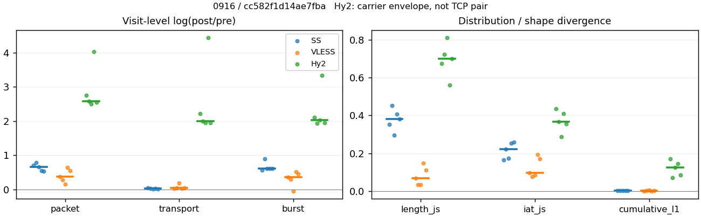
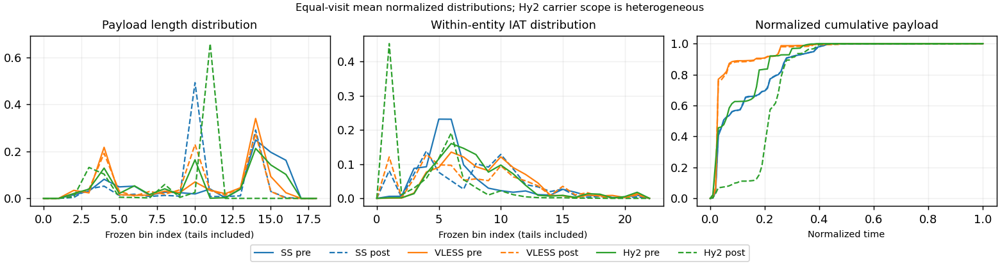

# 0916 · 条目 029 · youtube.com

目标：https://www.youtube.com/results?search_query=astronomy+documentary

活动标签：youtube.com::search_results_view。选定访问 15 次。

[返回总索引](../../README.md) · [统计口径](../../methods.md)

## 覆盖与资格（每次访问均保留）

| 部署 | 重复 | 主请求路由 | 活动状态 | 代理比较 | DIRECT pre | 请求 proxy/direct/unresolved | 错误 |
| --- | --- | --- | --- | --- | --- | --- | --- |
| Hy2 | 1 | proxy | passed | 1 | 1 | 190/1/0 | [] |
| Hy2 | 2 | proxy | passed | 1 | 1 | 198/1/0 | [] |
| Hy2 | 3 | proxy | passed | 1 | 1 | 191/1/0 | [] |
| Hy2 | 4 | proxy | passed | 1 | 1 | 190/1/0 | [] |
| Hy2 | 5 | proxy | passed | 1 | 1 | 198/1/0 | [] |
| SS | 1 | proxy | passed | 1 | 0 | 189/0/0 | [] |
| SS | 2 | proxy | passed | 1 | 0 | 195/0/0 | [] |
| SS | 3 | proxy | passed | 1 | 0 | 198/0/0 | [] |
| SS | 4 | proxy | passed | 1 | 0 | 190/0/0 | [] |
| SS | 5 | proxy | passed | 1 | 0 | 196/0/0 | [] |
| VLESS | 1 | proxy | passed | 1 | 0 | 190/0/0 | [] |
| VLESS | 2 | proxy | passed | 1 | 0 | 191/0/0 | [] |
| VLESS | 3 | proxy | passed | 1 | 0 | 190/0/0 | [] |
| VLESS | 4 | proxy | passed | 1 | 0 | 196/0/0 | [] |
| VLESS | 5 | proxy | passed | 1 | 0 | 196/0/0 | [] |

主请求非 proxy 的统计仅解释为已索引的辅助代理连接或 DIRECT 观测，不代表目标业务经代理传输。播放确认与配对资格是两道不同的门。

图中散点为单次访问，短线为重复中位数；Hy2 是共享载体包络，不能与 TCP 配对作等范围因果对比。

形态图先逐访问归一化，再对访问等权平均；实线 pre，虚线 post。分箱序号及边界见 methods，不将分箱索引误解为长度或时间。

## 每次访问的关键观测

### SS

范围：`exclusive_page`。每格 pre → post；空值为不可观测/不适用。

| 重复 | 包数 | 载荷字节 | burst | TCP FR | IAT中位µs | length JS | IAT JS |
| --- | --- | --- | --- | --- | --- | --- | --- |
| 1 | 4001 → 8037 | 8.6281e+06 → 8.9693e+06 | 2974 → 5208 | 140 → 164 | 18.526 → 14.767 | 0.35271 | 0.16409 |
| 2 | 3564 → 7848 | 7.723e+06 → 7.8965e+06 | 2600 → 6350 | 225 → 247 | 38.846 → 323.1 | 0.45157 | 0.22114 |
| 3 | 3162 → 6128 | 6.0238e+06 → 6.0491e+06 | 2074 → 3834 | 183 → 187 | 36.903 → 126.72 | 0.29709 | 0.17323 |
| 4 | 4294 → 7399 | 7.7389e+06 → 7.9461e+06 | 2787 → 5154 | 193 → 203 | 19.859 → 245.35 | 0.40626 | 0.25377 |
| 5 | 4431 → 7516 | 7.7806e+06 → 7.8745e+06 | 2907 → 5379 | 242 → 246 | 24.569 → 328.11 | 0.38252 | 0.26012 |

完整标量统计：中位数 [min,max]；Δ 为重复内逐访问变换的中位数，MAD 未缩放。n 为可用变换数；DIRECT-only 的 nΔ=0 不代表 pre 不可用。

| scope | 特征 | pre | post | Δ | IQRΔ | MADΔ | nΔ |
| --- | --- | --- | --- | --- | --- | --- | --- |
| exclusive_page | active_span_sum_s_1000ms | 29.097 [19.57, 47.503] | 35.634 [25.839, 57.63] | 0.19325 | 0.054891 | 0.045466 | 5 |
| exclusive_page | active_span_sum_s_100ms | 8.4886 [6.4994, 18.658] | 15.431 [11.81, 28.669] | 0.59722 | 0.0047358 | 0.0042963 | 5 |
| exclusive_page | active_span_sum_s_500ms | 22.458 [15.158, 37.656] | 28.553 [23.283, 51.307] | 0.2682 | 0.13034 | 0.089199 | 5 |
| exclusive_page | burst_bytes_iqr | 3720 [3104, 5418] | 2856 [2856, 2856] | -0.2643 | 0.26841 | 0.16823 | 5 |
| exclusive_page | burst_bytes_mad | 39 [31, 39] | 40 [34, 65] | 0.025318 | 0.067056 | 0 | 5 |
| exclusive_page | burst_bytes_max | 26480 [20480, 28202] | 27132 [18564, 31416] | 0.080559 | 0.063048 | 0.035683 | 5 |
| exclusive_page | burst_bytes_mean | 2901.2 [2676.5, 2970.4] | 1541.7 [1243.5, 1722.2] | -0.60339 | 0.021852 | 0.015008 | 5 |
| exclusive_page | burst_bytes_median | 39 [31, 39] | 40 [34, 65] | 0.025318 | 0.067056 | 0 | 5 |
| exclusive_page | burst_bytes_min | 0 [0, 0] | 0 [0, 0] | — | — | — | 0 |
| exclusive_page | burst_bytes_p95 | 16136 [12834, 17510] | 5712 [4284, 7140] | -0.91152 | 0.1414 | 0.12697 | 5 |
| exclusive_page | burst_bytes_q25 | 0 [0, 0] | 0 [0, 0] | — | — | — | 0 |
| exclusive_page | burst_bytes_q75 | 3720 [3104, 5418] | 2856 [2856, 2856] | -0.2643 | 0.26841 | 0.16823 | 5 |
| exclusive_page | burst_bytes_std | 4899.7 [4542.7, 5331.1] | 2192.4 [1744.7, 2716.5] | -0.82154 | 0.18389 | 0.14733 | 5 |
| exclusive_page | burst_count | 2787 [2074, 2974] | 5208 [3834, 6350] | 0.61481 | 0.00095133 | 0.0005735 | 5 |
| exclusive_page | burst_duration_ms_iqr | 0.019009 [0, 0.028077] | 0.002825 [0, 0.024024] | -1.3713 | 1.1211 | 0.63673 | 3 |
| exclusive_page | burst_duration_ms_mad | 0 [0, 0] | 0 [0, 0] | — | — | — | 0 |
| exclusive_page | burst_duration_ms_max | 15001 [15000, 15002] | 15361 [15360, 32071] | 0.023722 | 0.68893 | 0.00011987 | 5 |
| exclusive_page | burst_duration_ms_mean | 76.226 [15.869, 135.89] | 27.354 [9.4536, 34.554] | -1.3669 | 0.41115 | 0.16376 | 5 |
| exclusive_page | burst_duration_ms_median | 0 [0, 0] | 0 [0, 0] | — | — | — | 0 |
| exclusive_page | burst_duration_ms_min | 0 [0, 0] | 0 [0, 0] | — | — | — | 0 |
| exclusive_page | burst_duration_ms_p95 | 33.537 [0.48357, 72.579] | 0.96526 [0.61349, 1.0292] | -3.5472 | 2.1685 | 0.70867 | 5 |
| exclusive_page | burst_duration_ms_q25 | 0 [0, 0] | 0 [0, 0] | — | — | — | 0 |
| exclusive_page | burst_duration_ms_q75 | 0.019009 [0, 0.028077] | 0.002825 [0, 0.024024] | -1.3713 | 1.1211 | 0.63673 | 3 |
| exclusive_page | burst_duration_ms_std | 930.82 [312.27, 1283.1] | 635.66 [264.63, 728.76] | -0.5611 | 0.29212 | 0.1797 | 5 |
| exclusive_page | burst_packets_iqr | 1 [0, 1] | 1 [0, 1] | 0 | 0 | 0 | 3 |
| exclusive_page | burst_packets_mad | 0 [0, 0] | 0 [0, 0] | — | — | — | 0 |
| exclusive_page | burst_packets_max | 32 [16, 49] | 10 [8, 12] | -1.0678 | 0.50555 | 0.32063 | 5 |
| exclusive_page | burst_packets_mean | 1.5243 [1.3453, 1.5407] | 1.4356 [1.2359, 1.5983] | -0.070681 | 0.13421 | 0.032887 | 5 |
| exclusive_page | burst_packets_median | 1 [1, 1] | 1 [1, 1] | 0 | 0 | 0 | 5 |
| exclusive_page | burst_packets_min | 1 [1, 1] | 1 [1, 1] | 0 | 0 | 0 | 5 |
| exclusive_page | burst_packets_p95 | 3 [3, 4] | 3 [2, 4] | -0.28768 | 0.57536 | 0.11778 | 5 |
| exclusive_page | burst_packets_q25 | 1 [1, 1] | 1 [1, 1] | 0 | 0 | 0 | 5 |
| exclusive_page | burst_packets_q75 | 2 [1, 2] | 2 [1, 2] | 0 | 0 | 0 | 5 |
| exclusive_page | burst_packets_std | 1.2598 [1.1932, 1.4038] | 0.78982 [0.62502, 1.0147] | -0.43432 | 0.13606 | 0.1097 | 5 |
| exclusive_page | connection_span_concurrency_max | 11 [10, 16] | 11 [10, 13] | 0 | 0 | 0 | 5 |
| exclusive_page | cumulative_l1 | — | — | 0.0022305 | 0.0016426 | 0.00053292 | 5 |
| exclusive_page | cumulative_max | — | — | 0.049885 | 0.018033 | 0.016674 | 5 |
| exclusive_page | direction_entropy | 0.54833 [0.48819, 0.64613] | 0.35389 [0.27629, 0.38913] | -0.21191 | 0.047944 | 0.025862 | 5 |
| exclusive_page | down_burst_count | 1384 [1026, 1480] | 2597 [1907, 3167] | 0.61941 | 0.0017141 | 0.001263 | 5 |
| exclusive_page | down_ip_bytes | 7.7755e+06 [6.0385e+06, 8.681e+06] | 7.9703e+06 [6.1429e+06, 9.1111e+06] | 0.031254 | 0.013817 | 0.010304 | 5 |
| exclusive_page | down_packets | 2383 [1966, 2773] | 4443 [3808, 4513] | 0.6386 | 0.16101 | 0.053577 | 5 |
| exclusive_page | down_transport_bytes | 7.6341e+06 [5.9361e+06, 8.557e+06] | 7.7549e+06 [5.9444e+06, 8.8754e+06] | 0.017894 | 0.013567 | 0.0077423 | 5 |
| exclusive_page | duration_s | 67.613 [65.254, 81.345] | 67.874 [65.253, 81.344] | -7.6251e-06 | 1.5817e-05 | 1.5801e-05 | 5 |
| exclusive_page | entity_count | 22 [14, 24] | 22 [14, 24] | 0 | 0 | 0 | 5 |
| exclusive_page | fr_runs | 193 [140, 242] | 203 [164, 247] | 0.050516 | 0.071665 | 0.034122 | 5 |
| exclusive_page | fr_runs_per_packet | 0.089134 [0.058972, 0.11284] | 0.049185 [0.036171, 0.059105] | -0.034002 | 0.020553 | 0.011201 | 5 |
| exclusive_page | fr_switches | 174 [126, 218] | 184 [150, 224] | 0.05588 | 0.078837 | 0.037698 | 5 |
| exclusive_page | fr_switches_per_possible_transition | 0.081011 [0.05339, 0.10249] | 0.043651 [0.033186, 0.053898] | -0.030988 | 0.018047 | 0.010784 | 5 |
| exclusive_page | full_retransmission_fraction | 0.0019995 [0.00084175, 0.00253] | 0.012704 [0.0043906, 0.020654] | 0.010376 | 0.011196 | 0.0068678 | 5 |
| exclusive_page | full_retransmission_packets | 8 [3, 10] | 94 [33, 166] | 2.2407 | 1.5011 | 0.79184 | 5 |
| exclusive_page | iat_count | 3987 [3140, 4407] | 7492 [6106, 8023] | 0.66505 | 0.15328 | 0.11906 | 5 |
| exclusive_page | iat_js | — | — | 0.22114 | 0.08054 | 0.038978 | 5 |
| exclusive_page | iat_ks | — | — | 0.26861 | 0.16211 | 0.057445 | 5 |
| exclusive_page | iat_median_us | 24.569 [18.526, 38.846] | 245.35 [14.767, 328.11] | 2.1184 | 1.2803 | 0.4735 | 5 |
| exclusive_page | iat_us_iqr | 81.499 [39.621, 418.83] | 834.42 [184.96, 4173.2] | 2.299 | 0.58927 | 0.40983 | 5 |
| exclusive_page | iat_us_mad | 17.336 [13.697, 30.886] | 239.37 [14.705, 322.96] | 2.3472 | 1.3517 | 0.57171 | 5 |
| exclusive_page | iat_us_max | 1.5001e+07 [1.5001e+07, 1.5002e+07] | 1.5395e+07 [1.5361e+07, 1.5871e+07] | 0.025851 | 0.0051006 | 0.0021594 | 5 |
| exclusive_page | iat_us_mean | 1.3267e+05 [38144, 2.3906e+05] | 70338 [18986, 1.092e+05] | -0.69855 | 0.010594 | 0.0097069 | 5 |
| exclusive_page | iat_us_median | 24.569 [18.526, 38.846] | 245.35 [14.767, 328.11] | 2.1184 | 1.2803 | 0.4735 | 5 |
| exclusive_page | iat_us_min | 0.034 [0.001, 0.092] | 0.033 [0.031, 0.037] | -0.092373 | 2.5544 | 0.93291 | 5 |
| exclusive_page | iat_us_p95 | 41543 [11068, 96031] | 29456 [7400.8, 30124] | -0.86908 | 0.50711 | 0.3104 | 5 |
| exclusive_page | iat_us_q25 | 12.668 [8.3205, 15.976] | 8.851 [3.318, 13.81] | -0.57448 | 0.46082 | 0.34488 | 5 |
| exclusive_page | iat_us_q75 | 94.166 [47.941, 434.81] | 848.23 [188.28, 4182.1] | 2.26 | 0.56801 | 0.27572 | 5 |
| exclusive_page | iat_us_std | 1.2835e+06 [5.3138e+05, 1.7405e+06] | 8.9875e+05 [3.6526e+05, 1.1916e+06] | -0.36204 | 0.026366 | 0.013545 | 5 |
| exclusive_page | iat_wasserstein_log1p_us | — | — | 1.3221 | 0.34746 | 0.16158 | 5 |
| exclusive_page | idle_gap_count_1000ms | 54 [28, 73] | 55 [25, 59] | -0.036368 | 0.17844 | 0.054717 | 5 |
| exclusive_page | idle_gap_count_100ms | 126 [71, 167] | 127 [78, 158] | -0.055399 | 0.064258 | 0.063304 | 5 |
| exclusive_page | idle_gap_count_500ms | 65 [35, 87] | 62 [30, 69] | -0.15415 | 0.15635 | 0.09225 | 5 |
| exclusive_page | idle_gap_sum_s_1000ms | 547.64 [132.51, 799.01] | 492.77 [126.49, 631.11] | -0.055437 | 0.13973 | 0.046942 | 5 |
| exclusive_page | idle_gap_sum_s_100ms | 574.78 [145.58, 827.86] | 521.73 [140.52, 653.16] | -0.053583 | 0.14843 | 0.037439 | 5 |
| exclusive_page | idle_gap_sum_s_500ms | 555.11 [136.92, 808.86] | 499.09 [129.04, 638.19] | -0.059269 | 0.12698 | 0.046609 | 5 |
| exclusive_page | ip_bytes | 7.9625e+06 [6.1886e+06, 8.8364e+06] | 8.3661e+06 [6.4146e+06, 9.471e+06] | 0.052955 | 0.017072 | 0.013775 | 5 |
| exclusive_page | length_iqr | 3547.2 [3247, 7353.5] | 1428 [1428, 2015] | -0.9099 | 0.25092 | 0.20262 | 5 |
| exclusive_page | length_js | — | — | 0.38252 | 0.053547 | 0.02981 | 5 |
| exclusive_page | length_ks | — | — | 0.51455 | 0.025069 | 0.015727 | 5 |
| exclusive_page | length_mad | 1648 [1448, 2779] | 0 [0, 906] | -1.2504 | 0.74886 | 0.74886 | 2 |
| exclusive_page | length_max | 8920 [8920, 8920] | 14280 [8568, 18564] | 0.47056 | 0.42475 | 0.26236 | 5 |
| exclusive_page | length_mean | 3178.8 [2865.8, 3873.1] | 1764.8 [1591, 1978.2] | -0.60825 | 0.1992 | 0.10946 | 5 |
| exclusive_page | length_median | 2896 [2896, 2896] | 1428 [1428, 1428] | -0.70706 | 0 | 0 | 5 |
| exclusive_page | length_min | 31 [8, 31] | 6 [1, 16] | -1.6422 | 1.204 | 0.69315 | 5 |
| exclusive_page | length_p95 | 8192 [8192, 8192] | 2856 [2856, 4284] | -1.0537 | 0.02558 | 0 | 5 |
| exclusive_page | length_q25 | 838.5 [548.75, 1240] | 1428 [841, 1428] | 0.53242 | 0.54919 | 0.39125 | 5 |
| exclusive_page | length_q75 | 4096 [4096, 8192] | 2856 [2856, 2856] | -0.36059 | 0.30989 | 0 | 5 |
| exclusive_page | length_std | 2671.1 [2478, 3190.9] | 1122.1 [991.31, 1317.1] | -0.89509 | 0.057616 | 0.02933 | 5 |
| exclusive_page | length_wasserstein_bytes | — | — | 1607.7 | 419.3 | 191.35 | 5 |
| exclusive_page | nonempty_entity_count | 22 [14, 24] | 22 [14, 24] | 0 | 0 | 0 | 5 |
| exclusive_page | nonempty_packets | 2374 [1895, 2715] | 4462 [3802, 4534] | 0.64703 | 0.17698 | 0.092901 | 5 |
| exclusive_page | offload_suspect_fraction | 0.39121 [0.36139, 0.4089] | 0.19223 [0.18408, 0.23019] | -0.18756 | 0.020263 | 0.011412 | 5 |
| exclusive_page | packet_count | 4001 [3162, 4431] | 7516 [6128, 8037] | 0.66166 | 0.15339 | 0.11754 | 5 |
| exclusive_page | rtt_median_ms | 0.04237 [0.011752, 0.056447] | 32.544 [28.74, 37.134] | 6.7758 | 0.48467 | 0.4188 | 5 |
| exclusive_page | rtt_sample_count | 1539 [1149, 1610] | 636 [555, 1268] | -0.69191 | 0.27319 | 0.19178 | 5 |
| exclusive_page | tcp_ack_count | 3987 [3138, 4407] | 7487 [6100, 8019] | 0.6647 | 0.15249 | 0.11842 | 5 |
| exclusive_page | tcp_fin_count | 44 [28, 47] | 46 [30, 48] | 0.044452 | 0.043485 | 0.023398 | 5 |
| exclusive_page | tcp_packet_count | 4001 [3162, 4431] | 7516 [6128, 8037] | 0.66166 | 0.15339 | 0.11754 | 5 |
| exclusive_page | tcp_rst_count | 2 [0, 19] | 1 [0, 6] | -1.0986 | 0.22977 | 0.054067 | 3 |
| exclusive_page | tcp_syn_count | 44 [28, 48] | 50 [33, 55] | 0.12783 | 0.065212 | 0.03647 | 5 |
| exclusive_page | tcp_window_raw_median | 65535 [65535, 65535] | 153 [143, 168] | -6.0599 | 0.11333 | 0.067593 | 5 |
| exclusive_page | transition_entropy | 0.34174 [0.25511, 0.41887] | 0.20316 [0.1616, 0.24261] | -0.11804 | 0.057576 | 0.024535 | 5 |
| exclusive_page | transition_n_mm | 2057 [1532, 2286] | 4037 [3461, 4241] | 0.72355 | 0.21507 | 0.12364 | 5 |
| exclusive_page | transition_n_mp | 82 [61, 103] | 87 [73, 110] | 0.059189 | 0.079385 | 0.039958 | 5 |
| exclusive_page | transition_n_pm | 92 [65, 115] | 97 [77, 117] | 0.052922 | 0.078213 | 0.035681 | 5 |
| exclusive_page | transition_n_pp | 207 [177, 217] | 157 [129, 186] | -0.19251 | 0.14904 | 0.085539 | 5 |
| exclusive_page | transition_p_mm | 0.95634 [0.9404, 0.9712] | 0.97796 [0.97147, 0.98308] | 0.018312 | 0.011056 | 0.0064334 | 5 |
| exclusive_page | transition_p_mp | 0.043663 [0.028801, 0.059603] | 0.02204 [0.016922, 0.028527] | -0.018312 | 0.011056 | 0.0064334 | 5 |
| exclusive_page | transition_p_pm | 0.32075 [0.2686, 0.34639] | 0.38 [0.361, 0.39527] | 0.048885 | 0.032508 | 0.0086436 | 5 |
| exclusive_page | transition_p_pp | 0.67925 [0.65361, 0.7314] | 0.62 [0.60473, 0.639] | -0.048885 | 0.032508 | 0.0086436 | 5 |
| exclusive_page | transport_bytes | 7.7389e+06 [6.0238e+06, 8.6281e+06] | 7.8965e+06 [6.0491e+06, 8.9693e+06] | 0.022221 | 0.014435 | 0.010232 | 5 |
| exclusive_page | up_burst_count | 1403 [1048, 1494] | 2611 [1927, 3183] | 0.6114 | 0.0024187 | 0.0023157 | 5 |
| exclusive_page | up_byte_fraction | 0.013667 [0.0082425, 0.015558] | 0.017301 [0.01046, 0.017925] | 0.0026653 | 0.00053104 | 0.00044811 | 5 |
| exclusive_page | up_ip_bytes | 1.8344e+05 [1.501e+05, 2.0756e+05] | 3.5995e+05 [2.7176e+05, 3.958e+05] | 0.61224 | 0.17543 | 0.054733 | 5 |
| exclusive_page | up_packets | 1577 [1196, 1658] | 3073 [2320, 3720] | 0.66258 | 0.16136 | 0.046868 | 5 |
| exclusive_page | up_transport_bytes | 1.0476e+05 [71117, 1.2105e+05] | 1.2874e+05 [93816, 1.4155e+05] | 0.20616 | 0.099825 | 0.070853 | 5 |
| exclusive_page | zero_iat_count | 0 [0, 0] | 0 [0, 0] | — | — | — | 0 |
| exclusive_page | zero_iat_fraction | 0 [0, 0] | 0 [0, 0] | 0 | 0 | 0 | 5 |

### VLESS

范围：`exclusive_page`。每格 pre → post；空值为不可观测/不适用。

| 重复 | 包数 | 载荷字节 | burst | TCP FR | IAT中位µs | length JS | IAT JS |
| --- | --- | --- | --- | --- | --- | --- | --- |
| 1 | 3441 → 4985 | 5.2709e+06 → 5.3911e+06 | 2312 → 3288 | 136 → 168 | 114.25 → 41.149 | 0.067942 | 0.095779 |
| 2 | 2378 → 3152 | 3.076e+06 → 3.1835e+06 | 1636 → 2200 | 128 → 156 | 135.37 → 60.059 | 0.034303 | 0.076801 |
| 3 | 1113 → 1299 | 5.6579e+05 → 6.7762e+05 | 863 → 824 | 119 → 150 | 170.48 → 603.23 | 0.032678 | 0.083645 |
| 4 | 3527 → 6708 | 5.2096e+06 → 5.3167e+06 | 2498 → 4179 | 122 → 150 | 296.59 → 15.028 | 0.14684 | 0.19326 |
| 5 | 2611 → 4537 | 3.1634e+06 → 3.3206e+06 | 1768 → 2790 | 149 → 190 | 154.74 → 18.355 | 0.11073 | 0.17137 |

完整标量统计：中位数 [min,max]；Δ 为重复内逐访问变换的中位数，MAD 未缩放。n 为可用变换数；DIRECT-only 的 nΔ=0 不代表 pre 不可用。

| scope | 特征 | pre | post | Δ | IQRΔ | MADΔ | nΔ |
| --- | --- | --- | --- | --- | --- | --- | --- |
| exclusive_page | active_span_sum_s_1000ms | 22.419 [19.537, 27.571] | 25.898 [20.677, 28.25] | 0.07557 | 0.056519 | 0.051253 | 5 |
| exclusive_page | active_span_sum_s_100ms | 3.0523 [2.0285, 4.4231] | 9.9913 [7.9186, 10.883] | 1.1738 | 0.309 | 0.18807 | 5 |
| exclusive_page | active_span_sum_s_500ms | 11.065 [9.6932, 11.961] | 21.117 [20.4, 25.382] | 0.67749 | 0.099931 | 0.038143 | 5 |
| exclusive_page | burst_bytes_iqr | 2896 [1163, 2896] | 2824 [1484, 2892.2] | -0.025176 | 0.02388 | 0 | 5 |
| exclusive_page | burst_bytes_mad | 0 [0, 12] | 36 [24, 46] | 1.0986 | — | — | 1 |
| exclusive_page | burst_bytes_max | 20480 [5194, 20896] | 18860 [4860, 27440] | -0.066466 | 0.13953 | 0.12359 | 5 |
| exclusive_page | burst_bytes_mean | 1880.2 [655.61, 2279.8] | 1272.2 [822.35, 1639.6] | -0.32962 | 0.14584 | 0.07808 | 5 |
| exclusive_page | burst_bytes_median | 0 [0, 12] | 36 [24, 46] | 1.0986 | — | — | 1 |
| exclusive_page | burst_bytes_min | 0 [0, 0] | 0 [0, 0] | — | — | — | 0 |
| exclusive_page | burst_bytes_p95 | 8688 [2896, 11584] | 4344 [2896, 5792] | -0.69315 | 0.27076 | 0.26251 | 5 |
| exclusive_page | burst_bytes_q25 | 0 [0, 0] | 0 [0, 0] | — | — | — | 0 |
| exclusive_page | burst_bytes_q75 | 2896 [1163, 2896] | 2824 [1484, 2892.2] | -0.025176 | 0.02388 | 0 | 5 |
| exclusive_page | burst_bytes_std | 3096.8 [1052.7, 4022.5] | 1699.6 [1179.2, 2391.1] | -0.52012 | 0.2469 | 0.12975 | 5 |
| exclusive_page | burst_count | 1768 [863, 2498] | 2790 [824, 4179] | 0.35217 | 0.15999 | 0.10403 | 5 |
| exclusive_page | burst_duration_ms_iqr | 0.28133 [0.089894, 0.64101] | 0.000322 [0.00013525, 0.47264] | -6.638 | 2.148 | 1.0021 | 5 |
| exclusive_page | burst_duration_ms_mad | 0 [0, 0] | 0 [0, 0] | — | — | — | 0 |
| exclusive_page | burst_duration_ms_max | 15001 [15001, 15001] | 15006 [14969, 15061] | 0.00030348 | 0.0031166 | 0.0024369 | 5 |
| exclusive_page | burst_duration_ms_mean | 99.111 [58.998, 214.07] | 32.19 [24.928, 70.631] | -1.1088 | 0.19813 | 0.15164 | 5 |
| exclusive_page | burst_duration_ms_median | 0 [0, 0] | 0 [0, 0] | — | — | — | 0 |
| exclusive_page | burst_duration_ms_min | 0 [0, 0] | 0 [0, 0] | — | — | — | 0 |
| exclusive_page | burst_duration_ms_p95 | 9.7619 [4.3628, 200.4] | 8.6014 [1.504, 156.39] | -0.18914 | 0.11832 | 0.059489 | 5 |
| exclusive_page | burst_duration_ms_q25 | 0 [0, 0] | 0 [0, 0] | — | — | — | 0 |
| exclusive_page | burst_duration_ms_q75 | 0.28133 [0.089894, 0.64101] | 0.000322 [0.00013525, 0.47264] | -6.638 | 2.148 | 1.0021 | 5 |
| exclusive_page | burst_duration_ms_std | 1107.4 [829.93, 1596.7] | 614.38 [551.59, 869.89] | -0.60732 | 0.1724 | 0.084323 | 5 |
| exclusive_page | burst_packets_iqr | 1 [1, 1] | 1 [1, 1] | 0 | 0 | 0 | 5 |
| exclusive_page | burst_packets_mad | 0 [0, 0] | 0 [0, 0] | — | — | — | 0 |
| exclusive_page | burst_packets_max | 5 [3, 12] | 8 [7, 11] | 0.60614 | 0.45199 | 0.24116 | 5 |
| exclusive_page | burst_packets_mean | 1.4535 [1.2897, 1.4883] | 1.5765 [1.4327, 1.6262] | 0.09634 | 0.10977 | 0.077835 | 5 |
| exclusive_page | burst_packets_median | 1 [1, 1] | 1 [1, 1] | 0 | 0 | 0 | 5 |
| exclusive_page | burst_packets_min | 1 [1, 1] | 1 [1, 1] | 0 | 0 | 0 | 5 |
| exclusive_page | burst_packets_p95 | 2 [2, 3] | 3 [3, 4] | 0.40547 | 0 | 0 | 5 |
| exclusive_page | burst_packets_q25 | 1 [1, 1] | 1 [1, 1] | 0 | 0 | 0 | 5 |
| exclusive_page | burst_packets_q75 | 2 [2, 2] | 2 [2, 2] | 0 | 0 | 0 | 5 |
| exclusive_page | burst_packets_std | 0.62128 [0.50899, 0.70025] | 0.92962 [0.88473, 1.0446] | 0.36553 | 0.08704 | 0.029868 | 5 |
| exclusive_page | connection_span_concurrency_max | 9 [8, 9] | 8 [8, 9] | 0 | 0 | 0 | 5 |
| exclusive_page | cumulative_l1 | — | — | 0.0032567 | 0.0026562 | 0.002345 | 5 |
| exclusive_page | cumulative_max | — | — | 0.02468 | 0.010705 | 0.005552 | 5 |
| exclusive_page | direction_entropy | 0.42372 [0.3267, 0.7138] | 0.37757 [0.23749, 0.7262] | -0.042488 | 0.064108 | 0.046723 | 5 |
| exclusive_page | down_burst_count | 874 [424, 1242] | 1388 [405, 2083] | 0.35423 | 0.16413 | 0.10831 | 5 |
| exclusive_page | down_ip_bytes | 3.1801e+06 [5.5086e+05, 5.3204e+06] | 3.3448e+06 [6.3944e+05, 5.453e+06] | 0.030749 | 0.020841 | 0.0061419 | 5 |
| exclusive_page | down_packets | 1641 [614, 2201] | 2525 [723, 3718] | 0.31782 | 0.23137 | 0.11826 | 5 |
| exclusive_page | down_transport_bytes | 3.0946e+06 [5.1881e+05, 5.2077e+06] | 3.2134e+06 [6.0173e+05, 5.2981e+06] | 0.026052 | 0.020439 | 0.010681 | 5 |
| exclusive_page | duration_s | 68.637 [64.947, 73.039] | 68.62 [64.905, 73.021] | -0.00065013 | 0.00043429 | 5.7987e-05 | 5 |
| exclusive_page | entity_count | 15 [14, 20] | 15 [14, 20] | 0 | 0 | 0 | 5 |
| exclusive_page | fr_runs | 128 [119, 149] | 156 [150, 190] | 0.21131 | 0.024898 | 0.013483 | 5 |
| exclusive_page | fr_runs_per_packet | 0.090459 [0.057009, 0.21795] | 0.077646 [0.041152, 0.22971] | -0.0060396 | 0.014694 | 0.0098175 | 5 |
| exclusive_page | fr_switches | 114 [104, 129] | 142 [135, 170] | 0.23639 | 0.03036 | 0.01676 | 5 |
| exclusive_page | fr_switches_per_possible_transition | 0.08137 [0.0508, 0.19586] | 0.070045 [0.037455, 0.2116] | -0.0041647 | 0.013913 | 0.0091797 | 5 |
| exclusive_page | full_retransmission_fraction | 0.00058123 [0, 0.0017969] | 0 [0, 0] | -0.00058123 | 0.00027399 | 0.00025982 | 5 |
| exclusive_page | full_retransmission_packets | 2 [0, 2] | 0 [0, 0] | — | — | — | 0 |
| exclusive_page | iat_count | 2591 [1098, 3513] | 4517 [1284, 6694] | 0.37212 | 0.27257 | 0.18369 | 5 |
| exclusive_page | iat_js | — | — | 0.095779 | 0.08773 | 0.018978 | 5 |
| exclusive_page | iat_ks | — | — | 0.22292 | 0.17012 | 0.10461 | 5 |
| exclusive_page | iat_median_us | 154.74 [114.25, 296.59] | 41.149 [15.028, 603.23] | -1.0212 | 1.3192 | 1.1106 | 5 |
| exclusive_page | iat_us_iqr | 967.56 [876.09, 2609.4] | 688.12 [534.85, 6643.7] | -0.29433 | 0.29352 | 0.27372 | 5 |
| exclusive_page | iat_us_mad | 146.81 [102.86, 280.78] | 41.032 [14.978, 595.81] | -0.91901 | 1.3457 | 1.1626 | 5 |
| exclusive_page | iat_us_max | 1.5001e+07 [1.5001e+07, 1.5001e+07] | 1.5447e+07 [1.5323e+07, 1.5499e+07] | 0.029274 | 0.0017835 | 0.0014757 | 5 |
| exclusive_page | iat_us_mean | 1.8008e+05 [1.1674e+05, 4.244e+05] | 1.0329e+05 [61673, 3.6257e+05] | -0.3734 | 0.27156 | 0.18245 | 5 |
| exclusive_page | iat_us_median | 154.74 [114.25, 296.59] | 41.149 [15.028, 603.23] | -1.0212 | 1.3192 | 1.1106 | 5 |
| exclusive_page | iat_us_min | 0.484 [0.137, 1.318] | 0.031 [0.029, 0.035] | -2.6267 | 1.823 | 1.1071 | 5 |
| exclusive_page | iat_us_p95 | 9996.1 [8943.8, 3.453e+05] | 40216 [8082, 1.5566e+05] | 0.91563 | 1.4391 | 0.54041 | 5 |
| exclusive_page | iat_us_q25 | 31.77 [22.602, 38.189] | 8.684 [4.1547, 22.652] | -1.2335 | 0.82907 | 0.64287 | 5 |
| exclusive_page | iat_us_q75 | 999.33 [907.93, 2632] | 696.8 [539, 6666.3] | -0.31356 | 0.30102 | 0.27233 | 5 |
| exclusive_page | iat_us_std | 1.5358e+06 [1.2456e+06, 2.3476e+06] | 1.1747e+06 [9.0269e+05, 2.1853e+06] | -0.18696 | 0.12967 | 0.0811 | 5 |
| exclusive_page | iat_wasserstein_log1p_us | — | — | 1.0391 | 0.72695 | 0.3103 | 5 |
| exclusive_page | idle_gap_count_1000ms | 36 [31, 37] | 36 [32, 36] | -0.027399 | 0.05557 | 0.05557 | 5 |
| exclusive_page | idle_gap_count_100ms | 90 [87, 98] | 102 [99, 120] | 0.12921 | 0.026095 | 0.0040486 | 5 |
| exclusive_page | idle_gap_count_500ms | 54 [51, 59] | 38 [36, 40] | -0.3514 | 0.06775 | 0.03726 | 5 |
| exclusive_page | idle_gap_sum_s_1000ms | 440.89 [372.27, 470.36] | 438.7 [371.08, 468.31] | -0.0043734 | 0.0017624 | 0.0011673 | 5 |
| exclusive_page | idle_gap_sum_s_100ms | 463.53 [395.42, 487.27] | 456.33 [388.44, 480.89] | -0.015576 | 0.0018764 | 0.0017992 | 5 |
| exclusive_page | idle_gap_sum_s_500ms | 455.52 [387.88, 479.33] | 441.18 [375.77, 468.98] | -0.02658 | 0.0063041 | 0.0047501 | 5 |
| exclusive_page | ip_bytes | 3.2991e+06 [6.2362e+05, 5.4498e+06] | 3.5657e+06 [7.4591e+05, 5.6787e+06] | 0.051626 | 0.032152 | 0.015066 | 5 |
| exclusive_page | length_iqr | 2688.2 [1643, 2753.5] | 1377 [1340, 2595.5] | -0.22995 | 0.068511 | 0.042418 | 5 |
| exclusive_page | length_js | — | — | 0.067942 | 0.07643 | 0.035265 | 5 |
| exclusive_page | length_ks | — | — | 0.13705 | 0.17753 | 0.057301 | 5 |
| exclusive_page | length_mad | 1376 [713.5, 1412] | 916 [895, 1304] | -0.079571 | 0.34986 | 0.30844 | 5 |
| exclusive_page | length_max | 8920 [4096, 8920] | 8688 [2824, 11584] | -0.026353 | 0.32658 | 0.17243 | 5 |
| exclusive_page | length_mean | 2173.9 [1036.2, 2486.3] | 1458.6 [1037.7, 1864.8] | -0.28764 | 0.22397 | 0.11276 | 5 |
| exclusive_page | length_median | 2824 [785.5, 2824] | 1412 [969, 1520] | -0.61944 | 0.56971 | 0.073703 | 5 |
| exclusive_page | length_min | 24 [2, 24] | 24 [2, 24] | 0 | 0 | 0 | 5 |
| exclusive_page | length_p95 | 5864 [2824, 7279.2] | 2896 [2824, 4344] | -0.5414 | 0.41829 | 0.24137 | 5 |
| exclusive_page | length_q25 | 135.75 [72, 1163] | 228.5 [72, 727] | 0.27657 | 0.7494 | 0.47283 | 5 |
| exclusive_page | length_q75 | 2824 [1715, 2896] | 1629 [1412, 2824] | -0.19441 | 0.55019 | 0.19441 | 5 |
| exclusive_page | length_std | 1957.3 [1068.4, 2277.2] | 1085.5 [990.53, 1460.6] | -0.49614 | 0.27758 | 0.13328 | 5 |
| exclusive_page | length_wasserstein_bytes | — | — | 674.29 | 319.81 | 289.63 | 5 |
| exclusive_page | nonempty_entity_count | 15 [14, 20] | 15 [14, 20] | 0 | 0 | 0 | 5 |
| exclusive_page | nonempty_packets | 1562 [546, 2140] | 2447 [653, 3645] | 0.31019 | 0.23813 | 0.13123 | 5 |
| exclusive_page | offload_suspect_fraction | 0.35366 [0.13297, 0.37954] | 0.17099 [0.10778, 0.29789] | -0.081647 | 0.093968 | 0.056448 | 5 |
| exclusive_page | packet_count | 2611 [1113, 3527] | 4537 [1299, 6708] | 0.37067 | 0.27076 | 0.18186 | 5 |
| exclusive_page | rtt_median_ms | 0.20298 [0.077796, 0.29477] | 0.043946 [0.036411, 0.91178] | -1.438 | 0.68516 | 0.59297 | 5 |
| exclusive_page | rtt_sample_count | 920 [457, 1284] | 1625 [547, 2429] | 0.48076 | 0.14944 | 0.088129 | 5 |
| exclusive_page | tcp_ack_count | 2556 [1072, 3486] | 4517 [1284, 6693] | 0.3815 | 0.27469 | 0.1879 | 5 |
| exclusive_page | tcp_fin_count | 28 [27, 37] | 30 [28, 40] | 0.036368 | 0.032625 | 0.032625 | 5 |
| exclusive_page | tcp_packet_count | 2611 [1113, 3527] | 4537 [1299, 6708] | 0.37067 | 0.27076 | 0.18186 | 5 |
| exclusive_page | tcp_rst_count | 27 [26, 35] | 0 [0, 1] | -3.2958 | — | — | 1 |
| exclusive_page | tcp_syn_count | 30 [28, 40] | 30 [28, 40] | 0 | 0 | 0 | 5 |
| exclusive_page | tcp_window_raw_median | 65535 [65504, 65535] | 166 [141, 196] | -5.9784 | 0.1109 | 0.086509 | 5 |
| exclusive_page | transition_entropy | 0.30207 [0.21122, 0.58785] | 0.26898 [0.16112, 0.6207] | -0.033087 | 0.040313 | 0.017018 | 5 |
| exclusive_page | transition_n_mm | 1355 [380, 1951] | 2173 [446, 3428] | 0.37004 | 0.25259 | 0.15031 | 5 |
| exclusive_page | transition_n_mp | 50 [45, 55] | 64 [60, 75] | 0.26826 | 0.026956 | 0.019418 | 5 |
| exclusive_page | transition_n_pm | 64 [59, 74] | 78 [75, 95] | 0.21131 | 0.033336 | 0.013483 | 5 |
| exclusive_page | transition_n_pp | 58 [47, 155] | 67 [57, 84] | 0.033902 | 0.1929 | 0.159 | 5 |
| exclusive_page | transition_p_mm | 0.96099 [0.89412, 0.97648] | 0.96664 [0.88142, 0.98252] | 0.0026081 | 0.0066765 | 0.003432 | 5 |
| exclusive_page | transition_p_mp | 0.039007 [0.023524, 0.10588] | 0.033363 [0.017484, 0.11858] | -0.0026081 | 0.0066765 | 0.003432 | 5 |
| exclusive_page | transition_p_pm | 0.52459 [0.30493, 0.56061] | 0.53073 [0.52817, 0.56818] | 0.040627 | 0.040028 | 0.029049 | 5 |
| exclusive_page | transition_p_pp | 0.47541 [0.43939, 0.69507] | 0.46927 [0.43182, 0.47183] | -0.040627 | 0.040028 | 0.029049 | 5 |
| exclusive_page | transport_bytes | 3.1634e+06 [5.6579e+05, 5.2709e+06] | 3.3206e+06 [6.7762e+05, 5.3911e+06] | 0.034339 | 0.025946 | 0.014001 | 5 |
| exclusive_page | up_burst_count | 894 [439, 1256] | 1402 [419, 2096] | 0.35012 | 0.15592 | 0.099825 | 5 |
| exclusive_page | up_byte_fraction | 0.015216 [0.0092279, 0.083041] | 0.023344 [0.014138, 0.112] | 0.0081281 | 0.0052923 | 0.0028764 | 5 |
| exclusive_page | up_ip_bytes | 1.1684e+05 [72764, 1.2934e+05] | 1.9972e+05 [1.0647e+05, 2.4375e+05] | 0.44475 | 0.18404 | 0.064142 | 5 |
| exclusive_page | up_packets | 970 [499, 1326] | 2010 [576, 2990] | 0.4544 | 0.3245 | 0.27518 | 5 |
| exclusive_page | up_transport_bytes | 48074 [46806, 68802] | 75890 [74317, 1.0723e+05] | 0.44696 | 0.018557 | 0.015371 | 5 |
| exclusive_page | zero_iat_count | 0 [0, 0] | 0 [0, 0] | — | — | — | 0 |
| exclusive_page | zero_iat_fraction | 0 [0, 0] | 0 [0, 0] | 0 | 0 | 0 | 5 |

### Hy2

范围：`carrier_context_envelope`。每格 pre → post；空值为不可观测/不适用。

| 重复 | 包数 | 载荷字节 | burst | TCP FR | IAT中位µs | length JS | IAT JS |
| --- | --- | --- | --- | --- | --- | --- | --- |
| 1 | 3245 → 51113 | 5.9185e+06 → 5.4288e+07 | 2166 → 17891 | — | 123.59 → 3.681 | 0.67618 | 0.43546 |
| 2 | 4051 → 53690 | 7.7187e+06 → 5.7194e+07 | 2740 → 18996 | — | 72.113 → 4.764 | 0.72255 | 0.3676 |
| 3 | 4202 → 50965 | 7.6232e+06 → 5.3426e+07 | 2698 → 20581 | — | 101.38 → 12.744 | 0.81103 | 0.28713 |
| 4 | 913 → 51528 | 6.4622e+05 → 5.4515e+07 | 653 → 18235 | — | 105.34 → 4.87 | 0.5621 | 0.40856 |
| 5 | 3960 → 50813 | 7.6939e+06 → 5.3896e+07 | 2490 → 17579 | — | 79.131 → 5.2635 | 0.70107 | 0.35516 |

范围：`direct_pre_only`。每格 pre → post；空值为不可观测/不适用。

| 重复 | 包数 | 载荷字节 | burst | TCP FR | IAT中位µs | length JS | IAT JS |
| --- | --- | --- | --- | --- | --- | --- | --- |
| 1 | 34 → — | 8668 → — | 23 → — | 7 → — | 203.48 → — | — | — |
| 2 | 27 → — | 8734 → — | 19 → — | 7 → — | 142.03 → — | — | — |
| 3 | 29 → — | 8637 → — | 21 → — | 7 → — | 117.32 → — | — | — |
| 4 | 31 → — | 8701 → — | 23 → — | 7 → — | 170.68 → — | — | — |
| 5 | 31 → — | 8703 → — | 23 → — | 7 → — | 99.986 → — | — | — |

完整标量统计：中位数 [min,max]；Δ 为重复内逐访问变换的中位数，MAD 未缩放。n 为可用变换数；DIRECT-only 的 nΔ=0 不代表 pre 不可用。

| scope | 特征 | pre | post | Δ | IQRΔ | MADΔ | nΔ |
| --- | --- | --- | --- | --- | --- | --- | --- |
| carrier_context_envelope | active_span_sum_s_1000ms | 20.215 [11.98, 26.229] | 24.927 [22.961, 29.428] | 0.15784 | 0.030566 | 0.030439 | 5 |
| carrier_context_envelope | active_span_sum_s_100ms | 3.0823 [1.4346, 3.8017] | 10.192 [9.9616, 11.83] | 1.2112 | 0.034521 | 0.018103 | 5 |
| carrier_context_envelope | active_span_sum_s_500ms | 18.369 [11.98, 20.442] | 23.536 [19.787, 26.818] | 0.14094 | 0.19358 | 0.043158 | 5 |
| carrier_context_envelope | burst_bytes_iqr | 2830 [333, 4245] | 4227 [3689, 5111] | 0.39242 | 0.20776 | 0.19897 | 5 |
| carrier_context_envelope | burst_bytes_mad | 39 [0, 39] | 265 [199, 401] | 1.9124 | 0.35033 | 0.28264 | 3 |
| carrier_context_envelope | burst_bytes_max | 20480 [20480, 28428] | 2.4948e+05 [2.0613e+05, 2.7786e+05] | 2.4999 | 0.35597 | 0.10777 | 5 |
| carrier_context_envelope | burst_bytes_mean | 2817 [989.62, 3089.9] | 3010.8 [2595.9, 3065.9] | 0.066534 | 0.1126 | 0.074334 | 5 |
| carrier_context_envelope | burst_bytes_median | 39 [0, 39] | 298 [232, 434] | 2.0302 | 0.31315 | 0.24699 | 3 |
| carrier_context_envelope | burst_bytes_min | 0 [0, 0] | 22 [22, 22] | — | — | — | 0 |
| carrier_context_envelope | burst_bytes_p95 | 13569 [5071, 17840] | 10932 [9491, 10932] | -0.33218 | 0.14024 | 0.11609 | 5 |
| carrier_context_envelope | burst_bytes_q25 | 0 [0, 0] | 96 [38, 100] | — | — | — | 0 |
| carrier_context_envelope | burst_bytes_q75 | 2830 [333, 4245] | 4323 [3727, 5168] | 0.41601 | 0.21912 | 0.21146 | 5 |
| carrier_context_envelope | burst_bytes_std | 4791.7 [2975.5, 5323.4] | 5954.8 [3977.7, 6419.9] | 0.17542 | 0.16319 | 0.1171 | 5 |
| carrier_context_envelope | burst_count | 2490 [653, 2740] | 18235 [17579, 20581] | 2.0319 | 0.15699 | 0.079558 | 5 |
| carrier_context_envelope | burst_duration_ms_iqr | 0.093658 [0.034061, 0.15856] | 0.024168 [0.023714, 0.024758] | -1.3711 | 0.46263 | 0.29731 | 5 |
| carrier_context_envelope | burst_duration_ms_mad | 0 [0, 0] | 4.4e-05 [4.2e-05, 4.8e-05] | — | — | — | 0 |
| carrier_context_envelope | burst_duration_ms_max | 15001 [15001, 15001] | 10243 [902.91, 10373] | -0.38155 | 0.069392 | 0.012604 | 5 |
| carrier_context_envelope | burst_duration_ms_mean | 109.35 [93.424, 273.68] | 1.0966 [0.452, 1.7883] | -4.6476 | 0.63436 | 0.58906 | 5 |
| carrier_context_envelope | burst_duration_ms_median | 0 [0, 0] | 4.4e-05 [4.2e-05, 4.8e-05] | — | — | — | 0 |
| carrier_context_envelope | burst_duration_ms_min | 0 [0, 0] | 0 [0, 0] | — | — | — | 0 |
| carrier_context_envelope | burst_duration_ms_p95 | 8.5492 [3.3406, 203.98] | 0.11437 [0.088164, 0.6571] | -4.2375 | 0.61788 | 0.56084 | 5 |
| carrier_context_envelope | burst_duration_ms_q25 | 0 [0, 0] | 0 [0, 0] | — | — | — | 0 |
| carrier_context_envelope | burst_duration_ms_q75 | 0.093658 [0.034061, 0.15856] | 0.024168 [0.023714, 0.024758] | -1.3711 | 0.46263 | 0.29731 | 5 |
| carrier_context_envelope | burst_duration_ms_std | 1133 [1041.2, 1857.1] | 76.557 [11.102, 110.85] | -2.8176 | 0.34645 | 0.22345 | 5 |
| carrier_context_envelope | burst_packets_iqr | 1 [1, 1] | 3 [2, 3] | 1.0986 | 0 | 0 | 5 |
| carrier_context_envelope | burst_packets_mad | 0 [0, 0] | 1 [1, 1] | — | — | — | 0 |
| carrier_context_envelope | burst_packets_max | 9 [6, 18] | 183 [152, 202] | 2.9444 | 0.54609 | 0.37949 | 5 |
| carrier_context_envelope | burst_packets_mean | 1.4982 [1.3982, 1.5904] | 2.8264 [2.4763, 2.8906] | 0.64551 | 0.050507 | 0.048022 | 5 |
| carrier_context_envelope | burst_packets_median | 1 [1, 1] | 2 [2, 2] | 0.69315 | 0 | 0 | 5 |
| carrier_context_envelope | burst_packets_min | 1 [1, 1] | 1 [1, 1] | 0 | 0 | 0 | 5 |
| carrier_context_envelope | burst_packets_p95 | 3 [3, 3] | 8 [7, 8] | 0.98083 | 0 | 0 | 5 |
| carrier_context_envelope | burst_packets_q25 | 1 [1, 1] | 1 [1, 1] | 0 | 0 | 0 | 5 |
| carrier_context_envelope | burst_packets_q75 | 2 [2, 2] | 4 [3, 4] | 0.69315 | 0 | 0 | 5 |
| carrier_context_envelope | burst_packets_std | 0.89177 [0.66925, 0.96128] | 4.1149 [2.6078, 4.4825] | 1.5397 | 0.012335 | 0.010495 | 5 |
| carrier_context_envelope | connection_span_concurrency_max | 12 [9, 13] | 1 [1, 1] | -2.4849 | 0.087011 | 0.080043 | 5 |
| carrier_context_envelope | cumulative_l1 | — | — | 0.1259 | 0.062653 | 0.042348 | 5 |
| carrier_context_envelope | cumulative_max | — | — | 0.71844 | 0.17726 | 0.1771 | 5 |
| carrier_context_envelope | direction_entropy | 0.56368 [0.52793, 0.99676] | 0.78537 [0.78088, 0.80088] | 0.2172 | 0.034383 | 0.019444 | 5 |
| carrier_context_envelope | direction_run_analog_runs | 205 [116, 234] | 18235 [17579, 20581] | 4.6091 | 0.36495 | 0.21245 | 5 |
| carrier_context_envelope | direction_run_analog_runs_per_packet | 0.093687 [0.077039, 0.27751] | 0.35381 [0.34595, 0.40383] | 0.25818 | 0.019819 | 0.013905 | 5 |
| carrier_context_envelope | direction_run_analog_switches | 189 [99, 212] | 18234 [17578, 20580] | 4.6903 | 0.37667 | 0.19498 | 5 |
| carrier_context_envelope | direction_run_analog_switches_per_possible_transition | 0.085598 [0.070365, 0.24688] | 0.3538 [0.34594, 0.40381] | 0.26637 | 0.019307 | 0.013277 | 5 |
| carrier_context_envelope | down_burst_count | 1234 [318, 1359] | 9117 [8789, 10290] | 2.0378 | 0.15553 | 0.081017 | 5 |
| carrier_context_envelope | down_ip_bytes | 7.6736e+06 [6.1312e+05, 7.7329e+06] | 5.4281e+07 [5.3852e+07, 5.7278e+07] | 2.0024 | 0.26041 | 0.053984 | 5 |
| carrier_context_envelope | down_packets | 2491 [485, 2691] | 39139 [38553, 41130] | 2.8041 | 0.24361 | 0.14193 | 5 |
| carrier_context_envelope | down_transport_bytes | 7.5336e+06 [5.8776e+05, 7.6032e+06] | 5.3185e+07 [5.2773e+07, 5.6127e+07] | 1.999 | 0.2602 | 0.052922 | 5 |
| carrier_context_envelope | duration_s | 64.041 [62.432, 66.623] | 64.039 [62.432, 66.606] | -1.5896e-05 | 1.1246e-05 | 6.2613e-06 | 5 |
| carrier_context_envelope | entity_count | 17 [16, 22] | 1 [1, 1] | -2.8332 | 0.31845 | 0.060625 | 5 |
| carrier_context_envelope | full_retransmission_fraction | 0.0027735 [0.00071395, 0.0043812] | — | — | — | — | 0 |
| carrier_context_envelope | full_retransmission_packets | 9 [3, 16] | — | — | — | — | 0 |
| carrier_context_envelope | iat_count | 3938 [896, 4186] | 51112 [50812, 53689] | 2.5897 | 0.20439 | 0.090316 | 5 |
| carrier_context_envelope | iat_js | — | — | 0.3676 | 0.053407 | 0.04096 | 5 |
| carrier_context_envelope | iat_ks | — | — | 0.53977 | 0.06448 | 0.034499 | 5 |
| carrier_context_envelope | iat_median_us | 101.38 [72.113, 123.59] | 4.87 [3.681, 12.744] | -2.7171 | 0.36381 | 0.35697 | 5 |
| carrier_context_envelope | iat_us_iqr | 629.3 [429.62, 1147.9] | 24.356 [22.691, 58.579] | -2.9393 | 0.77978 | 0.56506 | 5 |
| carrier_context_envelope | iat_us_mad | 87.576 [61.642, 111.57] | 4.834 [3.645, 12.706] | -2.5678 | 0.39222 | 0.38505 | 5 |
| carrier_context_envelope | iat_us_max | 1.5001e+07 [1.5001e+07, 1.5001e+07] | 1.0001e+07 [1e+07, 1.0001e+07] | -0.40549 | 3.778e-05 | 2.7106e-05 | 5 |
| carrier_context_envelope | iat_us_mean | 1.8565e+05 [1.6092e+05, 6.3635e+05] | 1244.4 [1192.8, 1292.7] | -5.0476 | 0.18326 | 0.10762 | 5 |
| carrier_context_envelope | iat_us_median | 101.38 [72.113, 123.59] | 4.87 [3.681, 12.744] | -2.7171 | 0.36381 | 0.35697 | 5 |
| carrier_context_envelope | iat_us_min | 0.091 [0.022, 2.422] | 0 [0, 0.002] | -2.3979 | — | — | 1 |
| carrier_context_envelope | iat_us_p95 | 13547 [4793.1, 1.2197e+06] | 167.24 [129.06, 825.57] | -4.6537 | 1.0595 | 1.0311 | 5 |
| carrier_context_envelope | iat_us_q25 | 28.155 [22.545, 34.727] | 0.044 [0.042, 0.05] | -6.3335 | 0.15889 | 0.094407 | 5 |
| carrier_context_envelope | iat_us_q75 | 657.45 [452.16, 1176.6] | 24.401 [22.733, 58.629] | -2.9875 | 0.76805 | 0.57032 | 5 |
| carrier_context_envelope | iat_us_std | 1.5385e+06 [1.4398e+06, 2.9231e+06] | 75522 [74564, 81637] | -3.0269 | 0.076905 | 0.046275 | 5 |
| carrier_context_envelope | iat_wasserstein_log1p_us | — | — | 3.0394 | 0.57888 | 0.40973 | 5 |
| carrier_context_envelope | idle_gap_count_1000ms | 59 [47, 70] | 7 [5, 10] | -1.9981 | 0.35667 | 0.30449 | 5 |
| carrier_context_envelope | idle_gap_count_100ms | 134 [94, 158] | 78 [67, 80] | -0.56599 | 0.19007 | 0.13989 | 5 |
| carrier_context_envelope | idle_gap_count_500ms | 62 [47, 79] | 11 [9, 12] | -1.6422 | 0.46893 | 0.18998 | 5 |
| carrier_context_envelope | idle_gap_sum_s_1000ms | 656.04 [558.19, 721.75] | 39.471 [33.991, 41.632] | -2.8107 | 0.14144 | 0.10458 | 5 |
| carrier_context_envelope | idle_gap_sum_s_100ms | 673.34 [568.74, 744.89] | 53.859 [51.589, 55.739] | -2.552 | 0.037038 | 0.02491 | 5 |
| carrier_context_envelope | idle_gap_sum_s_500ms | 657.88 [558.19, 727.53] | 42.176 [36.601, 44.959] | -2.7472 | 0.18288 | 0.13594 | 5 |
| carrier_context_envelope | ip_bytes | 7.842e+06 [6.9402e+05, 7.9298e+06] | 5.5719e+07 [5.4853e+07, 5.8697e+07] | 2.0018 | 0.26786 | 0.056606 | 5 |
| carrier_context_envelope | length_iqr | 3277 [1658, 4079] | 1012 [618, 1247] | -1.175 | 1.2733 | 0.67236 | 5 |
| carrier_context_envelope | length_js | — | — | 0.70107 | 0.046379 | 0.024894 | 5 |
| carrier_context_envelope | length_ks | — | — | 0.52432 | 0.07921 | 0.063809 | 5 |
| carrier_context_envelope | length_mad | 1248 [338, 1834] | 0 [0, 0] | — | — | — | 0 |
| carrier_context_envelope | length_max | 8920 [8920, 8920] | 1441 [1441, 1441] | -1.823 | 0 | 0 | 5 |
| carrier_context_envelope | length_mean | 3015 [1546, 3154.3] | 1060.7 [1048.3, 1065.3] | -1.0434 | 0.065114 | 0.038014 | 5 |
| carrier_context_envelope | length_median | 1804 [369, 2800] | 1441 [1441, 1441] | -0.22467 | 0.37444 | 0.32268 | 5 |
| carrier_context_envelope | length_min | 31 [4, 31] | 22 [22, 22] | -0.34294 | 0 | 0 | 5 |
| carrier_context_envelope | length_p95 | 8920 [8920, 8920] | 1441 [1441, 1441] | -1.823 | 0 | 0 | 5 |
| carrier_context_envelope | length_q25 | 985 [105, 1415] | 429 [194, 823] | -0.41298 | 0.61648 | 0.40079 | 5 |
| carrier_context_envelope | length_q75 | 4245 [1763, 5064] | 1441 [1441, 1441] | -1.0804 | 0.42475 | 0.17641 | 5 |
| carrier_context_envelope | length_std | 2757.2 [2394.1, 2984.8] | 587.2 [585.08, 602.97] | -1.5388 | 0.18271 | 0.088612 | 5 |
| carrier_context_envelope | length_wasserstein_bytes | — | — | 1964.6 | 216.27 | 132.79 | 5 |
| carrier_context_envelope | nonempty_entity_count | 17 [16, 22] | 1 [1, 1] | -2.8332 | 0.31845 | 0.060625 | 5 |
| carrier_context_envelope | nonempty_packets | 2447 [418, 2661] | 51113 [50813, 53690] | 3.0884 | 0.24249 | 0.13593 | 5 |
| carrier_context_envelope | offload_suspect_fraction | 0.31671 [0.12596, 0.37929] | 0 [0, 0] | -0.31671 | 0.064345 | 0.055492 | 5 |
| carrier_context_envelope | packet_count | 3960 [913, 4202] | 51113 [50813, 53690] | 2.5843 | 0.20502 | 0.088684 | 5 |
| carrier_context_envelope | rtt_median_ms | 0.13023 [0.080707, 0.16164] | — | — | — | — | 0 |
| carrier_context_envelope | rtt_sample_count | 1372 [384, 1487] | 0 [0, 0] | — | — | — | 0 |
| carrier_context_envelope | tcp_ack_count | 3938 [896, 4186] | — | — | — | — | 0 |
| carrier_context_envelope | tcp_fin_count | 32 [32, 44] | — | — | — | — | 0 |
| carrier_context_envelope | tcp_packet_count | 3960 [913, 4202] | 0 [0, 0] | — | — | — | 0 |
| carrier_context_envelope | tcp_rst_count | 0 [0, 1] | — | — | — | — | 0 |
| carrier_context_envelope | tcp_syn_count | 34 [32, 44] | — | — | — | — | 0 |
| carrier_context_envelope | tcp_window_raw_median | 65535 [65369, 65535] | — | — | — | — | 0 |
| carrier_context_envelope | transition_entropy | 0.35797 [0.31456, 0.80179] | 0.78492 [0.78029, 0.79383] | 0.42232 | 0.052574 | 0.04804 | 5 |
| carrier_context_envelope | transition_n_mm | 1996 [171, 2247] | 30229 [28263, 31632] | 2.763 | 0.21839 | 0.1481 | 5 |
| carrier_context_envelope | transition_n_mp | 93 [47, 102] | 9117 [8789, 10290] | 4.7063 | 0.37533 | 0.20287 | 5 |
| carrier_context_envelope | transition_n_pm | 96 [52, 110] | 9117 [8789, 10290] | 4.6746 | 0.37792 | 0.21633 | 5 |
| carrier_context_envelope | transition_n_pp | 206 [131, 217] | 3028 [2121, 3064] | 2.6721 | 0.25074 | 0.22553 | 5 |
| carrier_context_envelope | transition_p_mm | 0.953 [0.7844, 0.96138] | 0.76907 [0.73309, 0.77488] | -0.18231 | 0.011807 | 0.0076167 | 5 |
| carrier_context_envelope | transition_p_mp | 0.046999 [0.038619, 0.2156] | 0.23093 [0.22512, 0.26691] | 0.18231 | 0.011807 | 0.0076167 | 5 |
| carrier_context_envelope | transition_p_pm | 0.31475 [0.28415, 0.3481] | 0.74846 [0.74673, 0.8291] | 0.44878 | 0.044508 | 0.028979 | 5 |
| carrier_context_envelope | transition_p_pp | 0.68525 [0.6519, 0.71585] | 0.25154 [0.1709, 0.25327] | -0.44878 | 0.044508 | 0.028979 | 5 |
| carrier_context_envelope | transport_bytes | 7.6232e+06 [6.4622e+05, 7.7187e+06] | 5.4288e+07 [5.3426e+07, 5.7194e+07] | 2.0028 | 0.26911 | 0.056183 | 5 |
| carrier_context_envelope | up_burst_count | 1256 [335, 1381] | 9118 [8790, 10291] | 2.026 | 0.15843 | 0.080311 | 5 |
| carrier_context_envelope | up_byte_fraction | 0.014174 [0.011069, 0.090467] | 0.018657 [0.012218, 0.020983] | 0.00049088 | 0.003232 | 0.0032042 | 5 |
| carrier_context_envelope | up_ip_bytes | 1.6834e+05 [80902, 1.9689e+05] | 1.4187e+06 [1.0003e+06, 1.485e+06] | 1.9749 | 0.58803 | 0.19286 | 5 |
| carrier_context_envelope | up_packets | 1407 [428, 1560] | 12182 [11771, 12560] | 2.1242 | 0.16254 | 0.038348 | 5 |
| carrier_context_envelope | up_transport_bytes | 89609 [58462, 1.1548e+05] | 1.067e+06 [6.5275e+05, 1.1439e+06] | 2.2235 | 0.83723 | 0.24285 | 5 |
| carrier_context_envelope | zero_iat_count | 0 [0, 0] | 1 [0, 2] | — | — | — | 0 |
| carrier_context_envelope | zero_iat_fraction | 0 [0, 0] | 1.968e-05 [0, 3.913e-05] | 1.968e-05 | 1.9193e-05 | 1.9134e-05 | 5 |
| direct_pre_only | active_span_sum_s_1000ms | 0.19123 [0.16955, 0.39141] | — | — | — | — | 0 |
| direct_pre_only | active_span_sum_s_100ms | 0.080691 [0.059222, 0.20887] | — | — | — | — | 0 |
| direct_pre_only | active_span_sum_s_500ms | 0.19123 [0.16955, 0.39141] | — | — | — | — | 0 |
| direct_pre_only | burst_bytes_iqr | 335 [83, 577] | — | — | — | — | 0 |
| direct_pre_only | burst_bytes_mad | 0 [0, 0] | — | — | — | — | 0 |
| direct_pre_only | burst_bytes_max | 4265 [2800, 4266] | — | — | — | — | 0 |
| direct_pre_only | burst_bytes_mean | 378.39 [376.87, 459.68] | — | — | — | — | 0 |
| direct_pre_only | burst_bytes_median | 0 [0, 0] | — | — | — | — | 0 |
| direct_pre_only | burst_bytes_min | 0 [0, 0] | — | — | — | — | 0 |
| direct_pre_only | burst_bytes_p95 | 1738 [1690.4, 2077.2] | — | — | — | — | 0 |
| direct_pre_only | burst_bytes_q25 | 0 [0, 0] | — | — | — | — | 0 |
| direct_pre_only | burst_bytes_q75 | 335 [83, 577] | — | — | — | — | 0 |
| direct_pre_only | burst_bytes_std | 934.14 [715.76, 1014.9] | — | — | — | — | 0 |
| direct_pre_only | burst_count | 23 [19, 23] | — | — | — | — | 0 |
| direct_pre_only | burst_duration_ms_iqr | 2.6537 [1.6239, 28.3] | — | — | — | — | 0 |
| direct_pre_only | burst_duration_ms_mad | 0 [0, 0] | — | — | — | — | 0 |
| direct_pre_only | burst_duration_ms_max | 15000 [15000, 15000] | — | — | — | — | 0 |
| direct_pre_only | burst_duration_ms_mean | 1087.4 [737.31, 1398.2] | — | — | — | — | 0 |
| direct_pre_only | burst_duration_ms_median | 0 [0, 0] | — | — | — | — | 0 |
| direct_pre_only | burst_duration_ms_min | 0 [0, 0] | — | — | — | — | 0 |
| direct_pre_only | burst_duration_ms_p95 | 8874.9 [1578.4, 11742] | — | — | — | — | 0 |
| direct_pre_only | burst_duration_ms_q25 | 0 [0, 0] | — | — | — | — | 0 |
| direct_pre_only | burst_duration_ms_q75 | 2.6537 [1.6239, 28.3] | — | — | — | — | 0 |
| direct_pre_only | burst_duration_ms_std | 3580.3 [3061.4, 4087.1] | — | — | — | — | 0 |
| direct_pre_only | burst_packets_iqr | 1 [1, 1] | — | — | — | — | 0 |
| direct_pre_only | burst_packets_mad | 0 [0, 0] | — | — | — | — | 0 |
| direct_pre_only | burst_packets_max | 2 [2, 2] | — | — | — | — | 0 |
| direct_pre_only | burst_packets_mean | 1.381 [1.3478, 1.4783] | — | — | — | — | 0 |
| direct_pre_only | burst_packets_median | 1 [1, 1] | — | — | — | — | 0 |
| direct_pre_only | burst_packets_min | 1 [1, 1] | — | — | — | — | 0 |
| direct_pre_only | burst_packets_p95 | 2 [2, 2] | — | — | — | — | 0 |
| direct_pre_only | burst_packets_q25 | 1 [1, 1] | — | — | — | — | 0 |
| direct_pre_only | burst_packets_q75 | 2 [2, 2] | — | — | — | — | 0 |
| direct_pre_only | burst_packets_std | 0.48562 [0.47628, 0.49953] | — | — | — | — | 0 |
| direct_pre_only | connection_span_concurrency_max | 1 [1, 1] | — | — | — | — | 0 |
| direct_pre_only | direction_entropy | 0.97095 [0.9183, 0.99403] | — | — | — | — | 0 |
| direct_pre_only | down_burst_count | 11 [9, 11] | — | — | — | — | 0 |
| direct_pre_only | down_ip_bytes | 6687 [6585, 6690] | — | — | — | — | 0 |
| direct_pre_only | down_packets | 16 [14, 16] | — | — | — | — | 0 |
| direct_pre_only | down_transport_bytes | 5848 [5847, 5850] | — | — | — | — | 0 |
| direct_pre_only | duration_s | 41.573 [39.096, 61.025] | — | — | — | — | 0 |
| direct_pre_only | entity_count | 1 [1, 1] | — | — | — | — | 0 |
| direct_pre_only | fr_runs | 7 [7, 7] | — | — | — | — | 0 |
| direct_pre_only | fr_runs_per_packet | 0.7 [0.63636, 0.77778] | — | — | — | — | 0 |
| direct_pre_only | fr_switches | 6 [6, 6] | — | — | — | — | 0 |
| direct_pre_only | fr_switches_per_possible_transition | 0.66667 [0.6, 0.75] | — | — | — | — | 0 |
| direct_pre_only | full_retransmission_fraction | 0 [0, 0] | — | — | — | — | 0 |
| direct_pre_only | full_retransmission_packets | 0 [0, 0] | — | — | — | — | 0 |
| direct_pre_only | iat_count | 30 [26, 33] | — | — | — | — | 0 |
| direct_pre_only | iat_median_us | 142.03 [99.986, 203.48] | — | — | — | — | 0 |
| direct_pre_only | iat_us_iqr | 2957 [1736.9, 34684] | — | — | — | — | 0 |
| direct_pre_only | iat_us_mad | 126.63 [85.735, 197.11] | — | — | — | — | 0 |
| direct_pre_only | iat_us_max | 1.5001e+07 [1.5001e+07, 1.5001e+07] | — | — | — | — | 0 |
| direct_pre_only | iat_us_mean | 1.599e+06 [1.334e+06, 2.0342e+06] | — | — | — | — | 0 |
| direct_pre_only | iat_us_median | 142.03 [99.986, 203.48] | — | — | — | — | 0 |
| direct_pre_only | iat_us_min | 6.535 [4.43, 9.666] | — | — | — | — | 0 |
| direct_pre_only | iat_us_p95 | 1.4095e+07 [1.2682e+07, 1.5001e+07] | — | — | — | — | 0 |
| direct_pre_only | iat_us_q25 | 41.476 [28.733, 69.456] | — | — | — | — | 0 |
| direct_pre_only | iat_us_q75 | 3026.4 [1765.6, 34722] | — | — | — | — | 0 |
| direct_pre_only | iat_us_std | 4.4423e+06 [4.0565e+06, 5.0057e+06] | — | — | — | — | 0 |
| direct_pre_only | idle_gap_count_1000ms | 3 [3, 5] | — | — | — | — | 0 |
| direct_pre_only | idle_gap_count_100ms | 4 [4, 6] | — | — | — | — | 0 |
| direct_pre_only | idle_gap_count_500ms | 3 [3, 5] | — | — | — | — | 0 |
| direct_pre_only | idle_gap_sum_s_1000ms | 41.382 [38.909, 60.803] | — | — | — | — | 0 |
| direct_pre_only | idle_gap_sum_s_100ms | 41.492 [39.025, 60.934] | — | — | — | — | 0 |
| direct_pre_only | idle_gap_sum_s_500ms | 41.382 [38.909, 60.803] | — | — | — | — | 0 |
| direct_pre_only | ip_bytes | 10329 [10154, 10452] | — | — | — | — | 0 |
| direct_pre_only | length_iqr | 931 [886.5, 1222.8] | — | — | — | — | 0 |
| direct_pre_only | length_mad | 504 [303.5, 639.5] | — | — | — | — | 0 |
| direct_pre_only | length_max | 4265 [2800, 4266] | — | — | — | — | 0 |
| direct_pre_only | length_mean | 866.8 [791.18, 970.44] | — | — | — | — | 0 |
| direct_pre_only | length_median | 578 [334.5, 696] | — | — | — | — | 0 |
| direct_pre_only | length_min | 31 [31, 31] | — | — | — | — | 0 |
| direct_pre_only | length_p95 | 3142.2 [2301, 3293.2] | — | — | — | — | 0 |
| direct_pre_only | length_q25 | 74 [47.75, 78.5] | — | — | — | — | 0 |
| direct_pre_only | length_q75 | 1005 [934.25, 1301.2] | — | — | — | — | 0 |
| direct_pre_only | length_std | 1255.9 [862.91, 1295.8] | — | — | — | — | 0 |
| direct_pre_only | nonempty_entity_count | 1 [1, 1] | — | — | — | — | 0 |
| direct_pre_only | nonempty_packets | 10 [9, 11] | — | — | — | — | 0 |
| direct_pre_only | offload_suspect_fraction | 0.064516 [0.058824, 0.074074] | — | — | — | — | 0 |
| direct_pre_only | packet_count | 31 [27, 34] | — | — | — | — | 0 |
| direct_pre_only | rtt_median_ms | 0.09005 [0.068774, 0.10745] | — | — | — | — | 0 |
| direct_pre_only | rtt_sample_count | 13 [13, 15] | — | — | — | — | 0 |
| direct_pre_only | tcp_ack_count | 30 [26, 33] | — | — | — | — | 0 |
| direct_pre_only | tcp_fin_count | 2 [2, 2] | — | — | — | — | 0 |
| direct_pre_only | tcp_packet_count | 31 [27, 34] | — | — | — | — | 0 |
| direct_pre_only | tcp_rst_count | 0 [0, 0] | — | — | — | — | 0 |
| direct_pre_only | tcp_syn_count | 2 [2, 2] | — | — | — | — | 0 |
| direct_pre_only | tcp_window_raw_median | 65369 [31392, 65369] | — | — | — | — | 0 |
| direct_pre_only | transition_entropy | 0.89999 [0.60684, 0.97095] | — | — | — | — | 0 |
| direct_pre_only | transition_n_mm | 1 [0, 2] | — | — | — | — | 0 |
| direct_pre_only | transition_n_mp | 3 [3, 3] | — | — | — | — | 0 |
| direct_pre_only | transition_n_pm | 3 [3, 3] | — | — | — | — | 0 |
| direct_pre_only | transition_n_pp | 2 [2, 2] | — | — | — | — | 0 |
| direct_pre_only | transition_p_mm | 0.25 [0, 0.4] | — | — | — | — | 0 |
| direct_pre_only | transition_p_mp | 0.75 [0.6, 1] | — | — | — | — | 0 |
| direct_pre_only | transition_p_pm | 0.6 [0.6, 0.6] | — | — | — | — | 0 |
| direct_pre_only | transition_p_pp | 0.4 [0.4, 0.4] | — | — | — | — | 0 |
| direct_pre_only | transport_bytes | 8701 [8637, 8734] | — | — | — | — | 0 |
| direct_pre_only | up_burst_count | 12 [10, 12] | — | — | — | — | 0 |
| direct_pre_only | up_byte_fraction | 0.32782 [0.32291, 0.33032] | — | — | — | — | 0 |
| direct_pre_only | up_ip_bytes | 3641 [3525, 3765] | — | — | — | — | 0 |
| direct_pre_only | up_packets | 15 [13, 18] | — | — | — | — | 0 |
| direct_pre_only | up_transport_bytes | 2853 [2789, 2885] | — | — | — | — | 0 |
| direct_pre_only | zero_iat_count | 0 [0, 0] | — | — | — | — | 0 |
| direct_pre_only | zero_iat_fraction | 0 [0, 0] | — | — | — | — | 0 |

## 不同部署对比

以下是各部署自身重复中位数的差异，不按重复编号强行配对。跨 TCP/Hy2 的行标记异质观测范围。

| 视角 | 特征 | 部署A | 部署B | A中位 | B中位 | B−A | 比较口径 |
| --- | --- | --- | --- | --- | --- | --- | --- |
| pre | burst_count | VLESS | SS | 1768 | 2787 | 1019 | same_scope_unpaired_visits |
| pre | burst_count | VLESS | Hy2 | 1768 | 2490 | 722 | heterogeneous_scope_descriptive_only |
| pre | burst_count | SS | Hy2 | 2787 | 2490 | -297 | heterogeneous_scope_descriptive_only |
| pre | connection_span_concurrency_max | VLESS | SS | 9 | 11 | 2 | same_scope_unpaired_visits |
| pre | connection_span_concurrency_max | VLESS | Hy2 | 9 | 12 | 3 | heterogeneous_scope_descriptive_only |
| pre | connection_span_concurrency_max | SS | Hy2 | 11 | 12 | 1 | heterogeneous_scope_descriptive_only |
| pre | direction_entropy | VLESS | SS | 0.42372 | 0.54833 | 0.12461 | same_scope_unpaired_visits |
| pre | direction_entropy | VLESS | Hy2 | 0.42372 | 0.56368 | 0.13996 | heterogeneous_scope_descriptive_only |
| pre | direction_entropy | SS | Hy2 | 0.54833 | 0.56368 | 0.015352 | heterogeneous_scope_descriptive_only |
| pre | down_transport_bytes | VLESS | SS | 3.0946e+06 | 7.6341e+06 | 4.5395e+06 | same_scope_unpaired_visits |
| pre | down_transport_bytes | VLESS | Hy2 | 3.0946e+06 | 7.5336e+06 | 4.4389e+06 | heterogeneous_scope_descriptive_only |
| pre | down_transport_bytes | SS | Hy2 | 7.6341e+06 | 7.5336e+06 | -1.0052e+05 | heterogeneous_scope_descriptive_only |
| pre | duration_s | VLESS | SS | 68.637 | 67.613 | -1.0239 | same_scope_unpaired_visits |
| pre | duration_s | VLESS | Hy2 | 68.637 | 64.041 | -4.5962 | heterogeneous_scope_descriptive_only |
| pre | duration_s | SS | Hy2 | 67.613 | 64.041 | -3.5723 | heterogeneous_scope_descriptive_only |
| pre | entity_count | VLESS | SS | 15 | 22 | 7 | same_scope_unpaired_visits |
| pre | entity_count | VLESS | Hy2 | 15 | 17 | 2 | heterogeneous_scope_descriptive_only |
| pre | entity_count | SS | Hy2 | 22 | 17 | -5 | heterogeneous_scope_descriptive_only |
| pre | fr_runs | VLESS | SS | 128 | 193 | 65 | same_scope_unpaired_visits |
| pre | fr_runs_per_packet | VLESS | SS | 0.090459 | 0.089134 | -0.0013249 | same_scope_unpaired_visits |
| pre | fr_switches | VLESS | SS | 114 | 174 | 60 | same_scope_unpaired_visits |
| pre | fr_switches_per_possible_transition | VLESS | SS | 0.08137 | 0.081011 | -0.00035967 | same_scope_unpaired_visits |
| pre | full_retransmission_fraction | VLESS | SS | 0.00058123 | 0.0019995 | 0.0014183 | same_scope_unpaired_visits |
| pre | full_retransmission_fraction | VLESS | Hy2 | 0.00058123 | 0.0027735 | 0.0021923 | heterogeneous_scope_descriptive_only |
| pre | full_retransmission_fraction | SS | Hy2 | 0.0019995 | 0.0027735 | 0.000774 | heterogeneous_scope_descriptive_only |
| pre | iat_median_us | VLESS | SS | 154.74 | 24.569 | -130.17 | same_scope_unpaired_visits |
| pre | iat_median_us | VLESS | Hy2 | 154.74 | 101.38 | -53.359 | heterogeneous_scope_descriptive_only |
| pre | iat_median_us | SS | Hy2 | 24.569 | 101.38 | 76.81 | heterogeneous_scope_descriptive_only |
| pre | iat_us_p95 | VLESS | SS | 9996.1 | 41543 | 31547 | same_scope_unpaired_visits |
| pre | iat_us_p95 | VLESS | Hy2 | 9996.1 | 13547 | 3550.6 | heterogeneous_scope_descriptive_only |
| pre | iat_us_p95 | SS | Hy2 | 41543 | 13547 | -27997 | heterogeneous_scope_descriptive_only |
| pre | ip_bytes | VLESS | SS | 3.2991e+06 | 7.9625e+06 | 4.6634e+06 | same_scope_unpaired_visits |
| pre | ip_bytes | VLESS | Hy2 | 3.2991e+06 | 7.842e+06 | 4.5429e+06 | heterogeneous_scope_descriptive_only |
| pre | ip_bytes | SS | Hy2 | 7.9625e+06 | 7.842e+06 | -1.2055e+05 | heterogeneous_scope_descriptive_only |
| pre | length_median | VLESS | SS | 2824 | 2896 | 72 | same_scope_unpaired_visits |
| pre | length_median | VLESS | Hy2 | 2824 | 1804 | -1020 | heterogeneous_scope_descriptive_only |
| pre | length_median | SS | Hy2 | 2896 | 1804 | -1092 | heterogeneous_scope_descriptive_only |
| pre | length_p95 | VLESS | SS | 5864 | 8192 | 2328 | same_scope_unpaired_visits |
| pre | length_p95 | VLESS | Hy2 | 5864 | 8920 | 3056 | heterogeneous_scope_descriptive_only |
| pre | length_p95 | SS | Hy2 | 8192 | 8920 | 728 | heterogeneous_scope_descriptive_only |
| pre | nonempty_packets | VLESS | SS | 1562 | 2374 | 812 | same_scope_unpaired_visits |
| pre | nonempty_packets | VLESS | Hy2 | 1562 | 2447 | 885 | heterogeneous_scope_descriptive_only |
| pre | nonempty_packets | SS | Hy2 | 2374 | 2447 | 73 | heterogeneous_scope_descriptive_only |
| pre | offload_suspect_fraction | VLESS | SS | 0.35366 | 0.39121 | 0.03755 | same_scope_unpaired_visits |
| pre | offload_suspect_fraction | VLESS | Hy2 | 0.35366 | 0.31671 | -0.036947 | heterogeneous_scope_descriptive_only |
| pre | offload_suspect_fraction | SS | Hy2 | 0.39121 | 0.31671 | -0.074496 | heterogeneous_scope_descriptive_only |
| pre | packet_count | VLESS | SS | 2611 | 4001 | 1390 | same_scope_unpaired_visits |
| pre | packet_count | VLESS | Hy2 | 2611 | 3960 | 1349 | heterogeneous_scope_descriptive_only |
| pre | packet_count | SS | Hy2 | 4001 | 3960 | -41 | heterogeneous_scope_descriptive_only |
| pre | rtt_median_ms | VLESS | SS | 0.20298 | 0.04237 | -0.16061 | same_scope_unpaired_visits |
| pre | rtt_median_ms | VLESS | Hy2 | 0.20298 | 0.13023 | -0.07275 | heterogeneous_scope_descriptive_only |
| pre | rtt_median_ms | SS | Hy2 | 0.04237 | 0.13023 | 0.087863 | heterogeneous_scope_descriptive_only |
| pre | transition_entropy | VLESS | SS | 0.30207 | 0.34174 | 0.039677 | same_scope_unpaired_visits |
| pre | transition_entropy | VLESS | Hy2 | 0.30207 | 0.35797 | 0.055904 | heterogeneous_scope_descriptive_only |
| pre | transition_entropy | SS | Hy2 | 0.34174 | 0.35797 | 0.016227 | heterogeneous_scope_descriptive_only |
| pre | transport_bytes | VLESS | SS | 3.1634e+06 | 7.7389e+06 | 4.5754e+06 | same_scope_unpaired_visits |
| pre | transport_bytes | VLESS | Hy2 | 3.1634e+06 | 7.6232e+06 | 4.4598e+06 | heterogeneous_scope_descriptive_only |
| pre | transport_bytes | SS | Hy2 | 7.7389e+06 | 7.6232e+06 | -1.1567e+05 | heterogeneous_scope_descriptive_only |
| pre | up_byte_fraction | VLESS | SS | 0.015216 | 0.013667 | -0.0015497 | same_scope_unpaired_visits |
| pre | up_byte_fraction | VLESS | Hy2 | 0.015216 | 0.014174 | -0.0010425 | heterogeneous_scope_descriptive_only |
| pre | up_byte_fraction | SS | Hy2 | 0.013667 | 0.014174 | 0.0005072 | heterogeneous_scope_descriptive_only |
| pre | up_transport_bytes | VLESS | SS | 48074 | 1.0476e+05 | 56685 | same_scope_unpaired_visits |
| pre | up_transport_bytes | VLESS | Hy2 | 48074 | 89609 | 41535 | heterogeneous_scope_descriptive_only |
| pre | up_transport_bytes | SS | Hy2 | 1.0476e+05 | 89609 | -15150 | heterogeneous_scope_descriptive_only |
| post | burst_count | VLESS | SS | 2790 | 5208 | 2418 | same_scope_unpaired_visits |
| post | burst_count | VLESS | Hy2 | 2790 | 18235 | 15445 | heterogeneous_scope_descriptive_only |
| post | burst_count | SS | Hy2 | 5208 | 18235 | 13027 | heterogeneous_scope_descriptive_only |
| post | connection_span_concurrency_max | VLESS | SS | 8 | 11 | 3 | same_scope_unpaired_visits |
| post | connection_span_concurrency_max | VLESS | Hy2 | 8 | 1 | -7 | heterogeneous_scope_descriptive_only |
| post | connection_span_concurrency_max | SS | Hy2 | 11 | 1 | -10 | heterogeneous_scope_descriptive_only |
| post | direction_entropy | VLESS | SS | 0.37757 | 0.35389 | -0.02368 | same_scope_unpaired_visits |
| post | direction_entropy | VLESS | Hy2 | 0.37757 | 0.78537 | 0.4078 | heterogeneous_scope_descriptive_only |
| post | direction_entropy | SS | Hy2 | 0.35389 | 0.78537 | 0.43148 | heterogeneous_scope_descriptive_only |
| post | down_transport_bytes | VLESS | SS | 3.2134e+06 | 7.7549e+06 | 4.5416e+06 | same_scope_unpaired_visits |
| post | down_transport_bytes | VLESS | Hy2 | 3.2134e+06 | 5.3185e+07 | 4.9972e+07 | heterogeneous_scope_descriptive_only |
| post | down_transport_bytes | SS | Hy2 | 7.7549e+06 | 5.3185e+07 | 4.543e+07 | heterogeneous_scope_descriptive_only |
| post | duration_s | VLESS | SS | 68.62 | 67.874 | -0.74585 | same_scope_unpaired_visits |
| post | duration_s | VLESS | Hy2 | 68.62 | 64.039 | -4.5803 | heterogeneous_scope_descriptive_only |
| post | duration_s | SS | Hy2 | 67.874 | 64.039 | -3.8345 | heterogeneous_scope_descriptive_only |
| post | entity_count | VLESS | SS | 15 | 22 | 7 | same_scope_unpaired_visits |
| post | entity_count | VLESS | Hy2 | 15 | 1 | -14 | heterogeneous_scope_descriptive_only |
| post | entity_count | SS | Hy2 | 22 | 1 | -21 | heterogeneous_scope_descriptive_only |
| post | fr_runs | VLESS | SS | 156 | 203 | 47 | same_scope_unpaired_visits |
| post | fr_runs_per_packet | VLESS | SS | 0.077646 | 0.049185 | -0.028461 | same_scope_unpaired_visits |
| post | fr_switches | VLESS | SS | 142 | 184 | 42 | same_scope_unpaired_visits |
| post | fr_switches_per_possible_transition | VLESS | SS | 0.070045 | 0.043651 | -0.026395 | same_scope_unpaired_visits |
| post | full_retransmission_fraction | VLESS | SS | 0 | 0.012704 | 0.012704 | same_scope_unpaired_visits |
| post | iat_median_us | VLESS | SS | 41.149 | 245.35 | 204.2 | same_scope_unpaired_visits |
| post | iat_median_us | VLESS | Hy2 | 41.149 | 4.87 | -36.279 | heterogeneous_scope_descriptive_only |
| post | iat_median_us | SS | Hy2 | 245.35 | 4.87 | -240.48 | heterogeneous_scope_descriptive_only |
| post | iat_us_p95 | VLESS | SS | 40216 | 29456 | -10761 | same_scope_unpaired_visits |
| post | iat_us_p95 | VLESS | Hy2 | 40216 | 167.24 | -40049 | heterogeneous_scope_descriptive_only |
| post | iat_us_p95 | SS | Hy2 | 29456 | 167.24 | -29289 | heterogeneous_scope_descriptive_only |
| post | ip_bytes | VLESS | SS | 3.5657e+06 | 8.3661e+06 | 4.8004e+06 | same_scope_unpaired_visits |
| post | ip_bytes | VLESS | Hy2 | 3.5657e+06 | 5.5719e+07 | 5.2153e+07 | heterogeneous_scope_descriptive_only |
| post | ip_bytes | SS | Hy2 | 8.3661e+06 | 5.5719e+07 | 4.7353e+07 | heterogeneous_scope_descriptive_only |
| post | length_median | VLESS | SS | 1412 | 1428 | 16 | same_scope_unpaired_visits |
| post | length_median | VLESS | Hy2 | 1412 | 1441 | 29 | heterogeneous_scope_descriptive_only |
| post | length_median | SS | Hy2 | 1428 | 1441 | 13 | heterogeneous_scope_descriptive_only |
| post | length_p95 | VLESS | SS | 2896 | 2856 | -40 | same_scope_unpaired_visits |
| post | length_p95 | VLESS | Hy2 | 2896 | 1441 | -1455 | heterogeneous_scope_descriptive_only |
| post | length_p95 | SS | Hy2 | 2856 | 1441 | -1415 | heterogeneous_scope_descriptive_only |
| post | nonempty_packets | VLESS | SS | 2447 | 4462 | 2015 | same_scope_unpaired_visits |
| post | nonempty_packets | VLESS | Hy2 | 2447 | 51113 | 48666 | heterogeneous_scope_descriptive_only |
| post | nonempty_packets | SS | Hy2 | 4462 | 51113 | 46651 | heterogeneous_scope_descriptive_only |
| post | offload_suspect_fraction | VLESS | SS | 0.17099 | 0.19223 | 0.021243 | same_scope_unpaired_visits |
| post | offload_suspect_fraction | VLESS | Hy2 | 0.17099 | 0 | -0.17099 | heterogeneous_scope_descriptive_only |
| post | offload_suspect_fraction | SS | Hy2 | 0.19223 | 0 | -0.19223 | heterogeneous_scope_descriptive_only |
| post | packet_count | VLESS | SS | 4537 | 7516 | 2979 | same_scope_unpaired_visits |
| post | packet_count | VLESS | Hy2 | 4537 | 51113 | 46576 | heterogeneous_scope_descriptive_only |
| post | packet_count | SS | Hy2 | 7516 | 51113 | 43597 | heterogeneous_scope_descriptive_only |
| post | rtt_median_ms | VLESS | SS | 0.043946 | 32.544 | 32.5 | same_scope_unpaired_visits |
| post | transition_entropy | VLESS | SS | 0.26898 | 0.20316 | -0.065815 | same_scope_unpaired_visits |
| post | transition_entropy | VLESS | Hy2 | 0.26898 | 0.78492 | 0.51595 | heterogeneous_scope_descriptive_only |
| post | transition_entropy | SS | Hy2 | 0.20316 | 0.78492 | 0.58176 | heterogeneous_scope_descriptive_only |
| post | transport_bytes | VLESS | SS | 3.3206e+06 | 7.8965e+06 | 4.5759e+06 | same_scope_unpaired_visits |
| post | transport_bytes | VLESS | Hy2 | 3.3206e+06 | 5.4288e+07 | 5.0967e+07 | heterogeneous_scope_descriptive_only |
| post | transport_bytes | SS | Hy2 | 7.8965e+06 | 5.4288e+07 | 4.6391e+07 | heterogeneous_scope_descriptive_only |
| post | up_byte_fraction | VLESS | SS | 0.023344 | 0.017301 | -0.0060438 | same_scope_unpaired_visits |
| post | up_byte_fraction | VLESS | Hy2 | 0.023344 | 0.018657 | -0.0046877 | heterogeneous_scope_descriptive_only |
| post | up_byte_fraction | SS | Hy2 | 0.017301 | 0.018657 | 0.0013561 | heterogeneous_scope_descriptive_only |
| post | up_transport_bytes | VLESS | SS | 75890 | 1.2874e+05 | 52853 | same_scope_unpaired_visits |
| post | up_transport_bytes | VLESS | Hy2 | 75890 | 1.067e+06 | 9.9116e+05 | heterogeneous_scope_descriptive_only |
| post | up_transport_bytes | SS | Hy2 | 1.2874e+05 | 1.067e+06 | 9.3831e+05 | heterogeneous_scope_descriptive_only |
| transformation | burst_count | VLESS | SS | 0.35217 | 0.61481 | 0.26264 | same_scope_unpaired_visits |
| transformation | burst_count | VLESS | Hy2 | 0.35217 | 2.0319 | 1.6797 | heterogeneous_scope_descriptive_only |
| transformation | burst_count | SS | Hy2 | 0.61481 | 2.0319 | 1.4171 | heterogeneous_scope_descriptive_only |
| transformation | connection_span_concurrency_max | VLESS | SS | 0 | 0 | 0 | same_scope_unpaired_visits |
| transformation | connection_span_concurrency_max | VLESS | Hy2 | 0 | -2.4849 | -2.4849 | heterogeneous_scope_descriptive_only |
| transformation | connection_span_concurrency_max | SS | Hy2 | 0 | -2.4849 | -2.4849 | heterogeneous_scope_descriptive_only |
| transformation | direction_entropy | VLESS | SS | -0.042488 | -0.21191 | -0.16942 | same_scope_unpaired_visits |
| transformation | direction_entropy | VLESS | Hy2 | -0.042488 | 0.2172 | 0.25969 | heterogeneous_scope_descriptive_only |
| transformation | direction_entropy | SS | Hy2 | -0.21191 | 0.2172 | 0.42911 | heterogeneous_scope_descriptive_only |
| transformation | down_transport_bytes | VLESS | SS | 0.026052 | 0.017894 | -0.0081571 | same_scope_unpaired_visits |
| transformation | down_transport_bytes | VLESS | Hy2 | 0.026052 | 1.999 | 1.973 | heterogeneous_scope_descriptive_only |
| transformation | down_transport_bytes | SS | Hy2 | 0.017894 | 1.999 | 1.9812 | heterogeneous_scope_descriptive_only |
| transformation | duration_s | VLESS | SS | -0.00065013 | -7.6251e-06 | 0.00064251 | same_scope_unpaired_visits |
| transformation | duration_s | VLESS | Hy2 | -0.00065013 | -1.5896e-05 | 0.00063424 | heterogeneous_scope_descriptive_only |
| transformation | duration_s | SS | Hy2 | -7.6251e-06 | -1.5896e-05 | -8.2709e-06 | heterogeneous_scope_descriptive_only |
| transformation | entity_count | VLESS | SS | 0 | 0 | 0 | same_scope_unpaired_visits |
| transformation | entity_count | VLESS | Hy2 | 0 | -2.8332 | -2.8332 | heterogeneous_scope_descriptive_only |
| transformation | entity_count | SS | Hy2 | 0 | -2.8332 | -2.8332 | heterogeneous_scope_descriptive_only |
| transformation | fr_runs | VLESS | SS | 0.21131 | 0.050516 | -0.16079 | same_scope_unpaired_visits |
| transformation | fr_runs_per_packet | VLESS | SS | -0.0060396 | -0.034002 | -0.027963 | same_scope_unpaired_visits |
| transformation | fr_switches | VLESS | SS | 0.23639 | 0.05588 | -0.18051 | same_scope_unpaired_visits |
| transformation | fr_switches_per_possible_transition | VLESS | SS | -0.0041647 | -0.030988 | -0.026824 | same_scope_unpaired_visits |
| transformation | full_retransmission_fraction | VLESS | SS | -0.00058123 | 0.010376 | 0.010957 | same_scope_unpaired_visits |
| transformation | iat_median_us | VLESS | SS | -1.0212 | 2.1184 | 3.1396 | same_scope_unpaired_visits |
| transformation | iat_median_us | VLESS | Hy2 | -1.0212 | -2.7171 | -1.6959 | heterogeneous_scope_descriptive_only |
| transformation | iat_median_us | SS | Hy2 | 2.1184 | -2.7171 | -4.8355 | heterogeneous_scope_descriptive_only |
| transformation | iat_us_p95 | VLESS | SS | 0.91563 | -0.86908 | -1.7847 | same_scope_unpaired_visits |
| transformation | iat_us_p95 | VLESS | Hy2 | 0.91563 | -4.6537 | -5.5693 | heterogeneous_scope_descriptive_only |
| transformation | iat_us_p95 | SS | Hy2 | -0.86908 | -4.6537 | -3.7846 | heterogeneous_scope_descriptive_only |
| transformation | ip_bytes | VLESS | SS | 0.051626 | 0.052955 | 0.0013287 | same_scope_unpaired_visits |
| transformation | ip_bytes | VLESS | Hy2 | 0.051626 | 2.0018 | 1.9501 | heterogeneous_scope_descriptive_only |
| transformation | ip_bytes | SS | Hy2 | 0.052955 | 2.0018 | 1.9488 | heterogeneous_scope_descriptive_only |
| transformation | length_median | VLESS | SS | -0.61944 | -0.70706 | -0.087612 | same_scope_unpaired_visits |
| transformation | length_median | VLESS | Hy2 | -0.61944 | -0.22467 | 0.39477 | heterogeneous_scope_descriptive_only |
| transformation | length_median | SS | Hy2 | -0.70706 | -0.22467 | 0.48239 | heterogeneous_scope_descriptive_only |
| transformation | length_p95 | VLESS | SS | -0.5414 | -1.0537 | -0.51233 | same_scope_unpaired_visits |
| transformation | length_p95 | VLESS | Hy2 | -0.5414 | -1.823 | -1.2816 | heterogeneous_scope_descriptive_only |
| transformation | length_p95 | SS | Hy2 | -1.0537 | -1.823 | -0.76922 | heterogeneous_scope_descriptive_only |
| transformation | nonempty_packets | VLESS | SS | 0.31019 | 0.64703 | 0.33684 | same_scope_unpaired_visits |
| transformation | nonempty_packets | VLESS | Hy2 | 0.31019 | 3.0884 | 2.7782 | heterogeneous_scope_descriptive_only |
| transformation | nonempty_packets | SS | Hy2 | 0.64703 | 3.0884 | 2.4413 | heterogeneous_scope_descriptive_only |
| transformation | offload_suspect_fraction | VLESS | SS | -0.081647 | -0.18756 | -0.10592 | same_scope_unpaired_visits |
| transformation | offload_suspect_fraction | VLESS | Hy2 | -0.081647 | -0.31671 | -0.23506 | heterogeneous_scope_descriptive_only |
| transformation | offload_suspect_fraction | SS | Hy2 | -0.18756 | -0.31671 | -0.12915 | heterogeneous_scope_descriptive_only |
| transformation | packet_count | VLESS | SS | 0.37067 | 0.66166 | 0.29099 | same_scope_unpaired_visits |
| transformation | packet_count | VLESS | Hy2 | 0.37067 | 2.5843 | 2.2136 | heterogeneous_scope_descriptive_only |
| transformation | packet_count | SS | Hy2 | 0.66166 | 2.5843 | 1.9226 | heterogeneous_scope_descriptive_only |
| transformation | rtt_median_ms | VLESS | SS | -1.438 | 6.7758 | 8.2138 | same_scope_unpaired_visits |
| transformation | transition_entropy | VLESS | SS | -0.033087 | -0.11804 | -0.08495 | same_scope_unpaired_visits |
| transformation | transition_entropy | VLESS | Hy2 | -0.033087 | 0.42232 | 0.45541 | heterogeneous_scope_descriptive_only |
| transformation | transition_entropy | SS | Hy2 | -0.11804 | 0.42232 | 0.54036 | heterogeneous_scope_descriptive_only |
| transformation | transport_bytes | VLESS | SS | 0.034339 | 0.022221 | -0.012118 | same_scope_unpaired_visits |
| transformation | transport_bytes | VLESS | Hy2 | 0.034339 | 2.0028 | 1.9685 | heterogeneous_scope_descriptive_only |
| transformation | transport_bytes | SS | Hy2 | 0.022221 | 2.0028 | 1.9806 | heterogeneous_scope_descriptive_only |
| transformation | up_byte_fraction | VLESS | SS | 0.0081281 | 0.0026653 | -0.0054628 | same_scope_unpaired_visits |
| transformation | up_byte_fraction | VLESS | Hy2 | 0.0081281 | 0.00049088 | -0.0076372 | heterogeneous_scope_descriptive_only |
| transformation | up_byte_fraction | SS | Hy2 | 0.0026653 | 0.00049088 | -0.0021745 | heterogeneous_scope_descriptive_only |
| transformation | up_transport_bytes | VLESS | SS | 0.44696 | 0.20616 | -0.2408 | same_scope_unpaired_visits |
| transformation | up_transport_bytes | VLESS | Hy2 | 0.44696 | 2.2235 | 1.7766 | heterogeneous_scope_descriptive_only |
| transformation | up_transport_bytes | SS | Hy2 | 0.20616 | 2.2235 | 2.0174 | heterogeneous_scope_descriptive_only |
| transformation | length_js | VLESS | SS | 0.067942 | 0.38252 | 0.31458 | same_scope_unpaired_visits |
| transformation | length_js | VLESS | Hy2 | 0.067942 | 0.70107 | 0.63313 | heterogeneous_scope_descriptive_only |
| transformation | length_js | SS | Hy2 | 0.38252 | 0.70107 | 0.31855 | heterogeneous_scope_descriptive_only |
| transformation | length_ks | VLESS | SS | 0.13705 | 0.51455 | 0.37751 | same_scope_unpaired_visits |
| transformation | length_ks | VLESS | Hy2 | 0.13705 | 0.52432 | 0.38727 | heterogeneous_scope_descriptive_only |
| transformation | length_ks | SS | Hy2 | 0.51455 | 0.52432 | 0.0097615 | heterogeneous_scope_descriptive_only |
| transformation | length_wasserstein_bytes | VLESS | SS | 674.29 | 1607.7 | 933.39 | same_scope_unpaired_visits |
| transformation | length_wasserstein_bytes | VLESS | Hy2 | 674.29 | 1964.6 | 1290.3 | heterogeneous_scope_descriptive_only |
| transformation | length_wasserstein_bytes | SS | Hy2 | 1607.7 | 1964.6 | 356.89 | heterogeneous_scope_descriptive_only |
| transformation | iat_js | VLESS | SS | 0.095779 | 0.22114 | 0.12536 | same_scope_unpaired_visits |
| transformation | iat_js | VLESS | Hy2 | 0.095779 | 0.3676 | 0.27182 | heterogeneous_scope_descriptive_only |
| transformation | iat_js | SS | Hy2 | 0.22114 | 0.3676 | 0.14646 | heterogeneous_scope_descriptive_only |
| transformation | iat_ks | VLESS | SS | 0.22292 | 0.26861 | 0.045687 | same_scope_unpaired_visits |
| transformation | iat_ks | VLESS | Hy2 | 0.22292 | 0.53977 | 0.31685 | heterogeneous_scope_descriptive_only |
| transformation | iat_ks | SS | Hy2 | 0.26861 | 0.53977 | 0.27117 | heterogeneous_scope_descriptive_only |
| transformation | iat_wasserstein_log1p_us | VLESS | SS | 1.0391 | 1.3221 | 0.28297 | same_scope_unpaired_visits |
| transformation | iat_wasserstein_log1p_us | VLESS | Hy2 | 1.0391 | 3.0394 | 2.0003 | heterogeneous_scope_descriptive_only |
| transformation | iat_wasserstein_log1p_us | SS | Hy2 | 1.3221 | 3.0394 | 1.7173 | heterogeneous_scope_descriptive_only |
| transformation | cumulative_l1 | VLESS | SS | 0.0032567 | 0.0022305 | -0.0010261 | same_scope_unpaired_visits |
| transformation | cumulative_l1 | VLESS | Hy2 | 0.0032567 | 0.1259 | 0.12264 | heterogeneous_scope_descriptive_only |
| transformation | cumulative_l1 | SS | Hy2 | 0.0022305 | 0.1259 | 0.12367 | heterogeneous_scope_descriptive_only |

## 可复核的访问标识

| 部署 | 重复 | session_id |
| --- | --- | --- |
| VLESS | 1 | e2a878ff-d349-4151-a7c4-5040a57e65af |
| SS | 1 | 3252f9d8-cdcc-4936-8204-b96697010dc3 |
| Hy2 | 1 | 52c50298-3460-4e21-8e38-9b95844c8e3d |
| SS | 2 | 78ef5c3d-d506-44b9-bab5-b4cc86a8f15e |
| Hy2 | 2 | 45221765-7db9-4152-adae-b257cf5ff77e |
| VLESS | 2 | 8ce3ad46-8b6d-42c0-8b85-5c612986e29a |
| Hy2 | 3 | b3232bc1-7f61-4c35-837f-968cdaeb9a92 |
| VLESS | 3 | a9cd3394-10ff-439f-bc6d-09a5474abec9 |
| SS | 3 | e0f7afaa-0081-4e52-95c6-bfeadcb64166 |
| SS | 4 | 28cf928e-6e08-4a16-b7bd-0c29e2bbdee2 |
| Hy2 | 4 | 1f759c7f-ed4f-4a74-a1cb-63819aa0282d |
| VLESS | 4 | fa326d50-d7cf-4fe2-a0b0-3e9ded308cb3 |
| Hy2 | 5 | b68f14e7-0e0d-4b84-8230-27fe64e4c4ef |
| VLESS | 5 | fe86355b-3cbf-4f19-a06e-51c35d5c1b31 |
| SS | 5 | e3efceda-626e-4c16-a446-261092920823 |

全量三种 packet selection、Hy2 full 范围、Q25/Q75、直方图与曲线见机器可读产物；本页只显示 observed 主范围。
