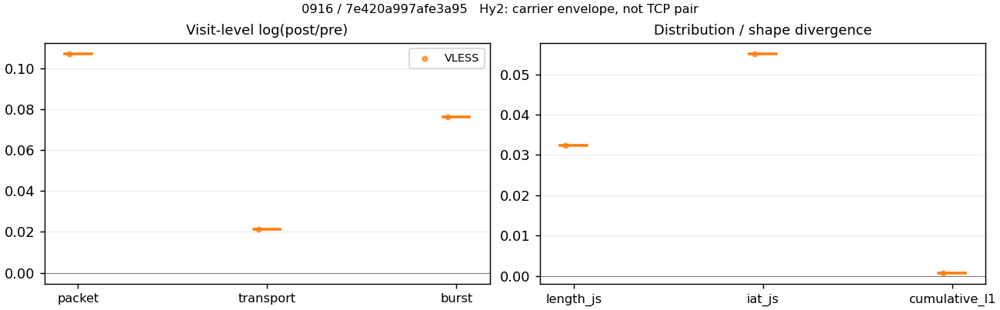
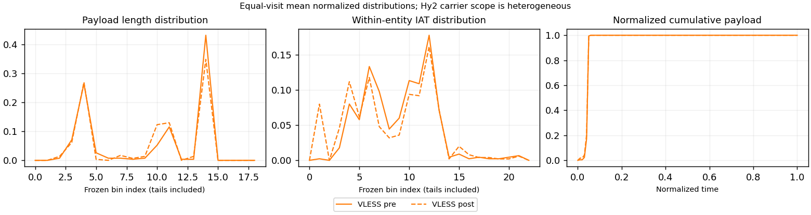

# 0916 · 条目 030 · bilibili.com

目标：https://www.bilibili.com/video/BV1hu4m1P7Mu/

活动标签：bilibili.com::video_playback。选定访问 15 次。

[返回总索引](../../README.md) · [统计口径](../../methods.md)

## 覆盖与资格（每次访问均保留）

| 部署 | 重复 | 主请求路由 | 活动状态 | 代理比较 | DIRECT pre | 请求 proxy/direct/unresolved | 错误 |
| --- | --- | --- | --- | --- | --- | --- | --- |
| Hy2 | 1 | direct | passed | 0 | 1 | 0/308/0 | [] |
| Hy2 | 2 | direct | passed | 0 | 1 | 0/304/0 | [] |
| Hy2 | 3 | direct | passed | 0 | 1 | 0/302/0 | [] |
| Hy2 | 4 | direct | passed | 0 | 1 | 0/312/0 | [] |
| Hy2 | 5 | direct | passed | 0 | 1 | 0/297/0 | [] |
| SS | 1 | direct | passed | 0 | 1 | 0/309/0 | [] |
| SS | 2 | direct | passed | 0 | 1 | 0/309/0 | [] |
| SS | 3 | direct | passed | 0 | 1 | 0/294/0 | [] |
| SS | 4 | direct | passed | 0 | 1 | 0/311/0 | [] |
| SS | 5 | direct | passed | 0 | 1 | 0/301/0 | [] |
| VLESS | 1 | direct | passed | 0 | 1 | 0/318/0 | [] |
| VLESS | 2 | direct | passed | 0 | 1 | 0/267/0 | [] |
| VLESS | 3 | direct | passed | 1 | 1 | 25/274/0 | [] |
| VLESS | 4 | direct | passed | 0 | 1 | 0/317/0 | [] |
| VLESS | 5 | direct | passed | 0 | 1 | 0/303/0 | [] |

主请求非 proxy 的统计仅解释为已索引的辅助代理连接或 DIRECT 观测，不代表目标业务经代理传输。播放确认与配对资格是两道不同的门。

图中散点为单次访问，短线为重复中位数；Hy2 是共享载体包络，不能与 TCP 配对作等范围因果对比。

形态图先逐访问归一化，再对访问等权平均；实线 pre，虚线 post。分箱序号及边界见 methods，不将分箱索引误解为长度或时间。

## 每次访问的关键观测

### SS

范围：`direct_pre_only`。每格 pre → post；空值为不可观测/不适用。

| 重复 | 包数 | 载荷字节 | burst | TCP FR | IAT中位µs | length JS | IAT JS |
| --- | --- | --- | --- | --- | --- | --- | --- |
| 1 | 4427 → — | 1.0406e+07 → — | 3007 → — | 410 → — | 50.014 → — | — | — |
| 2 | 4398 → — | 9.3387e+06 → — | 2826 → — | 420 → — | 59.614 → — | — | — |
| 3 | 3918 → — | 8.3736e+06 → — | 2467 → — | 411 → — | 57.927 → — | — | — |
| 4 | 4579 → — | 9.763e+06 → — | 3001 → — | 511 → — | 70.455 → — | — | — |
| 5 | 4468 → — | 8.5417e+06 → — | 3083 → — | 391 → — | 78.381 → — | — | — |

完整标量统计：中位数 [min,max]；Δ 为重复内逐访问变换的中位数，MAD 未缩放。n 为可用变换数；DIRECT-only 的 nΔ=0 不代表 pre 不可用。

| scope | 特征 | pre | post | Δ | IQRΔ | MADΔ | nΔ |
| --- | --- | --- | --- | --- | --- | --- | --- |
| direct_pre_only | active_span_sum_s_1000ms | 31.837 [20.373, 44.308] | — | — | — | — | 0 |
| direct_pre_only | active_span_sum_s_100ms | 9.8484 [9.2911, 12.144] | — | — | — | — | 0 |
| direct_pre_only | active_span_sum_s_500ms | 17.866 [15.304, 25.557] | — | — | — | — | 0 |
| direct_pre_only | burst_bytes_iqr | 2985.5 [2880, 5710] | — | — | — | — | 0 |
| direct_pre_only | burst_bytes_mad | 88 [39, 92] | — | — | — | — | 0 |
| direct_pre_only | burst_bytes_max | 28056 [26848, 29400] | — | — | — | — | 0 |
| direct_pre_only | burst_bytes_mean | 3304.6 [2770.6, 3460.4] | — | — | — | — | 0 |
| direct_pre_only | burst_bytes_median | 88 [39, 92] | — | — | — | — | 0 |
| direct_pre_only | burst_bytes_min | 0 [0, 0] | — | — | — | — | 0 |
| direct_pre_only | burst_bytes_p95 | 19604 [13511, 20480] | — | — | — | — | 0 |
| direct_pre_only | burst_bytes_q25 | 0 [0, 0] | — | — | — | — | 0 |
| direct_pre_only | burst_bytes_q75 | 2985.5 [2880, 5710] | — | — | — | — | 0 |
| direct_pre_only | burst_bytes_std | 5732.6 [4756.9, 6108.7] | — | — | — | — | 0 |
| direct_pre_only | burst_count | 3001 [2467, 3083] | — | — | — | — | 0 |
| direct_pre_only | burst_duration_ms_iqr | 0.057147 [0.032645, 0.0701] | — | — | — | — | 0 |
| direct_pre_only | burst_duration_ms_mad | 0 [0, 0] | — | — | — | — | 0 |
| direct_pre_only | burst_duration_ms_max | 14894 [14825, 15001] | — | — | — | — | 0 |
| direct_pre_only | burst_duration_ms_mean | 83.537 [61.994, 133.36] | — | — | — | — | 0 |
| direct_pre_only | burst_duration_ms_median | 0 [0, 0] | — | — | — | — | 0 |
| direct_pre_only | burst_duration_ms_min | 0 [0, 0] | — | — | — | — | 0 |
| direct_pre_only | burst_duration_ms_p95 | 62.586 [34.586, 68.5] | — | — | — | — | 0 |
| direct_pre_only | burst_duration_ms_q25 | 0 [0, 0] | — | — | — | — | 0 |
| direct_pre_only | burst_duration_ms_q75 | 0.057147 [0.032645, 0.0701] | — | — | — | — | 0 |
| direct_pre_only | burst_duration_ms_std | 763.85 [572.17, 1044.8] | — | — | — | — | 0 |
| direct_pre_only | burst_packets_iqr | 1 [1, 1] | — | — | — | — | 0 |
| direct_pre_only | burst_packets_mad | 0 [0, 0] | — | — | — | — | 0 |
| direct_pre_only | burst_packets_max | 9 [8, 12] | — | — | — | — | 0 |
| direct_pre_only | burst_packets_mean | 1.5258 [1.4492, 1.5882] | — | — | — | — | 0 |
| direct_pre_only | burst_packets_median | 1 [1, 1] | — | — | — | — | 0 |
| direct_pre_only | burst_packets_min | 1 [1, 1] | — | — | — | — | 0 |
| direct_pre_only | burst_packets_p95 | 3 [3, 3] | — | — | — | — | 0 |
| direct_pre_only | burst_packets_q25 | 1 [1, 1] | — | — | — | — | 0 |
| direct_pre_only | burst_packets_q75 | 2 [2, 2] | — | — | — | — | 0 |
| direct_pre_only | burst_packets_std | 0.88872 [0.83135, 0.95364] | — | — | — | — | 0 |
| direct_pre_only | connection_span_concurrency_max | 16 [14, 28] | — | — | — | — | 0 |
| direct_pre_only | direction_entropy | 0.67916 [0.6518, 0.69139] | — | — | — | — | 0 |
| direct_pre_only | down_burst_count | 1484 [1220, 1529] | — | — | — | — | 0 |
| direct_pre_only | down_ip_bytes | 9.2293e+06 [8.2508e+06, 1.0301e+07] | — | — | — | — | 0 |
| direct_pre_only | down_packets | 2628 [2386, 2717] | — | — | — | — | 0 |
| direct_pre_only | down_transport_bytes | 9.0905e+06 [8.1265e+06, 1.0165e+07] | — | — | — | — | 0 |
| direct_pre_only | duration_s | 63.41 [61.675, 64.903] | — | — | — | — | 0 |
| direct_pre_only | entity_count | 27 [21, 33] | — | — | — | — | 0 |
| direct_pre_only | fr_runs | 411 [391, 511] | — | — | — | — | 0 |
| direct_pre_only | fr_runs_per_packet | 0.16197 [0.14981, 0.19039] | — | — | — | — | 0 |
| direct_pre_only | fr_switches | 388 [366, 478] | — | — | — | — | 0 |
| direct_pre_only | fr_switches_per_possible_transition | 0.1515 [0.14159, 0.18031] | — | — | — | — | 0 |
| direct_pre_only | full_retransmission_fraction | 0.0032758 [0.0013643, 0.0042918] | — | — | — | — | 0 |
| direct_pre_only | full_retransmission_packets | 14 [6, 19] | — | — | — | — | 0 |
| direct_pre_only | iat_count | 4406 [3891, 4546] | — | — | — | — | 0 |
| direct_pre_only | iat_median_us | 59.614 [50.014, 78.381] | — | — | — | — | 0 |
| direct_pre_only | iat_us_iqr | 495.58 [318.24, 574.12] | — | — | — | — | 0 |
| direct_pre_only | iat_us_mad | 51.478 [43.931, 68.52] | — | — | — | — | 0 |
| direct_pre_only | iat_us_max | 1.5e+07 [1.4824e+07, 1.5001e+07] | — | — | — | — | 0 |
| direct_pre_only | iat_us_mean | 83712 [48772, 2.2436e+05] | — | — | — | — | 0 |
| direct_pre_only | iat_us_median | 59.614 [50.014, 78.381] | — | — | — | — | 0 |
| direct_pre_only | iat_us_min | 0.06 [0.021, 0.228] | — | — | — | — | 0 |
| direct_pre_only | iat_us_p95 | 40550 [31154, 51570] | — | — | — | — | 0 |
| direct_pre_only | iat_us_q25 | 15.566 [12.157, 20.273] | — | — | — | — | 0 |
| direct_pre_only | iat_us_q75 | 511.34 [330.39, 594.4] | — | — | — | — | 0 |
| direct_pre_only | iat_us_std | 7.3636e+05 [5.2495e+05, 1.5753e+06] | — | — | — | — | 0 |
| direct_pre_only | idle_gap_count_1000ms | 73 [42, 115] | — | — | — | — | 0 |
| direct_pre_only | idle_gap_count_100ms | 143 [111, 149] | — | — | — | — | 0 |
| direct_pre_only | idle_gap_count_500ms | 90 [63, 122] | — | — | — | — | 0 |
| direct_pre_only | idle_gap_sum_s_1000ms | 351.56 [175.35, 959.12] | — | — | — | — | 0 |
| direct_pre_only | idle_gap_sum_s_100ms | 362.08 [203.28, 969.69] | — | — | — | — | 0 |
| direct_pre_only | idle_gap_sum_s_500ms | 355.31 [189.33, 964.23] | — | — | — | — | 0 |
| direct_pre_only | ip_bytes | 9.568e+06 [8.5779e+06, 1.0636e+07] | — | — | — | — | 0 |
| direct_pre_only | length_iqr | 5164 [4286.2, 6865] | — | — | — | — | 0 |
| direct_pre_only | length_mad | 2427.5 [2087.5, 2585] | — | — | — | — | 0 |
| direct_pre_only | length_max | 8948 [8948, 8948] | — | — | — | — | 0 |
| direct_pre_only | length_mean | 3615.5 [3272.7, 3964] | — | — | — | — | 0 |
| direct_pre_only | length_median | 2856 [2824, 2880] | — | — | — | — | 0 |
| direct_pre_only | length_min | 11 [9, 31] | — | — | — | — | 0 |
| direct_pre_only | length_p95 | 8920 [8920, 8920] | — | — | — | — | 0 |
| direct_pre_only | length_q25 | 686 [596, 807.25] | — | — | — | — | 0 |
| direct_pre_only | length_q75 | 5761 [5093.5, 7621] | — | — | — | — | 0 |
| direct_pre_only | length_std | 3174.9 [2808.7, 3321.5] | — | — | — | — | 0 |
| direct_pre_only | nonempty_entity_count | 27 [21, 33] | — | — | — | — | 0 |
| direct_pre_only | nonempty_packets | 2610 [2316, 2684] | — | — | — | — | 0 |
| direct_pre_only | offload_suspect_fraction | 0.38458 [0.37596, 0.40117] | — | — | — | — | 0 |
| direct_pre_only | packet_count | 4427 [3918, 4579] | — | — | — | — | 0 |
| direct_pre_only | rtt_median_ms | 0.073886 [0.053207, 0.07891] | — | — | — | — | 0 |
| direct_pre_only | rtt_sample_count | 1755 [1454, 1821] | — | — | — | — | 0 |
| direct_pre_only | tcp_ack_count | 4406 [3887, 4546] | — | — | — | — | 0 |
| direct_pre_only | tcp_fin_count | 52 [42, 66] | — | — | — | — | 0 |
| direct_pre_only | tcp_packet_count | 4427 [3918, 4579] | — | — | — | — | 0 |
| direct_pre_only | tcp_rst_count | 2 [0, 4] | — | — | — | — | 0 |
| direct_pre_only | tcp_syn_count | 54 [42, 66] | — | — | — | — | 0 |
| direct_pre_only | tcp_window_raw_median | 65535 [65535, 65535] | — | — | — | — | 0 |
| direct_pre_only | transition_entropy | 0.52864 [0.50175, 0.57199] | — | — | — | — | 0 |
| direct_pre_only | transition_n_mm | 1947 [1683, 1980] | — | — | — | — | 0 |
| direct_pre_only | transition_n_mp | 182 [173, 223] | — | — | — | — | 0 |
| direct_pre_only | transition_n_pm | 204 [193, 255] | — | — | — | — | 0 |
| direct_pre_only | transition_n_pp | 237 [222, 260] | — | — | — | — | 0 |
| direct_pre_only | transition_p_mm | 0.91313 [0.89724, 0.91965] | — | — | — | — | 0 |
| direct_pre_only | transition_p_mp | 0.086874 [0.080353, 0.10276] | — | — | — | — | 0 |
| direct_pre_only | transition_p_pm | 0.46259 [0.44206, 0.53015] | — | — | — | — | 0 |
| direct_pre_only | transition_p_pp | 0.53741 [0.46985, 0.55794] | — | — | — | — | 0 |
| direct_pre_only | transport_bytes | 9.3387e+06 [8.3736e+06, 1.0406e+07] | — | — | — | — | 0 |
| direct_pre_only | up_burst_count | 1514 [1247, 1554] | — | — | — | — | 0 |
| direct_pre_only | up_byte_fraction | 0.027195 [0.023143, 0.029513] | — | — | — | — | 0 |
| direct_pre_only | up_ip_bytes | 3.3497e+05 [3.2713e+05, 3.8532e+05] | — | — | — | — | 0 |
| direct_pre_only | up_packets | 1803 [1532, 1862] | — | — | — | — | 0 |
| direct_pre_only | up_transport_bytes | 2.4713e+05 [2.323e+05, 2.8806e+05] | — | — | — | — | 0 |
| direct_pre_only | zero_iat_count | 0 [0, 0] | — | — | — | — | 0 |
| direct_pre_only | zero_iat_fraction | 0 [0, 0] | — | — | — | — | 0 |

### VLESS

范围：`direct_pre_only`。每格 pre → post；空值为不可观测/不适用。

| 重复 | 包数 | 载荷字节 | burst | TCP FR | IAT中位µs | length JS | IAT JS |
| --- | --- | --- | --- | --- | --- | --- | --- |
| 1 | 3875 → — | 8.9717e+06 → — | 2558 → — | 408 → — | 51.929 → — | — | — |
| 2 | 3939 → — | 8.2324e+06 → — | 2537 → — | 357 → — | 63.788 → — | — | — |
| 3 | 3600 → — | 7.1345e+06 → — | 2443 → — | 350 → — | 57.322 → — | — | — |
| 4 | 3002 → — | 5.1823e+06 → — | 1931 → — | 406 → — | 90.007 → — | — | — |
| 5 | 4485 → — | 9.5294e+06 → — | 2897 → — | 420 → — | 55.936 → — | — | — |

范围：`exclusive_page`。每格 pre → post；空值为不可观测/不适用。

| 重复 | 包数 | 载荷字节 | burst | TCP FR | IAT中位µs | length JS | IAT JS |
| --- | --- | --- | --- | --- | --- | --- | --- |
| 1 | — | — | — | — | — | — | — |
| 2 | — | — | — | — | — | — | — |
| 3 | 451 → 502 | 4.1066e+05 → 4.1954e+05 | 327 → 353 | 14 → 16 | 525.93 → 257.38 | 0.032344 | 0.055023 |
| 4 | — | — | — | — | — | — | — |
| 5 | — | — | — | — | — | — | — |

完整标量统计：中位数 [min,max]；Δ 为重复内逐访问变换的中位数，MAD 未缩放。n 为可用变换数；DIRECT-only 的 nΔ=0 不代表 pre 不可用。

| scope | 特征 | pre | post | Δ | IQRΔ | MADΔ | nΔ |
| --- | --- | --- | --- | --- | --- | --- | --- |
| direct_pre_only | active_span_sum_s_1000ms | 30.899 [19.331, 37.937] | — | — | — | — | 0 |
| direct_pre_only | active_span_sum_s_100ms | 9.9856 [9.0185, 11.53] | — | — | — | — | 0 |
| direct_pre_only | active_span_sum_s_500ms | 19.878 [14.671, 25.859] | — | — | — | — | 0 |
| direct_pre_only | burst_bytes_iqr | 3376 [2113.5, 4931.5] | — | — | — | — | 0 |
| direct_pre_only | burst_bytes_mad | 39 [35, 93] | — | — | — | — | 0 |
| direct_pre_only | burst_bytes_max | 26934 [20480, 29400] | — | — | — | — | 0 |
| direct_pre_only | burst_bytes_mean | 3245 [2683.7, 3507.3] | — | — | — | — | 0 |
| direct_pre_only | burst_bytes_median | 39 [35, 93] | — | — | — | — | 0 |
| direct_pre_only | burst_bytes_min | 0 [0, 0] | — | — | — | — | 0 |
| direct_pre_only | burst_bytes_p95 | 20480 [17111, 20480] | — | — | — | — | 0 |
| direct_pre_only | burst_bytes_q25 | 0 [0, 0] | — | — | — | — | 0 |
| direct_pre_only | burst_bytes_q75 | 3376 [2113.5, 4931.5] | — | — | — | — | 0 |
| direct_pre_only | burst_bytes_std | 5830.3 [5275.6, 5961.7] | — | — | — | — | 0 |
| direct_pre_only | burst_count | 2537 [1931, 2897] | — | — | — | — | 0 |
| direct_pre_only | burst_duration_ms_iqr | 0.049884 [0.048213, 0.19779] | — | — | — | — | 0 |
| direct_pre_only | burst_duration_ms_mad | 0 [0, 0] | — | — | — | — | 0 |
| direct_pre_only | burst_duration_ms_max | 14966 [12616, 15001] | — | — | — | — | 0 |
| direct_pre_only | burst_duration_ms_mean | 83.664 [64.777, 116.48] | — | — | — | — | 0 |
| direct_pre_only | burst_duration_ms_median | 0 [0, 0] | — | — | — | — | 0 |
| direct_pre_only | burst_duration_ms_min | 0 [0, 0] | — | — | — | — | 0 |
| direct_pre_only | burst_duration_ms_p95 | 47.995 [41.867, 95.31] | — | — | — | — | 0 |
| direct_pre_only | burst_duration_ms_q25 | 0 [0, 0] | — | — | — | — | 0 |
| direct_pre_only | burst_duration_ms_q75 | 0.049884 [0.048213, 0.19779] | — | — | — | — | 0 |
| direct_pre_only | burst_duration_ms_std | 698.95 [581.57, 1023.1] | — | — | — | — | 0 |
| direct_pre_only | burst_packets_iqr | 1 [1, 1] | — | — | — | — | 0 |
| direct_pre_only | burst_packets_mad | 0 [0, 0] | — | — | — | — | 0 |
| direct_pre_only | burst_packets_max | 8 [7, 8] | — | — | — | — | 0 |
| direct_pre_only | burst_packets_mean | 1.5482 [1.4736, 1.5546] | — | — | — | — | 0 |
| direct_pre_only | burst_packets_median | 1 [1, 1] | — | — | — | — | 0 |
| direct_pre_only | burst_packets_min | 1 [1, 1] | — | — | — | — | 0 |
| direct_pre_only | burst_packets_p95 | 3 [3, 3] | — | — | — | — | 0 |
| direct_pre_only | burst_packets_q25 | 1 [1, 1] | — | — | — | — | 0 |
| direct_pre_only | burst_packets_q75 | 2 [2, 2] | — | — | — | — | 0 |
| direct_pre_only | burst_packets_std | 0.9037 [0.82903, 0.95529] | — | — | — | — | 0 |
| direct_pre_only | connection_span_concurrency_max | 14 [12, 15] | — | — | — | — | 0 |
| direct_pre_only | direction_entropy | 0.69287 [0.65768, 0.80728] | — | — | — | — | 0 |
| direct_pre_only | down_burst_count | 1254 [952, 1434] | — | — | — | — | 0 |
| direct_pre_only | down_ip_bytes | 8.1391e+06 [5.0185e+06, 9.4289e+06] | — | — | — | — | 0 |
| direct_pre_only | down_packets | 2318 [1739, 2701] | — | — | — | — | 0 |
| direct_pre_only | down_transport_bytes | 8.0147e+06 [4.9278e+06, 9.2882e+06] | — | — | — | — | 0 |
| direct_pre_only | duration_s | 63.698 [61.674, 65.402] | — | — | — | — | 0 |
| direct_pre_only | entity_count | 27 [22, 29] | — | — | — | — | 0 |
| direct_pre_only | fr_runs | 406 [350, 420] | — | — | — | — | 0 |
| direct_pre_only | fr_runs_per_packet | 0.17165 [0.15335, 0.23981] | — | — | — | — | 0 |
| direct_pre_only | fr_switches | 379 [323, 391] | — | — | — | — | 0 |
| direct_pre_only | fr_switches_per_possible_transition | 0.16054 [0.14267, 0.22749] | — | — | — | — | 0 |
| direct_pre_only | full_retransmission_fraction | 0.0033445 [0.00033311, 0.0056774] | — | — | — | — | 0 |
| direct_pre_only | full_retransmission_packets | 15 [1, 22] | — | — | — | — | 0 |
| direct_pre_only | iat_count | 3853 [2975, 4456] | — | — | — | — | 0 |
| direct_pre_only | iat_median_us | 57.322 [51.929, 90.007] | — | — | — | — | 0 |
| direct_pre_only | iat_us_iqr | 430.04 [207.39, 767.41] | — | — | — | — | 0 |
| direct_pre_only | iat_us_mad | 50.514 [45.165, 80.428] | — | — | — | — | 0 |
| direct_pre_only | iat_us_max | 1.5001e+07 [1.4933e+07, 1.5003e+07] | — | — | — | — | 0 |
| direct_pre_only | iat_us_mean | 2.2001e+05 [55839, 2.3845e+05] | — | — | — | — | 0 |
| direct_pre_only | iat_us_median | 57.322 [51.929, 90.007] | — | — | — | — | 0 |
| direct_pre_only | iat_us_min | 0.033 [0.01, 0.253] | — | — | — | — | 0 |
| direct_pre_only | iat_us_p95 | 41521 [40997, 1.0846e+05] | — | — | — | — | 0 |
| direct_pre_only | iat_us_q25 | 14.233 [12.37, 18.742] | — | — | — | — | 0 |
| direct_pre_only | iat_us_q75 | 444.27 [219.76, 786.15] | — | — | — | — | 0 |
| direct_pre_only | iat_us_std | 1.5975e+06 [5.9182e+05, 1.671e+06] | — | — | — | — | 0 |
| direct_pre_only | idle_gap_count_1000ms | 93 [36, 97] | — | — | — | — | 0 |
| direct_pre_only | idle_gap_count_100ms | 133 [108, 152] | — | — | — | — | 0 |
| direct_pre_only | idle_gap_count_500ms | 99 [52, 109] | — | — | — | — | 0 |
| direct_pre_only | idle_gap_sum_s_1000ms | 766.77 [177.21, 873.66] | — | — | — | — | 0 |
| direct_pre_only | idle_gap_sum_s_100ms | 776.38 [204.23, 884.11] | — | — | — | — | 0 |
| direct_pre_only | idle_gap_sum_s_500ms | 771.43 [189.29, 875.75] | — | — | — | — | 0 |
| direct_pre_only | ip_bytes | 8.4379e+06 [5.3388e+06, 9.7632e+06] | — | — | — | — | 0 |
| direct_pre_only | length_iqr | 5114 [4943, 6811] | — | — | — | — | 0 |
| direct_pre_only | length_mad | 2369.5 [1897, 2600] | — | — | — | — | 0 |
| direct_pre_only | length_max | 8948 [8948, 8948] | — | — | — | — | 0 |
| direct_pre_only | length_mean | 3536.3 [3061, 3897.3] | — | — | — | — | 0 |
| direct_pre_only | length_median | 2856 [2099, 2880] | — | — | — | — | 0 |
| direct_pre_only | length_min | 31 [6, 31] | — | — | — | — | 0 |
| direct_pre_only | length_p95 | 8920 [8920, 8920] | — | — | — | — | 0 |
| direct_pre_only | length_q25 | 639.5 [400, 702.75] | — | — | — | — | 0 |
| direct_pre_only | length_q75 | 5712 [5343, 7464] | — | — | — | — | 0 |
| direct_pre_only | length_std | 3140.2 [3084.6, 3311.5] | — | — | — | — | 0 |
| direct_pre_only | nonempty_entity_count | 27 [22, 29] | — | — | — | — | 0 |
| direct_pre_only | nonempty_packets | 2302 [1693, 2659] | — | — | — | — | 0 |
| direct_pre_only | offload_suspect_fraction | 0.39487 [0.31546, 0.39742] | — | — | — | — | 0 |
| direct_pre_only | packet_count | 3875 [3002, 4485] | — | — | — | — | 0 |
| direct_pre_only | rtt_median_ms | 0.066968 [0.064725, 0.09484] | — | — | — | — | 0 |
| direct_pre_only | rtt_sample_count | 1462 [1192, 1676] | — | — | — | — | 0 |
| direct_pre_only | tcp_ack_count | 3850 [2971, 4451] | — | — | — | — | 0 |
| direct_pre_only | tcp_fin_count | 53 [43, 58] | — | — | — | — | 0 |
| direct_pre_only | tcp_packet_count | 3875 [3002, 4485] | — | — | — | — | 0 |
| direct_pre_only | tcp_rst_count | 3 [1, 5] | — | — | — | — | 0 |
| direct_pre_only | tcp_syn_count | 54 [44, 58] | — | — | — | — | 0 |
| direct_pre_only | tcp_window_raw_median | 65535 [65535, 65535] | — | — | — | — | 0 |
| direct_pre_only | transition_entropy | 0.55219 [0.5065, 0.69148] | — | — | — | — | 0 |
| direct_pre_only | transition_n_mm | 1671 [1072, 1998] | — | — | — | — | 0 |
| direct_pre_only | transition_n_mp | 177 [149, 183] | — | — | — | — | 0 |
| direct_pre_only | transition_n_pm | 202 [174, 209] | — | — | — | — | 0 |
| direct_pre_only | transition_n_pp | 225 [215, 241] | — | — | — | — | 0 |
| direct_pre_only | transition_p_mm | 0.90763 [0.85829, 0.92002] | — | — | — | — | 0 |
| direct_pre_only | transition_p_mp | 0.092374 [0.079979, 0.14171] | — | — | — | — | 0 |
| direct_pre_only | transition_p_pm | 0.46444 [0.43066, 0.48441] | — | — | — | — | 0 |
| direct_pre_only | transition_p_pp | 0.53556 [0.51559, 0.56934] | — | — | — | — | 0 |
| direct_pre_only | transport_bytes | 8.2324e+06 [5.1823e+06, 9.5294e+06] | — | — | — | — | 0 |
| direct_pre_only | up_burst_count | 1283 [979, 1463] | — | — | — | — | 0 |
| direct_pre_only | up_byte_fraction | 0.026455 [0.02531, 0.049103] | — | — | — | — | 0 |
| direct_pre_only | up_ip_bytes | 3.1574e+05 [2.9874e+05, 3.3431e+05] | — | — | — | — | 0 |
| direct_pre_only | up_packets | 1550 [1263, 1784] | — | — | — | — | 0 |
| direct_pre_only | up_transport_bytes | 2.3438e+05 [2.1779e+05, 2.5447e+05] | — | — | — | — | 0 |
| direct_pre_only | zero_iat_count | 0 [0, 0] | — | — | — | — | 0 |
| direct_pre_only | zero_iat_fraction | 0 [0, 0] | — | — | — | — | 0 |
| exclusive_page | active_span_sum_s_1000ms | 2.4155 [2.4155, 2.4155] | 3.1046 [3.1046, 3.1046] | 0.25096 | — | — | 1 |
| exclusive_page | active_span_sum_s_100ms | 0.85915 [0.85915, 0.85915] | 1.3787 [1.3787, 1.3787] | 0.47297 | — | — | 1 |
| exclusive_page | active_span_sum_s_500ms | 1.5678 [1.5678, 1.5678] | 2.2804 [2.2804, 2.2804] | 0.37469 | — | — | 1 |
| exclusive_page | burst_bytes_iqr | 2824 [2824, 2824] | 2880 [2880, 2880] | 0.019636 | — | — | 1 |
| exclusive_page | burst_bytes_mad | 24 [24, 24] | 72 [72, 72] | 1.0986 | — | — | 1 |
| exclusive_page | burst_bytes_max | 12498 [12498, 12498] | 4832 [4832, 4832] | -0.95031 | — | — | 1 |
| exclusive_page | burst_bytes_mean | 1255.9 [1255.9, 1255.9] | 1188.5 [1188.5, 1188.5] | -0.055132 | — | — | 1 |
| exclusive_page | burst_bytes_median | 24 [24, 24] | 72 [72, 72] | 1.0986 | — | — | 1 |
| exclusive_page | burst_bytes_min | 0 [0, 0] | 0 [0, 0] | — | — | — | 0 |
| exclusive_page | burst_bytes_p95 | 5720 [5720, 5720] | 2896 [2896, 2896] | -0.68064 | — | — | 1 |
| exclusive_page | burst_bytes_q25 | 0 [0, 0] | 0 [0, 0] | — | — | — | 0 |
| exclusive_page | burst_bytes_q75 | 2824 [2824, 2824] | 2880 [2880, 2880] | 0.019636 | — | — | 1 |
| exclusive_page | burst_bytes_std | 1924.3 [1924.3, 1924.3] | 1334.5 [1334.5, 1334.5] | -0.36601 | — | — | 1 |
| exclusive_page | burst_count | 327 [327, 327] | 353 [353, 353] | 0.076508 | — | — | 1 |
| exclusive_page | burst_duration_ms_iqr | 0.27912 [0.27912, 0.27912] | 0.00425 [0.00425, 0.00425] | -4.1847 | — | — | 1 |
| exclusive_page | burst_duration_ms_mad | 0 [0, 0] | 0 [0, 0] | — | — | — | 0 |
| exclusive_page | burst_duration_ms_max | 1471.5 [1471.5, 1471.5] | 15043 [15043, 15043] | 2.3246 | — | — | 1 |
| exclusive_page | burst_duration_ms_mean | 9.5411 [9.5411, 9.5411] | 46.24 [46.24, 46.24] | 1.5782 | — | — | 1 |
| exclusive_page | burst_duration_ms_median | 0 [0, 0] | 0 [0, 0] | — | — | — | 0 |
| exclusive_page | burst_duration_ms_min | 0 [0, 0] | 0 [0, 0] | — | — | — | 0 |
| exclusive_page | burst_duration_ms_p95 | 4.6711 [4.6711, 4.6711] | 8.9645 [8.9645, 8.9645] | 0.65187 | — | — | 1 |
| exclusive_page | burst_duration_ms_q25 | 0 [0, 0] | 0 [0, 0] | — | — | — | 0 |
| exclusive_page | burst_duration_ms_q75 | 0.27912 [0.27912, 0.27912] | 0.00425 [0.00425, 0.00425] | -4.1847 | — | — | 1 |
| exclusive_page | burst_duration_ms_std | 96.407 [96.407, 96.407] | 799.75 [799.75, 799.75] | 2.1157 | — | — | 1 |
| exclusive_page | burst_packets_iqr | 1 [1, 1] | 1 [1, 1] | 0 | — | — | 1 |
| exclusive_page | burst_packets_mad | 0 [0, 0] | 0 [0, 0] | — | — | — | 0 |
| exclusive_page | burst_packets_max | 5 [5, 5] | 8 [8, 8] | 0.47 | — | — | 1 |
| exclusive_page | burst_packets_mean | 1.3792 [1.3792, 1.3792] | 1.4221 [1.4221, 1.4221] | 0.030625 | — | — | 1 |
| exclusive_page | burst_packets_median | 1 [1, 1] | 1 [1, 1] | 0 | — | — | 1 |
| exclusive_page | burst_packets_min | 1 [1, 1] | 1 [1, 1] | 0 | — | — | 1 |
| exclusive_page | burst_packets_p95 | 2 [2, 2] | 3 [3, 3] | 0.40547 | — | — | 1 |
| exclusive_page | burst_packets_q25 | 1 [1, 1] | 1 [1, 1] | 0 | — | — | 1 |
| exclusive_page | burst_packets_q75 | 2 [2, 2] | 2 [2, 2] | 0 | — | — | 1 |
| exclusive_page | burst_packets_std | 0.63289 [0.63289, 0.63289] | 0.81088 [0.81088, 0.81088] | 0.24783 | — | — | 1 |
| exclusive_page | connection_span_concurrency_max | 1 [1, 1] | 1 [1, 1] | 0 | — | — | 1 |
| exclusive_page | cumulative_l1 | — | — | 0.0007668 | — | — | 1 |
| exclusive_page | cumulative_max | — | — | 0.031232 | — | — | 1 |
| exclusive_page | direction_entropy | 0.51553 [0.51553, 0.51553] | 0.29145 [0.29145, 0.29145] | -0.22408 | — | — | 1 |
| exclusive_page | down_burst_count | 163 [163, 163] | 176 [176, 176] | 0.076734 | — | — | 1 |
| exclusive_page | down_ip_bytes | 4.1913e+05 [4.1913e+05, 4.1913e+05] | 4.2751e+05 [4.2751e+05, 4.2751e+05] | 0.019806 | — | — | 1 |
| exclusive_page | down_packets | 269 [269, 269] | 296 [296, 296] | 0.095648 | — | — | 1 |
| exclusive_page | down_transport_bytes | 4.0513e+05 [4.0513e+05, 4.0513e+05] | 4.1211e+05 [4.1211e+05, 4.1211e+05] | 0.017082 | — | — | 1 |
| exclusive_page | duration_s | 53.652 [53.652, 53.652] | 53.633 [53.633, 53.633] | -0.00034234 | — | — | 1 |
| exclusive_page | entity_count | 1 [1, 1] | 1 [1, 1] | 0 | — | — | 1 |
| exclusive_page | fr_runs | 14 [14, 14] | 16 [16, 16] | 0.13353 | — | — | 1 |
| exclusive_page | fr_runs_per_packet | 0.052045 [0.052045, 0.052045] | 0.054608 [0.054608, 0.054608] | 0.0025629 | — | — | 1 |
| exclusive_page | fr_switches | 13 [13, 13] | 15 [15, 15] | 0.1431 | — | — | 1 |
| exclusive_page | fr_switches_per_possible_transition | 0.048507 [0.048507, 0.048507] | 0.05137 [0.05137, 0.05137] | 0.0028624 | — | — | 1 |
| exclusive_page | full_retransmission_fraction | 0.0022173 [0.0022173, 0.0022173] | 0 [0, 0] | -0.0022173 | — | — | 1 |
| exclusive_page | full_retransmission_packets | 1 [1, 1] | 0 [0, 0] | — | — | — | 0 |
| exclusive_page | iat_count | 450 [450, 450] | 501 [501, 501] | 0.10736 | — | — | 1 |
| exclusive_page | iat_js | — | — | 0.055023 | — | — | 1 |
| exclusive_page | iat_ks | — | — | 0.15722 | — | — | 1 |
| exclusive_page | iat_median_us | 525.93 [525.93, 525.93] | 257.38 [257.38, 257.38] | -0.71463 | — | — | 1 |
| exclusive_page | iat_us_iqr | 2320.4 [2320.4, 2320.4] | 2306.4 [2306.4, 2306.4] | -0.0060644 | — | — | 1 |
| exclusive_page | iat_us_mad | 513.25 [513.25, 513.25] | 257.3 [257.3, 257.3] | -0.69053 | — | — | 1 |
| exclusive_page | iat_us_max | 1.5001e+07 [1.5001e+07, 1.5001e+07] | 1.5446e+07 [1.5446e+07, 1.5446e+07] | 0.02926 | — | — | 1 |
| exclusive_page | iat_us_mean | 1.1923e+05 [1.1923e+05, 1.1923e+05] | 1.0705e+05 [1.0705e+05, 1.0705e+05] | -0.1077 | — | — | 1 |
| exclusive_page | iat_us_median | 525.93 [525.93, 525.93] | 257.38 [257.38, 257.38] | -0.71463 | — | — | 1 |
| exclusive_page | iat_us_min | 0.392 [0.392, 0.392] | 0.036 [0.036, 0.036] | -2.3877 | — | — | 1 |
| exclusive_page | iat_us_p95 | 9206.6 [9206.6, 9206.6] | 9978.4 [9978.4, 9978.4] | 0.080499 | — | — | 1 |
| exclusive_page | iat_us_q25 | 36.169 [36.169, 36.169] | 13.078 [13.078, 13.078] | -1.0173 | — | — | 1 |
| exclusive_page | iat_us_q75 | 2356.6 [2356.6, 2356.6] | 2319.5 [2319.5, 2319.5] | -0.015877 | — | — | 1 |
| exclusive_page | iat_us_std | 1.2423e+06 [1.2423e+06, 1.2423e+06] | 1.1964e+06 [1.1964e+06, 1.1964e+06] | -0.037643 | — | — | 1 |
| exclusive_page | iat_wasserstein_log1p_us | — | — | 0.64179 | — | — | 1 |
| exclusive_page | idle_gap_count_1000ms | 5 [5, 5] | 4 [4, 4] | -0.22314 | — | — | 1 |
| exclusive_page | idle_gap_count_100ms | 9 [9, 9] | 9 [9, 9] | 0 | — | — | 1 |
| exclusive_page | idle_gap_count_500ms | 6 [6, 6] | 5 [5, 5] | -0.18232 | — | — | 1 |
| exclusive_page | idle_gap_sum_s_1000ms | 51.236 [51.236, 51.236] | 50.529 [50.529, 50.529] | -0.013903 | — | — | 1 |
| exclusive_page | idle_gap_sum_s_100ms | 52.793 [52.793, 52.793] | 52.255 [52.255, 52.255] | -0.010242 | — | — | 1 |
| exclusive_page | idle_gap_sum_s_500ms | 52.084 [52.084, 52.084] | 51.353 [51.353, 51.353] | -0.014134 | — | — | 1 |
| exclusive_page | ip_bytes | 4.3412e+05 [4.3412e+05, 4.3412e+05] | 4.4583e+05 [4.4583e+05, 4.4583e+05] | 0.026605 | — | — | 1 |
| exclusive_page | length_iqr | 2752 [2752, 2752] | 2752 [2752, 2752] | 0 | — | — | 1 |
| exclusive_page | length_js | — | — | 0.032344 | — | — | 1 |
| exclusive_page | length_ks | — | — | 0.10457 | — | — | 1 |
| exclusive_page | length_mad | 1384 [1384, 1384] | 1340 [1340, 1340] | -0.032308 | — | — | 1 |
| exclusive_page | length_max | 2896 [2896, 2896] | 2896 [2896, 2896] | 0 | — | — | 1 |
| exclusive_page | length_mean | 1526.6 [1526.6, 1526.6] | 1431.9 [1431.9, 1431.9] | -0.064085 | — | — | 1 |
| exclusive_page | length_median | 1440 [1440, 1440] | 1412 [1412, 1412] | -0.019636 | — | — | 1 |
| exclusive_page | length_min | 24 [24, 24] | 24 [24, 24] | 0 | — | — | 1 |
| exclusive_page | length_p95 | 2896 [2896, 2896] | 2896 [2896, 2896] | 0 | — | — | 1 |
| exclusive_page | length_q25 | 72 [72, 72] | 72 [72, 72] | 0 | — | — | 1 |
| exclusive_page | length_q75 | 2824 [2824, 2824] | 2824 [2824, 2824] | 0 | — | — | 1 |
| exclusive_page | length_std | 1243.2 [1243.2, 1243.2] | 1161.5 [1161.5, 1161.5] | -0.068004 | — | — | 1 |
| exclusive_page | length_wasserstein_bytes | — | — | 145.81 | — | — | 1 |
| exclusive_page | nonempty_entity_count | 1 [1, 1] | 1 [1, 1] | 0 | — | — | 1 |
| exclusive_page | nonempty_packets | 269 [269, 269] | 293 [293, 293] | 0.085461 | — | — | 1 |
| exclusive_page | offload_suspect_fraction | 0.26164 [0.26164, 0.26164] | 0.21116 [0.21116, 0.21116] | -0.050485 | — | — | 1 |
| exclusive_page | packet_count | 451 [451, 451] | 502 [502, 502] | 0.10713 | — | — | 1 |
| exclusive_page | rtt_median_ms | 0.3044 [0.3044, 0.3044] | 0.078391 [0.078391, 0.078391] | -1.3566 | — | — | 1 |
| exclusive_page | rtt_sample_count | 171 [171, 171] | 202 [202, 202] | 0.1666 | — | — | 1 |
| exclusive_page | tcp_ack_count | 448 [448, 448] | 501 [501, 501] | 0.11181 | — | — | 1 |
| exclusive_page | tcp_fin_count | 2 [2, 2] | 2 [2, 2] | 0 | — | — | 1 |
| exclusive_page | tcp_packet_count | 451 [451, 451] | 502 [502, 502] | 0.10713 | — | — | 1 |
| exclusive_page | tcp_rst_count | 2 [2, 2] | 0 [0, 0] | — | — | — | 0 |
| exclusive_page | tcp_syn_count | 2 [2, 2] | 2 [2, 2] | 0 | — | — | 1 |
| exclusive_page | tcp_window_raw_median | 65535 [65535, 65535] | 167 [167, 167] | -5.9723 | — | — | 1 |
| exclusive_page | transition_entropy | 0.23977 [0.23977, 0.23977] | 0.21256 [0.21256, 0.21256] | -0.027211 | — | — | 1 |
| exclusive_page | transition_n_mm | 231 [231, 231] | 270 [270, 270] | 0.156 | — | — | 1 |
| exclusive_page | transition_n_mp | 6 [6, 6] | 7 [7, 7] | 0.15415 | — | — | 1 |
| exclusive_page | transition_n_pm | 7 [7, 7] | 8 [8, 8] | 0.13353 | — | — | 1 |
| exclusive_page | transition_n_pp | 24 [24, 24] | 7 [7, 7] | -1.2321 | — | — | 1 |
| exclusive_page | transition_p_mm | 0.97468 [0.97468, 0.97468] | 0.97473 [0.97473, 0.97473] | 4.5698e-05 | — | — | 1 |
| exclusive_page | transition_p_mp | 0.025316 [0.025316, 0.025316] | 0.025271 [0.025271, 0.025271] | -4.5698e-05 | — | — | 1 |
| exclusive_page | transition_p_pm | 0.22581 [0.22581, 0.22581] | 0.53333 [0.53333, 0.53333] | 0.30753 | — | — | 1 |
| exclusive_page | transition_p_pp | 0.77419 [0.77419, 0.77419] | 0.46667 [0.46667, 0.46667] | -0.30753 | — | — | 1 |
| exclusive_page | transport_bytes | 4.1066e+05 [4.1066e+05, 4.1066e+05] | 4.1954e+05 [4.1954e+05, 4.1954e+05] | 0.021376 | — | — | 1 |
| exclusive_page | up_burst_count | 164 [164, 164] | 177 [177, 177] | 0.076283 | — | — | 1 |
| exclusive_page | up_byte_fraction | 0.013473 [0.013473, 0.013473] | 0.0177 [0.0177, 0.0177] | 0.0042272 | — | — | 1 |
| exclusive_page | up_ip_bytes | 14993 [14993, 14993] | 18314 [18314, 18314] | 0.20008 | — | — | 1 |
| exclusive_page | up_packets | 182 [182, 182] | 206 [206, 206] | 0.12387 | — | — | 1 |
| exclusive_page | up_transport_bytes | 5533 [5533, 5533] | 7426 [7426, 7426] | 0.29426 | — | — | 1 |
| exclusive_page | zero_iat_count | 0 [0, 0] | 0 [0, 0] | — | — | — | 0 |
| exclusive_page | zero_iat_fraction | 0 [0, 0] | 0 [0, 0] | 0 | — | — | 1 |

### Hy2

范围：`direct_pre_only`。每格 pre → post；空值为不可观测/不适用。

| 重复 | 包数 | 载荷字节 | burst | TCP FR | IAT中位µs | length JS | IAT JS |
| --- | --- | --- | --- | --- | --- | --- | --- |
| 1 | 3958 → — | 1.031e+07 → — | 2639 → — | 335 → — | 48.016 → — | — | — |
| 2 | 4451 → — | 1.0468e+07 → — | 2785 → — | 414 → — | 52.472 → — | — | — |
| 3 | 4895 → — | 1.0377e+07 → — | 3133 → — | 476 → — | 61.562 → — | — | — |
| 4 | 1801 → — | 2.0572e+06 → — | 1189 → — | 280 → — | 146.17 → — | — | — |
| 5 | 3602 → — | 9.3588e+06 → — | 2198 → — | 333 → — | 56.362 → — | — | — |

完整标量统计：中位数 [min,max]；Δ 为重复内逐访问变换的中位数，MAD 未缩放。n 为可用变换数；DIRECT-only 的 nΔ=0 不代表 pre 不可用。

| scope | 特征 | pre | post | Δ | IQRΔ | MADΔ | nΔ |
| --- | --- | --- | --- | --- | --- | --- | --- |
| direct_pre_only | active_span_sum_s_1000ms | 25.436 [17.843, 44.74] | — | — | — | — | 0 |
| direct_pre_only | active_span_sum_s_100ms | 7.942 [6.9863, 10.886] | — | — | — | — | 0 |
| direct_pre_only | active_span_sum_s_500ms | 15.116 [11.745, 19.854] | — | — | — | — | 0 |
| direct_pre_only | burst_bytes_iqr | 4824 [1440, 6241.5] | — | — | — | — | 0 |
| direct_pre_only | burst_bytes_mad | 62 [0, 85] | — | — | — | — | 0 |
| direct_pre_only | burst_bytes_max | 28680 [20480, 29400] | — | — | — | — | 0 |
| direct_pre_only | burst_bytes_mean | 3758.6 [1730.2, 4257.9] | — | — | — | — | 0 |
| direct_pre_only | burst_bytes_median | 62 [0, 85] | — | — | — | — | 0 |
| direct_pre_only | burst_bytes_min | 0 [0, 0] | — | — | — | — | 0 |
| direct_pre_only | burst_bytes_p95 | 20480 [10767, 20480] | — | — | — | — | 0 |
| direct_pre_only | burst_bytes_q25 | 0 [0, 0] | — | — | — | — | 0 |
| direct_pre_only | burst_bytes_q75 | 4824 [1440, 6241.5] | — | — | — | — | 0 |
| direct_pre_only | burst_bytes_std | 6355.6 [3973.3, 6999.3] | — | — | — | — | 0 |
| direct_pre_only | burst_count | 2639 [1189, 3133] | — | — | — | — | 0 |
| direct_pre_only | burst_duration_ms_iqr | 0.056923 [0.033395, 1.0681] | — | — | — | — | 0 |
| direct_pre_only | burst_duration_ms_mad | 0 [0, 0] | — | — | — | — | 0 |
| direct_pre_only | burst_duration_ms_max | 15000 [14975, 15001] | — | — | — | — | 0 |
| direct_pre_only | burst_duration_ms_mean | 103.96 [50.064, 106.49] | — | — | — | — | 0 |
| direct_pre_only | burst_duration_ms_median | 0 [0, 0] | — | — | — | — | 0 |
| direct_pre_only | burst_duration_ms_min | 0 [0, 0] | — | — | — | — | 0 |
| direct_pre_only | burst_duration_ms_p95 | 36.213 [27.768, 91.547] | — | — | — | — | 0 |
| direct_pre_only | burst_duration_ms_q25 | 0 [0, 0] | — | — | — | — | 0 |
| direct_pre_only | burst_duration_ms_q75 | 0.056923 [0.033395, 1.0681] | — | — | — | — | 0 |
| direct_pre_only | burst_duration_ms_std | 864.33 [575.56, 959.32] | — | — | — | — | 0 |
| direct_pre_only | burst_packets_iqr | 1 [1, 1] | — | — | — | — | 0 |
| direct_pre_only | burst_packets_mad | 0 [0, 0] | — | — | — | — | 0 |
| direct_pre_only | burst_packets_max | 7 [5, 9] | — | — | — | — | 0 |
| direct_pre_only | burst_packets_mean | 1.5624 [1.4998, 1.6388] | — | — | — | — | 0 |
| direct_pre_only | burst_packets_median | 1 [1, 1] | — | — | — | — | 0 |
| direct_pre_only | burst_packets_min | 1 [1, 1] | — | — | — | — | 0 |
| direct_pre_only | burst_packets_p95 | 3 [3, 4] | — | — | — | — | 0 |
| direct_pre_only | burst_packets_q25 | 1 [1, 1] | — | — | — | — | 0 |
| direct_pre_only | burst_packets_q75 | 2 [2, 2] | — | — | — | — | 0 |
| direct_pre_only | burst_packets_std | 0.93365 [0.78943, 1.0001] | — | — | — | — | 0 |
| direct_pre_only | connection_span_concurrency_max | 14 [14, 26] | — | — | — | — | 0 |
| direct_pre_only | direction_entropy | 0.63357 [0.60594, 0.85132] | — | — | — | — | 0 |
| direct_pre_only | down_burst_count | 1309 [580, 1548] | — | — | — | — | 0 |
| direct_pre_only | down_ip_bytes | 1.0262e+07 [1.9833e+06, 1.0378e+07] | — | — | — | — | 0 |
| direct_pre_only | down_packets | 2409 [1007, 2990] | — | — | — | — | 0 |
| direct_pre_only | down_transport_bytes | 1.0106e+07 [1.9307e+06, 1.0234e+07] | — | — | — | — | 0 |
| direct_pre_only | duration_s | 63.83 [61.586, 64.431] | — | — | — | — | 0 |
| direct_pre_only | entity_count | 23 [16, 37] | — | — | — | — | 0 |
| direct_pre_only | fr_runs | 335 [280, 476] | — | — | — | — | 0 |
| direct_pre_only | fr_runs_per_packet | 0.15226 [0.14249, 0.32864] | — | — | — | — | 0 |
| direct_pre_only | fr_switches | 317 [251, 439] | — | — | — | — | 0 |
| direct_pre_only | fr_switches_per_possible_transition | 0.14503 [0.13476, 0.30498] | — | — | — | — | 0 |
| direct_pre_only | full_retransmission_fraction | 0.0049972 [0.002221, 0.0078322] | — | — | — | — | 0 |
| direct_pre_only | full_retransmission_packets | 18 [4, 31] | — | — | — | — | 0 |
| direct_pre_only | iat_count | 3937 [1772, 4858] | — | — | — | — | 0 |
| direct_pre_only | iat_median_us | 56.362 [48.016, 146.17] | — | — | — | — | 0 |
| direct_pre_only | iat_us_iqr | 274.96 [216.86, 2955.2] | — | — | — | — | 0 |
| direct_pre_only | iat_us_mad | 48.517 [41.455, 137.6] | — | — | — | — | 0 |
| direct_pre_only | iat_us_max | 1.5001e+07 [1.5001e+07, 1.5001e+07] | — | — | — | — | 0 |
| direct_pre_only | iat_us_mean | 2.293e+05 [1.8863e+05, 8.3844e+05] | — | — | — | — | 0 |
| direct_pre_only | iat_us_median | 56.362 [48.016, 146.17] | — | — | — | — | 0 |
| direct_pre_only | iat_us_min | 0.017 [0, 0.276] | — | — | — | — | 0 |
| direct_pre_only | iat_us_p95 | 40662 [32335, 1.0924e+07] | — | — | — | — | 0 |
| direct_pre_only | iat_us_q25 | 15.186 [12.641, 23.332] | — | — | — | — | 0 |
| direct_pre_only | iat_us_q75 | 287.61 [232.05, 2978.5] | — | — | — | — | 0 |
| direct_pre_only | iat_us_std | 1.6608e+06 [1.4746e+06, 3.2835e+06] | — | — | — | — | 0 |
| direct_pre_only | idle_gap_count_1000ms | 94 [78, 132] | — | — | — | — | 0 |
| direct_pre_only | idle_gap_count_100ms | 138 [122, 208] | — | — | — | — | 0 |
| direct_pre_only | idle_gap_count_500ms | 105 [95, 165] | — | — | — | — | 0 |
| direct_pre_only | idle_gap_sum_s_1000ms | 811.66 [804.44, 1466] | — | — | — | — | 0 |
| direct_pre_only | idle_gap_sum_s_100ms | 830.82 [815.06, 1478.7] | — | — | — | — | 0 |
| direct_pre_only | idle_gap_sum_s_500ms | 823.65 [807.88, 1474] | — | — | — | — | 0 |
| direct_pre_only | ip_bytes | 1.0516e+07 [2.1514e+06, 1.07e+07] | — | — | — | — | 0 |
| direct_pre_only | length_iqr | 6224 [2509.2, 7174] | — | — | — | — | 0 |
| direct_pre_only | length_mad | 2393 [1229, 2826] | — | — | — | — | 0 |
| direct_pre_only | length_max | 8948 [8948, 8948] | — | — | — | — | 0 |
| direct_pre_only | length_mean | 3849.8 [2414.6, 4385.2] | — | — | — | — | 0 |
| direct_pre_only | length_median | 2856 [1651, 3368] | — | — | — | — | 0 |
| direct_pre_only | length_min | 17 [2, 31] | — | — | — | — | 0 |
| direct_pre_only | length_p95 | 8920 [8920, 8920] | — | — | — | — | 0 |
| direct_pre_only | length_q25 | 836 [370.75, 1323.5] | — | — | — | — | 0 |
| direct_pre_only | length_q75 | 7060 [2880, 8497.5] | — | — | — | — | 0 |
| direct_pre_only | length_std | 3199 [2569.8, 3337.3] | — | — | — | — | 0 |
| direct_pre_only | nonempty_entity_count | 23 [16, 37] | — | — | — | — | 0 |
| direct_pre_only | nonempty_packets | 2351 [852, 2843] | — | — | — | — | 0 |
| direct_pre_only | offload_suspect_fraction | 0.42687 [0.24431, 0.44503] | — | — | — | — | 0 |
| direct_pre_only | packet_count | 3958 [1801, 4895] | — | — | — | — | 0 |
| direct_pre_only | rtt_median_ms | 0.080588 [0.063119, 0.095418] | — | — | — | — | 0 |
| direct_pre_only | rtt_sample_count | 1475 [686, 1777] | — | — | — | — | 0 |
| direct_pre_only | tcp_ack_count | 3934 [1769, 4855] | — | — | — | — | 0 |
| direct_pre_only | tcp_fin_count | 46 [31, 72] | — | — | — | — | 0 |
| direct_pre_only | tcp_packet_count | 3958 [1801, 4895] | — | — | — | — | 0 |
| direct_pre_only | tcp_rst_count | 3 [2, 3] | — | — | — | — | 0 |
| direct_pre_only | tcp_syn_count | 46 [32, 74] | — | — | — | — | 0 |
| direct_pre_only | tcp_window_raw_median | 65535 [65504, 65535] | — | — | — | — | 0 |
| direct_pre_only | transition_entropy | 0.50514 [0.47432, 0.77928] | — | — | — | — | 0 |
| direct_pre_only | transition_n_mm | 1836 [477, 2152] | — | — | — | — | 0 |
| direct_pre_only | transition_n_mp | 153 [112, 202] | — | — | — | — | 0 |
| direct_pre_only | transition_n_pm | 166 [139, 237] | — | — | — | — | 0 |
| direct_pre_only | transition_n_pp | 180 [95, 234] | — | — | — | — | 0 |
| direct_pre_only | transition_p_mm | 0.918 [0.80985, 0.9254] | — | — | — | — | 0 |
| direct_pre_only | transition_p_mp | 0.082004 [0.074597, 0.19015] | — | — | — | — | 0 |
| direct_pre_only | transition_p_pm | 0.50153 [0.46818, 0.59402] | — | — | — | — | 0 |
| direct_pre_only | transition_p_pp | 0.49847 [0.40598, 0.53182] | — | — | — | — | 0 |
| direct_pre_only | transport_bytes | 1.031e+07 [2.0572e+06, 1.0468e+07] | — | — | — | — | 0 |
| direct_pre_only | up_burst_count | 1330 [609, 1585] | — | — | — | — | 0 |
| direct_pre_only | up_byte_fraction | 0.022283 [0.012197, 0.061512] | — | — | — | — | 0 |
| direct_pre_only | up_ip_bytes | 2.1005e+05 [1.6808e+05, 3.7064e+05] | — | — | — | — | 0 |
| direct_pre_only | up_packets | 1549 [794, 1905] | — | — | — | — | 0 |
| direct_pre_only | up_transport_bytes | 1.29e+05 [1.1415e+05, 2.7117e+05] | — | — | — | — | 0 |
| direct_pre_only | zero_iat_count | 0 [0, 1] | — | — | — | — | 0 |
| direct_pre_only | zero_iat_fraction | 0 [0, 0.00022584] | — | — | — | — | 0 |

## 不同部署对比

以下是各部署自身重复中位数的差异，不按重复编号强行配对。跨 TCP/Hy2 的行标记异质观测范围。

| 视角 | 特征 | 部署A | 部署B | A中位 | B中位 | B−A | 比较口径 |
| --- | --- | --- | --- | --- | --- | --- | --- |
| pre | burst_count | VLESS | SS | 2537 | 3001 | 464 | same_scope_unpaired_visits |
| pre | burst_count | VLESS | Hy2 | 2537 | 2639 | 102 | same_scope_unpaired_visits |
| pre | burst_count | SS | Hy2 | 3001 | 2639 | -362 | same_scope_unpaired_visits |
| pre | connection_span_concurrency_max | VLESS | SS | 14 | 16 | 2 | same_scope_unpaired_visits |
| pre | connection_span_concurrency_max | VLESS | Hy2 | 14 | 14 | 0 | same_scope_unpaired_visits |
| pre | connection_span_concurrency_max | SS | Hy2 | 16 | 14 | -2 | same_scope_unpaired_visits |
| pre | direction_entropy | VLESS | SS | 0.69287 | 0.67916 | -0.013706 | same_scope_unpaired_visits |
| pre | direction_entropy | VLESS | Hy2 | 0.69287 | 0.63357 | -0.059301 | same_scope_unpaired_visits |
| pre | direction_entropy | SS | Hy2 | 0.67916 | 0.63357 | -0.045595 | same_scope_unpaired_visits |
| pre | down_transport_bytes | VLESS | SS | 8.0147e+06 | 9.0905e+06 | 1.0758e+06 | same_scope_unpaired_visits |
| pre | down_transport_bytes | VLESS | Hy2 | 8.0147e+06 | 1.0106e+07 | 2.0914e+06 | same_scope_unpaired_visits |
| pre | down_transport_bytes | SS | Hy2 | 9.0905e+06 | 1.0106e+07 | 1.0156e+06 | same_scope_unpaired_visits |
| pre | duration_s | VLESS | SS | 63.698 | 63.41 | -0.28805 | same_scope_unpaired_visits |
| pre | duration_s | VLESS | Hy2 | 63.698 | 63.83 | 0.13201 | same_scope_unpaired_visits |
| pre | duration_s | SS | Hy2 | 63.41 | 63.83 | 0.42006 | same_scope_unpaired_visits |
| pre | entity_count | VLESS | SS | 27 | 27 | 0 | same_scope_unpaired_visits |
| pre | entity_count | VLESS | Hy2 | 27 | 23 | -4 | same_scope_unpaired_visits |
| pre | entity_count | SS | Hy2 | 27 | 23 | -4 | same_scope_unpaired_visits |
| pre | fr_runs | VLESS | SS | 406 | 411 | 5 | same_scope_unpaired_visits |
| pre | fr_runs | VLESS | Hy2 | 406 | 335 | -71 | same_scope_unpaired_visits |
| pre | fr_runs | SS | Hy2 | 411 | 335 | -76 | same_scope_unpaired_visits |
| pre | fr_runs_per_packet | VLESS | SS | 0.17165 | 0.16197 | -0.0096782 | same_scope_unpaired_visits |
| pre | fr_runs_per_packet | VLESS | Hy2 | 0.17165 | 0.15226 | -0.019391 | same_scope_unpaired_visits |
| pre | fr_runs_per_packet | SS | Hy2 | 0.16197 | 0.15226 | -0.0097127 | same_scope_unpaired_visits |
| pre | fr_switches | VLESS | SS | 379 | 388 | 9 | same_scope_unpaired_visits |
| pre | fr_switches | VLESS | Hy2 | 379 | 317 | -62 | same_scope_unpaired_visits |
| pre | fr_switches | SS | Hy2 | 388 | 317 | -71 | same_scope_unpaired_visits |
| pre | fr_switches_per_possible_transition | VLESS | SS | 0.16054 | 0.1515 | -0.0090335 | same_scope_unpaired_visits |
| pre | fr_switches_per_possible_transition | VLESS | Hy2 | 0.16054 | 0.14503 | -0.015507 | same_scope_unpaired_visits |
| pre | fr_switches_per_possible_transition | SS | Hy2 | 0.1515 | 0.14503 | -0.0064736 | same_scope_unpaired_visits |
| pre | full_retransmission_fraction | VLESS | SS | 0.0033445 | 0.0032758 | -6.8657e-05 | same_scope_unpaired_visits |
| pre | full_retransmission_fraction | VLESS | Hy2 | 0.0033445 | 0.0049972 | 0.0016527 | same_scope_unpaired_visits |
| pre | full_retransmission_fraction | SS | Hy2 | 0.0032758 | 0.0049972 | 0.0017214 | same_scope_unpaired_visits |
| pre | iat_median_us | VLESS | SS | 57.322 | 59.614 | 2.2925 | same_scope_unpaired_visits |
| pre | iat_median_us | VLESS | Hy2 | 57.322 | 56.362 | -0.9605 | same_scope_unpaired_visits |
| pre | iat_median_us | SS | Hy2 | 59.614 | 56.362 | -3.253 | same_scope_unpaired_visits |
| pre | iat_us_p95 | VLESS | SS | 41521 | 40550 | -970.42 | same_scope_unpaired_visits |
| pre | iat_us_p95 | VLESS | Hy2 | 41521 | 40662 | -858.96 | same_scope_unpaired_visits |
| pre | iat_us_p95 | SS | Hy2 | 40550 | 40662 | 111.46 | same_scope_unpaired_visits |
| pre | ip_bytes | VLESS | SS | 8.4379e+06 | 9.568e+06 | 1.1301e+06 | same_scope_unpaired_visits |
| pre | ip_bytes | VLESS | Hy2 | 8.4379e+06 | 1.0516e+07 | 2.0782e+06 | same_scope_unpaired_visits |
| pre | ip_bytes | SS | Hy2 | 9.568e+06 | 1.0516e+07 | 9.4808e+05 | same_scope_unpaired_visits |
| pre | length_median | VLESS | SS | 2856 | 2856 | 0 | same_scope_unpaired_visits |
| pre | length_median | VLESS | Hy2 | 2856 | 2856 | 0 | same_scope_unpaired_visits |
| pre | length_median | SS | Hy2 | 2856 | 2856 | 0 | same_scope_unpaired_visits |
| pre | length_p95 | VLESS | SS | 8920 | 8920 | 0 | same_scope_unpaired_visits |
| pre | length_p95 | VLESS | Hy2 | 8920 | 8920 | 0 | same_scope_unpaired_visits |
| pre | length_p95 | SS | Hy2 | 8920 | 8920 | 0 | same_scope_unpaired_visits |
| pre | nonempty_packets | VLESS | SS | 2302 | 2610 | 308 | same_scope_unpaired_visits |
| pre | nonempty_packets | VLESS | Hy2 | 2302 | 2351 | 49 | same_scope_unpaired_visits |
| pre | nonempty_packets | SS | Hy2 | 2610 | 2351 | -259 | same_scope_unpaired_visits |
| pre | offload_suspect_fraction | VLESS | SS | 0.39487 | 0.38458 | -0.01029 | same_scope_unpaired_visits |
| pre | offload_suspect_fraction | VLESS | Hy2 | 0.39487 | 0.42687 | 0.031999 | same_scope_unpaired_visits |
| pre | offload_suspect_fraction | SS | Hy2 | 0.38458 | 0.42687 | 0.042289 | same_scope_unpaired_visits |
| pre | packet_count | VLESS | SS | 3875 | 4427 | 552 | same_scope_unpaired_visits |
| pre | packet_count | VLESS | Hy2 | 3875 | 3958 | 83 | same_scope_unpaired_visits |
| pre | packet_count | SS | Hy2 | 4427 | 3958 | -469 | same_scope_unpaired_visits |
| pre | rtt_median_ms | VLESS | SS | 0.066968 | 0.073886 | 0.006918 | same_scope_unpaired_visits |
| pre | rtt_median_ms | VLESS | Hy2 | 0.066968 | 0.080588 | 0.01362 | same_scope_unpaired_visits |
| pre | rtt_median_ms | SS | Hy2 | 0.073886 | 0.080588 | 0.006702 | same_scope_unpaired_visits |
| pre | transition_entropy | VLESS | SS | 0.55219 | 0.52864 | -0.023559 | same_scope_unpaired_visits |
| pre | transition_entropy | VLESS | Hy2 | 0.55219 | 0.50514 | -0.04705 | same_scope_unpaired_visits |
| pre | transition_entropy | SS | Hy2 | 0.52864 | 0.50514 | -0.023491 | same_scope_unpaired_visits |
| pre | transport_bytes | VLESS | SS | 8.2324e+06 | 9.3387e+06 | 1.1063e+06 | same_scope_unpaired_visits |
| pre | transport_bytes | VLESS | Hy2 | 8.2324e+06 | 1.031e+07 | 2.0772e+06 | same_scope_unpaired_visits |
| pre | transport_bytes | SS | Hy2 | 9.3387e+06 | 1.031e+07 | 9.7085e+05 | same_scope_unpaired_visits |
| pre | up_byte_fraction | VLESS | SS | 0.026455 | 0.027195 | 0.00074053 | same_scope_unpaired_visits |
| pre | up_byte_fraction | VLESS | Hy2 | 0.026455 | 0.022283 | -0.0041719 | same_scope_unpaired_visits |
| pre | up_byte_fraction | SS | Hy2 | 0.027195 | 0.022283 | -0.0049125 | same_scope_unpaired_visits |
| pre | up_transport_bytes | VLESS | SS | 2.3438e+05 | 2.4713e+05 | 12751 | same_scope_unpaired_visits |
| pre | up_transport_bytes | VLESS | Hy2 | 2.3438e+05 | 1.29e+05 | -1.0538e+05 | same_scope_unpaired_visits |
| pre | up_transport_bytes | SS | Hy2 | 2.4713e+05 | 1.29e+05 | -1.1813e+05 | same_scope_unpaired_visits |

## 可复核的访问标识

| 部署 | 重复 | session_id |
| --- | --- | --- |
| VLESS | 1 | 29caf071-d1b7-463e-bc8e-ea71198ae7fd |
| SS | 1 | 66ef76ba-8d08-4cf1-b0f0-7cd568e1d546 |
| Hy2 | 1 | 68937401-2e6e-414b-b6c2-1e36612cecdc |
| SS | 2 | b32f706d-ef17-41ca-afac-7c9c3289c5f5 |
| Hy2 | 2 | f14c53fe-d86e-4d9a-8797-3d17a2de637a |
| VLESS | 2 | ff3a09da-fe37-4c40-9218-7d291b2ee8c6 |
| Hy2 | 3 | 10ac8094-a927-4eb6-9b74-e9535d42c88e |
| VLESS | 3 | 1583e382-bf65-48ea-a8c4-9151e39e82a1 |
| SS | 3 | 6670f4de-5fdc-412b-a574-f52141ad9b0a |
| SS | 4 | 1a587c38-1e60-4ca1-bd51-af13fdc3c000 |
| Hy2 | 4 | 424fdbf0-9f0e-4689-b7c7-be9c39e73949 |
| VLESS | 4 | 3b0c7741-5654-407d-9e35-c09a700adf28 |
| Hy2 | 5 | d1f8fd9d-fc2d-431c-b3e9-7c528053952a |
| VLESS | 5 | c304cf8b-d1be-4418-9845-25e8769789a7 |
| SS | 5 | 5093b2dc-6cf4-4681-a836-5d25e0705ba3 |

全量三种 packet selection、Hy2 full 范围、Q25/Q75、直方图与曲线见机器可读产物；本页只显示 observed 主范围。
