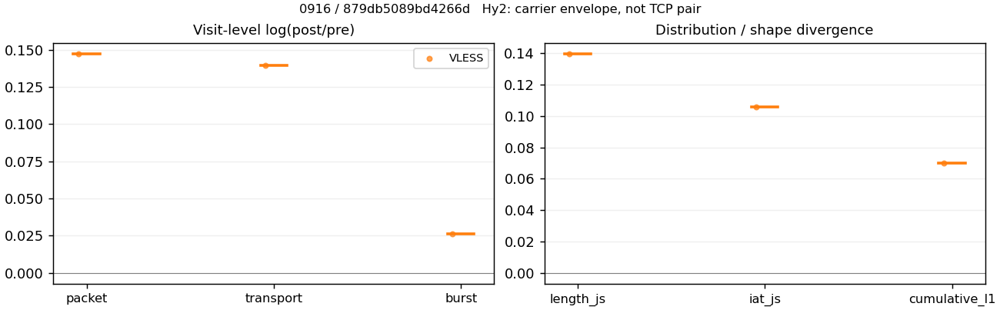
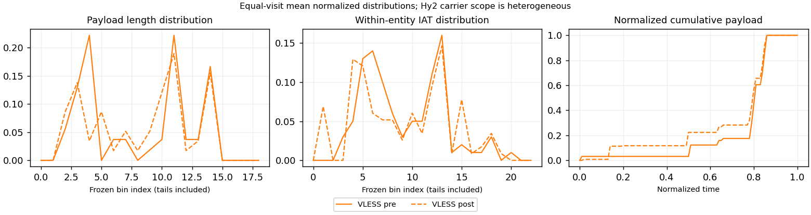

# 0916 · 条目 031 · bilibili.com

目标：https://www.bilibili.com/video/BV1HEf2YWEvs/

活动标签：bilibili.com::video_playback。选定访问 15 次。

[返回总索引](../../README.md) · [统计口径](../../methods.md)

## 覆盖与资格（每次访问均保留）

| 部署 | 重复 | 主请求路由 | 活动状态 | 代理比较 | DIRECT pre | 请求 proxy/direct/unresolved | 错误 |
| --- | --- | --- | --- | --- | --- | --- | --- |
| Hy2 | 1 | direct | passed | 0 | 1 | 0/289/0 | [] |
| Hy2 | 2 | direct | passed | 0 | 1 | 0/277/0 | [] |
| Hy2 | 3 | direct | passed | 0 | 1 | 0/308/0 | [] |
| Hy2 | 4 | direct | passed | 0 | 1 | 0/292/0 | [] |
| Hy2 | 5 | direct | passed | 0 | 1 | 0/281/0 | [] |
| SS | 1 | direct | passed | 0 | 1 | 0/309/0 | [] |
| SS | 2 | direct | passed | 0 | 1 | 0/269/0 | [] |
| SS | 3 | direct | passed | 0 | 1 | 0/276/0 | [] |
| SS | 4 | direct | passed | 0 | 1 | 0/319/1 | [] |
| SS | 5 | direct | passed | 0 | 1 | 0/323/0 | [] |
| VLESS | 1 | direct | passed | 1 | 1 | 11/303/0 | [] |
| VLESS | 2 | direct | passed | 0 | 1 | 0/282/0 | [] |
| VLESS | 3 | direct | passed | 0 | 1 | 0/274/0 | [] |
| VLESS | 4 | direct | passed | 0 | 1 | 0/292/0 | [] |
| VLESS | 5 | direct | passed | 0 | 1 | 0/278/0 | [] |

主请求非 proxy 的统计仅解释为已索引的辅助代理连接或 DIRECT 观测，不代表目标业务经代理传输。播放确认与配对资格是两道不同的门。

图中散点为单次访问，短线为重复中位数；Hy2 是共享载体包络，不能与 TCP 配对作等范围因果对比。

形态图先逐访问归一化，再对访问等权平均；实线 pre，虚线 post。分箱序号及边界见 methods，不将分箱索引误解为长度或时间。

## 每次访问的关键观测

### SS

范围：`direct_pre_only`。每格 pre → post；空值为不可观测/不适用。

| 重复 | 包数 | 载荷字节 | burst | TCP FR | IAT中位µs | length JS | IAT JS |
| --- | --- | --- | --- | --- | --- | --- | --- |
| 1 | 4846 → — | 1.012e+07 → — | 2919 → — | 594 → — | 94.211 → — | — | — |
| 2 | 3191 → — | 5.4071e+06 → — | 2157 → — | 404 → — | 76.912 → — | — | — |
| 3 | 4207 → — | 9.2075e+06 → — | 2710 → — | 344 → — | 65.068 → — | — | — |
| 4 | 4333 → — | 9.3923e+06 → — | 2858 → — | 459 → — | 58.826 → — | — | — |
| 5 | 4839 → — | 1.0527e+07 → — | 3148 → — | 487 → — | 56.734 → — | — | — |

完整标量统计：中位数 [min,max]；Δ 为重复内逐访问变换的中位数，MAD 未缩放。n 为可用变换数；DIRECT-only 的 nΔ=0 不代表 pre 不可用。

| scope | 特征 | pre | post | Δ | IQRΔ | MADΔ | nΔ |
| --- | --- | --- | --- | --- | --- | --- | --- |
| direct_pre_only | active_span_sum_s_1000ms | 33.286 [18.562, 54.334] | — | — | — | — | 0 |
| direct_pre_only | active_span_sum_s_100ms | 10.2 [7.3275, 15.879] | — | — | — | — | 0 |
| direct_pre_only | active_span_sum_s_500ms | 21.919 [14.46, 29.133] | — | — | — | — | 0 |
| direct_pre_only | burst_bytes_iqr | 4157 [2248, 5572.2] | — | — | — | — | 0 |
| direct_pre_only | burst_bytes_mad | 35 [32, 91] | — | — | — | — | 0 |
| direct_pre_only | burst_bytes_max | 27944 [20480, 28613] | — | — | — | — | 0 |
| direct_pre_only | burst_bytes_mean | 3344.1 [2506.8, 3467.1] | — | — | — | — | 0 |
| direct_pre_only | burst_bytes_median | 35 [32, 91] | — | — | — | — | 0 |
| direct_pre_only | burst_bytes_min | 0 [0, 0] | — | — | — | — | 0 |
| direct_pre_only | burst_bytes_p95 | 19286 [16105, 20480] | — | — | — | — | 0 |
| direct_pre_only | burst_bytes_q25 | 0 [0, 0] | — | — | — | — | 0 |
| direct_pre_only | burst_bytes_q75 | 4157 [2248, 5572.2] | — | — | — | — | 0 |
| direct_pre_only | burst_bytes_std | 5638.7 [5036.1, 6058.1] | — | — | — | — | 0 |
| direct_pre_only | burst_count | 2858 [2157, 3148] | — | — | — | — | 0 |
| direct_pre_only | burst_duration_ms_iqr | 0.068421 [0.048253, 0.65737] | — | — | — | — | 0 |
| direct_pre_only | burst_duration_ms_mad | 0 [0, 0] | — | — | — | — | 0 |
| direct_pre_only | burst_duration_ms_max | 15000 [14828, 15001] | — | — | — | — | 0 |
| direct_pre_only | burst_duration_ms_mean | 112.71 [88.279, 131.28] | — | — | — | — | 0 |
| direct_pre_only | burst_duration_ms_median | 0 [0, 0] | — | — | — | — | 0 |
| direct_pre_only | burst_duration_ms_min | 0 [0, 0] | — | — | — | — | 0 |
| direct_pre_only | burst_duration_ms_p95 | 62.974 [30.034, 73.066] | — | — | — | — | 0 |
| direct_pre_only | burst_duration_ms_q25 | 0 [0, 0] | — | — | — | — | 0 |
| direct_pre_only | burst_duration_ms_q75 | 0.068421 [0.048253, 0.65737] | — | — | — | — | 0 |
| direct_pre_only | burst_duration_ms_std | 981.81 [733.01, 1131.3] | — | — | — | — | 0 |
| direct_pre_only | burst_packets_iqr | 1 [1, 1] | — | — | — | — | 0 |
| direct_pre_only | burst_packets_mad | 0 [0, 0] | — | — | — | — | 0 |
| direct_pre_only | burst_packets_max | 8 [7, 10] | — | — | — | — | 0 |
| direct_pre_only | burst_packets_mean | 1.5372 [1.4794, 1.6602] | — | — | — | — | 0 |
| direct_pre_only | burst_packets_median | 1 [1, 1] | — | — | — | — | 0 |
| direct_pre_only | burst_packets_min | 1 [1, 1] | — | — | — | — | 0 |
| direct_pre_only | burst_packets_p95 | 3 [3, 3] | — | — | — | — | 0 |
| direct_pre_only | burst_packets_q25 | 1 [1, 1] | — | — | — | — | 0 |
| direct_pre_only | burst_packets_q75 | 2 [2, 2] | — | — | — | — | 0 |
| direct_pre_only | burst_packets_std | 0.87188 [0.83512, 0.93004] | — | — | — | — | 0 |
| direct_pre_only | connection_span_concurrency_max | 22 [15, 28] | — | — | — | — | 0 |
| direct_pre_only | direction_entropy | 0.69095 [0.55919, 0.76268] | — | — | — | — | 0 |
| direct_pre_only | down_burst_count | 1415 [1062, 1556] | — | — | — | — | 0 |
| direct_pre_only | down_ip_bytes | 9.2429e+06 [5.2609e+06, 1.0378e+07] | — | — | — | — | 0 |
| direct_pre_only | down_packets | 2618 [1840, 2973] | — | — | — | — | 0 |
| direct_pre_only | down_transport_bytes | 9.1096e+06 [5.165e+06, 1.0226e+07] | — | — | — | — | 0 |
| direct_pre_only | duration_s | 64.141 [62.089, 89.38] | — | — | — | — | 0 |
| direct_pre_only | entity_count | 33 [23, 49] | — | — | — | — | 0 |
| direct_pre_only | fr_runs | 459 [344, 594] | — | — | — | — | 0 |
| direct_pre_only | fr_runs_per_packet | 0.18007 [0.13618, 0.23475] | — | — | — | — | 0 |
| direct_pre_only | fr_switches | 431 [321, 545] | — | — | — | — | 0 |
| direct_pre_only | fr_switches_per_possible_transition | 0.17096 [0.12825, 0.21979] | — | — | — | — | 0 |
| direct_pre_only | full_retransmission_fraction | 0.0010318 [0, 0.0028932] | — | — | — | — | 0 |
| direct_pre_only | full_retransmission_packets | 5 [0, 14] | — | — | — | — | 0 |
| direct_pre_only | iat_count | 4305 [3158, 4803] | — | — | — | — | 0 |
| direct_pre_only | iat_median_us | 65.068 [56.734, 94.211] | — | — | — | — | 0 |
| direct_pre_only | iat_us_iqr | 591.95 [438.78, 895.01] | — | — | — | — | 0 |
| direct_pre_only | iat_us_mad | 57.501 [49.464, 85.128] | — | — | — | — | 0 |
| direct_pre_only | iat_us_max | 1.5001e+07 [1.5001e+07, 1.5002e+07] | — | — | — | — | 0 |
| direct_pre_only | iat_us_mean | 2.6993e+05 [82929, 3.8879e+05] | — | — | — | — | 0 |
| direct_pre_only | iat_us_median | 65.068 [56.734, 94.211] | — | — | — | — | 0 |
| direct_pre_only | iat_us_min | 0.062 [0.007, 0.205] | — | — | — | — | 0 |
| direct_pre_only | iat_us_p95 | 41463 [34265, 96246] | — | — | — | — | 0 |
| direct_pre_only | iat_us_q25 | 16.665 [13.646, 19.837] | — | — | — | — | 0 |
| direct_pre_only | iat_us_q75 | 609.71 [452.77, 914.85] | — | — | — | — | 0 |
| direct_pre_only | iat_us_std | 1.8409e+06 [7.9974e+05, 2.1805e+06] | — | — | — | — | 0 |
| direct_pre_only | idle_gap_count_1000ms | 113 [60, 121] | — | — | — | — | 0 |
| direct_pre_only | idle_gap_count_100ms | 157 [134, 205] | — | — | — | — | 0 |
| direct_pre_only | idle_gap_count_500ms | 125 [83, 149] | — | — | — | — | 0 |
| direct_pre_only | idle_gap_sum_s_1000ms | 1207.3 [317.51, 1393] | — | — | — | — | 0 |
| direct_pre_only | idle_gap_sum_s_100ms | 1218.4 [345.75, 1416.1] | — | — | — | — | 0 |
| direct_pre_only | idle_gap_sum_s_500ms | 1211.8 [335.09, 1402.9] | — | — | — | — | 0 |
| direct_pre_only | ip_bytes | 9.6182e+06 [5.5735e+06, 1.078e+07] | — | — | — | — | 0 |
| direct_pre_only | length_iqr | 4943.5 [4415, 6349.5] | — | — | — | — | 0 |
| direct_pre_only | length_mad | 2215 [2047, 2524] | — | — | — | — | 0 |
| direct_pre_only | length_max | 8948 [8948, 8948] | — | — | — | — | 0 |
| direct_pre_only | length_mean | 3645.1 [3141.8, 3755.7] | — | — | — | — | 0 |
| direct_pre_only | length_median | 2824 [2521, 2880] | — | — | — | — | 0 |
| direct_pre_only | length_min | 7 [2, 31] | — | — | — | — | 0 |
| direct_pre_only | length_p95 | 8920 [8920, 8920] | — | — | — | — | 0 |
| direct_pre_only | length_q25 | 710.5 [547, 1345] | — | — | — | — | 0 |
| direct_pre_only | length_q75 | 5760 [5119, 7060] | — | — | — | — | 0 |
| direct_pre_only | length_std | 3114.7 [2872.9, 3281.9] | — | — | — | — | 0 |
| direct_pre_only | nonempty_entity_count | 33 [23, 49] | — | — | — | — | 0 |
| direct_pre_only | nonempty_packets | 2549 [1721, 2832] | — | — | — | — | 0 |
| direct_pre_only | offload_suspect_fraction | 0.37611 [0.3162, 0.42833] | — | — | — | — | 0 |
| direct_pre_only | packet_count | 4333 [3191, 4846] | — | — | — | — | 0 |
| direct_pre_only | rtt_median_ms | 0.075424 [0.070176, 0.11187] | — | — | — | — | 0 |
| direct_pre_only | rtt_sample_count | 1713 [1267, 1808] | — | — | — | — | 0 |
| direct_pre_only | tcp_ack_count | 4302 [3154, 4803] | — | — | — | — | 0 |
| direct_pre_only | tcp_fin_count | 64 [44, 97] | — | — | — | — | 0 |
| direct_pre_only | tcp_packet_count | 4333 [3191, 4846] | — | — | — | — | 0 |
| direct_pre_only | tcp_rst_count | 2 [0, 4] | — | — | — | — | 0 |
| direct_pre_only | tcp_syn_count | 66 [46, 98] | — | — | — | — | 0 |
| direct_pre_only | tcp_window_raw_median | 65535 [65535, 65535] | — | — | — | — | 0 |
| direct_pre_only | transition_entropy | 0.56491 [0.44626, 0.65593] | — | — | — | — | 0 |
| direct_pre_only | transition_n_mm | 2012 [1139, 2054] | — | — | — | — | 0 |
| direct_pre_only | transition_n_mp | 203 [151, 249] | — | — | — | — | 0 |
| direct_pre_only | transition_n_pm | 228 [170, 296] | — | — | — | — | 0 |
| direct_pre_only | transition_n_pp | 226 [156, 262] | — | — | — | — | 0 |
| direct_pre_only | transition_p_mm | 0.90107 [0.87013, 0.93064] | — | — | — | — | 0 |
| direct_pre_only | transition_p_mp | 0.098928 [0.069362, 0.12987] | — | — | — | — | 0 |
| direct_pre_only | transition_p_pm | 0.52147 [0.48016, 0.56705] | — | — | — | — | 0 |
| direct_pre_only | transition_p_pp | 0.47853 [0.43295, 0.51984] | — | — | — | — | 0 |
| direct_pre_only | transport_bytes | 9.3923e+06 [5.4071e+06, 1.0527e+07] | — | — | — | — | 0 |
| direct_pre_only | up_burst_count | 1443 [1095, 1592] | — | — | — | — | 0 |
| direct_pre_only | up_byte_fraction | 0.030093 [0.014389, 0.04477] | — | — | — | — | 0 |
| direct_pre_only | up_ip_bytes | 3.7528e+05 [2.153e+05, 4.3222e+05] | — | — | — | — | 0 |
| direct_pre_only | up_packets | 1775 [1351, 1923] | — | — | — | — | 0 |
| direct_pre_only | up_transport_bytes | 2.8264e+05 [1.3249e+05, 3.3438e+05] | — | — | — | — | 0 |
| direct_pre_only | zero_iat_count | 0 [0, 0] | — | — | — | — | 0 |
| direct_pre_only | zero_iat_fraction | 0 [0, 0] | — | — | — | — | 0 |

### VLESS

范围：`exclusive_page`。每格 pre → post；空值为不可观测/不适用。

| 重复 | 包数 | 载荷字节 | burst | TCP FR | IAT中位µs | length JS | IAT JS |
| --- | --- | --- | --- | --- | --- | --- | --- |
| 1 | 101 → 117 | 56081 → 64472 | 75 → 77 | 6 → 8 | 170.01 → 364.52 | 0.13959 | 0.10571 |
| 2 | — | — | — | — | — | — | — |
| 3 | — | — | — | — | — | — | — |
| 4 | — | — | — | — | — | — | — |
| 5 | — | — | — | — | — | — | — |

范围：`direct_pre_only`。每格 pre → post；空值为不可观测/不适用。

| 重复 | 包数 | 载荷字节 | burst | TCP FR | IAT中位µs | length JS | IAT JS |
| --- | --- | --- | --- | --- | --- | --- | --- |
| 1 | 4197 → — | 9.4931e+06 → — | 2761 → — | 471 → — | 59.561 → — | — | — |
| 2 | 4525 → — | 9.86e+06 → — | 2970 → — | 397 → — | 49.116 → — | — | — |
| 3 | 3966 → — | 8.7697e+06 → — | 2484 → — | 395 → — | 56.585 → — | — | — |
| 4 | 4031 → — | 9.5111e+06 → — | 2591 → — | 478 → — | 57.181 → — | — | — |
| 5 | 4035 → — | 8.7913e+06 → — | 2602 → — | 434 → — | 58.255 → — | — | — |

完整标量统计：中位数 [min,max]；Δ 为重复内逐访问变换的中位数，MAD 未缩放。n 为可用变换数；DIRECT-only 的 nΔ=0 不代表 pre 不可用。

| scope | 特征 | pre | post | Δ | IQRΔ | MADΔ | nΔ |
| --- | --- | --- | --- | --- | --- | --- | --- |
| direct_pre_only | active_span_sum_s_1000ms | 28.437 [22.429, 38.041] | — | — | — | — | 0 |
| direct_pre_only | active_span_sum_s_100ms | 10.355 [7.6338, 13.331] | — | — | — | — | 0 |
| direct_pre_only | active_span_sum_s_500ms | 20.35 [17.04, 26.168] | — | — | — | — | 0 |
| direct_pre_only | burst_bytes_iqr | 4284 [3368, 4982] | — | — | — | — | 0 |
| direct_pre_only | burst_bytes_mad | 80 [34, 92] | — | — | — | — | 0 |
| direct_pre_only | burst_bytes_max | 27539 [26680, 29400] | — | — | — | — | 0 |
| direct_pre_only | burst_bytes_mean | 3438.3 [3319.9, 3670.8] | — | — | — | — | 0 |
| direct_pre_only | burst_bytes_median | 80 [34, 92] | — | — | — | — | 0 |
| direct_pre_only | burst_bytes_min | 0 [0, 0] | — | — | — | — | 0 |
| direct_pre_only | burst_bytes_p95 | 20480 [18961, 20480] | — | — | — | — | 0 |
| direct_pre_only | burst_bytes_q25 | 0 [0, 0] | — | — | — | — | 0 |
| direct_pre_only | burst_bytes_q75 | 4284 [3368, 4982] | — | — | — | — | 0 |
| direct_pre_only | burst_bytes_std | 6015.2 [5687.2, 6253.8] | — | — | — | — | 0 |
| direct_pre_only | burst_count | 2602 [2484, 2970] | — | — | — | — | 0 |
| direct_pre_only | burst_duration_ms_iqr | 0.061178 [0.045798, 0.067837] | — | — | — | — | 0 |
| direct_pre_only | burst_duration_ms_mad | 0 [0, 0] | — | — | — | — | 0 |
| direct_pre_only | burst_duration_ms_max | 15000 [14803, 15001] | — | — | — | — | 0 |
| direct_pre_only | burst_duration_ms_mean | 76.273 [64.484, 100.85] | — | — | — | — | 0 |
| direct_pre_only | burst_duration_ms_median | 0 [0, 0] | — | — | — | — | 0 |
| direct_pre_only | burst_duration_ms_min | 0 [0, 0] | — | — | — | — | 0 |
| direct_pre_only | burst_duration_ms_p95 | 63.327 [27.831, 70.528] | — | — | — | — | 0 |
| direct_pre_only | burst_duration_ms_q25 | 0 [0, 0] | — | — | — | — | 0 |
| direct_pre_only | burst_duration_ms_q75 | 0.061178 [0.045798, 0.067837] | — | — | — | — | 0 |
| direct_pre_only | burst_duration_ms_std | 732.03 [624.73, 926.19] | — | — | — | — | 0 |
| direct_pre_only | burst_packets_iqr | 1 [1, 1] | — | — | — | — | 0 |
| direct_pre_only | burst_packets_mad | 0 [0, 0] | — | — | — | — | 0 |
| direct_pre_only | burst_packets_max | 8 [7, 10] | — | — | — | — | 0 |
| direct_pre_only | burst_packets_mean | 1.5507 [1.5201, 1.5966] | — | — | — | — | 0 |
| direct_pre_only | burst_packets_median | 1 [1, 1] | — | — | — | — | 0 |
| direct_pre_only | burst_packets_min | 1 [1, 1] | — | — | — | — | 0 |
| direct_pre_only | burst_packets_p95 | 3 [3, 4] | — | — | — | — | 0 |
| direct_pre_only | burst_packets_q25 | 1 [1, 1] | — | — | — | — | 0 |
| direct_pre_only | burst_packets_q75 | 2 [2, 2] | — | — | — | — | 0 |
| direct_pre_only | burst_packets_std | 0.90789 [0.8577, 0.99147] | — | — | — | — | 0 |
| direct_pre_only | connection_span_concurrency_max | 19 [16, 25] | — | — | — | — | 0 |
| direct_pre_only | direction_entropy | 0.67915 [0.6436, 0.6922] | — | — | — | — | 0 |
| direct_pre_only | down_burst_count | 1284 [1227, 1472] | — | — | — | — | 0 |
| direct_pre_only | down_ip_bytes | 9.3373e+06 [8.6564e+06, 9.7652e+06] | — | — | — | — | 0 |
| direct_pre_only | down_packets | 2437 [2426, 2726] | — | — | — | — | 0 |
| direct_pre_only | down_transport_bytes | 9.2074e+06 [8.5295e+06, 9.6232e+06] | — | — | — | — | 0 |
| direct_pre_only | duration_s | 63.9 [62.021, 64.349] | — | — | — | — | 0 |
| direct_pre_only | entity_count | 33 [26, 35] | — | — | — | — | 0 |
| direct_pre_only | fr_runs | 434 [395, 478] | — | — | — | — | 0 |
| direct_pre_only | fr_runs_per_packet | 0.18894 [0.14891, 0.20349] | — | — | — | — | 0 |
| direct_pre_only | fr_switches | 400 [365, 443] | — | — | — | — | 0 |
| direct_pre_only | fr_switches_per_possible_transition | 0.17676 [0.14053, 0.19144] | — | — | — | — | 0 |
| direct_pre_only | full_retransmission_fraction | 0.0033149 [0.001765, 0.0047135] | — | — | — | — | 0 |
| direct_pre_only | full_retransmission_packets | 15 [7, 19] | — | — | — | — | 0 |
| direct_pre_only | iat_count | 4001 [3936, 4499] | — | — | — | — | 0 |
| direct_pre_only | iat_median_us | 57.181 [49.116, 59.561] | — | — | — | — | 0 |
| direct_pre_only | iat_us_iqr | 378.29 [222.85, 457.94] | — | — | — | — | 0 |
| direct_pre_only | iat_us_mad | 50.176 [41.773, 52.703] | — | — | — | — | 0 |
| direct_pre_only | iat_us_max | 1.5001e+07 [1.5001e+07, 1.5002e+07] | — | — | — | — | 0 |
| direct_pre_only | iat_us_mean | 1.9891e+05 [1.2326e+05, 3.3252e+05] | — | — | — | — | 0 |
| direct_pre_only | iat_us_median | 57.181 [49.116, 59.561] | — | — | — | — | 0 |
| direct_pre_only | iat_us_min | 0.091 [0.052, 0.306] | — | — | — | — | 0 |
| direct_pre_only | iat_us_p95 | 41925 [39121, 83981] | — | — | — | — | 0 |
| direct_pre_only | iat_us_q25 | 13.532 [13.18, 16.363] | — | — | — | — | 0 |
| direct_pre_only | iat_us_q75 | 391.83 [236.78, 471.12] | — | — | — | — | 0 |
| direct_pre_only | iat_us_std | 1.5237e+06 [1.124e+06, 2.0101e+06] | — | — | — | — | 0 |
| direct_pre_only | idle_gap_count_1000ms | 101 [68, 151] | — | — | — | — | 0 |
| direct_pre_only | idle_gap_count_100ms | 152 [138, 187] | — | — | — | — | 0 |
| direct_pre_only | idle_gap_count_500ms | 111 [85, 158] | — | — | — | — | 0 |
| direct_pre_only | idle_gap_sum_s_1000ms | 866.46 [457.81, 1308] | — | — | — | — | 0 |
| direct_pre_only | idle_gap_sum_s_100ms | 887.26 [482.2, 1319.5] | — | — | — | — | 0 |
| direct_pre_only | idle_gap_sum_s_500ms | 874.55 [469.3, 1313.4] | — | — | — | — | 0 |
| direct_pre_only | ip_bytes | 9.7121e+06 [8.9764e+06, 1.0096e+07] | — | — | — | — | 0 |
| direct_pre_only | length_iqr | 6279 [4769.5, 7371] | — | — | — | — | 0 |
| direct_pre_only | length_mad | 2456 [2274, 2482] | — | — | — | — | 0 |
| direct_pre_only | length_max | 8948 [8948, 8948] | — | — | — | — | 0 |
| direct_pre_only | length_mean | 3827.3 [3698.4, 4049] | — | — | — | — | 0 |
| direct_pre_only | length_median | 2856 [2824, 2880] | — | — | — | — | 0 |
| direct_pre_only | length_min | 12 [2, 31] | — | — | — | — | 0 |
| direct_pre_only | length_p95 | 8920 [8920, 8920] | — | — | — | — | 0 |
| direct_pre_only | length_q25 | 781 [621.25, 942.5] | — | — | — | — | 0 |
| direct_pre_only | length_q75 | 7060 [5712, 8192] | — | — | — | — | 0 |
| direct_pre_only | length_std | 3244.2 [3055.7, 3329] | — | — | — | — | 0 |
| direct_pre_only | nonempty_entity_count | 33 [26, 35] | — | — | — | — | 0 |
| direct_pre_only | nonempty_packets | 2350 [2297, 2666] | — | — | — | — | 0 |
| direct_pre_only | offload_suspect_fraction | 0.39738 [0.38488, 0.40884] | — | — | — | — | 0 |
| direct_pre_only | packet_count | 4035 [3966, 4525] | — | — | — | — | 0 |
| direct_pre_only | rtt_median_ms | 0.071717 [0.060995, 0.078015] | — | — | — | — | 0 |
| direct_pre_only | rtt_sample_count | 1577 [1448, 1701] | — | — | — | — | 0 |
| direct_pre_only | tcp_ack_count | 3997 [3933, 4499] | — | — | — | — | 0 |
| direct_pre_only | tcp_fin_count | 65 [52, 68] | — | — | — | — | 0 |
| direct_pre_only | tcp_packet_count | 4035 [3966, 4525] | — | — | — | — | 0 |
| direct_pre_only | tcp_rst_count | 3 [0, 4] | — | — | — | — | 0 |
| direct_pre_only | tcp_syn_count | 66 [52, 70] | — | — | — | — | 0 |
| direct_pre_only | tcp_window_raw_median | 65535 [65535, 65535] | — | — | — | — | 0 |
| direct_pre_only | transition_entropy | 0.56134 [0.49613, 0.59009] | — | — | — | — | 0 |
| direct_pre_only | transition_n_mm | 1732 [1673, 2032] | — | — | — | — | 0 |
| direct_pre_only | transition_n_mp | 184 [169, 205] | — | — | — | — | 0 |
| direct_pre_only | transition_n_pm | 216 [196, 238] | — | — | — | — | 0 |
| direct_pre_only | transition_n_pp | 209 [190, 237] | — | — | — | — | 0 |
| direct_pre_only | transition_p_mm | 0.90092 [0.89096, 0.92112] | — | — | — | — | 0 |
| direct_pre_only | transition_p_mp | 0.099085 [0.078876, 0.10904] | — | — | — | — | 0 |
| direct_pre_only | transition_p_pm | 0.52822 [0.45392, 0.54839] | — | — | — | — | 0 |
| direct_pre_only | transition_p_pp | 0.47178 [0.45161, 0.54608] | — | — | — | — | 0 |
| direct_pre_only | transport_bytes | 9.4931e+06 [8.7697e+06, 9.86e+06] | — | — | — | — | 0 |
| direct_pre_only | up_burst_count | 1318 [1257, 1498] | — | — | — | — | 0 |
| direct_pre_only | up_byte_fraction | 0.029533 [0.024014, 0.030134] | — | — | — | — | 0 |
| direct_pre_only | up_ip_bytes | 3.4309e+05 [3.2004e+05, 3.7472e+05] | — | — | — | — | 0 |
| direct_pre_only | up_packets | 1605 [1530, 1799] | — | — | — | — | 0 |
| direct_pre_only | up_transport_bytes | 2.5964e+05 [2.3678e+05, 2.8661e+05] | — | — | — | — | 0 |
| direct_pre_only | zero_iat_count | 0 [0, 0] | — | — | — | — | 0 |
| direct_pre_only | zero_iat_fraction | 0 [0, 0] | — | — | — | — | 0 |
| exclusive_page | active_span_sum_s_1000ms | 1.5089 [1.5089, 1.5089] | 2.9833 [2.9833, 2.9833] | 0.68164 | — | — | 1 |
| exclusive_page | active_span_sum_s_100ms | 0.30068 [0.30068, 0.30068] | 0.62799 [0.62799, 0.62799] | 0.73648 | — | — | 1 |
| exclusive_page | active_span_sum_s_500ms | 1.5089 [1.5089, 1.5089] | 2.1391 [2.1391, 2.1391] | 0.34899 | — | — | 1 |
| exclusive_page | burst_bytes_iqr | 1440 [1440, 1440] | 1476 [1476, 1476] | 0.024693 | — | — | 1 |
| exclusive_page | burst_bytes_mad | 24 [24, 24] | 56 [56, 56] | 0.8473 | — | — | 1 |
| exclusive_page | burst_bytes_max | 4300 [4300, 4300] | 2880 [2880, 2880] | -0.40082 | — | — | 1 |
| exclusive_page | burst_bytes_mean | 747.75 [747.75, 747.75] | 837.3 [837.3, 837.3] | 0.11312 | — | — | 1 |
| exclusive_page | burst_bytes_median | 24 [24, 24] | 56 [56, 56] | 0.8473 | — | — | 1 |
| exclusive_page | burst_bytes_min | 0 [0, 0] | 0 [0, 0] | — | — | — | 0 |
| exclusive_page | burst_bytes_p95 | 3684.1 [3684.1, 3684.1] | 2824 [2824, 2824] | -0.26587 | — | — | 1 |
| exclusive_page | burst_bytes_q25 | 0 [0, 0] | 0 [0, 0] | — | — | — | 0 |
| exclusive_page | burst_bytes_q75 | 1440 [1440, 1440] | 1476 [1476, 1476] | 0.024693 | — | — | 1 |
| exclusive_page | burst_bytes_std | 1229.7 [1229.7, 1229.7] | 1030.6 [1030.6, 1030.6] | -0.17666 | — | — | 1 |
| exclusive_page | burst_count | 75 [75, 75] | 77 [77, 77] | 0.026317 | — | — | 1 |
| exclusive_page | burst_duration_ms_iqr | 0.066117 [0.066117, 0.066117] | 0.006094 [0.006094, 0.006094] | -2.3841 | — | — | 1 |
| exclusive_page | burst_duration_ms_mad | 0 [0, 0] | 0 [0, 0] | — | — | — | 0 |
| exclusive_page | burst_duration_ms_max | 1515.5 [1515.5, 1515.5] | 359.99 [359.99, 359.99] | -1.4375 | — | — | 1 |
| exclusive_page | burst_duration_ms_mean | 37.331 [37.331, 37.331] | 20.262 [20.262, 20.262] | -0.61108 | — | — | 1 |
| exclusive_page | burst_duration_ms_median | 0 [0, 0] | 0 [0, 0] | — | — | — | 0 |
| exclusive_page | burst_duration_ms_min | 0 [0, 0] | 0 [0, 0] | — | — | — | 0 |
| exclusive_page | burst_duration_ms_p95 | 206.53 [206.53, 206.53] | 170.9 [170.9, 170.9] | -0.18938 | — | — | 1 |
| exclusive_page | burst_duration_ms_q25 | 0 [0, 0] | 0 [0, 0] | — | — | — | 0 |
| exclusive_page | burst_duration_ms_q75 | 0.066117 [0.066117, 0.066117] | 0.006094 [0.006094, 0.006094] | -2.3841 | — | — | 1 |
| exclusive_page | burst_duration_ms_std | 186.05 [186.05, 186.05] | 72.595 [72.595, 72.595] | -0.94111 | — | — | 1 |
| exclusive_page | burst_packets_iqr | 1 [1, 1] | 1 [1, 1] | 0 | — | — | 1 |
| exclusive_page | burst_packets_mad | 0 [0, 0] | 0 [0, 0] | — | — | — | 0 |
| exclusive_page | burst_packets_max | 4 [4, 4] | 6 [6, 6] | 0.40547 | — | — | 1 |
| exclusive_page | burst_packets_mean | 1.3467 [1.3467, 1.3467] | 1.5195 [1.5195, 1.5195] | 0.12074 | — | — | 1 |
| exclusive_page | burst_packets_median | 1 [1, 1] | 1 [1, 1] | 0 | — | — | 1 |
| exclusive_page | burst_packets_min | 1 [1, 1] | 1 [1, 1] | 0 | — | — | 1 |
| exclusive_page | burst_packets_p95 | 2.3 [2.3, 2.3] | 4 [4, 4] | 0.55339 | — | — | 1 |
| exclusive_page | burst_packets_q25 | 1 [1, 1] | 1 [1, 1] | 0 | — | — | 1 |
| exclusive_page | burst_packets_q75 | 2 [2, 2] | 2 [2, 2] | 0 | — | — | 1 |
| exclusive_page | burst_packets_std | 0.66319 [0.66319, 0.66319] | 1.0143 [1.0143, 1.0143] | 0.42491 | — | — | 1 |
| exclusive_page | connection_span_concurrency_max | 1 [1, 1] | 1 [1, 1] | 0 | — | — | 1 |
| exclusive_page | cumulative_l1 | — | — | 0.069873 | — | — | 1 |
| exclusive_page | cumulative_max | — | — | 0.19216 | — | — | 1 |
| exclusive_page | direction_entropy | 0.85241 [0.85241, 0.85241] | 0.73551 [0.73551, 0.73551] | -0.1169 | — | — | 1 |
| exclusive_page | down_burst_count | 37 [37, 37] | 38 [38, 38] | 0.026668 | — | — | 1 |
| exclusive_page | down_ip_bytes | 55587 [55587, 55587] | 62737 [62737, 62737] | 0.121 | — | — | 1 |
| exclusive_page | down_packets | 54 [54, 54] | 61 [61, 61] | 0.12189 | — | — | 1 |
| exclusive_page | down_transport_bytes | 52771 [52771, 52771] | 59557 [59557, 59557] | 0.12097 | — | — | 1 |
| exclusive_page | duration_s | 3.0245 [3.0245, 3.0245] | 2.9833 [2.9833, 2.9833] | -0.013705 | — | — | 1 |
| exclusive_page | entity_count | 1 [1, 1] | 1 [1, 1] | 0 | — | — | 1 |
| exclusive_page | fr_runs | 6 [6, 6] | 8 [8, 8] | 0.28768 | — | — | 1 |
| exclusive_page | fr_runs_per_packet | 0.11111 [0.11111, 0.11111] | 0.13793 [0.13793, 0.13793] | 0.02682 | — | — | 1 |
| exclusive_page | fr_switches | 5 [5, 5] | 7 [7, 7] | 0.33647 | — | — | 1 |
| exclusive_page | fr_switches_per_possible_transition | 0.09434 [0.09434, 0.09434] | 0.12281 [0.12281, 0.12281] | 0.028467 | — | — | 1 |
| exclusive_page | full_retransmission_fraction | 0 [0, 0] | 0 [0, 0] | 0 | — | — | 1 |
| exclusive_page | full_retransmission_packets | 0 [0, 0] | 0 [0, 0] | — | — | — | 0 |
| exclusive_page | iat_count | 100 [100, 100] | 116 [116, 116] | 0.14842 | — | — | 1 |
| exclusive_page | iat_js | — | — | 0.10571 | — | — | 1 |
| exclusive_page | iat_ks | — | — | 0.11828 | — | — | 1 |
| exclusive_page | iat_median_us | 170.01 [170.01, 170.01] | 364.52 [364.52, 364.52] | 0.76271 | — | — | 1 |
| exclusive_page | iat_us_iqr | 4948.7 [4948.7, 4948.7] | 5596.9 [5596.9, 5596.9] | 0.12308 | — | — | 1 |
| exclusive_page | iat_us_mad | 164.22 [164.22, 164.22] | 364.29 [364.29, 364.29] | 0.7967 | — | — | 1 |
| exclusive_page | iat_us_max | 1.5155e+06 [1.5155e+06, 1.5155e+06] | 8.4421e+05 [8.4421e+05, 8.4421e+05] | -0.58513 | — | — | 1 |
| exclusive_page | iat_us_mean | 30245 [30245, 30245] | 25718 [25718, 25718] | -0.16212 | — | — | 1 |
| exclusive_page | iat_us_median | 170.01 [170.01, 170.01] | 364.52 [364.52, 364.52] | 0.76271 | — | — | 1 |
| exclusive_page | iat_us_min | 3.246 [3.246, 3.246] | 0.061 [0.061, 0.061] | -3.9743 | — | — | 1 |
| exclusive_page | iat_us_p95 | 58967 [58967, 58967] | 1.2285e+05 [1.2285e+05, 1.2285e+05] | 0.73397 | — | — | 1 |
| exclusive_page | iat_us_q25 | 36.514 [36.514, 36.514] | 15.608 [15.608, 15.608] | -0.84989 | — | — | 1 |
| exclusive_page | iat_us_q75 | 4985.2 [4985.2, 4985.2] | 5612.5 [5612.5, 5612.5] | 0.11851 | — | — | 1 |
| exclusive_page | iat_us_std | 1.6152e+05 [1.6152e+05, 1.6152e+05] | 96976 [96976, 96976] | -0.51016 | — | — | 1 |
| exclusive_page | iat_wasserstein_log1p_us | — | — | 0.59309 | — | — | 1 |
| exclusive_page | idle_gap_count_1000ms | 1 [1, 1] | 0 [0, 0] | — | — | — | 0 |
| exclusive_page | idle_gap_count_100ms | 5 [5, 5] | 7 [7, 7] | 0.33647 | — | — | 1 |
| exclusive_page | idle_gap_count_500ms | 1 [1, 1] | 1 [1, 1] | 0 | — | — | 1 |
| exclusive_page | idle_gap_sum_s_1000ms | 1.5155 [1.5155, 1.5155] | 0 [0, 0] | — | — | — | 0 |
| exclusive_page | idle_gap_sum_s_100ms | 2.7238 [2.7238, 2.7238] | 2.3553 [2.3553, 2.3553] | -0.14535 | — | — | 1 |
| exclusive_page | idle_gap_sum_s_500ms | 1.5155 [1.5155, 1.5155] | 0.84421 [0.84421, 0.84421] | -0.58513 | — | — | 1 |
| exclusive_page | ip_bytes | 61325 [61325, 61325] | 70620 [70620, 70620] | 0.14113 | — | — | 1 |
| exclusive_page | length_iqr | 1360.8 [1360.8, 1360.8] | 1325.8 [1325.8, 1325.8] | -0.026058 | — | — | 1 |
| exclusive_page | length_js | — | — | 0.13959 | — | — | 1 |
| exclusive_page | length_ks | — | — | 0.14879 | — | — | 1 |
| exclusive_page | length_mad | 1204 [1204, 1204] | 1080 [1080, 1080] | -0.10869 | — | — | 1 |
| exclusive_page | length_max | 2824 [2824, 2824] | 2824 [2824, 2824] | 0 | — | — | 1 |
| exclusive_page | length_mean | 1038.5 [1038.5, 1038.5] | 1111.6 [1111.6, 1111.6] | 0.067975 | — | — | 1 |
| exclusive_page | length_median | 1297.5 [1297.5, 1297.5] | 1391 [1391, 1391] | 0.069584 | — | — | 1 |
| exclusive_page | length_min | 24 [24, 24] | 20 [20, 20] | -0.18232 | — | — | 1 |
| exclusive_page | length_p95 | 2824 [2824, 2824] | 2824 [2824, 2824] | 0 | — | — | 1 |
| exclusive_page | length_q25 | 87.25 [87.25, 87.25] | 114.25 [114.25, 114.25] | 0.26961 | — | — | 1 |
| exclusive_page | length_q75 | 1448 [1448, 1448] | 1440 [1440, 1440] | -0.0055402 | — | — | 1 |
| exclusive_page | length_std | 981.27 [981.27, 981.27] | 941.49 [941.49, 941.49] | -0.041389 | — | — | 1 |
| exclusive_page | length_wasserstein_bytes | — | — | 100.32 | — | — | 1 |
| exclusive_page | nonempty_entity_count | 1 [1, 1] | 1 [1, 1] | 0 | — | — | 1 |
| exclusive_page | nonempty_packets | 54 [54, 54] | 58 [58, 58] | 0.071459 | — | — | 1 |
| exclusive_page | offload_suspect_fraction | 0.12871 [0.12871, 0.12871] | 0.10256 [0.10256, 0.10256] | -0.026149 | — | — | 1 |
| exclusive_page | packet_count | 101 [101, 101] | 117 [117, 117] | 0.14705 | — | — | 1 |
| exclusive_page | rtt_median_ms | 0.12784 [0.12784, 0.12784] | 0.037525 [0.037525, 0.037525] | -1.2258 | — | — | 1 |
| exclusive_page | rtt_sample_count | 42 [42, 42] | 54 [54, 54] | 0.25131 | — | — | 1 |
| exclusive_page | tcp_ack_count | 98 [98, 98] | 116 [116, 116] | 0.16862 | — | — | 1 |
| exclusive_page | tcp_fin_count | 2 [2, 2] | 2 [2, 2] | 0 | — | — | 1 |
| exclusive_page | tcp_packet_count | 101 [101, 101] | 117 [117, 117] | 0.14705 | — | — | 1 |
| exclusive_page | tcp_rst_count | 2 [2, 2] | 0 [0, 0] | — | — | — | 0 |
| exclusive_page | tcp_syn_count | 2 [2, 2] | 2 [2, 2] | 0 | — | — | 1 |
| exclusive_page | tcp_window_raw_median | 65379 [65379, 65379] | 141 [141, 141] | -6.1392 | — | — | 1 |
| exclusive_page | transition_entropy | 0.4176 [0.4176, 0.4176] | 0.47229 [0.47229, 0.47229] | 0.054692 | — | — | 1 |
| exclusive_page | transition_n_mm | 36 [36, 36] | 42 [42, 42] | 0.15415 | — | — | 1 |
| exclusive_page | transition_n_mp | 2 [2, 2] | 3 [3, 3] | 0.40547 | — | — | 1 |
| exclusive_page | transition_n_pm | 3 [3, 3] | 4 [4, 4] | 0.28768 | — | — | 1 |
| exclusive_page | transition_n_pp | 12 [12, 12] | 8 [8, 8] | -0.40547 | — | — | 1 |
| exclusive_page | transition_p_mm | 0.94737 [0.94737, 0.94737] | 0.93333 [0.93333, 0.93333] | -0.014035 | — | — | 1 |
| exclusive_page | transition_p_mp | 0.052632 [0.052632, 0.052632] | 0.066667 [0.066667, 0.066667] | 0.014035 | — | — | 1 |
| exclusive_page | transition_p_pm | 0.2 [0.2, 0.2] | 0.33333 [0.33333, 0.33333] | 0.13333 | — | — | 1 |
| exclusive_page | transition_p_pp | 0.8 [0.8, 0.8] | 0.66667 [0.66667, 0.66667] | -0.13333 | — | — | 1 |
| exclusive_page | transport_bytes | 56081 [56081, 56081] | 64472 [64472, 64472] | 0.13943 | — | — | 1 |
| exclusive_page | up_burst_count | 38 [38, 38] | 39 [39, 39] | 0.025975 | — | — | 1 |
| exclusive_page | up_byte_fraction | 0.059022 [0.059022, 0.059022] | 0.076235 [0.076235, 0.076235] | 0.017213 | — | — | 1 |
| exclusive_page | up_ip_bytes | 5738 [5738, 5738] | 7883 [7883, 7883] | 0.3176 | — | — | 1 |
| exclusive_page | up_packets | 47 [47, 47] | 56 [56, 56] | 0.1752 | — | — | 1 |
| exclusive_page | up_transport_bytes | 3310 [3310, 3310] | 4915 [4915, 4915] | 0.39534 | — | — | 1 |
| exclusive_page | zero_iat_count | 0 [0, 0] | 0 [0, 0] | — | — | — | 0 |
| exclusive_page | zero_iat_fraction | 0 [0, 0] | 0 [0, 0] | 0 | — | — | 1 |

### Hy2

范围：`direct_pre_only`。每格 pre → post；空值为不可观测/不适用。

| 重复 | 包数 | 载荷字节 | burst | TCP FR | IAT中位µs | length JS | IAT JS |
| --- | --- | --- | --- | --- | --- | --- | --- |
| 1 | 3178 → — | 6.1022e+06 → — | 2101 → — | 387 → — | 90.792 → — | — | — |
| 2 | 3820 → — | 9.2694e+06 → — | 2443 → — | 361 → — | 55.711 → — | — | — |
| 3 | 4792 → — | 9.9975e+06 → — | 3129 → — | 432 → — | 51.088 → — | — | — |
| 4 | 3199 → — | 5.8531e+06 → — | 2080 → — | 400 → — | 81.028 → — | — | — |
| 5 | 4441 → — | 9.8309e+06 → — | 2847 → — | 397 → — | 52.348 → — | — | — |

完整标量统计：中位数 [min,max]；Δ 为重复内逐访问变换的中位数，MAD 未缩放。n 为可用变换数；DIRECT-only 的 nΔ=0 不代表 pre 不可用。

| scope | 特征 | pre | post | Δ | IQRΔ | MADΔ | nΔ |
| --- | --- | --- | --- | --- | --- | --- | --- |
| direct_pre_only | active_span_sum_s_1000ms | 26.525 [23.609, 33.332] | — | — | — | — | 0 |
| direct_pre_only | active_span_sum_s_100ms | 10.688 [9.0851, 11.497] | — | — | — | — | 0 |
| direct_pre_only | active_span_sum_s_500ms | 20.632 [16.559, 21.736] | — | — | — | — | 0 |
| direct_pre_only | burst_bytes_iqr | 4236 [1971, 5648] | — | — | — | — | 0 |
| direct_pre_only | burst_bytes_mad | 71 [31, 80] | — | — | — | — | 0 |
| direct_pre_only | burst_bytes_max | 26321 [23120, 29400] | — | — | — | — | 0 |
| direct_pre_only | burst_bytes_mean | 3195.1 [2814, 3794.3] | — | — | — | — | 0 |
| direct_pre_only | burst_bytes_median | 71 [31, 80] | — | — | — | — | 0 |
| direct_pre_only | burst_bytes_min | 0 [0, 0] | — | — | — | — | 0 |
| direct_pre_only | burst_bytes_p95 | 20480 [17840, 20480] | — | — | — | — | 0 |
| direct_pre_only | burst_bytes_q25 | 0 [0, 0] | — | — | — | — | 0 |
| direct_pre_only | burst_bytes_q75 | 4236 [1971, 5648] | — | — | — | — | 0 |
| direct_pre_only | burst_bytes_std | 5929.5 [5374.7, 6330] | — | — | — | — | 0 |
| direct_pre_only | burst_count | 2443 [2080, 3129] | — | — | — | — | 0 |
| direct_pre_only | burst_duration_ms_iqr | 0.051696 [0.046241, 0.11632] | — | — | — | — | 0 |
| direct_pre_only | burst_duration_ms_mad | 0 [0, 0] | — | — | — | — | 0 |
| direct_pre_only | burst_duration_ms_max | 15001 [12841, 15001] | — | — | — | — | 0 |
| direct_pre_only | burst_duration_ms_mean | 82.241 [60.256, 104.16] | — | — | — | — | 0 |
| direct_pre_only | burst_duration_ms_median | 0 [0, 0] | — | — | — | — | 0 |
| direct_pre_only | burst_duration_ms_min | 0 [0, 0] | — | — | — | — | 0 |
| direct_pre_only | burst_duration_ms_p95 | 54.252 [31.418, 81.516] | — | — | — | — | 0 |
| direct_pre_only | burst_duration_ms_q25 | 0 [0, 0] | — | — | — | — | 0 |
| direct_pre_only | burst_duration_ms_q75 | 0.051696 [0.046241, 0.11632] | — | — | — | — | 0 |
| direct_pre_only | burst_duration_ms_std | 743.46 [588.15, 936.87] | — | — | — | — | 0 |
| direct_pre_only | burst_packets_iqr | 1 [1, 1] | — | — | — | — | 0 |
| direct_pre_only | burst_packets_mad | 0 [0, 0] | — | — | — | — | 0 |
| direct_pre_only | burst_packets_max | 9 [7, 10] | — | — | — | — | 0 |
| direct_pre_only | burst_packets_mean | 1.538 [1.5126, 1.5637] | — | — | — | — | 0 |
| direct_pre_only | burst_packets_median | 1 [1, 1] | — | — | — | — | 0 |
| direct_pre_only | burst_packets_min | 1 [1, 1] | — | — | — | — | 0 |
| direct_pre_only | burst_packets_p95 | 3 [3, 3] | — | — | — | — | 0 |
| direct_pre_only | burst_packets_q25 | 1 [1, 1] | — | — | — | — | 0 |
| direct_pre_only | burst_packets_q75 | 2 [2, 2] | — | — | — | — | 0 |
| direct_pre_only | burst_packets_std | 0.93662 [0.81832, 0.95044] | — | — | — | — | 0 |
| direct_pre_only | connection_span_concurrency_max | 16 [13, 25] | — | — | — | — | 0 |
| direct_pre_only | direction_entropy | 0.65029 [0.63391, 0.77465] | — | — | — | — | 0 |
| direct_pre_only | down_burst_count | 1211 [1027, 1551] | — | — | — | — | 0 |
| direct_pre_only | down_ip_bytes | 9.1721e+06 [5.7067e+06, 9.9055e+06] | — | — | — | — | 0 |
| direct_pre_only | down_packets | 2332 [1831, 2907] | — | — | — | — | 0 |
| direct_pre_only | down_transport_bytes | 9.0507e+06 [5.609e+06, 9.7541e+06] | — | — | — | — | 0 |
| direct_pre_only | duration_s | 64.199 [61.349, 65.278] | — | — | — | — | 0 |
| direct_pre_only | entity_count | 26 [21, 35] | — | — | — | — | 0 |
| direct_pre_only | fr_runs | 397 [361, 432] | — | — | — | — | 0 |
| direct_pre_only | fr_runs_per_packet | 0.15826 [0.1493, 0.22927] | — | — | — | — | 0 |
| direct_pre_only | fr_switches | 374 [340, 405] | — | — | — | — | 0 |
| direct_pre_only | fr_switches_per_possible_transition | 0.15044 [0.14188, 0.21295] | — | — | — | — | 0 |
| direct_pre_only | full_retransmission_fraction | 0.0028796 [0.0018014, 0.0097546] | — | — | — | — | 0 |
| direct_pre_only | full_retransmission_packets | 11 [8, 31] | — | — | — | — | 0 |
| direct_pre_only | iat_count | 3799 [3143, 4765] | — | — | — | — | 0 |
| direct_pre_only | iat_median_us | 55.711 [51.088, 90.792] | — | — | — | — | 0 |
| direct_pre_only | iat_us_iqr | 286.13 [228.46, 860.07] | — | — | — | — | 0 |
| direct_pre_only | iat_us_mad | 48.307 [44.033, 81.699] | — | — | — | — | 0 |
| direct_pre_only | iat_us_max | 1.5001e+07 [1.5001e+07, 1.5001e+07] | — | — | — | — | 0 |
| direct_pre_only | iat_us_mean | 2.3404e+05 [1.9078e+05, 4.6945e+05] | — | — | — | — | 0 |
| direct_pre_only | iat_us_median | 55.711 [51.088, 90.792] | — | — | — | — | 0 |
| direct_pre_only | iat_us_min | 0.113 [0.012, 0.946] | — | — | — | — | 0 |
| direct_pre_only | iat_us_p95 | 41853 [40204, 2.489e+05] | — | — | — | — | 0 |
| direct_pre_only | iat_us_q25 | 14.058 [13.968, 17.602] | — | — | — | — | 0 |
| direct_pre_only | iat_us_q75 | 300.19 [242.51, 876.75] | — | — | — | — | 0 |
| direct_pre_only | iat_us_std | 1.6316e+06 [1.4846e+06, 2.4814e+06] | — | — | — | — | 0 |
| direct_pre_only | idle_gap_count_1000ms | 101 [91, 124] | — | — | — | — | 0 |
| direct_pre_only | idle_gap_count_100ms | 146 [133, 183] | — | — | — | — | 0 |
| direct_pre_only | idle_gap_count_500ms | 109 [102, 143] | — | — | — | — | 0 |
| direct_pre_only | idle_gap_sum_s_1000ms | 882.92 [741.58, 1442.2] | — | — | — | — | 0 |
| direct_pre_only | idle_gap_sum_s_100ms | 898.38 [759.32, 1464] | — | — | — | — | 0 |
| direct_pre_only | idle_gap_sum_s_500ms | 889.99 [748.95, 1454.9] | — | — | — | — | 0 |
| direct_pre_only | ip_bytes | 9.4685e+06 [6.02e+06, 1.0247e+07] | — | — | — | — | 0 |
| direct_pre_only | length_iqr | 5040.5 [4931.2, 7005] | — | — | — | — | 0 |
| direct_pre_only | length_mad | 2338 [2236, 2504] | — | — | — | — | 0 |
| direct_pre_only | length_max | 8948 [8948, 8948] | — | — | — | — | 0 |
| direct_pre_only | length_mean | 3615.1 [3230.2, 4063.8] | — | — | — | — | 0 |
| direct_pre_only | length_median | 2856 [2640, 2856] | — | — | — | — | 0 |
| direct_pre_only | length_min | 31 [15, 31] | — | — | — | — | 0 |
| direct_pre_only | length_p95 | 8920 [8920, 8920] | — | — | — | — | 0 |
| direct_pre_only | length_q25 | 780.75 [521.5, 833] | — | — | — | — | 0 |
| direct_pre_only | length_q75 | 5825 [5584.2, 7838] | — | — | — | — | 0 |
| direct_pre_only | length_std | 3111.1 [2982.1, 3408.8] | — | — | — | — | 0 |
| direct_pre_only | nonempty_entity_count | 26 [21, 35] | — | — | — | — | 0 |
| direct_pre_only | nonempty_packets | 2281 [1688, 2848] | — | — | — | — | 0 |
| direct_pre_only | offload_suspect_fraction | 0.40463 [0.32253, 0.41806] | — | — | — | — | 0 |
| direct_pre_only | packet_count | 3820 [3178, 4792] | — | — | — | — | 0 |
| direct_pre_only | rtt_median_ms | 0.07335 [0.067536, 0.082972] | — | — | — | — | 0 |
| direct_pre_only | rtt_sample_count | 1399 [1209, 1800] | — | — | — | — | 0 |
| direct_pre_only | tcp_ack_count | 3797 [3140, 4765] | — | — | — | — | 0 |
| direct_pre_only | tcp_fin_count | 50 [40, 69] | — | — | — | — | 0 |
| direct_pre_only | tcp_packet_count | 3820 [3178, 4792] | — | — | — | — | 0 |
| direct_pre_only | tcp_rst_count | 2 [0, 3] | — | — | — | — | 0 |
| direct_pre_only | tcp_syn_count | 52 [42, 70] | — | — | — | — | 0 |
| direct_pre_only | tcp_window_raw_median | 65535 [65535, 65535] | — | — | — | — | 0 |
| direct_pre_only | transition_entropy | 0.5168 [0.49722, 0.65095] | — | — | — | — | 0 |
| direct_pre_only | transition_n_mm | 1724 [1111, 2159] | — | — | — | — | 0 |
| direct_pre_only | transition_n_mp | 176 [160, 191] | — | — | — | — | 0 |
| direct_pre_only | transition_n_pm | 197 [179, 214] | — | — | — | — | 0 |
| direct_pre_only | transition_n_pp | 196 [190, 257] | — | — | — | — | 0 |
| direct_pre_only | transition_p_mm | 0.91459 [0.87384, 0.92005] | — | — | — | — | 0 |
| direct_pre_only | transition_p_mp | 0.085411 [0.079946, 0.12616] | — | — | — | — | 0 |
| direct_pre_only | transition_p_pm | 0.47733 [0.45435, 0.50639] | — | — | — | — | 0 |
| direct_pre_only | transition_p_pp | 0.52267 [0.49361, 0.54565] | — | — | — | — | 0 |
| direct_pre_only | transport_bytes | 9.2694e+06 [5.8531e+06, 9.9975e+06] | — | — | — | — | 0 |
| direct_pre_only | up_burst_count | 1232 [1053, 1578] | — | — | — | — | 0 |
| direct_pre_only | up_byte_fraction | 0.024348 [0.023191, 0.041694] | — | — | — | — | 0 |
| direct_pre_only | up_ip_bytes | 3.1776e+05 [2.9636e+05, 3.4176e+05] | — | — | — | — | 0 |
| direct_pre_only | up_packets | 1488 [1324, 1885] | — | — | — | — | 0 |
| direct_pre_only | up_transport_bytes | 2.4342e+05 [2.1871e+05, 2.5186e+05] | — | — | — | — | 0 |
| direct_pre_only | zero_iat_count | 0 [0, 0] | — | — | — | — | 0 |
| direct_pre_only | zero_iat_fraction | 0 [0, 0] | — | — | — | — | 0 |

## 不同部署对比

以下是各部署自身重复中位数的差异，不按重复编号强行配对。跨 TCP/Hy2 的行标记异质观测范围。

| 视角 | 特征 | 部署A | 部署B | A中位 | B中位 | B−A | 比较口径 |
| --- | --- | --- | --- | --- | --- | --- | --- |
| pre | burst_count | VLESS | SS | 2602 | 2858 | 256 | same_scope_unpaired_visits |
| pre | burst_count | VLESS | Hy2 | 2602 | 2443 | -159 | same_scope_unpaired_visits |
| pre | burst_count | SS | Hy2 | 2858 | 2443 | -415 | same_scope_unpaired_visits |
| pre | connection_span_concurrency_max | VLESS | SS | 19 | 22 | 3 | same_scope_unpaired_visits |
| pre | connection_span_concurrency_max | VLESS | Hy2 | 19 | 16 | -3 | same_scope_unpaired_visits |
| pre | connection_span_concurrency_max | SS | Hy2 | 22 | 16 | -6 | same_scope_unpaired_visits |
| pre | direction_entropy | VLESS | SS | 0.67915 | 0.69095 | 0.011809 | same_scope_unpaired_visits |
| pre | direction_entropy | VLESS | Hy2 | 0.67915 | 0.65029 | -0.028851 | same_scope_unpaired_visits |
| pre | direction_entropy | SS | Hy2 | 0.69095 | 0.65029 | -0.04066 | same_scope_unpaired_visits |
| pre | down_transport_bytes | VLESS | SS | 9.2074e+06 | 9.1096e+06 | -97742 | same_scope_unpaired_visits |
| pre | down_transport_bytes | VLESS | Hy2 | 9.2074e+06 | 9.0507e+06 | -1.5667e+05 | same_scope_unpaired_visits |
| pre | down_transport_bytes | SS | Hy2 | 9.1096e+06 | 9.0507e+06 | -58928 | same_scope_unpaired_visits |
| pre | duration_s | VLESS | SS | 63.9 | 64.141 | 0.24139 | same_scope_unpaired_visits |
| pre | duration_s | VLESS | Hy2 | 63.9 | 64.199 | 0.29857 | same_scope_unpaired_visits |
| pre | duration_s | SS | Hy2 | 64.141 | 64.199 | 0.057182 | same_scope_unpaired_visits |
| pre | entity_count | VLESS | SS | 33 | 33 | 0 | same_scope_unpaired_visits |
| pre | entity_count | VLESS | Hy2 | 33 | 26 | -7 | same_scope_unpaired_visits |
| pre | entity_count | SS | Hy2 | 33 | 26 | -7 | same_scope_unpaired_visits |
| pre | fr_runs | VLESS | SS | 434 | 459 | 25 | same_scope_unpaired_visits |
| pre | fr_runs | VLESS | Hy2 | 434 | 397 | -37 | same_scope_unpaired_visits |
| pre | fr_runs | SS | Hy2 | 459 | 397 | -62 | same_scope_unpaired_visits |
| pre | fr_runs_per_packet | VLESS | SS | 0.18894 | 0.18007 | -0.0088715 | same_scope_unpaired_visits |
| pre | fr_runs_per_packet | VLESS | Hy2 | 0.18894 | 0.15826 | -0.030678 | same_scope_unpaired_visits |
| pre | fr_runs_per_packet | SS | Hy2 | 0.18007 | 0.15826 | -0.021807 | same_scope_unpaired_visits |
| pre | fr_switches | VLESS | SS | 400 | 431 | 31 | same_scope_unpaired_visits |
| pre | fr_switches | VLESS | Hy2 | 400 | 374 | -26 | same_scope_unpaired_visits |
| pre | fr_switches | SS | Hy2 | 431 | 374 | -57 | same_scope_unpaired_visits |
| pre | fr_switches_per_possible_transition | VLESS | SS | 0.17676 | 0.17096 | -0.0057926 | same_scope_unpaired_visits |
| pre | fr_switches_per_possible_transition | VLESS | Hy2 | 0.17676 | 0.15044 | -0.026314 | same_scope_unpaired_visits |
| pre | fr_switches_per_possible_transition | SS | Hy2 | 0.17096 | 0.15044 | -0.020521 | same_scope_unpaired_visits |
| pre | full_retransmission_fraction | VLESS | SS | 0.0033149 | 0.0010318 | -0.0022831 | same_scope_unpaired_visits |
| pre | full_retransmission_fraction | VLESS | Hy2 | 0.0033149 | 0.0028796 | -0.00043534 | same_scope_unpaired_visits |
| pre | full_retransmission_fraction | SS | Hy2 | 0.0010318 | 0.0028796 | 0.0018478 | same_scope_unpaired_visits |
| pre | iat_median_us | VLESS | SS | 57.181 | 65.068 | 7.8865 | same_scope_unpaired_visits |
| pre | iat_median_us | VLESS | Hy2 | 57.181 | 55.711 | -1.4705 | same_scope_unpaired_visits |
| pre | iat_median_us | SS | Hy2 | 65.068 | 55.711 | -9.357 | same_scope_unpaired_visits |
| pre | iat_us_p95 | VLESS | SS | 41925 | 41463 | -462.7 | same_scope_unpaired_visits |
| pre | iat_us_p95 | VLESS | Hy2 | 41925 | 41853 | -71.99 | same_scope_unpaired_visits |
| pre | iat_us_p95 | SS | Hy2 | 41463 | 41853 | 390.71 | same_scope_unpaired_visits |
| pre | ip_bytes | VLESS | SS | 9.7121e+06 | 9.6182e+06 | -93899 | same_scope_unpaired_visits |
| pre | ip_bytes | VLESS | Hy2 | 9.7121e+06 | 9.4685e+06 | -2.4355e+05 | same_scope_unpaired_visits |
| pre | ip_bytes | SS | Hy2 | 9.6182e+06 | 9.4685e+06 | -1.4965e+05 | same_scope_unpaired_visits |
| pre | length_median | VLESS | SS | 2856 | 2824 | -32 | same_scope_unpaired_visits |
| pre | length_median | VLESS | Hy2 | 2856 | 2856 | 0 | same_scope_unpaired_visits |
| pre | length_median | SS | Hy2 | 2824 | 2856 | 32 | same_scope_unpaired_visits |
| pre | length_p95 | VLESS | SS | 8920 | 8920 | 0 | same_scope_unpaired_visits |
| pre | length_p95 | VLESS | Hy2 | 8920 | 8920 | 0 | same_scope_unpaired_visits |
| pre | length_p95 | SS | Hy2 | 8920 | 8920 | 0 | same_scope_unpaired_visits |
| pre | nonempty_packets | VLESS | SS | 2350 | 2549 | 199 | same_scope_unpaired_visits |
| pre | nonempty_packets | VLESS | Hy2 | 2350 | 2281 | -69 | same_scope_unpaired_visits |
| pre | nonempty_packets | SS | Hy2 | 2549 | 2281 | -268 | same_scope_unpaired_visits |
| pre | offload_suspect_fraction | VLESS | SS | 0.39738 | 0.37611 | -0.021267 | same_scope_unpaired_visits |
| pre | offload_suspect_fraction | VLESS | Hy2 | 0.39738 | 0.40463 | 0.007255 | same_scope_unpaired_visits |
| pre | offload_suspect_fraction | SS | Hy2 | 0.37611 | 0.40463 | 0.028522 | same_scope_unpaired_visits |
| pre | packet_count | VLESS | SS | 4035 | 4333 | 298 | same_scope_unpaired_visits |
| pre | packet_count | VLESS | Hy2 | 4035 | 3820 | -215 | same_scope_unpaired_visits |
| pre | packet_count | SS | Hy2 | 4333 | 3820 | -513 | same_scope_unpaired_visits |
| pre | rtt_median_ms | VLESS | SS | 0.071717 | 0.075424 | 0.0037065 | same_scope_unpaired_visits |
| pre | rtt_median_ms | VLESS | Hy2 | 0.071717 | 0.07335 | 0.001633 | same_scope_unpaired_visits |
| pre | rtt_median_ms | SS | Hy2 | 0.075424 | 0.07335 | -0.0020735 | same_scope_unpaired_visits |
| pre | transition_entropy | VLESS | SS | 0.56134 | 0.56491 | 0.0035612 | same_scope_unpaired_visits |
| pre | transition_entropy | VLESS | Hy2 | 0.56134 | 0.5168 | -0.044547 | same_scope_unpaired_visits |
| pre | transition_entropy | SS | Hy2 | 0.56491 | 0.5168 | -0.048108 | same_scope_unpaired_visits |
| pre | transport_bytes | VLESS | SS | 9.4931e+06 | 9.3923e+06 | -1.0081e+05 | same_scope_unpaired_visits |
| pre | transport_bytes | VLESS | Hy2 | 9.4931e+06 | 9.2694e+06 | -2.2367e+05 | same_scope_unpaired_visits |
| pre | transport_bytes | SS | Hy2 | 9.3923e+06 | 9.2694e+06 | -1.2286e+05 | same_scope_unpaired_visits |
| pre | up_byte_fraction | VLESS | SS | 0.029533 | 0.030093 | 0.00055993 | same_scope_unpaired_visits |
| pre | up_byte_fraction | VLESS | Hy2 | 0.029533 | 0.024348 | -0.0051853 | same_scope_unpaired_visits |
| pre | up_byte_fraction | SS | Hy2 | 0.030093 | 0.024348 | -0.0057452 | same_scope_unpaired_visits |
| pre | up_transport_bytes | VLESS | SS | 2.5964e+05 | 2.8264e+05 | 23008 | same_scope_unpaired_visits |
| pre | up_transport_bytes | VLESS | Hy2 | 2.5964e+05 | 2.4342e+05 | -16217 | same_scope_unpaired_visits |
| pre | up_transport_bytes | SS | Hy2 | 2.8264e+05 | 2.4342e+05 | -39225 | same_scope_unpaired_visits |

## 可复核的访问标识

| 部署 | 重复 | session_id |
| --- | --- | --- |
| VLESS | 1 | 3dd80c4c-ee3e-416e-b6b0-5aaabf3d326c |
| SS | 1 | b0704d33-132f-4273-9fcf-01346a1ab0e5 |
| Hy2 | 1 | ffad125b-cb6e-4ea4-99f8-874c5551225f |
| SS | 2 | 3005042b-436b-4915-a166-94a357da6b2e |
| Hy2 | 2 | 60a353a8-ab70-47cd-b8ab-1926ad661653 |
| VLESS | 2 | 82efb920-4832-4b41-9093-30ebb8539079 |
| Hy2 | 3 | e8902094-49d6-44ae-bdb1-d7f34f11a5c3 |
| VLESS | 3 | 8fbf63de-7508-4692-96b9-ea2be1546069 |
| SS | 3 | 1d9bbe45-92d0-4c8b-9ab2-c08f3e6ae950 |
| SS | 4 | 7f3c8bc9-9119-4b96-ba45-74c05a0c9cdf |
| Hy2 | 4 | ff312fbd-d64a-440e-b4d4-84755dd2c867 |
| VLESS | 4 | 67b56483-f537-44d9-b8db-921b4955ae03 |
| Hy2 | 5 | 0d06b4fb-2f33-4989-bab3-3ba19f7021e3 |
| VLESS | 5 | b14f5b64-23d7-43f9-b404-9549ca2f383c |
| SS | 5 | 5f260e3f-57d6-4c2a-8c94-c31901c98c37 |

全量三种 packet selection、Hy2 full 范围、Q25/Q75、直方图与曲线见机器可读产物；本页只显示 observed 主范围。
