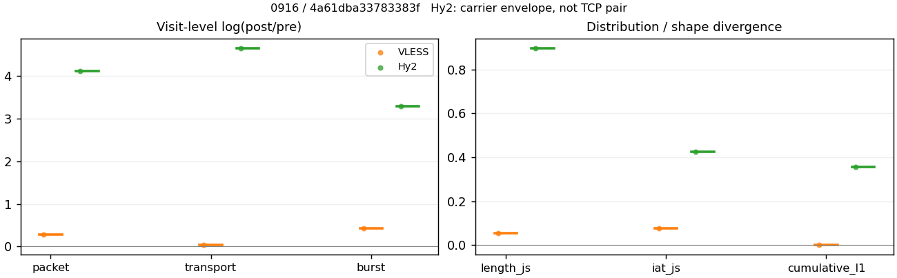
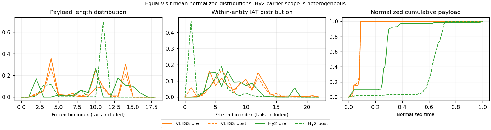

# 0916 · 条目 032 · bilibili.com

目标：https://www.bilibili.com/video/BV1pW411J7s8/

活动标签：bilibili.com::video_playback。选定访问 15 次。

[返回总索引](../../README.md) · [统计口径](../../methods.md)

## 覆盖与资格（每次访问均保留）

| 部署 | 重复 | 主请求路由 | 活动状态 | 代理比较 | DIRECT pre | 请求 proxy/direct/unresolved | 错误 |
| --- | --- | --- | --- | --- | --- | --- | --- |
| Hy2 | 1 | direct | passed | 0 | 1 | 0/306/0 | [] |
| Hy2 | 2 | direct | passed | 0 | 1 | 0/294/0 | [] |
| Hy2 | 3 | direct | degraded | 1 | 1 | 37/63/0 | [] |
| Hy2 | 4 | direct | passed | 0 | 1 | 0/304/0 | [] |
| Hy2 | 5 | direct | passed | 0 | 1 | 0/295/0 | [] |
| SS | 1 | direct | passed | 0 | 1 | 0/304/0 | [] |
| SS | 2 | direct | passed | 0 | 1 | 0/252/0 | [] |
| SS | 3 | direct | passed | 0 | 1 | 0/293/0 | [] |
| SS | 4 | direct | passed | 0 | 1 | 0/307/0 | [] |
| SS | 5 | direct | passed | 0 | 1 | 0/287/0 | [] |
| VLESS | 1 | direct | passed | 0 | 1 | 0/305/0 | [] |
| VLESS | 2 | direct | passed | 0 | 1 | 0/292/0 | [] |
| VLESS | 3 | direct | passed | 0 | 1 | 0/287/0 | [] |
| VLESS | 4 | direct | passed | 1 | 1 | 37/271/0 | [] |
| VLESS | 5 | direct | passed | 0 | 1 | 0/294/0 | [] |

主请求非 proxy 的统计仅解释为已索引的辅助代理连接或 DIRECT 观测，不代表目标业务经代理传输。播放确认与配对资格是两道不同的门。

图中散点为单次访问，短线为重复中位数；Hy2 是共享载体包络，不能与 TCP 配对作等范围因果对比。

形态图先逐访问归一化，再对访问等权平均；实线 pre，虚线 post。分箱序号及边界见 methods，不将分箱索引误解为长度或时间。

## 每次访问的关键观测

### SS

范围：`direct_pre_only`。每格 pre → post；空值为不可观测/不适用。

| 重复 | 包数 | 载荷字节 | burst | TCP FR | IAT中位µs | length JS | IAT JS |
| --- | --- | --- | --- | --- | --- | --- | --- |
| 1 | 4097 → — | 9.7955e+06 → — | 2555 → — | 427 → — | 66.583 → — | — | — |
| 2 | 3518 → — | 6.9793e+06 → — | 2275 → — | 323 → — | 57.556 → — | — | — |
| 3 | 4067 → — | 8.5168e+06 → — | 2582 → — | 436 → — | 55.21 → — | — | — |
| 4 | 3297 → — | 5.4838e+06 → — | 2082 → — | 515 → — | 111.13 → — | — | — |
| 5 | 4433 → — | 9.5275e+06 → — | 2877 → — | 431 → — | 55.323 → — | — | — |

完整标量统计：中位数 [min,max]；Δ 为重复内逐访问变换的中位数，MAD 未缩放。n 为可用变换数；DIRECT-only 的 nΔ=0 不代表 pre 不可用。

| scope | 特征 | pre | post | Δ | IQRΔ | MADΔ | nΔ |
| --- | --- | --- | --- | --- | --- | --- | --- |
| direct_pre_only | active_span_sum_s_1000ms | 29.331 [19.886, 47.917] | — | — | — | — | 0 |
| direct_pre_only | active_span_sum_s_100ms | 9.5827 [7.8626, 12.863] | — | — | — | — | 0 |
| direct_pre_only | active_span_sum_s_500ms | 17.995 [13.883, 23.424] | — | — | — | — | 0 |
| direct_pre_only | burst_bytes_iqr | 3265 [1970.8, 4429] | — | — | — | — | 0 |
| direct_pre_only | burst_bytes_mad | 64 [35, 92] | — | — | — | — | 0 |
| direct_pre_only | burst_bytes_max | 28672 [28000, 28672] | — | — | — | — | 0 |
| direct_pre_only | burst_bytes_mean | 3298.5 [2633.9, 3833.8] | — | — | — | — | 0 |
| direct_pre_only | burst_bytes_median | 64 [35, 92] | — | — | — | — | 0 |
| direct_pre_only | burst_bytes_min | 0 [0, 0] | — | — | — | — | 0 |
| direct_pre_only | burst_bytes_p95 | 20480 [16449, 20480] | — | — | — | — | 0 |
| direct_pre_only | burst_bytes_q25 | 0 [0, 0] | — | — | — | — | 0 |
| direct_pre_only | burst_bytes_q75 | 3265 [1970.8, 4429] | — | — | — | — | 0 |
| direct_pre_only | burst_bytes_std | 5902.2 [5274.8, 6607.2] | — | — | — | — | 0 |
| direct_pre_only | burst_count | 2555 [2082, 2877] | — | — | — | — | 0 |
| direct_pre_only | burst_duration_ms_iqr | 0.069611 [0.051123, 0.70654] | — | — | — | — | 0 |
| direct_pre_only | burst_duration_ms_mad | 0 [0, 0] | — | — | — | — | 0 |
| direct_pre_only | burst_duration_ms_max | 15000 [14845, 15001] | — | — | — | — | 0 |
| direct_pre_only | burst_duration_ms_mean | 81.488 [70.25, 112.41] | — | — | — | — | 0 |
| direct_pre_only | burst_duration_ms_median | 0 [0, 0] | — | — | — | — | 0 |
| direct_pre_only | burst_duration_ms_min | 0 [0, 0] | — | — | — | — | 0 |
| direct_pre_only | burst_duration_ms_p95 | 57.323 [31.019, 141.93] | — | — | — | — | 0 |
| direct_pre_only | burst_duration_ms_q25 | 0 [0, 0] | — | — | — | — | 0 |
| direct_pre_only | burst_duration_ms_q75 | 0.069611 [0.051123, 0.70654] | — | — | — | — | 0 |
| direct_pre_only | burst_duration_ms_std | 724.74 [659.46, 882.15] | — | — | — | — | 0 |
| direct_pre_only | burst_packets_iqr | 1 [1, 1] | — | — | — | — | 0 |
| direct_pre_only | burst_packets_mad | 0 [0, 0] | — | — | — | — | 0 |
| direct_pre_only | burst_packets_max | 10 [7, 10] | — | — | — | — | 0 |
| direct_pre_only | burst_packets_mean | 1.5751 [1.5408, 1.6035] | — | — | — | — | 0 |
| direct_pre_only | burst_packets_median | 1 [1, 1] | — | — | — | — | 0 |
| direct_pre_only | burst_packets_min | 1 [1, 1] | — | — | — | — | 0 |
| direct_pre_only | burst_packets_p95 | 3 [3, 4] | — | — | — | — | 0 |
| direct_pre_only | burst_packets_q25 | 1 [1, 1] | — | — | — | — | 0 |
| direct_pre_only | burst_packets_q75 | 2 [2, 2] | — | — | — | — | 0 |
| direct_pre_only | burst_packets_std | 0.94039 [0.89988, 0.96664] | — | — | — | — | 0 |
| direct_pre_only | connection_span_concurrency_max | 16 [15, 27] | — | — | — | — | 0 |
| direct_pre_only | direction_entropy | 0.69495 [0.68499, 0.8102] | — | — | — | — | 0 |
| direct_pre_only | down_burst_count | 1264 [1020, 1422] | — | — | — | — | 0 |
| direct_pre_only | down_ip_bytes | 8.404e+06 [5.2898e+06, 9.6829e+06] | — | — | — | — | 0 |
| direct_pre_only | down_packets | 2464 [1905, 2661] | — | — | — | — | 0 |
| direct_pre_only | down_transport_bytes | 8.2757e+06 [5.1904e+06, 9.5527e+06] | — | — | — | — | 0 |
| direct_pre_only | duration_s | 63.364 [61.273, 64.577] | — | — | — | — | 0 |
| direct_pre_only | entity_count | 33 [26, 42] | — | — | — | — | 0 |
| direct_pre_only | fr_runs | 431 [323, 515] | — | — | — | — | 0 |
| direct_pre_only | fr_runs_per_packet | 0.17365 [0.15657, 0.27974] | — | — | — | — | 0 |
| direct_pre_only | fr_switches | 400 [290, 473] | — | — | — | — | 0 |
| direct_pre_only | fr_switches_per_possible_transition | 0.16447 [0.14286, 0.26292] | — | — | — | — | 0 |
| direct_pre_only | full_retransmission_fraction | 0.0031965 [0.0022558, 0.0051257] | — | — | — | — | 0 |
| direct_pre_only | full_retransmission_packets | 13 [9, 21] | — | — | — | — | 0 |
| direct_pre_only | iat_count | 4041 [3255, 4400] | — | — | — | — | 0 |
| direct_pre_only | iat_median_us | 57.556 [55.21, 111.13] | — | — | — | — | 0 |
| direct_pre_only | iat_us_iqr | 385.95 [360.79, 1055.6] | — | — | — | — | 0 |
| direct_pre_only | iat_us_mad | 50.16 [47.705, 102.8] | — | — | — | — | 0 |
| direct_pre_only | iat_us_max | 1.5001e+07 [1.4845e+07, 1.5001e+07] | — | — | — | — | 0 |
| direct_pre_only | iat_us_mean | 2.0829e+05 [85955, 2.1785e+05] | — | — | — | — | 0 |
| direct_pre_only | iat_us_median | 57.556 [55.21, 111.13] | — | — | — | — | 0 |
| direct_pre_only | iat_us_min | 0.164 [0, 0.24] | — | — | — | — | 0 |
| direct_pre_only | iat_us_p95 | 44059 [29532, 75444] | — | — | — | — | 0 |
| direct_pre_only | iat_us_q25 | 15.098 [13.976, 19.196] | — | — | — | — | 0 |
| direct_pre_only | iat_us_q75 | 400.69 [375.88, 1074.8] | — | — | — | — | 0 |
| direct_pre_only | iat_us_std | 1.5526e+06 [6.8505e+05, 1.6053e+06] | — | — | — | — | 0 |
| direct_pre_only | idle_gap_count_1000ms | 91 [50, 106] | — | — | — | — | 0 |
| direct_pre_only | idle_gap_count_100ms | 151 [86, 162] | — | — | — | — | 0 |
| direct_pre_only | idle_gap_count_500ms | 108 [59, 125] | — | — | — | — | 0 |
| direct_pre_only | idle_gap_sum_s_1000ms | 848.2 [231.87, 889.38] | — | — | — | — | 0 |
| direct_pre_only | idle_gap_sum_s_100ms | 867.95 [266.92, 907.06] | — | — | — | — | 0 |
| direct_pre_only | idle_gap_sum_s_500ms | 861.52 [256.36, 898.46] | — | — | — | — | 0 |
| direct_pre_only | ip_bytes | 8.7288e+06 [5.6559e+06, 1.0009e+07] | — | — | — | — | 0 |
| direct_pre_only | length_iqr | 5106 [4563, 7378] | — | — | — | — | 0 |
| direct_pre_only | length_mad | 2343 [1560, 2596] | — | — | — | — | 0 |
| direct_pre_only | length_max | 8948 [8948, 8948] | — | — | — | — | 0 |
| direct_pre_only | length_mean | 3529.5 [2978.7, 3983.5] | — | — | — | — | 0 |
| direct_pre_only | length_median | 2824 [1766, 2856] | — | — | — | — | 0 |
| direct_pre_only | length_min | 9 [8, 31] | — | — | — | — | 0 |
| direct_pre_only | length_p95 | 8920 [8920, 8920] | — | — | — | — | 0 |
| direct_pre_only | length_q25 | 606 [471, 836] | — | — | — | — | 0 |
| direct_pre_only | length_q75 | 5712 [5107, 8041] | — | — | — | — | 0 |
| direct_pre_only | length_std | 3169.4 [2909.7, 3351.8] | — | — | — | — | 0 |
| direct_pre_only | nonempty_entity_count | 33 [26, 42] | — | — | — | — | 0 |
| direct_pre_only | nonempty_packets | 2413 [1841, 2604] | — | — | — | — | 0 |
| direct_pre_only | offload_suspect_fraction | 0.38191 [0.30209, 0.40615] | — | — | — | — | 0 |
| direct_pre_only | packet_count | 4067 [3297, 4433] | — | — | — | — | 0 |
| direct_pre_only | rtt_median_ms | 0.073678 [0.069651, 0.10047] | — | — | — | — | 0 |
| direct_pre_only | rtt_sample_count | 1492 [1351, 1667] | — | — | — | — | 0 |
| direct_pre_only | tcp_ack_count | 4039 [3252, 4399] | — | — | — | — | 0 |
| direct_pre_only | tcp_fin_count | 63 [50, 83] | — | — | — | — | 0 |
| direct_pre_only | tcp_packet_count | 4067 [3297, 4433] | — | — | — | — | 0 |
| direct_pre_only | tcp_rst_count | 2 [1, 3] | — | — | — | — | 0 |
| direct_pre_only | tcp_syn_count | 66 [52, 84] | — | — | — | — | 0 |
| direct_pre_only | tcp_window_raw_median | 65535 [65535, 65535] | — | — | — | — | 0 |
| direct_pre_only | transition_entropy | 0.558 [0.50488, 0.72705] | — | — | — | — | 0 |
| direct_pre_only | transition_n_mm | 1746 [1126, 1911] | — | — | — | — | 0 |
| direct_pre_only | transition_n_mp | 189 [130, 217] | — | — | — | — | 0 |
| direct_pre_only | transition_n_pm | 214 [160, 256] | — | — | — | — | 0 |
| direct_pre_only | transition_n_pp | 231 [200, 262] | — | — | — | — | 0 |
| direct_pre_only | transition_p_mm | 0.90411 [0.83842, 0.92154] | — | — | — | — | 0 |
| direct_pre_only | transition_p_mp | 0.09589 [0.078455, 0.16158] | — | — | — | — | 0 |
| direct_pre_only | transition_p_pm | 0.4577 [0.42895, 0.5614] | — | — | — | — | 0 |
| direct_pre_only | transition_p_pp | 0.5423 [0.4386, 0.57105] | — | — | — | — | 0 |
| direct_pre_only | transport_bytes | 8.5168e+06 [5.4838e+06, 9.7955e+06] | — | — | — | — | 0 |
| direct_pre_only | up_burst_count | 1291 [1062, 1455] | — | — | — | — | 0 |
| direct_pre_only | up_byte_fraction | 0.028309 [0.024786, 0.053488] | — | — | — | — | 0 |
| direct_pre_only | up_ip_bytes | 3.2629e+05 [2.7403e+05, 3.6611e+05] | — | — | — | — | 0 |
| direct_pre_only | up_packets | 1597 [1388, 1772] | — | — | — | — | 0 |
| direct_pre_only | up_transport_bytes | 2.411e+05 [2.0142e+05, 2.9332e+05] | — | — | — | — | 0 |
| direct_pre_only | zero_iat_count | 0 [0, 1] | — | — | — | — | 0 |
| direct_pre_only | zero_iat_fraction | 0 [0, 0.00030722] | — | — | — | — | 0 |

### VLESS

范围：`direct_pre_only`。每格 pre → post；空值为不可观测/不适用。

| 重复 | 包数 | 载荷字节 | burst | TCP FR | IAT中位µs | length JS | IAT JS |
| --- | --- | --- | --- | --- | --- | --- | --- |
| 1 | 4107 → — | 9.7857e+06 → — | 2561 → — | 440 → — | 57.961 → — | — | — |
| 2 | 3539 → — | 7.0577e+06 → — | 2409 → — | 378 → — | 60.032 → — | — | — |
| 3 | 2906 → — | 5.9178e+06 → — | 1836 → — | 308 → — | 74.129 → — | — | — |
| 4 | 3859 → — | 8.4617e+06 → — | 2529 → — | 391 → — | 60.931 → — | — | — |
| 5 | 4181 → — | 8.7527e+06 → — | 2722 → — | 434 → — | 57.66 → — | — | — |

范围：`exclusive_page`。每格 pre → post；空值为不可观测/不适用。

| 重复 | 包数 | 载荷字节 | burst | TCP FR | IAT中位µs | length JS | IAT JS |
| --- | --- | --- | --- | --- | --- | --- | --- |
| 1 | — | — | — | — | — | — | — |
| 2 | — | — | — | — | — | — | — |
| 3 | — | — | — | — | — | — | — |
| 4 | 494 → 649 | 3.6553e+05 → 3.8207e+05 | 338 → 520 | 12 → 16 | 301.22 → 75.731 | 0.053821 | 0.076144 |
| 5 | — | — | — | — | — | — | — |

完整标量统计：中位数 [min,max]；Δ 为重复内逐访问变换的中位数，MAD 未缩放。n 为可用变换数；DIRECT-only 的 nΔ=0 不代表 pre 不可用。

| scope | 特征 | pre | post | Δ | IQRΔ | MADΔ | nΔ |
| --- | --- | --- | --- | --- | --- | --- | --- |
| direct_pre_only | active_span_sum_s_1000ms | 30.15 [20.966, 33.944] | — | — | — | — | 0 |
| direct_pre_only | active_span_sum_s_100ms | 10.422 [8.6492, 10.985] | — | — | — | — | 0 |
| direct_pre_only | active_span_sum_s_500ms | 17.386 [15.076, 23.703] | — | — | — | — | 0 |
| direct_pre_only | burst_bytes_iqr | 3368 [2131, 5200] | — | — | — | — | 0 |
| direct_pre_only | burst_bytes_mad | 64 [31, 83] | — | — | — | — | 0 |
| direct_pre_only | burst_bytes_max | 28672 [27944, 29400] | — | — | — | — | 0 |
| direct_pre_only | burst_bytes_mean | 3223.2 [2929.7, 3821] | — | — | — | — | 0 |
| direct_pre_only | burst_bytes_median | 64 [31, 83] | — | — | — | — | 0 |
| direct_pre_only | burst_bytes_min | 0 [0, 0] | — | — | — | — | 0 |
| direct_pre_only | burst_bytes_p95 | 20480 [19752, 20480] | — | — | — | — | 0 |
| direct_pre_only | burst_bytes_q25 | 0 [0, 0] | — | — | — | — | 0 |
| direct_pre_only | burst_bytes_q75 | 3368 [2131, 5200] | — | — | — | — | 0 |
| direct_pre_only | burst_bytes_std | 5834.9 [5531.6, 6497.1] | — | — | — | — | 0 |
| direct_pre_only | burst_count | 2529 [1836, 2722] | — | — | — | — | 0 |
| direct_pre_only | burst_duration_ms_iqr | 0.054975 [0.039829, 0.074154] | — | — | — | — | 0 |
| direct_pre_only | burst_duration_ms_mad | 0 [0, 0] | — | — | — | — | 0 |
| direct_pre_only | burst_duration_ms_max | 14959 [12620, 15001] | — | — | — | — | 0 |
| direct_pre_only | burst_duration_ms_mean | 72.869 [66.35, 117.72] | — | — | — | — | 0 |
| direct_pre_only | burst_duration_ms_median | 0 [0, 0] | — | — | — | — | 0 |
| direct_pre_only | burst_duration_ms_min | 0 [0, 0] | — | — | — | — | 0 |
| direct_pre_only | burst_duration_ms_p95 | 65.882 [57.011, 72.181] | — | — | — | — | 0 |
| direct_pre_only | burst_duration_ms_q25 | 0 [0, 0] | — | — | — | — | 0 |
| direct_pre_only | burst_duration_ms_q75 | 0.054975 [0.039829, 0.074154] | — | — | — | — | 0 |
| direct_pre_only | burst_duration_ms_std | 725.19 [568.15, 1018.7] | — | — | — | — | 0 |
| direct_pre_only | burst_packets_iqr | 1 [1, 1] | — | — | — | — | 0 |
| direct_pre_only | burst_packets_mad | 0 [0, 0] | — | — | — | — | 0 |
| direct_pre_only | burst_packets_max | 8 [6, 10] | — | — | — | — | 0 |
| direct_pre_only | burst_packets_mean | 1.536 [1.4691, 1.6037] | — | — | — | — | 0 |
| direct_pre_only | burst_packets_median | 1 [1, 1] | — | — | — | — | 0 |
| direct_pre_only | burst_packets_min | 1 [1, 1] | — | — | — | — | 0 |
| direct_pre_only | burst_packets_p95 | 3 [3, 4] | — | — | — | — | 0 |
| direct_pre_only | burst_packets_q25 | 1 [1, 1] | — | — | — | — | 0 |
| direct_pre_only | burst_packets_q75 | 2 [2, 2] | — | — | — | — | 0 |
| direct_pre_only | burst_packets_std | 0.91953 [0.82458, 0.97463] | — | — | — | — | 0 |
| direct_pre_only | connection_span_concurrency_max | 15 [12, 16] | — | — | — | — | 0 |
| direct_pre_only | direction_entropy | 0.69998 [0.64985, 0.77773] | — | — | — | — | 0 |
| direct_pre_only | down_burst_count | 1250 [903, 1346] | — | — | — | — | 0 |
| direct_pre_only | down_ip_bytes | 8.383e+06 [5.8072e+06, 9.6644e+06] | — | — | — | — | 0 |
| direct_pre_only | down_packets | 2319 [1725, 2507] | — | — | — | — | 0 |
| direct_pre_only | down_transport_bytes | 8.2622e+06 [5.7173e+06, 9.5341e+06] | — | — | — | — | 0 |
| direct_pre_only | duration_s | 64.442 [61.842, 64.783] | — | — | — | — | 0 |
| direct_pre_only | entity_count | 30 [29, 31] | — | — | — | — | 0 |
| direct_pre_only | fr_runs | 391 [308, 440] | — | — | — | — | 0 |
| direct_pre_only | fr_runs_per_packet | 0.17792 [0.1737, 0.19246] | — | — | — | — | 0 |
| direct_pre_only | fr_switches | 362 [278, 411] | — | — | — | — | 0 |
| direct_pre_only | fr_switches_per_possible_transition | 0.16817 [0.16292, 0.17951] | — | — | — | — | 0 |
| direct_pre_only | full_retransmission_fraction | 0.0042385 [0.0035877, 0.0065741] | — | — | — | — | 0 |
| direct_pre_only | full_retransmission_packets | 15 [13, 27] | — | — | — | — | 0 |
| direct_pre_only | iat_count | 3830 [2876, 4151] | — | — | — | — | 0 |
| direct_pre_only | iat_median_us | 60.032 [57.66, 74.129] | — | — | — | — | 0 |
| direct_pre_only | iat_us_iqr | 395.5 [332.22, 630.51] | — | — | — | — | 0 |
| direct_pre_only | iat_us_mad | 53.081 [50.367, 65.556] | — | — | — | — | 0 |
| direct_pre_only | iat_us_max | 1.5001e+07 [1.5001e+07, 1.5002e+07] | — | — | — | — | 0 |
| direct_pre_only | iat_us_mean | 2.1943e+05 [1.3115e+05, 2.6933e+05] | — | — | — | — | 0 |
| direct_pre_only | iat_us_median | 60.032 [57.66, 74.129] | — | — | — | — | 0 |
| direct_pre_only | iat_us_min | 0.074 [0.007, 0.166] | — | — | — | — | 0 |
| direct_pre_only | iat_us_p95 | 59829 [45835, 75489] | — | — | — | — | 0 |
| direct_pre_only | iat_us_q25 | 14.524 [13.343, 15.503] | — | — | — | — | 0 |
| direct_pre_only | iat_us_q75 | 409.61 [346.74, 646.01] | — | — | — | — | 0 |
| direct_pre_only | iat_us_std | 1.5793e+06 [1.1342e+06, 1.8186e+06] | — | — | — | — | 0 |
| direct_pre_only | idle_gap_count_1000ms | 88 [72, 105] | — | — | — | — | 0 |
| direct_pre_only | idle_gap_count_100ms | 135 [124, 145] | — | — | — | — | 0 |
| direct_pre_only | idle_gap_count_500ms | 95 [85, 118] | — | — | — | — | 0 |
| direct_pre_only | idle_gap_sum_s_1000ms | 753.63 [500.89, 899.61] | — | — | — | — | 0 |
| direct_pre_only | idle_gap_sum_s_100ms | 765.95 [524.21, 919.52] | — | — | — | — | 0 |
| direct_pre_only | idle_gap_sum_s_500ms | 759.52 [511.13, 912.38] | — | — | — | — | 0 |
| direct_pre_only | ip_bytes | 8.6629e+06 [6.0695e+06, 1e+07] | — | — | — | — | 0 |
| direct_pre_only | length_iqr | 6153 [5161.2, 7345] | — | — | — | — | 0 |
| direct_pre_only | length_mad | 2480 [2407.5, 2567] | — | — | — | — | 0 |
| direct_pre_only | length_max | 8948 [8948, 8948] | — | — | — | — | 0 |
| direct_pre_only | length_mean | 3593.5 [3578.4, 3957] | — | — | — | — | 0 |
| direct_pre_only | length_median | 2856 [2652, 2880] | — | — | — | — | 0 |
| direct_pre_only | length_min | 12 [1, 31] | — | — | — | — | 0 |
| direct_pre_only | length_p95 | 8920 [8920, 8920] | — | — | — | — | 0 |
| direct_pre_only | length_q25 | 598.75 [456, 732.5] | — | — | — | — | 0 |
| direct_pre_only | length_q75 | 6736 [5760, 8057] | — | — | — | — | 0 |
| direct_pre_only | length_std | 3299.1 [3172.1, 3365.7] | — | — | — | — | 0 |
| direct_pre_only | nonempty_entity_count | 30 [29, 31] | — | — | — | — | 0 |
| direct_pre_only | nonempty_packets | 2251 [1649, 2473] | — | — | — | — | 0 |
| direct_pre_only | offload_suspect_fraction | 0.38292 [0.34162, 0.40541] | — | — | — | — | 0 |
| direct_pre_only | packet_count | 3859 [2906, 4181] | — | — | — | — | 0 |
| direct_pre_only | rtt_median_ms | 0.076514 [0.062088, 0.082517] | — | — | — | — | 0 |
| direct_pre_only | rtt_sample_count | 1474 [1081, 1580] | — | — | — | — | 0 |
| direct_pre_only | tcp_ack_count | 3825 [2873, 4148] | — | — | — | — | 0 |
| direct_pre_only | tcp_fin_count | 58 [56, 62] | — | — | — | — | 0 |
| direct_pre_only | tcp_packet_count | 3859 [2906, 4181] | — | — | — | — | 0 |
| direct_pre_only | tcp_rst_count | 3 [2, 5] | — | — | — | — | 0 |
| direct_pre_only | tcp_syn_count | 60 [58, 62] | — | — | — | — | 0 |
| direct_pre_only | tcp_window_raw_median | 65535 [65535, 65535] | — | — | — | — | 0 |
| direct_pre_only | transition_entropy | 0.5612 [0.53284, 0.59583] | — | — | — | — | 0 |
| direct_pre_only | transition_n_mm | 1682 [1118, 1792] | — | — | — | — | 0 |
| direct_pre_only | transition_n_mp | 168 [126, 193] | — | — | — | — | 0 |
| direct_pre_only | transition_n_pm | 194 [152, 218] | — | — | — | — | 0 |
| direct_pre_only | transition_n_pp | 234 [178, 244] | — | — | — | — | 0 |
| direct_pre_only | transition_p_mm | 0.90277 [0.89477, 0.90919] | — | — | — | — | 0 |
| direct_pre_only | transition_p_mp | 0.097229 [0.090811, 0.10523] | — | — | — | — | 0 |
| direct_pre_only | transition_p_pm | 0.46841 [0.40533, 0.52151] | — | — | — | — | 0 |
| direct_pre_only | transition_p_pp | 0.53159 [0.47849, 0.59467] | — | — | — | — | 0 |
| direct_pre_only | transport_bytes | 8.4617e+06 [5.9178e+06, 9.7857e+06] | — | — | — | — | 0 |
| direct_pre_only | up_burst_count | 1279 [933, 1376] | — | — | — | — | 0 |
| direct_pre_only | up_byte_fraction | 0.026999 [0.023574, 0.033893] | — | — | — | — | 0 |
| direct_pre_only | up_ip_bytes | 3.0237e+05 [2.6234e+05, 3.3564e+05] | — | — | — | — | 0 |
| direct_pre_only | up_packets | 1540 [1181, 1674] | — | — | — | — | 0 |
| direct_pre_only | up_transport_bytes | 2.2487e+05 [1.9947e+05, 2.516e+05] | — | — | — | — | 0 |
| direct_pre_only | zero_iat_count | 0 [0, 0] | — | — | — | — | 0 |
| direct_pre_only | zero_iat_fraction | 0 [0, 0] | — | — | — | — | 0 |
| exclusive_page | active_span_sum_s_1000ms | 2.9503 [2.9503, 2.9503] | 5.8072 [5.8072, 5.8072] | 0.67719 | — | — | 1 |
| exclusive_page | active_span_sum_s_100ms | 0.91777 [0.91777, 0.91777] | 1.5663 [1.5663, 1.5663] | 0.53451 | — | — | 1 |
| exclusive_page | active_span_sum_s_500ms | 2.1712 [2.1712, 2.1712] | 3.3844 [3.3844, 3.3844] | 0.4439 | — | — | 1 |
| exclusive_page | burst_bytes_iqr | 2880 [2880, 2880] | 1440 [1440, 1440] | -0.69315 | — | — | 1 |
| exclusive_page | burst_bytes_mad | 0 [0, 0] | 24 [24, 24] | — | — | — | 0 |
| exclusive_page | burst_bytes_max | 5720 [5720, 5720] | 4948 [4948, 4948] | -0.14499 | — | — | 1 |
| exclusive_page | burst_bytes_mean | 1081.5 [1081.5, 1081.5] | 734.75 [734.75, 734.75] | -0.38653 | — | — | 1 |
| exclusive_page | burst_bytes_median | 0 [0, 0] | 24 [24, 24] | — | — | — | 0 |
| exclusive_page | burst_bytes_min | 0 [0, 0] | 0 [0, 0] | — | — | — | 0 |
| exclusive_page | burst_bytes_p95 | 2896 [2896, 2896] | 2824 [2824, 2824] | -0.025176 | — | — | 1 |
| exclusive_page | burst_bytes_q25 | 0 [0, 0] | 0 [0, 0] | — | — | — | 0 |
| exclusive_page | burst_bytes_q75 | 2880 [2880, 2880] | 1440 [1440, 1440] | -0.69315 | — | — | 1 |
| exclusive_page | burst_bytes_std | 1392.6 [1392.6, 1392.6] | 1140.4 [1140.4, 1140.4] | -0.19983 | — | — | 1 |
| exclusive_page | burst_count | 338 [338, 338] | 520 [520, 520] | 0.43078 | — | — | 1 |
| exclusive_page | burst_duration_ms_iqr | 0.64366 [0.64366, 0.64366] | 0 [0, 0] | — | — | — | 0 |
| exclusive_page | burst_duration_ms_mad | 0 [0, 0] | 0 [0, 0] | — | — | — | 0 |
| exclusive_page | burst_duration_ms_max | 1525.6 [1525.6, 1525.6] | 15024 [15024, 15024] | 2.2873 | — | — | 1 |
| exclusive_page | burst_duration_ms_mean | 15.646 [15.646, 15.646] | 34.064 [34.064, 34.064] | 0.77804 | — | — | 1 |
| exclusive_page | burst_duration_ms_median | 0 [0, 0] | 0 [0, 0] | — | — | — | 0 |
| exclusive_page | burst_duration_ms_min | 0 [0, 0] | 0 [0, 0] | — | — | — | 0 |
| exclusive_page | burst_duration_ms_p95 | 5.9442 [5.9442, 5.9442] | 0.43345 [0.43345, 0.43345] | -2.6184 | — | — | 1 |
| exclusive_page | burst_duration_ms_q25 | 0 [0, 0] | 0 [0, 0] | — | — | — | 0 |
| exclusive_page | burst_duration_ms_q75 | 0.64366 [0.64366, 0.64366] | 0 [0, 0] | — | — | — | 0 |
| exclusive_page | burst_duration_ms_std | 124.97 [124.97, 124.97] | 659.55 [659.55, 659.55] | 1.6635 | — | — | 1 |
| exclusive_page | burst_packets_iqr | 1 [1, 1] | 0 [0, 0] | — | — | — | 0 |
| exclusive_page | burst_packets_mad | 0 [0, 0] | 0 [0, 0] | — | — | — | 0 |
| exclusive_page | burst_packets_max | 4 [4, 4] | 8 [8, 8] | 0.69315 | — | — | 1 |
| exclusive_page | burst_packets_mean | 1.4615 [1.4615, 1.4615] | 1.2481 [1.2481, 1.2481] | -0.15789 | — | — | 1 |
| exclusive_page | burst_packets_median | 1 [1, 1] | 1 [1, 1] | 0 | — | — | 1 |
| exclusive_page | burst_packets_min | 1 [1, 1] | 1 [1, 1] | 0 | — | — | 1 |
| exclusive_page | burst_packets_p95 | 2 [2, 2] | 2 [2, 2] | 0 | — | — | 1 |
| exclusive_page | burst_packets_q25 | 1 [1, 1] | 1 [1, 1] | 0 | — | — | 1 |
| exclusive_page | burst_packets_q75 | 2 [2, 2] | 1 [1, 1] | -0.69315 | — | — | 1 |
| exclusive_page | burst_packets_std | 0.57048 [0.57048, 0.57048] | 0.79542 [0.79542, 0.79542] | 0.33239 | — | — | 1 |
| exclusive_page | connection_span_concurrency_max | 2 [2, 2] | 2 [2, 2] | 0 | — | — | 1 |
| exclusive_page | cumulative_l1 | — | — | 0.0020703 | — | — | 1 |
| exclusive_page | cumulative_max | — | — | 0.048577 | — | — | 1 |
| exclusive_page | direction_entropy | 0.60488 [0.60488, 0.60488] | 0.35491 [0.35491, 0.35491] | -0.24997 | — | — | 1 |
| exclusive_page | down_burst_count | 168 [168, 168] | 259 [259, 259] | 0.43286 | — | — | 1 |
| exclusive_page | down_ip_bytes | 3.7253e+05 [3.7253e+05, 3.7253e+05] | 3.8724e+05 [3.8724e+05, 3.8724e+05] | 0.038748 | — | — | 1 |
| exclusive_page | down_packets | 304 [304, 304] | 336 [336, 336] | 0.10008 | — | — | 1 |
| exclusive_page | down_transport_bytes | 3.567e+05 [3.567e+05, 3.567e+05] | 3.6976e+05 [3.6976e+05, 3.6976e+05] | 0.035943 | — | — | 1 |
| exclusive_page | duration_s | 60.453 [60.453, 60.453] | 60.418 [60.418, 60.418] | -0.00057804 | — | — | 1 |
| exclusive_page | entity_count | 2 [2, 2] | 2 [2, 2] | 0 | — | — | 1 |
| exclusive_page | fr_runs | 12 [12, 12] | 16 [16, 16] | 0.28768 | — | — | 1 |
| exclusive_page | fr_runs_per_packet | 0.039474 [0.039474, 0.039474] | 0.04878 [0.04878, 0.04878] | 0.0093068 | — | — | 1 |
| exclusive_page | fr_switches | 10 [10, 10] | 14 [14, 14] | 0.33647 | — | — | 1 |
| exclusive_page | fr_switches_per_possible_transition | 0.033113 [0.033113, 0.033113] | 0.042945 [0.042945, 0.042945] | 0.0098322 | — | — | 1 |
| exclusive_page | full_retransmission_fraction | 0 [0, 0] | 0.0015408 [0.0015408, 0.0015408] | 0.0015408 | — | — | 1 |
| exclusive_page | full_retransmission_packets | 0 [0, 0] | 1 [1, 1] | — | — | — | 0 |
| exclusive_page | iat_count | 492 [492, 492] | 647 [647, 647] | 0.27387 | — | — | 1 |
| exclusive_page | iat_js | — | — | 0.076144 | — | — | 1 |
| exclusive_page | iat_ks | — | — | 0.091432 | — | — | 1 |
| exclusive_page | iat_median_us | 301.22 [301.22, 301.22] | 75.731 [75.731, 75.731] | -1.3806 | — | — | 1 |
| exclusive_page | iat_us_iqr | 2608.2 [2608.2, 2608.2] | 1807.3 [1807.3, 1807.3] | -0.36682 | — | — | 1 |
| exclusive_page | iat_us_mad | 294.65 [294.65, 294.65] | 75.482 [75.482, 75.482] | -1.3619 | — | — | 1 |
| exclusive_page | iat_us_max | 1.5001e+07 [1.5001e+07, 1.5001e+07] | 1.5313e+07 [1.5313e+07, 1.5313e+07] | 0.02058 | — | — | 1 |
| exclusive_page | iat_us_mean | 1.2331e+05 [1.2331e+05, 1.2331e+05] | 93630 [93630, 93630] | -0.27532 | — | — | 1 |
| exclusive_page | iat_us_median | 301.22 [301.22, 301.22] | 75.731 [75.731, 75.731] | -1.3806 | — | — | 1 |
| exclusive_page | iat_us_min | 1.181 [1.181, 1.181] | 0.037 [0.037, 0.037] | -3.4632 | — | — | 1 |
| exclusive_page | iat_us_p95 | 9860.3 [9860.3, 9860.3] | 15056 [15056, 15056] | 0.42326 | — | — | 1 |
| exclusive_page | iat_us_q25 | 18.631 [18.631, 18.631] | 22.195 [22.195, 22.195] | 0.17504 | — | — | 1 |
| exclusive_page | iat_us_q75 | 2626.8 [2626.8, 2626.8] | 1829.5 [1829.5, 1829.5] | -0.36173 | — | — | 1 |
| exclusive_page | iat_us_std | 1.2494e+06 [1.2494e+06, 1.2494e+06] | 1.0936e+06 [1.0936e+06, 1.0936e+06] | -0.13322 | — | — | 1 |
| exclusive_page | iat_wasserstein_log1p_us | — | — | 0.45988 | — | — | 1 |
| exclusive_page | idle_gap_count_1000ms | 6 [6, 6] | 4 [4, 4] | -0.40547 | — | — | 1 |
| exclusive_page | idle_gap_count_100ms | 12 [12, 12] | 15 [15, 15] | 0.22314 | — | — | 1 |
| exclusive_page | idle_gap_count_500ms | 7 [7, 7] | 7 [7, 7] | 0 | — | — | 1 |
| exclusive_page | idle_gap_sum_s_1000ms | 57.716 [57.716, 57.716] | 54.771 [54.771, 54.771] | -0.052369 | — | — | 1 |
| exclusive_page | idle_gap_sum_s_100ms | 59.748 [59.748, 59.748] | 59.012 [59.012, 59.012] | -0.0124 | — | — | 1 |
| exclusive_page | idle_gap_sum_s_500ms | 58.495 [58.495, 58.495] | 57.194 [57.194, 57.194] | -0.022492 | — | — | 1 |
| exclusive_page | ip_bytes | 3.912e+05 [3.912e+05, 3.912e+05] | 4.1628e+05 [4.1628e+05, 4.1628e+05] | 0.062139 | — | — | 1 |
| exclusive_page | length_iqr | 2752 [2752, 2752] | 1368 [1368, 1368] | -0.69898 | — | — | 1 |
| exclusive_page | length_js | — | — | 0.053821 | — | — | 1 |
| exclusive_page | length_ks | — | — | 0.12372 | — | — | 1 |
| exclusive_page | length_mad | 1211.5 [1211.5, 1211.5] | 1340 [1340, 1340] | 0.10081 | — | — | 1 |
| exclusive_page | length_max | 2896 [2896, 2896] | 2824 [2824, 2824] | -0.025176 | — | — | 1 |
| exclusive_page | length_mean | 1202.4 [1202.4, 1202.4] | 1164.9 [1164.9, 1164.9] | -0.031731 | — | — | 1 |
| exclusive_page | length_median | 1283.5 [1283.5, 1283.5] | 1412 [1412, 1412] | 0.095416 | — | — | 1 |
| exclusive_page | length_min | 24 [24, 24] | 20 [20, 20] | -0.18232 | — | — | 1 |
| exclusive_page | length_p95 | 2824 [2824, 2824] | 2824 [2824, 2824] | 0 | — | — | 1 |
| exclusive_page | length_q25 | 72 [72, 72] | 72 [72, 72] | 0 | — | — | 1 |
| exclusive_page | length_q75 | 2824 [2824, 2824] | 1440 [1440, 1440] | -0.67351 | — | — | 1 |
| exclusive_page | length_std | 1182.7 [1182.7, 1182.7] | 1035.2 [1035.2, 1035.2] | -0.1332 | — | — | 1 |
| exclusive_page | length_wasserstein_bytes | — | — | 221.35 | — | — | 1 |
| exclusive_page | nonempty_entity_count | 2 [2, 2] | 2 [2, 2] | 0 | — | — | 1 |
| exclusive_page | nonempty_packets | 304 [304, 304] | 328 [328, 328] | 0.075986 | — | — | 1 |
| exclusive_page | offload_suspect_fraction | 0.19838 [0.19838, 0.19838] | 0.11094 [0.11094, 0.11094] | -0.087441 | — | — | 1 |
| exclusive_page | packet_count | 494 [494, 494] | 649 [649, 649] | 0.2729 | — | — | 1 |
| exclusive_page | rtt_median_ms | 0.52047 [0.52047, 0.52047] | 0.047524 [0.047524, 0.047524] | -2.3935 | — | — | 1 |
| exclusive_page | rtt_sample_count | 173 [173, 173] | 278 [278, 278] | 0.47433 | — | — | 1 |
| exclusive_page | tcp_ack_count | 488 [488, 488] | 647 [647, 647] | 0.28203 | — | — | 1 |
| exclusive_page | tcp_fin_count | 4 [4, 4] | 4 [4, 4] | 0 | — | — | 1 |
| exclusive_page | tcp_packet_count | 494 [494, 494] | 649 [649, 649] | 0.2729 | — | — | 1 |
| exclusive_page | tcp_rst_count | 4 [4, 4] | 0 [0, 0] | — | — | — | 0 |
| exclusive_page | tcp_syn_count | 4 [4, 4] | 4 [4, 4] | 0 | — | — | 1 |
| exclusive_page | tcp_window_raw_median | 65535 [65535, 65535] | 141 [141, 141] | -6.1416 | — | — | 1 |
| exclusive_page | transition_entropy | 0.18292 [0.18292, 0.18292] | 0.19433 [0.19433, 0.19433] | 0.011415 | — | — | 1 |
| exclusive_page | transition_n_mm | 253 [253, 253] | 298 [298, 298] | 0.1637 | — | — | 1 |
| exclusive_page | transition_n_mp | 4 [4, 4] | 6 [6, 6] | 0.40547 | — | — | 1 |
| exclusive_page | transition_n_pm | 6 [6, 6] | 8 [8, 8] | 0.28768 | — | — | 1 |
| exclusive_page | transition_n_pp | 39 [39, 39] | 14 [14, 14] | -1.0245 | — | — | 1 |
| exclusive_page | transition_p_mm | 0.98444 [0.98444, 0.98444] | 0.98026 [0.98026, 0.98026] | -0.0041726 | — | — | 1 |
| exclusive_page | transition_p_mp | 0.015564 [0.015564, 0.015564] | 0.019737 [0.019737, 0.019737] | 0.0041726 | — | — | 1 |
| exclusive_page | transition_p_pm | 0.13333 [0.13333, 0.13333] | 0.36364 [0.36364, 0.36364] | 0.2303 | — | — | 1 |
| exclusive_page | transition_p_pp | 0.86667 [0.86667, 0.86667] | 0.63636 [0.63636, 0.63636] | -0.2303 | — | — | 1 |
| exclusive_page | transport_bytes | 3.6553e+05 [3.6553e+05, 3.6553e+05] | 3.8207e+05 [3.8207e+05, 3.8207e+05] | 0.044255 | — | — | 1 |
| exclusive_page | up_burst_count | 170 [170, 170] | 261 [261, 261] | 0.42872 | — | — | 1 |
| exclusive_page | up_byte_fraction | 0.024151 [0.024151, 0.024151] | 0.03223 [0.03223, 0.03223] | 0.0080784 | — | — | 1 |
| exclusive_page | up_ip_bytes | 18676 [18676, 18676] | 29038 [29038, 29038] | 0.44137 | — | — | 1 |
| exclusive_page | up_packets | 190 [190, 190] | 313 [313, 313] | 0.49918 | — | — | 1 |
| exclusive_page | up_transport_bytes | 8828 [8828, 8828] | 12314 [12314, 12314] | 0.33281 | — | — | 1 |
| exclusive_page | zero_iat_count | 0 [0, 0] | 0 [0, 0] | — | — | — | 0 |
| exclusive_page | zero_iat_fraction | 0 [0, 0] | 0 [0, 0] | 0 | — | — | 1 |

### Hy2

范围：`direct_pre_only`。每格 pre → post；空值为不可观测/不适用。

| 重复 | 包数 | 载荷字节 | burst | TCP FR | IAT中位µs | length JS | IAT JS |
| --- | --- | --- | --- | --- | --- | --- | --- |
| 1 | 4281 → — | 9.8193e+06 → — | 2742 → — | 456 → — | 62.809 → — | — | — |
| 2 | 4491 → — | 9.493e+06 → — | 2829 → — | 418 → — | 55.624 → — | — | — |
| 3 | 552 → — | 4.8816e+05 → — | 366 → — | 80 → — | 129.34 → — | — | — |
| 4 | 4218 → — | 9.0143e+06 → — | 2693 → — | 463 → — | 70.711 → — | — | — |
| 5 | 4430 → — | 8.6353e+06 → — | 2756 → — | 407 → — | 68.314 → — | — | — |

范围：`carrier_context_envelope`。每格 pre → post；空值为不可观测/不适用。

| 重复 | 包数 | 载荷字节 | burst | TCP FR | IAT中位µs | length JS | IAT JS |
| --- | --- | --- | --- | --- | --- | --- | --- |
| 1 | — | — | — | — | — | — | — |
| 2 | — | — | — | — | — | — | — |
| 3 | 697 → 42848 | 4.442e+05 → 4.648e+07 | 545 → 14787 | — | 78.596 → 4.145 | 0.89623 | 0.42649 |
| 4 | — | — | — | — | — | — | — |
| 5 | — | — | — | — | — | — | — |

完整标量统计：中位数 [min,max]；Δ 为重复内逐访问变换的中位数，MAD 未缩放。n 为可用变换数；DIRECT-only 的 nΔ=0 不代表 pre 不可用。

| scope | 特征 | pre | post | Δ | IQRΔ | MADΔ | nΔ |
| --- | --- | --- | --- | --- | --- | --- | --- |
| carrier_context_envelope | active_span_sum_s_1000ms | 10.02 [10.02, 10.02] | 13.582 [13.582, 13.582] | 0.30421 | — | — | 1 |
| carrier_context_envelope | active_span_sum_s_100ms | 0.27931 [0.27931, 0.27931] | 6.7258 [6.7258, 6.7258] | 3.1814 | — | — | 1 |
| carrier_context_envelope | active_span_sum_s_500ms | 10.02 [10.02, 10.02] | 12.839 [12.839, 12.839] | 0.24791 | — | — | 1 |
| carrier_context_envelope | burst_bytes_iqr | 1417 [1417, 1417] | 4227 [4227, 4227] | 1.093 | — | — | 1 |
| carrier_context_envelope | burst_bytes_mad | 0 [0, 0] | 258 [258, 258] | — | — | — | 0 |
| carrier_context_envelope | burst_bytes_max | 8920 [8920, 8920] | 2.729e+05 [2.729e+05, 2.729e+05] | 3.4208 | — | — | 1 |
| carrier_context_envelope | burst_bytes_mean | 815.04 [815.04, 815.04] | 3143.3 [3143.3, 3143.3] | 1.3498 | — | — | 1 |
| carrier_context_envelope | burst_bytes_median | 0 [0, 0] | 291 [291, 291] | — | — | — | 0 |
| carrier_context_envelope | burst_bytes_min | 0 [0, 0] | 22 [22, 22] | — | — | — | 0 |
| carrier_context_envelope | burst_bytes_p95 | 4555.8 [4555.8, 4555.8] | 10932 [10932, 10932] | 0.87529 | — | — | 1 |
| carrier_context_envelope | burst_bytes_q25 | 0 [0, 0] | 96 [96, 96] | — | — | — | 0 |
| carrier_context_envelope | burst_bytes_q75 | 1417 [1417, 1417] | 4323 [4323, 4323] | 1.1154 | — | — | 1 |
| carrier_context_envelope | burst_bytes_std | 1638.8 [1638.8, 1638.8] | 7248.9 [7248.9, 7248.9] | 1.4869 | — | — | 1 |
| carrier_context_envelope | burst_count | 545 [545, 545] | 14787 [14787, 14787] | 3.3007 | — | — | 1 |
| carrier_context_envelope | burst_duration_ms_iqr | 0.059019 [0.059019, 0.059019] | 0.024704 [0.024704, 0.024704] | -0.87089 | — | — | 1 |
| carrier_context_envelope | burst_duration_ms_mad | 0 [0, 0] | 4.5e-05 [4.5e-05, 4.5e-05] | — | — | — | 0 |
| carrier_context_envelope | burst_duration_ms_max | 289.5 [289.5, 289.5] | 2099.1 [2099.1, 2099.1] | 1.9811 | — | — | 1 |
| carrier_context_envelope | burst_duration_ms_mean | 18.022 [18.022, 18.022] | 0.3898 [0.3898, 0.3898] | -3.8337 | — | — | 1 |
| carrier_context_envelope | burst_duration_ms_median | 0 [0, 0] | 4.5e-05 [4.5e-05, 4.5e-05] | — | — | — | 0 |
| carrier_context_envelope | burst_duration_ms_min | 0 [0, 0] | 0 [0, 0] | — | — | — | 0 |
| carrier_context_envelope | burst_duration_ms_p95 | 259.24 [259.24, 259.24] | 0.15893 [0.15893, 0.15893] | -7.397 | — | — | 1 |
| carrier_context_envelope | burst_duration_ms_q25 | 0 [0, 0] | 0 [0, 0] | — | — | — | 0 |
| carrier_context_envelope | burst_duration_ms_q75 | 0.059019 [0.059019, 0.059019] | 0.024704 [0.024704, 0.024704] | -0.87089 | — | — | 1 |
| carrier_context_envelope | burst_duration_ms_std | 66.416 [66.416, 66.416] | 17.735 [17.735, 17.735] | -1.3204 | — | — | 1 |
| carrier_context_envelope | burst_packets_iqr | 1 [1, 1] | 3 [3, 3] | 1.0986 | — | — | 1 |
| carrier_context_envelope | burst_packets_mad | 0 [0, 0] | 1 [1, 1] | — | — | — | 0 |
| carrier_context_envelope | burst_packets_max | 3 [3, 3] | 196 [196, 196] | 4.1795 | — | — | 1 |
| carrier_context_envelope | burst_packets_mean | 1.2789 [1.2789, 1.2789] | 2.8977 [2.8977, 2.8977] | 0.81791 | — | — | 1 |
| carrier_context_envelope | burst_packets_median | 1 [1, 1] | 2 [2, 2] | 0.69315 | — | — | 1 |
| carrier_context_envelope | burst_packets_min | 1 [1, 1] | 1 [1, 1] | 0 | — | — | 1 |
| carrier_context_envelope | burst_packets_p95 | 2 [2, 2] | 8 [8, 8] | 1.3863 | — | — | 1 |
| carrier_context_envelope | burst_packets_q25 | 1 [1, 1] | 1 [1, 1] | 0 | — | — | 1 |
| carrier_context_envelope | burst_packets_q75 | 2 [2, 2] | 4 [4, 4] | 0.69315 | — | — | 1 |
| carrier_context_envelope | burst_packets_std | 0.46454 [0.46454, 0.46454] | 5.0321 [5.0321, 5.0321] | 2.3825 | — | — | 1 |
| carrier_context_envelope | connection_span_concurrency_max | 8 [8, 8] | 1 [1, 1] | -2.0794 | — | — | 1 |
| carrier_context_envelope | cumulative_l1 | — | — | 0.35758 | — | — | 1 |
| carrier_context_envelope | cumulative_max | — | — | 0.93845 | — | — | 1 |
| carrier_context_envelope | direction_entropy | 0.9198 [0.9198, 0.9198] | 0.7635 [0.7635, 0.7635] | -0.1563 | — | — | 1 |
| carrier_context_envelope | direction_run_analog_runs | 111 [111, 111] | 14787 [14787, 14787] | 4.892 | — | — | 1 |
| carrier_context_envelope | direction_run_analog_runs_per_packet | 0.50226 [0.50226, 0.50226] | 0.3451 [0.3451, 0.3451] | -0.15716 | — | — | 1 |
| carrier_context_envelope | direction_run_analog_switches | 74 [74, 74] | 14786 [14786, 14786] | 5.2974 | — | — | 1 |
| carrier_context_envelope | direction_run_analog_switches_per_possible_transition | 0.40217 [0.40217, 0.40217] | 0.34509 [0.34509, 0.34509] | -0.057086 | — | — | 1 |
| carrier_context_envelope | down_burst_count | 254 [254, 254] | 7393 [7393, 7393] | 3.371 | — | — | 1 |
| carrier_context_envelope | down_ip_bytes | 3.9386e+05 [3.9386e+05, 3.9386e+05] | 4.6673e+07 [4.6673e+07, 4.6673e+07] | 4.7749 | — | — | 1 |
| carrier_context_envelope | down_packets | 328 [328, 328] | 33343 [33343, 33343] | 4.6216 | — | — | 1 |
| carrier_context_envelope | down_transport_bytes | 3.7651e+05 [3.7651e+05, 3.7651e+05] | 4.5739e+07 [4.5739e+07, 4.5739e+07] | 4.7998 | — | — | 1 |
| carrier_context_envelope | duration_s | 20.789 [20.789, 20.789] | 20.778 [20.778, 20.778] | -0.00051946 | — | — | 1 |
| carrier_context_envelope | entity_count | 37 [37, 37] | 1 [1, 1] | -3.6109 | — | — | 1 |
| carrier_context_envelope | full_retransmission_fraction | 0 [0, 0] | — | — | — | — | 0 |
| carrier_context_envelope | full_retransmission_packets | 0 [0, 0] | — | — | — | — | 0 |
| carrier_context_envelope | iat_count | 660 [660, 660] | 42847 [42847, 42847] | 4.1732 | — | — | 1 |
| carrier_context_envelope | iat_js | — | — | 0.42649 | — | — | 1 |
| carrier_context_envelope | iat_ks | — | — | 0.49004 | — | — | 1 |
| carrier_context_envelope | iat_median_us | 78.596 [78.596, 78.596] | 4.145 [4.145, 4.145] | -2.9424 | — | — | 1 |
| carrier_context_envelope | iat_us_iqr | 555.61 [555.61, 555.61] | 24.828 [24.828, 24.828] | -3.1081 | — | — | 1 |
| carrier_context_envelope | iat_us_mad | 71.071 [71.071, 71.071] | 4.109 [4.109, 4.109] | -2.8505 | — | — | 1 |
| carrier_context_envelope | iat_us_max | 2.895e+05 [2.895e+05, 2.895e+05] | 5.346e+06 [5.346e+06, 5.346e+06] | 2.9159 | — | — | 1 |
| carrier_context_envelope | iat_us_mean | 15181 [15181, 15181] | 484.94 [484.94, 484.94] | -3.4438 | — | — | 1 |
| carrier_context_envelope | iat_us_median | 78.596 [78.596, 78.596] | 4.145 [4.145, 4.145] | -2.9424 | — | — | 1 |
| carrier_context_envelope | iat_us_min | 2.605 [2.605, 2.605] | 0.001 [0.001, 0.001] | -7.8652 | — | — | 1 |
| carrier_context_envelope | iat_us_p95 | 2.3097e+05 [2.3097e+05, 2.3097e+05] | 186.64 [186.64, 186.64] | -7.1209 | — | — | 1 |
| carrier_context_envelope | iat_us_q25 | 12.806 [12.806, 12.806] | 0.047 [0.047, 0.047] | -5.6075 | — | — | 1 |
| carrier_context_envelope | iat_us_q75 | 568.41 [568.41, 568.41] | 24.875 [24.875, 24.875] | -3.129 | — | — | 1 |
| carrier_context_envelope | iat_us_std | 60671 [60671, 60671] | 28123 [28123, 28123] | -0.76889 | — | — | 1 |
| carrier_context_envelope | iat_wasserstein_log1p_us | — | — | 2.994 | — | — | 1 |
| carrier_context_envelope | idle_gap_count_1000ms | 0 [0, 0] | 2 [2, 2] | — | — | — | 0 |
| carrier_context_envelope | idle_gap_count_100ms | 37 [37, 37] | 37 [37, 37] | 0 | — | — | 1 |
| carrier_context_envelope | idle_gap_count_500ms | 0 [0, 0] | 3 [3, 3] | — | — | — | 0 |
| carrier_context_envelope | idle_gap_sum_s_1000ms | 0 [0, 0] | 7.1961 [7.1961, 7.1961] | — | — | — | 0 |
| carrier_context_envelope | idle_gap_sum_s_100ms | 9.7403 [9.7403, 9.7403] | 14.052 [14.052, 14.052] | 0.36653 | — | — | 1 |
| carrier_context_envelope | idle_gap_sum_s_500ms | 0 [0, 0] | 7.9397 [7.9397, 7.9397] | — | — | — | 0 |
| carrier_context_envelope | ip_bytes | 4.8103e+05 [4.8103e+05, 4.8103e+05] | 4.768e+07 [4.768e+07, 4.768e+07] | 4.5963 | — | — | 1 |
| carrier_context_envelope | length_iqr | 921 [921, 921] | 596 [596, 596] | -0.43522 | — | — | 1 |
| carrier_context_envelope | length_js | — | — | 0.89623 | — | — | 1 |
| carrier_context_envelope | length_ks | — | — | 0.42081 | — | — | 1 |
| carrier_context_envelope | length_mad | 506 [506, 506] | 0 [0, 0] | — | — | — | 0 |
| carrier_context_envelope | length_max | 8920 [8920, 8920] | 1441 [1441, 1441] | -1.823 | — | — | 1 |
| carrier_context_envelope | length_mean | 2009.9 [2009.9, 2009.9] | 1084.8 [1084.8, 1084.8] | -0.61673 | — | — | 1 |
| carrier_context_envelope | length_median | 1417 [1417, 1417] | 1441 [1441, 1441] | 0.016795 | — | — | 1 |
| carrier_context_envelope | length_min | 30 [30, 30] | 22 [22, 22] | -0.31015 | — | — | 1 |
| carrier_context_envelope | length_p95 | 7000 [7000, 7000] | 1441 [1441, 1441] | -1.5806 | — | — | 1 |
| carrier_context_envelope | length_q25 | 911 [911, 911] | 845 [845, 845] | -0.075206 | — | — | 1 |
| carrier_context_envelope | length_q75 | 1832 [1832, 1832] | 1441 [1441, 1441] | -0.24007 | — | — | 1 |
| carrier_context_envelope | length_std | 2054.7 [2054.7, 2054.7] | 576.11 [576.11, 576.11] | -1.2716 | — | — | 1 |
| carrier_context_envelope | length_wasserstein_bytes | — | — | 957.77 | — | — | 1 |
| carrier_context_envelope | nonempty_entity_count | 37 [37, 37] | 1 [1, 1] | -3.6109 | — | — | 1 |
| carrier_context_envelope | nonempty_packets | 221 [221, 221] | 42848 [42848, 42848] | 5.2673 | — | — | 1 |
| carrier_context_envelope | offload_suspect_fraction | 0.13343 [0.13343, 0.13343] | 0 [0, 0] | -0.13343 | — | — | 1 |
| carrier_context_envelope | packet_count | 697 [697, 697] | 42848 [42848, 42848] | 4.1186 | — | — | 1 |
| carrier_context_envelope | rtt_median_ms | 0.014454 [0.014454, 0.014454] | — | — | — | — | 0 |
| carrier_context_envelope | rtt_sample_count | 365 [365, 365] | 0 [0, 0] | — | — | — | 0 |
| carrier_context_envelope | tcp_ack_count | 660 [660, 660] | — | — | — | — | 0 |
| carrier_context_envelope | tcp_fin_count | 74 [74, 74] | — | — | — | — | 0 |
| carrier_context_envelope | tcp_packet_count | 697 [697, 697] | 0 [0, 0] | — | — | — | 0 |
| carrier_context_envelope | tcp_rst_count | 0 [0, 0] | — | — | — | — | 0 |
| carrier_context_envelope | tcp_syn_count | 74 [74, 74] | — | — | — | — | 0 |
| carrier_context_envelope | tcp_window_raw_median | 62720 [62720, 62720] | — | — | — | — | 0 |
| carrier_context_envelope | transition_entropy | 0.65029 [0.65029, 0.65029] | 0.76346 [0.76346, 0.76346] | 0.11318 | — | — | 1 |
| carrier_context_envelope | transition_n_mm | 110 [110, 110] | 25950 [25950, 25950] | 5.4634 | — | — | 1 |
| carrier_context_envelope | transition_n_mp | 37 [37, 37] | 7393 [7393, 7393] | 5.2974 | — | — | 1 |
| carrier_context_envelope | transition_n_pm | 37 [37, 37] | 7393 [7393, 7393] | 5.2974 | — | — | 1 |
| carrier_context_envelope | transition_n_pp | 0 [0, 0] | 2111 [2111, 2111] | — | — | — | 0 |
| carrier_context_envelope | transition_p_mm | 0.7483 [0.7483, 0.7483] | 0.77827 [0.77827, 0.77827] | 0.029975 | — | — | 1 |
| carrier_context_envelope | transition_p_mp | 0.2517 [0.2517, 0.2517] | 0.22173 [0.22173, 0.22173] | -0.029975 | — | — | 1 |
| carrier_context_envelope | transition_p_pm | 1 [1, 1] | 0.77788 [0.77788, 0.77788] | -0.22212 | — | — | 1 |
| carrier_context_envelope | transition_p_pp | 0 [0, 0] | 0.22212 [0.22212, 0.22212] | 0.22212 | — | — | 1 |
| carrier_context_envelope | transport_bytes | 4.442e+05 [4.442e+05, 4.442e+05] | 4.648e+07 [4.648e+07, 4.648e+07] | 4.6505 | — | — | 1 |
| carrier_context_envelope | up_burst_count | 291 [291, 291] | 7394 [7394, 7394] | 3.2351 | — | — | 1 |
| carrier_context_envelope | up_byte_fraction | 0.15237 [0.15237, 0.15237] | 0.01594 [0.01594, 0.01594] | -0.13643 | — | — | 1 |
| carrier_context_envelope | up_ip_bytes | 87168 [87168, 87168] | 1.007e+06 [1.007e+06, 1.007e+06] | 2.4469 | — | — | 1 |
| carrier_context_envelope | up_packets | 369 [369, 369] | 9505 [9505, 9505] | 3.2488 | — | — | 1 |
| carrier_context_envelope | up_transport_bytes | 67684 [67684, 67684] | 7.4089e+05 [7.4089e+05, 7.4089e+05] | 2.393 | — | — | 1 |
| carrier_context_envelope | zero_iat_count | 0 [0, 0] | 0 [0, 0] | — | — | — | 0 |
| carrier_context_envelope | zero_iat_fraction | 0 [0, 0] | 0 [0, 0] | 0 | — | — | 1 |
| direct_pre_only | active_span_sum_s_1000ms | 30.459 [10.086, 40.089] | — | — | — | — | 0 |
| direct_pre_only | active_span_sum_s_100ms | 10.281 [2.252, 12.231] | — | — | — | — | 0 |
| direct_pre_only | active_span_sum_s_500ms | 20.562 [3.3714, 24.366] | — | — | — | — | 0 |
| direct_pre_only | burst_bytes_iqr | 4320 [1412, 4788.2] | — | — | — | — | 0 |
| direct_pre_only | burst_bytes_mad | 64 [33, 80] | — | — | — | — | 0 |
| direct_pre_only | burst_bytes_max | 27360 [20480, 29384] | — | — | — | — | 0 |
| direct_pre_only | burst_bytes_mean | 3347.3 [1333.8, 3581.1] | — | — | — | — | 0 |
| direct_pre_only | burst_bytes_median | 64 [33, 80] | — | — | — | — | 0 |
| direct_pre_only | burst_bytes_min | 0 [0, 0] | — | — | — | — | 0 |
| direct_pre_only | burst_bytes_p95 | 18112 [7289.5, 20480] | — | — | — | — | 0 |
| direct_pre_only | burst_bytes_q25 | 0 [0, 0] | — | — | — | — | 0 |
| direct_pre_only | burst_bytes_q75 | 4320 [1412, 4788.2] | — | — | — | — | 0 |
| direct_pre_only | burst_bytes_std | 5703.1 [2795.3, 6234.6] | — | — | — | — | 0 |
| direct_pre_only | burst_count | 2742 [366, 2829] | — | — | — | — | 0 |
| direct_pre_only | burst_duration_ms_iqr | 0.071757 [0.066799, 0.63778] | — | — | — | — | 0 |
| direct_pre_only | burst_duration_ms_mad | 0 [0, 0] | — | — | — | — | 0 |
| direct_pre_only | burst_duration_ms_max | 15000 [1415.6, 15001] | — | — | — | — | 0 |
| direct_pre_only | burst_duration_ms_mean | 79.854 [28.542, 95.828] | — | — | — | — | 0 |
| direct_pre_only | burst_duration_ms_median | 0 [0, 0] | — | — | — | — | 0 |
| direct_pre_only | burst_duration_ms_min | 0 [0, 0] | — | — | — | — | 0 |
| direct_pre_only | burst_duration_ms_p95 | 63.058 [44.935, 64.675] | — | — | — | — | 0 |
| direct_pre_only | burst_duration_ms_q25 | 0 [0, 0] | — | — | — | — | 0 |
| direct_pre_only | burst_duration_ms_q75 | 0.071757 [0.066799, 0.63778] | — | — | — | — | 0 |
| direct_pre_only | burst_duration_ms_std | 719.65 [146.03, 881.1] | — | — | — | — | 0 |
| direct_pre_only | burst_packets_iqr | 1 [1, 1] | — | — | — | — | 0 |
| direct_pre_only | burst_packets_mad | 0 [0, 0] | — | — | — | — | 0 |
| direct_pre_only | burst_packets_max | 8 [8, 9] | — | — | — | — | 0 |
| direct_pre_only | burst_packets_mean | 1.5663 [1.5082, 1.6074] | — | — | — | — | 0 |
| direct_pre_only | burst_packets_median | 1 [1, 1] | — | — | — | — | 0 |
| direct_pre_only | burst_packets_min | 1 [1, 1] | — | — | — | — | 0 |
| direct_pre_only | burst_packets_p95 | 3.6 [3, 4] | — | — | — | — | 0 |
| direct_pre_only | burst_packets_q25 | 1 [1, 1] | — | — | — | — | 0 |
| direct_pre_only | burst_packets_q75 | 2 [2, 2] | — | — | — | — | 0 |
| direct_pre_only | burst_packets_std | 0.95432 [0.80211, 0.98873] | — | — | — | — | 0 |
| direct_pre_only | connection_span_concurrency_max | 16 [5, 17] | — | — | — | — | 0 |
| direct_pre_only | direction_entropy | 0.70787 [0.63617, 0.90775] | — | — | — | — | 0 |
| direct_pre_only | down_burst_count | 1357 [179, 1402] | — | — | — | — | 0 |
| direct_pre_only | down_ip_bytes | 8.892e+06 [4.4759e+05, 9.7045e+06] | — | — | — | — | 0 |
| direct_pre_only | down_packets | 2571 [302, 2768] | — | — | — | — | 0 |
| direct_pre_only | down_transport_bytes | 8.7596e+06 [4.3182e+05, 9.5705e+06] | — | — | — | — | 0 |
| direct_pre_only | duration_s | 62.137 [61.451, 65.355] | — | — | — | — | 0 |
| direct_pre_only | entity_count | 26 [8, 31] | — | — | — | — | 0 |
| direct_pre_only | fr_runs | 418 [80, 463] | — | — | — | — | 0 |
| direct_pre_only | fr_runs_per_packet | 0.18052 [0.1513, 0.27211] | — | — | — | — | 0 |
| direct_pre_only | fr_switches | 393 [72, 432] | — | — | — | — | 0 |
| direct_pre_only | fr_switches_per_possible_transition | 0.17134 [0.14302, 0.25175] | — | — | — | — | 0 |
| direct_pre_only | full_retransmission_fraction | 0.0015587 [0, 0.0084093] | — | — | — | — | 0 |
| direct_pre_only | full_retransmission_packets | 7 [0, 36] | — | — | — | — | 0 |
| direct_pre_only | iat_count | 4253 [544, 4466] | — | — | — | — | 0 |
| direct_pre_only | iat_median_us | 68.314 [55.624, 129.34] | — | — | — | — | 0 |
| direct_pre_only | iat_us_iqr | 444.03 [314.7, 913] | — | — | — | — | 0 |
| direct_pre_only | iat_us_mad | 60.359 [47.282, 118.63] | — | — | — | — | 0 |
| direct_pre_only | iat_us_max | 1.5001e+07 [1.5001e+07, 1.5002e+07] | — | — | — | — | 0 |
| direct_pre_only | iat_us_mean | 2.1903e+05 [1.1604e+05, 2.273e+05] | — | — | — | — | 0 |
| direct_pre_only | iat_us_median | 68.314 [55.624, 129.34] | — | — | — | — | 0 |
| direct_pre_only | iat_us_min | 0.132 [0.032, 2] | — | — | — | — | 0 |
| direct_pre_only | iat_us_p95 | 60480 [41197, 62471] | — | — | — | — | 0 |
| direct_pre_only | iat_us_q25 | 15.991 [15.585, 29.69] | — | — | — | — | 0 |
| direct_pre_only | iat_us_q75 | 459.61 [330.54, 942.69] | — | — | — | — | 0 |
| direct_pre_only | iat_us_std | 1.6016e+06 [1.1504e+06, 1.6466e+06] | — | — | — | — | 0 |
| direct_pre_only | idle_gap_count_1000ms | 94 [5, 106] | — | — | — | — | 0 |
| direct_pre_only | idle_gap_count_100ms | 152 [16, 165] | — | — | — | — | 0 |
| direct_pre_only | idle_gap_count_500ms | 114 [13, 114] | — | — | — | — | 0 |
| direct_pre_only | idle_gap_sum_s_1000ms | 911.63 [53.042, 940.36] | — | — | — | — | 0 |
| direct_pre_only | idle_gap_sum_s_100ms | 940.79 [60.876, 954.79] | — | — | — | — | 0 |
| direct_pre_only | idle_gap_sum_s_500ms | 927.36 [59.756, 945.9] | — | — | — | — | 0 |
| direct_pre_only | ip_bytes | 9.2343e+06 [5.1695e+05, 1.0043e+07] | — | — | — | — | 0 |
| direct_pre_only | length_iqr | 4890 [2788, 7281.5] | — | — | — | — | 0 |
| direct_pre_only | length_mad | 2273 [764.5, 2592] | — | — | — | — | 0 |
| direct_pre_only | length_max | 8948 [8920, 8948] | — | — | — | — | 0 |
| direct_pre_only | length_mean | 3492.6 [1660.4, 3887.3] | — | — | — | — | 0 |
| direct_pre_only | length_median | 2856 [795.5, 2880] | — | — | — | — | 0 |
| direct_pre_only | length_min | 15 [12, 31] | — | — | — | — | 0 |
| direct_pre_only | length_p95 | 8920 [5648, 8920] | — | — | — | — | 0 |
| direct_pre_only | length_q25 | 596.5 [92, 822] | — | — | — | — | 0 |
| direct_pre_only | length_q75 | 5712 [2880, 7878] | — | — | — | — | 0 |
| direct_pre_only | length_std | 2982.3 [1902.6, 3382.7] | — | — | — | — | 0 |
| direct_pre_only | nonempty_entity_count | 26 [8, 31] | — | — | — | — | 0 |
| direct_pre_only | nonempty_packets | 2526 [294, 2718] | — | — | — | — | 0 |
| direct_pre_only | offload_suspect_fraction | 0.38776 [0.21739, 0.41127] | — | — | — | — | 0 |
| direct_pre_only | packet_count | 4281 [552, 4491] | — | — | — | — | 0 |
| direct_pre_only | rtt_median_ms | 0.091136 [0.081894, 0.096092] | — | — | — | — | 0 |
| direct_pre_only | rtt_sample_count | 1585 [230, 1631] | — | — | — | — | 0 |
| direct_pre_only | tcp_ack_count | 4252 [541, 4464] | — | — | — | — | 0 |
| direct_pre_only | tcp_fin_count | 51 [15, 60] | — | — | — | — | 0 |
| direct_pre_only | tcp_packet_count | 4281 [552, 4491] | — | — | — | — | 0 |
| direct_pre_only | tcp_rst_count | 2 [1, 3] | — | — | — | — | 0 |
| direct_pre_only | tcp_syn_count | 52 [16, 62] | — | — | — | — | 0 |
| direct_pre_only | tcp_window_raw_median | 65535 [65471, 65535] | — | — | — | — | 0 |
| direct_pre_only | transition_entropy | 0.57203 [0.50104, 0.76163] | — | — | — | — | 0 |
| direct_pre_only | transition_n_mm | 1812 [159, 2073] | — | — | — | — | 0 |
| direct_pre_only | transition_n_mp | 185 [32, 202] | — | — | — | — | 0 |
| direct_pre_only | transition_n_pm | 208 [40, 231] | — | — | — | — | 0 |
| direct_pre_only | transition_n_pp | 233 [55, 258] | — | — | — | — | 0 |
| direct_pre_only | transition_p_mm | 0.8997 [0.83246, 0.91928] | — | — | — | — | 0 |
| direct_pre_only | transition_p_mp | 0.1003 [0.080717, 0.16754] | — | — | — | — | 0 |
| direct_pre_only | transition_p_pm | 0.46694 [0.42105, 0.48225] | — | — | — | — | 0 |
| direct_pre_only | transition_p_pp | 0.53306 [0.51775, 0.57895] | — | — | — | — | 0 |
| direct_pre_only | transport_bytes | 9.0143e+06 [4.8816e+05, 9.8193e+06] | — | — | — | — | 0 |
| direct_pre_only | up_burst_count | 1385 [187, 1427] | — | — | — | — | 0 |
| direct_pre_only | up_byte_fraction | 0.025813 [0.023835, 0.11541] | — | — | — | — | 0 |
| direct_pre_only | up_ip_bytes | 3.1613e+05 [69364, 3.4236e+05] | — | — | — | — | 0 |
| direct_pre_only | up_packets | 1688 [250, 1723] | — | — | — | — | 0 |
| direct_pre_only | up_transport_bytes | 2.2627e+05 [56336, 2.5473e+05] | — | — | — | — | 0 |
| direct_pre_only | zero_iat_count | 0 [0, 0] | — | — | — | — | 0 |
| direct_pre_only | zero_iat_fraction | 0 [0, 0] | — | — | — | — | 0 |

## 不同部署对比

以下是各部署自身重复中位数的差异，不按重复编号强行配对。跨 TCP/Hy2 的行标记异质观测范围。

| 视角 | 特征 | 部署A | 部署B | A中位 | B中位 | B−A | 比较口径 |
| --- | --- | --- | --- | --- | --- | --- | --- |
| pre | burst_count | VLESS | SS | 2529 | 2555 | 26 | same_scope_unpaired_visits |
| pre | burst_count | VLESS | Hy2 | 2529 | 2742 | 213 | same_scope_unpaired_visits |
| pre | burst_count | SS | Hy2 | 2555 | 2742 | 187 | same_scope_unpaired_visits |
| pre | burst_count | Hy2 | VLESS | 545 | 338 | -207 | heterogeneous_scope_descriptive_only |
| pre | connection_span_concurrency_max | VLESS | SS | 15 | 16 | 1 | same_scope_unpaired_visits |
| pre | connection_span_concurrency_max | VLESS | Hy2 | 15 | 16 | 1 | same_scope_unpaired_visits |
| pre | connection_span_concurrency_max | SS | Hy2 | 16 | 16 | 0 | same_scope_unpaired_visits |
| pre | connection_span_concurrency_max | Hy2 | VLESS | 8 | 2 | -6 | heterogeneous_scope_descriptive_only |
| pre | direction_entropy | VLESS | SS | 0.69998 | 0.69495 | -0.0050306 | same_scope_unpaired_visits |
| pre | direction_entropy | VLESS | Hy2 | 0.69998 | 0.70787 | 0.0078919 | same_scope_unpaired_visits |
| pre | direction_entropy | SS | Hy2 | 0.69495 | 0.70787 | 0.012923 | same_scope_unpaired_visits |
| pre | direction_entropy | Hy2 | VLESS | 0.9198 | 0.60488 | -0.31492 | heterogeneous_scope_descriptive_only |
| pre | down_transport_bytes | VLESS | SS | 8.2622e+06 | 8.2757e+06 | 13475 | same_scope_unpaired_visits |
| pre | down_transport_bytes | VLESS | Hy2 | 8.2622e+06 | 8.7596e+06 | 4.9739e+05 | same_scope_unpaired_visits |
| pre | down_transport_bytes | SS | Hy2 | 8.2757e+06 | 8.7596e+06 | 4.8392e+05 | same_scope_unpaired_visits |
| pre | down_transport_bytes | Hy2 | VLESS | 3.7651e+05 | 3.567e+05 | -19808 | heterogeneous_scope_descriptive_only |
| pre | duration_s | VLESS | SS | 64.442 | 63.364 | -1.078 | same_scope_unpaired_visits |
| pre | duration_s | VLESS | Hy2 | 64.442 | 62.137 | -2.3057 | same_scope_unpaired_visits |
| pre | duration_s | SS | Hy2 | 63.364 | 62.137 | -1.2276 | same_scope_unpaired_visits |
| pre | duration_s | Hy2 | VLESS | 20.789 | 60.453 | 39.664 | heterogeneous_scope_descriptive_only |
| pre | entity_count | VLESS | SS | 30 | 33 | 3 | same_scope_unpaired_visits |
| pre | entity_count | VLESS | Hy2 | 30 | 26 | -4 | same_scope_unpaired_visits |
| pre | entity_count | SS | Hy2 | 33 | 26 | -7 | same_scope_unpaired_visits |
| pre | entity_count | Hy2 | VLESS | 37 | 2 | -35 | heterogeneous_scope_descriptive_only |
| pre | fr_runs | VLESS | SS | 391 | 431 | 40 | same_scope_unpaired_visits |
| pre | fr_runs | VLESS | Hy2 | 391 | 418 | 27 | same_scope_unpaired_visits |
| pre | fr_runs | SS | Hy2 | 431 | 418 | -13 | same_scope_unpaired_visits |
| pre | fr_runs_per_packet | VLESS | SS | 0.17792 | 0.17365 | -0.0042737 | same_scope_unpaired_visits |
| pre | fr_runs_per_packet | VLESS | Hy2 | 0.17792 | 0.18052 | 0.002601 | same_scope_unpaired_visits |
| pre | fr_runs_per_packet | SS | Hy2 | 0.17365 | 0.18052 | 0.0068747 | same_scope_unpaired_visits |
| pre | fr_switches | VLESS | SS | 362 | 400 | 38 | same_scope_unpaired_visits |
| pre | fr_switches | VLESS | Hy2 | 362 | 393 | 31 | same_scope_unpaired_visits |
| pre | fr_switches | SS | Hy2 | 400 | 393 | -7 | same_scope_unpaired_visits |
| pre | fr_switches_per_possible_transition | VLESS | SS | 0.16817 | 0.16447 | -0.0036933 | same_scope_unpaired_visits |
| pre | fr_switches_per_possible_transition | VLESS | Hy2 | 0.16817 | 0.17134 | 0.0031701 | same_scope_unpaired_visits |
| pre | fr_switches_per_possible_transition | SS | Hy2 | 0.16447 | 0.17134 | 0.0068634 | same_scope_unpaired_visits |
| pre | full_retransmission_fraction | VLESS | SS | 0.0042385 | 0.0031965 | -0.001042 | same_scope_unpaired_visits |
| pre | full_retransmission_fraction | VLESS | Hy2 | 0.0042385 | 0.0015587 | -0.0026798 | same_scope_unpaired_visits |
| pre | full_retransmission_fraction | SS | Hy2 | 0.0031965 | 0.0015587 | -0.0016378 | same_scope_unpaired_visits |
| pre | full_retransmission_fraction | Hy2 | VLESS | 0 | 0 | 0 | heterogeneous_scope_descriptive_only |
| pre | iat_median_us | VLESS | SS | 60.032 | 57.556 | -2.476 | same_scope_unpaired_visits |
| pre | iat_median_us | VLESS | Hy2 | 60.032 | 68.314 | 8.2825 | same_scope_unpaired_visits |
| pre | iat_median_us | SS | Hy2 | 57.556 | 68.314 | 10.758 | same_scope_unpaired_visits |
| pre | iat_median_us | Hy2 | VLESS | 78.596 | 301.22 | 222.62 | heterogeneous_scope_descriptive_only |
| pre | iat_us_p95 | VLESS | SS | 59829 | 44059 | -15770 | same_scope_unpaired_visits |
| pre | iat_us_p95 | VLESS | Hy2 | 59829 | 60480 | 650.52 | same_scope_unpaired_visits |
| pre | iat_us_p95 | SS | Hy2 | 44059 | 60480 | 16421 | same_scope_unpaired_visits |
| pre | iat_us_p95 | Hy2 | VLESS | 2.3097e+05 | 9860.3 | -2.2111e+05 | heterogeneous_scope_descriptive_only |
| pre | ip_bytes | VLESS | SS | 8.6629e+06 | 8.7288e+06 | 65899 | same_scope_unpaired_visits |
| pre | ip_bytes | VLESS | Hy2 | 8.6629e+06 | 9.2343e+06 | 5.7143e+05 | same_scope_unpaired_visits |
| pre | ip_bytes | SS | Hy2 | 8.7288e+06 | 9.2343e+06 | 5.0553e+05 | same_scope_unpaired_visits |
| pre | ip_bytes | Hy2 | VLESS | 4.8103e+05 | 3.912e+05 | -89828 | heterogeneous_scope_descriptive_only |
| pre | length_median | VLESS | SS | 2856 | 2824 | -32 | same_scope_unpaired_visits |
| pre | length_median | VLESS | Hy2 | 2856 | 2856 | 0 | same_scope_unpaired_visits |
| pre | length_median | SS | Hy2 | 2824 | 2856 | 32 | same_scope_unpaired_visits |
| pre | length_median | Hy2 | VLESS | 1417 | 1283.5 | -133.5 | heterogeneous_scope_descriptive_only |
| pre | length_p95 | VLESS | SS | 8920 | 8920 | 0 | same_scope_unpaired_visits |
| pre | length_p95 | VLESS | Hy2 | 8920 | 8920 | 0 | same_scope_unpaired_visits |
| pre | length_p95 | SS | Hy2 | 8920 | 8920 | 0 | same_scope_unpaired_visits |
| pre | length_p95 | Hy2 | VLESS | 7000 | 2824 | -4176 | heterogeneous_scope_descriptive_only |
| pre | nonempty_packets | VLESS | SS | 2251 | 2413 | 162 | same_scope_unpaired_visits |
| pre | nonempty_packets | VLESS | Hy2 | 2251 | 2526 | 275 | same_scope_unpaired_visits |
| pre | nonempty_packets | SS | Hy2 | 2413 | 2526 | 113 | same_scope_unpaired_visits |
| pre | nonempty_packets | Hy2 | VLESS | 221 | 304 | 83 | heterogeneous_scope_descriptive_only |
| pre | offload_suspect_fraction | VLESS | SS | 0.38292 | 0.38191 | -0.0010143 | same_scope_unpaired_visits |
| pre | offload_suspect_fraction | VLESS | Hy2 | 0.38292 | 0.38776 | 0.0048371 | same_scope_unpaired_visits |
| pre | offload_suspect_fraction | SS | Hy2 | 0.38191 | 0.38776 | 0.0058515 | same_scope_unpaired_visits |
| pre | offload_suspect_fraction | Hy2 | VLESS | 0.13343 | 0.19838 | 0.064952 | heterogeneous_scope_descriptive_only |
| pre | packet_count | VLESS | SS | 3859 | 4067 | 208 | same_scope_unpaired_visits |
| pre | packet_count | VLESS | Hy2 | 3859 | 4281 | 422 | same_scope_unpaired_visits |
| pre | packet_count | SS | Hy2 | 4067 | 4281 | 214 | same_scope_unpaired_visits |
| pre | packet_count | Hy2 | VLESS | 697 | 494 | -203 | heterogeneous_scope_descriptive_only |
| pre | rtt_median_ms | VLESS | SS | 0.076514 | 0.073678 | -0.0028365 | same_scope_unpaired_visits |
| pre | rtt_median_ms | VLESS | Hy2 | 0.076514 | 0.091136 | 0.014622 | same_scope_unpaired_visits |
| pre | rtt_median_ms | SS | Hy2 | 0.073678 | 0.091136 | 0.017458 | same_scope_unpaired_visits |
| pre | rtt_median_ms | Hy2 | VLESS | 0.014454 | 0.52047 | 0.50602 | heterogeneous_scope_descriptive_only |
| pre | transition_entropy | VLESS | SS | 0.5612 | 0.558 | -0.0031955 | same_scope_unpaired_visits |
| pre | transition_entropy | VLESS | Hy2 | 0.5612 | 0.57203 | 0.010832 | same_scope_unpaired_visits |
| pre | transition_entropy | SS | Hy2 | 0.558 | 0.57203 | 0.014028 | same_scope_unpaired_visits |
| pre | transition_entropy | Hy2 | VLESS | 0.65029 | 0.18292 | -0.46737 | heterogeneous_scope_descriptive_only |
| pre | transport_bytes | VLESS | SS | 8.4617e+06 | 8.5168e+06 | 55107 | same_scope_unpaired_visits |
| pre | transport_bytes | VLESS | Hy2 | 8.4617e+06 | 9.0143e+06 | 5.5265e+05 | same_scope_unpaired_visits |
| pre | transport_bytes | SS | Hy2 | 8.5168e+06 | 9.0143e+06 | 4.9755e+05 | same_scope_unpaired_visits |
| pre | transport_bytes | Hy2 | VLESS | 4.442e+05 | 3.6553e+05 | -78664 | heterogeneous_scope_descriptive_only |
| pre | up_byte_fraction | VLESS | SS | 0.026999 | 0.028309 | 0.0013104 | same_scope_unpaired_visits |
| pre | up_byte_fraction | VLESS | Hy2 | 0.026999 | 0.025813 | -0.0011858 | same_scope_unpaired_visits |
| pre | up_byte_fraction | SS | Hy2 | 0.028309 | 0.025813 | -0.0024961 | same_scope_unpaired_visits |
| pre | up_byte_fraction | Hy2 | VLESS | 0.15237 | 0.024151 | -0.12822 | heterogeneous_scope_descriptive_only |
| pre | up_transport_bytes | VLESS | SS | 2.2487e+05 | 2.411e+05 | 16229 | same_scope_unpaired_visits |
| pre | up_transport_bytes | VLESS | Hy2 | 2.2487e+05 | 2.2627e+05 | 1396 | same_scope_unpaired_visits |
| pre | up_transport_bytes | SS | Hy2 | 2.411e+05 | 2.2627e+05 | -14833 | same_scope_unpaired_visits |
| pre | up_transport_bytes | Hy2 | VLESS | 67684 | 8828 | -58856 | heterogeneous_scope_descriptive_only |
| post | burst_count | Hy2 | VLESS | 14787 | 520 | -14267 | heterogeneous_scope_descriptive_only |
| post | connection_span_concurrency_max | Hy2 | VLESS | 1 | 2 | 1 | heterogeneous_scope_descriptive_only |
| post | direction_entropy | Hy2 | VLESS | 0.7635 | 0.35491 | -0.40859 | heterogeneous_scope_descriptive_only |
| post | down_transport_bytes | Hy2 | VLESS | 4.5739e+07 | 3.6976e+05 | -4.537e+07 | heterogeneous_scope_descriptive_only |
| post | duration_s | Hy2 | VLESS | 20.778 | 60.418 | 39.639 | heterogeneous_scope_descriptive_only |
| post | entity_count | Hy2 | VLESS | 1 | 2 | 1 | heterogeneous_scope_descriptive_only |
| post | iat_median_us | Hy2 | VLESS | 4.145 | 75.731 | 71.586 | heterogeneous_scope_descriptive_only |
| post | iat_us_p95 | Hy2 | VLESS | 186.64 | 15056 | 14869 | heterogeneous_scope_descriptive_only |
| post | ip_bytes | Hy2 | VLESS | 4.768e+07 | 4.1628e+05 | -4.7264e+07 | heterogeneous_scope_descriptive_only |
| post | length_median | Hy2 | VLESS | 1441 | 1412 | -29 | heterogeneous_scope_descriptive_only |
| post | length_p95 | Hy2 | VLESS | 1441 | 2824 | 1383 | heterogeneous_scope_descriptive_only |
| post | nonempty_packets | Hy2 | VLESS | 42848 | 328 | -42520 | heterogeneous_scope_descriptive_only |
| post | offload_suspect_fraction | Hy2 | VLESS | 0 | 0.11094 | 0.11094 | heterogeneous_scope_descriptive_only |
| post | packet_count | Hy2 | VLESS | 42848 | 649 | -42199 | heterogeneous_scope_descriptive_only |
| post | transition_entropy | Hy2 | VLESS | 0.76346 | 0.19433 | -0.56913 | heterogeneous_scope_descriptive_only |
| post | transport_bytes | Hy2 | VLESS | 4.648e+07 | 3.8207e+05 | -4.6098e+07 | heterogeneous_scope_descriptive_only |
| post | up_byte_fraction | Hy2 | VLESS | 0.01594 | 0.03223 | 0.01629 | heterogeneous_scope_descriptive_only |
| post | up_transport_bytes | Hy2 | VLESS | 7.4089e+05 | 12314 | -7.2858e+05 | heterogeneous_scope_descriptive_only |
| transformation | burst_count | Hy2 | VLESS | 3.3007 | 0.43078 | -2.8699 | heterogeneous_scope_descriptive_only |
| transformation | connection_span_concurrency_max | Hy2 | VLESS | -2.0794 | 0 | 2.0794 | heterogeneous_scope_descriptive_only |
| transformation | direction_entropy | Hy2 | VLESS | -0.1563 | -0.24997 | -0.093673 | heterogeneous_scope_descriptive_only |
| transformation | down_transport_bytes | Hy2 | VLESS | 4.7998 | 0.035943 | -4.7638 | heterogeneous_scope_descriptive_only |
| transformation | duration_s | Hy2 | VLESS | -0.00051946 | -0.00057804 | -5.8577e-05 | heterogeneous_scope_descriptive_only |
| transformation | entity_count | Hy2 | VLESS | -3.6109 | 0 | 3.6109 | heterogeneous_scope_descriptive_only |
| transformation | iat_median_us | Hy2 | VLESS | -2.9424 | -1.3806 | 1.5618 | heterogeneous_scope_descriptive_only |
| transformation | iat_us_p95 | Hy2 | VLESS | -7.1209 | 0.42326 | 7.5441 | heterogeneous_scope_descriptive_only |
| transformation | ip_bytes | Hy2 | VLESS | 4.5963 | 0.062139 | -4.5342 | heterogeneous_scope_descriptive_only |
| transformation | length_median | Hy2 | VLESS | 0.016795 | 0.095416 | 0.078621 | heterogeneous_scope_descriptive_only |
| transformation | length_p95 | Hy2 | VLESS | -1.5806 | 0 | 1.5806 | heterogeneous_scope_descriptive_only |
| transformation | nonempty_packets | Hy2 | VLESS | 5.2673 | 0.075986 | -5.1913 | heterogeneous_scope_descriptive_only |
| transformation | offload_suspect_fraction | Hy2 | VLESS | -0.13343 | -0.087441 | 0.045988 | heterogeneous_scope_descriptive_only |
| transformation | packet_count | Hy2 | VLESS | 4.1186 | 0.2729 | -3.8457 | heterogeneous_scope_descriptive_only |
| transformation | transition_entropy | Hy2 | VLESS | 0.11318 | 0.011415 | -0.10176 | heterogeneous_scope_descriptive_only |
| transformation | transport_bytes | Hy2 | VLESS | 4.6505 | 0.044255 | -4.6063 | heterogeneous_scope_descriptive_only |
| transformation | up_byte_fraction | Hy2 | VLESS | -0.13643 | 0.0080784 | 0.14451 | heterogeneous_scope_descriptive_only |
| transformation | up_transport_bytes | Hy2 | VLESS | 2.393 | 0.33281 | -2.0602 | heterogeneous_scope_descriptive_only |
| transformation | length_js | Hy2 | VLESS | 0.89623 | 0.053821 | -0.84241 | heterogeneous_scope_descriptive_only |
| transformation | length_ks | Hy2 | VLESS | 0.42081 | 0.12372 | -0.2971 | heterogeneous_scope_descriptive_only |
| transformation | length_wasserstein_bytes | Hy2 | VLESS | 957.77 | 221.35 | -736.42 | heterogeneous_scope_descriptive_only |
| transformation | iat_js | Hy2 | VLESS | 0.42649 | 0.076144 | -0.35035 | heterogeneous_scope_descriptive_only |
| transformation | iat_ks | Hy2 | VLESS | 0.49004 | 0.091432 | -0.39861 | heterogeneous_scope_descriptive_only |
| transformation | iat_wasserstein_log1p_us | Hy2 | VLESS | 2.994 | 0.45988 | -2.5341 | heterogeneous_scope_descriptive_only |
| transformation | cumulative_l1 | Hy2 | VLESS | 0.35758 | 0.0020703 | -0.35551 | heterogeneous_scope_descriptive_only |

## 可复核的访问标识

| 部署 | 重复 | session_id |
| --- | --- | --- |
| VLESS | 1 | 7613d937-2f04-429a-bb96-20bbe0f38b48 |
| SS | 1 | 9c62a0bf-aaa8-43ea-8434-d7528d4156b0 |
| Hy2 | 1 | 5459e74f-2a62-45e8-aff5-d51b91f6b7bb |
| SS | 2 | a4a8de39-beae-486d-b4bf-112408f47cda |
| Hy2 | 2 | 764eb73d-b723-440b-a1de-9dd40bdbe475 |
| VLESS | 2 | 7b0b24ef-07d3-4b70-98a2-bbf7e5f5fc4c |
| Hy2 | 3 | c3c80bbe-86d2-40c0-9b14-02bb4e02d1f3 |
| VLESS | 3 | cac8c2ef-9fac-4758-a59d-71aeea54a120 |
| SS | 3 | cada7770-290b-4cf8-8971-0139df0a4ce6 |
| SS | 4 | c4d7b1f7-d768-4f08-af7d-b4b1e000c7d5 |
| Hy2 | 4 | 58a506d7-aebc-409c-a22e-d883fe04a697 |
| VLESS | 4 | 1250c1f2-a698-4564-afc4-a9bf31c9bfbd |
| Hy2 | 5 | ffb34efe-c399-496d-9753-d9b21a2aa2f3 |
| VLESS | 5 | 42679966-81fa-451a-8b7a-aae9aefa8537 |
| SS | 5 | 99393e8d-0940-40ae-9b5f-9b830b78f5a3 |

全量三种 packet selection、Hy2 full 范围、Q25/Q75、直方图与曲线见机器可读产物；本页只显示 observed 主范围。
