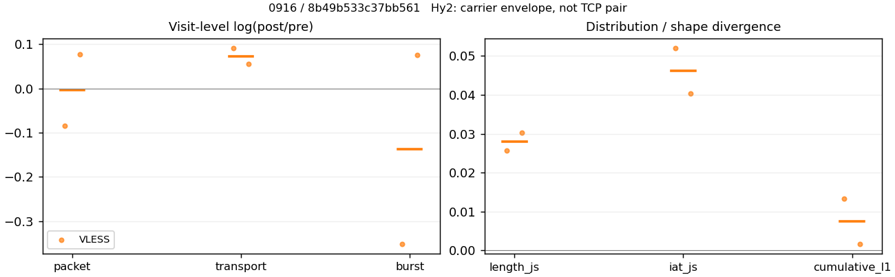
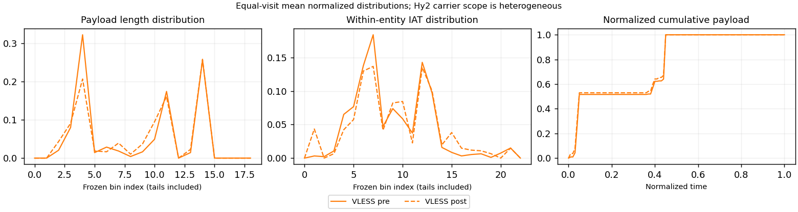

# 0916 · 条目 033 · bilibili.com

目标：https://www.bilibili.com/video/BV1ys411472E/?p=2

活动标签：bilibili.com::video_playback。选定访问 15 次。

[返回总索引](../../README.md) · [统计口径](../../methods.md)

## 覆盖与资格（每次访问均保留）

| 部署 | 重复 | 主请求路由 | 活动状态 | 代理比较 | DIRECT pre | 请求 proxy/direct/unresolved | 错误 |
| --- | --- | --- | --- | --- | --- | --- | --- |
| Hy2 | 1 | direct | passed | 0 | 1 | 0/313/0 | [] |
| Hy2 | 2 | direct | passed | 0 | 1 | 0/73/0 | [] |
| Hy2 | 3 | direct | passed | 0 | 1 | 0/232/0 | [] |
| Hy2 | 4 | direct | passed | 0 | 1 | 0/303/0 | [] |
| Hy2 | 5 | direct | passed | 0 | 1 | 0/73/0 | [] |
| SS | 1 | direct | passed | 0 | 1 | 0/298/0 | [] |
| SS | 2 | direct | passed | 0 | 1 | 0/80/0 | [] |
| SS | 3 | direct | passed | 0 | 1 | 0/251/0 | [] |
| SS | 4 | direct | passed | 0 | 1 | 0/309/0 | [] |
| SS | 5 | direct | passed | 0 | 1 | 0/76/0 | [] |
| VLESS | 1 | direct | passed | 0 | 1 | 0/310/0 | [] |
| VLESS | 2 | direct | passed | 1 | 1 | 37/213/0 | [] |
| VLESS | 3 | direct | passed | 0 | 1 | 0/249/0 | [] |
| VLESS | 4 | direct | passed | 1 | 1 | 37/277/0 | [] |
| VLESS | 5 | direct | passed | 0 | 1 | 0/238/0 | [] |

主请求非 proxy 的统计仅解释为已索引的辅助代理连接或 DIRECT 观测，不代表目标业务经代理传输。播放确认与配对资格是两道不同的门。

图中散点为单次访问，短线为重复中位数；Hy2 是共享载体包络，不能与 TCP 配对作等范围因果对比。

形态图先逐访问归一化，再对访问等权平均；实线 pre，虚线 post。分箱序号及边界见 methods，不将分箱索引误解为长度或时间。

## 每次访问的关键观测

### SS

范围：`direct_pre_only`。每格 pre → post；空值为不可观测/不适用。

| 重复 | 包数 | 载荷字节 | burst | TCP FR | IAT中位µs | length JS | IAT JS |
| --- | --- | --- | --- | --- | --- | --- | --- |
| 1 | 4162 → — | 8.2e+06 → — | 2689 → — | 458 → — | 95.585 → — | — | — |
| 2 | 1896 → — | 4.362e+06 → — | 1301 → — | 111 → — | 43.268 → — | — | — |
| 3 | 3809 → — | 6.2412e+06 → — | 2708 → — | 330 → — | 124.48 → — | — | — |
| 4 | 4321 → — | 8.3107e+06 → — | 2748 → — | 561 → — | 91.915 → — | — | — |
| 5 | 1404 → — | 3.4501e+06 → — | 877 → — | 109 → — | 52.598 → — | — | — |

完整标量统计：中位数 [min,max]；Δ 为重复内逐访问变换的中位数，MAD 未缩放。n 为可用变换数；DIRECT-only 的 nΔ=0 不代表 pre 不可用。

| scope | 特征 | pre | post | Δ | IQRΔ | MADΔ | nΔ |
| --- | --- | --- | --- | --- | --- | --- | --- |
| direct_pre_only | active_span_sum_s_1000ms | 21.917 [6.0621, 41.137] | — | — | — | — | 0 |
| direct_pre_only | active_span_sum_s_100ms | 10.238 [2.3785, 13.816] | — | — | — | — | 0 |
| direct_pre_only | active_span_sum_s_500ms | 17.206 [5.4439, 26.799] | — | — | — | — | 0 |
| direct_pre_only | burst_bytes_iqr | 3387 [2640, 5712] | — | — | — | — | 0 |
| direct_pre_only | burst_bytes_mad | 64 [31, 80] | — | — | — | — | 0 |
| direct_pre_only | burst_bytes_max | 27944 [20744, 29128] | — | — | — | — | 0 |
| direct_pre_only | burst_bytes_mean | 3049.5 [2304.7, 3934] | — | — | — | — | 0 |
| direct_pre_only | burst_bytes_median | 64 [31, 80] | — | — | — | — | 0 |
| direct_pre_only | burst_bytes_min | 0 [0, 0] | — | — | — | — | 0 |
| direct_pre_only | burst_bytes_p95 | 17840 [11520, 20480] | — | — | — | — | 0 |
| direct_pre_only | burst_bytes_q25 | 0 [0, 0] | — | — | — | — | 0 |
| direct_pre_only | burst_bytes_q75 | 3387 [2640, 5712] | — | — | — | — | 0 |
| direct_pre_only | burst_bytes_std | 5459.9 [4196.9, 6592.1] | — | — | — | — | 0 |
| direct_pre_only | burst_count | 2689 [877, 2748] | — | — | — | — | 0 |
| direct_pre_only | burst_duration_ms_iqr | 0.049992 [0.021123, 0.22562] | — | — | — | — | 0 |
| direct_pre_only | burst_duration_ms_mad | 0 [0, 0] | — | — | — | — | 0 |
| direct_pre_only | burst_duration_ms_max | 13683 [3580.1, 15001] | — | — | — | — | 0 |
| direct_pre_only | burst_duration_ms_mean | 73.07 [31.804, 126.91] | — | — | — | — | 0 |
| direct_pre_only | burst_duration_ms_median | 0 [0, 0] | — | — | — | — | 0 |
| direct_pre_only | burst_duration_ms_min | 0 [0, 0] | — | — | — | — | 0 |
| direct_pre_only | burst_duration_ms_p95 | 33.309 [13.792, 72.368] | — | — | — | — | 0 |
| direct_pre_only | burst_duration_ms_q25 | 0 [0, 0] | — | — | — | — | 0 |
| direct_pre_only | burst_duration_ms_q75 | 0.049992 [0.021123, 0.22562] | — | — | — | — | 0 |
| direct_pre_only | burst_duration_ms_std | 628.47 [291.33, 1117.3] | — | — | — | — | 0 |
| direct_pre_only | burst_packets_iqr | 1 [1, 1] | — | — | — | — | 0 |
| direct_pre_only | burst_packets_mad | 0 [0, 0] | — | — | — | — | 0 |
| direct_pre_only | burst_packets_max | 8 [8, 10] | — | — | — | — | 0 |
| direct_pre_only | burst_packets_mean | 1.5478 [1.4066, 1.6009] | — | — | — | — | 0 |
| direct_pre_only | burst_packets_median | 1 [1, 1] | — | — | — | — | 0 |
| direct_pre_only | burst_packets_min | 1 [1, 1] | — | — | — | — | 0 |
| direct_pre_only | burst_packets_p95 | 3 [3, 3] | — | — | — | — | 0 |
| direct_pre_only | burst_packets_q25 | 1 [1, 1] | — | — | — | — | 0 |
| direct_pre_only | burst_packets_q75 | 2 [2, 2] | — | — | — | — | 0 |
| direct_pre_only | burst_packets_std | 0.90939 [0.79682, 0.93725] | — | — | — | — | 0 |
| direct_pre_only | connection_span_concurrency_max | 15 [9, 26] | — | — | — | — | 0 |
| direct_pre_only | direction_entropy | 0.71359 [0.51724, 0.76304] | — | — | — | — | 0 |
| direct_pre_only | down_burst_count | 1329 [430, 1348] | — | — | — | — | 0 |
| direct_pre_only | down_ip_bytes | 6.1661e+06 [3.4273e+06, 8.119e+06] | — | — | — | — | 0 |
| direct_pre_only | down_packets | 2166 [879, 2529] | — | — | — | — | 0 |
| direct_pre_only | down_transport_bytes | 6.0532e+06 [3.3815e+06, 7.987e+06] | — | — | — | — | 0 |
| direct_pre_only | duration_s | 61.715 [4.9283, 87.6] | — | — | — | — | 0 |
| direct_pre_only | entity_count | 27 [13, 52] | — | — | — | — | 0 |
| direct_pre_only | fr_runs | 330 [109, 561] | — | — | — | — | 0 |
| direct_pre_only | fr_runs_per_packet | 0.15843 [0.098143, 0.23278] | — | — | — | — | 0 |
| direct_pre_only | fr_switches | 303 [92, 509] | — | — | — | — | 0 |
| direct_pre_only | fr_switches_per_possible_transition | 0.14737 [0.087657, 0.21586] | — | — | — | — | 0 |
| direct_pre_only | full_retransmission_fraction | 0.0036755 [0.0026371, 0.0067114] | — | — | — | — | 0 |
| direct_pre_only | full_retransmission_packets | 14 [5, 29] | — | — | — | — | 0 |
| direct_pre_only | iat_count | 3782 [1387, 4269] | — | — | — | — | 0 |
| direct_pre_only | iat_median_us | 91.915 [43.268, 124.48] | — | — | — | — | 0 |
| direct_pre_only | iat_us_iqr | 780.13 [206.41, 930.84] | — | — | — | — | 0 |
| direct_pre_only | iat_us_mad | 83.775 [36.381, 116.94] | — | — | — | — | 0 |
| direct_pre_only | iat_us_max | 1.5001e+07 [3.5801e+06, 1.5004e+07] | — | — | — | — | 0 |
| direct_pre_only | iat_us_mean | 2.1142e+05 [20738, 3.1994e+05] | — | — | — | — | 0 |
| direct_pre_only | iat_us_median | 91.915 [43.268, 124.48] | — | — | — | — | 0 |
| direct_pre_only | iat_us_min | 0.116 [0.074, 0.83] | — | — | — | — | 0 |
| direct_pre_only | iat_us_p95 | 53115 [11141, 68664] | — | — | — | — | 0 |
| direct_pre_only | iat_us_q25 | 16.3 [12.562, 27.701] | — | — | — | — | 0 |
| direct_pre_only | iat_us_q75 | 796.43 [218.98, 951.77] | — | — | — | — | 0 |
| direct_pre_only | iat_us_std | 1.5736e+06 [2.3216e+05, 2.0117e+06] | — | — | — | — | 0 |
| direct_pre_only | idle_gap_count_1000ms | 85 [7, 107] | — | — | — | — | 0 |
| direct_pre_only | idle_gap_count_100ms | 142 [22, 175] | — | — | — | — | 0 |
| direct_pre_only | idle_gap_count_500ms | 108 [7, 118] | — | — | — | — | 0 |
| direct_pre_only | idle_gap_sum_s_1000ms | 861.42 [22.701, 1188.1] | — | — | — | — | 0 |
| direct_pre_only | idle_gap_sum_s_100ms | 888.74 [26.384, 1199.8] | — | — | — | — | 0 |
| direct_pre_only | idle_gap_sum_s_500ms | 875.75 [22.701, 1192.8] | — | — | — | — | 0 |
| direct_pre_only | ip_bytes | 6.4398e+06 [3.5234e+06, 8.5366e+06] | — | — | — | — | 0 |
| direct_pre_only | length_iqr | 5178 [4074, 6752] | — | — | — | — | 0 |
| direct_pre_only | length_mad | 2338 [2220, 2431] | — | — | — | — | 0 |
| direct_pre_only | length_max | 8948 [8920, 8948] | — | — | — | — | 0 |
| direct_pre_only | length_mean | 3448.4 [2996.2, 4112.1] | — | — | — | — | 0 |
| direct_pre_only | length_median | 2856 [2640, 2856] | — | — | — | — | 0 |
| direct_pre_only | length_min | 30 [9, 31] | — | — | — | — | 0 |
| direct_pre_only | length_p95 | 8920 [8920, 8920] | — | — | — | — | 0 |
| direct_pre_only | length_q25 | 582 [478.5, 1638] | — | — | — | — | 0 |
| direct_pre_only | length_q75 | 5760 [5019.5, 8192] | — | — | — | — | 0 |
| direct_pre_only | length_std | 3102.4 [2762.3, 3245] | — | — | — | — | 0 |
| direct_pre_only | nonempty_entity_count | 27 [13, 52] | — | — | — | — | 0 |
| direct_pre_only | nonempty_packets | 2083 [839, 2410] | — | — | — | — | 0 |
| direct_pre_only | offload_suspect_fraction | 0.35848 [0.33421, 0.45464] | — | — | — | — | 0 |
| direct_pre_only | packet_count | 3809 [1404, 4321] | — | — | — | — | 0 |
| direct_pre_only | rtt_median_ms | 0.074019 [0.051391, 0.094852] | — | — | — | — | 0 |
| direct_pre_only | rtt_sample_count | 1518 [519, 1689] | — | — | — | — | 0 |
| direct_pre_only | tcp_ack_count | 3781 [1385, 4269] | — | — | — | — | 0 |
| direct_pre_only | tcp_fin_count | 54 [26, 104] | — | — | — | — | 0 |
| direct_pre_only | tcp_packet_count | 3809 [1404, 4321] | — | — | — | — | 0 |
| direct_pre_only | tcp_rst_count | 2 [0, 2] | — | — | — | — | 0 |
| direct_pre_only | tcp_syn_count | 54 [26, 104] | — | — | — | — | 0 |
| direct_pre_only | tcp_window_raw_median | 65535 [65535, 65535] | — | — | — | — | 0 |
| direct_pre_only | transition_entropy | 0.5268 [0.34248, 0.64786] | — | — | — | — | 0 |
| direct_pre_only | transition_n_mm | 1511 [667, 1686] | — | — | — | — | 0 |
| direct_pre_only | transition_n_mp | 139 [38, 230] | — | — | — | — | 0 |
| direct_pre_only | transition_n_pm | 164 [54, 279] | — | — | — | — | 0 |
| direct_pre_only | transition_n_pp | 242 [63, 261] | — | — | — | — | 0 |
| direct_pre_only | transition_p_mm | 0.91576 [0.87411, 0.95648] | — | — | — | — | 0 |
| direct_pre_only | transition_p_mp | 0.084242 [0.043522, 0.12589] | — | — | — | — | 0 |
| direct_pre_only | transition_p_pm | 0.46154 [0.40394, 0.52542] | — | — | — | — | 0 |
| direct_pre_only | transition_p_pp | 0.53846 [0.47458, 0.59606] | — | — | — | — | 0 |
| direct_pre_only | transport_bytes | 6.2412e+06 [3.4501e+06, 8.3107e+06] | — | — | — | — | 0 |
| direct_pre_only | up_burst_count | 1360 [447, 1400] | — | — | — | — | 0 |
| direct_pre_only | up_byte_fraction | 0.030118 [0.015202, 0.038943] | — | — | — | — | 0 |
| direct_pre_only | up_ip_bytes | 2.7378e+05 [96053, 4.1759e+05] | — | — | — | — | 0 |
| direct_pre_only | up_packets | 1643 [525, 1792] | — | — | — | — | 0 |
| direct_pre_only | up_transport_bytes | 1.8797e+05 [66310, 3.2364e+05] | — | — | — | — | 0 |
| direct_pre_only | zero_iat_count | 0 [0, 0] | — | — | — | — | 0 |
| direct_pre_only | zero_iat_fraction | 0 [0, 0] | — | — | — | — | 0 |

### VLESS

范围：`direct_pre_only`。每格 pre → post；空值为不可观测/不适用。

| 重复 | 包数 | 载荷字节 | burst | TCP FR | IAT中位µs | length JS | IAT JS |
| --- | --- | --- | --- | --- | --- | --- | --- |
| 1 | 4550 → — | 7.1755e+06 → — | 3382 → — | 403 → — | 108.79 → — | — | — |
| 2 | 3036 → — | 5.9739e+06 → — | 1927 → — | 361 → — | 67.959 → — | — | — |
| 3 | 3461 → — | 5.5189e+06 → — | 2314 → — | 330 → — | 102.73 → — | — | — |
| 4 | 3711 → — | 7.7657e+06 → — | 2346 → — | 416 → — | 71.105 → — | — | — |
| 5 | 2570 → — | 5.0132e+06 → — | 1648 → — | 273 → — | 71.024 → — | — | — |

范围：`exclusive_page`。每格 pre → post；空值为不可观测/不适用。

| 重复 | 包数 | 载荷字节 | burst | TCP FR | IAT中位µs | length JS | IAT JS |
| --- | --- | --- | --- | --- | --- | --- | --- |
| 1 | — | — | — | — | — | — | — |
| 2 | 480 → 441 | 2.7526e+05 → 3.0145e+05 | 419 → 295 | 18 → 24 | 107.08 → 486.72 | 0.025667 | 0.051953 |
| 3 | — | — | — | — | — | — | — |
| 4 | 460 → 497 | 2.8475e+05 → 3.0103e+05 | 380 → 410 | 12 → 16 | 155.17 → 247.38 | 0.030338 | 0.040389 |
| 5 | — | — | — | — | — | — | — |

完整标量统计：中位数 [min,max]；Δ 为重复内逐访问变换的中位数，MAD 未缩放。n 为可用变换数；DIRECT-only 的 nΔ=0 不代表 pre 不可用。

| scope | 特征 | pre | post | Δ | IQRΔ | MADΔ | nΔ |
| --- | --- | --- | --- | --- | --- | --- | --- |
| direct_pre_only | active_span_sum_s_1000ms | 27.445 [18.285, 34.089] | — | — | — | — | 0 |
| direct_pre_only | active_span_sum_s_100ms | 8.9507 [7.832, 11.076] | — | — | — | — | 0 |
| direct_pre_only | active_span_sum_s_500ms | 13.643 [12.221, 22.382] | — | — | — | — | 0 |
| direct_pre_only | burst_bytes_iqr | 2856 [2220, 3368] | — | — | — | — | 0 |
| direct_pre_only | burst_bytes_mad | 35 [31, 88.5] | — | — | — | — | 0 |
| direct_pre_only | burst_bytes_max | 26560 [20480, 28672] | — | — | — | — | 0 |
| direct_pre_only | burst_bytes_mean | 3042 [2121.7, 3310.2] | — | — | — | — | 0 |
| direct_pre_only | burst_bytes_median | 35 [31, 88.5] | — | — | — | — | 0 |
| direct_pre_only | burst_bytes_min | 0 [0, 0] | — | — | — | — | 0 |
| direct_pre_only | burst_bytes_p95 | 20480 [10449, 20480] | — | — | — | — | 0 |
| direct_pre_only | burst_bytes_q25 | 0 [0, 0] | — | — | — | — | 0 |
| direct_pre_only | burst_bytes_q75 | 2856 [2220, 3368] | — | — | — | — | 0 |
| direct_pre_only | burst_bytes_std | 5834.8 [3806.6, 5972.7] | — | — | — | — | 0 |
| direct_pre_only | burst_count | 2314 [1648, 3382] | — | — | — | — | 0 |
| direct_pre_only | burst_duration_ms_iqr | 0.098204 [0, 0.15572] | — | — | — | — | 0 |
| direct_pre_only | burst_duration_ms_mad | 0 [0, 0] | — | — | — | — | 0 |
| direct_pre_only | burst_duration_ms_max | 15000 [13107, 15001] | — | — | — | — | 0 |
| direct_pre_only | burst_duration_ms_mean | 146.71 [54.339, 169.23] | — | — | — | — | 0 |
| direct_pre_only | burst_duration_ms_median | 0 [0, 0] | — | — | — | — | 0 |
| direct_pre_only | burst_duration_ms_min | 0 [0, 0] | — | — | — | — | 0 |
| direct_pre_only | burst_duration_ms_p95 | 68.44 [29.584, 70.502] | — | — | — | — | 0 |
| direct_pre_only | burst_duration_ms_q25 | 0 [0, 0] | — | — | — | — | 0 |
| direct_pre_only | burst_duration_ms_q75 | 0.098204 [0, 0.15572] | — | — | — | — | 0 |
| direct_pre_only | burst_duration_ms_std | 1107.1 [589.7, 1379.9] | — | — | — | — | 0 |
| direct_pre_only | burst_packets_iqr | 1 [0, 1] | — | — | — | — | 0 |
| direct_pre_only | burst_packets_mad | 0 [0, 0] | — | — | — | — | 0 |
| direct_pre_only | burst_packets_max | 8 [7, 9] | — | — | — | — | 0 |
| direct_pre_only | burst_packets_mean | 1.5595 [1.3454, 1.5818] | — | — | — | — | 0 |
| direct_pre_only | burst_packets_median | 1 [1, 1] | — | — | — | — | 0 |
| direct_pre_only | burst_packets_min | 1 [1, 1] | — | — | — | — | 0 |
| direct_pre_only | burst_packets_p95 | 3 [3, 3] | — | — | — | — | 0 |
| direct_pre_only | burst_packets_q25 | 1 [1, 1] | — | — | — | — | 0 |
| direct_pre_only | burst_packets_q75 | 2 [1, 2] | — | — | — | — | 0 |
| direct_pre_only | burst_packets_std | 0.87445 [0.72438, 0.94765] | — | — | — | — | 0 |
| direct_pre_only | connection_span_concurrency_max | 15 [13, 20] | — | — | — | — | 0 |
| direct_pre_only | direction_entropy | 0.71517 [0.66521, 0.77555] | — | — | — | — | 0 |
| direct_pre_only | down_burst_count | 1143 [810, 1676] | — | — | — | — | 0 |
| direct_pre_only | down_ip_bytes | 5.859e+06 [4.9192e+06, 7.656e+06] | — | — | — | — | 0 |
| direct_pre_only | down_packets | 2029 [1510, 2574] | — | — | — | — | 0 |
| direct_pre_only | down_transport_bytes | 5.7645e+06 [4.8405e+06, 7.539e+06] | — | — | — | — | 0 |
| direct_pre_only | duration_s | 63.782 [61.85, 91.033] | — | — | — | — | 0 |
| direct_pre_only | entity_count | 28 [28, 35] | — | — | — | — | 0 |
| direct_pre_only | fr_runs | 361 [273, 416] | — | — | — | — | 0 |
| direct_pre_only | fr_runs_per_packet | 0.18854 [0.16056, 0.21235] | — | — | — | — | 0 |
| direct_pre_only | fr_switches | 326 [245, 388] | — | — | — | — | 0 |
| direct_pre_only | fr_switches_per_possible_transition | 0.17254 [0.1504, 0.1958] | — | — | — | — | 0 |
| direct_pre_only | full_retransmission_fraction | 0.0023057 [0.0017336, 0.0050584] | — | — | — | — | 0 |
| direct_pre_only | full_retransmission_packets | 8 [6, 13] | — | — | — | — | 0 |
| direct_pre_only | iat_count | 3433 [2542, 4520] | — | — | — | — | 0 |
| direct_pre_only | iat_median_us | 71.105 [67.959, 108.79] | — | — | — | — | 0 |
| direct_pre_only | iat_us_iqr | 584.05 [548.16, 935.6] | — | — | — | — | 0 |
| direct_pre_only | iat_us_mad | 63.395 [59.837, 97.578] | — | — | — | — | 0 |
| direct_pre_only | iat_us_max | 1.5001e+07 [1.5001e+07, 1.5002e+07] | — | — | — | — | 0 |
| direct_pre_only | iat_us_mean | 2.7839e+05 [1.6959e+05, 3.3737e+05] | — | — | — | — | 0 |
| direct_pre_only | iat_us_median | 71.105 [67.959, 108.79] | — | — | — | — | 0 |
| direct_pre_only | iat_us_min | 0.145 [0.023, 0.305] | — | — | — | — | 0 |
| direct_pre_only | iat_us_p95 | 49574 [36246, 71720] | — | — | — | — | 0 |
| direct_pre_only | iat_us_q25 | 16.408 [14.787, 31.742] | — | — | — | — | 0 |
| direct_pre_only | iat_us_q75 | 600.46 [562.95, 967.34] | — | — | — | — | 0 |
| direct_pre_only | iat_us_std | 1.8911e+06 [1.4099e+06, 2.0437e+06] | — | — | — | — | 0 |
| direct_pre_only | idle_gap_count_1000ms | 76 [59, 95] | — | — | — | — | 0 |
| direct_pre_only | idle_gap_count_100ms | 130 [90, 144] | — | — | — | — | 0 |
| direct_pre_only | idle_gap_count_500ms | 93 [67, 109] | — | — | — | — | 0 |
| direct_pre_only | idle_gap_sum_s_1000ms | 732.48 [627.39, 984.99] | — | — | — | — | 0 |
| direct_pre_only | idle_gap_sum_s_100ms | 755.67 [649.58, 1003.5] | — | — | — | — | 0 |
| direct_pre_only | idle_gap_sum_s_500ms | 744.18 [638.96, 999.14] | — | — | — | — | 0 |
| direct_pre_only | ip_bytes | 6.1324e+06 [5.1474e+06, 7.9592e+06] | — | — | — | — | 0 |
| direct_pre_only | length_iqr | 5121.5 [1780, 6465] | — | — | — | — | 0 |
| direct_pre_only | length_mad | 2320.5 [1428, 2512] | — | — | — | — | 0 |
| direct_pre_only | length_max | 8948 [8948, 8948] | — | — | — | — | 0 |
| direct_pre_only | length_mean | 3462.1 [2804.3, 3563.9] | — | — | — | — | 0 |
| direct_pre_only | length_median | 2807 [2640, 2856] | — | — | — | — | 0 |
| direct_pre_only | length_min | 31 [3, 31] | — | — | — | — | 0 |
| direct_pre_only | length_p95 | 8920 [8640, 8920] | — | — | — | — | 0 |
| direct_pre_only | length_q25 | 592.5 [287, 1076] | — | — | — | — | 0 |
| direct_pre_only | length_q75 | 5712 [2856, 6752] | — | — | — | — | 0 |
| direct_pre_only | length_std | 3171.3 [2441.1, 3356.4] | — | — | — | — | 0 |
| direct_pre_only | nonempty_entity_count | 28 [28, 35] | — | — | — | — | 0 |
| direct_pre_only | nonempty_packets | 1968 [1448, 2510] | — | — | — | — | 0 |
| direct_pre_only | offload_suspect_fraction | 0.35143 [0.33735, 0.38184] | — | — | — | — | 0 |
| direct_pre_only | packet_count | 3461 [2570, 4550] | — | — | — | — | 0 |
| direct_pre_only | rtt_median_ms | 0.079076 [0.066654, 0.095962] | — | — | — | — | 0 |
| direct_pre_only | rtt_sample_count | 1334 [987, 1908] | — | — | — | — | 0 |
| direct_pre_only | tcp_ack_count | 3430 [2538, 4516] | — | — | — | — | 0 |
| direct_pre_only | tcp_fin_count | 55 [53, 68] | — | — | — | — | 0 |
| direct_pre_only | tcp_packet_count | 3461 [2570, 4550] | — | — | — | — | 0 |
| direct_pre_only | tcp_rst_count | 3 [1, 4] | — | — | — | — | 0 |
| direct_pre_only | tcp_syn_count | 56 [56, 70] | — | — | — | — | 0 |
| direct_pre_only | tcp_window_raw_median | 65535 [65535, 65535] | — | — | — | — | 0 |
| direct_pre_only | transition_entropy | 0.58328 [0.51848, 0.60362] | — | — | — | — | 0 |
| direct_pre_only | transition_n_mm | 1417 [981, 1875] | — | — | — | — | 0 |
| direct_pre_only | transition_n_mp | 146 [109, 182] | — | — | — | — | 0 |
| direct_pre_only | transition_n_pm | 180 [136, 206] | — | — | — | — | 0 |
| direct_pre_only | transition_n_pp | 208 [163, 232] | — | — | — | — | 0 |
| direct_pre_only | transition_p_mm | 0.9 [0.88956, 0.91553] | — | — | — | — | 0 |
| direct_pre_only | transition_p_mp | 0.1 [0.084473, 0.11044] | — | — | — | — | 0 |
| direct_pre_only | transition_p_pm | 0.46296 [0.41212, 0.52478] | — | — | — | — | 0 |
| direct_pre_only | transition_p_pp | 0.53704 [0.47522, 0.58788] | — | — | — | — | 0 |
| direct_pre_only | transport_bytes | 5.9739e+06 [5.0132e+06, 7.7657e+06] | — | — | — | — | 0 |
| direct_pre_only | up_burst_count | 1171 [838, 1706] | — | — | — | — | 0 |
| direct_pre_only | up_byte_fraction | 0.03342 [0.029181, 0.035054] | — | — | — | — | 0 |
| direct_pre_only | up_ip_bytes | 2.734e+05 [2.2813e+05, 3.3791e+05] | — | — | — | — | 0 |
| direct_pre_only | up_packets | 1432 [1060, 1976] | — | — | — | — | 0 |
| direct_pre_only | up_transport_bytes | 2.0941e+05 [1.7268e+05, 2.3487e+05] | — | — | — | — | 0 |
| direct_pre_only | zero_iat_count | 0 [0, 0] | — | — | — | — | 0 |
| direct_pre_only | zero_iat_fraction | 0 [0, 0] | — | — | — | — | 0 |
| exclusive_page | active_span_sum_s_1000ms | 2.6805 [2.2002, 3.1609] | 6.4157 [5.3455, 7.4858] | 0.87493 | 0.012777 | 0.012777 | 2 |
| exclusive_page | active_span_sum_s_100ms | 0.92516 [0.8971, 0.95321] | 1.8936 [1.8555, 1.9318] | 0.71655 | 0.010166 | 0.010166 | 2 |
| exclusive_page | active_span_sum_s_500ms | 2.4167 [2.2002, 2.6333] | 4.2298 [3.8232, 4.6363] | 0.55912 | 0.0065758 | 0.0065758 | 2 |
| exclusive_page | burst_bytes_iqr | 1176.5 [913, 1440] | 1723.5 [1440, 2007] | 0.39383 | 0.39383 | 0.39383 | 2 |
| exclusive_page | burst_bytes_mad | 0 [0, 0] | 12 [0, 24] | — | — | — | 0 |
| exclusive_page | burst_bytes_max | 4268 [4264, 4272] | 4617.5 [4403, 4832] | 0.077628 | 0.047424 | 0.047424 | 2 |
| exclusive_page | burst_bytes_mean | 703.14 [656.94, 749.34] | 878.05 [734.22, 1021.9] | 0.21071 | 0.2311 | 0.2311 | 2 |
| exclusive_page | burst_bytes_median | 0 [0, 0] | 12 [0, 24] | — | — | — | 0 |
| exclusive_page | burst_bytes_min | 0 [0, 0] | 0 [0, 0] | — | — | — | 0 |
| exclusive_page | burst_bytes_p95 | 2852 [2824, 2880] | 2860 [2824, 2896] | 0.0027701 | 0.022406 | 0.022406 | 2 |
| exclusive_page | burst_bytes_q25 | 0 [0, 0] | 0 [0, 0] | — | — | — | 0 |
| exclusive_page | burst_bytes_q75 | 1176.5 [913, 1440] | 1723.5 [1440, 2007] | 0.39383 | 0.39383 | 0.39383 | 2 |
| exclusive_page | burst_bytes_std | 1156.8 [1127, 1186.7] | 1175.8 [1100.3, 1251.3] | 0.014548 | 0.09008 | 0.09008 | 2 |
| exclusive_page | burst_count | 399.5 [380, 419] | 352.5 [295, 410] | -0.13745 | 0.21344 | 0.21344 | 2 |
| exclusive_page | burst_duration_ms_iqr | 0 [0, 0] | 1.1265 [0, 2.253] | — | — | — | 0 |
| exclusive_page | burst_duration_ms_mad | 0 [0, 0] | 0 [0, 0] | — | — | — | 0 |
| exclusive_page | burst_duration_ms_max | 5401.3 [1672.9, 9129.7] | 15036 [15011, 15060] | 1.3474 | 0.85014 | 0.85014 | 2 |
| exclusive_page | burst_duration_ms_mean | 33.791 [17.613, 49.969] | 95.188 [77.122, 113.25] | 1.1475 | 0.32927 | 0.32927 | 2 |
| exclusive_page | burst_duration_ms_median | 0 [0, 0] | 0 [0, 0] | — | — | — | 0 |
| exclusive_page | burst_duration_ms_min | 0 [0, 0] | 0 [0, 0] | — | — | — | 0 |
| exclusive_page | burst_duration_ms_p95 | 5.275 [5.2364, 5.3136] | 16.365 [1.7548, 30.974] | 0.3348 | 1.4427 | 1.4427 | 2 |
| exclusive_page | burst_duration_ms_q25 | 0 [0, 0] | 0 [0, 0] | — | — | — | 0 |
| exclusive_page | burst_duration_ms_q75 | 0 [0, 0] | 1.1265 [0, 2.253] | — | — | — | 0 |
| exclusive_page | burst_duration_ms_std | 340.61 [149.35, 531.87] | 1139.6 [1047.4, 1231.8] | 1.3938 | 0.55396 | 0.55396 | 2 |
| exclusive_page | burst_packets_iqr | 0 [0, 0] | 0.5 [0, 1] | — | — | — | 0 |
| exclusive_page | burst_packets_mad | 0 [0, 0] | 0 [0, 0] | — | — | — | 0 |
| exclusive_page | burst_packets_max | 6.5 [3, 10] | 7.5 [7, 8] | 0.31208 | 0.53522 | 0.53522 | 2 |
| exclusive_page | burst_packets_mean | 1.1781 [1.1456, 1.2105] | 1.3536 [1.2122, 1.4949] | 0.13377 | 0.13239 | 0.13239 | 2 |
| exclusive_page | burst_packets_median | 1 [1, 1] | 1 [1, 1] | 0 | 0 | 0 | 2 |
| exclusive_page | burst_packets_min | 1 [1, 1] | 1 [1, 1] | 0 | 0 | 0 | 2 |
| exclusive_page | burst_packets_p95 | 2 [2, 2] | 2.5 [2, 3] | 0.20273 | 0.20273 | 0.20273 | 2 |
| exclusive_page | burst_packets_q25 | 1 [1, 1] | 1 [1, 1] | 0 | 0 | 0 | 2 |
| exclusive_page | burst_packets_q75 | 1 [1, 1] | 1.5 [1, 2] | 0.34657 | 0.34657 | 0.34657 | 2 |
| exclusive_page | burst_packets_std | 0.51918 [0.39119, 0.64718] | 0.82554 [0.71999, 0.93109] | 0.48689 | 0.38027 | 0.38027 | 2 |
| exclusive_page | connection_span_concurrency_max | 2 [2, 2] | 2 [2, 2] | 0 | 0 | 0 | 2 |
| exclusive_page | cumulative_l1 | — | — | 0.0075174 | 0.0057631 | 0.0057631 | 2 |
| exclusive_page | cumulative_max | — | — | 0.058485 | 0.0029937 | 0.0029937 | 2 |
| exclusive_page | direction_entropy | 0.70745 [0.68805, 0.72686] | 0.49705 [0.45054, 0.54356] | -0.2104 | 0.027107 | 0.027107 | 2 |
| exclusive_page | down_burst_count | 198.5 [189, 208] | 175 [146, 204] | -0.13878 | 0.21515 | 0.21515 | 2 |
| exclusive_page | down_ip_bytes | 2.8268e+05 [2.7685e+05, 2.8852e+05] | 2.9996e+05 [2.9782e+05, 3.0211e+05] | 0.05952 | 0.013473 | 0.013473 | 2 |
| exclusive_page | down_packets | 243.5 [240, 247] | 254 [253, 255] | 0.042313 | 0.018312 | 0.018312 | 2 |
| exclusive_page | down_transport_bytes | 2.7e+05 [2.6398e+05, 2.7602e+05] | 2.8674e+05 [2.8464e+05, 2.8884e+05] | 0.060354 | 0.014969 | 0.014969 | 2 |
| exclusive_page | duration_s | 61.503 [58.3, 64.705] | 61.449 [58.255, 64.644] | -0.00086604 | 8.0645e-05 | 8.0645e-05 | 2 |
| exclusive_page | entity_count | 2.5 [2, 3] | 2.5 [2, 3] | 0 | 0 | 0 | 2 |
| exclusive_page | fr_runs | 15 [12, 18] | 20 [16, 24] | 0.28768 | 0 | 0 | 2 |
| exclusive_page | fr_runs_per_packet | 0.06168 [0.04898, 0.07438] | 0.082787 [0.065574, 0.1] | 0.021107 | 0.0045128 | 0.0045128 | 2 |
| exclusive_page | fr_switches | 12.5 [10, 15] | 17.5 [14, 21] | 0.33647 | 0 | 0 | 2 |
| exclusive_page | fr_switches_per_possible_transition | 0.051957 [0.041152, 0.062762] | 0.073229 [0.057851, 0.088608] | 0.021273 | 0.0045736 | 0.0045736 | 2 |
| exclusive_page | full_retransmission_fraction | 0.0010417 [0, 0.0020833] | 0 [0, 0] | -0.0010417 | 0.0010417 | 0.0010417 | 2 |
| exclusive_page | full_retransmission_packets | 0.5 [0, 1] | 0 [0, 0] | — | — | — | 0 |
| exclusive_page | iat_count | 467.5 [458, 477] | 466.5 [438, 495] | -0.0038045 | 0.081493 | 0.081493 | 2 |
| exclusive_page | iat_js | — | — | 0.046171 | 0.0057821 | 0.0057821 | 2 |
| exclusive_page | iat_ks | — | — | 0.079561 | 0.038156 | 0.038156 | 2 |
| exclusive_page | iat_median_us | 131.12 [107.08, 155.17] | 367.05 [247.38, 486.72] | 0.9903 | 0.52386 | 0.52386 | 2 |
| exclusive_page | iat_us_iqr | 3008.3 [2922.8, 3093.8] | 4480.4 [4060.2, 4900.6] | 0.39431 | 0.12249 | 0.12249 | 2 |
| exclusive_page | iat_us_mad | 124.68 [100.21, 149.15] | 357.77 [237.92, 477.62] | 1.0143 | 0.54727 | 0.54727 | 2 |
| exclusive_page | iat_us_max | 1.5001e+07 [1.5001e+07, 1.5001e+07] | 1.5278e+07 [1.5251e+07, 1.5304e+07] | 0.018266 | 0.0017092 | 0.0017092 | 2 |
| exclusive_page | iat_us_mean | 2.1323e+05 [1.7188e+05, 2.5457e+05] | 2.1111e+05 [1.869e+05, 2.3533e+05] | 0.0025823 | 0.081188 | 0.081188 | 2 |
| exclusive_page | iat_us_median | 131.12 [107.08, 155.17] | 367.05 [247.38, 486.72] | 0.9903 | 0.52386 | 0.52386 | 2 |
| exclusive_page | iat_us_min | 0.3365 [0.039, 0.634] | 0.0415 [0.036, 0.047] | -1.341 | 1.5276 | 1.5276 | 2 |
| exclusive_page | iat_us_p95 | 12744 [10794, 14694] | 73623 [57879, 89367] | 1.7424 | 0.37144 | 0.37144 | 2 |
| exclusive_page | iat_us_q25 | 40.82 [36.281, 45.359] | 46.159 [44.264, 48.055] | 0.12831 | 0.15276 | 0.15276 | 2 |
| exclusive_page | iat_us_q75 | 3049.1 [2959.1, 3139.2] | 4526.5 [4104.4, 4948.6] | 0.39117 | 0.12306 | 0.12306 | 2 |
| exclusive_page | iat_us_std | 1.6318e+06 [1.452e+06, 1.8116e+06] | 1.644e+06 [1.5137e+06, 1.7743e+06] | 0.010402 | 0.031209 | 0.031209 | 2 |
| exclusive_page | iat_wasserstein_log1p_us | — | — | 0.4925 | 0.23859 | 0.23859 | 2 |
| exclusive_page | idle_gap_count_1000ms | 10.5 [9, 12] | 7 [6, 8] | -0.40547 | 0 | 0 | 2 |
| exclusive_page | idle_gap_count_100ms | 16.5 [16, 17] | 20.5 [19, 22] | 0.21484 | 0.10361 | 0.10361 | 2 |
| exclusive_page | idle_gap_count_500ms | 11 [10, 12] | 10 [10, 10] | -0.091161 | 0.091161 | 0.091161 | 2 |
| exclusive_page | idle_gap_sum_s_1000ms | 96.61 [78.826, 114.39] | 92.759 [74.376, 111.14] | -0.043476 | 0.014635 | 0.014635 | 2 |
| exclusive_page | idle_gap_sum_s_100ms | 98.365 [81.033, 115.7] | 97.281 [79.93, 114.63] | -0.011482 | 0.0022328 | 0.0022328 | 2 |
| exclusive_page | idle_gap_sum_s_500ms | 96.874 [79.353, 114.39] | 94.945 [77.225, 112.66] | -0.021211 | 0.0059742 | 0.0059742 | 2 |
| exclusive_page | ip_bytes | 3.0443e+05 [3.002e+05, 3.0866e+05] | 3.2582e+05 [3.2458e+05, 3.2706e+05] | 0.067993 | 0.010067 | 0.010067 | 2 |
| exclusive_page | length_iqr | 2204 [1656, 2752] | 2231.1 [1710.2, 2752] | 0.016117 | 0.016117 | 0.016117 | 2 |
| exclusive_page | length_js | — | — | 0.028002 | 0.0023354 | 0.0023354 | 2 |
| exclusive_page | length_ks | — | — | 0.096432 | 0.012073 | 0.012073 | 2 |
| exclusive_page | length_mad | 949.75 [559.5, 1340] | 1340 [1340, 1340] | 0.43669 | 0.43669 | 0.43669 | 2 |
| exclusive_page | length_max | 2971 [2896, 3046] | 2824 [2824, 2824] | -0.050426 | 0.025249 | 0.025249 | 2 |
| exclusive_page | length_mean | 1149.8 [1137.4, 1162.2] | 1244.9 [1233.7, 1256.1] | 0.079448 | 0.019763 | 0.019763 | 2 |
| exclusive_page | length_median | 999.5 [587, 1412] | 1412 [1412, 1412] | 0.43887 | 0.43887 | 0.43887 | 2 |
| exclusive_page | length_min | 24 [24, 24] | 22 [20, 24] | -0.091161 | 0.091161 | 0.091161 | 2 |
| exclusive_page | length_p95 | 2824 [2824, 2824] | 2824 [2824, 2824] | 0 | 0 | 0 | 2 |
| exclusive_page | length_q25 | 72 [72, 72] | 72 [72, 72] | 0 | 0 | 0 | 2 |
| exclusive_page | length_q75 | 2276 [1728, 2824] | 2303.1 [1782.2, 2824] | 0.015456 | 0.015456 | 0.015456 | 2 |
| exclusive_page | length_std | 1126.1 [1102.9, 1149.4] | 1089.2 [1064.2, 1114.3] | -0.033372 | 0.0023262 | 0.0023262 | 2 |
| exclusive_page | length_wasserstein_bytes | — | — | 104.33 | 19.062 | 19.062 | 2 |
| exclusive_page | nonempty_entity_count | 2.5 [2, 3] | 2.5 [2, 3] | 0 | 0 | 0 | 2 |
| exclusive_page | nonempty_packets | 243.5 [242, 245] | 242 [240, 244] | -0.0061944 | 0.0021044 | 0.0021044 | 2 |
| exclusive_page | offload_suspect_fraction | 0.14031 [0.13478, 0.14583] | 0.14615 [0.12676, 0.16553] | 0.0058388 | 0.013861 | 0.013861 | 2 |
| exclusive_page | packet_count | 470 [460, 480] | 469 [441, 497] | -0.0036888 | 0.081052 | 0.081052 | 2 |
| exclusive_page | rtt_median_ms | 0.067548 [0.065693, 0.069404] | 1.5035 [0.051082, 2.956] | 1.75 | 2.0566 | 2.0566 | 2 |
| exclusive_page | rtt_sample_count | 203 [189, 217] | 203 [180, 226] | -0.0040763 | 0.18286 | 0.18286 | 2 |
| exclusive_page | tcp_ack_count | 462.5 [454, 471] | 466.5 [438, 495] | 0.0069107 | 0.07955 | 0.07955 | 2 |
| exclusive_page | tcp_fin_count | 5 [4, 6] | 5 [4, 6] | 0 | 0 | 0 | 2 |
| exclusive_page | tcp_packet_count | 470 [460, 480] | 469 [441, 497] | -0.0036888 | 0.081052 | 0.081052 | 2 |
| exclusive_page | tcp_rst_count | 5 [4, 6] | 0 [0, 0] | — | — | — | 0 |
| exclusive_page | tcp_syn_count | 5 [4, 6] | 5 [4, 6] | 0 | 0 | 0 | 2 |
| exclusive_page | tcp_window_raw_median | 65374 [65290, 65456] | 139 [131, 147] | -6.1551 | 0.058887 | 0.058887 | 2 |
| exclusive_page | transition_entropy | 0.26146 [0.22108, 0.30185] | 0.3004 [0.25254, 0.34826] | 0.038936 | 0.0074789 | 0.0074789 | 2 |
| exclusive_page | transition_n_mm | 189 [184, 194] | 205.5 [198, 213] | 0.083383 | 0.010051 | 0.010051 | 2 |
| exclusive_page | transition_n_mp | 5 [4, 6] | 7.5 [6, 9] | 0.40547 | 0 | 0 | 2 |
| exclusive_page | transition_n_pm | 7.5 [6, 9] | 10 [8, 12] | 0.28768 | 0 | 0 | 2 |
| exclusive_page | transition_n_pp | 39.5 [39, 40] | 16.5 [15, 18] | -0.87701 | 0.078502 | 0.078502 | 2 |
| exclusive_page | transition_p_mm | 0.97411 [0.96842, 0.9798] | 0.96456 [0.95652, 0.9726] | -0.0095473 | 0.002352 | 0.002352 | 2 |
| exclusive_page | transition_p_mp | 0.02589 [0.020202, 0.031579] | 0.035438 [0.027397, 0.043478] | 0.0095473 | 0.002352 | 0.002352 | 2 |
| exclusive_page | transition_p_pm | 0.1585 [0.13333, 0.18367] | 0.37391 [0.34783, 0.4] | 0.21541 | 0.00091689 | 0.00091689 | 2 |
| exclusive_page | transition_p_pp | 0.8415 [0.81633, 0.86667] | 0.62609 [0.6, 0.65217] | -0.21541 | 0.00091689 | 0.00091689 | 2 |
| exclusive_page | transport_bytes | 2.8e+05 [2.7526e+05, 2.8475e+05] | 3.0124e+05 [3.0103e+05, 3.0145e+05] | 0.073254 | 0.017659 | 0.017659 | 2 |
| exclusive_page | up_burst_count | 201 [191, 211] | 177.5 [149, 206] | -0.13615 | 0.21176 | 0.21176 | 2 |
| exclusive_page | up_byte_fraction | 0.035808 [0.030658, 0.040958] | 0.048149 [0.040504, 0.055793] | 0.01234 | 0.0024945 | 0.0024945 | 2 |
| exclusive_page | up_ip_bytes | 21746 [20138, 23354] | 25856 [24949, 26763] | 0.17524 | 0.038987 | 0.038987 | 2 |
| exclusive_page | up_packets | 226.5 [220, 233] | 215 [188, 242] | -0.059643 | 0.15495 | 0.15495 | 2 |
| exclusive_page | up_transport_bytes | 10002 [8730, 11274] | 14506 [12193, 16819] | 0.36705 | 0.032957 | 0.032957 | 2 |
| exclusive_page | zero_iat_count | 0 [0, 0] | 0 [0, 0] | — | — | — | 0 |
| exclusive_page | zero_iat_fraction | 0 [0, 0] | 0 [0, 0] | 0 | 0 | 0 | 2 |

### Hy2

范围：`direct_pre_only`。每格 pre → post；空值为不可观测/不适用。

| 重复 | 包数 | 载荷字节 | burst | TCP FR | IAT中位µs | length JS | IAT JS |
| --- | --- | --- | --- | --- | --- | --- | --- |
| 1 | 3469 → — | 6.8604e+06 → — | 2287 → — | 342 → — | 62.734 → — | — | — |
| 2 | 1561 → — | 3.3635e+06 → — | 1057 → — | 99 → — | 46.694 → — | — | — |
| 3 | 3226 → — | 5.5092e+06 → — | 2117 → — | 373 → — | 86.752 → — | — | — |
| 4 | 4197 → — | 8.2317e+06 → — | 2751 → — | 517 → — | 88.078 → — | — | — |
| 5 | 1688 → — | 3.4209e+06 → — | 1229 → — | 98 → — | 42.189 → — | — | — |

完整标量统计：中位数 [min,max]；Δ 为重复内逐访问变换的中位数，MAD 未缩放。n 为可用变换数；DIRECT-only 的 nΔ=0 不代表 pre 不可用。

| scope | 特征 | pre | post | Δ | IQRΔ | MADΔ | nΔ |
| --- | --- | --- | --- | --- | --- | --- | --- |
| direct_pre_only | active_span_sum_s_1000ms | 36.014 [4.3552, 42.734] | — | — | — | — | 0 |
| direct_pre_only | active_span_sum_s_100ms | 9.8947 [2.465, 12.138] | — | — | — | — | 0 |
| direct_pre_only | active_span_sum_s_500ms | 21.671 [4.3552, 27.404] | — | — | — | — | 0 |
| direct_pre_only | burst_bytes_iqr | 2880 [2341, 4284] | — | — | — | — | 0 |
| direct_pre_only | burst_bytes_mad | 0 [0, 35] | — | — | — | — | 0 |
| direct_pre_only | burst_bytes_max | 28672 [23120, 29400] | — | — | — | — | 0 |
| direct_pre_only | burst_bytes_mean | 2992.3 [2602.4, 3182.1] | — | — | — | — | 0 |
| direct_pre_only | burst_bytes_median | 0 [0, 35] | — | — | — | — | 0 |
| direct_pre_only | burst_bytes_min | 0 [0, 0] | — | — | — | — | 0 |
| direct_pre_only | burst_bytes_p95 | 18030 [13952, 20480] | — | — | — | — | 0 |
| direct_pre_only | burst_bytes_q25 | 0 [0, 0] | — | — | — | — | 0 |
| direct_pre_only | burst_bytes_q75 | 2880 [2341, 4284] | — | — | — | — | 0 |
| direct_pre_only | burst_bytes_std | 5502.4 [4887.2, 5705.7] | — | — | — | — | 0 |
| direct_pre_only | burst_count | 2117 [1057, 2751] | — | — | — | — | 0 |
| direct_pre_only | burst_duration_ms_iqr | 0.045452 [0, 0.10034] | — | — | — | — | 0 |
| direct_pre_only | burst_duration_ms_mad | 0 [0, 0] | — | — | — | — | 0 |
| direct_pre_only | burst_duration_ms_max | 14991 [2205.8, 15001] | — | — | — | — | 0 |
| direct_pre_only | burst_duration_ms_mean | 79.311 [15.513, 81.695] | — | — | — | — | 0 |
| direct_pre_only | burst_duration_ms_median | 0 [0, 0] | — | — | — | — | 0 |
| direct_pre_only | burst_duration_ms_min | 0 [0, 0] | — | — | — | — | 0 |
| direct_pre_only | burst_duration_ms_p95 | 59.083 [12.773, 69.199] | — | — | — | — | 0 |
| direct_pre_only | burst_duration_ms_q25 | 0 [0, 0] | — | — | — | — | 0 |
| direct_pre_only | burst_duration_ms_q75 | 0.045452 [0, 0.10034] | — | — | — | — | 0 |
| direct_pre_only | burst_duration_ms_std | 658.01 [146.77, 938.98] | — | — | — | — | 0 |
| direct_pre_only | burst_packets_iqr | 1 [0, 1] | — | — | — | — | 0 |
| direct_pre_only | burst_packets_mad | 0 [0, 0] | — | — | — | — | 0 |
| direct_pre_only | burst_packets_max | 8 [7, 10] | — | — | — | — | 0 |
| direct_pre_only | burst_packets_mean | 1.5168 [1.3735, 1.5256] | — | — | — | — | 0 |
| direct_pre_only | burst_packets_median | 1 [1, 1] | — | — | — | — | 0 |
| direct_pre_only | burst_packets_min | 1 [1, 1] | — | — | — | — | 0 |
| direct_pre_only | burst_packets_p95 | 3 [3, 3] | — | — | — | — | 0 |
| direct_pre_only | burst_packets_q25 | 1 [1, 1] | — | — | — | — | 0 |
| direct_pre_only | burst_packets_q75 | 2 [1, 2] | — | — | — | — | 0 |
| direct_pre_only | burst_packets_std | 0.88813 [0.85173, 0.93494] | — | — | — | — | 0 |
| direct_pre_only | connection_span_concurrency_max | 16 [7, 29] | — | — | — | — | 0 |
| direct_pre_only | direction_entropy | 0.72034 [0.50933, 0.73377] | — | — | — | — | 0 |
| direct_pre_only | down_burst_count | 1040 [521, 1358] | — | — | — | — | 0 |
| direct_pre_only | down_ip_bytes | 5.3922e+06 [3.3508e+06, 8.0897e+06] | — | — | — | — | 0 |
| direct_pre_only | down_packets | 1894 [949, 2479] | — | — | — | — | 0 |
| direct_pre_only | down_transport_bytes | 5.2935e+06 [3.3013e+06, 7.9606e+06] | — | — | — | — | 0 |
| direct_pre_only | duration_s | 63.482 [61.773, 64.19] | — | — | — | — | 0 |
| direct_pre_only | entity_count | 19 [14, 37] | — | — | — | — | 0 |
| direct_pre_only | fr_runs | 342 [98, 517] | — | — | — | — | 0 |
| direct_pre_only | fr_runs_per_packet | 0.1699 [0.1056, 0.22227] | — | — | — | — | 0 |
| direct_pre_only | fr_switches | 323 [84, 482] | — | — | — | — | 0 |
| direct_pre_only | fr_switches_per_possible_transition | 0.16199 [0.091904, 0.21039] | — | — | — | — | 0 |
| direct_pre_only | full_retransmission_fraction | 0.0027898 [0.0012812, 0.0052418] | — | — | — | — | 0 |
| direct_pre_only | full_retransmission_packets | 8 [2, 22] | — | — | — | — | 0 |
| direct_pre_only | iat_count | 3189 [1546, 4162] | — | — | — | — | 0 |
| direct_pre_only | iat_median_us | 62.734 [42.189, 88.078] | — | — | — | — | 0 |
| direct_pre_only | iat_us_iqr | 433.19 [193.38, 815.33] | — | — | — | — | 0 |
| direct_pre_only | iat_us_mad | 54.847 [36.002, 79.579] | — | — | — | — | 0 |
| direct_pre_only | iat_us_max | 1.5001e+07 [1.5001e+07, 1.5002e+07] | — | — | — | — | 0 |
| direct_pre_only | iat_us_mean | 3.3419e+05 [1.951e+05, 4.3921e+05] | — | — | — | — | 0 |
| direct_pre_only | iat_us_median | 62.734 [42.189, 88.078] | — | — | — | — | 0 |
| direct_pre_only | iat_us_min | 0.228 [0.08, 0.34] | — | — | — | — | 0 |
| direct_pre_only | iat_us_p95 | 73259 [22933, 2.3985e+05] | — | — | — | — | 0 |
| direct_pre_only | iat_us_q25 | 15.736 [11.684, 18.5] | — | — | — | — | 0 |
| direct_pre_only | iat_us_q75 | 448.93 [205.06, 831.38] | — | — | — | — | 0 |
| direct_pre_only | iat_us_std | 2.1443e+06 [1.6136e+06, 2.4404e+06] | — | — | — | — | 0 |
| direct_pre_only | idle_gap_count_1000ms | 86 [25, 153] | — | — | — | — | 0 |
| direct_pre_only | idle_gap_count_100ms | 146 [37, 236] | — | — | — | — | 0 |
| direct_pre_only | idle_gap_count_500ms | 104 [27, 175] | — | — | — | — | 0 |
| direct_pre_only | idle_gap_sum_s_1000ms | 921.02 [293.75, 1674.7] | — | — | — | — | 0 |
| direct_pre_only | idle_gap_sum_s_100ms | 946.45 [299.09, 1705.3] | — | — | — | — | 0 |
| direct_pre_only | idle_gap_sum_s_500ms | 935.1 [295.36, 1690.1] | — | — | — | — | 0 |
| direct_pre_only | ip_bytes | 5.6777e+06 [3.4449e+06, 8.4508e+06] | — | — | — | — | 0 |
| direct_pre_only | length_iqr | 4645 [4145.8, 5722.2] | — | — | — | — | 0 |
| direct_pre_only | length_mad | 2126 [1759, 2401] | — | — | — | — | 0 |
| direct_pre_only | length_max | 8948 [8920, 8948] | — | — | — | — | 0 |
| direct_pre_only | length_mean | 3539 [3179, 3728.9] | — | — | — | — | 0 |
| direct_pre_only | length_median | 2856 [2640, 2856] | — | — | — | — | 0 |
| direct_pre_only | length_min | 31 [6, 31] | — | — | — | — | 0 |
| direct_pre_only | length_p95 | 8920 [8920, 8920] | — | — | — | — | 0 |
| direct_pre_only | length_q25 | 588.5 [579, 1566.2] | — | — | — | — | 0 |
| direct_pre_only | length_q75 | 5712 [5224, 6310.8] | — | — | — | — | 0 |
| direct_pre_only | length_std | 3038.4 [2881.8, 3232.1] | — | — | — | — | 0 |
| direct_pre_only | nonempty_entity_count | 19 [14, 37] | — | — | — | — | 0 |
| direct_pre_only | nonempty_packets | 1733 [902, 2326] | — | — | — | — | 0 |
| direct_pre_only | offload_suspect_fraction | 0.36322 [0.32269, 0.41825] | — | — | — | — | 0 |
| direct_pre_only | packet_count | 3226 [1561, 4197] | — | — | — | — | 0 |
| direct_pre_only | rtt_median_ms | 0.068478 [0.028882, 0.087613] | — | — | — | — | 0 |
| direct_pre_only | rtt_sample_count | 1215 [585, 1593] | — | — | — | — | 0 |
| direct_pre_only | tcp_ack_count | 3187 [1544, 4162] | — | — | — | — | 0 |
| direct_pre_only | tcp_fin_count | 37 [26, 72] | — | — | — | — | 0 |
| direct_pre_only | tcp_packet_count | 3226 [1561, 4197] | — | — | — | — | 0 |
| direct_pre_only | tcp_rst_count | 2 [0, 3] | — | — | — | — | 0 |
| direct_pre_only | tcp_syn_count | 38 [28, 74] | — | — | — | — | 0 |
| direct_pre_only | tcp_window_raw_median | 65535 [65535, 65535] | — | — | — | — | 0 |
| direct_pre_only | transition_entropy | 0.56239 [0.34204, 0.63142] | — | — | — | — | 0 |
| direct_pre_only | transition_n_mm | 1190 [740, 1599] | — | — | — | — | 0 |
| direct_pre_only | transition_n_mp | 150 [35, 225] | — | — | — | — | 0 |
| direct_pre_only | transition_n_pm | 169 [49, 257] | — | — | — | — | 0 |
| direct_pre_only | transition_n_pp | 170 [56, 228] | — | — | — | — | 0 |
| direct_pre_only | transition_p_mm | 0.90357 [0.87664, 0.95674] | — | — | — | — | 0 |
| direct_pre_only | transition_p_mp | 0.096431 [0.043263, 0.12336] | — | — | — | — | 0 |
| direct_pre_only | transition_p_pm | 0.46667 [0.42569, 0.55032] | — | — | — | — | 0 |
| direct_pre_only | transition_p_pp | 0.53333 [0.44968, 0.57431] | — | — | — | — | 0 |
| direct_pre_only | transport_bytes | 5.5092e+06 [3.3635e+06, 8.2317e+06] | — | — | — | — | 0 |
| direct_pre_only | up_burst_count | 1077 [536, 1393] | — | — | — | — | 0 |
| direct_pre_only | up_byte_fraction | 0.030049 [0.013774, 0.039167] | — | — | — | — | 0 |
| direct_pre_only | up_ip_bytes | 2.8083e+05 [83250, 3.6104e+05] | — | — | — | — | 0 |
| direct_pre_only | up_packets | 1332 [612, 1718] | — | — | — | — | 0 |
| direct_pre_only | up_transport_bytes | 2.0615e+05 [47118, 2.7116e+05] | — | — | — | — | 0 |
| direct_pre_only | zero_iat_count | 0 [0, 0] | — | — | — | — | 0 |
| direct_pre_only | zero_iat_fraction | 0 [0, 0] | — | — | — | — | 0 |

## 不同部署对比

以下是各部署自身重复中位数的差异，不按重复编号强行配对。跨 TCP/Hy2 的行标记异质观测范围。

| 视角 | 特征 | 部署A | 部署B | A中位 | B中位 | B−A | 比较口径 |
| --- | --- | --- | --- | --- | --- | --- | --- |
| pre | burst_count | VLESS | SS | 2314 | 2689 | 375 | same_scope_unpaired_visits |
| pre | burst_count | VLESS | Hy2 | 2314 | 2117 | -197 | same_scope_unpaired_visits |
| pre | burst_count | SS | Hy2 | 2689 | 2117 | -572 | same_scope_unpaired_visits |
| pre | connection_span_concurrency_max | VLESS | SS | 15 | 15 | 0 | same_scope_unpaired_visits |
| pre | connection_span_concurrency_max | VLESS | Hy2 | 15 | 16 | 1 | same_scope_unpaired_visits |
| pre | connection_span_concurrency_max | SS | Hy2 | 15 | 16 | 1 | same_scope_unpaired_visits |
| pre | direction_entropy | VLESS | SS | 0.71517 | 0.71359 | -0.0015763 | same_scope_unpaired_visits |
| pre | direction_entropy | VLESS | Hy2 | 0.71517 | 0.72034 | 0.0051657 | same_scope_unpaired_visits |
| pre | direction_entropy | SS | Hy2 | 0.71359 | 0.72034 | 0.0067421 | same_scope_unpaired_visits |
| pre | down_transport_bytes | VLESS | SS | 5.7645e+06 | 6.0532e+06 | 2.8867e+05 | same_scope_unpaired_visits |
| pre | down_transport_bytes | VLESS | Hy2 | 5.7645e+06 | 5.2935e+06 | -4.7108e+05 | same_scope_unpaired_visits |
| pre | down_transport_bytes | SS | Hy2 | 6.0532e+06 | 5.2935e+06 | -7.5975e+05 | same_scope_unpaired_visits |
| pre | duration_s | VLESS | SS | 63.782 | 61.715 | -2.0673 | same_scope_unpaired_visits |
| pre | duration_s | VLESS | Hy2 | 63.782 | 63.482 | -0.30074 | same_scope_unpaired_visits |
| pre | duration_s | SS | Hy2 | 61.715 | 63.482 | 1.7666 | same_scope_unpaired_visits |
| pre | entity_count | VLESS | SS | 28 | 27 | -1 | same_scope_unpaired_visits |
| pre | entity_count | VLESS | Hy2 | 28 | 19 | -9 | same_scope_unpaired_visits |
| pre | entity_count | SS | Hy2 | 27 | 19 | -8 | same_scope_unpaired_visits |
| pre | fr_runs | VLESS | SS | 361 | 330 | -31 | same_scope_unpaired_visits |
| pre | fr_runs | VLESS | Hy2 | 361 | 342 | -19 | same_scope_unpaired_visits |
| pre | fr_runs | SS | Hy2 | 330 | 342 | 12 | same_scope_unpaired_visits |
| pre | fr_runs_per_packet | VLESS | SS | 0.18854 | 0.15843 | -0.030111 | same_scope_unpaired_visits |
| pre | fr_runs_per_packet | VLESS | Hy2 | 0.18854 | 0.1699 | -0.01864 | same_scope_unpaired_visits |
| pre | fr_runs_per_packet | SS | Hy2 | 0.15843 | 0.1699 | 0.01147 | same_scope_unpaired_visits |
| pre | fr_switches | VLESS | SS | 326 | 303 | -23 | same_scope_unpaired_visits |
| pre | fr_switches | VLESS | Hy2 | 326 | 323 | -3 | same_scope_unpaired_visits |
| pre | fr_switches | SS | Hy2 | 303 | 323 | 20 | same_scope_unpaired_visits |
| pre | fr_switches_per_possible_transition | VLESS | SS | 0.17254 | 0.14737 | -0.025162 | same_scope_unpaired_visits |
| pre | fr_switches_per_possible_transition | VLESS | Hy2 | 0.17254 | 0.16199 | -0.010549 | same_scope_unpaired_visits |
| pre | fr_switches_per_possible_transition | SS | Hy2 | 0.14737 | 0.16199 | 0.014612 | same_scope_unpaired_visits |
| pre | full_retransmission_fraction | VLESS | SS | 0.0023057 | 0.0036755 | 0.0013698 | same_scope_unpaired_visits |
| pre | full_retransmission_fraction | VLESS | Hy2 | 0.0023057 | 0.0027898 | 0.00048417 | same_scope_unpaired_visits |
| pre | full_retransmission_fraction | SS | Hy2 | 0.0036755 | 0.0027898 | -0.00088567 | same_scope_unpaired_visits |
| pre | iat_median_us | VLESS | SS | 71.105 | 91.915 | 20.81 | same_scope_unpaired_visits |
| pre | iat_median_us | VLESS | Hy2 | 71.105 | 62.734 | -8.371 | same_scope_unpaired_visits |
| pre | iat_median_us | SS | Hy2 | 91.915 | 62.734 | -29.181 | same_scope_unpaired_visits |
| pre | iat_us_p95 | VLESS | SS | 49574 | 53115 | 3540.8 | same_scope_unpaired_visits |
| pre | iat_us_p95 | VLESS | Hy2 | 49574 | 73259 | 23685 | same_scope_unpaired_visits |
| pre | iat_us_p95 | SS | Hy2 | 53115 | 73259 | 20144 | same_scope_unpaired_visits |
| pre | ip_bytes | VLESS | SS | 6.1324e+06 | 6.4398e+06 | 3.0739e+05 | same_scope_unpaired_visits |
| pre | ip_bytes | VLESS | Hy2 | 6.1324e+06 | 5.6777e+06 | -4.5478e+05 | same_scope_unpaired_visits |
| pre | ip_bytes | SS | Hy2 | 6.4398e+06 | 5.6777e+06 | -7.6217e+05 | same_scope_unpaired_visits |
| pre | length_median | VLESS | SS | 2807 | 2856 | 49 | same_scope_unpaired_visits |
| pre | length_median | VLESS | Hy2 | 2807 | 2856 | 49 | same_scope_unpaired_visits |
| pre | length_median | SS | Hy2 | 2856 | 2856 | 0 | same_scope_unpaired_visits |
| pre | length_p95 | VLESS | SS | 8920 | 8920 | 0 | same_scope_unpaired_visits |
| pre | length_p95 | VLESS | Hy2 | 8920 | 8920 | 0 | same_scope_unpaired_visits |
| pre | length_p95 | SS | Hy2 | 8920 | 8920 | 0 | same_scope_unpaired_visits |
| pre | nonempty_packets | VLESS | SS | 1968 | 2083 | 115 | same_scope_unpaired_visits |
| pre | nonempty_packets | VLESS | Hy2 | 1968 | 1733 | -235 | same_scope_unpaired_visits |
| pre | nonempty_packets | SS | Hy2 | 2083 | 1733 | -350 | same_scope_unpaired_visits |
| pre | offload_suspect_fraction | VLESS | SS | 0.35143 | 0.35848 | 0.0070529 | same_scope_unpaired_visits |
| pre | offload_suspect_fraction | VLESS | Hy2 | 0.35143 | 0.36322 | 0.011788 | same_scope_unpaired_visits |
| pre | offload_suspect_fraction | SS | Hy2 | 0.35848 | 0.36322 | 0.0047356 | same_scope_unpaired_visits |
| pre | packet_count | VLESS | SS | 3461 | 3809 | 348 | same_scope_unpaired_visits |
| pre | packet_count | VLESS | Hy2 | 3461 | 3226 | -235 | same_scope_unpaired_visits |
| pre | packet_count | SS | Hy2 | 3809 | 3226 | -583 | same_scope_unpaired_visits |
| pre | rtt_median_ms | VLESS | SS | 0.079076 | 0.074019 | -0.005057 | same_scope_unpaired_visits |
| pre | rtt_median_ms | VLESS | Hy2 | 0.079076 | 0.068478 | -0.010598 | same_scope_unpaired_visits |
| pre | rtt_median_ms | SS | Hy2 | 0.074019 | 0.068478 | -0.005541 | same_scope_unpaired_visits |
| pre | transition_entropy | VLESS | SS | 0.58328 | 0.5268 | -0.056482 | same_scope_unpaired_visits |
| pre | transition_entropy | VLESS | Hy2 | 0.58328 | 0.56239 | -0.020891 | same_scope_unpaired_visits |
| pre | transition_entropy | SS | Hy2 | 0.5268 | 0.56239 | 0.035591 | same_scope_unpaired_visits |
| pre | transport_bytes | VLESS | SS | 5.9739e+06 | 6.2412e+06 | 2.6723e+05 | same_scope_unpaired_visits |
| pre | transport_bytes | VLESS | Hy2 | 5.9739e+06 | 5.5092e+06 | -4.6471e+05 | same_scope_unpaired_visits |
| pre | transport_bytes | SS | Hy2 | 6.2412e+06 | 5.5092e+06 | -7.3194e+05 | same_scope_unpaired_visits |
| pre | up_byte_fraction | VLESS | SS | 0.03342 | 0.030118 | -0.0033018 | same_scope_unpaired_visits |
| pre | up_byte_fraction | VLESS | Hy2 | 0.03342 | 0.030049 | -0.0033703 | same_scope_unpaired_visits |
| pre | up_byte_fraction | SS | Hy2 | 0.030118 | 0.030049 | -6.8452e-05 | same_scope_unpaired_visits |
| pre | up_transport_bytes | VLESS | SS | 2.0941e+05 | 1.8797e+05 | -21440 | same_scope_unpaired_visits |
| pre | up_transport_bytes | VLESS | Hy2 | 2.0941e+05 | 2.0615e+05 | -3259 | same_scope_unpaired_visits |
| pre | up_transport_bytes | SS | Hy2 | 1.8797e+05 | 2.0615e+05 | 18181 | same_scope_unpaired_visits |

## 可复核的访问标识

| 部署 | 重复 | session_id |
| --- | --- | --- |
| VLESS | 1 | 2532f898-28aa-40bf-a129-4cf04c67dc7d |
| SS | 1 | 6c9b948c-81c1-40f3-8e70-6f89cb6349d9 |
| Hy2 | 1 | d88ea105-2ed6-407d-83b6-68f7a5387f40 |
| SS | 2 | 29aa8f65-7fd4-4853-bede-b4a459a8813f |
| Hy2 | 2 | 53393417-f5ee-42bc-b014-95dfb702eb97 |
| VLESS | 2 | 193f5c80-fe6f-45d3-9a7b-ff40918127af |
| Hy2 | 3 | ae6cf6c8-040d-4c9c-b1f5-cfba892bd7d1 |
| VLESS | 3 | b8e021aa-bd86-448c-9e49-941f051e9e05 |
| SS | 3 | f569311d-12cf-4d26-a022-ab3eac8298b1 |
| SS | 4 | 96ddf5c2-b619-4325-aac5-59a708aaae9a |
| Hy2 | 4 | 89c67694-1d5d-44f3-b2c6-058b53f6b80f |
| VLESS | 4 | 92681e10-e7bf-4dd7-aa49-ced78b54b160 |
| Hy2 | 5 | 233525e0-8a06-47af-b9c4-7f605bf81f96 |
| VLESS | 5 | 95a31c47-33dc-42ba-a00e-3edbcf376e3c |
| SS | 5 | f1110395-36bb-4e49-9460-9444999d359a |

全量三种 packet selection、Hy2 full 范围、Q25/Q75、直方图与曲线见机器可读产物；本页只显示 observed 主范围。
