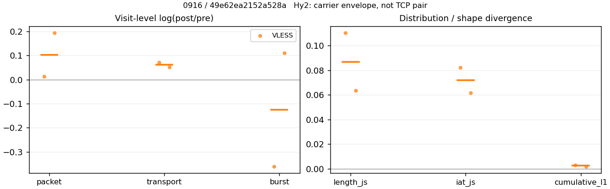
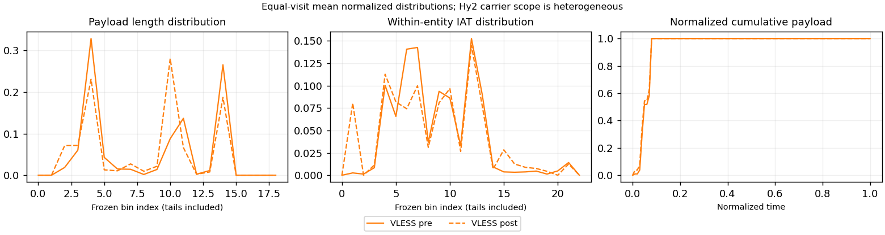

# 0916 · 条目 034 · bilibili.com

目标：https://www.bilibili.com/video/BV1o4411D7vm/

活动标签：bilibili.com::video_playback。选定访问 15 次。

[返回总索引](../../README.md) · [统计口径](../../methods.md)

## 覆盖与资格（每次访问均保留）

| 部署 | 重复 | 主请求路由 | 活动状态 | 代理比较 | DIRECT pre | 请求 proxy/direct/unresolved | 错误 |
| --- | --- | --- | --- | --- | --- | --- | --- |
| Hy2 | 1 | direct | passed | 0 | 1 | 0/303/0 | [] |
| Hy2 | 2 | direct | passed | 0 | 1 | 0/291/0 | [] |
| Hy2 | 3 | direct | passed | 0 | 1 | 0/287/0 | [] |
| Hy2 | 4 | direct | passed | 0 | 1 | 0/173/0 | [] |
| Hy2 | 5 | direct | passed | 0 | 1 | 0/292/0 | [] |
| SS | 1 | direct | passed | 0 | 1 | 0/297/0 | [] |
| SS | 2 | direct | passed | 0 | 1 | 0/254/0 | [] |
| SS | 3 | direct | passed | 0 | 1 | 0/286/0 | [] |
| SS | 4 | direct | passed | 0 | 1 | 0/301/0 | [] |
| SS | 5 | direct | passed | 0 | 1 | 0/285/0 | [] |
| VLESS | 1 | direct | passed | 0 | 1 | 0/298/0 | [] |
| VLESS | 2 | direct | passed | 1 | 1 | 35/252/0 | [] |
| VLESS | 3 | direct | passed | 0 | 1 | 0/255/0 | [] |
| VLESS | 4 | direct | passed | 1 | 1 | 35/259/0 | [] |
| VLESS | 5 | direct | passed | 0 | 1 | 0/289/0 | [] |

主请求非 proxy 的统计仅解释为已索引的辅助代理连接或 DIRECT 观测，不代表目标业务经代理传输。播放确认与配对资格是两道不同的门。

图中散点为单次访问，短线为重复中位数；Hy2 是共享载体包络，不能与 TCP 配对作等范围因果对比。

形态图先逐访问归一化，再对访问等权平均；实线 pre，虚线 post。分箱序号及边界见 methods，不将分箱索引误解为长度或时间。

## 每次访问的关键观测

### SS

范围：`direct_pre_only`。每格 pre → post；空值为不可观测/不适用。

| 重复 | 包数 | 载荷字节 | burst | TCP FR | IAT中位µs | length JS | IAT JS |
| --- | --- | --- | --- | --- | --- | --- | --- |
| 1 | 4018 → — | 9.464e+06 → — | 2606 → — | 405 → — | 56.193 → — | — | — |
| 2 | 3805 → — | 7.5024e+06 → — | 2494 → — | 368 → — | 69.587 → — | — | — |
| 3 | 4356 → — | 9.2443e+06 → — | 2856 → — | 399 → — | 49.302 → — | — | — |
| 4 | 4298 → — | 9.6193e+06 → — | 2727 → — | 441 → — | 64.291 → — | — | — |
| 5 | 4765 → — | 1.0301e+07 → — | 3136 → — | 488 → — | 56.267 → — | — | — |

完整标量统计：中位数 [min,max]；Δ 为重复内逐访问变换的中位数，MAD 未缩放。n 为可用变换数；DIRECT-only 的 nΔ=0 不代表 pre 不可用。

| scope | 特征 | pre | post | Δ | IQRΔ | MADΔ | nΔ |
| --- | --- | --- | --- | --- | --- | --- | --- |
| direct_pre_only | active_span_sum_s_1000ms | 28.899 [23.555, 37.119] | — | — | — | — | 0 |
| direct_pre_only | active_span_sum_s_100ms | 10.114 [8.693, 11.405] | — | — | — | — | 0 |
| direct_pre_only | active_span_sum_s_500ms | 19.715 [16.339, 22.633] | — | — | — | — | 0 |
| direct_pre_only | burst_bytes_iqr | 3119.2 [2880, 5224] | — | — | — | — | 0 |
| direct_pre_only | burst_bytes_mad | 37.5 [31, 92] | — | — | — | — | 0 |
| direct_pre_only | burst_bytes_max | 28672 [23680, 29288] | — | — | — | — | 0 |
| direct_pre_only | burst_bytes_mean | 3284.6 [3008.2, 3631.6] | — | — | — | — | 0 |
| direct_pre_only | burst_bytes_median | 37.5 [31, 92] | — | — | — | — | 0 |
| direct_pre_only | burst_bytes_min | 0 [0, 0] | — | — | — | — | 0 |
| direct_pre_only | burst_bytes_p95 | 20480 [17522, 20480] | — | — | — | — | 0 |
| direct_pre_only | burst_bytes_q25 | 0 [0, 0] | — | — | — | — | 0 |
| direct_pre_only | burst_bytes_q75 | 3119.2 [2880, 5224] | — | — | — | — | 0 |
| direct_pre_only | burst_bytes_std | 5964.4 [5397.8, 6268.6] | — | — | — | — | 0 |
| direct_pre_only | burst_count | 2727 [2494, 3136] | — | — | — | — | 0 |
| direct_pre_only | burst_duration_ms_iqr | 0.050609 [0.043239, 0.062222] | — | — | — | — | 0 |
| direct_pre_only | burst_duration_ms_mad | 0 [0, 0] | — | — | — | — | 0 |
| direct_pre_only | burst_duration_ms_max | 15000 [11496, 15001] | — | — | — | — | 0 |
| direct_pre_only | burst_duration_ms_mean | 83.049 [48.967, 91.314] | — | — | — | — | 0 |
| direct_pre_only | burst_duration_ms_median | 0 [0, 0] | — | — | — | — | 0 |
| direct_pre_only | burst_duration_ms_min | 0 [0, 0] | — | — | — | — | 0 |
| direct_pre_only | burst_duration_ms_p95 | 38.019 [33.494, 64.696] | — | — | — | — | 0 |
| direct_pre_only | burst_duration_ms_q25 | 0 [0, 0] | — | — | — | — | 0 |
| direct_pre_only | burst_duration_ms_q75 | 0.050609 [0.043239, 0.062222] | — | — | — | — | 0 |
| direct_pre_only | burst_duration_ms_std | 753.9 [434.96, 831.05] | — | — | — | — | 0 |
| direct_pre_only | burst_packets_iqr | 1 [1, 1] | — | — | — | — | 0 |
| direct_pre_only | burst_packets_mad | 0 [0, 0] | — | — | — | — | 0 |
| direct_pre_only | burst_packets_max | 9 [8, 9] | — | — | — | — | 0 |
| direct_pre_only | burst_packets_mean | 1.5257 [1.5195, 1.5761] | — | — | — | — | 0 |
| direct_pre_only | burst_packets_median | 1 [1, 1] | — | — | — | — | 0 |
| direct_pre_only | burst_packets_min | 1 [1, 1] | — | — | — | — | 0 |
| direct_pre_only | burst_packets_p95 | 3 [3, 4] | — | — | — | — | 0 |
| direct_pre_only | burst_packets_q25 | 1 [1, 1] | — | — | — | — | 0 |
| direct_pre_only | burst_packets_q75 | 2 [2, 2] | — | — | — | — | 0 |
| direct_pre_only | burst_packets_std | 0.92734 [0.903, 0.97756] | — | — | — | — | 0 |
| direct_pre_only | connection_span_concurrency_max | 15 [14, 29] | — | — | — | — | 0 |
| direct_pre_only | direction_entropy | 0.67045 [0.65347, 0.68558] | — | — | — | — | 0 |
| direct_pre_only | down_burst_count | 1348 [1230, 1549] | — | — | — | — | 0 |
| direct_pre_only | down_ip_bytes | 9.3562e+06 [7.4184e+06, 1.0181e+07] | — | — | — | — | 0 |
| direct_pre_only | down_packets | 2624 [2284, 2858] | — | — | — | — | 0 |
| direct_pre_only | down_transport_bytes | 9.2305e+06 [7.2993e+06, 1.0032e+07] | — | — | — | — | 0 |
| direct_pre_only | duration_s | 63.877 [61.626, 74.777] | — | — | — | — | 0 |
| direct_pre_only | entity_count | 31 [26, 38] | — | — | — | — | 0 |
| direct_pre_only | fr_runs | 405 [368, 488] | — | — | — | — | 0 |
| direct_pre_only | fr_runs_per_packet | 0.16777 [0.15592, 0.18155] | — | — | — | — | 0 |
| direct_pre_only | fr_switches | 379 [334, 450] | — | — | — | — | 0 |
| direct_pre_only | fr_switches_per_possible_transition | 0.15871 [0.14591, 0.16981] | — | — | — | — | 0 |
| direct_pre_only | full_retransmission_fraction | 0.0027377 [0.0026281, 0.00698] | — | — | — | — | 0 |
| direct_pre_only | full_retransmission_packets | 13 [10, 30] | — | — | — | — | 0 |
| direct_pre_only | iat_count | 4267 [3771, 4727] | — | — | — | — | 0 |
| direct_pre_only | iat_median_us | 56.267 [49.302, 69.587] | — | — | — | — | 0 |
| direct_pre_only | iat_us_iqr | 429.34 [334.57, 553.94] | — | — | — | — | 0 |
| direct_pre_only | iat_us_mad | 49.749 [42.065, 61.703] | — | — | — | — | 0 |
| direct_pre_only | iat_us_max | 1.5001e+07 [1.4851e+07, 1.5002e+07] | — | — | — | — | 0 |
| direct_pre_only | iat_us_mean | 1.9754e+05 [70388, 3.447e+05] | — | — | — | — | 0 |
| direct_pre_only | iat_us_median | 56.267 [49.302, 69.587] | — | — | — | — | 0 |
| direct_pre_only | iat_us_min | 0.073 [0.007, 0.419] | — | — | — | — | 0 |
| direct_pre_only | iat_us_p95 | 40344 [35193, 66348] | — | — | — | — | 0 |
| direct_pre_only | iat_us_q25 | 14.127 [12.584, 17.718] | — | — | — | — | 0 |
| direct_pre_only | iat_us_q75 | 441.92 [348.32, 571.66] | — | — | — | — | 0 |
| direct_pre_only | iat_us_std | 1.5455e+06 [6.4265e+05, 2.0811e+06] | — | — | — | — | 0 |
| direct_pre_only | idle_gap_count_1000ms | 84 [56, 160] | — | — | — | — | 0 |
| direct_pre_only | idle_gap_count_100ms | 149 [99, 210] | — | — | — | — | 0 |
| direct_pre_only | idle_gap_count_500ms | 100 [67, 176] | — | — | — | — | 0 |
| direct_pre_only | idle_gap_sum_s_1000ms | 828.07 [252.09, 1597] | — | — | — | — | 0 |
| direct_pre_only | idle_gap_sum_s_100ms | 845.88 [270.87, 1618] | — | — | — | — | 0 |
| direct_pre_only | idle_gap_sum_s_500ms | 834.47 [263.71, 1609.7] | — | — | — | — | 0 |
| direct_pre_only | ip_bytes | 9.6735e+06 [7.7008e+06, 1.0549e+07] | — | — | — | — | 0 |
| direct_pre_only | length_iqr | 6386 [5076, 6736] | — | — | — | — | 0 |
| direct_pre_only | length_mad | 2426.5 [2301.5, 2514.5] | — | — | — | — | 0 |
| direct_pre_only | length_max | 8948 [8948, 8948] | — | — | — | — | 0 |
| direct_pre_only | length_mean | 3767.9 [3388.6, 3920.5] | — | — | — | — | 0 |
| direct_pre_only | length_median | 2856 [2856, 2856] | — | — | — | — | 0 |
| direct_pre_only | length_min | 31 [12, 31] | — | — | — | — | 0 |
| direct_pre_only | length_p95 | 8920 [8920, 8920] | — | — | — | — | 0 |
| direct_pre_only | length_q25 | 665 [636, 754] | — | — | — | — | 0 |
| direct_pre_only | length_q75 | 7140 [5712, 7464] | — | — | — | — | 0 |
| direct_pre_only | length_std | 3260.7 [3012.6, 3310.7] | — | — | — | — | 0 |
| direct_pre_only | nonempty_entity_count | 31 [26, 38] | — | — | — | — | 0 |
| direct_pre_only | nonempty_packets | 2553 [2214, 2688] | — | — | — | — | 0 |
| direct_pre_only | offload_suspect_fraction | 0.38006 [0.3753, 0.40493] | — | — | — | — | 0 |
| direct_pre_only | packet_count | 4298 [3805, 4765] | — | — | — | — | 0 |
| direct_pre_only | rtt_median_ms | 0.072238 [0.063412, 0.078782] | — | — | — | — | 0 |
| direct_pre_only | rtt_sample_count | 1585 [1469, 1769] | — | — | — | — | 0 |
| direct_pre_only | tcp_ack_count | 4264 [3768, 4726] | — | — | — | — | 0 |
| direct_pre_only | tcp_fin_count | 59 [51, 75] | — | — | — | — | 0 |
| direct_pre_only | tcp_packet_count | 4298 [3805, 4765] | — | — | — | — | 0 |
| direct_pre_only | tcp_rst_count | 3 [1, 4] | — | — | — | — | 0 |
| direct_pre_only | tcp_syn_count | 62 [52, 76] | — | — | — | — | 0 |
| direct_pre_only | tcp_window_raw_median | 65535 [65535, 65535] | — | — | — | — | 0 |
| direct_pre_only | transition_entropy | 0.53624 [0.50862, 0.54702] | — | — | — | — | 0 |
| direct_pre_only | transition_n_mm | 1868 [1632, 1994] | — | — | — | — | 0 |
| direct_pre_only | transition_n_mp | 177 [151, 208] | — | — | — | — | 0 |
| direct_pre_only | transition_n_pm | 202 [183, 242] | — | — | — | — | 0 |
| direct_pre_only | transition_n_pp | 221 [206, 244] | — | — | — | — | 0 |
| direct_pre_only | transition_p_mm | 0.90992 [0.90554, 0.91806] | — | — | — | — | 0 |
| direct_pre_only | transition_p_mp | 0.090076 [0.081944, 0.09446] | — | — | — | — | 0 |
| direct_pre_only | transition_p_pm | 0.473 [0.45814, 0.54018] | — | — | — | — | 0 |
| direct_pre_only | transition_p_pp | 0.527 [0.45982, 0.54186] | — | — | — | — | 0 |
| direct_pre_only | transport_bytes | 9.464e+06 [7.5024e+06, 1.0301e+07] | — | — | — | — | 0 |
| direct_pre_only | up_burst_count | 1379 [1264, 1587] | — | — | — | — | 0 |
| direct_pre_only | up_byte_fraction | 0.026052 [0.024597, 0.02706] | — | — | — | — | 0 |
| direct_pre_only | up_ip_bytes | 3.1749e+05 [2.8246e+05, 3.6807e+05] | — | — | — | — | 0 |
| direct_pre_only | up_packets | 1674 [1521, 1907] | — | — | — | — | 0 |
| direct_pre_only | up_transport_bytes | 2.3356e+05 [2.0301e+05, 2.6846e+05] | — | — | — | — | 0 |
| direct_pre_only | zero_iat_count | 0 [0, 0] | — | — | — | — | 0 |
| direct_pre_only | zero_iat_fraction | 0 [0, 0] | — | — | — | — | 0 |

### VLESS

范围：`direct_pre_only`。每格 pre → post；空值为不可观测/不适用。

| 重复 | 包数 | 载荷字节 | burst | TCP FR | IAT中位µs | length JS | IAT JS |
| --- | --- | --- | --- | --- | --- | --- | --- |
| 1 | 4288 → — | 1.0048e+07 → — | 2769 → — | 407 → — | 61.585 → — | — | — |
| 2 | 2192 → — | 3.6426e+06 → — | 1467 → — | 256 → — | 84.692 → — | — | — |
| 3 | 3649 → — | 8.5898e+06 → — | 2186 → — | 361 → — | 69.08 → — | — | — |
| 4 | 3201 → — | 5.979e+06 → — | 2020 → — | 395 → — | 86.741 → — | — | — |
| 5 | 4197 → — | 9.296e+06 → — | 2666 → — | 407 → — | 51.971 → — | — | — |

范围：`exclusive_page`。每格 pre → post；空值为不可观测/不适用。

| 重复 | 包数 | 载荷字节 | burst | TCP FR | IAT中位µs | length JS | IAT JS |
| --- | --- | --- | --- | --- | --- | --- | --- |
| 1 | — | — | — | — | — | — | — |
| 2 | 384 → 389 | 2.2616e+05 → 2.4282e+05 | 344 → 240 | 9 → 14 | 91.127 → 212.1 | 0.11036 | 0.082083 |
| 3 | — | — | — | — | — | — | — |
| 4 | 449 → 545 | 3.1486e+05 → 3.3185e+05 | 306 → 342 | 12 → 16 | 334.81 → 275.07 | 0.063645 | 0.06183 |
| 5 | — | — | — | — | — | — | — |

完整标量统计：中位数 [min,max]；Δ 为重复内逐访问变换的中位数，MAD 未缩放。n 为可用变换数；DIRECT-only 的 nΔ=0 不代表 pre 不可用。

| scope | 特征 | pre | post | Δ | IQRΔ | MADΔ | nΔ |
| --- | --- | --- | --- | --- | --- | --- | --- |
| direct_pre_only | active_span_sum_s_1000ms | 20.981 [16.512, 33.417] | — | — | — | — | 0 |
| direct_pre_only | active_span_sum_s_100ms | 7.759 [7.3182, 9.5502] | — | — | — | — | 0 |
| direct_pre_only | active_span_sum_s_500ms | 15.344 [13.27, 19.448] | — | — | — | — | 0 |
| direct_pre_only | burst_bytes_iqr | 4520 [1766.5, 5009.8] | — | — | — | — | 0 |
| direct_pre_only | burst_bytes_mad | 64 [31, 80] | — | — | — | — | 0 |
| direct_pre_only | burst_bytes_max | 28108 [24584, 28712] | — | — | — | — | 0 |
| direct_pre_only | burst_bytes_mean | 3486.9 [2483, 3929.5] | — | — | — | — | 0 |
| direct_pre_only | burst_bytes_median | 64 [31, 80] | — | — | — | — | 0 |
| direct_pre_only | burst_bytes_min | 0 [0, 0] | — | — | — | — | 0 |
| direct_pre_only | burst_bytes_p95 | 20480 [18201, 20480] | — | — | — | — | 0 |
| direct_pre_only | burst_bytes_q25 | 0 [0, 0] | — | — | — | — | 0 |
| direct_pre_only | burst_bytes_q75 | 4520 [1766.5, 5009.8] | — | — | — | — | 0 |
| direct_pre_only | burst_bytes_std | 5959.6 [5338.3, 6829.8] | — | — | — | — | 0 |
| direct_pre_only | burst_count | 2186 [1467, 2769] | — | — | — | — | 0 |
| direct_pre_only | burst_duration_ms_iqr | 0.069982 [0.055848, 0.18636] | — | — | — | — | 0 |
| direct_pre_only | burst_duration_ms_mad | 0 [0, 0] | — | — | — | — | 0 |
| direct_pre_only | burst_duration_ms_max | 14262 [12928, 15001] | — | — | — | — | 0 |
| direct_pre_only | burst_duration_ms_mean | 87.977 [64.919, 154.65] | — | — | — | — | 0 |
| direct_pre_only | burst_duration_ms_median | 0 [0, 0] | — | — | — | — | 0 |
| direct_pre_only | burst_duration_ms_min | 0 [0, 0] | — | — | — | — | 0 |
| direct_pre_only | burst_duration_ms_p95 | 54.731 [32.011, 79.279] | — | — | — | — | 0 |
| direct_pre_only | burst_duration_ms_q25 | 0 [0, 0] | — | — | — | — | 0 |
| direct_pre_only | burst_duration_ms_q75 | 0.069982 [0.055848, 0.18636] | — | — | — | — | 0 |
| direct_pre_only | burst_duration_ms_std | 727.25 [604.06, 1244.9] | — | — | — | — | 0 |
| direct_pre_only | burst_packets_iqr | 1 [1, 1] | — | — | — | — | 0 |
| direct_pre_only | burst_packets_mad | 0 [0, 0] | — | — | — | — | 0 |
| direct_pre_only | burst_packets_max | 8 [7, 11] | — | — | — | — | 0 |
| direct_pre_only | burst_packets_mean | 1.5743 [1.4942, 1.6693] | — | — | — | — | 0 |
| direct_pre_only | burst_packets_median | 1 [1, 1] | — | — | — | — | 0 |
| direct_pre_only | burst_packets_min | 1 [1, 1] | — | — | — | — | 0 |
| direct_pre_only | burst_packets_p95 | 3 [3, 3] | — | — | — | — | 0 |
| direct_pre_only | burst_packets_q25 | 1 [1, 1] | — | — | — | — | 0 |
| direct_pre_only | burst_packets_q75 | 2 [2, 2] | — | — | — | — | 0 |
| direct_pre_only | burst_packets_std | 0.95887 [0.80248, 0.97861] | — | — | — | — | 0 |
| direct_pre_only | connection_span_concurrency_max | 16 [13, 17] | — | — | — | — | 0 |
| direct_pre_only | direction_entropy | 0.68144 [0.675, 0.82125] | — | — | — | — | 0 |
| direct_pre_only | down_burst_count | 1079 [721, 1370] | — | — | — | — | 0 |
| direct_pre_only | down_ip_bytes | 8.5124e+06 [3.5247e+06, 9.9475e+06] | — | — | — | — | 0 |
| direct_pre_only | down_packets | 2275 [1245, 2588] | — | — | — | — | 0 |
| direct_pre_only | down_transport_bytes | 8.3939e+06 [3.4598e+06, 9.8127e+06] | — | — | — | — | 0 |
| direct_pre_only | duration_s | 63.47 [61.836, 74.497] | — | — | — | — | 0 |
| direct_pre_only | entity_count | 28 [25, 30] | — | — | — | — | 0 |
| direct_pre_only | fr_runs | 395 [256, 407] | — | — | — | — | 0 |
| direct_pre_only | fr_runs_per_packet | 0.16372 [0.1593, 0.21806] | — | — | — | — | 0 |
| direct_pre_only | fr_switches | 367 [231, 378] | — | — | — | — | 0 |
| direct_pre_only | fr_switches_per_possible_transition | 0.1535 [0.14964, 0.20243] | — | — | — | — | 0 |
| direct_pre_only | full_retransmission_fraction | 0.0028592 [0.0024992, 0.005597] | — | — | — | — | 0 |
| direct_pre_only | full_retransmission_packets | 10 [8, 24] | — | — | — | — | 0 |
| direct_pre_only | iat_count | 3621 [2167, 4259] | — | — | — | — | 0 |
| direct_pre_only | iat_median_us | 69.08 [51.971, 86.741] | — | — | — | — | 0 |
| direct_pre_only | iat_us_iqr | 408.21 [198.28, 777.26] | — | — | — | — | 0 |
| direct_pre_only | iat_us_mad | 60.106 [44.822, 77.291] | — | — | — | — | 0 |
| direct_pre_only | iat_us_max | 1.5002e+07 [1.5001e+07, 1.5003e+07] | — | — | — | — | 0 |
| direct_pre_only | iat_us_mean | 2.7532e+05 [1.4092e+05, 3.6932e+05] | — | — | — | — | 0 |
| direct_pre_only | iat_us_median | 69.08 [51.971, 86.741] | — | — | — | — | 0 |
| direct_pre_only | iat_us_min | 0.1 [0.08, 0.205] | — | — | — | — | 0 |
| direct_pre_only | iat_us_p95 | 41121 [37520, 1.1578e+05] | — | — | — | — | 0 |
| direct_pre_only | iat_us_q25 | 15.599 [13.851, 19.112] | — | — | — | — | 0 |
| direct_pre_only | iat_us_q75 | 423.81 [212.13, 793.3] | — | — | — | — | 0 |
| direct_pre_only | iat_us_std | 1.8611e+06 [1.2302e+06, 2.1298e+06] | — | — | — | — | 0 |
| direct_pre_only | idle_gap_count_1000ms | 97 [72, 107] | — | — | — | — | 0 |
| direct_pre_only | idle_gap_count_100ms | 135 [114, 153] | — | — | — | — | 0 |
| direct_pre_only | idle_gap_count_500ms | 100 [87, 120] | — | — | — | — | 0 |
| direct_pre_only | idle_gap_sum_s_1000ms | 894.51 [568.86, 980.41] | — | — | — | — | 0 |
| direct_pre_only | idle_gap_sum_s_100ms | 908.17 [590.87, 989.22] | — | — | — | — | 0 |
| direct_pre_only | idle_gap_sum_s_500ms | 900.15 [580.74, 982.37] | — | — | — | — | 0 |
| direct_pre_only | ip_bytes | 8.7802e+06 [3.7571e+06, 1.0271e+07] | — | — | — | — | 0 |
| direct_pre_only | length_iqr | 6042 [4800, 6797] | — | — | — | — | 0 |
| direct_pre_only | length_mad | 2463 [1739.5, 2586] | — | — | — | — | 0 |
| direct_pre_only | length_max | 8948 [8948, 8948] | — | — | — | — | 0 |
| direct_pre_only | length_mean | 3739.4 [3102.7, 3932.5] | — | — | — | — | 0 |
| direct_pre_only | length_median | 2824 [1858, 2856] | — | — | — | — | 0 |
| direct_pre_only | length_min | 31 [1, 31] | — | — | — | — | 0 |
| direct_pre_only | length_p95 | 8920 [8920, 8920] | — | — | — | — | 0 |
| direct_pre_only | length_q25 | 667 [233.5, 836.5] | — | — | — | — | 0 |
| direct_pre_only | length_q75 | 6736 [5378, 7464] | — | — | — | — | 0 |
| direct_pre_only | length_std | 3257.8 [3084.9, 3341.8] | — | — | — | — | 0 |
| direct_pre_only | nonempty_entity_count | 28 [25, 30] | — | — | — | — | 0 |
| direct_pre_only | nonempty_packets | 2209 [1174, 2555] | — | — | — | — | 0 |
| direct_pre_only | offload_suspect_fraction | 0.39766 [0.28558, 0.41045] | — | — | — | — | 0 |
| direct_pre_only | packet_count | 3649 [2192, 4288] | — | — | — | — | 0 |
| direct_pre_only | rtt_median_ms | 0.074816 [0.071758, 0.10223] | — | — | — | — | 0 |
| direct_pre_only | rtt_sample_count | 1276 [856, 1625] | — | — | — | — | 0 |
| direct_pre_only | tcp_ack_count | 3621 [2163, 4256] | — | — | — | — | 0 |
| direct_pre_only | tcp_fin_count | 56 [47, 59] | — | — | — | — | 0 |
| direct_pre_only | tcp_packet_count | 3649 [2192, 4288] | — | — | — | — | 0 |
| direct_pre_only | tcp_rst_count | 3 [0, 5] | — | — | — | — | 0 |
| direct_pre_only | tcp_syn_count | 56 [50, 60] | — | — | — | — | 0 |
| direct_pre_only | tcp_window_raw_median | 65535 [65535, 65535] | — | — | — | — | 0 |
| direct_pre_only | transition_entropy | 0.52896 [0.52128, 0.65254] | — | — | — | — | 0 |
| direct_pre_only | transition_n_mm | 1631 [746, 1899] | — | — | — | — | 0 |
| direct_pre_only | transition_n_mp | 172 [104, 176] | — | — | — | — | 0 |
| direct_pre_only | transition_n_pm | 195 [127, 202] | — | — | — | — | 0 |
| direct_pre_only | transition_n_pp | 217 [165, 249] | — | — | — | — | 0 |
| direct_pre_only | transition_p_mm | 0.91302 [0.87765, 0.91518] | — | — | — | — | 0 |
| direct_pre_only | transition_p_mp | 0.086978 [0.084819, 0.12235] | — | — | — | — | 0 |
| direct_pre_only | transition_p_pm | 0.45202 [0.42475, 0.54167] | — | — | — | — | 0 |
| direct_pre_only | transition_p_pp | 0.54798 [0.45833, 0.57525] | — | — | — | — | 0 |
| direct_pre_only | transport_bytes | 8.5898e+06 [3.6426e+06, 1.0048e+07] | — | — | — | — | 0 |
| direct_pre_only | up_burst_count | 1107 [746, 1399] | — | — | — | — | 0 |
| direct_pre_only | up_byte_fraction | 0.024712 [0.022815, 0.050189] | — | — | — | — | 0 |
| direct_pre_only | up_ip_bytes | 2.8845e+05 [2.3231e+05, 3.2379e+05] | — | — | — | — | 0 |
| direct_pre_only | up_packets | 1374 [947, 1700] | — | — | — | — | 0 |
| direct_pre_only | up_transport_bytes | 2.2231e+05 [1.8282e+05, 2.3491e+05] | — | — | — | — | 0 |
| direct_pre_only | zero_iat_count | 0 [0, 0] | — | — | — | — | 0 |
| direct_pre_only | zero_iat_fraction | 0 [0, 0] | — | — | — | — | 0 |
| exclusive_page | active_span_sum_s_1000ms | 2.0266 [2.0156, 2.0377] | 4.8249 [4.4425, 5.2074] | 0.86429 | 0.073984 | 0.073984 | 2 |
| exclusive_page | active_span_sum_s_100ms | 0.74921 [0.5493, 0.94911] | 1.5429 [1.2394, 1.8465] | 0.73961 | 0.074108 | 0.074108 | 2 |
| exclusive_page | active_span_sum_s_500ms | 1.6677 [1.2977, 2.0377] | 3.1657 [2.7161, 3.6153] | 0.65599 | 0.082609 | 0.082609 | 2 |
| exclusive_page | burst_bytes_iqr | 2146 [1412, 2880] | 1496 [1496, 1496] | -0.2986 | 0.35639 | 0.35639 | 2 |
| exclusive_page | burst_bytes_mad | 0 [0, 0] | 12 [0, 24] | — | — | — | 0 |
| exclusive_page | burst_bytes_max | 4274 [4256, 4292] | 5244 [4832, 5656] | 0.20145 | 0.08294 | 0.08294 | 2 |
| exclusive_page | burst_bytes_mean | 843.21 [657.44, 1029] | 991.05 [970.33, 1011.8] | 0.18621 | 0.24489 | 0.24489 | 2 |
| exclusive_page | burst_bytes_median | 0 [0, 0] | 12 [0, 24] | — | — | — | 0 |
| exclusive_page | burst_bytes_min | 0 [0, 0] | 0 [0, 0] | — | — | — | 0 |
| exclusive_page | burst_bytes_p95 | 2860 [2824, 2896] | 2896 [2896, 2896] | 0.012588 | 0.012588 | 0.012588 | 2 |
| exclusive_page | burst_bytes_q25 | 0 [0, 0] | 0 [0, 0] | — | — | — | 0 |
| exclusive_page | burst_bytes_q75 | 2146 [1412, 2880] | 1496 [1496, 1496] | -0.2986 | 0.35639 | 0.35639 | 2 |
| exclusive_page | burst_bytes_std | 1203.6 [1071.2, 1336] | 1209.6 [1191.3, 1228] | 0.010982 | 0.12565 | 0.12565 | 2 |
| exclusive_page | burst_count | 325 [306, 344] | 291 [240, 342] | -0.12439 | 0.23561 | 0.23561 | 2 |
| exclusive_page | burst_duration_ms_iqr | 0.3801 [0, 0.76021] | 1.5172 [0.74743, 2.287] | -0.016947 | — | — | 1 |
| exclusive_page | burst_duration_ms_mad | 0 [0, 0] | 0 [0, 0] | — | — | — | 0 |
| exclusive_page | burst_duration_ms_max | 8238.4 [1520.2, 14957] | 15008 [15002, 15014] | 1.1466 | 1.1428 | 1.1428 | 2 |
| exclusive_page | burst_duration_ms_mean | 37.648 [13.257, 62.04] | 81.617 [70.026, 93.207] | 1.0357 | 0.62864 | 0.62864 | 2 |
| exclusive_page | burst_duration_ms_median | 0 [0, 0] | 0 [0, 0] | — | — | — | 0 |
| exclusive_page | burst_duration_ms_min | 0 [0, 0] | 0 [0, 0] | — | — | — | 0 |
| exclusive_page | burst_duration_ms_p95 | 3.1634 [0.47103, 5.8558] | 9.114 [8.8405, 9.3875] | 1.7021 | 1.2901 | 1.2901 | 2 |
| exclusive_page | burst_duration_ms_q25 | 0 [0, 0] | 0 [0, 0] | — | — | — | 0 |
| exclusive_page | burst_duration_ms_q75 | 0.3801 [0, 0.76021] | 1.5172 [0.74743, 2.287] | -0.016947 | — | — | 1 |
| exclusive_page | burst_duration_ms_std | 492.39 [123.6, 861.19] | 1055.7 [966.67, 1144.7] | 1.1707 | 0.88608 | 0.88608 | 2 |
| exclusive_page | burst_packets_iqr | 0.5 [0, 1] | 1 [1, 1] | 0 | — | — | 1 |
| exclusive_page | burst_packets_mad | 0 [0, 0] | 0 [0, 0] | — | — | — | 0 |
| exclusive_page | burst_packets_max | 3.5 [3, 4] | 7.5 [7, 8] | 0.77022 | 0.077075 | 0.077075 | 2 |
| exclusive_page | burst_packets_mean | 1.2918 [1.1163, 1.4673] | 1.6072 [1.5936, 1.6208] | 0.22774 | 0.1452 | 0.1452 | 2 |
| exclusive_page | burst_packets_median | 1 [1, 1] | 1 [1, 1] | 0 | 0 | 0 | 2 |
| exclusive_page | burst_packets_min | 1 [1, 1] | 1 [1, 1] | 0 | 0 | 0 | 2 |
| exclusive_page | burst_packets_p95 | 2 [2, 2] | 3 [3, 3] | 0.40547 | 0 | 0 | 2 |
| exclusive_page | burst_packets_q25 | 1 [1, 1] | 1 [1, 1] | 0 | 0 | 0 | 2 |
| exclusive_page | burst_packets_q75 | 1.5 [1, 2] | 2 [2, 2] | 0.34657 | 0.34657 | 0.34657 | 2 |
| exclusive_page | burst_packets_std | 0.45231 [0.33821, 0.56642] | 0.94557 [0.92307, 0.96807] | 0.77001 | 0.23404 | 0.23404 | 2 |
| exclusive_page | connection_span_concurrency_max | 1.5 [1, 2] | 1.5 [1, 2] | 0 | 0 | 0 | 2 |
| exclusive_page | cumulative_l1 | — | — | 0.0024518 | 0.00050741 | 0.00050741 | 2 |
| exclusive_page | cumulative_max | — | — | 0.085321 | 0.0017377 | 0.0017377 | 2 |
| exclusive_page | direction_entropy | 0.63758 [0.63112, 0.64403] | 0.40372 [0.3822, 0.42524] | -0.23386 | 0.027978 | 0.027978 | 2 |
| exclusive_page | down_burst_count | 161.5 [152, 171] | 144.5 [119, 170] | -0.12531 | 0.23723 | 0.23723 | 2 |
| exclusive_page | down_ip_bytes | 2.7464e+05 [2.289e+05, 3.2038e+05] | 2.8953e+05 [2.4326e+05, 3.358e+05] | 0.053943 | 0.0069284 | 0.0069284 | 2 |
| exclusive_page | down_packets | 233.5 [194, 273] | 267.5 [223, 312] | 0.13642 | 0.0028911 | 0.0028911 | 2 |
| exclusive_page | down_transport_bytes | 2.6248e+05 [2.1879e+05, 3.0616e+05] | 2.756e+05 [2.3165e+05, 3.1955e+05] | 0.049943 | 0.0071629 | 0.0071629 | 2 |
| exclusive_page | duration_s | 57.315 [56.478, 58.152] | 57.281 [56.449, 58.113] | -0.00058503 | 8.0861e-05 | 8.0861e-05 | 2 |
| exclusive_page | entity_count | 2 [2, 2] | 2 [2, 2] | 0 | 0 | 0 | 2 |
| exclusive_page | fr_runs | 10.5 [9, 12] | 15 [14, 16] | 0.36476 | 0.077075 | 0.077075 | 2 |
| exclusive_page | fr_runs_per_packet | 0.045217 [0.04428, 0.046154] | 0.059225 [0.053333, 0.065116] | 0.014008 | 0.0049548 | 0.0049548 | 2 |
| exclusive_page | fr_switches | 8.5 [7, 10] | 13 [12, 14] | 0.43773 | 0.10126 | 0.10126 | 2 |
| exclusive_page | fr_switches_per_possible_transition | 0.036722 [0.036269, 0.037175] | 0.051659 [0.04698, 0.056338] | 0.014937 | 0.0051317 | 0.0051317 | 2 |
| exclusive_page | full_retransmission_fraction | 0 [0, 0] | 0 [0, 0] | 0 | 0 | 0 | 2 |
| exclusive_page | full_retransmission_packets | 0 [0, 0] | 0 [0, 0] | — | — | — | 0 |
| exclusive_page | iat_count | 414.5 [382, 447] | 465 [387, 543] | 0.10378 | 0.090773 | 0.090773 | 2 |
| exclusive_page | iat_js | — | — | 0.071957 | 0.010127 | 0.010127 | 2 |
| exclusive_page | iat_ks | — | — | 0.13097 | 0.038114 | 0.038114 | 2 |
| exclusive_page | iat_median_us | 212.97 [91.127, 334.81] | 243.58 [212.1, 275.07] | 0.32412 | 0.52067 | 0.52067 | 2 |
| exclusive_page | iat_us_iqr | 2527.1 [1991, 3063.2] | 2984.5 [2977.9, 2991.1] | 0.18939 | 0.21762 | 0.21762 | 2 |
| exclusive_page | iat_us_mad | 205.45 [84.434, 326.47] | 243.18 [211.94, 274.43] | 0.37334 | 0.54699 | 0.54699 | 2 |
| exclusive_page | iat_us_max | 1.5001e+07 [1.5001e+07, 1.5001e+07] | 1.5315e+07 [1.5314e+07, 1.5316e+07] | 0.020727 | 8.5826e-05 | 8.5826e-05 | 2 |
| exclusive_page | iat_us_mean | 2.0368e+05 [1.4731e+05, 2.6005e+05] | 1.7962e+05 [1.4529e+05, 2.1396e+05] | -0.10445 | 0.090644 | 0.090644 | 2 |
| exclusive_page | iat_us_median | 212.97 [91.127, 334.81] | 243.58 [212.1, 275.07] | 0.32412 | 0.52067 | 0.52067 | 2 |
| exclusive_page | iat_us_min | 1.853 [0.532, 3.174] | 0.037 [0.037, 0.037] | -3.5588 | 0.89305 | 0.89305 | 2 |
| exclusive_page | iat_us_p95 | 9455.7 [8802.4, 10109] | 44273 [41959, 46587] | 1.5448 | 0.016886 | 0.016886 | 2 |
| exclusive_page | iat_us_q25 | 32.337 [27.705, 36.968] | 14.204 [11.761, 16.648] | -0.82733 | 0.31798 | 0.31798 | 2 |
| exclusive_page | iat_us_q75 | 2559.4 [2028, 3090.9] | 2998.7 [2994.5, 3002.9] | 0.18043 | 0.2121 | 0.2121 | 2 |
| exclusive_page | iat_us_std | 1.6135e+06 [1.3641e+06, 1.8628e+06] | 1.5305e+06 [1.3692e+06, 1.6919e+06] | -0.046263 | 0.049971 | 0.049971 | 2 |
| exclusive_page | iat_wasserstein_log1p_us | — | — | 0.55722 | 0.11869 | 0.11869 | 2 |
| exclusive_page | idle_gap_count_1000ms | 8 [6, 10] | 6 [4, 8] | -0.3143 | 0.091161 | 0.091161 | 2 |
| exclusive_page | idle_gap_count_100ms | 12 [10, 14] | 15.5 [13, 18] | 0.25684 | 0.0055249 | 0.0055249 | 2 |
| exclusive_page | idle_gap_count_500ms | 8.5 [7, 10] | 8 [6, 10] | -0.077075 | 0.077075 | 0.077075 | 2 |
| exclusive_page | idle_gap_sum_s_1000ms | 84.232 [54.256, 114.21] | 81.379 [51.784, 110.97] | -0.037676 | 0.008959 | 0.008959 | 2 |
| exclusive_page | idle_gap_sum_s_100ms | 85.509 [55.722, 115.3] | 84.661 [54.987, 114.33] | -0.010826 | 0.0024582 | 0.0024582 | 2 |
| exclusive_page | idle_gap_sum_s_500ms | 84.59 [54.974, 114.21] | 83.038 [53.51, 112.57] | -0.020729 | 0.0062559 | 0.0062559 | 2 |
| exclusive_page | ip_bytes | 2.9217e+05 [2.4614e+05, 3.382e+05] | 3.121e+05 [2.6349e+05, 3.6072e+05] | 0.066303 | 0.0018354 | 0.0018354 | 2 |
| exclusive_page | length_iqr | 2752 [2752, 2752] | 1366 [1364, 1368] | -0.70044 | 0.0014641 | 0.0014641 | 2 |
| exclusive_page | length_js | — | — | 0.087003 | 0.023358 | 0.023358 | 2 |
| exclusive_page | length_ks | — | — | 0.16006 | 0.0046373 | 0.0046373 | 2 |
| exclusive_page | length_mad | 1289.5 [1239, 1340] | 1340 [1340, 1340] | 0.039183 | 0.039183 | 0.039183 | 2 |
| exclusive_page | length_max | 2888 [2880, 2896] | 2824 [2824, 2824] | -0.022406 | 0.0027701 | 0.0027701 | 2 |
| exclusive_page | length_mean | 1160.8 [1159.8, 1161.9] | 1117.8 [1106.2, 1129.4] | -0.037828 | 0.011284 | 0.011284 | 2 |
| exclusive_page | length_median | 1361.5 [1311, 1412] | 1412 [1412, 1412] | 0.037108 | 0.037108 | 0.037108 | 2 |
| exclusive_page | length_min | 24 [24, 24] | 22 [20, 24] | -0.091161 | 0.091161 | 0.091161 | 2 |
| exclusive_page | length_p95 | 2824 [2824, 2824] | 2824 [2824, 2824] | 0 | 0 | 0 | 2 |
| exclusive_page | length_q25 | 72 [72, 72] | 72 [72, 72] | 0 | 0 | 0 | 2 |
| exclusive_page | length_q75 | 2824 [2824, 2824] | 1438 [1436, 1440] | -0.6749 | 0.0013908 | 0.0013908 | 2 |
| exclusive_page | length_std | 1136.1 [1131.7, 1140.4] | 1010 [1005.4, 1014.6] | -0.11763 | 0.0083954 | 0.0083954 | 2 |
| exclusive_page | length_wasserstein_bytes | — | — | 189.69 | 4.2411 | 4.2411 | 2 |
| exclusive_page | nonempty_entity_count | 2 [2, 2] | 2 [2, 2] | 0 | 0 | 0 | 2 |
| exclusive_page | nonempty_packets | 233 [195, 271] | 257.5 [215, 300] | 0.099651 | 0.0020126 | 0.0020126 | 2 |
| exclusive_page | offload_suspect_fraction | 0.15513 [0.14323, 0.16704] | 0.10885 [0.10459, 0.11311] | -0.046285 | 0.016166 | 0.016166 | 2 |
| exclusive_page | packet_count | 416.5 [384, 449] | 467 [389, 545] | 0.10335 | 0.090413 | 0.090413 | 2 |
| exclusive_page | rtt_median_ms | 0.35119 [0.06348, 0.63889] | 1.257 [0.76446, 1.7496] | 1.7479 | 1.5685 | 1.5685 | 2 |
| exclusive_page | rtt_sample_count | 164 [155, 173] | 175 [145, 205] | 0.051514 | 0.22807 | 0.22807 | 2 |
| exclusive_page | tcp_ack_count | 411.5 [380, 443] | 465 [387, 543] | 0.1109 | 0.092643 | 0.092643 | 2 |
| exclusive_page | tcp_fin_count | 4 [4, 4] | 4 [4, 4] | 0 | 0 | 0 | 2 |
| exclusive_page | tcp_packet_count | 416.5 [384, 449] | 467 [389, 545] | 0.10335 | 0.090413 | 0.090413 | 2 |
| exclusive_page | tcp_rst_count | 3 [2, 4] | 0 [0, 0] | — | — | — | 0 |
| exclusive_page | tcp_syn_count | 4 [4, 4] | 4 [4, 4] | 0 | 0 | 0 | 2 |
| exclusive_page | tcp_window_raw_median | 65407 [65279, 65535] | 156.5 [152, 161] | -6.0357 | 0.026805 | 0.026805 | 2 |
| exclusive_page | transition_entropy | 0.20089 [0.20078, 0.201] | 0.22466 [0.21721, 0.23212] | 0.02377 | 0.0075667 | 0.0075667 | 2 |
| exclusive_page | transition_n_mm | 190.5 [159, 222] | 229 [192, 266] | 0.18471 | 0.0038861 | 0.0038861 | 2 |
| exclusive_page | transition_n_mp | 3.5 [3, 4] | 5.5 [5, 6] | 0.45815 | 0.05268 | 0.05268 | 2 |
| exclusive_page | transition_n_pm | 5 [4, 6] | 7.5 [7, 8] | 0.42365 | 0.13597 | 0.13597 | 2 |
| exclusive_page | transition_n_pp | 32 [27, 37] | 13.5 [9, 18] | -0.90958 | 0.18903 | 0.18903 | 2 |
| exclusive_page | transition_p_mm | 0.98189 [0.98148, 0.9823] | 0.97628 [0.97462, 0.97794] | -0.005611 | 0.0012512 | 0.0012512 | 2 |
| exclusive_page | transition_p_mp | 0.018109 [0.017699, 0.018519] | 0.02372 [0.022059, 0.025381] | 0.005611 | 0.0012512 | 0.0012512 | 2 |
| exclusive_page | transition_p_pm | 0.13428 [0.12903, 0.13953] | 0.3726 [0.30769, 0.4375] | 0.23831 | 0.070155 | 0.070155 | 2 |
| exclusive_page | transition_p_pp | 0.86572 [0.86047, 0.87097] | 0.6274 [0.5625, 0.69231] | -0.23831 | 0.070155 | 0.070155 | 2 |
| exclusive_page | transport_bytes | 2.7051e+05 [2.2616e+05, 3.1486e+05] | 2.8734e+05 [2.4282e+05, 3.3185e+05] | 0.061823 | 0.0092715 | 0.0092715 | 2 |
| exclusive_page | up_burst_count | 163.5 [154, 173] | 146.5 [121, 172] | -0.12348 | 0.23402 | 0.23402 | 2 |
| exclusive_page | up_byte_fraction | 0.030106 [0.027634, 0.032579] | 0.041553 [0.037089, 0.046017] | 0.011446 | 0.0019918 | 0.0019918 | 2 |
| exclusive_page | up_ip_bytes | 17530 [17240, 17821] | 22575 [20230, 24920] | 0.24761 | 0.087679 | 0.087679 | 2 |
| exclusive_page | up_packets | 183 [176, 190] | 199.5 [166, 233] | 0.072759 | 0.2078 | 0.2078 | 2 |
| exclusive_page | up_transport_bytes | 8034.5 [7368, 8701] | 11741 [11174, 12308] | 0.38163 | 0.034816 | 0.034816 | 2 |
| exclusive_page | zero_iat_count | 0 [0, 0] | 0 [0, 0] | — | — | — | 0 |
| exclusive_page | zero_iat_fraction | 0 [0, 0] | 0 [0, 0] | 0 | 0 | 0 | 2 |

### Hy2

范围：`direct_pre_only`。每格 pre → post；空值为不可观测/不适用。

| 重复 | 包数 | 载荷字节 | burst | TCP FR | IAT中位µs | length JS | IAT JS |
| --- | --- | --- | --- | --- | --- | --- | --- |
| 1 | 4484 → — | 1.0341e+07 → — | 2966 → — | 446 → — | 48.652 → — | — | — |
| 2 | 4447 → — | 9.36e+06 → — | 2923 → — | 405 → — | 48.424 → — | — | — |
| 3 | 2693 → — | 4.9817e+06 → — | 1836 → — | 253 → — | 66.173 → — | — | — |
| 4 | 2674 → — | 6.627e+06 → — | 1649 → — | 266 → — | 62.463 → — | — | — |
| 5 | 4196 → — | 9.5003e+06 → — | 2593 → — | 402 → — | 53.207 → — | — | — |

完整标量统计：中位数 [min,max]；Δ 为重复内逐访问变换的中位数，MAD 未缩放。n 为可用变换数；DIRECT-only 的 nΔ=0 不代表 pre 不可用。

| scope | 特征 | pre | post | Δ | IQRΔ | MADΔ | nΔ |
| --- | --- | --- | --- | --- | --- | --- | --- |
| direct_pre_only | active_span_sum_s_1000ms | 28.181 [15.851, 38.015] | — | — | — | — | 0 |
| direct_pre_only | active_span_sum_s_100ms | 9.1325 [5.9483, 11.309] | — | — | — | — | 0 |
| direct_pre_only | active_span_sum_s_500ms | 18.099 [13.015, 25.783] | — | — | — | — | 0 |
| direct_pre_only | burst_bytes_iqr | 4803 [2824, 5712] | — | — | — | — | 0 |
| direct_pre_only | burst_bytes_mad | 80 [31.5, 80] | — | — | — | — | 0 |
| direct_pre_only | burst_bytes_max | 26760 [23114, 28672] | — | — | — | — | 0 |
| direct_pre_only | burst_bytes_mean | 3486.4 [2713.3, 4018.8] | — | — | — | — | 0 |
| direct_pre_only | burst_bytes_median | 80 [31.5, 80] | — | — | — | — | 0 |
| direct_pre_only | burst_bytes_min | 0 [0, 0] | — | — | — | — | 0 |
| direct_pre_only | burst_bytes_p95 | 20480 [16986, 20480] | — | — | — | — | 0 |
| direct_pre_only | burst_bytes_q25 | 0 [0, 0] | — | — | — | — | 0 |
| direct_pre_only | burst_bytes_q75 | 4803 [2824, 5712] | — | — | — | — | 0 |
| direct_pre_only | burst_bytes_std | 5918.4 [5257.5, 6595] | — | — | — | — | 0 |
| direct_pre_only | burst_count | 2593 [1649, 2966] | — | — | — | — | 0 |
| direct_pre_only | burst_duration_ms_iqr | 0.04892 [0.042461, 0.072342] | — | — | — | — | 0 |
| direct_pre_only | burst_duration_ms_mad | 0 [0, 0] | — | — | — | — | 0 |
| direct_pre_only | burst_duration_ms_max | 15001 [15000, 15001] | — | — | — | — | 0 |
| direct_pre_only | burst_duration_ms_mean | 74.708 [69.115, 110.53] | — | — | — | — | 0 |
| direct_pre_only | burst_duration_ms_median | 0 [0, 0] | — | — | — | — | 0 |
| direct_pre_only | burst_duration_ms_min | 0 [0, 0] | — | — | — | — | 0 |
| direct_pre_only | burst_duration_ms_p95 | 44.155 [36.643, 58.896] | — | — | — | — | 0 |
| direct_pre_only | burst_duration_ms_q25 | 0 [0, 0] | — | — | — | — | 0 |
| direct_pre_only | burst_duration_ms_q75 | 0.04892 [0.042461, 0.072342] | — | — | — | — | 0 |
| direct_pre_only | burst_duration_ms_std | 770.93 [688.5, 943.89] | — | — | — | — | 0 |
| direct_pre_only | burst_packets_iqr | 1 [1, 1] | — | — | — | — | 0 |
| direct_pre_only | burst_packets_mad | 0 [0, 0] | — | — | — | — | 0 |
| direct_pre_only | burst_packets_max | 8 [7, 10] | — | — | — | — | 0 |
| direct_pre_only | burst_packets_mean | 1.5214 [1.4668, 1.6216] | — | — | — | — | 0 |
| direct_pre_only | burst_packets_median | 1 [1, 1] | — | — | — | — | 0 |
| direct_pre_only | burst_packets_min | 1 [1, 1] | — | — | — | — | 0 |
| direct_pre_only | burst_packets_p95 | 3 [3, 4] | — | — | — | — | 0 |
| direct_pre_only | burst_packets_q25 | 1 [1, 1] | — | — | — | — | 0 |
| direct_pre_only | burst_packets_q75 | 2 [2, 2] | — | — | — | — | 0 |
| direct_pre_only | burst_packets_std | 0.91424 [0.85143, 1.004] | — | — | — | — | 0 |
| direct_pre_only | connection_span_concurrency_max | 15 [9, 16] | — | — | — | — | 0 |
| direct_pre_only | direction_entropy | 0.65032 [0.60651, 0.75197] | — | — | — | — | 0 |
| direct_pre_only | down_burst_count | 1285 [815, 1470] | — | — | — | — | 0 |
| direct_pre_only | down_ip_bytes | 9.2753e+06 [4.8944e+06, 1.0243e+07] | — | — | — | — | 0 |
| direct_pre_only | down_packets | 2613 [1558, 2703] | — | — | — | — | 0 |
| direct_pre_only | down_transport_bytes | 9.1345e+06 [4.8132e+06, 1.0104e+07] | — | — | — | — | 0 |
| direct_pre_only | duration_s | 63.795 [61.314, 64.337] | — | — | — | — | 0 |
| direct_pre_only | entity_count | 24 [19, 27] | — | — | — | — | 0 |
| direct_pre_only | fr_runs | 402 [253, 446] | — | — | — | — | 0 |
| direct_pre_only | fr_runs_per_packet | 0.1641 [0.15388, 0.16958] | — | — | — | — | 0 |
| direct_pre_only | fr_switches | 378 [233, 420] | — | — | — | — | 0 |
| direct_pre_only | fr_switches_per_possible_transition | 0.15418 [0.14511, 0.16129] | — | — | — | — | 0 |
| direct_pre_only | full_retransmission_fraction | 0.0037133 [0.0020238, 0.0052356] | — | — | — | — | 0 |
| direct_pre_only | full_retransmission_packets | 11 [9, 17] | — | — | — | — | 0 |
| direct_pre_only | iat_count | 4172 [2655, 4458] | — | — | — | — | 0 |
| direct_pre_only | iat_median_us | 53.207 [48.424, 66.173] | — | — | — | — | 0 |
| direct_pre_only | iat_us_iqr | 240.28 [191.72, 433.06] | — | — | — | — | 0 |
| direct_pre_only | iat_us_mad | 45.203 [41.57, 59.536] | — | — | — | — | 0 |
| direct_pre_only | iat_us_max | 1.5001e+07 [1.5001e+07, 1.5001e+07] | — | — | — | — | 0 |
| direct_pre_only | iat_us_mean | 2.1278e+05 [2.0382e+05, 2.7861e+05] | — | — | — | — | 0 |
| direct_pre_only | iat_us_median | 53.207 [48.424, 66.173] | — | — | — | — | 0 |
| direct_pre_only | iat_us_min | 0.046 [0.004, 0.373] | — | — | — | — | 0 |
| direct_pre_only | iat_us_p95 | 40868 [40730, 62457] | — | — | — | — | 0 |
| direct_pre_only | iat_us_q25 | 14.045 [13.473, 16.555] | — | — | — | — | 0 |
| direct_pre_only | iat_us_q75 | 253.81 [205.77, 446.53] | — | — | — | — | 0 |
| direct_pre_only | iat_us_std | 1.5762e+06 [1.5692e+06, 1.8419e+06] | — | — | — | — | 0 |
| direct_pre_only | idle_gap_count_1000ms | 89 [53, 94] | — | — | — | — | 0 |
| direct_pre_only | idle_gap_count_100ms | 138 [86, 165] | — | — | — | — | 0 |
| direct_pre_only | idle_gap_count_500ms | 103 [58, 117] | — | — | — | — | 0 |
| direct_pre_only | idle_gap_sum_s_1000ms | 879.57 [524.58, 910.57] | — | — | — | — | 0 |
| direct_pre_only | idle_gap_sum_s_100ms | 898.62 [535.2, 937.27] | — | — | — | — | 0 |
| direct_pre_only | idle_gap_sum_s_500ms | 889.65 [528.14, 922.8] | — | — | — | — | 0 |
| direct_pre_only | ip_bytes | 9.5917e+06 [5.1221e+06, 1.0574e+07] | — | — | — | — | 0 |
| direct_pre_only | length_iqr | 5848 [4820.8, 6648.2] | — | — | — | — | 0 |
| direct_pre_only | length_mad | 2322 [2274, 2560] | — | — | — | — | 0 |
| direct_pre_only | length_max | 8948 [8948, 8948] | — | — | — | — | 0 |
| direct_pre_only | length_mean | 3711.1 [3283.9, 4088.2] | — | — | — | — | 0 |
| direct_pre_only | length_median | 2856 [2640, 2880] | — | — | — | — | 0 |
| direct_pre_only | length_min | 31 [1, 31] | — | — | — | — | 0 |
| direct_pre_only | length_p95 | 8920 [8920, 8920] | — | — | — | — | 0 |
| direct_pre_only | length_q25 | 764 [358, 1307] | — | — | — | — | 0 |
| direct_pre_only | length_q75 | 6612 [5648, 7391.2] | — | — | — | — | 0 |
| direct_pre_only | length_std | 3174.1 [2971.6, 3270.9] | — | — | — | — | 0 |
| direct_pre_only | nonempty_entity_count | 24 [19, 27] | — | — | — | — | 0 |
| direct_pre_only | nonempty_packets | 2560 [1517, 2632] | — | — | — | — | 0 |
| direct_pre_only | offload_suspect_fraction | 0.41061 [0.32863, 0.44353] | — | — | — | — | 0 |
| direct_pre_only | packet_count | 4196 [2674, 4484] | — | — | — | — | 0 |
| direct_pre_only | rtt_median_ms | 0.072304 [0.0575, 0.097098] | — | — | — | — | 0 |
| direct_pre_only | rtt_sample_count | 1498 [955, 1714] | — | — | — | — | 0 |
| direct_pre_only | tcp_ack_count | 4170 [2651, 4455] | — | — | — | — | 0 |
| direct_pre_only | tcp_fin_count | 46 [36, 52] | — | — | — | — | 0 |
| direct_pre_only | tcp_packet_count | 4196 [2674, 4484] | — | — | — | — | 0 |
| direct_pre_only | tcp_rst_count | 3 [2, 4] | — | — | — | — | 0 |
| direct_pre_only | tcp_syn_count | 48 [38, 54] | — | — | — | — | 0 |
| direct_pre_only | tcp_window_raw_median | 65535 [65535, 65535] | — | — | — | — | 0 |
| direct_pre_only | transition_entropy | 0.5158 [0.50323, 0.55561] | — | — | — | — | 0 |
| direct_pre_only | transition_n_mm | 1935 [1065, 2005] | — | — | — | — | 0 |
| direct_pre_only | transition_n_mp | 178 [108, 199] | — | — | — | — | 0 |
| direct_pre_only | transition_n_pm | 198 [125, 221] | — | — | — | — | 0 |
| direct_pre_only | transition_n_pp | 222 [106, 232] | — | — | — | — | 0 |
| direct_pre_only | transition_p_mm | 0.91489 [0.90748, 0.91846] | — | — | — | — | 0 |
| direct_pre_only | transition_p_mp | 0.085106 [0.081539, 0.092515] | — | — | — | — | 0 |
| direct_pre_only | transition_p_pm | 0.47393 [0.3858, 0.55274] | — | — | — | — | 0 |
| direct_pre_only | transition_p_pp | 0.52607 [0.44726, 0.6142] | — | — | — | — | 0 |
| direct_pre_only | transport_bytes | 9.36e+06 [4.9817e+06, 1.0341e+07] | — | — | — | — | 0 |
| direct_pre_only | up_burst_count | 1308 [834, 1496] | — | — | — | — | 0 |
| direct_pre_only | up_byte_fraction | 0.023917 [0.02138, 0.033825] | — | — | — | — | 0 |
| direct_pre_only | up_ip_bytes | 3.0991e+05 [1.9353e+05, 3.3162e+05] | — | — | — | — | 0 |
| direct_pre_only | up_packets | 1583 [992, 1816] | — | — | — | — | 0 |
| direct_pre_only | up_transport_bytes | 2.2543e+05 [1.4168e+05, 2.3689e+05] | — | — | — | — | 0 |
| direct_pre_only | zero_iat_count | 0 [0, 0] | — | — | — | — | 0 |
| direct_pre_only | zero_iat_fraction | 0 [0, 0] | — | — | — | — | 0 |

## 不同部署对比

以下是各部署自身重复中位数的差异，不按重复编号强行配对。跨 TCP/Hy2 的行标记异质观测范围。

| 视角 | 特征 | 部署A | 部署B | A中位 | B中位 | B−A | 比较口径 |
| --- | --- | --- | --- | --- | --- | --- | --- |
| pre | burst_count | VLESS | SS | 2186 | 2727 | 541 | same_scope_unpaired_visits |
| pre | burst_count | VLESS | Hy2 | 2186 | 2593 | 407 | same_scope_unpaired_visits |
| pre | burst_count | SS | Hy2 | 2727 | 2593 | -134 | same_scope_unpaired_visits |
| pre | connection_span_concurrency_max | VLESS | SS | 16 | 15 | -1 | same_scope_unpaired_visits |
| pre | connection_span_concurrency_max | VLESS | Hy2 | 16 | 15 | -1 | same_scope_unpaired_visits |
| pre | connection_span_concurrency_max | SS | Hy2 | 15 | 15 | 0 | same_scope_unpaired_visits |
| pre | direction_entropy | VLESS | SS | 0.68144 | 0.67045 | -0.010992 | same_scope_unpaired_visits |
| pre | direction_entropy | VLESS | Hy2 | 0.68144 | 0.65032 | -0.031117 | same_scope_unpaired_visits |
| pre | direction_entropy | SS | Hy2 | 0.67045 | 0.65032 | -0.020125 | same_scope_unpaired_visits |
| pre | down_transport_bytes | VLESS | SS | 8.3939e+06 | 9.2305e+06 | 8.3662e+05 | same_scope_unpaired_visits |
| pre | down_transport_bytes | VLESS | Hy2 | 8.3939e+06 | 9.1345e+06 | 7.4066e+05 | same_scope_unpaired_visits |
| pre | down_transport_bytes | SS | Hy2 | 9.2305e+06 | 9.1345e+06 | -95953 | same_scope_unpaired_visits |
| pre | duration_s | VLESS | SS | 63.47 | 63.877 | 0.40664 | same_scope_unpaired_visits |
| pre | duration_s | VLESS | Hy2 | 63.47 | 63.795 | 0.32484 | same_scope_unpaired_visits |
| pre | duration_s | SS | Hy2 | 63.877 | 63.795 | -0.081799 | same_scope_unpaired_visits |
| pre | entity_count | VLESS | SS | 28 | 31 | 3 | same_scope_unpaired_visits |
| pre | entity_count | VLESS | Hy2 | 28 | 24 | -4 | same_scope_unpaired_visits |
| pre | entity_count | SS | Hy2 | 31 | 24 | -7 | same_scope_unpaired_visits |
| pre | fr_runs | VLESS | SS | 395 | 405 | 10 | same_scope_unpaired_visits |
| pre | fr_runs | VLESS | Hy2 | 395 | 402 | 7 | same_scope_unpaired_visits |
| pre | fr_runs | SS | Hy2 | 405 | 402 | -3 | same_scope_unpaired_visits |
| pre | fr_runs_per_packet | VLESS | SS | 0.16372 | 0.16777 | 0.0040545 | same_scope_unpaired_visits |
| pre | fr_runs_per_packet | VLESS | Hy2 | 0.16372 | 0.1641 | 0.00037942 | same_scope_unpaired_visits |
| pre | fr_runs_per_packet | SS | Hy2 | 0.16777 | 0.1641 | -0.0036751 | same_scope_unpaired_visits |
| pre | fr_switches | VLESS | SS | 367 | 379 | 12 | same_scope_unpaired_visits |
| pre | fr_switches | VLESS | Hy2 | 367 | 378 | 11 | same_scope_unpaired_visits |
| pre | fr_switches | SS | Hy2 | 379 | 378 | -1 | same_scope_unpaired_visits |
| pre | fr_switches_per_possible_transition | VLESS | SS | 0.1535 | 0.15871 | 0.0052086 | same_scope_unpaired_visits |
| pre | fr_switches_per_possible_transition | VLESS | Hy2 | 0.1535 | 0.15418 | 0.00068064 | same_scope_unpaired_visits |
| pre | fr_switches_per_possible_transition | SS | Hy2 | 0.15871 | 0.15418 | -0.0045279 | same_scope_unpaired_visits |
| pre | full_retransmission_fraction | VLESS | SS | 0.0028592 | 0.0027377 | -0.0001215 | same_scope_unpaired_visits |
| pre | full_retransmission_fraction | VLESS | Hy2 | 0.0028592 | 0.0037133 | 0.00085415 | same_scope_unpaired_visits |
| pre | full_retransmission_fraction | SS | Hy2 | 0.0027377 | 0.0037133 | 0.00097565 | same_scope_unpaired_visits |
| pre | iat_median_us | VLESS | SS | 69.08 | 56.267 | -12.813 | same_scope_unpaired_visits |
| pre | iat_median_us | VLESS | Hy2 | 69.08 | 53.207 | -15.873 | same_scope_unpaired_visits |
| pre | iat_median_us | SS | Hy2 | 56.267 | 53.207 | -3.0595 | same_scope_unpaired_visits |
| pre | iat_us_p95 | VLESS | SS | 41121 | 40344 | -776.96 | same_scope_unpaired_visits |
| pre | iat_us_p95 | VLESS | Hy2 | 41121 | 40868 | -253.64 | same_scope_unpaired_visits |
| pre | iat_us_p95 | SS | Hy2 | 40344 | 40868 | 523.33 | same_scope_unpaired_visits |
| pre | ip_bytes | VLESS | SS | 8.7802e+06 | 9.6735e+06 | 8.9333e+05 | same_scope_unpaired_visits |
| pre | ip_bytes | VLESS | Hy2 | 8.7802e+06 | 9.5917e+06 | 8.1156e+05 | same_scope_unpaired_visits |
| pre | ip_bytes | SS | Hy2 | 9.6735e+06 | 9.5917e+06 | -81766 | same_scope_unpaired_visits |
| pre | length_median | VLESS | SS | 2824 | 2856 | 32 | same_scope_unpaired_visits |
| pre | length_median | VLESS | Hy2 | 2824 | 2856 | 32 | same_scope_unpaired_visits |
| pre | length_median | SS | Hy2 | 2856 | 2856 | 0 | same_scope_unpaired_visits |
| pre | length_p95 | VLESS | SS | 8920 | 8920 | 0 | same_scope_unpaired_visits |
| pre | length_p95 | VLESS | Hy2 | 8920 | 8920 | 0 | same_scope_unpaired_visits |
| pre | length_p95 | SS | Hy2 | 8920 | 8920 | 0 | same_scope_unpaired_visits |
| pre | nonempty_packets | VLESS | SS | 2209 | 2553 | 344 | same_scope_unpaired_visits |
| pre | nonempty_packets | VLESS | Hy2 | 2209 | 2560 | 351 | same_scope_unpaired_visits |
| pre | nonempty_packets | SS | Hy2 | 2553 | 2560 | 7 | same_scope_unpaired_visits |
| pre | offload_suspect_fraction | VLESS | SS | 0.39766 | 0.38006 | -0.017602 | same_scope_unpaired_visits |
| pre | offload_suspect_fraction | VLESS | Hy2 | 0.39766 | 0.41061 | 0.012949 | same_scope_unpaired_visits |
| pre | offload_suspect_fraction | SS | Hy2 | 0.38006 | 0.41061 | 0.030551 | same_scope_unpaired_visits |
| pre | packet_count | VLESS | SS | 3649 | 4298 | 649 | same_scope_unpaired_visits |
| pre | packet_count | VLESS | Hy2 | 3649 | 4196 | 547 | same_scope_unpaired_visits |
| pre | packet_count | SS | Hy2 | 4298 | 4196 | -102 | same_scope_unpaired_visits |
| pre | rtt_median_ms | VLESS | SS | 0.074816 | 0.072238 | -0.0025775 | same_scope_unpaired_visits |
| pre | rtt_median_ms | VLESS | Hy2 | 0.074816 | 0.072304 | -0.002512 | same_scope_unpaired_visits |
| pre | rtt_median_ms | SS | Hy2 | 0.072238 | 0.072304 | 6.55e-05 | same_scope_unpaired_visits |
| pre | transition_entropy | VLESS | SS | 0.52896 | 0.53624 | 0.0072866 | same_scope_unpaired_visits |
| pre | transition_entropy | VLESS | Hy2 | 0.52896 | 0.5158 | -0.013159 | same_scope_unpaired_visits |
| pre | transition_entropy | SS | Hy2 | 0.53624 | 0.5158 | -0.020446 | same_scope_unpaired_visits |
| pre | transport_bytes | VLESS | SS | 8.5898e+06 | 9.464e+06 | 8.742e+05 | same_scope_unpaired_visits |
| pre | transport_bytes | VLESS | Hy2 | 8.5898e+06 | 9.36e+06 | 7.7012e+05 | same_scope_unpaired_visits |
| pre | transport_bytes | SS | Hy2 | 9.464e+06 | 9.36e+06 | -1.0408e+05 | same_scope_unpaired_visits |
| pre | up_byte_fraction | VLESS | SS | 0.024712 | 0.026052 | 0.0013399 | same_scope_unpaired_visits |
| pre | up_byte_fraction | VLESS | Hy2 | 0.024712 | 0.023917 | -0.00079545 | same_scope_unpaired_visits |
| pre | up_byte_fraction | SS | Hy2 | 0.026052 | 0.023917 | -0.0021354 | same_scope_unpaired_visits |
| pre | up_transport_bytes | VLESS | SS | 2.2231e+05 | 2.3356e+05 | 11247 | same_scope_unpaired_visits |
| pre | up_transport_bytes | VLESS | Hy2 | 2.2231e+05 | 2.2543e+05 | 3122 | same_scope_unpaired_visits |
| pre | up_transport_bytes | SS | Hy2 | 2.3356e+05 | 2.2543e+05 | -8125 | same_scope_unpaired_visits |

## 可复核的访问标识

| 部署 | 重复 | session_id |
| --- | --- | --- |
| VLESS | 1 | ba9ca075-04c6-4a51-93c1-854eb0789b20 |
| SS | 1 | 5cd656fa-8a77-4dd7-84e8-9d73df225e08 |
| Hy2 | 1 | 8d597112-f48a-4f4e-8322-70510eb1f090 |
| SS | 2 | 073af26b-e56b-4372-855f-080eb207224d |
| Hy2 | 2 | 33fd2bd7-84f1-44b4-81f9-8b5fa247b8f8 |
| VLESS | 2 | c227cb96-f1a2-4d4b-8ddc-186b5cb79062 |
| Hy2 | 3 | 84dfca53-2f08-4fbb-bc2f-98e1f35dd3d4 |
| VLESS | 3 | f3312cf8-3355-4e85-ad4c-d2607a5366b8 |
| SS | 3 | 4979d5ea-229b-4648-8113-b86289eef5e5 |
| SS | 4 | 903bee0b-bc76-4634-bb4f-dfeddf730c02 |
| Hy2 | 4 | 5a35027a-37f4-45a8-a0a2-f1d7e9e50aed |
| VLESS | 4 | dd1d9560-ca66-478e-baee-d4ea2159e7a7 |
| Hy2 | 5 | ad477426-e82a-4422-af28-f16380f56072 |
| VLESS | 5 | dfc84d53-88a5-4025-aed7-478670a1e86f |
| SS | 5 | 0211db9c-5c59-4977-986b-94206da513c2 |

全量三种 packet selection、Hy2 full 范围、Q25/Q75、直方图与曲线见机器可读产物；本页只显示 observed 主范围。
